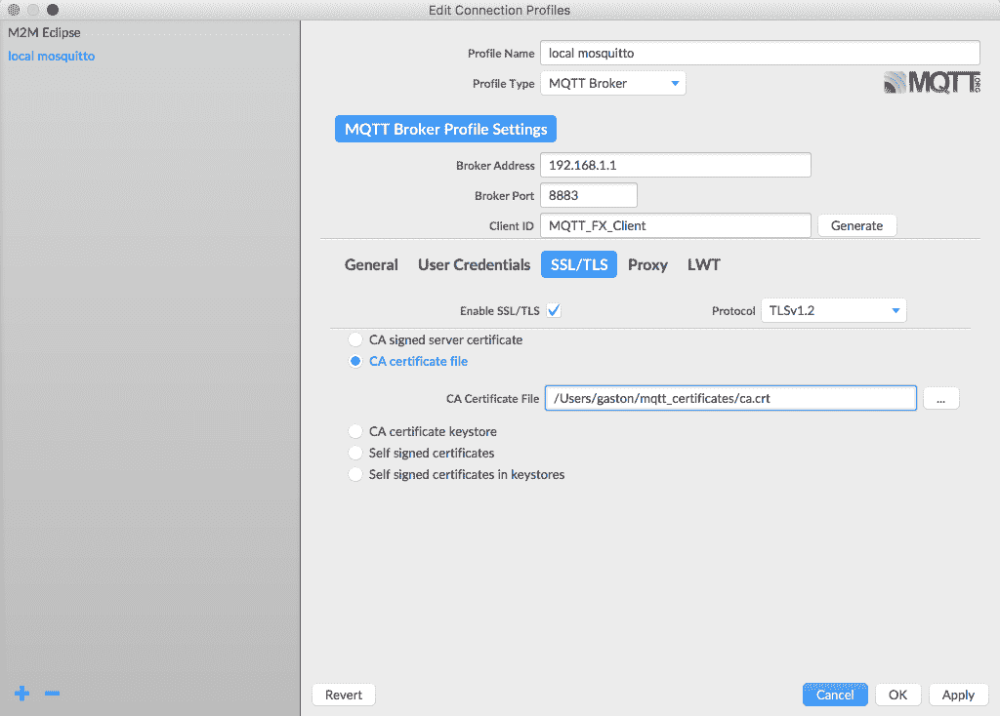
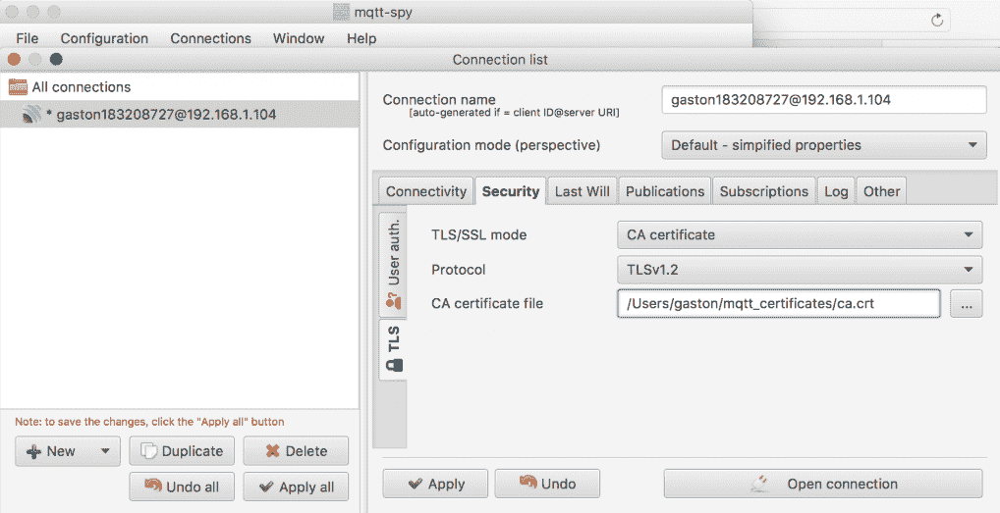
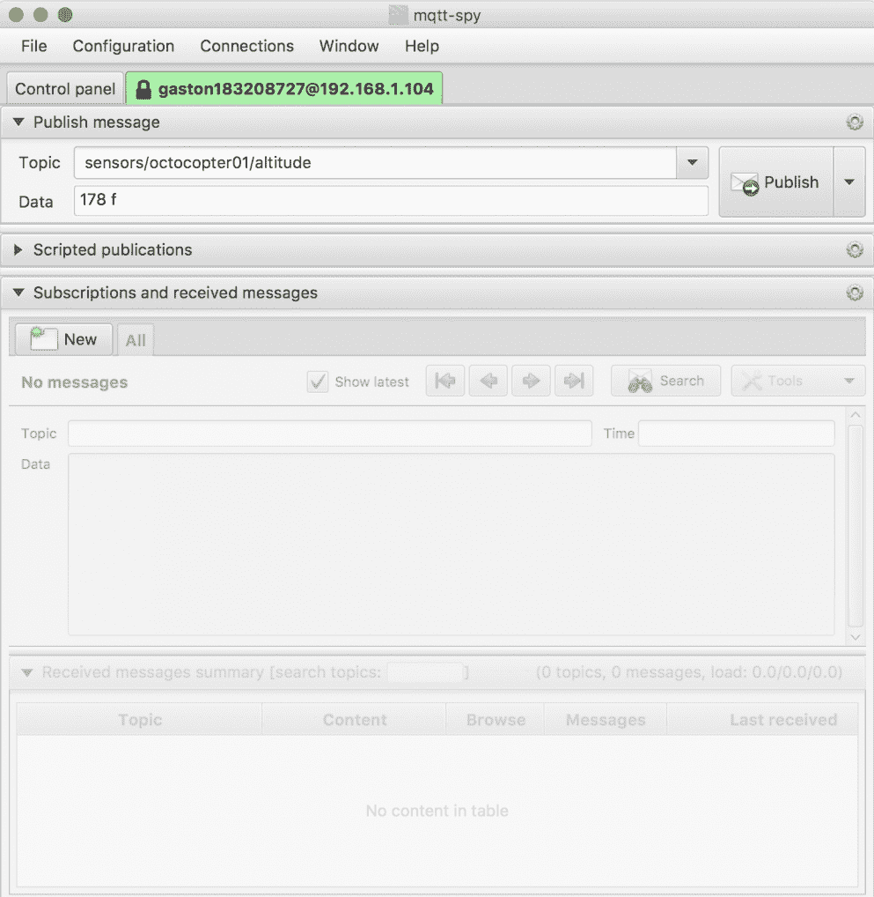
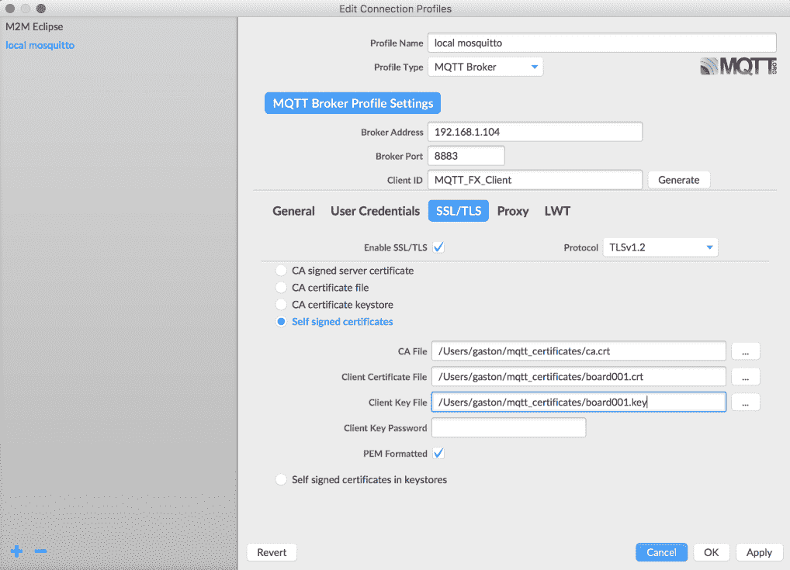
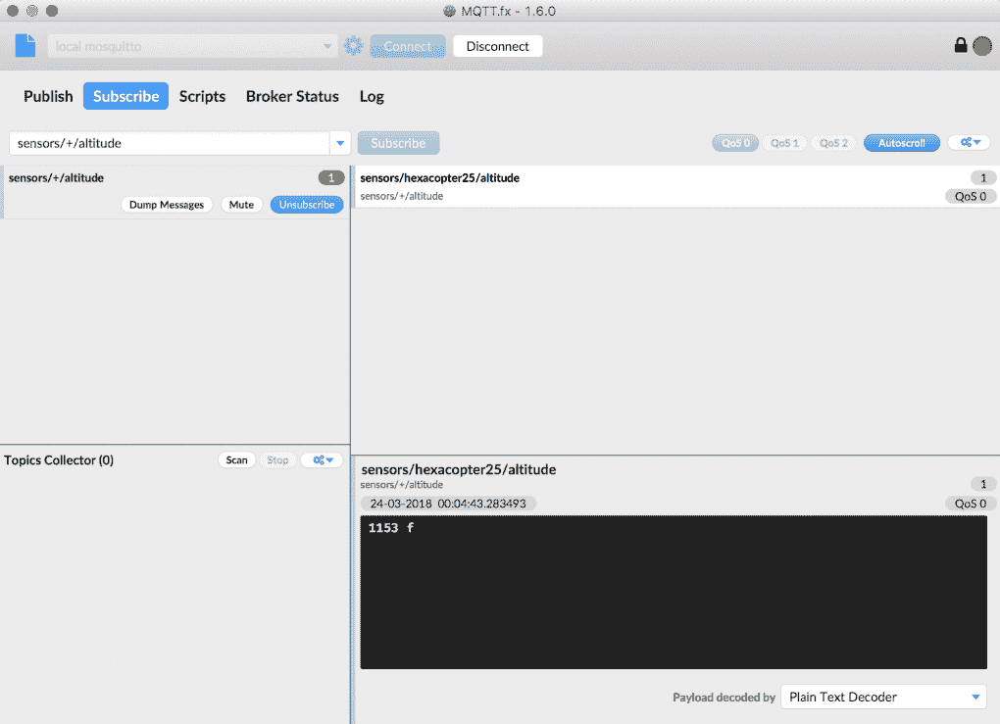
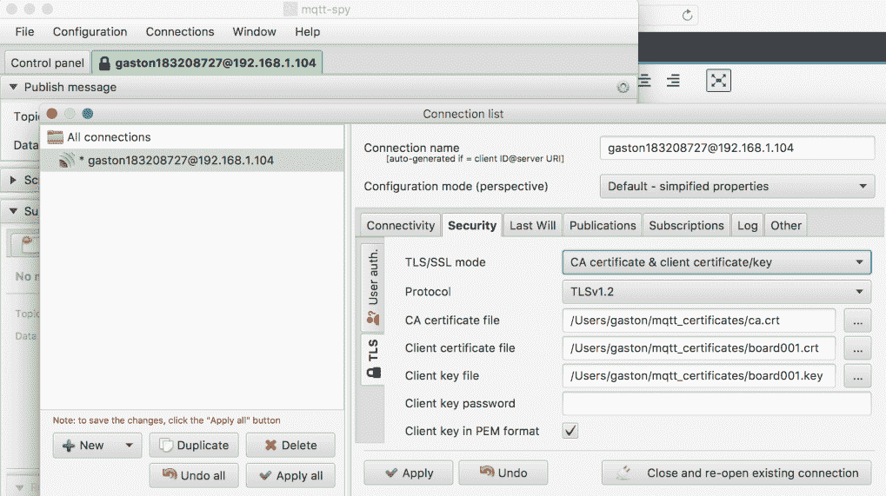

# 第三章：保护 MQTT 3.1.1 Mosquitto 服务器

在本章中，我们将保护 MQTT 3.1.1 Mosquitto 服务器。我们将进行所有必要的配置，以使用数字证书加密 MQTT 客户端和服务器之间发送的所有数据。我们将使用 TLS，并学习如何为每个 MQTT 客户端使用客户端证书。我们还将学习如何强制所需的 TLS 协议版本。我们将了解以下内容：

+   保护 Mosquitto 服务器的重要性

+   生成用于与 Mosquitto 使用 TLS 的私有证书颁发机构

+   为 Mosquitto 服务器创建证书

+   在 Mosquitto 中配置 TLS 传输安全性

+   使用命令行工具测试 MQTT TLS 配置

+   使用 GUI 工具测试 MQTT TLS 配置

+   为每个 MQTT 客户端创建证书

+   在 Mosquitto 中配置 TLS 客户端证书认证

+   使用命令行工具测试 MQTT TLS 客户端认证

+   使用 GUI 工具测试 MQTT TLS 配置

+   强制 TLS 协议版本为特定数字

# 理解保护 Mosquitto 服务器的重要性

物联网应用程序的安全性是一个非常重要的话题，值得有很多专门的书籍来讨论。每个解决方案都有自己的安全要求，当开发解决方案的每个组件时，考虑所有这些要求非常重要。

如果我们使用 MQTT 发布既不机密也不关键的值，我们唯一关心的可能是控制每个主题的最大订阅者数量，以确保消息始终可用。这样，我们可以防止 MQTT 服务器无法向大量订阅者传递消息。

然而，大多数情况下，我们不会在一个可以无限制地与整个世界共享数据并且不需要关心数据机密性和完整性以及数据可用性的解决方案上工作。想象一下，我们正在开发一个允许用户控制一个巨大的八旋翼无人机的解决方案。如果无人机飞错了方向，我们可能会对真实的人造成伤害。我们不能允许任何未知的发布者能够向允许我们控制八旋翼的主题发送消息。我们必须确保正确的人在控制八旋翼，并且作为消息的一部分发送的命令不能被中间的入侵者更改；也就是说，我们需要数据完整性。

不同级别的安全性都是有代价的；也就是说，总是会有额外的开销。因此，我们应该始终保持平衡，以避免可能使整个解决方案不可行和无法使用的开销。每当我们增加更多的安全性时，我们将需要额外的带宽，并且我们将在客户端和服务器中增加处理开销。我们必须考虑到，一些在现代智能手机上可以无问题运行的加密算法并不适合处理能力受限的物联网板。有时，安全要求可能会迫使我们使用特定的硬件，比如更强大的物联网板。在购买解决方案的所有硬件之前，我们绝对必须考虑安全性。

我们必须考虑的另一件重要事情是，许多安全级别需要维护任务，在某些情况下可能是不可行的，或者在其他情况下可能非常难以实现。例如，如果我们决定为每个将成为 MQTT 服务器客户端的设备使用证书，我们将不得不为每个设备生成和分发证书。我们必须访问设备的文件系统，将新文件复制到其中。如果我们必须使证书无效，就需要为受影响的设备提供新的证书。考虑一种情况，所有设备分布在难以访问的不同位置；我们必须有一种机制来远程访问设备，并能够为其提供新的证书。这项任务还需要安全性，因为我们不希望任何人都能访问设备的文件系统。因此，一旦我们开始分析所有安全要求和可能必要的维护任务，事情可能变得非常复杂。

每个 MQTT 服务器或代理实现都可以提供特定的安全功能。我们将使用 Mosquitto 开箱即用提供的一些功能。特定的安全要求可能会使我们决定使用特定的 MQTT 服务器或代理实现。

当我们使用 Mosquitto 时，我们可以在以下级别实施安全性：

+   **网络**：我们可以使用 VPN（虚拟专用网络）在互联网上扩展私有网络。

+   **传输**：MQTT 使用 TCP 作为传输协议，因此默认情况下通信不加密。**TLS**（传输层安全）通常被称为 TLS/SSL，因为**SSL**（安全套接字层）是其前身。我们可以使用 TLS 来保护和加密 MQTT 客户端和 MQTT 服务器之间的通信。使用 TLS 与 MQTT 有时被称为 MQTTS。TLS 允许我们同时提供隐私和数据完整性。我们可以使用 TLS 客户端证书来提供身份验证。

+   **应用**：在这个级别，我们可以利用 MQTT 中包含的功能来提供应用级别的身份验证和授权。我们可以使用`ClientId`（客户端标识符）来标识每个客户端，并将其与用户名和密码身份验证结合使用。我们可以在这个级别添加额外的安全机制。例如，我们可以加密消息有效载荷和/或添加完整性检查以确保数据完整性。但是，主题仍将是未加密的，因此 TLS 是确保一切都加密的唯一方法。我们可以使用插件来提供更复杂的身份验证和授权机制。我们可以授予或拒绝每个用户的权限，以控制他们可以订阅哪些主题以及他们可以向哪些主题发布消息。

大多数流行的 MQTT 实现都支持 TLS。但是，在选择适合您解决方案的 MQTT 服务器之前，请确保您检查其功能。

我们不会涵盖所有安全主题，因为这将需要一个或多个专门致力于这些主题的整本书。相反，我们将首先专注于传输级别安全中最常用的功能，然后再转向应用级别安全。VPN 的使用超出了本书的全局范围。但是，您必须根据您的特定需求考虑其使用。我们将在示例中使用 Mosquitto，但您可以为任何其他决定使用的 MQTT 服务器遵循许多类似的程序。我们将学到的一切对于任何其他提供与我们将与 Mosquitto 一起使用的相同安全功能支持的 MQTT 服务器都将是有用的。

# 使用 Mosquitto 生成私有证书颁发机构以使用 TLS

到目前为止，我们一直在使用其默认配置的 Mosquitto 服务器，它在端口`1883`上监听，并使用纯 TCP 作为传输协议。每个 MQTT 客户端和 MQTT 服务器之间发送的数据都没有加密。订阅者或发布者没有任何限制。如果我们打开防火墙端口并在路由器中重定向端口，或者为运行 MQTT 服务器的基于云的虚拟机配置端口安全性，任何具有 MQTT 服务器的 IP 地址或主机名的 MQTT 客户端都可以发布到任何主题并订阅任何主题。

在我们的示例中第二章中，*使用命令行和 GUI 工具学习 MQTT 的工作原理*，我们没有对允许连接到端口 1883 的传入连接进行任何更改，因此我们没有将我们的 Mosquitto 服务器开放到互联网。

我们希望在我们的开发环境中使用 TLS 与 MQTT 和 Mosquitto。这样，我们将确保我们可以信任 MQTT 服务器，因为我们相信它是它所说的那样，我们的数据将是私密的，因为它将被加密，它将具有完整性，因为它不会被篡改。如果您有*HTTP*协议的经验，您会意识到我们所做的转变与我们从使用*HTTP*转移到*HTTPS*时所做的转变是一样的。

网站从主要的证书颁发机构购买证书。如果我们想为服务器使用购买的证书，我们就不需要生成自己的证书。事实上，当我们有一个公开的 MQTT 服务器并且转移到生产环境时，这是最方便的选择。

在这种情况下，我们将使用免费的 OpenSSL 实用程序为服务器生成必要的证书，以便在我们的开发环境中启用 TLS 与 Mosquitto。非常重要的是要注意，我们不会生成一个生产就绪的配置，我们专注于一个安全的开发环境，它将模拟一个安全的生产环境。

OpenSSL 已经安装在 macOS 和大多数现代 Linux 发行版中。在 Windows 中，我们已经将 OpenSSL 安装为 Mosquitto 的先决条件之一。使用 OpenSSL 实用程序需要一本完整的书，因此我们将专注于使用最常见的选项生成我们需要的证书。如果您有特定的安全需求，请确保您探索使用 OpenSSL 实现您的目标所需的选项。

具体来说，我们将生成一个使用 X.509 **PKI**（公钥基础设施的缩写）标准的 X.509 数字证书。这个数字证书允许我们确认特定的公钥属于证书中包含的主体。有一个发行证书的身份，它的详细信息也包含在证书中。

数字证书仅在特定期限内有效，因此我们必须考虑数字证书某一天会过期，我们将不得不提供新的证书来替换过期的证书。根据我们使用的特定 X.509 版本，证书有特定的数据要求。根据版本和我们用来生成证书的选项，我们可能需要提供特定的数据。

我们将运行命令来生成不同的 X.509 数字证书，并提供将包含在证书中的所有必要细节。我们将在创建证书时了解证书将具有的所有数据。

我们将创建我们自己的私有证书颁发机构，也称为 CA。我们将创建一个根证书，然后我们将生成服务器密钥。

检查您安装 OpenSSL 的目录或文件夹。

在 macOS 上，OpenSSL 安装在`/usr/bin/openssl`中。但是，这是一个旧版本，需要在运行命令之前安装一个新版本。可以使用`homebrew`软件包管理器安装新版本，并且您将能够在另一个目录中运行新版本。例如，使用`homebrew`安装的版本 1.0.2n 的路径将在`/usr/local/Cellar/openssl/1.0.2n/bin/openssl`中。确保您不使用默认的旧版本。

在 Windows 中，我们安装为 Mosquitto 先决条件的 OpenSSL 版本，在[第二章](https://cdp.packtpub.com/hands_on_mqtt_programming_with_python/wp-admin/post.php?post=26&action=edit#post_25)中，*使用命令行和 GUI 工具学习 MQTT 工作*，默认的`C:\OpenSSL-Win32\bin`文件夹中有`openssl.exe`可执行文件。如果您使用 Windows，可以使用命令提示符或 Windows PowerShell。

在任何操作系统中，使用下一个以`openssl`开头的命令中适当的 OpenSSL 版本的完整路径。

创建一个名为`mosquitto_certificates`的新目录，并更改此目录的必要权限，以确保您只能访问其内容。

在 macOS 或 Linux 中打开终端，或者在 Windows 中打开命令提示符，并转到之前创建的`mosquitto_certificates`目录。运行以下命令来创建一个 2,048 位的根密钥，并将其保存在`ca.key`文件中：

```py
openssl genrsa -out ca.key 2048
```

以下行显示了上一个命令生成的示例输出：

```py
Generating RSA private key, 2048 bit long modulus
......+++
.............+++
e is 65537 (0x010001)
```

上一个命令将在`ca.key`文件中生成私有根密钥。确保您保持此文件私密，因为任何拥有此文件的人都将能够生成证书。也可以使用`openssl`的其他选项来保护此文件的密码。但是，如前所述，我们将遵循使用 TLS 的必要步骤，您可以探索与 OpenSSL 和证书相关的其他选项。

转到 macOS 或 Linux 中的终端，或者在 Windows 中的命令提示符中。运行以下命令以自签名根证书。下一个命令使用先前创建的 2,048 位私钥保存在`ca.key`文件中，并生成一个带有自签名 X.509 数字证书的`ca.crt`文件。该命令使自签名证书在`3650`天内有效。该值在`-days`选项之后指定：

```py
openssl req -x509 -new -nodes -key ca.key -sha256 -days 3650 -out ca.crt
```

在这种情况下，我们指定了`-sha256`选项来使用 SHA-256 哈希函数。如果我们想要增加安全性，我们可以在所有使用`-sha256`的情况下使用`-sha512`选项。这样，我们将使用 SHA-512 哈希函数。然而，我们必须考虑到 SHA-512 可能不适合某些功耗受限的物联网设备。

在输入上述命令后，OpenSSL 会要求输入将被合并到证书中的信息。您必须输入信息并按*Enter*。如果您不想输入特定信息，只需输入一个点(`.`)并按*Enter*。可以将所有值作为`openssl`命令的参数传递，但这样做会使我们难以理解我们正在做什么。事实上，也可以使用更少的调用`openssl`命令来执行前面的任务。但是，我们运行了更多的步骤来理解我们正在做什么。

以下行显示了示例输出和带有示例答案的问题。请记住，我们正在生成我们的私有证书颁发机构：

```py
You are about to be asked to enter information that will be incorporated
into your certificate request.
What you are about to enter is what is called a Distinguished Name or a DN.
There are quite a few fields but you can leave some blank
For some fields there will be a default value,
If you enter '.', the field will be left blank.
-----
Country Name (2 letter code) [AU]:US
State or Province Name (full name) [Some-State]:NEW YORK CITY
Locality Name (eg, city) []:NEW YORK
Organization Name (eg, company) [Internet Widgits Pty Ltd]:MOSQUITTO CERTIFICATE AUTHORITY
Organizational Unit Name (eg, section) []:
Common Name (e.g. server FQDN or YOUR name) []:MOSQUITTO CERTIFICATE AUTHORITY
Email Address []:mosquittoca@example.com
```

运行以下命令以显示最近生成的证书颁发机构证书文件的数据和详细信息：

```py
Certificate:
 Data:
 Version: 3 (0x2)
 Serial Number:
 96:f6:f6:36:ad:63:b2:1f
 Signature Algorithm: sha256WithRSAEncryption
 Issuer: C = US, ST = NEW YORK, L = NEW YORK, O = MOSQUITTO 
        CERTIFICATE AUTHORITY, CN = MOSQUITTO CERTIFICATE AUTHORITY, 
        emailAddress = mosquittoca@example.com
 Validity
 Not Before: Mar 22 15:43:23 2018 GMT
 Not After : Mar 19 15:43:23 2028 GMT
 Subject: C = US, ST = NEW YORK, L = NEW YORK, O = MOSQUITTO 
            CERTIFICATE AUTHORITY, CN = MOSQUITTO CERTIFICATE 
            AUTHORITY, emailAddress = mosquittoca@example.com
 Subject Public Key Info:
 Public Key Algorithm: rsaEncryption
 Public-Key: (2048 bit)
 Modulus:
 00:c0:45:aa:43:d4:76:e7:dc:58:9b:19:85:5d:35:
 54:2f:58:61:72:6a:42:81:f9:64:1b:51:18:e1:95:
 ba:50:99:56:c5:9a:c2:fe:07:8e:26:12:47:a6:be:
 8b:ce:23:bf:4e:5a:ea:ab:2e:51:99:0f:23:ea:38:
 68:f3:80:16:5d:5f:51:cf:ce:ee:c9:e9:3a:34:ac:
 ee:24:a6:50:31:59:c5:db:75:b3:33:0e:96:31:23:
 1b:9c:6f:2f:96:1f:6d:cc:5c:4e:20:10:9e:f2:4e:
 a9:f6:31:83:54:11:b6:af:86:0e:e0:af:69:a5:b3:
 f2:5a:b5:da:b6:64:73:87:86:bb:e0:be:b3:10:9f:
 ef:91:8f:e5:68:8c:ab:38:75:8d:e1:33:bc:fb:00:
 d8:d6:d2:d3:6e:e3:a0:3f:08:b6:9e:d6:da:94:ad:
 61:74:90:6c:71:98:88:e8:e1:2b:2d:b1:18:bb:6d:
 b8:65:43:cf:ac:79:ab:a7:a4:3b:65:a8:8a:6f:be:
 c1:66:71:d6:9c:2d:d5:0e:81:13:69:23:65:fa:d3:
 cb:79:e5:75:ea:a2:22:72:c7:e4:f7:5c:be:e7:64:
 9b:54:17:dd:ca:43:7f:93:be:b6:39:20:e7:f1:21:
 0f:a7:e6:24:99:57:9b:02:1b:6d:e4:e5:ee:ad:76:
 2f:69
 Exponent: 65537 (0x10001)
 X509v3 extensions:
 X509v3 Subject Key Identifier:
 F7:C7:9E:9D:D9:F2:9D:38:2F:7C:A6:8F:C5:07:56:57:48:7D:07:35
 X509v3 Authority Key Identifier: keyid:F7:C7:9E:9D:D9:F2:9D:38:2F:7C:A6:8F:C5:07:56:57:48:7D:07:35
 X509v3 Basic Constraints: critical
 CA:TRUE
 Signature Algorithm: sha256WithRSAEncryption
 a2:64:5d:7b:f4:85:81:f7:d0:30:8b:8d:7c:83:83:63:2c:4e:
 a8:56:fb:fc:f0:4f:d4:d8:9c:cd:ac:c7:e9:bc:4b:b5:87:9e:
 02:0b:9f:e0:4b:a3:da:3f:84:b4:1c:e3:42:d4:9f:4e:c0:29:
 f7:ae:18:d3:2d:bf:93:e2:2b:5c:d9:9a:82:53:d8:6a:fb:c8:
 47:9f:02:d4:05:11:e9:8f:2a:54:09:c4:a4:f1:00:eb:35:1d:
 6b:e9:55:3b:4b:a6:27:d0:52:cf:86:c1:03:32:ce:22:41:55:
 32:1e:93:4f:6b:a5:b5:19:9e:8c:a7:de:91:2b:2c:c6:95:a9:
 b6:44:18:e7:40:23:38:87:5d:89:b6:25:d7:32:60:28:0b:41:
 5b:6e:46:20:bf:36:9d:ba:26:6d:63:71:0f:fd:c3:e3:0d:6b:
 b6:84:34:06:ea:67:7c:4e:2e:df:fe:b6:ec:48:f5:7b:b5:06:
 c5:ad:6f:3e:0c:25:2b:a3:9d:49:f7:d4:b7:69:9e:3e:ca:f8:
 65:f2:77:ae:50:63:2b:48:e0:72:93:a7:60:99:b7:40:52:ab:
 6f:00:78:89:ad:92:82:93:e3:30:ab:ac:24:e7:82:7f:51:c7:
 2d:e7:e1:2d:3f:4d:c1:5c:27:15:d9:bc:81:7b:00:a0:75:07:
 99:ee:78:70
```

在运行上述命令之后，我们将在`mqtt_certificates`目录中有以下两个文件：

+   `ca.key`：证书颁发机构密钥

+   `ca.crt`：证书颁发机构证书文件

证书颁发机构证书文件采用**PEM**（即**隐私增强邮件**）格式。我们必须记住这种格式，因为一些 MQTT 工具将要求我们指定证书是否采用 PEM 格式。在此选项中输入错误的值将不允许 MQTT 客户端与使用 PEM 格式证书的 MQTT 服务器建立连接。

# 为 Mosquitto 服务器创建证书

现在我们有了一个私有证书颁发机构，我们可以为 Mosquitto 服务器创建证书，也就是为将运行 MQTT 服务器的计算机创建证书。

首先，我们必须生成一个新的私钥，该私钥将与我们为自己的私有证书颁发机构生成的私钥不同。

转到 macOS 或 Linux 中的终端，或者 Windows 中的命令提示符。运行以下命令以创建一个 2048 位密钥并将其保存在`server.key`文件中：

```py
openssl genrsa -out server.key 2048
```

以下行显示了由上一个命令生成的示例输出：

```py
Generating RSA private key, 2048 bit long modulus
..................................................................................................+++
..............................................................................................................................+++
e is 65537 (0x010001)
```

上一个命令将在`server.key`文件中生成私钥。返回到 macOS 或 Linux 中的终端，或者 Windows 中的命令提示符。运行以下命令以生成证书签名请求。下一个命令使用先前创建的 2048 位私钥保存在`server.key`文件中，并生成`server.csr`文件：

```py
openssl req -new -key server.key -out server.csr
```

输入上述命令后，OpenSSL 会要求输入将纳入证书中的信息。您必须输入信息并按*Enter*。如果您不想输入特定信息，只需输入一个点（`.`）并按*Enter*。在这种情况下，最重要的值是通用名称。在此字段中，输入运行 Mosquitto 服务器的计算机的 IPv4 或 IPv6 地址，而不是下一行中显示的`192.168.1.1`值。以下行显示了示例输出和示例答案的问题。不要忘记输入通用名称的适当值：

```py
You are about to be asked to enter information that will be incorporated
into your certificate request.
What you are about to enter is what is called a Distinguished Name or a DN.
There are quite a few fields but you can leave some blank
For some fields there will be a default value,
If you enter '.', the field will be left blank.
-----
Country Name (2 letter code) [AU]:US
State or Province Name (full name) [Some-State]:FLORIDA
Locality Name (eg, city) []:ORLANDO
Organization Name (eg, company) [Internet Widgits Pty Ltd]:MQTT 3.1.1 SERVER
Organizational Unit Name (eg, section) []:MQTT
Common Name (e.g. server FQDN or YOUR name) []:192.168.1.1
Email Address []:mosquittoserver@example.com

Please enter the following 'extra' attributes
to be sent with your certificate request
A challenge password []:
An optional company name []:Mosquitto MQTT Server
```

转到 macOS 或 Linux 中的终端，或者 Windows 中的命令提示符。运行以下命令以签署先前创建的证书签名请求，即`server.csr`文件。下一个命令还使用了我们之前生成的自签名 X.509 数字证书的证书颁发机构和私钥：`ca.crt`和`ca.key`文件。

该命令生成了一个带有 Mosquitto 服务器签名的 X.509 数字证书的`server.crt`文件。该命令使签名证书有效期为 3650 天。该值在`-days`选项之后指定：

```py
openssl x509 -req -in server.csr -CA ca.crt -CAkey ca.key -CAcreateserial -out server.crt -days 3650 -sha256
```

与我们为证书颁发机构创建自签名 X.509 数字证书时一样，我们还指定了`-sha256`选项，以便为 Mosquitto 服务器证书使用 SHA-256 哈希函数。如果您想要使用 SHA-512 哈希函数以增加安全性，可以使用`-sha512`选项代替`-sha256`。

以下行显示了由上一个命令生成的示例输出。在`subject`之后显示的值将在您的配置中有所不同，因为您在生成证书签名请求时输入了自己的值，这些值保存在`server.csr`文件中：

```py
Signature ok
subject=C = US, ST = FLORIDA, L = ORLANDO, O = MQTT 3.1.1 SERVER, OU = MQTT, CN = 192.168.1.1, emailAddress = mosquittoserver@example.com
Getting CA Private Key
```

运行以下命令以显示生成的服务器证书文件的数据和详细信息：

```py
openssl x509 -in server.crt -noout -text
```

以下行显示了显示有关签名算法、颁发者、有效性、主题和签名算法的详细信息的示例输出：

```py
Certificate:
 Data:
 Version: 1 (0x0)
 Serial Number:
 a1:fa:a7:26:53:da:24:0b
 Signature Algorithm: sha256WithRSAEncryption
 Issuer: C = US, ST = NEW YORK, L = NEW YORK, O = MOSQUITTO     
        CERTIFICATE AUTHORITY, CN = MOSQUITTO CERTIFICATE AUTHORITY, 
        emailAddress = mosquittoca@example.com
 Validity
 Not Before: Mar 22 18:20:01 2018 GMT
 Not After : Mar 19 18:20:01 2028 GMT
 Subject: C = US, ST = FLORIDA, L = ORLANDO, O = MQTT 3.1.1 
        SERVER, OU = MQTT, CN = 192.168.1.1, emailAddress = 
        mosquittoserver@example.com
 Subject Public Key Info:
 Public Key Algorithm: rsaEncryption
 Public-Key: (2048 bit)
 Modulus:
 00:f5:8b:3e:76:0a:ab:65:d2:ee:3e:47:6e:dc:be:
 74:7e:96:5c:93:25:45:54:a4:97:bc:4d:34:3b:ed:
 33:89:39:f4:df:8b:cd:9f:63:fa:4d:d4:01:c8:a5:
 0b:4f:c7:0d:35:a0:9a:20:4f:66:be:0e:4e:f7:1a:
 bc:4a:86:a7:1f:69:30:36:01:2f:93:e6:ff:8f:ca:
 1f:d0:58:fa:37:e0:90:5f:f8:06:7c:2c:1c:c7:21:
 c8:b4:12:d4:b7:b1:4e:5e:6d:41:68:f3:dd:03:33:
 f5:d5:e3:de:37:08:c4:5f:8c:db:21:a2:d7:20:12:
 f2:a4:81:20:3d:e4:d7:af:81:32:82:31:a2:2b:fd:
 02:c2:ee:a0:fa:53:1b:ca:2d:43:b3:7e:b7:b8:12:
 9c:3e:26:66:cd:90:34:ba:aa:6b:ad:e4:eb:0d:15:
 cf:0b:ce:f6:b1:07:1f:7c:33:05:11:4b:57:6c:48:
 0d:f8:e5:f3:d3:f0:88:92:53:ec:3e:04:d7:fc:81:
 75:5e:ef:01:56:f1:66:fe:a4:34:9b:13:8a:b6:5d:
 cc:8f:72:11:0e:9c:c9:65:71:e3:dd:0e:5a:b7:9d:
 8f:18:3e:09:62:52:5f:fa:a5:96:4d:2b:35:23:26:
 ca:74:5d:f9:04:64:f1:f8:f6:f6:7a:d7:31:4c:b7:
 e8:53
 Exponent: 65537 (0x10001)
 Signature Algorithm: sha256WithRSAEncryption
 9c:2f:b5:f9:fa:06:9f:a3:1e:a3:38:94:a7:aa:4c:11:e9:30:
 2e:4b:cf:16:a3:c6:46:ad:e5:3b:d9:43:f0:41:37:62:93:94:
 72:56:1a:dd:27:50:f7:89:2f:4b:56:55:59:d6:da:2e:8f:0a:
 d8:1e:dd:41:0e:1c:36:1b:eb:8d:32:2c:24:ef:58:93:18:e1:
 fc:ce:71:f6:b2:ed:84:5e:06:52:b8:f1:87:f3:13:ca:b9:41:
 3f:a2:1d:a0:52:5d:52:37:6c:2b:8c:28:ab:7f:7d:ed:fc:07:
 9f:60:8b:ad:3d:48:17:95:fe:20:b8:96:87:44:9a:32:b8:9c:
 a8:d7:3c:cf:98:ba:a4:5c:c9:6e:0c:10:ee:45:3a:23:4a:e8:
 34:28:63:c4:8e:6e:1b:d9:a0:1b:e5:cc:33:69:ae:6f:e1:bb:
 99:df:04:fa:c9:bd:8c:c5:c7:e9:a9:fd:f2:dc:2c:b3:a9:7c:
 8a:ef:bf:66:f6:09:01:9a:0e:8f:27:a4:a1:45:f7:90:d2:bb:
 6d:4f:12:46:56:29:85:cd:c8:d6:d7:d3:60:e4:d1:27:a3:88:
 52:41:6a:7d:b2:06:8e:10:ec:ae:b5:7e:58:3e:ae:33:7c:f7:
 3a:21:a6:ae:61:5f:4d:c8:44:86:48:3d:c4:32:f2:db:05:e9:
 c9:f1:0c:be
```

运行上述命令后，我们将在`mqtt_certificates`目录中有以下三个文件：

+   `server.key`：服务器密钥

+   `server.csr`：服务器证书签名请求

+   `server.crt`：服务器证书文件

服务器证书文件采用 PEM 格式，证书颁发机构证书文件也是如此。

# 在 Mosquitto 中配置 TLS 传输安全

现在，我们将配置 Mosquitto 使用 TLS 传输安全，并与不同客户端进行加密通信。请注意，我们尚未为客户端生成证书，因此我们不会使用客户端证书进行身份验证。这样，任何拥有`ca.crt`文件的客户端都将能够与 Mosquitto 服务器建立通信。

转到 Mosquitto 安装目录，并创建一个名为`certificates`的新子目录。在 Windows 中，您需要管理员权限才能访问默认安装文件夹。

从`mqtt_certificates`目录中复制以下文件（我们在其中保存了证书颁发机构证书和服务器证书）到我们最近在 Mosquitto 安装目录中创建的`certificates`子目录：

+   `ca.crt`

+   `server.crt`

+   `server.key`

如果您在 macOS 或 Linux 的终端窗口中运行 Mosquitto 服务器，请按下*Ctrl* + *C*来停止它。在 Windows 中，使用*Services*应用程序停止适当的服务。如果您在 Linux 中运行 Mosquitto 服务器，请运行以下命令停止服务：

```py
sudo service mosquitto stop
```

转到 Mosquitto 安装目录，并使用您喜欢的文本编辑器打开`mosquitto.conf`配置文件。默认情况下，此文件的所有行都被注释掉，即以井号(`#`)开头。每个设置的默认值已指示，并包括适当的注释。这样，我们很容易知道所有默认值。设置按不同部分组织。

在对其进行更改之前，最好先备份现有的`mosquitto.conf`配置文件。每当我们对`mosquitto.conf`进行更改时，如果出现问题，能够轻松回滚到先前的配置是一个好主意。

在 macOS 或 Linux 中，在配置文件的末尾添加以下行，并确保将`/usr/local/etc/mosquitto/certificates`替换为我们在`Mosquitto`安装文件夹中创建的`certificates`目录的完整路径：

```py
# MQTT over TLS
listener 8883
cafile /usr/local/etc/mosquitto/certificates/ca.crt
certfile /usr/local/etc/mosquitto/certificates/server.crt
keyfile /usr/local/etc/mosquitto/certificates/server.key
```

在 Windows 中，在配置文件的末尾添加以下行，并确保将`C:\Program Files (x86)\mosquitto\certificates`替换为我们在`Mosquitto`安装文件夹中创建的`certificates`目录的完整路径。请注意，当您运行文本编辑器打开文件时，您将需要管理员权限；也就是说，您将需要以管理员身份运行文本编辑器：

```py
# MQTT over TLS
listener 8883
cafile C:\Program Files (x86)\mosquitto\certificates\ca.crt
certfile C:\Program Files (x86)\mosquitto\certificates\server.crt
keyfile C:\Program Files (x86)\mosquitto\certificates\server.key
```

我们为监听器选项指定了`8883`值，以使 Mosquitto 在 TCP 端口号`8883`上监听传入的网络连接。此端口是具有 TLS 的 MQTT 的默认端口号。

`cafile`选项指定提供 PEM 编码证书颁发机构证书文件`ca.crt`的完整路径。

`certfile`选项指定提供 PEM 编码服务器证书`server.crt`的完整路径。

最后，`keyfile`选项指定提供 PEM 编码服务器密钥文件`server.key`的完整路径。

保存更改到`mosquitto.conf`配置文件，并使用我们在上一章中学到的相同机制再次启动 Mosquitto，以在端口`8883`而不是`1883`上监听 Mosquitto 服务器。

# 使用命令行工具测试 MQTT TLS 配置

我们将使用 Mosquitto 中包含的`mosquitto_sub`命令行实用程序尝试生成一个简单的 MQTT 客户端，该客户端订阅一个主题并打印其接收到的所有消息。我们将使用默认配置，尝试使用默认的`1883`端口与 Mosquitto 服务器建立通信，而不指定证书颁发机构证书。在 macOS 或 Linux 中打开终端，或在 Windows 中打开命令提示符，转到 Mosquitto 安装的目录，并运行以下命令：

```py
mosquitto_sub -V mqttv311 -t sensors/octocopter01/altitude -d
```

`mosquitto_sub`实用程序将显示以下错误。Mosquitto 服务器不再接受端口`1883`上的任何连接。请注意，错误消息可能因平台而异：

```py
Error: No connection could be made because the target machine actively refused it.
```

使用`-p`选项运行以下命令，后跟我们要使用的端口号：`8883`。这样，我们将尝试连接到端口`8883`，而不是默认端口`1883`：

```py
mosquitto_sub -V mqttv311 -p 8883 -t sensors/octocopter01/altitude -d
```

`mosquitto_sub`实用程序将显示调试消息，指示它正在向 MQTT 服务器发送`CONNECT`数据包。但是，连接将永远不会建立，因为潜在的 MQTT 客户端未提供所需的证书颁发机构。按下*Ctrl* + *C*停止实用程序尝试连接。以下行显示了上一个命令生成的示例输出：

```py
Client mosqsub|14064-LAPTOP-5D sending CONNECT
Client mosqsub|14064-LAPTOP-5D sending CONNECT
Client mosqsub|14064-LAPTOP-5D sending CONNECT
Client mosqsub|14064-LAPTOP-5D sending CONNECT
Client mosqsub|14064-LAPTOP-5D sending CONNECT
Client mosqsub|14064-LAPTOP-5D sending CONNECT
```

以下命令使用`-h`选项，后跟 MQTT 服务器主机。在这种情况下，我们指定运行 Mosquitto MQTT 服务器的计算机的 IPv4 地址：`192.168.1.1`。请注意，此值必须与我们在生成`server.csr`文件时指定为通用名称字段中的 IPv4 或 IPv6 地址相匹配，即服务器证书签名请求。如果您在通用名称字段中使用主机名作为值，而不是 IPv4 或 IPv6 地址，则必须使用相同的主机名。如果`-h`选项指定的值与通用名称字段中指示的值不匹配，则 Mosquitto 服务器将拒绝客户端。因此，请确保您在下一行中用适当的值替换`192.168.1.1`。此外，该命令在`--cafile`选项之后指定证书颁发机构证书文件，并指示我们要使用端口`8883`。您只需将`ca.crt`替换为您在`mqtt_certificates`目录中创建的`ca.crt`文件的完整路径。例如，在 Windows 中可能是`C:\mqtt_certificates\ca.crt`，在 macOS 或 Linux 中可能是`/Users/gaston/mqtt_certificates/ca.crt`。`mosquitto_sub`实用程序将创建一个与 Mosquitto 建立加密连接的 MQTT 订阅者：

```py
mosquitto_sub -h 192.168.1.1 -V mqttv311 -p 8883 --cafile ca.crt -t sensors/octocopter01/altitude -d
```

如果您为`-h`选项指定的值与您在生成`server.csr`文件时指定的通用名称字段中的值不匹配，则将看到以下错误消息作为上一个命令的结果：

```py
Client mosqsub|14064-LAPTOP-5D sending CONNECT
Error: A TLS error occurred.
```

如果命令生成了上一个错误消息，请确保查看生成`server.csr`文件的先前步骤。确保不要将`localhost`用作`-h`选项的值。

使用类似的语法，我们将使用 Mosquitto 中包含的`mosquitto_pub`命令行实用程序生成一个简单的 MQTT 客户端，该客户端将发布消息到一个主题，并使用加密连接。在 macOS 或 Linux 中打开终端，或在 Windows 中打开命令提示符，转到安装 Mosquitto 的目录，并运行以下命令。

请记住在下一行中用适当的值替换`192.168.1.1`。此外，请用`mqtt_certificates`目录中创建的`ca.crt`文件的完整路径替换`ca.crt`：

```py
mosquitto_pub -h 192.168.1.1 -V mqttv311 -p 8883 --cafile ca.crt -t sensors/octocopter01/altitude -m "123 f" -d
```

在命令发布消息后，您将在使用`mosquitto_sub`命令订阅`sensors/octocopter01/altitude`主题的窗口中看到该消息。

# 使用 GUI 工具测试 MQTT TLS 配置

现在，我们将使用 MQTT.fx GUI 实用程序生成另一个 MQTT 客户端，该客户端使用加密连接将消息发布到相同的主题：`sensors/octocopter01/altitude`。我们必须更改连接选项以启用 TLS 并指定证书颁发机构证书文件。请按照以下步骤操作：

1.  启动 MQTT.fx，在左上角的下拉菜单中选择本地 mosquitto，并单击此下拉菜单右侧和连接按钮左侧的配置图标。MQTT.fx 将显示带有不同连接配置文件选项的编辑连接配置文件对话框，名为本地 mosquitto。

1.  转到经纪人地址文本框，并输入我们在生成`server.csr`文件时指定为通用名称字段值的 IPv4 或 IPv6 地址，即服务器证书签名请求。如果您在通用名称字段中使用的是主机名而不是 IPv4 或 IPv6 地址，您将需要使用相同的主机名。如果经纪人地址中指定的值与通用名称字段中指示的值不匹配，Mosquitto 服务器将拒绝客户端。

1.  转到经纪人端口文本框，并输入 8883。

1.  单击 SSL/TLS 按钮。

1.  激活启用 SSL/TLS 复选框。

1.  激活 CA 证书文件单选按钮。

1.  在 CA 证书文件文本框中输入或选择您在 CA 证书文件夹中创建的`ca.crt`文件的完整路径，然后单击确定。以下屏幕截图显示了所选选项的对话框：



1.  单击连接按钮。MQTT.fx 将与本地 Mosquitto 服务器建立加密连接。请注意，连接按钮已禁用，断开按钮已启用，因为客户端已连接到 Mosquitto 服务器。

1.  点击订阅并在订阅按钮左侧的下拉菜单中输入`sensors/octocopter01/altitude`。然后，点击订阅按钮。MQTT.fx 将在左侧显示一个新面板，显示我们已订阅的主题。

1.  单击发布，并在发布按钮左侧的下拉菜单中输入`sensors/octocopter01/altitude`。

1.  在发布按钮下方的文本框中输入以下文本：`250 f`。

1.  然后，单击发布按钮。MQTT.fx 将发布输入的文本到指定的主题。

1.  点击订阅，您将看到已发布的消息。

通过我们对 Mosquitto 服务器所做的配置更改，任何具有证书颁发机构证书文件（即我们生成的`ca.crt`文件）的客户端都将能够与 Mosquitto 建立连接，订阅和发布主题。 MQTT 客户端和 MQTT 服务器之间发送的数据是加密的。在此配置中，我们不需要 MQTT 客户端提供证书进行身份验证。但是，请不要忘记我们正在为开发环境进行配置。我们不应该在生产 Mosquitto 服务器上使用自签名证书。

还有另一个非常受欢迎的 GUI 实用程序，我们可以使用它来生成可以订阅主题和发布主题的 MQTT 客户端：MQTT-spy。该实用程序是开源的，可以在安装了 Java 8 或更高版本的任何计算机上运行。您可以在此处找到有关 MQTT-spy 的更多信息：[`github.com/eclipse/paho.mqtt-spy`](https://github.com/eclipse/paho.mqtt-spy)。使用证书颁发机构证书文件与 MQTT 服务器建立连接的选项与我们为 MQTT.fx 分析的选项类似。但是，如果您还想使用此实用程序，最好详细分析这些选项。

现在，我们将使用 MQTT-spy GUI 实用程序生成另一个使用加密连接发布消息到相同主题`sensors/octocopter01/altitude`的 MQTT 客户端。按照以下步骤：

1.  启动 MQTT-spy。

1.  选择连接 | 新连接。连接列表对话框将出现。

1.  单击连接选项卡，并在协议版本下拉菜单中选择 MQTT 3.1.1。我们希望使用 MQTT 版本 3.1.1。

1.  转到服务器 URI(s)文本框，并输入我们在生成`server.csr`文件时指定为通用名称字段值的 IPv4 或 IPv6 地址，即服务器证书签名请求。如果您在通用名称字段中使用的是主机名而不是 IPv4 或 IPv6 地址，您将需要使用相同的主机名。如果经纪人地址中指定的值与通用名称字段中指示的值不匹配，Mosquitto 服务器将拒绝由 MQTT-spy 实用程序生成的客户端。

1.  点击安全选项卡，在用户认证选项卡下方的 TLS 选项卡中。

1.  在 TLS/SSL 模式下拉菜单中选择 CA 证书。

1.  在协议下拉菜单中选择 TLSv1.2。

1.  输入或选择在`mqtt_certificates`文件夹中创建的`ca.crt`文件的完整路径，然后点击打开连接。以下屏幕截图显示了具有所选选项的对话框：



1.  MQTT-spy 将关闭对话框，并显示一个具有绿色背景的新选项卡，连接名称已在连接列表对话框的左侧突出显示并被选中。确保点击新连接的选项卡。

1.  在主题下拉菜单中输入`sensors/octocopter01/altitude`。

1.  在数据文本框中输入以下文本：`178 f`。以下屏幕截图显示了新连接的选项卡以及在不同控件中输入的数据：



1.  点击发布按钮。MQTT-spy 将向指定主题发布输入的文本，您将能够在 MQTT.fx 订阅者和`mosquitto-sub`订阅者中看到消息。

# 为每个 MQTT 客户端创建证书

现在，我们希望要求每个 MQTT 客户端提供有效的证书以建立与 MQTT 服务器的连接。这样，只有拥有有效证书的客户端才能发布或订阅主题。我们将使用先前创建的私有证书颁发机构来为认证创建客户端证书。

我们将为我们的本地计算机生成一个样本证书，该证书将充当客户端。我们可以按照相同的步骤为我们想要连接到 Mosquitto 服务器的其他设备生成额外的证书。我们只需要为文件使用不同的名称，并在相应的选项中使用不同的设备名称。

我们必须使用与生成服务器证书相同的证书颁发机构证书来生成客户端证书。如前所述，对于生产环境，我们不应该使用自签名证书。这个过程对于开发环境是有用的。

首先，我们必须生成一个新的私钥，该私钥将与我们为自己的私有证书颁发机构和服务器证书生成的私钥不同。

转到 macOS 或 Linux 中的终端，或者 Windows 中的命令提示符。运行以下命令以创建一个 2,048 位的密钥，并将其保存在`board001.key`文件中。要为其他设备重复此过程，请将`board001`替换为标识将使用该证书的设备的任何其他名称。在所有使用`board001`的不同文件名和值的以下命令中都要这样做：

```py
openssl genrsa -out board001.key 2048
```

以下行显示了上一个命令生成的示例输出：

```py
Generating RSA private key, 2048 bit long modulus
..........................................................................................+++
.....................................+++
e is 65537 (0x10001)
```

上一个命令将在`board001.key`文件中生成私钥。

返回到 macOS 或 Linux 中的终端，或者 Windows 中的命令提示符。运行以下命令以生成证书签名请求，也称为 CSR。下一个命令使用先前创建的 2,048 位私钥，保存在`board001.key`文件中，并生成一个`board001.csr`文件：

```py
openssl req -new -key board001.key -out board001.csr
```

在输入上一个命令后，OpenSSL 会要求输入将被合并到证书中的信息。您必须输入信息并按*Enter*。如果您不想输入特定信息，只需输入一个点（.）并按*Enter*。在这种情况下，最重要的值是通用名称。在此字段中输入设备名称：

```py
You are about to be asked to enter information that will be incorporated
into your certificate request.
What you are about to enter is what is called a Distinguished Name or a DN.
There are quite a few fields but you can leave some blank
For some fields there will be a default value,
If you enter '.', the field will be left blank.
-----
Country Name (2 letter code) [AU]:US 
State or Province Name (full name) [Some-State]:CALIFORNIA
Locality Name (eg, city) []:SANTA MONICA
Organization Name (eg, company) [Internet Widgits Pty Ltd]:MQTT BOARD 001
Organizational Unit Name (eg, section) []:MQTT BOARD 001
Common Name (e.g. server FQDN or YOUR name) []:MQTT BOARD 001
Email Address []:mttboard001@example.com

Please enter the following 'extra' attributes
to be sent with your certificate request
A challenge password []:.
An optional company name []:.
```

转到 macOS 或 Linux 中的终端，或者转到 Windows 中的命令提示符。运行以下命令以签署先前创建的证书签名请求，即`board001.csr`文件。下一个命令还使用我们之前生成的自签名 X.509 数字证书用于证书颁发机构和其私钥：`ca.crt`和`ca.key`文件。该命令生成一个带有 MQTT 客户端签名的 X.509 数字证书的`board001.crt`文件。该命令使签名证书在 3,650 天内有效，这是在`-days`选项之后指定的值。`-addTrust clientAuth`选项表示我们要使用证书来验证客户端：

```py
openssl x509 -req -in board001.csr -CA ca.crt -CAkey ca.key -CAcreateserial -out board001.crt -days 3650 -sha256 -addtrust clientAuth
```

以下行显示了先前命令生成的示例输出。在您的配置中，主题后显示的值将不同，因为在生成保存在`board001.csr`文件中的证书签名请求时，您输入了自己的值：

```py
Signature ok
subject=/C=US/ST=CALIFORNIA/L=SANTA MONICA/O=MQTT BOARD 001/OU=MQTT BOARD 001/CN=MQTT BOARD 001/emailAddress=mttboard001@example.com
Getting CA Private Key
```

运行以下命令以显示生成的服务器证书文件的数据和详细信息：

```py
openssl x509 -in board001.crt -noout -text
```

以下行显示了显示有关签名算法、发行者、有效性和主题的详细信息的示例输出：

```py
Certificate:
 Data:
 Version: 1 (0x0)
 Serial Number:
 dd:34:7a:3c:a6:cd:c1:94
 Signature Algorithm: sha256WithRSAEncryption
 Issuer: C=US, ST=CALIFORNIA, L=SAN FRANCISCO, O=CERTIFICATE 
 AUTHORITY, CN=CERTIFICATE 
 AUTHORITY/emailAddress=CERTIFICATE@EXAMPLE.COM
 Validity
 Not Before: Mar 23 22:10:05 2018 GMT
 Not After : Mar 20 22:10:05 2028 GMT
 Subject: C=US, ST=CALIFORNIA, L=SANTA MONICA, O=MQTT BOARD 001, 
 OU=MQTT BOARD 001, CN=MQTT BOARD 
 001/emailAddress=mttboard001@example.com
 Subject Public Key Info:
 Public Key Algorithm: rsaEncryption
 RSA Public Key: (2048 bit)
 Modulus (2048 bit):
 00:d0:9c:dd:9f:3e:db:3f:15:9c:23:40:12:5f:4e:
 56:2a:30:34:df:88:51:d7:ca:61:bb:99:b5:ab:b4:
 a6:61:e9:f1:ed:2e:c3:61:7a:f2:0b:70:5b:24:7a:
 12:3f:cb:5d:76:f7:10:b2:08:24:94:31:0d:80:35:
 78:2c:19:70:8b:c0:fe:c1:cb:b2:13:5e:9a:d3:68:
 5d:4d:78:47:5a:a3:d5:63:cd:3c:2f:8b:b1:48:4d:
 12:11:0b:02:17:f3:4c:56:91:67:9f:98:3d:90:1f:
 47:09:c0:1b:3a:04:09:2f:b9:fe:f1:e9:df:38:35:
 f8:12:ee:59:96:b1:ca:57:90:53:19:2b:4f:d3:45:
 9e:f2:6a:09:95:46:f9:68:6b:c6:4e:89:33:78:4f:
 0f:5b:2f:d3:00:d0:12:d7:ca:92:df:f4:86:6e:22:
 9d:63:a2:f7:de:09:f4:8c:02:ad:03:9c:13:7b:b4:
 9e:03:d6:99:f4:c0:3f:3f:c3:31:52:12:f1:66:cd:
 22:5d:48:fb:7f:ca:ac:84:cf:24:c5:c4:85:af:61:
 de:59:84:a8:e0:fd:ce:44:5d:f2:85:c0:5d:f2:c5:
 ec:71:04:2c:83:94:cd:71:a1:14:1b:f7:e4:1b:b4:
 2f:12:70:cb:b7:17:9e:db:c9:23:d1:56:bd:f5:02:
 c8:3b
 Exponent: 65537 (0x10001)

 Signature Algorithm: sha256WithRSAEncryption
 55:6a:69:0f:3a:e5:6f:d4:16:0a:4f:67:46:ec:36:ea:a4:54:
 db:04:86:e9:48:ed:0e:83:52:56:75:65:f0:85:34:32:75:0a:
 0a:15:13:73:21:a4:a9:9c:89:b4:73:15:06:2a:b3:e8:ab:7b:
 f4:16:37:17:a9:0e:eb:74:1d:78:c8:df:5e:5f:41:af:53:ca:
 a1:94:d8:d2:f5:87:a5:a9:8a:6a:d1:0e:e0:b7:30:92:d2:94:
 98:65:4c:bf:f9:a7:60:f8:c2:df:7c:4e:28:3c:02:f0:d4:a8:
 f7:16:d5:38:88:43:e4:c4:2e:02:72:ee:4b:6f:cd:2a:d7:3b:
 c4:e8:f4:7d:0e:3b:9b:5b:20:00:69:75:76:ce:79:a1:ed:25:
 f7:f1:3c:96:f8:7d:35:dd:5c:f8:4d:d2:04:32:bb:41:b2:3d:
 1a:5d:f6:63:ff:63:48:ec:85:c2:b3:9c:02:d3:ad:17:59:46:
 3e:10:6f:82:2f:d8:ef:6c:a5:42:3f:55:74:bb:f6:17:59:a0:
 39:e5:16:55:a3:f9:5a:b5:04:c0:61:2a:55:32:56:c2:12:0a:
 2c:c8:8a:23:b1:60:d5:a3:93:f3:a0:e4:e0:a8:98:3b:e1:83:
 ea:43:06:bc:d0:96:0b:c2:0b:95:6b:ce:39:02:7f:19:01:ea:
 47:83:25:c5
 Trusted Uses:
 TLS Web Client Authentication
 No Rejected Uses.
```

运行上述命令后，我们将在证书目录中有以下三个新文件：

+   `board001.key`: 客户端密钥

+   `board001.csr`：客户端证书签名请求

+   `board001.crt`：客户端证书文件

客户端证书文件以 PEM 格式存储，证书颁发机构证书文件和服务器证书文件也是如此。

我们将不得不向任何要连接到 Mosquitto 服务器的设备提供以下三个文件：

+   `ca.crt`

+   `board001.crt`

+   `board001.key`

永远不要向必须与 MQTT 服务器建立连接的设备提供额外的文件。您不希望设备能够生成额外的证书。您只希望它们使用有效的证书进行身份验证。

`openssl`实用程序允许我们使用附加的命令行选项为许多参数提供值。因此，可以自动化许多先前的步骤，以便更容易生成多个设备证书。

# 在 Mosquitto 中配置 TLS 客户端证书认证

现在，我们将配置 Mosquitto 以使用 TLS 客户端证书认证。这样，任何客户端都将需要`ca.crt`文件和客户端证书，例如最近生成的`board001.crt`文件，才能与 Mosquitto 服务器建立通信。

如果您在 macOS 或 Linux 的终端窗口中运行 Mosquitto 服务器，请按*Ctrl* + *C*停止它。在 Windows 中，请停止适当的服务。

转到 Mosquitto 安装目录并打开`mosquitto.conf`配置文件。

在 macOS、Linux 或 Windows 中，在配置文件的末尾添加以下行：

```py
require_certificate true
```

我们为`require_certificate`选项指定了`true`值，以使 Mosquitto 要求任何请求与 Mosquitto 建立连接的客户端都需要有效的客户端证书。

保存更改到`mosquitto.conf`配置文件并重新启动 Mosquitto。我们将使用 Mosquitto 中包含的`mosquitto_sub`命令行实用程序生成一个简单的 MQTT 客户端，该客户端订阅主题过滤器并打印其接收到的所有消息。

# 使用命令行工具测试 MQTT TLS 客户端认证

现在，我们将使用 Mosquitto 命令行工具来测试客户端认证配置。

以下命令指定证书颁发机构证书文件、客户端证书和客户端密钥。您必须用证书目录中创建的这些文件的完整路径替换`ca.crt`，`board001.crt`和`board001.key`。但是，最好将这些文件复制到一个新目录，就好像我们正在处理的文件只能供希望与 Mosquitto 建立连接的设备使用。与以前的命令一样，此命令使用`-h`选项，后面跟着 MQTT 服务器主机。在这种情况下，我们指定运行 Mosquitto MQTT 服务器的计算机的 IPv4 地址：`192.168.1.1`。请注意，此值必须与我们在生成`server.csr`文件时指定为值的 IPv4 或 IPv6 地址相匹配，即服务器证书签名请求的`Common Name`字段。如果您在`Common Name`字段中使用主机名作为值，而不是 IPv4 或 IPv6 地址，您将不得不使用相同的主机名。`mosquitto_sub`实用程序将创建一个 MQTT 订阅者，将与 Mosquitto 建立加密连接，并提供客户端证书和客户端密钥以进行身份验证：

```py
mosquitto_sub -h 192.168.1.1 -V mqttv311 -p 8883 --cafile ca.crt --cert board001.crt --key board001.key -t sensors/+/altitude -d
```

使用类似的语法，我们将使用 Mosquitto 中包含的`mosquitto_pub`命令行实用程序生成一个简单的 MQTT 客户端，该客户端将向与先前指定的主题过滤器匹配的主题发布消息，使用加密连接和客户端身份验证。在 macOS 或 Linux 中打开终端，或者在 Windows 中打开命令提示符，转到安装 Mosquitto 的目录，并运行以下命令。记得用`ca.crt`，`board001.crt`和`board001.key`替换`mqtt_certificates`目录中创建的这些文件的完整路径。此外，用我们在生成`server.csr`文件时指定为值的 IPv4 或 IPv6 地址替换 192.168.1.1，即服务器证书签名请求的`Common Name`字段。如果您在`Common Name`字段中使用主机名作为值，而不是 IPv4 或 IPv6 地址，您将不得不使用相同的主机名：

```py
mosquitto_pub -h 192.168.1.1 -V mqttv311 -p 8883 --cafile ca.crt --cert board001.crt --key board001.key -t sensors/quadcopter12/altitude -m "361 f" -d
```

有时，需要使客户端证书失效。Mosquitto 允许我们指定一个 PEM 编码的证书吊销列表文件。我们必须在 Mosquitto 配置文件的`crlfile`选项的值中指定此文件的路径。

# 使用 GUI 工具测试 MQTT TLS 配置

现在，我们将使用 MQTT.fx GUI 实用程序生成另一个 MQTT 客户端，该客户端使用加密连接和 TLS 客户端身份验证来发布消息到与我们用于订阅的主题过滤器匹配的主题`sensors/hexacopter25/altitude`。我们必须对启用 TLS 时使用的连接选项进行更改。我们必须指定客户端证书和客户端密钥文件。按照以下步骤操作：

1.  启动 MQTT.fx，并在连接到 Mosquitto MQTT 服务器时单击断开连接。

1.  在左上角的下拉菜单中选择本地 mosquitto，并单击该下拉菜单右侧和连接按钮左侧的配置图标。MQTT.fx 将显示带有不同连接配置选项的编辑连接配置对话框，名称为本地 mosquitto。

1.  转到 Broker Address 文本框，并输入我们在生成`server.csr`文件时指定为值的 IPv4 或 IPv6 地址，即服务器证书签名请求的`Common Name`字段。如果您在`Common Name`字段中使用主机名作为值，而不是 IPv4 或 IPv6 地址，您将不得不使用相同的主机名。如果 Broker Address 中指定的值与`Common Name`字段中指示的值不匹配，Mosquitto 服务器将拒绝客户端。

1.  单击 SSL/TLS 按钮。

1.  确保启用 SSL/TLS 复选框已激活。

1.  激活自签名证书单选按钮。

1.  在 CA 文件文本框中输入或选择您在`mqtt_certificates`文件夹中创建的`ca.crt`文件的完整路径。

1.  在客户端证书文件文本框中输入或选择您在`mqtt_ertificates`文件夹中创建的`board001.crt`文件的完整路径。

1.  在客户端密钥文件文本框中输入或选择您在`mqtt_certificates`文件夹中创建的`board001.key`文件的完整路径。

1.  确保激活 PEM 格式复选框。以下屏幕截图显示了具有所选选项和不同文本框的示例值的对话框：



1.  单击确定。然后，单击连接按钮。MQTT.fx 将使用我们指定的证书和密钥文件与本地 Mosquitto 服务器建立加密连接。请注意，连接按钮被禁用，断开按钮被启用，因为客户端已连接到 Mosquitto 服务器。

1.  单击订阅并在订阅按钮左侧的下拉菜单中输入`sensors/+/altitude`。然后，单击订阅按钮。MQTT.fx 将在左侧显示一个新面板，其中包含我们已订阅的主题过滤器。

1.  单击发布并在发布按钮左侧的下拉菜单中输入`sensors/hexacopter25/altitude`。

1.  在发布按钮下的文本框中输入以下文本：`1153 f`。

1.  然后，单击发布按钮。MQTT.fx 将向指定的主题发布输入的文本。

1.  单击订阅，您将看到发布的消息，如下图所示：



现在，我们将使用 MQTT-spy GUI 实用程序生成另一个 MQTT 客户端，该客户端使用加密连接发布消息到另一个与`sensors/+/altitude`主题过滤器匹配的主题：`sensors/quadcopter500/altitude`。按照以下步骤：

1.  启动 MQTT-spy。

1.  如果您已经在运行 MQTT-spy 或保存了以前的设置，请选择连接|新连接或连接|管理连接。连接列表对话框将出现。

1.  单击连接选项卡，确保在协议版本下拉菜单中选择了 MQTT 3.1.1。

1.  转到服务器 URI(s)文本框，并输入我们在生成`server.csr`文件时指定为值的 IPv4 或 IPv6 地址，即通用名称字段。如果您在通用名称字段中使用主机名作为值，而不是 IPv4 或 IPv6 地址，则必须使用相同的主机名。如果在经纪人地址中指定的值与通用名称字段中指示的值不匹配，则 Mosquitto 服务器将拒绝 MQTT-spy 实用程序生成的客户端。

1.  单击安全选项卡，然后单击用户 auth.选项卡下方的 TLS 选项卡。

1.  在 TLS/SSL 模式下拉菜单中选择 CA 证书和客户端证书/密钥。

1.  在协议下拉菜单中选择 TLSv1.2。

1.  在 CA 证书文件文本框中输入或选择您在`mqtt_certificates`文件夹中创建的`ca.crt`文件的完整路径。

1.  在客户端证书文件文本框中输入或选择您在`mqtt_ertificates`文件夹中创建的`board001.crt`文件的完整路径。

1.  在客户端密钥文件文本框中输入或选择您在`mqtt_certificates`文件夹中创建的`board001.key`文件的完整路径。

1.  激活 PEM 格式中的客户端密钥复选框。最后，单击打开连接或关闭并重新打开现有连接。以下屏幕截图显示了具有所选选项和文本框示例值的对话框：



1.  MQTT-spy 将关闭对话框，并显示一个具有绿色背景和在连接列表对话框中出现的连接名称的新选项卡。确保单击新连接的选项卡。

1.  在主题下拉菜单中输入`sensors/quadcopter500/altitude`。

1.  在“数据”文本框中输入以下文本：`1417 f`。

1.  单击“发布”按钮。 MQTT-spy 将输入的文本发布到指定的主题，您将能够在 MQTT.fx 订阅者和`mosquitto-sub`订阅者中看到消息。

任何安全配置都会发生的情况，如果根据先前的说明未激活任何复选框，MQTT 客户端将无法与 Mosquitto 建立连接。请记住证书使用 PEM 格式。

# 将 TLS 协议版本强制为特定数字

使用最高可能的 TLS 协议版本是一个好习惯。默认情况下，Mosquitto 服务器接受 TLS 1.0、1.1 和 1.2。如果所有客户端都能够使用 Mosquitto 支持的最高 TLS 协议版本，我们应该强制 Mosquitto 仅使用最高版本。这样，我们可以确保不会受到先前 TLS 版本的攻击。

现在，我们将在配置文件中进行必要的更改以强制使用 TLS 1.2。如果您在 macOS 或 Linux 的终端窗口中运行 Mosquitto 服务器，请按*Ctrl *+ *C*停止它。在 Windows 中，停止适当的服务。

转到 Mosquitto 安装目录并打开`mosquitto.conf`配置文件。

在 macOS、Linux 或 Windows 中，在配置文件的末尾添加以下行：

```py
tls_version tlsv1.2
```

我们为`tls_version`选项指定了`tlsv1.2`值，以便 Mosquitto 仅使用 TLS 1.2。任何使用先前 TLS 版本的客户端将无法与 Mosquitto 服务器建立连接。

保存更改到`mosquitto.conf`配置文件并重新启动 Mosquitto。我们在 MQTT.fx 和 MQTT-spy GUI 实用程序中配置连接时指定了 TLS 版本；具体来说，我们为客户端指定了 TLS 1.2 作为期望的 TLS 版本，因此不需要额外的更改。我们必须在`mosquitto_sub`和`mosquitto_pub`命令行实用程序中使用`--tls-version tlsv1.2`选项。

在 macOS 或 Linux 中打开终端，或在 Windows 中打开命令提示符，转到 Mosquitto 安装的目录，并运行以下命令。记得使用`ca.crt`，`device.001`和`device.key`文件的完整路径。此外，将`192.168.1.1`替换为我们在生成`server.csr`文件时指定为“通用名称”字段值的 IPv4 或 IPv6 地址，即服务器证书签名请求。如果您在“通用名称”字段中使用主机名而不是 IPv4 或 IPv6 地址作为值，则必须使用相同的主机名：

```py
mosquitto_pub -h 192.168.1.1 --tls-version tlsv1.2 -V mqttv311 -p 8883 --cafile ca.crt -t sensors/octocopter01/altitude -m "1025 f" -d
```

上一个命令指定了使用 TLS 1.2，因此 MQTT 客户端可以与 Mosquitto 服务器建立连接并发布消息。如果我们指定不同的 TLS 版本，`mosquitto_pub`命令将无法连接到 Mosquitto 服务器。

# 测试您的知识

让我们看看您是否能正确回答以下问题：

1.  MQTT 上 TLS 的默认端口号是多少：

1.  `1883`

1.  `5883`

1.  `8883`

1.  以下哪个实用程序允许我们生成 X.509 数字证书：

1.  OpenX509

1.  TLS4Devs

1.  OpenSSL

1.  当我们使用 MQTT 上的 TLS 时：

1.  与没有 TLS 的 MQTT 上 TCP 相比，存在带宽和处理开销

1.  与没有 TLS 的 MQTT 上 TCP 相比，只有一点带宽开销，但没有处理开销

1.  与没有 TLS 的 MQTT 上 TCP 相比，没有开销

1.  以下哪项可以用来保护和加密 MQTT 客户端和 MQTT 服务器之间的通信：

1.  TCPS

1.  TLS

1.  HTTPS

1.  如果我们在 Mosquitto 配置文件（`mosquitto.conf`）的`require_certificate`选项中指定`true`作为值：

1.  想要连接到 MQTT 服务器的客户端将需要一个客户端证书

1.  想要连接到 MQTT 服务器的客户端不需要客户端证书

1.  想要连接到 MQTT 服务器的客户端可以提供一个可选的客户端证书

正确答案包括在附录中的*Solutions*中。

# 总结

在本章中，我们生成了一个私有证书颁发机构、一个服务器证书和客户端证书，以实现 Mosquitto 的 TLS 传输安全和 TLS 客户端认证。MQTT 客户端和 MQTT 服务器之间的通信是加密的。

我们与 OpenSSL 合作为我们的开发环境生成自签名数字证书。我们使用 MQTT.fx，MQTT-spy 和 Mosquitto 命令行工具测试了 MQTT TLS 配置。我们强制 Mosquitto 仅使用特定的 TLS 版本。

与 MQTT 服务器和 Mosquitto 相关的许多其他安全主题。我们将在接下来的章节中处理其中一些，届时我们将开发将使用 Python 与 MQTT 的应用程序。

现在我们了解了如何加密 MQTT 客户端和 Mosquitto 服务器之间的通信，我们将了解 MQTT 库，并编写 Python 代码来通过加密连接传递 MQTT 消息来控制车辆，这是我们将在第四章中讨论的主题，*使用 Python 和 MQTT 消息编写控制车辆的代码*。
