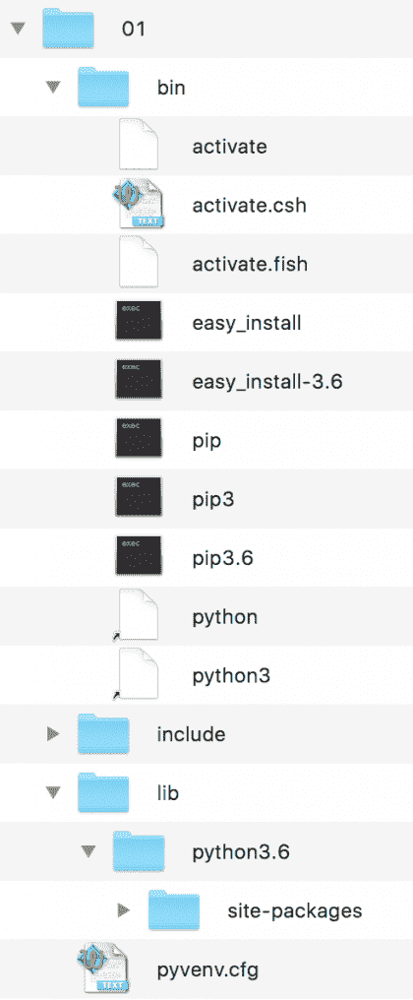
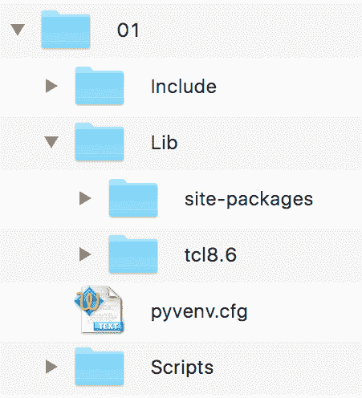
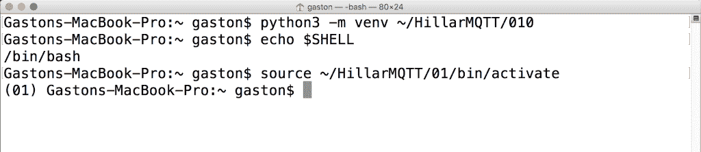
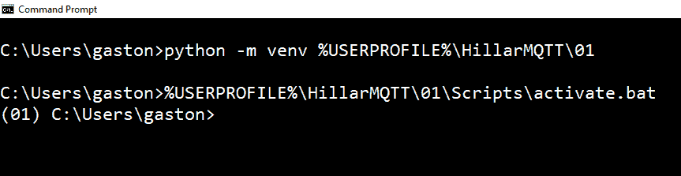
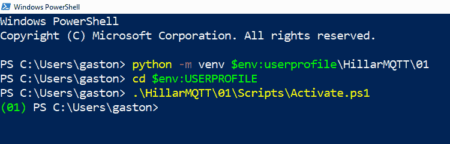

# 第四章：使用 Python 和 MQTT 消息编写控制车辆的代码

在本章中，我们将编写 Python 3.x 代码，以通过加密连接（TLS 1.2）传递 MQTT 消息来控制车辆。我们将编写能够在不同流行的物联网平台上运行的代码，例如 Raspberry Pi 3 板。我们将了解如何利用我们对 MQTT 协议的了解来构建基于要求的解决方案。我们将学习如何使用最新版本的 Eclipse Paho MQTT Python 客户端库。我们将深入研究以下内容：

+   理解使用 MQTT 控制车辆的要求

+   定义主题和命令

+   学习使用 Python 的好处

+   使用 Python 3.x 和 PEP 405 创建虚拟环境

+   理解虚拟环境的目录结构

+   激活虚拟环境

+   停用虚拟环境

+   为 Python 安装 paho-mqtt

+   使用 paho-mqtt 将客户端连接到安全的 MQTT 服务器

+   理解回调

+   使用 Python 订阅主题

+   为将作为客户端工作的物联网板配置证书

+   创建代表车辆的类

+   在 Python 中接收消息

+   使用多次调用循环方法

# 理解使用 MQTT 控制车辆的要求

在前三章中，我们详细了解了 MQTT 的工作原理。我们了解了如何在 MQTT 客户端和 MQTT 服务器之间建立连接。我们了解了当我们订阅主题过滤器时以及当发布者向特定主题发送消息时会发生什么。我们安装了 Mosquitto 服务器，然后对其进行了安全设置。

现在，我们将使用 Python 作为我们的主要编程语言，生成将充当发布者和订阅者的 MQTT 客户端。我们将连接 Python MQTT 客户端到 MQTT 服务器，并处理命令以通过 MQTT 消息控制小型车辆。这辆小车复制了现实道路车辆中发现的许多功能。

我们将使用 TLS 加密和 TLS 认证，因为我们不希望任何 MQTT 客户端能够向我们的车辆发送命令。我们希望我们的 Python 3.x 代码能够在许多平台上运行，因为我们将使用相同的代码库来控制使用以下物联网板的车辆：

+   Raspberry Pi 3 Model B+

+   高通龙板 410c

+   BeagleBone Black

+   MinnowBoard Turbot Quad-Core

+   LattePanda 2G

+   UP Core 4GB

+   UP Squared

根据平台的不同，每辆车将提供额外的功能，因为一些板比其他板更强大。但是，我们将专注于基本功能，以保持我们的示例简单，并集中在 MQTT 上。然后，我们将能够将此项目用作其他需要我们在运行 Python 3.x 代码的物联网板上运行代码，连接到 MQTT 服务器并处理命令的解决方案的基线。

驱动车辆的板上运行的代码必须能够处理在特定主题的消息中接收到的命令。我们将在有效载荷中使用 JSON 字符串。

另外，还必须使用 Python 编写的客户端应用程序能够控制一个或多个车辆。我们还将使用 Python 编写客户端应用程序，并且它将向每辆车的主题发布带有 JSON 字符串的 MQTT 消息。客户端应用程序必顶要显示执行每个命令的结果。每辆车在成功执行命令时必须向特定主题发布消息。

# 定义主题和命令

我们将使用以下主题名称发布车辆的命令：`vehicles/vehiclename/commands`，其中`vehiclename`必须替换为分配给车辆的唯一名称。例如，如果我们将`vehiclepi01`分配为由 Raspberry Pi 3 Model B+板驱动的车辆的名称，我们将不得不向`vehicles/vehiclepi01/commands`主题发布命令。在该板上运行的 Python 代码将订阅此主题，以接收带有命令的消息并对其做出反应。

我们将使用以下主题名称使车辆发布有关成功执行命令的详细信息：`vehicles/vehiclename/executedcommands`，其中`vehiclename`必须替换为分配给车辆的唯一名称。例如，如果我们将`vehiclebeagle03`分配为由 BeagleBone Black 板提供动力的车辆的名称，那么想要接收有关成功处理命令的信息的客户端必须订阅`vehicles/vehiclebeagle03/executedcommands`主题。

命令将以 JSON 字符串的形式发送，其中包含键值对。键必须等于 CMD，值必须指定以下任何有效命令之一。当命令需要额外参数时，参数名称必须包含在下一个键中，而此参数的值必须包含在此键的值中：

+   启动车辆的发动机。

+   关闭车辆的发动机。

+   锁上车门。

+   解锁并打开车门。

+   停车：停车。

+   在为车辆配置的安全位置停车。

+   打开车辆的前灯。

+   关闭车辆的前灯。

+   打开车辆的停车灯，也称为侧灯。

+   关闭车辆的停车灯，也称为侧灯。

+   加速：加速车辆，即踩油门。

+   刹车：刹车车辆，即踩刹车踏板。

+   向右旋转：使车辆向右旋转。我们必须在 DEGREES 键的值中指定我们希望车辆向右旋转多少度。

+   向左旋转：使车辆向左旋转。我们必须在 DEGREES 键的值中指定我们希望车辆向左旋转多少度。

+   设置我们允许车辆的最高速度。我们必须在 MPH 键的值中指定所需的最高速度（以每小时英里为单位）。

+   设置我们允许车辆的最低速度。我们必须在 MPH 键的值中指定所需的最低速度（以每小时英里为单位）。

以下一行显示了将车辆的发动机打开的命令的有效负载示例：

```py
{"CMD": "TURN_ON_ENGINE"}
```

以下一行显示了将车辆的最高速度设置为每小时五英里的命令的有效负载示例：

```py
{"CMD": "SET_MAX_SPEED", "MPH": 5}
```

我们已经准备好开始使用 Python 编码所需的所有细节。

# 使用 Python 3.6.x 和 PEP 405 创建虚拟环境

在接下来的章节中，我们将编写不同的 Python 代码片段，这些代码片段将订阅主题，并且还将向主题发布消息。每当我们想要隔离需要额外软件包的环境时，最好使用 Python 虚拟环境。Python 3.3 引入了轻量级虚拟环境，并在 Python 3.4 中进行了改进。我们将使用这些虚拟环境，因此，您需要 Python 3.4 或更高版本。您可以在此处阅读有关 PEP 405 Python 虚拟环境的更多信息，该文档介绍了 venv 模块：[`www.python.org/dev/peps/pep-0405`](https://www.python.org/dev/peps/pep-0405)。

本书的所有示例都在 macOS 和 Linux 上的 Python 3.6.2 上进行了测试。这些示例还在本书中提到的物联网板上进行了测试，以及它们最流行的操作系统。例如，所有示例都在 Raspbian 上进行了测试。 Raspbian 基于 Debian Linux，因此，所有 Linux 的说明都适用于 Raspbian。

如果您决定使用流行的`virtualenv`（[`pypi.python.org/pypi/virtualenv`](https://pypi.python.org/pypi/virtualenv)）第三方虚拟环境构建器或您的 Python IDE 提供的虚拟环境选项，您只需确保在必要时激活您的虚拟环境，而不是按照使用 Python 中集成的`venv`模块生成的虚拟环境的步骤来激活它。

我们使用`venv`创建的每个虚拟环境都是一个隔离的环境，并且它将在其站点目录（文件夹）中具有其自己独立安装的 Python 软件包集。在 Python 3.4 及更高版本中，使用`venv`创建虚拟环境时，`pip`已包含在新的虚拟环境中。在 Python 3.3 中，需要在创建虚拟环境后手动安装`pip`。请注意，所提供的说明与 Python 3.4 或更高版本兼容，包括 Python 3.6.x。以下命令假定您在 Linux、macOS 或 Windows 上已安装了 Python 3.5.x 或更高版本。

首先，我们必须选择我们轻量级虚拟环境的目标文件夹或目录。以下是我们在 Linux 和 macOS 示例中将使用的路径。虚拟环境的目标文件夹将是我们的主目录中的`HillarMQTT/01`文件夹。例如，如果我们在 macOS 或 Linux 中的主目录是`/Users/gaston`，则虚拟环境将在`/Users/gaston/HillarMQTT/01`中创建。您可以在每个命令中用您想要的路径替换指定的路径：

```py
~/HillarMQTT/01
```

以下是我们在 Windows 示例中将使用的路径。虚拟环境的目标文件夹将是用户个人资料文件夹中的`HillarMQTT\01`文件夹。例如，如果我们的用户个人资料文件夹是`C:\Users\gaston`，则虚拟环境将在`C:\Users\gaston\HillarMQTT\01`中创建。您可以在每个命令中用您想要的路径替换指定的路径：

```py
%USERPROFILE%\HillarMQTT\01
```

在 Windows PowerShell 中，上一个路径将是：

```py
$env:userprofile\HillarMQTT\01
```

现在，我们必须使用`-m`选项，后跟`venv`模块名称和所需的路径，使 Python 运行此模块作为脚本，并在指定的路径中创建虚拟环境。根据我们创建虚拟环境的平台，指令是不同的。

在 Linux 或 macOS 中打开终端并执行以下命令创建虚拟环境：

```py
python3 -m venv ~/HillarMQTT/01
```

在 Windows 的命令提示符中，执行以下命令创建虚拟环境：

```py
python -m venv %USERPROFILE%\HillarMQTT\01
```

如果要在 Windows PowerShell 中工作，请执行以下命令创建虚拟环境：

```py
python -m venv $env:userprofile\HillarMQTT\01
```

上述任何命令都不会产生任何输出。脚本通过调用`ensurepip`安装了`pip`，因为我们没有指定`--without-pip`选项。

# 了解虚拟环境的目录结构

指定的目标文件夹具有一个新的目录树，其中包含 Python 可执行文件和其他文件，表明它是一个 PEP405 虚拟环境。

在虚拟环境的根目录中，`pyenv.cfg`配置文件指定了虚拟环境的不同选项，其存在表明我们处于虚拟环境的根文件夹中。在 Linux 和 macOS 中，该文件夹将具有以下主要子文件夹：`bin`、`include`、`lib`、`lib/python3.6`和`lib/python3.6/site-packages`。请注意，文件夹名称可能根据具体的 Python 版本而有所不同。在 Windows 中，该文件夹将具有以下主要子文件夹：`Include`、`Lib`、`Lib\site-packages`和`Scripts`。每个平台上的虚拟环境的目录树与这些平台上 Python 安装的布局相同。

以下屏幕截图显示了在 macOS 和 Linux 平台上为`01`虚拟环境生成的目录树中的文件夹和文件：



下面的屏幕截图显示了在 Windows 为虚拟环境生成的目录树中的主要文件夹：



激活虚拟环境后，我们将在虚拟环境中安装第三方软件包，模块将位于`lib/python3.6/site-packages`或`Lib\site-packages`文件夹中，根据平台和特定的 Python 版本。可执行文件将被复制到`bin`或`Scripts`文件夹中，根据平台而定。我们安装的软件包不会对其他虚拟环境或我们的基本 Python 环境进行更改。

# 激活虚拟环境

现在我们已经创建了一个虚拟环境，我们将运行一个特定于平台的脚本来激活它。激活虚拟环境后，我们将安装软件包，这些软件包只能在此虚拟环境中使用。这样，我们将使用一个隔离的环境，在这个环境中，我们安装的所有软件包都不会影响我们的主 Python 环境。

在 Linux 或 macOS 的终端中运行以下命令。请注意，如果您在终端会话中没有启动与默认 shell 不同的其他 shell，此命令的结果将是准确的。如果您有疑问，请检查您的终端配置和首选项：

```py
echo $SHELL
```

该命令将显示您在终端中使用的 shell 的名称。在 macOS 中，默认值为`/bin/bash`，这意味着您正在使用 bash shell。根据 shell 的不同，您必须在 Linux 或 macOS 中运行不同的命令来激活虚拟环境。

如果您的终端配置为在 Linux 或 macOS 中使用 bash shell，请运行以下命令来激活虚拟环境。该命令也适用于`zsh` shell：

```py
source ~/HillarMQTT/01/bin/activate
```

如果您的终端配置为使用`csh`或`tcsh` shell，请运行以下命令来激活虚拟环境：

```py
source ~/HillarMQTT/01/bin/activate.csh
```

如果您的终端配置为使用`fish` shell，请运行以下命令来激活虚拟环境：

```py
source ~/HillarMQTT/01/bin/activate.fish
```

激活虚拟环境后，命令提示符将显示虚拟环境根文件夹名称括在括号中作为默认提示的前缀，以提醒我们正在虚拟环境中工作。在这种情况下，我们将看到**(01)**作为命令提示符的前缀，因为激活的虚拟环境的根文件夹是`01`。

下面的屏幕截图显示在 macOS High Sierra 终端中使用`bash` shell 激活的虚拟环境，在执行先前显示的命令后：



从先前的屏幕截图中可以看出，在激活虚拟环境后，提示从`Gastons-MacBook-Pro:~ gaston$`变为`(01) Gastons-MacBook-Pro:~ gaston$`。

在 Windows 中，您可以在命令提示符中运行批处理文件或 Windows PowerShell 脚本来激活虚拟环境。

如果您喜欢使用命令提示符，请在 Windows 命令行中运行以下命令来激活虚拟环境：

```py
%USERPROFILE%\HillarMQTT\01\Scripts\activate.bat
```

下面的屏幕截图显示在 Windows 10 命令提示符中激活的虚拟环境，在执行先前显示的命令后：



从先前的屏幕截图中可以看出，在激活虚拟环境后，提示从`C:\Users\gaston`变为`(01) C:\Users\gaston`。

如果您喜欢使用 Windows PowerShell，请启动它并运行以下命令来激活虚拟环境。请注意，您必须在 Windows PowerShell 中启用脚本执行才能运行该脚本：

```py
cd $env:USERPROFILE
.\HillarMQTT\01\Scripts\Activate.ps1
```

如果您收到类似以下错误的错误，这意味着您没有启用脚本执行：

```py
C:\Users\gaston\HillarMQTT\01\Scripts\Activate.ps1 : File C:\Users\gaston\HillarMQTT\01\Scripts\Activate.ps1 cannot be loaded because running scripts is disabled on this system. For more information, see about_Execution_Policies at
http://go.microsoft.com/fwlink/?LinkID=135170.
At line:1 char:1
+ C:\Users\gaston\HillarMQTT\01\Scripts\Activate.ps1
+ ~~~~~~~~~~~~~~~~~~~~~~~~~~~~~~~~~~~~~~~~~~~~~~~~~~~~~~~~
 + CategoryInfo : SecurityError: (:) [], PSSecurityException
 + FullyQualifiedErrorId : UnauthorizedAccess
```

Windows PowerShell 的默认执行策略是`Restricted`。此策略允许执行单个命令，但不运行脚本。因此，如果要使用 Windows PowerShell，必须更改策略以允许执行脚本。非常重要的是确保您了解允许运行未签名脚本的 Windows PowerShell 执行策略的风险。有关不同策略的更多信息，请查看以下网页：[`docs.microsoft.com/en-us/powershell/module/microsoft.powershell.core/about/about_execution_policies?view=powershell-6`](https://docs.microsoft.com/en-us/powershell/module/microsoft.powershell.core/about/about_execution_policies?view=powershell-6)。

以下屏幕截图显示了在 Windows 10 PowerShell 中激活的虚拟环境，执行了先前显示的命令：



# 取消激活虚拟环境

使用先前解释的过程生成的虚拟环境非常容易取消激活。取消激活将删除环境变量中的所有更改，并将提示更改回其默认消息。取消激活虚拟环境后，您将返回到默认的 Python 环境。

在 macOS 或 Linux 中，只需键入`deactivate`并按*Enter*。

在命令提示符中，您必须运行`Scripts`文件夹中包含的`deactivate.bat`批处理文件。在我们的示例中，此文件的完整路径为`%USERPROFILE%\HillarMQTT\01\Scripts\deactivate.bat`。

在 Windows PowerShell 中，您必须在`Scripts`文件夹中运行`Deactivate.ps1`脚本。在我们的示例中，此文件的完整路径为`$env:userprofile\HillarMQTT\01\Scripts\Deactivate.ps1`。请记住，必须在 Windows PowerShell 中启用脚本执行，才能运行该脚本。

下一节的说明假定我们创建的虚拟环境已激活。

# 安装 Python 的 paho-mqtt

Eclipse Paho 项目提供了 MQTT 的开源客户端实现。该项目包括 Python 客户端，也称为 Paho Python 客户端或 Eclipse Paho MQTT Python 客户端库。此 Python 客户端是从 Mosquitto 项目贡献的，最初被称为 Mosquitto Python 客户端。以下是 Eclipse Paho 项目的网页：[`www.eclipse.org/paho`](http://www.eclipse.org/paho)。以下是 Eclipse Paho MQTT Python 客户端库版本 1.3.1 的网页，即`paho-mqtt`模块版本 1.3.1：[`pypi.python.org/pypi/paho-mqtt/1.3.1`](https://pypi.python.org/pypi/paho-mqtt/1.3.1)。

我们可以在许多支持 Python 3.x 或更高版本的现代物联网板上使用`paho-mqtt`。我们只需要确保安装了`pip`，以便更容易安装`paho-mqtt`。您可以使用开发计算机来运行示例，也可以使用前面提到的任何一个物联网板。

确保在继续下一步之前，我们在上一步中创建的虚拟环境已激活。

如果要使用物联网板运行示例，请确保在 SSH 终端或运行在板子上的终端窗口中运行所有命令。如果使用开发计算机，请在 macOS 或 Linux 中的终端或 Windows 中的命令提示符中运行命令。

现在，我们将使用`pip`安装程序安装`paho-mqtt` 1.3.1。我们只需要在 SSH 终端或我们与板子一起使用的本地终端窗口中运行以下命令，或者在用于安装软件包的计算机上运行：

```py
pip install paho-mqtt==1.3.1
```

一些物联网板具有需要您在运行上述命令之前安装`pip`的操作系统。在带有 Raspbian 的 Raspberry Pi 3 板上，`pip`已经安装。如果您使用计算机，则 Python 安装通常包括`pip`。

如果您在 Windows 的默认文件夹中安装了 Python，并且没有使用 Python 虚拟环境，您将不得不在管理员命令提示符中运行上一个命令。如果您在 Raspbian 中没有使用 Python 虚拟环境，您将不得不在前面加上`sudo`前缀运行上一个命令：`sudo pip install paho-mqtt`。然而，如前所述，强烈建议使用虚拟环境。

输出的最后几行将指示`paho-mqtt`包版本 1.3.1 已成功安装。输出将类似于以下行，但不完全相同，因为它将根据您运行命令的平台而变化：

```py
Collecting paho-mqtt==1.3.1
 Downloading paho-mqtt-1.3.1.tar.gz (80kB)
 100% |################################| 81kB 1.2MB/s 
Installing collected packages: paho-mqtt
 Running setup.py install for paho-mqtt ... done
Successfully installed paho-mqtt-1.3.1
```

# 使用 paho-mqtt 将客户端连接到安全的 MQTT 服务器

首先，我们将使用`paho-mqtt`创建一个连接到 Mosquitto MQTT 服务器的 MQTT 客户端。我们将编写几行 Python 代码来建立一个安全连接并订阅一个主题。

在第三章中，*保护 MQTT 3.1.1 Mosquitto 服务器*，我们保护了我们的 Mosquitto 服务器，因此，我们将使用我们创建的数字证书来对客户端进行身份验证。大多数情况下，我们将使用 TLS 的 MQTT 服务器，因此，学习如何建立 TLS 和 TLS 身份验证连接是一个好主意。建立与 MQTT 服务器的非安全连接更容易，但在开发与 MQTT 配合工作的应用程序时，这不会是我们面临的最常见情况。

首先，我们需要复制以下文件，这些文件是我们在[第三章](https://cdp.packtpub.com/hands_on_mqtt_programming_with_python/wp-admin/post.php?post=107&action=edit#post_26)中创建的，*保护 MQTT 3.1.1 Mosquitto 服务器*，到计算机或设备上的目录，我们将用它来运行 Python 脚本。我们将文件保存在一个名为`mqtt_certificates`的目录中。在您将用作 MQTT 客户端的计算机或板上创建一个名为`board_certificates`的新目录。将以下三个文件复制到这个新目录中：

+   `ca.crt`：证书颁发机构证书文件

+   `board001.crt`：客户端证书文件

+   `board001.key`：客户端密钥

现在，我们将在主虚拟环境文件夹中创建一个名为`config.py`的新的 Python 文件。以下几行显示了该文件的代码，该代码定义了许多配置值，这些值将用于与 Mosquitto MQTT 服务器建立连接。这样，所有配置值都包含在一个特定的 Python 脚本中。您必须将`certificates_path`字符串中的`/Users/gaston/board_certificates`值替换为您创建的`board_certificates`目录的路径。此外，用 Mosquitto 服务器或任何其他您决定使用的 MQTT 服务器的 IP 地址或主机名替换`mqtt_server_host`的值。示例的代码文件包含在`mqtt_python_gaston_hillar_04_01`文件夹中的`config.py`文件中：

```py
import os.path

# Replace /Users/gaston/python_certificates with the path
# in which you saved the certificate authority file,
# the client certificate file and the client key
certificates_path = "/Users/gaston/python_certificates"
ca_certificate = os.path.join(certificates_path, "ca.crt")
client_certificate = os.path.join(certificates_path, "board001.crt")
client_key = os.path.join(certificates_path, "board001.key")
# Replace 192.168.1.101 with the IP or hostname for the Mosquitto
# or other MQTT server
# Make sure the IP or hostname matches the value 
# you used for Common Name
mqtt_server_host = "192.168.1.101"
mqtt_server_port = 8883
mqtt_keepalive = 60
```

该代码声明了`certificates_path`变量，该变量初始化为一个字符串，指定了您保存证书颁发机构文件、客户端证书文件和客户端密钥（`ca.crt`、`board001.crt`和`board001.key`）的路径。然后，该代码声明了以下字符串变量，这些变量包含了我们需要配置 TLS 和 TLS 客户端身份验证的证书和密钥文件的完整路径：`ca_certificate`、`client_certificate`和`client_key`。

调用`os.path.join`使得将`certificates_path`变量中指定的路径与文件名连接并生成完整路径变得容易。`os.path.join`函数适用于任何平台，因此我们不必担心是使用斜杠(`/`)还是反斜杠(`\`)来将路径与文件名连接。有时，我们可以在 Windows 中开发和测试，然后在可以使用不同 Unix 或 Linux 版本的 IoT 板上运行代码，例如 Raspbian 或 Ubuntu。在我们在不同平台之间切换的情况下，使用`os.path.join`使得我们的工作更加容易。

`mqtt_server_host`、`mqtt_server_port`和`mqtt_keepalive`变量指定了 MQTT 服务器（Mosquitto 服务器）的 IP 地址（`192.168.1.101`），我们要使用的端口（`8883`），以及保持连接的秒数。非常重要的是要用 MQTT 服务器的 IP 地址替换`192.168.1.101`。我们将`mqtt_server_port`指定为`8883`，因为我们使用 TLS，这是 MQTT over TLS 的默认端口，正如我们在[第三章](https://cdp.packtpub.com/hands_on_mqtt_programming_with_python/wp-admin/post.php?post=107&action=edit#post_26)中学到的，*Securing an MQTT 3.1.1 Mosquitto Server*。

现在，我们将在主虚拟环境文件夹中创建一个名为`subscribe_with_paho.py`的新 Python 文件。以下行显示了该文件的代码，该代码与我们的 Mosquitto MQTT 服务器建立连接，订阅`vehicles/vehiclepi01/tests`主题过滤器，并打印出订阅主题过滤器中接收到的所有消息。示例的代码文件包含在`mqtt_python_gaston_hillar_04_01`文件夹中的`subscribe_with_paho.py`文件中。

```py
from config import *
import paho.mqtt.client as mqtt

def on_connect(client, userdata, flags, rc):
    print("Result from connect: {}".format(
        mqtt.connack_string(rc)))
    # Subscribe to the vehicles/vehiclepi01/tests topic filter
    client.subscribe("vehicles/vehiclepi01/tests", qos=2)

def on_subscribe(client, userdata, mid, granted_qos):
    print("I've subscribed with QoS: {}".format(
        granted_qos[0]))

def on_message(client, userdata, msg):
    print("Message received. Topic: {}. Payload: {}".format(
        msg.topic, 
        str(msg.payload)))

if __name__ == "__main__":
    client = mqtt.Client(protocol=mqtt.MQTTv311)
    client.on_connect = on_connect
    client.on_subscribe = on_subscribe
    client.on_message = on_message
    client.tls_set(ca_certs = ca_certificate,
        certfile=client_certificate,
        keyfile=client_key)
    client.connect(host=mqtt_server_host,
        port=mqtt_server_port,
        keepalive=mqtt_keepalive)
    client.loop_forever()

```

请注意，该代码与`paho-mqtt`版本 1.3.1 兼容。早期版本的`paho-mqtt`与该代码不兼容。因此，请确保按照先前解释的步骤安装`paho-mqtt`版本 1.3.1。

# 理解回调

前面的代码使用了最近安装的`paho-mqtt`版本 1.3.1 模块与 MQTT 服务器建立加密连接，订阅`vehicles/vehiclepi01/tests`主题过滤器，并在接收到主题中的消息时运行代码。我们将使用这段代码来了解`paho-mqtt`的基础知识。该代码是一个非常简单的 MQTT 客户端版本，订阅了一个主题过滤器，我们将在接下来的部分中对其进行改进。

第一行导入了我们在先前编写的`config.py`文件中声明的变量。第二行将`paho.mqtt.client`导入为`mqtt`。这样，每当我们使用`mqtt`别名时，我们将引用`paho.mqtt.client`。

当我们声明一个函数时，我们将此函数作为参数传递给另一个函数或方法，或者将此函数分配给一个属性，然后一些代码在某个时候调用此函数；这种机制被称为**回调**。之所以称之为回调，是因为代码在某个时候回调函数。`paho-mqtt`版本 1.3.1 包要求我们使用许多回调，因此了解它们的工作原理非常重要。

该代码声明了以下三个我们稍后指定为回调的函数：

+   `on_connect`：当 MQTT 客户端从 MQTT 服务器接收到`CONNACK`响应时，即成功与 MQTT 服务器建立连接时，将调用此函数。

+   `on_subscribe`：当 MQTT 客户端从 MQTT 服务器接收到`SUBACK`响应时，即成功完成订阅时，将调用此函数。

+   `on_message`：当 MQTT 客户端从 MQTT 服务器接收到`PUBLISH`消息时，将调用此函数。每当 MQTT 服务器基于客户端的订阅发布消息时，将调用此函数。

下表总结了基于从 MQTT 服务器接收到的响应调用的函数：

| **来自 MQTT 服务器的响应** | **将被调用的函数** |
| --- | --- |
| `CONNACK` | `on_connnect` |
| `SUBACK` | `on_subscribe` |
| `PUBLISH` | `on_message` |

主要代码块创建了代表 MQTT 客户端的`mqtt.Client`类（`paho.mqtt.client.Client`）的实例。我们使用这个实例与我们的 MQTT 服务器 Mosquitto 进行通信。如果我们使用默认参数创建新实例，我们将使用 MQTT 版本 3.1。我们想要使用 MQTT 版本 3.11，因此我们将`mqtt.MQTTv311`指定为协议参数的值。

然后，代码将函数分配给属性。以下表总结了这些分配：

| **属性** | **分配的函数** |
| --- | --- |
| `client.on_connect` | `on_connect` |
| `client.on_message` | `on_message` |
| `client.on_subscribe` | `on_subscribe` |

调用`client.tls_set`方法配置加密和认证选项非常重要，在运行`client.connect`方法之前调用此方法。我们在`ca_certs`、`certfile`和`keyfile`参数中指定证书颁发机构证书文件、客户端证书和客户端密钥的完整字符串路径。`ca_certs`参数名称有点令人困惑，但我们只需要指定证书颁发机构证书文件的字符串路径，而不是多个证书。

最后，主要代码块调用`client.connect`方法，并指定`host`、`port`和`keepalive`参数的值。这样，代码要求 MQTT 客户端与指定的 MQTT 服务器建立连接。

`connect`方法以异步执行方式运行，因此它是一个非阻塞调用。

成功与 MQTT 服务器建立连接后，将执行`client.on_connect`属性中指定的回调，即`on_connect`函数。此函数在 client 参数中接收与 MQTT 服务器建立连接的`mqtt.Client`实例。

如果要与不使用 TLS 的 MQTT 服务器建立连接，则无需调用`client.tls_set`方法。此外，您需要使用适当的端口，而不是在使用 TLS 时指定的`8883`端口。请记住，当不使用 TLS 时，默认端口是`1883`。

# 使用 Python 订阅主题

代码调用`client.subscribe`方法，参数为`"vehicles/vehiclepi01/tests"`，以订阅这个特定的单个主题，并将`qos`参数设置为`2`，以请求 QoS 级别为 2。

在这种情况下，我们只订阅一个主题。但是，非常重要的是要知道，我们不限于订阅单个主题过滤器；我们可以通过一次调用`subscribe`方法订阅许多主题过滤器。

在 MQTT 服务器确认成功订阅指定主题过滤器并返回`SUBACK`响应后，将执行`client.on_subscribe`属性中指定的回调，即`on_subscribe`函数。此函数在`granted_qos`参数中接收一个整数列表，提供 MQTT 服务器为每个主题过滤器订阅请求授予的 QoS 级别。`on_subscribe`函数中的代码显示了 MQTT 服务器为我们指定的主题过滤器授予的 QoS 级别。在这种情况下，我们只订阅了一个单一的主题过滤器，因此代码从接收到的`granted_qos`数组中获取第一个值。

每当收到与我们订阅的主题过滤器匹配的新消息时，将执行`client.on_messsage`属性中指定的回调，即`on_message`函数。此函数在 client 参数中接收与 MQTT 服务器建立连接的`mqtt.Client`实例，并在`msg`参数中接收一个`mqtt.MQTTMessage`实例。`mqtt.MQTTMessage`类描述了一条传入消息。

在这种情况下，每当执行`on_message`函数时，`msg.topic`中的值将始终匹配`"vehicles/vehiclepi01/tests"`，因为我们刚刚订阅了一个主题，没有其他主题名称与主题过滤器匹配。但是，如果我们订阅了一个或多个主题过滤器，其中可能有多个主题匹配，那么始终需要检查`msg.topic`属性的值来确定消息是发送到哪个主题。

`on_message`函数中的代码打印已接收消息的主题`msg.topic`和消息的有效负载的字符串表示形式，即`msg.payload`属性。

最后，主块调用`client.loop_forever`方法，该方法以无限阻塞循环为我们调用`loop`方法。在这一点上，我们只想在我们的程序中运行 MQTT 客户端循环。我们将接收与我们订阅的主题匹配的消息。

`loop`方法负责处理网络事件，即确保与 MQTT 服务器的通信进行。您可以将`loop`方法视为将电子邮件客户端同步以接收传入消息并发送发件箱中的消息的等效方法。

确保 Mosquitto 服务器或您可能要用于此示例的任何其他 MQTT 服务器正在运行。然后，在要用作 MQTT 客户端并使用 Linux 或 macOS 的任何计算机或设备上执行以下行以启动示例：

```py
python3 subscribe_with_paho.py
```

在 Windows 中，您必须执行以下行：

```py
python subscribe_with_paho.py
```

如果您看到类似以下行的`SSLError`的回溯，这意味着 MQTT 服务器的主机名或 IP 与生成名为`server.crt`的服务器证书文件时指定的`Common Name`属性的值不匹配。确保检查 MQTT 服务器（Mosquitto 服务器）的 IP 地址，并使用指定为`Common Name`的适当 IP 地址或主机名再次生成服务器证书文件和密钥，如[第三章](https://cdp.packtpub.com/hands_on_mqtt_programming_with_python/wp-admin/post.php?post=107&action=edit#post_26)中所述，*Securing an MQTT 3.1.1 Mosquitto Server*，如果您正在使用我们生成的自签名证书。如果您正在使用自签名证书、IP 地址和 DHCP 服务器，请还要检查 DHCP 服务器是否更改了 Mosquitto 服务器的 IP 地址：

```py
Traceback (most recent call last):
 File "<stdin>", line 1, in <module>
 File "/Users/gaston/HillarMQTT/01/lib/python3.6/site-packages/paho/mqtt/client.py", line 612, in connect
 return self.reconnect()
 File "/Users/gaston/HillarMQTT/01/lib/python3.6/site-packages/paho/mqtt/client.py", line 751, in reconnect
 self._tls_match_hostname()
 File "/Users/gaston/HillarMQTT/01/lib/python3.6/site-packages/paho/mqtt/client.py", line 2331, in _tls_match_hostname
 raise ssl.SSLError('Certificate subject does not match remote hostname.')
```

现在，按照以下步骤使用 MQTT.fx GUI 实用程序向`vehicles/vehiclepi01/tests`主题发布两条消息：

1.  启动 MQTT.fx，并按照我们在[第三章](https://cdp.packtpub.com/hands_on_mqtt_programming_with_python/wp-admin/post.php?post=107&action=edit#post_26)中学到的步骤与 MQTT 服务器建立连接，*Securing an MQTT 3.1.1 Mosquitto Server*。

1.  单击 Publish 并在 Publish 按钮左侧的下拉菜单中输入`vehicles/vehiclepi01/tests`。

1.  单击 Publish 按钮右侧的 QoS 2。

1.  在 Publish 按钮下的文本框中输入以下文本：`{"CMD": " UNLOCK_DOORS"}`。然后，单击 Publish 按钮。MQTT.fx 将输入的文本发布到指定的主题。

1.  在 Publish 按钮下的文本框中输入以下文本：`{"CMD": "TURN_ON_HEADLIGHTS"}`。然后，单击 Publish 按钮。MQTT.fx 将输入的文本发布到指定的主题。

如果您不想使用 MQTT.fx 实用程序，可以运行两个`mosquitto_pub`命令来生成发布消息到主题的 MQTT 客户端。您只需要在 macOS 或 Linux 中打开另一个终端，或者在 Windows 中打开另一个命令提示符，转到 Mosquitto 安装的目录，并运行以下命令。在这种情况下，不需要指定`-d`选项。将`192.168.1.101`替换为 MQTT 服务器的 IP 或主机名。记得将`ca.crt`、`board001.crt`和`board001.key`替换为在`board_certificates`目录中创建的这些文件的完整路径。示例的代码文件包含在`mqtt_python_gaston_hillar_04_01`文件夹中的`script_01.txt`文件中：

```py
mosquitto_pub -h 192.168.1.101 -V mqttv311 -p 8883 --cafile ca.crt --cert board001.crt --key board001.key -t vehicles/vehiclepi01/tests -m '{"CMD": "UNLOCK_DOORS"}' -q 2 --tls-version tlsv1.2

mosquitto_pub -h 192.168.1.101 -V mqttv311 -p 8883 --cafile ca.crt --cert board001.crt --key board001.key -t vehicles/vehiclepi01/tests -m '{"CMD": "TURN_ON_HEADLIGHTS"}' -q 2 --tls-version tlsv1.2
```

转到您执行 Python 脚本的设备和窗口。您将看到以下输出：

```py
Result from connect: Connection Accepted.
I've subscribed with QoS: 2
Message received. Topic: vehicles/vehiclepi01/tests. Payload: b'{"CMD": "UNLOCK_DOORS"}'
Message received. Topic: vehicles/vehiclepi01/tests. Payload: b'{"CMD": "TURN_ON_HEADLIGHTS"}'
```

Python 程序成功地与 MQTT 服务器建立了安全加密的连接，并成为了`vehicles/vehiclepi01/tests`主题的订阅者，授予了 QoS 级别 2。该程序显示了它在`vehicles/vehiclepi01/tests`主题中接收到的两条消息。

按下*Ctrl* + *C*停止程序的执行。生成的 MQTT 客户端将关闭与 MQTT 服务器的连接。您将看到类似以下输出的错误消息，因为循环执行被中断：

```py
Traceback (most recent call last):
 File "subscribe_with_paho.py", line 33, in <module>
 client.loop_forever()
 File "/Users/gaston/HillarMQTT/01/lib/python3.6/site-packages/paho/mqtt/client.py", line 1481, in loop_forever
 rc = self.loop(timeout, max_packets)
 File "/Users/gaston/HillarMQTT/01/lib/python3.6/site-packages/paho/mqtt/client.py", line 988, in loop
 socklist = select.select(rlist, wlist, [], timeout)
KeyboardInterrupt
```

# 为将作为客户端工作的物联网板配置证书

现在，我们将编写 Python 代码，该代码将准备在不同的物联网板上运行。当然，您可以在单个开发计算机或开发板上工作。无需在不同设备上运行代码。我们只是想确保我们可以编写能够在不同设备上运行的代码。

记得将我们在上一章中创建的文件复制到代表控制车辆的板的计算机或设备上，并且我们将用它来运行 Python 脚本。如果您将继续使用到目前为止一直在使用的同一台计算机或设备，您无需遵循下一步。

我们将文件保存在一个名为`mqtt_certificates`的目录中。在您将用作此示例的 MQTT 客户端的计算机或板上创建一个`board_certificates`目录。将以下三个文件复制到这个新目录中：

+   `ca.crt`：证书颁发机构证书文件

+   `board001.crt`：客户端证书文件

+   `board001.key`：客户端密钥

# 创建一个代表车辆的类

我们将创建以下两个类：

+   `Vehicle`：这个类将代表一个车辆，并提供在处理命令时将被调用的方法。为了保持示例简单，我们的方法将在每次调用后将车辆执行的操作打印到控制台输出。代表车辆的真实类将在每次调用每个方法时与发动机、灯、执行器、传感器和车辆的其他不同组件进行交互。

+   `VehicleCommandProcessor`：这个类将代表一个命令处理器，它将与 MQTT 服务器建立连接，订阅一个主题，其中 MQTT 客户端将接收带有命令的消息，分析传入的消息，并将命令的执行委托给`Vehicle`类的相关实例。`VehicleCommandProcessor`类将声明许多静态方法，我们将指定为 MQTT 客户端的回调。

在主虚拟环境文件夹中创建一个名为`vehicle_commands.py`的新 Python 文件。以下行声明了许多变量，这些变量具有标识车辆支持的每个命令的值。此外，代码还声明了许多变量，这些变量具有我们将用于指定命令的关键字符串以及我们将用于指定成功执行的命令的关键字符串。所有这些变量都以全大写字母定义，因为我们将把它们用作常量。示例的代码文件包含在`mqtt_python_gaston_hillar_04_01`文件夹中的`vehicle_commands.py`文件中。

```py
# Key strings
COMMAND_KEY = "CMD"
SUCCESFULLY_PROCESSED_COMMAND_KEY = "SUCCESSFULLY_PROCESSED_COMMAND"
# Command strings
# Turn on the vehicle's engine.
CMD_TURN_ON_ENGINE = "TURN_ON_ENGINE"
# Turn off the vehicle's engine
CMD_TURN_OFF_ENGINE = "TURN_OFF_ENGINE"
# Close and lock the vehicle's doors
CMD_LOCK_DOORS = "LOCK_DOORS"
# Unlock and open the vehicle's doors
CMD_UNLOCK_DOORS = "UNLOCK_DOORS"
# Park the vehicle
CMD_PARK = "PARK"
# Park the vehicle in a safe place that is configured for the vehicle
CMD_PARK_IN_SAFE_PLACE = "PARK_IN_SAFE_PLACE"
# Turn on the vehicle's headlights
CMD_TURN_ON_HEADLIGHTS = "TURN_ON_HEADLIGHTS"
# Turn off the vehicle's headlights
CMD_TURN_OFF_HEADLIGHTS = "TURN_OFF_HEADLIGHTS"
# Turn on the vehicle's parking lights, also known as sidelights
CMD_TURN_ON_PARKING_LIGHTS = "TURN_ON_PARKING_LIGHTS"
# Turn off the vehicle's parking lights, also known as sidelights
CMD_TURN_OFF_PARKING_LIGHTS = "TURN_OFF_PARKING_LIGHTS"
# Accelerate the vehicle, that is, press the gas pedal
CMD_ACCELERATE = "ACCELERATE"
# Brake the vehicle, that is, press the brake pedal
CMD_BRAKE = "BRAKE"
# Make the vehicle rotate to the right. We must specify the degrees 
# we want the vehicle to rotate right in the value for the DEGREES key
CMD_ROTATE_RIGHT = "ROTATE_RIGHT"
# Make the vehicle rotate to the left. We must specify the degrees 
# we want the vehicle to rotate left in the value for the DEGREES key
CMD_ROTATE_LEFT = "ROTATE_LEFT"
# Set the maximum speed that we allow to the vehicle. We must specify 
# the desired maximum speed in miles per hour in the value for the MPH key
CMD_SET_MAX_SPEED = "SET_MAX_SPEED"
# Set the minimum speed that we allow to the vehicle. We must specify 
# the desired minimum speed in miles per hour in the value for the MPH key
CMD_SET_MIN_SPEED = "SET_MIN_SPEED"
# Degrees key
KEY_DEGREES = "DEGREES"
# Miles per hour key
KEY_MPH = "MPH"
```

`COMMAND_KEY`变量定义了一个关键字符串，该字符串定义了代码将理解为命令。每当我们接收包含指定关键字符串的消息时，我们知道字典中与此关键相关联的值将指示消息希望代码在板上运行的命令被处理。MQTT 客户端不会接收消息作为字典，因此，当它们不仅仅是一个字符串时，有必要将它们从字符串转换为字典。

`SUCCESSFULLY_PROCESSED_COMMAND_KEY`变量定义了一个关键字符串，该字符串定义了代码将在发布到适当主题的响应消息中用作成功处理的命令键。每当我们发布包含指定关键字符串的消息时，我们知道字典中与此关键相关联的值将指示板成功处理的命令。

在主虚拟环境文件夹中创建一个名为`vehicle_mqtt_client.py`的新 Python 文件。以下行声明了必要的导入和与前面示例中使用的相同变量，以建立与 MQTT 服务器的连接。然后，这些行声明了`Vehicle`类。示例的代码文件包含在`mqtt_python_gaston_hillar_04_01`文件夹中的`vehicle_mqtt_client.py`文件中。

```py
class Vehicle:
    def __init__(self, name):
        self.name = name
        self.min_speed_mph = 0
        self.max_speed_mph = 10

    def print_action_with_name_prefix(self, action):
        print("{}: {}".format(self.name, action))

    def turn_on_engine(self):
        self.print_action_with_name_prefix("Turning on the engine")

    def turn_off_engine(self):
        self.print_action_with_name_prefix("Turning off the engine")

    def lock_doors(self):
        self.print_action_with_name_prefix("Locking doors")

    def unlock_doors(self):
        self.print_action_with_name_prefix("Unlocking doors")

    def park(self):
        self.print_action_with_name_prefix("Parking")

    def park_in_safe_place(self):
        self.print_action_with_name_prefix("Parking in safe place")

    def turn_on_headlights(self):
        self.print_action_with_name_prefix("Turning on headlights")

    def turn_off_headlights(self):
        self.print_action_with_name_prefix("Turning off headlights")

    def turn_on_parking_lights(self):
        self.print_action_with_name_prefix("Turning on parking lights")

    def turn_off_parking_lights(self):
        self.print_action_with_name_prefix("Turning off parking 
         lights")

    def accelerate(self):
        self.print_action_with_name_prefix("Accelerating")

    def brake(self):
        self.print_action_with_name_prefix("Braking")

    def rotate_right(self, degrees):
        self.print_action_with_name_prefix("Rotating right {} 
          degrees".format(degrees))

    def rotate_left(self, degrees):
        self.print_action_with_name_prefix("Rotating left {} 
           degrees".format(degrees))

    def set_max_speed(self, mph):
        self.max_speed_mph = mph
        self.print_action_with_name_prefix("Setting maximum speed to {} 
        MPH".format(mph))

    def set_min_speed(self, mph):
        self.min_speed_mph = mph
        self.print_action_with_name_prefix("Setting minimum speed to {} 
        MPH".format(mph))
```

与前面的示例一样，用于与 Mosquitto MQTT 服务器建立连接的所有配置值都在名为`config.py`的 Python 文件中定义在主虚拟环境文件夹中。如果要在不同的设备上运行此示例，您将不得不创建一个新的`config.py`文件，并更改导入`config`模块的行，以使用新的配置文件。不要忘记将`certificates_path`字符串中的值`/Users/gaston/board_certificates`替换为您创建的`board_certificates`目录的路径。此外，将`mqtt_server_host`的值替换为 Mosquitto 服务器或其他您决定使用的 MQTT 服务器的 IP 地址或主机名。

我们必须在所需的名称参数中指定车辆的名称。构造函数，即`__init__`方法，将接收的名称保存在具有相同名称的属性中。然后，构造函数为两个属性设置了初始值：`min_speed_mph`和`max_speed_mph`。这些属性确定了车辆的最小和最大速度值，以英里每小时表示。

`Vehicle`类声明了`print_action_with_name_prefix`方法，该方法接收一个包含正在执行的动作的字符串，并将其与保存在`name`属性中的值一起作为前缀打印出来。此类中定义的其他方法调用`print_action_with_name_prefix`方法，以打印指示车辆正在执行的动作的消息，并以车辆的名称作为前缀。

# 在 Python 中接收消息

我们将使用最近安装的`paho-mqtt`版本 1.3.1 模块订阅特定主题，并在接收到主题消息时运行代码。我们将在同一个 Python 文件中创建一个名为`vehicle_mqtt_client.py`的`VehicleCommandProcessor`类，该文件位于主虚拟环境文件夹中。这个类将代表一个与先前编码的`Vehicle`类实例相关联的命令处理器，配置 MQTT 客户端和订阅客户端，并声明当与 MQTT 相关的某些事件被触发时将要执行的回调代码。

我们将`VehicleCommandProcessor`类的代码拆分成许多代码片段，以便更容易理解每个代码部分。您必须将下面的代码添加到现有的`vehicle_mqtt_client.py` Python 文件中。以下代码声明了`VehicleCommandProcessor`类及其构造函数，即`__init__`方法。示例的代码文件包含在`mqtt_python_gaston_hillar_04_01`文件夹中的`vehicle_mqtt_client.py`文件中：

```py
class VehicleCommandProcessor:
    commands_topic = ""
    processed_commands_topic = ""
    active_instance = None

    def __init__(self, name, vehicle):
        self.name = name
        self.vehicle = vehicle
        VehicleCommandProcessor.commands_topic = \
            "vehicles/{}/commands".format(self.name)
        VehicleCommandProcessor.processed_commands_topic = \
            "vehicles/{}/executedcommands".format(self.name)
        self.client = mqtt.Client(protocol=mqtt.MQTTv311)
        VehicleCommandProcessor.active_instance = self
        self.client.on_connect = VehicleCommandProcessor.on_connect
        self.client.on_subscribe = VehicleCommandProcessor.on_subscribe
        self.client.on_message = VehicleCommandProcessor.on_message
        self.client.tls_set(ca_certs = ca_certificate,
            certfile=client_certificate,
            keyfile=client_key)
        self.client.connect(host=mqtt_server_host,
                            port=mqtt_server_port,
                            keepalive=mqtt_keepalive)
```

我们必须为命令处理器和命令处理器将控制的`Vehicle`实例指定一个名称，分别在`name`和`vehicle`参数中。构造函数，即`__init__`方法，将接收到的`name`和`vehicle`保存在同名的属性中。然后，构造函数设置了`commands_topic`和`processed_commands_topic`类属性的值。构造函数使用接收到的`name`来确定命令和成功处理的命令的主题名称，根据我们之前讨论的规范。MQTT 客户端将在`command_topic`类属性中保存的主题名称接收消息，并将消息发布到`processed_commands_topic`类属性中保存的主题名称。

然后，构造函数创建了一个`mqtt.Client`类的实例（`paho.mqtt.client.Client`），表示一个 MQTT 客户端，我们将使用它与 MQTT 服务器进行通信。代码将此实例分配给`client`属性（`self.client`）。与我们之前的示例一样，我们希望使用 MQTT 版本 3.11，因此我们将`mqtt.MQTTv311`指定为协议参数的值。

代码还将此实例的引用保存在`active_instance`类属性中，因为我们必须在构造函数指定为 MQTT 客户端触发的不同事件的回调中访问该实例。我们希望将与车辆命令处理器相关的所有方法都放在`VehicleCommandProcessor`类中。

然后，代码将静态方法分配给`self.client`实例的属性。以下表总结了这些分配：

| **属性** | **分配的静态方法** |
| --- | --- |
| `client.on_connect` | `VehicleCommandProcessor.on_connect` |
| `client.on_message` | `VehicleCommandProcessor.on_message` |
| `client.on_subscribe` | `VehicleCommandProcessor.on_subscribe` |

静态方法不接收`self`或`cls`作为第一个参数，因此我们可以将它们用作具有所需数量参数的回调。请注意，我们将在下一段编码和分析这些静态方法。

`self.client.tls_set`方法的调用配置了加密和认证选项。最后，构造函数调用`client.connect`方法，并指定`host`、`port`和`keepalive`参数的值。这样，代码要求 MQTT 客户端与指定的 MQTT 服务器建立连接。请记住，`connect`方法以异步执行方式运行，因此它是一个非阻塞调用。

如果要与未使用 TLS 的 MQTT 服务器建立连接，则需要删除对`self.client.tls_set`方法的调用。此外，您需要使用适当的端口，而不是在使用 TLS 时指定的`8883`端口。请记住，当您不使用 TLS 时，默认端口是`1883`。

以下行声明了`on_connect`静态方法，该方法是`VehicleCommandProcessor`类的一部分。您需要将这些行添加到现有的`vehicle_mqtt_client.py` Python 文件中。示例的代码文件包含在`mqtt_python_gaston_hillar_04_01`文件夹中的`vehicle_mqtt_client.py`文件中：

```py
    @staticmethod
    def on_connect(client, userdata, flags, rc):
        print("Result from connect: {}".format(
            mqtt.connack_string(rc)))
        # Check whether the result form connect is the CONNACK_ACCEPTED  
          connack code
        if rc == mqtt.CONNACK_ACCEPTED:
            # Subscribe to the commands topic filter
            client.subscribe(
                VehicleCommandProcessor.commands_topic, 
                qos=2)
```

成功与 MQTT 服务器建立连接后，将执行`self.client.on_connect`属性中指定的回调，即`on_connect`静态方法（使用`@staticmethod`装饰器标记）。此静态方法接收了与 MQTT 服务器建立连接的`mqtt.Client`实例作为 client 参数。

该代码检查`rc`参数的值，该参数提供了 MQTT 服务器返回的`CONNACK`代码。如果此值与`mqtt.CONNACK_ACCEPTED`匹配，则意味着 MQTT 服务器接受了连接请求，因此，代码调用`client.subscribe`方法，并将`VehicleCommandProcessor.commands_topic`作为参数订阅到`commands_topic`类属性中指定的主题，并为订阅指定了 QoS 级别为 2。

以下行声明了`on_subscribe`静态方法，该方法是`VehicleCommandProcessor`类的一部分。您需要将这些行添加到现有的`vehicle_mqtt_client.py` Python 文件中。示例的代码文件包含在`mqtt_python_gaston_hillar_04_01`文件夹中的`vehicle_mqtt_client.py`文件中：

```py
    @staticmethod
    def on_subscribe(client, userdata, mid, granted_qos):
        print("I've subscribed with QoS: {}".format(
            granted_qos[0]))
```

`on_subscribe`静态方法显示了 MQTT 服务器为我们指定的主题过滤器授予的 QoS 级别。在这种情况下，我们只订阅了一个单一主题过滤器，因此，代码从接收的`granted_qos`数组中获取第一个值。

以下行声明了`on_message`静态方法，该方法是`VehicleCommandProcessor`类的一部分。您需要将这些行添加到现有的`vehicle_mqtt_client.py` Python 文件中。示例的代码文件包含在`mqtt_python_gaston_hillar_04_01`文件夹中的`vehicle_mqtt_client.py`文件中：

```py
    @staticmethod
    def on_message(client, userdata, msg):
        if msg.topic == VehicleCommandProcessor.commands_topic:
            print("Received message payload: 
            {0}".format(str(msg.payload)))
            try:
                message_dictionary = json.loads(msg.payload)
                if COMMAND_KEY in message_dictionary:
                    command = message_dictionary[COMMAND_KEY]
                    vehicle = 
                    VehicleCommandProcessor.active_instance.vehicle
                    is_command_executed = False
                    if KEY_MPH in message_dictionary:
                        mph = message_dictionary[KEY_MPH]
                    else:
                        mph = 0
                    if KEY_DEGREES in message_dictionary:
                        degrees = message_dictionary[KEY_DEGREES]
                    else:
                        degrees = 0
                    command_methods_dictionary = {
                        CMD_TURN_ON_ENGINE: lambda: 
                        vehicle.turn_on_engine(),
                        CMD_TURN_OFF_ENGINE: lambda: 
                        vehicle.turn_off_engine(),
                        CMD_LOCK_DOORS: lambda: vehicle.lock_doors(),
                        CMD_UNLOCK_DOORS: lambda: 
                        vehicle.unlock_doors(),
                        CMD_PARK: lambda: vehicle.park(),
                        CMD_PARK_IN_SAFE_PLACE: lambda: 
                        vehicle.park_in_safe_place(),
                        CMD_TURN_ON_HEADLIGHTS: lambda: 
                        vehicle.turn_on_headlights(),
                        CMD_TURN_OFF_HEADLIGHTS: lambda: 
                        vehicle.turn_off_headlights(),
                        CMD_TURN_ON_PARKING_LIGHTS: lambda: 
                        vehicle.turn_on_parking_lights(),
                        CMD_TURN_OFF_PARKING_LIGHTS: lambda: 
                        vehicle.turn_off_parking_lights(),
                        CMD_ACCELERATE: lambda: vehicle.accelerate(),
                        CMD_BRAKE: lambda: vehicle.brake(),
                        CMD_ROTATE_RIGHT: lambda: 
                        vehicle.rotate_right(degrees),
                        CMD_ROTATE_LEFT: lambda: 
                        vehicle.rotate_left(degrees),
                        CMD_SET_MIN_SPEED: lambda: 
                        vehicle.set_min_speed(mph),
                        CMD_SET_MAX_SPEED: lambda: 
                        vehicle.set_max_speed(mph),
                    }
                    if command in command_methods_dictionary:
                        method = command_methods_dictionary[command]
                        # Call the method
                        method()
                        is_command_executed = True
                    if is_command_executed:

           VehicleCommandProcessor.active_instance.
            publish_executed_command_message(message_dictionary)
                    else:
                        print("I've received a message with an   
                          unsupported command.")
            except ValueError:
                # msg is not a dictionary
                # No JSON object could be decoded
                print("I've received an invalid message.")
```

每当在我们订阅的`commands_topic`类属性中保存的主题中收到新消息时，将执行`self.client.on_messsage`属性中指定的回调，即先前编码的`on_message`静态方法（使用`@staticmethod`装饰器标记）。此静态方法接收了与 MQTT 服务器建立连接的`mqtt.Client`实例作为 client 参数，并在`msg`参数中接收了一个`mqtt.MQTTMessage`实例。

`mqtt.MQTTMessage`类描述了传入的消息。

`msg.topic`属性指示接收消息的主题。因此，静态方法检查`msg.topic`属性是否与`commands_topic`类属性中的值匹配。在这种情况下，每当执行`on_message`方法时，`msg.topic`中的值将始终与主题类属性中的值匹配，因为我们只订阅了一个主题。但是，如果我们订阅了多个主题，则始终需要检查消息发送的主题以及我们接收消息的主题。因此，我们包含了代码以清楚地了解如何检查接收消息的`topic`。

代码打印了已接收消息的 payload，即`msg.payload`属性。然后，代码将`json.loads`函数的结果分配给`msg.payload`以将其反序列化为 Python 对象，并将结果分配给`message_dictionary`本地变量。如果`msg.payload`的内容不是 JSON，则会捕获`ValueError`异常，代码将打印一条消息，指示消息不包含有效命令，并且不会执行更多代码。如果`msg.payload`的内容是 JSON，则`message_dictionary`本地变量中将有一个字典。

然后，代码检查`COMMAND_KEY`字符串中保存的值是否包含在`message_dictionary`字典中。如果表达式求值为`True`，则意味着将 JSON 消息转换为字典后包含我们必须处理的命令。但是，在我们处理命令之前，我们必须检查是哪个命令，因此需要检索与与`COMMAND_KEY`字符串中保存的值相等的键关联的值。当值是我们分析为要求的命令之一时，代码能够运行特定的代码。

代码使用`active_instance`类属性，该属性引用了活动的`VehicleCommandProcessor`实例，以调用基于必须处理的命令的相关车辆的必要方法。我们必须将回调声明为静态方法，因此我们使用此类属性来访问活动实例。一旦命令成功处理，代码将`is_command_executed`标志设置为`True`。最后，代码检查此标志的值，如果等于`True`，则代码将为`active_instance`类属性中保存的`VehicleCommandProcessor`实例调用`publish_executed_command_message`。

当然，在实际示例中，我们应该添加更多的验证。前面的代码被简化，以便我们可以将注意力集中在 MQTT 上。

以下行声明了`publish_executed_command_message`方法，该方法是`VehicleCommandProcessor`类的一部分。您需要将这些行添加到现有的`vehicle_mqtt_client.py` Python 文件中。示例的代码文件包含在`mqtt_python_gaston_hillar_04_01`文件夹中的`vehicle_mqtt_client.py`文件中：

```py
    def publish_executed_command_message(self, message):
        response_message = json.dumps({
            SUCCESFULLY_PROCESSED_COMMAND_KEY:
                message[COMMAND_KEY]})
        result = self.client.publish(
            topic=self.__class__.processed_commands_topic,
            payload=response_message)
        return result
```

`publish_executed_command_message`方法接收了带有消息参数的命令的消息字典。该方法调用`json.dumps`函数将字典序列化为 JSON 格式的字符串，其中包含指示命令已成功处理的响应消息。最后，代码调用`client.publish`方法，将`processed_commands_topic`变量作为主题参数，并将 JSON 格式的字符串（`response_message`）作为`payload`参数。

在这种情况下，我们不评估从`publish`方法接收到的响应。此外，我们使用了`qos`参数的默认值，该参数指定所需的服务质量。因此，我们将以 QoS 级别等于 0 发布此消息。在第五章中，《在 Python 中测试和改进我们的车辆控制解决方案》，我们将处理更高级的场景，在这些场景中，我们将添加代码来检查方法的结果，并且我们将添加代码到`on_publish`回调中，该回调在成功发布消息时触发，就像我们在之前的示例中所做的那样。在这种情况下，我们仅对接收到的带有命令的消息使用 QoS 级别 2。

# 使用多次调用循环方法

以下行声明了`process_incoming_commands`方法，该方法是`VehicleCommandProcessor`类的一部分。 您必须将这些行添加到现有的`vehicle_mqtt_client.py` Python 文件中。 示例的代码文件包含在`mqtt_python_gaston_hillar_04_01`文件夹中的`vehicle_mqtt_client.py`文件中：

```py
    def process_incoming_commands(self):
        self.client.loop()
```

`process_incoming_commands`方法调用 MQTT 客户端的`loop`方法，并确保与 MQTT 服务器的通信已完成。 将调用`loop`方法视为同步您的邮箱。 将发送要发布的任何未决消息，任何传入消息将到达收件箱，并且我们先前分析过的事件将被触发。 这样，车辆命令处理器将接收消息并处理命令。

最后，以下行声明了代码的主要块。 您必须将这些行添加到现有的`vehicle_mqtt_client.py` Python 文件中。 示例的代码文件包含在`mqtt_python_gaston_hillar_04_01`文件夹中的`vehicle_mqtt_client.py`文件中：

```py
if __name__ == "__main__":
    vehicle = Vehicle("vehiclepi01")
    vehicle_command_processor = VehicleCommandProcessor("vehiclepi01", 
      vehicle)
    while True:
        # Process messages and the commands every 1 second
        vehicle_command_processor.process_incoming_commands()
        time.sleep(1)
```

`__main__`方法创建了`Vehicle`类的一个实例，命名为 vehicle，名称参数的值为`"vehiclepi01"`。 下一行创建了`VehicleCommandProcessor`类的一个实例，命名为`vehicle_command_processor`，名称参数的值为`"vehiclepi01"`，先前创建的`Vehicle`实例*X*的值为`vehicle`参数。 这样，`vehicle_command_processor`将把命令的执行委托给`vehicle`中的实例方法。

`VehicleCommandProcessor`类的构造函数将订阅 MQTT 服务器上的`vehicles/vehiclepi01/commands`主题，因此，我们必须发布消息到此主题，以便发送代码将处理的命令。 每当成功处理命令时，将发布新消息到`vehicles/vehiclepi01/executedcommands`主题。 因此，我们必须订阅此主题以检查车辆执行的命令。

while 循环调用`vehicle_command_processor.process_commands`方法并休眠一秒钟。 `process_commands`方法调用 MQTT 客户端的循环方法，并确保与 MQTT 服务器的通信已完成。

还有一个线程化的接口，我们可以通过调用 MQTT 客户端的`loop_start`方法来运行。 这样，我们可以避免多次调用循环方法。 但是，我们调用循环方法使得调试代码和理解底层工作变得更容易。 我们将在[第五章](https://cdp.packtpub.com/hands_on_mqtt_programming_with_python/wp-admin/post.php?post=107&action=edit#post_129)中使用线程化接口，*在 Python 中测试和改进我们的车辆控制解决方案*。

# 测试你的知识

让我们看看你是否能正确回答以下问题：

1.  以下哪个 Python 模块是 Paho Python 客户端？

1.  `paho-mqtt`

1.  `paho-client-pip`

1.  `paho-python-client`

1.  要与使用 TLS 的 MQTT 服务器建立连接，必须在调用`connect`之前为`paho.mqtt.client.Client`实例调用哪个方法？

1.  `connect_with_tls`

1.  `tls_set`

1.  `configure_tls`

1.  在`paho.mqtt.client.Client`实例与 MQTT 服务器建立连接后，将调用分配给以下哪个属性的回调函数？

1.  `on_connection`

1.  `on_connect`

1.  `connect_callback`

1.  在`paho.mqtt.client.Client`实例从其订阅的主题过滤器之一接收到消息后，将调用分配给以下哪个属性的回调函数？

1.  `on_message_arrived`

1.  `on_message`

1.  `message_arrived_callback`

1.  `paho.mqtt.client.Client`实例的以下哪个方法会以无限阻塞循环为我们调用循环方法？

1.  `infinite_loop`

1.  `loop_while_true`

1.  `loop_forever`

正确答案包含在附录中，*解决方案*。

# 摘要

在本章中，我们分析了使用 MQTT 消息控制车辆的要求。我们定义了要使用的主题以及消息有效载荷中将成为控制车辆一部分的命令。然后，我们使用 Paho Python 客户端编写了 Python 代码，将 MQTT 客户端连接到 MQTT 服务器。

我们了解了 Paho Python 客户端需要调用的方法及其参数。我们分析了回调函数的工作原理，并编写了代码来订阅主题过滤器，以及接收和处理消息。

我们编写了使用 Python 处理车辆命令的代码。该代码能够在不同的物联网平台上运行，包括树莓派 3 系列板，高通 DragonBoard，BeagleBone Black，MinnowBoard Turbot，LattePanda，UP squared，以及任何能够执行 Python 3.6.x 代码的计算机。我们还使用了 Python 中的 MQTT 客户端的网络循环。

现在我们已经了解了使用 Python 与 MQTT 一起工作的基础知识，我们将使用并改进我们的车辆控制解决方案，使用 MQTT 消息和 Python 代码，并利用其他 MQTT 功能，这些功能将在[第五章](https://cdp.packtpub.com/hands_on_mqtt_programming_with_python/wp-admin/post.php?post=107&action=edit#post_129)中讨论，*在 Python 中测试和改进我们的车辆控制解决方案*。
