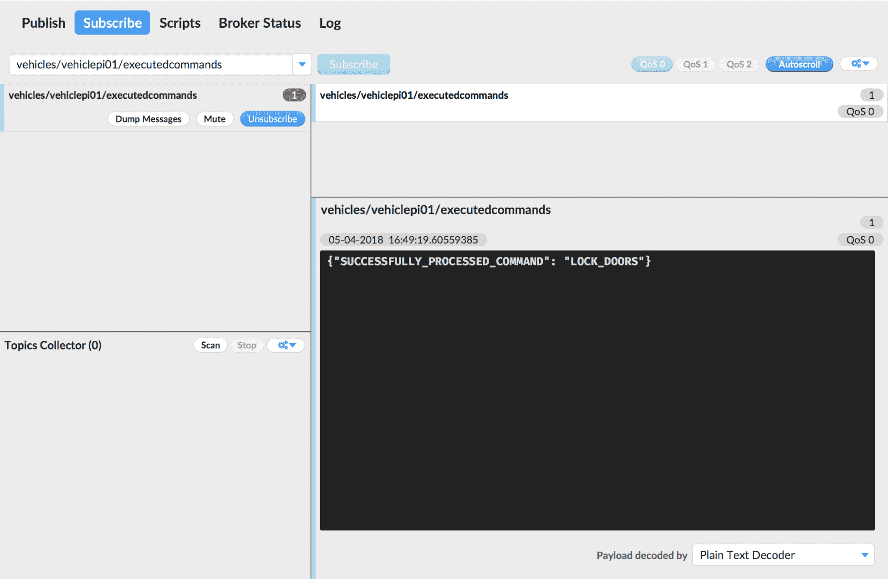
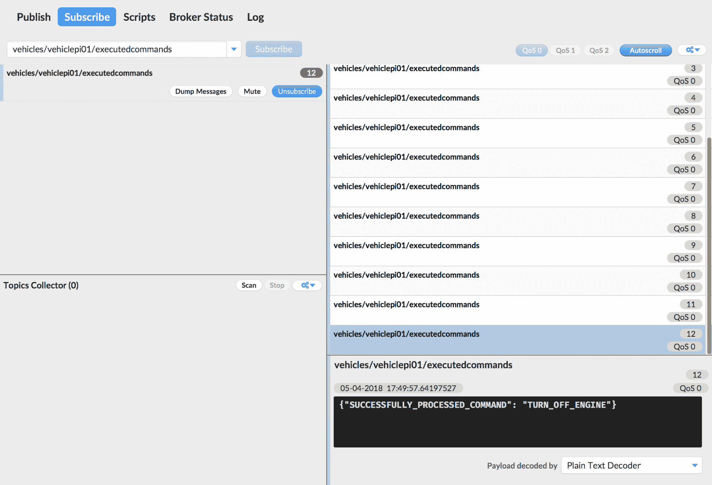
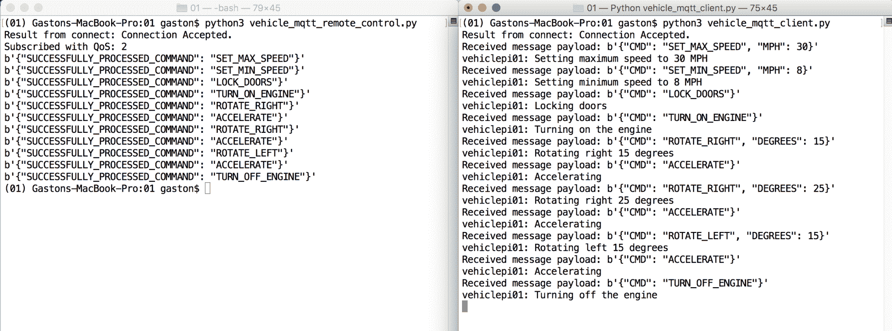
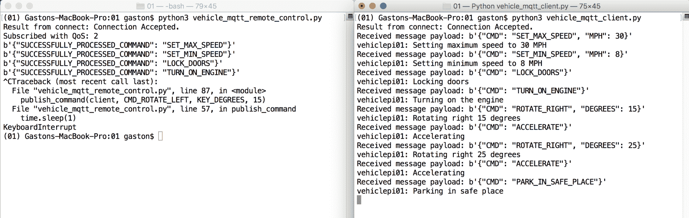
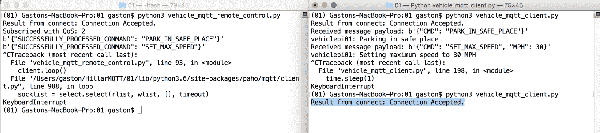
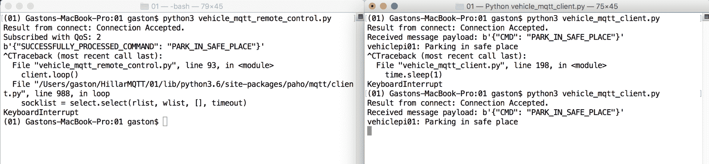

# 第五章：测试和改进我们的 Python 车辆控制解决方案

在本章中，我们将使用我们的车辆控制解决方案与 MQTT 消息和 Python 代码。我们将学习如何使用 Python 代码处理接收到的 MQTT 消息中的命令。我们将编写 Python 代码来组成和发送带有命令的 MQTT 消息。我们将使用阻塞和线程化的网络循环，并理解它们的区别。最后，我们将利用遗嘱功能。我们将深入研究以下内容：

+   使用 Python 处理命令

+   使用 Python 发送消息

+   使用 Python 处理网络循环

+   使用 Python 处理遗嘱和遗嘱消息

+   使用保留的遗嘱消息

+   理解阻塞和非阻塞代码

+   使用线程化客户端接口

# 使用 Python 处理命令

在第四章中，*使用 Python 和 MQTT 消息编写控制车辆的代码*，我们编写了一个能够使用 Python 代码处理作为 MQTT 消息接收的车辆命令的解决方案。现在，我们想让车辆处理多条命令，以检查所有部件如何协同工作。我们想执行以下命令：

```py
{"CMD": "LOCK_DOORS"} 
{"CMD": "TURN_OFF_PARKING_LIGHTS"} 
{"CMD": "SET_MAX_SPEED", "MPH": 10} 
{"CMD": "SET_MIN_SPEED", "MPH": 1} 
{"CMD": "TURN_ON_ENGINE"} 
{"CMD": "TURN_ON_HEADLIGHTS"} 
{"CMD": "ACCELERATE"} 
{"CMD": "ROTATE_RIGHT", "DEGREES": 45} 
{"CMD": "ACCELERATE"} 
{"CMD": "TURN_ON_PARKING_LIGHTS"} 
{"CMD": "BRAKE"} 
{"CMD": "TURN_OFF_ENGINE"} 
```

确保 Mosquitto 服务器，或者您可能想要用于此示例的任何其他 MQTT 服务器正在运行。

启动 MQTT.fx 并按照[第四章](https://cdp.packtpub.com/hands_on_mqtt_programming_with_python/wp-admin/post.php?post=129&action=edit#post_107)中解释的所有步骤，*使用 Python 和 MQTT 消息编写控制车辆的代码*，配置 TLS 和 TLS 身份验证的连接，如果您之前没有使用 MQTT.fx 与 MQTT 服务器建立安全连接。然后，点击连接按钮。

点击订阅并在订阅按钮左侧的下拉菜单中输入`vehicles/vehiclepi01/executedcommands`。然后，点击订阅按钮。MQTT.fx 将在左侧显示一个新面板，其中包含我们已订阅的主题过滤器，QoS 级别为 0。

然后，在任何您想要用作使用 Linux 或 macOS 的 MQTT 客户端的计算机或设备上执行以下命令以启动车辆控制器示例：

```py
    python3 subscribe_with_paho.py 
```

在 Windows 中，您必须执行以下命令：

```py
    python subscribe_with_paho.py
```

保持代码在您选择用作此示例的车辆控制器的本地计算机或 IoT 板上运行。

在 MQTT.fx 中，点击发布并在发布按钮左侧的下拉菜单中输入`vehicles/vehiclepi01/commands`。点击 QoS 2，因为我们想使用 QoS 级别 2。

在发布按钮下方的文本框中输入以下文本：`{"CMD": "LOCK_DOORS"}`

然后，点击发布按钮。MQTT.fx 将以 QoS 级别 2 将输入的文本发布到指定主题。

转到您可以看到由接收消息并控制车辆的 Python 代码生成的输出的窗口。如果您在 IoT 板上运行代码，您可能正在使用 SSH 终端或连接到 IoT 板的屏幕。如果您在本地计算机上运行代码，请转到终端或命令提示符，根据您使用的操作系统。您将看到以下输出：

```py
    Result from connect: Connection Accepted.
    Received message payload: b'{"CMD": "LOCK_DOORS"}'
    vehiclepi01: Locking doors
```

代码已收到带有命令的消息，`Vehicle`实例执行了`lock_doors`方法，并且输出显示了执行此代码的结果。

返回到 MQTT.fx，点击订阅，您将看到`vehicles/vehiclepi01/executedcommands`主题中已经有一条新消息到达，其有效载荷如下：`{"SUCCESSFULLY_PROCESSED_COMMAND": "LOCK_DOORS"}`。以下屏幕截图显示了在 MQTT.fx 中接收到的消息：



现在，对先前显示的列表中包含的每个命令重复以下过程。我们希望我们的车辆控制应用程序处理通过 MQTT 消息接收的每个命令，QoS 级别为 2。删除现有文本，然后在发布按钮下的文本框中输入 JSON 字符串的文本，然后单击发布按钮。MQTT.fx 将以 QoS 级别 2 将输入的文本发布到指定主题：

```py
{"CMD": "TURN_OFF_PARKING_LIGHTS"} 

{"CMD": "SET_MAX_SPEED", "MPH": 10} 

{"CMD": "SET_MIN_SPEED", "MPH": 1} 

{"CMD": "TURN_ON_ENGINE"} 

{"CMD": "TURN_ON_HEADLIGHTS"} 

{"CMD": "ACCELERATE"} 

{"CMD": "ROTATE_RIGHT", "DEGREES": 45} 

{"CMD": "ACCELERATE"} 

{"CMD": "TURN_ON_PARKING_LIGHTS"} 

{"CMD": "BRAKE"} 

{"CMD": "TURN_OFF_ENGINE"} 

```

转到您可以看到由接收消息并控制车辆的 Python 代码生成的输出的窗口。您将看到以下输出，指示所有命令已被接收和处理：

```py
    Result from connect: Connection Accepted.
    Received message payload: b'{"CMD": "LOCK_DOORS"}'
    vehiclepi01: Locking doors
    Received message payload: b'{"CMD": "TURN_OFF_PARKING_LIGHTS"}'
    vehiclepi01: Turning off parking lights
    Received message payload: b'{"CMD": "SET_MAX_SPEED", "MPH": 10}'
    vehiclepi01: Setting maximum speed to 10 MPH
    Received message payload: b'{"CMD": "SET_MIN_SPEED", "MPH": 1}'
    vehiclepi01: Setting minimum speed to 1 MPH
    Received message payload: b'{"CMD": "TURN_ON_ENGINE"}'
    vehiclepi01: Turning on the engine
    Received message payload: b'{"CMD": "TURN_ON_HEADLIGHTS"}'
    vehiclepi01: Turning on headlights
    Received message payload: b'{"CMD": "ACCELERATE"}'
    vehiclepi01: Accelerating
    Received message payload: b'{"CMD": "ROTATE_RIGHT", "DEGREES": 45}'
    vehiclepi01: Rotating right 45 degrees
    Received message payload: b'{"CMD": "ACCELERATE"}'
    vehiclepi01: Accelerating
    Received message payload: b'{"CMD": "TURN_ON_PARKING_LIGHTS"}'
    vehiclepi01: Turning on parking lights
    Received message payload: b'{"CMD": "BRAKE"}'
    vehiclepi01: Braking
    Received message payload: b'{"CMD": "TURN_OFF_ENGINE"}'
    vehiclepi01: Turning off the engine
```

返回到 MQTT.fx，单击订阅，您将看到已到达`vehicles/vehiclepi01/executedcommands`主题的共计 12 条消息。您可以通过单击窗口右侧代表每条消息的面板来轻松检查每条接收消息的有效负载的内容。以下屏幕截图显示了 MQTT.fx 中收到的最后一条消息：



现在，我们将使用 Mosquitto 命令行实用程序订阅`vehicles/vehiclepi01/executedcommands`主题，并发布许多带有命令的 JSON 字符串的 MQTT 消息到`vehicles/vehiclepi01/commands`主题。这次，我们将发布以下命令：

```py
{"CMD": "UNLOCK_DOORS"} 
{"CMD": "LOCK_DOORS"} 
{"CMD": "SET_MAX_SPEED", "MPH": 20} 
{"CMD": "SET_MIN_SPEED", "MPH": 5} 
{"CMD": "TURN_ON_ENGINE"} 
{"CMD": "ACCELERATE"} 
{"CMD": "ROTATE_LEFT", "DEGREES": 15} 
{"CMD": "ROTATE_LEFT", "DEGREES": 20} 
{"CMD": "BRAKE"} 
{"CMD": "TURN_OFF_ENGINE"} 
```

在 macOS 或 Linux 中打开另一个终端，或者在 Windows 中打开另一个命令提示符，转到 Mosquitto 安装的目录，并运行以下命令。将`192.168.1.1`替换为 MQTT 服务器的 IP 或主机名。记得将`ca.crt`、`board001.crt`和`board001.key`替换为在`board_certificates`目录中创建的这些文件的完整路径。保持窗口打开，实用程序将显示在`vehicles/vehiclepi01/executedcommands`主题中接收的所有消息。示例的代码文件包含在`mqtt_python_gaston_hillar_05_01`文件夹中的`script_01.txt`文件中：

```py
    mosquitto_sub -h 192.168.1.1 -V mqttv311 -p 8883 --cafile ca.crt --
    cert device001.crt --key device001.key -t 
    vehicles/vehiclepi01/executedcommands --tls-version tlsv1.2

```

在 macOS 或 Linux 中打开另一个终端，或者在 Windows 中打开另一个命令提示符，转到 Mosquitto 安装的目录，并运行以下命令以使用 QoS 级别 2 发布带有命令的消息到`vehicles/vehiclepi01/commands`主题。对于`mosquitto_sub`命令，进行与之前解释的相同替换。示例的代码文件包含在`mqtt_python_gaston_hillar_05_01`文件夹中的`script_02.txt`文件中：

```py
    mosquitto_pub -h 192.168.1.1 -V mqttv311 -p 8883 --cafile ca.crt --
cert board001.crt --key board001.key -t vehicles/vehiclepi01/commands -m '{"CMD": "UNLOCK_DOORS"}' -q 2 --tls-version tlsv1.2

    mosquitto_pub -h 192.168.1.1 -V mqttv311 -p 8883 --cafile ca.crt --cert board001.crt --key board001.key -t vehicles/vehiclepi01/commands -m '{"CMD": "LOCK_DOORS"}' -q 2 --tls-version tlsv1.2

    mosquitto_pub -h 192.168.1.1 -V mqttv311 -p 8883 --cafile ca.crt --cert board001.crt --key board001.key -t vehicles/vehiclepi01/commands -m '{"CMD": "SET_MAX_SPEED", "MPH": 20}' -q 2 --tls-version tlsv1.2

    mosquitto_pub -h 192.168.1.1 -V mqttv311 -p 8883 --cafile ca.crt --cert board001.crt --key board001.key -t vehicles/vehiclepi01/commands -m '{"CMD": "SET_MIN_SPEED", "MPH": 5}' -q 2 --tls-version tlsv1.2

    mosquitto_pub -h 192.168.1.1 -V mqttv311 -p 8883 --cafile ca.crt --cert board001.crt --key board001.key -t vehicles/vehiclepi01/commands -m '{"CMD": "TURN_ON_ENGINE"}' -q 2 --tls-version tlsv1.2

    mosquitto_pub -h 192.168.1.1 -V mqttv311 -p 8883 --cafile ca.crt --cert board001.crt --key board001.key -t vehicles/vehiclepi01/commands -m '{"CMD": "ACCELERATE"}' -q 2 --tls-version tlsv1.2

    mosquitto_pub -h 192.168.1.1 -V mqttv311 -p 8883 --cafile ca.crt --cert board001.crt --key board001.key -t vehicles/vehiclepi01/commands -m '{"CMD": "ROTATE_LEFT", "DEGREES": 15}' -q 2 --tls-version tlsv1.2

    mosquitto_pub -h 192.168.1.1 -V mqttv311 -p 8883 --cafile ca.crt --cert board001.crt --key board001.key -t vehicles/vehiclepi01/commands -m '{"CMD": "ROTATE_LEFT", "DEGREES": 20}' -q 2 --tls-version tlsv1.2

    mosquitto_pub -h 192.168.1.1 -V mqttv311 -p 8883 --cafile ca.crt --cert board001.crt --key board001.key -t vehicles/vehiclepi01/commands -m '{"CMD": "BRAKE"}' -q 2 --tls-version tlsv1.2

    mosquitto_pub -h 192.168.1.1 -V mqttv311 -p 8883 --cafile ca.crt --cert board001.crt --key board001.key -t vehicles/vehiclepi01/commands -m '{"CMD": "TURN_OFF_ENGINE"}' -q 2 --tls-version tlsv1.2

```

运行上述命令后，`VehicleCommandProcessor`类将接收这些命令并处理它们。几秒钟后，您将在执行`mosquitto_sub`实用程序的窗口中看到以下输出：

```py
    {"SUCCESSFULLY_PROCESSED_COMMAND": "UNLOCK_DOORS"}
    {"SUCCESSFULLY_PROCESSED_COMMAND": "LOCK_DOORS"}
    {"SUCCESSFULLY_PROCESSED_COMMAND": "SET_MAX_SPEED"}
    {"SUCCESSFULLY_PROCESSED_COMMAND": "SET_MIN_SPEED"}
    {"SUCCESSFULLY_PROCESSED_COMMAND": "TURN_ON_ENGINE"}
    {"SUCCESSFULLY_PROCESSED_COMMAND": "ACCELERATE"}
    {"SUCCESSFULLY_PROCESSED_COMMAND": "ROTATE_LEFT"}
    {"SUCCESSFULLY_PROCESSED_COMMAND": "ROTATE_LEFT"}
    {"SUCCESSFULLY_PROCESSED_COMMAND": "BRAKE"}
    {"SUCCESSFULLY_PROCESSED_COMMAND": "TURN_OFF_ENGINE"}

```

请注意，MQTT.fx 实用程序也将接收消息，因为它保持订阅`vehicles/vehiclepi01/executedcommands`主题。

转到您可以看到由接收消息并控制车辆的 Python 代码生成的输出的窗口。您将看到以下输出，指示所有命令已被接收和处理：

```py
    Result from connect: Connection Accepted.
    Received message payload: b'{"CMD": "UNLOCK_DOORS"}'
    vehiclepi01: Unlocking doors
    Received message payload: b'{"CMD": "LOCK_DOORS"}'
    vehiclepi01: Locking doors
    Received message payload: b'{"CMD": "SET_MAX_SPEED", "MPH": 20}'
    vehiclepi01: Setting maximum speed to 20 MPH
    Received message payload: b'{"CMD": "SET_MIN_SPEED", "MPH": 5}'
    vehiclepi01: Setting minimum speed to 5 MPH
    Received message payload: b'{"CMD": "TURN_ON_ENGINE"}'
    vehiclepi01: Turning on the engine
    Received message payload: b'{"CMD": "ACCELERATE"}'
    vehiclepi01: Accelerating
    Received message payload: b'{"CMD": "ROTATE_LEFT", "DEGREES": 15}'
    vehiclepi01: Rotating left 15 degrees
    Received message payload: b'{"CMD": "ROTATE_LEFT", "DEGREES": 20}'
    vehiclepi01: Rotating left 20 degrees
    Received message payload: b'{"CMD": "BRAKE"}'
    vehiclepi01: Braking
    Received message payload: b'{"CMD": "TURN_OFF_ENGINE"}'
    vehiclepi01: Turning off the engine

```

# 使用 Python 发送消息

到目前为止，我们一直在使用 GUI 和命令行工具发布 MQTT 消息来控制车辆。现在，我们将编写 Python 代码来发布控制每辆车的命令，并检查执行这些命令的结果。当然，GUI 实用程序，如 MQTT.fx 和 Mosquitto 命令行实用程序，非常有用。但是，一旦我们知道事情正在按我们的期望进行，我们可以编写必要的代码以在与我们用于在 IoT 板上运行代码的相同编程语言中执行测试。

现在，我们将编写一个 Python 客户端，它将发布消息到`vehicles/vehiclepi01/commands`主题，并订阅到`vehicles/vehiclepi01/executedcommands`主题。我们将编写发布者和订阅者。这样，我们将能够设计能够通过 Python 代码与 MQTT 消息通信的应用程序，Python 将作为客户端应用程序的编程语言。具体来说，这些应用程序将能够通过 MQTT 服务器与所有发布者和订阅者设备中的 Python 代码进行通信。

我们可以在任何其他能够执行 Python 3.x 的计算机或物联网板上运行 Python 客户端。

在第四章中，*使用 Python 和 MQTT 消息编写控制车辆的代码*，我们在主虚拟环境文件夹中创建了一个名为`config.py`的 Python 文件。在这个文件中，我们定义了许多配置值，用于与 Mosquitto MQTT 服务器建立连接。这样，所有配置值都包含在一个特定的 Python 脚本中。如果您需要更改此文件以配置将组成并发送 MQTT 消息以控制车辆的应用程序，请确保您查看了第四章中包含的说明。

现在，我们将在主虚拟环境文件夹中创建一个名为`vehicle_mqtt_remote_control.py`的新的 Python 文件。我们将创建许多函数，并将它们分配为 MQTT 客户端中事件的回调函数。此外，我们将声明变量、一个辅助类和一个辅助函数，以便轻松地发布带有命令和所需值的消息。以下行显示了定义变量、辅助类和函数的代码。示例的代码文件包含在`mqtt_python_gaston_hillar_05_01`文件夹中的`vehicle_mqtt_remote_control.py`文件中：

```py
from config import * 
from vehicle_commands import * 
import paho.mqtt.client as mqtt 
import time 
import json 

vehicle_name = "vehiclepi01" 
commands_topic = "vehicles/{}/commands".format(vehicle_name) 
processed_commands_topic = "vehicles/{}/executedcommands".format(vehicle_name) 

class LoopControl: 
    is_last_command_processed = False 

def on_connect(client, userdata, flags, rc): 
    print("Result from connect: {}".format( 
        mqtt.connack_string(rc))) 
    # Check whether the result form connect is the CONNACK_ACCEPTED 
      connack code 
    if rc == mqtt.CONNACK_ACCEPTED: 
        # Subscribe to the commands topic filter 
        client.subscribe( 
            processed_commands_topic,  
            qos=2) 

def on_message(client, userdata, msg): 
    if msg.topic == processed_commands_topic: 
        print(str(msg.payload)) 
        if str(msg.payload).count(CMD_TURN_OFF_ENGINE) > 0: 
            LoopControl.is_last_command_processed = True 

def on_subscribe(client, userdata, mid, granted_qos): 
    print("Subscribed with QoS: {}".format(granted_qos[0])) 

def build_command_message(command_name, key="", value=""): 
    if key: 
        # The command requires a key 
        command_message = json.dumps({ 
            COMMAND_KEY: command_name, 
            key: value}) 
    else: 
        # The command doesn't require a key 
        command_message = json.dumps({ 
            COMMAND_KEY: command_name}) 
    return command_message 

def publish_command(client, command_name, key="", value=""):
    command_message = build_command_message(
        command_name, key, value)
    result = client.publish(topic=commands_topic, payload=command_message, qos=2)
client.loop()
time.sleep(1)
return result
```

第一行导入了我们在著名的`config.py`文件中声明的变量。代码声明了`vehicle_name`变量，保存了一个字符串`"vehiclepi01"`，我们可以轻松地用要控制的车辆的名称替换它。我们的主要目标是构建并发布命令消息到`commands_topic`变量中指定的主题。我们将订阅到`processed_commands_topic`变量中指定的主题。

`LoopControl`类声明了一个名为`is_last_command_processed`的类属性，初始化为`False`。我们将使用这个类属性作为控制网络循环的标志。

`on_connect`函数是一旦与 MQTT 服务器建立了成功的连接就会执行的回调函数。代码检查`rc`参数的值，该参数提供 MQTT 服务器返回的`CONNACK`代码。如果此值与`mqtt.CONNACK_ACCEPTED`匹配，则表示 MQTT 服务器接受了连接请求，因此，代码调用`client.subscribe`方法，为`client`参数中接收到的 MQTT 客户端订阅了保存在`processed_commands_topic`中的主题名称，QoS 级别为 0。

`on_message`函数将在每次新消息到达我们订阅的主题时执行。该函数只是打印接收到的消息的有效负载的原始字符串。如果有效负载包含在`CMD_TURN_OFF_ENGINE`常量中保存的字符串，则我们假定上一个命令已成功执行，并且代码将`LoopControl.is_last_command_processed`设置为`True`。这样，我们将根据车辆通过 MQTT 消息指示的已处理命令来控制网络循环。

`on_subscribe`函数将在订阅成功完成时调用。

下表总结了将根据从 MQTT 服务器接收到的响应调用的函数：

| **来自 MQTT 服务器的响应** | **将被调用的函数** |
| --- | --- |
| `CONNACK` | `on_connnect` |
| `SUBACK` | `on_subscribe` |
| `PUBLISH` | `on_message` |

`build_command_message`函数接收命令名称、键和值，提供构建包含命令的 JSON 键值对字符串所需的信息。请注意，最后两个参数是可选的，它们的默认值是空字符串。该函数创建一个字典，并将字典序列化为 JSON 格式的字符串保存在`command_message`局部变量中。`COMMAND_KEY`常量是字典的第一个键，`command_name`作为参数接收，是组成第一个键值对的值。最后，函数返回`command_message`字符串。

`publish_command`函数接收 MQTT 客户端、命令名称、键和值，提供执行命令所需的信息。与`build_command_message`函数一样，键和值参数是可选的，它们的默认值是空字符串。该函数使用接收到的`command_name`、`key`和`value`参数调用先前解释的`build_command_message`函数，并将结果保存在`command_message`局部变量中。然后，代码调用`client.publish`方法，将`command_message` JSON 格式的字符串发布到`commands_topic`变量中保存的主题名称，QoS 级别为 2。

接下来的一行调用`client.loop`方法，以确保与 MQTT 服务器的通信进行，并休眠一秒。这样，消息将被发布，应用程序将等待一秒。

# 使用 Python 处理网络循环

现在，我们将在`__main__`方法中使用之前编写的`functions`，该方法将发布包含在 MQTT 消息中的许多命令，以便控制车辆的代码将处理这些命令。您必须将下面的代码添加到现有的`vehicle_mqtt_remote_control.py` Python 文件中。以下代码显示了`__main__`方法的代码块。示例的代码文件包含在`mqtt_python_gaston_hillar_05_01`文件夹中的`vehicle_mqtt_remote_control.py`文件中：

```py
if __name__ == "__main__": 
    client = mqtt.Client(protocol=mqtt.MQTTv311) 
    client.on_connect = on_connect 
    client.on_subscribe = on_subscribe 
    client.on_message = on_message 
    client.tls_set(ca_certs = ca_certificate, 
        certfile=client_certificate, 
        keyfile=client_key) 
    client.connect(host=mqtt_server_host, 
        port=mqtt_server_port, 
        keepalive=mqtt_keepalive) 
    publish_command(client, CMD_SET_MAX_SPEED, KEY_MPH, 30) 
    publish_command(client, CMD_SET_MIN_SPEED, KEY_MPH, 8) 
    publish_command(client, CMD_LOCK_DOORS) 
    publish_command(client, CMD_TURN_ON_ENGINE) 
    publish_command(client, CMD_ROTATE_RIGHT, KEY_DEGREES, 15) 
    publish_command(client, CMD_ACCELERATE) 
    publish_command(client, CMD_ROTATE_RIGHT, KEY_DEGREES, 25) 
    publish_command(client, CMD_ACCELERATE) 
    publish_command(client, CMD_ROTATE_LEFT, KEY_DEGREES, 15) 
    publish_command(client, CMD_ACCELERATE) 
    publish_command(client, CMD_TURN_OFF_ENGINE) 
    while LoopControl.is_last_command_processed == False: 
        # Process messages and the commands every 500 milliseconds 
        client.loop() 
        time.sleep(0.5) 
    client.disconnect() 
    client.loop() 
```

代码的前几行与我们编写的第一个 Python 示例类似。调用`client.connect`方法后，代码多次调用`publish_command`命令来构建并发布带有命令的消息。

`while`循环调用`client.loop`方法，以确保与 MQTT 服务器的通信进行，并休眠 500 毫秒，即 0.5 秒。在最后一个命令被处理后，`LoopControl.is_last_command_processed`类变量被设置为`True`，`while`循环结束执行。当这发生时，代码调用`client.disconnect`方法，最后调用`client.loop`方法，以确保断开连接请求被处理。

如果在调用`client.disconnect`后不调用`client.loop`方法，程序可能会在不向 MQTT 服务器发送断开连接请求的情况下结束执行。在接下来的章节中，我们将使用遗嘱功能，并注意客户端断开连接的方式对该功能的使用产生重要影响。

在这种情况下，我们不希望循环永远运行，因为我们有一个特定的目标，即组合并发送一组命令。一旦我们确信最后一个命令已被处理，我们就会关闭与 MQTT 服务器的连接。

确保控制`vehiclepi01`的代码正在运行，也就是说，我们在第四章中编写的`vehicle_mqtt_client.py` Python 脚本正在运行。

然后，在任何您想要用作 MQTT 客户端并且使用 Linux 或 macOS 的计算机或设备上执行以下命令来启动车辆远程控制示例：

```py
    python3 vehicle_mqtt_remote_control.py
```

在 Windows 中，您必须执行以下命令：

```py
    python vehicle_mqtt_remote_control.py
```

保持代码在您选择用作此示例车辆远程控制的本地计算机或 IoT 板上运行。

转到执行先前的 Python 脚本`vehicle_mqtt_remote_control.py`的设备和窗口。您将看到以下输出。Python 代码将显示在`vehicles/vehiclepi01/executedcommands`主题中接收到的所有消息。在车辆成功处理`TURN_OFF_ENGINE`命令后，程序将结束执行：

```py
    Result from connect: Connection Accepted.
    Subscribed with QoS: 2
    b'{"SUCCESSFULLY_PROCESSED_COMMAND": "SET_MAX_SPEED"}'
    b'{"SUCCESSFULLY_PROCESSED_COMMAND": "SET_MIN_SPEED"}'
    b'{"SUCCESSFULLY_PROCESSED_COMMAND": "LOCK_DOORS"}'
    b'{"SUCCESSFULLY_PROCESSED_COMMAND": "TURN_ON_ENGINE"}'
    b'{"SUCCESSFULLY_PROCESSED_COMMAND": "ROTATE_RIGHT"}'
    b'{"SUCCESSFULLY_PROCESSED_COMMAND": "ACCELERATE"}'
    b'{"SUCCESSFULLY_PROCESSED_COMMAND": "ROTATE_RIGHT"}'
    b'{"SUCCESSFULLY_PROCESSED_COMMAND": "ACCELERATE"}'
    b'{"SUCCESSFULLY_PROCESSED_COMMAND": "ROTATE_LEFT"}'
    b'{"SUCCESSFULLY_PROCESSED_COMMAND": "ACCELERATE"}'
    b'{"SUCCESSFULLY_PROCESSED_COMMAND": "TURN_OFF_ENGINE"}'

```

转到执行控制车辆并处理接收到的命令的 Python 脚本`vehicle_mqtt_client.py`的设备和窗口。您将看到以下输出：

```py
    Received message payload: b'{"CMD": "SET_MAX_SPEED", "MPH": 30}'
    vehiclepi01: Setting maximum speed to 30 MPH
    Received message payload: b'{"CMD": "SET_MIN_SPEED", "MPH": 8}'
    vehiclepi01: Setting minimum speed to 8 MPH
    Received message payload: b'{"CMD": "LOCK_DOORS"}'
    vehiclepi01: Locking doors
    Received message payload: b'{"CMD": "TURN_ON_ENGINE"}'
    vehiclepi01: Turning on the engine
    Received message payload: b'{"CMD": "ROTATE_RIGHT", "DEGREES": 15}'
    vehiclepi01: Rotating right 15 degrees
    Received message payload: b'{"CMD": "ACCELERATE"}'
    vehiclepi01: Accelerating
    Received message payload: b'{"CMD": "ROTATE_RIGHT", "DEGREES": 25}'
    vehiclepi01: Rotating right 25 degrees
    Received message payload: b'{"CMD": "ACCELERATE"}'
    vehiclepi01: Accelerating
    Received message payload: b'{"CMD": "ROTATE_LEFT", "DEGREES": 15}'
    vehiclepi01: Rotating left 15 degrees
    Received message payload: b'{"CMD": "ACCELERATE"}'
    vehiclepi01: Accelerating
    Received message payload: b'{"CMD": "TURN_OFF_ENGINE"}'
    vehiclepi01: Turning off the engine
```

以下屏幕截图显示了在 macOS 计算机上运行的两个终端窗口。左侧的终端显示了由发布命令并作为车辆远程控制器的 Python 客户端显示的消息，即`vehicle_mqtt_remote_control.py`脚本。右侧的终端显示了控制车辆并处理接收到的命令的 Python 客户端代码的结果，即`vehicle_mqtt_client.py`脚本：



# 使用 Python 处理遗嘱

现在，我们将检查如果代表我们的车辆远程控制应用程序的 MQTT 客户端意外断开与我们迄今为止编写的代码所连接的 MQTT 服务器会发生什么。请注意所有步骤，因为我们将手动中断车辆远程控制程序的执行，以了解我们将利用遗嘱功能解决的特定问题。

在任何您想要用作 MQTT 客户端并且使用 Linux 或 macOS 的计算机或设备上执行以下命令来启动车辆远程控制示例：

```py
    python3 vehicle_mqtt_remote_control.py
```

在 Windows 中，您必须执行以下命令：

```py
    python vehicle_mqtt_remote_control.py
```

转到执行先前的 Python 脚本`vehicle_mqtt_remote_control.py`的设备和窗口。在看到以下输出后，按下*Ctrl* + *C*中断脚本的执行，直到所有命令都被处理：

```py
    Result from connect: Connection Accepted.
    Subscribed with QoS: 2
    b'{"SUCCESSFULLY_PROCESSED_COMMAND": "SET_MAX_SPEED"}'
    b'{"SUCCESSFULLY_PROCESSED_COMMAND": "SET_MIN_SPEED"}'
    b'{"SUCCESSFULLY_PROCESSED_COMMAND": "LOCK_DOORS"}'
    b'{"SUCCESSFULLY_PROCESSED_COMMAND": "TURN_ON_ENGINE"}'
    b'{"SUCCESSFULLY_PROCESSED_COMMAND": "ROTATE_RIGHT"}'

```

按下*Ctrl* + *C*后，您将看到类似以下行的回溯输出：

```py
    ^CTraceback (most recent call last):
      File "vehicle_mqtt_remote_control.py", line 86, in <module>
        publish_command(client, CMD_ACCELERATE)
      File "vehicle_mqtt_remote_control.py", line 57, in 
        publish_command
        time.sleep(1)
      KeyboardInterrupt

```

我们中断了作为车辆远程控制器的 MQTT 客户端与 MQTT 服务器之间的连接。我们没有等待所有命令被发布，而是意外地将 MQTT 客户端与 MQTT 服务器断开连接。车辆不知道远程控制应用程序已中断。

在这种情况下，我们使用了一个键盘快捷键来中断 Python 程序的执行。然而，网络故障可能是 MQTT 客户端意外与 MQTT 服务器断开连接的另一个原因。

当然，我们不希望网络故障使我们的车辆失去控制，因此，我们希望确保如果远程控制应用程序与 MQTT 服务器失去连接，车辆将停放在一个安全的地方。在这种情况下，我们希望确保车辆接收到一条指示车辆必须停放在为车辆配置的安全地点的命令的消息。

在第一章*，安装 MQTT 3.1.1 Mosquitto 服务器*中，我们分析了组成 MQTT 客户端发送到 MQTT 服务器以建立连接的`CONNECT`控制数据包的有效载荷的字段和标志。现在，我们将使用`paho-mqtt`中提供的适当方法来配置`Will`、`WillQoS`、`WillRetain`、`WillTopic`和`WillMessage`标志和字段的值，以使我们的 MQTT 客户端利用 MQTT 的遗嘱功能。

打开现有的`vehicle_mqtt_remote_control.py` Python 文件，并用以下代码替换定义`__main__`方法的行，以配置我们希望 MQTT 服务器在发生意外断开连接时发送给车辆的遗嘱消息。添加的行已经突出显示。示例的代码文件包含在`mqtt_python_gaston_hillar_05_02`文件夹中的`vehicle_mqtt_remote_control.py`文件中。

```py
if __name__ == "__main__": 
    client = mqtt.Client(protocol=mqtt.MQTTv311) 
    client.on_connect = on_connect 
    client.on_subscribe = on_subscribe 
    client.on_message = on_message 
    client.tls_set(ca_certs = ca_certificate, 
        certfile=client_certificate, 
        keyfile=client_key) 
    # Set a will to be sent to the MQTT server in case the client 
    # disconnects unexpectedly 
    last_will_payload = build_command_message(CMD_PARK_IN_SAFE_PLACE) 
    client.will_set(topic=commands_topic,  
        payload=last_will_payload,  
        qos=2) 
    client.connect(host=mqtt_server_host, 
        port=mqtt_server_port, 
        keepalive=mqtt_keepalive) 
    publish_command(client, CMD_SET_MAX_SPEED, KEY_MPH, 30) 
    publish_command(client, CMD_SET_MIN_SPEED, KEY_MPH, 8) 
    publish_command(client, CMD_LOCK_DOORS) 
    publish_command(client, CMD_TURN_ON_ENGINE) 
    publish_command(client, CMD_ROTATE_RIGHT, KEY_DEGREES, 15) 
    publish_command(client, CMD_ACCELERATE) 
    publish_command(client, CMD_ROTATE_RIGHT, KEY_DEGREES, 25) 
    publish_command(client, CMD_ACCELERATE) 
    publish_command(client, CMD_ROTATE_LEFT, KEY_DEGREES, 15) 
    publish_command(client, CMD_ACCELERATE) 
    publish_command(client, CMD_TURN_OFF_ENGINE) 
    while LoopControl.is_last_command_processed == False: 
        # Process messages and the commands every 500 milliseconds 
        client.loop() 
        time.sleep(0.5) 
    client.disconnect() 
    client.loop() 
```

在代码调用`client.connect`方法之前，我们添加了两行代码，即在向 MQTT 服务器发送连接请求之前。第一行调用`build_command_message`函数，并将`CMD_PARK_IN_SAFE_PLACE`作为参数，以构建使车辆停放在安全地方的命令的 JSON 字符串，并将其存储在`last_will_payload`变量中。

下一行代码调用`client.will_set`方法，允许我们配置`Will`、`WillQoS`、`WillRetain`、`WillTopic`和`WillMessage`标志和字段的期望值，并将其用于 CONNECT 控制数据包。该代码使用`commands_topic`、`last_will_payload`和`2`作为主题、有效载荷和 qos 参数的值来调用此方法。由于我们没有为`retain`参数指定值，该方法将使用其默认值`False`，这指定了遗嘱消息不会是保留消息。这样，当下一行代码调用`client.connect`方法请求 MQTT 客户端与 MQTT 服务器建立连接时，`CONNECT`控制数据包将包括用于配置遗嘱消息的字段和标志的适当值，QoS 级别为 2，`commands_topic`作为消息将被发布的主题，`last_will_payload`作为消息的有效载荷。

现在，在任何您想要用作 MQTT 客户端并使用 Linux 或 macOS 的计算机或设备上执行以下行以启动车辆远程控制示例：

```py
    python3 vehicle_mqtt_remote_control.py
```

在 Windows 中，您必须执行以下行：

```py
    python vehicle_mqtt_remote_control.py
```

转到您执行之前的 Python 脚本`vehicle_mqtt_remote_control.py`的设备和窗口。在看到以下输出后，按*Ctrl* + *C*中断脚本的执行，然后再处理所有命令：

```py
    Result from connect: Connection Accepted.
    Subscribed with QoS: 2
    b'{"SUCCESSFULLY_PROCESSED_COMMAND": "SET_MAX_SPEED"}'
    b'{"SUCCESSFULLY_PROCESSED_COMMAND": "SET_MIN_SPEED"}'
    b'{"SUCCESSFULLY_PROCESSED_COMMAND": "LOCK_DOORS"}'
    b'{"SUCCESSFULLY_PROCESSED_COMMAND": "TURN_ON_ENGINE"}'

```

按下*Ctrl* + *C*后，您将看到类似以下行的输出：

```py
^CTraceback (most recent call last):
 File "vehicle_mqtt_remote_control.py", line 87, in <module>
 publish_command(client, CMD_ROTATE_LEFT, KEY_DEGREES, 15)
 File "vehicle_mqtt_remote_control.py", line 57, in publish_command
 time.sleep(1)
 KeyboardInterrupt
```

我们中断了作为车辆远程控制器的 MQTT 客户端与 MQTT 服务器之间的连接。我们没有等待所有命令被发布，而是意外地从 MQTT 服务器断开了 MQTT 客户端的连接。因此，MQTT 服务器会发布配置的遗嘱消息，即当远程控制车辆的 MQTT 客户端与 MQTT 服务器建立连接时配置的遗嘱消息。这样，当远程控制应用程序与 MQTT 服务器之间的连接丢失时，车辆会收到一个命令，要求它停放在一个安全的地方。

转到您执行控制车辆并处理接收到的命令的 Python 脚本`vehicle_mqtt_client.py`的设备和窗口。您将看到类似以下行的输出。请注意，最后接收到的消息指示车辆停放在一个安全的地方。这个最后接收到的消息是我们在名为`vehicle_mqtt_remote_control.py`的 Python 脚本中添加的代码行配置的遗嘱消息。

```py
Received message payload: b'{"CMD": "SET_MAX_SPEED", "MPH": 30}'
vehiclepi01: Setting maximum speed to 30 MPH
Received message payload: b'{"CMD": "SET_MIN_SPEED", "MPH": 8}'
vehiclepi01: Setting minimum speed to 8 MPH
Received message payload: b'{"CMD": "LOCK_DOORS"}'
vehiclepi01: Locking doors
Received message payload: b'{"CMD": "TURN_ON_ENGINE"}'
vehiclepi01: Turning on the engine
Received message payload: b'{"CMD": "ROTATE_RIGHT", "DEGREES": 15}'
vehiclepi01: Rotating right 15 degrees
Received message payload: b'{"CMD": "ACCELERATE"}'
vehiclepi01: Accelerating
Received message payload: b'{"CMD": "ROTATE_RIGHT", "DEGREES": 25}'
vehiclepi01: Rotating right 25 degrees
Received message payload: b'{"CMD": "ACCELERATE"}'
vehiclepi01: Accelerating
Received message payload: b'{"CMD": "PARK_IN_SAFE_PLACE"}'
vehiclepi01: Parking in safe place
```

以下屏幕截图显示了在 macOS 计算机上运行的两个终端窗口。左侧的终端显示了由发布命令并作为车辆远程控制器工作的 Python 客户端显示的消息，即`vehicle_mqtt_remote_control.py`脚本。右侧的终端显示了控制车辆并处理接收到的命令的 Python 客户端代码的结果，即`vehicle_mqtt_client.py`脚本。连接中断导致 MQTT 服务器发布了配置的最后遗嘱消息：

您可以利用最后遗嘱功能来指示感兴趣的客户端，特定的板、设备或传感器已离线。

现在，在任何您想要用作 MQTT 客户端并使用 Linux 或 macOS 的计算机或设备上执行以下命令以启动车辆远程控制示例：

```py
    python3 vehicle_mqtt_remote_control.py

```

在 Windows 中，您必须执行以下命令：

```py
    python vehicle_mqtt_remote_control.py

```

转到执行先前 Python 脚本的设备和窗口，名称为`vehicle_mqtt_remote_control.py`。

这次，在您选择用作此示例车辆远程控制的本地计算机或 IoT 板上保持代码运行。

转到执行控制车辆并处理接收到的命令的 Python 脚本的设备和窗口，即`vehicle_mqtt_client.py`。您将在输出中看到以下最后几行：

```py
    Received message payload: b'{"CMD": "ROTATE_LEFT", "DEGREES": 15}'
    vehiclepi01: Rotating left 15 degrees
    Received message payload: b'{"CMD": "ACCELERATE"}'
    vehiclepi01: Accelerating
    Received message payload: b'{"CMD": "TURN_OFF_ENGINE"}'
    vehiclepi01: Turning off the engine
```

在这种情况下，代码调用了`client.disconnect`方法，然后调用了`client.loop`方法。 MQTT 客户端以正常方式从 MQTT 服务器断开连接，因此，带有将车辆停放在安全位置的命令的最后遗嘱消息没有被发布。

非常重要的是要理解，当 MQTT 客户端通过调用`client.disconnect`方法断开与 MQTT 的连接并确保网络事件被处理时，配置的最后遗嘱消息不会被发布。如果我们希望在使用`client.disconnect`方法执行正常断开连接之前发布一条消息，我们必须在调用此方法之前编写必要的代码来执行此操作。此外，我们必须确保网络事件被处理。

# 使用保留的最后遗嘱消息

现在，我们将检查当控制车辆的 MQTT 客户端意外地与 MQTT 服务器断开连接时以及我们的车辆远程控制应用程序也意外断开连接时会发生什么。请注意所有步骤，因为我们将手动中断两个程序的执行，以了解我们将利用最后遗嘱功能结合保留标志值来解决的特定问题。

您必须迅速执行接下来的步骤。因此，请确保您阅读所有步骤，然后执行它们。

在任何您想要用作 MQTT 客户端并使用 Linux 或 macOS 的计算机或设备上执行以下命令以启动车辆远程控制示例：

```py
    python3 vehicle_mqtt_remote_control.py

```

在 Windows 中，您必须执行以下命令：

```py
    python vehicle_mqtt_remote_control.py

```

转到执行控制车辆并处理接收到的命令的 Python 脚本的设备和窗口，即`vehicle_mqtt_client.py`。在看到以下输出后，按*Ctrl* + *C*中断脚本的执行，然后再接收到所有命令之前：

```py
    Received message payload: b'{"CMD": "PARK_IN_SAFE_PLACE"}'
    vehiclepi01: Parking in safe place
    Received message payload: b'{"CMD": "SET_MAX_SPEED", "MPH": 30}'
    vehiclepi01: Setting maximum speed to 30 MPH
```

按下*Ctrl* + *C*后，您将看到类似以下行的输出：

```py
    ^CTraceback (most recent call last):
      File "vehicle_mqtt_client.py", line 198, in <module>
        time.sleep(1)
        KeyboardInterrupt
```

我们中断了控制车辆并处理接收到的命令的 MQTT 客户端与 MQTT 服务器之间的连接。我们没有等待所有命令被接收，而是意外地将 MQTT 客户端与 MQTT 服务器断开连接。车辆遥控应用程序不知道遥控应用程序已中断，它会等待直到它发送的最后一个命令被处理。

转到您执行先前的 Python 脚本`vehicle_mqtt_remote_control.py`的设备和窗口。按下*Ctrl* + *C*中断脚本的执行。按下*Ctrl* + *C*后，您将看到类似以下行的回溯输出：

```py
    ^CTraceback (most recent call last):
      File "vehicle_mqtt_remote_control.py", line 93, in <module>
        client.loop()
      File "/Users/gaston/HillarMQTT/01/lib/python3.6/site-
        packages/paho/mqtt/client.py", line 988, in loop
        socklist = select.select(rlist, wlist, [], timeout)
        KeyboardInterrupt

```

返回到您执行控制车辆并处理接收到的命令的 Python 脚本的设备和窗口，即`vehicle_mqtt_client.py`。在任何您想要用作 MQTT 客户端并且使用 Linux 或 macOS 的计算机或设备上执行以下行以重新启动此脚本：

```py
    python3 vehicle_mqtt_client.py 
```

在 Windows 中，您必须执行以下行：

```py
    python vehicle_mqtt_client.py 
```

等待几秒钟，您将只看到以下指示已接受与 MQTT 服务器的连接的输出。没有接收到任何命令：

```py
Result from connect: Connection Accepted.
```

以下屏幕截图显示了在 macOS 计算机上运行的两个终端窗口。左侧的终端显示了由发布命令并作为车辆遥控的 Python 客户端显示的消息，即`vehicle_mqtt_remote_control.py`脚本。右侧的终端显示了控制车辆并处理接收到的命令的 Python 客户端代码的运行结果，即先前解释的中断后的`vehicle_mqtt_client.py`脚本：



当我们启动`vehicle_mqtt_client.py`脚本时，代码生成了一个新的 MQTT 客户端，并与 MQTT 服务器建立了连接，并订阅了`vehicles/vehiclepi01/commands`。当我们中断`vehicle_mqtt_remote_control.py`脚本的执行时，发布到此主题的最后遗嘱消息已经设置为`False`，因此，消息没有被 MQTT 服务器保留，并且任何新的订阅匹配发送到保留的最后遗嘱消息的主题的主题过滤器的订阅都不会收到它。

打开现有的`vehicle_mqtt_remote_control.py` Python 文件，并用以下代码替换`__main__`方法中调用`client.will_set`方法的行。示例的代码文件包含在`mqtt_python_gaston_hillar_05_03`文件夹中的`vehicle_mqtt_remote_control.py`文件中：

```py
    client.will_set(topic=commands_topic,  
        payload=last_will_payload,  
        qos=2, 
        retain=True) 
```

我们为`retain`参数指定了`True`值，而在代码的先前版本中使用了默认的`False`值。这样，最后遗嘱消息将成为保留消息。

在任何您想要用作 MQTT 客户端并且使用 Linux 或 macOS 的计算机或设备上执行以下行以启动车辆遥控示例：

```py
    python3 vehicle_mqtt_remote_control.py
```

在 Windows 中，您必须执行以下行：

```py
    python vehicle_mqtt_remote_control.py
```

转到您执行控制车辆并处理接收到的命令的 Python 脚本的设备和窗口，即`vehicle_mqtt_client.py`。在看到以下输出后，按下*Ctrl* + *C*中断脚本的执行，直到所有命令都被接收之前：

```py
    Received message payload: b'{"CMD": "PARK_IN_SAFE_PLACE"}'
    vehiclepi01: Parking in safe place  
```

按下*Ctrl* + *C*后，您将看到类似以下行的回溯输出：

```py
^CTraceback (most recent call last):
 File "vehicle_mqtt_client.py", line 198, in <module>
 time.sleep(1)
 KeyboardInterrupt
```

我们中断了控制车辆并处理接收到的命令的 MQTT 客户端与 MQTT 服务器之间的连接。我们没有等待所有命令被接收，而是突然断开了 MQTT 客户端与 MQTT 服务器的连接。车辆遥控应用程序不知道遥控应用程序已被中断，它会等到发送的最后一个命令被处理。

转到您执行先前的 Python 脚本`vehicle_mqtt_remote_control.py`的设备和窗口。按下*Ctrl* + *C*中断脚本的执行。按下*Ctrl* + *C*后，您将看到类似以下行的回溯输出：

```py
    ^CTraceback (most recent call last):
      File "vehicle_mqtt_remote_control.py", line 93, in <module>
        client.loop()
      File "/Users/gaston/HillarMQTT/01/lib/python3.6/site-   
      packages/paho/mqtt/client.py", line 988, in loop
        socklist = select.select(rlist, wlist, [], timeout)
         KeyboardInterrupt
```

回到执行控制车辆并处理接收到的命令的 Python 脚本`vehicle_mqtt_client.py`的设备和窗口。在任何您想要用作 MQTT 客户端并且使用 Linux 或 macOS 的计算机或设备上再次执行以下命令来启动此脚本：

```py
    python3 vehicle_mqtt_client.py
```

在 Windows 中，您必须执行以下命令：

```py
    python vehicle_mqtt_client.py 
```

等待几秒钟，您将只会看到指示已接受与 MQTT 服务器的连接的输出，并且已接收和处理了指示车辆停放在安全位置的保留的遗嘱消息的输出。因此，车辆将停放在一个安全的地方：

```py
Result from connect: Connection Accepted.
Received message payload: b'{"CMD": "PARK_IN_SAFE_PLACE"}'
vehiclepi01: Parking in safe place
```

以下屏幕截图显示了在 macOS 计算机上运行的两个终端窗口。左侧的终端显示了由发布命令并作为车辆远程控制器工作的 Python 客户端显示的消息，即`vehicle_mqtt_remote_control.py`脚本。右侧的终端显示了运行控制车辆并处理接收到的命令的 Python 客户端代码的结果，即在先前解释的中断之后的`vehicle_mqtt_client.py`脚本：



使用新代码时，当我们启动`vehicle_mqtt_client.py`脚本时，代码生成了一个新的 MQTT 客户端，与 MQTT 服务器建立了连接，并订阅了`vehicles/vehiclepi01/commands`。当我们中断`vehicle_mqtt_remote_control.py`脚本的执行时，最后一个遗嘱消息以`Retained`标志设置为`True`发布到此主题，因此，消息被 MQTT 服务器保留，并且任何新订阅与保留的遗嘱消息匹配的主题过滤器的连接都会接收到它。保留的遗嘱消息允许我们确保消息在新连接到 MQTT 服务器并订阅匹配主题时作为第一条消息到达。

在这种情况下，我们始终希望确保如果`vehicle_mqtt_client.py`脚本中创建的 MQTT 客户端与 MQTT 服务器失去连接，然后建立新连接，车辆会收到遗嘱消息。

# 理解阻塞和非阻塞代码

到目前为止，我们一直在处理与 MQTT 相关的网络流量和分发回调的阻塞调用。在以前的示例中，每当我们调用`client.loop`方法时，该方法都会使用两个可选参数的默认值：`timeout`为`1`，`max_packets`为`1`。该方法最多阻塞一秒钟，即`timeout`参数的值，以处理传入或传出的数据。该方法以同步执行，因此，在此方法返回之前，下一行代码不会被执行。我们在主线程中调用了`client.loop`方法，因此，在`client.loop`方法阻塞时，此线程中无法执行其他代码。

在我们的第一个示例中，使用 Python 代码创建了一个 MQTT 客户端，我们调用了`client.loop_forever`方法。此方法会阻塞，直到客户端调用`disconnect`方法。该方法以同步执行，因此，在客户端调用`disconnect`方法之前，下一行代码不会被执行。我们还在主线程中调用了`client.loop_forever`，因此，在`client.loop_forever`方法阻塞时，此线程中无法执行其他代码。

循环方法和`loop_forever`方法之间的一个重要区别是，当我们使用循环方法时，需要手动处理重新连接。`loop_forever`方法会自动处理与 MQTT 服务器的重新连接。

`paho-mqtt`库为我们提供了一个用于网络循环的线程化客户端接口，启动另一个线程自动调用`loop`方法。这样，就可以释放主线程来运行其他代码。线程化接口是非阻塞的，我们不必担心重复调用`loop`方法。此外，线程化接口还会自动处理与 MQTT 服务器的重新连接。

# 使用线程化的客户端接口

现在，我们将编写车辆远程控制应用的新版本，以使用线程化接口，也称为线程循环。打开现有的`vehicle_mqtt_remote_control.py` Python 文件，并用以下行替换定义`publish_command`函数的行。示例的代码文件包含在`mqtt_python_gaston_hillar_05_04`文件夹中的`vehicle_mqtt_remote_control.py`文件中：

```py
def publish_command(client, command_name, key="", value=""): 
    command_message = build_command_message( 
        command_name, key, value) 
    result = client.publish(topic=commands_topic, 
    payload=command_message, qos=2) 
    time.sleep(1) 
    return result 
```

在调用`time.sleep(1)`之前，我们移除了以下行：

```py
    client.loop() 
```

线程循环将在另一个线程中自动调用`client.loop`，因此，我们不再需要在`publish_command`方法中包含对`client.loop`的调用。

打开现有的`vehicle_mqtt_remote_control.py` Python 文件，并用以下代码替换定义`__main__`方法的行，以使用线程循环。添加的行已经突出显示。示例的代码文件包含在`mqtt_python_gaston_hillar_05_04`文件夹中的`vehicle_mqtt_remote_control.py`文件中：

```py
if __name__ == "__main__": 
    client = mqtt.Client(protocol=mqtt.MQTTv311) 
    client.on_connect = on_connect 
    client.on_subscribe = on_subscribe 
    client.on_message = on_message 
    client.tls_set(ca_certs = ca_certificate, 
         certfile=client_certificate, 
         keyfile=client_key) 
    # Set a will to be sent to the MQTT server in case the client 
    # disconnects unexpectedly 
    last_will_payload = build_command_message(CMD_PARK_IN_SAFE_PLACE) 
    client.will_set(topic=commands_topic,  
        payload=last_will_payload,  
        qos=2, 
        retain=True) 
    client.connect(host=mqtt_server_host, 
        port=mqtt_server_port, 
        keepalive=mqtt_keepalive) 
    client.loop_start() 
    publish_command(client, CMD_SET_MAX_SPEED, KEY_MPH, 30) 
    publish_command(client, CMD_SET_MIN_SPEED, KEY_MPH, 8) 
    publish_command(client, CMD_LOCK_DOORS) 
    publish_command(client, CMD_TURN_ON_ENGINE) 
    publish_command(client, CMD_ROTATE_RIGHT, KEY_DEGREES, 15) 
    publish_command(client, CMD_ACCELERATE) 
    publish_command(client, CMD_ROTATE_RIGHT, KEY_DEGREES, 25) 
    publish_command(client, CMD_ACCELERATE) 
    publish_command(client, CMD_ROTATE_LEFT, KEY_DEGREES, 15) 
    publish_command(client, CMD_ACCELERATE) 
    publish_command(client, CMD_TURN_OFF_ENGINE) 
    while LoopControl.is_last_command_processed == False: 
        # Check whether the last command has been processed or not  
        # every 500 milliseconds 
        time.sleep(0.5) 
       client.disconnect() 
       client.loop_stop() 
```

调用`client.connect`方法后，代码调用`client.loop_start`方法。该方法会启动一个新线程来处理 MQTT 网络流量，并释放主线程。

然后，编辑后的`publish_command`函数的调用不再调用`client.loop`，因为我们使用`client.loop_start`启动的线程化客户端接口将自动调用循环来处理传出消息。

每 500 毫秒检查最后一条命令是否已经被处理的`while`循环不再调用`client.loop`。现在，有另一个线程在为我们调用`client.loop`。

当最后一条命令被处理时，代码调用`client.disconnect`方法，最后调用`client.loop_stop`方法来停止运行线程化客户端接口的线程。该方法将在线程完成时返回。

在任何您想要用作 MQTT 客户端并且使用 Linux 或 macOS 的计算机或设备上，执行以下行以启动车辆远程控制示例的新版本：

```py
    python3 vehicle_mqtt_remote_control.py
```

在 Windows 中，您必须执行以下行：

```py
    python vehicle_mqtt_remote_control.py 
```

您会注意到发送命令和处理命令之间的时间更清晰，因为新版本中处理网络事件的时间更准确。

# 测试您的知识

让我们看看您是否能正确回答以下问题：

1.  `paho.mqtt.client.Client`实例的以下哪种方法会阻塞执行并确保与 MQTT 服务器的通信进行？

1.  `loop`

1.  `loop_start`

1.  阻塞循环

1.  `paho.mqtt.client.Client`实例的以下哪种方法会启动一个新线程，并确保与 MQTT 服务器的通信进行？

1.  `loop`

1.  `loop_start`

1.  `non_blocking_loop`

1.  `paho.mqtt.client.Client`实例的以下哪种方法配置了一个遗嘱消息，以便在客户端意外断开连接时发送到 MQTT 服务器？

1.  `last_will_publish`

1.  `last_will_message`

1.  `will_set`

1.  `paho.mqtt.client.Client`实例的以下哪种方法停止运行线程化客户端接口的线程？

1.  `loop_end`

1.  `non_blocking_loop_stop`

1.  `loop_stop`

1.  以下哪种方法是非阻塞的？

1.  `loop_start`

1.  `non_blocking_loop`

1.  `loop_forever`

正确答案包含在附录中，*解决方案*。

# 摘要

在本章中，我们使用 Python 代码处理接收的 JSON 字符串作为 MQTT 消息中的命令。然后，我们编写了一个 Python 客户端，用于组合和发布带有命令的消息，以作为车辆控制器的远程控制应用程序。

我们使用了阻塞网络循环，然后将应用程序转换为使用线程化的客户端接口，以避免阻塞主线程。我们利用了遗嘱功能，以确保在连接丢失时受控车辆停在安全位置。然后，我们处理了保留的遗嘱消息。

现在我们了解了如何使用 Python 来处理利用高级功能的多个 MQTT 应用程序，我们将使用基于云的实时 MQTT 提供程序来监视冲浪比赛，我们需要从多个传感器接收和处理数据，这就是我们将在第六章中讨论的内容，《使用基于云的实时 MQTT 提供程序和 Python 监视冲浪比赛》。
