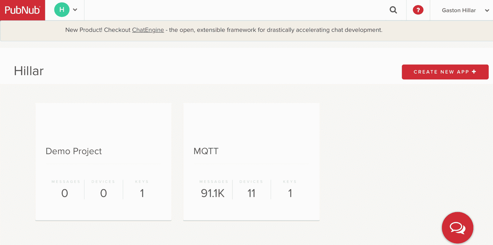
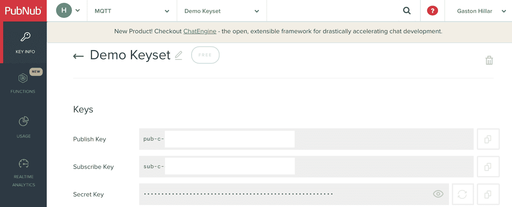
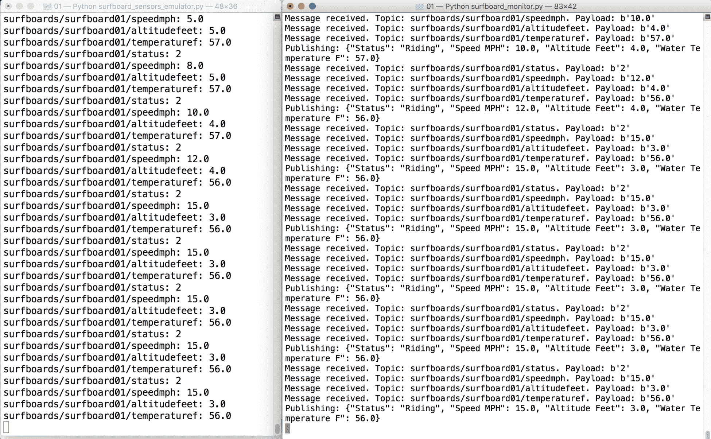
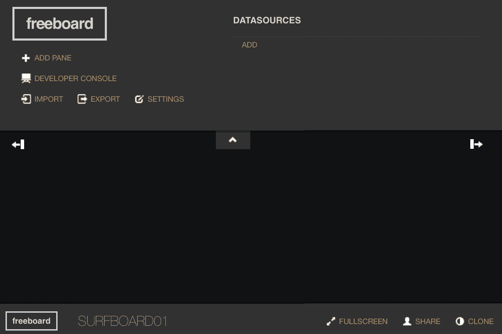
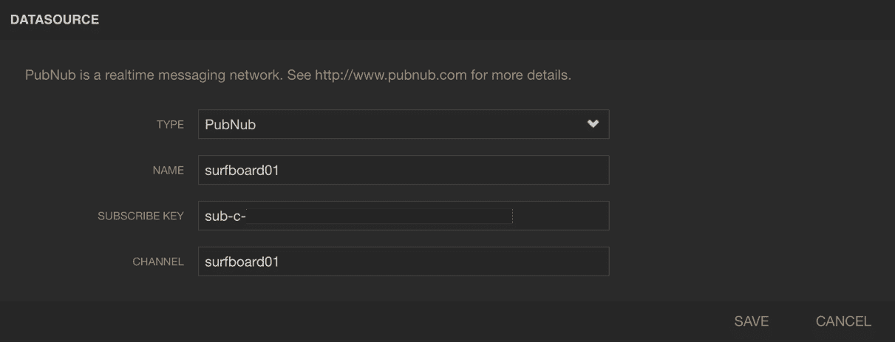
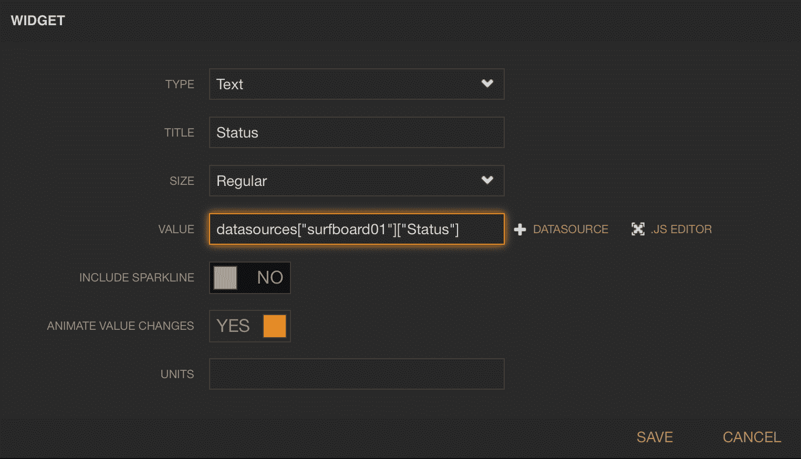
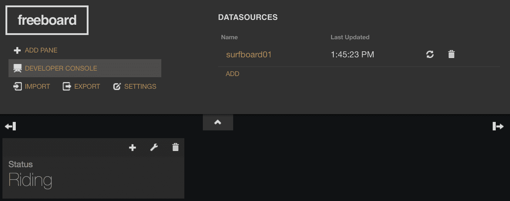
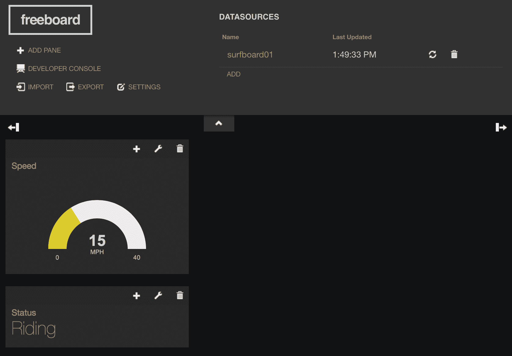

# 第六章：使用基于云的实时 MQTT 提供程序和 Python 监控冲浪比赛

在本章中，我们将编写 Python 代码，使用 PubNub 基于云的实时 MQTT 提供程序与 Mosquitto MQTT 服务器结合，监控冲浪比赛。我们将通过分析需求从头构建解决方案，并编写 Python 代码，该代码将在连接到冲浪板中的多个传感器的防水 IoT 板上运行。我们将定义主题和命令，并与基于云的 MQTT 服务器以及在先前章节中使用的 Mosquitto MQTT 服务器一起工作。我们将涵盖以下内容：

+   理解要求

+   定义主题和有效载荷

+   编写冲浪板传感器仿真器

+   配置 PubNub MQTT 接口

+   将从传感器检索的数据发布到基于云的 MQTT 服务器

+   使用多个 MQTT 服务器

+   使用 freeboard 构建基于 Web 的仪表板

# 理解要求

许多为冲浪比赛训练的冲浪者希望我们构建一个实时基于 Web 的仪表板，该仪表板使用连接到冲浪板中的多个传感器的 IoT 板提供的数据。每个 IoT 板将提供以下数据：

+   **状态**：每个冲浪者的潜水服中嵌入了许多可穿戴无线传感器，冲浪板中还包括其他传感器，它们将提供数据，而 IoT 板将进行实时分析以指示冲浪者的状态

+   **速度**：传感器将以**每小时英里**（**mph**）测量冲浪板的速度

+   **海拔**：传感器将以英尺测量冲浪板的海拔

+   **水温**：位于冲浪板鳍中的传感器将以华氏度测量水温

第三方软件正在 IoT 板上运行，我们无法更改发布不同主题数据的代码。我们可以提供必要的证书来配置与我们的 Mosquitto MQTT 服务器的安全连接，并指定其主机名和协议。此外，我们可以配置一个标识冲浪板并确定数据将被发布的主题的名称。

# 定义主题和有效载荷

IoT 板使用以下主题名称发布有关特定冲浪板的数据，其中`sufboardname`必须替换为分配给冲浪板的唯一名称：

| **变量** | **主题名称** |
| --- | --- |
| 状态 | `surfboards/surfboardname/status` |
| 速度（mph） | `surfboards/surfboardname/speedmph` |
| 海拔（英尺） | `surfboards/surfboardname/altitudefeet` |
| 水温（华氏度） | `surfboards/surfboardname/temperaturef` |

例如，如果我们将`sufboard01`指定为冲浪板的名称，那么想要接收冲浪板实际速度的客户端必须订阅`sufboards/surfboard01/speedmph`主题。

IoT 板及其连接的传感器能够区分冲浪者及其冲浪板的以下五种可能状态：

| **状态键** | **含义** |
| --- | --- |
| `0` | 空闲 |
| `1` | 划水 |
| `2` | 骑行 |
| `3` | 骑行结束 |
| `4` | 摔倒 |

IoT 板发布指定在状态键列中的整数值，指示冲浪者及其冲浪板的当前状态。例如，当冲浪者在冲浪时，板将在`sufboards/surfboard01/status`主题中发布`2`。

该板将在先前解释的主题中发布速度、海拔和水温的浮点值。在这种情况下，IoT 板将只发布整数或浮点值作为 MQTT 消息的有效载荷。有效载荷不会是 JSON，就像我们之前的例子一样。有效载荷不会包含有关测量单位的任何其他信息。此信息包含在主题名称中。

IoT 板将在先前解释的主题中每秒发布数据。

在之前的例子中，我们是从零开始设计我们的解决方案。在这种情况下，我们必须与已经运行我们无法更改代码的物联网板进行交互。想象一下，我们必须在没有物联网板的情况下开始解决方案的工作；因此，我们将在 Python 中开发一个冲浪板传感器模拟器，以便为我们提供数据，以便我们可以接收发布的数据并开发所需的仪表板。在现实项目中，这是一个非常常见的情况。

正如我们在之前的章节中学到的，MQTT 已经成为物联网项目中非常流行的协议，其中许多传感器必须发布数据。由于其日益增长的流行度，许多基于云的消息基础设施已经包含了 MQTT 接口或桥接。例如，PubNub 数据流网络提供了可扩展的 MQTT 接口。我们可以利用到目前为止我们所学到的关于 MQTT 的一切来使用这个基于云的数据流网络。您可以在其网页上了解更多关于 PubNub 的信息：[`www.pubnub.com`](http://www.pubnub.com)。

一个 Python 程序将通过订阅四个主题来收集物联网板发布的数据，并且代码将每秒构建一个完整的冲浪者及其冲浪板状态。然后，代码将构建一个包含状态、速度、海拔和水温的 JSON 消息，并将其发布到 MQTT PubNub 接口的一个主题。

在我们的例子中，我们将利用 PubNub 及其 MQTT 接口提供的免费服务。我们不会使用一些可能增强我们的物联网项目连接需求的高级功能和附加服务，但这些功能也需要付费订阅。

我们将利用 freeboard.io 来可视化从传感器收集的数据，并在 PubNub MQTT 接口中发布，以多个表盘的形式呈现，并且可以在全球范围内的不同计算机和设备上使用。freeboard.io 允许我们通过选择数据源并拖放可定制的小部件来构建仪表板。freeboard.io 定义自己为一个允许我们可视化物联网的基于云的服务。您可以在其网页上了解更多关于 freeboard.io 的信息：[`freeboard.io`](http://freeboard.io)。

在我们的例子中，我们将利用 freeboard.io 提供的免费服务，并且我们不会使用一些提供我们仪表板隐私的高级功能，但这些功能也需要付费订阅。我们的仪表板将对任何拥有其唯一 URL 的人可用，因为我们不使用私人仪表板。

以下是提供冲浪者及其冲浪板状态的消息负载的示例。

```py
{ 
    "Status": "Riding",  
    "Speed MPH": 15.0,  
    "Altitude Feet": 3.0,  
    "Water Temperature F": 56.0 
}
```

Freeboard.io 允许我们轻松地选择 PubNub MQTT 接口中接收的 JSON 消息的每个键作为仪表板的数据源。这样，我们将轻松地构建一个基于 Web 的仪表板，以提供给我们状态、速度、海拔和水温数值的表盘。

总之，我们的解决方案将由以下两个 Python 程序组成：

+   **冲浪板传感器模拟器**：该程序将与我们的 Mosquitto MQTT 服务器建立安全连接，并且将从**CSV**（逗号分隔值）文件中读取的状态、速度、海拔和水温数值发布到适当的主题。该程序将工作得就像我们有一个穿着潜水服和冲浪板传感器的真实冲浪者在冲浪并发布数据一样。

+   **冲浪板监视器**：该程序将与我们的 Mosquitto MQTT 服务器建立安全连接，并订阅冲浪板传感器模拟器发布的状态、速度、海拔和水温数值的主题。冲浪板监视器程序还将与 PubNub MQTT 接口建立连接。该程序将每秒向 PubNub MQTT 接口发布一个包含决定冲浪者及其冲浪板状态的键值对的单个消息。

# 编写冲浪板传感器模拟器

首先，我们将创建一个 CSV 文件，其中包含许多状态、速度（以英里/小时为单位）、海拔（以英尺为单位）和温度（以华氏度为单位）的值，这些值用逗号分隔。文件中的每一行将代表冲浪板传感器模拟器将发布到相应主题的一组值。在这种情况下，使用随机值并不方便，因为我们希望模拟冲浪者和他的冲浪板的真实场景。

现在，我们将在主虚拟环境文件夹中创建一个名为`surfboard_sensors_data.csv`的新文件。以下行显示了定义从冲浪者和他们的冲浪板中检索到的数据的代码。

从左到右用逗号分隔的值依次是：速度（以英里/小时为单位）、海拔（以英尺为单位）和温度（以华氏度为单位）。首先，冲浪者处于空闲状态，当划桨时增加速度，当冲浪时达到速度最大值，最后在状态设置为冲浪结束时减速。示例的代码文件包含在`mqtt_python_gaston_hillar_06_01`文件夹中的`surfboard_sensors_data.csv`文件中：

```py
0, 1, 2, 58 
0, 1.1, 2, 58 
1, 2, 3, 57 
1, 3, 3, 57 
1, 3, 3, 57 
1, 3, 3, 57 
1, 4, 4, 57 
1, 5, 5, 57 
2, 8, 5, 57 
2, 10, 4, 57 
2, 12, 4, 56 
2, 15, 3, 56 
2, 15, 3, 56 
2, 15, 3, 56 
2, 15, 3, 56 
2, 15, 3, 56 
2, 12, 3, 56 
3, 3, 3, 55 
3, 2, 3, 55 
3, 1, 3, 55 
3, 0, 3, 55 
```

现在，我们将在主虚拟环境文件夹中创建一个名为`surfboard_config.py`的新 Python 文件。以下行显示了此文件的代码，它定义了许多配置值，这些值将用于配置冲浪板传感器模拟器将发布从传感器检索到的值的主题。冲浪板监视器也将需要这些主题来订阅它们，因此将所有配置值包含在一个特定的 Python 脚本中是方便的。示例的代码文件包含在`mqtt_python_gaston_hillar_06_01`文件夹中的`surfboard_config.py`文件中：

```py
surfboard_name = "surfboard01" 
topic_format = "surfboards/{}/{}" 
status_topic = topic_format.format( 
    surfboard_name,  
    "status") 
speed_mph_topic = topic_format.format( 
    surfboard_name,  
    "speedmph") 
altitude_feet_topic = topic_format.format( 
    surfboard_name,  
    "altitudefeet") 
water_temperature_f_topic = topic_format.format( 
    surfboard_name,  
    "temperaturef")
```

该代码定义了冲浪板名称并将其存储在`surfboard_name`变量中。`topic_format`变量包含一个字符串，使得易于构建具有共同前缀的不同主题。以下表总结了四个变量的字符串值，这些变量定义了每个传感器的主题名称，基于一个名为`surfboard01`的定义的冲浪板：

| **变量** | **值** |
| --- | --- |
| `status_topic` | `surfboards/surfboard01/status` |
| `speed_mph_topic` | `surfboards/surfboard01/speedmph` |
| `altitude_feet_topic` | `surfboards/surfboard01/altitudefeet` |
| `temperature_f_topic` | `surfboards/surfboard01/temperaturef` |

现在，我们将在主虚拟环境文件夹中创建一个名为`surfboard_sensors_emulator.py`的新 Python 文件。以下行显示了此文件的代码，它与我们的 Mosquitto MQTT 服务器建立连接，读取先前创建的`surfboard_sensors_data.csv` CSV 文件，并持续发布从该文件中读取的值到先前枚举的主题。示例的代码文件包含在`mqtt_python_gaston_hillar_06_01`文件夹中的`surfboard_sensors_emulator.py`文件中：

```py
from config import * 
from surfboard_config import * 
import paho.mqtt.client as mqtt 
import time 
import csv 

def on_connect(client, userdata, flags, rc): 
    print("Result from connect: {}".format( 
        mqtt.connack_string(rc))) 
    # Check whether the result form connect is the CONNACK_ACCEPTED connack code 
    if rc != mqtt.CONNACK_ACCEPTED: 
        raise IOError("I couldn't establish a connection with the MQTT server") 

def publish_value(client, topic, value): 
    result = client.publish(topic=topic, 
        payload=value, 
        qos=0) 
    return result 

if __name__ == "__main__": 
    client = mqtt.Client(protocol=mqtt.MQTTv311) 
    client.on_connect = on_connect 
    client.tls_set(ca_certs = ca_certificate, 
        certfile=client_certificate, 
        keyfile=client_key) 
    client.connect(host=mqtt_server_host, 
        port=mqtt_server_port, 
        keepalive=mqtt_keepalive) 
    client.loop_start() 
    publish_debug_message = "{}: {}" 
    try: 
        while True: 
            with open('surfboard_sensors_data.csv') as csvfile: 
                reader=csv.reader(csvfile) 
                for row in reader: 
                    status_value = int(row[0]) 
                    speed_mph_value = float(row[1]) 
                    altitude_feet_value = float(row[2]) 
                    water_temperature_f_value = float(row[3]) 
                    print(publish_debug_message.format( 
                        status_topic, 
                        status_value)) 
                    print(publish_debug_message.format( 
                        speed_mph_topic,  
                        speed_mph_value)) 
                    print(publish_debug_message.format( 
                        altitude_feet_topic,  
                        altitude_feet_value)) 
                    print(publish_debug_message.format( 
                        water_temperature_f_topic,  
                        water_temperature_f_value)) 
                    publish_value(client,  
                        status_topic,  
                        status_value) 
                    publish_value(client,  
                        speed_mph_topic,  
                        speed_mph_value) 
                    publish_value(client,  
                        altitude_feet_topic,  
                        altitude_feet_value) 
                    publish_value(client, 
                        water_temperature_f_topic,  
                        water_temperature_f_value)                    time.sleep(1) 
    except KeyboardInterrupt: 
        print("I'll disconnect from the MQTT server") 
        client.disconnect() 
        client.loop_stop() 
```

在第四章中，*使用 Python 和 MQTT 消息编写控制车辆的代码*，我们在主虚拟环境文件夹中创建了一个名为`config.py`的 Python 文件。在这个文件中，我们定义了许多配置值，用于与 Mosquitto MQTT 服务器建立连接。这样，所有配置值都包含在一个特定的 Python 脚本中。如果您需要更改此文件以配置冲浪板模拟器和未来的冲浪板监视器，请确保您查看该章节中包含的解释。

首先导入了我们在`config.py`文件和先前编码的`surfboard_config.py`文件中声明的变量。在这种情况下，我们还导入了`csv`模块，以便我们可以轻松地从包含模拟传感器值的 CSV 文件中读取。`on_connect`函数的代码与我们在先前的示例中使用的代码非常相似。

`publish_value`函数接收 MQTT 客户端、主题名称和我们要在`client`、`topic`和`value`参数中发布的值。该函数调用`client.publish`方法，将接收到的值作为有效载荷发布到`topic`参数中接收到的主题名称，QoS 级别为 0。

主要代码块使用我们非常熟悉的代码与 Mosquitto MQTT 服务器建立连接。调用`client.connect`方法后，代码调用`client.loop_start`方法启动一个处理 MQTT 网络流量并释放主线程的新线程。

然后，代码进入一个连续循环，打开`surfboard_sensors_data.csv` CSV 文件，并创建一个`csv.reader`来将逗号分隔的值的每一行读入`row`数组。代码检索`row[0]`中的字符串，该字符串代表状态值；将其转换为整数值；并将该值保存在`status_value`本地变量中。接下来的行检索`row[1]`、`row[2`和`row[3]`中的速度、海拔和水温的字符串。代码将这三个值转换为浮点数，并将它们保存在`speed_mph_value`、`altitude_feet_value`和`water_temperature_f_value`本地变量中。

接下来的行会打印调试消息，显示从 CSV 文件中读取的每个模拟传感器的值，并为每个值调用先前解释的`publish_value`函数。每次调用`publish_value`函数都会使用在`surfboard_config.py`文件中配置的主题名称的适当变量，因为每个值都会发布到不同的主题。

在代码发布了四个模拟传感器的值后，它会休眠一秒钟，然后重复 CSV 文件中下一行的过程。在读取了最后一行后，代码会再次开始循环，直到用户按下*Ctrl* + *C*并引发`KeyboardInterrupt`异常被捕获。在这种情况下，我们捕获此异常并调用`client.disconnect`和`client.loop_stop`方法，以适当地从 Mosquitto MQTT 服务器断开连接。在以前的示例中，我们并不关心这个异常。

# 配置 PubNub MQTT 接口

在使用 PubNub 的免费服务之前，PubNub 要求我们注册并创建一个带有有效电子邮件和密码的帐户，以便在 PubNub 中创建应用程序，包括设备的 PubNub MQTT 接口。我们不需要输入任何信用卡或付款信息。如果您已经在 PubNub 上有帐户，可以跳过下一步。

创建账户后，PubNub 将重定向您到列出 PubNub 应用程序的管理门户。为了在网络上发送和接收消息，需要生成 PubNub 的发布和订阅密钥。点击 CREATE NEW APP+，输入`MQTT`作为应用名称，然后点击 CREATE。

在管理门户中，一个新的窗格将代表应用程序。以下截图显示了 PubNub 管理门户中的 MQTT 应用程序窗格：



点击 MQTT 窗格，PubNub 将显示自动生成的 Demo Keyset 窗格。点击此窗格，PubNub 将显示 Publish Key、Subscribe Key 和 Secret key。我们必须复制并粘贴这些密钥，以便在使用 PubNub MQTT 接口发布消息和订阅这些消息的 freeboard.io 基于 Web 的仪表板的代码中使用。以下截图显示了密钥的前缀。请注意，图像中的其余字符已被删除：



为了复制 Secret key，您必须点击 Secret key 右侧的眼睛图标，PubNub 将使所有字符可见。

# 从传感器检索的数据发布到基于云的 MQTT 服务器

如果我们用数字显示冲浪者和他的冲浪板的状态，那么理解真实状态将会很困难。因此，我们必须将表示状态的整数映射到解释状态的字符串。

现在，我们将在主虚拟环境文件夹中创建一个名为`surfboard_status.py`的新 Python 文件。以下行显示了此文件的代码，其中定义了不同状态数字的常量和将这些常量与整数映射到状态描述字符串的字典。示例的代码文件包含在`mqtt_python_gaston_hillar_06_01`文件夹中的`surfboard_status.py`文件中：

```py
SURFBOARD_STATUS_IDLE = 0 
SURFBOARD_STATUS_PADDLING = 1 
SURFBOARD_STATUS_RIDING = 2 
SURFBOARD_STATUS_RIDE_FINISHED = 3 
SURFBOARD_STATUS_WIPED_OUT = 4 

SURFBOARD_STATUS_DICTIONARY = { 
    SURFBOARD_STATUS_IDLE: 'Idle', 
    SURFBOARD_STATUS_PADDLING: 'Paddling', 
    SURFBOARD_STATUS_RIDING: 'Riding', 
    SURFBOARD_STATUS_RIDE_FINISHED: 'Ride finished', 
    SURFBOARD_STATUS_WIPED_OUT: 'Wiped out', 
    } 
```

现在，我们将编写冲浪板监视器的代码。我们将把代码分成许多代码片段，以便更容易理解每个代码部分。在主虚拟环境文件夹中创建一个名为`surfboard_monitor.py`的新 Python 文件。以下行声明了所有必要的导入和我们将用来与 PubNub MQTT 接口建立连接的变量。不要忘记用从先前解释的 PubNub 密钥生成过程中检索到的值替换分配给`pubnub_publish_key`和`pubnub_subscribe_key`变量的字符串。示例的代码文件包含在`mqtt_python_gaston_hillar_06_01`文件夹中的`surfboard_monitor.py`文件中：

```py
from config import * 
from surfboard_status import * 
from surfboard_config import * 
import paho.mqtt.client as mqtt 
import time 
import json 

# Publish key is the one that usually starts with the "pub-c-" prefix 
# Do not forget to replace the string with your publish key 
pubnub_publish_key = "pub-c-xxxxxxxx-xxxx-xxxx-xxxx-xxxxxxxxxxxx" 
# Subscribe key is the one that usually starts with the "sub-c" prefix 
# Do not forget to replace the string with your subscribe key 
pubnub_subscribe_key = "sub-c-xxxxxxxx-xxxx-xxxx-xxxx-xxxxxxxxxxxx" 
pubnub_mqtt_server_host = "mqtt.pndsn.com" 
pubnub_mqtt_server_port = 1883 
pubnub_mqtt_keepalive = 60 
device_id = surfboard_name 
pubnub_topic = surfboard_name 
```

首先导入了我们在`config.py`文件中声明的变量以及之前编写的`surfboard_config.py`和`surfboard_status.py`文件中的变量。然后，代码声明了以下变量，我们将使用这些变量与 PubNub MQTT 接口建立连接：

+   `pubnub_publish_key`：此字符串指定了 PubNub 发布密钥。

+   `pubnub_subscribe_key`：此字符串指定了 PubNub 订阅密钥。

+   `pubnub_mqtt_server_host`：此字符串指定了 PubNub MQTT 服务器地址。为了使用 PubNub MQTT 接口，我们必须始终与`mqtt.pndsn.com`主机建立连接。

+   `pubnub_mqtt_server_port`：此数字指定了 PubNub MQTT 服务器端口。在这种情况下，我们将与 PubNub MQTT 服务器建立一个不安全的连接，因此我们将使用端口号`1883`。我们希望保持 PubNub MQTT 接口配置简单，因此在此示例中不使用 TLS。

+   `pubnub_mqtt_keepalive`：此数字指定了与 PubNub MQTT 接口的连接的保持活动间隔配置。

+   `device_id`：此字符串指定了我们在创建`Surfboard`类的实例时要使用的设备标识符。代码分配了从`surfboard_config.py`文件导入的`surfboard_name`值。我们稍后将分析此类的代码。

+   `Pubnub_topic`：此字符串指定了冲浪板监视器将向其发布 JSON 有效载荷的主题，该有效载荷包含指定冲浪者和他们的冲浪板状态的键值对。代码分配了从`surfboard_config.py`文件导入的`surfboard_name`值。

冲浪板监视器将在端口`1883`上与`mqtt.pndsn.com`主机建立连接。因此，我们必须确保我们的防火墙配置具有适当的入站和出站规则配置，以允许在指定端口上建立连接。

将以下行添加到主虚拟环境文件夹中现有的`surfboard_monitor.py`中。以下行声明了`Surfboard`类。示例的代码文件包含在`mqtt_python_gaston_hillar_06_01`文件夹中的`surfboard_monitor.py`文件中：

```py
class Surfboard: 
    active_instance = None 
    def __init__(self, device_id, status,  
        speed_mph, altitude_feet, water_temperature_f): 
        self.device_id = device_id 
        self.status = status 
        self.speed_mph = speed_mph 
        self.altitude_feet = altitude_feet 
        self.water_temperature_f = water_temperature_f 
        self.is_pubnub_connected = False 
        Surfboard.active_instance = self 

    def build_json_message(self): 
        # Build a message with the status for the surfboard 
        message = { 
            "Status": SURFBOARD_STATUS_DICTIONARY[self.status], 
            "Speed MPH": self.speed_mph, 
            "Altitude Feet": self.altitude_feet, 
            "Water Temperature F": self.water_temperature_f,  
        } 
        json_message = json.dumps(message) 
        return json_message
```

我们必须为传感器提供的数据的`device_id`、`status`、`speed_mph`、`altitude_feet`和`water_temperature_f`参数指定一个`device_id`和初始值。构造函数，即`__init__`方法，将接收到的值保存在同名的属性中。

该代码还将引用保存在`active_instance`类属性中，因为我们必须在许多函数中访问该实例，这些函数将被指定为两个 MQTT 客户端触发的不同事件的回调：PubNub MQTT 客户端和 Mosquitto MQTT 客户端。在代码创建`Surfboard`实例后，我们将使用`Surfboard.active_instance`类属性访问活动实例。

该类声明了`build_json_message`方法，该方法构建了一个包含冲浪板状态的消息，并返回了由组成状态消息的键值对组成的 JSON 字符串。该代码使用`SURFBOARD_STATUS_DICTIONARY`在`surfboard_status.py`文件中声明的内容，将存储在`status`属性中的数字映射为解释状态的字符串。代码使用`speed_mph`，`altitude_feet`和`water_temperature_f`属性为其他键提供值。

在主虚拟环境文件夹中的现有`surfboard_monitor.py`中添加以下行。以下行声明了我们将用作回调的函数以及将由这些回调调用的其他函数。示例的代码文件包含在`mqtt_python_gaston_hillar_06_01`文件夹中的`surfboard_monitor.py`文件中：

```py
def on_connect_mosquitto(client, userdata, flags, rc): 
    print("Result from Mosquitto connect: {}".format( 
        mqtt.connack_string(rc))) 
    # Check whether the result form connect is the CONNACK_ACCEPTED connack code 
    if rc == mqtt.CONNACK_ACCEPTED: 
        # Subscribe to a topic filter that provides all the sensors 
        sensors_topic_filter = topic_format.format( 
            surfboard_name, 
            "+") 
        client.subscribe(sensors_topic_filter, qos=0) 

def on_subscribe_mosquitto(client, userdata, mid, granted_qos): 
    print("I've subscribed with QoS: {}".format( 
        granted_qos[0])) 

def print_received_message_mosquitto(msg): 
    print("Message received. Topic: {}. Payload: {}".format( 
        msg.topic,  
        str(msg.payload))) 

def on_status_message_mosquitto(client, userdata, msg): 
    print_received_message_mosquitto(msg) 
    Surfboard.active_instance.status = int(msg.payload) 

def on_speed_mph_message_mosquitto(client, userdata, msg): 
    print_received_message_mosquitto(msg) 
    Surfboard.active_instance.speed_mph = float(msg.payload) 

def on_altitude_feet_message_mosquitto(client, userdata, msg): 
    print_received_message_mosquitto(msg) 
    Surfboard.active_instance.altitude_feet = float(msg.payload) 

def on_water_temperature_f_message_mosquitto(client, userdata, msg): 
    print_received_message_mosquitto(msg) 
    Surfboard.active_instance.water_temperature_f = float(msg.payload) 

def on_connect_pubnub(client, userdata, flags, rc): 
    print("Result from PubNub connect: {}".format( 
        mqtt.connack_string(rc))) 
    # Check whether the result form connect is the CONNACK_ACCEPTED connack code 
    if rc == mqtt.CONNACK_ACCEPTED: 
        Surfboard.active_instance.is_pubnub_connected = True 

def on_disconnect_pubnub(client, userdata, rc): 
    Surfboard.active_instance.is_pubnub_connected = False 
    print("Disconnected from PubNub")
```

该代码声明了以下以`mosquitto`前缀结尾的函数：

+   `on_connect_mosquitto`：这个函数是一旦与 Mosquitto MQTT 服务器建立了成功的连接，就会执行的回调。代码检查`rc`参数的值，该参数提供 Mosquitto MQTT 服务器返回的`CONNACK`代码。如果此值匹配`mqtt.CONNACK_ACCEPTED`，则意味着 Mosquitto MQTT 服务器接受了连接请求，因此代码调用`client.subscribe`方法，为`client`参数中接收的 MQTT 客户端订阅`surfboards/surfboard01/+`主题过滤器，QoS 级别为 0。这样，MQTT 客户端将接收从不同传感器检索的值发送到`surfboards/surfboard01/status`，`surfboards/surfboard01/speedmph`，`surfboards/surfboard01/altitudefeet`和`surfboards/surfboard01/temperaturef`主题的消息。

+   `on_subscribe_mosquitto`：当成功完成对`surfboards/surfboard01/+`主题过滤器的订阅时，将调用此函数。与之前的示例一样，该函数打印一条消息，指示订阅所授予的 QoS 级别。

+   `print_received_message_mosquitto`：此函数在`msg`参数中接收一个`mqtt.MQTTMessage`实例，并打印此消息的主题和负载，以帮助我们理解应用程序中发生的情况。

+   `on_status_message_mosquitto`：当来自 Mosquitto MQTT 服务器的消息到达`surfboards/surfboard01/status`主题时，将调用此函数。该函数使用接收到的`mqtt.MQTTMessage`实例作为参数调用`print_received_message_mosquitto`函数，并将`Surfboard`活动实例的`status`属性值设置为接收到的消息负载转换为`int`的值。

+   `on_speed_mph_message_mosquitto`：当来自 Mosquitto MQTT 服务器的消息到达`surfboards/surfboard01/speedmph`主题时，将调用此函数。该函数使用接收到的`mqtt.MQTTMessage`实例作为参数调用`print_received_message_mosquitto`函数，并将`Surfboard`活动实例的`speed_mph`属性值设置为接收到的消息负载转换为`float`的值。

+   `on_altitude_feet_message_mosquitto`：当从 Mosquitto MQTT 服务器接收到`surfboards/surfboard01/altitudefeet`主题的消息时，将调用此函数。 该函数使用接收到的`mqtt.MQTTMessage`实例作为参数调用`print_received_message_mosquitto`函数，并将`Surfboard`活动实例的`altitude_feet`属性值设置为接收到的消息负载的整数转换。

+   `on_water_temperature_f_message_mosquitto`：当从 Mosquitto MQTT 服务器接收到`surfboards/surfboard01/watertemperaturef`主题的消息时，将调用此函数。 该函数使用接收到的`mqtt.MQTTMessage`实例作为参数调用`print_received_message_mosquitto`函数，并将`Surfboard`活动实例的`water_temperature_f`属性值设置为接收到的消息负载的整数转换。

在这种情况下，我们没有一个单独的函数作为回调来处理来自 Mosquitto MQTT 服务器的所有传入消息。 我们为每个特定主题使用一个回调。 这样，我们就不必检查消息的主题以确定我们必须运行的代码。

代码声明了以下以`pubnub`前缀结尾的函数：

+   `on_connect_pubnub`：一旦与 PubNub MQTT 服务器建立成功连接，将执行此回调函数。 该代码检查提供 PubNub MQTT 服务器返回的`CONNACK`代码的`rc`参数的值。 如果此值与`mqtt.CONNACK_ACCEPTED`匹配，则表示 PubNub MQTT 服务器接受了连接请求，因此代码将 Surfboard 活动实例的`is_pubnub_connected`属性值设置为`True`。

+   `on_disconnect_pubnub`：如果连接到 PubNub MQTT 服务器的客户端失去连接，将执行此回调函数。 该代码将 Surfboard 活动实例的`is_pubnub_connected`属性值设置为`False`，并打印一条消息。

# 使用多个 MQTT 服务器

在主虚拟环境文件夹中的现有`surfboard_monitor.py`中添加以下行。 以下行声明了主要块。 示例的代码文件包含在`mqtt_python_gaston_hillar_06_01`文件夹中的`surfboard_monitor.py`文件中：

```py
if __name__ == "__main__": 
    surfboard = Surfboard(device_id=device_id, 
        status=SURFBOARD_STATUS_IDLE, 
        speed_mph=0,  
        altitude_feet=0,  
        water_temperature_f=0) 
    pubnub_client_id = "{}/{}/{}".format( 
        pubnub_publish_key, 
        pubnub_subscribe_key, 
        device_id) 
    pubnub_client = mqtt.Client(client_id=pubnub_client_id, 
        protocol=mqtt.MQTTv311) 
    pubnub_client.on_connect = on_connect_pubnub 
    pubnub_client.on_disconnect = on_disconnect_pubnub 
    pubnub_client.connect(host=pubnub_mqtt_server_host, 
        port=pubnub_mqtt_server_port, 
        keepalive=pubnub_mqtt_keepalive) 
    pubnub_client.loop_start() 
    mosquitto_client = mqtt.Client(protocol=mqtt.MQTTv311) 
    mosquitto_client.on_connect = on_connect_mosquitto 
    mosquitto_client.on_subscribe = on_subscribe_mosquitto 
    mosquitto_client.message_callback_add( 
        status_topic, 
        on_status_message_mosquitto) 
    mosquitto_client.message_callback_add( 
        speed_mph_topic, 
        on_speed_mph_message_mosquitto) 
    mosquitto_client.message_callback_add( 
        altitude_feet_topic, 
        on_altitude_feet_message_mosquitto) 
    mosquitto_client.message_callback_add( 
        water_temperature_f_topic, 
        on_water_temperature_f_message_mosquitto) 
    mosquitto_client.tls_set(ca_certs = ca_certificate, 
        certfile=client_certificate, 
        keyfile=client_key) 
    mosquitto_client.connect(host=mqtt_server_host, 
        port=mqtt_server_port, 
        keepalive=mqtt_keepalive) 
    mosquitto_client.loop_start() 
    try: 
        while True: 
            if Surfboard.active_instance.is_pubnub_connected: 
                payload = Surfboard.active_instance.build_json_message() 
                result = pubnub_client.publish(topic=pubnub_topic, 
                    payload=payload, 
                    qos=0) 
                print("Publishing: {}".format(payload)) 
            else: 
                print("Not connected") 
            time.sleep(1) 
    except KeyboardInterrupt: 
        print("I'll disconnect from both Mosquitto and PubNub") 
        pubnub_client.disconnect() 
        pubnub_client.loop_stop() 
        mosquitto_client.disconnect() 
        mosquitto_client.loop_stop() 
```

首先，主要块创建了`Surfboard`类的实例，并将其保存在`surfboard`本地变量中。 然后，代码生成了与 PubNub MQTT 接口建立连接所需的客户端 ID 字符串，并将其保存在`pubnub_client_id`本地变量中。 PubNub MQTT 接口要求我们使用以下组成的客户端 ID：

```py
publish_key/subscribe_key/device_id 
```

代码使用`pubnub_publish_key`，`pubnub_subscribe_key`和`device_id`变量的值构建了一个符合 PubNub MQTT 接口要求的客户端 ID。 然后，代码创建了一个名为`pubnub_client`的`mqtt.Client`类（`paho.mqtt.client.Client`）的实例，该实例表示 PubNub MQTT 接口客户端。 我们使用此实例与 PubNub MQTT 服务器进行通信。

然后，代码将函数分配给属性。 以下表总结了这些分配：

| **属性** | **分配的函数** |
| --- | --- |
| `pubnub_client.on_connect` | `on_connect_pubnub` |
| `pubnub_client.on_disconnect` | `on_disconnect_pubnub` |

然后，代码调用`pubnub_client.connect`方法，并指定`host`，`port`和`keepalive`参数的值。 这样，代码要求 MQTT 客户端与指定的 PubNub MQTT 服务器建立连接。 调用`pubnub_client.connect`方法后，代码调用`pubnub_client.loop_start`方法。 此方法启动一个处理与 PubNub MQTT 接口相关的 MQTT 网络流量的新线程，并释放主线程。

然后，主要块创建了`mqtt.Client`类（`paho.mqtt.client.Client`）的另一个实例`mosquitto_client`，代表 Mosquitto MQTT 服务器客户端。我们使用此实例与本地 Mosquitto MQTT 服务器进行通信。

然后，代码将函数分配给属性。以下表总结了这些分配：

| **属性** | **分配的函数** |
| --- | --- |
| `mosquitto_client.on_connect` | `on_connect_mosquitto` |
| `mosquitto_client.on_subscribe` | `on_subscribe_mosquitto` |

请注意，在这种情况下，代码没有将函数分配给`mosquitto_client.on_message`。接下来的行调用`mosquitto_client.message_callback_add`方法，以指定客户端在特定主题接收到消息时必须调用的回调函数。以下表总结了根据定义消息到达的主题的变量调用的函数：

| **主题变量** | **分配的函数** |
| --- | --- |
| `status_topic` | `on_status_message_mosquitto` |
| `speed_mph_topic` | `on_speed_mph_message_mosquitto` |
| `altitude_feet_topic` | `on_altitude_feet_message_mosquitto` |
| `water_temperature_f_topic` | `on_water_temperature_f_message_mosquitto` |

每当客户端从任何传感器接收到消息时，它将更新`Surfboard`活动实例的适当属性。这些分配的函数负责更新`Surfboard`活动实例的状态。

然后，代码调用了众所周知的`mosquitto_client.tls_set`和`mosquitto_client.connect`方法。这样，代码要求 MQTT 客户端与指定的 Mosquitto MQTT 服务器建立连接。调用`mosquitto_client.connect`方法后，代码调用`mosquitto_client.loop_start`方法。此方法启动一个处理与 Mosquitto MQTT 服务器相关的 MQTT 网络流量的新线程，并释放主线程。

请注意，我们对`loop_start`进行了两次调用，因此我们将有两个线程处理 MQTT 网络流量：一个用于 PubNub MQTT 服务器，另一个用于 Mosquitto MQTT 服务器。

接下来的行声明了一个`while`循环，该循环将一直运行，直到发生`KeyboardInterrupt`异常。循环检查`Surfboard.active_instance.is_pubnub_connected`属性的值，以确保与 PubNub MQTT 服务器的连接没有中断。如果连接是活动的，代码将调用`Surfboard.active_instance.build_json_message`方法，根据`Surfboard`属性的当前值构建 JSON 字符串，这些值在传感器传来具有新值的消息时被更新。

代码将 JSON 字符串保存在`payload`本地变量中，并调用`pubnub_client.publish`方法将`payload` JSON 格式的字符串发布到`pubnub_topic`变量中保存的主题名称，QoS 级别为 0。这样，负责处理 PubNub MQTT 客户端的 MQTT 网络事件的线程将发布消息，并使用 PubNub MQTT 服务器作为数据源的基于 Web 的仪表板将被更新。下一行打印了正在发布到 PubNub MQTT 服务器的负载的消息。

# 运行多个客户端

现在，我们将运行最近编写的冲浪板传感器模拟器和冲浪板监视器。确保在运行这些 Python 程序之前，您已经按照必要的步骤激活了我们一直在其中工作的虚拟环境。

在任何您想要用作冲浪板传感器模拟器并使用 Linux 或 macOS 的 MQTT 客户端的计算机或设备上执行以下行以启动冲浪板传感器模拟器示例：

```py
    python3 surfboard_sensors_emulator.py  
```

在 Windows 中，您必须执行以下行：

```py
    python surfboard_sensors_emulator.py
```

几秒钟后，您将看到下面显示的输出：

```py
 Result from connect: Connection Accepted.
    surfboards/surfboard01/status: 0
    surfboards/surfboard01/speedmph: 1.0
    surfboards/surfboard01/altitudefeet: 2.0
    surfboards/surfboard01/temperaturef: 58.0
    surfboards/surfboard01/status: 0
    surfboards/surfboard01/speedmph: 1.1
    surfboards/surfboard01/altitudefeet: 2.0
    surfboards/surfboard01/temperaturef: 58.0
    surfboards/surfboard01/status: 1
    surfboards/surfboard01/speedmph: 2.0
    surfboards/surfboard01/altitudefeet: 3.0
    surfboards/surfboard01/temperaturef: 57.0
```

程序将继续为主题发布消息到 Mosquitto MQTT 服务器。保持代码在您的本地计算机上运行，或者在您选择用作本示例冲浪板传感器模拟器的物联网板上运行。

然后，在任何您想要用作 MQTT 客户端的计算机或设备上执行以下命令，该客户端接收来自 Mosquitto MQTT 服务器的消息并发布消息到 PubNub MQTT 服务器，并使用 Linux 或 macOS：

```py
    python3 surfboard_monitor.py  
```

在 Windows 中，您必须执行以下命令：

```py
    python surfboard_monitor.py
```

几秒钟后，您将看到类似下面几行的消息输出。请注意，值将不同，因为您开始运行程序的时间将使值变化：

```py
    Not connected
    Result from Mosquitto connect: Connection Accepted.
    I've subscribed with QoS: 0
    Result from PubNub connect: Connection Accepted.
    Message received. Topic: surfboards/surfboard01/status. Payload: 
    b'3'
    Message received. Topic: surfboards/surfboard01/speedmph. Payload: 
    b'0.0'
    Message received. Topic: surfboards/surfboard01/altitudefeet. 
    Payload: b'3.0'
    Message received. Topic: surfboards/surfboard01/temperaturef. 
    Payload: b'55.0'
    Publishing: {"Status": "Ride finished", "Speed MPH": 0.0, "Altitude 
    Feet": 3.0, "Water Temperature F": 55.0}
    Message received. Topic: surfboards/surfboard01/status. Payload: 
    b'0'
    Message received. Topic: surfboards/surfboard01/speedmph. Payload: 
    b'1.0'
    Message received. Topic: surfboards/surfboard01/altitudefeet. 
    Payload: b'2.0'
    Message received. Topic: surfboards/surfboard01/temperaturef. 
    Payload: b'58.0'
    Publishing: {"Status": "Idle", "Speed MPH": 1.0, "Altitude Feet": 
    2.0, "Water Temperature F": 58.0}
    Message received. Topic: surfboards/surfboard01/status. Payload: 
    b'0'
    Message received. Topic: surfboards/surfboard01/speedmph. Payload: 
    b'1.1'
    Message received. Topic: surfboards/surfboard01/altitudefeet. 
    Payload: b'2.0'
    Message received. Topic: surfboards/surfboard01/temperaturef. 
    Payload: b'58.0'
    Publishing: {"Status": "Idle", "Speed MPH": 1.1, "Altitude Feet": 
    2.0, "Water Temperature F": 58.0}

```

程序将继续接收来自冲浪板传感器模拟器的消息，并将消息发布到 PubNub MQTT 服务器。保持代码在您的本地计算机上运行，或者在您选择用作本示例冲浪板监视器的物联网板上运行。

下面的屏幕截图显示了在 macOS 计算机上运行的两个终端窗口。左侧的终端显示了作为冲浪板传感器模拟器的 Python 客户端显示的消息，即`surfboard_sensors_emulator.py`脚本。右侧的终端显示了作为冲浪板监视器的 Python 客户端运行代码的结果，即`surfboard_monitor.py`脚本：



# 使用 freeboard 构建基于网络的仪表板

现在，我们准备使用 PubNub MQTT 服务器作为数据源来构建实时的基于网络的仪表板。如前所述，我们将利用 freeboard.io 来在许多表盘中可视化冲浪者和冲浪板的数据。

freeboard.io 要求我们注册并创建一个带有有效电子邮件和密码的账户，然后我们才能构建基于网络的仪表板。我们不需要输入任何信用卡或付款信息。如果您已经在 freeboard.io 上有账户，可以跳过下一步。

在您的网络浏览器中转到[`freeboard.io`](http://freeboard.io)，然后点击立即开始。您也可以直接转到[`freeboard.io/signup`](https://freeboard.io/signup)。在选择用户名中输入您想要的用户名，在输入您的电子邮件中输入您的电子邮件，在创建密码中输入所需的密码。填写完所有字段后，点击创建我的账户。

创建完账户后，您可以在您的网络浏览器中转到[`freeboard.io`](http://freeboard.io)，然后点击登录。您也可以通过访问[`freeboard.io/login`](https://freeboard.io/login)来实现相同的目标。然后，输入您的用户名或电子邮件和密码，然后点击登录。freeboard 将显示您的 freeboard，也称为仪表板。

在创建新按钮的左侧的输入名称文本框中输入`Surfboard01`，然后单击此按钮。freeboard.io 将显示一个空的仪表板，其中有许多按钮，可以让我们添加窗格和数据源等。下面的屏幕截图显示了空的仪表板：



点击数据源下方的添加，网站将打开数据源对话框。在类型下拉菜单中选择 PubNub，对话框将显示定义 PubNub 数据源所需的字段。

请注意，也可以使用 MQTT 作为 freeboard.io 的数据源。但是，这将要求我们将我们的 Mosquitto MQTT 服务器公开可用。相反，我们利用 PubNub MQTT 接口，它允许我们轻松地在 PubNub 网络上提供消息。但是，在需要 freeboard.io 提供所需功能的项目中，您绝对可以使用 MQTT 服务器作为数据源来工作。

在名称中输入`surfboard01`。

输入你从 PubNub 设置中复制的订阅密钥。请记住，订阅密钥通常以`sub-c`前缀开头。

在频道中输入`surfboard01`。

如果之前的任何数值名称错误，数据源将无法获得适当的数据。下面的截图显示了 PubNub 数据源的配置，订阅仅显示`sub-c`前缀：



点击保存，数据源将显示在数据源下方。由于冲浪板传感器模拟器和冲浪板监视器正在运行，所以下方的“最后更新”时间将每秒变化一次。如果时间没有每秒变化，这意味着数据源配置错误，或者 Python 程序中的任何一个未按预期运行。

点击“添加窗格”以在仪表板上添加一个新的空窗格。然后，点击新空窗格右上角的加号（+），freeboard 将显示小部件对话框。

在类型下拉菜单中选择文本，并且对话框将显示添加文本小部件到仪表板窗格所需的字段。在标题中输入`Status`。

在值文本框的右侧点击+数据源，选择 surfboard01，然后选择状态。做出选择后，值文本框中将出现以下文本：`datasources ["surfboard01"] ["Status"]`，如下一截图所示：



然后，点击保存，freeboard 将关闭对话框，并将新的仪表添加到仪表板中之前创建的窗格中。表盘将显示冲浪板监视器最后一次发布到 PubNub MQTT 接口的状态的最新数值，即代码上次发布的 JSON 数据中`Status`键的数值。下面的截图显示了 surfboard01 数据源显示的最后更新时间，以及仪表显示了状态的最新数值。



点击“添加窗格”以在仪表板上添加另一个新的空窗格。然后，点击新空窗格右上角的加号（+），freeboard 将显示小部件对话框。

在类型下拉菜单中选择仪表，并且对话框将显示添加仪表小部件到仪表板窗格所需的字段。在标题中输入`Speed`。

在值文本框的右侧点击+数据源，选择 surfboard01，然后选择速度 MPH。做出选择后，值文本框中将出现以下文本：`datasources ["surfboard01"] ["Speed MPH"]`。

在单位中输入`MPH`，最小值为`0`，最大值为`40`。然后，点击保存，freeboard 将关闭对话框，并将新的表盘添加到仪表板上之前创建的窗格中。表盘将显示冲浪板监视器最后一次发布到 PubNub MQTT 接口的速度的最新数值，即代码上次发布的 JSON 数据中`Speed MPH`键的数值。

下面的截图显示了 surfboard01 数据源显示的最后更新时间，以及添加的仪表显示了 mph 速度的最新数值。



点击“添加窗格”以在仪表板上添加另一个新的空窗格。然后，点击新空窗格右上角的加号（+），freeboard 将显示小部件对话框。

在类型下拉菜单中选择仪表，并且对话框将显示添加仪表小部件到仪表板窗格所需的字段。在标题中输入`Altitude`。

在值文本框的右侧点击+数据源，选择 surfboard01，然后选择海拔英尺。做出选择后，值文本框中将出现以下文本：`datasources ["surfboard01"] ["Altitude Feet"]`。

在单位中输入“英尺”，在最小值中输入`0`，在最大值中输入`30`。然后，单击“保存”，freeboard 将关闭对话框，并将新的仪表添加到仪表板上以前创建的窗格中。仪表将显示冲浪板监视器最后一次发布到 PubNub MQTT 接口的海拔值，即代码为`Altitude Feet`键发布的 JSON 数据的最新值。

现在，我们将添加最后一个窗格。单击“添加窗格”以在仪表板上添加另一个新的空窗格。然后，单击新空窗格右上角的加号（+），freeboard 将显示小部件对话框。

在类型下拉菜单中选择仪表，对话框将显示添加仪表小部件到仪表板上的窗格所需的字段。在标题中输入“水温”。

在值文本框的右侧点击+数据源，选择 surfboard01，然后选择 Water Temperature F。在进行选择后，值文本框中将显示以下文本：`datasources ["surfboard01"] ["Water Temperature F"]`。

在单位中输入“ºF”，在最小值中输入`0`，在最大值中输入`80`。然后，单击“保存”，freeboard 将关闭对话框，并将新的仪表添加到仪表板上以前创建的窗格中。仪表将显示冲浪板监视器最后一次发布到 PubNub MQTT 接口的水温，即代码为`Water Temperature F`键发布的 JSON 数据的最新值。

拖放窗格以找到布局中显示的窗格。屏幕截图显示了我们使用四个窗格和三个仪表构建的仪表板，当我们的冲浪板监视器向 PubNub MQTT 接口发布数据时，这些仪表会每秒自动刷新数据。

我们可以通过输入 Web 浏览器在我们使用仪表板时显示的 URL 来访问最近构建的仪表板。该 URL 由`https://freeboard.io/board/`前缀后跟字母和数字组成。例如，如果 URL 是`https://freeboard.io/board/EXAMPLE`，我们只需在任何连接到互联网的设备或计算机上的任何 Web 浏览器中输入它，我们就可以观看仪表，并且当新数据从我们的冲浪板监视器发布时，它们将被刷新。

将 PubNub 作为我们的数据源，将 freeboard.io 作为我们的基于 Web 的仪表板，使我们能够轻松监视从冲浪者潜水服和冲浪板传感器检索的数据。我们可以在任何提供 Web 浏览器的设备上监视数据。这两个基于云的 IoT 服务的组合只是我们如何可以轻松地将不同的服务与 MQTT 结合在我们的解决方案中的一个例子。

# 测试你的知识

让我们看看你是否能正确回答以下问题：

1.  PubNub MQTT 接口要求我们使用以下格式组成的客户端 ID：

1.  `publish_key/subscribe_key/device_id`

1.  `device_id/publish_key/subscribe_key`

1.  `publish_key/device_id`

1.  当我们向 PubNub MQTT 接口发布消息时：

1.  它仅在 PubNub MQTT 子网络上可用

1.  它在 PubNub 网络上可用

1.  需要特定的有效负载前缀才能在 PubNub 网络上使用

1.  以下`paho.mqtt.client.Client`实例的哪种方法允许我们指定客户端在特定主题接收消息时必须调用的回调函数：

1.  `message_callback_add`

1.  `message_arrived_to_topic_callback`

1.  `message_on_topic`

# 摘要

在本章中，我们将前几章学到的知识结合起来，使用 freeboard 构建了一个基于 Web 的仪表板，每秒显示仪表中的数据。我们从头开始构建了解决方案。首先，我们分析了要求，了解了嵌入在冲浪板中的 IoT 板将如何为我们提供必要的数据。

我们编写了一个冲浪板传感器模拟器，以与物联网板相同的方式工作。然后，我们配置了 PubNub MQTT 接口，并编写了一个冲浪板监视器，收集来自冲浪板传感器模拟器的数据，并将数据发布到基于云的 PubNub MQTT 接口。我们编写了一个 Python 程序，与两个 MQTT 客户端一起使用两个线程循环接口。

最后，我们可以利用这样一个事实：发布到 PubNub MQTT 接口的消息也可以在 PubNub 网络上轻松构建一个基于 web 的仪表板，使用 freeboard。

我们能够创建能够在最流行和强大的物联网板上运行的代码。我们准备在各种项目中使用 MQTT，使用最流行和多功能的编程语言之一：Python 3。
