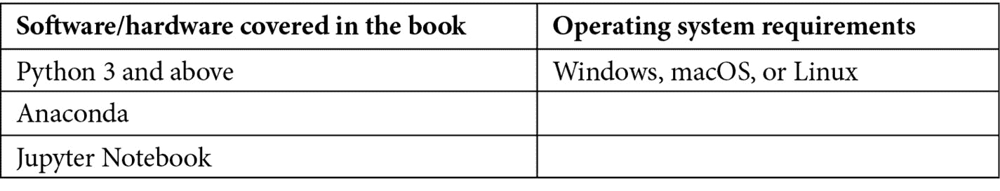

# 前言

高效且可重用的代码使您的应用程序开发过程无缝且易于维护。使用 Python，您可以访问高级元编程功能，这些功能可以帮助您构建高性能的应用程序。

本书首先向您介绍元编程的需求和应用，然后介绍面向对象编程的基础。随着您的进步，您将学习简单的装饰器，然后与元类一起工作，并随后专注于内省和反射。

在定义算法模板之前，您还将深入了解泛型和类型。

之后，您将使用抽象语法树来理解您的代码，并探索方法解析顺序。本书还向您展示如何创建自己的动态对象，在通过设计模式结构化对象之前。最后，您将了解简单的代码生成技术，以及最佳实践，并最终构建您自己的应用程序。

在这次学习之旅结束时，您将拥有设计和构建可重用高性能应用程序所需的技能和信心，这些应用程序可以解决现实世界的问题。

# 这本书面向谁

如果您是一位希望通过开发可重用和高级框架来提高编码技能的 Python 中级程序员，这本书适合您。对 Python 编程的基本了解将帮助您充分利用这次学习之旅。

# 这本书涵盖的内容

*第一章*，*元编程的需求和应用*，解释了 Python 中最先进功能之一的需求及其实际应用。

*第二章*，*Python 中 OOP 概念的复习*，概述了现有的 OOP 概念，如类、方法和对象，以及示例。

*第三章*，*理解装饰器和它们的用途*，介绍了函数和类上的装饰器概念，旨在为您提供装饰器的详细概述，包括如何编写它们以及在哪里使用它们。本章还详细介绍了示例代码的代码遍历。

*第四章*，*与元类一起工作*，介绍了基类和元类的概念，旨在为您提供元类的详细概述，包括如何编写它们以及在哪里使用它们。本章还详细介绍了示例代码的代码遍历。

*第五章*，*理解内省*，介绍了 Python 中的内省概念，旨在为您提供内省的详细概述，包括如何编写它以及在哪里使用它。本章还详细介绍了示例代码的代码遍历。

*第六章*, *Python 对象的反射实现*，介绍了 Python 中反射的概念，旨在为您提供关于反射的详细概述，包括如何编码它以及在哪里使用它。本章还详细介绍了示例代码的执行过程。

*第七章*, *理解泛型和类型*，介绍了 Python 中的泛型概念，旨在为您提供关于泛型的详细概述，包括如何编码它们以及在哪里使用它们。本章还详细介绍了示例代码的执行过程。

*第八章*, *定义算法模板*，介绍了 Python 中的模板概念，旨在为您提供关于模板的详细概述，包括如何编码它们以及在哪里使用它们。本章还详细介绍了示例代码的执行过程。

*第九章*, *通过抽象语法树理解代码*，介绍了 Python 中的抽象语法树的概念，旨在为您提供关于抽象语法树的详细概述，包括如何编码它们以及在哪里使用它们。本章还详细介绍了示例代码的执行过程。

*第十章*, *理解继承的方法解析顺序*，介绍了 Python 中方法解析顺序的概念，旨在为您提供关于方法解析顺序的详细概述，包括如何编码它以及在哪里使用它。本章还详细介绍了示例代码的执行过程。

*第十一章*, *创建动态对象*，介绍了 Python 中的动态对象概念，旨在为您提供关于动态对象的详细概述，包括如何编码它们以及在哪里使用它们。本章还详细介绍了示例代码的执行过程。

*第十二章*, *应用 GOF 设计模式 – 第一部分*，介绍了 Python 中的行为型设计模式的概念，旨在为您提供关于行为型设计模式的详细概述，并展示如何在不同的应用中应用它们。本章还详细介绍了示例代码的执行过程。

*第十三章*, *应用 GOF 设计模式 – 第二部分*，介绍了 Python 中的结构型和创建型设计模式的概念，旨在为您提供关于结构型和创建型设计模式的详细概述，并展示如何在不同的应用中应用它们。本章还详细介绍了示例代码的执行过程。

*第十四章*，*代码生成*，介绍了 Python 中的代码生成概念，旨在为您提供代码生成的详细概述，如何开发一个生成可重用代码的代码生成器，以及在哪里使用它。本章还涵盖了示例的详细代码遍历。

*第十五章*，*基于案例研究的应用开发*，通过开发一个基于案例研究的应用及其测试框架来实施我们迄今为止学到的所有概念。本章涵盖了包含类和方法以及代码解释的详细代码。此外，还涵盖了如何将开发的应用程序打包和部署到 Python 库中的步骤。

*第十六章*，*遵循最佳实践*，涵盖了在实施元编程概念时可以遵循的最佳实践，并回答了诸如在哪里以及在哪里不使用这些概念的问题在您的 Python 应用程序开发生命周期中。

# 要充分利用本书

请安装最新版本的 Python，最好是 Python 3.0 或更高版本，并从[`www.anaconda.com/products/distribution`](https://www.anaconda.com/products/distribution)安装最新版本的 Anaconda。安装完成后，打开 Jupyter Notebook 运行本书提供的示例。



**如果您使用的是本书的数字版，我们建议您自己输入代码或从本书的 GitHub 仓库（下一节中有一个链接）获取代码。这样做将帮助您避免与代码复制粘贴相关的任何潜在错误。**

# 下载示例代码文件

您可以从 GitHub（[`github.com/PacktPublishing/Metaprogramming-with-Python`](https://github.com/PacktPublishing/Metaprogramming-with-Python)）下载本书的示例代码文件。如果代码有更新，它将在 GitHub 仓库中更新。

我们还有其他来自我们丰富的图书和视频目录的代码包，可在[`github.com/PacktPublishing/`](https://github.com/PacktPublishing/)找到。查看它们！

# 下载彩色图像

我们还提供了一份包含本书中使用的截图和图表的彩色 PDF 文件。您可以从这里下载：[`packt.link/LTQbb`](https://packt.link/LTQbb)。

# 使用的约定

本书使用了多种文本约定。

`文本中的代码`：表示文本中的代码单词、数据库表名、文件夹名、文件名、文件扩展名、路径名、虚拟 URL、用户输入和 Twitter 昵称。以下是一个示例：“为了进一步解释这一点，让我们看看一个示例，我们将通过使用`ast`模块解析一系列字符串来生成一个名为`VegCounter`的类。”

代码块设置如下：

```py
actualclass = compile(class_tree, 'vegctr_tree', 'exec')
```

```py
actualclass
```

当我们希望您注意代码块中的特定部分或显示代码的输出时，相关的行或项目将以粗体显示：

```py
<code object <module> at 0x0000028AAB0D2A80, file "vegctr_tree", line 1>
```

小贴士或重要提示

看起来像这样。

# 联系我们

我们始终欢迎读者的反馈。

**一般反馈**: 如果您对本书的任何方面有疑问，请通过 mailto:customercare@packtpub.com 给我们发邮件，并在邮件主题中提及书名。

**勘误**: 尽管我们已经尽一切努力确保内容的准确性，但错误仍然可能发生。如果您在这本书中发现了错误，如果您能向我们报告，我们将不胜感激。请访问[www.packtpub.com/support/errata](http://www.packtpub.com/support/errata)并填写表格。

**盗版**: 如果您在互联网上发现我们作品的任何非法副本，如果您能提供位置地址或网站名称，我们将不胜感激。请通过 mailto:copyright@packt.com 与我们联系，并提供材料的链接。

**如果您有兴趣成为作者**: 如果您在某个主题上具有专业知识，并且您有兴趣撰写或为书籍做出贡献，请访问[authors.packtpub.com](http://authors.packtpub.com)。

# 分享您的想法

一旦您阅读了《Python 元编程》，我们很乐意听到您的想法！请[点击此处直接访问此书的亚马逊评论页面](https://packt.link/r/1838554653)并分享您的反馈。

您的评论对我们和科技社区都很重要，并将帮助我们确保我们提供高质量的内容。
