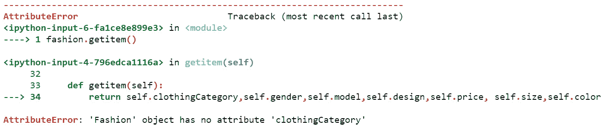
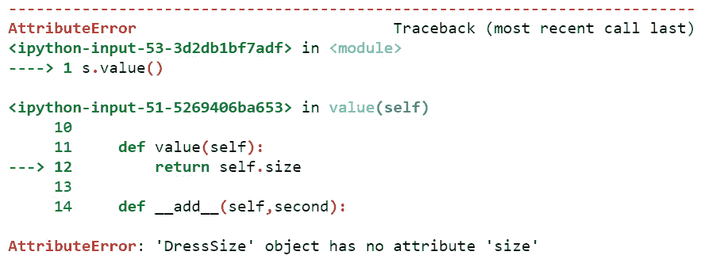
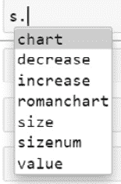

# 第七章：*第七章*：理解泛型和类型化

在本章中，我们将探讨泛型是什么，如何在 Python 3 中执行类型检查，以及它在元编程中的有用性。

Python 是一种编程语言，变量被声明为泛型，它们在声明时不会分配数据类型。Python 在运行时根据分配给变量的值动态地解决数据类型。在其他编程语言，如 C++中，泛型需要通过编程设计来使变量泛型，而在 Python 中，泛型是变量的定义方式。在这种情况下，我们将详细关注如何使用类型声明变量并限制变量的行为。

在本章中，我们将了解泛型在 Python 中的工作方式以及如何定义类型检查，以便我们可以对变量应用元编程，以静态类型化它们，这样我们就不必等待整个程序运行来确定我们在代码中无意中使用了不正确的类型。

在本章中，我们将涵盖以下主要主题：

+   泛型是什么？

+   当指定数据类型时会发生什么？

+   使用显式类型检查进行类型化 – 方法 1

+   使用显式类型检查进行类型化 – 方法 2

+   添加具有约束的数据类型

+   创建一个简单的自定义数据类型

+   创建一个领域特定数据类型

到本章结束时，你应该能够将泛型和类型检查应用于 Python 变量。你还应该能够创建自己的领域特定数据类型。

# 技术要求

本章中分享的代码示例可在 GitHub 上找到，地址为：[`github.com/PacktPublishing/Metaprogramming-with-Python/tree/main/Chapter07`](https://github.com/PacktPublishing/Metaprogramming-with-Python/tree/main/Chapter07)。

# 泛型是什么？

**泛型**是一种编程范式，在这种范式中，任何属性或变量都是一种在语言中未分配给任何特定类型的函数。当我们谈论类型时，它要么是变量数据类型，要么是函数返回类型。

## 泛型如何与元编程相关联？

**元编程**处理 Python 3 及以上版本的概念，其中我们可以开发脚本或程序，在外部操作 Python 对象，而不会实际影响程序中类、方法或函数的定义。泛型是 Python 构建其对象数据类型处理的方式。如果我们需要将 Python 中的数据类型处理从泛型更改为特定类型，我们可以通过元编程来实现。为了理解如何使具体实现工作，我们需要通过示例理解泛型。让我们在下一节中看看泛型。

## Python 中如何处理泛型？

在这里，我们可以通过一个例子来研究泛型。在本章中，我们将探讨核心示例的另一个有趣部分，*ABC Megamart*。在本章中，我们将使用*ABC Megamart*的服装和时尚部门来介绍我们的示例。

让我们以*ABC Megamart*的时尚部门为例。这个部门涵盖了各种服装产品。为了检验泛型，我们首先定义一个名为`Fashion`的类，具有`clothing_category`、`gender`、`model`、`design`、`dress_type`、`size`和`color`等属性。我们还将添加一个名为`get_item`的方法来返回前面的属性。代码定义如下：

```py
class Fashion:
```

```py
    def __init__(self,clothing_category,gender,model,design,dress_type,size, color):
```

```py
        self.clothing_category = clothing_category
```

```py
        self.gender = gender
```

```py
        self.model = model
```

```py
        self.design = design
```

```py
        self.dress_type = dress_type
```

```py
        self.size = size
```

```py
        self.color = color
```

```py
     def get_item(self):
```

```py
        return self.clothing_category,self.gender,self.model,self.design,self.dress_type, self.size,self.color        
```

此代码处理泛型。让我们通过将任何数据类型的值分配给`Fashion`类的属性来解释这个声明：

```py
fashion = Fashion("Clothing","Women","Western","Dotted","Jumpsuits",38,"blue")
```

我们已经为`clothing_category`、`gender`、`model`、`design`、`dress_type`和`color`添加了字符串值，而将整数值添加到`size`属性中。由于语言默认处理泛型，我们不必声明数据类型，值被接受而没有抛出任何错误。我们可以调用`get_item`方法来显示这些泛型值：

```py
fashion.get_item()
```

```py
('Clothing', 'Women', 'Western', 'Dotted', 'Jumpsuits', 38, 'blue')
```

检查`clothing_category`和`size`的数据类型结果如下：

```py
type(fashion.clothing_category)
```

```py
str
```

```py
type(fashion.size)
```

```py
int
```

现在我们来双重检查关于泛型的声明。当我们改变输入变量的数据类型时会发生什么？Python 会接受它们吗？为了测试这一点，让我们改变`clothing_category`和`size`的数据类型：

```py
fashion = Fashion(102,"Women","Western","Floral","T-Shirt","XS","green")
```

```py
fashion.get_item()
```

```py
(102, 'Women', 'Western', 'Floral', 'T-Shirt', 'XS', 'green')
```

数据类型的改变被 Python 接受并处理，可以如下查看：

```py
type(fashion.clothing_category)
```

```py
int
```

```py
type(fashion.size)
```

```py
str
```

在前面的例子中，无论输入值属于哪种数据类型，它们都能被成功处理。在下一节中，我们将显式地分配数据类型并进一步检查。

# 指定数据类型会发生什么？

Python 中的注解被添加到代码中以提供额外的信息或帮助最终用户在创建库时理解一段代码。注解可以用来向特定代码添加数据类型，以便开发人员可以通过注解检索数据类型的信息。

## 类型注解

在本章的主题——类型注解的上下文中，让我们在本节中看看类型注解。在 Python 中，可以使用注解的功能来定义函数或方法的数据类型，通过在类的属性上声明类型注解来实现。为了实现这一点，我们可以在声明变量时显式地分配一个数据类型及其返回类型，并将其添加到 Python 中的方法中。我们还将为方法的返回类型添加类型注解。

让我们声明一个`Fashion`类，它初始化了其属性或变量以及我们期望变量具有的数据类型：

```py
class Fashion:
```

```py
    def __init__(self,clothing_category: str,gender:str,model:str,design:str,dress_type:str,size:int, color:str):
```

```py
        self.clothing_category = clothing_category
```

```py
        self.gender = gender
```

```py
        self.model = model
```

```py
        self.design = design
```

```py
        self.dress_type = dress_type
```

```py
        self.size = size
```

```py
        self.color = color
```

```py
    def get_item(self) -> list:
```

```py
        return self.clothing_category,self.gender,self.model,self.design,self.dress_type, self.size,self.color
```

在前面的代码中，我们已为每个变量特别标记了一个数据类型。在这个类中，我们也将添加一个`get_item`方法，并添加带有类型提示的注释，指定该方法返回一个`list`项。

现在检查在创建对象时未遵循这些数据类型，并将值分配给这些变量时会发生什么：

```py
fashion = Fashion(104,"Women","Western","Cotton","Shirt","S","white")
```

```py
fashion.get_item()
```

```py
[104, 'Women', 'Western', 'Cotton', 'Shirt', 'S', 'white']
```

在前面的类定义中，我们将`clothingCategory_c`声明为字符串，将`size`声明为整数，但我们为`clothing_category`变量分配了整数，为`size`变量分配了字符串。程序仍然成功运行，没有抛出任何类型错误，而理想情况下应该出现类型错误。这个例子再次证明，当我们变量声明时分配数据类型时，Python 将类型处理为泛型。

让我们看看以下代码中`get_item`方法的注释：

```py
print(Fashion.get_item.__annotations__)
```

在方法上调用`__annotations__`提供了作为方法返回类型注解的列表数据类型：

```py
{'return': <class 'list'>}
```

让我们进一步探讨类型的概念，我们可以看看如何处理特定类型而不是泛型。

# 使用显式类型检查进行类型检查 – 方法 1

在前面的部分中，我们探讨了 Python 处理数据类型作为泛型的能力。在构建应用程序时，可能会有需要特定数据类型的场景，我们可能期望元编程具有处理此类特定数据类型的能力。在本节中，让我们看看创建一个执行类型检查的类。

## 创建一个类以实现类型检查

在这个例子中，我们将创建一个名为`typecheck`的类，并添加方法以特定地检查每种数据类型。例如，如果将整数类型作为输入提供给方法，它将返回输入值，如果条件失败，它将返回一条消息，提供输入值作为整数。类似地，我们将添加各种方法来检查字符串、浮点数、列表、元组和字典对象：

```py
class typecheck:
```

现在定义一个名为`intcheck`的方法。这个方法的目的是对任何输入进行显式的整数类型检查。在这个方法中，将提供一个值作为输入，并且该方法将验证输入值是否为整数。如果输入值是整数，我们将返回输入值。如果值不是整数，我们将返回一条消息，表示`"value should be an integer"`：

```py
    def intcheck(self,inputvalue):
```

```py
        if type(inputvalue) != int:
```

```py
            print("value should be an integer")
```

```py
        else:
```

```py
            return inputvalue
```

在以下方法中，让我们检查输入变量是否不是字符串（例如，`Orangesexample`），当条件为`true`时返回错误消息，当条件为`false`时返回输入值：

```py
    def stringcheck(self,inputvalue):
```

```py
        if type(inputvalue) != str:
```

```py
            print("value should be a string")
```

```py
        else:
```

```py
            return inputvalue
```

在以下方法中，让我们检查输入变量是否不是浮点值（例如，`example, 2335.2434`），当条件为`true`时返回错误消息，当条件为`false`时返回输入值：

```py
    def floatcheck(self,inputvalue):
```

```py
        if type(inputvalue) != float:
```

```py
            print("value should be a float")
```

```py
        else:
```

```py
            return inputvalue
```

在以下方法中，让我们检查输入变量不是一个包含变量的列表（例如，`['fruits','flowers',1990]`），当条件为`true`时返回错误信息，当条件为`false`时返回输入值：

```py
    def listcheck(self,inputvalue):
```

```py
        if type(inputvalue) != list:
```

```py
            print("value should be a list")
```

```py
        else:
```

```py
            return inputvalue
```

在以下方法中，让我们检查输入变量不是一个包含变量的元组（例如，`example, ('fruits','flowers',1990)`），当条件为`true`时返回错误信息，当条件为`false`时返回输入值：

```py
    def tuplecheck(self,inputvalue):
```

```py
        if type(inputvalue) != tuple:
```

```py
            print("value should be a tuple")
```

```py
        else:
```

```py
            return inputvalue
```

在以下方法中，让我们检查输入变量不是一个包含键/值对的字典（例如，`example: {'one': 1, 'two': 2}`），当条件为`true`时返回错误信息，当条件为`false`时返回输入值：

```py
    def dictcheck(self,inputvalue):
```

```py
        if type(inputvalue) != dict:
```

```py
            print("value should be a dict")
```

```py
        else:
```

```py
            return inputvalue
```

现在，我们将进一步创建`Fashion`类，使用`typecheck`类执行类型检查。

## 创建一个类来测试类型检查

现在让我们创建一个具有相同变量集的`Fashion`类，即`clothing_category`、`gender`、`model`、`design`、`dress_type`、`size`和`color`。在这个例子中，我们也将为每个变量分配一个特定的数据类型。在以下类定义中，让我们创建一个`typecheck`类的对象，并调用特定类型的方法来存储每种类型的变量。例如，`price`变量将被声明为`float`，我们将使用`typecheck`中的`floatcheck`方法来存储变量，而不是使用泛型：

```py
class Fashion:
```

在以下方法中，让我们使用`typecheck`类的类型检查方法初始化`Fashion`类的变量及其特定的数据类型：

```py
    def __init__(self,clothing_category: str,gender:str,price:float,design:str,dress_type:str,size:int, color:list):
```

```py
        tc = typecheck()
```

```py
        self.clothing_category = tc.stringcheck(clothing_category)
```

```py
        self.gender = tc.stringcheck(gender)
```

```py
        self.price = tc.floatcheck(price)
```

```py
        self.design = tc.stringcheck(design)
```

```py
        self.dress_type = tc.stringcheck(dress_type)
```

```py
        self.size = tc.intcheck(size)
```

```py
        self.color = tc.listcheck(color)
```

在以下方法中，让我们返回在`Fashion`类中初始化的所有变量：

```py
   def get_item(self):
```

```py
        return self.clothing_category,self.gender,self.price,self.design,self.dress_type, self.size,self.color
```

在`price`变量上调用`floatcheck`方法作为变量声明的类型机制，如果提供的输入不是浮点数，那么在变量声明阶段本身就会显示错误：

```py
fashion = Fashion(112,"Men","Western","Designer","Shirt",38.4,"black")
```

```py
value should be a string
```

```py
value should be a float
```

```py
value should be an integer
```

```py
value should be a list
```

在前面的例子中，我们声明了四个具有错误数据类型的变量；`clothing_category`应该是字符串，`price`应该是浮点数，`size`应该是整数，`color`应该是列表。所有这些错误的变量都没有被代码接受，因此我们收到了相应的变量类型错误：

```py
fashion.get_item()
```

```py
(None, 'Men', None, 'Designer', 'Shirt', None, None)
```

当我们从时尚对象中获取项目时，所有错误类型的变量都没有分配值。现在让我们看看正确的值以及它们是如何被`fashion`对象接受的：

```py
:fashion = Fashion("112","Men",20.0,"Designer","Shirt",38,["blue","white"])
```

```py
fashion.get_item()
```

```py
('112', 'Men', 20.0, 'Designer', 'Shirt', 38, ['blue', 'white'])
```

在前面的代码中，我们通过分配特定数据类型的值来纠正输入值，错误现在已解决。通过开发这样的显式类型库，我们可以将 Python 的泛型转换为具体类型。

# 使用显式类型检查进行类型化 – 方法 2

在本节中，我们将探讨另一种将特定数据类型应用于变量的方法。在第一种方法中，我们开发了一个 `typecheck` 类，并使用类型检查方法本身来创建新的数据类型。在本例中，我们将为每个类型检查方法创建 `typecheck` 类，以检查输入值是否属于预期的类型，并根据条件的结果返回一个布尔值。这种类型检查方法使我们能够修改 `Fashion` 类，以便在条件不满足时提供特定变量的错误消息。

## 创建一个类以实现类型检查

在本例中，让我们首先创建 `typecheck` 类。

这里创建 `typecheck` 类是为了使本类中的所有方法可重用，以防类型检查代码中的所有方法需要导出到不同的文件以供以后使用。

本例中的所有方法都可以有或没有类创建，并在本章中使用：

```py
class typecheck
```

+   在下面的方法中，让我们检查输入变量不是一个整数（例如，`23348`），当条件为真时返回 `False`，当条件为假时返回 `True`：

    ```py
        def intcheck(self,inputvalue):
            if type(inputvalue) != int:
                return False
            else:
                return True
    ```

+   在下面的方法中，让我们检查输入变量不是一个字符串（例如，`Orangesexample`），当条件为真时返回 `False`，当条件为假时返回 `True`：

    ```py
        def stringcheck(self,inputvalue):
            if type(inputvalue) != str:
                return False
            else:
                return True
    ```

+   在以下方法中，让我们检查输入变量不是一个浮点数值（例如，`2335.2434`），当条件为真时返回 `False`，当条件为假时返回 `True`：

    ```py
       def floatcheck(self,inputvalue):
            if type(inputvalue) != float:
                return False
            else:
                return True
    ```

+   在下面的方法中，让我们检查输入变量不是一个变量列表（例如，`['fruits','flowers',1990]`），当条件为真时返回 `False`，当条件为假时返回 `True`：

    ```py
       def listcheck(self,inputvalue):
            if type(inputvalue) != list:
                return False
            else:
                return True
    ```

+   在以下方法中，让我们检查输入变量不是一个变量元组（例如，`('fruits','flowers',1990)`），当条件为真时返回 `False`，当条件为假时返回 `True`：

    ```py
       def tuplecheck(self,inputvalue):
            if type(inputvalue) != tuple:
                return False
            else:
                return True
    ```

+   在以下方法中，让我们检查输入变量不是一个包含键/值对的字典（例如，`{'one': 1, 'two': 2}`），当条件为真时返回 `False`，当条件为假时返回 `True`：

    ```py
       def dictcheck(self,inputvalue):
            if type(inputvalue) != dict:
                return False
            else:
                return True
    ```

现在，我们可以进一步创建一个名为 `Fashion` 的类，使用 `typecheck` 类来进行类型检查。

## 创建一个类以测试类型检查

在本节中，让我们看看如何创建一个具有不同变量类型定义的 `Fashion` 类，如下所示：

```py
class Fashion:
```

+   让我们初始化变量以及每个变量的具体数据类型：

    ```py
        def __init__(self,clothing_category: str,gender:str,model:tuple,design:int,price:float,size:dict, color:list):
            tc = typecheck()
    ```

+   在以下代码中，让我们检查 `clothing_category` 输入是否为字符串，如果是，则返回值；如果不是，则返回针对 `clothing_category` 的特定错误：

    ```py
            if tc.stringcheck(clothing_category):
                self.clothing_category = clothing_category
            else:
                print("clothing category should be a string")
    ```

+   在以下代码中，让我们检查 `gender` 输入是否为字符串，如果是，则返回值；如果不是，则返回针对 `gender` 变量的特定错误：

    ```py
            if tc.stringcheck(gender):
                self.gender = gender
            else: 
                print("gender should be a string")
    ```

+   在以下代码中，让我们检查`model`输入是否为元组，如果是，则返回值；如果不是，则返回针对`model`变量的特定错误：

    ```py
            if tc.tuplecheck(model):
                self.model = model
            else:
                print("model should be a tuple")
    ```

+   在以下代码中，让我们检查`design`输入是否为整数，如果是，则返回值；如果不是，则返回针对`design`变量的特定错误：

    ```py
    if tc.intcheck(design):
                self.design = design
            else:
                print("design should be an integer")
    ```

+   在以下代码中，让我们检查`price`输入是否为浮点值，如果是，则返回值；如果不是，则返回针对`price`变量的特定错误：

    ```py
    if tc.floatcheck(price):
                self.price = price
            else:
                print("price should be a floating point value")
    ```

+   在以下代码中，让我们检查`size`输入是否为字典对象，如果是，则返回值；如果不是，则返回针对`size`变量的特定错误：

    ```py
    if tc.dictcheck(size):
                self.size = size
            else:
                print("size should be a dictionary object")
    ```

+   在以下代码中，让我们检查`color`输入是否为列表对象，如果是，则返回值；如果不是，则返回针对`color`变量的特定错误：

    ```py
    if tc.listcheck(color):       
                self.color = color
            else:
                print("color should be a list of values")
    ```

+   在以下代码中，让我们创建一个方法来返回先前代码中列出的所有变量：

    ```py
        def get_item(self):
            return self.clothing_category,self.gender,self.model,self.design,self.price, self.size,self.color
    ```

为了测试这种类型检查方法，让我们将这些变量的一些不正确值作为输入传递并检查：

```py
fashion = Fashion(12,"Women","Western","Floral","Maxi Dress",34,"yellow")
```

执行前面的代码会产生以下错误列表：

```py
clothing category should be a string
```

```py
model should be a tuple
```

```py
price should be a floating point value
```

```py
size should be a dictionary object
```

```py
color should be a list of values
```

此外，在先前的`fashion`对象上调用`get_item`方法会导致以下错误：

```py
fashion.get_item()
```

错误信息的图形表示如下：



图 7.1 – 调用 get_item 方法时的错误

在先前的错误中，第一个变量`clothing-category`没有被方法接受，因为该变量的类型期望没有得到满足。

我们可以通过提供正确的输入类型来进一步检查，如下所示：

```py
fashion = Fashion("Rayon","Women",("Western","Floral"),12012,100.50,{'XS': 36, 'S': 38, 'M': 40},["yellow","red"])
```

在先前的值赋值中没有错误。现在在`fashion`对象上调用`get_item`方法会产生以下输出：

```py
fashion.get_item()
```

```py
('Rayon',
```

```py
 'Women',
```

```py
 ('Western', 'Floral'),
```

```py
 12012,
```

```py
 100.5,
```

```py
 {'XS': 36, 'S': 38, 'M': 40},
```

```py
 ['yellow', 'red'])
```

之前的输出满足所有类型要求，并且通过这种方法成功实现了类型检查的最终目标。现在你理解了这个，让我们进一步探讨具有约束的数据类型的概念。

# 添加具有约束的数据类型

在本节中，我们将查看一个向数据类型添加约束并在类型检查的同时检查约束的示例。可能会有这样的场景，我们想要创建一个整数变量并限制其长度为两位数，或者创建一个字符串并限制其长度为 10 个字符以上。通过这个例子，让我们探索如何在静态类型检查期间添加这样的约束或限制。

在这个例子中，让我们创建一个只包含两个方法的`typecheck`类来检查整数和字符串。在检查这些数据类型的同时，我们也在方法定义中添加了一些额外的约束：

```py
class typecheck:
```

+   在以下方法中，让我们检查输入变量不是整数或其长度大于两个，当条件为真时返回`False`，当条件为假时返回`True`：

    ```py
        def intcheck(self,inputvalue):
            if (type(inputvalue) != int) and (len(str(inputvalue))>2):
                return False
            else:
                return True
    ```

+   在下面的方法中，让我们检查输入变量不是字符串或其长度大于 10，当条件为真时返回`False`，当条件为假时返回`True`：

    ```py
        def stringcheck(self,inputvalue):
            if (type(inputvalue) != str) and (len(str(inputvalue))>10):
                return False
            else:
                return True
    ```

只需两个带有类型检查和约束的方法，我们就可以创建一个具有两个变量和一个方法的`Fashion`类：

```py
class Fashion:
```

+   让我们用字符串`clothing_category`和整型`size`初始化类：

    ```py
        def __init__(self,clothing_category: str,size:int):
            tc = typecheck()
    ```

+   在下面的代码中，让我们使用`stringcheck`方法声明`clothing_category`：

    ```py
            if tc.stringcheck(clothing_category):
                self.clothing_category = clothing_category
            else:
                print("value should be a string of length less than or equal to 10")
    ```

+   在下面的代码中，让我们使用`intcheck`方法声明`size`：

    ```py
            if tc.intcheck(size):
                self.size = size
            else:
                print("value should be an integer of 2 digits or less")
    ```

+   在下面的代码中，让我们添加一个方法来获取项目并返回它们：

    ```py
        def get_item(self):
            return self.clothing_category,self.size
    ```

让我们进一步创建一个`fashion`类的对象，并分配两个不满足类型检查条件的变量：

```py
fashion = Fashion("Clothing & Accessories",384)
```

```py
value should be a string of length less than or equal to 10
```

```py
value should be an integer of 2 digits or less
```

之前的错误信息表明，字符串类型以及整型数据类型都没有满足类型检查和约束条件。现在，让我们提供正确的输入值并执行静态类型检查：

```py
fashion = Fashion("Cotton",34)
```

```py
fashion.get_item()
```

```py
('Cotton', 34)
```

在前面的代码中，值赋值现在按预期工作。有了这个理解，让我们进一步创建简单的自定义数据类型。

# 创建一个简单的自定义数据类型

在上一节之前，我们探讨了添加显式类型检查以及将泛型类型变量转换为特定类型来处理在编写应用程序时可能遇到的具体数据需求，我们还添加了错误信息来帮助调试分配给变量的不正确数据类型。

在本节中，我们将探讨创建我们自己的简单数据类型以及这样做需要满足什么条件。首先，让我们回答为什么我们需要自己的数据类型。任何自定义数据类型都是 Python 基本数据类型的一个派生，并伴随一些变化以满足我们在应用程序中的数据需求。任何数据类型都将有一组可以在该特定类型数据上执行的操作。例如，整型数据类型将支持加法、减法、乘法和除法等算术操作。同样，字符串支持使用连接代替加法，等等。因此，当我们创建自己的数据类型时，我们可以覆盖这些基本操作以满足我们自定义数据类型的需求。

为了演示这一点，让我们首先创建我们自己的数据类型并覆盖基本运算符以执行我们期望的操作。请注意，自定义数据类型可能只在以下情况下需要：我们希望使其具有领域特定性或应用特定性。我们始终可以使用默认数据类型，并在没有要求的情况下避免创建自定义数据类型：

1.  我们将创建一个名为`DressSize`的类，并用整型变量`size`初始化它。如果`size`的输入值不是整数，或者输入值不遵循特定的服装尺寸列表，类型检查将返回一个红色的错误信息（如图*7.2*所示）：

    ```py
    class DressSize:
        def __init__(self,size:int):
            self.limit = [28, 30, 32, 34, 36, 38, 40, 42, 44, 46, 48]
            if type(size)==int and size in self.limit:
                self.size = size
            else:
                print("\x1B31mSize should be a valid dress size")  
    ```

1.  接下来，让我们重写一个类的默认 `str` 方法，使其返回 `size` 变量的字符串版本：

    ```py
        def __str__(self):
            return str(self.size)
    ```

1.  然后，让我们添加一个名为 `value` 的新方法，用于返回 `size` 属性的值：

    ```py
        def value(self):
            return self.size
    ```

1.  现在，让我们重写整数方法的加法（`+`）运算符，以增加为 `DressSize` 类创建的一个服装尺寸对象中的 `size` 值：

    ```py
        def __add__(self, up):
            result = self.size + up
            if result in self.limit:
                return result
            else:
                return "Input valid size increments"
    ```

1.  然后，让我们重写整数方法的减法（`-`）运算符，以减少为 `DressSize` 类创建的一个尺寸对象中的 `size` 值：

    ```py
        def __sub__(self, down):
            result = self.size - down
            if result in self.limit:
                return result
            else:
                return "Input valid size decrements"
    ```

1.  然后，我们将为该类创建一个对象，在这种情况下，我们的新自定义数据类型 `DressSize`，并用字符串而不是整数来初始化它，如下所示：

    ```py
    s = DressSize("30")
    ```

不正确的输入类型会导致出现类似调试时通常显示的错误信息的红色字体错误：

![图 7.2 – DressSize 的错误信息图 7.2 – DressSize 的错误信息 1.  调用 `value` 方法也会导致错误，因为 `DressSize` 数据类型的类型检查失败了：    ```py    s.value()    ```值错误显示如下：

图 7.3 – 由于输入类型不正确导致的值错误

1.  让我们通过在创建 `DressSize` 对象时提供正确的输入类型来纠正这个错误：

    ```py
    s = DressSize(30)
    s
    <__main__.DressSize at 0x22c4bfc4a60>
    ```

1.  在下面的代码中，我们可以看看加法操作（`+`）是如何在 `DressSize` 对象上工作的：

    ```py
    DressSize(30) + 6
    36
    DressSize(30) + 3
    'Input valid size increments'
    ```

1.  两个对象的加法操作与常规加法类似，因为我们已经重载了加法运算符（`+`）来添加两个对象的初始化变量。同样，我们可以检查减法的结果，如下所示：

    ```py
    DressSize(32) - 4
    26
    DressSize(30) – 3
    'Input valid size decrements'
    ```

1.  两个对象的减法操作与常规减法类似，因为我们已经重载了减法运算符（`-`）来从两个对象的初始化变量中减去。同样，打印对象会打印 `size` 变量的字符串格式，因为我们已经重载了 `str` 方法来完成这项工作：

    ```py
    print(s)
    30
    ```

1.  我们还添加了一个 `value` 方法来显示 `size` 变量的值，它的工作方式如下：

    ```py
    s.value()
    30
    ```

1.  在变量或 `s` 对象上调用 `type` 方法会显示类名 `DressSize`，这是在这种情况下 `s` 的数据类型：

    ```py
    type(s)
    __main__.DressSize
    ```

现在，我们可以考虑在下一节创建一个更详细的自定义数据类型。

# 创建一个特定领域的数据类型

在本节中，让我们创建一个更定制的数据类型来处理 *ABC Megamart* 时尚部门的服装尺寸。我们在前一节中定义的 `DressSize` 数据类型可以处理任何整数作为输入并执行我们重载的操作。当我们查看时尚行业的领域并考虑服装尺寸作为特定领域的变量时，`DressSize` 数据类型理想情况下应该只考虑 `size` 的特定值，而不是接受所有整数。服装尺寸将基于 *ABC Megamart* 库存中持有的服装尺寸：

在这个例子中，接受服装尺寸的输入应该是整数列表`[36,38,40,42,44,46,48]`，或者表示服装尺寸等效文本值的字符串列表，例如`[XS,S,M,L,XL,XXL,XXXL]`：

1.  让我们从创建`DressSize`类及其方法开始，使其作为特定领域的数据类型工作，并将`size`初始化为其唯一的输入值：

    ```py
    class DressSize:
        def __init__(self, size):
    ```

1.  让我们进一步定义两个特定领域的列表，分别用于存储服装尺寸的有效值集合，一个是文本格式，另一个是整数格式：

    ```py
    self.romanchart = ['XS','S','M','L','XL','XXL','XXXL']
    self.sizenum = [36,38,40,42,44,46,48]
    ```

1.  在下面的代码中，我们将创建一个字典对象，它包含`size`的整数和文本格式的键/值对。添加这个字典对象的原因是将其用于为该数据类型创建的特定数据类型方法中：

    ```py
    self.chart = {}dict(zip(self.romanchart,self.sizenum))
    ```

1.  现在让我们添加一个条件，如果输入值符合数据类型标准，则接受该输入值作为`size`，如果不满足标准，则使用错误信息拒绝输入值：

    ```py
            if (size in self.romanchart) or (size in self.sizenum ):
                self.size = size
            else:
                print("\x1B[31mEnter valid size")
    ```

在前面的代码中，如果输入值存在于`romanchart`列表变量中，或者存在于`sizenum`列表变量中，则将接受该输入值。如果这两个条件都不满足，`DressSize`数据类型将拒绝该值，并在红色字体中显示错误信息。为什么我们需要在这个特定领域的特定数据类型中设置这些严格的约束？如果我们看看服装的`size`值，尺寸通常是一个偶数，购物车或服装店中没有奇数尺寸的服装。此外，大多数通用服装店的服装尺寸通常在 36 到 48 之间。如果商店持有较小或较大的尺寸的服装，我们可以相应地调整列表并重新定义数据类型。在这个特定场景中，让我们考虑 36 到 48 之间的服装尺寸及其对应的文本代码 XS 到 XXXL 作为可接受值。现在，我们已经添加了数据类型的接受标准：

1.  让我们添加可以在此数据类型上处理的具体方法。在以下方法中，让我们重写类的默认`str`方法，以返回`size`变量的字符串版本：

    ```py
        def __str__(self):
            return str(self.size)
    ```

1.  在下面的代码中，让我们添加一个名为`value`的新方法来返回`size`属性的值：

    ```py
        def value(self):
            return self.size
    ```

1.  在下面的代码中，让我们添加一个方法来增加`size`值。由于服装尺寸总是以偶数测量，`size`值应该增加`2`：

    ```py
        def increase(self):
            if (self.size in self.romanchart) :
                result = self.chart[self.size] + 2
                for key, value in self.chart.items():
                    if value == result:
                        return resultkey
            elif (self.size in self.sizenum ):
                return self.size + 2
    ```

在前面的代码中，我们添加了一个查找服装尺寸值（如`XL`）的逻辑，如果`DressSize`是数据类型的文本输入，然后增加该值`2`。我们还添加了一个检查服装尺寸整数值的逻辑，如果服装尺寸输入是整数，则增加`2`。

1.  让我们再添加一个方法来减少`DressSize`属性：

    ```py
        def decrease(self):
            if self.size in self.romanchart :
                result = self.chart[self.size] - 2
                for key, value in self.chart.items():
                    if value == result:
                        return key
            elif (self.size in self.sizenum ):
                return self.size – 2
    ```

在上述代码中，我们添加了一个查找连衣裙尺寸值（如`XL`）的逻辑，如果`DressSize`是数据类型的文本输入，然后减去`2`。我们还添加了一个检查`DressSize`的整数值的逻辑，如果连衣裙尺寸输入是整数，则减去`2`。这定义了名为`DressSize`的特定领域数据类型的整体创建。

1.  下一步是通过创建一个对象来测试这种数据类型：

    ```py
    s = DressSize("XXL")
    ```

在上述代码中，我们创建了一个名为`s`的对象，因此让我们看看各种方法和属性在这个对象上的工作方式：



图 7.4 – DressSize 的属性

1.  在以下代码中，让我们从`s`对象中调用`chart`：

    ```py
    s.chart
    {'XS': 36, 'S': 38, 'M': 40, 'L': 42, 'XL': 44, 'XXL': 46, 'XXXL': 48}
    ```

1.  打印对象会产生`s`对象值的字符串格式表示：

    ```py
    print(s)
    XS
    XL
    ```

1.  调用值方法的结果如下：

    ```py
    s.value()
    'XXL'
    ```

1.  调用增量方法的结果如下：

    ```py
    s.increase()
    XXXL
    ```

1.  调用减量方法的结果如下：

    ```py
    s.decrease()
    XL
    ```

1.  让我们现在创建`Fashion`类并初始化变量，其中`size`变量将被初始化为`DressSize`类型：

    ```py
    class Fashion:
        def __init__(self,clothing_category: str,gender:str,model:str,design:str,dress_type:str,color:str,size:DressSize):
            self.clothing_category = clothing_category
            self.gender = gender
            self.model = model
            self.design = design
            self.dress_type = dress_type
            self.color = color
    ```

1.  在以下代码中，让我们定义`DressSize`的类型检查条件。如果`size`是`DressSize`的实例，则返回该实例；如果不是实例，将显示适当的错误消息：

    ```py
    if isinstance(size,DressSize):
                self.size = size
            else:
                print("value should be of type DressSize")   
    ```

1.  让我们进一步添加`get_item`方法来返回`Fashion`类的属性：

    ```py
        def get_item(self):
            return self.clothing_category,self.gender,self.model,self.design,self.dress_type,self.color,self.size
    ```

1.  创建对象进一步的结果如下：

    ```py
    fashion = Fashion("Clothing","Women","Western","Dotted","Jumpsuits",'blue',"XL")
    value should be of type DressSize
    ```

在上述代码中，我们没有为`size`变量分配正确的数据类型。

1.  为了纠正它，让我们创建一个`DressSize`的实例并将其作为输入提供给`Fashion`类：

    ```py
    M = DressSize("M")
    fashion = Fashion("Clothing","Women","Western","Dotted","Jumpsuits",'blue',M)
    ```

上述代码没有产生任何错误，并且被`Fashion`类接受为输入。调用`get_item`方法会产生以下输出：

```py
fashion.get_item()
('Clothing',
 'Women',
 'Western',
 'Dotted',
 'Jumpsuits',
 'blue',
 <__main__.DressSize at 0x22c4cf4ba60>)
```

如果我们想查看`M`对象的特定值，可以按照以下方式调用`value`方法：

```py
fashion.size.value()
'M'
```

在本节中，我们探讨了如何创建特定领域的自定义数据类型，以及如何将其用作另一个类的类型变量。

这些是一些 Python 中泛型工作方式的示例，以及如何使用用户定义的函数将具体内容应用于 Python 对象。

# 概述

在本章中，我们学习了泛型和类型检查的概念。我们还探讨了创建具有特定约束的用户定义数据类型，并看到了如何将它们应用于我们的核心示例。我们创建了自己的特定领域数据类型，并重载了运算符和方法以根据数据类型工作。类似于本书中涵盖的其他章节，本章也用于使用元编程的概念在外部更改 Python 对象的行为。

在下一章中，我们将通过一些有趣的示例来探讨模板的概念。
