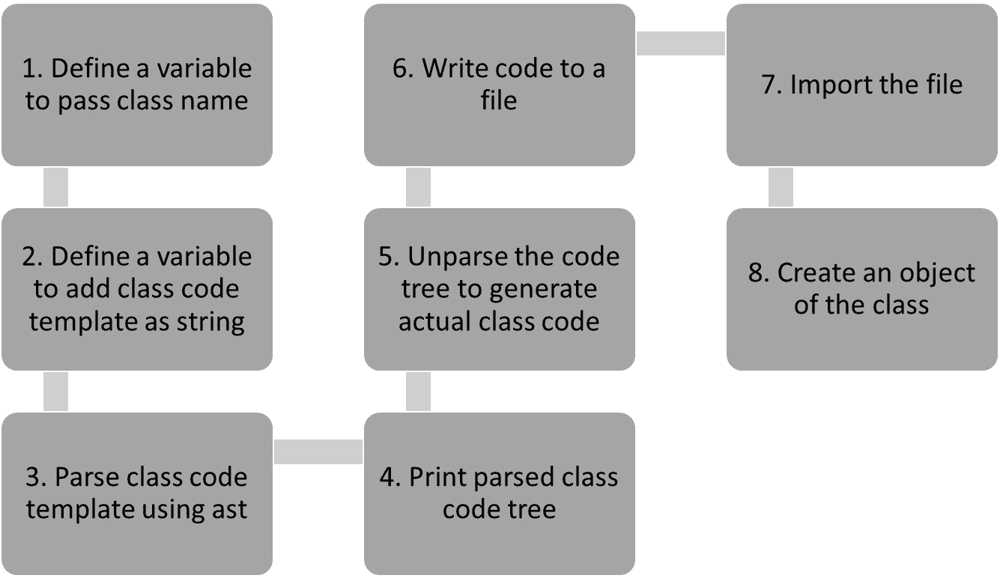
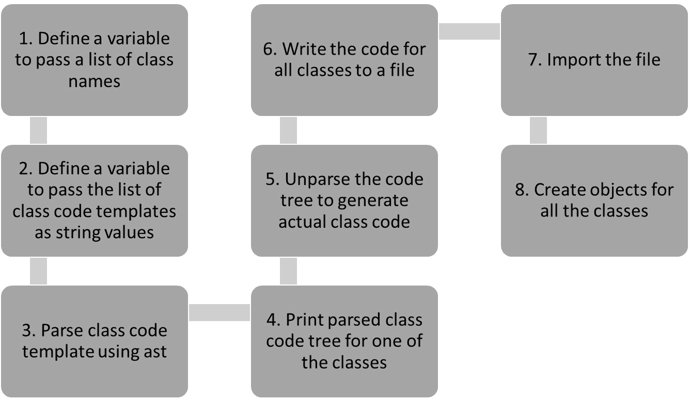
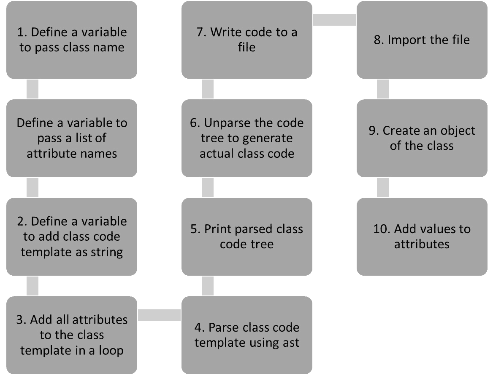
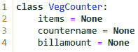
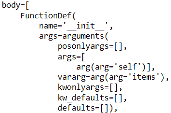
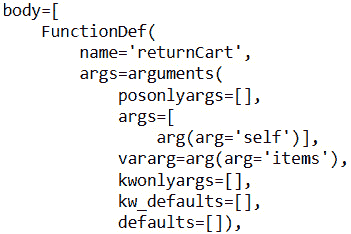

# 第十四章：*第十四章*：从抽象语法树生成代码

在本章中，我们将学习如何使用 Python 中的 AST 为各种应用程序生成代码。我们将应用这些抽象语法树到元编程中，以实现本章中自动生成的代码。

自动代码生成是使程序员生活更轻松的一种方式。抽象语法树是一个出色的功能，可以帮助我们以更简单的方式生成代码。

本书第九章*第九章*中讨论了 AST 的概念，并附有示例。在本章中，我们将利用 AST 的优势来自动生成代码。代码生成可以实现，以便在开发应用程序时无需代码或仅限少量编码。在本章中，我们将继续使用*ABC Megamart*的例子来从 AST 生成代码。

在本章中，我们将探讨以下主要主题：

+   使用模板生成简单类

+   从列表生成多个类

+   生成具有属性的类

+   生成具有方法的类

+   定义自定义类工厂

+   开发代码生成器以生成简单库

到本章结束时，你应该能够理解如何使用 Python 中`ast`库的现有方法来使你的应用程序生成自己的代码，如何避免重复，以及如何动态生成代码。

# 技术要求

本章中分享的代码示例可在 GitHub 上找到，地址为[`github.com/PacktPublishing/Metaprogramming-with-Python/tree/main/Chapter14`](https://github.com/PacktPublishing/Metaprogramming-with-Python/tree/main/Chapter14)。

# 使用模板生成简单类

在本节中，我们将探讨如何在不实际定义类本身的情况下生成类的代码。我们将创建一个基于字符串的模板，具有我们想要开发的类的结构，但不包含可执行的代码。为了进一步解释这一点，让我们看一个例子，我们将通过使用`ast`模块解析一系列字符串来生成名为`VegCounter`的类。

生成类代码的步骤顺序表示在以下流程图中：



图 14.1 – 简单类的代码生成序列

让我们看看这个例子的实现：

1.  我们将首先导入`ast`库：

    ```py
    import ast
    ```

1.  现在让我们创建一个变量，用于传递需要生成代码的类名：

    ```py
    classname = "VegCounter"
    ```

1.  我们接下来将定义一个变量，它将成为本例中生成的类的模板：

    ```py
    classtemplate = """class """ +classname+ """():pass"""
    ```

1.  在下一步中，我们将使用`ast`模块中的`parse`方法解析类模板：

    ```py
    print(ast.dump(class_tree, indent = 4))
    ```

1.  上述代码的输出显示了类模板的抽象语法树：

    ```py
    Module(
        body=[
            ClassDef(
                name='VegCounter',
                bases=[],
                keywords=[],
                body=[
                    Pass()],
                decorator_list=[])],
        type_ignores=[])
    ```

1.  前面的树可以按以下方式编译和执行：

    ```py
    actualclass = compile(class_tree, 'vegctr_tree', 'exec')
    actualclass
    ```

因此，这导致了以下输出：

```py
<code object <module> at 0x0000028AAB0D2A80, file "vegctr_tree", line 1>
```

1.  在下一步中，我们将反解析树以生成类的实际代码：

    ```py
    VegCounter.
    print(ast.unparse(class_tree))
    ```

执行前面的代码会导致以下输出：

```py
class VegCounter:
    pass
```

1.  在下一步中，让我们将前面的类代码写入名为 `classtemplate.py` 的文件：

    ```py
    code = open("classtemplate.py", "w")
    script = code.write(ast.unparse(class_tree))
    code.close()
    ```

1.  `classtemplate` 文件看起来如下所示：


图 14.2 – `classtemplate.py` 文件

1.  现在我们导入 `classtemplate` 并创建一个对象：

    ```py
    import classtemplate as c
    vegc = c.VegCounter()
    vegc
    ```

输出如下所示：

```py
<classtemplate.VegCounter at 0x28aab1d6a30>
```

在本节中，我们使用 `ast` 模块生成了一个简单的类代码。这个例子帮助我们理解生成自定义类代码的步骤，因为从简单开始理解代码生成更容易。有了这个理解，让我们为多个类生成代码。

# 从列表生成多个类

在本节中，我们将探讨如何使用 `ast` 模块及其 `unparse` 方法动态地为多个类生成代码。

动态地为多个类生成代码，为我们实现应用程序多个功能的代码生成提供了方向。这些类不需要具有相同的功能，因此生成的类代码可以稍后修改，以包括应用程序所需的额外方法或属性。示例中将生成骨架类代码。

为了进一步理解，我们将遵循以下流程图描述的顺序。



图 14.3 – 多个类的代码生成序列

现在我们来看看如何实现这个场景：

1.  我们首先定义一个变量，该变量可以分配一个包含类名的列表作为值：

    ```py
    classnames = ["VegCounter", "ElectronicsCounter", "PasadenaBranch", "VegasBranch"]
    ```

1.  在下一步中，让我们看看如何从前面的列表中为每个类名生成类模板：

    ```py
    classgenerator = []
    for classname in classnames:
        classcode = """class """ +classname+ """():pass"""
        classgenerator.append(classcode)
    classgenerator
    ```

类模板被添加到另一个名为 `classgenerator` 的列表中，该列表如下所示：

```py
['class VegCounter():pass',
 'class ElectronicsCounter():pass',
 'class PasadenaBranch():pass',
 'class VegasBranch():pass']
```

1.  为了解析前面的输出中的字符串模板并生成它们的抽象语法树，让我们创建另一个名为 `classtrees` 的列表并存储这些树：

    ```py
    classtrees = []
    for i in classgenerator:
        classtree = ast.parse(i)
        classtrees.append(classtree)
    classtrees
    ```

分解的类树，分配给 `classtrees` 列表变量，显示如下：

```py
[<ast.Module at 0x1efa91fde20>,
 <ast.Module at 0x1efa91e6d30>,
 <ast.Module at 0x1efa91e6220>,
 <ast.Module at 0x1efa91e6370>]
```

1.  在本步骤中，我们将审查其中一个树以确保抽象语法树按预期为类生成：

    ```py
    print(ast.dump(classtrees[0], indent = 4))
    ```

输出如下所示：

```py
Module(
    body=[
        ClassDef(
            name='VegCounter',
            bases=[],
            keywords=[],
            body=[
                Pass()],
            decorator_list=[])],
    type_ignores=[])
```

1.  我们可以进一步将 `classtrees` 变量反解析，为每个类生成代码：

    ```py
    print(ast.unparse(classtrees[1]))
    ```

一个示例输出如下所示：

```py
class ElectronicsCounter:
    pass
```

1.  让我们将所有生成的类写入一个文件：

    ```py
    code = open("classtemplates.py", "w")
    for i in classtrees:
        code.write(ast.unparse(i))
        code.write("\n")
        code.write("\n")
    code.close()
    ```

生成的 `classtemplates.py` 文件看起来如下所示：


图 14.4 – `classtemplates.py` 文件

1.  让我们导入文件并调用每个类的实例以检查其是否工作：

    ```py
    import classtemplates as ct
    print(ct.ElectronicsCounter())
    print(ct.PasadenaBranch())
    print(ct.VegasBranch())
    print(ct.VegCounter())
    ```

前面代码的输出如下所示：

```py
<classtemplates.ElectronicsCounter object at 0x00000255C0760FA0>
<classtemplates.PasadenaBranch object at 0x00000255C0760F10>
<classtemplates.VegasBranch object at 0x00000255C0760FA0>
<classtemplates.VegCounter object at 0x00000255C0760F10>
```

在本节中，我们使用 `ast` 模块为多个类生成了代码。这个例子是朝着为应用程序的多个功能或模块自动生成代码的下一步。

# 生成具有属性的类

在本节中，我们将为包含动态包含在类中的属性列表的类生成代码。仅生成类的代码可以给出模块的初始骨架结构，而如果我们想使类更具体，则需要添加属性。以下流程图表示了本例要遵循的步骤序列：



图 14.5 – 具有多个属性的类的代码生成序列

让我们看看本例的代码：

1.  我们首先定义一个变量以提供 `classname` 作为输入，然后定义一个 `classtemplate` 来创建类声明的模板：

    ```py
    classname = "VegCounter"
    classtemplate =  '''class ''' +classname+ ''':'''+'\n    '
    ```

1.  在下一步中，让我们定义另一个变量以提供属性名称作为输入：

    ```py
    attributename = ['items', 'countername', 'billamount']
    ```

1.  让我们进一步更新 `classtemplate`，提供生成类代码所需的前述每个属性：

    ```py
    for attr in attributename:
        classtemplate = classtemplate + attr +''' = 
            None''' + '\n    '
    ```

1.  让我们现在解析 `classtemplate` 并审查抽象语法树：

    ```py
    class_tree = ast.parse(classtemplate)
    print(ast.dump(class_tree, indent = 4))
    ```

1.  上述类模板的语法树如下所示：

    ```py
    Module(
        body=[
            ClassDef(
                name='VegCounter',
                bases=[],
                keywords=[],
                body=[
                    Assign(
                        targets=[
                            Name(id='items', 
                        ctx=Store())],
                        value=Constant(value=None)),
                    Assign(
                        targets=[
                            Name(id='countername', 
                            ctx=Store())],
                        value=Constant(value=None)),
                    Assign(
                        targets=[
                            Name(id='billamount', 
                            ctx=Store())],
                        value=Constant(value=None))],
                decorator_list=[])],
        type_ignores=[])
    ```

所有三个变量 – `items`、`countername` 和 `billamount` – 现在都是语法树的一部分。如果我们详细审查树，我们可以在 `body` | `assign` | `targets` | `name` | `id` 下查看这些变量。

1.  我们可以进一步解析树形结构并查看类的代码：

    ```py
    print(ast.unparse(class_tree))
    ```

输出如下所示：

```py
class VegCounter:
    items = None
    countername = None
    billamount = None
```

让我们将代码写入文件并导入：

```py
code = open("classtemplateattr.py", "w")
script = code.write(ast.unparse(class_tree))
code.close()
```

生成的代码如下所示：



图 14.6 – classtemplateattr.py 文件

我们可以导入 `classtemplateattr.py` 文件，并且可以通过以下方式访问类：

```py
import classtemplateattr as c
c.VegCounter()
vegc = c.VegCounter()
vegc.items = ['onions','tomatoes','carrots','lettuce']
vegc.countername = 'Veg Counter'
vegc.billamount = 200
```

输出如下所示，所有属性及其对应值都已分配：

```py
['onions', 'tomatoes', 'carrots', 'lettuce']
Veg Counter
200
```

在本节中，我们生成了一个具有多个属性的类，而没有为类编写代码。相反，我们定义了一个模板，该模板接受类名和属性列表作为输入。有了这个理解，我们可以看看如何生成具有方法的类。

# 生成具有方法的类

在本节中，我们将为类及其方法生成代码。在本章中，我们的目标是动态生成代码以构建具有特定目的的应用程序。添加属性和方法使类的代码生成更加特定于应用。我们可以查看这个例子的两种变体：

+   生成具有 `init` 方法的类

+   生成具有用户定义方法的类

让我们详细讨论每个部分。

## 生成具有 `init` 方法的类

在这个例子中，让我们为类生成代码，并向类中添加一个`init`方法，并初始化属性。在这个例子中，我们将定义一个用于*ABC Megamart*蔬菜计数器的类。在`init`方法中，让我们在这个类中初始化来自*ABC Megamart*蔬菜计数器的购物车项目：

```py
classname = "VegCounter"
```

```py
classtemplate =  '''class ''' +classname+ ''':'''+'\n' +''' def __init__(self,*items):
```

```py
        cartItems = []
```

```py
        for i in items:
```

```py
            cartItems.append(i)
```

```py
        self.items = cartItems'''
```

```py
class_tree = ast.parse(classtemplate)
```

```py
print(ast.unparse(class_tree))
```

解析后的类模板生成了以下代码：

```py
class VegCounter:
```

```py
    def __init__(self, *items):
```

```py
        cartItems = []
```

```py
        for i in items:
```

```py
            cartItems.append(i)
```

```py
        self.items = cartItems
```

该类的抽象语法树是通过函数定义生成的，如下图中所示：



图 14.7 – 初始化方法的函数定义

通过这个理解，让我们通过生成用户定义方法的代码来看这个类的另一个示例。

## 生成具有用户定义方法的类

在本节中，让我们通过创建一个模板来生成类的用户定义方法，看看类的变体：

```py
classname = "VegCounter"
```

```py
methodname = "returnCart"
```

```py
classtemplate =  '''class ''' +classname+ ''':'''+'\n' +''' def '''+methodname+'''(self,*items):
```

```py
        cartItems = []
```

```py
        for i in items:
```

```py
            cartItems.append(i)
```

```py
        return cartItems'''
```

```py
class_tree = ast.parse(classtemplate)
```

```py
print(ast.unparse(class_tree))
```

解析后的`classtemplate`生成了以下代码：

```py
class VegCounter:
```

```py
    def returnCart(self, *items):
```

```py
        cartItems = []
```

```py
        for i in items:
```

```py
            cartItems.append(i)
```

```py
        return cartItems
```

该类的抽象语法树是通过函数定义生成的，如下图中所示：



图 14.8 – 用户定义方法的函数定义

当我们想在类级别初始化购物车项目时，我们可以使用`init`方法，或者稍后使用属性。相比之下，如果我们想保持方法特定的属性并基于方法内的属性执行操作，则可以使用用户定义的方法。

通过这个理解，让我们来看定义自定义类工厂。

# 定义自定义类工厂

在本节中，让我们定义一个名为`classgenerator`的函数，该函数使用类模板生成自定义类、属性和方法，如下所示：

```py
def classgenerator(classname, attribute, method):
```

```py
    classtemplate = '''class ''' +classname+ 
```

```py
          ''':'''+'\n    ' +attribute+''' = 
```

```py
          None\n    def '''+method+'''(self,item,status):
```

```py
        if (status == 'Y'):
```

```py
            print('Test passed for', item)
```

```py
        else:
```

```py
            print('Get another', item)
```

```py
        '''
```

```py
    return classtemplate
```

在本节中，我们通过创建一个函数来使代码生成更加动态，该函数可以生成具有自定义类名、属性名和方法名的代码。这有助于在应用程序中创建针对多个功能的自定义代码。

让我们将自定义类名、属性名和方法名作为输入提供给前面的函数：

```py
class_tree = ast.parse(classgenerator('ElectronicCounter', 'TestItem', 'verifyCart')
```

```py
actualclass = compile(class_tree, 'elec_tree', 'exec')
```

```py
print(ast.unparse(class_tree))
```

生成的类代码如下：

```py
class ElectronicCounter:
```

```py
    TestItem = None
```

```py
    def verifyCart(self, item, status):
```

```py
        if status == 'Y':
```

```py
            print('Test passed for', item)
```

```py
        else:
```

```py
            print('Get another', item)
```

我们可以在下一节通过开发一个代码生成库来进一步扩展这个示例。

# 开发一个生成简单库的代码生成器

在本节中，让我们开发一个简单的代码生成器，该生成器为具有`get`、`set`和`delete`属性的类生成代码。本节的目的是通过自动代码生成生成一个完整的库。为了实现这一点，让我们编写以下代码：

1.  让我们按照以下方式定义代码生成器：

    ```py
    class CodeGenerator:
        def __init__(self, classname, attribute):
            self.classname = classname
            self.attribute = attribute 
    ```

1.  让我们进一步定义一个方法，用于在代码生成器中定义类模板，如下所示：

    ```py
    def generatecode(self):
            classtemplate = '''class ''' +self.classname+ ''':'''+'''\n    def __init__(self):''' + '\n    '+'''    self._'''+self.attribute+''' = None\n\n    @property
        def test'''+self.attribute+'''(self):\n        return self.test'''+self.attribute+'''\n\n    @test'''+self.attribute+'''.getter
        def test'''+self.attribute+'''(self):\n        print("get test'''+self.attribute+'''")\n        return self._test'''+self.attribute+'''
        @test'''+self.attribute+'''.setter
        def test'''+self.attribute+'''(self, value):
            print("set test'''+self.attribute+'''")
            self._test'''+self.attribute+''' = value
        @test'''+self.attribute+'''.deleter
        def test'''+self.attribute+'''(self):
            print("del test'''+self.attribute+'''")
            del self._test'''+self.attribute+'''
            '''
            class_tree = ast.parse(classtemplate)
            print(ast.unparse(class_tree))
            print('\n')
    ```

1.  现在，我们将前面的代码保存到名为`codegenerator.py`的文件中，并将该文件作为库导入：

    ```py
    from codegenerator import CodeGenerator as c
    ```

1.  让我们定义一个字典对象，并将多个类名及其对应的属性名作为输入：

    ```py
    classes = {'VegCounter' : 'items',
               'ElectronicCounter' : 'goods',
               'BranchManhattan' : 'Sales',
               'BranchPasadena' : 'Products'
              }
    ```

1.  让我们进一步定义一个名为 `generatelib` 的函数，并将 `classes` 作为输入参数。此函数接收类名及其属性名作为输入，并从 `codegenerator` 库的类模板生成代码：

    ```py
    def generatelib(classes):
        for key, value in classes.items():
            codegen = c(key, value)
            codegen.generatecode()   
    ```

1.  在此步骤中，让我们将生成的代码写入文件，以生成一个可进一步使用的自定义库：

    ```py
    from contextlib import redirect_stdout
    with open('abcmegamartlib.py', 'w') as code:
        with redirect_stdout(code):
            generatelib(classes)
    code.close()
    ```

1.  对于每个输入类，生成的代码格式如下：

    ```py
    class VegCounter:
        def __init__(self):
            self._items = None
        @property
        def testitems(self):
            return self.testitems
        @testitems.getter
        def testitems(self):
            print('get testitems')
            return self._testitems
        @testitems.setter
        def testitems(self, value):
            print('set testitems')
            self._testitems = value
        @testitems.deleter
        def testitems(self):
            print('del testitems')
            del self._testitems
    ```

1.  我们可以进一步导入生成的库，并按如下方式定义对象：

    ```py
    import abcmegamartlib as abc
    abc.BranchManhattan()
    ```

上述代码返回以下输出：

```py
<abcmegamartlib.BranchManhattan at 0x21c4800c7f0>
```

这些是使用 Python 的元编程 `ast` 模块可以实现的代码生成各种示例。

# 摘要

在本章中，我们探讨了生成自定义类及其自定义属性代码的多个示例。我们还涵盖了生成具有方法和属性的定制类代码的示例。最后，我们开发了一个代码生成器，可以使用 Python 中的抽象语法树概念来开发自定义库。

总体而言，我们看到了各种场景，这些场景可以帮助我们利用 Python 的 `ast` 模块中的抽象语法树，并使用 Python 元编程生成动态代码。

在下一章中，我们将讨论一个案例研究，我们可以将本书中涵盖的所有元编程概念应用于此案例研究。
