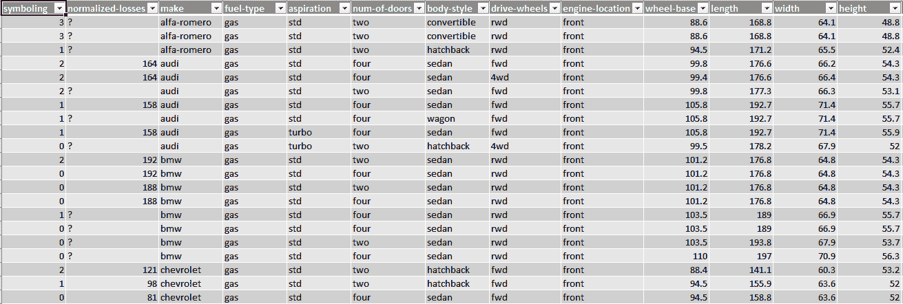
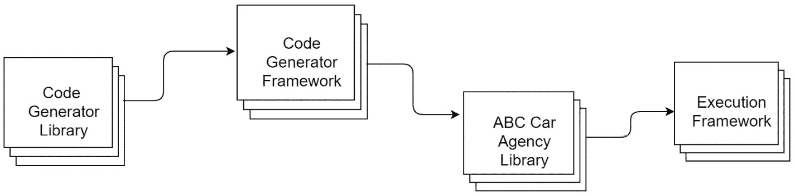
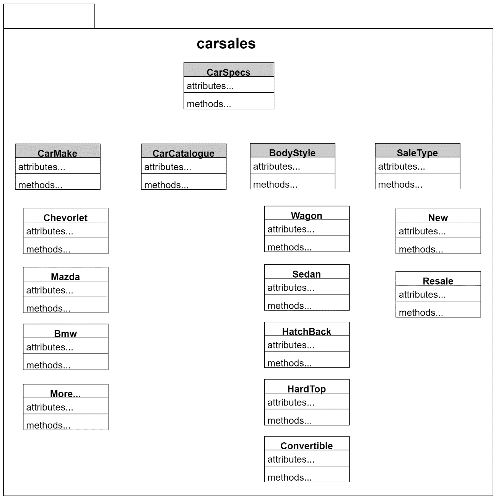
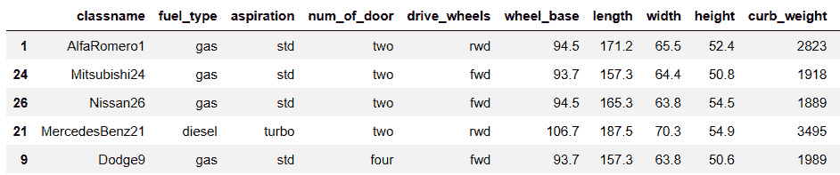
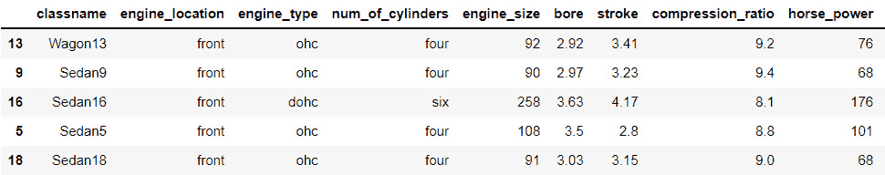

# 第十五章：*第十五章*：实现案例研究

在本章中，我们将通过应用我们迄今为止学到的元编程概念来实现案例研究。对于这个案例研究，我们将使用`Automobile.` `(1987)` `UCI 机器学习` `仓库`数据集。

在本章中，我们将探讨以下主要主题：

+   解释案例研究

+   定义基类

+   开发代码生成库

+   生成代码

+   设计执行框架

到本章结束时，你应该了解如何使用 Python 中 ast 库的现有方法来使你的应用程序生成自己的代码。

# 技术要求

本章中分享的代码示例可在 GitHub 上找到：[`github.com/PacktPublishing/Metaprogramming-with-Python/tree/main/Chapter15`](https://github.com/PacktPublishing/Metaprogramming-with-Python/tree/main/Chapter15)。

# 解释案例研究

在我们开始实现之前，我们将查看案例研究的细节。让我们考虑一个专注于销售多个品牌新旧汽车的汽车代理机构，即*ABC 汽车代理*。这个代理机构希望开发一个应用程序，为每辆汽车生成定制的目录，显示汽车的各项规格和功能。

我们将通过应用本书中学到的概念来查看开发并构建应用程序的细节。需要编目 205 种不同的汽车，构建此案例研究使用的数据来自以下数据集：`Automobile. (1987). UCI Machine Learning Repository`。

有许多方法可以开发一个可以解决这个问题应用程序。我们将探讨如何开发一个可重用的应用程序，该应用程序使用元编程。

汽车数据的整体视图如下：



图 15.1 – The Automobile. (1987). UCI Machine Learning Repository dataset

对于这个案例研究，我们不会使用汽车数据集进行任何详细的数据处理。相反，我们将使用此数据集中的数据来创建应用程序开发的各种组件。本例的设计流程将从开发代码生成库开始，然后创建代码生成框架。然后我们将生成*ABC 汽车代理*库，最后创建执行框架。所有这些过程都将在本节中详细解释。

为此案例研究开发的 Python 脚本如下：



图 15.2 – ABC 汽车代理案例研究的 Python 脚本

将开发以下类来开发汽车销售应用程序：

+   `CarSpecs`

+   `CarMake`及其子类

+   `CarCatalogue`

+   `BodyStyle`及其子类

+   `SaleType`及其子类

这些类中的每一个都将在本节中解释。

本应用程序的类结构将如下所示：



图 15.3 – 汽车销售应用程序概述

理解这一点后，我们将进一步查看应用程序的基类。

# 定义基类

我们现在开始构建案例研究所需的代码。

让我们首先开发一个名为`CarSpecs`的元类。这个类将具有以下结构：

1.  `CarSpecs`类的`__new__`方法将执行以下任务：

    1.  如果输入类的属性是整数，则将属性名添加为大写形式的`feature`，将值以字符串格式添加为`info`，并将`type`设置为数值型。

    1.  如果输入类的属性是字符串，则将属性名添加为大写形式的`feature`，将值以字符串格式添加为`info`，并将`type`设置为 varchar。

    1.  如果输入类的属性是布尔值，则将属性名添加为大写形式的`feature`，将值以字符串格式添加为`info`，并将`type`设置为布尔型。

    1.  如果不是，则实际属性将按原样返回。

现在让我们看看`CarSpecs`的定义：

```py
from abc import ABC, abstractmethod
class CarSpecs(type):
    def __new__(classitself, classname, baseclasses, attributes):  
        newattributes = {}
        for attribute, value in attributes.items():
            if attribute.startswith("__"):
                newattributes[attribute] = value
            elif type(value)==int or type(value)==float:
                newattributes[attribute] = {}
                newattributes[attribute]['feature'] = attribute.title().replace('_', ' ')
                newattributes[attribute]['info'] = str(value)
                newattributes[attribute]['type'] = 'NUMERIC'
            elif type(value)==str:
                newattributes[attribute] = {}
                newattributes[attribute]['feature'] = attribute.title().replace('_', ' ')
                newattributes[attribute]['info'] = value.title()
                newattributes[attribute]['type'] = 'VARCHAR'
            elif type(value)==bool:
                newattributes[attribute] = {}
                newattributes[attribute]['feature'] = attribute.title().replace('_', ' ')
                newattributes[attribute]['info'] = value.title()
                newattributes[attribute]['type'] = 'BOOLEAN'

            else:
                newattributes[attribute] = value                
        return type.__new__(classitself, classname, baseclasses, newattributes)
```

1.  在这个例子中，下一个类将是`CarCatalogue`，它将包含两个抽象方法来定义颜色和打印目录：

    ```py
    class CarCatalogue(metaclass = CarSpecs):
        @abstractmethod
        def define_color(self):
            pass
        @abstractmethod
        def print_catalogue(self):
            pass
    ```

1.  下一个类将是父类或超类，用于捕获汽车规格：

    ```py
    class CarMake(metaclass = CarSpecs):   
        @abstractmethod
        def define_spec(self):
            pass     
    ```

1.  让我们创建另一个名为`BodyStyle`的超类，它将捕获汽车的车身风格和引擎特性：

    ```py
    class BodyStyle(metaclass = CarSpecs):
        @abstractmethod
        def body_style_features(self):
            pass   
    ```

1.  对于这个案例研究，下一个类将是`SaleType`，我们将添加一个抽象方法来计算汽车的价格：

    ```py
    class SaleType(metaclass = CarSpecs):
        @abstractmethod
        def calculate_price(self):
            pass
    ```

1.  本类将作为`SaleType`的子类，用于计算新车的价格：

    ```py
    class New(SaleType, CarCatalogue,  metaclass = CarSpecs):
        def calculate_price(self, classname):
            car = classname()
            price = float(car.price['info'])
            return price
    ```

1.  下一个类将是另一个`SaleType`的子类，用于计算二手车价格：

    ```py
    class Resale(SaleType, CarCatalogue,  metaclass = CarSpecs):
        def calculate_price(self, classname, years):
            car = classname()
            depreciation = years * 0.15
            price = float(car.price['info']) * (1 - depreciation)
            return price
    ```

这些是我们将在下一节中创建模板的主要类，用于生成代码。

# 开发一个代码生成器库

在本节中，让我们看看开发一个代码生成器，它将被用来为所有基类生成代码——`CarSpecs`、`CarMake`、`CarCatalogue`、`BodyStyle`和`SaleType`。详细步骤如下：

1.  让我们创建一个名为`codegenerator.py`的文件，并首先定义一个名为`CodeGenerator`的类：

    ```py
    class CodeGenerator:
    ```

1.  让我们定义一个方法，该方法导入`ast`库，并添加一个`meta_template`属性，其值为`CarSpecs`类的字符串格式。`meta_template`属性进一步解析和反解析为类代码：

    ```py
    def generate_meta(self):
            ast = __import__('ast')
            meta_template = '''
    from abc import ABC, abstractmethod, ABCMeta
    class CarSpecs(type, metaclass = ABCMeta):
        def __new__(classitself, classname, baseclasses, attributes):  
            newattributes = {}
            for attribute, value in attributes.items():
                if attribute.startswith("__"):
                    newattributes[attribute] = value
                elif type(value)==int or type(value)==float:
                    newattributes[attribute] = {}
                    newattributes[attribute]['feature'] = attribute.title().replace('_', ' ')
                    newattributes[attribute]['info'] = str(value)
                    newattributes[attribute]['type'] = 'NUMERIC'
                elif type(value)==str:
                    newattributes[attribute] = {}
                    newattributes[attribute]['feature'] = attribute.title().replace('_', ' ')
                    newattributes[attribute]['info'] = value.title()
                    newattributes[attribute]['type'] = 'VARCHAR'
                elif type(value)==bool:
                    newattributes[attribute] = {}
                    newattributes[attribute]['feature'] = attribute.title().replace('_', ' ')
                    newattributes[attribute]['info'] = value.title()
                    newattributes[attribute]['type'] = 'BOOLEAN'
                else:
                    newattributes[attribute] = value                
            return type.__new__(classitself, classname, baseclasses, newattributes)
    '''
            meta_tree = ast.parse(meta_template)
            print(ast.unparse(meta_tree))
            print('\n')
    ```

1.  现在让我们定义另一个名为`generate_car_catalogue`的方法，并添加`CarCatalogue`类的模板：

    ```py
    def generate_car_catalogue(self):
            ast = __import__('ast')
            catalogue_template = '''
    class CarCatalogue(metaclass = CarSpecs):
        @abstractmethod
        def define_color(self):
            pass

        @abstractmethod
        def print_catalogue(self):
            pass
            '''
            catalogue_tree = ast.parse(catalogue_template)
            print(ast.unparse(catalogue_tree))
            print('\n')
    ```

1.  下一步是定义一个名为`generate_carmake_code`的方法，并添加`CarMake`类的代码模板：

    ```py
    def generate_carmake_code(self):
            ast = __import__('ast')
            carmake_template = '''
    class CarMake(metaclass = CarSpecs):   
        @abstractmethod
        def define_spec(self):
            pass     
            '''
            carmake_tree = ast.parse(carmake_template)
            print(ast.unparse(carmake_tree))
            print('\n')
    ```

1.  在下一个代码块中，我们将定义另一个名为`generate_bodystyle_parent`的方法，并添加`BodyStyle`类的代码模板：

    ```py
    def generate_bodystyle_parent(self):
            ast = __import__('ast')
            bodystyle_parent_template = '''
    class BodyStyle(metaclass = CarSpecs):
        @abstractmethod
        def body_style_features(self):
            pass  
            '''
            bodystyle_parent_tree = ast.parse(bodystyle_parent_template)
            print(ast.unparse(bodystyle_parent_tree))
            print('\n')
    ```

1.  让我们进一步定义 `generate_salestype_code` 方法，该方法生成 `SaleType` 类的类代码：

    ```py
    def generate_salestype_code(self):
            ast = __import__('ast')
            saletype_template = '''
    class SaleType(metaclass = CarSpecs):
        @abstractmethod
        def calculate_price(self):
            pass
            '''
            salestype_tree = ast.parse(saletype_template)
            print(ast.unparse(salestype_tree))
            print('\n')
    ```

1.  在此步骤中，让我们定义 `generate_newsale_code` 方法以生成 `New` 类的代码：

    ```py
    def generate_newsale_code(self):
            ast = __import__('ast')
            newsale_template = '''
    class New(SaleType, CarCatalogue,  metaclass = CarSpecs):
        def calculate_price(self, classname):
            car = classname()
            price = float(car.price['info'])
            return price
            '''
            newsale_tree = ast.parse(newsale_template)
            print(ast.unparse(newsale_tree))
            print('\n')
    ```

1.  让我们进一步定义 `generate_resale_code` 方法，该方法生成 `Resale` 类的代码，并具有计算汽车残值的方法：

    ```py
        def generate_resale_code(self):
            ast = __import__('ast')
            resale_template = '''
    class Resale(SaleType, CarCatalogue,  metaclass = CarSpecs):
        def calculate_price(self, classname, years):
            car = classname()
            depreciation = years * 0.15
            price = float(car.price['info']) * (1 - depreciation)
            return price
            '''
            resale_tree = ast.parse(resale_template)
            print(ast.unparse(resale_tree))
            print('\n')
    ```

1.  在此步骤中，我们将定义一个 `generate_car_code` 方法；它继承自 `CarMake` 类，定义单个汽车品牌的颜色和规格，并打印目录：

    ```py
    def generate_car_code(self, classname, carspecs):
            self.classname = classname
            self.carspecs = carspecs
            ast = __import__('ast')
            car_template = '''
    class '''+self.classname+'''(CarMake, CarCatalogue, metaclass = CarSpecs):
        fuel_type = '''+"'"+self.carspecs['fuel_type']+"'"+'''
        aspiration = '''+"'"+self.carspecs['aspiration']+"'"+'''
        num_of_door = '''+"'"+self.carspecs['num_of_door']+"'"+'''
        drive_wheels = '''+"'"+self.carspecs['drive_wheels']+"'"+'''
        wheel_base = '''+"'"+self.carspecs['wheel_base']+"'"+'''
        length = '''+"'"+self.carspecs['length']+"'"+'''
        width = '''+"'"+self.carspecs['width']+"'"+'''
        height = '''+"'"+self.carspecs['height']+"'"+'''
        curb_weight = '''+"'"+self.carspecs['curb_weight']+"'"+'''
        fuel_system = '''+"'"+self.carspecs['fuel_system']+"'"+'''
        city_mpg = '''+"'"+self.carspecs['city_mpg']+"'"+'''
        highway_mpg = '''+"'"+self.carspecs['highway_mpg']+"'"+'''
        price = '''+"'"+self.carspecs['price']+"'"+'''
        def define_color(self):
                BOLD = '\33[5m'
                BLUE = '\033[94m'
                return BOLD + BLUE
        def define_spec(self):
                specs = [self.fuel_type, self.aspiration, self.num_of_door, self.drive_wheels, 
                         self.wheel_base, self.length, self.width, self.height, self.curb_weight,
                        self.fuel_system, self.city_mpg, self.highway_mpg]
                return specs
        def print_catalogue(self):
                for i in self.define_spec():
                    print(self.define_color() + i['feature'], ": ", self.define_color() + i['info'])   
                    '''
            car_tree = ast.parse(car_template)
            print(ast.unparse(car_tree))
            print('\n')
    ```

1.  此代码生成器的最后一个方法是 `generate_bodystyle_code`，它为不同的车身风格生成类代码，例如轿车和掀背车，定义单个车身风格的颜色和特性，并打印目录：

    ```py
    def generate_bodystyle_code(self, classname, carfeatures):
            self.classname = classname
            self.carfeatures = carfeatures
            ast = __import__('ast')
            bodystyle_template = '''
    class '''+self.classname+'''(BodyStyle, CarCatalogue,  metaclass = CarSpecs):
        engine_location = '''+"'"+self.carfeatures['engine_location']+"'"+'''
        engine_type = '''+"'"+self.carfeatures['engine_type']+"'"+'''
        num_of_cylinders = '''+"'"+self.carfeatures['num_of_cylinders']+"'"+''' 
        engine_size = '''+"'"+self.carfeatures['engine_size']+"'"+'''
        bore = '''+"'"+self.carfeatures['bore']+"'"+'''
        stroke = '''+"'"+self.carfeatures['stroke']+"'"+'''
        compression_ratio = '''+"'"+self.carfeatures['compression_ratio']+"'"+'''
        horse_power = '''+"'"+self.carfeatures['horse_power']+"'"+'''
        peak_rpm = '''+"'"+self.carfeatures['peak_rpm']+"'"+'''
        def body_style_features(self):
                features = [self.engine_location, self.engine_type, self.num_of_cylinders, self.engine_size,
                         self.bore, self.stroke, self.compression_ratio, self.horse_power, self.peak_rpm]
                return features  
        def define_color(self):
                BOLD = '\33[5m'
                RED = '\033[31m'
                return BOLD + RED
        def print_catalogue(self):
                for i in self.body_style_features():
                    print(self.define_color() + i['feature'], ": ", self.define_color() + i['info'])  
                    '''
            bodystyle_tree = ast.parse(bodystyle_template)
            print(ast.unparse(bodystyle_tree))
            print('\n')
    ```

使用这些方法，我们已经准备好生成 ABC 汽车代理目录所需的代码。

现在，让我们进一步开发一个代码生成框架，该框架可以生成我们应用程序所需的数百个类。

# 生成代码

在本节中，我们将利用 `codegenerator.py` 生成基础类及其相应的子类，这些类为 ABC 汽车代理维护并打印各种目录，如下所示：

1.  首先，让我们使用汽车数据来生成此应用程序所需的基础类。对于基础数据准备，让我们导入 `pandas` 库，它有助于处理数据：

    ```py
    import pandas as pd
    ```

1.  让我们加载数据并创建其副本。对于此应用程序，我们需要一组独特的汽车品牌和另一组独特的车身风格：

    ```py
    auto = pd.read_csv("automobile.csv")
    auto_truncated = auto.copy(deep=True)
    auto_truncated.drop_duplicates(subset = ['make','body-style'], inplace = True)
    auto_truncated.reset_index(inplace = True, drop = True)
    auto_truncated['make'] = auto_truncated['make'].apply(lambda x: x.title().replace('-',''))
    auto_truncated.reset_index(inplace = True)
    auto_truncated['index'] = auto_truncated['index'].astype('str')
    auto_truncated['make'] = auto_truncated['make'] + auto_truncated['index']
    auto_truncated['body-style'] = auto_truncated['body-style'].apply(lambda x: x.title().replace('-',''))
    auto_truncated['body-style'] = auto_truncated['body-style'] + auto_truncated['index']
    ```

一旦处理了基本数据，让我们创建两个 DataFrames，它们将用于通过代码生成器生成多个类：

```py
auto_specs = auto_truncated[['make', 'fuel-type', 'aspiration', 'num-of-doors', 'drive-wheels', 'wheel-base',  'length', 'width', 'height', 'curb-weight', 'fuel-system', 'city-mpg',  'highway-mpg', 'price']].copy(deep = True)
auto_specs.columns = ['classname', 'fuel_type', 'aspiration', 'num_of_door', 'drive_wheels',                      'wheel_base', 'length', 'width', 'height', 'curb_weight', 'fuel_system', 'city_mpg', 'highway_mpg', 'price' ]
for col in auto_specs.columns:
    auto_specs[col] = auto_specs[col].astype('str')
auto_features = auto_truncated[['body-style', 'engine-location', 'engine-type', 'num-of-cylinders', 'engine-size', 'bore', 'stroke', 'compression-ratio', 'horsepower', 'peak-rpm']].copy(deep = True)
auto_features.columns = ['classname', 'engine_location', 'engine_type', 'num_of_cylinders', 'engine_size', 'bore', 'stroke', 'compression_ratio', 'horse_power', 'peak_rpm']
for col in auto_features.columns:
    auto_features[col] = auto_features[col].astype('str')
```

1.  在将数据处理成我们需要提供给代码生成器的格式后，规格的样本数据如下所示：



图 15.4 – 样本规格

1.  特性的样本数据如下所示：



图 15.5 – 样本特性

1.  现在基础数据已准备好用于生成代码，我们可以开始导入代码生成器：

    ```py
    from codegenerator import CodeGenerator
    codegen = CodeGenerator()
    ```

1.  在此步骤中，现在让我们定义一个函数，通过调用代码生成每个基础类，然后生成 `CarMake` 和 `BodyStyle` 的多个子类来生成库：

    ```py
    def generatelib():
        codegen.generate_meta()
        codegen.generate_car_catalogue()
        codegen.generate_carmake_code()
        codegen.generate_bodystyle_parent()
        codegen.generate_salestype_code()
        codegen.generate_newsale_code()
        codegen.generate_resale_code()
        for index, row in auto_specs.iterrows():
            carspecs = dict(row)
            classname = carspecs['classname']
            del carspecs['classname']
            codegen.generate_car_code(classname = classname, carspecs = carspecs)
        for index, row in auto_features.iterrows():
            carfeatures = dict(row)
            classname = carfeatures['classname']
            del carfeatures['classname']
            codegen.generate_bodystyle_code(classname = classname, carfeatures = carfeatures)
    ```

1.  打开一个名为 `abccaragencylib.py` 的 Python 文件，并调用 `generatelib` 函数来编写为所有所需类生成的代码：

    ```py
    from contextlib import redirect_stdout
    with open('abccaragencylib.py', 'w') as code:
        with redirect_stdout(code):
            generatelib()
    code.close()
    ```

1.  以下截图展示了一个示例类自动生成并写入 `abccaragencylib.py`：


图 15.6 – 一个自动生成的汽车品牌类代码

我们尚未自动生成此示例所需的代码。现在，我们将探讨设计执行框架。

# 设计执行框架

在本节中，让我们看看设计 ABC 汽车代理应用程序的最后一步，我们将实际运行在此案例研究过程中生成的代码：

1.  让我们先加载自动生成的库：

    ```py
    import abccaragencylib as carsales
    ```

1.  在这个阶段，我们将通过实现外观设计模式来遵循一系列步骤，以便我们可以打印不同类型汽车的规格和功能：

    ```py
    class Queue:
        def __init__(self, makeclass, styleclass, age):
            self.makeclass = makeclass
            self.styleclass = styleclass
            self.make = self.makeclass()
            self.style = self.styleclass()
            self.new = carsales.New()
            self.resale = carsales.Resale()
            self.age = age
        def pipeline(self):
            print('*********ABC Car Agency - Catalogue***********')
            self.make.print_catalogue()
            print('\n')
            self.style.print_catalogue()
            print('\n')
            print('New Car Price : ' + str(self.new.calculate_price(self.makeclass)))
            print('Resale Price : ' + str(self.resale.calculate_price(self.makeclass, self.age)))
    ```

1.  让我们定义一个运行外观模式的方法：

    ```py
    def run_facade(makeclass, styleclass, age):
        queue = Queue(makeclass, styleclass, age)
        queue.pipeline()
    ```

1.  在这一步，我们将运行一个汽车品牌与车身风格的组合来生成目录：

    ```py
    run_facade(carsales.AlfaRomero1, carsales.Hatchback28, 3)
    ```

输出结果如下：

```py
*********ABC Car Agency - Catalogue***********
Fuel Type :  Gas
Aspiration :  Std
Num Of Door :  Two
Drive Wheels :  Rwd
Wheel Base :  94.5
Length :  171.2
Width :  65.5
Height :  52.4
Curb Weight :  2823
Fuel System :  Mpfi
City Mpg :  19
Highway Mpg :  26
Engine Location :  Front
Engine Type :  Ohc
Num Of Cylinders :  Four
Engine Size :  97
Bore :  3.15
Stroke :  3.29
Compression Ratio :  9.4
Horse Power :  69
Peak Rpm :  5200
New Car Price : 16500.0
Resale Price : 9075.0
```

为`CarMake`生成了 56 个独特的子类，为`BodyStyle`也生成了 56 个独特的子类。我们可以使用`CarMake`和`BodyStyle`的各种组合来打印此应用程序的目录。

1.  让我们尝试另一种组合：

    ```py
    run_facade(carsales.Mitsubishi24, carsales.Sedan16, 5)
    ```

生成的输出如下：

```py
*********ABC Car Agency - Catalogue***********
Fuel Type :  Gas
Aspiration :  Std
Num Of Door :  Two
Drive Wheels :  Fwd
Wheel Base :  93.7
Length :  157.3
Width :  64.4
Height :  50.8
Curb Weight :  1918
Fuel System :  2Bbl
City Mpg :  37
Highway Mpg :  41
Engine Location :  Front
Engine Type :  Dohc
Num Of Cylinders :  Six
Engine Size :  258
Bore :  3.63
Stroke :  4.17
Compression Ratio :  8.1
Horse Power :  176
Peak Rpm :  4750
New Car Price : 5389.0
Resale Price : 1347.25
```

这是通过在 Python 中应用元编程方法开发应用程序的逐步过程。

# 摘要

在本章中，我们学习了如何通过应用各种元编程技术来开发应用程序。我们首先解释了案例研究，并定义了此案例研究所需的基类。

我们还学习了如何开发代码生成器以及如何使用它生成代码。我们还设计了一个框架，可用于执行或测试在此案例研究中为应用程序生成的代码。

在下一章中，我们将探讨在设计 Python 和元编程的应用程序时可以遵循的一些最佳实践。
