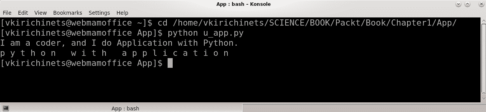
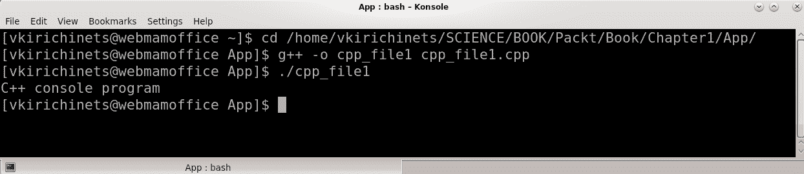
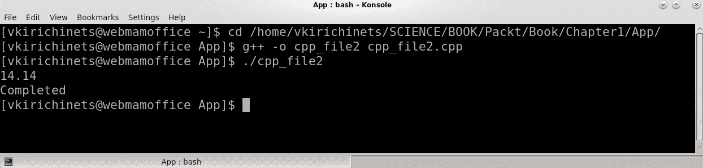
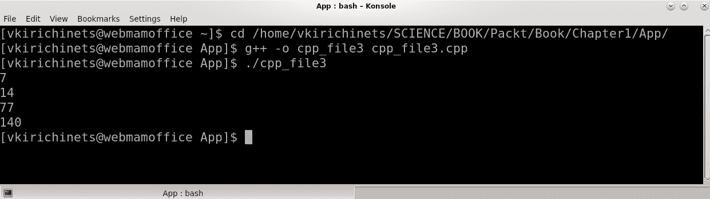
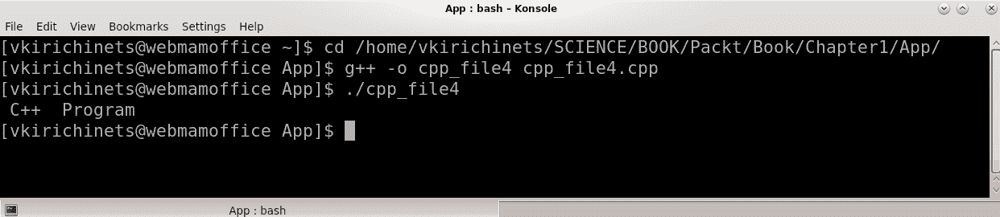
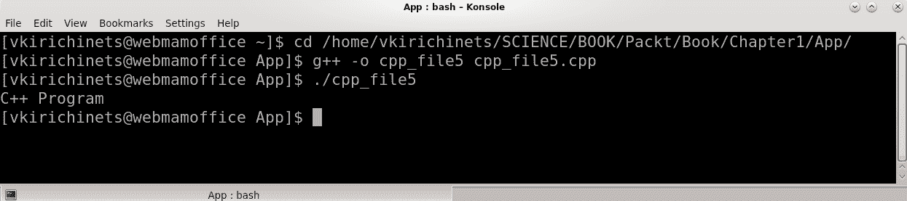
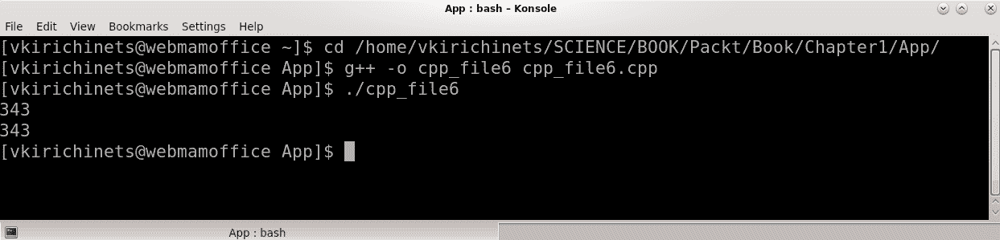

# 第一章：Python 和 Qt 简介

要了解使用 Python 和 Qt 创建图形用户界面（GUI）的过程，我们需要了解语言和框架的基本语法和结构。本章将涵盖 Python 编程语言的基础知识——用于 GUI 创建的最常见方法和操作，以及 Qt 库使用的 C++ 基本语法。此外，还将介绍 Qt 框架。如果没有对此进行解释，开发者在开发过程的早期阶段可能会遇到一些问题。

本章将涵盖以下主题：

+   Python 的基础知识

+   Qt 的基础知识

+   C++ 的基础知识

+   Qt 框架简介

+   比较

# Python 的基础知识

Python 是一种作为高级解释器实现的编程语言。它易于学习，具有高效的高级数据结构，简单且面向对象编程的方法高效。它具有优雅的语法，动态类型和解释性，如官方源所述。它是脚本和快速应用开发的最佳语言。我们可以通过使用在 C 或 C++（或可以从 C 调用的其他语言）中实现的新函数和数据类型轻松扩展 Python 解释器。考虑到这一点，使用 Qt 库和 Python 创建 GUI 是一个好的选择。要开始使用 Python，您需要从官方源（如果尚未安装）下载 Python 解释器，并按照说明进行安装。

然后，为了安装 PyQt 和 PySide，您需要在 Linux/Unix 终端或 Windows 命令行中运行以下命令：

```py
> pip install PyQt5
```

您可以通过遵循说明从 Qt 官方源下载并安装 PySide2 绑定，或者您可以通过 `pip` 从 **PyPI**（Python 包索引）安装它：

```py
> pip install PySide2
```

在本书中，当您需要从终端/命令提示符运行命令时，将使用 `>`。

使用 Python 和 Qt 创建 GUI 的一个好方法是使用 Anaconda 工具包，这是最佳的基于 Python 的编程生态系统。强烈推荐安装 Anaconda。当您安装 Python 时，您会得到 IDLE，这是一个简单的编辑器。Anaconda 默认包含 Spyder 编辑器，它优于 IDLE。

要运行 IDLE 编辑器，只需在您的终端/命令提示符中键入以下命令：

```py
> idle
```

使用以下命令打开 Anaconda 的 Spyder 编辑器：

```py
> spyder
```

安装 Anaconda 后，您也可以在操作系统的开始菜单中找到它。

# Python 语法

让我们对 Python 进行简要介绍。在这里，您将找到本书中将使用到的最有用和最流行的定义和操作。有关 Python 编程语言的完整信息，您需要查看官方文档([`docs.python.org/3/`](https://docs.python.org/3/))。让我们将注意力集中在 Python 开发过程中最常见的事物上。首先，打开终端/命令提示符并输入以下内容：

```py
> python
```

或者，在命令提示符/终端中输入`idle`。这两个命令都会运行 Python 解释器：

```py
> idle
```

# 变量和值

任何编程语言的基础，不仅仅是 Python，也许不仅仅是编程，都是变量和值的定义和规则。变量和值是描述世界中的对象及其之间关系的元素。变量和值的概念通常以如下形式使用——某些值根据所使用的运算符与变量有关。以下是一个示例：

```py
>>> name = "Name"
>>> number = 1
```

在这里，`name`和`number`是变量。同样，`"Name"`和`1`是这些变量的值。在 Python 编程语言中，变量有定义规则。它们必须在使用前定义，并且不能是数字。

以下定义是不正确的：

```py
>>> 1 = 1
```

此外，变量不能以数字开头。以下定义是不正确的：

```py
>>> 1name = "Name"
```

变量名不能包含空格。也不建议使用标准 Python 库中内置函数的名称或 Python 模块中导入和定义的名称作为变量名。

以下定义是不正确的：

```py
>>> str = 1
```

此外，还应避免使用导入模块、函数和类的其他名称，因为使用它们可能会导致意外结果。您不能使用 Python 关键字名称。

以下定义是不正确的：

```py
>>> True = 1
```

Python 文档中提供了完整的关键字、内置函数和常量列表。值必须是 Python 数据类型，如下所示：

+   **字符串**：`str(1)`，`"string"`，`'string'`，和`"""documented_string"""`

+   **布尔值**：`True`或`False`

+   **数字**：`int(1.1)`，`float(1)`，`complex(1)`和`1`

+   **二进制** **数据**：`bytes("string", encoding='utf-8')`不可变和`bytearray("string", encoding='utf-8')`可变

+   **元组**：`(1, "string")`和`tuple("string")`

+   **列表**：`[1, "string"]`和`list("string")`

+   **字典**：`{"key1": 1, "key2": "value"}`和`dict(key1=1, key2="value")`

+   **唯一元素**的**集合**：`set("string")`和`frozenset("string")`不可变集合

+   **函数**：`def func():pass`

+   **类**：`class C:pass`

+   **模块**：具有`file_name.py`等扩展名的文件

+   **NoneType** **对象**：**`None`**

# 字符串

当它们被创建时，字符串需要使用引号，`'some text'`，双引号`"some text"`，或文档字符串`"""some text"""`。Python 中的字符串被解释为字符序列，可以用于以下操作：

切片——结果是字符串，从`0`开始到第 2 个字符。第一个字符是`0`：

```py
>>> strings = "string"
>>> strings[0:3] 
'str'
```

反向切片——结果是字符串，从字符串中指定的字符索引开始到 0 字符：

```py
>>> strings[2::-1]
'rts'
```

连接——结果是合并后的字符串：

```py
>>> strings = "string" + "string" 
>>> strings
'stringstring'
```

乘法——`"string"`的结果与第二个值相乘：

```py
>>> strings = "string" * 3
'stringstringstring'
```

分割——结果是按分隔符（如空格或逗号）分割的列表：

```py
>>> strings = "string_some_sep_string".split("_some_sep_")
>>> strings
['string', 'string']
```

替换——结果是包含新字符的字符串：

```py
>>> strings = "string".replace("str", "programm") 
>>> strings
'programming'
```

最有用的字符串方法如下：

将整数转换为字符串，结果是字符串：

```py
>>> strings = str(1)
>>> strings
'1'
```

字符串长度——结果是整数：

```py
>>> len("some strings")
12
```

使用 UTF 进行编码——结果是编码后的二进制对象：

```py
>>> "some strings".encode('utf-8') 
b'some strings'
```

使用 UTF 进行解码——结果是解码后的字符串：

```py
>>> b'\xd0\xa1\xd1\x82\xd1\x80\xd0\xbe\xd0\xba\xd0\xb0'.decode('utf-8')
'Строка'
```

非常常见的是，我们必须处理字符串并解决应用中需要理解不同文本操作的不同编码问题。这只是字符串的简要描述；建议您在 Python 文档中详细了解字符串。

# 布尔值

Python 提供了逻辑常量，如`True`和`False`。

这里是定义值为`True`的`var`变量的示例，当我们调用`var`变量时，结果是布尔值，即`True`：

```py
>>> var = True
>>> var
True
```

定义值为`False`的`var`变量：

```py
>>> var = False
>>> var
False
```

使用标准库中的`bool`函数：

```py
>>> bool(1)
True
>>> bool(0)
False
```

最终的逻辑运算返回`True`，如果变量存在或其值等于`1`。如果它不存在或等于`0`，则返回`False`。

# 数字

Python 解释器可以用作简单的计算器，并提供一些用于处理数字的有用工具：

```py
>>> 1 + 1
2
```

这段代码定义了值为`2`的`num`变量：

```py
>>> num = 2
>>> num
2
```

当我们使用除法运算符（`/`）进行数字操作时，Python 2.x 的结果是整数，而 Python 3.x 的结果是浮点数：

```py
>>> num ** num * num / num + num - num
4.0
```

当我们使用地板除法运算符（`//`）进行数字操作时，Python 2.x 的结果是整数，Python 3.x 的结果也是整数：

```py
>>> num ** num * num // num + num - num
4
```

在这里，以及在整个书中，我们将通过示例尝试阐明 Python 主要版本之间的差异。正如我们所见，Python 2.x 使用经典除法返回`int()`值，而 Python 3.x 返回`float()`值。使用地板除法，所有版本都返回`int()`值。

以下操作的结果是整数（除法的余数）：

```py
>>> 17 % num
1
```

这里有一些数字操作示例：

将字符串值转换为整数时，结果是整数：

```py
>>> int('2')
2
```

`int`到`float`——结果是`float`：

```py
>>> float(2)
2.0
```

复数——结果是包含实数和虚部的数：

```py
>>> complex(2, 2)
(2+2j)
```

# 二进制

要开始处理图像、视频、照片和其他图形对象，我们需要了解这些数据是二进制的，而最有用的工具是`bytes()`和`bytearray()`：

将字符串转换为二进制对象；结果是二进制对象：

```py
>>> bytes("111", encoding='utf-8')
b'1'
```

将字符串转换为 bytearray；结果是 bytearray：

```py
>>> b = bytearray("111", encoding='utf-8')
>>> b
bytearray(b'111')
```

改变二进制数组（此操作仅在`bytearray()`中可用）：

```py
>>> b[0] = 0 >>> b bytearray(b'\x0011')
```

# 元组

元组是 Python 中不可变的元素序列。元素可以是字符串、数字或其他 Python 数据类型。

创建并调用以下元组：

```py
>>> tu = (1, (2,), "3")
>>> tu
(1, (2,), '3')
```

元组是由逗号分隔的元素序列，因此，以`("string")`的形式定义元组是不正确的。如果元组只有一个元素，则需要逗号，例如，`("string",)`。

元组切片——元组的所有元素 `tu[0:]`，最后一个元素，索引为 `[2]` 的元素：

```py
>>> tu[0:]; tu[-1:]; tu[2]
(1, (2,), '3')
('3',)
'3'
```

这将返回元组中存在的指定元素的数量：

```py
>>> tu.count("3")
1
```

这将返回元组中指定元素首次出现的索引：

```py
>>> tu.index("3")
2
```

# 列表

数据处理中最有用的工具是列表。让我们看看涉及列表的一些方法和操作：

定义一个列表。结果是列表：

```py
>>> li = [1, [2], "3"]
>>> li
[1, [2], '3']
```

这将返回列表的所有元素。结果是列表：

```py
>>> li[0:]
[1, [2], '3']
```

这将返回列表的第一个元素：

```py
>>> li[0]
1
```

这将返回列表的最后一个元素：

```py
>>> li[-1]
'3'
```

这将返回包含最后一个对象的列表：

```py
>>> li[-1:]
['3']
```

这将返回列表第二个元素的第一个字符。该元素必须按顺序排列：

```py
>>> li[1][0]
2
```

这是错误的。整数对象是不可索引的：

```py
>>> li[0][0]
TypeError: 'int' object is not subscriptable
```

以下是一个列表的列表：

```py
>>> li = [[1], [2, ["3"]]]
>>> li[0]; li[1]; li[1][0]
[1]
[2, ['3']]
2
```

定义一个名为 `var` 的列表，然后在这个列表内部定义一个新的列表：

```py
>>> var = [1, 2, 3]
>>> li = [[1], [2, ['3', var]]]
>>> li
[[1], [2, ['3', [1, 2, 3]]]]
```

以下代码片段展示了如何更改列表的第一个和第二个元素：

```py
>>> li[0] = 1; li[1] = 2
>>> li
[1, 2]
```

列表可以按以下方式连接：

```py
>>> li + li
[1, 2, 1, 2]
```

这是列表乘法。列表必须乘以一个数字（整数）值：

```py
>>> li * 3
[1, 2, 1, 2, 1, 2]
```

列表中最常用的操作如下：

这是在列表末尾添加新项的方式：

```py
>>> li.append(3)
>>> li
[1, 2, 3]
```

这是在列表的`0`位置插入新项的方式：

```py
>>> li.insert(0, 0)
>>> li
[[0, 1, 2, 3]]
```

要检查一个项目是否在列表中，可以使用`in`运算符：

```py
>>> 0 in li
True
```

这将找到具有指定值的元素索引并返回第一个元素的索引：

```py
>>> li.index(1)
1
```

这将移除指定索引的元素：

```py
>>> li.pop(3)
>>> li
[0, 1, 2]
```

这将移除具有指定值的元素：

```py
>>> li.remove(0)
>>> li
[1, 2]
```

Python 提供了比其他列表创建机制（如`for`循环）更快的列表生成器。

列表可以按以下方式生成：

```py
>>> li = [i for i in range(0, 10)]
[0, 1, 2, 3, 4, 5, 6, 7, 8, 9]
>>> li = [str(i) for i in li]
['0', '1', '2', '3', '4', '5', '6', '7', '8', '9']
```

使用指定的分隔符将列表连接到字符串上。列表项必须是字符串：

```py
>>> " ".join(li); "-".join(li);
'0 1 2 3 4 5 6 7 8 9'
'0-1-2-3-4-5-6-7-8-9'
```

# 词典

在 Python 中创建数据的另一种方法是使用字典。实际上，字典不是一个序列；它是一个数据映射，因此，适用于元组和列表的操作不适用于字典。常用的字典方法和操作如下。

创建词典：

```py
>>> di = {"key1": "value1", "key2": {2: 2}, 3: 3}
>>> di
{'key1': 'value1', 'key2': {2: 2}, 3: 3}
```

字典表示存在一个键和一个值，并且每个键/值对在字典中需要用逗号分隔，例如，{key: value, key: value, ...}。

这通过键获取字典值。结果是字典的值：

```py
>>> di["key1"]
'value1'
```

与字典最相关的操作如下。

这通过键获取字典值，我们只获取存在键的值：

```py
>>> di.get("key1"); di.get("key")
'value1'
```

这获取字典的所有键。结果是具有键的 `dict_keys` 对象：

```py
>>> di.keys()
dict_keys(['key1', 'key2', 3])
```

这获取字典的所有值，结果是具有值的 `dict_values` 对象：

```py
>>> di.values()
dict_values(['value1', {2: 2}, 3])
```

这将以元组形式获取字典的所有键和值，结果是 `dict_items`：

```py
>>> di.items()
dict_items([('key1', 'value1'), ('key2', {2: 2}), (3, 3)])
```

这在字典中添加了一个新条目：

```py
>>> di.update("key3"=di.values)
{'key1': 'value1', 'key2': {2: 2}, 3: 3, 'key3': <built-in method values of dict object>}
```

这删除了具有指定键的字典值。结果是已删除的值：

```py
>>> di.pop("key1", "key is not exist")
'value1'
```

如果键不存在，则返回第二个值：

```py
>>> di.pop("key", "key is not exist")
'key is not exist'
```

这清除了字典。结果是空字典：

```py
>>> di.clear()
>>> di
{}
```

# 集合

此外，在某些情况下，我们还可以使用集合。集合是一组唯一的元素（或组），可以用于数据创建。Python 中的集合可以按以下方式创建。

这将从列表的元素中创建一个集合：

```py
>>> set([1, 2, 2, 3])
{1, 2, 3}
```

集合是可变的。

创建一个名为 `se` 的集合，并通过添加新元素来更改集合：

```py
>>> se = set((1, 2, 2, 3))
>>> se.add(4)
{1, 2, 3, 4}
```

要创建一个不可变集合，我们需要使用 Python 标准库中的 `frozenset()`。

# 函数

我们可以将函数视为复变数及其相关操作的结果。Python 中的函数可以接收参数，返回结果，以及/或使用变量和值执行一些操作。要在 Python 中构建函数，请使用以下函数定义方法。

定义函数——`param` 是函数的参数，被设置为 `None`：

```py
>>> def func(param=None):
 param += 1
 return param
>>> func(param=1)
2
```

前面的代码增加参数并返回，然后使用参数调用函数。

# 类

现代应用程序创建风格遵循 **面向对象编程**（**OOP**）方法，因此使用和理解类是强制性的。使用 Python 创建类的最简单方法是以下：

```py
>>> class C():
 def __init__(self):
 self.var1 = 2
 self.func1()
 def func1(self):
 self.var2 = self.var1 * 2
 def func2(self):
 print(self.var2)
 # print var2
```

`__init__()` 方法是类的构造函数，`self.var` 是类的属性，`self.func()` 调用函数，`def func1(self)` 和 `def func2(self)` 是类的方法。第一个 `print()` 函数用于 Python 3.x，第二个注释的 `print` 函数用于 Python 2.x。

这创建了一个类的实例，并调用了类的 `func2()`：

```py
>>> c = C() 
>>> c.func2()
4
```

如我们所见，类允许我们构建具有广泛功能的代码。通过使用 `self` 参数，我们可以在类的任何地方使用我们的变量，利用 Python 的动态特性。此外，类提供了基本方法，如继承，这使得类成为 OOP 的基础，我们将在后面讨论。

现在，让我们从命令提示符/终端输入中跳出来，尝试创建一个标准的 Python 模块，以展示标准语法。

要创建一个 Python 模块，请按照以下步骤操作：

1.  打开您的设备。

1.  打开您喜欢的编辑器，例如记事本、PyCharm、Eclipse 或 Emacs。Anaconda 预装了一个名为 Spyder 的 Python 编辑器，我们在 *Python 基础* 部分提到了它。

1.  创建一个名为 `App/` 的新目录。

1.  创建一个新文件，例如我们的 GUI 应用程序的将来名称为 `u_app.py`。

1.  将注意力转向此文件。

Python 模块是一个包含 Python 定义和指令的文件，具有`.py`扩展名。还有其他扩展名，如`.pyc`、`.pyw`和`.pyd`，这些将在本书的后续部分进行解释。Python 中简单文件和模块之间的一个区别是，模块具有将定义从模块导入到另一个模块的能力。为了演示这一点，让我们在`App/`目录中创建另一个新文件，命名为`u_tools.py`。

根据普遍接受的 Python 编码规则，这些规则在**Python 增强提案**（**PEP8**）Python 语言风格指南中描述，模块应该有简短的小写名称，例如`u_app.py`。类应该使用大驼峰命名法，例如`UTool()`。对于函数，首选小写，例如`def func():;`。

因此，现在文件已经创建，请在`u_app.py`文件中包含以下行：

1.  在导入部分，从`u_tools.py`文件中导入`UTools`类：

```py
# -*- coding: utf-8 -*-
from u_tools import UTools
...
```

1.  创建继承自`UTools`的`UApp`类**：**

```py
...
class UApp(UTools):

    def __init__(self):
        UTools.__init__(self)
        self.uaps1 = "I am a coder, and I do"
```

在`__init__()`构造函数中，调用`UTools`类构造函数并将属性作为字符串变量。

1.  将`u_app1()`函数添加到`UApp`类中：

```py
    ...
    def u_app1(self): 
        print(self.uaps1 + " " + self.us1)
        # print self.uaps1 + " " + self.us1
```

此函数将`UApp`和`UTools`类的字符串连接起来并打印结果。在 Python 2.x 中使用的注释`print`函数，如果取消注释并注释上一行，则可以使用`print()`函数。

1.  将`u_app2()`函数添加到`UApp`类中：

```py
    ...
    def u_app2(self):
        uap_list1 = []
        i = 0
        for ul in self.u_list()
            if ul.isalnum():
                if ul != ".":
                    uap_list1.insert(i, ul.lower())
            elif ul == " ":
                uap_list1.insert(i-i, ul)
                i = 0
                continue
            else:
                break
            i += 1
        print(' '.join(uap_list1))
        # print ' '.join(uap_list1)
```

此函数创建一个新的列表；`for`语句是`UTools`类列表的循环，并检查它是否是数字或字母。如果不等于`"."`，则将所有字母设置为小写。然后将列表连接到字符串并打印。

1.  完成以下`u_tools.py`文件：

```py
if __name__ == "__main__":
    uap = UApp()
    uap.u_app1()
    uap.u_app2()
```

此指令用于定义代码在此文件中的运行方式。如果此模块被导入，`__name__`将不是`"__main__"`，我们可以在其他地方使用此模块的某些部分。如果此模块作为文件运行（从终端，作为子进程），`__name__`将是`"__main__"`，并且将通过调用第一个和第二个函数创建类实例。因此，现在我们需要将`UTools`类添加到`u_tools.py`文件中。

1.  将以下代码添加到`u_tools.py`文件中：

```py
# -*- coding: utf-8 -*-

class UTools():

    def __init__(self):
        self.us1 = "Application with Python."

    def u_list(self):
        self.ul1 = []
        for s in self.us1:
            self.ul1.append(s)
        return self.ul1

if __name__ == "__main__":
    ut = UTools()
    print(ut.us1)
    # print ut.us1
    ut.u_list()
```

在此模块中，`UTools`类已在`__init__()`方法中使用字符串变量创建。`u_list()`函数将字符串转换为列表。代码符合 PEP8 风格。

现在，让我们看看一些 Python 语法。建议在类的定义之前和类内的函数之前各添加两个空行。此外，如果你没有使用类，建议在函数定义之间也添加两个空行。Python 解释器将脚本作为一个块来执行。代码块从比上一行少四个空格的位置开始。当下一块的空格比前一个块小四个空格时，解释器可以决定这是块的结束。正如你所见，`#`在行上标记了一个注释，注释文本被解释器忽略。类、函数和语句的定义使用`:`实现。行尾用`;`标记，一行上执行多个命令是可能的，但不推荐。为了便于理解，最好将脚本的每一行都写在新的一行上。因此，我们可以读取这两个文件并尝试启动它们。为此，我们需要打开终端/命令提示符并输入以下命令：

```py
> cd Path/To/The/New/Created/Dir/App
> python u_app.py
```

上述命令的输出显示在下图中：



如果你看到类似的结果，那么一切就都正确了。那么 Python 在运行这个文件时做了什么呢？

# Python 解释器

**全局解释器锁**（**GIL**）是解释器用来确保一次只有一个线程执行 Python 字节码的一种机制。将解释器锁定到一个实时线程有助于解释器成为多线程的，以支持多处理器机器的并行性。当执行 I/O 操作时，GIL 总是被释放。Python 解释器是一个程序，它将其他包含指令的程序翻译并启动。

它有时被称为**Python 虚拟机**（**PVM**），类似于**Java 虚拟机**（**JVM**），它提供了将代码翻译成字节码并执行下一步的进程，与像 C++这样的语言不同，这些语言将代码翻译成直接在硬件上运行的指令。理解像 Python 和 Java 这样的语言非常重要，它们构成了编程技术进步的一大步。

让我们看看 Python 解释器是如何运行代码行的。首先，它从上到下逐行执行代码。Python 3.x 将位于文件所在位置的`_pycache_`目录中的导入模块编译，并将`.pyc`扩展名添加到编译文件中。然后，PVM 将指令翻译成字节码并执行它们。

# Qt 框架

Qt 是一个跨平台的应用程序框架和窗口工具包，用于创建在所有主要桌面、移动和嵌入式平台上运行的 GUI 应用程序。大多数使用 Qt 开发的 GUI 程序都具有本地外观的界面。在这种情况下，Qt 被归类为窗口工具包。要使用 Qt 作为开发框架，您需要从官方源（[`www.qt.io/`](https://www.qt.io/））下载 Qt，然后将其安装到您的设备上。Qt 支持 GCC C++ 编译器和 Visual Studio 套件等编译器。Qt 提供了 Qt Creator、Qt Designer、Qt Assistant 和 Qt Linguist 等强大的 IDE 和工具。要使用 Qt 创建 GUI，只需打开 Qt Creator，欢迎您创建图形应用程序！然而，本书不会描述如何使用 Qt Creator 或 Qt Designer 等 IDE 创建 GUI。本书主要关注使用 Qt 和 Python 创建 GUI。但如果您想从 Qt Creator 开始，那么欢迎您继续前进。因为 Qt 主要是 C++ 库，我们首先需要了解 C++ 的基本方法和语法。

# C++

如您从名称中可能猜到的，C++ 是一种基于 C 的语言，并且具有类似的语法。我们可以假设 Python 也与 C 有关，但不要混淆这些语言。如果 C++ 是可调用的 C 语言并且具有类似的语法，那么我们可以将 Python 解释器称为我们之前讨论过的基于 C 的、低级虚拟机。Python 语法和 C 语法并不相同。

为了演示这一点，我们需要在为应用程序开发创建的 `App/` 目录中创建一个名为 `cpp_file1.cpp` 的文件，并向文件中添加以下行：

```py
#include <iostream>
int main() {
    std::cout << "C++ console program\n";
}
```

带有 # 的行是读取和解释的指令，称为预处理器。然后，是 C++ 中函数的声明，`main()`。花括号 `{}` 内的内容是一个函数体。要获取此代码的结果，您需要安装一个 C++ 编译器。如 DEV-C++、Code::blocks 和 Visual Studio Express 等 IDE 允许我们编译代码。如果您是 Linux/Mac 用户，C++ 编译器可以安装到您的系统上（如 GCC 或 Clang），然后您可以使用终端编译此代码。下载并安装 C++ 编译器后，您需要根据编译器的特性编译此代码。

因此，将生成一个如 `cpp_file1.exe` 的文件，然后您需要在终端/命令提示符中输入以下内容：

```py
> cd Path/To/The/Directory/App/ // Windows
> cpp_file1.exe
// Linux
> g++ -o cpp_file1 cpp_file1.cpp
> ./cpp_file1
```

您可以在 C++ 中看到程序的结果：



让我们描述一些在学习 Qt 库的过程中可以遇到的 C++ 语法。

# C++运算符

C++ 中有以下运算符可用：

+   `::`: 范围限定符

+   `++ --`: 后缀自增/自减

+   `()`: 函数形式

+   `[]`: 下标

+   `. ->`: 成员访问

+   `++ --`: 前缀自增/自减

+   `~ !`: 按位非/逻辑非

+   `+ -`: 一元前缀

+   `& *`: 引用/解引用

+   `new delete`: 分配/释放

+   `sizeof`: 参数包

+   `(type)`: C 风格的类型转换 `.* ->*`: 访问指针

+   `* / %`: 乘法、除法和取模

+   `+ -`: 加法和减法

+   `<< >>`: 左移和右移

+   `< > <= >=`: 比较运算符

+   `== !=`: 等于/不等于

+   `& ^ | && ||`: 位与、位异或、位或、逻辑与和逻辑或

+   `= *= /= %= += -= >>= <<= &= ^= |=`: 赋值/复合赋值

+   `?:`: 条件运算符

+   `,`: 逗号分隔符

C++ 语法要求在第一次使用之前必须声明每个变量的类型。

在 `App/` 文件夹中创建 `cpp_file2.cpp` 文件，包含以下行：

```py
#include <iostream>
int main() {
    int a = 7;
    float b;
    float result;
    b = 7.14;
    result = a + b;
    std::cout << result;
    std::cout << "\nCompleted\n";
}
```

此代码将 `a` 变量声明为 `int` 类型，并赋予值为 `7`，然后声明 `b` 变量为 `float` 类型。声明 `result` 变量为 `float` 类型。然后，它将变量相加。结果输出到终端/cmd。按照以下方式编译和运行代码：

```py
// Windows
> cpp_file2.exe
// Linux
> ./cpp_file2
```

上述命令的结果如下：



在 `App/` 文件夹中创建 `cpp_file3.cpp` 文件，包含以下行。

这就是 `cpp_file3.cpp` 文件的样子：

```py
#include <iostream> 
#include <string>
using namespace std;
int main() {
    int arr[5] = { 7, 14, 77, 140, 1414 };
    if (arr[0] == 7) {
        cout << arr[0] << '\n';
    }
    for (int s = 2; arr[s]; arr[s++]) {
        if (arr[s] <= 1414){
            cout << arr[s-1] << '\n';
        }
        else { 
            break;
        }
    }
}
```

此代码首先定义一个数组并构建一个 `if` 语句。如果条件为真，则打印结果并换行。构建 `for` 语句以及 `if else` 语句。然后，中断循环并编译并运行 `cpp_file3.exe`：

```py
// Windows
> cpp_file3.exe
// Linux
> ./cpp_file3
```

上述命令的输出如下所示：



让我们来看看 C++ 函数。

# C++ 函数

C++ 中的函数语法为 `type name ( parameters ) { statements }`，其中 `type` 是函数返回值的类型，`name` 是函数的标识符，`parameters` 是函数的参数，例如 `int x` 和 `int y`，最后 `statements` 是函数体，它是一组指定函数实际做什么的语句。在 C++ 中，可以在声明变量的命名空间内访问变量，但如果从外部访问，则必须使用 `::`（作用域运算符）正确限定。在 `App/` 文件夹中创建 `cpp_file4.cpp` 文件，包含以下行。

这就是 `cpp_file4.cpp` 文件的样子：

```py
#include <iostream>
#include <string>
using namespace std;
namespace space1 {
    string func() {
        string str1 = " C++ ";
        return str1;
    }
}
namespace space2 {
    string func() {
        string str2 = " Program \n";
        return str2;
    }
}
int main() {
    string newstring;
    string newstr1 = space1::func();
    string newstr2 = space2::func();
    newstring = newstr1 + newstr2;
    cout << newstring;
    return 0;
}
```

标准 C++库中的变量、类型、常量和函数在 `std` 命名空间内声明。按照以下方式编译和运行：

```py
// Windows
> cpp_file4.exe
// Linux
> ./cpp_file4
```

上述命令的输出如下所示：



让我们看看无类型的函数。

# 无类型的函数

在 C++ 中创建函数时，需要声明函数返回值的类型。如果函数不需要返回值，则使用 `void`，这是一个特殊类型，用于表示没有值。在 `App/` 文件夹中创建 `cpp_file5.cpp` 文件，包含以下行。

这就是 `cpp_file5.cpp` 文件的样子：

```py
#include <iostream>
using namespace std;
void printstr() {
    cout << "C++ Program\n";
}
int main() {
    printstr();
    return 0;
}
```

它定义了一个 `void` 类型的函数，并在函数被调用时打印结果。

按照以下步骤编译和运行：

```py
// Windows
> cpp_file5.exe
// Linux
> ./cpp_file5
```

前一个命令的输出显示在以下屏幕截图：



现在，让我们继续讨论 C++ 类。

# C++ 类

在这个简短的 C++ 语法演示结束时，让我们描述一下类。以下是一个在 `cpp_file6.cpp` 文件中具有继承构造的类的示例。在 `App/` 文件夹中创建以下内容：

```py
#include <iostream>
using namespace std;
class Result {
    public:
        static void print(int i);
};
void Result::print(int i) {
    cout << i << '\n';
}
class Class1 {
    protected:
        int x, y, z;
        public:
            Class1(int a, int b, int c): x(a), y(b), z(c) {}
};
class Class2: public Class1, public Result {
    public:
        Class2(int a, int b, int c): Class1(a, b, c) {}
        int result() {
            return x*y*z;
        }
};
int main () {
    Class2 c2(7, 7, 7);
    c2.print(c2.result());
    Class2::print(c2.result());
    return 0;
}
```

按照以下步骤编译和运行：

```py
// Windows
> cpp_file5.exe
// Linux
> ./cpp_file5
```

前一个命令的输出显示在以下屏幕截图：



如果你得到这样的结果，那么一切正常。

# Qt

我们简要介绍了 C++ 语法的基础知识。现在，让我们看看 Qt 的结构。目前支持的 Qt 版本是 5.6-5.13。例如，4.x 或以下版本有一些差异，但这些差异不是根本性的，并且使用低于 5 的版本编写的代码可以轻松转换。本书将考虑 Qt 的 5.9-5.13 版本，并在可能的情况下考虑其他版本。

如前所述，Qt 是一个强大的框架，支持 Windows 10/8/7、大多数 Linux/X11-RHEL6/7、Ubuntu、openSUSE、Android、macOS 和 iOS。下载并安装后，Qt 框架提供以下工具：

+   **Qt Creator**: 这是一个 IDE，它包括以下集成工具：

+   **Qt 设计器**: 这是为了从 Qt 小部件设计并构建 GUI。

+   **qmake**: 这是为了为不同平台构建应用程序。

+   **Qt 语言学家**: 这包括本地化工具。

+   **Qt 助手**: 这就是 Qt 文档。

Qt 框架还提供以下集成工具：

+   **makeqpf**: 这是为了为嵌入式设备创建预渲染字体。

+   **元对象编译器**（**moc**）: 这是为了为 QObject 子类生成元对象信息。

+   **用户界面编译器**（**uic**）: 这是为了从 UI 文件生成 C++ 代码。

+   **资源编译器**（**rcc**）: 这是在构建过程中将资源嵌入到 Qt 应用程序中。

+   **Qt D-Bus XML 编译器**（**qdbusxml2cpp**）: 这将 D-Bus 接口描述转换为 C++ 源代码。

+   **D-Bus 观察器**: 这是为了检查 D-Bus 对象和消息。

+   **Qt 快速编译器**: 这是一个用于 **Qt 模型语言**（**QML**）的编译器，可以在不部署 QML 源文件的情况下构建 Qt 快速应用程序。

+   **Qt VS 工具**: 这是为了使用 Visual Studio IDE 创建 Qt 应用程序，而不是 Qt Creator。

Qt 5 提供以下模块：

+   **Qt 核心**: 这包含核心的非图形类。

+   **Qt GUI**: 这包含包括 OpenGL 在内的 GUI 组件类。

+   **Qt 多媒体**: 这包含音频、视频、收音机和摄像头功能类。

+   **Qt 多媒体小部件**: 这提供了多媒体功能。

+   **Qt 网络**: 这是为了提供网络支持。

+   **Qt QML**：包含 QML 和 JavaScript 的类。

+   **Qt Quick**：这是一个用于构建高度动态应用的框架。**Qt Quick 控件**：包含可用于创建经典桌面风格 UI 的 UI 控件。

+   **Qt Quick 对话框**：用于从 Qt Quick 应用程序制作系统对话框。

+   **Qt Quick 布局**：用于为基于 Qt Quick 的项目制作布局。

+   **Qt SQL**：用于 SQL 数据库集成。

+   **Qt 测试**：包含测试库。

+   **Qt 小部件**：用于使用 C++小部件制作 Qt GUI。

此外，它还提供了与不同平台和/或商业许可相关的附加组件：

+   **ActiveQt**：ActiveX 和 COM（Windows）。

+   **Qt 3D**：二维和三维渲染。

+   **Qt Android 扩展**：Android 平台的特定 API。

+   **Qt 蓝牙**：访问蓝牙硬件。

+   **Qt Canvas 3D**：从 Qt Quick 进行类似 OpenGL 的 3D 绘图调用。

+   **Qt 并发**：不使用低级线程原语的多线程程序。

+   **Qt D-Bus**：通过 D-Bus 协议进行进程间通信。

+   **Qt 游戏手柄**：Qt 应用程序的游戏手柄硬件。

+   **Qt 图形效果**：Qt Quick 2 的图形效果。

+   **Qt 位置 API**：在 QML 中提供地图、导航和地点内容。

+   **Qt Mac 扩展**：macOS 平台的特定 API。

+   **Qt NFC**：访问**近场通信**（NFC）硬件。

+   **Qt 平台头文件**：封装特定平台的信息。

+   **Qt 定位 API**：位置、卫星和区域监控。

+   **Qt 打印支持**：打印。

+   **Qt 购买**：Qt 应用程序中的产品内购买。

+   **Qt Quick 控件 2**：嵌入式和移动设备。

+   **Qt Quick 扩展**：用于在 Qt Quick 中构建界面的控件集。

+   **Qt SCXML**：从**状态图 XML**（SCXML）文件创建状态机并将其嵌入到应用程序中。

+   **Qt 传感器 API**：传感器硬件和运动手势识别。

+   **Qt 串行总线 API**：访问串行工业总线接口（Linux）。

+   **Qt 串行端口**：访问硬件和虚拟串行端口。

+   **Qt SVG**：显示 SVG 文件的内容。

+   **Qt WebChannel**：从 HTML 客户端访问 QObject 或 QML 对象，以集成 Qt 应用程序与 HTML/JavaScript 客户端。

+   **Qt WebEngine**：使用 Chromium 浏览器项目嵌入网页内容。

+   **Qt WebSocket**：WebSocket 通信。

+   **Qt WebView**：显示网页内容。

+   **Qt Win 扩展**：Windows 平台的特定 API。

+   **Qt XML**：**简单 XML API**（SAX）和**文档对象模型**（DOM）的 C++实现。

+   **Qt XML 模式**：XPath、XQuery、XSLT 和 XML 模式验证。

+   **Qt Wayland 合成器**：用于开发 Wayland 合成器（Linux）的框架。

所有这些模块，包括 C++ 类、QML 类型（我们将在下一章中介绍）、额外的包和工具，都提供了使用 Qt 框架进行应用程序创建过程的机制。在这本书中，我们无法详细描述库中的所有类。这是不可能的，因为它们有超过 1,500 个。我们将查看开发者尝试使用 GUI 创建应用程序时最有用和最受欢迎的类。

# 比较

之前描述的原则对于使用 Qt 和 Python 进行编程过程非常重要。我们涵盖了 Python、C++ 和 Qt 模块的基本语法和规则，这些是我们创建 GUI 时将使用的主要工具。官方 Qt 文档通常提供了 C++ 类的描述。强烈建议阅读这些文档，无论是 Qt ([`doc.qt.io/`](https://doc.qt.io/qt-5.9)) 还是 C++ ([`www.cplusplus.com/doc/tutorial/`](http://www.cplusplus.com/doc/tutorial/))。Python 的描述非常简短，因此建议您查阅官方 Python 文档 ([`docs.python.org/3/`](https://docs.python.org/3/))。

现在，让我们阅读一些官方示例，并尝试理解它们。我们需要在官方网站上找到 `QtWidgets` 模块。打开并查看文档的前几行。注意 `#include <QtWidgets>`——这一行在 Python 代码中可以表示为 `import QtWidgets`，但当我们开始使用 Python 时，我们将使用 Python 绑定到 Qt 或 PyQt5 作为包。因此，我们需要编写 `from PyQt5 import QtWidgets`。然后，为了在 Python 中创建一个新的小部件，我们需要使用 `widget = QtWidgets.QWidget(parent)`。

在应用程序中使用布局的函数是 `void QWidget::setLayout(QLayout *layout)`，其具体代码如下：

```py
QVBoxLayout *layout = new QVBoxLayout;
layout->addWidget(formWidget);
setLayout(layout);
```

在前面的代码中，我们创建了一个新的 `QVBoxLayout` 类，向布局中添加了一个小部件，并设置了布局。这可以使用 PyQt5 实现：

```py
layout = QtWidgets.QVBoxLayout()
layout.addWidget(formWidget)
widget.setLayout(layout)
```

Qt 是创建图形应用程序最大和最强大的库。Python 提供了世界上最大的功能工具集，可以处理任何现代编程任务。它们一起可以产生最伟大的应用程序。使用线程、多进程和异步编程可以使应用程序高效和高效。Python 编程语言的范式位于实时宇宙中，这是其强大的一面。

# 摘要

在本章中，我们介绍了开始 GUI 开发所需的基本仪器和工具。这是学习使用 Python 进行开发的第一个阶段的介绍。当然，这还远远不够，但它将有助于接下来的章节。当开发者想要使用 PyQt 和 PySide 创建应用程序时，Python、C++ 和 Qt 是最常用的。有关这些语言的语法详细信息，强烈建议学习官方文档。

在下一章中，我们将学习关于 QML——实现不同功能的强大标记语言。
