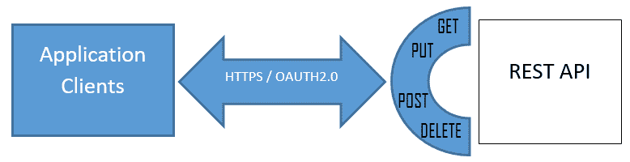
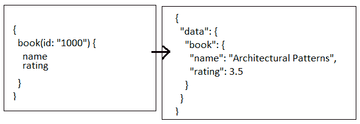
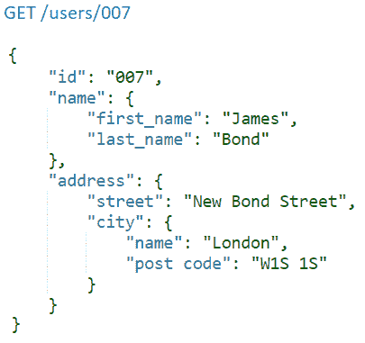
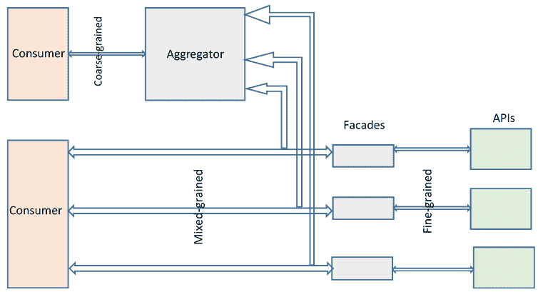
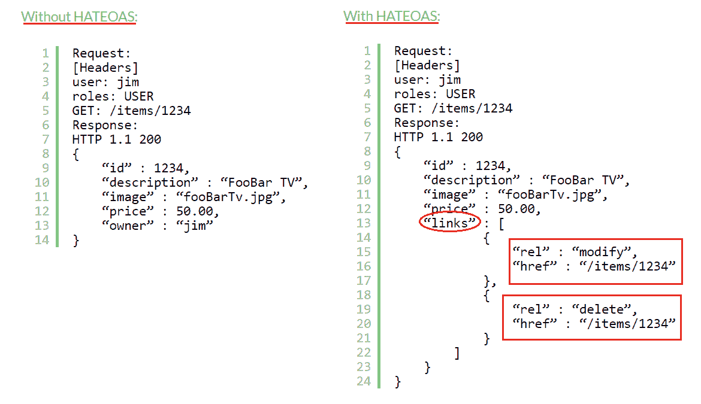
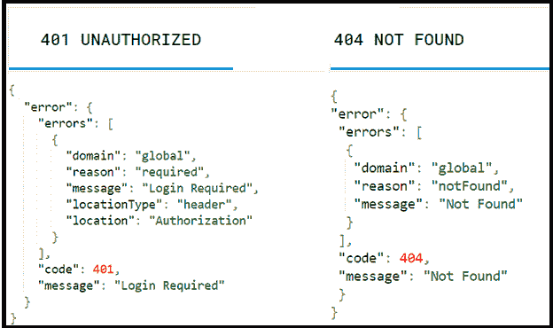

# 第二章：设计策略、指南和最佳实践

在当今数字化世界中，挑战在于将各种异构设备与互联网和内网中丰富的软件服务相互连接。**应用程序编程接口**（**API**）是解决**任何**、**任何时间**、**任何地点**和**任何设备**的最有前途的软件范例之一，这是数字世界当前的一个基本需求。本章讨论了 API 和 API 设计如何帮助解决这些挑战并弥合差距。

本章讨论了一些基本的 API 设计指南，例如一致性、标准化、可重用性和通过 REST 接口的可访问性，这些可以帮助 API 设计者更好地思考他们的 API 模型。

以下为本章的目标：

+   了解 REST API 及其重要性

+   RESTful API 设计的目标

+   API 设计师的角色和责任

+   API 设计原则

+   RESTful API 设计规则

此外，本章旨在介绍一些更好的 REST API 实现的特征和组成部分，以及一些常见但可避免的 API 策略错误。

# 技术要求

本章主要旨在向读者介绍涉及设计策略和最佳实践的多种 RESTful 设计概念；我们期望读者已经对软件设计概念、客户端-服务器架构以及基本的数据交换格式（如 JSON 和 XML）有基本的了解。

我们假设读者对网络架构、HTTP 方法、头部以及相关的客户端-服务器概念有基本的了解。然而，我们强烈建议我们的读者刷新他们对设计原则（如 SOLID、面向对象设计、企业集成、SOA 和微服务架构基础）的知识。

# 了解 REST API 及其重要性

在第一章中，我们学习了 RESTful 原则，如客户端-服务器、无状态、可缓存和分层，我们将在本章中识别并应用这些原则到低级但功能性的 API 中。此外，我们还将学习 RESTful API 设计策略和最佳实践，这些可以帮助我们应对**任何时间**、**任何地点**和**任何设备**的挑战。

让我们考虑一个例子——假设你将参加一个活动，其中除了其他活动外，还将放映电影 *《索洛》*（*星球大战*系列中的最新作品），而你知道将参加派对的你的某些朋友对 *《星球大战》* 和早期续集并不熟悉。所以作为一个技术极客，你想要通过一个简单的移动应用程序帮助你朋友，该应用程序可以将有关 *《星球大战》* 角色详情、电影列表、星际飞船等的信息以消息的形式发送到你的 WhatsApp 群组；同时，当你的任何朋友请求任何特定信息时，它也会发送消息。

但是，一个独立的移动应用如何获取*星球大战*的数据，它将如何使用 WhatsApp 进行回复，我们如何将三个不同的系统（移动、消息和数据）集成，并帮助你的朋友解决他们的*星球大战*查询？

我们需要自己创建一个庞大的*星球大战*数据集吗？移动应用将如何利用 WhatsApp 的消息功能来发送星球大战信息？消息如何成为我们应用的搜索字符串？我们还不清楚我们还需要解决多少未知的问题作为开发的一部分。

你认为如果*星球大战*数据集可以随时可用并可搜索，那就太棒了，而且 WhatsApp 应该具备向朋友发送消息的编程能力。

经过一些研究，我们发现以下清单，这让我们有信心在短时间内开发出移动应用：

+   SWAPI ([`swapi.co/`](https://swapi.co/))上关于*星球大战*的可用数据集，该应用可以利用，不仅如此，它还提供了一个我们可以搜索并获取响应的机制，因此我们有了关于星球大战数据集/数据存储的解决方案

+   WhatsApp 还提供了现成的消息功能，你的程序可以使用它来发送消息

基于前面的信息，让我们将这些提示按顺序排列，以可视化该应用：

1.  一个朋友在 WhatsApp 上询问关于 Beru 的事情，因此应用捕捉到了这个信息。

1.  应用使用[`swapi.co/api/people/?search=beru`](https://swapi.co/api/people/?search=beru)。

1.  SWAPI REST API 向应用请求发送响应。应用根据收到的响应创建关于 Beru 的详细信息文本。

1.  应用构建一个*点击聊天*API 请求，并将消息发送到群组。

1.  `https://api.whatsapp.com/send?text=<"Beru Whitesun Lars, born: '47BBY', she belongs to *Human* Species and from *Tatooine* Planet">`。

1.  你的朋友/群组收到消息——`Beru Whitesun Lars, born: "47BBY", she belongs to "Human" Species and from "Tatooine" Planet`。

因此，通过拥有所有必要的 REST API 详细信息，你将获得信心来构建一个移动应用，帮助你将搜索结果作为消息发送到 WhatsApp 群组，你准备好摇滚派对了。有趣，不是吗？

因此，现在你知道 SWAPI 和点击聊天([`api.whatsapp.com`](http://api.whatsapp.com))都是 REST API，可以被任何应用消费，就像你的移动应用消费那些 API 一样。在我们的例子中，我们是否可以说该应用是尝试通过 RESTful API 解决*随时随地*和*任何设备*的数字化挑战？

Google Maps 和位置、Apple iTunes、Google Books、英国警方([`data.police.uk/api/forces`](https://data.police.uk/api/forces))、日出和日落时间([`sunrise-sunset.org/api`](https://sunrise-sunset.org/api))以及英国国家书目([`bnb.data.bl.uk`](http://bnb.data.bl.uk))是公共 API 的几个例子。

我们迄今为止看到的 REST API 示例主要是读取操作。然而，在现实中，API 可以做得更多，我们将展示如何设计 RESTful API，它能够支持**创建、读取、更新和删除（CRUD**）操作、分页、过滤、排序、搜索等等，正如您阅读这本书时所见。

我们鼓励您了解各种公开可用的 API，包括它们的目的、响应格式等内容，这将有助于您理解并跟进本章的后续讨论。

# RESTful API 设计的目标

从我们迄今为止看到的 API 示例中，您可能已经注意到它们简单直接、明确、易于消费、结构良好，最重要的是，可以通过众所周知的标准化 HTTP 方法访问。

到目前为止，我们对 API 有了相当的了解，并且它们是解决许多数字化挑战的最佳解决方案之一；通过我们之前的示例，我们也知道谁在使用这些 API。现在让我们思考如何创建这样的可用 API 并将其公开供消费。在深入 API 设计之前，我们是否必须考虑一些基本和必要的原则？API 应该允许消费者做什么？消费者想用它做什么？为了回答我们的问题，我们需要了解以下 API 设计目标：

+   便利性

+   松散耦合

+   利用现有的网络架构

让我们更详细地讨论一下。

# 便利性

让我们讨论一个基本的设计概念，称为**便利性**，因为它可以回答我们之前提出的各种问题。便利性意味着对象及其属性是如何被其设计所感知的。在这里，它提供了关于其操作的线索：


上述图表帮助我们理解我们所谈论的设计世界中的“便利性”是什么；在我们看到的开关中，第一个代表旋转操作，另一个表示上下操作。因此，仅通过观察这些物体，我们就能感知它们支持什么以及如何支持。在 API 设计的情况下，便利性无疑起着至关重要的作用，并且是我们 API 设计的一个基本方面。

# 松散耦合

由于 API 的整个目的是将异构客户端与相同的后端代码连接起来，因此 API 尽可能地独立和尽可能地与调用客户端松散耦合是不可避免的。

在松散耦合的设计中，API 是独立的，一个 API 的修改不会影响消费者的操作。在 API 内部，组件会被添加、修改或替换。然而，松散耦合的方法在组件被添加、替换或更改时，为客户端提供了更好的 API 灵活性和可重用性。

在 REST API 服务器设计中采用松耦合架构，使得客户端和服务器都遵循并尊重共同的语义。如果 API 修改了其响应的含义，那么客户端需要意识到这一点，并相应地采取行动。

优秀的 API 展现出跨服务边界松耦合和良好组成的函数，以最大化可扩展性因素。

# 利用网络架构

自 1989 年由蒂姆·伯纳斯-李爵士发明以来，网络的基本原理仍然是所有网络架构的基础，即使今天也是如此。正如你们所知，HTTP 是网络架构的生命线，它为所有客户端请求、服务器响应以及整个网络上的文档/内容的传输提供动力。因此，确保 REST API 通过构建任何设备或操作系统都可以消费的接口来拥抱其强大的爆发力是至关重要的。

RESTful API 应使用 HTTP 作为传输层，因为 HTTP 的基础设施、服务器和客户端库已经广泛可用。

RESTful API 应利用 HTTP 方法，或动词，如由 RFC 2616 协议定义的`GET`、`PUT`和`POST`。

RFC 2616（[`tools.ietf.org/html/rfc2616`](https://tools.ietf.org/html/rfc2616)）定义了 HTTP（分布式、协作和超媒体信息系统应用层协议）的互联网标准。

# API 设计者角色和责任

在我们讨论 API 设计目标、原则和实践之前，让我们简要谈谈软件架构师、解决方案架构师、软件设计师或任何准备承担设计 RESTful API 责任的角色的主要职责。

要生产出成功的 API，API 设计者应该具备或做以下事情：

+   精通 REST 基础和 API 设计最佳实践

+   熟悉 API 设计模式，以创建现代 API 设计

+   关注本章讨论的因素，例如 API 设计目标和最佳实践，这些可以改善应用程序开发者的体验

+   通过对业务愿景及其功能的清晰理解，将业务领域转换为几个 API

+   与 API 开发者紧密合作，帮助他们处理日常限制，并处理他们现有的遗留架构

+   设置涉及开发者反馈会议、原型、测试用户、发布和版本控制的反馈循环

+   使用反馈循环将经验融入他们的 API 设计中，并加快 API 开发速度

+   创建一流的文档、可重用代码库、示例代码和教程

既然我们了解了 API 设计者的角色和责任，那么让我们继续讨论如何通过一些行业 API 最佳实践来设计成功的 API。

# API 设计最佳实践

让我们思考一下任何网络服务 API 的消费者是谁。会是另一个系统、另一个软件应用，还是最终用户？大多数情况下，API 的消费者是另一个软件应用或另一个系统本身。因此，我们可以得出结论，任何 API 的客户将是那些赋予软件生命、使其通过编程代码变得有目的性和可用性的应用开发者。因此，API 在很大程度上依赖于应用开发者或应用开发者。

因此，应用开发者应该是 API 设计的首要关注点，并且为了让他们能够使用 API，应该定义并使业务功能可访问。请务必记住，如果没有任何应用开发者或应用开发者准备好使用 API，该 API 将不复存在。

以下是由 API 设计者使用的最佳实践列表，以产生应用开发者喜欢使用的 API：

+   保持 API 简单易用——简化、友好和直观的 API 总是吸引应用开发者（我们 API 的客户端），最大限度地发挥应用开发者的潜力，使应用开发者的生活更加舒适、痛苦更少、更高效。

+   提供定义良好且易于识别的业务功能。

+   使 API 可通过任何标准网络浏览器访问——通过现有的网络基础设施（HTTPs `GET`、`POST`、`PUT`和`DELETE`）暴露 API，并通过标准浏览器访问，使得底层 API 平台无关。

+   抽象服务内部和领域模型——最好的 API 只暴露 URI 和有效负载，而不暴露服务内部或领域模型。一个例子是[`www.googleapis.com/books/v1/volumes`](https://www.googleapis.com/books/v1/volumes)。

+   确保 RESTful API 有效负载不包含任何 SOAP 有效负载的痕迹，因为客户端不同（机器与人类）。

+   保持一致性——API 实现应无变化或矛盾；通过设定明确的标准，帮助消费者了解从 API 中可以期待什么，并在 API 中实施类似的行为，如搜索和过滤（或分页和限制）。

+   实现标准 URL 模式——标准 URL 模式的一个例子是`/collection/item/collection/item`，其中`/collection`可以是书籍、狗、事件（复数）等等。

+   练习标准术语——在 URI 中遵循标准和有意义的元素对于 API 的成功至关重要。标准术语的一个例子是`bookId`、`dogId`和`eventId`，而不是`bId`、`dId`和`eId`。

+   保持灵活性——API 能够接受来自客户端的输入。一个例子是`/planner/v1/tasks`或`/planner/v1/Tasks`或`/planner/v1/TASKS`；在上面的例子中，小写、大写或驼峰式命名法应该是可接受的，并且应该以相同的方式表现。

+   保持稳定——API 的增量修改是不可避免的，但它应该独立于客户端应用程序。换句话说，不应该对使用经过修改的 API 的客户端进行强制修改。比如说，`/books/v1/volumes`不涉及对客户端的任何更改，当体积模块经过一些更改时，提供额外的利益/缺陷修复。

+   应该有一个清晰的错误处理和错误消息处理机制——API 实现不仅应该提供更好的业务功能；它处理错误和错误消息的能力至关重要，它应该提供有用且易于理解的错误消息，包括应用程序开发者可以理解的诊断信息，因为错误消息提供了提示并帮助应用程序开发者解决可能导致的错误。

+   文档——API 是可发现和有文档记录的，因此发布 API 文档是必须的。API 文档包括入门指南、示例代码、示例请求、示例响应、示例实现、关于认证和错误处理的详细说明、关于反馈途径的信息等等。

+   为 API 用户提供反馈和支持机制。

是否有 API 设计实践会很好，这样你就可以快速启动 API 设计？不，还不是时候。我们需要了解一些核心的 API 设计原则，我们将在下一部分回顾。

# API 设计原则

为了创建灵活、可扩展和安全的 API，API 设计者需要一套指导方针。我们将讨论以下基本原则：

+   普遍的网络标准

+   API 灵活性

+   API 标准化

+   API 优化

+   API 粒度

+   API 沙盒或游乐场

通过这样做，我们将能够理解遵循这些原则将如何帮助我们设计高质量的 RESTful API。

# 普遍的网络标准

正如我们在*RESTful API 设计目标*部分所讨论的，API 设计者应该采用现有的网络标准，并开发他们的 API 设计和平台，从而实现 RESTful API 和客户端之间的普遍通信。

让我们提出一些问题，这些问题将帮助我们为我们的 API 推导出更好的设计原则：

+   谁将使用我们的 API？

+   API 需要支持哪些业务功能？

+   API 应该有多细粒度？

+   API 是否应该始终遵循现有的网络标准并提供一致性？

REST 架构风格坚持采用现有的网络标准，因此利用这些标准应该是任何 API 设计的首要关注点。以下图表展示了几个常见的网络方法，即`GET`、`POST`、`PUT`和`DELETE`，以及客户端与**REST API**的交互：



在网络方法之后，还有一些基本的设计方面，API 应该遵守，它们解决了关于标准化、API 消费者和 API 一致性的问题：

+   任何应用程序客户端都应该能够在不参考大量文档的情况下理想地使用 API

+   使用标准 HTTP 方法调用，在每种语言和平台上都可用，来向 API 发送请求和检索信息

+   不要对消费者应用使用的软件开发技术做出任何假设

+   网络协议 HTTP 以及 JSON 或 ATOM 等响应有助于 API 客户端找到连接到任何语言或平台的库

# 灵活性

API 的数据应独立于资源或方法。这意味着 REST API 应处理多种类型的调用并返回各种数据格式，即使超媒体表示的结构有所变化。换句话说，API 响应的数据不绑定到资源或方法。

GitHub API 的摘要表示和详细表示可能是 API 灵活性的示例。仓库 API `GET /orgs/myorg/repos` 获取摘要表示，而单个仓库 API `GET /repos/myorg/myhelloworld.rb` 获取指定仓库的详细描述。

Salesforce API 通过其响应格式提供灵活性，因此 API 开发者可以将数据序列化为 XML 或 JSON 格式。

为 API 开发者实现的 GraphQL 端点实现是 API 灵活性的另一个最佳示例。使用 GraphQL，开发者可以根据预定义的模式请求他们想要的数据，因此 API 可以按照预定义的模式进行响应：



上述截图反映了针对特定字段（书名和评分）的样本 GraphQL 请求（模式）和指定字段的响应。

# 粒度

**粒度**是 REST API 设计的基本原则。正如我们所理解的，将业务功能划分为许多小的动作是细粒度的，那么将业务功能划分为大操作则是粗粒度的。然而，关于 API 需要达到何种粒度级别的讨论可能会有所不同；我们可能会得到不同的建议，甚至陷入辩论。无论如何，最好基于业务功能和其用例来决定，因为粒度决策无疑会根据具体情况而有所不同。

在某些情况下，网络调用可能很昂贵，因此，为了最小化这些调用，粗粒度 API 可能是最佳选择，因为客户端的每个请求都会在服务器端强制执行大量工作，而在细粒度 API 中，需要许多调用才能在客户端完成相同的工作量。

考虑以下示例。一个服务在一次调用中返回客户订单（例如*n*个订单）；这是粗粒度 API 的实际应用。在细粒度的情况下，它只返回客户 ID，而对于每个客户 ID，客户端需要额外发起一个请求以获取详细信息，因此客户端需要发起*n+1*次调用；这可能是在性能和网络响应时间上昂贵的往返调用。

在其他一些情况下，API 应该设计在最低的实际粒度级别，因为可以通过满足客户需求的方式将它们组合起来。

现在，看看这个例子，电子表单提交可能需要收集地址以及，比如说，税务信息。在这种情况下，有两个功能：一个是收集申请人的位置信息，另一个是收集税务详细信息。每个任务都需要通过不同的 API 来处理，并需要单独的服务，因为地址变更在逻辑上是一个不同的事件，与税务时间报告无关，也就是说，为什么在地址变更时需要再次提交税务信息。

粒度级别应该满足业务功能或用例的特定需求。虽然目标是最大限度地减少网络调用并提高性能，但了解 API 消费者需要的操作集以及这些操作如何有助于我们设计中的正确粒度 API 是很重要的。

例如，对于那些可以接受多次调用 API 服务器的内部服务消费者，这些 API 可以设计为细粒度，而对于外部消费者，如果他们需要避免多次往返 API，则可以设计为粗粒度。

有时，API 设计可能需要同时支持粗粒度和细粒度，以给 API 开发者提供灵活性，让他们为他们的用例选择正确的 API。

以下要点可以作为读者决定他们在 API 建模中的 API 粒度级别的一些基本指南：

+   通常情况下，将服务视为粗粒度，将 API 视为细粒度。

+   在响应数据量和提供这些数据所需资源数量之间保持平衡，将有助于决定粒度。

+   在定义粒度时，还应考虑在数据上执行的操作类型。

+   读取请求通常是粗粒度的。在某些情况下，返回所有必要的信息以渲染页面不会像两次单独的 API 调用那样造成太大的伤害。

+   另一方面，写入请求必须是细粒度的。找出客户端需要的常见操作，并为该用例提供特定的 API。

+   有时，你应该使用中等粒度，也就是说，既不是细粒度也不是粗粒度。以下示例中，嵌套资源位于两层深度内。

考虑以下快照，它反映了一个中等粒度的 API 响应：



让我们以一个广泛的指导方针来结束本节，这个指导方针有助于确定正确的服务粒度——识别服务影响的关键业务实体，并相应地建模生命周期；也就是说，对于每一个业务结果，应该只有一个 API 操作。

前面的指南可能导致许多 API 部署单元，这可能会在后续造成不便。有一些模式，特别是 API 网关，可以更好地协调这些众多的 API。通过优化端点、请求合并等方式协调 API 有助于解决粒度挑战。

# 优化 API

本节讨论了为 API 采用更好的优化方法。没有一种适合所有情况的方案。在现实世界中，多个 API 可能支持相同的服务，因为该服务可能服务于不同类型的用户和用例。正如我们在本章前面引用的那样，API 应根据其满足的用例进行建模，而不是根据其暴露的后端服务或应用程序。

因此，优化适用于特定上下文中的特定业务请求。让我们以一个例子来说明，一个网络服务允许其移动应用用户支付电费。在移动应用的环境中，我们应该首先考虑移动应用的限制，因为移动应用对网络延迟、多次网络请求、数据大小与标准网络应用相比等因素都很敏感。因此，我们的 API 设计应侧重于限制后端调用并最小化返回的数据大小。

关于粒度，让我们考虑前面的例子将消耗少量细粒度的独立可调用 API。另一方面，为了进行支付，应用程序可能需要使用来自另一个服务的粗粒度 API（该服务本身可能包含许多细粒度 API）。因此，我们的移动应用可以直接使用一些其他细粒度 API 来获取应付款项、获取用户地址以及访问用户想要用来支付未付款项的银行的账户详情，甚至可能需要在未来集成更多细粒度 API 等。因此，设计者应考虑我们在第一章中讨论的分层或分层方法，以协调和管理这些细粒度 API。

因此，API 设计可以公开细粒度的 API 供消费者直接访问，并在其之上提供粗粒度的服务，以支持更广泛的使用案例，这样服务客户端可以选择直接调用细粒度 API，或者如果他们需要多个细粒度 API 的合并功能，他们可以选择使用粗粒度 API。



前面的图展示了 API 的逻辑结构及其粒度，以及这些 API 是如何被服务客户端消费的，这是我们之前讨论的使用案例的优化 API 示例。

# 功能性

这种设计原则表明，API 设计应该支持生命周期作为一个单一窗口的完整过程。例如，在电子商务网站上，当消费者购买商品时，他们不应该需要去银行门户网站检查余额或进行支付，也许它应该集成在同一电子商务门户网站内。电子商务门户网站使用的 API 应该涵盖生命周期的全过程。部分或未完成的 API 会严重影响用户体验。

对于 APIs 来说，另一个需要考虑的方面是在当今金融世界中提供全面覆盖；随着现金管理、自动转账、证券交易所订单等服务领域的快速扩张，APIs 是连接这些第三方服务和银行服务的完美解决方案。

我们在前面章节中看到的用于识别服务粒度的相同实体生命周期建模方法，也有助于我们了解哪些服务是支持完整业务流程生命周期所必需的。

# 了解不寻常情况

在现实世界中，有一些只能通过专用或专有技术解决的问题。这些情况是不寻常的，那些情况的一些例子可能出现在智能家居平台、具有标准化 B2B 模型的物联网（现场总线）实施、ebMS3/AS4 消息等场景中。

在实用 REST 服务世界中，总会有一些情况，API 设计者会遇到不寻常的情况，需要为他们的 API 设计做出一些权衡，例如，将遗留应用程序迁移到 RESTful 服务场景。实际上，迁移整个遗留软件是不切实际的，特别是在专有代码的情况下，我们将这些情况称为特殊情况。然而，在那些特定情况下，有一些设计原则和模式，如领域驱动设计模式，会派上用场。这些不寻常或独特的情况也属于设计原则范畴，它们建议 API 只为绝对必要解决特定问题的案例提供专门技术，而不仅仅是因为情况复杂。

**适用性声明 4**（**AS4**）是一个使用 Web 服务的开放标准协议规范，用于安全且与有效载荷无关的**企业到企业**（**B2B**）文档（OASIS ebMS）。

鼓励您参考由 Packt 出版的书籍[架构模式](https://www.packtpub.com/application-development/architectural-patterns)，其中有一章专门介绍**领域驱动设计**（**DDD**）模式，并详细讨论了许多 DDD 模式。

# 社区标准化

遵循由开放联盟描述的标准和命名约定，使我们的 APIs 更加易于使用和互操作性。**开放旅行联盟**（**OTA**）和**开放地理空间联盟**（**OGC**）是这些联盟的例子。

社区标准化原则建议，当可用时，API 实现应使用行业标准信息组件进行设计。例如，iCalendar 用于日历邀请和事件，vCard 用于姓名和地址信息，**Keyhole Markup Language** (**KML**)用于地理空间数据，这些都是我们 API 可以充分利用的明确定义的标准。

# API 游乐场

API 提供商应开发和公开一个相关的网站/开发者门户，以便开发者可以快速了解他们的 API。它为新客户提供文档、论坛和带有安全 API 访问密钥的自助服务。

APP 开发者了解 API 及其提供的内容，不仅通过文档，而且通过在可以以受控、监控的方式测试和操作数据的环境中使用的简单工具和技术，这一点至关重要，并在开发者中引发了巨大的兴趣去学习和使用 API。

一个交互式且在浏览器中的 API 游乐场是潜在用户识别 API 端点和测试其代码以体验 API 行为的最有效方式之一。

沙盒、虚拟化和 API 游乐场是 API 提供商吸引应用开发者体验 API 功能的三种不同方式。

API 沙盒是一个在特定区域内具有特定规则的控制环境，提供简单的 API 调用。虚拟化是真实 API 的镜像，为 APP 开发者提供类似生产环境的测试环境。API 游乐场比沙盒提供更多功能，但与虚拟化不同，它们是一个有限的、受控的系统模拟。API 游乐场最适合开发者测试并从 API 中获得更多数据集；同时，API 提供商对这些环境也有更好的控制。

# RESTful API 设计规则

现在我们已经了解了 API 设计师的角色和职责、API 设计最佳实践和 API 设计核心原则，我们可以再覆盖一个重要的 API 设计方面，即称为**API 规则**。最佳实践和设计原则是 API 设计师试图在其 API 设计中融入的指南。然而，API 规则需要在 API 设计中进行调整，以使我们的 API 符合 RESTful 风格。因此，本节专门介绍以下 RESTful API 规则：

+   统一资源标识符的使用

+   URI 权限

+   资源建模

+   资源原型

+   URI 路径

+   URI 查询

+   元数据设计规则（HTTP 头和返回错误代码）以及表示

+   客户关注的问题（版本控制、安全性和超媒体处理）

我们相信，对这些规则的清晰理解将使我们更接近设计，并开始我们的旅程，朝着提供最优质的 RESTful API 迈进。

# 了解统一资源标识符

REST API 应使用 **统一资源标识符（URIs**）来表示其资源。资源指示应清晰直接，以便它们能够清晰明确地传达 API 资源：

+   一个简单易懂的 URI 示例是 `https://xx.yy.zz/sevenwonders/tajmahal/india/agra`，如您所观察到的，强调的文本清楚地表明了意图或表示

+   一个难以理解的 URI 示例是 `https://xx.yy.zz/books/36048/9780385490627`；在这个示例中，“books”之后的文本对任何人来说都很难理解

因此，在 RESTful API 设计中，URI 的简单、易懂的表示至关重要。

以下部分讨论了针对 RESTful 服务的许多此类 URI 方面。

# URI 格式

根据 RFC 3986，通用 URI 的语法是 `scheme "://" authority "/" path [ "?" query ] [ "#" fragment ]`，以下是为 API 设计制定的规则：

+   **使用正斜杠（`/`）分隔符**：这用于表示资源之间的层次关系，例如，`http://xx.yy.zz/shapes/polygons/quadrilaterals/squares`。

+   **不要使用尾部正斜杠**：URI 中的尾部正斜杠没有任何意义，可能会造成混淆，例如，`http://xx.yy.zz/shapes/polygons/` 和 `http://api.examples.org/shapes/polygons`（注意 URI 末尾的尾部斜杠）。REST API 既不应期望尾部斜杠，也不应在提供给客户端作为响应的链接中包含它们。

+   **使用连字符（**`*-*`**）**：连字符可以提高 URI 名称、路径和段落的可读性，并帮助客户端轻松扫描和解释，例如，`https://xx.yy.zz/seven-wonders/taj-mahal/india/agra`（注意连字符分隔了“七奇迹”和泰姬陵之间的空间）。

+   **避免下划线（**`_`**）**：设计师应避免在路径中使用下划线（_）表示，因为字符下划线在计算机字体渲染时可能会部分遮挡或隐藏，例如，`https://xx.yy.zz/seven_wonders/taj_mahal/india/agra`（注意我们无法辨认下划线，因为它被作为超链接）。应使用连字符代替 `https://xx.yy.zz/seven-wonders/taj-mahal/india/agra`（使用连字符，即使它是超链接，也能清晰可见）。

+   **在 URI 路径中优先使用全部小写字母**：API 设计师应优先考虑小写字母，而不是其他任何表示形式，因为 RFC 3986 将 URI 定义为大小写敏感，除了方案和主机组件。一些例子包括，`http://xx.yy.zz/shapes/polygons` 和 `HTTP://XX.YY.ZZ/shapes/polygons` 是相同的，而 `http://xx.yy.zz/shapes/polygons` 和 `HTTP://XX.YY.ZZ/SHAPES/Polygons` 则 **不是** 相同的。

+   **不要包含文件扩展名**：正如你所知，文件名后缀的点(`.`)表示其文件类型。然而，URI 不应该使用点来表示任何文件扩展名；相反，它应该依赖于通过内容类型头（参考*媒体类型和媒体类型设计规则*部分）传达的媒体类型。

# REST API URI 授权

正如我们所见，对于通用 URI 有不同的规则，我们将讨论 REST API URI 的授权(*`scheme "://" authority "/" path [ "?" query ] [ "#" fragment ]`*)部分：

+   使用一致的子域名：

    +   API 的一致子域名包括以下内容：

        +   顶级域名和第一个子域名表示服务所有者，一个例子可以是`baseball.restfulapi.org`

        +   如你所见在`http://api.baseball.restfulapi.org`，API 域名应该包含子域名中的`api`

    +   开发者门户的一致子域名包括以下内容：

        +   正如我们在*API 游乐场*部分所看到的，API 提供者应该为 APP 开发者提供测试 API 的网站，称为开发者门户。因此，按照惯例，开发者门户的子域名应该包含`developer`。一个包含开发者的开发者门户子域名的例子将是`http://developer.baseball.restfulapi.org`*.*

# 资源建模

资源建模是 API 设计者的主要方面之一，因为它有助于建立 API 的基本概念。

在前面的部分中，我们看到了关于 URI 的详细信息；让我们一般性地考虑，URI 路径总是传达 REST 资源，并且 URI 的每一部分都由一个正斜杠(`/`)分隔，以表示模型层次结构中的唯一资源。

让我们看看以下示例 URI 设计：

+   [`api-test.lufthansa.com/v1/profiles/customers/memberstatus`](https://api-test.lufthansa.com/v1/profiles/customers/memberstatus)

+   [`api-test.lufthansa.com/v1/profiles/customers/accountbalance`](https://api-test.lufthansa.com/v1/profiles/customers/accountbalance)

每个资源通过正斜杠分隔表示一个可寻址的资源，如下所示：

+   [`api-test.lufthansa.com/v1/profiles/customers`](https://api-test.lufthansa.com/v1/profiles/customers)

+   [`api-test.lufthansa.com/v1/profiles`](https://api-test.lufthansa.com/v1/profiles)

+   [`api-test.lufthansa.com`](https://api-test.lufthansa.com)

客户、配置文件和 API 都是前面单个 URI 模型中的独特资源。因此，资源建模是一个关键的设计方面，API 设计者在设计 URI 路径之前需要考虑 API 资源模型。

# 资源原型

API 提供的每个服务都是一个原型，它们表示 REST API 设计的结构和行为。资源建模应该从几个基本的资源原型开始，通常 REST API 由四个独特的原型组成，如下所示：

+   **文档**: 文档是以字段和链接为基础结构的资源表示的基础。以下，每个样本 URI 代表唯一的文档资源，第一个也称为 doc-root 或父资源（API 端点）：

    +   [`api-test.lufthansa.com`](https://api-test.lufthansa.com)

    +   [`api-test.lufthansa.com/v1/profiles`](https://api-test.lufthansa.com/v1/profiles)

    +   [`api-test.lufthansa.com/v1/profiles/customers`](https://api-test.lufthansa.com/v1/profiles/customers)

    +   [`api-test.lufthansa.com/v1/profiles/customers/accountbalance`](https://api-test.lufthansa.com/v1/profiles/customers/accountbalance)

    +   [`api-test.lufthansa.com/v1/profiles/customers/memberstatus`](https://api-test.lufthansa.com/v1/profiles/customers/memberstatus)

+   **集合**: 集合也是一种资源，它是 API 提供者或服务器管理的资源目录。如果集合允许创建新的资源，则客户端可以向集合中添加新资源。集合资源决定每个包含或添加的资源 URI。以下，每个找到的 URI 样本标识一个集合资源：

    +   [`api-test.lufthansa.com/v1/profiles/customers`](https://api-test.lufthansa.com/v1/profiles/customers)

    +   [`api-test.lufthansa.com/v1/profiles/customers/accountbalance`](https://api-test.lufthansa.com/v1/profiles/customers/accountbalance)

    +   [`api-test.lufthansa.com/v1/profiles/customers/memberstatus`](https://api-test.lufthansa.com/v1/profiles/customers/memberstatus)

+   **存储**: 存储是由客户端管理的资源仓库。存储允许 API 客户端将资源放入其中，为添加的资源选择 URI，获取它们，并在决定时删除它们。（URI 存储永远不会生成新的 URI，并且是客户端决定资源最初何时添加。）以下的一些交互示例显示了购物车和歌曲管理 API 客户端程序的用户在其用户 ID `{id}` 下分别插入名为 carts 和 playlists 的文档资源：

    +   [`api.example.com/cart-management/users/{id}/carts`](http://api.example.com/cart-management/users/%7Bid%7D/carts)

    +   [`api.example.com/song-management/users/{id}/playlists`](http://api.example.com/song-management/users/%7Bid%7D/playlists)

+   **控制器**: 控制器资源类似于可执行方法，具有参数和返回值。REST API 依赖于控制器资源来执行不属于任何 CRUD 方法的应用特定操作。控制器名称应始终出现在 URI 路径的最后一段，后面没有子资源跟随：

    +   `POST /alerts/245245/resend` 是一个控制器资源的示例，允许客户端向用户重新发送警报

# URI 路径

本节讨论与 REST API URI 中有意义的 URI 路径（`scheme "://" authority "/" path [ "?" query ] [ "#" fragment ]`）设计相关的规则。

以下是一些关于 URI 路径的规则：

+   使用单数名词表示文档名称，例如：[`api-test.lufthansa.com/v1/profiles/customers/memberstatus`](https://api-test.lufthansa.com/v1/profiles/customers/memberstatus)。

+   使用复数名词表示集合和存储：

    +   **集合**：[`api-test.lufthansa.com/v1/profiles/customers`](https://api-test.lufthansa.com/v1/profiles/customers)

    +   **存储**：[`api-test.lufthansa.com/v1/profiles/customers/memberstatus/prefernces`](https://api-test.lufthansa.com/v1/profiles/customers/memberstatus/prefernces)

+   由于控制器名称代表一个动作，因此对于控制器资源应使用动词或动词短语。例如：[`api-test.lufthansa.com/v1/profiles/customers/memberstatus/reset`](https://api-test.lufthansa.com/v1/profiles/customers/memberstatus/reset)。

+   不要在 URI 中使用 CRUD 函数名称：

    +   **正确的 URI 示例**：`DELETE /users/1234`

    +   **错误的 URI**：`GET /user-delete?id=1234`，`GET /user-delete /1234`，`DELETE /user-delete /1234`，以及 `POST /users/1234/delete`

# URI 查询

本节讨论与 REST API URI 的查询部分（`scheme "://" authority "/" path [ "?" query ] [ "#" fragment ]`*）设计相关的规则。

URI 的查询部分也代表了资源的唯一标识，以下是一些关于 URI 查询的规则：

+   使用查询对集合或存储进行过滤：

    +   查询中的限制示例：`https://api.lufthansa.com/v1/operations/flightstatus/arrivals/ZRH/2018-05-21T06:30?limit=40`

+   使用查询对集合或存储结果进行分页：

    +   查询中的偏移量示例：`https://api.lufthansa.com/v1/operations/flightstatus/arrivals/ZRH/2018-05-21T06:30?limit=40&offset=10`

# HTTP 交互

REST API 不建议使用任何特殊的传输层机制，它只需要基本的超文本传输协议及其方法来在网络上表示其资源。我们将在接下来的章节中讨论 REST 应如何利用这些基本的 HTTP 方法。

# 请求方法

客户端通过定义明确的语义 HTTP 方法（如 `GET`，`POST`，`PUT`，`DELETE`，`PATCH`，`HEAD`，和 `OPTIONS`）来指定预期的交互。以下是在设计时 API 设计师应考虑的规则：

+   不要使用 `GET` 和 `POST` 方法进行其他请求的隧道传输

+   使用 `GET` 方法检索资源的表示

+   使用 `HEAD` 方法检索响应头

+   使用 `PUT` 方法更新和插入存储的资源

+   使用 `PUT` 方法更新可变资源

+   使用 `POST` 方法在集合中创建新的资源

+   使用 `POST` 方法执行控制器操作

+   使用 `DELETE` 方法从其父资源中删除资源

+   使用 `OPTIONS` 方法检索元数据

# 响应状态码

HTTP 规范定义了标准状态码，REST API 可以使用相同的状态码来传递客户端请求的结果。

状态码类别和一些相关的 REST API 规则如下，以便 API 可以根据进程状态应用这些规则：

+   **1xx: 信息性**: 这提供了协议级别的信息

+   **2xx: 成功**: 客户端请求被接受（成功），如下所示：

    +   `200`: OK

        +   用于指示客户端请求成功

        +   不要用于在响应体中传达错误

    +   `201`: 已创建

        +   用于成功创建资源

    +   `202`: 已接受

        +   用于报告成功的异步操作

    +   `204`: 无内容

        +   当 API 想要在响应体中发送空或无内容时

+   **3xx: 重定向**: 服务器将客户端请求重定向到不同的端点以满足客户端请求：

    +   `301`: 永久移动

        +   用于已移动的资源

    +   `302`: 找到

        +   请注意不要使用`302`，因为它会在开发者中引起关于从客户端自动重定向的混淆

    +   `303`: 看其他

        +   用于将客户端指向不同的 URI（代替`302`，建议 API 应使用`303`）

    +   `304`: 未修改

        +   使用以便客户端可以节省带宽

        +   与条件 HTTP 请求一起使用

    +   `307`: 临时重定向

        +   用于指示客户端将请求重新提交到另一个 URI

+   **4xx: 客户端错误**: 客户端错误：

    +   `400`: 错误请求

        +   可以用来指示通用或非特定失败

    +   `401`: 未授权

        +   用于客户端未经授权访问或客户端凭证问题

    +   `403`: 禁止

        +   用于禁止访问，无论授权状态如何

        +   用于强制应用级权限（仅允许访问少数资源而不是所有资源）

    +   `404`: 未找到

        +   当客户端请求不映射到任何 API 资源时必须使用

    +   `405`: 方法不允许

        +   在客户端访问非预期 HTTP 方法时使用

        +   举例来说，只支持读取的资源配置可能只支持`GET`和`HEAD`，而客户端尝试使用`PUT`或`DELETE`

        +   请注意，`405`响应应该是 Allow 头的一部分 *(Allow—`GET`. `POST`)*

    +   `406`: 不可接受

        +   服务器无法提供请求的媒体类型时必须使用

    +   `409`: 冲突

        +   用于客户端违反资源状态

        +   例如，当客户端尝试删除非空存储资源时，API 返回此错误

    +   `412`: 预先条件失败

        +   用于支持条件操作。客户端在请求头中发送一个或多个先决条件，以指示 API 仅执行满足条件的条件；如果不满足，API 应发送`412`错误代码。

    +   `415`: 不支持的媒体类型

        +   当 API 无法处理请求的有效负载媒体类型（在内容类型请求头中指示）时必须使用

+   **5xx: 服务器错误**: 这些与服务器端错误相关：

    +   `500`：内部服务器错误

        +   用于报告 API/服务器端问题，并且当这肯定不是客户端的过错时

# 元数据设计

本节探讨了元数据设计的规则，包括 HTTP 头部和媒体类型。

# HTTP 头部

如您可能已经知道，HTTP 规范有一组标准头部，通过这些头部，客户端可以获取有关请求资源的信息，并携带指示其表示的消息，这些消息可能作为控制中间缓存的方向。

以下几点提出了一组符合 HTTP 标准头部的规则：

+   **应在响应中使用 content-type**：客户端和服务器依赖于这个头部来指示如何处理消息体，因为 content-type 的值指定了请求或响应消息体中包含的数据的形式，称为**媒体类型**。

+   **应在响应中使用 content-length**：客户端应该知道即将读取的消息体的尺寸。另一个好处是，客户端可以知道需要下载的响应体的尺寸，而无需通过发送`HEAD`请求来下载整个响应。

+   **应在响应中使用 last-modified**：响应应指定所需资源表示状态被修改或更新的时间戳，以便客户端和缓存中间件可以依赖此头部来确定其本地副本的资源状态表示的新鲜度。`last-modified`头部应作为其请求的一部分。

+   **应在响应中使用 ETag**：**实体标签**（**ETag**）是一个 HTTP 头部，帮助客户端识别他们请求的资源的具体版本。服务器应该始终在客户端的`GET`请求中以头部形式响应 ETag。ETag 的值通常是资源内容的摘要（例如，MD5 哈希值），以便服务器可以识别缓存的资源内容是否与资源的最新版本不同。ETag 与`last-modified`头部的区别在于值（作为摘要的资源内容与时间戳）。此头部值使客户端能够通过在未来的`GET`请求中使用`If-Non-Match`条件来选择是否再次发送表示。如果 ETag 值没有变化，那么客户端可以决定在随后的`GET`请求中节省时间和带宽，不再发送表示。

+   **存储必须支持条件 `PUT` 请求**：REST API 可以通过依赖于带有 `If-Unmodified-Since` 和/或 `If-Match` 请求头的客户端请求来支持条件 `PUT` 请求。由于存储资源使用 `PUT` 方法进行插入和更新，REST API 应该知道客户端 `PUT` 请求的意图。`PUT` 与 `POST` 相同，除了 `PUT` 是**幂等的**。请注意，HTTP 支持使用 `GET`、`POST` 和 `DELETE` 方法的条件请求；这是允许可写 REST API 帮助 API 客户端之间协作的基本模式。

从 RESTful 服务角度来看，服务调用的幂等性意味着客户端发出的调用对所有调用产生相同的结果；也就是说，来自客户端的多个请求与单个请求产生相同的效果。请注意，相同的结果或行为在服务器上。然而，客户端收到的响应可能不与资源状态相同，因为请求之间资源状态可能发生变化。

+   **应使用位置指定新创建资源的 URI（通过 `PUT`）**：在通过集合或存储成功创建资源后，API 应提供新创建资源的 URI（位置）作为响应头。位置头可以是状态码 `202` 响应的一部分，以指导客户端其异步调用的状态。

+   **应利用 HTTP 缓存头**：这是为了鼓励缓存，提供缓存控制、过期和日期响应头，以在各种级别上利用缓存，例如 API 服务器端、**内容分发网络**（**CDN**）或甚至客户端的网络。以下是一些示例：

    +   `Cache-Control: max-age=90, must-revalidate` （`max-age` 以秒为单位）

    +   `对于基于 HTTP 1.0 的缓存，``Date: Tue, 29 Apr 2018 08:12:31 GMT``Expires: Fri, 04 May 2018 16:00:00 GMT`

为了阻止缓存，添加带有 `no-cache` 和 `no-store` 的缓存控制头，具体如下：

+   +   对于 HTTP 1.0 的遗留缓存

    +   添加 `Pragma—no-cache` 和 `Expires—0` 头值

然而，除非必要，REST API 应始终引发响应的缓存，可能通过较短的持续时间而不是使用无缓存指令来实现。这样，客户端可以通过获取短暂的生命周期响应副本来获得更快的响应，以满足频繁的访问请求。

+   **应使用过期头与 `200` （"OK"）响应一起使用**：对成功的 `GET` 和 `HEAD` 请求设置过期缓存头，鼓励客户端进行缓存。请注意，`POST` 方法也是可缓存的，因此不要将此方法视为不可缓存。

+   **可以使用 3xx 和 4xx 响应的过期缓存头**：除了状态码 `200` （"OK"：成功响应）之外，API 还可以包括 3xx 和 4xx 响应的缓存头，也称为负缓存。这有助于 REST API 服务器通过减少由于某些重定向和错误触发而导致的负载。

+   **不得使用自定义 HTTP 头**：自定义 HTTP 头的主要目的是为应用开发者提供额外的信息和故障排除提示；然而，对于服务器端的一些特定情况，除非这些情况不会改变 HTTP 方法的行为，否则它们会很有用。一个例子是使用 X-cache 头部的 API，让应用开发者知道资源是由源服务器还是边缘服务器提供的。如果应该通过自定义 HTTP 头传递的信息是关键的，需要对其请求或响应进行准确解释，那么最好将其包含在请求或响应的主体中，或者在该请求使用的 URI 中。

# 媒体类型和媒体类型设计规则

正如你在第一章的“资源操作”部分中看到的，*RESTful 架构基础简介*，媒体类型有助于识别请求或响应消息主体中的数据形式，而内容类型头部的值代表一个媒体类型，也称为**多用途互联网邮件扩展**（**MIME**）类型。

媒体类型设计影响 REST API 设计的许多方面，包括超媒体、不透明 URI 以及不同和描述性的媒体类型，以便应用开发者或客户端可以依赖 REST API 的自描述特性。

以下简要讨论媒体类型设计规则：

+   **使用特定应用的媒体类型**：REST API 将 HTTP 请求或响应的主体视为特定应用交互的一部分。虽然请求或响应主体是用 JSON 或 XML 等语言构建的，但它通常具有需要特殊处理的语义，而不仅仅是解析语言的语法。以下是一个此类 REST API URI 的示例表示，即[`swapi.co/api/planets/1`](https://swapi.co/api/planets/1)，它对`GET`请求响应以 JSON 格式表示的*星球大战*星球资源。

+   **支持多种表示形式的媒体类型协商**：客户端可能需要通过在`Accept`头中提交所需的媒体类型来要求不同的格式和模式，因此 API 应该允许客户端以所需的格式获取响应。以下是从`developer.atlassian.com`提供的媒体类型协商示例，针对以下`Accept`头：

```py
Content-Type: application/json Accept: application/json
```

观察以下 curl 执行情况：

```py
curl -i -u application_name:application_password --data '{"value": "my_password"}' http://testapi.com /crowd/rest/usermanagement/1/authentication?username=my_username --header 'Content-Type: application/json' --header 'Accept: application/json'  
```

我们可以得出以下结论：

+   使用查询参数支持媒体类型选择：

    +   为了支持具有简单链接和调试功能的客户端，REST API 应该通过名为`accept`的查询参数支持媒体类型选择，其值格式与`Accept` HTTP 请求头中的格式相匹配

    +   例如，REST API 应优先采用更精确和通用的方法，如下所示媒体类型，使用`GET` `https://swapi.co/api/planets/1/?format=json`查询参数标识，而不是其他替代方案

Windows 操作系统用户可以使用 MobaXterm ([`mobaxterm.mobatek.net/`](https://mobaxterm.mobatek.net/)) 或任何支持 Unix 命令的 SSH 客户端。

# 表示

如我们所知，资源当前状态的机器可读描述，无论是请求还是响应，都是表示，它可以采用不同的格式。以下部分讨论了最常见资源格式（如 JSON 和超媒体）以及错误类型的简要规则。

# 消息体格式

在分布式环境中，REST API 通信通常以文本格式进行，我们将讨论以下 JSON 文本格式表示规则：

+   使用 JSON 进行资源表示，并且应该格式良好

+   您也可以使用 XML 和其他格式

+   不要创建额外的封装或任何自定义传输封装，仅利用 HTTP 封装

# 超媒体表示

如我们从第一章，《RESTful 架构基础介绍》所理解，REST API 客户端可以使用统一链接结构作为 HATEOAS 响应进行编程导航，以下是一些与超媒体表示相关的规则。

以下截图帮助我们回忆第一章，《RESTful 架构基础介绍》，的 HATEOAS 表示：



这也可以帮助我们关联以下规则：

+   使用一致的形式来表示链接、链接关系和链接公告

+   在响应消息体中提供一个自链接表示

+   最小化广告的*入口点*或 API URI 的数量

+   使用链接以状态敏感的方式宣传任何资源操作

# 媒体类型表示

`GET`请求不会包含请求体，响应体始终是资源表示。因此，对于除`GET`请求之外的所有客户端请求，API 应在请求体和响应体中定义媒体类型。API 媒体类型与排序、过滤、分页和链接等特性相关。因此，媒体类型格式和模式应保持一致。

# 错误表示

HTTP 方法的错误状态码（4xx 和 5xx）可以在响应体中携带客户端可读信息。以下规则展示了错误和错误响应的一致形式：

+   错误和错误响应应保持一致

+   通用和常见错误条件的错误类型也应保持一致

以下图表展示了一个示例 JSON 响应，并说明了错误和错误代码如何在 API 响应中占主导地位：



# 客户端关注点

如我们从*API 设计最佳实践*部分所知，REST API 世界的 REST API 客户端是 APP 开发者，REST API 旨在满足其客户端程序（APP 开发者代码）的需求。本节讨论一系列 REST API 设计原则，以解决常见的客户端关注点。

# 版本化

REST API 是一组相互链接的资源或资源模型。表示性资源通过版本传递其状态。因此，版本化是基本设计原则之一，在陈述版本化规则之前，我们将查看 API 的版本化。

当 API 经历破坏性更改时，应该对其进行版本化（增加主版本）；破坏性更改包括以下内容：

+   响应数据更改

+   响应类型更改

+   移除 API 的任何部分

即使涉及较小的或非破坏性修改，如添加新端点或新响应参数，API 也应进行版本更改。小版本有助于跟踪 API 的小变化，并协助客户支持，他们可能正在接收缓存的数据版本或可能遇到其他 API 问题。以下是关于 REST API 版本化的几个规则：

+   使用新的 URI 引入新的模型或概念

+   使用模式来管理表示形式版本

+   利用 ETags 来管理表示状态版本

通用版本化实践遵循方案版本化（[`semver.org/`](https://semver.org/)）；然而，RESTful API 中的版本化实践引起了大量讨论，请注意，作为 API 设计者，我们可能需要根据业务需求和影响做出决策。

# 安全性

REST API 可能会暴露包含仅限于特定客户端查看的安全信息的资源，以下规则有助于保护这些资源：

+   使用基于 HTTP 的授权协议 OAuth 来保护资源

+   使用 API 管理解决方案，如反向代理，来保护资源

我们在下一章提供了一个示例实现。

# 响应表示组合

当 REST API 随着新功能的发展而演变时，客户端可能需要从其支持的 REST API 获取新的资源。然而，出于许多实际原因，客户端可能需要从 REST API 获取新的资源。因此，REST API 可以提供一种控制其响应表示组成的措施。REST API 保持一致的资源模型设计至关重要，这样客户端才能从组合响应中受益。以下两个规则使客户端能够调整响应：

+   应该支持通过使用 URI 的查询组件进行部分响应

+   应该通过使用 URI 的查询组件嵌入链接资源

例如，您可以参考本章的*URI 查询*部分。

# 处理超媒体

我们之前讨论了两种超媒体结构，链接和链接关系。它们帮助客户端使用一致的算法处理响应结构。

客户端应与特定的 REST API 响应表示链接进行交互。以下要点讨论了一个简单的流程：

+   客户端处理程序首先通过其关系名称查找链接，并使用适当的 HTTP 请求方法与链接查找进行交互。

+   客户端代码检查链接关系文档资源的 method 字段，以决定内容是否应该提交到请求消息体中。

# JavaScript 客户端

最常见的情况是，JavaScript 客户端希望与 REST API 交互。然而，网络浏览器对同源（也称为**同源策略**）施加了限制（沙盒化）。它限制了 JavaScript 客户端访问资源，如果资源不是来自同一域/自身来源。URI 方案、主机和端口组件指示资源来源是否来自同一域。浏览器实施同源策略以防止泄露机密用户数据。

然而，在大多数情况下，REST API 需要为其 JavaScript 客户端提供从 JavaScript 的多源读写访问，我们将看到以下规则如何实现这种灵活性：

+   支持从 JavaScript 使用**带填充的 JSON**（**JSONP**）进行多源读取访问

+   支持**跨源资源共享**（**CORS**）以提供从 JavaScript 的多源读写访问

# 摘要

作为设计策略的一部分，我们探讨了 API 是什么以及它在数字化时代连接各种设备和技术的意义。我们考察了一些基本的 API 设计特性，如可用性、利用现有网络基础设施以及 API 设计目标，例如一致性、简化、灵活且稳定的 API，以及 API 设计者如何关注 APP 开发者——API 的消费者。

我们还简要讨论了 API 设计者的角色以及他们需要遵循的设计原则和规则，以便他们能够创建更好的 RESTful API。我们通过给出 RESTful API 的必要规则以及一些应该做和不应该做的事情来结束本章。

因此，我们在下一章为你打下了坚实的基础和路径，以便你能够掌握 API 编程，因为它们涉及实际的 REST API 程序实现，以及各种 RESTful API 设计模式和应用程序。

# 进一步阅读

我们鼓励读者参考[`www.packtpub.com/all`](https://www.packtpub.com/all)以获取各种参考资料和大量关于 RESTful 服务和 API 的书籍。
