# 第四章：高级 RESTful API 模式

每个软件设计师都认同，在现代软件设计和开发的生命周期中，设计模式和通过实现设计模式来解决熟悉且反复出现的设计问题是不可避免的。一般来说，存在各种 API 设计模式，在我们前面的章节中，我们介绍了几种基本的 RESTful API 模式。在本章中，我们将深入探讨一些高级 API 设计模式，因为这些模式对于实时 RESTful 服务和当前软件行业的需求是必要的。

本章是 API 设计模式的第二部分；目的是介绍多个高级设计模式，例如版本控制和后端前端。一旦读者阅读了本章，他们应该知道如何实现以下模式：

+   版本控制

+   授权

+   统一契约

+   实体端点

+   端点重定向

+   幂等性

+   批量操作

+   断路器

+   API 外观

+   后端前端

请不要忘记查看投资者服务代码示例，并学习高级模式实现。

# 技术要求

由于本章涉及高级模式，我们期望读者具备一些基本软件设计模式和惯例的知识，Java 编程能力，Spring 框架和 RESTful 服务。

要运行本章的示例代码，请参阅第三章，《必要的 RESTful API 模式》，以获取额外的技术要求和有关如何运行此处提供的示例代码的信息。

# RESTful API 高级模式

在前面的章节中，我们介绍了一些关键的 RESTful 模式；现在是时候深入研究更高级的模式，并动手为我们客户提供尽可能好的 RESTful 服务实现。让我们开始学习如何为我们服务实现版本控制。

# 版本控制

许多书籍和文章建议如果可能的话避免对 API 进行版本控制。然而，相信我们会在第一次发布时开发出一个几乎满足所有需求的 API，并且永远不会改变是不切实际的，所以我们完全避免版本控制。还有一些人建议为不同的（主要）版本变化提供不同的 URI。理想情况下，我们会像管理网站 URL 一样管理 API（大多数情况下，URL 地址不会改变，无论有任何变化/实现）。

我们在版本控制 API 时希望遵循的一般规则如下：

+   当新的实现破坏现有的客户实现时，将 API 升级到新的主要版本。

+   当新的实现提供了增强功能和错误修复时，将 API 升级到 API 的新次要版本；然而，确保实现考虑了向后兼容性，并且不会影响现有的客户实现。

让我们考虑一下，我们需要在我们的 API 中管理版本；我们有四种不同的方式可以实现版本控制，我们将在以下各节中看到每种类型。

# 通过 URI 路径进行版本控制

主版本和次版本变更可以是 URI 的一部分，例如，为了表示 API 的`v1`或`v2`版本，URI 可以是`http://localhost:9090/v1/investors`或`http://localhost:9090/v2/investors`。

我们投资者服务示例中 URI 路径版本控制的代码实现如下所示：

```py
@GetMapping({"/v1/investors","/v1.1/investors","/v2/investors"})
  public List<Investor> fetchAllInvestors()
    {
       return investorService.fetchAllInvestors();
    }
```

这段代码的输出如下：

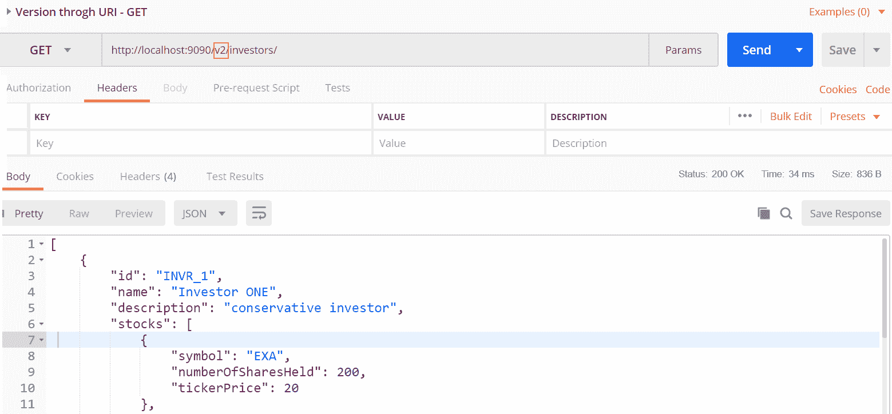

以下截图显示了 Postman 执行的 URI 路径版本控制示例。

根据版本更改 URI 路径违反了 RESTful 原则的 URI 及其资源表示（两个不同的 URI 表示相同的资源——唯一的区别是我们例子中的`v1`、`v2`等）。然而，由于实现简单，URI 路径版本控制是管理 API 版本的一种流行方式。

# 通过查询参数进行版本控制

实现版本引用的另一种简单方法是将它作为请求参数的一部分，如下面的示例所示——`http://localhost:9090/investors?version=1`、`http://localhost:9090/investors?version=2.1.0`：

```py
@GetMapping("/investors")
public List<Investor> fetchAllInvestorsForGivenVersionAsParameter(
@RequestParam("version") String version)
throws VersionNotSupportedException {
if (!(version.equals("1.1") || version.equals("1.0"))) {
throw new VersionNotSupportedException("version " + version);
}
return investorService.fetchAllInvestors();
}
```

如下是输出结果：

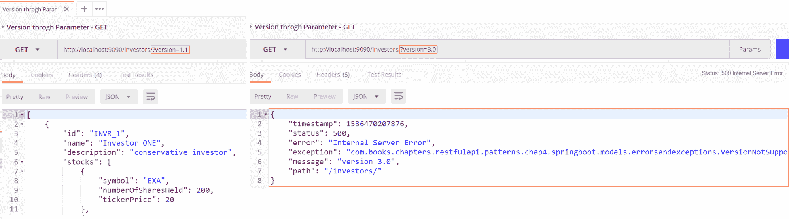

以下截图显示了在样本中通过参数进行版本控制的实现。

# 通过自定义头部进行版本控制

定义一个新的头部，该头部包含请求中的版本号，作为请求头部的一部分。自定义头部允许客户端在版本升级的情况下保持相同的 URI。这种实现方式是我们之前在第二章中看到的，*设计策略、指南和最佳实践*，我们将在下一节中再次看到。以下代码片段将帮助我们通过名为`x-resource-version`的自定义头部理解版本实现。请注意，自定义头部的名称可以是任何名称；在我们的例子中，我们将其命名为`x-resource-version`：

```py
@GetMapping("/investorsbycustomheaderversion")
public List<Investor> fetchAllInvestors...(
@RequestHeader("x-resource-version") String version)
throws VersionNotSupportedException {
return getResultsAccordingToVersion(version);
}
```

上述代码的输出如下：

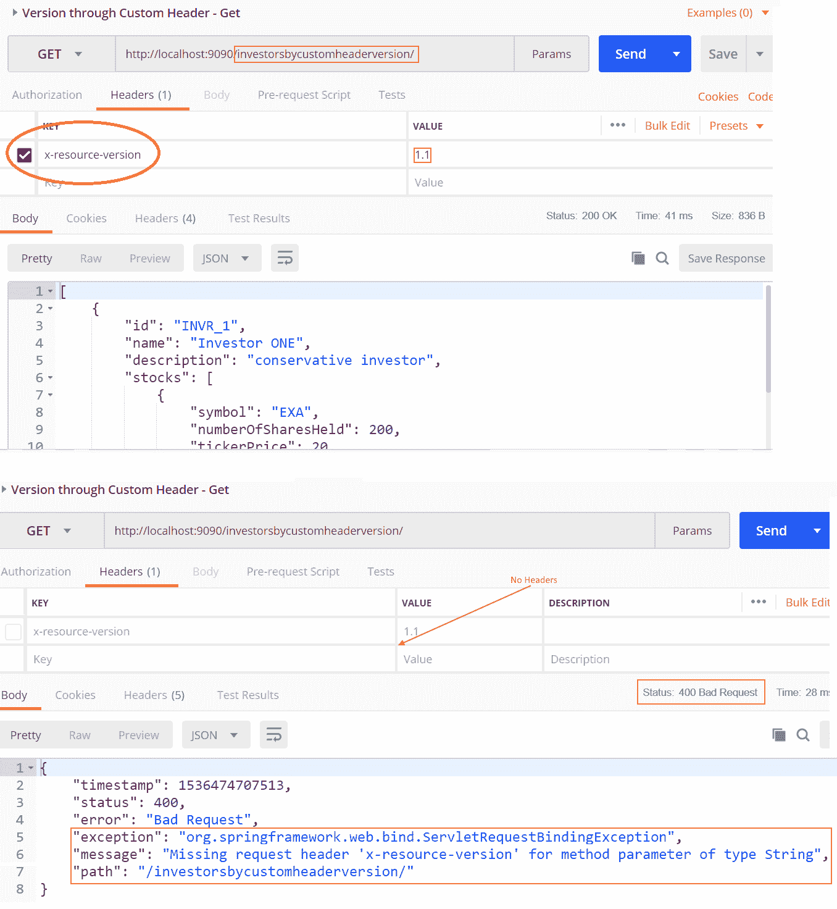

以下截图是使用`x-resource-version`自定义头部进行版本控制并使用 Postman 执行相同代码示例的示例。

# 通过内容协商进行版本控制

通过响应中的`Accept`（请求）头部以及内容类型（媒体）提供版本信息是首选方式，因为这有助于在不影响 URI 的情况下对 API 进行版本控制。正如我们在第二章中已经学到的，*设计策略、指南和最佳实践*，让我们跳转到通过 Accept 和 Content-Type 进行版本控制的代码实现：

```py
@GetMapping(value = "/investorsbyacceptheader",
headers = "Accept=application/investors-v1+json,
application/investors-v1.1+json")
public List<Investor> fetchAllInvestorsForGiven..()
throws VersionNotSupportedException {
return getResultsAccordingToVersion("1.1");
}
```

下面的截图是前面代码的输出：

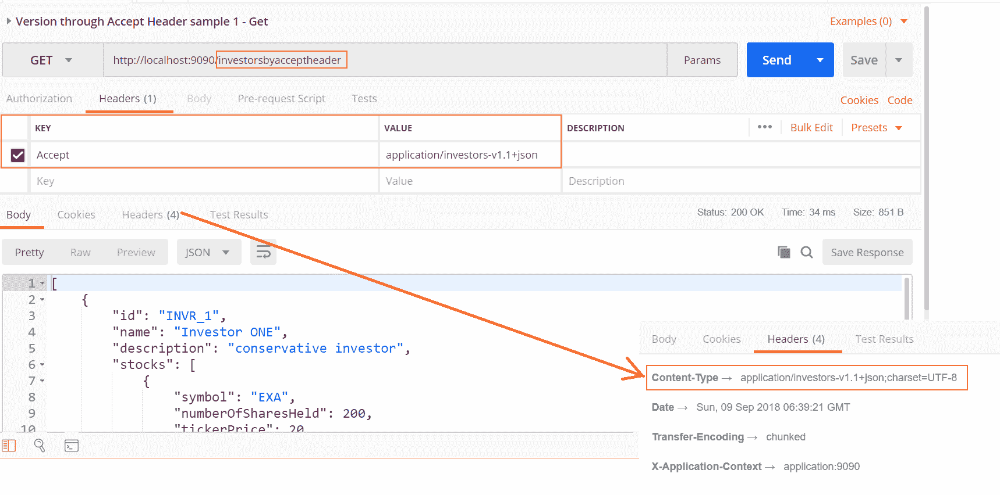

前面的截图展示了通过 Accept 头执行我们的投资者服务应用版本控制的过程。请同时注意响应头中的内容类型。

正如我们所见，每种版本控制方法都有其优缺点，因此我们需要根据具体情况确定正确的方法。然而，内容协商和自定义头是 RESTful 服务的支持者。我们将继续讨论一个重要的模式：认证和授权。

# 授权

到目前为止，我们已经构建了一个包含各种集成模式的示例应用投资者服务。现在，我们如何确保我们的 REST API 实现仅对真实用户开放，而不是对所有用户开放？在我们的例子中，投资者列表不应对所有用户可见，而股票 URI 不应向除合法投资者以外的任何人公开。这时，授权头就派上用场了。我们将使用一种称为**基本认证**的方案，因为它解决了我们当前的需求。请注意，有不同方案可供选择，例如基本认证、基于哈希的消息认证（**HMAC**）、**JSON Web Token**（**JWT**）和 OAuth 2.0 携带者认证令牌方案，这些方案都可以用于保护 REST API。然而，在本节中，我们将通过授权头实现简单的基本认证，并在第六章中详细讨论 OAuth 2.0，*RESTful 服务 API 测试和安全*。

让我们从基本认证的简单概述开始。它是一个标准的 HTTP 头（符合 RESTful API 约束），用户的凭据以 Base64 编码。凭据（用户名和密码）以用户名—密码的格式编码。请注意，凭据是编码而不是加密的，因此它容易受到特定的安全攻击，因此实施基本认证的 REST API 不可避免地需要通过 SSL（https）进行通信。

我们还需要了解认证与授权的区别。认证验证谁（用户）正在访问 API，而授权则是访问 API 的用户是否有权限或被授权访问 API 资源。在我们投资者服务示例中，管理员用户被授权查看所有投资者，而个人用户没有被授权查看其他投资者的信息。

Spring 安全框架提供了一个开箱即用的安全实现，我们将使用 Spring 提供的功能来保护我们的 API。由于我们将在第九章中讨论更多的安全实现，*深入探讨 RESTful 服务范式*，因此在本章中我们将坚持使用基本认证实现。

# 使用默认密钥的授权

通过 Spring 安全框架，使用基本认证来保护 REST API 变得异常简单。只需在`pom.xml`中添加以下条目，就可以为我们的投资者服务应用提供基本认证：

```py
<dependency>
<groupId>org.springframework.boot</groupId>
<artifactId>spring-boot-starter-security</artifactId>
</dependency>
```

现在重新构建（`mvn clean package`）应用程序并重新启动。现在是时候使用 Postman 工具测试我们的 API 了。当我们点击 URL 时，与我们的早期示例不同，我们会看到一个错误，抱怨“访问此资源需要完整授权”：

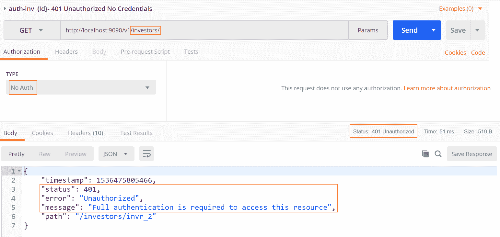

前面的错误是由于将 spring-security 添加到我们的`pom.xml`文件中。我们现在如何访问我们的 REST API 呢？别担心，在我们启动应用的控制台中，我们可以观察到使用默认安全密码的文本，或者在日志文件中搜索它。这是任何人访问我们 API 的密钥。以下截图显示了这一点：


正如我们在前面的截图中所看到的，我们的控制台显示了我们可以用来访问我们 API 的密码，因此让我们使用它来访问我们之前遇到错误的相同 URL：

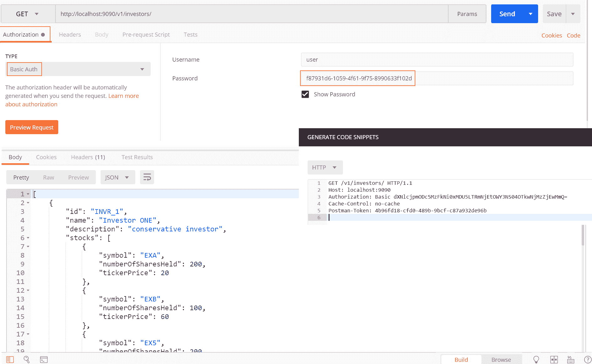

正如我们在前面的截图中所观察到的，我们需要为我们要访问的 API 提供 BasicAuth 作为 Authorization 头；我们现在将看到没有认证错误的结果。请注意，携带`XYZKL...`令牌并以前缀`Basic`开头的 Authorization 头，因为我们使用 HTTP 认证头来强制 REST API 认证。

# 使用凭证进行授权

在许多实时场景中，我们需要使用特定的凭证来访问 API，而不是默认的凭证；在这种情况下，我们可以通过使用一些额外的现成 Spring 模块来增强我们的投资者服务应用，并使用我们自定义的凭证来保护它。

在我们的投资者服务中，我们将有一个新的类，称为`PatronAuthConfig.java`，它帮助应用强制对我们要保护的 URL 进行凭证验证：

```py
@Configuration 
@EnableWebSecurity 
public class PatronsAuthConfig extends WebSecurityConfigurerAdapter { 
..... 
```

正如我们在前面的代码块中所看到的，通过几个注解，我们可以实现安全性。以下代码片段显示了覆盖方法实现以及一些代码行：

```py
@Override 
protected void configure(AuthenticationManagerBuilder authMgrBldr) throws Exception { 
  authMgrBldr.inMemoryAuthentication()                      .passwordEncoder(org.springframework.security.crypto.password.NoOpPasswordEncoder.getInstance())                  .withUser(DEFAULT_USER_ID).password(DEFAULT_USER_SECRET).authorities.... 
      } 

@Override 
protected void configure(HttpSecurity httpSec) throws Exception { 
httpSec.csrf()..... 
..... 
```

以下代码强制在每个请求中验证凭证的授权头：

```py
httpSec.csrf().disable().authorizeRequests().and()
.authorizeRequests().antMatchers(NO_RESTRICT_WELCOME_URI)
.permitAll().antMatchers("/investors/admin")
.hasAuthority(DEFAULT_ADMIN_ROLE).antMatchers("/investors/invr*/**")
.access("hasAuthority('"+DEFAULT_USER_ROLE+"')").anyRequest()
.authenticated().and().httpBasic().and().logout();
```

请注意，我们的示例使用了以下用户名和密码，以及两个角色。我们提供了示例执行脚本和 Postman 脚本，只需点击标签即可执行各种场景：

| **用户 ID** | **密码** | **角色** |
| --- | --- | --- |
| `admin` | `admSecret` | `ADMIN` |
| `user` | `usrSecret` | `USER` |

现在，请观察以下截图：

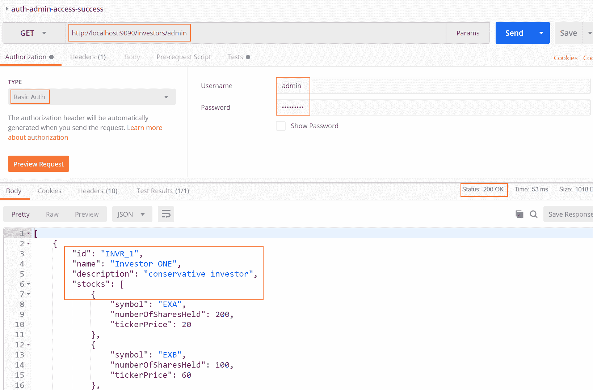

前面的截图展示了一个 REST API 调用的示例运行，该调用需要管理员凭据作为认证头，并显示了有效凭据的结果。在左侧，我们可以看到各种测试用例；每个都有一个必要的先决条件。现在我们需要逐个运行它们并观察每个案例的结果。确保查看每个执行的认证头。

第三章中投资者服务示例与这个认证示例的唯一区别在于我们添加了一个新的类，`PatronsAuthConfig.java`，它扩展了使用授权头实现的认证配置。

# 统一合同

如我们之前在*API 版本控制*部分提到的，服务将始终随着额外的功能、增强和缺陷修复而演变，然而，现在服务消费者可以消费我们服务的最新版本，而无需更改他们的实现或 REST API 端点。此外，服务消费者需要了解这些服务合同的最新和演变细节。

统一合同模式可以解决这些问题。该模式建议以下措施：

+   标准化服务合同并使其在所有服务端点上一致

+   将服务端点从单个服务功能中抽象出来

+   遵循 REST 原则，其中端点仅使用 HTTP 动词，并且仅使用 HTTP 动词表达底层资源的可执行操作

请参考*API 版本控制*部分中的 API 版本控制示例，因为实现已经可用，并且具有统一合同的味道（请参考我们的投资者服务示例，包括`GET`、`POST`、`DELETE`等操作）。

# 实体端点

如果服务客户端想要与实体（如投资者和他们的股票）交互，而不需要他们管理投资者和股票的复合标识符，我们需要一个名为**实体端点**的模式。实体端点建议将每个实体公开为它们所在服务的独立轻量级端点，以便服务消费者获得服务实体的全局可寻址性： 

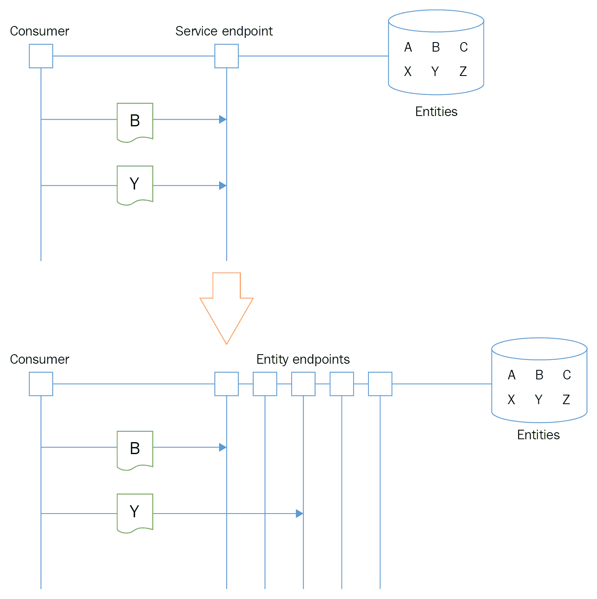

前面的截图说明了服务消费者如何访问单个实体端点而不是服务端点。实体端点公开可重用的企业资源，因此服务消费者可以重用和共享实体资源。

我们的服务，投资者服务，公开了一些实体端点，例如`/investors/investorId`和`investor/stockId`，它们是我们服务消费者可以重用和标准化的实体端点的几个示例。

# 端点重定向

改变服务端点并不总是理想的，然而，如果需要，服务客户端会知道并使用新的端点吗？是的，通过标准的 HTTP 返回代码，`3xx`，以及通过**位置**头，通过接收`301 永久移动`或`307 临时重定向`，服务客户端可以相应地行动。端点重定向模式建议返回标准 HTTP 头，并为过时的端点提供对当前端点的自动引用：

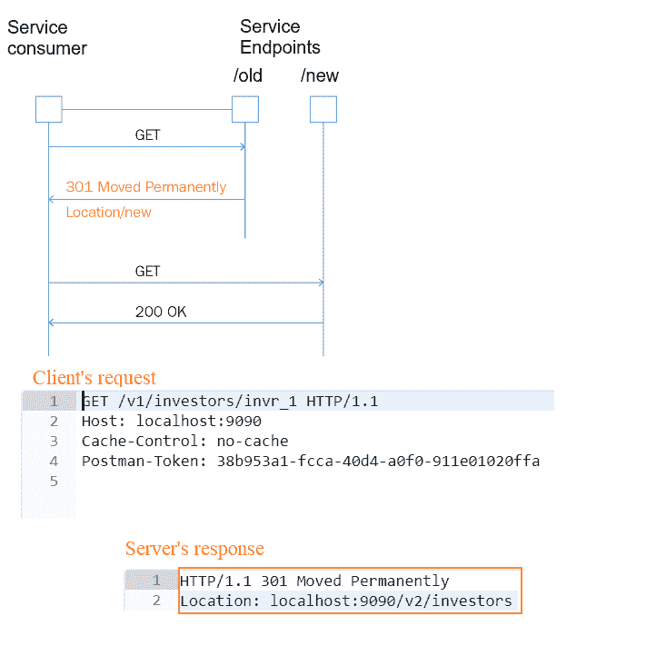

如我们所见，服务消费者可以调用在**位置**头中找到的新端点。

如果你想尝试 3xx 代码和**位置**头，请参考我们的投资者服务示例中的头实现。

请注意，在服务中实现 HATEOAS 时，客户端可以避免这些端点重定向。

# 幂等

想象一下，银行的借记 API 在从客户账户扣除一定金额后立即失败。然而，客户端并不知道这一点（因为它没有从服务器收到任何响应）并重新发出借记调用！唉，客户端损失了钱。那么服务实现如何处理消息/数据并产生相同的结果，即使经过多次调用？

无效的字典意义是*表示一个集合的元素，当它涉及某些操作或被自身操作时不会被改变*。

**幂等**是基本弹性和可扩展模式之一，因为它将分布式系统中的服务实现节点解耦。无论处理数据还是消息，服务都应该始终设计为坚持幂等性。

有一个简单的解决方案：使用 HTTP Web API 的幂等能力，其中服务可以保证由于与服务通信中断而导致的任何重复调用都是安全的，并且服务器可以无副作用地处理这些多个调用。

请参考第三章，*基本 RESTful API 模式*，以了解`DELETE`、`PUT`和`PATCH`的示例，因为这些都是幂等服务典型实现的例子；也就是说，即使我们对同一股票多次调用`DELETE`也是安全的；同样也适用于`PUT`。

当涉及到处理并发时，服务可以通过 E-Tag 增强，并发送回一个`409`冲突响应来通知客户端所调用的资源处于不一致的状态。

# 批量操作

我们已经看到了许多 REST API 模式和它们的实现。然而，我们还没有讨论 REST API 中的一个基本模式，称为**批量操作**。我们的设计应该蓬勃发展，这将减少性能瓶颈，如响应时间，以及服务器和客户端之间的往返次数。

在我们的电子邮件客户端中将一封封电子邮件标记为已读可能是一个批量操作的例子；客户选择多封电子邮件标记为`已读`，然后通过一次 REST API 调用完成工作，而不是多次调用底层 API。

让我们来看看我们的投资者服务 API：如果客户端想要为他们的投资组合创建一组股票而不是一个接一个地创建，客户端需要根据他们想要创建的股票数量多次调用我们的 REST 端点。如果他们需要更新 100 个股票，他们需要调用端点 100 次，这确实不是一个优雅的解决方案。在这种情况下，批量操作模式可以提供帮助，而不会违背 REST 原则。让我们看看我们的投资者服务如何修改以提供批量操作。

投资者服务接受单个元素的`PATCH`操作，我们需要考虑增强相同的资源以接受多个插入，或者我们可以有另一个独立的 URI 来支持批量操作。为同一资源使用另一个 URI 不是一个干净的方法，因为它可能偏离了 RESTful 原则，因此让我们继续使用相同的`PATCH`请求来支持通过请求更新多个股票。以下两种方法被建议用于实现批量操作：

+   基于内容的批量操作

+   基于自定义头操作标识符的批量操作

我们的代码示例遵循两种方法；请注意，我们不会使用框架提供的注解的任何特定细节来执行批量操作。然而，我们继续使用自定义头和增强的请求体来支持客户端请求中的股票列表。以下截图显示了非批量操作和批量操作补丁请求以及头部的差异：

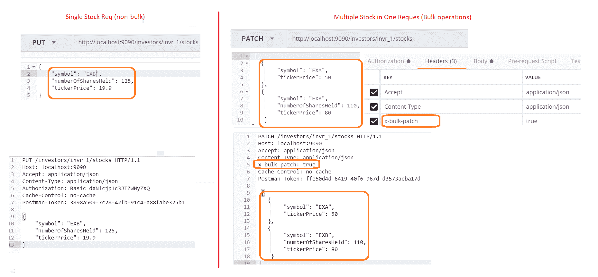

以下是从`InvestorController`类中的代码片段，它强制执行自定义头，与第三章中的`PUT`示例（仅接受一个`Stock`对象）不同，*Essential RESTful API Patterns*（接受一个`Stock`对象）：

```py
@PatchMapping("/investors/{investorId}/stocks") 
  public ResponseEntity<Void> updateStockOfTheInvestorPortfolio(@PathVariable String investorId, @RequestHeader(value = "x-bulk-patch") Optional<Boolean> isBulkPatch,                  @RequestBody List<Stock> stocksTobeUpdated) throws CustomHeaderNotFoundException { 
            // without custom header we are not going to process this bulk operation 
            if (!isBulkPatch.isPresent()) { 
                  throw new CustomHeaderNotFoundException("x-bulk-patch not found in your headers"); 
            } 
      investorService.bulkUpdateOfStocksByInvestorId(investorId, stocksTobeUpdated); 
            return ResponseEntity.noContent().build(); 
      } 
```

通过运行我们的`PATCH`示例，我们可以通过在一个请求中分组多个项目来理解 RESTful API 的批量操作。请注意，批量操作可能涉及许多其他方面，例如 E-tag、异步执行或并行流实现以使其有效。然而，我们在这里不涉及这些特殊主题，并鼓励读者参考*资源、参考文献和进一步阅读*部分以获取资源。

批量操作与批量操作

批量操作处理单个请求中的单个目标操作，该操作涉及单个请求中的多个业务对象列表，而批量操作（本章未涉及）处理异构和同构的业务对象列表，但涉及多个请求。

# 电路断路器

我们经常遇到断路器；断路器是一种自动开关，旨在保护整个电路免受短路或过载引起的过电流负载损坏。

当服务与其他许多服务交互时，同样适用此概念。任何（网络）问题导致的故障都可能在整个应用程序中产生灾难性影响，防止级联影响是断路器模式的唯一目标。因此，此模式有助于子系统优雅地失败，并防止子系统故障导致整个系统完全失败：

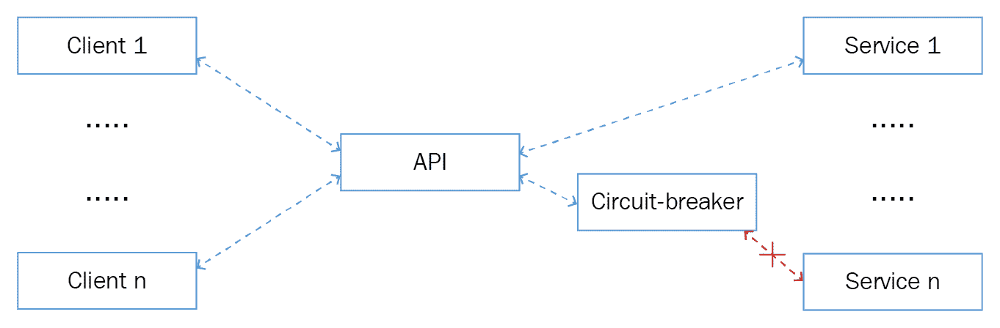

上一张截图说明了断路器概念，其中一个下游服务无法通信。然而，断路器实现以这种方式处理它，使得**API**继续为多个客户端提供服务。

在我们深入实施之前，让我们了解构成断路器的三个不同状态：

+   **关闭**：这是指所有服务连接都完好无损（关闭），所有呼叫都通过预期服务进行。此状态需要跟踪故障以确定阈值限制。如果故障数量超过阈值限制，服务将移动到开启状态以避免级联影响。

+   **开启**：服务的开启状态负责返回错误，而实际上并不执行其预期功能。

+   **半开启**：一旦服务进入开启状态，它应该定期（超时）检查导致服务处于开启状态的故障。此外，如果这些故障仍然发生，它将继续保持服务处于开启状态，直到下一次检查。如果不再检测到故障，此状态的责任是触发回关闭状态以实现连续功能。

是时候动手实现断路器了。我们将使用 Spring 注解，以及一个名为**hysterix**的极其强大的开源库，我们可以用很少的努力实现整个概念。

我们需要至少有两个服务来解释断路器实现，因此我们正在创建断路器服务和断路器消费者服务，这些服务将实现断路器模式。以下部分阐述断路器的投资者服务实现。

启动我们已开发的任何服务，或者，为了简化，我们有一个名为**断路器服务**的轻量级服务，请注意，此服务没有针对断路器的特定实现。

现在是实施关键部分的时候了；即，一个名为**断路器服务消费者**的新服务，它将包含所有必要的断路器实现，以及对我们第一个服务（断路器服务）的调用。让我们执行以下步骤：

将 hysterix 依赖项添加到我们的 `pom.xml` (`circuit-breaker-service-consumer/pom.xml`)：

```py
<dependency>
<groupId>org.springframework.cloud</groupId>
<artifactId>spring-cloud-starter-netflix-hystrix</artifactId>
<version>2.0.1.RELEASE</version>
</dependency>
```

注释 `InvestorController` 以启用断路器并引入一个新的方法供我们测试 (`circuit-breaker-service-consumer/com/**/InvestorController.java`)：

```py
@EnableCircuitBreaker @RestController
public class InvestorController {
@Autowired
private InvestorService investorService;
// call the downstream service circuit-breaker-service@GetMapping(value="/welcome", produces="text/plain;charset=UTF-8")
public String welcomePageWhichProducesCharset() {
return investorService.circuitBreakerImplWelcome();
}
```

使用 *Hystrix* 命令并为断路器实现创建一个方法以及一个回退方法，如下面的代码块所示。我们将有两个方法：一个用于实际调用 (`InvestorService.java/circuitBreakerImplWelcome`)，另一个用于回退 (`InvestoreService.java/welcomeUrlFailureFallback`)，以便在实际调用出现故障时，应用程序将调用回退方法：

```py
 @HystrixCommand(fallbackMethod="welcomeUrlFailureFallback") public String circuitBreakerImplWelcome() {
logger.info("reached circuit breaker consumer circuit breaker impl");
RestTemplate restTemplate = new RestTemplate();
URI circuitBreakerServiceURI = URI.create(CIRCUIT_BREAKER_SERVICE_URL);
return restTemplate.getForObject(circuitBreakerServiceURI, String.class);
}
// fall back method for welcome page failures
public
 String
 welcomeUrlFailureFallback
 (){ logger.info("lucky we have a fallback method");
return WELCOME_URI_FALLBACK_MESG;
}
```

太酷了，不是吗！使用 *Hystrix* 实现断路器就这么简单。现在，让我们按照以下步骤构建和运行我们的服务：

1.  打开一个终端并构建 circuit-breaker-service (`mvn clean package` of circuit-breaker-service)

1.  启动 circuit-breaker-service

1.  打开一个新的终端并构建 circuit-breaker-service-consumer

1.  启动 circuit-breaker-service-consumer

1.  打开 Postman 并运行 `http://localhost:9090/welcome`

1.  观察日语欢迎文本

1.  现在，执行断路器实验

1.  停止我们在步骤 2 中启动的 circuit-breaker-service

1.  再次运行步骤 5，现在观察英文消息

是的，断路器回退已被激活，因此我们看到的是英文消息，而不是日语消息，因为 circuit-breaker-service 已经宕机。然而，`/welcome` URI 并未中断。

以下截图捕捉了验证断路器实现的各个阶段：

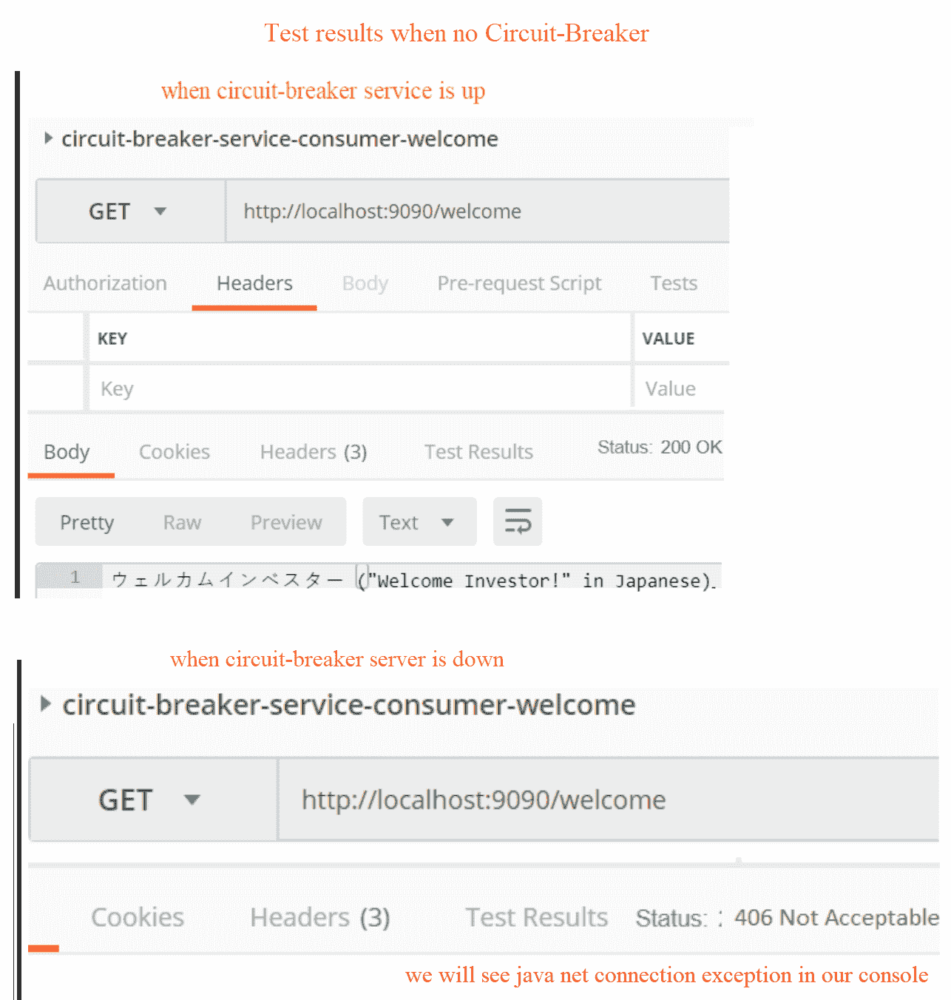

以下截图是这一过程的另一个阶段：

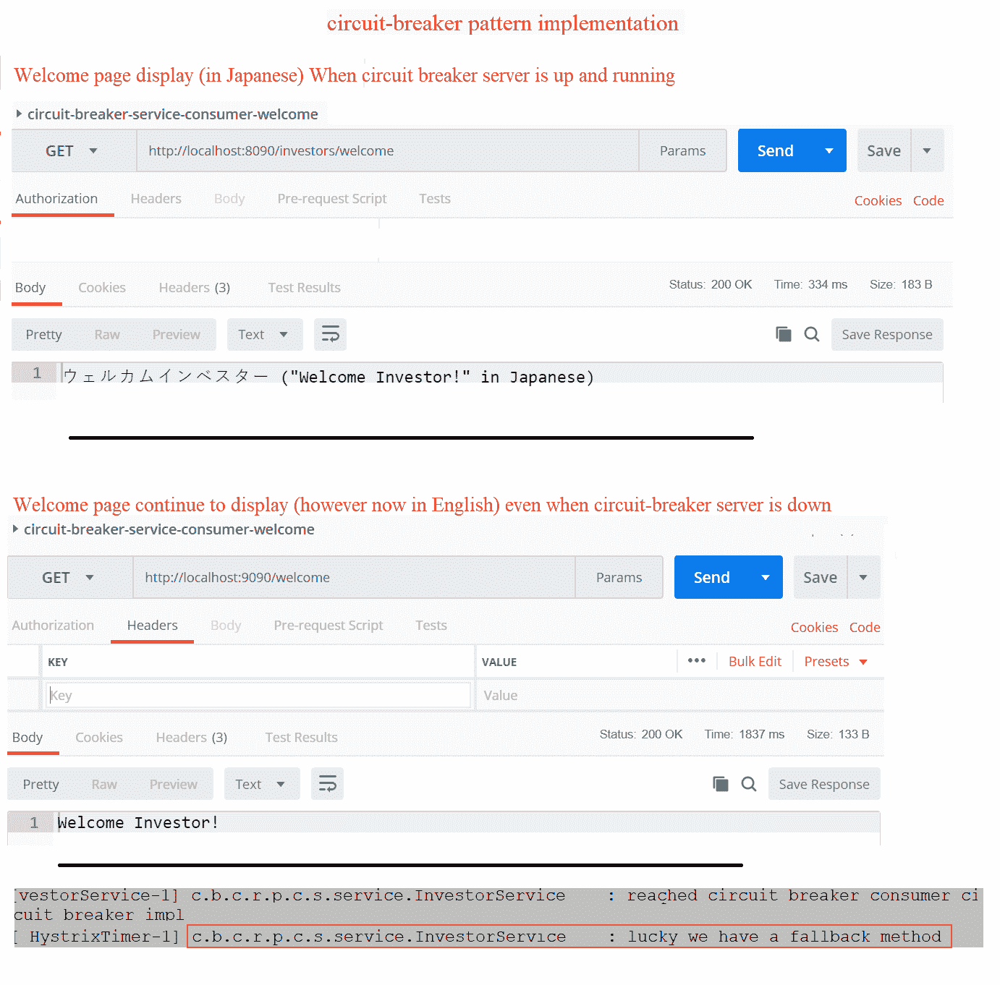

如前述截图所示，在断路器实现之前，`/welcome` 调用失败并显示控制台连接错误消息。然而，在实现断路器之后，相同的调用显示了回退方法的内容，尽管与 circuit-breaker-service 的连接仍然失败。

鼓励读者和设计师测试并增强 circuit-breaker-consumer，为其他方法调用添加更多的回退方法。

断路器模式的缺点是，涉及的应用程序/服务可能会经历轻微的性能下降。然而，这对于许多实际应用来说是一个很好的权衡。

# 结合断路器模式和重试模式

作为软件设计师，我们理解优雅地处理应用程序失败和故障操作的重要性。通过结合重试模式和断路器模式，我们可以获得更好的结果，因为它为应用程序处理故障提供了更大的灵活性。

重试模式使应用程序能够重试失败的操作，预期这些操作将变得可用并最终成功。然而，这可能导致我们的应用程序中出现**拒绝服务**（DoS）攻击。断路器模式防止应用程序执行可能失败的操作。那么，一个对断路器返回的任何失败都敏感的智能重试机制如何？这表明没有瞬态故障，因此应用程序放弃任何进一步的重试尝试。

# API 门面

我们从《设计模式：可复用面向对象软件的基础》（GoF）中了解到名为**门面**的模式，该模式将复杂的子系统从调用者抽象出来，只向最终用户暴露必要的细节作为接口。API 门面也符合相同的定义和实现。

让我们看一下以下图表，它描述了客户端在有和没有 API 门面模式实现的情况下，对多个服务调用的简单实现：

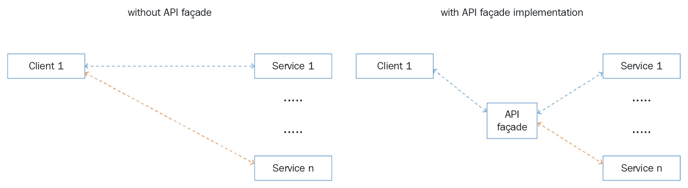

正如我们在前面的图表中看到的那样，客户端调用一个 API 门面以使其在客户端需要多个服务调用的情况下更简单、更有意义。然而，这可以通过单个 API 端点来实现，而不是客户端调用多个端点。API 门面提供了高可扩展性和高性能。

我们的投资服务为其删除操作实现了一个简单的 API 门面。正如我们之前看到的那样，删除方法调用设计意图方法。然而，我们通过引入一个简单的接口到我们的投资服务中，将*设计意图*方法抽象为调用者。这使门面出现在我们的 API 中。

删除服务的接口如下所示：

```py
public interface DeleteServiceFacade {
 boolean deleteAStock(String investorId, String stockTobeDeletedSymbol);
    boolean deleteStocksInBulk(String investorId, List<String> stocksSymbolsList);
} 
```

删除服务接口的实现如下代码片段所示：

```py
@Component
public class DeleteServiceFacadeImpl implements DeleteServiceFacade {
   private static final Logger logger = LoggerFactory.getLogger(InvestorService.class);
   private InvestorServicesFetchOperations investorServicesFetchOperations = new InvestorServicesFetchOperations();
       @Override
       public boolean deleteAStock(String investorId, String stockTobeDeletedSymbol) {
             boolean deletedStatus = false;
             Stock stockTobeDeleted = investorServicesFetchOperations.fetchSingleStockByInvestorIdAndStockSymbol(investorId,
                          stockTobeDeletedSymbol);
             if (stockTobeDeleted != null) {
                    Investor investor = investorServicesFetchOperations.fetchInvestorById(investorId);
                    deletedStatus = investor.getStocks().remove(stockTobeDeleted);
             }
             designForIntentCascadePortfolioDelete(investorId, deletedStatus);
             return deletedStatus;
      }
.....
.....
```

作为一项简单的练习，我们鼓励读者将我们的断路器服务调用实现为 API 门面，并在删除服务中完成批量删除方法。

# 前端后端

到目前为止，我们已经开发了各种 RESTful 服务 API 和端点，以便任何应用程序开发者都可以开始使用它们。然而，我们需要确保这些服务将满足各种类型的设备，因为它的真正目的是为使用任何设备的任何客户提供服务，而不仅仅是桌面用户或基于 Web 的应用程序。

在任何设备上提供更好的用户体验至关重要，无论其后台服务如何，如果我们不能为异构的最终用户及其设备提供更好的使用这些服务的机制，那么掌握所有可能的最佳实践开发 RESTful 服务也就变得毫无意义。

**后端为前端**（**BFF**）是一种模式，最初由 Sam Newman 描述；它有助于弥合任何 API 设计差距。BFF 建议在用户体验与其调用的资源之间引入一个层。它还帮助 API 设计者避免为多个接口定制单个后端（服务）：

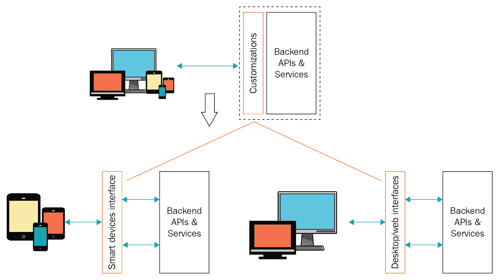

上述图表展示了 BFF 模式的一个简单实现，即针对桌面和移动设备都提供专属接口。每个接口都可以定义其必要的和独特的需求，以满足前端需求，而无需担心影响其他前端实现。

让我们考察每个接口的几个具体要求，以便我们了解为什么我们需要为相同的后端服务拥有多个接口：

+   响应负载的格式和大小可能因每个客户端而异

+   由于需要调用服务的次数较多，可能会出现性能瓶颈和优化需求

+   当需要共享或通用后端服务，但开发和维护开销较少时

在某些情况下，如多个接口向后端发送相同的请求，或仅使用一个接口与后端服务交互时，BFF 可能不适用。

请注意，BFF 存在一些缺点，因此在决定使用独立的、专属的 API/接口时，请谨慎行事，因为它需要额外的、终身的维护，包括在各个层级上的安全改进、额外的定制设计，这可能导致安全漏洞和缺陷泄露。

# 摘要

通过几个代码示例学习模式总是能给我们带来深刻的见解。在本章中，我们讨论了 API 版本控制、使用授权保护 API，以及通过统一合同、实体端点和端点重定向实现来使服务客户端具备一致性。我们还学习了幂等及其重要性，它为 API 提供了批量操作的能力。本章最重要的部分是使用 Hysterix 实现的断路器，其中我们设想并实现了 API 设计的弹性模式。

在介绍了各种高级模式后，我们以 BFF 模式结束了本章，并学习了它是如何通过帮助开发团队为特定环境开发专属接口来减少跨实现团队中的 churns（不稳定）。

在下一章中，我们将介绍 RESTful API 网关，这应该对 API 设计者来说同样是一个令人兴奋的阅读材料。

# 进一步阅读

+   RESTful Java 模式和最佳实践：[`www.packtpub.com/application-development/restful-java-patterns-and-best-practices`](https://www.packtpub.com/application-development/restful-java-patterns-and-best-practices)
