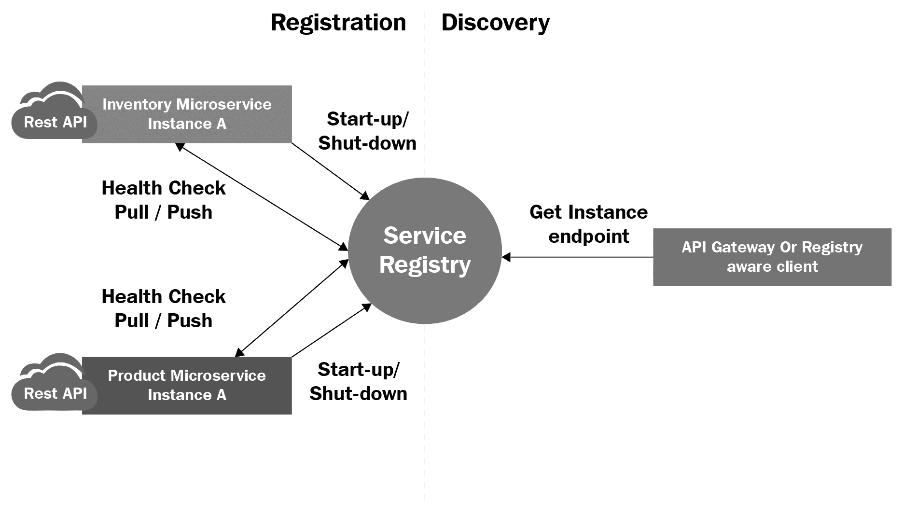
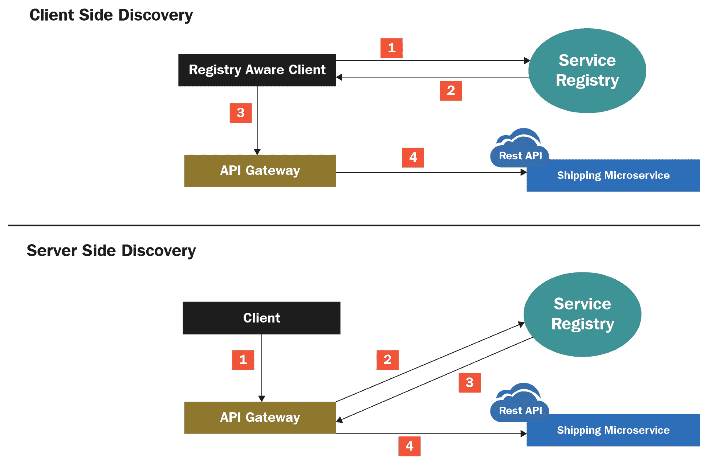
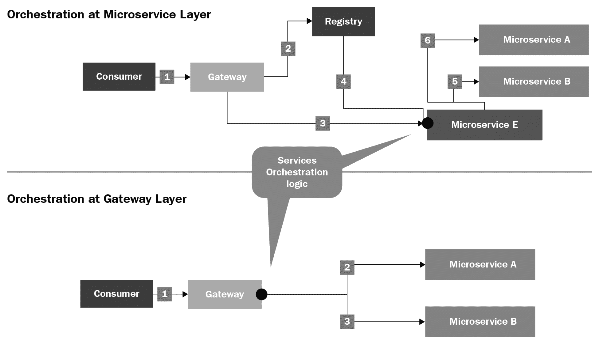
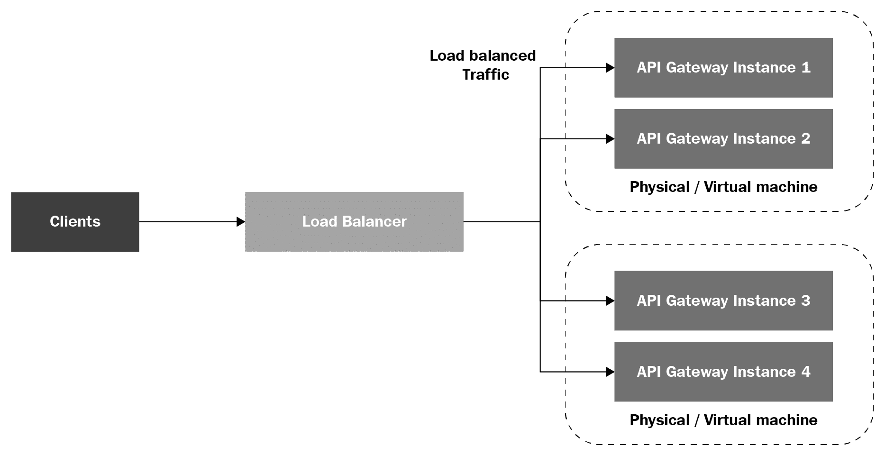
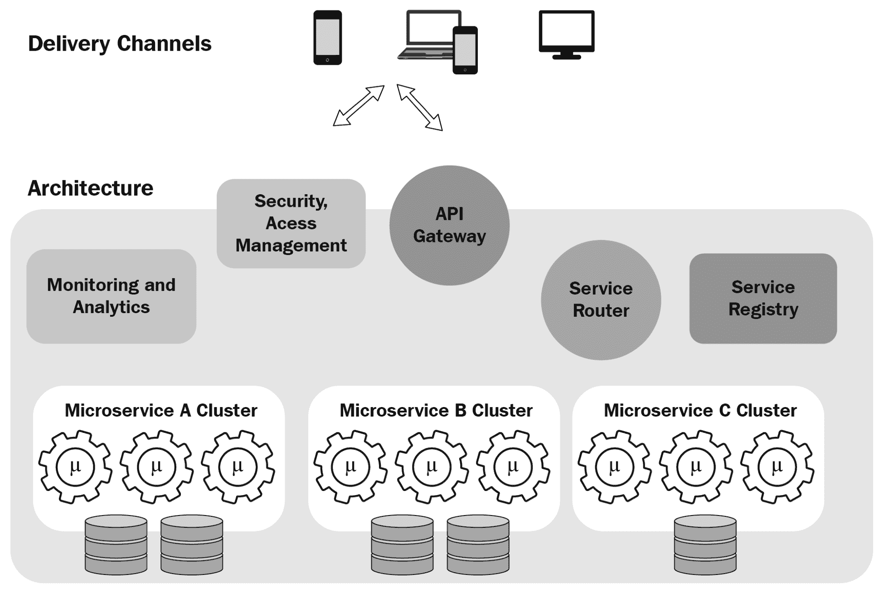
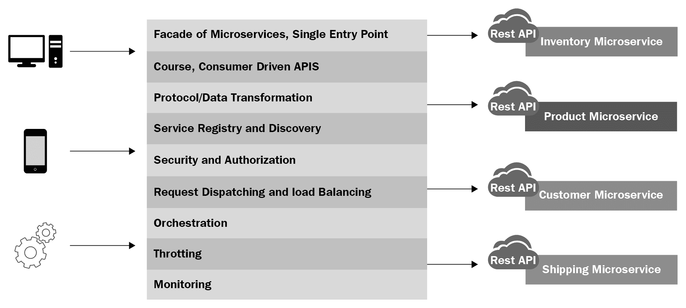
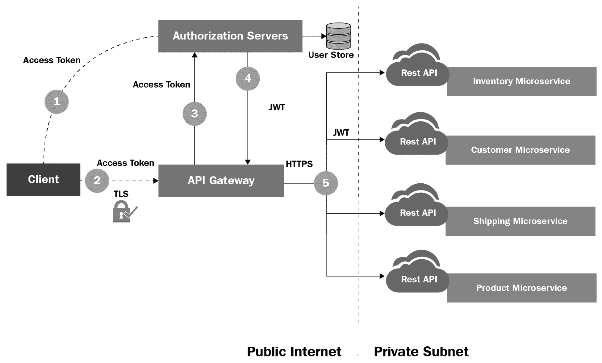
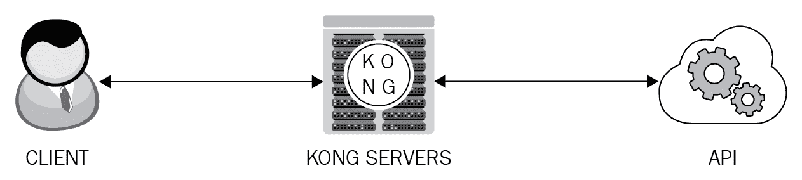
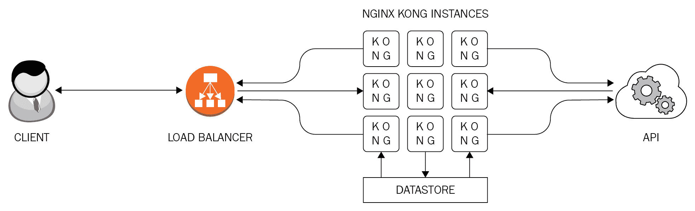

# 第五章：微服务 API 网关

由于微服务通常是细粒度的，任何大型应用都必须由许多微服务组成。在 IT 环境中拥有数百个微服务，IT 复杂性必然会增加。微服务的运营、监控、测量和管理复杂性肯定更大，因此，利用 API 网关的想法应运而生，并蓬勃发展，不仅是为了减轻不断上升的复杂性，而且是为了从微服务源代码中抽象出所有类型的通用能力。在本最佳实践章节中，我们解释了 API 网关在微服务时代的作用和责任。进一步来说，你还可以看到如何通过智能利用 API 网关基础设施来确保微服务应用的可靠性。

# 技术要求

本章主要讨论 API 网关解决方案对微服务成为企业级、关键任务、云托管、面向服务、事件驱动、创新丰富、流程感知、生产级和业务中心应用正确且有益成分的关键贡献。我们本章讨论了流行的 API 网关解决方案。我们还通过 API 网关实现了一个聚合服务。微服务（订单服务、客户服务和聚合服务）的源代码存放在本书的 GitHub 上。本书的 GitHub 链接是 [`github.com/PacktPublishing/Hands-On-RESTful-API-Design-Patterns-and-Best-Practices`](https://github.com/PacktPublishing/Hands-On-RESTful-API-Design-Patterns-and-Best-Practices)。

# 关于微服务架构

传统应用缺乏灵活性，封闭，单体，庞大，还有更多。引入业务和技术变更会遇到许多问题和风险。第三方服务集成是一项艰巨的任务。为传统系统增加如 Web、移动和云等额外接口也是另一项困难。如今，出现了多种接入渠道，我们的应用需要具备与多个渠道协同工作的内在能力。在未来，企业将从他们的 IT 团队和合作伙伴那里要求更多，而付出更少。简而言之，传统应用的开发和运营复杂性过大，难以承受。**微服务架构**（**MSA**）旨在实现规模化的速度和安全，MSA 生态系统持续增长，提供大量技术、工具和框架，以高效实施各种业务应用和 IT 服务。这种方法将 IT 提升为可行的增值业务合作伙伴。也就是说，以业务为中心的 IT 因 IT 领域的众多显著进步而成为新常态。之前持有的观点（IT 以成本为中心）正在迅速改变，IT 正自豪地宣布为以利润为中心的范式。

基于微服务架构的任何软件应用都仅仅是由一系列小型、模块化且易于管理的服务组成。每个服务都在一个独特的进程中运行，并通过定义良好的 API 进行通信。RESTful 接口是服务之间寻找、绑定和使用彼此最流行且轻量级的入口。API 驱动的微服务能够与业务无缝对接，以敏捷的方式应对变化，与业务变化匹配敏捷响应，并以去中心化的方式提供解决方案。微服务可以独立部署，水平扩展，可组合，互操作，公开可发现，网络可访问，技术无关，模块化（松散耦合且高度内聚），细粒度，等等。容器化和微服务的结合为企业和技术专业人士带来了巨大的节省和好处。各种微服务正在有条不紊地容器化，并在**裸金属**（**BM**）服务器和**虚拟机**（**VMs**）上托管。容器轻量级的特性以及以业务为中心和特定目的的微服务为商业世界带来了许多关键优势。还有其他技术进步，如容器编排和管理解决方案，以形成容器/服务集群，实现多容器、业务感知、任务关键、自适应和复合应用。

随着微服务的兴起并成为设计、开发、部署和管理生产级商业应用程序和 IT 平台的简单且最优构建块，现有的单体应用程序正在被细致地分割成多个互动和有洞察力的微服务。经过验证的“分而治之”技术现在仍然表现良好，甚至通过 MSA 难题也是如此。这些独立但相互关联的微服务可以分别推进和部署，而不会影响其他微服务。因此，在商业、技术和用户方面都有许多优势，因此商业高管、技术专业人士和 IT 运营商都热衷于采用 MSA。新的应用程序正在使用 MSA 的显著特性从头开始构建。在接下来的章节中，我们将看到 API 网关基础设施对于实现微服务架构预期成功的重要性。

我们在本书的其他章节中，通过大量的实际例子，讨论了 RESTful 服务范式广泛的成功。其核心在于，RESTful API 允许消费者/用户应用通过适当选择链接（资源），例如`/product/book/`，以及通过特定的 HTTP 操作（方法），例如`GET`、`DELETE`、`POST`或`PATCH`，来在应用程序（网页、云、移动、商业、物联网等）中前进。这导致下一个资源，实际上代表了应用程序的下一个状态。REST 代表表示性状态转移。并且这种新状态被传输给消费者，以便其后续使用。

# 微服务为中心的应用程序中的突出基础设施模块

水平扩展和独立部署被吹捧为微服务的关键特征。微服务和它们的实例可以轻松复制、替换、重构和恢复，以适应传入的流量。新的应用程序正在被设计、开发和部署为微服务，而遗留应用程序正在被系统地分割成一组协同工作的微服务。因此，很明显，MSA（微服务架构）是下一代软件应用的主要架构模式和风格。在本节中，我们将讨论 MSA 合规系统的关键基础设施组件。

# 服务注册

微服务正变得越来越动态和广泛分布。因此，为了利用微服务并实现服务发现（静态和自动），我们需要一个集中的服务注册/存储库机制。服务注册旨在跟踪已注册的微服务实例，以便提供关于服务和它们最新位置的正确信息。这个注册表相当于一个数据库，用于准确包含和维护服务实例的网络位置。如果发生移动，那么微服务必须主动接近并更新服务注册表。API 网关在接收到客户端微服务的请求后，会连接并尝试获取服务微服务的位置详情。如果存在任何偏差或不足，那么可能会出现不希望的失败。每个微服务实例在启动时都必须向集中式服务注册表进行注册，并在关闭时进行注销。服务实例的注册通常通过心跳机制定期刷新。服务注册模块必须高度可用，为此，最推荐的方法是拥有服务注册模块的集群。不建议在 API 网关或注册感知客户端缓存从注册表中获得的网络位置详情。如果在 API 网关缓存位置详情，那么可能会降低 API 网关的性能。微服务实例更新注册表关于其变化状态（可用性）的责任是唯一的。服务注册的作用在以下图中说明：

微服务、服务注册和 API 网关的交互

# 服务发现

我们解释了当确定微服务和其实例的位置细节时，服务注册解决方案如何派上用场。在单体应用程序中，查找和调用应用程序组件是通过语言级别的一种方法完成的。如果应用程序组件在不同的进程空间中运行，那么有远程方法调用（RMIs）、远程过程调用（RPCs）、分布式组件对象模型（DCOM）等。在传统的遗留 IT 环境中，应用程序在固定的和已知的地点运行。也就是说，主机和端口是固定的，以便被发现和使用。因此，应用程序可以轻松地使用任何一种标准通信和数据传输协议相互调用。然而，在敏捷且擅长的微服务时代，微服务和其实例的数量经常变化。进一步来说，为了实现期望的优化，微服务和其实例正在其他位置重新部署。因此，客户端微服务需要使用高级服务发现机制来了解微服务实例的最新状态。为了简化，有两种主要的服务发现模式——客户端发现和服务器端发现。

对于客户端发现，客户端将从服务注册表中获取服务实例的位置，因为注册表包含了所有服务最新位置的信息。客户端知道**服务注册表**的地址。然后，客户端使用负载均衡算法选择最佳服务实例并发出请求。

对于服务器端发现，**客户端**向**API 网关**发起请求。然后，API 网关查询**服务注册表**以获取所需微服务的网络位置。基于该位置信息，API 网关尝试连接并利用为微服务提供服务的能力。

以下图表说明了客户端和服务器端服务发现的区别：

# 组合/编排

微服务主要实现业务功能。为了创建复合型、以业务为中心且具有流程感知的应用程序，微服务必须相互连接。为确保组合，有两种方法——编排和协奏。此外，还有静态和动态的组合。API 网关可以充当编排模块。另一种选择是编写编排逻辑并将其作为独立的实用服务。以下图表清晰地描述了服务编排如何构建复合服务，这些服务具有流程感知性和业务中心性：

# 转换

有几种不同类型的，例如物联网设备上的客户端应用程序、资源受限设备的浏览器、Web 和移动应用程序等。随着输入/输出设备生态系统的持续增长，任何应用程序和服务的客户端都必须单独处理。异构设备上的客户端应用程序遵循不同的数据表示、交换和持久化格式。此外，它们遵循不同的数据传输协议。然后还有同步和异步通信协议。在异构环境中，数据格式和协议转换的需求必然会增加。API 网关可以非常方便地促进转换和其他转换需求。可以根据新兴需求新鲜烘焙的转换适配器，并存储在集中位置以便随时找到和使用。对于无特定目的和特定设备，最优的数据格式和协议正在不断开发；需要新的数据和服务协议转换器，以便它们能够加入主流计算。

# 监控

监控系统资源和微服务对于实现 MSA 的原始效益变得至关重要。有服务和应用程序监控工具。由于大多数微服务正在容器化，容器监控工具最近获得了突出地位。甚至还有针对 Kubernetes 的监控工具，它已经成为容器生命周期管理平台的顶尖选择。鉴于本章专门准备来解释关于 API 网关的一切，讨论 API 网关监控是合乎逻辑的。API 网关对于微服务成功提供各种功能至关重要。每个服务请求/响应都会通过它们路由。API 的操作、性能、健康状况、可伸缩性、安全性和日志数据的监控和测量对于满足约定的 SLA 和 OLA 参数至关重要。强烈要求的健康监控是为了确保网关始终处于运行状态。监控对于确保服务可靠性和稳定性是必不可少的。可观察性方面对于服务的可用性、适应性和分析至关重要。为了精确监控系统的健康状况，处理能力、内存容量和 I/O 速率（网络和存储）等资源参数是主要关注点。其他需要精确监控和测量的重要事项包括连接性（网络）、安全警报、安全备份、恢复（数据和灾难）等。最后，日志数据在为相关方提供大量有用和可用的信息，以巩固和塑造业务连续性的独特目标方面发挥着非常重要的作用。

另一个重要的因素就是流量监控。收集和深入分析流量数据将使运维团队能够及时考虑、思考并实施正确的措施，具有清晰和自信。必须忠实考虑的基本指标包括在一定时间内发送给 API 的总请求数量、性能/吞吐量值、接收到的成功和异常消息数量、API 网关阻止的消息数量等。此外，还会考虑请求分类。这种深入而巧妙的分析有助于更准确地预测流量情况，以便在没有任何故障或减速的情况下处理任何类型的峰值和激增。

# 负载均衡和扩展

这是确保软件系统扩展可用性的重要因素。通过利用**负载均衡器**（**LB**）（软件或硬件）来实现应用可扩展性（水平扩展）的目标。我们需要流量信息来及时预测和制定正确的对策。对流量数据的更深入实时分析有助于我们理解和估计应用的负载。从负载数据中获得的见解帮助云管理员和运维团队共同简洁地制定可行的应用可扩展性政策和规则。可以及时准备额外的基础设施模块，以便承担额外的负载。API 网关也可以进行水平扩展和垂直扩展，以确保 API 网关解决方案的高可用性。否则，API 网关可能会成为单点故障。为了有一个集群化的 API 网关设置，我们可以在 API 网关前面放置一个 LB。这意味着可以利用多个 API 网关解决方案的实例来确保连续性，所有这些实例都可以运行相同的配置；这种一致性有助于虚拟化相同的 API 并执行相同的策略。如果有多个 API 网关组，那么能力（负载均衡）可以优雅地扩展并准确地在组间完成。

API 网关不对负载均衡器（LBs）提出任何额外要求。也就是说，用户和数据负载是基于广泛推荐的特征进行平衡的，包括响应时间、当时系统的负载等。API 网关以无状态的方式维护，以确保它们不会被状态信息拖累。这也使得服务消息可以采取任何路线到达适当的和指定的服务。一些突出的组件，如缓存和计数器，通常存储在分布式缓存中，会针对每条独特的消息进行细致的更新。这种设置最终有助于 API 网关在所有模式下（粘性和非粘性）无任何问题地完成其义务。

API 网关的分布式特性在主动/主动和主动/被动集群中带来了一定的限制。例如，为了丢失任何计数器和缓存状态，系统必须设计成在任何时候至少有一个 API 网关处于活动状态。精确地说，为了确保高可用性和可靠性，正如之前所指出的，必须以连接和集群的方式运行多个 API 网关实例。API 网关能够通过稳定和连续的配置部署来保持零停机时间。通常，集群中的 API 网关实例需要几秒钟来更新其配置。在更新时，该特定实例不会处理任何新的请求。然而，集群中的其他 API 网关实例可以不断地接收和处理新的请求，并交付结果。**负载均衡器（Load Balancer**）在这里的关键作用是确保所有入站请求都推送到接收和处理新请求的正确 API 网关实例。因此，API 网关集群对于持续接收和响应服务消息非常重要，**负载均衡器**在满足这一需求中扮演着至关重要的角色，如下面的图示所示：

# 高可用性和故障转移

在微服务时代，通过容错、故障检测和隔离来保证高可用性对于架构师来说是一件重要的事情。在最近的一段时间里，API 网关解决方案作为微经济时代的一个关键组件应运而生。微服务架构被誉为促进强制业务适应性、流程优化和自动化的灵魂和救星。API 网关是微服务之间寻找和交流的唯一入口，以完成业务任务。这种代理/中间件解决方案拥有许多常用功能，以便微服务只需关注业务功能。**非功能性需求（NFRs**）和**服务质量（QoS**）属性是通过网关解决方案实现的。为了实现高可用性和稳定性，推荐的做法是将 API 网关以**高可用性（HA**）模式部署。正如之前所述，API 网关实例通常部署在标准负载均衡器（LB）之后。LB 持续探测 API 网关实例，以了解它们是否处于活动状态。每个实例的健康状况和性能水平被 LB 捕获并用于及时采取适当的补救措施，以确保系统连续性不受任何影响。如果 LB 得知某个 API 网关无法正常工作，那么 LB 将重定向和路由入站流量到正在运行并履行其义务的网关实例。

配置了及时警报，以便在发生意外事件时获得相关通知。如果触发警报，则可以理解问题及其元数据，因为数据分析能力是任何 API 网关产品的重要功能。通常，API 网关被保持为无状态实体，因为它们被设计和注定要每秒处理数百万个服务请求消息。然而，API 网关可以维护缓存数据，这些数据可以在 API 网关集群之间复制。这种安排有助于维护 API 网关实例之间的对等关系。

# 高可用性和故障转移指南

专家们制定了一系列指南和最佳实践，以确保系统的可用性高：

+   为了保证最大可用性，API 网关必须使用经过验证的主动/主动模式。

+   对流量数据进行更深入和决定性的分析是必要的。这种分析得出的见解帮助操作员和其他维护生产环境的人员进行规划和防范消息洪水。

+   工具支持的自动化网络基础设施监控和管理对于确保最高可用性至关重要。不仅收集操作和日志数据，而且对这些数据进行各种调查可以揭示大量有用和可用的信息。因此发现和传播的所有知识对于使网络基础设施在最佳和原始状态下工作大有裨益。API 网关解决方案内嵌的分析功能在分析和阐述防止任何类型故障和失误的措施方面非常方便。还有特定的以及通用的监控工具，可以与知识可视化/报告生成工具集成。

# 治理

随着 API 数量的持续增加，建立政策和实施其他机制以进行有效的监控和管理变得至关重要。这些政策可以大致分为设计时和运行时治理。政策受到业务目标和目标的高度影响。日益增长的 IT 升级是为了满足业务情绪的变化。因此，IT 政策必须与业务期望同步，以产生坚实和智能的治理。

# 关于 API 网关解决方案

简而言之，API 网关是一个多功能的代理，完成各种集成、中介和丰富任务。它拥有关于主要微服务端点的一切信息，以便正确和认知地中介、路由和调用相应的端点。这是在初始请求验证、内容过滤、身份验证和授权之后进行的。

典型的 API 网关必须具备以下固有的和可服务的能力。任何 API 网关解决方案的常见功能包括身份验证和授权、消息增强、修复、基于流程的组成、流量路由和管理以及服务监控。

API 网关注定要为一个或多个内部 API 提供一个单一且统一的 API 入口点。可能会有不同的分布式来源，例如客户端应用、服务和设备，试图访问 API 网关。客户端发送各种请求并期望得到适当的响应。网关应该执行各种启动、中介和实施任务。其中之一就是*统一*这些请求并与后端服务协同工作。所有类型的代理和聚合活动都是通过 API 网关完成的，同时确保满足速率限制和安全需求。在微服务时代，可能会有数百个服务，因此 API 网关和管理平台的需求必然进一步增长。简而言之，API 网关可以帮助为外部消费者提供一个统一的入口点。编排/舞蹈、经纪、发现、路由、增强、策略执行、治理、礼宾服务等都是由标准化的 API 网关解决方案执行的。另一方面，API 管理增加了额外的功能，如分析和生命周期管理。在未来，将会有尝试通过复制和容错，结合 API 网关、集群和编排平台、服务网格解决方案等，来满足 QoS 和 NFRs（如可用性、可伸缩性、高性能/吞吐量、安全性和可靠性）。

# 针对以微服务为中心的应用的 API 网关

随着时间的推移，API 网关在以有益方式操作微服务方面的独特贡献正在增长。API 网关的主要特点如下：

1.  **增加灵活性**：API 网关应该隐藏内部关注点，对外部客户端不可见。API 网关解耦外部 API 和内部微服务 API。这种抽象简化了在现有微服务实现中添加、替换、替换和替代高级微服务的过程。内部微服务的 API 可以更改，而不会影响请求的微服务。服务可以新鲜注册并在服务注册表或存储库中引用。新服务的服务发现可以平稳且无错误。服务可以进行版本控制。

1.  **增加了一个额外的层**：由于微服务不是直接接触，因此服务安全性得到了极大加强。通过使用 API 网关，可以阻止对内部微服务的各种恶意攻击。每个微服务都有自己的数据存储。因此，不仅服务安全性，而且数据安全性也得到了保障。通过 API 网关提供的速率限制/节流，可以轻松阻止分布式 DoS 攻击。

1.  **支持数据与协议转换**：存在多种不同的数据传输和通信协议。有同步和异步通信及其相应的协议。除了 HTTP 之外，还有其他协议，如 ProtoBuf ([`developers.google.com/protocol-buffers/docs/reference/overview`](https://developers.google.com/protocol-buffers/docs/reference/overview))、AMQP ([`www.amqp.org`](https://www.amqp.org/))、COAP 等，用于与第三方应用程序和服务集成，以产生和维持集成应用程序。这是 API 网关解决方案的本质。确切地说，所有微服务的常见功能都被安全地抽象并集成到 API 网关中。这种最佳实践使得微服务简单且易于操作。所有安全、网络、第三方集成、增加容量、满足 QoS 属性和其他横切关注点都累积在一起，并通过 API 网关实现，API 网关充当集中式和集群式中间件解决方案。

以下图表说明了 API 网关解决方案如何将微服务与服务客户端连接起来：

从本质上讲，**API 网关**是微服务的反向代理，并为不断增长的客户端列表提供进入系统的单一接触点。这为微服务时代实现了古老的门面模式。进一步来说，API 网关解决方案简化并标准化了 API 的设计、实现和管理。确保了微服务、它们的实例和软件基础设施的一致性。正因为这种一致性，建立和实施微服务的服务级别和安全要求变得非常容易。在系统堆栈的不同层次和级别上制定和巩固策略对于微服务架构的成功至关重要。网关最终有助于解决诸如安全、缓存、监控等关键挑战和关注点。它可以处理异构客户端、多个后端微服务和它们的实例。服务发现通过 API 网关实现自动化。以下图表显示了 API 网关解决方案的各种功能和特性：

# 微服务 API 网关的问题

我们已经列出了 API 网关对以微服务为中心的业务应用的几个关键优势和贡献。然而，也有一些缺点。众所周知，这个网关基础设施是一个额外的抽象层，因此所有的控制和数据流都通过这个中间件解决方案进行；因此，存在系统性能下降的可能性。这引入了一个额外的中心，服务请求和响应通过它传递。这不仅是一个接触点，也是一个故障点。当微服务的数量显著增加时，复杂性将稳步增加。API 网关不提供服务到服务的通信弹性。有服务网格解决方案，可以保证所需的服务弹性，从而实现可靠的应用。随着技术先进的云基础设施的广泛应用，我们可以安全地预期会有许多可靠的系统和环境。

API 网关中的策略配置——在前一节中，我们指出 API 网关能够执行**内容攻击保护**（**CAP**）。通过指定和修改安全策略，API 网关可以阻止任何安全攻击。内容攻击主要是通过将恶意数据插入服务请求消息来执行的。最知名的内容攻击包括插入特殊字符。其他突出的内容攻击方法包括文本模式、SQL 和 XPATH 注入。克服此类攻击的方法是为入站和出站流量配置适当的 CAP 策略。这些措施可以防止 SQL 和 XPATH 注入攻击。其他考虑因素包括通过限制 HTTP 版本、方法和 URL 路径来禁止安全攻击。还有其他方法，例如定义域名白名单、客户端 IP 地址、限制查询参数和 HTTP 头。

物联网设备（客户端）通过 API 网关向微服务发送消息请求。入站 CAP 策略会扫描服务请求消息，查找任何可能的内容攻击。如果有任何违规，API 网关将错误消息发送回物联网设备客户端。如果一切正常，API 网关将验证并验证后的消息传递到服务中介层进行身份验证和授权。然后，调用正确的微服务端点并处理消息。微服务随后调用一个或多个微服务。然后，出站 CAP 策略扫描回复消息，查找任何内容攻击。如果没有违规，则将响应发送到请求的客户端。

# API 网关的安全特性

在任何分布式 IT 环境中，安全都扮演着至关重要的角色。数据完整性、机密性和可用性是确保数据安全不可渗透的最重要参数。有几种机制，如加密和解密、数字签名、哈希等，用于在数据传输过程中保护数据，持久性和使用。对于运行在云基础设施上的以微服务为中心的应用程序，安全方面始于识别、认证和授权。安全策略也是公共云环境中广泛使用的解决方案。**硬件安全模块**（**HSMs**）如今很普遍，因为它难以被入侵，同时保证了更高的吞吐量。然后还有防火墙、入侵检测和预防系统等几种安全设备。考虑到微服务时代安全威胁和漏洞的严重性，统一威胁建模和管理解决方案也受到了很多关注。如前所述，API 网关对于微服务架构的成功至关重要。考虑到战略上的重要意义，API 网关解决方案正被填充以增强安全性。许多独特的安全特性被纳入 API 网关，以确保最高和不可破的安全。让我们来看看这些安全特性。

**联合身份认证**是服务认证和授权广泛采用的方式。众所周知，微服务专注于业务功能。当需要时，支持功能和设施才会被附加。分而治之的成熟技术在 IT 世界中仍然发挥着神奇的作用，因为 IT 空间中持续演变的复杂和精密趋势和转变使得 IT 世界变得极其复杂。特别是，作为首要安全需求的身份管理，正被委托给第三方解决方案和服务。也就是说，每个微服务不需要在后续请求中验证用户凭据时获取和存储它们。

相反，身份管理系统负责良好的认证。以下图表显示了身份验证和授权过程中授权服务器所扮演的角色。附着的数据库以集群模式存储所有用户凭据。此外，第三方认证和授权管理系统与 API 网关紧密耦合，以便无缝和顺利地完成初始安全增强任务： 

有三个关键协议使得联合身份认证成为可能：

+   OpenID

+   SAML

+   OAuth

流程如下。应用程序客户端首先发送请求，并通过提供必要的凭证从第三方认证和授权服务器获取**JWT**访问令牌。一旦获得必要的凭证，客户端然后将访问令牌嵌入 API 请求的 Authorization HTTP 头中。**API 网关**随后验证客户端提供的访问令牌是否与授权服务器匹配。一旦第三方认证服务器验证通过，API 网关将**JWT**访问令牌传递给适当的后端微服务以启动业务任务。如果需要其他下游微服务来满足服务请求，则相同的**JWT**令牌将在所有参与和贡献的微服务之间共享。处于协作模式的微服务必须将其请求消息附加**JWT**访问令牌：

+   **保密性**：由于远程存储，数据安全和隐私需求很高。此外，无处不在的公共和开放互联网，最终成为世界上最大的通信基础设施和信息强国，是数据载体。确保数据安全是商业实体及其 IT 部门的首要要求。也就是说，数据的保密性不能以任何代价被破坏。主要的数据保护由 API 网关完成。另一种选择是数据库服务器完全与其他服务器隔离。为了确保数据在持久化过程中的隐私，数据被加密，加密密钥被单独管理。不允许客户端直接访问数据服务器。每个数据访问请求都通过前端服务路由。

+   **诚信**：包含机密、客户和公司信息的消息服务不能被黑客攻击和操纵。被破坏的消息可能被用于错误的目的，例如关闭服务器或窃取私人信息。为了确保消息和数据有更好的诚信度，在消息从源头到目的地的过程中通过众多中间服务器传递时，会进行一系列特定目的和不可知性的检查。通常使用散列算法来识别是否发生了任何数据修改。

+   **可用性**：在微服务架构中取得成功，服务可用性非常重要。有黑客试图关闭服务。API 网关提供了第一道防线。然后，还有负载均衡器来确保服务连续性。集群和云服务器在保证服务高可用性方面非常有用。通过应用节流/速率限制模式可以阻止对服务的分布式拒绝服务（DDoS）攻击。

+   **安全通信**：通信必须通过 SSL/TLS 机制进行加密。因此，微服务和 API 网关必须符合 SSL/TLS 标准。这种设置可以轻松地防止中间人攻击。此外，广泛使用的消息和数据加密方法可以防止窥视和篡改服务消息和数据。

除了其他功能外，API 网关主要用于确保基于微服务的应用程序的安全性。由于微服务部署在地理上分布的服务器环境中，因此安全性具有特殊的重要性。此外，随着 Web 规模应用程序的发展，微服务和它们的独立实例正由负载均衡器（LBs）作为前端。API 网关代表了一个不断增长的先进服务集合，这些服务使微服务能够为业务自动化和增强做出贡献。

# 显著的 API 网关解决方案

有几种合格的 API 网关解决方案（开源和商业级）。

Kong ([`konghq.com/`](https://konghq.com/)) 是一个开源的 **API** 网关解决方案。Kong 服务器可以运行在任何 RESTful API 之前。Kong 完全支持流行的 REST API。由于其轻量级和多功能性，RESTful 已成为各种 Web、移动、嵌入式和云应用程序广泛使用的 API 标准。Kong API 网关的当前功能可以通过插件显著扩展，这些插件引入了额外的功能以满足不断变化的需求。也就是说，Kong 提供的核心功能和设施可以通过提供多功能插件的附加功能得到补充。也就是说，Kong 原生支持即插即用架构。全球的小型、中型和大型企业都在生产级 IT 环境中使用这个创新领域的产品套件。Kong 可以部署在按需、在线和远程云中。此外，它还可以在本地私有云中运行。如图所示，OpenResty 和 Nginx 是 Kong 的核心引擎。OpenResty 是一个高性能的 Web 平台，它集成了标准的[Nginx](https://openresty.org/en/nginx.html)核心、[LuaJIT](https://openresty.org/en/luajit.html)和一系列库。Kong 使用 Cassandra 或 PostgreSQL 作为数据存储。Kong 强调的流行功能包括认证、监控和分析，以及请求/响应转换和日志记录。

为了更好地理解 Kong 的工作原理，以下是一个使用 Kong 的典型 API 请求工作流程：

一旦 Kong 开始运行，对**API**的每一个请求都将首先击中 Kong 服务器。Kong 服务器充当代理，将请求发送到所需服务的**API**。简而言之，微服务世界中的所有操作和实现都是通过 API 网关来完成的。当所有操作都使用**API**时，API 网关、管理和分析解决方案的作用在未来的日子里必将升级：

红帽 3scale APIcast 网关 ([`www.3scale.net/tag/open-source/`](https://www.3scale.net/tag/open-source/))——APIcast 网关也是基于 Nginx 的，作为一个开源软件解决方案提供。这个 API 网关配置在 3scale 的 Admin Portal 中。网关是 3scale API 管理的重要组成部分，这是一个**软件即服务**（**SaaS**）的提供。Admin Portal 具有许多定制和配置功能，例如允许客户定义所需的认证方法、设置速率限制、对 API 使用数据进行分析，并为他们的 API 消费者创建开发者门户。3scale APIcast 网关允许您通过几点击部署 API 网关服务。这种部署比其他方式快得多，因为不需要在后台进行任何代码修改。APIcast 正在成为低或中等流量 API 的完美解决方案。企业广泛在预发布环境中使用 APIcast，这加快了测试过程。

Tyk ([`tyk.io/`](https://tyk.io/)) 也是一个开源的 API 网关。这个解决方案本质上负责 API 管理活动。Tyk 包包括一个 API 网关和一个 API 管理仪表板。它还具备 API 分析功能。开发者门户是这个包的另一个有趣模块。Tyk 可以安装在本地云环境中。它可在领先的公有云中提供，并且可以作为云服务购买和使用。不仅如此，它还整合了私有和公有云，为混合云提供 API 网关解决方案。在负载下，这个 API 网关可以无障碍地执行完整的密钥验证、安全验证、配额管理和数据分析。开发者门户的提供旨在赋能开发社区。

Moesif ([`www.moesif.com/`](https://www.moesif.com/))主要是一个 API 分析解决方案。它有能力理解开发者如何使用 API，并知道为什么某些错误发生并有时重复。此外，它还帮助在客户看到之前通知 API 提供商任何隐藏的问题。因此，这个解决方案是服务提供商的帮手。随着我们走向 API 经济，API 分析解决方案扮演着重要的角色。今天，数千名开发者通过 Moesif 处理数十亿次的 API 调用，用于调试、监控和理解 API 使用。构建优秀的 API（无论是 REST、GraphQL 还是 JSON-RPC API）的首要要求是精确简洁地衡量开发者如何使用 API。产品团队使用该解决方案提供的 API 分析能力来了解他们的 API 是如何被使用的。通过利用经过验证和潜在的**机器学习**（**ML**）技术，Moesif API 洞察使数据驱动型团队能够持续改进他们的 API 和**开发者体验**（**DX**）。

Ambassador ([`www.getambassador.io/`](https://www.getambassador.io/))是一个流行的开源和 Kubernetes 原生 API 网关，适用于微服务世界。这个网关解决方案可以为容器世界做很多事情。Ambassador 可以在智能地将请求路由到后端服务之前对各种传入请求进行身份验证。它原生支持 TLS 终止。除此之外，Ambassador 通过外部第三方服务支持速率限制/节流。这种速率限制是通过 Envoy 代理的速率限制功能实现的。Envoy 的一个关键特性是其可观察性功能，该功能通过公开其自身操作的大量统计数据来启用。Ambassador 使得将知识传播到统计和监控工具（如 Prometheus、Datadog 等）变得容易。Ambassador 通常依赖于快速发展的 Kubernetes 平台，以确保服务的可靠性、可用性和可伸缩性。

Envoy ([`www.envoyproxy.io/`](https://www.envoyproxy.io/))最初由 Lyft 构建。Envoy 是一个高性能的 C++分布式代理，专为单一服务和应用程序设计。Envoy 最终证明是一个作为通信总线的合格解决方案。对于以微服务为中心的应用程序，这贡献了通用的数据平面。最后，它是服务网格解决方案的核心引擎。Envoy 与每个应用程序并行运行，并通过以平台无关的方式提供所有常见网络功能来抽象网络复杂性。通过利用 Envoy 网格解决方案，可以可视化并定位问题区域，因为诸如一致的可见性、调整整体性能和添加基础结构等特性都可在单一位置提供。

树形网关 ([`treegateway.org/`](http://treegateway.org/)) 是一个免费且开源的解决方案。它可以创建一个完整且可定制的管道来处理服务请求。树形网关使得创建和维护大型集群变得容易。除此之外，它还支持快速形成 Redis 集群以共享配置、断路器状态和缓存内容。任何 API 配置都可以在任何时候更改，并且所有配置都会无问题地传播到其他树形网关集群节点。这还附带了一个高级的断路器模块，当任何 API 失败、崩溃和犹豫不决时，它可以快速失败。此外，它天生支持实时监控和分析。一个可插拔的引擎允许对任何 API 请求进行任何类型的转换或验证。

Gravitee.io ([`gravitee.io/`](https://gravitee.io/)) 是一个灵活、轻量级、速度极快且开源的 API 管理解决方案。这个工具帮助任何企业以细粒度的方式控制用户如何、何时以及访问 API。

API 伞 ([`apiumbrella.io/`](https://apiumbrella.io/)) 是一个位于任何 API 前面的代理解决方案。它可以无缝地添加 API 网关和分析功能，例如 API 密钥、速率限制等。

Express 网关 ([`www.express-gateway.io/`](https://www.express-gateway.io/)) 是一个基于 Express.js 的微服务 API 网关，它通常运行速度快、灵活，并由社区驱动。

API 网关解决方案对于 API 驱动的微服务非常重要。RESTful API 是最普遍和强大的。RESTful API 被广泛应用于 Web、移动、云和物联网应用程序和服务中。不仅软件应用程序，而且资源受限和密集型嵌入式设备也通过 RESTful API 相互连接。随着微服务的快速普及和 API 的广泛应用，需要高级 API 网关解决方案来形成集成和协调的应用程序，而企业现在越来越倾向于这些解决方案。API 管理和分析能力也附加到网关解决方案中，使其更加全面。各种插件和实用服务正在根据需求构建和集成。此外，API 网关解决方案正在与第三方工具集成，用于监控、测量、管理和可视化。理想的方法是拥有一个动态的模块化（松散耦合且高度内聚）API 网关服务池，而不是一个难以管理、缺乏灵活性和封闭的单体 API 网关解决方案。

# 服务网格与 API 网关

我们已经广泛讨论了与 MSA 范式成功相关的 API 网关解决方案。我们都知道，为了提高微服务的弹性，服务网格解决方案正受到宠爱。在本节中，我们将讨论 API 网关和服务网格之间的关键区别。

首先，正如前文所述，API 网关的关键目标是向外界表达和暴露微服务。通过附加 API 管理模块，API 得到良好的管理。API 数据被捕获并接受各种调查，以产生洞察力，引导 API 网关走向正确的方向：

+   API 服务调用下游的微服务，这些微服务可以是原子性的和组合性的。API 网关的一个显著能力是将多个下游服务融合成对请求服务有用的东西。也就是说，服务根据既定要求进行混合，以产生过程感知、任务关键和组合服务。

+   API 网关还内置了对服务发现、分析和安全性的支持。捕获各种指标的可观察性能力，以及监控、分布式日志记录和分布式跟踪，是网关解决方案的关键区别。

+   API 网关与多个其他软件解决方案紧密合作，例如 API 管理、市场/商店和门户，以便在微服务时代实现全面性。

其次，服务网格——这是一种相对较新的解决方案类型和方法，用于提供弹性特性，这对于基于微服务的应用程序变得越来越重要。众所周知，服务应该相互交互，以实现更大更好的业务规模服务。当服务相互交谈时，可能会出现一些问题。为了确保服务通信的弹性，IT 行业正倾向于接受服务网格的新概念，这是一种确保服务弹性的网络和通信基础设施。服务网格实现内置了弹性启用模式，如断路器、重试、超时和节流/速率限制。有如 Istio、Linkered 和 Conduit 等服务网格解决方案。高级功能，如服务发现和可观察性，正在被纳入这些解决方案中。API 网关和服务网格解决方案的功能有明确的界限。在生产环境中，也可以同时使用它们。

服务网格通常与其他服务实现一起作为边车使用。服务网格为启用服务弹性提供了一系列实用和横向功能。

总结来说，API 网关促进了客户端应用程序和服务器应用程序之间的 API 通信。此外，应用程序内的微服务可以通过 API 网关解决方案进行集成。在第七层（HTTP）运行的 API 网关能够实现内部和外部通信。其他值得注意的服务包括用户身份验证、节流/速率限制、转换、日志记录等。

如 Istio、Linkered 和 Conduit 之类的服务网格解决方案旨在启用服务通信的弹性。也就是说，它们主要关注内部通信的路由。服务网格主要在第四层（TCP）运行。所有弹性可靠性设计模式，如断路器、超时、重试和健康检查，都是内在实现并集成到服务网格解决方案中的。

# 摘要

微服务正被宣称为一种开创性的架构风格，用于生产和维护商业和 IT 应用程序和平台。云环境中充满了裸金属服务器、虚拟机和容器。微服务可以托管在这些环境中并运行以提取和提供它们独特的功能。随着微服务数量的快速增长，我们需要技术支持的复杂度缓解解决方案和服务。API 网关解决方案被提出作为可行的和值得尊敬的基础设施（软件或硬件）解决方案，它提供了一种抽象，以减少依赖性引起的问题。本章详细介绍了 API 网关解决方案的各种功能以及它们如何有助于解决各种特定于微服务的问题。为了您的利益，记录了关键的网关解决方案（开源和商业级）及其独特的属性。下一章将介绍微服务必须以系统化的方式进行测试，并通过众多自动化测试工具加快测试需求。
