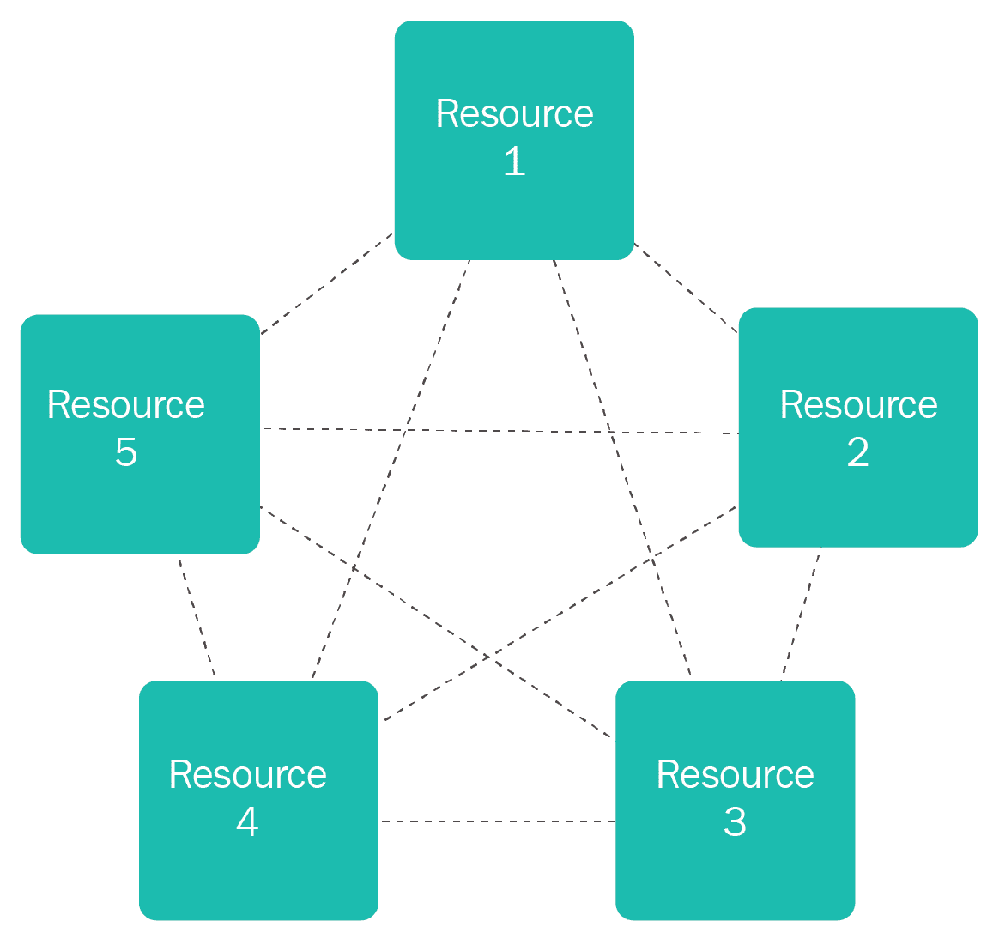
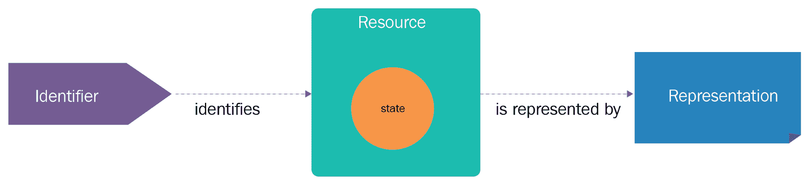
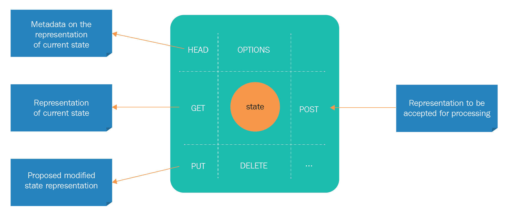
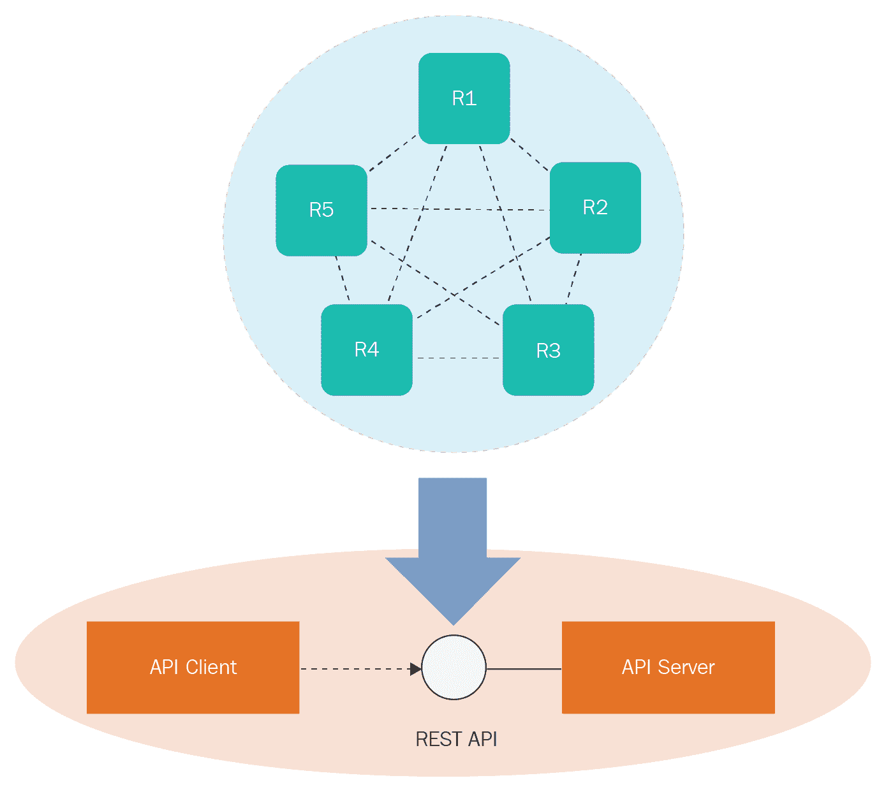
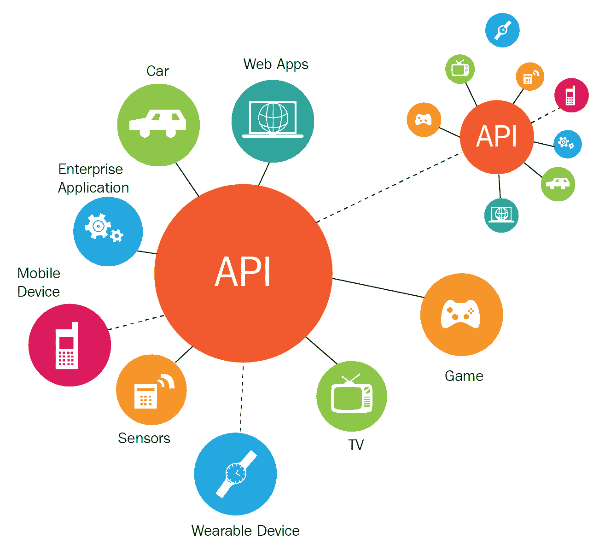
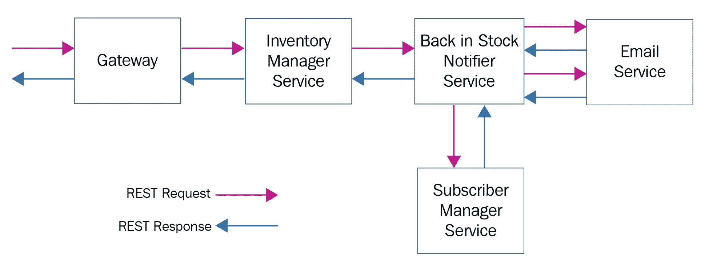
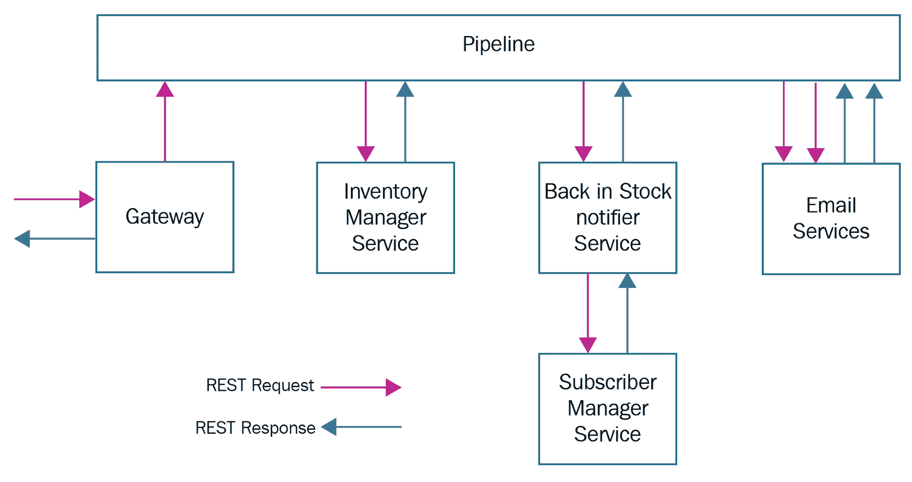
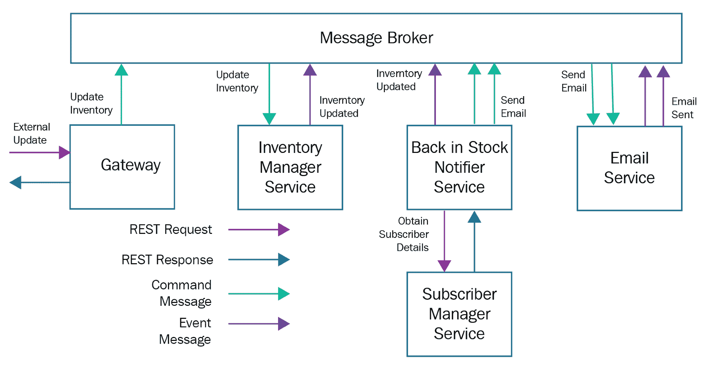
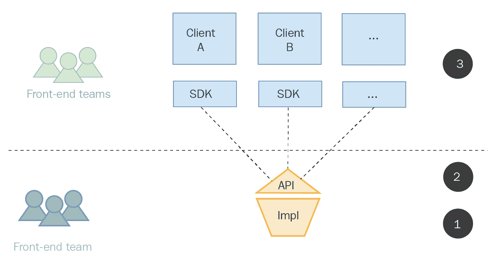
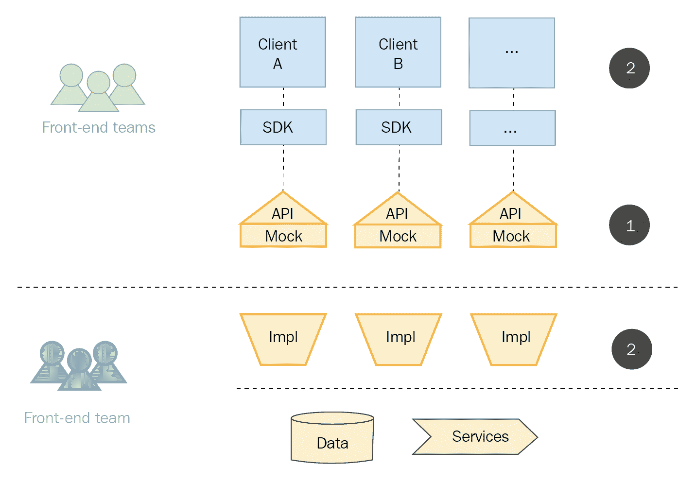

# 第九章：对 RESTful 服务范式的更深入视角

随着一群未来派和灵活的信息技术、自动化工具、优化基础设施、集成平台和多功能设备的盛大到来，世界必将尝试和体验以前未知的软件应用和服务，以赋能企业和个人。随着轻薄、时尚、便携、潮流的智能手机的快速普及，我们注定将拥有令人眼花缭乱的易于使用和引人注目的移动应用和服务。随着可穿戴设备、便携设备、固定设备、手持设备和无线设备的加入主流计算，应用的范围、规模、速度和结构必将显著提升。为了将应用适配到各种设备，全球软件开发者预计将通过利用潜力巨大的编程语言、平台、工具包、软件开发方法、设计模式和最佳实践，推出可定制、可组合和可配置的应用。因此，软件领域正以极大的信心和清晰度持续扩展。因此，开创性的软件包、本土应用、一站式解决方案、洞察力平台和流程感知复合软件的推出和影响都在按预期进行。也就是说，我们正趋向于软件定义的世界——软件是人类光明的未来的关键齿轮。

本书，尤其是本章，致力于解释如何快速、轻松地生成 RESTful 服务和它们相应的 API 的新兴技术和技巧。本章有以下目标：

+   软件定义和驱动的世界

+   描述新兴的应用类型

+   应用现代化和集成的 REST 范式

+   数字转型和智能的 RESTful 服务

+   基于 REST 的微服务最佳实践

# 技术要求

本章没有特殊的技术要求，因为它不涉及设计、开发或部署软件包。其他章节描述了如何设计和使用面向微服务的 RESTful API。进一步来说，几章解释了为应用和数据集成生产独立和实用型 RESTful 服务的细节。本书还详细介绍了 API 设计技术和最佳实践。本章进一步阐明了神秘的 RESTful 范式如何将成为软件定义世界即将到来的时代的趋势 setter。其他章节中提出的 RESTful 技术、工具和技巧对这一章节也很有帮助。确切地说，突破性的 RESTful 理念的角色和责任必将提升，随着世界趋向于一个完全由适应性强的、灵巧的软件丰富、启用和赋权的世界。

# 趋向于软件定义和软件驱动的世界

我们生活中的每一件普通和日常事物都以系统化的方式数字化，变得极其计算化、通信化、响应化和活跃。有了各种网络选项，各种嵌入式系统（从小到大）相互连接，以便有目的地被发现、访问、评估、互操作和协作。也就是说，所有构成数字化对象和连接设备之间以合理方式交流的异质性和复杂性，正通过软件赋能的抽象技术和技巧被立即消除。这是一个众所周知且无可争议的事实：软件正在吞噬世界。我们日常环境中的每一台设备、消费电子产品、工业机器、飞行无人机、类人机器人、医疗仪器、家居用品和器具、启用工具包、手持设备、可联网的可穿戴设备、便携式设备、固定系统、网络解决方案、汽车和引擎，都通过嵌入式软件适配器、连接器和驱动程序获得赋能。也就是说，软件赋能是使日常物体能够决定性地加入主流 IT 的最重要过程和目标。任何包含一些相关软件片段的东西都可以变得数字化重要。也就是说，普通事物正在为数字经济的下一个时代做好准备，变得非凡。高级汽车和车辆正在填充大量的软件模块，以便建立和确保高级自动化。

同样，家庭、建筑和工业自动化是通过嵌入软件库来实现的。飞行、无人机、机器人、SCADA 系统、传感器、执行器、工业机械、锅炉和油井，正通过软件代理的丰富来获得软件赋能。因此，软件赋能已成为**原始设备制造商**（**OEMs**）的必修课。下一个问题是，如何使软件定义和驱动的系统找到彼此，以便启动富有成效的协作。API 已出现作为协助促进无缝和自发的设备集成的机制。

RESTful 服务和 API 是启用**设备到设备**（**D2D**）和**设备到云**（**D2C**）集成能力的主要和主导方法。**网络物理系统**（**CPS**）的宏伟愿景是通过智能应用 RESTful 方法来滋养并繁荣发展。

# 数字智能时代的软件赋能云

如前所述，软件的角色和责任正在上升。软件是参与性的、普遍的，甚至是说服性的。所有商业机构都采用软件工程技术和工具，以实现更深层次和更果断的自动化。各个行业领域都热衷于制定和加强他们的软件组合，以便在竞争中脱颖而出。全球的软件开发者构建、编辑、精炼并将他们的软件应用存放在公开的软件注册表/仓库中，以促进其广泛使用。因此，随着软件模块的快速传播，软件包、产品和程序的应用正在稳步增长。应用领域也在不断扩展其视野。应用类型也在相应地扩展，以应对更复杂的需求，因为广泛的认识是软件决定了自动化之旅。在接下来的章节中，我们将讨论主要的应用类型。

# 物联网应用和服务

随着众多连接和集成技术的快速成熟和稳定，迷人的物联网时代已经开始展开，并为整个社会提供其独特的贡献。毫无疑问，物联网范式将为各种商业企业和组织带来各种创新、颠覆和变革。如果得到适当的、积极的利用，每个商业领域都将长期享受繁荣的物联网模式的独特好处。不仅企业，而且每个人、每个机构和创新者都将从日益增长的物联网力量中受益匪浅。根据全球市场研究和分析师团体的报告，物联网领域的短期和长期影响无疑是巨大的，具有趋势性。IT 学科，正被广泛认为是最大的商业推动者，随着物联网概念的到来和阐述，正获得巨大的推动。物联网理念正在迅速渗透，并变得普遍和有说服力。

随着物联网范式的持续传播和采用，商业和 IT 世界将受到众多高端物联网应用和服务的冲击。包括制造、零售、能源、医疗保健、智能城市、政府、国防、公用事业和物流在内的各个行业领域，都在精心探索和实验各种物联网技术和工具，以便在竞争中领先。各个行业部门通过展示一系列令人眼花缭乱的先锋物联网用例，以确保其忠诚消费者正确且相关。

物联网概念的第一个也是最重要的含义是数字化实体和元素（也被称为智能对象）的宏伟和大量实现。通过系统地利用边缘技术，各种日常物品正在转变为自我感知、周围环境感知和情境感知。从物联网领域的进步中产生的第二个值得注意的成果是连接设备的更快普及。各种嵌入式系统正在联网，并加入主流计算。第三个也是最终的结果是设备服务的增长，这些服务通常是微服务。随着**微服务架构**（**MSA**）的更快采用，我们将被大量微服务淹没，以生产下一代企业、云、Web 和移动应用程序。预计到 2020 年，我们将有以下几点：

+   数百万微服务

+   十亿连接设备

+   万亿数字化实体

我们拥有大规模数据存储和处理的庞大云中心。我们既有共享也有专用的网络基础设施，以便快速将数据传输到遥远的云环境。有持久和瞬态的存储选项。云存储容量的成本正在稳步下降。全球云中心的快速普及消除了在本地设置和维护大规模 IT 基础设施的担忧。有洞察力和集成的大数据、快速、流式和物联网数据分析平台。有许多使能框架、自动化工具和强大的引擎正在出现和演变，以加速数据转化为信息、知识，然后转化为智慧的过程。因此，几种经过验证和潜在的技术和工具的出现和融合简化并加快了数据分析和挖掘，以提取可操作的见解。简而言之，物联网设备的通信和协作产生了大量多结构化数据，这些数据必须被有意识地捕获、清洗和压缩，以便揭示隐藏的模式、有用的关联、更大的可能性、新的机会、可避免的风险和现实世界的智慧。所发现的知识将被传播到正确的系统、设备、应用程序、数据源和存储中，以便使它们能够确定其下一步的行动计划。

# 云启用应用程序

如前所述，在接下来的日子里，我们将探讨各种物联网应用和服务。此外，我们还将看到在云服务器上运行的、企业级、分布式应用。随着 MSA（微服务架构）的巨大成功，所有各种遗留（单体）应用正在有条不紊地被启用为云就绪和以微服务为中心的应用，这些应用以其可扩展性、可用性和灵活性而闻名。也就是说，大型应用正在被分割成多个细粒度、公开可发现、网络可访问、互操作、API 启用、可组合、可移植、水平可扩展和独立部署的微服务。有应用现代化和迁移工具包，可以将重构和修复后的应用迁移到云环境中，以获得云困境最初设想的所有好处。有大量最佳实践、集成平台和模式（架构、设计、集成、编排、安全性和部署），可以快速进行遗留现代化，以产生云启用应用。

# 云原生应用

新的应用正在被设计、开发、调试和直接部署在云环境中。在云环境中（私有、公共和混合）提供了生产、执行和编排平台。这些应用足够智能，能够累积云计算的所有好处。微服务是构建企业级和业务关键应用的基本和最佳构建块，这些应用将通过云环境交付。微服务被正式容器化，并且每天部署多次，以满足企业和客户不断变化的需求。有许多自动化工具消除了开发和运维团队之间的所有摩擦，以确保更快地将更新和升级的应用交付给用户和订阅者。

# 移动、手持和可穿戴应用

今天，数十亿部智能手机作为连接、访问和评估软件应用的主体设备，无论何时何地，无论何种网络，都能随时使用。也就是说，各种云、网页和企业应用都充满了移动界面。这种移动能力已经成为应用开发者和提供商的常态。不仅应用，软件和硬件基础设施也正在配备移动界面，以便进行远程监控、管理、诊断和维修。在我们的日常生活中，我们遇到数百万个在移动商店开发和存储的移动应用。智能手机用户可以轻松下载和安装它们。因此，如今，移动、手持和可穿戴应用都受到了用户和开发者的大量关注和喜爱。我们需要有能力的机制将这些应用的 API 连接起来，以便其他应用/服务可以轻松找到并绑定，从而推出以业务为中心的应用。有几种易于理解和使用的生成技术无关的 RESTful 服务和它们 API 的方法和机制。

# 事务性、操作性和分析型应用

企业应用在功能方面各不相同。它们不仅要很好地满足其功能需求，还应该满足许多**非功能性需求**（**NFRs**），这些被称为**服务质量**（**QoS**）和**用户体验质量**（**QoE**）属性。性能、可扩展性、可持续性、可修改性、可扩展性、可用性、弹性、安全性、可靠性和适应性需求被归类为重要的 NFRs。至于公众，开放的互联网因其廉价而成为主要的通信基础设施，因为大多数应用都是网页化的。也就是说，网页界面是访问网页规模应用的广泛使用的机制。

**企业对企业**（**B2B**）和**企业对消费者**（**B2C**）应用在本质上通常是事务性的。有可行的技术来确保复杂的交易。随着地理分布系统的普及，分布式交易的需求变得更加重要。众所周知，网络是访问信息、内容、应用、服务和数据源的主导和决定性方式。因此，出现了许多**在线事务处理**（**OLTP**）系统，以原生支持不同的交易需求。

就像交易一样，数据分析占据了下一代企业级系统的核心部分。数据被精心收集、清洗和计算，以便从不断增长的数据堆中提取可操作的见解。提取的见解被用于做出智能和实时的决策。精确地说，这些将是数据驱动的见解和见解驱动的决策。基于直觉的决策不再有立足之地。存在分析平台和数据仓库/集市/立方体，它们促进了数据挖掘、分析和调查。分析是任何商业应用、IT 平台和基础设施的核心，以提供它们独特的服务。所有下一代应用都天生具有分析能力。现有应用通过整合分析应用，如**在线分析处理**（**OLAP**）应用，被赋予了分析能力。因此，分析应用将成为主流 IT 的主要组成部分。

最后，随着操作技术和信息技术环境的无缝链接，托管在企业服务器和云服务器上的软件应用必须能够接收实时操作数据和事件消息，以便对消费者来说是正确和相关的。各种操作应用和数据库正在出现，以满足不断变化的操作环境需求。地面操作系统产生大量的时序数据和事件数据，这些数据被流式传输到企业系统（事务性和分析性数据存储）。存在能够理解流入它们的数据的分析平台。更智能的环境，如智能酒店、家庭、医院、制造车间和**云启用数据中心**（**CeDCs**），在它们与附近的或远处的交易性和分析系统无缝集成时，将获得赋能。

# 知识可视化应用

接下来的时代无疑是知识为中心的。知识发现和传播将成为知识工作者的主要活动。软件服务、个人和专业设备、IT 系统和商业应用必须提供实时和现实世界的知识，以便在行动和反应上具有适应性。有 360 度仪表盘、可视化平台和报告生成工具可供使用，以便图形化和直观地显示和传达结果。让我们更详细地看看这些应用。

# 社交应用

这套应用目前在年轻人中非常受欢迎。通常，Web 1.0 应用是简单且单向的，而 Web 2.0 应用则是社交性的，并促进双向沟通。也就是说，用户不仅阅读，还能回写。为了促进从外向内的思考，社交应用是前进的方向。有几个社交和专业应用能够赋予整个社会力量。数字社区正在形成并被用来装备人们的技能和知识分享。由于社交应用拥有大量的订阅者和追随者，它们产生了大量有用的数据。当社交和与人们相关的数据被持续收集并受到各种调查时，个人和机构必然会发现许多可操作的观点。由于社交应用的广泛传播，出现了新的分析能力，例如社交网络分析、行为分析和销售促销及营销活动分析。

# 科学和技术应用

软件在塑造各种科学和技术应用中扮演着至关重要的角色。科学实验会产生大量数据，这些数据可以被捕捉和加工以生成可用的结果。同样，也有利用软件能力的技术应用。这两个领域需要软件平台、产品、模式和流程的独特贡献，以便高度相关于其用户。有大量的针对数学的软件包来帮助数学家进行他们的研究活动；其他科学、技术、工程和艺术学科也从软件领域的进步和发展中获得了巨大的和无法衡量的益处。在软件部署和执行方面，**信息和通信技术**（**ICT**）领域出现了无数的创新。

# 集中式和分布式应用

集中式和分布式计算模型之间存在着波动。云通常是由集中、整合和融合的环境组成，用于托管应用。最近，云已经实现了联邦化，以便托管和运行分布式应用。考虑到数据的指数增长和应用的复杂性，分布式计算的出现是无法阻止的。在云范式下，利用通用服务器进行大规模应用和数据处理的势头正在增强。水平可扩展性优于垂直可扩展性，因此分布式系统正受到越来越多的欢迎。应用也被有系统地分割，以便进行分布式处理。数据被分布到数千个工作/从节点上。计算移动到数据所在的地方。随着分布式计算的爆炸式增长，网络延迟问题也随之而来。随着分布式计算的接受和采用程度的提高，服务器虚拟化也扩展到了网络和存储虚拟化。MSA 的出现和阐述导致了分布式应用的实现。简而言之：分布式计算和应用是不可避免的。为了满足快速发展的商业和 IT 需求，它们必须被欢迎。

与集中式环境和应用相关的某些局限性。总体观点是，分布式系统确保了高可用性、可负担性和可扩展性。也就是说，未来 IT 的座右铭是分布式部署和集中式监控、测量和管理。

# 基于区块链技术的去中心化和智能应用

如前文所述，集中式应用非常适合某些场景。然而，在最近几年，去中心化应用的市场需求有所增加，这得益于区块链技术的快速采用和适应。区块链范式在实现和运行跨多个行业垂直领域的去中心化应用时，承诺带来一系列的颠覆和变革。集中式系统和应用面临的问题在去中心化服务和解决方案中得到了消除。通常，去中心化系统由不同的组织拥有和运营，因此去中心化软件的安全性在技术上得到了加强。通过去中心化方法，软件系统的所谓不可破和不可渗透的安全性得到了保证。去中心化方法促进的**点对点**（**P2P**）交互正在成为许多近期用例的银弹。区块链技术的快速成熟和稳定性明显推动着 IT 专业人士和组织向去中心化系统的生产迈进。区块链范式还导致了智能合约这一新概念的出现，这导致了自适应应用的实现。

# 复合和多容器应用

分解和组合技术已被广泛用于在软件工程中取得突破。单体应用通过分解技巧被拆解，而分解的应用模块则以有序的方式相互组合，以创建更智能和更复杂的应用。随着容器成为微服务的最合适的运行环境，我们需要从容器化的微服务中生产出企业级、关键任务和自适应应用。有组合（编排和协奏）平台和引擎来简化并加快构建过程感知和以人为本的应用。还有使能语言，帮助我们开发过程优化和集成的应用。

# 事件驱动应用

我们仍然有许多单体和主机应用，尤其是在金融领域。如今，大多数应用都遵循客户端/服务器风格。有云（在线、按需和离场）应用。随着各种附加和第三方系统的加入，应用架构转向*n*层分布式计算。随着区块链的出现，P2P 架构模式得到了来自各利益相关者的广泛关注。还有其他变体，如**面向服务的架构**（**SOA**）和**面向资源的架构**（**ROA**），它们本质上支持请求/响应和触发即忘。此外，还有实现参与组件轻量级和松散耦合的方法。

但毫无疑问，未来属于**事件驱动架构**（**EDA**），这是实现敏感和响应性（S 和 R）应用程序的前进方向。随着独立但相互连接的设备前所未有的爆炸性增长，EDA 风格促进了解耦应用程序。任何值得注意的事件或状态变化都会触发其他设备和应用程序采取行动。存在事件存储和处理平台（包括开源和商业级解决方案）。简单/原子事件积累和聚合形成复杂事件。事件消息被流式传输，以便进行各种调查，这些调查通过利用流分析解决方案和解决方案得到了极大的简化。存在用于事件和流处理的启用框架。应用程序被内在赋予根据从事件消息中提取的任何洞察进行适应的能力。应用程序将变得以人为中心，积极主动，同时提供其独特的服务。EDA 是构建智能系统的一种推荐方法。

# 高质量应用程序

正如讨论的那样，有大量针对 I/O 设备特定、服务器中心、语言导向、架构启发和技术无关的应用程序。今天，大多数应用程序都是被编码以满足已识别的功能需求。随着 IT 被宣布为更大的业务推动者，不断发展的业务需求要求 IT 专业人员和教授设计可行的方法将 NFRs（非功能性需求）纳入源代码。突出的 NFRs 包括性能、可扩展性、可用性、弹性、可靠性、安全性、可扩展性、可访问性和可修改性。这些 QoS（服务质量）和 QoE（用户体验质量）属性被要求优雅地嵌入到我们日常的软件应用程序中。一个新兴的新学科正在出现，并吸引了软件工程师和架构师的注意和喜爱——**站点可靠性工程**（**SRE**）；也就是说，不仅业务应用程序和敏捷生产的 IT 系统，而且它们还必须以高度可靠的方式进行设计、开发、调试、交付和部署。书面目标是确保应用程序的弹性和可靠的 IT 基础设施。IT 专家的未来挑战众多且多样化。构建高质量应用程序充满了无数困难。学者和科学家正在加班加点地提出最佳实践、知识指南、优化流程、架构和设计模式、集成平台、有能力的基础设施以及易于理解和使用的程序，以简化并简化高质量软件系统的生产。

# 弹性应用程序

如前所述，微服务被定位为构建和部署下一代应用的优选元素。不同的分布式微服务在组合后形成灵活的应用。随着对可靠 IT 系统和业务应用的广泛坚持，正在出现并迅速发展的可行方法，将所需的可靠性能力精确嵌入到软件系统中。一般来说，系统可靠性是应用的可恢复性和系统的弹性。也就是说，面对任何内部或外部攻击，应用必须生存下来，以便持续履行其义务。应用必须天生具备主动检测任何问题的能力，然后将其遏制，防止其级联到其他系统组件。因此，系统在技术上必须容错，以便具有高可用性。简而言之，恢复能力是识别和避免问题，而不会使整个系统崩溃。在满足用户请求时，为每个服务部署额外的实例非常方便。第二个方面是弹性特性；也就是说，当系统承受重负载时，它们必须相应地扩展或扩展，以应对用户和数据消息的额外涌入。因此，除了确保应用和数据的安全之外，保证可靠性正变得越来越重要。

# 应用现代化和集成的 REST 范式

单一和大规模的应用正在被现代化并迁移到云环境中，以便获得云计算模型最初设想的所有好处。微服务正成为生产企业级应用最优化构建块。不仅适用于开发，对于应用现代化，微服务也被誉为最合适的方法。也就是说，遗留应用正在被系统性地分割成多个互操作、可移植、公开可发现、网络可访问、可重用、可组合、细粒度、技术无关、容器化、水平可扩展和独立可部署的微服务。这里的要点是每个微服务都暴露一个或多个接口。RESTful 接口是微服务连接和组合更大、更好服务最受欢迎的接口。因此，微服务通常是 RESTful 服务。因此，通过 RESTful 服务和它们的 API，应用重构和修复正在加速和简化。服务、应用和数据集成以及编排通过 RESTful API 进行。

简而言之，新技术和工具包、编程和脚本语言、架构和设计模式、集成平台、开创性算法、使能框架、可组合和集群化的基础设施、优化流程、新的构建模块、数据格式和协议不断涌现并影响着软件工程学科。敏捷软件开发方法越来越受到重视，以快速构建应用程序。此外，微服务在实现企业级应用中的作用和责任越来越明显。也就是说，除了敏捷技术外，微服务对应用程序的快速开发做出了巨大贡献。换句话说，通过组合多个微服务，应用程序可以瞬间准备就绪。

应用程序主要相互依赖。它们不能独立工作。它们必须动态集成，为用户提供综合体验。应用程序还必须与其他应用程序、数据源和存储、数据处理和分析平台以及消息和中间件系统连接起来。因此，不可避免地需要通过精心设计和意图明确的 API 进行集成。最后，遗留应用程序必须分解成易于管理和松散耦合的模块。这些模块化组件与管理解决方案相结合，将显著提高其利用率、效率、可见性和可控性。进一步来说，根据需要，可以选择和组合几个模块来创建更大、更好的应用程序。

# 应用程序编程接口

我们正朝着一切即服务的方向发展。**应用程序编程接口**（**APIs**）已成为企业表达和展示其服务能力的技术选择。每个服务都必须有一个或多个接口和后端实现。全球各地的公司都在积极采用 API。一些独特的使用模式已经出现，以帮助企业迅速适应不断变化的市场需求。那些正在制定数字化转型战略的企业正在加速利用多个渠道和 RESTful API 来超越竞争对手。API 已成为组织与业务伙伴、供应商、零售商、分销商、仓库提供商、物流和供应链专家以及消费者轻松连接的战略资产。这简单地说就是 API 经济。它们正在推动设计模式和用法模型，随着全球范围内的企业拥抱 API 的概念。

本节探讨了以下四种 API 使用模型，这些模型可以满足业务需求，并具有所需的敏捷性和效率：

+   公共 API

+   内部和私有 API

+   用于物联网传感器和执行器的 API

+   集成 API

# 用于外部集成和创新的公共 API

我们正被新一代和具有创新功能的 I/O 设备所包围。随着微型化技术的持续发展，我们得到了一系列轻薄、多功能、强大的智能手机、平板电脑、可穿戴设备、便携式设备和其他物联网设备的供应。也就是说，数字设备生态系统正在持续扩展。另一方面，快速积累的数字内容、信息和服务的可用性使得在任何时间、任何网络、任何设备上都可以找到、访问和消费。也就是说，有新的渠道可以连接到企业云服务器以获取和聚合各种服务，如信息、商业、交易、分析和其他在线服务。为了标准化服务发现、匹配和利用，广泛推荐的方法是利用 API。API 正在成为企业以受控方式共享其服务和信息的下一代渠道。随着数字生态系统的稳步增长，API 已成为跨国公司向更广泛市场提供其产品的前进之路。随着数字资产的爆炸性增长，API 正在成为访问、评估和使用数字资产的主要方法。数字服务提供商的数量激增。为了创造更高的商业价值，地理上分布的服务提供商需要通过 API 按需识别和集成。每个服务都配备了一个或多个 API。开源社区提供了 API 管理和网关解决方案，作为商业级解决方案提供商，以降低 API 开发、运营和管理复杂性。

# 用于内部目的的私有 API

内部 API 提高了企业内部以及跨企业的利用率和效率。内部 API 使得内部开发者能够以自由流动的方式轻松发现和消费内部服务。新兴的趋势是每个有价值的应用程序都细致地被服务和 API 启用。通常，每个企业都配备有各种后端系统，如数据库管理系统、**面向消息的中间件**（**MoM**）解决方案、消息代理和队列、数据处理和数据分析系统以及知识可视化工具，这些系统都启用了服务以暴露它们自己的接口（API），以促进服务连接、集成和编排的目标。当组织想要为内部使用创建新的 API 时，它必须将它们添加到现有系统的服务 API 之上。

公共 API 并不多，但内部使用的 API 却很多，因为可能有数百个内部服务利用多种数据格式和传输协议。为了大力促进重用、速度、效率和敏捷的应用程序开发，企业应将其内部 API 发布在可搜索的目录中。

# 物联网设备 API

我们在本章开头讨论了物联网设备及其对人类的服务。预计未来几年将有 500 亿个连接的设备。这些一次性使用但不可或缺的设备正在大量生产，以自动化日常活动。嵌入式设备通过网络相互连接，以协作方式共同开发并向人们提供情境感知服务。正在挖掘和推出新的用例，以增强物联网范式的普及和渗透。由于物联网设备的多样性和异质性，物联网设备的运营、管理和安全复杂性正在部署到家庭、酒店、医院、零售店、制造车间、火车站、餐厅和自动驾驶汽车中。如今，传感器和执行器已成为每个数字应用的眼睛和耳朵。每个设备都变得可计算、可通信、可感知和活跃。

存在边缘和雾设备，它们具有足够的功率形成临时的云，以捕获、存储、处理和分析实时、时序和流数据，以提取可操作见解，这些见解可以反馈到设备和人员，以便及时做出智能决策，并参与正确和相关的活动，具有清晰和自信。未来的物联网应用和服务需要通过 RESTful API 公开，以执行设备集成和服务编排。

# 应用集成 API

API 注定将在满足过程、数据和应用程序集成复杂任务中发挥至关重要的作用。SOA 为面向服务的应用程序和集成提供了一个刺激的平台。**企业服务总线（ESB**）产品的快速成熟和稳定性加快了面向服务、集成和洞察驱动的企业的建立和维护。对生产集成系统进行解耦服务的 API 驱动的集成引起了广泛关注。

简而言之，全球企业正在拥抱 API 作为实现备受瞩目的数字颠覆、创新和转型的战略途径。外部 API 为客户端开发者实施和参与公开的 API 提供了连接和协作的软件应用。通过外部公开的 API，可以实现应用程序的远程监控、测量和管理。

# 描述 RESTful 服务范式

软件工程领域的开发趋势是，现在应用程序是通过集成、编排和协作由多个服务构成的。工作流是突出的统一因素。也就是说，它们有助于识别相关的服务，所选的服务被整合到适当的顺序中，以形成有能力的复合服务和应用程序。挑战在于服务发现、访问、评估和使用。有通信和数据传输协议来促进服务之间的交互和协作。REST 方法正变得易于理解和使用。本节将描述 REST 是如何简化的，以及交互式服务如何导致强大的应用程序。

资源，作为 ROA（资源导向架构）的主要架构组件，类似于流行于**面向对象编程**（**OOP**）概念的物体。作为物体，资源有直接作用于其上的方法。OOP 和 ROA 之间的关键区别是，资源只定义了少数几个标准方法。然而，对于物体，可能有一个或多个方法。进一步来说，ROA 中的资源可以被合并成资源集合。条件是每个创建的此类集合必须是同质的。资源可以赋予数据。与资源相关联的数据的丰富性有助于以高效和有效的方式利用资源。JSON 是最合适且最受欢迎的数据模型，可以适当地丰富资源。资源越来越多地使用 JSON 对象来表示。特殊的关键字值对`_type`被广泛用于存储任何资源的类型。JSON 数据类型，如字符串、数字、布尔值、null 或数组，是任何关键字值对的值。

REST 范式包括三个突出的架构元素类别：连接器、组件和数据元素。

**连接器**是一种将你的参考点连接到目标系统的事物。连接器负责识别和访问各种网络资源，并更改已识别资源的当前表示。角色是各种组件的接口，这些组件由不同的编程语言实现：

+   **客户端连接器**：REST 是用于请求-响应范式的。客户端发送请求并从资源获得适当的响应。

+   **服务器连接器**：RESTful 服务器持续监听来自客户端的请求。服务器为请求提供响应。

+   **可缓存响应**：可以存储在客户端或服务器上，以加快后续请求的响应速度。多个客户端可以同时获取缓存信息。

+   **解析器**：将资源标识符转换为网络地址。

+   **隧道**：中继服务请求。有时，组件会偏离其基本义务进行隧道操作。

在 REST 范式中，相互交互的各种软件被称为**组件**：

+   **服务器软件**：此软件解决方案使用服务器连接器从客户端软件接收请求。服务器是资源及其表示的来源。

+   **客户端软件**：客户端使用客户端连接器制定并向服务器传达请求，并接收响应。

+   **网关软件**：这是一种中间件解决方案，能够智能地翻译客户端和服务器之间发生的请求和响应。

**数据元素**是强大的 RESTful 服务范式的关键组成部分。之前提到的 REST 组件传达数据元素的状态表示。在 REST 范式中，有六个数据元素：

+   **资源**：根据 REST 规范，ROA 是核心的架构风格和模式。资源是 RESTful 范式的核心元素。资源是对各种物理或逻辑/数字/网络/虚拟实体的概念映射。映射会随时间变化。每个 RESTful 资源都通过适当的地址唯一表示和标识。资源包括 Instagram 上的图片、电影标题等。

+   **资源标识符**：为了找到、访问和使用资源，资源需要唯一标识。**统一资源标识符**（**URI**）标识每个资源。URI 是客户端和服务器以明确方式通信的方式。资源可以有多个 URI。这成为指明资源不同位置细节的必要条件。URI 用于交换资源表示。

+   **资源元数据**：元数据对于资源利用和管理非常重要；它提供了关于资源的额外细节。添加的信息，如位置信息和资源的替代标识符，使得资源操作和管理成为可能。也就是说，资源还包括 RESTful API 特定的信息，如 URL 和关系。

+   **表示形式**：我们讨论了资源并指出 JSON 是定义与资源相关数据的首选数据模型。然而，为了资源能够通过 HTTP 连接与客户端通信，它们的表示形式必须转换为文本表示。这种表示形式必须正式嵌入到 HTTP 消息体中的实体。确切地说，资源表示形式是资源在特定时间点的状态，并且会发生变化。状态值在客户端和服务器之间传输。表示形式通常捕捉并传达资源的当前或期望状态。特定的资源可以有多个表示形式。

+   **表示元数据**：这些元数据提供了关于表示形式的额外细节，以便简化表示。

+   **控制数据**：这定义了对资源请求的操作。

# REST 架构约束

REST 架构约束主要是设计规则，这些规则清楚地传达了 REST 范式的独特特征。这些约束并不是为了规定使用什么样的技术和工具；它们只是表明数据如何在各种组件之间传输，例如客户端和服务器：

+   **客户端和服务器之间的关注点分离**：客户端和服务器之间存在明显的分离。这种独特的分离使得客户端-服务器应用程序可以独立开发和部署。任何一项的进步和变更都不会影响另一项的功能。解耦的特性保证了消除依赖性引起的问题。

+   **无状态通信**：服务器机器不需要存储任何关于客户端调用上下文的会话信息。这意味着任何新的请求都可以由任何服务器实例处理。然而，会话中客户端的认证细节可以被存储，以便会话内的新请求不需要通过身份和访问管理系统进行认证。

+   **客户端缓存响应**：客户端可以缓存服务器响应，因为每个服务器响应都包含启用缓存的相关细节。

+   **连接可以是直接的或间接的**：客户端可以直接与服务器通信，也可以通过中间件（如代理或其他经纪人）进行通信。这种分离增加了系统的灵活性。通过这种中间件，可以轻松满足可扩展性的需求。

+   **统一接口**：由于各种网络应用组件（客户端、服务器和中间件）接口的统一性，它们之间的交互得到了简化。如果任何组件偏离了既定的标准，那么网络应用可能会崩溃。四个基本的 HTTP 操作，`GET`、`POST`、`PUT`和`DELETE`，为所有参与组件提供了所需的统一性，以便清晰、自信地查找、交互和完成任务。其他操作，如`HEAD`和`OPTIONS`，主要处理元数据管理。

+   **分层系统**：分层和分层系统减轻了开发和运营的复杂性。越来越多地，客户端和服务器之间有许多层。这些层充当中间件，如网关和代理，以自动化交互的一些方面。代理通常是由客户端选择的中间件。代理提供接口以访问服务，如数据转换、性能增强和安全保护。另一方面，网关是由网络或服务器强加的另一个中间件，以提供特定服务的接口。

利用中介组件可以显著减少交互延迟、安全执行和旧系统的封装。因此，为了更快地开发 Web 应用程序，并使旧应用程序更加现代化、模块化和 Web 化，RESTful 服务范式做出了巨大贡献。

**简单对象访问协议（SOAP）**机制是访问和使用服务的原始方法。它是一种基于 XML 的消息协议，用于在计算机之间交换信息。SOAP 存在一些持续的问题，因此 REST 范式的起源和传播受到了广泛的欢迎。由于 Web 应用和服务数量的激增，创建和维护高效的 Web 架构已成为一项重要任务。

REST 方法是一种著名的架构风格，与无处不在的 HTTP 协议中使用的概念紧密相关。REST 不规定组件实现和协议语法的细节。然而，它包括对连接器、组件和数据的根本约束。这概述了 Web 架构的基础，以及作为基于网络的程序的行为本质。REST 范式通过一系列架构约束说明了简单的 Web 应用程序设计和开发。这些架构考虑确保了组件交互的可伸缩性、标准接口和组件的独立部署。

精确地说，REST 本身并没有定义各种资源的状态应该存储在哪里或如何存储。REST 指定了如何使用无处不在的`GET`操作来检索状态。状态也可以通过`PUT`和`POST`操作提供。还可以有只支持`GET`方法的只读资源。正如在其他地方讨论的那样，资源状态可以通过任何方式提供，例如文件系统、其他资源的动态组合或物理传感器。REST 范式是设计面向资源的应用程序服务的方法或设计模式。也就是说，REST 是网络应用程序的架构风格。

REST 提高了基于网络的程序的性能、可伸缩性、简单性和可见性。REST 自然鼓励正确和高效的开发人员与计算机以及开发人员之间的沟通。因此，REST 可以描述为通过遵循消费者和提供者之间的一系列特定约束来构建服务和应用程序（我们在本章开头描述了各种软件应用程序）的方法。

# REST 的优势

通常，在请求和提供服务之间可能会有许多交互来满足业务流程，因此，不同和分布式微服务之间的通信必须快速进行，并且开销要小。REST 要求具有较低延迟的网络以加快服务请求和满足，这使得 REST API 非常适合。REST API 不仅支持 XML 和 JSON，还支持更优化的二进制表示格式，如协议缓冲区或 Avro。进一步来说，它可以升级到 HTTP/2.0。全球数十亿人使用网络进行各种目的。有数百万的开发者创建各种网络应用程序。因此，需要一个有能力的网络架构来满足企业和人们的不同需求。简而言之，强大的 REST 范式有助于构建软件架构和应用程序，这些架构和应用程序隐含地继承了网络的所有值得称赞的品质。RESTful 服务带来了一些重要的能力，如更高的可伸缩性、高效的网络使用以及客户端和服务器独立运行。

REST 范式本身支持 ROA。根据 REST 规范，一切都是资源。软件架构通常是几个可配置架构元素的组合。在 REST 的情况下，主要的架构元素是组件、连接器、资源、表示和一些数据元素。资源是 RESTful API 的构建块。资源可以是应用程序想要在网络上公开的任何东西，以便其他应用程序可以通过各种 HTTP 方法找到并操作。它可以是有文本内容、图像、视频和音频、白皮书或银行账户。这些资源通过在 HTML 文档中嵌入相应的超链接相互链接。请注意，资源可以通过人类和软件程序检索、更新和删除。以下图示说明了这一点，并显示了通过超链接在不同和分布式资源之间的潜在关系：

为了明确地找到并使用它们，每个资源都必须有一个唯一的名称，这被称为 URI。一个示例 URI 是[`www.paris.fr/weather`](http://www.paris.fr/weather)。如前图所示，资源可以通过表示的概念来暴露其状态。表示通常包含元数据（如资源大小、媒体类型或字符集）和内容（二进制图像或文本文档）。表示差异很大。例如，电子商务网站上购买确认的表示可能是一个 HTML 文档。对于婚礼照片，表示可能是一个 JPEG 图像流。对于地址簿网络服务中的联系人，它可能是一个 XML 文件。因此，它从资源标识开始，并为每个标识的资源有一个相应的表示。

# 自描述消息

客户应通过一系列请求消息表达他们偏好的状态。服务器通过响应消息将资源的当前状态传达给任何客户端。例如，一个维基页面编辑器可以向服务器发送消息，请求转移表示。表示的变化可能表明页面更新，这是服务器托管和管理的网页的新状态。然而，服务器负责接受或拒绝客户端的请求。如前一段所述，自描述消息可能包括元数据来携带和传达有关资源状态、表示格式和大小以及消息本身的额外细节：

在资源当前状态下执行的核心操作（`GET`、`PUT`、`DELETE`和`POST`）在以下图中以图形方式表示。状态通过这些操作进行修改和更新。该图还表明，资源与其外部环境是分开的，它与之交互。也就是说，多个实体可以无问题地与资源交互：

资源以某种状态启动，该状态位于前一个图的中间。状态以任何合理的方式进行管理。从数据库或文件中写入或读取是一回事，但没有任何后端数据库，业务逻辑无法进行任何动态计算。结果被发送回请求的客户端。前面提到的核心操作定义了其统一的接口。

建立并提供 REST API 并非易事。根据 REST 范式，一个应用程序由多个分布式资源组成，这些资源为应用程序的消费者提供有用的功能。API 开发者必须理解问题域，分析业务、技术和用户需求，并据此设计各种参与和贡献的资源。资源选择最终导致 API 的形成，这些 API 需要被发现和使用以实现业务自动化。以下图示说明了我们如何将 REST API 定义为一系列超链接资源。这些资源由网络服务、网站和微服务公开：

我们正朝着软件定义的世界迈进，每个有形的事物都通过适当的 API 得到启用。因此，备受赞誉的 API 经济开始闪耀。企业热衷于拥抱这个战略上明智的转型。API 已成为我们业务和 IT 系统的有趣和鼓舞人心的组成部分：

具体来说，由 REST 范式提供的 ROA 正在被公认为实现预期数字化转型的主要贡献者，不仅对商业企业、政府机构和 IT 公司，而且对整个人类也是如此。随着技术的渗透到日常生活，人们在决策和行为上将会变得最聪明。SOAP 是服务启用目标的第一种行业级方法。由于各种复杂性因素，REST 正在获得市场份额和心智份额，如以下章节所示。

# SOAP 与 REST 的比较

SOAP 是一种成熟且稳定的协议，具有多个标准规范，这些规范正在简化并简化服务的开发、部署、管理、治理和组合。有标准标记语言来表示服务的接口。为了明确理解，SOAP 主要使用 XML 而不是 HTTP 来定义消息内容。"**Web 服务描述语言**"(**WSDL**)可以强制服务 API 和消费者之间使用正式合同。SOAP 内置了 WS-reliable messaging 标准，以在异步执行和处理期间增加服务安全性。SOAP 内置了有状态的操作能力，用于会话状态管理。

如前所述，REST 易于理解，因为它使用 HTTP 作为数据传输协议和基本的 CRUD 操作。这种易用性简化了软件开发者的工作。REST 消耗的网络带宽也更少，因为它不像 SOAP 那样冗长/庞大。与 SOAP 不同，REST 被设计为无状态的，并且 REST 响应可以在客户端缓存，以保证更好的性能和可扩展性。REST 本质上支持许多数据格式。最广泛使用的数据格式是 JSON，它能够为 Web 浏览器和迷你客户端提供更好的支持。JSON 与 JavaScript 的关联简化了 API 负载的消耗。由于轻量级特性，RESTful 服务正在变得无处不在。各种云、移动、嵌入式和物联网应用程序都在利用 REST 范式，这对于应用、数据和 UI 集成需求越来越重要。

# 何时使用 REST 与 SOAP

在许多方面，REST 优于 SOAP，包括以下方面：

+   **开发公共 API**：以资源或数据为基础的 REST，以其 ROA 而闻名，不可避免地专注于基于资源或数据操作。其核心操作（`GET`、`PUT`、`POST`和`DELETE`）继承自无处不在的 HTTP。这种最小化方法使得 REST 范式易于理解和在应用和行业领域中使用。应用程序和服务开发者发现使用 RESTful 方法很容易。响应很容易被网络浏览器消费。确切地说，REST 固有的简单性是其前所未有的支持和成功的关键原因之一。意识到其潜力，从 SOAP 到 REST 的转变是一致的。

+   **性能、灵活性和可扩展性**：API 是应用程序被识别、集成和使用的入口点。应用程序的 API 之间存在事件消息和过程/方法调用。一个广泛流传的建议是，需要大量双向消息的应用程序必须选择 REST 方式才能成功。如果出现网络问题，一旦重新建立连接，RESTful 服务方法允许应用程序/进程重试。REST 使得这样做而不会造成任何重大中断变得容易。与 SOAP 的状态操作相比，重试方面似乎是一个困难的事情，因为它涉及到多个级别的更多初始化，包括状态代码。由于 REST 是无状态的，会话信息不会存储在服务器机器上，这使得 REST 服务可以独立重试并且横向可扩展。

RESTful 服务范式使我们能够轻松快速地对 URL 进行调用并获得即时响应。SOAP 服务需要与一个复杂的客户端保持状态连接。另一方面，REST 支持无状态连接。缓存不会存储在服务器应用程序中。因此，与 SOAP 应用程序相比，测试 RESTful 应用程序相当容易。

SOAP 提供了通过过程/方法请求远程访问和操作对象（名词）的方法；REST 则侧重于可以在资源上执行的操作（动词）。因此，REST 已被公共 API 实践者广泛采用。在不需要将一组对象完全映射到客户端的情况下，REST 总是比 SOAP 更好。来回传输对象细节会浪费大量的昂贵网络带宽。此外，网络延迟也会出现。特别是在带宽受限的环境中，这种多次调用需求可能是一个巨大的障碍。主要被移动应用程序消耗的 API 与那些我们根本不需要利用 SOAP 的场景相关。公共 API 经常变化，因为消费者和企业的期望各不相同。在这个初创公司和没有具体合同协议的 API 的世界里，REST 是一个自然且通用的选择。

# 基于 REST 的微服务的最佳实践

在本节中，我们将讨论一些最佳实践，这些实践可以使您的 MSA（微服务架构）对开发者友好，从而他们可以轻松地管理和跟踪错误：

+   **有意义的名称**：在请求头中提供有意义的名称始终很重要，这样如果发生任何问题，例如性能下降、内存浪费或用户负载激增，开发人员和性能工程师可以轻松地了解这个请求是从哪个微服务发起并级联的。因此，在请求头的`User-Agent`属性中提供逻辑`name/{服务 ID}`是一个最佳实践，例如，`User-Agent:EmployeeSearchService`。

+   **API 管理**：在基于 REST 的微服务架构中，一个微服务通过 API 访问另一个微服务。API 充当其他微服务的门面。因此，必须谨慎构建 API，更改 API 会带来额外的问题。也就是说，API 必须考虑到未来的需求来设计。API 方法签名中的任何更改都不好，因为许多微服务依赖于 API 来访问和评估微服务。因此，在日益以 API 为中心的世界中，API 使用、版本管理和管理的任务具有特殊的重要性。

+   **关联 ID**：为了确保高可用性，微服务通常分布在多个服务器上。也就是说，可能会有多个相同的微服务实例。随着容器成为微服务最优化运行时的出现，运行多个微服务实例已成为新常态。为了满足一个客户端请求，控制必须通过多个微服务和实例。如果某个服务在管道中由于问题表现不佳，我们需要了解该服务的真实情况以确定我们的行动方案。在连接和云时代，服务跟踪和分布式跟踪的方面对于微服务架构的成功和智能变得尤为重要。广泛推荐的做法是为每个客户端请求生成一个随机的 UUID，并将其传递给每个内部服务请求。然后，通过捕获日志文件，服务操作员可以轻松地确定有问题的服务。

+   **ELK 实现**：微服务小而简单。在任何 IT 环境中，可能有数百个微服务，每个微服务都有多个冗余实例以确保所需的容错性。每个实例都会生成一个日志文件，管理员发现访问每个日志文件以查找有用的信息并不容易。因此，捕获和存储日志文件，在日志文件存储上实施强大的搜索引擎，并将适当的**机器学习**（**ML**）算法应用于这些日志数据，以提取和发出任何有用的模式、值得注意的信息或有益的关联，对于理解日志数据至关重要。ELK，这是一个开源软件，以紧密集成的方式满足这些不同的需求。E 代表 Elasticsearch，L 代表 Logstash，K 代表 Kibana。Elasticsearch 只是将日志存储起来并提供模糊搜索功能，Logstash 用于从不同来源收集日志并进行转换，而 Kibana 是一个**图形用户界面**（**GUI**），它帮助数据科学家、测试人员、开发人员甚至商业人士根据其不断变化的需求有洞察力地搜索日志。考虑到日志分析的重要性，有开源以及商业级解决方案可以从微服务交互日志数据中提取日志、操作、性能、可扩展性和安全洞察。

+   **弹性实现**：有一些框架和解决方案在服务相互交互时保证了可靠性（弹性+伸缩性）。

基于 REST 的微服务不仅因其极端的简单性而受到欢迎，还因为服务通过 HTTP 直接（同步）相互通信。这种直接通信意味着不需要任何中间件，如中心、总线、代理或网关。例如，考虑一个 B2C 电子商务系统，当特定产品重新入库时，它会立即通知客户。这种通知可以通过 RESTful 微服务实现：

应当注意的是，通信是点对点的。尽管如此，硬编码服务的地址并不是一个好的做法。因此，一个显著的解决方案是利用服务发现机制，例如 Eureka 或 Consul。这些是高度可用的集中式服务器，服务在这里注册它们的 API 地址。服务的可用状态被注册在集中式服务器上，以便进行即时服务。客户端服务可以从这个集中式服务器请求特定的 API 地址，以便识别和利用适当的服务。然而，还存在一些缺点，如下列所示：

+   **阻塞**：由于 REST 方法同步的特性，更新库存操作不会做任何事情，直到通知服务完成通知所有相关客户的任务。如果有成千上万的客户希望被通知额外的库存，系统的性能必然会急剧下降。这种性能问题是由于紧密耦合的方法造成的。克服这些问题的方法之一是采用管道模式。架构图随后被修改如下：

在这里，通信仍然是基于 REST 的，但真正的转变是点对点通信被永久消除。**管道**实体完全负责协调控制和数据流。服务是完全解耦的，这种解耦使微服务具有自主性。然而，采用这种方法，服务必须依赖于管道编排来贡献其作用，因此服务是自我定义的，但不是自给自足的。

+   **异步消息**：考虑一个典型的基于消息的系统。在这里，输入和输出服务都可以定义为命令或事件。每个服务都订阅它感兴趣消费的事件。此外，当其他服务将事件放入队列时，这些事件可以通过机制（如消息队列/代理）可靠地接收。采用这种方法，库存通知子系统现在可以被重新设计如下：

这种改进的架构带来了一系列关键优势，如增强的灵活性、服务隔离和自主性。这种转变简化了服务的添加、删除或修改，而不会影响其他服务的操作或代码。任何类型的服务故障都可以优雅地处理。在设计和发展基于微服务的企业应用程序时，这些都需要仔细考虑。

随着技术的日益复杂，通过各种实验得出的最佳实践和程序对架构师和开发者来说非常有用，他们可以创建战略上合理的软件系统。随着微服务成为生产级和可扩展的商业和 IT 系统的最佳构建块，我们的关注点转向了利用成熟的和稳定的 REST 范式来创建和维持业务关键和以微服务为中心的软件应用程序的方法。

# API 优先的方法

我们将拥有令人眼花缭乱的物联网设备、数据、服务和应用程序。由于物联网传感器和执行器的无限制爆炸式增长，数据分析将占据更大的比例，这使得任何物理、机械和电气系统都可以数字化和连接。此外，Web、企业级和云应用都实现了移动化。因此，有多个渠道用于应用程序、设备和信息的访问和使用。企业移动性领域非常受欢迎。存在对性能有强烈需求的传统应用程序。应用程序拆解需要大量的时间和人才。因此，流行的做法是为现有应用程序附加额外的 API，以便使其对外部世界可用。然而，这并不是一个战略上明智的方法。另一方面，考虑到云基础设施的优化和组织性质，新一代应用程序正在直接设计、开发和部署在云服务器上。

因此，推荐的方法是首先构建 API，然后在上面构建云应用。广泛流传的 API-first 开发策略（[`www.restcase.com/`](https://www.restcase.com/)）背后的理念是达到一个未来派的 API。这种方法使软件开发者能够以清晰和自信的方式完成他们的工作。实现可以是高度先进和高效的。这种接口和实现的分离使得在以后的时间点可以轻松地整合修改后的代码，而不会影响对应用程序和服务的访问。

将云定位为所有软件系统的一站式 IT 解决方案，单体和大规模应用程序正在实现云化，以便开放创新、颠覆和转型。绿色 field 应用程序主要作为云原生应用程序启动和实施。存在代码仓库（公共和私有）。云原生代码一旦完成，就被检查到仓库中。因此，代码被构建并与所有必要的代码段集成，以创建一个集成应用程序。对应用程序进行关键测试，以检查其代码是否成功通过所有关卡。然后，还有持续交付和部署工具，将精心挑选和精炼的代码交付到预配的 IT 资源，以启动部署过程。

# 开发 API-first

这是一个有趣的策略。开发工作正在按顺序进行。需求收集、服务设计、开发、调试、交付、部署和退役通常同步进行。质量控制和保证团队正在等待代码完全开发和集成。一旦原型准备就绪，文档团队开始准备 API。如果出现任何改进、纠正或添加需求，设计和开发团队开始着手处理。这是人才和时间的一种浪费。如果与项目赞助者和最终用户协商确定拟议服务的 API，则软件构建和部署时间将大幅减少。这将在以下图中展示：

因此，推荐采用 API 优先的开发流程，因为它促进了所有团队的并行开发。软件可以独立发布。在这种情况下，对其他团队的依赖大大减少：

在这里，首先创建并模拟了 API。然后后端、前端和测试团队开始使用模拟 API 进行工作。一旦**API**最终确定，所有团队都可以轻松切换到生产或预发布 API。这个程序节省了大量开发时间。

**RestCase**是一个基于云的 API 开发平台。该平台允许开发者使用直观的基于浏览器的界面协作创建 REST API，该界面自动生成文档、测试和模拟。RestCase 通过创建开发者可以立即对其发起调用的 API 模拟，从而实现快速迭代和测试，无需等待 API 的实际开发和部署，从而消除了来自各个开发团队的障碍。

# 首先构建服务 API

这是一种专家们明智且广泛推荐的最佳实践。通过首先定义和设计 API，可以正确地完成各种事情。项目赞助者可以全面了解正在开发的系统。在这种情况下，合并更改相当容易。软件开发者可以自信地继续他们的开发和测试任务。销售人员可以向任何潜在客户和消费者解释软件系统的细节。可以先进行 API 测试。在日益增长的 API 世界中，API 管理变得简单。为了满足不断变化的需求，一切都被配备了一个或多个 API 以便被发现、绑定和使用。

# 摘要

在本章中，我们讨论了 RESTful 服务和 API 在使数字化转型的企业和社会道路更容易导航方面的显著特点。REST 范式的简洁性和模块化导致产生了高度灵活和未来派的软件应用。随着数字资产的网络和云赋能扮演越来越重要的角色，REST 理念的角色和责任在未来必将增加。我们倾向于深入连接我们的日常环境。拥有众多认知环境的梦想持续上升。因此，显然，迷人的 RESTful 服务的独特和内在能力应该被充分利用，以实现本章所描述的事情。本章为您提供了大量关于 REST 概念及其如何在 IT 世界中成为趋势的信息。本书将涵盖 RESTful 范式的各个方面。

# 进一步阅读

+   [`www.packtpub.com/application-development/restful-java-web-services-third-edition`](https://www.packtpub.com/application-development/restful-java-web-services-third-edition)

+   [`www.packtpub.com/application-development/building-restful-web-services-go`](https://www.packtpub.com/application-development/building-restful-web-services-go)

+   [`www.packtpub.com/application-development/building-restful-web-services-net-core`](https://www.packtpub.com/application-development/building-restful-web-services-net-core)
