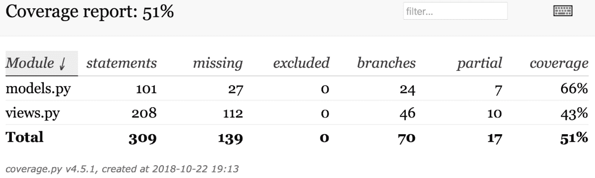
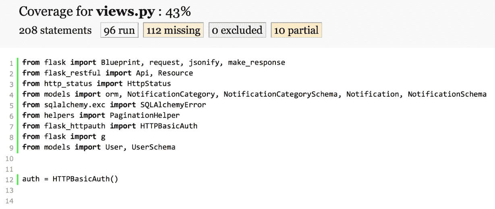
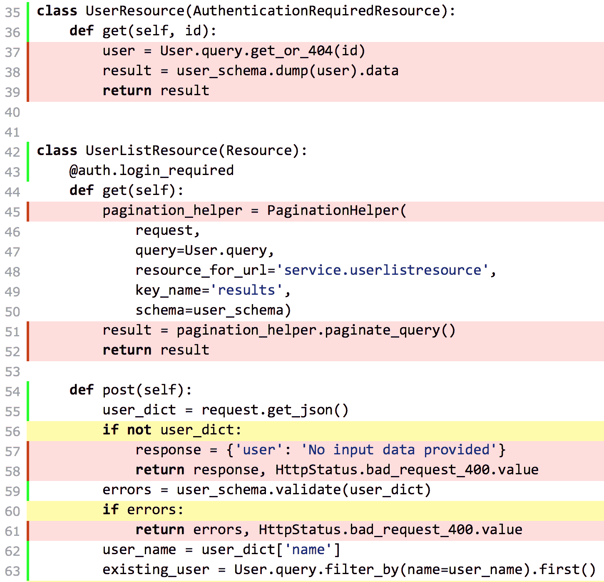

# 第四章：在 Flask 微服务中测试和部署 API

在本章中，我们将配置、编写和执行单元测试，并学习一些与部署相关的内容。我们将执行以下操作：

+   使用 `pytest` 设置单元测试

+   创建一个用于测试的数据库

+   创建用于执行设置和清理任务的固定值

+   编写第一轮单元测试

+   使用 `pytest` 运行单元测试并检查测试覆盖率

+   提高测试覆盖率

+   理解部署和可扩展性的策略

# 使用 pytest 设置单元测试

到目前为止，我们一直在编写代码以向我们的 RESTful API 添加功能。我们使用命令行和 GUI 工具来了解所有组件如何协同工作，并检查使用 Flask 开发服务器对 RESTful API 发出的各种 HTTP 请求的结果。现在我们将编写单元测试，以确保 RESTful API 如预期那样工作。在我们开始编写单元测试之前，有必要在我们的虚拟环境中安装许多附加包，创建一个新的 PostgreSQL 数据库供测试使用，并构建测试环境的配置文件。

确保你退出 Flask 的开发服务器。你只需在运行它的终端或命令提示符窗口中按 *Ctrl* + *C*。

现在，我们将安装许多附加包。请确保您已激活名为 `Flask01` 的虚拟环境，该环境在 第一章 *使用 Flask 开发 RESTful API 和微服务 1.0.2* 中创建。激活虚拟环境后，是时候运行许多命令了，这些命令在 macOS、Linux 或 Windows 上都是相同的。

现在，我们将编辑现有的 `requirements.txt` 文件，以指定我们的应用程序在任意支持平台上需要安装的附加包集。这样，在任意新的虚拟环境中重复安装指定包及其版本将变得极其容易。

使用您喜欢的编辑器编辑虚拟环境根目录下名为 `requirements.txt` 的现有文本文件。在最后一行之后添加以下行，以声明新版本的 API 所需的附加包及其版本。示例代码文件包含在 `restful_python_2_04_01` 文件夹中，位于 `Flask01/requirements.txt` 文件：

```py
pytest==4.0.1 
coverage==4.5.2 
pytest-cov==2.6.0 
```

`requirements.txt` 文件中添加的每一行都表示需要安装的包及其版本。以下表格总结了我们作为附加要求指定的包及其版本号：

| 包名 | 要安装的版本 |
| --- | --- |
| `pytest` | 4.0.1 |
| `coverage` | 4.5.2 |
| `pytest-cov` | 2.6.0 |

我们将在我们的虚拟环境中安装以下 Python 包：

+   `pytest`：这是一个非常流行的 Python 单元测试框架，它使测试变得简单，并减少了样板代码。

+   `coverage`：这个工具测量 Python 程序的代码覆盖率，我们将使用它来确定哪些代码部分被单元测试执行，哪些部分没有被执行。

+   `pytest-cov`：这个 `pytest` 插件使得使用 `coverage` 工具生成覆盖率报告变得简单，并提供了额外的功能。

现在，我们必须在 macOS、Linux 或 Windows 上运行以下命令，使用最近编辑的 `requirements.txt` 文件通过 `pip` 安装之前表格中概述的附加包和版本。在运行命令之前，请确保你位于包含 `requirements.txt` 文件的文件夹中：

```py
    pip install -r requirements.txt
```

输出的最后几行将指示所有新包及其依赖项已成功安装。如果你下载了示例的源代码，而你之前没有使用过该 API 的旧版本，`pip` 也会安装 `requirements.txt` 文件中包含的其他包：

```py
Installing collected packages: atomicwrites, six, more-itertools, pluggy, py, attrs, pytest, coverage, pytest-cov
Successfully installed atomicwrites-1.2.1 attrs-18.2.0 coverage-4.5.2 more-itertools-4.3.0 pluggy-0.8.0 py-1.7.0 pytest-4.0.1 pytest-cov-2.6.0 six-1.12.0

```

# 创建用于测试的数据库

现在，我们将创建我们将用作测试环境存储库的 PostgreSQL 数据库。请注意，测试计算机或服务器必须安装了 PostgreSQL 10.5，正如前几章中为开发环境所解释的那样。我假设你正在运行测试的计算机与你在之前示例中工作的计算机相同。

请记住确保 PostgreSQL 的 bin 文件夹包含在 `PATH` 环境变量中。你应该能够从当前的 Terminal、命令提示符或 Windows PowerShell 中执行 `psql` 命令行工具。

我们将使用 PostgreSQL 命令行工具创建一个名为 `test_flask_notifications` 的新数据库。如果你已经 ...

# 创建夹具以执行运行干净测试的设置和清理任务

测试夹具提供了一个固定的基线，使我们能够可靠地重复执行测试。Pytest 通过使用 `@pytest.fixture` 装饰器标记函数，使得声明测试夹具函数变得简单。然后，无论何时我们在测试函数声明中使用夹具函数名作为参数，`pytest` 都会使得夹具函数提供夹具对象。现在我们将创建以下两个 `pytest` 夹具函数，我们将在未来的测试函数中使用它们：

+   `application`：这个测试夹具函数将执行必要的设置任务，以创建具有适当测试配置的 Flask 测试应用，并在测试数据库中创建所有必要的表。夹具将启动测试执行，当测试完成后，夹具将执行必要的清理任务，使数据库在运行测试之前的状态保持不变。

+   `client`：这个测试固定函数接收`application`作为参数，因此，它接收在之前解释的应用程序测试固定函数中作为参数创建的 Flask 应用。因此，`client`测试固定函数为测试配置应用，初始化数据库，为该应用创建一个测试客户端并返回它。我们将在测试方法中使用测试客户端轻松地组合和发送请求到我们的 API。

在`service`文件夹内创建一个新的`conftest.py`文件。添加以下行，这些行声明了许多`import`语句以及之前解释过的`pytest`测试固定函数。示例代码文件包含在`restful_python_2_04_01`文件夹中，位于`Flask01/service/conftest.py`文件中：

```py
import pytest 
from app import create_app 
from models import orm 
from flask_sqlalchemy import SQLAlchemy 
from flask import Flask 
from views import service_blueprint 

@pytest.fixture 
def application(): 
    # Beginning of Setup code 
    app = create_app('test_config') 
    with app.app_context():    
        orm.create_all() 
        # End of Setup code 
        # The test will start running here 
        yield app 
        # The test finished running here 
        # Beginning of Teardown code 
        orm.session.remove() 
        orm.drop_all() 
        # End of Teardown code 

@pytest.fixture 
def client(application): 
    return application.test_client() 
```

`application`固定函数将在每次使用`application`或`client`作为参数的测试时执行。该函数使用`app`模块中声明的`create_app`函数，并传入`'test_config'`作为参数。该函数将使用此模块作为配置文件设置 Flask 应用，因此，该应用将使用之前创建的配置文件，该文件指定了测试数据库和环境的所需值。

下一个调用`orm.create_all`方法来创建在`test_config.py`文件中配置的测试数据库中所有必要的表。在`yield app`行之后的所有代码作为清理代码执行，在`app`被使用和测试执行之后执行。这段代码将移除 SQLAlchemy 会话并删除在测试数据库中创建的所有表，这样，每次测试完成后，测试数据库将再次为空。

# 编写第一轮单元测试

现在，我们将编写第一轮单元测试。具体来说，我们将编写与用户和通知类别资源相关的单元测试：`UserResource`、`UserListResource`、`NotificationCategoryResource`和`NotificationCategoryListResource`。

在`service`文件夹内创建一个新的`tests`子文件夹。然后，在新的`service/tests`子文件夹内创建一个新的`test_views.py`文件。添加以下行，这些行声明了许多`import`语句以及我们将在许多测试函数中使用的第一个函数。示例代码文件包含在`restful_python_2_04_01`文件夹中，位于`Flask01/service/tests/test_views.py`文件中：

```py
import pytest from base64 import b64encode from flask import current_app, json, ...
```

# 使用 pytest 运行单元测试并检查测试覆盖率

在`service`文件夹内创建一个新的`setup.cfg`文件。以下行显示了指定 pytest 和`coverage`工具所需配置的代码。示例代码文件包含在`restful_python_2_04_01`文件夹中，位于`Flask01/service/setup.cfg`文件中：

```py
[tool:pytest] 
testpaths = tests 

[coverage:run] 
branch = True 
source =  
    models 
    views 
```

`tool:pytest`部分指定了 pytest 的配置。`testpaths`设置将`tests`值分配给指示测试位于`tests`子文件夹中。

`coverage:run`部分指定了`coverage`工具的配置。`branch`设置设置为`True`以启用分支覆盖率测量，除了默认的语句覆盖率之外。`source`设置指定了我们希望考虑覆盖率测量的模块。我们只想包括`models`和`views`模块。

现在我们将使用`pytest`命令来运行测试并测量它们的代码覆盖率。请确保你在激活了虚拟环境的终端或命令提示符窗口中运行此命令，并且你位于`service`文件夹内。运行以下命令：

```py
    pytest --cov -s
```

测试运行器将执行所有在`test_views.py`中定义并以`test_`前缀开始的函数，并将显示结果。我们将使用`-v`选项来指示`pytest`以详细模式打印测试函数名称和状态。`--cov`选项通过使用`pytest-cov`插件启用测试覆盖率报告生成。

当我们在 API 上工作时，测试不会更改我们一直在使用的数据库。请记住，我们已将`test_flask_notifications`数据库配置为我们的测试数据库。

以下行显示了示例输出：

```py
=================================== test session starts ===================================
 latform darwin -- Python 3.7.1, pytest-4.0.1, py-1.7.0, pluggy-0.8.0 - 
 - /Users/gaston/HillarPythonREST2/Flask01/bin/python3
 cachedir: .pytest_cache
 rootdir: /Users/gaston/HillarPythonREST2/Flask01/service, inifile: 
 setup.cfg
 plugins: cov-2.6.0
 collected 5 items 

    tests/test_views.py::test_request_without_authentication PASSED                     
    [ 20%]
    tests/test_views.py::test_create_and_retrieve_notification_category 
    PASSED          [ 40%]
    tests/test_views.py::test_create_duplicated_notification_category 
    PASSED            [ 60%]
    tests/test_views.py::test_retrieve_notification_categories_list 
    PASSED              [ 80%]
    tests/test_views.py::test_update_notification_category PASSED                       
    [100%]

    ---------- coverage: platform darwin, python 3.7.1-final-0 --------
    ---
    Name        Stmts   Miss Branch BrPart  Cover
    ---------------------------------------------
    models.py     101     27     24      7    66%
    views.py      208    112     46     10    43%
    ---------------------------------------------
    TOTAL         309    139     70     17    51%

========================== 5 passed, 1 warnings in 18.15 seconds ==========================

```

Pytest 使用之前创建的`setup.cfg`文件中指定的配置来确定哪些路径包含以`test`前缀开始的模块名称。在这种情况下，唯一符合标准的模块是`test_views`模块。在符合标准的模块中，`pytest`从所有以`test`前缀开始的函数中加载测试。

输出提供了详细信息，测试运行器发现了并执行了五个测试，并且所有测试都通过了。输出显示了`test_views`模块中每个以`test_`前缀开始的方法的模块和函数名称，这些方法代表要执行的测试。

由`coverage`包和`pytest-cov`插件提供的测试代码覆盖率测量报告使用 Python 标准库中包含的代码分析工具和跟踪钩子来确定哪些代码行是可执行的，以及这些行中的哪些已被执行。报告提供了一个包含以下列的表格：

+   `Name`: Python 模块名称

+   `Stmts`: Python 模块中可执行语句的数量

+   `Miss`: 未执行的执行语句数量，即那些未执行的语句

+   `Branch`: Python 模块中可能的分支数量

+   `BrPart`: 测试过程中执行的分支数量

+   `Cover`: 可执行语句和分支的覆盖率，以百分比表示

根据报告中显示的测量结果，我们确实对 `views.py` 和 `models.py` 模块存在不完整的覆盖率。实际上，我们只编写了一些与通知类别和用户相关的测试，因此，对于 `views.py` 模块覆盖率低于 50% 是有道理的。我们没有创建与通知相关的测试。

我们可以使用带有 `-m` 命令行选项的 `coverage` 命令来显示新 `Missing` 列中缺失语句的行号：

```py
    coverage report -m
```

命令将使用上次执行的信息，并显示缺失的语句和缺失的分支。以下行显示了与之前单元测试执行相对应的示例输出。破折号（`-`）用于表示遗漏的行范围。例如，`22-23` 表示第 22 行和第 23 行缺少语句。破折号后跟大于号（`->`）表示从 `->` 前一行到其后一行的分支被遗漏。例如，`41->42` 表示从第 41 行到第 42 行的分支被遗漏：

```py
    Name        Stmts   Miss Branch BrPart  Cover   Missing
    -------------------------------------------------------
    models.py     101     27     24      7    66%   22-23, 38, 40, 42, 
    44, 46, 48, 68-75, 78-80, 94, 133-143, 37->38, 39->40, 41>42, 43-
    >44, 45->46, 47->48, 93->94
    views.py      208    112     46     10    43%   37-39, 45-52, 57-
    58, 61, 65-66, 77-81, 86-88, 91-118, 121-129, 134-141, 144-175, 
    188-189, 192, 199-200, 203-206, 209-217, 230-231, 234, 245-250, 56-
    >57, 60->61, 64->65, 71->77, 187->188, 191->192, 194->201, 196-
    >199, 229->230, 233->234
    -------------------------------------------------------
    TOTAL         309    139     70     17    51%

```

现在运行以下命令以获取详细说明遗漏行的注释 HTML 列表。该命令不会产生任何输出：

```py
    coverage html
```

使用您的网页浏览器打开在 `htmlcov` 文件夹中生成的 `index.html` HTML 文件。以下截图显示了生成的 HTML 格式报告的示例：



点击或轻触 `views.py`，网页浏览器将渲染一个显示已运行语句的网页，包括缺失的、排除的和部分执行的语句，并用不同的颜色标出。我们可以点击或轻触运行、缺失、排除和部分按钮来显示或隐藏代表每行代码状态的背景色。默认情况下，缺失的代码行将以粉色背景显示，部分执行的代码行将以黄色背景显示。因此，我们必须编写针对这些代码行的单元测试来提高我们的测试覆盖率。以下截图显示了带有总结的按钮：



下一张截图显示了 `views.py` 模块中某些代码行的突出显示的缺失行和部分评估的分支：



# 提高测试覆盖率

现在，我们将编写额外的测试函数来提高测试覆盖率。具体来说，我们将编写与通知和用户相关的单元测试。

打开现有的 `service/tests/test_views.py` 文件，在最后一行之后插入以下行。示例代码文件包含在 `restful_python_2_04_02` 文件夹中，位于 `Flask01/service/tests/test_views.py` 文件：

```py
def create_notification(client, message, ttl,notification_category): 
 url = url_for('service.notificationlistresource', _external=True) data = {'message': message, 'ttl': ttl, 'notification_category': notification_category} response = client.post( url, headers=get_authentication_headers(TEST_USER_NAME, TEST_USER_PASSWORD), data=json.dumps(data)) ...
```

# 理解部署和可扩展性的策略

Flask 是一个轻量级的网络微框架，因此，在我们需要提供一个封装在微服务中的 RESTful API 时，它是一个理想的选择。到目前为止，我们一直在使用 Werkzeug 提供的内置开发服务器和纯 HTTP 进行工作。

非常重要的是要理解 Flask 的内置开发服务器不适合生产环境。

Flask 有数十种部署选项，不同的堆栈和流程超出了本书的范围，本书专注于使用最流行的 Python 框架进行 RESTful API 的开发任务。最突出的云服务提供商包括如何使用不同配置部署 Flask 应用程序的说明。此外，还有许多选项可以使用 **WSGI**（即 **Web 服务器网关接口**）服务器，这些服务器实现了 WSGI 接口中的网络服务器部分，允许我们在生产环境中运行 Python 网络应用程序，例如 Flask 应用程序。

当然，在生产环境中，我们也会希望使用 HTTPS 而不是 HTTP。我们将不得不配置适当的 TLS 证书，也称为 SSL 证书。

我们使用 Flask 开发了一个 RESTful 网络服务。这类网络服务的关键优势在于它们是无状态的，也就是说，它们不应该在任何服务器上保持客户端状态。我们的 API 就是使用 Flask 实现的无状态 RESTful 网络服务的良好例子。Flask-RESTful 和 PostgreSQL 10.5 可以在 Docker 容器中容器化。例如，我们可以创建一个包含我们的应用程序配置，以运行 NGINX、uWSGI、Redis 和 Flask 的镜像。因此，我们可以使 API 作为微服务运行。

在部署我们 API 的第一个版本之前，我们始终必须确保我们对 API 和数据库进行性能分析。确保生成的查询在底层数据库上运行正常，以及最常用的查询不会最终导致顺序扫描，这一点非常重要。通常需要在数据库中的表上添加适当的索引。

我们一直在使用基本的 HTTP 身份验证。我们可以通过基于令牌的认证来改进它。我们必须确保 API 在生产环境中运行在 HTTPS 下。

使用不同的配置文件进行生产环境部署很方便。然而，另一种越来越受欢迎的方法，尤其是对于云原生应用，是将配置存储在环境中。如果我们想部署云原生 RESTful 网络服务并遵循《十二要素应用》中确立的指南，我们应该将配置存储在环境中。

每个平台都包含了部署我们应用的详细说明。它们都会要求我们生成`requirements.txt`文件，该文件列出了应用程序的依赖项及其版本。这样，平台就能够安装文件中列出的所有必要依赖项。每当我们需要在我们的虚拟环境中安装新包时，我们都会更新这个文件。然而，在虚拟环境的根目录`Flask01`中运行以下`pip freeze`命令以生成最终的`requirements.txt`文件是一个好主意：

```py
    pip freeze > requirements.txt
```

以下行显示了生成的示例`requirements.txt`文件的内容。请注意，生成的文件还包括了我们在原始`requirements.txt`文件中指定的所有依赖项：

```py
    alembic==1.0.0
    aniso8601==3.0.2
    atomicwrites==1.2.1
    attrs==18.2.0
    certifi==2018.8.24
    chardet==3.0.4
    Click==7.0
    coverage==4.5.1
    Flask==1.0.2
    Flask-HTTPAuth==3.2.4
    flask-marshmallow==0.9.0
    Flask-Migrate==2.3.0
    Flask-RESTful==0.3.6
    Flask-SQLAlchemy==2.3.2
    httpie==1.0.0
    idna==2.7
    itsdangerous==0.24
    Jinja2==2.10
    Mako==1.0.7
    MarkupSafe==1.0
    marshmallow==2.16.3
    marshmallow-sqlalchemy==0.15.0
    more-itertools==4.3.0
    passlib==1.7.1
    pluggy==0.8.0
    psycopg2==2.7.6.1
    py==1.7.0
    Pygments==2.2.0
    pytest==4.0.1
    pytest-cov==2.6.0
    python-dateutil==2.7.3
    python-editor==1.0.3
    pytz==2018.5
    requests==2.19.1
    six==1.11.0
    SQLAlchemy==1.2.12
    urllib3==1.23
    Werkzeug==0.14.1

```

# 测试你的知识

让我们看看你是否能正确回答以下问题：

1.  Pytest 通过标记函数以下哪个装饰器来声明一个测试固定函数？

    1.  `@pytest.fixture_function`

    1.  `@pytest.test_fixture`

    1.  `@pytest.fixture`

1.  默认情况下，pytest 在函数以以下哪个前缀开始时将其发现和执行为文本函数？

    1.  `test`

    1.  `test_`

    1.  `test-`

1.  以下哪个命令显示覆盖率报告中`Missing`列中缺失语句的行号？

    1.  `coverage report -m`

    1.  `coverage report missing`

    1.  `coverage -missing`

1.  Pytest 是一个非常流行的 Python：

    1.  使测试变得简单并减少样板代码的单元测试框架

    1.  我们可以运行的 WSGI 服务器...

# 摘要

在本章中，我们搭建了一个测试环境。我们安装了`pytest`以便于发现和执行单元测试，并创建了一个新的数据库用于测试。我们编写了一轮单元测试，使用`pytest-cov`插件和`coverage`工具测量测试覆盖率，然后编写了额外的单元测试以提高测试覆盖率。最后，我们了解了关于部署和可扩展性的许多考虑因素。

我们使用 Flask 结合 Flask-RESTful 和 PostgreSQL 10.5 数据库构建了一个复杂的 API，我们可以将其作为微服务运行，并对其进行了测试。现在，我们将转向另一个流行的 Python 网络框架 Django，这是下一章的主题。
