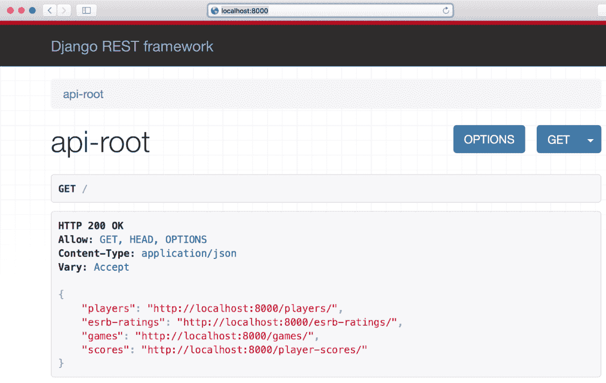

# 第六章：在 Django 2.1 中使用基于类的视图和超链接 API

在本章中，我们将扩展我们在上一章中开始构建的 RESTful API 的功能。我们将更改 ORM 设置以与更强大的 PostgreSQL 10.5 数据库一起工作，并利用**Django REST Framework**（**DRF**）中包含的先进功能，这些功能允许我们减少复杂 API（如基于类的视图）的样板代码。我们将查看以下内容：

+   使用模型序列化器来消除重复代码

+   使用包装器编写 API 视图

+   使用默认解析和渲染选项并超越 JSON

+   浏览 API

+   设计一个与复杂的 PostgreSQL 10.5 数据库交互的 RESTful API

+   理解每种 HTTP 方法执行的任务

+   使用模型声明关系

+   使用要求文件安装与 PostgreSQL 一起工作的包

+   配置数据库

+   运行迁移

+   验证 PostgreSQL 数据库的内容

+   使用关系和超链接管理序列化和反序列化

+   创建基于类的视图并使用通用类

+   充分利用基于类的通用视图

+   与 API 端点一起工作

+   浏览具有关系的 API

+   创建和检索相关资源

# 使用模型序列化器来消除重复代码

我们在第五章“使用 Django 2.1 开发 RESTful API”中编写的`GameSerializer`类声明了许多与我们在`Game`模型中使用的相同名称的属性，并重复了诸如字段类型和`max_length`值等信息。`GameSerializer`类是`rest_framework.serializers.Serializer`超类的子类，并声明了我们将手动映射到适当类型的属性，并重写了`create`和`update`方法。

现在我们将创建一个新的`GameSerializer`类版本，它将继承自`rest_framework.serializers.ModelSerializer`超类。`ModelSerializer`类自动填充一组默认字段和一组默认...

# 使用包装器编写 API 视图

我们在`games_service/games/views.py`文件中编写的代码声明了一个`JSONResponse`类和两个基于函数的视图。这些函数在需要返回 JSON 数据时返回`JSONResponse`，而在响应只是一个 HTTP 状态码时返回`django.Http.Response.HttpResponse`实例。因此，无论 HTTP 请求头中指定的接受内容类型是什么，视图函数始终在响应体中提供相同的内容——JSON。

运行以下两个命令以检索具有不同`Accept`请求头值的所有游戏：`text/html`和`application/json`。示例代码文件包含在`restful_python_2_06_01`文件夹中的`Django01/cmd/cmd601.txt`文件中：

```py
    http -v ":8000/games/" "Accept:text/html"
    http -v ":8000/games/" "Accept:application/json"
```

以下是对应的`curl`命令。示例代码文件包含在`restful_python_2_06_01`文件夹中的`Django01/cmd/cmd602.txt`文件中：

```py
    curl -H "Accept: text/html" -viX GET "localhost:8000/games/"
    curl -H "Accept: application/json" -viX GET "localhost:8000/games/"
```

之前的命令将组合并发送以下 HTTP 请求：`GET http://localhost:8000/games/`。我们已经请求了 `http` 和 `curl` 使用 `-v` 选项启用详细模式，它们指定了更多关于操作的信息，并显示了整个请求，包括请求头。

第一个命令为 `Accept` 请求头定义了 `text/html` 值。第二个命令为 `Accept` 请求头定义了 `application/json` 值。您将注意到这两个命令产生了相同的结果，因此，视图函数不会考虑 HTTP 请求中指定的 `Accept` 请求头值。这两个命令的响应头将包括以下行：

```py
    Content-Type: application/json
```

第二次请求指定它只接受 `text/html`，但响应中包含 JSON 主体，即 `application/json` 内容。因此，我们第一个版本的 RESTful API 没有准备好渲染除 JSON 之外的内容。我们将进行一些更改，以使 API 能够渲染其他内容。

当我们对 RESTful API 中资源或资源集合支持的方法有疑问时，我们可以使用 `OPTIONS` HTTP 动词和资源或资源集合的 URL 组合并发送 HTTP 请求。如果 RESTful API 为资源或资源集合实现了 `OPTIONS` HTTP 动词，它会在响应的 `Allow` 头部提供一个以逗号分隔的 HTTP 动词或方法列表，表示它支持的操作。此外，响应头还将包括有关其他支持选项的附加信息，例如它能够从请求中解析的内容类型以及它能够在响应中呈现的内容类型。

例如，如果我们想知道游戏集合支持哪些 HTTP 动词，我们可以运行以下命令。示例代码文件包含在 `restful_python_2_06_01` 文件夹中，在 `Django01/cmd/cmd603.txt` 文件中：

```py
    http OPTIONS ":8000/games/"
```

下面的命令是等效的 `curl` 命令。示例代码文件包含在 `restful_python_2_06_01` 文件夹中，在 `Django01/cmd/cmd604.txt` 文件中：

```py
    curl -iX OPTIONS "localhost:8000/games/"
```

之前的命令将组合并发送以下 HTTP 请求：`OPTIONS http://localhost:8000/games/`。该请求将匹配并运行 `views.game_collection` 函数，即位于 `game_service/games/views.py` 文件中声明的 `game_collection` 函数。此函数仅在 `request.method` 等于 `'GET'` 或 `'POST'` 时运行代码。在这种情况下，`request.method` 等于 `'OPTIONS'`，因此，该函数不会运行任何代码，也不会返回任何响应，特别是，它不会返回 `HttpResponse` 实例。因此，我们将看到下一张截图在 Django 开发服务器控制台输出中显示的 `Internal Server Error`：


以下行显示了输出头，其中还包括一个包含关于错误详细信息的巨大 HTML 文档，因为 Django 的调试模式已被激活。我们收到`500 内部服务器错误`状态码。请注意，您需要在终端或命令提示符中向上滚动以找到这些行：

```py
    HTTP/1.1 500 Internal Server Error
    Content-Length: 51566
    Content-Type: text/html
    Date: Thu, 25 Oct 2018 04:14:09 GMT
    Server: WSGIServer/0.2 CPython/3.7.1
    Vary: Cookie
    X-Frame-Options: SAMEORIGIN
```

显然，我们希望提供一个更一致的 API，并且当我们收到对游戏资源或游戏集合的`OPTIONS`动词的请求时，我们希望提供一个准确的响应。

如果我们使用`OPTIONS`动词对游戏资源发送组合和发送 HTTP 请求，我们将看到相同的错误，并且我们将得到类似的响应，因为`views.game_detail`函数仅在`request.method`等于`'GET'`、`'PUT'`或`'DELETE'`时运行代码。

以下命令将在我们尝试查看 ID 等于`2`的游戏资源提供的选项时产生所解释的错误。别忘了将`2`替换为您配置中现有游戏的键值。

```py
    http OPTIONS ":8000/games/3/"
```

以下是对应的`curl`命令。示例的代码文件包含在`restful_python_2_06_01`文件夹中，在`Django01/cmd/cmd606.txt`文件中：

```py
    curl -iX OPTIONS "localhost:8000/games/3/"
```

我们只需要在`games_service/games/views.py`文件中做一些小的修改，以解决我们一直在分析我们 RESTful API 的问题。我们将使用在`rest_framework.decorators`模块中声明的有用的`@api_view`装饰器来处理基于函数的视图。这个装饰器允许我们指定我们的函数可以处理哪些 HTTP 动词。如果必须由视图函数处理的请求的 HTTP 动词不包括在作为`@api_view`装饰器的`http_method_names`参数指定的字符串列表中，则默认行为返回`405 方法不允许`状态码。这样，我们确保每当收到不在我们函数视图中考虑的 HTTP 动词时，我们不会生成意外的错误，因为装饰器处理了不受支持的 HTTP 动词或方法。

在底层，`@api_view`装饰器是一个包装器，它将基于函数的视图转换为`rest_framework.views.APIView`类的子类。这个类是 Django REST 框架中所有视图的基类。正如我们可能猜测的那样，如果我们想使用基于类的视图，我们可以创建继承自这个类的类，我们将获得与使用装饰器的基于函数的视图相同的优势。我们将在本章接下来的示例中开始使用基于类的视图。

此外，由于我们指定了一个支持 HTTP 动词的字符串列表，装饰器会自动为支持的`OPTIONS` HTTP 动词构建响应，包括支持的方法、解析器和渲染能力。我们实际的 API 版本仅能渲染 JSON 作为其输出。装饰器的使用确保了当 Django 调用我们的视图函数时，我们总是接收到`rest_framework.request.Request`类的实例作为`request`参数。装饰器还处理当我们的函数视图访问可能引起解析问题的`request.data`属性时产生的`ParserError`异常。

# 使用默认解析和渲染选项，并超越 JSON

`APIView`类为每个视图指定了默认设置，我们可以通过在`games_service/settings.py`文件中指定适当的值或在`APIView`超类子类中覆盖类属性来覆盖这些设置。正如我们所学的，`APIView`类在底层使用装饰器应用这些默认设置。因此，每次我们使用装饰器时，默认解析器类和默认渲染器类都将与函数视图相关联。

默认情况下，`DEFAULT_PARSER_CLASSES`配置变量的值为以下包含三个解析器类名的字符串元组：

```py
( 'rest_framework.parsers.JSONParser', 'rest_framework.parsers.FormParser', ...
```

# 浏览 API

通过最近的编辑，我们使我们的 API 能够使用 Django REST Framework 中配置的默认内容渲染器，因此我们的 API 能够渲染`text/html`内容。我们可以利用 Django REST Framework 中包含的可浏览 API 功能，该功能在请求指定请求头中的`Content-type`键值为`text/html`时，为每个资源生成友好的 HTML 输出。

每当我们在一个网页浏览器中输入 API 资源的 URL 时，浏览器将需要 HTML 响应，因此 Django REST Framework 将提供由 Bootstrap 流行的前端组件库构建的 HTML 响应。您可以在[`getbootstrap.com`](http://getbootstrap.com)了解更多关于 Bootstrap 的信息。此响应将包括一个显示资源内容的 JSON 部分、执行不同请求的按钮以及提交数据到资源的表单。与 Django REST Framework 中的所有内容一样，我们可以自定义用于生成可浏览 API 的模板和主题。

打开一个网页浏览器并输入`http://localhost:8000/games/`。可浏览 API 将组合并发送一个 HTTP `GET`请求到`/games/`，并将显示其执行结果，即头部和 JSON 游戏列表。以下截图显示了在网页浏览器中输入 URL 后渲染的网页，其中包含游戏列表的资源描述。


如果你决定在另一台运行在 LAN 上的计算机或设备上的网页浏览器中浏览 API，请记住你必须使用开发计算机分配的 IP 地址，而不是 localhost。例如，如果计算机分配的 IPv4 IP 地址是`192.168.1.103`，那么你应该使用`http://192.168.1.103:8000/games/`而不是`http://localhost:8000/games/`。当然，你也可以使用主机名而不是 IP 地址。

可浏览的 API 使用关于资源允许的方法的信息，为我们提供运行这些方法的按钮。在资源描述的右侧，可浏览的 API 显示了一个 OPTIONS 按钮和一个 GET 下拉按钮。OPTIONS 按钮允许我们向`/games/`发送`OPTIONS`请求，即当前资源。GET 下拉按钮允许我们再次向`/games/`发送`GET`请求。如果我们点击或轻触向下箭头，我们可以选择 json 选项，可浏览的 API 将显示对`/games/`的`GET`请求的原始 JSON 结果，而不显示头部信息。

在渲染网页的底部，可浏览的 API 为我们提供了一些控件来生成一个向`/games/`发送的`POST`请求。媒体类型下拉菜单允许我们在 API 配置的支持的解析器之间进行选择：

+   `application/json`

+   `application/x-www-form-urlencoded`

+   `multipart/form-data`

内容文本框允许我们指定要发送到`POST`请求的数据，格式与媒体类型下拉菜单中指定的一致。在媒体类型下拉菜单中选择 application/json，并在内容文本框中输入以下 JSON 内容：

```py
{ 
    "name": "Assassin's Creed Origins", 
    "release_date": "2018-01-10T03:02:00.776594Z", 
    "esrb_rating": "M (Mature)" 
}
```

点击或轻触 POST。可浏览的 API 将组合并发送一个包含之前指定数据的`POST`请求到`/games/`，我们将在网页浏览器中看到调用结果。以下截图显示了一个网页浏览器在响应中显示了 HTTP 状态码`201 Created`，以及之前解释过的下拉菜单和文本框，其中包含 POST 按钮，允许我们继续编写并发送`POST`请求：


现在输入现有游戏资源的 URL，例如`http://localhost:8000/games/7/`。确保将`7`替换为之前渲染的“游戏列表”中现有游戏的 ID。可浏览的 API 将组合并发送一个 HTTP `GET`请求到`/games/7/`，并将显示其执行结果，即游戏的头部信息和 JSON 数据。以下截图显示了在网页浏览器中输入 URL 后的渲染网页，其中包含“游戏详情”的资源描述：


可浏览的 API 功能使我们能够轻松检查 API 的工作方式，并在任何可以访问我们局域网的 Web 浏览器中组合和发送不同方法的 HTTP 请求。我们将利用可浏览 API 中包含的附加功能，例如 HTML 表单，它允许我们在使用 Python 和 Django REST 框架构建了一个新的更复杂的 RESTful API 之后轻松创建新的资源。

# 设计一个 RESTful API 以与复杂的 PostgreSQL 10.5 数据库交互

到目前为止，我们的基于 Django 的 RESTful API 在 SQLite 数据库的单个数据库表上执行 CRUD 操作。现在，我们想要使用 Django REST 框架创建一个更复杂的 RESTful API，以与一个复杂的数据库模型交互，该模型必须允许我们为属于 ESRB 评分的游戏注册玩家分数。在我们之前的 RESTful API 中，我们使用一个字符串字段来指定游戏的 ESRB 评分。在这种情况下，我们希望能够轻松检索具有特定 ESRB 评分的所有游戏，因此，我们将有一个游戏和 ESRB 评分之间的关系。

我们必须能够在不同的相关资源上执行 CRUD 操作...

# 理解每种 HTTP 方法执行的任务

下表显示了我们的 API 必须支持的 HTTP 动词、范围和语义。每个方法由一个 HTTP 动词和一个范围组成，并且所有方法对所有资源和集合都有明确定义的意义：

| HTTP 动词 | 范围 | 语义 |
| --- | --- | --- |
| `GET` | ESRB 评分集合 | 获取集合中存储的所有 ESRB 评分，按描述升序排序。每个 ESRB 评分必须包括属于该评分的每个游戏资源的 URL 列表。 |
| `GET` | ESRB 评分 | 获取单个 ESRB 评分。ESRB 评分必须包括属于该评分的每个游戏资源的 URL 列表。 |
| `POST` | ESRB 评分集合 | 在集合中创建一个新的 ESRB 评分。 |
| `PUT` | ESRB 评分 | 更新现有的 ESRB 评分。 |
| `PATCH` | ESRB 评分 | 更新现有 ESRB 评分的一个或多个字段。 |
| `DELETE` | ESRB 评分 | 删除现有的 ESRB 评分。 |
| `GET` | 游戏集合 | 获取集合中存储的所有游戏，按名称升序排序。每个游戏必须包括其 ESRB 评分描述。 |
| `GET` | 游戏 | 获取单个游戏。游戏必须包括其 ESRB 评分描述。 |
| `POST` | 游戏集合 | 在集合中创建一个新的游戏。 |
| `PUT` | ESRB 评分 | 更新现有的游戏。 |
| `PATCH` | ESRB 评分 | 更新现有游戏的一个或多个字段。 |
| `DELETE` | ESRB 评分 | 删除现有的游戏。 |
| `GET` | 玩家集合 | 获取集合中所有存储的玩家，按姓名升序排序。每个玩家必须包括按分数降序排序的已注册分数列表。列表必须包括玩家获得的分数及其相关游戏的详细信息。 |
| `GET` | 玩家 | 获取单个玩家。玩家必须包括按分数降序排序的已注册分数列表。列表必须包括玩家获得的分数及其相关游戏的详细信息。 |
| `POST` | 玩家集合 | 在集合中创建一个新的玩家。 |
| `PUT` | 玩家 | 更新现有玩家。 |
| `PATCH` | 玩家 | 更新现有玩家的一个或多个字段。 |
| `DELETE` | 玩家 | 删除现有玩家。 |
| `GET` | 分数集合 | 获取集合中所有存储的分数，按分数降序排序。每个分数必须包括获得分数的玩家的姓名和游戏的名称。 |
| `GET` | 分数 | 获取单个分数。分数必须包括获得分数的玩家的姓名和游戏的名称。 |
| `POST` | 分数集合 | 在集合中创建一个新的分数。分数必须与现有玩家和现有游戏相关。 |
| `PUT` | 分数 | 更新现有分数。 |
| `PATCH` | 分数 | 更新现有分数的一个或多个字段。 |
| `DELETE` | 分数 | 删除现有分数。 |

我们希望我们的 API 能够更新现有资源的单个字段，因此我们将提供 `PATCH` 方法的实现。此外，我们的 RESTful API 必须支持所有资源和资源集合的 `OPTIONS` 方法。

我们将使用 Django REST 框架中包含的所有特性和可重用元素，以简化我们的 API 构建。我们将使用 PostgreSQL 10.5 数据库。如果你不想花时间安装 PostgreSQL，你可以跳过我们在 Django REST 框架 ORM 配置中做的更改，并继续使用默认的 SQLite 数据库。然而，强烈建议使用 PostgreSQL 作为数据库引擎。

在前一个表中，我们有一个大量方法和范围。以下列表列举了前一个表中提到的每个范围的 URI，其中 `{id}` 必须替换为资源的数字 ID：

+   **ESRB 评分集合**: `/esrb-ratings/`

+   **ESRB 评分**: `/esrb-rating/{id}/`

+   **游戏集合**: `/games/`

+   **游戏**: `/game/{id}/`

+   **玩家集合**: `/players/`

+   **玩家**: `/player/{id}/`

+   **分数集合**: `/player-scores/`

+   **分数**: `/player-score/{id}/`

让我们假设 `http://localhost:8000/` 是 Django 开发服务器上运行的 API 的 URL。我们必须使用以下 HTTP 动词 (`GET`) 和请求 URL (`http://localhost:8000/esrb-ratings/`) 编排并发送一个 HTTP 请求，以检索集合中所有存储的 ESRB 评分：

```py
GET http://localhost:8000/esrb-ratings/
```

# 声明与模型的关系

确保你已退出 Django 的开发服务器。记住，你只需要在运行该服务器的终端或命令提示符窗口中按 *Ctrl* + *C*。现在我们将创建我们将用来表示和持久化 ESRB 评分、游戏、玩家和分数以及它们之间关系的模型。

在 `games_service/games` 文件夹中打开 `models.py` 文件。将此文件中的代码替换为以下行。与其它模型相关的字段声明在代码列表中被突出显示。示例的代码文件包含在 `restful_python_2_06_01` 文件夹中，位于 `Django01/games-service/games/models.py` 文件：

```py
from django.db import models class EsrbRating(models.Model): description ...
```

# 使用 `requirements.txt` 文件安装包以与 PostgreSQL 一起工作

确保你已退出 Django 开发服务器。你只需要在运行该服务器的终端或命令提示符窗口中按 *Ctrl* + *C*。

现在我们将安装一个额外的包。确保你已经激活了上一章中创建的虚拟环境，我们将其命名为 `Django01`。激活虚拟环境后，就是运行许多命令的时候了，这些命令在 macOS、Linux 或 Windows 上都是相同的。

现在我们将编辑现有的 `requirements.txt` 文件，以指定我们的应用程序在任意支持平台上需要安装的额外包。这样，在任意新的虚拟环境中重复安装指定包及其版本将会变得极其容易。

使用你喜欢的编辑器编辑虚拟环境根目录下名为 `requirements.txt` 的现有文本文件。在最后一行之后添加以下行以声明新版本的 API 所需要的额外包及其版本：`psycopg2` 版本 2.7.5。示例的代码文件包含在 `restful_python_2_06_01` 文件夹中，位于 `Django01/requirements.txt` 文件：

```py
psycopg2==2.7.5 
```

Psycopg 2 (`psycopg2`) 是一个 Python-PostgreSQL 数据库适配器，Django 的集成 ORM 将会使用它来与我们的最近创建的 PostgreSQL 数据库进行交互。再次强调，在运行此包的安装之前，确保 PostgreSQL 的 `bin` 文件夹已包含在 `PATH` 环境变量中是非常重要的。

现在我们必须在 macOS、Linux 或 Windows 上运行以下命令来安装额外的包以及之前表格中解释的版本，使用 `pip` 通过最近编辑的 `requirements.txt` 文件进行安装。确保在运行命令之前你位于包含 `requirements.txt` 文件（`Django01`）的文件夹中：

```py
pip install -r requirements.txt 
```

输出的最后几行将指示新包已成功安装。如果你下载了示例的源代码，并且你没有使用 API 的先前版本，`pip` 也会安装 `requirements.txt` 文件中包含的其他包：

```py
    Installing collected packages: psycopg2
    Successfully installed psycopg2-2.7.5
```

# 配置数据库

默认的 SQLite 数据库引擎和数据库文件名在`games_service/games_service/settings.py`Python 文件中指定。为了在这个示例中使用 PostgreSQL 10.5 而不是 SQLite，请将此文件中`DATABASES`字典的声明替换为以下行。嵌套字典将名为`default`的数据库映射到`django.db.backends.postgresql`数据库引擎、所需的数据库名称及其设置。在这种情况下，我们将创建一个名为 games 的数据库。

确保您在`'NAME'`键的值中指定了所需的数据库名称，并根据您最近创建的用户和您的 PostgreSQL 10.5 配置配置用户、密码、主机和端口。...

# 运行迁移

现在运行以下 Python 脚本以生成允许我们首次同步数据库的迁移。确保您位于虚拟环境根目录(`Django01`)下的`games_service`文件夹中。请注意，我们在下一个脚本中使用的是 Django 应用名称`games`，而不是 PostgreSQL 数据库名称`django_games`：

```py
    python manage.py makemigrations games
```

以下行显示了运行上一条命令后的输出结果：

```py
    Migrations for 'games':
      games/migrations/0001_initial.py
        - Create model EsrbRating
        - Create model Game
        - Create model Player
        - Create model PlayerScore
```

输出表明`games_service/games/migrations/0001_initial.py`文件包含了创建`EsrbRating`、`Game`、`Player`和`PlayerScore`模型的代码。以下行显示了由 Django 及其集成 ORM 自动生成的此文件的代码。示例的代码文件包含在`restful_python_2_06_01`文件夹中，在`Django01/games-service/games/migrations/0001_initial.py`文件中：

```py
# Generated by Django 2.1.2 on 2018-10-25 20:15 

from django.db import migrations, models 
import django.db.models.deletion 

class Migration(migrations.Migration): 

    initial = True 

    dependencies = [ 
    ] 

    operations = [ 
        migrations.CreateModel( 
            name='EsrbRating', 
            fields=[ 
                ('id', models.AutoField(auto_created=True, primary_key=True, serialize=False, verbose_name='ID')), 
                ('description', models.CharField(max_length=200)), 
            ], 
            options={ 
                'ordering': ('description',), 
            }, 
        ), 
        migrations.CreateModel( 
            name='Game', 
            fields=[ 
                ('id', models.AutoField(auto_created=True, primary_key=True, serialize=False, verbose_name='ID')), 
                ('created', models.DateTimeField(auto_now_add=True)), 
                ('name', models.CharField(max_length=200)), 
                ('release_date', models.DateTimeField()), 
                ('played_once', models.BooleanField(default=False)), 
                ('played_times', models.IntegerField(default=0)), 
                ('esrb_rating', models.ForeignKey(on_delete=django.db.models.deletion.CASCADE, related_name='games', to='games.EsrbRating')), 
            ], 
            options={ 
                'ordering': ('name',), 
            }, 
        ), 
        migrations.CreateModel( 
            name='Player', 
            fields=[ 
                ('id', models.AutoField(auto_created=True, primary_key=True, serialize=False, verbose_name='ID')), 
                ('created', models.DateTimeField(auto_now_add=True)), 
                ('name', models.CharField(max_length=50)), 
                ('gender', models.CharField(choices=[('M', 'Male'), ('F', 'Female')], default='M', max_length=2)), 
            ], 
            options={ 
                'ordering': ('name',), 
            }, 
        ), 
        migrations.CreateModel( 
            name='PlayerScore', 
            fields=[ 
                ('id', models.AutoField(auto_created=True, primary_key=True, serialize=False, verbose_name='ID')), 
                ('score', models.IntegerField()), 
                ('score_date', models.DateTimeField()), 
                ('game', models.ForeignKey(on_delete=django.db.models.deletion.CASCADE, to='games.Game')), 
                ('player', models.ForeignKey(on_delete=django.db.models.deletion.CASCADE, related_name='scores', to='games.Player')), 
            ], 
            options={ 
                'ordering': ('-score',), 
            }, 
        ), 
    ] 
```

代码定义了一个名为`Migration`的`django.db.migrations.Migration`类的子类，该类定义了一个包含许多`migrations.CreateModel`的`operations`列表。每个`migrations.CreateModel`方法将为每个相关模型创建一个表。请注意，Django 已自动为每个模型添加了一个`id`字段。

`operations`按它们在列表中出现的顺序执行。代码创建了`EsrbRating`、`Game`、`Player`和`PlayerScore`。当创建这些模型时，代码为`Game`和`PlayerScore`创建了外键。

现在运行以下 Python 脚本以应用所有生成的迁移：

```py
    python manage.py migrate
```

以下行显示了运行上一条命令后的输出结果：

```py
    Operations to perform:
      Apply all migrations: admin, auth, contenttypes, games, sessions
    Running migrations:
      Applying contenttypes.0001_initial... OK
      Applying auth.0001_initial... OK
      Applying admin.0001_initial... OK
      Applying admin.0002_logentry_remove_auto_add... OK
      Applying admin.0003_logentry_add_action_flag_choices... OK
      Applying contenttypes.0002_remove_content_type_name... OK
      Applying auth.0002_alter_permission_name_max_length... OK
      Applying auth.0003_alter_user_email_max_length... OK
      Applying auth.0004_alter_user_username_opts... OK
      Applying auth.0005_alter_user_last_login_null... OK
      Applying auth.0006_require_contenttypes_0002... OK
      Applying auth.0007_alter_validators_add_error_messages... OK
      Applying auth.0008_alter_user_username_max_length... OK
      Applying auth.0009_alter_user_last_name_max_length... OK
      Applying games.0001_initial... OK
      Applying sessions.0001_initial... OK

```

# 验证 PostgreSQL 数据库的内容

在我们运行上一条命令后，我们可以使用 PostgreSQL 命令行或任何允许我们轻松检查 PostgreSQL 10.5 数据库内容的其他应用程序来检查 Django 生成的表。

运行以下命令以列出生成的表。如果您使用的数据库名称不是`django_games`，请确保您使用适当的数据库名称。示例的代码文件包含在`restful_python_2_06_01`文件夹中，在`Django01/cmd/list_database_tables.sql`文件中：

```py
    psql --username=your_games_user_name --dbname=django_games --    command="\dt"

```

以下行显示了所有生成的表名输出：

```py
                             List of relations
     Schema | Name ...
```

# 使用关系和超链接管理序列化和反序列化

我们的新 RESTful Web API 必须能够将`EsrbRating`、`Game`、`Player`和`PlayerScore`实例序列化和反序列化为 JSON 表示。在这种情况下，我们创建序列化器类来管理对 JSON 的序列化和从 JSON 的反序列化时，还必须特别注意不同模型之间的关系。

在我们之前 API 的最后一个版本中，我们创建了一个`rest_framework.serializers.ModelSerializer`类的子类，以便更容易生成序列化器并减少样板代码。在这种情况下，我们还将声明一个继承自`ModelSerializer`的类，但三个类将继承自`rest_framework.serializers.HyperlinkedModelSerializer`类。

`HyperlinkedModelSerializer`是`ModelSerializer`的一种类型，它使用超链接关系而不是主键关系，因此，它使用超链接而不是主键值来表示与其他模型实例的关系。此外，`HyperlinkedModelSerializer`生成一个名为`url`的字段，其值为资源的 URL。与`ModelSerializer`一样，`HyperlinkedModelSerializer`类为`create`和`update`方法提供了默认实现。

打开`games_service/games`文件夹中的`serializers.py`文件。用以下行替换此文件中的代码。新代码声明了所需的导入和`EsrbRatingSerializer`类。我们稍后会将更多类添加到该文件中。示例代码文件包含在`restful_python_2_06_01`文件夹中，位于`Django01/games-service/games/serializers.py`文件中：

```py
from rest_framework import serializers 
from games.models import EsrbRating 
from games.models import Game 
from games.models import Player 
from games.models import PlayerScore 
import games.views 

class EsrbRatingSerializer(serializers.HyperlinkedModelSerializer): 
    games = serializers.HyperlinkedRelatedField( 
        many=True, 
        read_only=True, 
        view_name='game-detail') 

    class Meta: 
        model = EsrbRating 
        fields = ( 
            'url', 
            'id', 
            'description', 
            'games') 
```

`EsrbRatingSerializer`类是`HyperlinkedModelSerializer`超类的子类。`EsrbRatingSerializer`类声明了一个`games`属性，它是一个`serializers.HyperlinkedRelatedField`实例，其中`many`和`read_only`都设置为`True`，因为它是一对多关系且只读。我们使用我们在创建`Game`模型中的`esrb_rating`字段时指定的`related_name`字符串值作为`games`名称。这样，`games`字段将为我们提供指向属于 ESRB 评分的每个游戏的超链接数组。`view_name`的值是`'game-detail'`，因为我们希望可浏览的 API 功能使用游戏详情视图来渲染超链接，当用户点击或轻触它时。

`EsrbRatingSerializer`类声明了一个`Meta`内部类，该类声明了以下两个属性：

+   `model`: 此属性指定与序列化器相关的模型，即`EsrbRating`类。

+   `fields`：此属性指定了一个字符串的元组，其值表示我们想要包含在从相关模型序列化中的字段名称。我们想要包含主键和 URL，因此，代码将 `'id'` 和 `'url'` 都指定为元组的成员。

在这种情况下，无需重写 `create` 或 `update` 方法，因为通用行为将足够。`HyperlinkedModelSerializer` 超类为这两个方法提供了实现。

打开 `games_service/games` 文件夹中的 `serializers.py` 文件，并在最后一行之后添加以下行以声明 `GameSerializer` 类。示例代码文件包含在 `restful_python_2_06_01` 文件夹中，位于 `Django01/games-service/games/serializers.py` 文件中：

```py
class GameSerializer(serializers.HyperlinkedModelSerializer): 
    # We want to display the game ESRB rating description instead of its id 
    esrb_rating = serializers.SlugRelatedField( 
        queryset=EsrbRating.objects.all(),  
        slug_field='description') 

    class Meta: 
        model = Game 
        fields = ( 
            'url', 
            'esrb_rating', 
            'name', 
            'release_date', 
            'played_once', 
            'played_times') 
```

`GameSerializer` 类是 `HyperlinkedModelSerializer` 超类的子类。`GameSerializer` 类声明了一个 `esrb_rating` 属性，它是一个 `serializers.SlugRelatedField` 类的实例，其 `queryset` 参数设置为 `EsrbRating.objects.all()`，其 `slug_field` 参数设置为 `'description'`。

`SlugRelatedField` 是一个读写字段，它通过一个唯一的 slug 属性表示关系的目标，即描述。

我们在 `Game` 模型中将 `esrb_rating` 字段创建为一个 `models.ForeignKey` 实例，并且我们想要显示 ESRB 评分的 `description` 值作为相关 `EsrbRating` 的描述（slug 字段）。因此，我们指定了 `'description'` 作为 `slug_field`。如果需要在可浏览的 API 中的表单中显示相关 ESRB 评分的可能选项，Django 将使用在 `queryset` 参数中指定的表达式检索所有可能实例并显示它们指定的 slug 字段。

`EsrbRatingSerializer` 类声明了一个 `Meta` 内部类，该类声明了以下两个属性：

+   `model`：此属性指定与序列器相关的模型，即 `Game` 类。

+   `fields`：此属性指定了一个字符串的元组，其值表示我们想要包含在从相关模型序列化中的字段名称。我们只想包含 URL，因此，代码将 `'url'` 作为元组的成员，但没有指定 `'id'`。`esrb_rating` 字段将为相关的 `EsrbRating` 指定 `description` 字段。

打开 `games_service/games` 文件夹中的 `serializers.py` 文件，并在最后一行之后添加以下行以声明 `ScoreSerializer` 类。示例代码文件包含在 `restful_python_2_06_01` 文件夹中，位于 `Django01/games-service/games/serializers.py` 文件中：

```py
class ScoreSerializer(serializers.HyperlinkedModelSerializer): 
    # We want to display all the details for the related game 
    game = GameSerializer() 
    # We don't include the player because a score will be nested in the player 

    class Meta: 
        model = PlayerScore 
        fields = ( 
            'url', 
            'id', 
            'score', 
            'score_date', 
            'game') 
```

`ScoreSerializer` 类是 `HyperlinkedModelSerializer` 超类的子类。我们将使用 `ScoreSerializer` 类来序列化与 `Player` 相关的 `PlayerScore` 实例，即在我们序列化 `Player` 时显示特定玩家的所有分数。我们希望显示相关 `Game` 的所有细节，但我们不包括相关的 `Player`，因为 `Player` 将使用这个 `ScoreSerializer` 序列化器。

`ScoreSerializer` 类声明了一个 `game` 属性，其类型为之前编写的 `GameSerializer` 类的实例。我们在 `PlayerScore` 模型中创建了一个 `game` 字段作为 `models.ForeignKey` 实例，并且我们想要序列化与 `GameSerializer` 类中编写的相同的数据。

`ScoreSerializer` 类声明了一个 `Meta` 内部类，该类声明了以下两个属性：

+   `model`: 此属性指定与序列化器相关的模型，即 `PlayerScore` 类。

+   `fields`: 此属性指定一个字符串元组，其值表示我们想要在序列化中包含的相关模型的字段名称。在这种情况下，我们包括 `'url'` 和 `'id'`。如前所述，我们不将 `'player'` 字段名称包含在这个字符串元组中，以避免再次序列化玩家。

我们将使用 `PlayerSerializer` 作为主类，`ScoreSerializer` 作为细节类。

打开 `games_service/games` 文件夹中的 `serializers.py` 文件，并在最后一行之后添加以下行以声明 `PlayerSerializer` 类。示例代码文件包含在 `restful_python_2_06_01` 文件夹中，位于 `Django01/games-service/games/serializers.py` 文件中：

```py
class PlayerSerializer(serializers.HyperlinkedModelSerializer): 
    scores = ScoreSerializer(many=True, read_only=True) 
    gender = serializers.ChoiceField( 
        choices=Player.GENDER_CHOICES) 
    gender_description = serializers.CharField( 
        source='get_gender_display',  
        read_only=True) 

    class Meta: 
         model = Player 
         fields = ( 
               'url', 
               'name', 
               'gender', 
               'gender_description', 
               'scores') 
```

`PlayerSerializer` 类是 `HyperlinkedModelSerializer` 超类的子类。我们将使用 `PlayerSerializer` 类来序列化 `Player` 实例，并使用之前声明的 `ScoreSerializer` 类来序列化与 `Player` 相关的所有 `PlayerScore` 实例。

`PlayerSerializer` 类声明了一个 `scores` 属性，其类型为之前编写的 `ScoreSerializer` 类的实例。`many` 参数设置为 `True`，因为这是一个一对多关系。我们使用在创建 `PlayerScore` 模型中的 `player` 字段时指定的 `scores` 名称作为 `related_name` 字符串值。这样，`scores` 字段将通过使用之前声明的 `ScoreSerializer` 来渲染属于 `Player` 的每个 `PlayerScore`。

`Player` 模型将 `gender` 声明为 `models.CharField` 的实例，其 `choices` 属性设置为 `Player.GENDER_CHOICES` 字符串元组。`ScoreSerializer` 类声明了一个 `gender` 属性，它是一个 `serializers.ChoiceField` 的实例，其 `choices` 参数设置为 `Player.GENDER_CHOICES` 字符串元组。此外，该类声明了一个 `gender_description` 属性，其中 `read_only` 设置为 `True`，`source` 参数设置为 `'get_gender_display'`。`source` 字符串是通过 `get_` 后跟字段名 `gender` 和 `_display` 构建的。这样，只读的 `gender_description` 属性将渲染性别选择的描述，而不是存储的单个字符值。`ScoreSerializer` 类声明了一个 `Meta` 内部类，该类声明了 `model` 和 `fields` 属性。`model` 属性指定了 `Player` 类。

打开 `games_service/games` 文件夹中的 `serializers.py` 文件，并在最后一行之后添加以下行以声明 `PlayerScoreSerializer` 类。示例代码文件包含在 `restful_python_2_06_01` 文件夹中，位于 `Django01/games-service/games/serializers.py` 文件中：

```py
class PlayerScoreSerializer(serializers.ModelSerializer): 
    # We want to display the players's name instead of its id 
   player = serializers.SlugRelatedField(queryset=Player.objects.all(), slug_field='name') 
   # We want to display the game's name instead of its id 
   game = serializers.SlugRelatedField(queryset=Game.objects.all(), slug_field='name') 

   class Meta: 
         model = PlayerScore 
         fields = ( 
               'url', 
               'id', 
               'score', 
               'score_date', 
               'player', 
               'game')
```

`PlayerScoreSerializer` 类是 `HyperlinkedModelSerializer` 超类的子类。我们将使用 `PlayerScoreSerializer` 类来序列化 `PlayerScore` 实例。之前，我们创建了 `ScoreSerializer` 类来序列化 `PlayerScore` 实例作为玩家的详细信息。当我们想要显示相关玩家的姓名和相关游戏的名称时，我们将使用新的 `PlayerScoreSerializer` 类。在其他序列化类中，我们没有包含任何与玩家相关的信息，并且包含了游戏的所有详细信息。

`PlayerScoreSerializer` 类声明了一个 `player` 属性，它是一个 `serializers.SlugRelatedField` 的实例，其 `queryset` 参数设置为 `Player.objects.all()`，其 `slug_field` 参数设置为 `'name'`。我们在 `PlayerScore` 模型中创建了一个 `player` 字段作为 `models.ForeignKey` 实例，我们希望将玩家的名称作为相关 `Player` 的描述（slug 字段）。因此，我们将 `'name'` 作为 `slug_field` 参数。如果需要在可浏览的 API 中的表单中显示相关玩家的可能选项，Django 将使用 `queryset` 参数中指定的表达式检索所有可能的玩家并显示它们的指定 slug 字段。

`PlayerScoreSerializer` 类声明了一个 `game` 属性，它是一个 `serializers.SlugRelatedField` 的实例，其 `queryset` 参数设置为 `Game.objects.all()`，其 `slug_field` 参数设置为 `'name'`。我们在 `PlayerScore` 模型中创建了一个 `game` 字段作为 `models.ForeignKey` 实例，我们希望将游戏的名称作为相关 `Game` 的描述（slug 字段）。

# 创建基于类的视图和使用通用类

这次，我们将通过声明基于类的视图来编写我们的 API 视图，而不是基于函数的视图。我们可能会编写从`rest_framework.views.APIView`类继承的类，并声明与我们要处理的 HTTP 动词具有相同名称的方法：`get`、`post`、`put`、`patch`、`delete`等。这些方法接收一个`request`参数，就像我们为视图创建的函数一样。然而，这种方法将需要我们编写大量的代码。相反，我们可以利用一组通用视图，我们可以将它们用作基于类的视图的基础类，以将所需的代码量减少到最小，并利用已经泛化的行为 ...

# 利用通用类视图

打开`games_service/games`文件夹中的`views.py`文件。用以下行替换此文件中的代码。新代码声明了所需的导入和基于类的视图。我们稍后将在该文件中添加更多类。示例的代码文件包含在`restful_python_2_06_01`文件夹中，在`Django01/games-service/games/views.py`文件中：

```py
from games.models import EsrbRating 
from games.models import Game 
from games.models import Player 
from games.models import PlayerScore 
from games.serializers import EsrbRatingSerializer 
from games.serializers import GameSerializer 
from games.serializers import PlayerSerializer 
from games.serializers import PlayerScoreSerializer 
from rest_framework import generics 
from rest_framework.response import Response 
from rest_framework.reverse import reverse 

class EsrbRatingList(generics.ListCreateAPIView): 
    queryset = EsrbRating.objects.all() 
    serializer_class = EsrbRatingSerializer 
    name = 'esrbrating-list' 

class EsrbRatingDetail(generics.RetrieveUpdateDestroyAPIView): 
    queryset = EsrbRating.objects.all() 
    serializer_class = EsrbRatingSerializer 
    name = 'esrbrating-detail' 

class GameList(generics.ListCreateAPIView): 
    queryset = Game.objects.all() 
    serializer_class = GameSerializer 
    name = 'game-list' 

class GameDetail(generics.RetrieveUpdateDestroyAPIView): 
    queryset = Game.objects.all() 
    serializer_class = GameSerializer 
    name = 'game-detail' 

class PlayerList(generics.ListCreateAPIView): 
    queryset = Player.objects.all() 
    serializer_class = PlayerSerializer 
    name = 'player-list' 

class PlayerDetail(generics.RetrieveUpdateDestroyAPIView): 
    queryset = Player.objects.all() 
    serializer_class = PlayerSerializer 
    name = 'player-detail' 

class PlayerScoreList(generics.ListCreateAPIView): 
    queryset = PlayerScore.objects.all() 
    serializer_class = PlayerScoreSerializer 
    name = 'playerscore-list' 

class PlayerScoreDetail(generics.RetrieveUpdateDestroyAPIView): 
    queryset = PlayerScore.objects.all() 
    serializer_class = PlayerScoreSerializer 
    name = 'playerscore-detail' 
```

下表总结了每个基于类的视图将要处理的方法：

| 范围 | 基于类的视图名称 | 它将要处理的 HTTP 动词 |
| --- | --- | --- |
| ESRB 评分集合: `/esrb-ratings/` | `EsrbRatingList` | `GET`、`POST` 和 `OPTIONS` |
| ESRB 评分: `/esrb-rating/{id}/` | `EsrbRatingDetail` | `GET`、`PUT`、`PATCH`、`DELETE` 和 `OPTIONS` |
| 游戏集合: `/games/` | `GameList` | `GET`, `POST`, 和 `OPTIONS` |
| 游戏: `/game/{id}/` | `GameDetail` | `GET`、`PUT`、`PATCH`、`DELETE` 和 `OPTIONS` |
| 玩家集合: `/players/` | `PlayerList` | `GET`、`POST` 和 `OPTIONS` |
| 玩家: `/player/{id}/` | `PlayerDetail` | `GET`、`PUT`、`PATCH`、`DELETE` 和 `OPTIONS` |
| 分数集合: `/player-scores/` | `PlayerScoreList` | `GET`、`POST` 和 `OPTIONS` |
| 分数: `/player-score/{id}/` | `PlayerScoreDetail` | `GET`、`PUT`、`PATCH`、`DELETE` 和 `OPTIONS` |

# 与 API 端点一起工作

我们将为 API 的根创建一个端点，以便更容易地使用可浏览的 API 功能浏览 API 并了解一切是如何工作的。打开`games_service/games`文件夹中的`views.py`文件，在最后一行之后添加以下代码以声明`ApiRoot`类。示例的代码文件包含在`restful_python_2_06_01`文件夹中，在`Django01/games-service/games/serializers.py`文件中：

```py
class ApiRoot(generics.GenericAPIView): name = 'api-root' def get(self, request, *args, **kwargs): return Response({ 'players': reverse(PlayerList.name, request=request), 'esrb-ratings': reverse(EsrbRatingList.name, request=request), 'games': reverse(GameList.name, request=request), 'scores': ...
```

# 使用关系浏览 API

现在我们可以启动 Django 的开发服务器，以组合和发送 HTTP 请求到我们仍然不安全的、但更加复杂的 Web API（我们肯定会稍后添加安全性）。根据您的需求执行以下两个命令之一以访问连接到您的 LAN 的其他设备或计算机上的 API。请记住，我们在上一章中分析了它们之间的区别：

```py
    python manage.py runserver
    python manage.py runserver 0.0.0.0:8000
```

在运行任何之前的命令后，开发服务器将开始监听端口`8000`。

打开网页浏览器并输入`http://localhost:8000/`或如果你使用另一台计算机或设备，请输入适当的 URL 以访问可浏览的 API。可浏览的 API 将组合并发送一个`GET`请求到`/`，并将显示其执行结果，即`views.py`文件中`ApiRoot`类定义的`get`方法执行的头部和 JSON 响应。以下截图显示了在网页浏览器中输入 URL 后的渲染网页，其中包含 api-root 的资源描述：



`api-root`为我们提供了超链接，以便查看 ESRB 评级、游戏、玩家和分数的列表。这样，通过可浏览的 API 访问列表并执行不同资源上的操作变得极其容易。此外，当我们访问其他 URL 时，面包屑导航将允许我们返回到`api-root`。

在这个 API 的新版本中，我们使用了提供许多底层功能的通用视图，因此，与之前的版本相比，可浏览的 API 将为我们提供额外的功能。点击或轻触“esrb-ratings”右侧的 URL。如果你正在本地主机上浏览，URL 将是`http://localhost:8000/esrb-ratings/`。可浏览的 API 将渲染 ESRB 评级列表的网页。

在渲染的网页底部，可浏览的 API 为我们提供了一些控件来生成一个`POST`请求到`/esrb-ratings/`。在这种情况下，默认情况下，可浏览的 API 显示 HTML 表单标签，其中包含一个自动生成的表单，我们可以使用它来生成 POST 请求，而无需像我们之前的版本那样处理原始数据。HTML 表单使得生成测试 API 的请求变得容易。以下截图显示了创建新 ESRB 评级的 HTML 表单：


我们只需在“名称”文本框中输入所需的名称，`AO (Adults Only)`，然后点击或轻触`POST`来创建一个新的 ESRB 评级。可浏览的 API 将组合并发送一个`POST`请求到`/esrb-ratings/`，使用之前指定的数据，我们将在网页浏览器中看到调用结果。以下截图显示了网页浏览器显示的 HTTP 状态码`201 Created`的响应和之前解释的带有 POST 按钮的 HTML 表单，允许我们继续编写并发送`POST`请求到`/esrb-ratings/`：


现在点击显示在 JSON 数据中`"url"`键值处的 URL，例如`http://localhost:8000/esrb-ratings/1/`。确保将`1`替换为之前渲染的`esrbrating-list`中存在的 ESRB 评分的 ID。可浏览的 API 将组合并发送一个到`/esrb-ratings/1/`的`GET`请求，并将显示其执行结果，即 ESRB 评分的头信息和 JSON 数据。网页将显示一个删除按钮，因为我们正在处理 ESRB 评分详情视图。

我们可以使用面包屑导航回到 API 根目录，并开始创建与 ESRB 评分、玩家和最终与游戏和玩家相关的分数相关的游戏。我们可以通过易于使用的 HTML 表单和可浏览的 API 功能来完成所有这些。这个功能对于测试 RESTful API 的 CRUD 操作非常有用。

# 创建和检索相关资源

现在我们将使用 HTTP 命令或其`curl`等效命令来组合并发送 HTTP 请求到 API。我们将使用 JSON 进行需要额外数据的请求。记住，你可以使用你喜欢的基于 GUI 的工具或通过可浏览的 API 执行相同的任务。

首先，我们将运行以下命令来组合并发送一个 HTTP `POST`请求以创建一个新的 ESRB 评分。记住，我们使用可浏览的 API 创建了一个具有以下描述的 ESRB 评分：`'AO (Adults Only)'`。示例代码文件包含在`restful_python_2_06_01`文件夹中的`Django01/cmd/cmd615.txt`文件中：

```py
    http POST ":8000/esrb-ratings/" description='T (Teen)'

```

以下是对应的

# 测试你的知识

让我们看看你是否能正确回答以下问题：

1.  在底层，`@api_view`装饰器是：

    1.  一个将基于函数的视图转换为`rest_framework.views.APIView`类子类的包装器

    1.  一个将基于函数的视图转换为序列化器的包装器

    1.  一个将基于函数的视图转换为`rest_framework.views.api_view`类子类的包装器

1.  Django REST Framework 中的`Serializer`和`ModelSerializer`类类似于 Django Web 框架中的哪两个类？

    1.  `Form`和`ModelForm`

    1.  `View`和`ModelView`

    1.  `Controller`和`ModelController`

1.  以下哪个类是一个读写字段，通过唯一的 slug 属性（即描述）表示关系的目标？

    1.  `SlugLinkedField`

    1.  `HyperlinkedRelatedField`

    1.  `SlugRelatedField`

1.  以下哪个类用于生成相关对象的 URL？

    1.  `SlugLinkedField`

    1.  `HyperlinkedRelatedField`

    1.  `SlugRelatedField`

1.  可浏览的 API 是 Django REST Framework 中包含的一个功能：

    1.  当请求头中的`Content-type`键指定为`application/json`值时，为每个资源生成人类友好的 JSON 输出

    1.  当请求头中的`Content-type`键指定为`text/html`值时，为每个资源生成人类友好的 HTML 输出

    1.  . 当请求指定请求头中的 `Content-type` 键的值为 `application/json` 时，为每个资源生成人类友好的 HTML 输出

# 摘要

在本章中，我们利用了 Django REST Framework 中包含的许多功能，这些功能使我们能够消除重复代码，并重用通用行为来构建我们的 API。我们使用了模型序列化器、包装器、默认解析和渲染选项、基于类的视图和通用类。

我们使用了可浏览的 API 功能，并设计了一个与复杂的 PostgreSQL 10.5 数据库交互的 RESTful API。我们声明了与模型的关系，并使用超链接配置了序列化和反序列化。最后，我们创建了相关资源并检索了它们，并理解了内部的工作原理。

现在我们使用 Django REST Framework 构建了一个复杂的 API，可以封装成微服务，我们将使用额外的 ...
