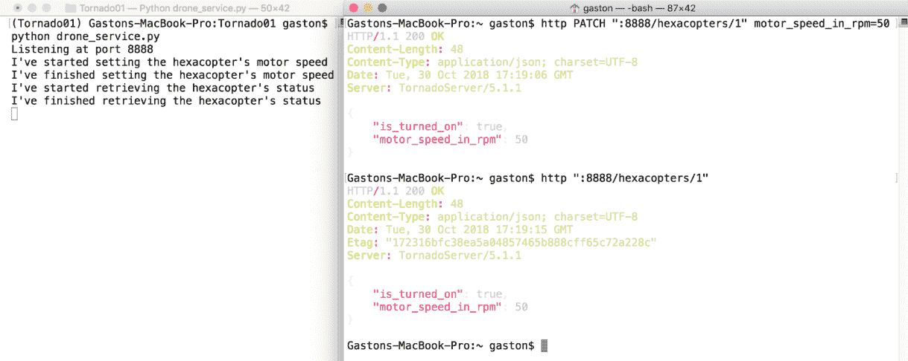
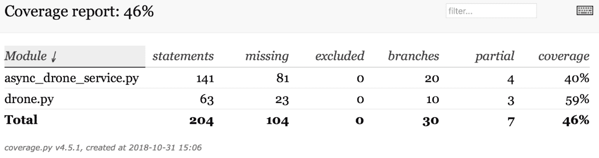
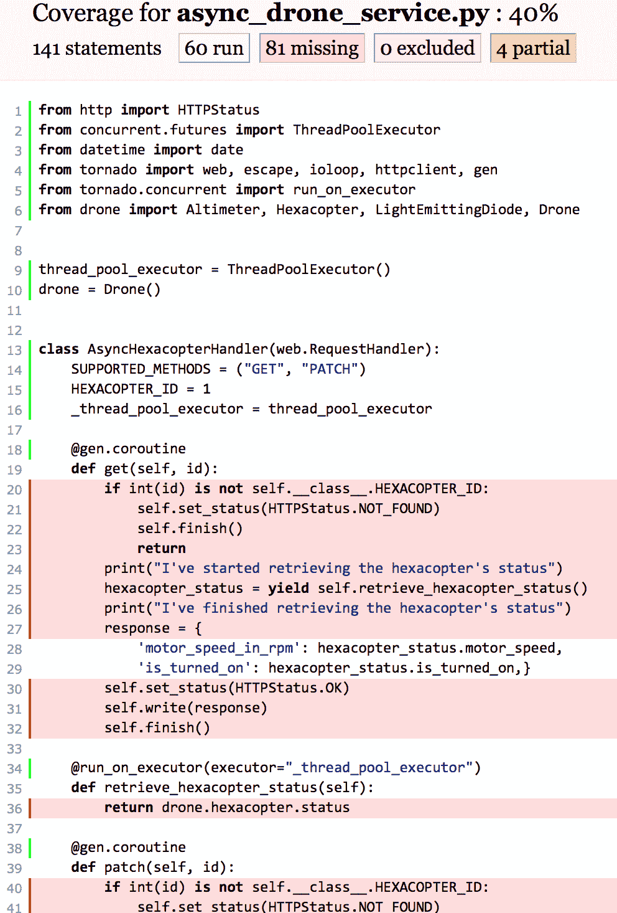
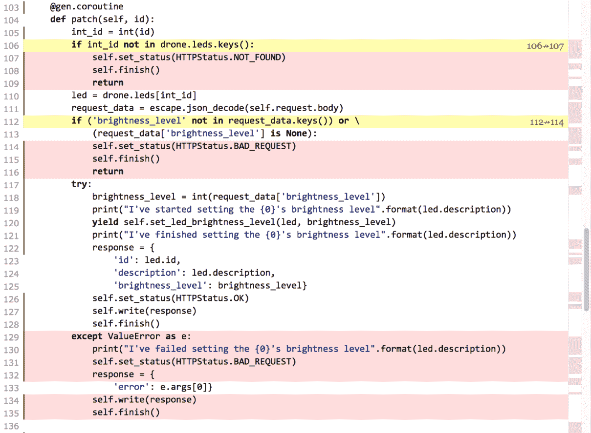

# 第十章：使用 Tornado 5.1.1 开发 RESTful API

在本章中，我们将使用 Tornado 5.1.1 创建一个 RESTful Web API。我们将开始使用这个轻量级 Web 框架。我们将查看以下内容：

+   设计一个用于与慢速传感器和执行器交互的 RESTful API

+   理解每个 HTTP 方法执行的任务

+   使用 Tornado 5.1.1 设置虚拟环境

+   创建表示无人机的类

+   编写请求处理器

+   将 URL 模式映射到请求处理器

+   向 Tornado API 发送 HTTP 请求

+   使用命令行工具——`curl` 和 `httpie`

+   使用 GUI 工具——Postman 和其他工具

# 设计一个用于与慢速传感器和执行器交互的 RESTful API

假设我们必须创建一个 RESTful API 来控制无人机，也称为 **UAV**（即 **Unmanned Aerial Vehicle**）。无人机是一个物联网设备，与许多传感器和执行器交互，包括与发动机、螺旋桨和伺服电机连接的数字电子速度控制器。

物联网设备资源有限，因此我们必须使用轻量级 Web 框架。我们的 API 不需要与数据库交互。我们不需要像 Django 这样具有所有功能和集成 ORM 的重型 Web 框架。我们希望能够处理许多请求而不阻塞 Web 服务器。我们需要 Web 服务器为我们提供良好的可伸缩性 ...

# 理解每个 HTTP 方法执行的任务

假设 `http://localhost:8888/hexacopters/1` 是识别我们无人机六旋翼机的 URL。

```py
PATCH http://localhost:8888/hexacopters/1 
```

我们必须使用 HTTP 动词 (`PATCH`) 和请求 URL (`http://localhost:8888/hexacopters/1`) 编写并发送一个 HTTP 请求，以设置六旋翼机的状态和电机转速（以 RPM 为单位）。此外，我们必须提供包含必要字段名称和值的 JSON 键值对，以指定所需的速度。请求的结果是，服务器将验证提供的字段值，确保它是一个有效的速度，并以异步执行的方式调用必要的操作来调整速度。在设置六旋翼机的速度后，服务器将返回一个 HTTP `200 OK` 状态码和一个包含最近更新的六旋翼机值序列化为 JSON 的 JSON 主体：

```py
GET http://localhost:8888/hexacopters/1
```

我们必须使用 HTTP 动词 (`GET`) 和请求 URL (`http://localhost:8888/hexacopter/1`) 编写并发送一个 HTTP 请求，以检索六旋翼机的当前值。服务器将以异步执行的方式调用必要的操作来检索六旋翼机的状态和速度。请求的结果是，服务器将返回一个 HTTP `200 OK` 状态码和一个包含序列化键值对的 JSON 主体，这些键值对指定了六旋翼机的状态和速度。如果指定的数字不同于 `1`，服务器将仅返回一个 HTTP `404 Not Found` 状态：

```py
PATCH http://localhost:8888/led/{id} 
```

我们必须使用 HTTP 动词 (`PATCH`) 和请求 URL (`http://localhost:8888/led/{id}`) 编写并发送一个 HTTP 请求，以设置特定 LED 的亮度级别，其 `id` 与 `{id}` 位置中指定的数值匹配。例如，如果我们使用请求 URL `http://localhost:8888/led/1`，服务器将为与 `1` 匹配的 LED 设置亮度级别。此外，我们必须提供包含必要字段名称和值的 JSON 键值对，以指定所需的亮度级别。作为请求的结果，服务器将验证提供的字段值，确保它是一个有效的亮度级别，并以异步执行的方式调用必要的操作来调整亮度级别。在设置 LED 的亮度级别后，服务器将返回一个 `200 OK` 状态码和一个包含最近更新的 LED 值序列化为 JSON 的 JSON 主体：

```py
GET http://localhost:8888/led/{id} 
```

我们必须使用 HTTP 动词 (`GET`) 和请求 URL (`http://localhost:8888/led/{id}`) 编写并发送一个 HTTP 请求，以检索与 `{id}` 位置中指定的数值匹配的 LED 的当前值。例如，如果我们使用请求 URL `http://localhost:8888/led/1`，服务器将检索与 `1` 匹配的 LED，即绿色 LED。服务器将以异步执行的方式调用必要的操作来检索 LED 的值。作为请求的结果，服务器将返回一个 HTTP `200 OK` 状态码和一个包含序列化键值对的 JSON 主体，这些键值对指定了 LED 的值。如果没有 LED 与指定的 `id` 匹配，服务器将仅返回一个 HTTP `404 Not Found` 状态：

```py
GET http://localhost:8888/altimeter/1?unit=feet
```

我们必须使用 HTTP 动词 (`GET`) 和请求 URL (`http://localhost:8888/altimeter/1?unit=feet`) 编写并发送一个 HTTP 请求，以检索以英尺为单位的当前高度计值。服务器将以异步执行的方式调用必要的操作来检索高度计的值。作为请求的结果，服务器将返回一个 HTTP `200 OK` 状态码和一个包含序列化键值对的 JSON 主体，这些键值对指定了高度计的值。如果指定的数字不是 `1`，服务器将仅返回一个 HTTP `404 Not Found` 状态：

```py
GET http://localhost:8888/altimeter/1?unit=meters
```

如果我们想检索以米为单位的高度计值，我们必须使用 HTTP 动词 (`GET`) 和请求 URL (`http://localhost:8888/altimeter/1?unit=meters`) 编写并发送一个 HTTP 请求。

# 使用 Tornado 5.1.1 设置虚拟环境

在 第一章，*使用 Flask 1.0.2 开发 RESTful API 和微服务*，我们了解到在这本书中，我们将使用 Python 3.4 中引入并改进的轻量级虚拟环境。现在，我们将遵循许多步骤来创建一个新的轻量级虚拟环境，以便与 Tornado 5.1.1 一起工作。如果您对现代 Python 中的轻量级虚拟环境没有经验，强烈建议您阅读 第一章，*使用 Flask 1.0.2 开发 RESTful API 和微服务* 中名为 *使用轻量级虚拟环境* 的部分。该章节包含了关于我们将遵循的步骤的所有详细解释。

以下 ...

# 创建表示无人机的类

我们将创建以下类，这些类将用于表示无人机的不同组件：

| 类名 | 描述 |
| --- | --- |
| `HexacopterStatus` | 这个类存储六旋翼无人机的状态数据 |
| `Hexacopter` | 这个类表示一个六旋翼无人机 |
| `LightEmittingDiode` | 这个类表示连接到无人机的 LED |
| `Altimeter` | 这个类表示用于测量无人机当前高度的气压计 |
| `Drone` | 这个类表示带有不同传感器和执行器的无人机 |

在实际生活中，这些类将与与传感器和执行器交互的库进行交互。为了使我们的示例简单，我们将调用 `time.sleep` 来模拟需要一些时间将值写入传感器和执行器接口的交互。我们将使用相同的程序来模拟需要一些时间从传感器和执行器接口检索值的交互。

首先，我们将创建 `Hexacopter` 类，我们将使用它来表示六旋翼无人机，以及一个 `HexacopterStatus` 类，我们将使用它来存储六旋翼无人机的状态数据。

在虚拟环境（`Tornado01`）的根目录下创建一个名为 `drone.py` 的新 Python 文件。以下行显示了我们将创建的类所需的全部导入，以及在此文件中声明 `Hexacopter` 和 `HexacopterStatus` 类的代码。示例的代码文件包含在 `restful_python_2_10_01` 文件夹中，位于 `Django01/drone.py` 文件：

```py
from time import sleep 
from random import randint 

class HexacopterStatus: 
    def __init__(self, motor_speed, is_turned_on): 
        self.motor_speed = motor_speed 
        self.is_turned_on = is_turned_on 

class Hexacopter: 
    MIN_MOTOR_SPEED = 0 
    MAX_MOTOR_SPEED = 500 

    def __init__(self): 
        self._motor_speed = self.__class__.MIN_MOTOR_SPEED 
        self._is_turned_on = False 

    @property 
    def motor_speed(self): 
        return self._motor_speed 

    @motor_speed.setter     
    def motor_speed(self, value): 
        if value < self.__class__.MIN_MOTOR_SPEED: 
            raise ValueError('The minimum speed is {0}'.format(self.__class__.MIN_MOTOR_SPEED)) 
        if value > self.__class__.MAX_MOTOR_SPEED: 
            raise ValueError('The maximum speed is {0}'.format(self.__class__.MAX_MOTOR_SPEED)) 
        sleep(2) 
        self._motor_speed = value 
        self._is_turned_on = (self.motor_speed is not 0) 

    @property 
    def is_turned_on(self): 
        return self._is_turned_on 

    @property 
    def status(self): 
        sleep(3) 
        return HexacopterStatus(self.motor_speed, self.is_turned_on) 
```

`HexacopterStatus` 类仅声明了一个构造函数，即 `__init__` 方法。该方法接收许多参数，并使用它们以相同的名称初始化属性：`motor_speed` 和 `is_turned_on`。

`Hexacopter` 类声明了两个类属性，用于指定其电机的最小和最大速度值：`MIN_MOTOR_SPEED` 和 `MAX_MOTOR_SPEED`。构造函数，即 `__init__` 方法，将 `_motor_speed` 属性初始化为 `MIN_MOTOR_SPEED` 值，并将 `_is_turned_on` 属性设置为 `False`。

`motor_speed` 属性获取器，带有 `@property` 装饰器的 `motor_speed` 方法，返回 `_motor_speed` 属性的值。`motor_speed` 属性设置器，即带有 `@motor_speed.setter` 装饰器的 `motor_speed` 方法，检查 `value` 参数的值是否在有效范围内。如果验证失败，该方法将引发 `ValueError` 异常。否则，该方法使用接收到的值设置 `_motor_speed` 属性的值，并且如果 `motor_speed` 属性大于 `0`，则将 `_is_turned_on` 属性的值设置为 `True`。最后，该方法调用 `sleep` 来模拟完成这些操作需要两秒钟。

`is_turned_on` 属性获取器，带有 `@property` 装饰器的 `is_turned_on` 方法，返回 `_is_turned_on` 属性的值。`status` 属性获取器调用 `sleep` 来模拟获取六旋翼飞行器状态需要三秒钟，然后返回一个使用 `motor_speed` 和 `turned_on` 属性值初始化的 `HexacopterStatus` 实例。

保持位于虚拟环境根目录下的 `drones.py` 文件（`Tornado01`）。添加以下行以声明我们将用于表示每个 LED 的 `LightEmittingDiode` 类。示例代码文件包含在 `restful_python_2_10_01` 文件夹中，位于 `Django01/drone.py` 文件中：

```py
class LightEmittingDiode: 
    MIN_BRIGHTNESS_LEVEL = 0 
    MAX_BRIGHTNESS_LEVEL = 255 

    def __init__(self, id, description): 
        self.id = id 
        self.description = description 
        self._brightness_level = self.__class__.MIN_BRIGHTNESS_LEVEL 

    @property 
    def brightness_level(self): 
        sleep(1) 
        return self._brightness_level 

    @brightness_level.setter 
    def brightness_level(self, value): 
        if value < self.__class__.MIN_BRIGHTNESS_LEVEL: 
            raise ValueError('The minimum brightness level is {0}'.format(self.__class__.MIN_BRIGHTNESS_LEVEL)) 
        if value > self.__class__.MAX_BRIGHTNESS_LEVEL: 
            raise ValueError('The maximum brightness level is {0}'.format(self.__class__.MAX_BRIGHTNESS_LEVEL)) 
        sleep(2) 
        self._brightness_level = value
```

`LightEmittingDiode` 类声明了两个类属性，用于指定 LED 的最小和最大亮度级别值：`MIN_BRIGHTNESS_LEVEL` 和 `MAX_BRIGHTNESS_LEVEL`。构造函数，即 `__init__` 方法，使用 `MIN_BRIGHTNESS_LEVEL` 初始化 `_brightness_level` 属性，并使用与同名参数接收的值初始化 `id` 和 `description` 属性。

`brightness_level` 属性获取器，带有 `@property` 装饰器的 `brightness_level` 方法，调用 `sleep` 来模拟获取有线 LED 的亮度级别需要 `1` 秒，然后返回 `_brightness_level` 属性的值。

`brightness_level` 属性设置器，带有 `@brightness_level.setter` 装饰器的 `brightness_level` 方法，检查 `value` 参数的值是否在有效范围内。如果验证失败，该方法将引发 `ValueError` 异常。否则，该方法调用 `sleep` 来模拟设置新的亮度级别需要两秒钟，并最终使用接收到的值设置 `_brightness_level` 属性的值。

保持位于虚拟环境根目录下的 `drones.py` 文件（`Tornado01`）。添加以下行以声明我们将用于表示高度计的 `Altimeter` 类。示例代码文件包含在 `restful_python_2_10_01` 文件夹中，位于 `Django01/drone.py` 文件中：

```py
class Altimeter: 
    @property 
    def altitude(self): 
        sleep(1) 
        return randint(0, 3000) 
```

`Altimeter` 类声明了一个 `altitude` 属性设置器，它调用 `sleep` 来模拟从高度计获取高度需要一秒钟的时间，并最终生成一个从 `0` 到 `3000`（包含）的随机整数并返回它。

保持在虚拟环境（`Tornado01`）根目录下的 `drones.py` 文件中。添加以下行以声明一个 `Drone` 类，我们将使用它来表示具有其传感器和执行器的无人机。示例的代码文件包含在 `restful_python_2_10_01` 文件夹中的 `Django01/drone.py` 文件中：

```py
class Drone: 
    def __init__(self): 
        self.hexacopter = Hexacopter() 
        self.altimeter = Altimeter() 
        self.red_led = LightEmittingDiode(1, 'Red LED') 
        self.green_led = LightEmittingDiode(2, 'Green LED') 
        self.blue_led = LightEmittingDiode(3, 'Blue LED') 
        self.leds = { 
            self.red_led.id: self.red_led, 
            self.green_led.id: self.green_led, 
            self.blue_led.id: self.blue_led} 
```

`Drone` 类仅声明了一个构造函数，即 `__init__` 方法，该方法创建了代表无人机不同组件的先前声明的类的实例。`leds` 属性保存了一个字典，其中每个 `LightEmittingDiode` 实例都有一个键值对，包含其 `id` 和其实例。

# 编写请求处理程序

在 Tornado 中，RESTful API 的主要构建块是 `tornado.web.RequestHandler` 类的子类，即 Tornado 中 HTTP 请求处理程序的基础类。我们只需执行以下任务即可构建与无人机交互的 RESTful API：

1.  创建 `RequestHandler` 类的子类，并声明每个支持的 HTTP 动词的方法

1.  覆盖方法以处理 HTTP 请求

1.  将 URL 模式映射到代表 Tornado 网络应用的 `tornado.web.Application` 实例中的 `RequestHandler` 超类的每个子类

我们将创建以下 `RequestHandler` 类的子类：

| 类名 | 描述 |
| --- | --- |
| `HexacopterHandler` | 此类处理 HTTP ... |

# 将 URL 模式映射到请求处理程序

以下表格显示了我们的先前创建的 HTTP 处理程序类的方法，我们希望为每个 HTTP 动词和作用域的组合执行：

| HTTP 动词 | 范围 | 类和方法 |
| --- | --- | --- |
| `GET` | Altimeter | `AltimeterHandler.get` |
| `GET` | Hexacopter | `HexacopterHandler.get` |
| `PATCH` | Hexacopter | `HexacopterHandler.patch` |
| `GET` | LED | `LedHandler.get` |
| `PATCH` | LED | `LedHandler.patch` |

如果请求导致调用一个不支持 HTTP 方法的 HTTP 处理程序类，Tornado 将返回一个带有 HTTP `405 Method Not Allowed` 状态码的响应。

现在，我们必须将 URL 模式映射到我们之前编写的 `RequestHandler` 超类的子类。保持在虚拟环境（`Tornado01`）根目录下的 `drone_service.py` 文件中。添加以下行以声明 `Application` 类和 `__main__` 方法。示例的代码文件包含在 `restful_python_2_10_01` 文件夹中的 `Django01/drone_service.py` 文件中：

```py
class Application(web.Application): 
    def __init__(self, **kwargs): 
        handlers = [ 
            (r"/hexacopters/([0-9]+)", HexacopterHandler), 
            (r"/leds/([0-9]+)", LedHandler), 
            (r"/altimeters/([0-9]+)", AltimeterHandler), 
        ] 
        super(Application, self).__init__(handlers, **kwargs) 

if __name__ == "__main__": 
    application = Application() 
    port = 8888 
    print("Listening at port {0}".format(port)) 
    application.listen(port) 
    tornado_ioloop = ioloop.IOLoop.instance() 
    periodic_callback = ioloop.PeriodicCallback(lambda: None, 500) 
    periodic_callback.start() 
    tornado_ioloop.start()
```

代码声明一个`Application`类，作为`tornado.web.Application`超类的子类。这个类覆盖了继承的构造函数，即`__init__`方法。构造函数声明了`handlers`列表，该列表将 URL 模式映射到同步请求处理器，然后调用继承的构造函数，将列表作为其参数之一。`handlers`列表由一个正则表达式（`regexp`）和一个`tornado.web.RequestHandler`子类（`request_class`）组成。

然后，`main`方法创建`Application`类的实例，并调用`application.listen`方法，在指定的端口上为应用程序构建一个遵循定义规则的 HTTP 服务器。在这种情况下，代码将`8888`指定为端口号，保存在`port`变量中，这是 Tornado HTTP 服务器的默认端口号。

然后，代码注册并启动一个名为`periodic_callback`的周期性回调，该回调将由`IOLoop`每 500 毫秒执行一次，以便可以使用*Ctrl* + *C*来停止 HTTP 服务器。这段代码对于我们的 API 的第二版将很有用。然而，我们现在就写出来以避免以后修改代码。

最后，代码调用`tornado_ioloop.start`方法来启动服务器。这个服务器是通过之前的`application.listen`方法创建的。

# 向 Tornado API 发送 HTTP 请求

现在，我们可以运行`drone_service.py`脚本，该脚本启动 Tornado 5.1.1 的开发服务器，以便编写和发送 HTTP 请求到我们的非安全简单 Web API。执行以下命令：

```py
    python drone_service.py
```

以下行显示了执行之前命令后的输出。Tornado HTTP 开发服务器正在端口`8888`上监听：

```py
    Listening at port 8888
```

使用之前的命令，我们将启动 Tornado HTTP 服务器，它将在端口`8888`上的每个接口上监听。因此，如果我们想从连接到我们的局域网的其它计算机或设备向我们的 API 发送 HTTP 请求，我们不需要任何额外的配置。

如果您决定从...编写和发送 HTTP 请求...

# 使用命令行工具 - curl 和 httpie

我们将开始使用`curl`和 HTTPie 命令行工具编写和发送 HTTP 请求，这些工具我们在第一章中介绍，在名为*使用命令行工具 - curl 和 httpie*的部分。在执行下一个示例之前，请确保您已经阅读了这一部分。

每当我们使用命令行编写 HTTP 请求时，我们将使用两个版本的相同命令：第一个使用 HTTPie，第二个使用`curl`。这样，您就可以使用最方便的一种。

确保您让 Tornado 5.1.1 开发服务器继续运行。不要关闭运行此开发服务器的终端或命令提示符。在 macOS 或 Linux 中打开一个新的终端，或在 Windows 中打开一个命令提示符，激活我们一直在使用的虚拟环境，并运行以下命令。我们将组合并发送一个 HTTP `PATCH` 请求来打开六旋翼机并将其电机速度设置为 `50` RPM。示例代码文件包含在 `restful_python_2_10_01` 文件夹中，位于 `Tornado01/cmd/cmd1101.txt` 文件：

```py
    http PATCH ":8888/hexacopters/1" motor_speed_in_rpm=50
```

以下是对应的 `curl` 命令。示例代码文件包含在 `restful_python_2_10_01` 文件夹中，位于 `Tornado01/cmd/cmd1102.txt` 文件：

```py
 curl -iX PATCH -H "Content-Type: application/json" -d '{"motor_speed_in_rpm":50}' "localhost:8888/hexacopters/1"

```

之前的命令将组合并发送带有以下 JSON 键值对的 HTTP 请求 `PATCH http://localhost:8888/hexacopters/1`：

```py
{  
   "motor_speed_in_rpm": 50 
} 
```

请求指定了 `/hexacopters/1`，因此 Tornado 将遍历包含正则表达式和请求类的元组列表，并匹配正则表达式 `'/hexacopters/([0-9]+)'`。Tornado 将创建 `HexacopterHandler` 类的实例，并以 `1` 作为 `id` 参数的值调用 `HexacopterHandler.patch` 方法。

由于请求的 HTTP 动词是 `PATCH`，Tornado 调用 `patch` 方法。如果成功设置了六旋翼机的速度，该方法将返回 HTTP `200 OK` 状态码，并在响应体中将速度和状态作为键值对序列化为 JSON 格式。以下行显示了 HTTP 请求的示例响应：

```py
    HTTP/1.1 200 OK
    Content-Length: 48
    Content-Type: application/json; charset=UTF-8
    Date: Tue, 30 Oct 2018 17:01:06 GMT
    Server: TornadoServer/5.1.1

    {
    "is_turned_on": true, 
        "motor_speed_in_rpm": 50
    }

```

现在，我们将编写一个命令来组合并发送一个 HTTP `GET` 请求以检索六旋翼机的状态和电机速度。运行以下命令。示例代码文件包含在 `restful_python_2_10_01` 文件夹中，位于 `Tornado01/cmd/cmd1103.txt` 文件：

```py
    http ":8888/hexacopters/1"
```

以下是对应的 `curl` 命令。示例代码文件包含在 `restful_python_2_10_01` 文件夹中，位于 `Tornado01/cmd/cmd1104.txt` 文件：

```py
    curl -iX GET -H "localhost:8888/hexacopters/1"
```

之前的命令将组合并发送以下 HTTP 请求：`GET http://localhost:8888/hexacopters/1`。请求指定了 `/hexacopters/1`，因此它将匹配正则表达式 `'/hexacopters/([0-9]+)'` 并以 `1` 作为 `id` 参数的值调用 `HexacopterHandler.get` 方法。由于请求的 HTTP 动词是 `GET`，Tornado 调用 `get` 方法。该方法检索六旋翼机的状态并生成包含键值对的 JSON 响应。

以下行显示了 HTTP 请求的示例响应。前几行显示了 HTTP 响应头，包括状态（`200 OK`）和内容类型（`application/json`）。在 HTTP 响应头之后，我们可以在 JSON 响应中看到六旋翼机状态的详细信息：

```py
    HTTP/1.1 200 OK
    Content-Length: 48
    Content-Type: application/json; charset=UTF-8
    Date: Tue, 30 Oct 2018 17:06:10 GMT
    Etag: "172316bfc38ea5a04857465b888cff65c72a228c"
    Server: TornadoServer/5.1.1

    {
    "is_turned_on": true, 
        "motor_speed_in_rpm": 50
    }

```

在我们运行两个请求之后，将在运行 Tornado HTTP 服务器的窗口中看到以下几行。输出显示了执行描述代码开始设置或检索信息以及完成时的打印语句的结果：

```py
    I've started setting the hexacopter's motor speed
    I've finished setting the hexacopter's motor speed
    I've started retrieving the hexacopter's status
    I've finished retrieving the hexacopter's status
```

我们在请求处理类中编写的不同方法最终都会调用 `time.sleep` 来模拟与六旋翼飞行器操作需要花费一些时间。在这种情况下，我们的代码以同步执行运行，因此每次我们组合并发送请求时，Tornado 服务器都会被阻塞，直到与六旋翼飞行器的操作完成并且方法发送响应。我们将在稍后创建这个 API 的新版本，它将使用异步执行，并理解 Tornado 非阻塞特性的优势。然而，首先，我们将了解 API 的同步版本是如何工作的。

以下截图显示了 macOS 上并排的两个终端窗口。左侧的终端窗口正在运行 Tornado HTTP 服务器，并显示处理 HTTP 请求的方法中打印的消息。右侧的终端窗口正在运行 `http` 命令以生成 HTTP 请求。在我们组合并发送 HTTP 请求时，使用类似的配置来检查输出是一个好主意：



现在，我们将编写一个命令来组合并发送一个 HTTP 请求以检索一个不存在的六旋翼飞行器。记住，我们只有一个六旋翼飞行器在我们的无人机中。运行以下命令尝试检索一个具有无效 `id` 的六旋翼飞行器的状态。我们必须确保工具显示响应的一部分作为头部信息，以查看返回的状态码。示例代码文件包含在 `restful_python_2_10_01` 文件夹中，位于 `Tornado01/cmd/cmd1105.txt` 文件：

```py
    http ":8888/hexacopters/5"
```

以下是对应的 `curl` 命令。示例代码文件包含在 `restful_python_2_10_01` 文件夹中，位于 `Tornado01/cmd/cmd1106.txt` 文件：

```py
    curl -iX GET "localhost:8888/hexacopters/5"
```

之前的命令将组合并发送以下 HTTP 请求：`GET http://localhost:8888/hexacopters/5`。请求与之前我们分析过的请求相同，只是 `id` 参数的数字不同。服务器将运行 `HexacopterHandler.get` 方法，将 `5` 作为 `id` 参数的值。`id` 不等于 `1`，因此代码将返回 HTTP `404 Not Found` 状态码。以下几行显示了 HTTP 请求的一个示例响应头：

```py
    HTTP/1.1 404 Not Found
    Content-Length: 0
    Content-Type: text/html; charset=UTF-8
    Date: Tue, 30 Oct 2018 17:22:13 GMT
    Server: TornadoServer/5.1.1
```

现在，我们将编写一个命令来组合并发送一个 HTTP `GET` 请求以从无人机中包含的高度计检索高度，以米为单位。运行以下命令。示例代码文件包含在 `restful_python_2_10_01` 文件夹中，位于 `Tornado01/cmd/cmd1107.txt` 文件：

```py
    http ":8888/altimeters/1?unit=meters"
```

以下是对应的 `curl` 命令。示例的代码文件包含在 `restful_python_2_10_01` 文件夹中，位于 `Tornado01/cmd/cmd1108.txt` 文件：

```py
    curl -iX GET -H "localhost:8888/altimeters/1?unit=meters"
```

之前的命令将编写并发送以下 HTTP 请求：`GET http://localhost:8888/altimeters/1?unit=meters`。请求指定了 `/altimeters/1`，因此它将匹配 `'/altimeters/([0-9]+)'` 正则表达式，并使用 `1` 作为 `id` 参数的值调用 `AltimeterHandler.get` 方法。由于请求的 HTTP 动词是 `GET`，Tornado 调用 `get` 方法。该方法将检索单位查询参数的值，检索气压计的海拔高度（以英尺为单位），将其转换为米，并生成包含键值对的 JSON 响应。

以下行显示了 HTTP 请求的一个示例响应：

```py
    HTTP/1.1 200 OK
    Content-Length: 49
    Content-Type: application/json; charset=UTF-8
    Date: Tue, 30 Oct 2018 17:35:59 GMT
    Etag: "e6bef0812295935473bbef8883a144a7740d4838"
    Server: TornadoServer/5.1.1

    {
    "altitude": 126.7968, 
        "unit": "meters"
    }

```

现在，我们将编写一个命令来编写并发送一个 HTTP `GET` 请求，以检索无人机中包含的气压计的高度，以默认单位英尺表示。运行以下命令。示例的代码文件包含在 `restful_python_2_10_01` 文件夹中，位于 `Tornado01/cmd/cmd1109.txt` 文件：

```py
    http ":8888/altimeters/1" 
```

以下是对应的 `curl` 命令。示例的代码文件包含在 `restful_python_2_10_01` 文件夹中，位于 `Tornado01/cmd/cmd1110.txt` 文件：

```py
    curl -iX GET -H "localhost:8888/altimeters/1"
```

之前的命令将编写并发送以下 HTTP 请求：`GET http://localhost:8888/altimeters/1`。请求指定了 `/altimeters/1`，因此它将匹配 `'/altimeters/([0-9]+)'` 正则表达式，并使用 `1` 作为 `id` 参数的值调用 `AltimeterHandler.get` 方法。由于请求的 HTTP 动词是 `GET`，Tornado 调用 `get` 方法。在这种情况下，没有单位查询参数，因此该方法将检索气压计的海拔高度（以英尺为单位），并生成包含键值对的 JSON 响应。

以下行显示了 HTTP 请求的一个示例响应：

```py
    HTTP/1.1 200 OK
    Content-Length: 33
    Content-Type: application/json; charset=UTF-8
    Date: Tue, 30 Oct 2018 17:38:58 GMT
    Etag: "985cc8ce1bddf8a96b2a06a76d14faaa5bc03c9b"
    Server: TornadoServer/5.1.1

    {
    "altitude": 263, 
        "unit": "feet"
    }

```

注意，海拔值是每次我们要求它时生成的随机数。

# 使用图形用户界面工具 - Postman 及其他

到目前为止，我们一直在使用两个基于终端或命令行的工具来编写并发送 HTTP 请求到我们的 Django 开发服务器：cURL 和 HTTPie。现在，我们将使用我们在 第一章 中编写并发送 HTTP 请求到 Flask 开发服务器时使用的图形用户界面工具之一：*使用 Flask 1.0.2 开发 RESTful API 和微服务*。如果你跳过了这一章，请确保检查名为 *使用图形用户界面工具 - Postman 及其他* 的部分中的安装说明。

一旦启动 Postman，请确保关闭提供常见任务快捷方式的模态窗口。在 Postman 主窗口的左上角，选择 + 新的下拉菜单中的 GET 请求 ...

# 使用 pytest 运行单元测试并检查测试覆盖率

现在，我们将使用`pytest`命令来运行测试并测量它们的代码覆盖率。请确保您在激活了虚拟环境的终端或命令提示符窗口中运行该命令，并且您位于其根文件夹（`Tornado01`）内。运行以下命令：

```py
    pytest --cov -v  
```

测试运行器将执行在`tests.py`中定义的所有以`test_`前缀开始的函数，并将显示结果。我们使用`-v`选项来指示`pytest`以详细模式打印测试函数名称和状态。`--cov`选项通过使用`pytest-cov`插件来开启测试覆盖率报告生成。

以下行显示了示例输出：

```py
================================================ test session starts =================================================
platform darwin -- Python 3.7.1, pytest-4.0.2, py-1.7.0, pluggy-0.8.0 -- /Users/gaston/HillarPythonREST2/Tornado01/bin/python3
cachedir: .pytest_cache
rootdir: /Users/gaston/HillarPythonREST2/Tornado01, inifile: 
setup.cfg
plugins: tornasync-0.5.0, cov-2.6.0
collected 1 item 

tests.py::test_set_and_get_leds_brightness_levels PASSED                                                       [100%]

 ---------- coverage: platform darwin, python 3.6.6-final-0 -----------
 -
    Name                     Stmts   Miss Branch BrPart  Cover
    ----------------------------------------------------------
    async_drone_service.py     141     81     20      4    40%
    drone.py                    63     23     10      3    59%
    ----------------------------------------------------------
    TOTAL                      204    104     30      7    46%

```

输出提供了测试运行器发现并执行了一个测试，该测试通过。输出显示了`test_views`模块中每个以`test_`前缀开始的函数的模块和函数名称，这些函数代表要执行的测试。

由`coverage`包提供的测试代码覆盖率测量报告，结合`pytest-cov`插件，使用 Python 标准库中包含的代码分析工具和跟踪钩子来确定哪些代码行是可执行的，以及这些行中的哪些已被执行。报告提供了一个表格，其中包含了我们在第四章，“使用 Flask 在微服务中测试和部署 API”，在名为“使用 pytest 运行单元测试并检查测试覆盖率”的部分中检查的列。

根据报告中显示的测量结果，我们确实在`async_drone_service.py`和`drone.py`模块中具有非常低的覆盖率。实际上，我们只编写了一个与 LED 相关的测试，因此提高覆盖率是有意义的。我们没有创建与其他六旋翼资源相关的测试。

现在，使用带有`-m`命令行选项的`coverage`命令来显示在新的`Missing`列中遗漏语句的行号：

```py
    coverage report -m
```

该命令将使用上次执行的信息，并显示遗漏的语句和遗漏的分支。下一行显示了与之前单元测试执行相对应的示例输出。破折号（`-`）用于表示遗漏行的范围。例如，`107-109`表示第 107 行和第 109 行缺少语句。破折号后跟一个大于号（`->`）表示从`->`之前的行到其后的行之间的分支被遗漏。例如，`61->62`表示从第 61 行到第 62 行的分支被遗漏：

```py
Name                     Stmts   Miss Branch BrPart  Cover   Missing
---------------------------------------------------------------------
async_drone_service.py     141     81     20      4    40%   20-32, 36, 
40-67, 71-73, 84-86, 107-109, 114-116, 129-135, 148-168, 172, 186-193, 83->84, 106->107, 112->114, 185->186
drone.py                    63     23     10      3    59%   7-8, 21, 25-31, 35, 39-40, 60, 62, 70-71, 88-93, 59->60, 61->62, 87->88
----------------------------------------------------------------------
TOTAL                      204    104     30      7    46%

```

现在，运行以下命令以获取详细说明遗漏行的注释 HTML 列表。该命令不会产生任何输出：

```py
    coverage html
```

使用您的网络浏览器打开在`htmlcov`文件夹中生成的`index.html` HTML 文件。以下截图显示了以 HTML 格式生成的示例报告覆盖率：



点击或轻触`async_drone_service.py`，网页浏览器将渲染一个显示已运行、缺失、排除和部分执行的语句的网页，不同颜色表示。我们可以点击或轻触运行、缺失、排除和部分按钮来显示或隐藏代表每行代码状态的背景颜色。默认情况下，缺失的代码行将以粉色背景显示，部分执行的将以黄色背景显示[－]。因此，我们必须编写针对这些代码行的单元测试来提高我们的测试覆盖率。

下一个截图显示了带有总结的按钮：



下一个截图显示了`async_drone_service.py`模块中一些代码行的突出显示的缺失行和部分评估的分支：



# 测试你的知识

让我们看看你是否能正确回答以下问题：

1.  以下哪个方法允许我们在`tornado.web.RequestHandler`的子类中设置 HTTP 状态码？

    1.  `self.write_status`

    1.  `self.__cls__.write_status_code`

    1.  `self.set_satus`

1.  以下哪个方法允许我们在`tornado.web.RequestHandler`的子类中写入响应？

    1.  `self.write_response`

    1.  `self.write`

    1.  `self.set_response`

1.  Tornado 中 RESTful API 的主要构建块是以下哪个类的子类？

    1.  `tornado.web.GenericHandler`

    1.  `tornado.web.RequestHandler`

    1.  `tornado.web.IncomingHTTPRequestHandler`

1.  如果我们只想支持`GET`和`PATCH`方法，我们可以覆盖`SUPPORTED_METHODS`类...

# 摘要

在本章中，我们设计了一个 RESTful API 来与慢速传感器和执行器交互。我们定义了 API 的要求，并理解了每个 HTTP 方法执行的任务。我们使用 Tornado 设置了虚拟环境。

我们创建了代表无人机类的类，并编写了代码来模拟每个 HTTP 请求方法所需的慢速 I/O 操作。我们编写了代表请求处理器的类，处理不同的 HTTP 请求，并配置了 URL 模式将 URL 路由到请求处理器及其方法。

最后，我们启动了 Tornado 开发服务器，并使用命令行工具向我们的 RESTful API 组合并发送 HTTP 请求，分析了我们的代码中每个 HTTP 请求的处理方式。我们还使用 GUI 工具组合并发送 HTTP 请求。我们意识到，由于模拟慢速 I/O 操作，每个 HTTP 请求都需要一些时间来提供响应。

现在我们已经了解了 Tornado 的基本知识来创建 RESTful API，我们将利用非阻塞特性，结合 Tornado 中的异步操作，在 API 的新版本中，我们将编写单元测试，这是下一章的主题。
