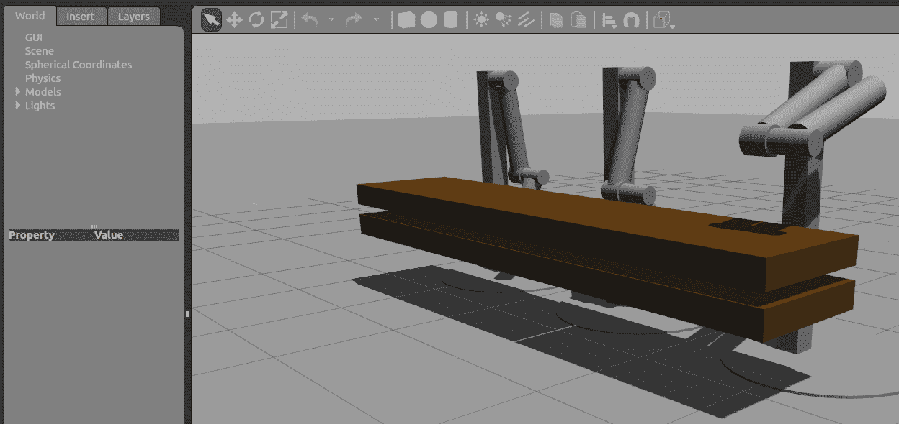
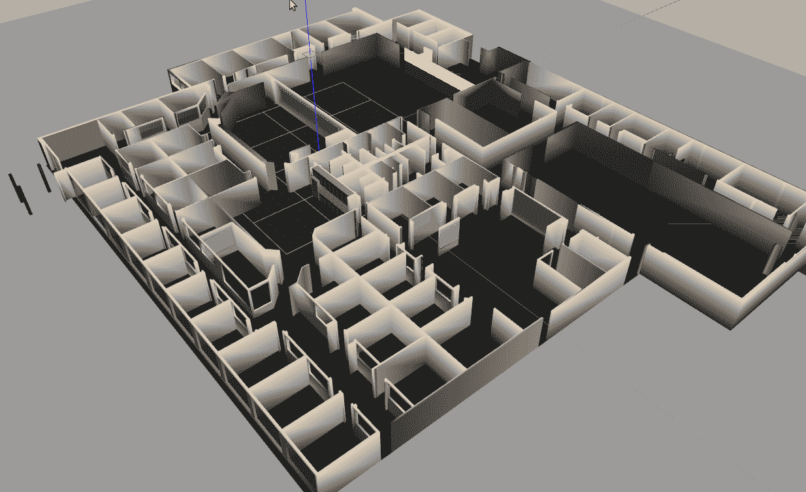
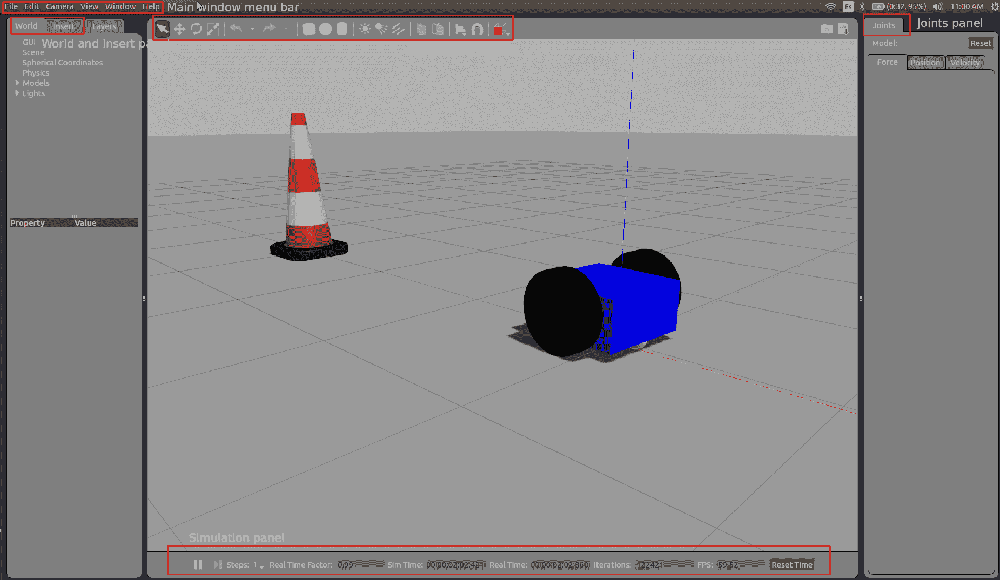
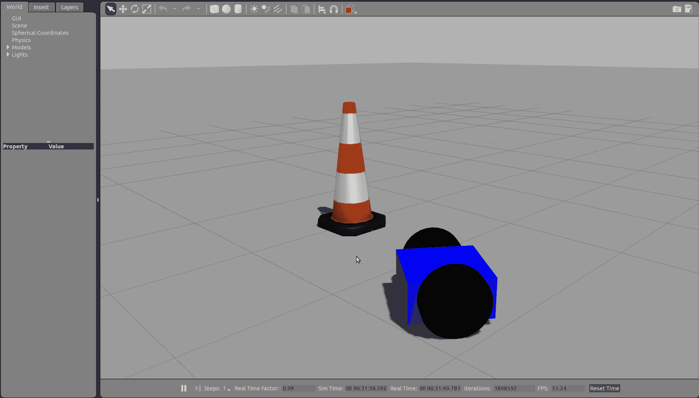
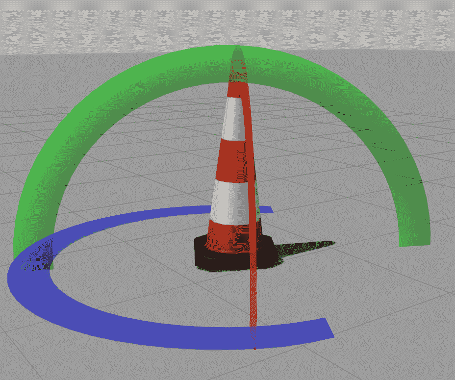
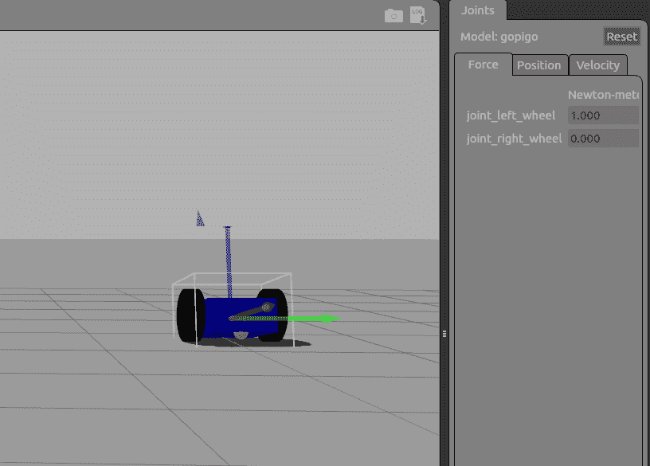
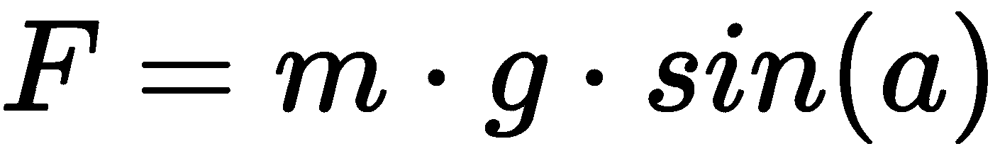
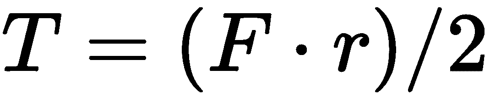

# 第五章：使用 Gazebo 模拟机器人行为

本章处理机器人的动态模拟，从概念上讲，这是检查机器人实际行为的一种更好的方法，而不是仅仅使用软件。当在模拟器中复制时，与尝试使用物理硬件实现相比，刚体力学（包括质量、惯性）、摩擦、阻尼、电机控制器、传感器检测特性、噪声信号以及模型中可以以合理精度保留的机器人和环境的各个方面都要便宜得多。

通过阅读本章，你将学习如何将你的机器人（URDF 文件）的数字定义插入到由物理引擎驱动的 **Gazebo** 模拟环境中，该引擎能够模拟真实行为。你还将通过检查和测试数字机器人来扩展你的训练，使其行为代表物理世界应该发生的情况。

要实现 ROS 与 Gazebo 的集成，一组名为 `gazebo_ros_pkgs` 的 ROS 软件包（[`wiki.ros.org/gazebo_ros_pkgs`](http://wiki.ros.org/gazebo_ros_pkgs)）提供了所需的包装器。这些软件包提供了用于在 Gazebo 中使用 ROS 消息、服务和可重新配置的 ROS 参数来模拟机器人的接口。

通过遵循引导路径，你将熟悉 Gazebo 的 ROS 模拟环境。具体来说，你将学习如何准备机器人的模型，以便使用 Gazebo 物理引擎模拟真实行为。最后，你将模拟 GoPiGo3 可以携带的最大重量，并将其与现实世界进行比较。

在本章中，我们将涵盖以下主题：

+   开始使用 Gazebo 模拟器

+   对机器人 URDF 进行修改

+   验证 Gazebo 模型并查看 URDF

+   移动你的模型

# 技术要求

本章的代码文件可以在以下位置找到：[`github.com/PacktPublishing/Hands-On-ROS-for-Robotics-Programming/tree/master/Chapter5_Gazebo_basics`](https://github.com/PacktPublishing/Hands-On-ROS-for-Robotics-Programming/tree/master/Chapter5_Gazebo_basics)。

通过完成上一章，你应该已经将本书的代码仓库克隆到你的笔记本电脑的主文件夹中。如果你没有这样做，我们现在会讲解这个过程。在你的笔记本电脑的终端中，将仓库克隆到你的主文件夹，如下所示：

```py
$ cd ~
$ git clone https://github.com/PacktPublishing/Hands-On-ROS-for-Robotics-Programming 
```

接下来，我们将本章的代码复制到 ROS 工作空间。这样，你将拥有一个更干净的 ROS 环境：

```py
$ cp -R ~/Hands-On-ROS-for-Robotics-Programming/Chapter5_Gazebo_basics ~/catkin_ws/src
```

本章包含一个名为 `gazebo_basics` 的新 ROS 软件包，因此请重新构建工作空间，以便 ROS 环境能够识别：

```py
$ cd ~/catkin_ws
$ catkin_make
$ source ~/catkin_ws/devel/setup.bash
```

通过选择该软件包并列出其文件来检查软件包是否正确安装：

```py
$ roscd gazebo_basics
$ pwd
 ~/catkin_ws/src/Chapter5_Gazebo_basics
```

`pwd` 命令的输出显示了预期的位置。现在，你已准备好完成本章。

# 开始使用 Gazebo 模拟器

让我们快速浏览一下，以便你对实现 GoPiGo3 动态模拟时可以期待的内容有一个清晰的理解。Gazebo 是一个开源的 3D 机器人仿真器，包括一个 ODE 物理引擎和 OpenGL 渲染，并支持在机器人驱动中的闭环控制代码集成——即传感器模拟和执行器控制。在这个定义中有两个新概念。让我们分别解释一下：

+   **Open Dynamics Engine**（**ODE**），一个用 C/C++编写的物理引擎，包括两个主要组件：刚体动力学模拟和碰撞检测（[`www.ode.org/`](https://www.ode.org/))。

+   **Open Graphics Library**（**OpenGL**），这是一个跨语言和跨平台的 API，用于渲染 2D 和 3D 矢量图形。这个 API 通常用于与 GPU 交互，以实现硬件加速渲染。这是一个规范，它规定了 PC 的 GPU 如何通过渲染 2D 和 3D 矢量图形来在屏幕上显示图形。作为一个规范，它本质上具有跨平台性，每个制造商都可以使用它（GPU 驱动程序）实现不同的实现。这个问题的关键在于它提供的功能必须符合标准中指定的功能，这样我们才能说该驱动程序是 OpenGL 兼容的。

按照以下步骤开始使用 Gazebo：

1.  通过启动预制的环境来测试 Gazebo 的安装：

```py
$ roslaunch gazebo_ros empty_world.launch
```

`gazebo_ros`包是一个位于`/opt/ros/kinetic/share/`系统文件夹中的 ROS 包。它随`ros-kinetic-desktop-full`（或如果你在 Ubuntu 18.04 上，则为`ros-melodic-desktop-full`）的安装而来，这在第三章，*ROS 入门*中已有详细说明。

如果你不想运行完整的 ROS 安装，你可以单独安装包。对于 Gazebo，如果你使用的是 Ubuntu 16.04，安装命令是`$ sudo apt-get install ros-kinetic-gazebo-ros-pkgs ros-kinetic-gazebo-ros-control`；如果你使用的是 Ubuntu 18.04，安装命令是`$ sudo apt-get install ros-melodic-gazebo-ros-pkgs ros-melodic-gazebo-ros-control`。

除了`empty_world.launch`之外，你还有其他可用的世界启动文件，其名称可以通过以下命令找到，该命令列出了`gazebo_ros`包的启动文件夹内的文件：

```py
$ roscd gazebo_ros/launch && ls -la
```

`&&`符号在 bash 中常用以在同一行运行两个命令。它们的执行顺序与它们书写的顺序相同。输出如下：

```py
-rw-r--r-- 1 root root 2013 Jan 23 16:58 elevator_world.launch
-rw-r--r-- 1 root root 2300 Jan 23 16:58 empty_world.launch
-rw-r--r-- 1 root root 637 Jan 23 16:58 mud_world.launch
-rw-r--r-- 1 root root 850 Jan 23 16:58 range_world.launch
-rw-r--r-- 1 root root 640 Jan 23 16:58 rubble_world.launch
-rw-r--r-- 1 root root 640 Jan 23 16:58 shapes_world.launch
-rw-r--r-- 1 root root 646 Jan 23 16:58 willowgarage_world.launch
```

1.  启动`mud_world.launch`并耐心等待；由于它包含移动部件，渲染可能需要几秒钟：

```py
$ roslaunch gazebo_ros mud_world.launch
```

下面的截图显示了前面命令的输出：



使用鼠标，你可以移动和旋转世界以改变视角：

+   当 Gazebo 窗口处于活动状态时，按住鼠标左键。移动鼠标会导致世界在屏幕上移动。

+   按住鼠标中间的滚轮按钮，并移动鼠标来旋转世界。旋转点将是您第一次按下滚轮时鼠标指针所在的位置。

+   按住鼠标的右键。通过前后移动鼠标，您可以分别实现放大和缩小。

要停止 Gazebo，您必须在执行命令的终端中按*Ctrl* + *C*。这个过程可能需要几秒钟。请注意，关闭 Gazebo 窗口不足以结束模拟过程。

一个更复杂的版本是`willowgarage_world`：

```py
$ roslaunch gazebo_ros willowgarage_world.launch
```

它看起来如下所示：



作为对 Gazebo 的简要了解，我们将识别用户 GUI 中的面板——如以下截图所示——您可以使用此命令进行复制：

```py
$ roslaunch gazebo_basics gopigo_gazebo.launch
```

为了使这生效，您需要复制本章仓库中的文件，如我们在*技术要求*部分中解释的那样：



让我们详细看看前一张截图中的面板上可用的不同字段：

+   **环境工具栏**：有一些图标，您可以使用它们在以下不同模式之间切换：选择、对象/机器人的平移、对象的旋转和缩放（限于简单形状）。还有一些图标，您可以使用它们创建简单形状、提供照明特性以及改变视角。

+   **世界面板**：这为我们提供了访问所有环境元素的方式：场景、物理、模型和灯光。

+   **关节面板**：这为我们提供了访问可以拾取模型的地点。第一个是`/home/<username>/.gazebo/models`，这是用户从主 Gazebo 仓库中选择的 Gazebo 模型的仓库。这个仓库是第二个选项，可在[`models.gazebosim.org`](http://models.gazebosim.org)找到。

+   **主窗口菜单栏**：这提供了在基本文件、编辑、查看、窗口和帮助标题下的选项。

+   **模拟面板**：位于环境显示的底部，这是一个方便的工具，用于运行模拟脚本并提供在录制或回放模拟时的实时信息。

现在我们已经了解了 Gazebo 模拟器的工作原理，让我们对机器人 URDF 进行一些修改。

# 修改机器人 URDF

如我们在上一章中解释的，URDF 代表统一机器人描述格式，具有符合 XML 语法的语法，用于模拟机器人的视觉属性。这个格式，符合其构思的范围，不模拟一些动态模拟所需的特性。更确切地说，它不能指定以下内容：

+   机器人在世界中的姿态。

+   关节环（平行连杆）。

+   摩擦和其他属性。

+   非机器人事物，如灯光、高度图等。

由于这些原因，一种名为 **Simulation Description Format**（**SDF**）的进化 XML 格式开始作为 Gazebo 机器人模拟器的一部分进行开发。SDF 允许我们描述机器人模拟器、可视化和控制环境中的对象。多年来，SDF 已经成为稳定、健壮且可扩展的格式，能够描述机器人的所有方面。

# 扩展 URDF 以生成 SDF 机器人定义

如果您从上一章中看到的 URDF 定义开始，为您的机器人获得 SDF 规范的方式相当直接。

总是随身携带 SDF 格式规范（[`sdformat.org/spec`](http://sdformat.org/spec)），因为它提供了一个交互式树，您可以导航到所有标签，从而了解每个标签的目的以及它如何与其他标签相关。开源代码仓库位于 [`bitbucket.org/osrf/sdformat`](https://bitbucket.org/osrf/sdformat)。

为了说明 SDF 扩展而不破坏 URDF 规范，以下是一些简单的指南，允许您将您的 URDF 模型转换为 Gazebo 准备好的 SDF 描述：

+   最基本的适应是每个 `<link>` 元素内包含一个 `<inertia>` 元素。这个新元素的目标是包含所有机器人连杆的质量和转动惯量属性，这对于进行动态模拟至关重要。我们在这里列出的其余适应都是可选的。

+   为每个 `<link>` 元素添加 `<gazebo>` 元素，可以提供将视觉颜色转换为 Gazebo 格式以及将 STL 文件转换为 DAE 文件以获得更好的纹理的功能。传感器插件放置在此标签内。

+   为每个 `<joint>` 元素添加 `<gazebo>` 元素，允许我们指定阻尼、摩擦和弹簧刚度，并允许我们添加执行器控制插件。

+   为 `<robot>` 元素添加 `<gazebo>` 元素。

+   如果机器人应该刚性连接到 `world`/`base_link`，请添加 `<link name="world"/>` 链接。

您可以通过遵循教程 *使用 URDF 在 Gazebo 中*（[`gazebosim.org/tutorials?tut=ros_urdf`](http://gazebosim.org/tutorials?tut=ros_urdf)）以及应用示例来了解更多关于这种转换的信息。

`<gazebo>` 标签设置了一些默认值，这些值将自动包含在您的 SDF 描述中。此标签允许我们识别在 SDF 格式中找不到但在 URDF 格式中存在的任何元素。如果没有使用 `reference=" "` 属性的 `<gazebo>` 标签，则假定描述内部指的是整个机器人模型。参考参数通常指的是特定的机器人连杆——即它定义了其材料。

# 碰撞和物理属性

**碰撞** 标签指定了物理引擎需要考虑的体积，以检测物体之间的干涉/间隙。由于 URDF 中的视觉标签仅用于可视化目的，因此在此计算中忽略。这意味着，通常，你可以将机器人的可见部分（更详细）与用于计算干涉的包络形状（更简单的形状）解耦。

部分的 **惯性** 标签指定了其质量和惯性张量（3 x 3），以及所有其组成部分（由于矩阵是对称的，只需要六个组成部分）。

在 `urdf` 文件夹下的 `gopigo.urdf` 文件中，你可以找到 `base_link` 和 caster 的 XML 块（记住后者已被建模为 `base_link` 的一部分，作为模型的可接受简化）。这个第一个片段对应于 `base_link` 本身，并指定了碰撞和质量属性：

```py
<link name="base_link">
...    
    <!-- Base collision, mass and inertia --> <collision>
        <origin xyz="0 0 0" rpy="0 0 0" />
        <geometry>
            <box size="0.5 0.5 0.25"/>
        </geometry>
    </collision>

    <inertial>
      <mass value="5"/>
      <inertia ixx="0.13" ixy="0.0" ixz="0.0" iyy="0.21" iyz="0.0" izz="0.13"/>
    </inertial>
```

这包括框架原点和方向（`<origin>` 标签）、元素的几何形状（`<geometry>`）、质量（`<mass>`）和惯性张量（`<inertia>`）。第二部分建模了 caster 并使用 `</link>` 标签关闭块：

```py
    <!-- Caster collision, mass and inertia -->
    <collision>
      <origin xyz="0.2 0 -0.125" rpy="0 0 0" />
      <geometry>
        <sphere radius="0.05" />
      </geometry>
    </collision>
    <inertial>
      <mass value="0.5"/>
 <inertia ixx="0.0001" ixy="0.0" ixz="0.0" iyy="0.0001" iyz="0.0" izz="0.0001"/>
    </inertial>
</link>
```

这些属性使用我们之前解释的相同标签。对于右轮，以下是对应的代码片段：

```py
<!-- Right Wheel -->
<link name="right_wheel">
...
    <!-- Right Wheel collision, mass and inertia -->
    <collision>
      <origin xyz="0 0 0" rpy="1.570795 0 0" />
      <geometry>
          <cylinder length="0.1" radius="0.2" />
      </geometry>
    </collision>
    <inertial>
 <mass value="0.5"/>
 <inertia ixx="0.01" ixy="0.0" ixz="0.0" iyy="0.005" iyz="0.0" izz="0.005"/>
 </inertial>
</link>
```

对于左轮，其规格完全相同。

# Gazebo 标签

如我们之前提到的，`<gazebo>` 标签用于指定在 Gazebo 的本地格式 SDF 中需要的 URDF 的附加元素。在 `URDF` 文件夹下的 `gopigo.gazebo` 文件中，你可以找到以下代码块，指定了每个连接件的材质：

+   第一个是机器人本体（`base_link`）。此块指定了部件的颜色以及其初始姿态：

```py
  <gazebo reference="base_link">
    <material>Gazebo/Blue</material>
    <pose>0 0 3 0 0 0</pose>
  </gazebo>
```

+   接下来是轮子。这些块只需要指定颜色，因为姿态已在 `base_link` 中定义：

```py
  <gazebo reference="right_wheel">
    <material>Gazebo/Black</material>
  </gazebo>
...
  <gazebo reference="left_wheel">
    <material>Gazebo/Black</material>
  </gazebo>
```

如果你计划重用此代码或分享它，建议你将依赖项添加到 `package.xml` 文件中的 `gazebo_basics` 包。以下语句应添加到此类文件的依赖项部分：

```py
<exec_depend>gazebo_ros</exec_depend>
```

这样，在构建 ROS 工作空间时，会考虑所需的依赖项，从而提供一个允许在运行时调用时执行包的输出。

# 验证 Gazebo 模型并查看 URDF

一旦在 `gopigo.urdf` 文件中完成 SDF 定义，你应该进行一些检查以确保文件可以被 Gazebo 读取。为此，导航到模型所在的文件夹：

```py
$ roscd gazebo_basics/urdf
```

`roscd` 命令是一个非常有用的 ROS 命令，它与 Linux 的 `cd` 命令等效，但指定了相对于给定包的路径。它也更易于使用，因为你只需要提供你想要移动到终端的包的名称。第一部分 `gazebo_basics` 获取包的绝对路径，以及你想要显示的文件夹或子文件夹路径的第二部分。这个 ROS 命令，以及其他有用的命令，将在下一章的 *Shell 命令* 子节中详细说明。

使用以下两个命令分别打印和检查模型：

```py
$ gz sdf --print gopigo.gazebo
$ gz sdf --check gopigo.gazebo
```

第一条命令在终端窗口中打印 XML 文件，以便你可以检查它。第二条检查此类文件的语法。或者，你可以用单个命令完成这些操作，分别（不需要初始的 `roscd`）：

```py
$ gz sdf --print $(rospack find gazebo_basics)/urdf/gopigo.gazebo
$ gz sdf --check $(rospack find gazebo_basics)/urdf/gopigo.gazebo
```

在这种情况下，我们使用另一个 ROS 命令 `rospack find` 来写入模型的路径。

bash 中开括号前的 `$` 符号告诉我们这个：`返回 gazebo_basics 包的路径`。

在关闭括号之后，是包内的路径——即 `/urdf`——这是 `gopigo.gazebo` 所在的位置。

如果检查过程中一切顺利，你将获得一条成功消息：

```py
Check complete
```

如果你故意移除标签的结尾 `>` 或完整的 `<tag>`，检查命令将抛出以下错误：

```py
Error [parser.cc:293] Error parsing XML in file [~/catkin_ws/src/CH5_GAZEBO_BASICS/urdf/gopigo.gazebo]: Error reading end tag.
Error: SDF parsing the xml failed
```

如果你移除了开头的 `<link>` 和结尾的 `</link>`，你会得到以下错误：

```py
Error [parser_urdf.cc:3474] Unable to call parseURDF on robot model
Error [parser.cc:310] parse as old deprecated model file failed.
Error: SDF parsing the xml failed
```

从文件中删除任何错误的语法，并确保它通过检查程序。当你准备好后，继续下一节，我们将看到模型的实际应用。

# 在 Gazebo 中启动 GoPiGo 模型

本章的单个启动文件可以在包的启动文件夹中找到，并命名为 `gopigo_gazebo.launch`。为了解释目的，我们将它的代码分为以下两个片段：

```py
<launch>
  <include file="$(find gazebo_ros)/launch/empty_world.launch">
    <arg name="world_name" value="$(find gazebo_basics)/worlds/gopigo.world"/>
    <arg name="paused" default="false"/>
    <arg name="use_sim_time" default="true"/>
    <arg name="gui" default="true"/>
    <arg name="headless" default="false"/>
    <arg name="debug" default="false"/>
  </include>
```

在这里，你可以看到两个新的标签，`<include>` 和 `<arg>`。前者允许我们包含来自其他 ROS 包的启动文件，而后者允许我们使用本地参数使启动文件可配置。《arg》标签将在 *使用 <arg> 标签解释可配置启动文件* 部分中解释。

`<include>` 块调用外部文件并定义参数的默认值。如果我们记住在终端使用其等效命令时，其语法可以清楚地理解：

```py
$ roslaunch gazebo_ros empty_world.launch
```

如你所猜，`<include>` 标签指定了属于 `gazebo_ros` ROS 包（随 ROS 安装提供，因此是一个系统包）的 `empty_world.launch` 文件。

关于文件路径，值得提一下 ROS 使用 `find` 关键字来通过抽象任何包在磁盘上的物理位置来使用的机制：

```py
$(find gazebo_basics)
```

类似于 bash 中的`$`符号的作用，即访问环境变量的值，前面的代码片段为我们提供了一个消息，声明“返回 gazebo_basics 包的路径”。在括号关闭后，我们可以看到包内的路径——即`/launch`——这是`empty_world.launch`所在的位置。

你可以通过列出文件来探索其内容，就像平常一样：

```py
$ roscd gazebo_ros/launch
$ cat empty_world.launch 
```

这里的可用世界（即粗体字母所指的行）是从 Gazebo 安装目录加载的——如果你在 Ubuntu 16.04 上，则是`/usr/share/gazebo-7/worlds`；如果你在 Ubuntu 18.04 上，则是`/usr/share/gazebo-9/worlds`。在我们的启动文件中，我们使用`worlds/empty.world`。在下面的代码中，它被加粗标记：

```py
<launch>
  <!-- these are the arguments you can pass this launch file, for example paused:=true -->
  ...
  <arg name="physics" default="ode"/>
  <arg name="verbose" default="false"/>
  <arg name="world_name" default="worlds/empty.world"/>
  ...

  <!-- start gazebo server-->
  ...

  <!-- start gazebo client -->
  ...
</launch>
```

`<include>`标签后面跟着第二个代码片段，描述了要启动的 Gazebo 节点：

```py
 ...
  <node name="spawn_urdf" pkg="gazebo_ros" type="spawn_model" output="screen"
     args="-file $(find gazebo_basics)/urdf/gopigo.gazebo -urdf -model gopigo" />
</launch>
```

该节点使用`gazebo_ros`包中的`spawn_model`脚本来将 GoPiGo3 模型放入 Gazebo。那么为什么我们不在这里使用`<include>`标签呢？因为我们正在包含一个外部单个节点。我们保留`<include>`用于包含更多节点和配置选项的启动文件。

最后，发出`roslaunch`命令以启动模拟：

```py
$ roslaunch gazebo_basics gopigo_gazebo.launch
```

这将产生以下输出（请耐心等待；根据你的显卡，3D 场景可能需要几秒钟才能在 Gazebo 窗口中启动）：



我们将通过解释之前跳过的`<arg>`标签来结束本节。

# 使用<arg>标签解释可配置的启动文件

参数是在启动文件的作用域中使用变量的方式。让我们以`include`标签内的`world_name`参数为例：

```py
<include file="$(find gazebo_ros)/launch/empty_world.launch">
    <arg name="world_name" value="$(find gazebo_basics)/worlds/gopigo.world"/>
```

这个标签告诉我们使用哪个 Gazebo 世界——通过`name`属性引用——并指定可以找到世界文件的路径，即`value="$(find gazebo_basics)/worlds/gopigo.world"`。请注意，指定文件路径的方式与我们告诉它包含启动文件的方式完全相同。

`<arg>`标签的语法在官方文档中有详细的解释，请参阅[`wiki.ros.org/roslaunch/XML/arg`](http://wiki.ros.org/roslaunch/XML/arg)。记住，在前一章的“*从 RViz 控制 GoPiGo3 车轮*”部分，我们解释了在提供默认值的情况下，如何指定`roslaunch`命令的参数值。

到目前为止，你已经准备好理解模型是如何模拟你机器人动力学了。

# 移动你的模型

一旦启动了模拟，你就可以使用 Gazebo 窗口中的交互图标。例如，你可以通过环境工具栏的旋转工具来玩，看看当你将圆锥从平衡点移动时重力是如何影响它的：



此外，你可以访问关节面板（如果不可见，从 Gazebo 窗口的右侧拖动），从左侧面板中选择 GoPiGo 模型，然后在关节面板的力选项卡下，对左轮施加 1 N.m 的扭矩。你会看到机器人开始围绕没有外部力作用的右轮旋转：



这些交互相当简单，到目前为止，它们应该让你对模拟如何支持你作为机器人工程师的工作有一个很好的了解。

# 调整 Gazebo 模型的指南

模拟的一般目标是尽可能以最小的努力重现现实，这种近似应该成为你设计机器人或评估现有机器人性能的具体目标。

数字模型是现实的抽象。你不需要在 Gazebo 模型中重现物理机器人的每一个细节。如果你尝试这样做，所需的工作量会非常高，以至于模拟的好处无法弥补这种努力。相反，你所做的是重现这些特性来验证机器人。你应该首先定义具体目标，然后构建最简单的模型，使我们能够满足这些目标。

让我们通过一个例子来理解这些概念。在本章中，你已经看到 GoPiGo3 模型只是一个盒子（机器人本体）、一个半球（转向器）和两个圆柱（左右轮子）。真正的 GoPiGo3 包含许多更多部件，包括螺栓、垫圈和螺母，正如你在第一章“组装机器人”中组装硬件时的经验一样。如果你试图在 URDF 中重现所有这些元素，我们确信你会因为这项艰巨的任务而感到沮丧。与其沿着这条死胡同走下去，不如问问自己你想要这个模型做什么。从现在开始，我们将把模拟模型称为**数字孪生**，这是我们用来指代物理机器人数字副本的技术名称。

这里是两个可能的目标：

+   测量伺服电机能施加的实际最大扭矩

+   确定 GoPiGo3 可以运输的最重物体的重量，作为斜坡坡度的函数

现在，让我们思考数字孪生应该具备的特点：

+   由于我们正在尝试测量动态特性，我们只需要重现 GoPiGo3 的总质量和作用在轮子上的扭矩。如果机器人要沿着平滑路径移动，惯性矩不是必需的。例如，在旋转运动的情况下，需要考虑惯性张量来模拟当机器人围绕位置不动的位置旋转时的最大转向速度。这可以通过以最大速度旋转左右轮子并使用相反的符号来实现。

+   我们将需要 `<visual>` 标记的元素来在屏幕上看到数字模型，但不需要 `<collision>` 元素，因为我们不需要包括障碍物。

只需这些特性，你将拥有最小的数字孪生。实现这些目标的过程如下：

1.  在现实世界中，取一个你可以手动改变坡度的斜坡。然后，让 GoPiGo3 爬上斜坡，并确定它能处理的最大的坡度。你会达到一个点，此时机器人几乎静止不动，既不爬坡也不后退。让我们假设这个角度是 *a*。

1.  两个电机施加的力由以下公式给出 ，其中 *m* 是机器人的质量，*g* 是重力加速度（9.8 m/s²）。

1.  每个电机为了产生这种牵引力而施加的扭矩由以下公式给出 ，其中 *r* 是车轮的半径，系数 2 表示我们使用两个电机（每个车轮一个）来产生这种力量。

1.  一旦你确定了最大扭矩 *T*，你就可以进入仿真环境，将其应用于每个电机，并观察机器人在斜率为α < *a* 的斜坡上滚动。通过逐渐增加机器人身体的质量（集中在`base_link` URDF 元素中），你会找到使机器人停止向前移动的总重量。

请记住，如果斜坡的坡度为 *a*，车轮必须施加的力以使机器人爬坡将对应于最大电机扭矩，因此它将没有运输更多重量的能力。因此，你应该始终考虑一个低于 *a* 的斜率，α。

通过这样做，你将获得 GoPiGo3 在给定最大斜率α时可以携带的最大重量的良好估计。你可以通过修改 URDF 文件中`base_link`的质量值，非常容易地在 Gazebo 中引入这种修改，如下所示：

```py
<link name="base_link">
...
    <inertial>
         <mass value="m+dm"/>
    </inertial>
...
```

在这里，`m + dm` 表示两个项的和：

+   `m` 是无载机器人的质量。

+   `dm` 是要运输的物体的质量。确保机器人不爬坡的 `dm`（千克）值将是斜率α的最大载重。对于斜率等于 *a* 的斜坡，我们有 *dm = dm*= 0*。

我们将在第七章[0653ab6b-8710-41e7-9c01-5024865e3e27.xhtml]的“*机器人控制和仿真*”部分中介绍如何在 Gazebo 中指定最大电机扭矩。在这里，你会看到有一个插件元素可以用来模拟移动机器人（如 GoPiGo3）所拥有的电机控制器。

通过对 URDF 文件进行这些修改，以及我们在 Gazebo 中对斜坡坡度等于 *a* 时 *dm*= 0* 的检查，你已经调整了数字孪生，使其能够模拟货运运输，并且具有 *dm* 千克的最大斜率α的运输能力。

# 摘要

A) 它用于引用具有相同名称的其他 ROS 节点

进一步阅读

按照与第四章中“创建虚拟两轮 ROS 机器人”相同的并行过程，我们在`./urdf/gopigo.gazebo`文件中创建了一个机器人描述。然后通过运行`./launch/gopigo_gazebo.launch`来启动模拟。

在下一章中，我们将探讨物理机器人并解释如何与之接口。你到目前为止在虚拟机器人上所做的工作将帮助你预测当你在其 CPU 上运行 ROS 程序时，实际的 GoPiGo3 会如何表现。

到现在为止，你应该已经开始学会如何使用 Gazebo 的物理引擎来模拟机器人现实行为的感觉了。这将为你提供一个强大且经济的工具，你可以用它来排查物理机器人和其数字孪生之间的差异。

C) 它允许你轻松地在 ROS 环境中找到任何文件

# SDF 的格式是什么？

1.  模拟器 Gazebo 教程（ROS 特定）：[`wiki.ros.org/simulator_gazebo/Tutorials`](http://wiki.ros.org/simulator_gazebo/Tutorials)

首先，你了解了 SDF，这是由 Gazebo 驱动的机器人模拟的标准 XML 格式。SDF 扩展了 URDF，使我们能够描述机器人模拟器、可视化和控制中的对象和环境。

B) JSON

在本章中，你被提供了 Gazebo 界面 GUI 组织的概述，并对 GoPiGo3 模型进行了一些简单的交互，以了解它如何受到重力或其一个车轮关节上扭矩应用的影响。

1.  为什么 URDF 格式不能直接用于机器人的模拟？

C) 在制造机器人之前检查机器人的外观

B) 它返回作为其参数指定的 ROS 包的绝对路径

A) 用于定义机器人必须避免的物理障碍

1.  `<collision>`标签是用来做什么的？

C) XML

B) 它是执行机器人关节干扰检查的可选标签

C) 为了定义干扰检查中要考虑的机器人链接的体积

1.  ROS 的`find`命令是用来做什么的？

Gazebo 中的机器人模拟是用来做什么的？

A) 因为 URDF 不能指定机器人在世界中的姿态

1.  Gazebo 教程：[`gazebosim.org/tutorials`](http://gazebosim.org/tutorials)

A) 在购买机器人之前了解更多关于机器人的信息

B) 在将其应用于真实机器人之前开发功能

# C) 以上所有

+   B) 因为它不能指定关节的动态属性，如刚度、阻尼和/或摩擦

+   本章中，我们介绍了 ROS 的仿真环境 Gazebo，它是一个独立的模拟器，同时也提供了与 ROS 的完全集成。

+   *《ROS 机器人编程：由 TurtleBot3 开发者编写的手册》*，YoonSeok Pyo，HanCheol Cho，RyuWoon Jung，TaeHoon Lim（2017），ROBOTIS Co. Ltd，第一版：[`www.pishrobot.com/wp-content/uploads/2018/02/ROS-robot-programming-book-by-turtlebo3-developers-EN.pdf`](http://www.pishrobot.com/wp-content/uploads/2018/02/ROS-robot-programming-book-by-turtlebo3-developers-EN.pdf)，章节：*ROS 工具：RViz 和 rqt*以及 10.9 *使用 Gazebo 的 TurtleBot3 仿真*
