# 第六章：在 ROS 中进行编程 - 命令和工具

本章重点介绍在 GoPiGo3 上运行 ROS。在前一章中，我们在远程笔记本电脑上做了同样的事情，在下一章中，我们将教你如何使机器人和你的笔记本电脑作为一个单一的 ROS 环境协同工作。

在本章中，你将最终学习如何使用 ROS，这对于后面章节中涉及到的机器人导航和机器学习的高级内容是必需的。ROS 由于以下因素在开始时可能难以使用：

+   它是基于命令行的。

+   它处理异步事件。

+   它是一个分布式计算环境。

矛盾的是，这三个特性使得它对于机器人编程非常强大。你所投入的努力将值得，因为你很快就会发现的。

通过学习本章，你将熟悉 ROS 的命令行交互，并了解几种类型 ROS 命令的范围。你将习惯于使用 ROS 中最常用的通信模式：发布-订阅。为了在 ROS 运行时访问实时机器人数据，你将介绍*rqt* GUI 工具，这些工具简化了应用程序的开发和调试工作。此外，还将介绍 ROS 参数，以给你一个关于它们在高级别管理机器人配置的强大功能的概述。

本章我们将涵盖以下主题：

+   设置物理机器人

+   ROS 编程的快速入门

+   如何编写 ROS 包（**案例研究 1**）

+   ROS 命令概述

+   创建和运行发布者和订阅者节点

+   使用 roslaunch 自动化节点执行

+   ROS GUI 开发工具（**案例研究 2**）

+   如何使用 ROS 参数

我们将基于两个实际案例研究对这些概念进行解释：

+   **案例研究 1**：发布和读取距离传感器

+   **案例研究 2**：从 Pi 相机获取并可视化图像

有一个第三案例研究涉及机器人控制和仿真——**案例研究 3**：机器人驱动（电机和编码器）——作为一个实际例子，它将支持在第七章，*机器人控制和仿真*中将要介绍的概念。

因此，我们有三个案例研究，并且由于本章和下一章的内容，我们将拥有 GoPiGo3 的第一个完整版本的 ROS 包。这将是本书剩余章节中构建智能机器人行为的基础。

# 技术要求

本章的代码文件可在以下链接找到：[`github.com/PacktPublishing/Hands-On-ROS-for-Robotics-Programming/tree/master/Chapter6_ROS_programming`](https://github.com/PacktPublishing/Hands-On-ROS-for-Robotics-Programming/tree/master/Chapter6_ROS_programming)。

当您完成 Raspberry Pi 的设置，如*设置物理机器人*部分所述，克隆书库到您的家目录中：

```py
$ cd ~
$ git clone https://github.com/PacktPublishing/Hands-On-ROS-for-Robotics-Programming 
```

记住这个位置，以便检查您的工作，因为在本章中，我们的目的是让您自己编写所有代码。或者，如果您决定使用提供的代码，您只需像往常一样将`Chapter6_ROS_programming`文件夹复制到 ROS 工作空间即可：

```py
$ cp -R ~/Hands-On-ROS-for-Robotics-Programming/Chapter6_ROS_programming ~/catkin_ws/src
```

下一节将初始化机器人的 ROS 工作空间。

# 设置物理机器人

如第三章中提到的，*ROS 入门*，我们现在将开始使用物理机器人。因此，首先要做的是准备在 Raspberry Pi 上运行的软件。本节将逐步引导您完成这个过程。

# 下载和设置 Ubuntu Mate 18.04

**Mate**在撰写本文时，是推荐在 Raspberry Pi 下运行的 Ubuntu 桌面。它是一个完整的 Ubuntu 发行版，拥有一个漂亮的桌面界面。按照以下步骤在 GoPiGo3 上运行它：

1.  从[`ubuntu-mate.org/download/`](https://ubuntu-mate.org/download/)下载图片，选择推荐的 Raspberry Pi 版本（AArch32 (ARMv7)）：将镜像烧录到微型 SD 卡上。之后，将其放入 Raspberry Pi 的插槽中，连接鼠标和键盘，连接到 HDMI 屏幕，然后打开板子电源。

1.  第一次启动时，设置助手将引导您完成配置操作系统的过程。在本书中，我们假设 Ubuntu 用户名为`pi`。如果您使用的是其他用户名，请相应地更改代码。

1.  确保您通过从屏幕右上角的无线图标点击时出现的列表中选择网络来连接到本地 WiFi。强烈建议您添加第二个移动 WiFi 网络，最好是智能手机提供的那个。这样，在将来将机器人移出家中时，您就不需要连接到 HDMI 屏幕、键盘和鼠标。

以下说明是可选的，并被认为是访问 Raspberry Pi 的一个更友好的方式。

# 访问定制

为了更方便地访问您的系统，建议您允许 Ubuntu 用户无需密码即可访问`sudo`：

1.  在终端中输入以下命令：

```py
$ sudo visudo
```

1.  然后，在文件末尾添加此行：

```py
pi ALL=(ALL) NOPASSWD: ALL
```

1.  保存您的更改并退出，以便它们生效。

# 更新系统并安装基本工具

通过运行以下命令，首先您将更新系统中的 Ubuntu 仓库；之后，系统包将被升级：

```py
$ sudo apt update && sudo apt upgrade -y
```

你需要一个`git`软件包来克隆代码库。如果系统中没有这个软件包，你可以使用以下命令安装它：

```py
$ sudo apt install git
```

我们还将添加另一个有用的软件包`tree`，以便从文件系统中获取信息：

```py
$ sudo apt install tree
```

`tree`软件包是一个实用程序，它允许你同时查看文件夹及其子文件夹的内容，并通过树状结构可视地表示它。

# 启用 SSH 访问

在 Ubuntu 预装中遇到 SSH 服务器问题是很常见的：

1.  为了避免任何问题，请移除`OpenSSH`软件包并重新安装：

```py
$ sudo apt remove openssh-server
$ sudo apt install openssh-server
```

1.  启用服务以便在启动时启动：

```py
$ sudo systemctl enable ssh
$ sudo systemctl start ssh
```

1.  确认 SSH 服务器正在运行：

```py
$ sudo systemctl status ssh
```

在这个阶段，你应该能够从这个主机登录到任何启用了 SSH 的 Ubuntu 服务器，例如你的笔记本电脑。

# 设置 VNC 服务器（x11vnc）

OpenSSH 允许我们通过终端远程登录到我们的树莓派。我们还将为我们的机器人配备另一种远程连接方式，即通过访问其桌面。为此，我们将使用`x11vnc`，这是一个实现远程桌面使用**虚拟网络计算**（**VNC**）的软件包：

1.  更新 Ubuntu 软件仓库并安装：

```py
$ sudo apt-get update
$ sudo apt-get install x11vnc
```

1.  现在创建一个密码以连接到客户端：

```py
$ x11vnc -storepasswd
```

1.  输入一个密码并记住它。假设当前用户是`pi`，密码将存储在`/home/pi/.vnc`中。然后，启动`x11vnc`服务器：

```py
$ sudo x11vnc -auth guess -forever -loop -noxdamage -repeat \
 -rfbauth /home/pi/.vnc/passwd -rfbport 5900 -shared
```

1.  如果你想要在不需要密码的情况下启动服务器，只需从命令中移除该选项：

```py
$ sudo x11vnc -auth guess -forever -loop -noxdamage -repeat \
 -rfbport 5900 -shared
```

现在，你准备好使用 VNC 客户端（如 RealVNC）连接到客户端了。[`www.realvnc.com/download/viewer/`](https://www.realvnc.com/download/viewer/)

# 在启动时设置自动启动

我们希望`x11vnc`在重启或开机时自动启动。因此，在`/lib/systemd/system/`位置创建一个名为`x11vnc.service`的脚本，执行以下操作：

```py
$ sudo nano /lib/systemd/system/x11vnc.service
```

在编辑时，添加以下行：

```py
[Unit]
Description=Start x11vnc at startup.
After=multi-user.target

[Service]
Type=simple
# If  using a password
ExecStart=/usr/bin/x11vnc -auth guess -forever -loop -noxdamage -repeat -rfbauth /home/pi/.vnc/passwd -rfbport 5900 -shared

[Install]
WantedBy=multi-user.target
```

然后，启用并启动新创建的服务：

```py
$ sudo systemctl daemon-reload
$ sudo systemctl enable x11vnc.service
$ sudo systemctl start x11vnc.service
```

要从远程 PC 使用 RealVNC 查看器连接，请输入树莓派的 IP 地址后跟显示编号，即`<IP 地址>:<显示编号>`。如果没有指定显示，则默认为`0`。因此，`0`值将被分配给你启动的第一个服务器（即你的唯一服务器）。

由于你正在使用默认端口`5900`运行 VNC，因此你不需要为连接指定它。如果不是这种情况，你应该在连接字符串中指定自定义端口。

# 强制 HDMI 输出和屏幕布局

为了调试目的，确保你可以始终从屏幕访问 Ubuntu Mate 桌面是有用的，即使系统没有启动它。为了实现这一点，你必须修改树莓派的配置选项：

```py
$ sudo nano /boot/config.txt
```

文件内容将在屏幕上显示。取消以下行的注释，设置显示的值：

```py
hdmi_force_hotplug=1

hdmi_group=2   
hdmi_mode=47
```

最后两行强制执行以下显示：在 1440 x 900 分辨率下，60 Hz。如果您想将其增加到全高清分辨率（1080 像素），则可以根据刷新率这样做：

+   对于 50 Hz 的显示器，使用以下设置：

```py
hdmi_group=1
hdmi_mode=31
```

+   对于 60 Hz 的显示器，使用以下设置：

```py
hdmi_group=2
hdmi_mode=82
```

这些命令使获取 1080 像素变得容易。

# Geany IDE

Ubuntu Mate 自带一个名为**Pluma**的轻量级编辑器。虽然它适合编辑，但不包括终端窗口或其他在典型开发环境中常见的特性。因此，我们将安装**Geany**，这是一个轻量级 IDE，适合在 Raspberry Pi 上运行，并支持常见的编程语言：

```py
$ sudo apt-get update
$ sudo apt-get install -y geany
```

我们将主要使用 Python，因此 Geany 对我们来说非常合适。

# 安装 GoPiGo3 和 DI 传感器的驱动程序

现在，我们将准备系统以与 GoPiGo3 一起工作。Dexter Industries 提供了自动化脚本来完成所有安装任务：

+   GoPiGo3 库，以下脚本[`dexterindustries.com/update_gopigo3`](https://dexterindustries.com/update_gopigo3)

+   DI 传感器库，以下脚本[`dexterindustries.com/update_sensors`](https://dexterindustries.com/update_sensors)

相关步骤在官方文档中提供，请参阅[`dexterindustries.com/update_gopigo3`](https://gopigo3.readthedocs.io/en/master/quickstart.html#program-your-gopigo3)。简而言之，您只需打开一个终端并依次执行以下两个命令：

```py
$ curl -kL dexterindustries.com/update_gopigo3 | bash
$ curl -kL dexterindustries.com/update_sensors | bash
```

安装过程需要几分钟，所以请耐心等待。完成后，您将在桌面上看到以下新图标：

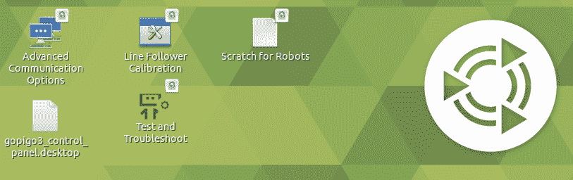

这些附加实用程序如下：

+   **高级通信选项**：此图标用于启用蓝牙和/或红外接收器。

+   **线跟踪校准**：此图标用于调整传感器对当前光照条件的灵敏度。

+   **gopigo3_control_panel**：此图标用于通过屏幕上显示的简单面板来驱动机器人。

+   **测试和故障排除**：此实用程序为您的机器人生成日志文件，可以发送给制造商，以便它提供技术支持。

例如，双击**测试和故障排除**图标。它将生成您的机器人的日志文件，该文件应如下所示：

```py
GoPiGo3 Troubleshooting Script log

Checking for hardware, and checking hardware and firmware version.
==================================================================
Manufacturer : Dexter Industries
Board : GoPiGo3
Serial Number : F92DD433514E343732202020FF112535
Hardware version: 3.x.x
Firmware version: 1.0.0
Battery voltage : 9.414
5v voltage : 4.889
```

到目前为止，您的操作系统已准备好运行任何 GoPiGo3 代码，即我们在第二章，*GoPiGo3 单元测试*中使用的 Python 脚本。

# 设置 Pi 摄像头

设置分为步骤 1-2。首先，我们将从 Raspberry Pi 启用对摄像头硬件的访问，其次，我们将安装 Python 模块来处理摄像头：

1.  首先，我们需要编辑`/boot/config.txt`文件：

```py
$ sudo nano /boot/config.txt
```

1.  然后，我们在末尾添加这两行：

```py
start_x=1
gpu_mem=128
```

1.  或者，您也可以通过在命令行中添加以下这些行来达到相同的结果：

```py
$ sudo bash -c "echo 'start_x=1' >> /boot/config.txt"
$ sudo bash -c "echo 'gpu_mem=128' >> /boot/config.txt"
```

1.  接下来，按照以下方式安装 Python 模块：

```py
$ sudo pip install picamera
```

1.  为了检查相机是否正常工作，创建这个 Python 脚本，并将其命名为 `captureFile.py` （你可以在本章代码的 `piCamera` 文件夹中找到它）：

```py
from time import sleep
from picamera import PiCamera

camera = PiCamera()
camera.resolution = (1024, 768)

camera.start_preview()

# Camera warm-up time
sleep(2)

camera.capture('test.jpg')
```

1.  给 Python 模块执行权限并运行：

```py
$ chmod +x captureFile.py
$ ./captureFile.py
```

相机将激活 2 秒。检查相机板上的红色 LED 是否亮着。这是它在获取图像的视觉信号。在此期间过后，LED 将关闭，你应该在脚本相同的路径下找到一个名为 `test.jpg` 的新文件。如果你打开它，你应该能看到相机在最后那 2 秒钟看到的景象；这是通过：`camera.capture(test.jpg)` 实现的。

准备好 Raspberry Pi 的最后一步是安装 ROS。

# 安装 ROS Melodic

ROS Melodic 安装页面 ([`wiki.ros.org/melodic/Installation/Ubuntu`](http://wiki.ros.org/melodic/Installation/Ubuntu)) 上的说明非常清晰和直接。我们在这里包括它们是为了完整性：

1.  首先，添加 ROS 源仓库：

```py
$ sudo sh -c 'echo "deb http://packages.ros.org/ros/ubuntu $(lsb_release -sc) main" > /etc/apt/sources.list.d/ros-latest.list'
```

1.  然后，设置你的密钥：

```py
$ sudo apt-key adv --keyserver 'hkp://keyserver.ubuntu.com:80' --recv-key C1CF6E31E6BADE8868B172B4F42ED6FBAB17C654
```

如果你没有得到一个验证过的密钥，那么它可能已经被更改（出于安全原因）。如果是这种情况，那么请访问官方安装页面 ([`wiki.ros.org/melodic/Installation/Ubuntu`](http://wiki.ros.org/melodic/Installation/Ubuntu))，搜索该行，然后用新的一行替换它。

1.  接下来，更新你的源：

```py
$ sudo apt-get update
```

1.  安装 ROS 的桌面版本，以便你可以利用 Mate 桌面环境。这将允许你使用 ROS 图形界面工具（如 rqt 或 RViz）：

```py
$ sudo apt-get install ros-melodic-desktop
```

1.  初始化 `rosdep`。这是使你能够轻松安装源代码编译的系统依赖项的组件。它还要求你运行 ROS 的一些核心组件：

```py
$ sudo rosdep init
$ rosdep update
```

1.  为你的交互式 shell 会话设置 ROS 环境：

```py
$ source /opt/ros/melodic/setup.bash
```

为了避免每次都必须运行此命令，你可以打开一个新的终端，并将其包含在你的 `.bashrc` 文件中：

```py
$ echo "source /opt/ros/melodic/setup.bash" >> ~/.bashrc
$ source ~/.bashrc
```

现在剩下的就是配置 Pi 相机。让我们接下来这么做。

# 安装 Pi Camera ROS 软件包

作为 ROS 安装的一部分，我们应该包括允许你从 ROS 访问 Pi 相机的软件。最常用的软件包来自 Ubiquity Robotics，它托管在 GitHub 上，地址为 [`github.com/UbiquityRobotics/raspicam_node`](https://github.com/UbiquityRobotics/raspicam_node)。

为了安装软件包，我们首先需要一个 ROS 工作空间，并且需要掌握一些关于克隆和创建 ROS 软件包的实用概念。这个安装将在本章稍后完成；你将在 *案例研究 2 – ROS GUI 开发工具 – Pi 相机* 中找到它，*全局*。

因此，我们现在继续创建一个工作空间并在其中添加第一个软件包。

# ROS 编程的快速介绍

本节致力于解释一个简单的 GoPiGo3 ROS 示例。通过这样做，我们可以快速让我们的机器人开始工作，以便在后面的章节中，我们可以以实用的方式处理 ROS 命令和工具，应用这些命令并理解它们的作用。

这个非常简单的例子是基于 GoPiGo3 的距离传感器。它包括发布传感器读数和从其他 ROS 节点访问它们。

# 设置工作空间

要开始使用贡献的 ROS 软件包或创建自己的软件包，你需要有一个工作空间来放置代码。完成此类任务的逐步过程如下：

1.  从 bash 终端创建一个文件夹并初始化工作空间：

```py
$ mkdir -p ~/catkin_ws/src
$ cd ~/catkin_ws/src
$ catkin_init_workspace
```

初始化就像创建一个指向 ROS 安装文件夹中文件定义的符号链接一样简单。如果您列出`src`文件夹中的文件，您将看到指向`/opt/ros/melodic/share/catkin/cmake/toplevel.cmake`的新`CMakeLists.txt`文件：

```py
$ ls -la

... CMakeLists.txt -> /opt/ros/melodic/share/catkin/cmake/toplevel.cmake
```

1.  接下来，构建工作空间：

```py
$ cd ~/catkin_ws
$ catkin_make
```

1.  然后，将其添加到你的 ROS 环境中：

```py
$ source ~/catkin_ws/devel/setup.bash
```

1.  或者，您可以通过在`.bashrc`文件末尾包含此命令来自动执行此命令。为此，执行以下命令，然后运行文件，以便其内容在系统中生效：

```py
$ echo "source ~/catkin_ws/devel/setup.bash" >> ~/.bashrc
$ source ~/.bashrc
```

到目前为止，文件末尾应该有以下两行（第一行是 ROS 全局环境，第二行是您的私有工作空间）：

```py
source /opt/ros/kinetic/setup.bash
source ~/catkin_ws/devel/setup.bash
```

现在一切准备就绪，可以包含我们需要的 ROS 软件包。在下一节中，我们将添加其中两个：一个克隆现有仓库，另一个从头创建软件包。

# 克隆 ROS 软件包

对于克隆选项，我们将使用一个基本的 GoPiGo3 ROS 软件包，该软件包在 GitHub 上公开可用，地址为[`github.com/ros-gopigo/gopigo3_node`](https://github.com/ros-gopigo/gopigo3_node)。切换到`src`文件夹，这是我们放置所有 ROS 软件包的位置，然后克隆源代码：

```py
$ cd ~/catkin_ws/src
$ git clone https://github.com/ros-gopigo/gopigo3_node
```

每次添加新的软件包时，你必须重新构建工作空间，以便 ROS 知道其存在并将其添加到执行环境。因此，运行以下命令：

```py
$ cd ~/catkin_ws
$ catkin_make
```

现在，你会看到一系列表示进度的百分比和当前构建步骤正在做什么的行。如果一切正常，最后一行显示 100%完成并返回到命令行。这意味着你刚刚成功安装了`gopigo3_node`软件包。

# 我们第一次执行 ROS 节点

由于 ROS 将在树莓派上运行，因此你需要远程连接到它。为此，打开 GoPiGo 的 VNC 连接。然后，在其桌面上打开一个终端并安装 Terminator（我们在第三章，*ROS 入门*)中使用的相同实用程序，以便在同一窗口中拥有尽可能多的终端：

```py
$ sudo apt-get update
$ sudo apt-get install terminator
```

移动到新添加的 ROS 软件包的位置，并列出其中的文件：

```py
$ cd ~/catkin_ws/src/gopigo3_node/src
$ ls
```

您将看到几个用于控制 GoPiGo3 传感器和驱动器的 Python 文件。假设您已经按照*设置物理机器人*部分中的说明安装了 GoPiGo3 和 DI 传感器库，打开 Terminator 并将窗口分成至少三个终端。我们将执行 ROS 下的`distance_sensor.py`文件。为此，我们需要发出以下三个命令：

```py
T1 $ roscore
T2 $ rosrun gopigo3_node distance_sensor.py
T3 $ rostopic echo /distance_sensor/distance
```

以下是全球每个命令执行的内容：

+   `T1`启动 roscore 进程。这对于所有后续的 ROS 通信过程都是必要的。

+   `T2`执行`distance_sensor`节点，该节点读取数据并将其发布到`/distance_sensor/distance`主题。

+   `T3`实时监听发布的数据，并在每次获取读取时打印一条新消息。

在下面的屏幕截图中，您可以查看每个终端显示的内容。每次读取传感器都会传递一个包含多个字段的消息。在后面的*案例研究 1 – 编写 ROS 包 – 距离传感器*部分，我们将解释这个消息是如何创建的。现在，您只需要知道红色方框内的`range`字段是传感器以米为单位的测量值：

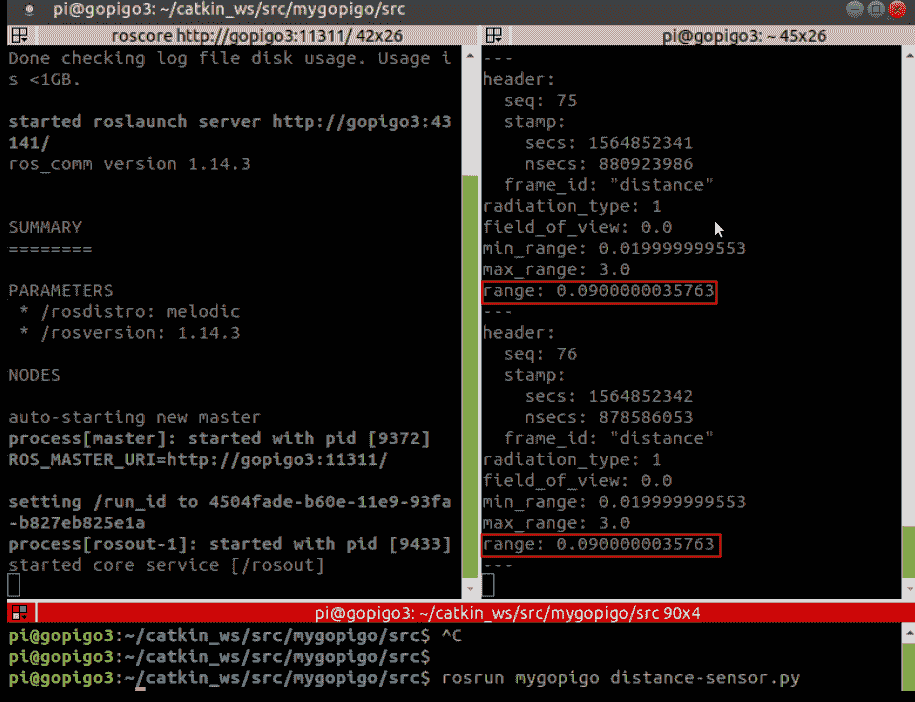

如果只想获取最后的测量值，只需运行以下命令，其中`-n`后面的数字表示您想要打印的消息数量，在我们的例子中是 1：

```py
T4 $ rostopic echo /distance_sensor/distance -n 1
```

下一步将是创建您自己的 ROS 包。我们将编写的代码将创建与`distance_sensor.py`脚本相同的包，但使用`EasyDistanceSensor`类（来自`di_sensors.easy_distance_sensor`库）而不是完整的`DistanceSensor`版本（来自`di_sensors.distance_sensor`库），后者是我们之前克隆的包中使用的脚本。

# 案例研究 1 – 编写 ROS 距离传感器包

在本节中，您将从零开始创建一个 ROS 包，并生成代码以提供 GoPiGo3 的最小 ROS 功能，即读取其距离传感器。请注意，您之前在此位置克隆的代码是您代码预期要执行的工作解决方案：

```py
 ~/Hands-On-ROS-for-Robotics-Programming/Chapter6_ROS_programming/pkg_mygopigo
```

我们鼓励您尝试根据本章后面提供的解释自己构建 ROS 包。

# 创建新包

首先，让我们在工作空间中设置一个文件夹，我们将放置包文件：

1.  将工作目录移动到`catkin_ws`工作空间文件夹中的`src`位置：

```py
$ cd ~/catkin_ws/src
```

1.  创建一个名为`mygopigo`的包：

```py
$ catkin_create_pkg mygopigo
```

此命令创建了两个包定义文件`CMakeLists.txt`和`package.xml`，这些文件在上一章中已经介绍过。由于有一个新的包，您应该重新构建工作空间：

```py
$ cd ~/catkin_ws
$ catkin_make
```

如果在某个时候您想更改项目名称，那么您需要完成以下三个步骤：

1.  在`<name>mygopigo</name>`标签中编辑 package.xml。

1.  编辑`CMakeLists.txt`文件中的`project (`mygopigo`)行，其中项目名称必须与`package.xml`的`<name>`标签相同。

1.  重新构建工作空间。

存储包文件的文件夹可以命名为您喜欢的任何名称 – 它不必与包名相同。

# 生成您的源代码

`mygopigo`文件夹已准备好，以便我们可以创建包结构并放置文件：

1.  在包内创建`src`文件夹 – 注意这是我们用来标准化代码在存储库中位置的约定：

```py
$ roscd mygopigo
$ mkdir src
$ cd src
```

`roscd` ROS 命令与 Linux bash 的`cd`命令等效。它的优点是您只需指定包名即可移动到包的文件夹，即`~/catkin_ws/src/mygopigo/`。然后，创建一个 Python 文件以从距离传感器获取数据：

```py
$ nano distance-sensor.py
```

1.  在文件中全局复制并粘贴以下行：

```py
#!/usr/bin/env python

# import the modules
from di_sensors.easy_distance_sensor import EasyDistanceSensor
from time import sleep

# instantiate the distance object
my_sensor = EasyDistanceSensor()

# and read the sensor iteratively
while True:
  read_distance = my_sensor.read()
  print("distance from object: {} cm".format(read_distance))
  sleep(0.1)
```

这是我们在上一章中审查的距离传感器的单元测试文件。我们将解释如何将其转换为 ROS 集成脚本。

ROS 要求源代码存储在具有以下执行权限的文件中：`$ chmod +x distance-sensor.py`.

1.  要运行，只需从命令行调用它：

```py
$ ./distance-sensor.py
```

这将在每 0.1 秒打印一次测量的距离（以厘米为单位）。此时，代码仍然是纯 Python。

我们现在将解释需要进行哪些更改才能将其集成到 ROS 中：

1.  首先，导入 ROS 所需的模块：

```py
import rospy
from sensor_msgs.msg import Range
```

`rospy`库是 Python 客户端，`sensor_msgs.msg`定义了处理 ROS 中传感器数据的消息类型。在我们的特定情况下，我们只需要`Range`类型消息，这就是我们需要用于距离传感器的。

1.  由于`rospy`提供了处理 ROS 中时间特性的方法，Python 的`time`库不再需要。因此，您可以删除该行：

```py
from time import sleep
```

1.  接下来，我们将代码放在`main()`函数定义下：

```py
def main():
    my_sensor = EasyDistanceSensor()
    rospy.init_node("distance_sensor")
    pub_distance = rospy.Publisher("~distance", Range, queue_size=10)
    msg_range = Range()
    msg_range.header.frame_id = "distance"
    msg_range.radiation_type = Range.INFRARED
    msg_range.min_range = 0.02
    msg_range.max_range = 3.0
    rate = rospy.Rate(rospy.get_param('~hz', 1))

```

1.  我们启动一个名为`distance_sensor`的 ROS 节点，定义一个名为`pub_distance`的发布者，在`msg_range`消息中设置传感器的特性，并指定我们想要读取传感器的速率，即 1 Hz。我们通过运行一个每次迭代读取传感器读数的不停循环来完成主函数的代码：

```py
    while not rospy.is_shutdown():

        read_distance = my_sensor.read()/100.0
        msg_range.range = read_distance
        msg_range.header.stamp = rospy.Time.now()

        print msg_range.range*1000," mm"
        pub_distance.publish(msg_range)

        rate.sleep()
```

在每次迭代中，此代码将传感器数据保存到`msg_range`实例中，将消息发布到`/distance_sensor/distance`主题，并在下一个读取之前运行时延迟以尊重指定的速率。最后，我们告诉 Python 运行`main()`函数：

```py
comment ...
if __name__ == '__main__':
    main()

```

在以下小节中，我们将详细介绍这些代码片段的更多信息。

# 包含所需的库 – rospy 和 msgs.msg

以下两行导入所需的 ROS 库：

```py
import rospy
from sensor_msgs.msg import Range
```

这些库的解释如下：

+   `rospy` ([`wiki.ros.org/rospy`](http://wiki.ros.org/rospy))：这是 ROS 的官方 Python 客户端。它实现了 API 方法，以便您可以将用 Python 编写的 ROS 节点集成。

+   `sensor_msgs` ([`wiki.ros.org/sensor_msgs`](http://wiki.ros.org/sensor_msgs))：这是 ROS 包，允许您根据机器人的传感器和驱动程序处理不同类型的 ROS 消息；例如，`BatteryState`、`FluidPressure` 和 `LaserScan`。在距离传感器的例子中，我们使用 `Range` 类型。

# 为脚本分配节点名称

此任务是通过使用 `rospy` 库的 `init_node` 方法完成的：

```py
rospy.init_node("distance_sensor")
```

使用 `distance_sensor` 名称，我们可以在 ROS 的任何地方引用距离传感器节点。

# 定义发布者

发布者是函数——再次强调，这是一个 `rospy` 方法，允许您将测量结果赋值给 `pub_distance` 变量，在我们的例子中，它是 `Range` 类型：

```py
pub_distance = rospy.Publisher("~distance", Range, queue_size=10)
```

引号之间的值是主题名称，`~distance`。前置符号 `~` 等同于 `<name of node>/`，在我们的例子中是 `distance_sensor`。随后，命名空间主题将如下所示：

```py
/distance_sensor/distance
```

`queue_size` 参数指定 ROS 在内存中保留多少条消息以确保订阅节点可以读取它们。默认值 `10` 是一个很好的选择。

# 设置 msg_range 对象

距离传感器使用在 `sensor_msgs.msg` 库中定义的消息类型，该类型在 `Range` 类中，其结构如下：

```py
uint8 ULTRASOUND=0
uint8 INFRARED=1

std_msgs/Header header
uint8 radiation_type
float32 field_of_view
float32 min_range
float32 max_range
float32 range
```

这些字段将构成任何涉及传感器数据流的消息的一部分，其语法在文档中有详细说明（[`docs.ros.org/api/sensor_msgs/html/msg/Range.html`](http://docs.ros.org/api/sensor_msgs/html/msg/Range.html)）。所有字段都是传感器的特定特征，除了测量值本身 `range`。因此，以下代码片段为我们的距离传感器提供了一个特定的定义：

```py
msg_range = Range()

msg_range.header.frame_id = "distance"
msg_range.radiation_type = Range.INFRARED
msg_range.min_range = 0.02
msg_range.max_range = 3.0
```

在这里，第一行初始化 `msg_range` 变量为 `Range()` 类型。在 `header.frame_id` 字段中，我们指明将要测量的物理量，即 `distance`。

将 `radiation` 类型设置为 `INFRARED`（没有选项将其设置为 `LASER`，但将指定为 `INFRARED` 比其他选项 `ULTRASOUND` 更为合适，后者会提供一个宽视野而不是直线）。`LASER` 和 `INFRARED` 都是定向的，因此使用此类型更好。

最后两行指定了传感器可以测量的最大距离（3 米）和最小距离（2 厘米）。

# 将单位转换为国际单位制

采用**国际单位制**（**SI**）是 ROS 规范中声明的规范（[`www.ros.org/reps/rep-0103.html`](https://www.ros.org/reps/rep-0103.html)）。由于 `read()` 方法提供的是厘米单位的测量值，我们只需将其除以 100 即可得到米单位的距离，并按照 ROS 标准将其馈送到系统中：

```py
read_distance = my_sensor.read()/100.0
```

此值将在之后插入到 `msg_range` 对象中，我们将在下一部分进行介绍。

# 向 msg_range 对象添加测量距离和时间戳

在`msg_range.range`字段中，我们分配测量的距离，在另一个字段`msg_range.header.stamp`中，我们分配当前的时间戳：

```py
msg_range.range = read_distance
msg_range.header.stamp = rospy.Time.now()
```

时间戳是从`rospy`库的`Time.now()`方法获得的。这样，我们就有了完整的测量记录。

# 设置读取频率

使用`Rate`方法，我们可以将读取频率设置为 1 Hz（这等于每秒 1 个样本；在 SI 单位中），如下所示：

```py
rate = rospy.Rate(rospy.get_param('~hz', 1))
```

我们通过定义一个名为以下内容的 ROS 参数同时完成此操作（记住`~`符号的含义）：

```py
distance_sensor/hz
```

使用此设置，传感器将每秒读取一次。

# 运行无限循环

我们使用`rospy`中的特定 ROS 方法来运行无限循环：

```py
while not rospy.is_shutdown():
```

其语法是自我解释的，也就是说，除非关闭 ROS，否则它将运行。

# 发布每个新事件

我们通过使用之前定义的`pub_distance`发布者，每次测量可用时发布一个新的`msg_range`消息：

```py
pub_distance.publish(msg_range)
```

# 等待下一次读取

为了确保我们尊重 1 Hz 的采集率，我们将`sleep`方法应用于我们上面定义的`rate`对象（我们为其设置了 1 Hz 的频率，即每秒一个周期）：

```py
rate.sleep()
```

请记住，这不会阻塞 ROS 执行（它只是阻塞了此节点的脚本），也就是说，只是这个`distance_sensor`节点的代码。如果有其他节点在环境中，那么它们将有自己的独立执行线程。如果你使用的是原生异步语言，如 JavaScript，那么你还可以在节点内运行异步代码，并避免脚本执行中的阻塞，也就是说，你的节点可以在等待下一次传感器读取时执行其他行。

如果你对此感兴趣，可以调查 ROS 客户端库`rosnodejs`([`www.npmjs.com/package/rosnodejs`](https://www.npmjs.com/package/rosnodejs))，它允许你使用 JavaScript 语言编写节点。在此阶段，请记住，ROS 的一个酷特性是你可以混合使用 Python 编写的相同 ROS 图节点与使用 JavaScript 或其他 ROS 客户端库编写的节点([`wiki.ros.org/Client%20Libraries`](http://wiki.ros.org/Client%20Libraries))。

# 启动 ROS 执行环境

现在我们已经了解了 Python 脚本如何与 ROS 集成，我们将使用以下步骤在终端中作为 ROS 运行时环境的一部分执行它：

1.  再次准备好你的分割 Terminator 窗口以提高可见性，然后在独立的终端中运行以下每个命令：

```py
T1 $ roscore
T2 $ rosrun mygopigo distance-sensor.py
T3 $ rostopic echo /distance_sensor/distance
```

第一个启动 ROS 主节点。第二个是我们刚刚解释的脚本，而第三个允许我们实时查看`/distance_sensor/distance`主题下发布的信息。这是你应该看到的内容：

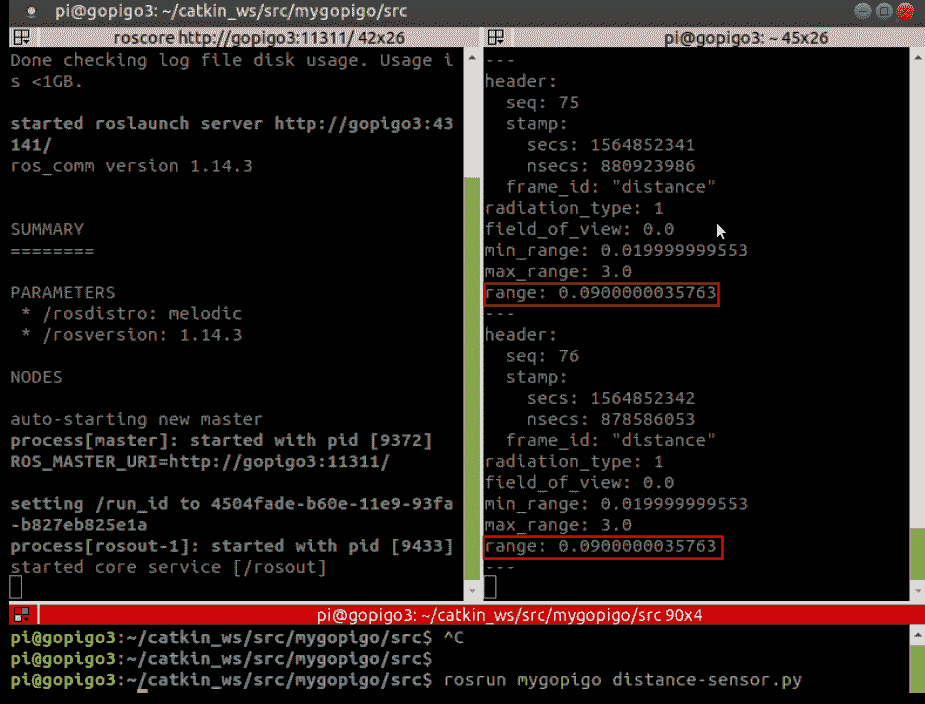

1.  然后，绘制 ROS 图以获得节点和主题如何连接的视觉洞察：

```py
T4 $ rqt_graph
```

一个新窗口弹出，显示当前的 ROS 图：


在这里，您可以看到它重现了我们正在三个终端中做的事情：我们执行了`/easyDistance_sensor`节点，该节点在`/easyDistance_sensor/distance`主题上发布传感器数据，然后我们使用主题订阅节点`/rostopic_2797_156571927410`显示读取值。

在通过这个例子之后，我们将使用它来展示您可用的各种 ROS 命令和工具。

# 使用 ROS 命令

在本节的第一个部分，我们将涵盖三个类别：要在 bash（shell）内部使用的命令、ROS 执行命令和信息命令。

# Shell 命令

Shell 命令被捆绑到 ROS 核心包`rosbash`([`wiki.ros.org/rosbash`](http://wiki.ros.org/rosbash))中。让我们继续看看每个提供的内容。

# 更改当前位置

首先，我们将介绍`roscd`，它等同于 Linux bash 的`cd`命令。它的优点是您只需指定包名即可移动到包的位置：

```py
$ roscd mygopigo
```

这将带您进入**`~/catkin_ws/src/mygopigo/`**文件夹。您也可以通过附加目标位置的相对路径来在包文件夹结构中导航。例如，要移动到`mygopigo`包的`src`文件夹，请使用以下命令：

```py
$ roscd mygopigo/src
```

`roscd`等同于 Linux 的`cd`命令。它将通过引用包名的路径来更改提示符，以指向系统中的任何 ROS 包的目录。无论实际路径是什么，ROS 都会自动带您去那里。

# 列出包内的文件和文件夹

接下来，我们有`rosls`，它是 Linux 的`ls`的等价物。要列出您所在位置的包的源代码，只需写下以下内容：

```py
$ rosls mygopigo/src
```

`rosls`允许您通过引用包名和路径轻松列出系统内任何 ROS 包中的文件和文件夹。无论实际路径是什么，ROS 都会自动带您去那里。

# 编辑包内的任何文件

最后，我们有`rosed`，它打开一个终端编辑器，例如`nano`，以便您可以修改包中的任何文件：

```py
$ rosed mygopigo distance-sensor.py
```

为了使`rosed`正常工作，您必须指定一个编辑器：

```py
export EDITOR=nano
```

要将其添加到您的配置中，请将前面的行添加到您的`.bashrc`文件末尾：

```py
echo 'export EDITOR=nano' >> ~/.bashrc
```

`rosed`等同于启动 Linux 终端编辑器，即`nano`。它将允许您通过简单地告诉它包名来编辑 ROS 包内的任何文件，无论文件实际位于哪个子文件夹中。

当您远程连接到机器人且只有一个终端与之交互时，这个命令是修改文件的一个方便方式。如果您在桌面会话中，您甚至可以使用桌面 IDE：

```py
EDITOR=geany rosed mygopigo distance-sensor.py
```

在这种情况下，您正在即时调用编辑器并覆盖`.bashrc`中设置的默认值。

# 执行命令

在第三章“ROS 入门”，我们已经介绍了用于运行我们第一个项目的`roscore`和`rosrun`命令。

# ROS 环境的中心过程

`roscore`是你必须启动的第一个进程，以便 ROS 环境工作。`roscore`允许节点之间相互通信。它没有参数，所以请在终端中写下这一行：

```py
$ roscore
```

`roscore`启动主节点，这是你的 ROS 环境的中心进程，并保持所有实际运行的节点连接。

# 执行单个节点

`rosrun`允许你从包中手动启动一个节点。语法相当简单：

```py
$ rosrun <name_of_package> <name_of_script>
```

脚本包括一个节点的声明。在我们的`distance-sensor.py`示例中，这是在以下行中完成的：

```py
rospy.init_node("distance_sensor")
```

然后，为了启动节点，请在另一个终端中写下这个命令：

```py
$ rosrun mygopigo distance-sensor.py
```

在这两个命令之后，你已经拥有了一个提供传感器读数的 ROS 功能环境。节点还会在终端进程中打印当前的测量值，转换为毫米（无需打开另一个终端来监听主题）。使用毫米只是为了可视化目的。ROS 消息保持其距离单位为米，你可以通过在另一个终端订阅主题来检查：

```py
print msg_range.range*1000," mm"
```

`rosrun`允许你从包中启动单个节点。这是在 ROS 环境中执行手动节点执行的命令。

最后，我们有`roslaunch`。这是最相关的执行命令，因为它允许你使用 XML 文件描述一个机器人。你可以声明其节点并将每个节点与其执行的脚本链接起来。我们将在“使用 roslaunch 自动化节点执行”部分更详细地查看这个命令。

# 信息命令

这个类别包含几个命令，允许你从 ROS 环境中提取信息以及交互式地修改一些值。所有命令都以`ros-`开头。只需在终端中写下命令，就可以提供有关如何使用每个命令的不同选项的帮助。接下来将提供每个命令的简要描述和示例。

# 探索主题

`rostopic`提供有关发布的主题的信息：

```py
$ rostopic list
```

这个列表包含了所有当前活跃的主题。从列表中，你可以访问其中任何一个的实时流：

```py
$ rostopic echo distance_sensor/distance
```

# 探索节点

`rosnode`提供有关活跃节点的信息：

```py
$ rosnode list
```

这个列表包含了当前 ROS 图中所有的节点。从列表中，你可以访问其中任何一个的信息：

```py
$ rosnode info distance_sensor
```

在这里，`info`将为你提供关于`distance_sensor`节点的有用信息。不要将其与声明节点的 Python 脚本名称`distance-sensor.py`混淆。`rosnode`命令始终指的是节点的名称。

# rosmsg 命令

`rosmsg`提供有关运行时由主题使用的消息类型的详细信息。为了给您一个实际例子，我们选择了`distance_sensor/distance`主题，并获得了以下关于它的信息：

```py
$ rostopic info distance_sensor/distance

```

此命令告诉我们该主题的消息类型为`sensor_msgs/Range`。然后，`rosmsg`通知我们消息结构：

```py
$ rosmsg info sensor_msgs/Range
```

此命令的输出是我们展示了并在*案例研究 1 – 编写 ROS 软件包 – 距离传感器*部分的*设置 msg_range 对象*子部分中解释的内容。在下一章中，我们将提供关于我们将要在 GoPiGo3 ROS 软件包中使用的新消息类型的扩展说明。

# rosbag 命令

此命令允许您保存会话并在需要时回放。让我们看看如何做到这一点：

```py
T1 $ roslaunch mygopigo easyDistance.launch
T2 $ rosbag record /distance_sensor/distance
```

当您想在 T2 终端中结束录制时，请按*Ctrl* + *C*。在`T2`中输入`rosbag info <bag filename>`以获取有关记录文件的详细信息（文件的默认名称由`date-time-topic_name`序列组成，并赋予`.bag`扩展名）：

```py
T2 $ rosbag info 2019-08-15-20-36-36_distanceSensor.bag

path: 2019-08-15-20-36-36.bag
version: 2.0
duration: 46.0s
start: Aug 15 2019 20:36:37.48 (1565894197.48)
end: Aug 15 2019 20:37:23.50 (1565894243.50)
size: 14.5 KB
messages: 47
compression: none [1/1 chunks]
types: sensor_msgs/Range [c005c34273dc426c67a020a87bc24148]
topics: /distance_sensor/distance 47 msgs : sensor_msgs/Range
```

请记住，bag 文件位于您在`T2`终端启动记录会话的位置。

记录的 bag 文件允许我们在任何时候重现主题历史，就像我们播放记录的歌曲一样。一个典型的使用场景示例是，在没有机器人本身的情况下，使用笔记本电脑上的 ROS 回放机器人行为。这种方法简化了应用程序的调试，并使您能够显著减少在真实机器人上运行软件的次数。

首先，让我们在 Raspberry Pi 上通过运行以下命令集来回放，这些命令包括 ROS 图的可视化（`rqt_graph`命令）以及随时间测量的距离（`rqt_plot`命令）：

```py
T1 $ roscore
T2 $ rosbag play 2019-08-15-20-36-36_distanceSensor.bag

T3 $ rostopic echo /distance_sensor/distance
T4 $ rqt_graph
T5 $ rqt_plot
```

在这个片段中，我们介绍了一个新的命令`rqt_plot`，它将在*案例研究 2- ROS GUI 开发工具- Pi 相机*部分中稍后解释。简而言之，它随时间绘制所选的 ROS 主题。

现在，您可以通过启动相同的命令集在笔记本电脑上回放会话。对于`rqt_plot`，您将得到以下结果：

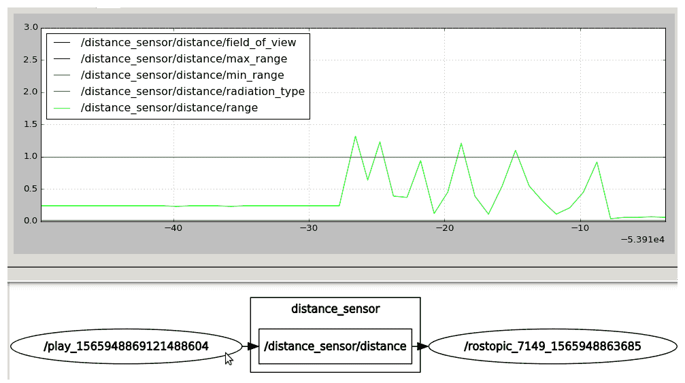

从 ROS 的角度来看，结果与您在 GoPiGo3 中运行实际的 launch 文件时完全相同。与图表相比，差异是由于您在笔记本电脑上安装了 ROS Kinetic 版本，而机器人有 Melodic 版本（这是更新的版本）。

# 软件包和 catkin 工作空间

本节中的一些命令已在配置您的 ROS 环境时使用过。现在让我们简要回顾一下：

+   `catkin_init_workspace`初始化一个新的工作空间，就像您在本章开头所做的那样。

+   `catkin_create_pkg`创建一个新的软件包。

+   `catkin_make`构建一个工作空间，每次您添加或删除一个软件包时都应该调用它。

这些是基本命令。尽管如此，还有一些额外的命令值得提及：

+   `catkin_find`列出你的 ROS 环境的工作文件夹。

+   `rospack`提供有关 ROS 包的信息，无论是核心、贡献的还是你自己制作的。如果你想了解处理 GoPiGo 时安装了哪些 ROS 包，可以使用此命令：

```py
$ rospack list | grep gopigo
 gopigo3_node /home/pi/catkin_ws/src/gopigo3_node
 mygopigo /home/pi/catkin_ws/src/mygopigo
```

你唯一需要注意的警告是，它们的名字中都应该包含字母`gopigo`，这样`grep`就可以过滤它们而不会遗漏任何一个。

在本节中，我们提供了最常用命令的概述。请花所有需要的时间来熟悉它们，因为当你与 ROS 一起工作时，你将不断使用它们。在下一节中，我们将通过解释订阅者节点的语法来扩展我们对发布-订阅模式的了解，该节点将读取所选主题的消息。

# 创建和运行发布者和订阅者节点

如果你已经理解了`distance-sensor.py`发布者脚本的工作原理，那么以下订阅者脚本应该很容易理解：

```py
#!/usr/bin/env python

import rospy
from sensor_msgs.msg import Range

def callback(msg):
    print msg.data
    rospy.loginfo(rospy.get_caller_id() + 'GoPiGo3 measures distance %s mm', msg.data*1000)

rospy.init_node('distance_sensor_subscriber')

sub = rospy.Subscriber('distance_sensor/distance', Range, callback)

rospy.spin()
```

这段代码对应于本章代码`./pkg_mygopigo/src`文件夹中的`distance-sensor_subscriber.py`文件。订阅者脚本中的主要区别在于，由于我们正在监听一个主题，我们不需要指定执行速率。我们只需使用以下行无限循环：

```py
rospy.spin()
```

每当在主题中接收到消息时，都会执行一个回调函数：

```py
sub = rospy.Subscriber('distance_sensor/distance', Range, callback)
```

在这种情况下，这个回调函数被定义为打印以毫米为单位的测量距离：

```py
def callback(msg):
    print msg.data
    rospy.loginfo(rospy.get_caller_id() + 'GoPiGo3 measures distance %s mm', msg.data*1000)
```

在 Terminator 窗口中使用多个终端在 ROS 中执行脚本：

```py
T1 $ roscore
T2 $ rosrun mygopigo distance-sensor.py
T3 $ rostopic echo distance_sensor/distance
T4 $ rosrun mygopigo distance-sensor_subscriber.py
T5 $ rqt_graph
```

看一下终端窗口，如下所示：

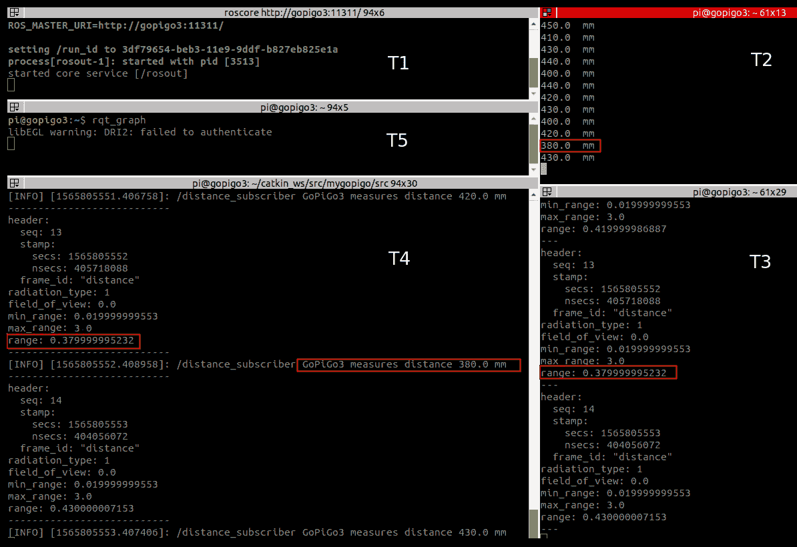

以下是全球 ROS 图：


有两个节点在监听同一个主题。一个是使用`/distance_subscriber`节点解释的订阅者脚本，另一个是`rostopic echo`命令创建的节点。

到目前为止，你已经手动启动了每个 ROS 节点。在下一节中，你将学习如何以编程方式执行，以将机器人软件作为自动化任务运行。

# 使用`roslaunch`自动化节点的执行

一旦你决定将哪些节点作为你机器人的部分运行，你可以通过使用`roslaunch`命令来自动化所有脚本的启动过程。它的语法如下：

```py
$ roslaunch <name_of_package> <name_of_launch_file>
```

对于我们的例子来说，这很简单，因为只有一个节点。启动文件在`./pkg_mygopigo/launch/easyDistance.launch`仓库中，其语法基于 XML：

```py
<launch>
   <node name="easyDistance_sensor" pkg="mygopigo" type="distance-sensor.py" output="screen" />
   node name="distance_subscriber" pkg="mygopigo" type="distance-sensor_subscriber.py" output="screen" />
</launch>
```

`<launch>`标签界定机器人描述。然后，为每个你想要启动的节点包含一个`<node>`标签。在我们的例子中，只有一个：`distance_sensor`节点。其属性的描述如下：

+   `name`：用于识别节点的名称。这取代了脚本行中给出的名称：

```py
rospy.init_node("distance_sensor")
```

在此启动文件中我们设置了不同的名称，`easyDistance_sensor`：

+   `pkg`：这是包的名称，是`mygopigo`。

+   `type`：这是启动节点的脚本的引用，`easyDistance.py`。

+   `output`：我们指定屏幕（默认是输出到`$ROS_HOME/log`的日志）。

一旦你理解了 XML 启动文件，重复提升机器人的过程，但这次使用自动方式：

```py
T1 $ roslaunch mygopigo easyDistance.launch
T2 $ rostopic echo /easyDistance_sensor/distance
```

`roslaunch`隐式启动`roscore`。你应该看到与手动使用`rosrun`运行时的相同输出。显然，`roslaunch`在需要同时启动多个节点时非常有用。我们将在稍后看到这方面的示例。

通过在 Terminator 窗口下的几个终端中执行脚本，在 ROS 中执行脚本：

```py
T1 $ roslaunch mygopigo easyDistance.launch
T2 $ rostopic echo distance_sensor/distance
T3 $ rqt_graph
```

看看以下终端窗口：

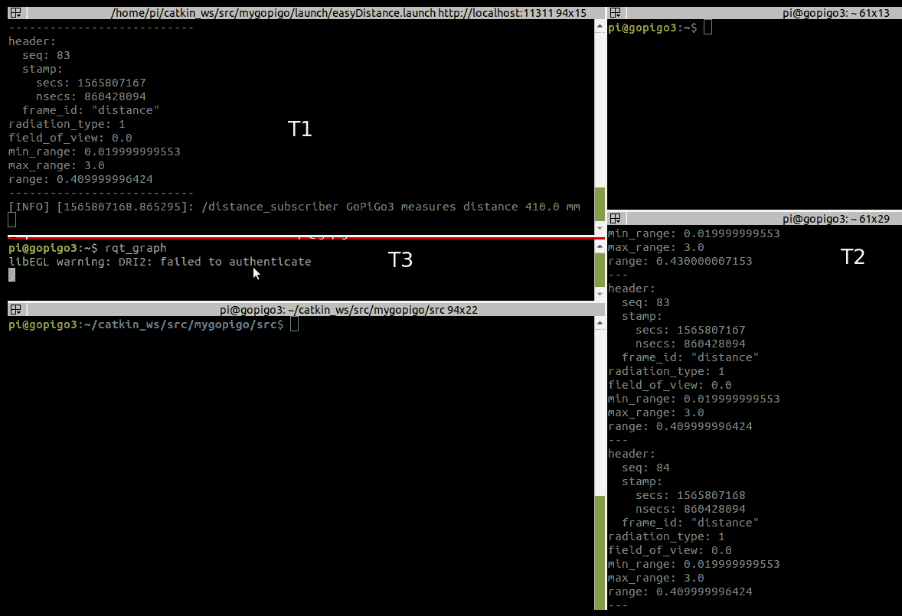

这是 ROS 图：


你将发现与上一节完全相同的结果。现在让我们看看 ROS 可视化工具，这些工具可以简化我们作为软件机器人开发者的生活。

# 案例研究 2 – ROS GUI 开发工具 – Pi Camera

正如我们在*安装 ROS Melodic*部分结束时提到的，为了能够使用相机，我们首先需要安装其 ROS 包。由于二进制文件对 ROS Melodic 不可用（仅对 Kinetic 可用），我们需要从源代码构建包，这是一个完美的例子，你将知道如何对任何其他包这样做。让我们按照以下步骤进行：

1.  前往你的`catkin`工作空间并下载源代码：

```py
$ cd ~/catkin_ws/src
$ git clone https://github.com/UbiquityRobotics/raspicam_node.git
```

1.  对于 ROS，需要安装一些依赖项。为了执行此任务，我们将创建`30-ubiquity.list`文件：

```py
$ sudo -s
$ echo “yaml https://raw.githubusercontent.com/UbiquityRobotics/rosdep/master/raspberry-pi.yaml” > /etc/ros/rosdep/sources.list.d/30-ubiquity.list
$ exit
```

1.  之后，按照以下方式运行 ROS 依赖项更新：

```py
$ rosdep update
```

1.  现在安装 ROS 依赖项：

```py
$ cd ~/catkin_ws
$ rosdep install --from-paths src --ignore-src --rosdistro=melodic -y
```

1.  按以下方式编译新包：

```py
$ catkin_make --only-pkg-with-deps raspicam_node
$ catkin_make -DCATKIN_WHITELIST_PACKAGES=""
```

如果你使用`catkin_make`没有任何选项，构建过程将遍历工作空间中的所有包。因此，此代码片段显示了如何在忽略其余包的情况下编译单个包。第二行允许你在需要编译工作空间中的下一个包时切换回启用构建所有包。

1.  要运行 Pi Camera 节点，只需启动以下命令：

```py
T1 $ roslaunch raspicam_node camerav2_1280x960.launch
```

1.  如果你拥有之前的 Pi Camera 版本，`V1`，请使用以下替代方案：

```py
T1 $ roslaunch raspicam_node camerav1_1280x720.launch
```

1.  然后，在另一个终端中运行随包提供的图像查看器实用程序，以检查相机是否正常工作：

```py
T2 $ rosrun raspicam_node imv_view.py
```

你应该会看到一个类似以下的新窗口：

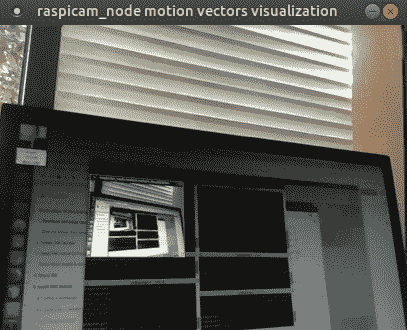

如果你移动机器人，你会发现图像也会改变，所以你正在观看实时相机流。现在我们准备进行本节范围的 ROS GUI 开发工具的实际解释。

# 使用 rqt_graph 分析 ROS 图

通过发出此命令，你可以可视化当前的 ROS 图形：

```py
T3 $ rqt_graph
```

它将显示以下图表：


`raspicam_node` 是与物理 Pi Camera 接口的包的根节点。它在 `/raspicam_node/image/compressed` 主题中发布图像。另一个节点 `imv_view` 来自 `T2` 终端的进程，它启动一个窗口，你可以在这里观看实时流（如前节所示）。

最后，检查主题的 `raspicam_node` 提供以下信息：

```py
T4 $ rostopic list | grep raspicam_node

/raspicam_node/camera_info
/raspicam_node/image/compressed
/raspicam_node/parameter_descriptions
/raspicam_node/parameter_updates
```

你可以在列表中找到 `imv_view` 节点订阅的节点，即 `/raspicam_node/image/compressed`。

# 使用 rqt_image_view 显示图像数据

此插件允许你可视化在 ROS 主题中发布的图像数据。关闭前两个终端，并启动以下新的终端：

```py
T1 $ roslaunch raspicam_node camerav2_410x308_30fps.launch
T2 $ rqt_image_view
```

在左上角的下拉列表中，选择你想要可视化的图像主题。由于它是由 `raspicam_node` 发布的，所以它需要以压缩格式存在。以下截图显示了结果：

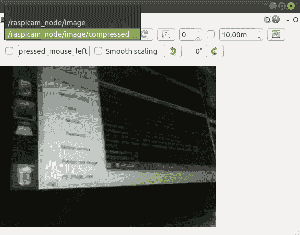

如果你有几个包含图像数据的主题，此插件允许你交互式地选择要观看的源，并在需要时在它们之间切换。

# 使用 rqt_plot 绘制传感器数据的时间序列图

这是一个用于可视化二维数据的插件。由于我们想看到二维数据，让我们简要切换到距离传感器案例研究，以便我们可以查看随时间测量的距离。过程很简单：启动机器人，列出主题，然后启动插件：

```py
T1 $ roslaunch mygopigo easyDistance.launch
T2 $ rostopic list | grep distance_sensor
T3 $ rqt_plot
```

在左上方的框中，写下你想要可视化的主题名称，即按照 `T2`，`/distance_sensor/distance`。一个窗口将弹出，显示随时间变化的障碍物距离：

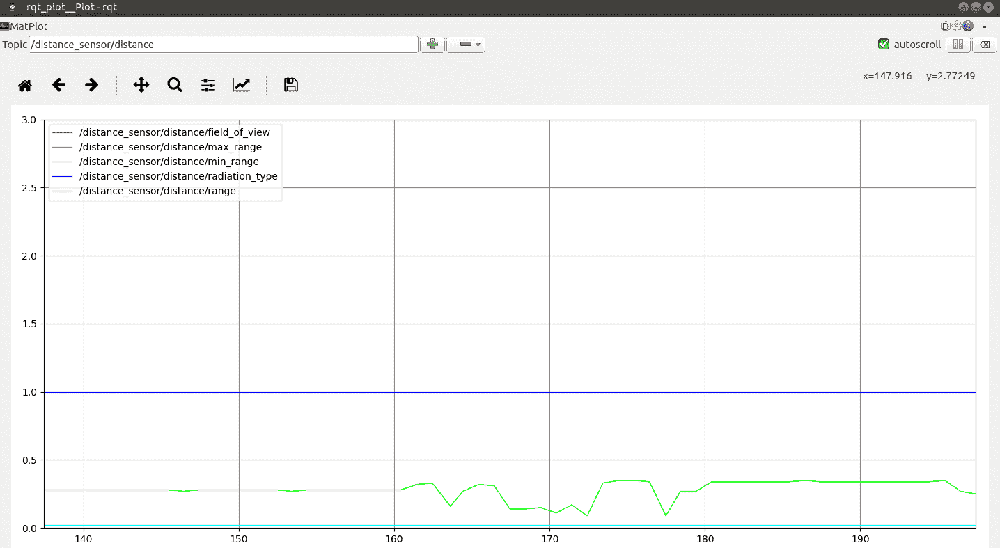

绿线 `msg_range.range` 是实际测量值。`msg_range` 对象的其他字段（这是 `topic/distance_sensor/distance` 的内容）显示所有测量的最大值和最小值：`msg_range.max_range` 和 `msg_range.min_range`。

# 使用 rqt_bag 播放记录的 ROS 会话

`rqt_bag` 插件播放一个 bag 文件，这与在 *ROS 命令* 部分解释的 `rosbag` 命令相同。在这里，优势在于你可以对播放进行交互式控制：你可以跳转到任何瞬间，播放单个时间步，回放到开始，等等。让我们首先通过距离传感器案例研究来检验这一点，然后是 Pi Camera。

# 距离传感器

你可以在任何地方执行回放，使用机器人或笔记本电脑。与 `rosbag` 一样，你需要先访问 `roscore` 进程，然后可以发出 `rqt_bag`：

```py
T1 $ roscore
T2 $ rqt_bag
```

一个新的窗口弹出。选择要播放的文件包，即`2019-08-15-20-36-36_distanceSensor.bag`，在窗口上右键单击，然后标记`/distance_sensor/distance`主题以发布。运行与使用`rosbag`时相同的命令集：

```py
T3 $ rostopic echo /distance_sensor/distance
T4 $ rqt_graph
T5 $ rqt_plot
```

在下面的屏幕截图中，你可以检查结果是否相同：

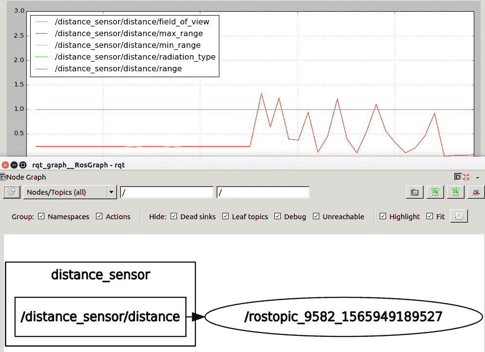

现在我们将播放 Pi Camera 案例研究中的图像流。

# Pi 相机

首先，我们需要记录机器人的一个会话：

```py
T1 $ roslaunch raspicam_node camerav2_410x308_30fps.launch
T2 $ rosbag record /raspicam_node/image/compressed
```

检查录制文件的详细信息：

```py
$ rosbag info 2019-08-15-20-44-53_raspicamImage.bag

path: 2019-08-15-20-44-53_raspicamImage.bag
version: 2.0
duration: 13.3s
start: Aug 15 2019 20:44:54.09 (1565894694.09)
end: Aug 15 2019 20:45:07.38 (1565894707.38)
size: 37.5 MB
messages: 400
compression: none [47/47 chunks]
types: sensor_msgs/CompressedImage [8f7a12909da2c9d3332d540a0977563f]
topics: /raspicam_node/image/compressed 400 msgs : sensor_msgs/CompressedImage
```

你可以在任何地方播放回放，使用机器人或笔记本电脑。在这种情况下，图像数据更庞大。因此，在笔记本电脑上播放会话会更好。按照之前的方式启动进程：

```py
T1 $ roscore
T2 $ rqt_bag
```

在启动的`rqt_bag`插件中，选择要播放的文件包，即`2019-08-15-20-44-53_raspicamImage.bag`，在窗口上右键单击，然后标记`/raspicam_node/image/compressed`主题以发布。之后，运行以下命令集：

```py
T3 $ rostopic echo /raspicam_node/image/compressed
T4 $ rqt_graph
T5 $ rqt_image_view
```

在`rqt_image_view`的左上角下拉列表中选择你想要可视化的图像主题。它需要以压缩格式发布，因为它是由`raspicam_node`发布的。在下面的屏幕截图中，你可以检查结果是否相同：

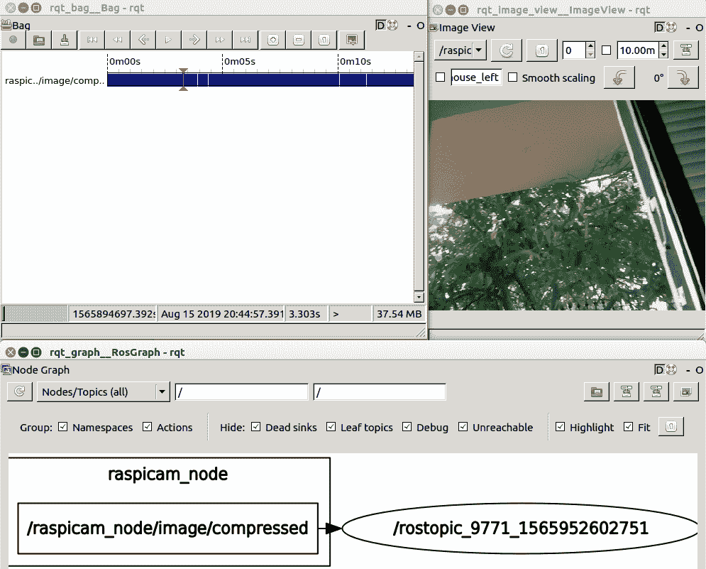

在播放文件包时，你可以检查由于你的笔记本电脑与 Raspberry Pi 相比拥有更强大的 GPU，图像流非常流畅。因此，很明显，当你处理计算机视觉任务时，你将利用笔记本电脑中机器人会话的这种可视化能力。

# 使用 ROS 参数自定义机器人功能

ROS 参数存储机器人的全局配置。这是一种定义你的应用程序的便捷方式，这样你可以将功能抽象到高级别，并使其对最终用户可用。我们将通过使用允许动态重新配置其中一些参数的`rqt`插件来展示 ROS 参数的工作原理。正如其名，你可以实时修改机器人的特性：

1.  启动`raspicam_node`然后启动`rqt`插件：

```py
T1 $ roslaunch raspicam_node camerav2_410x308_30fps.launch
T2 $ rqt_image_view
T3 $ rosrun rqt_reconfigure rqt_reconfigure
```

你的桌面应该显示以下两个窗口：

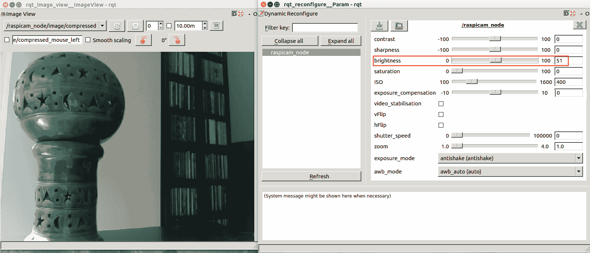

1.  检查右侧的参数，并关注亮度（红色标记的框）。将它的值从`51`修改到`81`，然后检查结果：

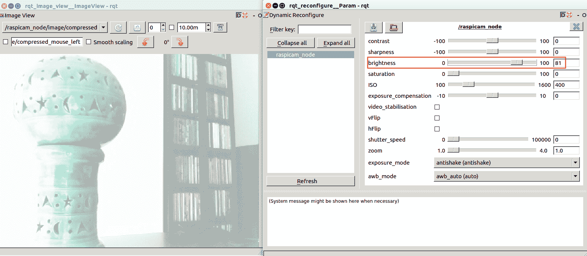

哇！你可以在不重新启动机器人的情况下动态修改机器人的配置。

1.  你还有`rosbash`命令，它允许你检查参数。使用以下行列出它们：

```py
T4 $ rosparam list | grep raspicam_node

/raspicam_node/ISO
/raspicam_node/awb_mode
/raspicam_node/brightness
/raspicam_node/camera_frame_id
/raspicam_node/camera_id
/raspicam_node/camera_info_url
/raspicam_node/camera_name
/raspicam_node/contrast
/raspicam_node/enable_imv
/raspicam_node/enable_raw
/raspicam_node/exposure_compensation
...
/raspicam_node/zoom
```

此外，获取我们动态修改的状态：

```py
T4 $ rosparam get /raspicam_node/brightness
 81
```

如果你已经到达这个阶段并且理解了实际练习中的概念，你现在几乎知道你需要用 ROS 做的一切。

# 摘要

在本章中，我们为 ROS 编程奠定了基础。您已经构建了自己的包，并添加了简单的 GoPiGo3 功能：读取距离传感器，以便于编程概念的学习。您还学习了如何读取 Pi Camera 图像并将它们提供给 ROS 进行进一步处理，这是执行计算机视觉任务的起点。

在下一章中，您将把两个 ROS 世界结合起来：机器人和您的笔记本电脑。这样，一旦您在机器人上运行了 GoPiGo3 包，您将能够从您强大的笔记本电脑上执行所有计算和处理任务。

# 问题

1.  ROS 主题和 ROS 消息之间的区别是什么？

A) 它们都代表从一个节点传输到另一个节点的数据。

B) 主题是您识别传输通道的方式，而消息是通过该通道流动的内容的一个样本。

C) 任何主题名称都必须是唯一的，而多个主题可以传输相同的信息。

1.  您将使用哪个命令来记录 ROS 会话？

A) `rosbag`

B) `rosrecord`

C) `roswrite`

1.  一个 ROS 节点可以在同一时间既是发布者又是订阅者吗？

A) 是的，如果主题订阅者与主题发布者相同。

B) 不可以，因为这会意味着编程冲突：一个具有发布者的节点以恒定速率循环，即`rate.sleep()`，而一个具有订阅者的节点只有在接收到消息时才运行一个迭代，即`rospy.spin()`。

C) 是的，并且节点是由订阅者驱动的，也就是说，节点每次从它订阅的主题接收到消息时都会广播一个新的消息。

1.  在同一个 ROS 会话中，您可以运行多少个`roslaunch`命令？

A) 您需要的数量；`roslaunch`是一个描述文件，它告诉 ROS 在调用命令时启动哪些节点。

B) 只有一个，因为`roslaunch`隐式运行一个`roscore`进程，并且会话中只能有一个 ROS 主节点。

C) 如果您需要两组节点，建议您在需要将每个节点添加到执行环境时手动启动它们。然后，启动一个`roscore`进程，之后为每个新节点执行一个`rosrun`。

1.  有没有一种程序化的方法可以可视化在 ROS 主题中发布的图像？

A) 是的，使用`rqt_plot`

B) 是的，使用`rqt_image_view`

C) 是的，使用`rqt_image_view`，但图像必须是压缩格式。

# 进一步阅读

要深入了解本章中我们解释的概念，您可以参考以下参考资料和教程：

+   ROS 技术概述：[`wiki.ros.org/ROS/Technical%20Overview`](http://wiki.ros.org/ROS/Technical%20Overview)

+   ROS 速查表：[`kapeli.com/cheat_sheets/ROS.docset/Contents/Resources/Documents/index`](https://kapeli.com/cheat_sheets/ROS.docset/Contents/Resources/Documents/index)

+   ROS 命令行 – `rosbash`命令：[`wiki.ros.org/rosbash`](http://wiki.ros.org/rosbash)

+   主节点 – `roscore` 命令和进程：[`wiki.ros.org/roscore`](http://wiki.ros.org/roscore)

+   ROS 主题 – `rostopic` 命令说明：[`wiki.ros.org/rostopic`](http://wiki.ros.org/rostopic)

+   ROS 节点 – `rosnode` 命令说明：[`wiki.ros.org/rosnode`](http://wiki.ros.org/rosnode)

+   消息 – `rosmsg` 命令说明：[`wiki.ros.org/rosmsg`](http://wiki.ros.org/rosmsg)

+   ROS 参数 – `rosparam` 命令说明：[`wiki.ros.org/rosparam`](http://wiki.ros.org/rosparam)

+   记录会话 – `rosbag` 命令说明：[`wiki.ros.org/rosbag`](http://wiki.ros.org/rosbag)

+   使用 `rosbag` 记录和回放数据：[`wiki.ros.org/rosbag/Tutorials/Recording%20and%20playing%20back%20data`](http://wiki.ros.org/rosbag/Tutorials/Recording%20and%20playing%20back%20data)

+   Catkin 命令行工具：[`catkin-tools.readthedocs.io`](https://catkin-tools.readthedocs.io)

+   Pi Camera 官方文档：[`picamera.readthedocs.io`](https://picamera.readthedocs.io)

+   ROS `rqt` 图形界面工具：[`wiki.ros.org/rqt`](http://wiki.ros.org/rqt)

+   `rqt_graph` 插件：[`wiki.ros.org/rqt_graph`](http://wiki.ros.org/rqt_graph)

+   `rqt_image_view` 插件：[`wiki.ros.org/rqt_image_view`](http://wiki.ros.org/rqt_image_view)

+   `rqt_plot` 插件：[`wiki.ros.org/rqt_plot`](http://wiki.ros.org/rqt_plot)

+   `rqt_bag` 插件：[`wiki.ros.org/rqt_bag`](http://wiki.ros.org/rqt_bag)

+   使用 `rqt` 工具进行分析 – `rqt_console`、`rqt_graph` 和 `urdf_to_graphviz`：[http://](https://industrial-training-master.readthedocs.io/en/melodic/_source/session6/Using-rqt-tools-for-analysis.html)[s://industrial-training-master.readthedocs.io/en/melodic/_source/session6/Using-rqt-tools-for-analysis.html](https://industrial-training-master.readthedocs.io/en/melodic/_source/session6/Using-rqt-tools-for-analysis.html)
