# 第九章：机器人导航的 SLAM

在本章中，您将深入了解机器人导航，这是机器人工程中的一个普遍任务。典型用例包括自动驾驶汽车和工厂中的物料运输。您会发现我们之前通过应用 **SLAM（同时定位与建图）** 生成的地图在路径规划过程中被使用。给定一个初始姿态，机器人将沿着最佳路径移动，并且应该能够对动态事件做出反应，也就是说，它应该能够避开在地图构建后出现的障碍物（静态或动态）。

本章是前一章的自然延伸。在前一章中，您获得了对 SLAM 和导航的实践理解，并且您是在 Gazebo 模拟器中使用 GoPiGo3 的虚拟模型来做到这一点的。现在，您准备好再次使用物理机器人完成练习。通过这样做，您将发现当您在真实环境中完成机器人任务时会出现多少细节和实际问题。模拟是一个好的开始，但真正证明您的机器人按预期运行的证据是在实际场景中执行任务。

在本章中，我们将涵盖以下主题：

+   为您的机器人准备**激光测距传感器**（**LDS**）

+   在 ROS 中创建导航应用程序，包括关于在导航中使用的常见算法的解释

+   使用 GoPiGo3 练习导航

导航任务的主要传感器将是低成本的 LDS，由 EAI 模型 YDLIDAR X4 提供（[`www.aliexpress.com/item/32908156152.html`](https://es.aliexpress.com/item/32908156152.html)），我们已经在 Gazebo 中对其进行了模拟。我们将在本章中投入大量篇幅来学习如何设置 LDS，了解其工作原理以及它为机器人提供哪些实用信息。

# 技术要求

在本章中，我们将使用位于 `Chapter9_GoPiGo_SLAM` 文件夹中的代码（[`github.com/PacktPublishing/Hands-On-ROS-for-Robotics-Programming/tree/master/Chapter9_GoPiGo_SLAM`](https://github.com/PacktPublishing/Hands-On-ROS-for-Robotics-Programming/tree/master/Chapter9_GoPiGo3_SLAM)）。将其文件复制到 ROS 工作空间，以便它们可用，并将其余部分放在 `src` 文件夹之外。这样，您将拥有一个更干净的 ROS 环境：

```py
$ cp -R ~/Hands-On-ROS-for-Robotics-Programming/Chapter9_GoPiGo_SLAM ~/catkin_ws/src/
```

上述文件夹中的代码包含两个新的 ROS 软件包，每个软件包都位于一个具有相同名称的文件夹中：

+   `ydlidar`，为所选 LDS 官方支持的 ROS 软件包。

+   `gopigo3_navigation`，用于执行 GoPiGo3 导航的最高级软件包。

您将在笔记本电脑环境中使用这两个软件包，但在机器人（即 Raspberry Pi）中，您只需要 `ydlidar`，因为建议将计算密集型的导航任务在笔记本电脑上运行。这样，GoPiGo3 将通过熟悉的 `cmd_vel` 主题接收驱动命令，并通过 `/scan` 主题发布来自 LDS 的 360° 扫描。

如同往常一样，您需要分别重新构建机器人和工作站的空间，包括机器人和笔记本电脑：

```py
$ cd ~/catkin_ws
$ catkin_make
```

通过选择它们并列出文件来检查包是否已正确安装：

```py
$ rospack list | grep gopigo3
$ rospack list | grep ydlidar
```

接下来，我们必须将 ROS 主指向机器人。

# 将 ROS 主设置为在机器人上

由于您将再次与物理机器人一起工作，您需要重新配置 ROS 主 URI，使其指向 GoPiGo3。这样，您的笔记本电脑才能反映这种配置，打开您本地的 `.bashrc` 文件，取消注释末尾指定要指向以找到 ROS 主的 URL 的行：

```py
$ nano ~./bashrc
 ...
 export ROS_HOSTNAME=rosbot.local
 export ROS_MASTER_URI=http://gopigo3.local:11311
```

关闭任何打开的终端，打开一个新的终端，并检查 `ROS_MASTER_URI` 变量：

```py
$ echo $ROS_MASTER_URI
 http://gopigo3.local:11311
```

您应该会发现环境变量已恢复到默认服务器（localhost）和默认端口（`11311`）。现在，我们准备好切换到虚拟机器人。如果由于某种原因，`gopigo3.local` 无法解析机器人 IP，请直接设置其 IPv4 地址。您可以从机器人操作系统中获得它，如下所示：

```py
$ ip addr # or 'ifconfig' instead
 192.168.1.51
```

然后，在 `.bashrc` 文件中，相应地修改以下行：

```py
export ROS_MASTER_URI=http://192.168.1.51:11311
```

关闭笔记本电脑上的终端，打开一个新的终端，以便配置生效。然后，检查以下内容：

```py
$ echo $ROS_MASTER_URI
 http://192.168.1.51:11311
```

现在，我们可以熟悉我们的新传感器。

# 为您的机器人准备一个 LDS

在开始之前，您应该花些时间回顾一下制造商 EAI 提供的所有文档。您可以在 [`www.ydlidar.com/download`](http://www.ydlidar.com/download) 找到所有资源。请特别注意以下项目：

+   为了熟悉硬件并安全地将其与您的机器人一起安装，请参阅 YDLIDAR X4 用户手册。

+   位于压缩文件 `ROS.zip` 内的 YDLIDAR X4 ROS 手册。`ros` 文件夹对应于 ROS 包，但您应该从 GitHub 克隆它以确保您获得最新版本并保持更新。按照 [`github.com/EAIBOT/ydlidar`](https://github.com/EAIBOT/ydlidar) 中的说明获取代码的最新版本。

EAI 已从下载页面移除了**CAD**（即**计算机辅助设计**）模型。

+   YDLIDAR X4 开发手册，它描述了通信协议，以便您可以构建自己的驱动程序来控制设备。

现在，您已经准备好开始使用硬件了。

# 设置 YDLIDAR

按照用户手册中的说明，将设备物理连接到您的笔记本电脑或机器人。以下截图显示了传感器本身通过一组五色电缆连接到控制板后的样子：

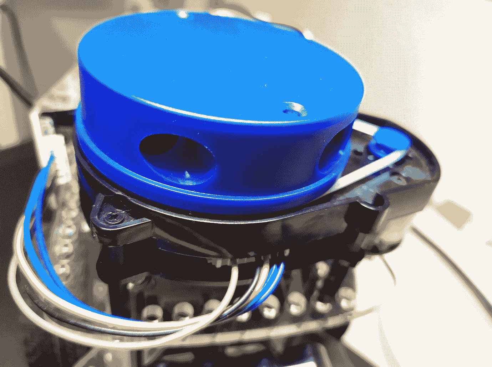

虽然软件说明也包含在手册中，但我们将在这里列出所有步骤，因为它们涉及与 ROS 的核心集成。首先，我们将与笔记本电脑集成，然后与机器人的 Raspberry Pi 集成。

# 与远程 PC 集成

就像我们与其他任何与 ROS 集成的硬件一样，我们遵循克隆制造商提供的包并使用我们的工作空间构建的标准程序：

```py
$ cd catkin_ws/src
$ git clone https://github.com/EAIBOT/ydlidar
$ cd ..
$ catkin_make
```

通过运行`catkin_make`，`ydlidar_client`和`ydlidar_node`节点将可用。

此代码也包含在 YDLIDAR 模型的其余部分中，在[`github.com/YDLIDAR/ydlidar_ros`](https://github.com/YDLIDAR/ydlidar_ros)。对于特定型号，你只需选择相应的分支，X4。在我们的情况下，这是`git clone https://github.com/YDLIDAR/ydlidar_ros -b X4 --single-branch`。

在将 X4 连接到笔记本电脑的 USB 端口后，更改权限以访问新的 LDS：

```py
$ sudo chown ubuntu:dialout /dev/ttyUSB0
```

前一个命令假设你的用户是`ubuntu`。如果不是，请将其替换为你的实际用户。然后，启动设备：

```py
$ roscd ydlidar/startup
$ sudo chmod 777 ./*
$ sudo sh initenv.sh
```

此脚本创建一个指向`/dev/ydlidar--> /dev/ttyUSB0`设备的符号链接。下一步是在 ROS 内部运行一个测试，以检查一切是否按预期工作。

# 运行 YDLIDAR ROS 包

现在，我们将启动激光扫描节点，并使用控制台客户端可视化结果，然后再使用 RViz 进行同样的操作。

按照以下步骤进行：

1.  使用以下命令启动 YDLIDAR 节点：

```py
T1 $ roslaunch ydlidar lidar.launch 
```

对于本章的这一部分，你应该暂时将 ROS 主节点指向笔记本电脑，而不是机器人。记住，你可以通过在每个终端中指定`$ export ROS_MASTER_URI=http://localhost:11311`来为单个终端这样做。一旦关闭其中任何一个，临时定义将被丢弃。

1.  在另一个终端中，使用客户端节点列出扫描数据：

```py
T2 $ rosrun ydlidar ydlidar_client
```

你应该在控制台看到 YDLIDAR 节点的扫描结果，以及 ROS 图（通过在另一个终端中运行`rqt_graph`获得），`T3`：

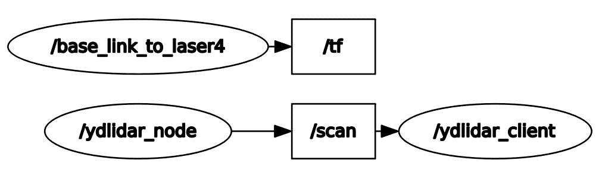

注意，`base_link_to_laser4`在`/tf`主题中提供坐标帧转换，而`ydlidar_node`在`/scan`主题中提供传感器数据流，这些数据流通过`ydlidar_client`节点在终端中可视化。

1.  最后，启动 RViz 以查看在发现障碍物位置的红点分布：

```py
T3 $ roslaunch ydlidar display_scan.launch
```

现在，我们将重复此练习，将 LDS 连接到机器人。

# 与 Raspberry Pi 集成

我们将重复上一节中描述的过程，即*设置 YDLIDAR*，以便将 LDS 连接到 Raspberry Pi。在将传感器连接到 Raspberry Pi 的 USB 端口后，在机器人上打开一个终端并按照以下步骤操作：

1.  克隆存储库并重建工作空间：

```py
$ cd catkin_ws/src
$ git clone https://github.com/EAIBOT/ydlidar
$ cd ..
$ catkin_make
```

1.  当你将 YDLIDAR 连接到 USB 端口时，检查连接是否已正确建立：

```py
$ ls -la /dev | grep USB
 crw-rw----  1 root dialout 188,   0 ene 28  2018 ttyUSB0
```

1.  然后，更改权限，以便你的普通用户`pi`可以访问新设备：

```py
$ sudo chown pi:dialout /dev/ttyUSB0
```

1.  现在，启动设备：

```py
$ roscd ydlidar/startup
$ sudo chmod 777 ./*
$ sudo sh initenv.sh
```

此脚本创建一个指向`/dev/ydlidar--> /dev/ttyUSB0`设备的符号链接。如果不是这种情况，你可以手动完成，如下所示：

```py
$ cd /dev
$ sudo ln -s ttyUSB0 ydlidar
```

这样，你可以确保`ydlidar_node`节点找到了设备。

# 检查 YDLIDAR 与 GoPiGo3 一起工作

就像我们在笔记本电脑上做的那样，使用`ydlidar_client`脚本来检查您是否已从传感器接收到数据：

```py
r1 $ roslaunch ydlidar lidar.launch
r2 $ rosrun ydlidar ydlidar_client
```

前面代码片段中的字母`r`代表 Raspberry Pi 上的终端。如果您在`r2`中收到数据，那么这将证明传感器正在将其读数发送到 ROS。

# 在 Raspberry Pi 桌面上可视化扫描数据

现在，让我们检查 Raspberry Pi 上的 RViz 可视化效果，就像我们检查笔记本电脑上的那样。为此，您需要使用**VNC（虚拟网络计算**），正如我们在第六章，“在 ROS 中编程 - 命令和工具”部分中*设置物理机器人*一节所解释的。设置一个 VNC 服务器（`x11vnc`）。一旦从远程笔记本电脑连接，请在 Raspberry Pi 桌面上启动以下四个终端：

```py
r1 $ roslaunch ydlidar lidar_view.launch
r2 $ roslaunch mygopigo gopigo3.launch
r3 $ rosrun key_teleop key_teleop.py /key_vel:=/cmd_vel
r4 $ rqt_graph
```

这是整个屏幕：

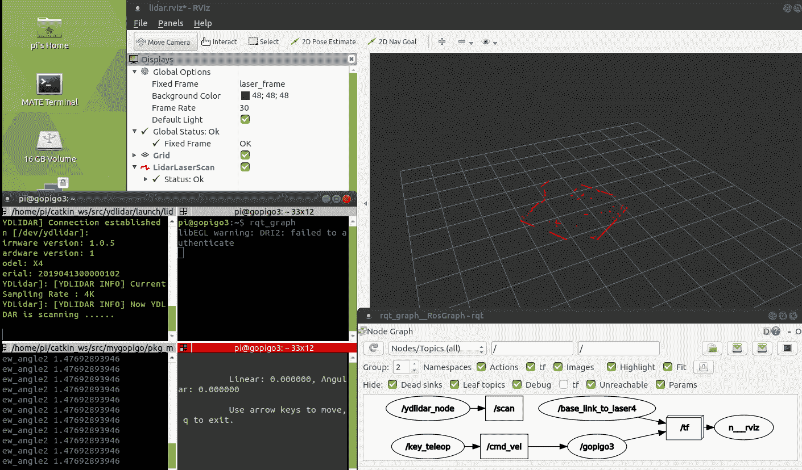

RViz 中的激光扫描视图（前一个截图中的右上角窗口）由`lidar_view.launch`提供。ROS 图（右下角窗口）显示`key_teleop`节点允许您通过在`/cmd_vel`主题中发布消息使用箭头键远程操作机器人：

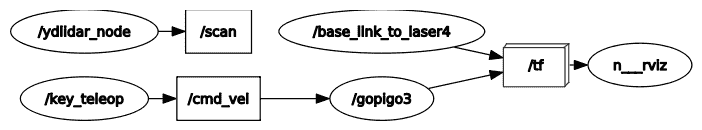

让我们看看 RViz 窗口显示的内容：

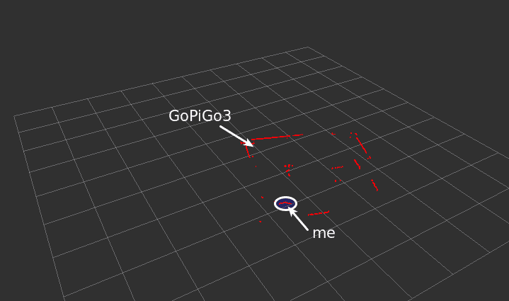

标记为**GoPiGo3**的箭头显示了机器人在房间角落的位置。外部直线红色线条代表墙壁，而指向**我**的箭头显示了我通过入口门离开房间时的轮廓（我前面的空白空间 - 没有红色点）。

# 组合启动文件

为了提高效率，我们应该将 Raspberry Pi 从可视化任务中卸载，并将它们移动到远程笔记本电脑。为了做到这一点，我们需要重新工作启动文件，以便 GoPiGo3 严格运行机器人工作所需的代码，即我们在第六章，“在 ROS 中编程 - 命令和工具”中描述的`mygopipo`包中的`gopigo3_driver.py`部分，以及`ydlidar`包中的`lidar.launch`部分。这两个组件可以使用以下命令启动：

```py
r1 $ roslaunch mygopigo gopigo3.launch
r2 $ roslaunch ydlidar ydlidar.launch
```

`r1`和`r2`中的启动文件可以合并为一个，如下所示。我们将把这个脚本命名为`gopigo3_ydlidar.launch`：

```py
<launch>
  <include file="$(find mygopigo)/launch/gopigo3.launch" />
  <node name="ydlidar_node" pkg="ydlidar" type="ydlidar_node" output="screen" respawn="false" >
     <param name="port" type="string" value="/dev/ydlidar"/>
     <param name="baudrate" type="int" value="115200"/>
     <param name="frame_id" type="string" value="laser_frame"/>
      ...
     <param name="angle_min" type="double" value="-180" />
     <param name="angle_max" type="double" value="180" />
     <param name="range_min" type="double" value="0.1" />
     <param name="range_max" type="double" value="16.0" />
  </node>
  <node pkg="tf" type="static_transform_publisher" name="base_link_to_laser4"
   args="0.2245 0.0 0.2 0.0 0.0 0.0 /base_footprint /laser_frame 40" />
</launch>

```

多亏了这种分组，GoPiGo3 的所有代码都可以使用以下命令运行：

```py
r1 $ roslaunch ydlidar gopigo3_ydlidar.launch
```

这启动了`ydlidar`和`gopigo3`节点，它们提供了一个软件接口，使我们能够与机器人传感器和执行器通信。这也创建了一个如下的 ROS 图：


接下来，为了监听扫描数据，您需要在机器人上执行 YDLIDAR 客户端：

```py
r2 $ rosrun ydlidar ydlidar_client
```

这将产生以下输出：

```py
[YDLIDAR INFO]: I heard a laser scan laser_frame[720]:
[YDLIDAR INFO]: angle_range : [-180.000005, 180.000005]
[YDLIDAR INFO]: angle-distance : [-4.500002, 0.000000, 351]
[YDLIDAR INFO]: angle-distance : [-4.000005, 0.750000, 352]
[YDLIDAR INFO]: angle-distance : [-3.500007, 0.765000, 353]
[YDLIDAR INFO]: angle-distance : [-3.000010, 0.782000, 354]
[YDLIDAR INFO]: angle-distance : [-2.500013, 0.000000, 355]
[YDLIDAR INFO]: angle-distance : [-2.000002, 0.799000, 356]
[YDLIDAR INFO]: angle-distance : [-1.500005, 0.816000, 357]
[YDLIDAR INFO]: angle-distance : [-1.000008, 0.834000, 358]
[YDLIDAR INFO]: angle-distance : [-0.500011, 0.000000, 359]
[YDLIDAR INFO]: angle-distance : [0.000000, 0.853000, 360]
```

ROS 图看起来像这样：

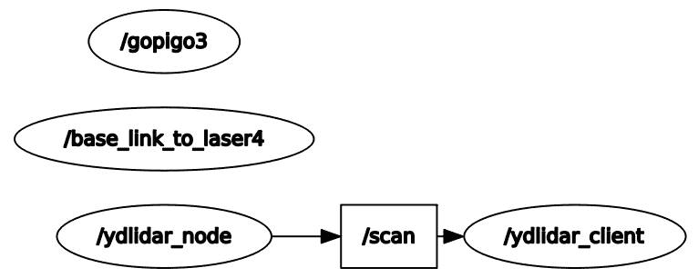

扔出前面图表的 `rqt_graph` 命令可以从 Raspberry Pi 或远程笔记本电脑执行。由于我们的目标是卸载 Raspberry Pi，你应该在笔记本电脑上运行它。在这种情况下，你将不再需要 Raspberry Pi 的桌面界面。

前面的图表显示，`ydlidar_node` 在 `/scan` 主题中发布激光扫描数据，这些数据被 `ydlidar_client` 节点读取，并在启动该节点的终端（即 `r2`）中打印出来。

# 在远程笔记本电脑上可视化扫描数据

最后一步是从笔记本电脑的桌面上获取 RViz 激光扫描数据。这是我们将在本节中完成的内容。

在以下段落中，代码片段中的字母 `r` 代表机器人的终端，而 `T` 代表笔记本电脑的终端。

按照以下步骤构建 ROS 环境：

1.  首先，使用我们在上一节中构建的统一启动文件在机器人上启动进程：

```py
r1 $ roslaunch ydlidar gopigo3_ydlidar.launch
```

1.  从笔记本电脑中找到在 `/scan` 主题中发布的最后一条消息的内容：

```py
T1 $ rostopic echo /scan -n1
 header: 
 seq: 2118
 stamp: 
 secs: 1570384635
 nsecs: 691668000
 frame_id: "laser_frame"
 angle_min: -3.14159274101
 angle_max: 3.14159274101
 angle_increment: 0.00872664619237
 time_increment: 154166.671875
 scan_time: 111000000.0
 range_min: 0.10000000149
 range_max: 16.0
 ranges: [array of 720 items]
 intensities: [array of 720 items]
```

1.  范围在 `ranges` 数组字段中提供，对应于 720 个方向，对应于 360° 覆盖范围的 0.5° 角分辨率。然后，找到它是哪种消息类型：

```py
 $ rostopic info scan
 Type: sensor_msgs/LaserScan
```

1.  最后，检查消息结构：

```py
T1 $ rosmsg info sensor_msgs/LaserScan
 std_msgs/Header header
 uint32 seq
 time stamp
 string frame_id
 float32 angle_min
 float32 angle_max
 float32 angle_increment
 float32 time_increment
 float32 scan_time
 float32 range_min
 float32 range_max
 float32[] ranges
 float32[] intensities
```

1.  接下来，在笔记本电脑上运行 ROS 可视化节点：

```py
T1 $ roslaunch ydlidar display.launch
T2 $ rosrun key_teleop key_teleop.py /key_vel:=/cmd_vel

```

`T1` 终端将启动 RViz 中的可视化，而 `T2` 将允许你通过修改激光扫描的范围来远程操作机器人，以检查其感知环境如何随着运动而改变。`display.launch` 提供的可视化添加了 YDLIDAR 的 URDF 模型到 RViz。以下图表中的黑色圆圈代表传感器：

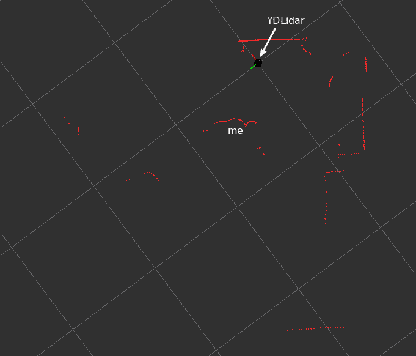

注意，由于 URDF 模型仅包括传感器，它不会像物理 GoPiGo3 机器人那样移动。扫描数据——即红色点——将根据机器人的运动而改变，但虚拟传感器将保持在初始位置，这不再是其实际位置（除非你停止 `T1` 并重新启动它）。因此，在这种情况下，使用 `display_scan.launch`（不包含 URDF 模型，仅包含扫描数据）比使用 `display.launch` 更为合理。在 *使用 GoPiGo3 练习导航* 部分中，你将链接 GoPiGo3 和 LDS 传感器的 URDF 模型，以便 RViz 显示机器人的运动。

在 *运行 YDLIDAR ROS 软件包* 部分中，你将运行一个分布式系统，其中 Raspberry Pi 收集传感器数据，远程笔记本电脑提供其可视化。

# 从远程笔记本电脑处理 YDLIDAR 数据

现在，是时候解释扫描数据了。这可以通过一个简单的名为 `scan.py` 的代码片段来完成，该代码片段包含在 ROS 软件包中：

```py
#! /usr/bin/env python
import rospy
from sensor_msgs.msg import LaserScan

def callback(msg):
 print "\nNumber of points =", len(msg.ranges)
 print "------------------"
 print "Range (m) at 0 deg = ", round(msg.ranges[360] , 1)
 print "Range (m) at 90 deg = ", round(msg.ranges[540] , 1)
 print "Range (m) at 180 deg = ", round(msg.ranges[719] , 1)
 print "Range (m) at -90 deg = ", round(msg.ranges[180] , 1), " or 270 deg"

rospy.init_node('scan_values')
sub = rospy.Subscriber('/scan', LaserScan, callback)
rospy.spin()
```

在笔记本电脑的终端中输入以下命令以查看其运行效果：

```py
T3 $ rosrun ydlidar scan.py
```

上一段代码列出了屏幕上沿主要轴（*X*和*Y*）检测到的范围。请记住有关传感器参考框架的以下照片，该框架是从 X4 文档中提取的。角度是按顺时针方向测量的，以*X*轴为起点。在以下照片中，你可以看到安装在 GoPiGo3 上的 LDS 以及*X*和*Y*轴的方向绘制在上面：

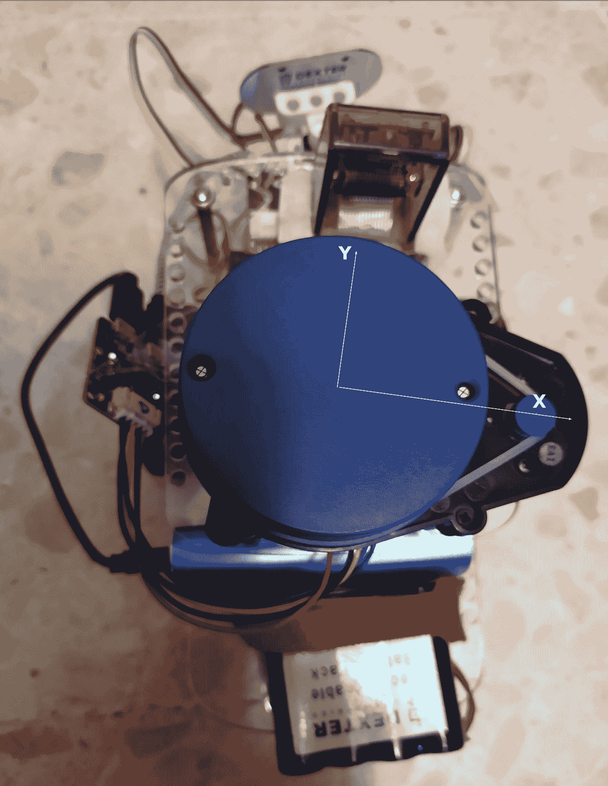

回到“可视化远程笔记本电脑数据”部分的截图，你可以猜测机器人在房间中的朝向。请注意，绿色轴对应于*X*轴，而红色线条对应于*Y*轴：


回调函数沿着主要轴（*+X（0°）*，*+Y（-90°）*，*-X（180°）*，*-Y（90°）*），在这些轴上可以检测到右侧（*+X*），前方（*+Y*），左侧（*-X*）或后方（*-Y*）的障碍物。

# 在 ROS 中创建导航应用程序

一个提供机器人导航能力的应用程序必须考虑以下要点：

+   **感知**：这为我们提供了获取运动数据的能力，以便机器人能够实时估计其位置。这类信息被称为**机器人****里程计**。传感器数据的主要来源有两个：编码器，它让我们知道机器人轮子的旋转，以及 IMU 传感器，它提供有关机器人整体加速度和旋转的信息。一般来说，编码器数据使用得最多，尽管它可能结合 IMU 数据以提高姿态估计的准确性。这是一个称为**融合传感器**的高级主题，它超出了本书的范围。

+   **定位/姿态估计**：由于里程计和当前的环境地图，**AMCL（自适应蒙特卡洛定位）**算法允许我们在实时中更新机器人的姿态估计，正如我们在上一章中介绍的那样。

+   **路径规划**：给定一个目标姿态，此类规划包括创建整个地图的全局最优路径和覆盖机器人周围小区域的局部路径，以便机器人能够跟随精确路径并避开障碍物。局部路径规划是动态的；也就是说，随着机器人的移动，机器人周围的区域会相应地改变。

+   **移动/避障**：正如我们之前所做的那样，有一个全局最优路径与局部路径相结合，并且这发生在机器人移动到目标位置时的每个位置。这就像在周围环境中创建一个缩放窗口。因此，局部路径是通过考虑全局路径和附近的障碍物（例如，有人从机器人前方穿过）来计算的。局部路径规划能够避开此类障碍物而不会丢失全局路径。这个局部缩放窗口是通过使用 LDS 提供的实时信息构建的。

由于上述几点，以下数据必须提供给 ROS，以便进行导航：

+   **里程计**: 由`gopigo3`节点在`/odom`主题中发布。

+   **坐标变换**: 传感器在机器人坐标系中的位置发布在`/tf`主题中。

+   **扫描数据**: 从 LDS 获取到机器人周围障碍物的距离，并在`/scan`主题中提供。

+   **地图**: 执行 SLAM 时构建的占用栅格地图保存到`map.pgm`文件中，配置在`map.yml`文件中。

+   **目标姿态**: 一旦启动 ROS 导航的设置，用户将在 RViz 窗口中指定。

+   **速度命令**: 这是算法的最终输出。命令发布在`/cmd_vel`主题中，该主题由`gopigo3`节点订阅。然后，机器人相应地移动以遵循计划路径。

根据前面讨论的主题和概念，创建 ROS 导航应用程序的步骤如下：

1.  构建环境地图。通过从 LDS 获取数据，机器人将根据来自传感器的数据范围创建环境地图。它将使用我们在前一章中讨论的 SLAM 技术来完成此操作。构建地图的过程遵循以下实用序列：

    +   在物理机器人上启动 ROS，这意味着必要的节点将公开发布传感器数据的主题，以及接收运动命令的主题。发布运动命令的规则作为获取的传感器数据的函数，符合我们所说的**机器人应用程序逻辑**。

    +   从远程 PC 建立连接。如果配置正确，当在笔记本电脑上启动 ROS 时应该是自动的。这个主题在本章开头的技术要求部分已经介绍过。

    +   从笔记本电脑启动 SLAM 过程。这将允许 ROS 从 LDS 获取实时范围数据，以便开始构建环境地图。

    +   通过 RViz 可视化检查已映射区域和待扫描区域，远程操作机器人。在这种情况下，名为第一个项目符号的机器人应用程序逻辑由你作为人类驱动，你决定 GoPiGo3 在每一个实例中必须执行什么动作。你也可以通过让机器人随机漫游来自动化远程操作（记住前一章中提到的*模拟 LDS*部分，在那里你让 GoPiGo3 在应用一系列规则的同时自主探索环境，以避开可能遇到的障碍）。在这种情况下，机器人应用程序逻辑由 Python 脚本实现，没有人为干预。

1.  一旦环境被完全探索，你必须保存地图，以便在下一步中进行自主导航。

1.  通过告诉机器人你希望它移动到的目标位置来启动导航任务。这个自主导航的过程遵循以下顺序：

    +   在物理机器人上启动 ROS。在这种情况下，机器人应用程序逻辑是导航任务的一部分，旨在由 GoPiGo3 自主执行，无需任何人为干预。

    +   加载导航应用程序第一部分创建的环境地图。

    +   向机器人指示一个目标姿态，你可以在 RViz 的可视化中直接执行，该可视化显示了环境的地图。

    +   让机器人自行导航到目标位置，检查它是否能够规划出避开可能遇到的障碍物的最佳路径。

我们将在下一节中用一个现实世界的例子来说明这个过程。

# 使用 GoPiGo3 练习导航

在本节中，我们将介绍在上一章的“*使用 GoPiGo3 练习 SLAM 和导航*”部分所遵循的步骤，通过用实际的 GoPiGo3 和物理环境分别替换虚拟机器人和 Gazebo 模拟器。

# 构建环境地图

首先，让我们考虑一个足够简单，适合我们学习目的的物理环境。这可以在以下照片中看到：

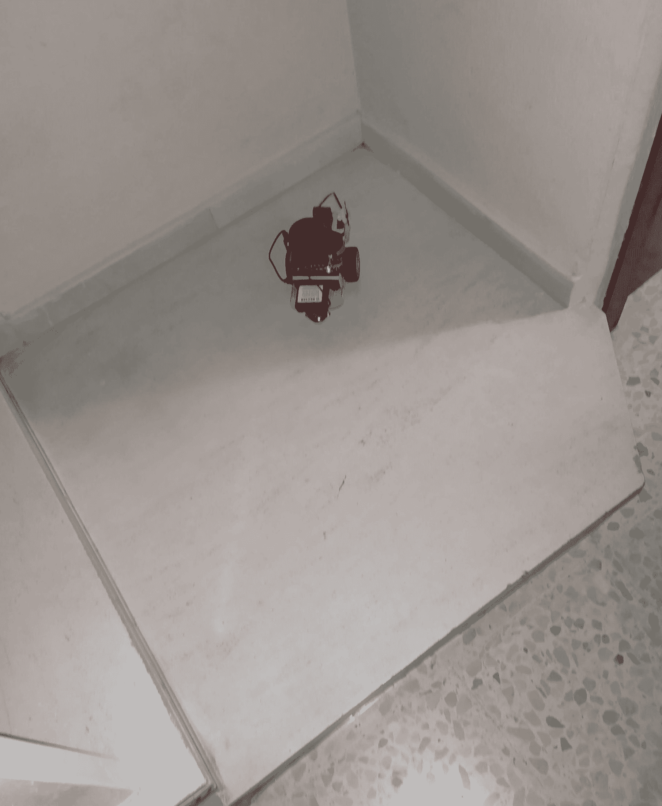

注意，这个几乎正方形的区域有三个限制边和一个激光传感器无法检测到的步骤，因为它位于机器人的地板水平以下。

在 ROS 中，第一步是绘制环境地图，以便机器人能够定位其周围环境并绕其导航。按照以下步骤操作：

1.  启动机器人上的所有 ROS 节点。从连接到树莓派的远程终端，这意味着运行控制驱动和 LDS 的 ROS 启动文件：

```py
r1 $ roslaunch ydlidar gopigo3_ydlidar.launch
```

回想一下“*与树莓派集成*”部分：分组启动文件是我们构建一个独特的启动文件来一次性运行机器人配置的方法。这确保了 GoPiGo3 准备好在笔记本电脑上与 ROS 交互，在那里将完成与环境地图和导航命令相关的所有处理。

1.  启动 SLAM 映射 ROS 包，其启动文件包括一个 RViz 可视化，该可视化将机器人的虚拟模型与实际扫描数据叠加：

```py
T1 $ roslaunch gopigo3_navigation gopigo3_slam.launch
```

1.  通过远程操作机器人，使其覆盖尽可能多的虚拟环境表面。我们可以这样做：

```py
T3 $ rosrun key_teleop key_teleop.py /key_vel:=/cmd_vel
```

当你探索机器人的周围环境时，你应在 RViz 窗口中看到以下类似内容：

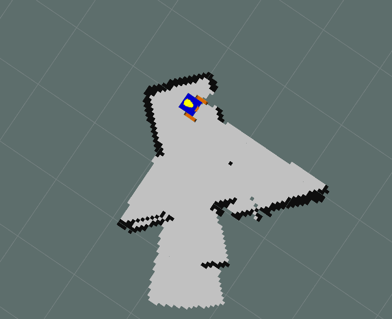

在这里，你可以看到正方形空间的三个限制墙。地图的其余部分显示了激光在剩余方向上找到的第一个障碍物。记住，第四边的步骤无法检测到，因为它位于机器人的地板水平以下。

1.  一旦你完成探索，将我们生成的地图保存到之前指定的两个文件中，即`.pgm`和`.yaml`：

```py
T4 $ rosrun map_server map_saver -f ~/catkin_ws/test_map
```

再次，你将在工作区的根目录中找到地图文件，即`test_map.pgm`和`test_map.yaml`。现在，我们准备让 GoPiGo3 在物理环境中导航。

# 在现实世界中导航 GoPiGo3

这第二部分要求你在笔记本电脑上停止所有 ROS 进程，但不必在 GoPiGo3 上停止。记住，在机器人上，你有最小的 ROS 配置，这样机器人就能够感知环境（LDS X4 传感器）并移动（驱动）。所有剩余的导航逻辑将在笔记本电脑上运行。因此，关闭 PC 上任何打开的终端，并按照以下步骤开始新阶段：

1.  如果之前停止了终端，请在机器人上启动 ROS 节点：

```py
r1 $ roslaunch ydlidar gopigo3_ydlidar.launch
```

1.  通过提供机器人之前构建的成本图来启动 AMCL 导航。为此，你必须参考之前创建的`.yaml`地图文件。确保相应的`.pgm`文件具有相同的名称，并且放置在同一位置：

```py
T1 $ roslaunch gopigo3_navigation amcl.launch map_file:=/home/ubuntu/catkin_ws/test_map.yaml
```

此启动文件包括一个 RViz 可视化，它将允许我们与地图交互，以便我们可以设置目标位置，如下面的截图所示：

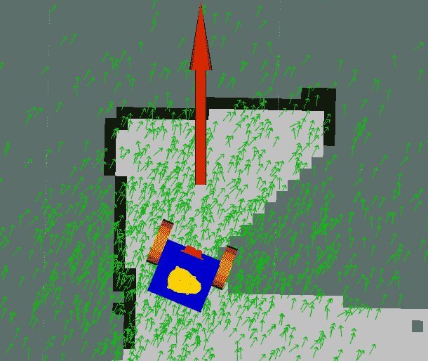

与 Gazebo 模拟的情况一样，通过按下 RViz 窗口右上角的**2D Nav Goal**按钮并选择目标姿态来设置目标位置，该姿态由位置和方向组成（RViz 中的绿色箭头允许你图形化定义它）。一旦选择这样的位置，AMCL 算法就开始路径规划并通过`/cmd_vel`主题发送运动命令。因此，当命令序列执行时，机器人将移动到指定的位置。

# 摘要

在本章中，你最终完成了使用 GoPiGo3 的自主任务。这仅仅是进入机器人领域应用人工智能这一迷人领域的起点。在机器人导航之上最明显的功能是自动驾驶，这是许多汽车制造商目前正在实施的功能，以制造更安全、更舒适的车辆供最终用户使用。

在本书的第四和最后一部分，你将了解机器学习技术是如何应用于当今构建更智能的机器人的。

# 问题

1.  哪个传感器是 LDS 类型的？

A) 激光雷达

B) 超声波距离传感器

C) 电容式传感器

1.  ROS 主节点必须位于何处才能执行导航？

A) 在机器人上

B) 在机器人和笔记本电脑上

C) 在机器人或笔记本电脑上

1.  如果在地图构建之后在环境中放置障碍物，会发生什么？

A) 机器人将无法检测到它，如果它与预定路径发生冲突，可能会与之相撞。

B) 考虑到局部路径规划，将提供一个避开障碍物的修改路径。

C) 在进行导航任务之前，你应该在新条件下重新构建地图。

1.  你能否在之前没有用机器人运行 SLAM 的情况下进行导航？

A) 不可以，因为你必须使用你将用于导航的同一台机器人来构建地图。

B) 是的，唯一条件是你提供一个预先制作的环境地图。

C) 不可以，SLAM 和导航是同一枚硬币的两面。

1.  机器人的里程计是什么？

A) 自从 ROS 应用启动以来，它所覆盖的总距离。

B) 使用运动传感器的数据来估计机器人随时间变化的姿态。

C) 使用运动传感器的数据来估计当前机器人的姿态。

# 进一步阅读

你可以阅读的主要资源是 ROS 导航堆栈的官方文档，它位于[`wiki.ros.org/navigation`](http://wiki.ros.org/navigation)。对于那些感兴趣的人，这里有一些额外的参考文献：

+   *ROS 导航：概念与教程*，联邦技术大学，Longhi R.，Schneider A.，Fabro J.，Becker T.，和 Amilgar V. (2018)，巴拉那，库里蒂巴，巴西。

+   *用于正确环境检测的激光雷达设计、使用和校准概念*，在 IEEE 机器人与自动化杂志，M. D. Adams (2000) 第 16 卷，第 6 期，第 753-761 页，2000 年 12 月，doi: 10.1109/70.897786。URL: [`ieeexplore.ieee.org/stamp/stamp.jsp?tp=&arnumber=897786&isnumber=19436`](http://ieeexplore.ieee.org/stamp/stamp.jsp?tp=&arnumber=897786&isnumber=19436)。

+   *SLAM 中的激光雷达里程计*，V. Kirnos, V. Antipov, A. Priorov, 和 V. Kokovkina，第 23 届开放创新协会（FRUCT）会议，博洛尼亚，2018 年，第 180-185 页。doi: 10.23919/FRUCT.2018.8588026，URL: [`ieeexplore.ieee.org/stamp/stamp.jsp?tp=&arnumber=8588026&isnumber=8587913`](http://ieeexplore.ieee.org/stamp/stamp.jsp?tp=&arnumber=8588026&isnumber=8587913)。
