# 第十二章：通过强化学习实现目标

在上一章提供的强化学习背景之后，我们将进一步使用 GoPiGo3，使其不仅执行感知任务，还能按顺序触发连锁动作以实现预定义的目标。也就是说，它将不得不在模拟的每一步决定执行什么动作以实现目标。在执行每个动作的末尾，它将获得一个奖励，这个奖励将通过给予的奖励量来显示决策有多好。经过一些训练，这种强化将自然会引导其后续决策，从而提高任务的表现。

例如，假设我们设定了一个目标位置，并指示机器人必须携带一个物体到那里。GoPiGo3 将被告知表现良好的方式是通过给予它奖励。这种方式提供反馈鼓励它追求目标。具体来说，机器人必须从一组可能的行为（向前移动、向后移动、向左或向右移动）中选择，并在每一步选择最有效的行为，因为最佳行为将取决于机器人在环境中的物理位置。

处理这类问题的机器学习领域被称为**强化学习**，这是一个非常活跃的研究课题。在某些场景中，它已经超越了人类的表现，例如最近的**Alpha Go**案例，[`deepmind.com/blog/article/alphago-zero-starting-scratch`](https://deepmind.com/blog/article/alphago-zero-starting-scratch)。

本章将涵盖以下主题：

+   使用 TensorFlow、Keras 和 Anaconda 准备环境

+   安装 ROS 机器学习包

+   设置训练任务参数

+   训练 GoPiGo3 到达目标位置同时避开障碍物

在实践案例中，您将看到 GoPiGo3 如何通过尝试不同的动作来学习，被鼓励为每个位置选择最有效的动作。您可能已经猜到，这是一个非常昂贵的计算任务，您将了解机器人工程师目前面临的挑战，即如何使机器人变得更聪明。

# 技术要求

在本章中，我们将使用位于`Chapter12_Reinforcement_Learning`文件夹中的代码：[`github.com/PacktPublishing/Hands-On-ROS-for-Robotics-Programming/tree/master/Chapter12_Reinforcement_Learning`](https://github.com/PacktPublishing/Hands-On-ROS-for-Robotics-Programming/tree/master/Chapter12_Reinforcement_Learning)。

将本章的文件复制到 ROS 工作空间中，将它们放在`src`文件夹内：

```py
$ cp -R ~/Hands-On-ROS-for-Robotics-Programming/Chapter12_Reinforcement_Learning  ~/catkin_ws/src/
```

如往常一样，您需要在笔记本电脑上重新构建工作空间：

```py
$ cd ~/catkin_ws
$ catkin_make
```

一旦您有了本章的代码，我们将下一节专门用于描述和安装我们将要开发的实际项目的软件栈。

# 使用 TensorFlow、Keras 和 Anaconda 准备环境

与你在上一章中被指导安装的**Anaconda**一起，你现在将安装机器学习工具**TensorFlow**和**Keras**。你需要它们来构建解决强化学习任务所需的神经网络：

+   **TensorFlow**是机器学习环境中的低级层。它处理神经网络创建中涉及的数学运算。由于它们在数学上被解析为矩阵运算，你需要一个有效的框架来解决这个代数问题，而 TensorFlow 是解决这个问题的最有效框架之一。这个库的名字来源于数学概念**张量**，它可以被理解为具有超过两个维度的矩阵。

+   **Keras**是机器学习环境的高级层。这个库让你能够以声明性方式轻松定义神经网络的架构：你只需定义节点和边的结构，TensorFlow（低级层）将负责所有数学运算以创建网络。

在这里，我们将利用 Anaconda 提供的隔离功能。记住，在上一章中，你创建了一个名为**gym**的**Conda**环境，在其中你安装了**OpenAI Gym**、TensorFlow 和 Keras。现在，你将被指导在一个不同的 Conda 环境中工作，在这个环境中，你将只安装本章所需的模块。这样，你可以将每个章节的代码隔离，因为它们适用于不同的项目。实际上，你将安装 TensorFlow 和 Keras 的特定版本，这些版本可能与上一章中使用的最新版本不同。这是 Python 项目中常见的一种做法。

一旦我们明确了每个组件提供的内容，让我们安装每个组件。

# TensorFlow 后端

首先，创建一个名为`tensorflow`的专用`conda`环境。它由一个虚拟空间组成，允许用户隔离用于特定项目的 Python 包集合。这有一个优点，就是可以轻松地将环境复制到另一台机器上，几乎不需要任何努力：

1.  让我们运行以下命令：

```py
$ conda create -n tensorflow pip python=2.7
$ conda activate tensorflow
```

第二行产生激活并绑定后续安装到这个`tensorflow`环境。

Conda 环境是包含特定**项目**所需的 Python 模块的隔离桶。例如，对于**tensorflow**环境，你使用`conda install`或`pip install`安装的每个 Python 模块都将放置在`~/anaconda2/envs/tensorflow/bin`。**激活**意味着每当 Python 脚本需要导入某个模块时，它将在这个**项目**路径中查找它。

1.  现在你可以继续安装 TensorFlow：

```py
(tensorflow) $ pip install --ignore-installed --upgrade https://storage.googleapis.com/tensorflow/linux/cpu/tensorflow-1.8.0-cp27-none-linux_x86_64.whl

```

1.  此外，你还应该安装`matplotlib`和`pyqtgraph`，以便绘制结果的图表：

```py
(tensorflow) $ conda install matplotlib pyqtgraph

```

1.  然后检查版本：

```py
(tensorflow) $ conda list | grep matplotlib
(tensorflow) $ conda list | grep pyqtgraph
```

这最后两个命令已被添加，为您提供常见的`conda`命令的实际示例。

# 使用 Keras 进行深度学习

Keras 是一个高级神经网络 API，用 Python 编写，能够在 TensorFlow 之上运行。您可以使用以下命令轻松安装特定版本：

```py
(tensorflow) $ pip install keras==2.1.5
```

我们指定了版本 2.1.5，以确保您在与我们测试代码相同的精确环境中运行代码。写作时的最新版本是 2.3.1。

# ROS 依赖包

要一起使用**ROS**和**Anaconda**，您还必须安装 ROS 依赖包：

```py
(tensorflow) $ pip install -U rosinstall msgpack empy defusedxml netifaces
```

您可以使用`pip show`命令检查它们的任何版本：

```py
(tensorflow) $ pip show rosinstall
```

在下一节中，我们将描述本章代码的机器学习包，您应该已经按照*技术要求*部分将其克隆到您的 ROS 工作空间中。

# 理解 ROS 机器学习包

本章的代码实现了经典的强化学习方法，即训练一个神经网络。这个神经网络在数学上与我们第十章中介绍的类似，即*在机器人中应用机器学习*，通过堆叠(隐藏)节点层来建立状态（输入层）和动作（输出层）之间的关系。

我们将用于强化学习的算法称为**深度 Q 网络**（**DQN**），在第十一章*使用 OpenAI Gym 进行机器学习*的*运行环境*部分中介绍。在下一节*设置训练任务参数*中，您将获得描述状态、动作和奖励的操作描述，这些是我们在 ROS 中将要解决的强化学习问题的特征。

接下来，我们将介绍训练场景，然后我们将解释如何将 ROS 包内部的文件链接起来以启动一个训练任务。

# 训练场景

本节致力于解释强化学习包——书中代码示例库中的内容——是如何组织的。

首先，让我们考虑我们将训练机器人为两种场景：

+   场景 1：**到达目标位置**。这个场景在以下图片中显示，由四个墙壁限定的正方形组成。环境中没有障碍物。目标位置可以是墙壁限制内的任何点：

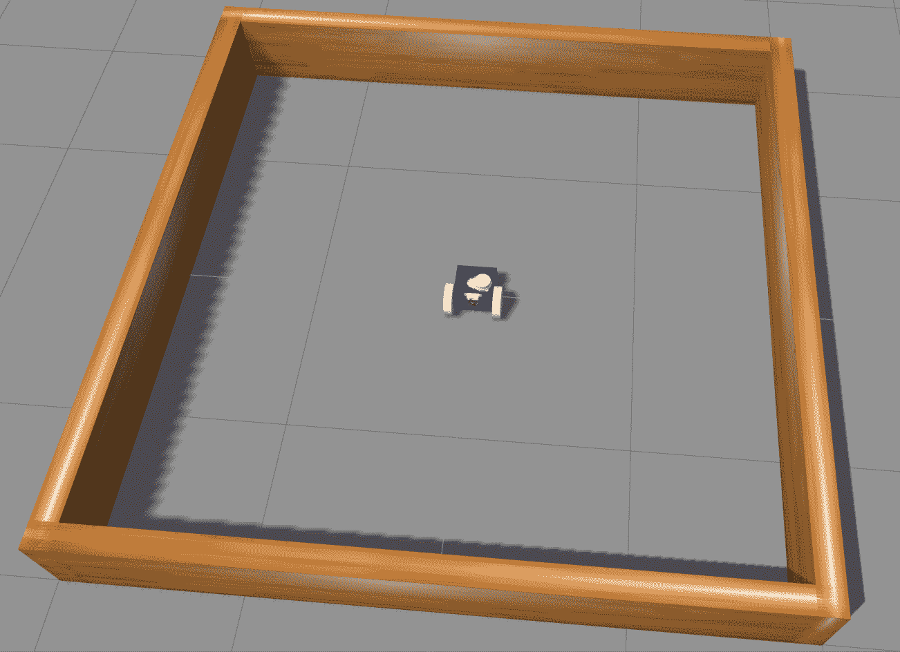

+   场景 2：**避开障碍物到达目标位置**。这个场景由相同的正方形加上四个静态圆柱形障碍物组成。目标位置可以是墙壁限制内的任何点，除了障碍物的位置：

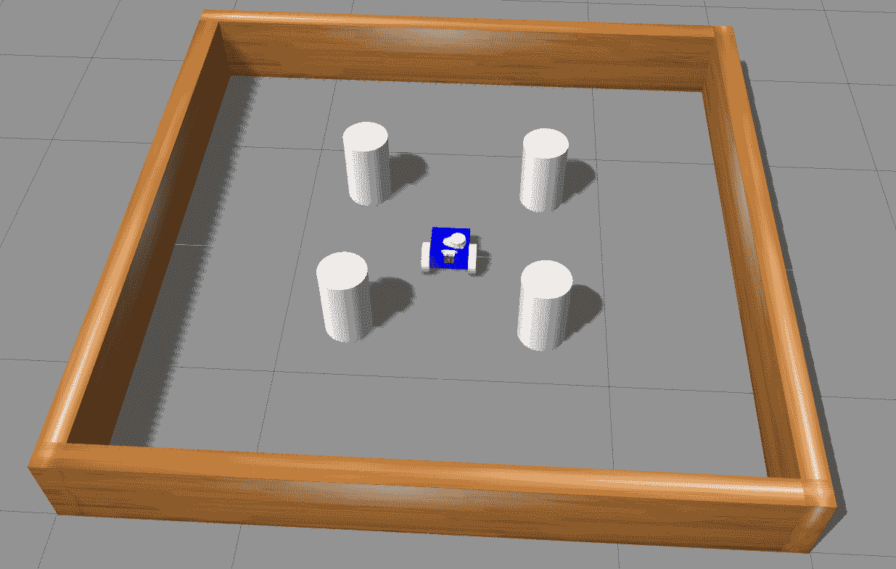

现在我们已经介绍了训练场景，接下来让我们描述我们将用于 GoPiGo3 强化学习的 ROS 包。

# 运行强化学习任务的 ROS 包结构

本章的代码堆栈由以下包组成：

+   **`gopigo3_model`**是允许我们使用`gopigo3_rviz.launch`启动文件在 RViz 中可视化 GoPiGo3 的 ROS 编译。机器人配置是我们熟悉的 3D 实体模型，我们在前面的章节中使用过。更确切地说，它对应于 GoPiGo3 完整版本，包括距离传感器、Pi 相机和激光距离传感器，即第八章中构建的模型，*使用 Gazebo 进行虚拟 SLAM 和导航*。

+   **`gopigo3_gazebo`**建立在之前的包之上，使我们能够使用`gopigo3_world.launch`文件在 Gazebo 中模拟 GoPiGo3。该文件加载的 URDF 模型与`gopigo3_model`包中的可视化相同。

+   **`gopigo3_dqn`**是执行 GoPiGo3 强化学习任务的具体包。由于它是 ROS，它是模块化的，我们通过分离模型、模拟和强化学习来提供的解耦使得使用这个相同的包来训练其他机器人变得简单。

在这个 ROS 包中，我们使用**DQN**算法来训练机器人。记住，DQN 是在上一章的*运行环境*部分介绍的。简而言之，DQN 将使用神经网络建立*机器人状态*和*执行动作*之间的关系，其中*状态*是**输入层**，而*动作*是**输出层**。

强化学习理论背后的数学很复杂，对于训练简单的 GoPiGo3 机器人来说，学习如何使用这项技术并不是绝对必要的。所以，让我们专注于训练任务的配置，抽象出本章实践元素所支持的示例的具体 Python 实现。

# 设置训练任务参数

在这一点上，我们将简要介绍强化学习中的三个基本概念：**状态**、**动作**和**奖励**。在本节中，我们将提供最少的信息，以便你能够理解本章中的实际练习。在这种情况下，我们正在应用*注重实践以真正理解理论*的策略。

这种*注重实践以真正理解理论*的方法对于复杂主题尤为重要，如果你遵循一个带有易于运行的示例的经验方法，这些主题将更容易理解。这种初步的*实践成功*应该为你提供足够的动力深入研究这个主题，无论如何，这个任务在算法及其背后的数学上都会很困难。

因此，让我们继续定义机器人学习任务中涉及的核心概念：

+   **状态**是环境的**观察**。得益于来自 LDS 的数据流，状态由到达目标位置的范围和角度来表征。例如，如果你使用一度的分辨率获取 LDS 测量值，每个状态将是一组 360 个点，每个值对应于 360 度全圆周上的每个角度。随着机器人的移动，状态会发生变化，这在新提供的 360 个范围值集中得到了反映。记住，每个范围值对应于该特定方向最近障碍物的距离。

+   **动作**是机器人可以通过其电机在环境中执行的操作，即平移和/或旋转以接近目标。通过执行动作，机器人移动并改变其**状态**——由来自 LDS 的新范围值集定义。

+   **奖励**是你每次机器人执行动作时给予它的**奖品**。你为每个可能状态中的每个动作提供的奖品称为**奖励策略**，它是强化学习任务成功的关键部分。因此，它必须由用户（即**训练师**）定义。简单来说，你会给机器人执行的动作赋予更大的奖励，这些动作更有助于实现目标。

对于实际案例，我们将按照以下方式运行奖励策略：

+   如果障碍物位于机器人前半空间（覆盖前进运动方向的左到右的 180°角度），它将获得一个从 0 到 5 的基于角度的正奖励。最大值（5）对应于机器人面向目标方向的情况。我们通过相对角度在-90°到+90°之间（在这个角度中，奖励是最小的，即 0）来指定这个半空间。参考方向是穿过目标位置和机器人的直线。

+   如果它位于机器人的后半空间（与前进半空间相反的左到右的 180°角度），获得的奖励是**负的**，范围从 0 到-5（与角度的线性相关：90°和-90°时为 0，-180°时为-5）。

+   如果当前距离目标超过预设的阈值，代理将获得一个基于距离的奖励>2。如果它低于这个阈值，奖励将低于 2，随着机器人靠近目标，奖励接近最小值 1。然后，**接近奖励**是角度和基于距离的奖励的点积*=* **[a]** *** **[b]**。

+   如果机器人达到目标，将获得 200 的**成功奖励**。

+   如果机器人撞到障碍物，将给予 150 的**惩罚**，即-150 的负奖励。

奖励是累积的，我们可以在模拟的每一步添加这些术语中的任何一个：

+   接近奖励

+   成功奖励

+   障碍物惩罚

模拟中的**步骤**是“在两个连续状态之间机器人发生了什么”。发生的事情是，机器人执行一个动作，然后——作为结果——它移动，改变其状态，并基于本节中定义的策略获得奖励。

在理解了此任务配置之后，你就可以运行在已定义的两个场景中 GoPiGo3 的训练了。

# 训练 GoPiGo3 在避开障碍物的同时到达目标位置

在场景中运行训练之前，我们应该注意调整一个参数，这个参数会显著影响计算成本。这是 LDS 的水平采样，因为机器人的**状态**由模拟给定步骤中的范围值集合来表征。在之前的章节中，当我们使用 Gazebo 进行导航时，我们使用了 LDS 的采样率为 720。这意味着我们有 1° 分辨率的周向范围测量。

对于这个强化学习的例子，我们将采样减少到 24，这意味着范围分辨率为 15°。这个决定的积极方面是，你将 **状态** 向量从 360 项减少到 24，这是一个 15 倍的因子。你可能已经猜到了，这将使模拟更加计算高效。相反，你会发现缺点是 GoPiGo3 失去了它的感知能力，因为它只能检测到与机器人视角的角度覆盖大于 15° 的物体。在 1 米的距离上，这相当于最小障碍物宽度为 27 厘米。

说到积极的一面，随着机器人接近障碍物，其辨别能力提高。例如，在 10 厘米的距离上，15 度的弧线意味着它可以检测到最小宽度为 5.4 厘米的障碍物。

水平采样设置在 URDF 模型中，在描述 LDS 的文件部分，位于 `./gopigo3_model/urdf/gopigo3.gazebo`。为了获得 15° 间隔的光线，需要指定的数字如下：

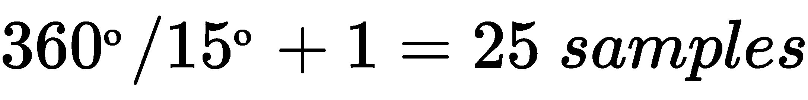

由于 LDS 覆盖从 0° 到 360°，为了得到 24 个等间隔的光线，你需要添加一个额外的样本，使其变为 25，因为 0° 和 360° 实际上是同一个角度。

然后，必须按照以下方式修改 URDF 文件的 LDS 部分：

```py
<gazebo reference="base_scan">
    <material>Gazebo/FlatBlack</material>
    <sensor type="ray" name="lds_lfcd_sensor">
    <pose>0 0 0 0 0 0</pose>
    <visualize>true</visualize>
    <update_rate>5</update_rate>
    <ray>
    <scan>
         <horizontal>
             <samples>25</samples>
            <resolution>1</resolution>
            <min_angle>0</min_angle>
            <max_angle>6.28319</max_angle>
...
```

通过将 `<visualize>` 标签设置为 `true`，在 Gazebo 中显示光线追踪。

这样的采样是否足够确保机器人能够得到有效的训练？让我们通过比较每种情况下的光线数量来回答这个问题。这张第一张图显示了物理 LDS 的 0.5° 实际分辨率。光线非常接近，几乎看不到分辨率。它提供了对环境的非常忠实的感觉：

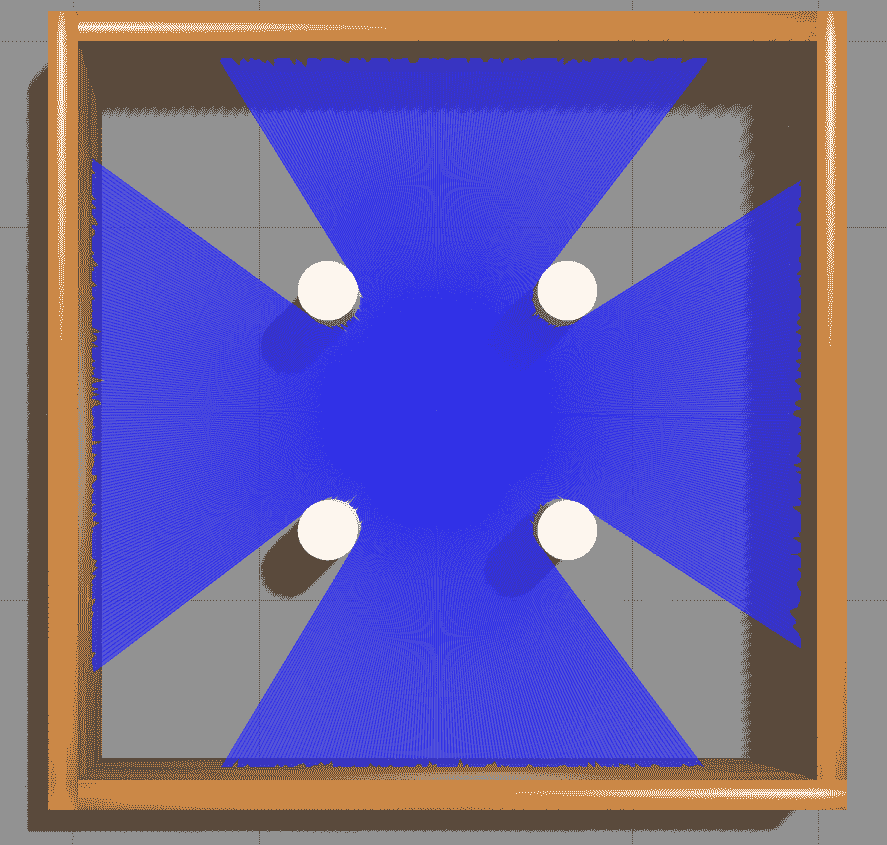

这第二张图显示了 24 个样本和 15° 分辨率的案例：

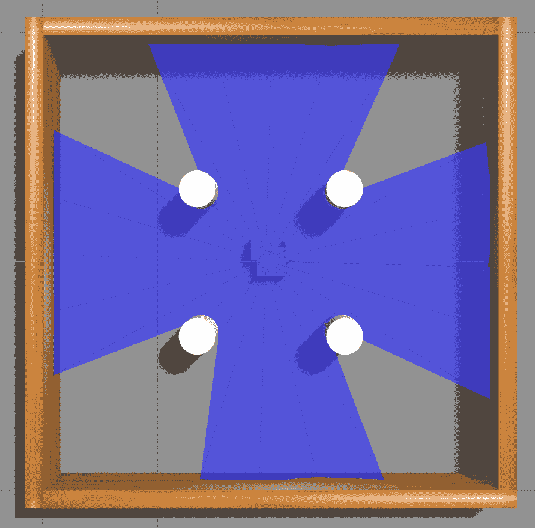

在这张图片中，光线追踪显示，即使只有这么少的射线，也能检测到障碍物，因为只需要一束射线就能识别障碍物。这一事实有助于减轻感知分辨率的损失。然而，请注意，机器人将无法知道障碍物的宽度，只知道它将小于 30º。为什么？因为需要三束射线来检测有限宽度的障碍物，中心射线检测它，而两端的射线不会干扰它。因此，障碍物宽度的上限等于相邻射线之间的角距离的两倍，即 *2 x 15º = 30º*。在某些情况下，这可能会不够精确，但，对于我们在本例中使用的简单场景，应该足够精确。

# 如何运行模拟

在开始每个场景的训练过程之前，让我们回顾一下在前一章中学到的关于可视化（RViz）和模拟（Gazebo）的知识，以便与学习过程建立联系，我们将使用这些工具和相关脚本：

1.  要在 RViz 中启动可视化，你只需简单地执行以下命令：

```py
T1 $ roslaunch gopigo3_model gopigo3_rviz.launch
```

1.  在 Gazebo 中启动模拟，你可以使用以下单个命令以类似的方式继续操作：

```py
T1 $ roslaunch gopigo3_gazebo gopigo3_world.launch
```

1.  最后，要运行强化学习任务，你首先必须启动 Gazebo – 如步骤 2 中解释的那样 – 但使用选定的训练环境，而不是通用的 `gopigo3_world.launch`：

```py
T1 $ roslaunch gopigo3_gazebo gopigo3_stage_1.launch
T2 $ roslaunch gopigo3_dqn gopigo3_dqn_stage_1.launch
```

这两个命令运行了之前描述的 **场景 1** 中的任务。要为 **场景 2** 进行训练，你只需要执行相应的启动文件：

```py
T1 $ roslaunch gopigo3_gazebo gopigo3_stage_2.launch
T2 $ roslaunch gopigo3_dqn gopigo3_dqn_stage_2.launch
```

第一行加载了场景 2 环境，第二行启动了针对该环境的训练任务。

以下两个子部分通过执行步骤 3 中的命令展示了 ROS 的实际应用。

# 场景 1 – 前往目标位置

按照以下步骤进行，以确保训练过程按预期进行：

1.  首先，在 Gazebo 中启动虚拟机器人模型：

```py
T1 $ roslaunch gopigo3_gazebo gopigo3_stage_1.launch

```

1.  然后，你可以开始训练过程。但首先，你必须处于 `tensorflow` 虚拟环境中：

```py
T2 $ conda activate tensorflow
```

1.  现在，开始训练：

```py
T2 (tensorflow) $ roslaunch gopigo3_dqn gopigo3_dqn_stage_1.launch
```

你可能会收到如下错误：

```py
inotify_add_watch("/home/user/.config/ibus/bus/59ba2b2ca56a4b45be932f4cbc9c914d-unix-0") failed: "No space left on device"
```

不要担心，你可以通过执行以下命令来解决它：

```py
T2 $ echo fs.inotify.max_user_watches=65536 | sudo tee -a /etc/sysctl.conf && sudo sysctl -p
```

因此，如果你收到上述错误，按照建议解决它，然后再次启动训练脚本。然后订阅相关主题：

```py
T3 $ rostopic echo *get_action*
T4 $ rostopic echo *result*
```

`get_action` 是一个 `Float32MultiArray` 消息类型，其数据定义如下：

```py
get_action.data = [action, score, reward]
pub_get_action.publish(get_action)
```

让我们看看每个组件：

+   GoPiGo3 总是保持 0.15 m/s 的线性速度。`动作` 项以 0.75 为步长将角速度从 -1.5 到 1.5 rad/s 进行调整，以覆盖从 0 到 4 的整数范围。

+   每一步获得的 `奖励` 如在 *设置训练任务参数* 部分所述。

+   `得分` 是机器人在每个回合中获得的累积奖励。

相应的 ROS 图可以在以下图中看到：

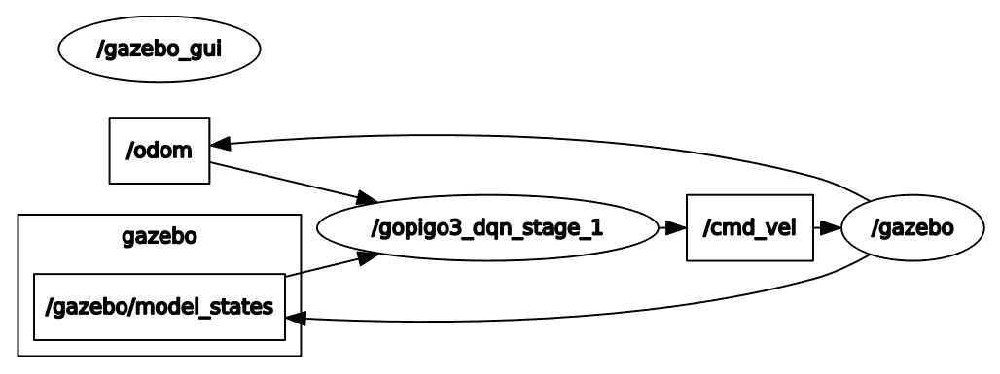

这个图中的关键节点是 `gopigo3_dqn_stage_1`，它从 Gazebo 模拟中获取机器人状态，并通过发布 `cmd_vel` 消息（记住，驱动机器人的速度命令是在这个主题中发布的）执行训练任务，并为 GoPiGo3 每达到的新状态获取奖励（记住，在训练过程中，机器人在该状态下收到的奖励与每个新状态相关联）。

可以在终端 **T2** 的控制台日志中跟踪事件记录：

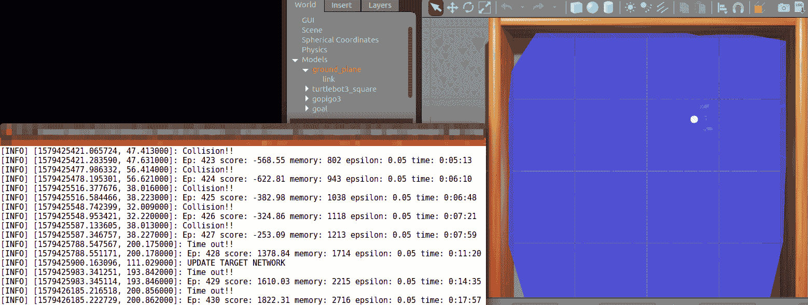

红色方块是目标位置，蓝色线条是如本节开头所述的 LDS 射线。

第一个场景的目的是让您熟悉 ROS 中的训练过程。让我们继续到场景 2，我们将给出关于训练过程如何通过事件进行改进的定量信息。

# 场景 2 – 避开障碍物到达目标位置

开始训练的程序与场景 1 类似：

1.  我们只需要更改文件名并使用相关的文件：

```py
T1 $ roslaunch gopigo3_gazebo gopigo3_stage_2.launch
T2 $ conda activate tensorflow
T2 (tensorflow) $ roslaunch gopigo3_dqn gopigo3_dqn_stage_2.launch
```

1.  如果您想图形化地查看 GoPiGo3 的学习过程，请执行 `result_graph.launch` 文件：

```py
T3 $ roslaunch gopigo3_dqn result_graph.launch
```

以下截图显示了您应该在笔记本电脑屏幕上看到的所有内容：

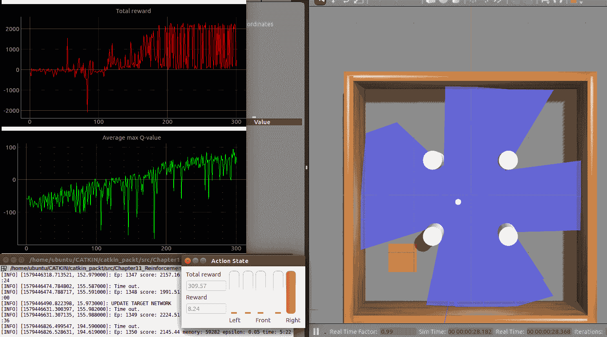

红色图显示了每个事件中获得的**总奖励**。请记住，一个事件定义为当满足某个标准时结束的步骤序列。在这个问题中，如果达到目标（红色方块）或与障碍物发生碰撞，则事件结束。这些图显示了前 300 个事件中的演变。

绿色图表示训练模型的平均 Q 值。请记住，这是动作值函数 *Q(s,a)*，它告诉您在给定状态 *s* 下执行动作 *a* 是多么好。这个概念在上一章的“Q-learning 解释”部分的基本自动驾驶出租车示例中已经解释过了。

您可以看到，随着经验的积累，GoPiGo3 的平均表现如何变得更好。但是它是如何操作性地使用这些经验的呢？答案来自于已经应用的强化学习算法，即通过将有效的动作与训练过程中机器人在该状态下收到的奖励相关联。

最后，我们应该注意，在这种执行环境中，ROS 图在两种状态之间交替。一种是当机器人通过发布 `cmd_vel` 消息执行动作时：

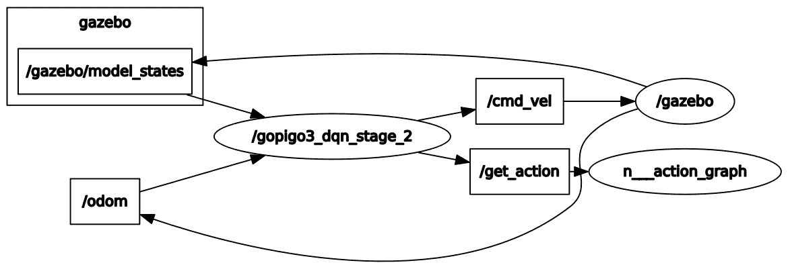

为了清晰起见，在这个图中，我们排除了在终端 `T3` 生成的启动文件中的节点**。**

另一个 ROS 图表示的是代理使用来自 `/scan` 主题的 LDS 的 24 个值计算下一个状态的瞬间：

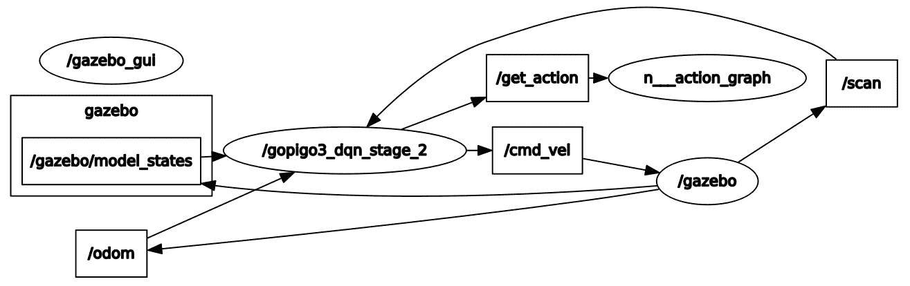

到目前为止，您已经完成了 GoPiGo3 的端到端训练过程。下一个挑战是测试训练好的模型。

# 测试训练好的模型

考虑到我们正在使用**深度 Q 网络**（**DQN**）算法，我们必须从训练过程中保存的是神经网络的架构和边的权重。这正是`gopigo3_dqn_stage_2`节点每 10 个回合执行的操作。因此，你可以在`./gopigo3_dqn/save_model`文件夹中找到保存的模型，网络的权重存储在`h5`文件类型中。每个文件的名字中都包含场景（`stage_1`或`stage_2`）和回合编号。按照以下步骤评估训练好的模型：

1.  选择具有最高回合编号的文件，即`stage_2_1020.h5`。

每个`h5`文件都包含 DQN 网络在所提及的回合结束时出现的权重。例如，`stage_2_1020.h5`指的是在第 1020 回合结束时场景 2 的网络。

为了使用这些权重，你基本上必须使用与训练模型相同的 Python 脚本（`./nodes/gopigo3_dqn_stage_2`），但初始化以下代码片段中用粗体字母标记的参数为不同的值，该代码片段重现了`class ReinforceAgent()`定义的前几行：

```py
class ReinforceAgent():
    def __init__(self, state_size, action_size):
        self.pub_result = rospy.Publisher('result', Float32MultiArray, queue_size=5)
        self.dirPath = os.path.dirname(os.path.realpath(__file__))
        self.dirPath = self.dirPath.replace('gopigo3_dqn/nodes', 'gopigo3_dqn/save_model/stage_2_')
        self.result = Float32MultiArray()

        # Load model from last EPISODE
        self.load_model = True
        self.load_episode = 1020
...
```

然后，每个参数提供的内容如下：

+   +   `self.load_model = True`告诉脚本加载预训练模型的权重。

    +   `self.load_episode = 1020`设置你想要加载 DQN 网络权重的回合编号，对应的文件是`stage_2_1020.h5`。

1.  然后将 Python 脚本重命名为`gopigo3_dqn_stage_2-test`，并生成新的启动文件`gopigo3_dqn_stage_2-test.launch`，它将调用创建的测试脚本：

```py
<launch>
    <node pkg="gopigo3_dqn" type="gopigo3_dqn_stage_2-test" name="gopigo3_dqn_stage_2-test" output="screen" />
</launch>
```

1.  要启动测试过程，遵循与运行训练场景相同的步骤，但使用测试版本的启动文件：

```py
T1 $ roslaunch gopigo3_gazebo gopigo3_stage_2.launch
T2 (tensorflow) $ roslaunch gopigo3_dqn gopigo3_dqn_stage_2-test.launch
T3 $ roslaunch gopigo3_dqn result_graph.launch
```

1.  记住，对于`T2`，你必须使用`$ conda activate tensorflow`命令激活 TensorFlow 环境。当它启动时，你将在`T2`中看到一个消息，告诉你将使用第 1380 集的模型：

```py
[INFO] [1579452338.257175, 196.685000]: +++++++++++++++++++++++++++++++++++++++++++++++++++++
[INFO] [1579452338.258111, 196.686000]: STARTING TRAINING MODEL FROM self.load_episode = 1380
[INFO] [1579452338.258537, 196.686000]: =====================================================
[INFO] [1579452339.585559, 1.276000]: Goal position : 0.6, 0.0
```

1.  如果你绘制了前几个回合的图表（如终端`T3`中的命令所示），你可以确认值相当不错，即*总奖励*超过 2,000，*平均最大 Q 值*超过 100：

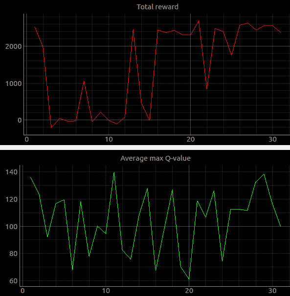

虽然你正在测试模型，但每十个回合，网络的权重都会保存到一个以当前回合编号命名的`h5`文件中。

# 摘要

本章简要而实用地介绍了如何应用强化学习，以便机器人能够执行有用的任务，如将材料运输到目标位置。你应该意识到，这种机器学习技术还处于其成熟度的初期，目前在实际世界中还没有多少可行的解决方案。原因是训练过程在时间和成本上都非常昂贵，因为你必须执行数千个场景才能得到一个训练良好的模型，然后使用物理机器人重新播放该过程以解决现实世界与模拟环境之间的行为差异。

请注意，Gazebo 中的训练过程不能替代现实世界的训练：模拟必然意味着对现实的简化，并且训练环境（Gazebo）与物理世界之间的每一个差异都会引入训练集中可能缺失的新状态，因此训练好的神经网络在那种情况下将无法表现良好。解决方案？更多的训练来覆盖更多状态，这也意味着更高的成本。

在本章的最后部分，我们同样介绍了使用与机器人训练相同场景来测试模型的方法。更正式的测试方法要求你检查训练好的模型在场景中不同条件下（例如，有更多障碍物或移动它们的位置）的泛化能力。这是一个复杂的话题，因为当前的强化学习算法在实现泛化方面仍然存在困难。为什么？因为，当你改变场景时，你会在模型中生成新的状态。由于这些状态对机器人来说是新的，它将不知道执行最有效动作的方法。因此，需要新的训练来探索这些新状态。

强化学习目前是一个非常活跃的研究领域，我们应该期待在未来的几年里取得重大进展。我们应该看到的是，强化学习以合理的成本（即以不需要数千个场景的节奏训练机器人）应用于实际机器人，并提供将模型泛化到训练场景之外的环境的技术。

本章介绍了机器学习在机器人应用中的入门。在这本书中，我们只是触及了其潜力的表面，如果你已经跟随了这些解释，你应该自己检查过，这是一个复杂的领域，在某个时刻你将不得不掌握统计学、数据分析以及神经网络。

同时，这也是一个以实验为重点的领域。与其试图用分析公式或计算机辅助模拟来模拟现实，不如观察现实世界，从传感器获取数据，并尝试从中推断行为模式。因此，成功将机器学习应用于机器人的能力取决于能够连续流式传输数据，以便机器人在实时中做出明智的决策。第一步是产生经过良好训练的模型。因此，机器人能够在中长期能够发展智能行为，因为它积累了可以在结构化训练模型中利用的经验。

这是一个具有挑战性的目标，对于数据科学家和软件工程师来说都是如此。他们应该共同努力，创建成熟的机器人框架，使其从机器学习中获得的好处与今天常见的网络应用和数字业务一样多。

最后，非常感谢阅读这本书。在这个时候，你被挑战去探索高级 ROS 主题，我们希望你也可以成为 ROS 开源社区的积极贡献者。

# 问题

1.  强化学习的核心概念是什么？

A) 机器人动作和惩罚

B) 神经网络和深度学习

C) 状态、动作和奖励

1.  为什么在强化学习中需要使用神经网络？

A) 因为机器人需要使用深度学习来识别物体和障碍物。

B) 因为机器人必须学会将状态与最有效的动作相关联。

C) 在强化学习中，我们不需要神经网络；我们应用不同的算法。

1.  你如何鼓励机器人实现任务的既定目标？

A) 通过在它执行**良好**行为时给予奖励。

B) 通过在它执行**不良**行为时给予惩罚。

C) 通过在它执行**良好**行为时给予奖励，在执行**不良**行为时给予惩罚。

1.  你可以将本章中提到的强化学习 ROS 包应用于其他机器人吗？

A) 是的，因为我们已经将机器人模型、场景和训练算法分成了不同的包。

B) 不，因为对于每个场景，你必须重写 ROS 包。

C) 不，它是特定于 GoPiGo3 训练的。

1.  你是否需要使用来自真实 LDS 的完整数据流来训练机器人？

A) 是的：如果你想获得准确的结果；你必须使用所有数据。

B) 不，你必须将光线追踪密度作为场景中障碍物典型大小的函数来决定。

C) 不一定：这取决于你需要的精度有多少。

# 进一步阅读

要深入了解本章中解释的概念，你可以参考以下参考资料：

+   **Coursera 上的《实用强化学习》**：[`www.coursera.org/learn/practical-rl`](https://www.coursera.org/learn/practical-rl)

+   欢迎来到深度强化学习第一部分：DQN [`towardsdatascience.com/welcome-to-deep-reinforcement-learning-part-1-dqn-c3cab4d41b6b`](https://towardsdatascience.com/welcome-to-deep-reinforcement-learning-part-1-dqn-c3cab4d41b6b)

+   使用 Tensorflow 的简单强化学习第零部分：使用表格和神经网络的 Q 学习 [`medium.com/emergent-future/simple-reinforcement-learning-with-tensorflow-part-0-q-learning-with-tables-and-neural-networks-d195264329d0`](https://medium.com/emergent-future/simple-reinforcement-learning-with-tensorflow-part-0-q-learning-with-tables-and-neural-networks-d195264329d0)

+   使用 Tensorflow 的简单强化学习第四部分：深度 Q 网络及其之后 [`medium.com/@awjuliani/simple-reinforcement-learning-with-tensorflow-part-4-deep-q-networks-and-beyond-8438a3e2b8df`](https://medium.com/@awjuliani/simple-reinforcement-learning-with-tensorflow-part-4-deep-q-networks-and-beyond-8438a3e2b8df)
