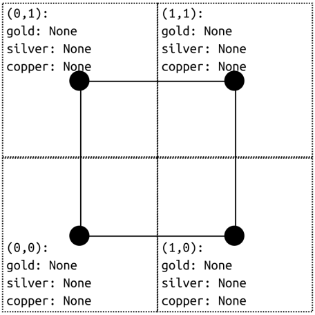
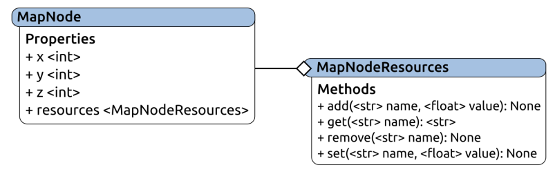
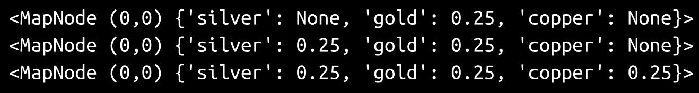
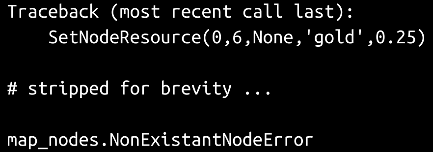
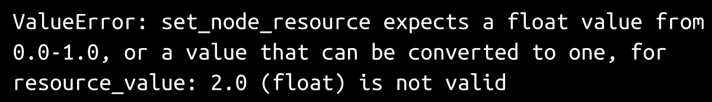

# 第一章：编程与软件工程

开发商通常有特定的级别、等级或职级，表示每个级别员工所期望的经验、专业知识和行业智慧水平。这些可能会因地点而异（也许相差很大），但典型的结构看起来像以下内容：

+   初级开发人员：初级开发人员通常是指没有太多编程经验的人。他们可能知道编写代码的基础知识，但不会超出这个范围。

+   开发人员：中级开发人员（根据可能适用的任何正式头衔）通常具有足够的经验，可以依靠他们编写相当可靠的代码，几乎不需要监督。他们可能有足够的经验来确定实施细节和策略，并且他们通常会对不同代码块如何（以及会）相互作用以及什么方法将最小化这些交互中的困难有一定的了解。

+   高级开发人员：高级开发人员具有足够的经验 - 即使专注于一组特定的产品/项目 - 以牢固掌握典型开发工作中涉及的所有技术技能。在他们的职业生涯中，他们几乎总是能够牢牢掌握许多涉及的非技术（或半技术）技能，尤其是政策和程序，以及鼓励或强制执行业务价值的策略和战术，如稳定性和开发工作的可预测性。他们可能不是这些领域的专家，但他们会知道何时提出风险，并且通常会建议几种减轻这些风险的选择。

在高级开发人员的水平之上，术语和定义通常变化更大，技能集通常开始更多地关注业务相关的能力和责任（范围和影响），而不是技术能力或专业知识。

编程和软件工程之间的分界线在于开发人员和高级开发人员之间的差异，就技术能力和专业知识而言。在初级水平上，有时甚至在开发人员水平上，努力往往只集中在编写代码以满足任何适用的要求，并遵守正在进行的任何标准。在高级开发人员水平上，软件工程具有对相同最终结果的宏观视图。更大的画面涉及对以下事项的意识和关注：

+   标准，包括技术/开发和其他方面的最佳实践

+   编写代码以实现的目标，包括与之相关的业务价值

+   代码所属的整个系统的形状和范围

# 更大的画面

那么，这个更大的画面是什么样的？有三个易于识别的关注领域，还有一个（称之为用户交互）要么贯穿其中，要么被分解成自己的组。

软件工程必须注意标准，特别是非技术（业务）标准，以及最佳实践。这些可能会或可能不会被遵循，但由于它们是标准或最佳实践，不遵循它们应该始终是一个有意识的（并且可辩护的）决定。业务流程标准和实践通常会跨越多个软件组件，如果在开发过程中没有考虑到一定程度的纪律和规划，使它们更加可见，那么它们可能会难以跟踪。在纯粹与开发相关的一面，标准和最佳实践可以极大地影响代码的创建和维护，以及其持续的有用性，甚至只是在必要时找到给定代码块的能力。

编写代码的目的很少只是为了编写代码。通常情况下，它几乎总是与其他价值相关联，特别是如果与产品相关联的业务价值或实际收入。在这些情况下，可以理解的是，支付开发工作的人会非常感兴趣，以确保一切都按预期工作（代码质量），并且可以在预期时间部署（过程可预测性）。

代码质量问题将在几章后的`hms_sys`项目开发中得到解决，而过程可预测性主要受到[第五章](https://cdp.packtpub.com/hands_on_software_engineering_with_python/wp-admin/post.php?post=29&action=edit)中讨论的开发方法论的影响，*hms_sys 系统项目*。

剩下的政策和程序相关的问题通常通过建立和遵循各种标准、流程和最佳实践来管理，在项目（或者开发团队）启动期间将对这些项目进行详细检查——例如，设置源代码控制、制定标准的编码约定，并计划可重复、自动化的测试。理想情况下，一旦这些开发过程得以建立，保持其运行和可靠性的持续活动将成为习惯，成为日常工作的一部分，几乎淡出了背景。

最后，更多地关注代码方面，软件工程必须必要地关注整个系统，牢记系统的普遍视角。软件由许多元素组成，这些元素可能被分类为**原子**；它们在正常情况下是不可分割的单位。就像它们的现实世界的对应物一样，当它们开始互动时，事情变得有趣，希望也是有用的。不幸的是，这也是意外（甚至危险）行为——bug——通常开始出现的时候。

这种意识可能是更难培养的。它依赖于可能不明显、未记录或不容易获得的知识。在大型或复杂的系统中，甚至可能不明显从何处开始查找，或者要问什么样的问题来尝试找到获取这些知识所需的信息。

# 提出问题

对于任何给定的代码块，可以提出与代码块一样多的不同问题，即使是非常简单的代码，在复杂的系统中，也会因问题而引发更多问题。

如果没有明显的起点，从以下非常基本的问题开始是一个很好的第一步：

+   谁将使用这个功能？

+   他们将用它做什么？

+   何时，何地他们将能够访问它？

+   它试图解决什么问题？例如，他们为什么需要它？

+   它必须如何工作？如果细节不足，将其分解为两个单独的问题是有用的：

+   如果执行成功会发生什么？

+   如果执行失败会发生什么？

挖掘整个系统的更多信息通常从以下基本问题开始：

+   这段代码与系统的哪些其他部分有交互？

+   它如何与他们互动？

在确定了所有的活动部分后，思考“如果发生了什么…”的情景是识别潜在的故障点、风险和危险交互的好方法。您可以提出以下问题：

+   如果这个期望一个数字的参数被传入一个字符串会发生什么？

+   如果该属性不是预期的对象会发生什么？

+   如果其他对象尝试在它已经被更改时改变这个对象会发生什么？

每当一个问题得到答案时，只需问，还有什么？这有助于验证当前答案是否相当完整。

让我们看看这个过程是如何进行的。为了提供一些背景，正在为一个系统编写一个新的函数，该系统用于跟踪地图网格上的矿产资源，包括金、银和铜三种资源。网格位置是从一个公共原点以米为单位测量的，每个网格位置都记录了一个浮点数，范围从 0.0 到 1.0，表示在网格方块中发现资源的可能性有多大。开发数据集已经包括了四个默认节点 - 在（**0**，**0**）、（**0**，**1**）、（**1**，**0**）和（**1**，**1**）处 - 没有值，如下所示：



系统已经定义了一些类来表示单个地图节点，并提供了一些函数来从它们所在的中央数据存储中提供对这些节点及其属性的基本访问：



常量、异常和各种目的的函数已经存在，如下：

+   **`node_resource_names`**：这包含了系统关注的所有资源名称，并且可以被视为和处理为字符串列表：`['gold'，'silver'，'copper']`

+   **`NodeAlreadyExistsError`**：如果尝试创建一个已经存在的`MapNode`，将会引发异常

+   **`NonexistentNodeError`**：如果请求一个不存在的`MapNode`，将会引发异常

+   **`OutOfMapBoundsError`**：如果请求一个不允许存在于地图区域的`MapNode`，将会引发异常

+   **`create_node(x,y)`**：创建并返回一个新的默认`MapNode`，在此过程中将其注册到全局节点数据集中

+   **`get_node(x,y)`**：在全局可用节点数据集中找到并返回指定（*x*，*y*）坐标位置的`MapNode`

开发者首次尝试编写代码来为给定节点设置单个资源的值，作为项目的一部分。生成的代码如下（假设所有必要的导入已经存在）：

```py
def SetNodeResource(x, y, z, r, v):
    n = get_node(x,y)
    n.z = z
    n.resources.add(r, v)
```

从功能上讲，这段代码可以正常运行，它将按照开发者的预期进行一系列简单的测试；例如，执行以下操作：

```py
SetNodeResource(0,0,None,'gold',0.25) print(get_node(0,0)) SetNodeResource(0,0,None,'silver',0.25) print(get_node(0,0)) SetNodeResource(0,0,None,'copper',0.25) print(get_node(0,0))
```

结果如下输出：



按照这个标准，代码和它的函数都没有问题。现在，让我们提出一些问题，如下：

+   谁将使用这个功能？：这个函数可能会被两个不同的应用程序前端中的任何一个调用，由现场测量员或测量后的评估员。测量员可能不经常使用它，但如果他们在调查中看到明显的矿床迹象，他们应该以 100%的确定性记录下来，表示在该网格位置发现资源的可能性；否则，他们将完全不改变资源评级。

+   他们将如何使用它？：在基本要求（为给定节点设置单个资源的值）和前面的答案之间，这个问题似乎已经得到了回答。

+   何时、何地可以访问它？：通过被测量员和评估员应用程序使用的库。没有人会直接使用它，但它将被集成到这些应用程序中。

+   它应该如何工作？：这个问题已经得到了回答，但是引发了另一个问题：是否会有必要一次添加多个资源评级？如果有一个好的地方可以实现它，那可能值得注意。

+   这段代码与系统的其他部分有什么交互？：除了代码中明显的部分外，它还使用`MapNode`对象、这些对象的资源和`get_node`函数。

+   如果尝试更改现有的`MapNode`会发生什么？：根据最初编写的代码，这是预期的行为。这是代码编写来处理的正常路径，它有效。

+   **如果节点不存在会发生什么？**：定义了`NonexistentNodeError`这一事实是一个很好的线索，表明至少有一些地图操作需要节点在完成之前存在。通过调用现有函数对其进行快速测试，如下所示：

```py
SetNodeResource(0,6,None,'gold',0.25)
```

前面的命令导致以下结果：



这是因为开发数据在该位置尚未具有 MapNode。

+   **如果节点在给定位置无法存在会发生什么？**：同样，定义了`OutOfMapBoundsError`。由于开发数据中没有越界节点，并且代码目前无法通过越界节点不存在这一事实，因此无法很好地看到如果尝试这样做会发生什么。

+   **如果在此时不知道*z*值会发生什么？**：由于`create_node`函数甚至不期望*z*值，但 MapNode 实例具有一个，因此在现有节点上调用此函数可能会覆盖现有的 z-高度值，从长远来看，这可能是一个关键错误。

+   **这是否符合所有适用的各种开发标准？**：没有关于标准的任何细节，可以合理地假设定义的任何标准可能至少包括以下内容：

+   代码元素的命名约定，如函数名和参数；在与`get_node`相同逻辑级别的现有函数中，使用`SetNodeResources`作为新函数的名称，虽然在语法上完全合法，但可能违反了命名约定标准。

+   至少有一些关于文档的努力，但没有。

+   一些内联注释（也许），如果需要向未来的读者解释代码的某些部分——这也没有，尽管在这个版本中的代码量相当大，且采用了相对直接的方法，但是否有任何需要是值得讨论的。

+   **如果执行失败会发生什么？**：如果执行过程中出现问题，它应该抛出明确的错误，并提供合理详细的错误消息。

+   **如果为任何参数传递了无效值会发生什么？**：其中一些可以通过执行当前函数进行测试（如之前所做），同时提供无效参数——首先是超出范围的数字，然后是无效的资源名称。

考虑以下使用无效数字执行的代码：

```py
SetNodeResource(0,0,'gold',2)
```

前面的代码导致以下输出：



另外，考虑以下带有无效资源类型的代码：

```py
SetNodeResource(0,0,'tin',0.25)
```

前面的代码导致以下结果：


根据这些示例，函数本身可能在执行过程中成功或引发错误；因此，实际上只需要对这些潜在错误进行某种方式的处理。

可能会有其他问题，但前面的问题足以实施一些重大变化。在考虑了前面答案的影响并解决了这些答案暴露出的问题后，函数的最终版本如下：

```py
def set_node_resource(x, y, resource_name, 
    resource_value, z=None):
    """
Sets the value of a named resource for a specified 
node, creating that node in the process if it doesn't 
exist.

Returns the MapNode instance.

Arguments:
 - x ................ (int, required, non-negative) The
                      x-coordinate location of the node 
                      that the resource type and value is 
                      to be associated with.
 - y ................ (int, required, non-negative) The 
                      y-coordinate location of the node 
                      that the resource type and value is 
                      to be associated with.
 - z ................ (int, optional, defaults to None) 
                      The z-coordinate (altitude) of the 
                      node.
 - resource_name .... (str, required, member of 
                      node_resource_names) The name of the 
                      resource to associate with the node.
 - resource_value ... (float, required, between 0.0 and 1.0, 
                      inclusive) The presence of the 
                      resource at the node's location.

Raises
 - RuntimeError if any errors are detected.
"""
    # Get the node, if it exists
    try:
        node = get_node(x,y)
    except NonexistentNodeError:
        # The node doesn't exist, so create it and 
        # populate it as applicable
        node = create_node(x, y)
    # If z is specified, set it
    if z != None:
        node.z = z
# TODO: Determine if there are other exceptions that we can 
#       do anything about here, and if so, do something 
#       about them. For example:
#    except Exception as error:
#        # Handle this exception
    # FUTURE: If there's ever a need to add more than one 
    #    resource-value at a time, we could add **resources 
    #    to the signature, and call node.resources.add once 
    #    for each resource.
    # All our values are checked and validated by the add 
    # method, so set the node's resource-value
    try:
        node.resources.add(resource_name, resource_value)
        # Return the newly-modified/created node in case 
        # we need to keep working with it.
        return node
    except Exception as error:
        raise RuntimeError(
            'set_node_resource could not set %s to %0.3f '
            'on the node at (%d,%d).' 
            % (resource_name, resource_value, node.x, 
            node.y)
        )
```

暂时剥离注释和文档，这可能看起来与原始代码并无太大不同——只添加了九行代码，但差异很大，如下所示：

+   它不假设节点总是可用的。

+   如果请求的节点不存在，则创建一个新节点进行操作，使用为此目的定义的现有函数。

+   它不假设每次尝试添加新资源都会成功。

+   当这样的尝试失败时，它会引发一个显示发生了什么的错误。

所有这些额外的项目都是早些时候提出的问题的直接结果，以及对如何处理这些问题的答案做出的有意识的决定。这种最终结果是编程和软件工程思维方式之间的区别真正显现的地方。

# 总结

软件工程不仅仅是编写代码。经验；对细节的关注；以及对代码功能、与系统其他部分的交互等方面提出问题；都是从编程思维向软件工程思维转变的重要方面。获得经验所需的时间可以通过简单地提出正确的问题来缩短，也许可以显著地缩短。

除了创建和管理代码的领域之外，还有一些完全不同的因素需要进行审查和质疑。它们主要关注的是在开发工作周围的预开发规划中可以或应该期望什么，这始于对典型软件开发生命周期的理解。
