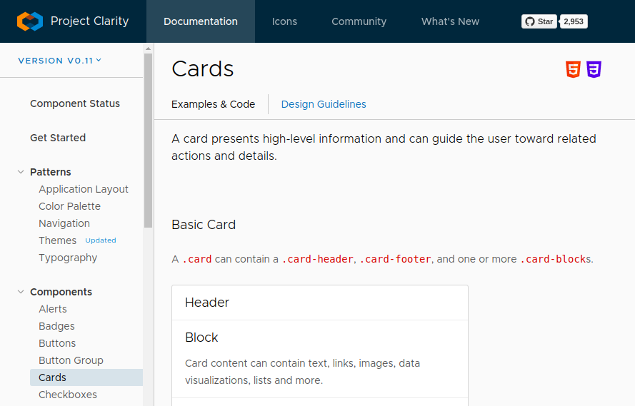

# 第二章：软件开发生命周期

所有软件开发，包括 Python 或其他语言，都遵循可重复的模式，或者有一个生命周期。软件（或系统）开发生命周期（SDLC）可以作为自己独特的开发方法论，提供适用于开发过程的一系列任务和活动。也就是说，即使没有正式的 SDLC 包裹着一个开发过程，任何或所有通过 SDLC 进行的活动仍然可能发生，并且其中产生的任何或所有工件可能在项目开发过程中可用。

从实际发展的角度来看，无论是正式的还是非正式的软件开发生命周期（SDLC）产生的所有工件，可能都不会特别有用，特别是那些在生命周期过程的最初几个阶段产生的工件。即便如此，在开发过程中获得的知识越多，开发工作就越不太可能朝着与系统长期意图相悖的方向发展。

为了充分探索 SDLC 可能提供的内容，我们将使用互联网上可以找到的更详细的 SDLC 之一。它将生命周期分解为十个阶段，按照以下顺序执行，除非开发方法论进行了流程调整：

+   初始概念/愿景

+   概念开发

+   项目管理规划

+   需求分析和定义

+   系统架构和设计

+   开发（编写代码）和质量保证

+   系统集成、测试和验收

+   实施/安装/分发

+   操作/使用和维护

+   退役

许多这些单独的阶段可以合并在一起，或者可以分解成更小的子阶段，但是这种分解——这十个阶段——是一组具有相似范围的相似活动的有用分组。

前三个阶段可能都发生在编写任何代码之前，定义高层概念和目标，并计划如何实现这些目标。最后三个通常发生在代码完成后，尽管随着新功能的想法或错误的出现，代码开发可能会重新启动以解决这些问题。平衡的 4 到 7 阶段，大致可分类为**开发过程**，尽管除了第 6 阶段的实际编写代码之外，这种分类可能取决于正在进行的开发过程或方法论，这可能在第 3 阶段决定，如果没有由外部政策或力量决定的话。

不同的软件开发方法论（特别是敏捷方法）可能更多地以按需方式处理这些问题，通过迭代或故事的方式分组阶段活动，或者按照这里列出的顺序进行。这些变化的更深入探讨可以在[第四章](https://cdp.packtpub.com/hands_on_software_engineering_with_python/wp-admin/post.php?post=28&action=edit)中找到，*方法论、范式和实践*。

# SDLC 的预开发阶段

在编写第一行代码之前，项目可能需要进行大量的思考和工作。在开发开始时，不是所有的工作都会被看到，而且实际上，在许多情况下，可能不会产生所有可能的预开发工作。即使创建了这些工件，它们可能没有任何正式的结构或文档，或者可能不像所期望的那样完整或详细。尽管如此，了解在开发过程中可能可用的有用或有趣的内容，至少可以帮助回答在实际编写代码部分出现的问题。

# 初始概念/愿景

项目或系统生命周期中的第一件事通常是其构想。在幕后，这通常涉及对某种未满足的需求的认识，或者某些东西不按预期运行，尽管也可能出现其他变化。作为这种认识的一部分，通常会有一系列构想系统将提供的功能、好处或功能，这将推动系统的开发，并确定开发何时完成。在这个最初的、非常高层次的概述中，可能没有太多细节——我们需要更好的库存管理方式，也许是整个愿景，例如——但也可能会出现更多细节。

概念和好处可能来自于系统利益相关者：寻求更好工作方式的业务人员，也许意识到现有系统并不如预期那样有效的开发人员，或者难以维护。系统管理员可能担心现有系统的管理难度，并希望采取一种更新、更好的方法，或者最初的愿景可能是完全新的，至少在业务环境中是这样——我们需要一种方式来跟踪交付卡车车队的燃油效率，也许我们的客户可以在线订购我们的产品？

希望如果有现成的解决方案或产品可以满足这些需求的部分，那么这些选项将会被进行详细调查——甚至可能到达愿景所有者能够指出这些产品的某些功能集，并说：“我们想要类似的东西。”拥有接近实际需求的功能示例可以在预开发设计和开发过程中节省大量时间，几乎总是值得询问是否有所需功能的示例随着设计和开发过程的进行而出现。如果进行了这种调查，却没有找到任何接近的选项，那么其中也蕴含着有用的信息——缺少了什么？产品 X 做了什么不能满足概念中的需求？如果没有进行调查，或者调查没有结果，那么最初的概念很可能只是一两句话。不过，这没关系，因为随着概念的开发，更多的细节将在后期提取出来。

在作者的经验中，“没有进行调查”的情况发生的频率比预期的要高，特别是在那些大力投资于自己产品开发的企业，或者希望拥有所有代码的企业中。

在更正式的流程中，可能还会进行其他分析，寻找以下内容：

+   特定用户需求：系统内用户必须能够做什么，可能还有他们应该能够做什么。可能还有一系列好有的功能——用户希望能够做的事情，但并非功能上的必要性。

+   具体功能需求：系统需要解决的问题，或者至少在重大程度上缓解的问题。

+   风险：通常是与业务流程相关的风险，但这些风险也可能在后期指导设计和开发。

+   成本：无论是金钱还是资源。很可能这些信息从开发过程的角度来看并不会产生太多用处，但也不排除偶尔会有重要信息出现的可能。

+   **操作可行性**：检查概念系统如何满足其被构想出来的需求。与成本分析一样，很可能不会有太多直接有用于开发目的的东西，但它可能会确定操作或设计领域存在可行性疑虑，并且这些疑虑可能会在系统开发时塑造设计和/或实施。

因此，最好的情况是，无论是正式流程还是非正式流程中对细节的足够关注，初始概念可能会产生有关以下内容的信息或文档：

+   系统预期的收益或功能（通常至少从高层次开始）

+   一系列具体的高级功能需求

+   一系列具体的用户需求

+   未由现成系统提供的具体功能或功能（从而证明了定制开发的努力）

+   要减轻的具体风险

+   要解决的具体功能或可行性问题

所有这些在开发进行时都至少有一定价值，并希望它们能够融入设计或需求，然后进入开发。

# 概念开发

概念开发主要关注于深化初始概念中出现的一些高级细节，为后续生命周期的努力提供细节和方向。这一步的更重要方面之一是生成各种系统建模工件，这些工作涉及的内容足够多，将在单独的章节中进行介绍。这一阶段产生的与开发相关的信息的平衡可能更多地集中在将业务流程与系统功能结合起来，并提供一些关于系统目标的细节。在这里还有空间至少定义基本的用户体验和/或用户界面，特别是它们与流程/功能的连接。

系统中嵌入的业务流程的定义包括识别系统跟踪的业务对象，可以针对这些对象采取的行动以及这些行动的结果，至少是这样。如果需要更多细节，可以应用前面描述的那种质疑，[第一章](https://cdp.packtpub.com/hands_on_software_engineering_with_python/wp-admin/post.php?post=25&action=edit)，*编程与软件工程*中可以得到大量信息。

这个系统概念将在[第三章](https://cdp.packtpub.com/hands_on_software_engineering_with_python/wp-admin/post.php?post=27&action=edit)，*系统建模*中重新讨论，以说明如何深化系统的高级技术设计方面可能会取得进展。

例如，考虑一个系统的概念，该概念始于他们需要一种方法来跟踪交付卡车车队的燃油效率。从那里开始解决业务对象和活动可能会回答一些非常基本的问题，比如以下问题：

+   **系统跟踪什么？**：车队中的各辆卡车，这些卡车不定期的里程表里程，以及这些卡车的加油，至少是这些。

+   加油看起来是什么样子？：首先是加油时的燃料数量和里程表读数。这两个数据点可以用来计算燃油效率，燃油效率是用各自的单位（加仑或升，英里或公里）计算的。燃油效率成为任何给定卡车的任何给定加油的计算，任何给定卡车的当前里程表读数可以从其上次加油的里程表读数中获取。

+   对于任何给定的卡车应该保留多少次加油？：如果系统的目标之一是检测卡车的燃油效率下降，以便标记维护，或者触发与之相关的交付调度的审查，那么显然需要跟踪不止一次这样的加油 - 也许是所有的加油。

+   谁将使用系统，如何以及在哪里？：至少需要两种类型的物理访问点：一个是来自移动设备的（给卡车加油时），另一个是来自办公室电脑的（用于报告目的，如果没有其他）。这一系列使用案例告诉我们，我们要么在看一个网络应用程序，要么是一些专门的电话和电脑应用程序集，可以通过服务层访问一些共同的数据存储。

可能还有其他问题可以提出，但仅这四个问题可能就提供了足够的信息来充分利用主要概念设计决策，尽管后者可能需要更多的探索才能最终确定。类似的质疑，询问诸如特定类型的用户可以对系统做什么，直到没有更多的用户和活动，也可以产生更具体的系统目标：

+   各种用户可以记录加油，提供当前里程表读数和涉及的燃料数量：

+   交付司机（在当地加油站）

+   车队维护人员（在主办公室，那里有公司加油站）

+   当卡车的计算燃油效率下降到其平均值的 90％以下时，车队维护人员将收到警报，以便安排卡车进行检查

+   办公室工作人员还将在卡车的计算燃油效率下降到其平均值的 90％以下时收到警报，以便检查卡车的交付轮次

用户将如何以及在哪里与系统交互的问题可能会引发一些关于用户体验和界面设计的讨论和设计决策。在这种情况下，也许在讨论系统是网络应用程序还是专门的电话和桌面应用程序之后，决定将其制作成网络应用程序，并使用 Clarity Design System 作为 UI，因为系统愿景的主要利益相关者喜欢它在屏幕上处理卡片的方式：

# 项目管理规划

生命周期的这个阶段是所有概念项目希望以一种形式或方式汇聚在一起，准备开始实际编码的阶段。如果有一个正式的 PMP 文件作为结果，其大纲可能看起来像这样：

+   业务目的

+   目标

+   目标

+   包括什么

+   不包括什么

+   关键假设

+   项目组织：

+   角色和责任

+   利益相关者

+   沟通

+   风险、问题和依赖关系

+   可交付成果的初步时间表

+   变更管理

+   风险和问题管理

开发人员不需要所有这些项目，但知道在哪里寻找各种信息碎片和他们需要的信息（或者在某些情况下，联系谁获取信息）是有利的，因此：

**业务目的**，**目标**和**目标**部分应该理想地收集所有原始愿景信息（从最初的概念/愿景阶段开始），以及在**概念**设计完成后添加或更改的任何细节。这些很可能包括**需求分析和定义**工作的起点，这些工作在生命周期的开发特定阶段进行。此外，**包括什么**，**不包括什么**和**关键假设**部分应该揭示开发的实际范围，同时提供高层设计决策和任何相关的高层系统建模信息。**风险，问题**和**依赖关系**可能提供特定的关注事项或其他利益，这将有助于塑造开发工作。最后，**变更管理**将设定期望（至少在高层次上）对系统进行更改时预期或计划的流程。

能够回答关于系统实施的问题或做出决策的人员，这些问题超出了纯开发范围的人员可能会列在**角色和责任**和/或**利益相关者**部分，尽管可能会有特定的建立流程来提出这些问题在**沟通**部分。

即使在项目管理期望周围没有正式文档，先前提到的大部分信息仍应该为开发人员所知—毕竟，不用花时间去追踪谁可以回答问题，就可以把更多时间用于实际编写代码。

# SDLC 的开发特定阶段

自敏捷方法论问世以来，以及许多敏捷方法论的广泛采用，软件开发生命周期（SDLC）的开发特定阶段的具体形式可以有很大的变化。不同的方法论对于优先考虑或强调什么做出了不同的决定，这些差异反过来会产生明显不同的流程和工件，以完成直接关注开发人员需求和活动的正式 SDLC 阶段的目标。已经有很多关于几种敏捷过程的书籍，因此完整讨论它们远远超出了本书的范围，但它们都涉及以下活动。

# 需求分析和定义

需求分析和定义涉及发现和详细说明系统的具体需求—系统需要允许用户如何使用它。用户显然包括最终用户，从使用系统进行日常业务的办公室工作人员，到外部最终用户，如客户。不那么明显的是，用户还应该包括系统管理员，通过某些报告流程从系统接收数据的工作人员，以及可能以任何方式与系统互动的其他人，或者被系统所影响的人—包括开发人员自己。

首先，需求是关于这些交互的，开发人员必须知道系统期望的是什么，以便编写代码来提供这些功能。

# 系统架构和设计

如果需求分析和定义是关于系统提供什么，系统架构和设计主要是关于这些功能如何工作。各种开发方法论处理架构和设计的差异不太在于如何，而更多地在于何时定义它们。基本上，给定一组需求（系统背后的意图，或者为什么），实现细节（如何）几乎肯定会更多地由这些需求和如何最好地在编程语言中实现它们的具体细节决定，而不是由它们何时被确定，整合或正式化。

开发人员需要知道如何最好地实现所需的功能，这就是这个阶段关注的内容。

# 开发和质量保证

这个阶段的开发部分可能需要最少的解释：这是实际编写代码的时候，使用定义的需求来确定代码的目标，使用架构/设计来确定如何编写代码。可以说，这个阶段的质量保证部分应该被单独分组，因为其中涉及的许多活动实质上是不同的——毕竟，在执行手动测试计划时，很少有代码编写，如果有的话。也就是说，自动化测试的概念，可能能够取代许多旧式手动测试计划执行活动，至少起初需要大量的代码。一旦建立了这些测试套件，回归测试就变得简单得多，耗时也变少。开发方法论对这个阶段的质量保证方面的关注通常集中在质量保证活动何时进行，而这些活动的实际期望通常是开发标准和最佳实践的结合。

开发人员需要知道他们所期望的质量保证工作，并在开发过程中进行规划（也许编写代码）。自动化测试也是日益流行的持续集成（CI）和持续交付/部署（CD）实践的关键基础。

# 系统集成、测试和验收

如果系统的规模或复杂程度超过一定程度，那么开发工作中产生的新代码必须被纳入更大的系统环境中只是时间问题。还需要注意与其他系统的交互，以及在这些场景中引发的任何影响。在规模较小、复杂程度较低的系统中，这种集成可能在开发过程中实现。

无论哪种情况，新功能（或修改后的功能）的集成需要进行测试，以确保它没有破坏任何东西，无论是在本地系统还是与其交互的任何其他系统中。

开发人员需要知道他们的代码如何以及在何处适应更大的系统，以及如何集成它。与前一阶段的质量保证部分一样，开发人员还需要知道他们所期望的测试工作，出于同样的原因。

# SDLC 的开发后阶段

SDLC 的部分在系统的核心代码编写完成后发生的，仍然会对开发周期产生重大影响。从历史上看，它们可能并不涉及大量的实际开发工作——一些代码可能是为了各种特定目的而编写的，比如打包系统的代码，或者在目标环境中进行安装。例如，如果系统的代码结构或者很少情况下系统编写的语言并不会阻止它，那么大部分为了支持开发后活动而编写的代码可能会在开发过程的早期阶段就被创建，以满足其他需求。

举例来说，打包代码库和/或创建一些安装机制很可能会在第一次需要在用户验收测试环境中安装代码库时进行。如果提前知道这种期望——在某种程度上应该知道的——那么为了编写安装程序可能会在任何真正的代码被创建之前就开始。在那之后，进一步的努力通常会不经常发生，因为需要向包结构添加新组件，或者需要进行安装过程的更改。在这个层面上的更改通常会很小，并且通常会随着过程的成熟和代码库的安装而越来越少。这种过程演变至少是 DevOps 和一些持续交付实践的起点。

开发人员需要知道系统应该如何分发和安装，以便他们可以根据这些需求进行规划，根据需要编写代码来促进这些过程。

SDLC 的最后两个阶段，涉及系统的日常使用和最终退役，对于核心开发过程来说通常不太相关。最可能的例外情况是重新进入开发周期阶段，以处理错误或添加新功能或功能（*操作/使用和维护*阶段的*使用和维护*部分）。

从系统管理员的角度来看，负责执行各个阶段活动的工作人员，开发人员对他们所需的知识和流程的贡献方式与所有前期开发人员对开发者知识和流程的贡献方式非常相似。系统管理和维护人员将寻找并使用开发过程中产生的各种工件，以便能够执行他们与系统相关的日常工作。这些工件很可能大部分是知识，以文档形式存在，也许偶尔会有系统管理工具。

开发人员需要知道在后期开发活动中需要哪些信息，以便能够提供相关文档或编写代码来促进常见或预期的任务。

最后，关于系统停用的过程，将其下线，可能永远不再使用：某人，可能是在业务决策层，将不得不提供指导，甚至是关于需要发生什么的正式业务政策和程序。至少，这些可能包括以下内容

+   保留和归档系统数据的要求（或者如果是敏感数据，应该如何处理）

+   通知用户系统停用的要求

可能还有更多，甚至更多——这非常依赖于系统本身，无论是结构上还是功能上，以及可能适用的任何业务政策。

开发人员需要知道当系统最终永久关闭时应该发生什么，以便他们可以进行相应的规划和文档记录。了解在完全和永久关闭期间如何处理事务可能会对系统流程和数据在正常系统操作期间执行正常数据删除时的处理方式提供重要见解。

# 总结

即使没有正式的 SDLC，很多 SDLC 中产生的信息对开发人员来说仍然是有利的。如果足够的信息可用，并且足够详细、易于访问，并且最重要的是准确的，它肯定可以帮助区分项目只是编程和真正是良好工程软件之间的差异。

另一个对于产生这种差异的重要贡献者是关于系统本身的类似信息的可用性，以及任何或所有几个*系统模型*工件。这些提供了更多面向实施的细节，应该至少和各种 SDLC 工件中的政策和程序级别信息一样有用。接下来我们将看看这些。
