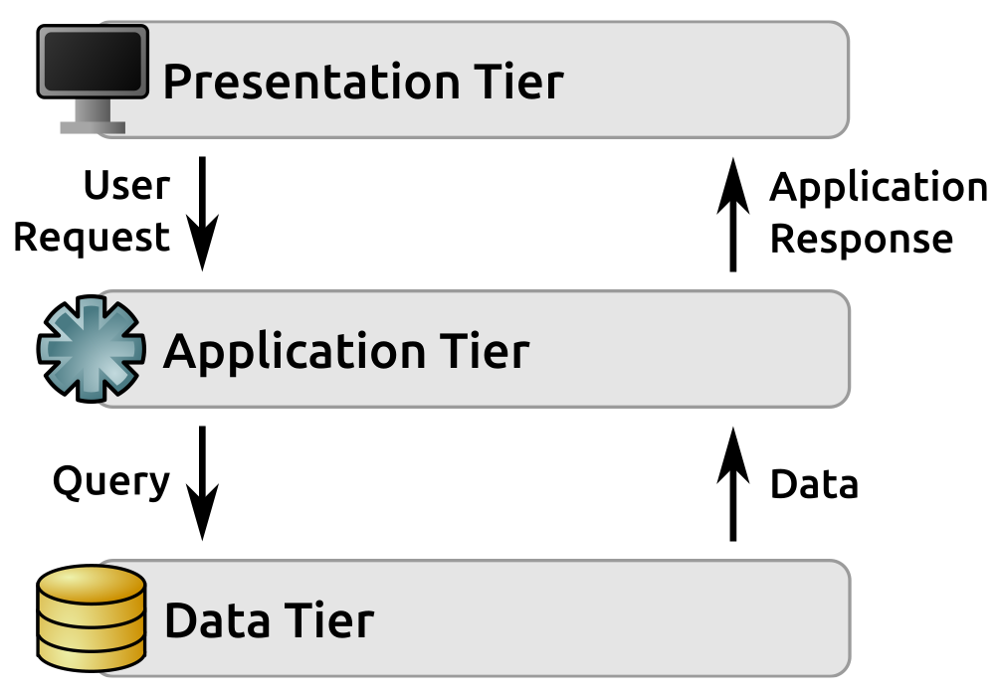
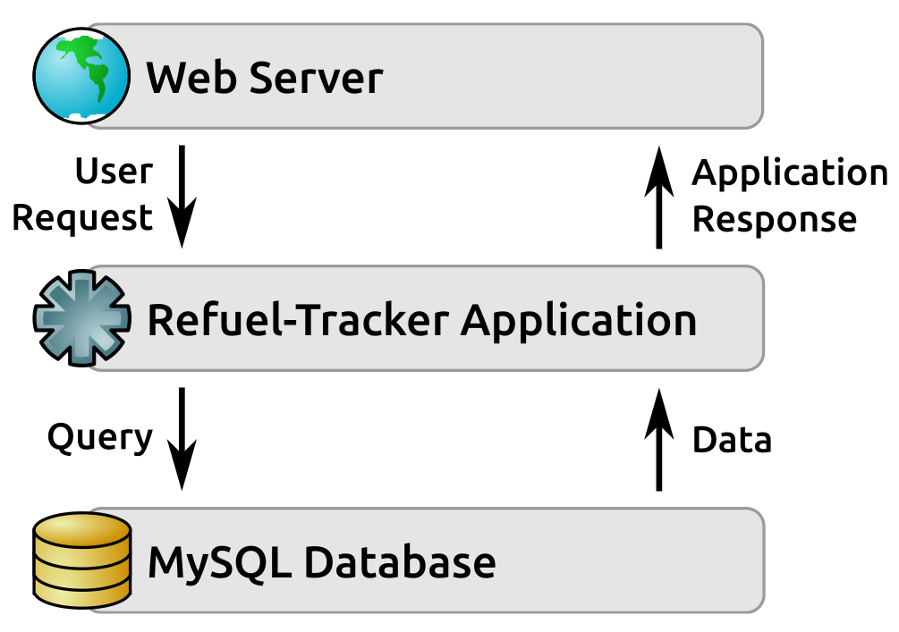
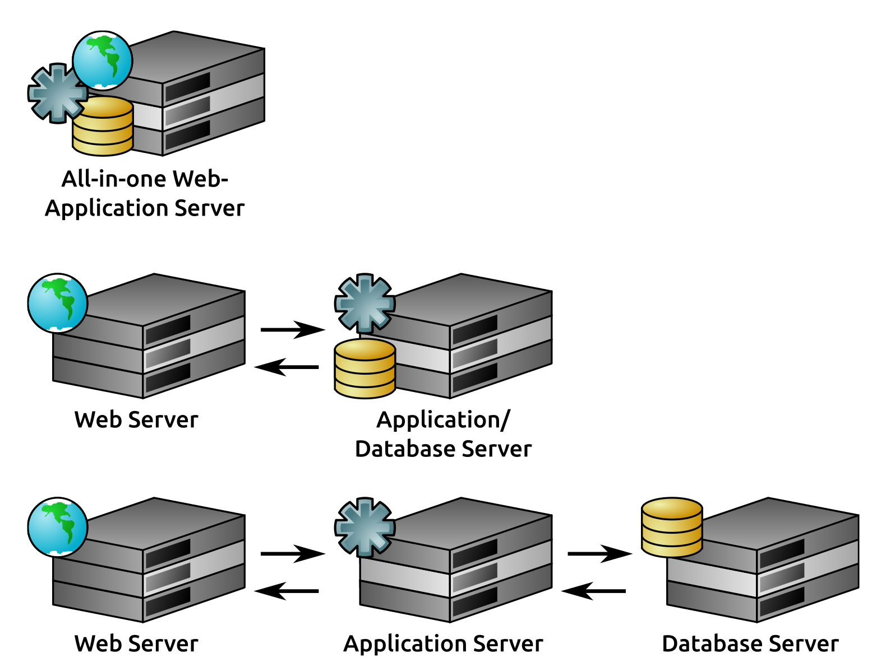
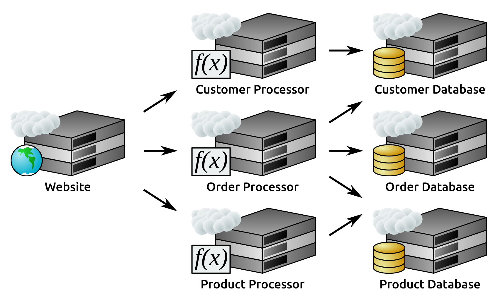
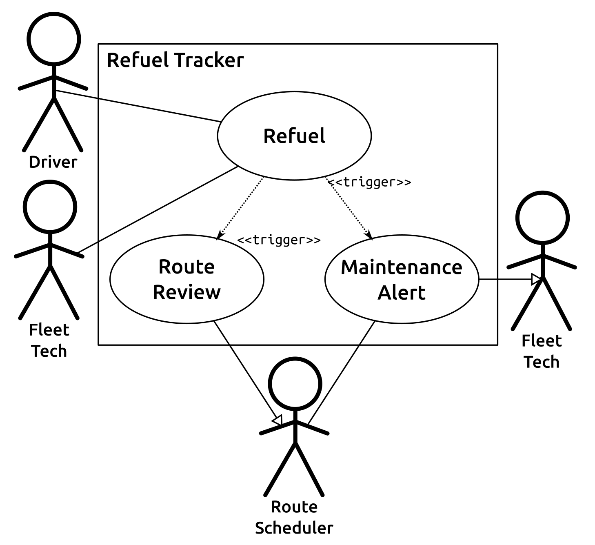
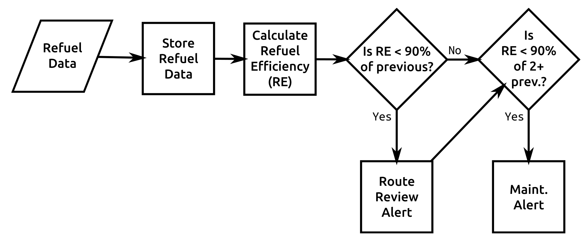
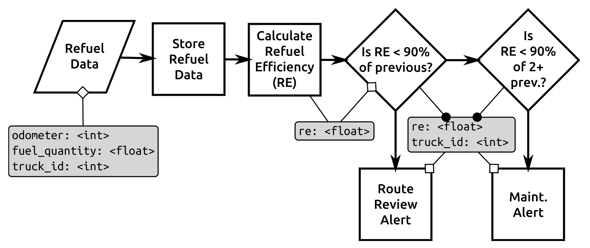
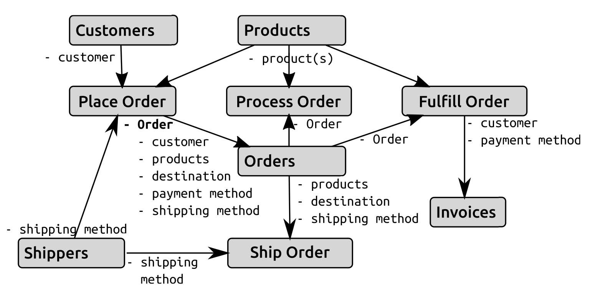
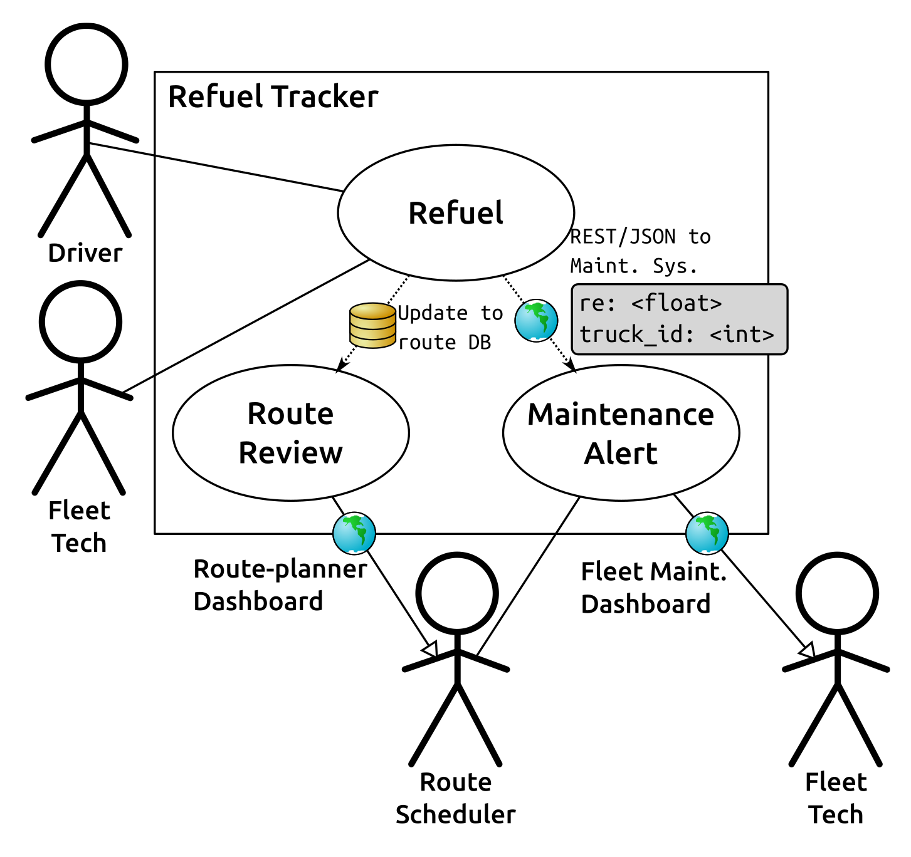
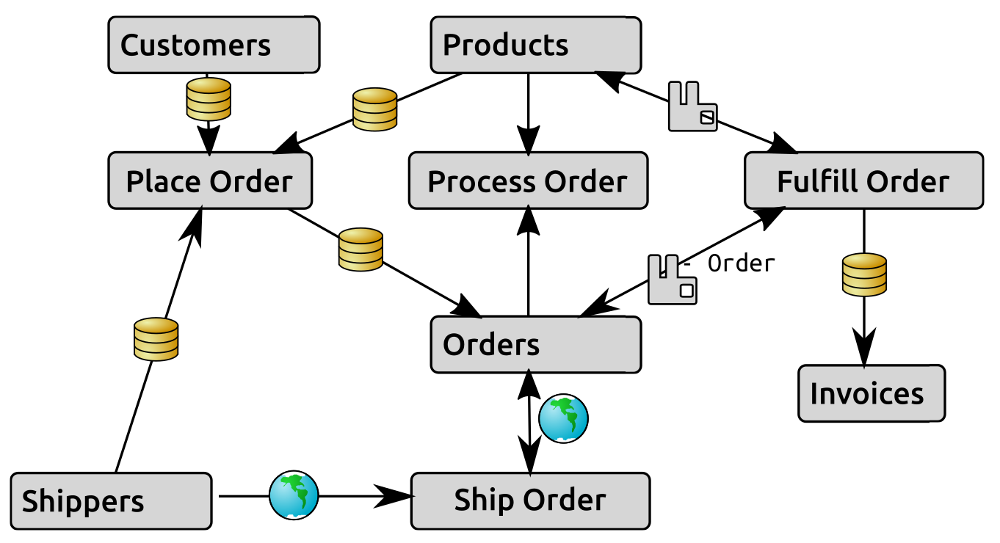

# 第三章：系统建模

任何**系统建模**过程的目标是定义和记录系统某个方面的概念模型，通常分别关注系统的一个（或多个）特定方面。系统模型可以用形式化的架构描述语言来定义，例如**统一建模语言**（**UML**），在这些情况下，可以非常详细 - 直到类的最小所需属性和方法成员。在敏捷方法论的需求分析过程中，这个层面的细节通常是流动的 - 或者至少不是最终确定的，并且将在[第四章](https://cdp.packtpub.com/hands_on_software_engineering_with_python/wp-admin/post.php?post=28&action=edit)，*方法、范例和实践*中更详细地讨论。

在更高、更少细粒度的层面上，有几个系统模型视图在开发过程中特别引人关注，特别是关于更大的整体情况：

+   架构，逻辑和物理

+   业务流程和规则

+   数据结构和流动

+   进程间通信

+   系统范围/规模

# 架构，逻辑和物理

逻辑和物理架构规范的目标是分别定义和记录系统的逻辑和物理组件，以便清楚地阐明这些组件元素之间的关系。任何一种努力产生的成果都可以是文本文档或图表，它们都有各自的优点和缺点。

文本文档通常更容易产生，但除非有一些可以应用的架构文档标准，否则格式可能会因系统团队而异。这种差异可能会使得最终产物难以在原始团队之外被理解。如果开发人员在团队之间没有太多流动，或者新开发人员大量涌入团队，这可能并不是一个重大问题。还很难确保所有移动部件或它们之间的连接都得到充分考虑。

图表的主要优点是它们相对容易理解。如果图表具有明显的指示器或符号，可以明确指示，例如，一个组件是数据库服务，另一个是应用程序，那么它们之间的区别一目了然。图表也具有更容易为非技术观众理解的优势。

在这两种情况下，基于文本或基于图表的文档显然是最有用的，如果它们构造良好，并提供了系统的准确视图或模型。

# 逻辑架构

开发通常更关注系统的逻辑架构而不是物理架构。只要系统中实际代码的部署、连接和使用各种与逻辑组件相关的物理组件的机制已经就位，并且考虑到了任何物理架构约束，通常不需要更多的信息，因此从这个角度来看，任何给定组件的位置并不那么重要。这通常意味着物理架构的详细分解最多只是一个好东西，或者最多只是一个应该有的东西。这也假设所讨论的结构不是某种如此常见以至于需要对其进行文档化的东西。例如，在野外有许多遵循相同常见的三层结构的系统，请求-响应循环如下进行：

1.  用户通过**表示层**发出请求

1.  该请求被转交给**应用层**

1.  应用程序从**数据层**检索所需的任何数据，可能在此过程中进行一些操作或聚合

1.  **应用层** 生成响应并将其返回给**表示层**

1.  **表示层** 将该响应返回给用户

以图表形式，该结构可能如下所示：

这种三层架构在 Web 应用程序中特别常见，其中：

+   **表示层** 是 Web 服务器（Web 浏览器只是远程输出渲染组件）

+   **应用层** 是由 Web 服务器调用的代码，并生成对 Web 服务器的响应，使用任何语言和/或框架编写

+   **数据层** 是多种后端数据存储变体之一，用于在请求之间保留应用程序数据

例如，考虑前面提到的加油跟踪系统概念的以下逻辑架构。它作为一个很好的例子，说明了这种三层架构在 Web 应用程序中的应用，其中一些特别标识的组件：

# 物理架构

逻辑架构文档和物理架构文档之间的主要区别在于，逻辑架构的关注点在于识别系统的功能元素，而物理架构则需要额外的步骤，指定这些功能元素执行的实际设备。在逻辑架构中识别的个别项目可能在物理上驻留在共同的设备上。实际上，唯一的限制是物理设备的性能和能力。这意味着这些不同的物理架构在逻辑上都是相同的；它们都是实现相同三层 Web 应用程序逻辑架构的有效方式：

随着行业对虚拟化、无服务器和基于云的技术的热情，由亚马逊网络服务和 VMware 等公共和私有云技术提供，物理架构规范是否真的是物理架构往往成为一种语义争论。在某些情况下，可能没有单一可识别的物理计算机，就像如果有一台专用的服务器硬件一样，但在许多情况下，这种区别是无关紧要的。如果它的行为像一个独立的物理服务器，那么在定义物理架构的目的上，它可以被视为一个物理服务器。在这种情况下，从文档的角度来看，将虚拟服务器视为真实服务器并不会丢失任何知识价值。

在考虑系统中的许多无服务器元素时，只要它在与其他元素交互的角度上表现得像一个真实设备，那么它仍然可以被表示为一个物理架构元素。也就是说，假设一个假设的 Web 应用程序完全存在于某个公共云中，其中：

+   该云允许定义无服务器函数

+   将为处理以下内容定义函数，并为每个实体的后端数据库也存储在云中：

+   顾客

+   产品

+   订单

相应的物理架构可能如下所示：

这种无服务器架构的实际实现示例可以在三个大型公共云中实现：亚马逊网络服务（AWS）、Azure 和谷歌云平台（GCP）。这些公共云平台都提供了可以为网站提供服务的虚拟服务器实例，也许还可以提供数据库。该结构中的处理器服务器可以使用无服务器函数（AWS Lambda，或 Azure 和 GCP 中的 Cloud Functions）来驱动网站和数据库之间的交互，因为网站向处理器元素中的函数发送事件。

总体而言，逻辑和物理架构规范至少提供了开发与非应用程序层进行交互所需的一些信息。即使文档中需要特定的凭据但未提供，例如，知道系统的数据层使用何种类型的数据库定义了数据层将如何被访问。

# 用例（业务流程和规则）

在任何系统中，最重要的是它是否按照所有它应该支持的用例来执行。代码必须为每个用例编写，并且每个用例对应于一个或多个业务流程或规则，因此每个用例都需要根据开发过程的适当程度来定义和记录。与逻辑和物理架构一样，可以将这些定义执行为文本或某种图表，这些方法具有之前提到的相同优点和缺点。

统一建模语言（UML）为用例提供了一个高级的图表标准，主要用于捕捉特定类型的用户（在 UML 的术语中称为操作者）与他们预期与之交互的流程之间的关系。这是一个很好的开始，如果流程本身非常简单，已经广泛记录，或者在开发团队中已知，那么它甚至可能足够。在*用例*部分中讨论的 Refuel-Tracker 应用程序概念的用例图目前非常简单，并且回溯到在第二章中为其建立的系统目标。不过，这一次，我们将为它们附上一些名称以供图表参考：

+   **加油**：各种用户可以记录加油，提供当前里程表读数和涉及的燃油数量：

+   送货司机（在当地加油站）

+   车队维护人员（在总部，那里有公司加油站）

+   **维护警报**：当卡车的计算燃油效率降低到其平均值的 90％以下时，车队维护人员将收到警报，以便安排检查卡车。

+   **路线审查警报**：办公室工作人员也会在卡车的计算燃油效率降低到其平均值的 90％以下时收到警报，以便检查卡车的送货路线。

这三个用例如果是首选文档，则很容易绘制图表。以下的流程列表也是一个可行的选择。在某些方面，它实际上比标准图表更好，因为它提供了一些标准用例图无法捕捉的系统业务规则：

即使修改图表以包括一些缺失的信息（加油是什么，以及两个`«trigger»`项目周围的规则），它仍然只是讲述故事的一部分：谁预期（或允许）使用特定的流程功能。余额，用例下面的实际流程，仍然是未知的，但需要暴露出来，以便编写代码来使它们真正起作用。这也可以通过某种纯文本或图表来处理。查看已识别的加油流程，它可以分解为以下内容：

+   **司机**或**车队技术人员**记录卡车的加油，提供：

+   当前里程表读数

+   用于填充卡车的燃油量

+   这些值被存储（可能在应用程序数据库中，尽管这可能不是实际要求的一部分），并与卡车关联（如何指定尚未确定）。

+   该应用程序计算加油的燃油效率：（当前里程表读数减去上次里程表读数）÷燃油数量。

+   如果效率小于或等于该卡车最近效率值的 90％，则触发**路线审查**警报。

+   如果效率小于或等于该卡车前四个效率值中至少一半的 90％，则触发**维护**警报。

流程图（如下面的流程图）是否会为文档增加价值可能取决于所描述的流程，以及团队甚至个人的偏好。这五个步骤作为一个简单的流程图，简单到除了它们的文本描述之外可能不会增加任何价值，但更复杂的流程可能会受益于流程图：

从开发人员的角度来看，用例映射到一个或多个必须实现的函数或方法，如果有流程流程记录，那些解释了它们将如何在运行时执行。

# 数据结构和流程

在这两者之间，基本的用例和业务流程文档可能提供足够的信息，以使数据在系统中的结构和流程变得明显，或者至少透明到开发不需要任何额外信息。我们一直在研究的加油流程可能属于这一类，但是让我们看看它的数据流图可能会是什么样子。

流程图中的数据（流程图中的**加油数据**）在*用例*部分中已经定义，并且至少有一些相关数据流也已经记录，但是将一些名称与这些值相关联，并知道它们是什么类型的值将是有帮助的：

+   **`odometer`**：当前里程表读数（可能是一个`<int>`值）

+   **`fuel_quantity`**：用于加满卡车的燃料量（可能是一个`<float>`值）

+   **`truck_id`**：正在加油的卡车（应用程序数据库中卡车记录的唯一标识符 - 为了简单起见，我们假设它也是`<int>`）

在过程中，还可能需要传递一个加油效率值给**路线审查**警报和/或**维护**警报流程：

+   `re`：计算得到的加油效率值，一个`<float>`值

在这个非常简单的情况下，数据元素只是按名称和类型进行了记录。图表指示它们何时开始可用，或者何时它们被明确传递给一个流程 - 否则它们被假定为整个过程中都可用。然后数据元素只是添加到先前的流程图中：

在一个更复杂的系统中，具有更复杂数据结构、更多数据结构、更多使用这些数据结构的流程，或者这些因素的几种组合之一，源和目的地导向的流程图可能是更好的选择 - 一些不关注流程内部工作，只关注需要什么数据以及它来自哪里的东西。

数据流文档/图告诉开发人员期望的数据在哪里产生，以及在流程完成后它将在哪里/是否存储。

# 进程间通信

不同的流程之间进行通信是非常常见的。在最基本的层面上，这种通信可能采取的形式可能只是一个函数或方法从它们共享的代码中的某个地方调用另一个。然而，随着流程的扩展，特别是如果它们分布在不同的物理或虚拟设备上，这些通信链通常会变得更加复杂，有时甚至需要专门的通信协议。类似的通信流程复杂性也可能出现在相对简单的系统中，如果存在需要考虑的进程间依赖关系。

在几乎任何通信机制比方法调用其他方法更复杂的情况下，或者可能是一个方法或进程写入数据，另一个进程将在下次执行时接收并运行，值得记录这些通信将如何工作。如果将进程之间的基本通信单元视为消息，那么通常至少记录以下内容将为编写实现这些进程间通信机制的代码提供一个坚实的起点：

+   消息包含的内容：期望的具体数据：

+   消息中需要的内容

+   可能存在的额外/可选数据

+   消息的格式：如果消息以某种方式序列化，转换为 JSON、YAML 或 XML，例如，需要注意

+   消息如何传输和接收：它可以在数据库中排队，直接通过某些网络协议传输，或者使用专用的消息队列系统，如 RabbitMQ、AWS SQS 或 Google Cloud Platform 的发布/订阅

+   消息协议适用的约束类型：例如，大多数消息队列系统将保证每个排队的消息传递一次，但不会超过一次。

+   消息在接收端如何管理：在某些分布式消息队列系统中，例如 AWS SQS 的某些变体，消息必须从队列中主动删除，以免被接收多次，并且可能被多次执行。而其他系统，如 RabbitMQ，在检索消息时会自动删除消息。在大多数其他情况下，消息只存在于到达目的地并被接收的时间。

进程间通信图通常可以建立在逻辑架构和用例图的基础上。一个提供了通信过程的逻辑组件，另一个确定了需要相互通信的进程。记录的数据流也可能有助于整体情况，并且值得从识别可能在其他地方被忽略的任何通信路径的角度来看。

例如，加油追踪器：

+   可以访问现有的路线调度应用程序的数据库，该应用程序为路线调度员提供了仪表板。

+   维护警报功能可以利用属于已购买的现成车队维护系统的网络服务调用，该系统有自己的仪表板，由车队技术人员使用。

在这些情况下，路线审查和维护警报流程所涉及的相关消息非常简单：

+   路线调度数据库的更新，也许标记了卡车上次安排的路线为低效路线，或者可能是一些通知，会在仪表板上弹出，提醒路线调度员审查路线。

+   向维护跟踪系统发出的 JSON-over-REST API 调用

该消息将适用于已显示的用例图的简单变体：

订单处理、履行和运输系统可能使用 RabbitMQ 消息传递来处理订单履行，从产品数据源传递整个订单和简单的库存检查，以确定订单是否可以履行。它可能还使用几个网络服务 API 调用来管理订单装运，通过类似的网络服务调用将装运信息推回订单。消息流（为简洁起见省略数据结构）可能如下所示：

对于开发重点在进程间通信的主要收获是，之前确定的数据如何从系统的一点传输到另一点。

# 系统范围和规模

如果所有这些项目都被记录和/或绘制出来，如果做得彻底和准确，它们将共同提供一个系统的整体范围的全面视图：

+   每个系统组件的角色应该在逻辑架构中被确定。

+   每个组件实际所在的位置应该在物理架构中被确定。

+   系统应该实现的每个用例（以及希望每个业务流程）都应该在用例文档中被确定，并且任何不那么明显的基础流程都应该至少有一个粗略的顺利路径分解。

+   从一个地方或过程移动到另一个地方的每个数据块都应该在数据流中被确定，具有足够的细节来整合出该数据结构的相当完整的图像。

+   至少对于系统中涉及更多的不仅仅是从代码库中的一个功能或方法传递系统对象的部分，应该确定管理数据移动的格式和协议。

+   这些数据的存储位置和方式应该可以从逻辑和可能的物理架构中看出来。

唯一显著缺失的部分是系统的规模。如果范围是系统中正在使用或正在移动的对象类型的数量，那么规模将是这些对象的实际数量，无论是静止的（例如存储在数据库中）还是在任何给定时间内活跃的。

规模可能很难准确预测，这取决于系统的上下文。例如，用于说明的假设加油跟踪器和订单处理/履行/发货系统通常会更可预测：

+   **用户数量将是相当可预测的**：所有员工和所有客户基本上覆盖了这两者的最大用户群。

+   **使用的对象数量也将是相当可预测的**：毕竟，运送公司只有那么多卡车，而订单系统的公司，虽然可能不太可预测，但仍然会对大多数订单的数量有一个大致的了解。

当系统或应用程序进入用户空间，比如网络时，甚至在很短的时间内也有潜在的巨大变化。在任何情况下，都应该进行一些关于预期和最大/最坏情况规模的规划。这种规划可能对设计和实施产生重大影响——例如，一次从几百或几千条记录中获取和处理十几条记录并不需要像从几百万或几十亿条记录中获取这些记录那样需要关注效率，这只是一个基本的例子——关于代码可能如何编写。如果为了应对潜在的大规模使用而进行规划，需要能够扩展到多个服务器，或者负载均衡请求，这可能也会对代码产生影响，尽管可能在更高的进程间通信层面。

# 总结

本章的所有组件、数据和文档，以及前两章的内容，都可能在任何软件工程项目中使用。实际可用的数量可能部分取决于在前期开发过程中涉及多少纪律，即使没有任何正式的关联。这种纪律可能是因为有一个非常有才能的项目经理。

对数据的可用性的时间、数量和质量的另一个影响因素通常是在项目、系统或团队的整个生命周期中采用的开发方法。一些更常见的方法在管理这些前期开发工作方面的方式有着显著不同，它们的处理可能会产生重大差异。
