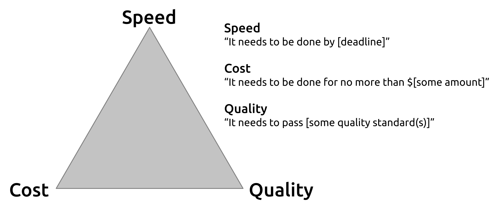
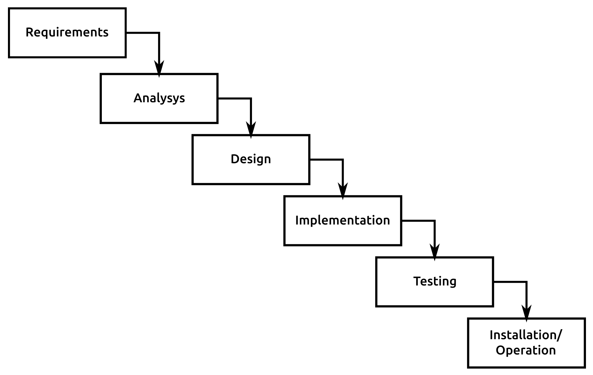
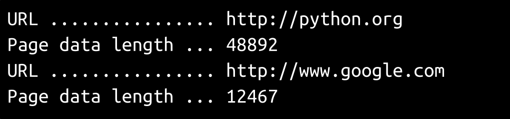

# 第四章：方法论、范式和实践

可以说，软件工程，至少是现在通常所认为的，真正开始存在于第一个正式确定的软件开发方法论。这种方法论（最终在 1976 年被称为瀑布）使人们开始思考的不仅仅是软件的工作原理，或者如何编写代码，而是围绕编写代码的过程需要看起来像什么，以使其更有效。从那时起，大约有十几种其他方法论出现了，至少有一种情况下，各种敏捷方法论的集合，有近十几种不同的子变体，尽管 Scrum 几乎可以肯定是最为人熟知的，而 Kanban 可能是第二熟知的。

当这些方法论不断成长和成熟时，计算能力的增加最终也导致了更新、更有用或更高效的开发范式。面向对象编程（OOP）和函数式编程（FP）可能是最为人熟知的对原始过程式编程范式的进步，而过去几十年一直占主导地位。自动化代码集成和推广实践（分别是持续集成和交付）近年来也变得流行起来。

在本章中，我们将涵盖以下主题：

+   过程方法论

+   瀑布

+   敏捷：

+   Scrum

+   看板

+   开发范式：

+   面向对象编程（OOP）

+   函数式编程（FP）

+   开发实践：

+   持续集成

+   持续交付

# 过程方法论

在某种程度上，所有开发过程方法论都是在一些共同现实的边界内管理开发的变体：

+   每个人每天可以投入到项目中的有用工作时间是有限的

+   项目可用资源的限制，无论是人员、设备还是资金

+   项目完成时有一个最低可接受的质量标准

这有时被表达为项目管理的铁三角：



关于**速度**点的主要关注是时间——最常见的焦点可能是项目需要在特定截止日期前完成，或者有一些其他时间约束，可能只能通过增加团队的开发人员（增加**成本**）或者采取捷径（降低**质量**）来克服。

成本点的变化是**成本**点的一个常见主题——任何花钱的事情，无论是额外的开发人员、更新/更快/更好的工具等等。

减少可用资源/人员会降低项目完成的速度和/或最终的质量。

质量点显然关注质量措施，这可能包括特定的内部或外部标准，但也可能包括不那么明显的项目，比如长期可维护性和对新功能和功能的支持。至少需要更多的开发人员时间来优先考虑质量，这会降低速度，增加成本。

通常，对三角形的三个点最多只能给予两个点的重要性（无论“重要性”可能适用于哪个值），从而产生三种优先级可能性：

+   快速、廉价的开发，但以牺牲质量为代价

+   快速、高质量的开发，但成本更高

+   高质量、廉价的开发，需要更长时间来完成

精益创业方法（或简称精益）有时被认为是可以克服铁三角约束的替代过程方法论，但超出了本书的范围。可以在[`www.castsoftware.com/glossary/lean-development`](https://www.castsoftware.com/glossary/lean-development)找到其概念的合理介绍。

有三种特定的开发流程方法论值得在本书的背景下进行深入研究。首先，我们将研究瀑布模型，以便为两种敏捷方法论——Scrum 和 Kanban 提供一个参照框架，同时还会简要地介绍其他一些方法。本书的范围远远无法对它们进行全面讨论，但意图是为每种方法提供足够的细节，以说明它们的重点、优势和劣势。至少，这应该提供一个基准，让人们知道在任何一种方法中工作时可以期待什么，将每种方法的阶段与[第三章](https://cdp.packtpub.com/hands_on_software_engineering_with_python/wp-admin/post.php?post=27&action=edit)的 SDLC 模型的阶段联系起来，展示发生了什么、何时发生以及如何发生。

# 瀑布

瀑布的渊源可能可以追溯到制造和/或建筑规划。在许多方面，这是一种非常简单的规划和实施开发工作的方法，基本上可以分解为定义和设计要构建的内容，构建它，测试它，部署它。

更正式地说，这是六个单独的阶段，按照这个顺序执行：

+   需求

+   分析

+   设计

+   实施

+   测试

+   安装和操作：



这些阶段与 SDLC 的阶段顺序相当吻合。无论是偶然还是有意为之，它们的目标都是为了实现许多相同的目标。它们的重点可能最好总结为努力在交付设计给开发之前设计、记录和定义开发所需的一切。在理想的执行中，设计和需求信息将为开发人员提供一切所需，一旦实施开始，项目经理可能完全不需要干预。

从概念上讲，这种方法是有一定价值的——如果一切都得到了彻底和准确的记录，那么开发人员将拥有他们所需要的一切，他们可以完全专注于编写代码来实现需求。文档作为初始项目规格的一部分已经创建，因此一旦软件部署，管理生成系统的任何人都将可以访问它，其中一些文档甚至可能是面向用户的，并且对他们可用。

如果做得好，它几乎肯定会捕捉并允许在实施过程中的依赖关系，并提供一个易于遵循的事件顺序。总的来说，这种方法论非常容易理解。这几乎是一种反射性的建设方法：决定要做什么，计划如何做，做，检查所做的是否符合要求，然后就完成了。

然而，在实践中，要实现一个良好的瀑布计划和执行并不容易，除非执行**需求**、**分析**和**设计**阶段的人员非常优秀，或者需要花费足够的时间（也许是很长时间）来达到并审查这些细节。这假设需求一开始就是可以确定的，而这经常不是事实，并且它们在中途不会发生变化，而这种情况比人们想象的更常见。由于它的重点是首先进行文档记录，因此长期应用于大型或复杂系统时往往会变得缓慢——不断更新不断增长的文档集需要时间，而几乎总是需要额外的（并且不断增加的）时间来防止不可控制的膨胀影响系统周围的其他支持结构。

瀑布流程的前三个阶段（**需求**、**分析**和**设计**）包括 SDLC 模型的前五个阶段：

+   初始概念/愿景

+   概念开发

+   项目管理规划

+   需求分析和定义

+   系统架构和设计

理想情况下，这些将包括这些阶段的任何文档/成果，以及任何*系统建模*项目（[第三章](https://cdp.packtpub.com/hands_on_software_engineering_with_python/wp-admin/post.php?post=27&action=edit)，*系统建模*），所有这些都打包好供开发人员使用和参考。通常，这些过程将涉及一个专门的项目规划者，负责与各种利益相关者、架构师等进行交流和协调，以便组装整个项目。

在一个定义明确且管理良好的瀑布过程中，这三个阶段产生的成果并交给开发和质量保证的成果是一个文档或一组文档，构成了一个项目计划。这样的计划可能会非常长，因为它理想情况下应该捕捉到所有在开发前和开发后有用的产出：

+   目标和目标（可能是在高层次）

+   包括在完成工作中的内容和预期的内容：

+   完整的需求分解

+   需要减轻或至少注意的任何风险、问题或依赖关系

+   架构、设计和系统模型考虑因素（新结构或对现有结构的更改）：

+   逻辑和/或物理架构项目

+   使用案例

+   数据结构和流程

+   进程间通信

+   开发计划

+   质量保证/测试计划(s)

+   变更管理计划

+   安装/分发计划

+   退役计划

瀑布过程的**实施**和**测试**阶段，除了以项目计划作为起点参考外，很可能会遵循一个简单而非常典型的过程：

+   开发人员编写代码

+   开发人员测试代码（编写和执行单元测试），修复任何功能问题并重新测试直到完成

+   开发人员将完成的代码交给质量保证进行进一步测试

+   质量保证测试代码，如果发现问题，则将其交还给开发人员

+   经过测试/批准的代码被推广到实际系统

这个过程在所有开发工作和方法论中都很常见，除非有重大偏差，否则以后不会再提到它。

瀑布的**安装和操作**阶段包括 SDLC 模型中的**安装/分发**和**操作/使用和维护**阶段。它也可能包括**退役**阶段，因为这可能被视为特殊的**操作**情况。与**实施**和**测试**阶段一样，这些阶段很可能会以一种易于预期的方式进行——除了项目计划文档中可能存在的任何相关信息外，实际上没有什么可以指导任何偏离简单、常识方法的东西，无论在系统的上下文中常识的价值是什么。

虽然瀑布通常被认为是一种过时的方法，往往以过于死板的方式实施，并且在长期基础上更多或更少需要超级人员才能发挥作用，但只要存在一个或多个条件，它仍然可以发挥作用：

+   需求和范围被准确分析，并完全考虑到

+   在执行过程中，需求和范围不会发生重大变化

+   系统对方法论来说不会太大或太复杂

+   系统的变化对方法论来说不会太大或太复杂

其中，第一个通常是没有政策和程序支持的情况下不能依赖的事情，而这通常远远超出了开发团队的控制范围。后两者几乎不可避免地会在足够长的时间内变得不可逾越，因为系统很少会随着时间的推移变得更小或更简单，对更大更复杂系统的更改往往会变得更大更复杂。

# 敏捷（一般）

到了 20 世纪 90 年代初，开发过程的观念发生了翻天覆地的变化。瀑布模型虽然被广泛采用，甚至在美国政府承包商政策中也得到了应用，但开始显示出在应用于大型和复杂系统时固有的缺陷。其他非瀑布方法学的使用也开始显示出过于繁重、过于易于产生逆生产的微观管理以及各种其他抱怨和担忧的迹象。

因此，对开发过程的大量思考开始集中在轻量级、迭代和较少管理密集型的方法上，最终形成了敏捷宣言和支撑其的十二个原则：

+   我们正在通过实践和帮助他人实践，发现开发软件的更好方法。通过这项工作，我们已经开始重视：

+   个人和互动胜过流程和工具

+   可工作的软件胜过全面的文档

+   与合同谈判相比，更重视与客户的合作

+   响应变化胜过遵循计划

也就是说，虽然右侧的项目有价值，但我们更重视左侧的项目。我们遵循这些原则：

+   我们的最高优先级是通过及早和持续交付有价值的软件来满足客户。

+   欢迎变化的需求，即使在开发的后期。敏捷过程利用变化为客户的竞争优势。

+   频繁交付可工作的软件，从几周到几个月，更偏好较短的时间跨度。

+   业务人员和开发人员必须在整个项目期间每天一起工作。

+   围绕着积极主动的个人建立项目。给予他们所需的环境和支持，并相信他们能够完成工作。

+   向开发团队传达信息的最有效方法是面对面的交谈。

+   可工作的软件是进展的主要衡量标准。

+   敏捷过程促进可持续发展。赞助商、开发人员和用户应该能够持续保持稳定的步伐。

+   持续关注技术卓越和良好设计可以增强敏捷性。

+   简单性——最大程度地减少未完成的工作量——是必不可少的。

+   最佳的架构、需求和设计来自于自组织团队。

+   定期团队反思如何变得更有效，然后调整和调整其行为。

您可以参考敏捷宣言网站[`Agilemanifesto.org/`](http://agilemanifesto.org/)获取更多详细信息。

在应用程序中，这些原则导致了不同方法论之间的一些共同特征。其他敏捷方法可能存在例外情况，但对于我们的目的，以及对本文讨论的具体方法论，这些共同特征如下：

+   开发按照一系列迭代进行，每个迭代都有一个或多个目标

+   每个目标都是最终系统的一个子集

+   在每个迭代结束时，系统是可部署和可操作的（也许只适用于特定的操作价值）

+   需求以小块详细定义，并且可能直到它们要被处理的迭代之前才被定义

Scrum 被称为最受欢迎的，或者至少是最广泛使用的敏捷开发方法（《敏捷报告》的第 12 届年度报告将其列为 56%的敏捷方法正在使用），因此可能值得更加详细地关注。Kanban 是另一种敏捷方法，也值得一些研究，即使只是因为它更接近本书中主要系统项目的呈现方式。

还有一些其他敏捷方法论，至少也值得快速查看，因为它们可以为开发工作带来一些特定的关注点，无论是独立使用，还是与其他方法论混合使用。

企业也在探索对**敏捷**流程进行补充和修改，以改进它们并解决原始概念未包含的需求。其中一个这样的流程是**规模化敏捷框架**，用于改进更大规模的敏捷流程的使用。

# Scrum

Scrum 大致包括以下几个部分：

+   Scrum 方法论围绕着称为冲刺的有限时间迭代。

+   冲刺被定义为开发团队（有时还包括利益相关者）可以达成一致的一段固定时间。

+   冲刺持续时间通常是相同的，但如果有理由这样做，那么这个持续时间可以被改变，无论是暂时的还是永久的（直到下一次改变）。

+   每个冲刺都有一组与之相关的功能/特性，开发团队已经承诺在冲刺结束时完成。

+   每个功能/特性项目都由一个**用户故事**描述。

+   团队确定他们可以承诺在冲刺期间完成哪些用户故事，考虑到冲刺的持续时间。

+   用户故事的优先级由利益相关者（通常是产品负责人）确定，但可以进行协商。

+   团队定期聚集来整理待办事项列表，这可能包括：

+   估计没有大小的故事

+   为用户故事添加任务级别的细节

+   如果存在功能依赖或与大小相关的执行问题，将故事细分为更小、更易管理的块，并获得相关利益相关者的批准

+   团队在最后审查冲刺，寻找做得好的事情，或者寻找改进做得不太好的事情的方法。

+   团队定期会议计划下一个冲刺。

+   团队每天有一个简短的会议（站立会议），其目的是揭示自上次更新以来发生了什么变化的状态。这些会议最为人熟知的格式，虽然不是唯一的格式，是每个参与者快速发表一句话：

+   他们自上次站立会议以来所做的工作，无论是完整还是其他。

+   他们计划在下一个站立会议之前要处理的工作。

+   他们正在处理的障碍，其他团队成员可能能够提供帮助。

故事的大小估计不应该基于任何时间估计。这样做往往会忽略对复杂性和风险的评估，这可能是非常重要的，并且意味着期望所有开发人员能够在相同的时间内完成相同的故事，这可能不会是情况。而应该使用故事点或者 T 恤尺码（额外小，小，中，大，额外大和额外额外大）！

1.  从开始到结束，一个典型的冲刺会按照以下方式展开，假设一切顺利：

1.  **第 1 天冲刺启动活动**：

1.  故事和任务被设置在任务板上，无论是真实的还是虚拟的，都处于**未开始**状态，按优先级排序。

1.  团队成员认领要处理的故事，从优先级最高的项目开始。如果有多个人在处理一个故事，他们会各自认领与之相关的任务。认领的故事会被移动到任务板上的**进行中**状态。

1.  **第 1 天-冲刺结束前的一天**：开发和质量保证。

1.  **每日站立会议**（可能在第一天被跳过）。

1.  **开发**：

1.  当任务完成时，它们的状态会在任务板上更新以表示完成。

1.  当故事完成后，它们会在开发后移动到任务板上的下一个状态。这一列可能是**开发完成**，**准备质量保证**，或者根据团队结构合理的其他状态描述。

1.  如果遇到障碍，他们会通知**Scrum Master**，负责促进解决阻塞问题。如果不能立即解决，被阻塞的故事或任务的状态应该在任务板上更新，并且开发人员继续处理他们能够处理的下一个任务或故事。

1.  1.  随着路障的解决，它们所阻碍的项目重新进入开发状态，并从那时起正常进展。没有什么可以说开发人员在解决了路障后必须继续处理该项目。

+   **质量保证活动**：

+   如果质量保证人员嵌入到开发团队中，他们的流程通常类似于开发活动，只是他们会从显示**开发完成**项目的任何列中开始测试一个故事。

+   测试一个故事应该至少包括该故事的**验收标准**。

+   测试可能会包括不属于验收标准的功能测试。

+   **故事验收**：如果有任何已完成但尚未被接受的故事，它们可以被相关利益相关者演示和接受或拒绝。被拒绝的项目可能会回到**开发中**或**未开始**状态，这取决于为什么被拒绝以及可以做什么来解决被拒绝的原因。

+   **Sprint 结束日**：

+   演示和接受任何剩余的故事。

+   如果之前没有时间进行，应该进行下一个 Sprint 的准备：

+   **Sprint 规划**，为下一个 Sprint 准备用户故事。

+   **待办事项梳理**，为需要这些细节的用户故事准备和定义细节和任务。

+   接受剩余的故事。

+   **回顾会议**——团队聚集在一起，确定以下内容：

+   Sprint 中表现良好的地方，以便尝试利用使其表现良好的因素。

+   Sprint 中表现不佳或根本不起作用的地方，以避免将来出现类似情况。

所有的日常活动都围绕着一个任务板展开，它提供了一个快速的机制，方便地看到正在进行的工作以及每个项目的状态：

一个示例任务板，显示了不同开发阶段的故事和任务。所示的任务板比技术上所需的更详细的状态列——最基本的列集将是**故事**，顶层故事的细节存放在那里，直到完成，**未开始**和**进行中**，用于 Sprint 中的任务，以及**完成**，任务（可能还有故事）完成、测试并准备接受时所在的位置。

Scrum 的优先事项是其专注于透明度、检查和自我纠正，以及对不断变化的需求和要求的适应性。任务板是方法论透明度方面的重要组成部分，允许任何感兴趣的人一目了然地看到开发工作的当前状态。但事情并不止于此——还有一个称为**产品负责人**的角色，他充当开发团队和系统的所有利益相关者之间的中心沟通点。他们参加每日站立会议，以便近乎实时地了解进展、路障等，并且有望代表整个利益相关者集合发言和做出决策。他们还负责在出现问题或关注点时将团队成员与外部利益相关者联系起来，如果产品负责人自己无法解决问题。他们的角色对于确保向利益相关者提供有关进行中的开发工作的透明度和不让开发团队受到他们的持续状态报告的负担之间保持良好平衡至关重要。

Scrum 期望在过程本身中进行相当多的自我检查，并鼓励对过程结果——所创建的软件以及用于创建它的实践和纪律——进行类似的检查，通过优先考虑团队的开放性和成员之间的交流，提供一种提高风险和阻碍条件可见性的机制，甚至在一定程度上通过鼓励涉及最小工作量以实现给定功能目标的用户故事。当出现问题或问题时，强调立即沟通和随时有人可以提供指导和做出决策，以便快速解决这些问题，并最小程度地干扰正在进行的开发过程。

Scrum 或许是从适应变化的角度来看最好的方法之一。想象一下，一个开发团队在两周（或更长时间）的迭代的第一周一直在项目的各个部分上工作。在那时，利益相关者层面上的某人突然决定需要对其中一个故事进行更改。这种变化需要的原因可能有好的、坏的或中立的几种可能。

也许故事背后的功能被认为已经过时，根本不再需要——如果故事尚未完成，那么它可以简单地从迭代中移除，并从待办事项中拉取另一个故事进行处理，如果有的话，它的规模不大于被移除的故事。如果已经编写了针对该故事的代码，那么它可能需要被移除，但就对代码库的影响而言，就是这样了。如果故事已经完成，那么相关的代码也会被移除，但不会拉取新的工作（额外的故事）。

如果故事发生了变化——例如，其背后的功能被改变以更好地适应用户需求或期望——那么这个故事就会以与被移除相同的方式从当前迭代中撤回，至少是这样。如果有时间重新调整故事并将其重新插入迭代，那么可以这样做，否则它将被添加到待办事项列表中，可能是按优先级透视在列表的顶部或附近。

偶尔，迭代可能会出现偏离预期的情况，但该方法也对如何处理这种情况有期望。如果由于任何原因迭代无法成功完成，它应该停止，并计划一个新的迭代从上一个迭代结束的地方开始。

Scrum 的一些有利方面包括：

+   Scrum 非常适合可以分解为小而快速努力的工作。即使在大型系统中，如果对大型代码库的添加或更改可以用简短、低工作量的故事来描述，那么 Scrum 是一个很好的应用过程。

+   Scrum 非常适合在其领域内具有相对一致技能的团队。也就是说，如果团队中的所有开发人员都可以在项目的主要语言中编写代码而无需太多帮助，那么这种团队动态比只有六名团队成员中的一名能够做到这一点要好。

同时，由于 Scrum 过程中涉及的结构，有一些注意事项：

+   由于迭代代表了完成一组故事和功能的承诺，即使有很好的理由，改变正在进行的迭代也是麻烦的、耗时的和具有破坏性的。这意味着，无论是谁在做出可能需要改变正在进行的迭代的决定的位置上，都需要意识到这些决定可能带来的潜在影响——理想情况下，也许他们会避免在没有真正非常好的理由的情况下对迭代进行破坏性的改变。

+   Scrum 可能不太适合满足项目或系统级的截止日期，除非团队在系统和代码库的整个领域具有相当多的专业知识。迭代截止日期风险较小，尽管它们可能需要改变或减少范围，以便按迭代交付可工作的软件。

+   如果团队成员发生变化，开发工作和产出就会变得不太可预测——每个新团队成员，特别是如果他们在不同时间加入团队，都会对团队的可预测性产生一定影响，直到新团队名单有时间稳定下来。Scrum 对这些变化特别敏感，因为新团队成员可能没有满足迭代承诺所需的所有必要部落知识。

+   如果团队成员不都在同一物理区域，Scrum 可能效果不佳，甚至根本行不通。使用现代远程会议，进行每日站立会议仍然是可能的，其他各种会议也是如此，但 Scrum 旨在是协作的，因此更容易直接接触其他团队成员很快就变得重要，一旦出现问题或疑问。

+   除非经过精心管理，Scrum 往往会加强团队中技能集的隔离——如果只有一个开发人员知道系统需要的第二语言编写代码的方法，那个人将更频繁或默认地被选中执行任何需要这种知识的任务或故事，以满足迭代的承诺。有意识地将加强隔离的故事或任务转变为团队或成对开发工作可以在很大程度上减少这些影响，但如果没有努力，或者没有支持减少这些隔离，它们将持续存在。

+   如果系统有很多外部依赖（例如来自其他团队的工作），或者开发人员必须应对大量的质量控制工作，Scrum 可能会具有挑战性。如果这些质量控制要求与法律或监管要求相关联，这可能会特别棘手。确保外部依赖本身更可预测可以在很大程度上缓解这些挑战，但这可能超出团队的控制范围。

# Scrum 和 SDLC 模型的阶段

我们的 SDLC 模型中对开发工作至关重要的阶段发生在 Scrum 过程的特定部分：

+   开发开始之前：

+   需求分析和定义发生在故事创建和修饰过程的部分，通常在冲刺规划期间进行一些后续工作。目标是在故事被包含在冲刺之前，每个故事的需求都是已知和可用的。

+   系统架构和设计项目遵循相同的模式，尽管一个迭代中的故事也可能有架构和/或设计任务。

+   开发过程本身：

+   显然，开发发生在冲刺期间。

+   质量保证活动通常也作为冲刺的一部分进行，应用于开发人员认为每个故事完成时。如果测试活动揭示问题，故事将回到“开发中”状态，或者可能是任务板上的较早状态，并将尽快进行修正。

+   系统集成和测试也可能在冲刺期间进行，假设有环境可用于执行这些活动并使用新代码。

+   验收可以在每个故事通过所有 QA 和系统集成和测试活动的基础上逐个故事进行，也可以在冲刺结束的演示和验收会议上一次性进行。

很容易理解为什么 Scrum 如此受欢迎——从开发者的角度来看，通过纪律性的规划和投入精心关注以确保开发人员的时间得到尊重和合理分配，他们的日常关注点减少到了他们当下正在处理的工作。在一个成熟的团队中，具有相对一致的技能和对系统及其代码库的良好工作知识，从业务角度来看，Scrum 将是相当可预测的。最后，Scrum 如果得到谨慎和纪律的管理，是自我纠正的——随着问题或关注点的出现，无论是与流程相关，还是在某种程度上与系统和代码库相关，流程都会提供解决和纠正这些问题的机制。

# Kanban

作为一个流程，Kanban 与 Scrum 有很多相似之处：

+   主要工作单位是用户故事。

+   故事具有相同类型的故事级别的流程状态，以至于相同类型的任务板，无论是真实的还是虚拟的，都用于跟踪和提供工作进行中的可见性。

+   在开始工作之前，故事应该准备好所有的要求和其他相关信息。这意味着存在某种故事整理过程，尽管它可能没有 Scrum 中等效的形式化结构。

看板，与 Scrum 不同：

+   没有时间限制——没有冲刺。

+   不要求或期望每日状态/站立会议，尽管这是一个足够有用的工具，因此通常被采用。其他变体和方法，也许首先关注被阻止的项目，然后关注进行中的项目的问题，然后其他任何问题，也是可行的。

+   不要求或期望故事被规模化，尽管这是一个足够有用的工具，尤其是如果它是优先为开发故事进行规模化的标准。

Kanban 的主要重点可以描述为努力减少上下文变化，这表现为在完成单个故事之前，不断地工作，然后再转移到下一个故事。这经常导致根据需求对功能进行优先排序，这在存在故事之间功能依赖关系的情况下非常适用。

在 Scrum 流程中，可能也会出现工作直到完成的重点，但实际上并不是期望的，因为 Scrum 的目标是在一个冲刺中完成所有故事，并且可能需要团队中其他人的帮助来在任何时候完成一个故事。

Kanban 的整个流程非常简单：

+   故事（及其任务）准备就绪，并为工作进行优先排序

+   一个或多个开发人员选择一个故事，并一直工作直到完成，然后再选择另一个故事，依此类推

+   在进行开发和处理当前故事的工作时，新故事会随着细节的逐渐明确而准备就绪，并相应地进行优先排序

Kanban 与 Scrum 有不同的政策和程序，提供了不同的优势：

+   Kanban 非常适用于存在重要知识或专业技能孤立的工作，因为它专注于完成功能，无论需要多长时间。

+   Kanban 处理的故事和功能既大又不容易分割成更小的逻辑或功能块，而无需经过将它们细分为冲刺大小块的过程（但请参见下一节对此的缺点）。

+   Kanban 直接限制了进行中的工作，这减少了开发人员过度工作的可能性，前提是工作流程得到正确和良好的规划。

+   Kanban 允许利益相关者随时添加新的工作，并具有任何优先级，尽管最好避免中断进行中的工作

+   只要每个故事都是独立的且可交付的，每个完成的故事在被接受后就可以立即安装或实施

它也有自己的一套注意事项：

+   看板在开发中更容易出现瓶颈，特别是如果后续故事存在大规模或长期的依赖关系——例如，可能需要三周才能完成的数据存储系统，即对需要它的许多小类结构存在依赖，如果数据存储系统完成，这些结构可能在几天内就能实现。

+   由于看板在高于个别故事的更高层次上并没有提供任何具体的里程碑，因此如果出于外部业务原因需要这些里程碑，就需要更直接和有意识的努力来建立这些里程碑。

+   在看板流程中，通常需要更多的有意识的思考和努力来开发分阶段的功能，以使其更有效——例如，任何具有“必须具有”、“应该具有”和“可以具有”功能的功能都需要从一开始就提供对未来阶段目标的一些认识和指导，以保持高效。

+   看板不要求整个团队都了解工作的设计基础，这可能导致误解，甚至导致开发工作目标不一致。有意识地**打破**设计，并提高对更大规模需求的整体认识可能是必要的，而一开始可能并不明显。

# 看板和 SDLC 模型的阶段

许多敏捷流程，特别是那些以故事作为基本工作单位的流程，有很多相似之处。由于在讨论 Scrum 时已经对大多数与故事相关的内容进行了详细描述，因此后续使用故事的其他方法只会注意到主题的变化：

+   **开发开始之前：**需求分析和定义，系统架构和设计的工作方式与 Scrum 中的工作方式基本相同，出于许多相同的原因。主要区别在于，看板中期望的结构较少正式，以实现将需求和架构细节附加到故事中。通常情况下，这种情况发生在有时间和/或认为有需要的情况下，例如开发团队接近可用故事的情况。

+   **开发过程本身：**开发和质量保证流程是故事完成过程中的一部分。系统集成和测试也是如此，接受基本上必须在故事的生命周期中发生，因为没有一个结束冲刺的会议来展示开发结果并获得接受。

由于看板的结构较少正式，流程仪式较少，以及其流程的及时性易于理解，因此看板易于理解，且相对容易管理。在关键点上需要一些额外的关注，并且有能力识别这些关键点，有助于保持事情的顺利进行，但只要识别和解决这些关键点的能力随着时间的推移而提高，流程也会随之改善。

# 其他敏捷方法

Scrum 和看板并不是唯一的两种敏捷方法，甚至也不是唯一值得考虑的两种方法。其他一些值得注意的方法包括极限编程作为一个独立的方法，以及特性驱动开发和测试驱动开发，可以作为独立的方法，也可以作为其他方法的混合物。

# 极限编程

**极限编程**（**XP**）最显著的特点可能是**成对编程**方法，这可能是其实施的一个组成部分。其背后的意图/期望是，两名开发人员共用一台计算机编写代码，这理想情况下可以提高他们的专注力、合作能力，更快地解决任何挑战，并能更快、更好、更可靠地检测到潜在的风险，这些风险是固有于所生成的代码中的。在成对编程的情况下，两名开发人员在编写代码和审查代码的过程中会频繁交替。并非所有的 XP 实施都使用成对编程方法，但当它不适用时，其他流程，如广泛和频繁的代码审查和单元测试，是必要的，以至少保持部分因不使用该选项而丢失的好处。

作为一种方法论，XP 可能无法处理高度复杂的代码库或对代码库的高度复杂更改，而不牺牲其开发速度的一部分。它也倾向于需要比 Scrum 和 Kanban 等更及时的方法更多的密集规划和需求，因为成对开发人员应该理想情况下能够尽可能自主地工作在代码上。成对团队拥有的信息越多，他们需要花费的时间就越少，而且对他们的努力造成的干扰也就越少。XP 实际上没有任何跟踪进度或保持努力和障碍可见的方法，但可以采用或从其他方法中添加一些东西是完全可能的。

# 特征驱动开发

**特征驱动开发**（**FDD**）过程中的主要工作单元是一个特征。这些特征是详细系统建模工作的最终结果，重点是在显著细节上创建一对多的领域模型，绘制出特征在系统领域中的位置，它们如何（或是否）预期相互交互——这些信息应该来自**用例**、**数据结构**、**流**模型和**进程间通信**模型。一旦整体模型建立，就会构建并优先考虑特征列表，以至少尝试将列表中每个特征的实施时间框架保持在合理的最大限度内——两周似乎是典型的限制。如果一个单独的特征预计需要超过最长可接受的时间，就会将其细分，直到可以在该时间段内完成和交付。

一旦完整的功能列表准备好进行实施，就会计划围绕固定时间周期完成这些功能的迭代。在每个迭代中，将功能或功能集分配给开发人员，单独或成组。这些开发人员制定最终的实施设计，并在需要时进行审查和完善。一旦设计被认为是稳固的，就会进行代码的开发和测试以实施设计，并将产生的新代码推广到构建或分发准备就绪的代码库进行部署。

FDD 与几种开发最佳实践相辅相成——自动化测试、配置管理和定期构建，以便，即使它们不是完整的、正式的**持续集成**过程，它们也非常接近。特征团队通常很小，动态形成，并且至少应该有两个人员，以促进协作和早期反馈，特别是在特征的设计和实施质量上。

FDD 可能是大型和复杂系统的一个很好的选择——通过将工作分解为小的可管理的功能，即使在非常大型、非常复杂的系统的情况下，开发也将是可维护的，并且成功率很高。围绕让任何个体功能运行起来的过程是简单且易于理解的。除了偶尔的签入以确保开发不会因某种原因而停滞外，FDD 非常轻量级且不会干扰。功能团队通常会有一个与之相关的首席开发人员，负责协调开发工作并在必要时完善实施细节。然而，这意味着首席开发人员不太可能为实际代码做出贡献，特别是如果他们大部分时间都在执行协调或设计完善工作，或者指导团队的其他成员。

# 测试驱动设计

**测试驱动设计**（**TDD**），顾名思义，首先专注于使用代码库的自动化测试来指导开发工作。整个过程分解为以下步骤：

+   对于正在实现的每个功能目标（新功能或增强功能）：

+   编写一个新的测试或一组测试，直到被测试的代码满足被测试的任何合同和期望为止。

+   确保新的测试按预期失败，不会因其他原因失败。

+   编写通过新测试的代码。最初可能非常笨拙和不优雅，但只要满足测试中嵌入的要求，这并不重要。

+   根据需要对新代码进行改进和/或重构，重新测试以确保测试仍然通过，将其移动到代码库中的适当位置（如果需要），并确保它满足代码库作为整体的其他标准和期望。

+   运行所有测试，以证明新代码仍然通过新测试，并且没有其他测试因新代码而失败。

TDD 作为一个过程提供了一些明显的好处：

+   系统中的所有代码都将进行测试，并至少具有完整的回归测试套件

+   由于编写代码的主要目标只是通过为其创建的测试，因此代码通常只能足够实现这一目标，这通常会导致更小、更易管理的代码库

+   同样，TDD 代码往往更加模块化，这几乎总是一件好事，而且通常会导致更好的架构，这也有助于更易管理的代码

主要的权衡，显然也是，测试套件必须被创建和维护。随着系统的增长，它们将变得越来越庞大，并且执行起来需要更长的时间，尽管显著的增加（希望）需要一段时间才能显现。创建和维护测试套件需要时间，这本身就是一种纪律——有人认为编写良好的测试是一种艺术形式，甚至有相当多的真理。除此之外，人们倾向于寻找错误的度量标准来显示测试的表现如何：例如代码覆盖率，甚至只是单个测试用例的数量，这些指标并不表示测试的质量。

# 开发范式

编程在最初出现时，通常受到硬件能力和当时可用的简单过程代码的高级语言的限制。在那种范式中，程序是一系列步骤，从头到尾执行。一些语言支持子程序，甚至可能支持简单的函数定义功能，还有一些方法，例如循环遍历代码的部分，以便程序可以继续执行，直到达到某种终止条件，但总的来说，这是一系列非常蛮力的，从头到尾的过程的集合。

随着基础硬件能力随着时间的推移不断改进，更复杂的功能开始变得更容易获得——正式的函数现在通常被认为更强大，或者至少具有灵活的循环和其他流程控制选项等。然而，除了一些通常只在学术界的大厅和墙壁内才能获得的语言外，在主流努力中，直到 20 世纪 90 年代，当面向对象编程首次开始成为重要甚至主导范式时，程序化方法并没有发生太多重大变化。

以下是一个相当简单的程序化程序的示例，它要求输入一个网站的 URL，读取其数据，并将该数据写入文件：

```py
#!/usr/bin/env python
"""
An example of a simple procedural program. Asks the user for a URL, 
retrieves the content of that URL (http:// or https:// required), 
writes it to a temp-file, and repeats until the user tells it to 
stop.
"""

import os

import urllib.request

if os.name == 'posix':
    tmp_dir = '/tmp/'
else:
    tmp_dir = 'C:\\Temp\\'

print('Simple procedural code example')

the_url = ''
while the_url.lower() != 'x':
    the_url = input(
        'Please enter a URL to read, or "X" to cancel: '
    )
    if the_url and the_url.lower() != 'x':
        page = urllib.request.urlopen(the_url)
        page_data = page.read()
        page.close()
        local_file = ('%s%s.data' % (tmp_dir, ''.join(
            [c for c in the_url if c not in ':/']
            )
        )).replace('https', '').replace('http', '')
        with open(local_file, 'w') as out_file:
            out_file.write(str(page_data))
            print('Page-data written to %s' % (local_file))

print('Exiting. Thanks!')
```

# 面向对象编程

面向对象编程的独特特点是（毫不奇怪）它通过对象的实例来表示数据并提供功能。对象是数据结构或属性的集合，它们具有相关的功能（方法）附加到它们上。对象根据需要从类构造，通过定义属性和方法，它们共同定义了对象是什么，或者拥有什么，以及对象能做什么。面向对象的方法允许以一种显著不同且通常更有用的方式处理编程挑战，因为这些对象实例会跟踪自己的数据。

以下是与之前显示的简单程序化示例相同的功能，但使用面向对象的方法编写：

```py
#!/usr/bin/env python
"""
An example of a simple OOP-based program. Asks the user for a URL, 
retrieves the content of that URL, writes it to a temp-file, and 
repeats until the user tells it to stop.
"""

# Importing stuff we'll use
import os

import urllib.request

if os.name == 'posix':
    tmp_dir = '/tmp/'
else:
    tmp_dir = 'C:\\Temp\\'
if not os.path.exists(tmp_dir):
    os.mkdirs(tmp_dir)

# Defining the class

class PageReader:
    # Object-initialization method
    def __init__(self, url):
        self.url = url
        self.local_file = ('%s%s.data' % (tmp_dir, 
                ''.join(
                [c for c in the_url if c not in ':/']
                )
            )).replace('https', '').replace('http', '')
        self.page_data = self.get_page_data()
    # Method to read the data from the URL
    def get_page_data(self):
        page = urllib.request.urlopen(self.url)
        page_data = page.read()
        page.close()
        return page_data
    # Method to save the page-data
    def save_page_data(self):
        with open(self.local_file, 'w') as out_file:
            out_file.write(str(self.page_data))
            print('Page-data written to %s' % (self.local_file))

if __name__ == '__main__':
    # Almost the same loop...
    the_url = ''
    while the_url.lower() != 'x':
        the_url = input(
            'Please enter a URL to read, or "X" to cancel: '
        )
        if the_url and the_url.lower() != 'x':
            page_reader = PageReader(the_url)
            page_reader.save_page_data()
    print('Exiting. Thanks!')
```

尽管这执行的是与用户所关心的完全相同的任务，以完全相同的方式，但在其背后的是一个执行所有实际工作的`PageReader`类的实例。在此过程中，它存储各种数据，可以作为该实例的成员进行访问。也就是说，`page_reader.url`、`page_reader.local_file`和`page_reader.page_data`属性都存在，如果需要检索这些数据，可以检索并使用`page_reader.get_page_data`方法再次调用以获取页面上的新数据。重要的是要注意这些属性附加到实例上，因此可以拥有多个`PageReader`实例，每个实例都有自己的数据，可以使用自己的数据执行相同的操作。也就是说，如果执行以下代码：

```py
python_org = PageReader('http://python.org')
print('URL ................ %s' % python_org.url)
print('Page data length ... %d' % len(python_org.page_data))
google_com = PageReader('http://www.google.com')
print('URL ................ %s' % google_com.url)
print('Page data length ... %d' % len(google_com.page_data))
```

将产生以下输出：



面向对象的设计和实现使得开发复杂系统以及相关复杂交互的工作在很大程度上变得更容易，尽管它可能并非所有开发挑战和努力的灵丹妙药。然而，如果遵循良好的面向对象设计原则，通常会使代码更易编写、更易维护，且更不容易出错。面向对象设计原则的全面讨论远远超出了本书的范围，但如果不遵循一些更基本的原则，可能会导致许多困难，其中一些原则如下：

+   对象应该具有**单一责任**——每个对象应该只做（或代表）一件事，并且做得很好

+   对象应该对扩展**开放**，但对修改**关闭**——除非是全新的功能，否则对实例的更改不应该需要修改实际代码

+   对象应该**封装**变化的部分——不应该需要使用对象来了解它是如何做和做什么的，只需要知道它可以做到

+   对象的使用应该是对接口的编程练习，而不是对实现的编程练习——这是一个复杂的主题，值得进行一些详细讨论，并提供一些实质和背景，因此在[第九章](https://cdp.packtpub.com/hands_on_software_engineering_with_python/wp-admin/post.php?post=375&action=edit)中会进行详细讨论，*测试业务对象*，同时制定`hms_sys`项目的架构

# 函数式编程

**函数式编程**（**FP**）是一种围绕通过一系列纯函数传递控制的开发方法，避免共享状态和可变数据结构的概念。也就是说，在 FP 中，大部分真正的功能都包装在函数中，对于任何给定的输入，它们总是返回相同的输出，并且不修改任何外部变量。从技术上讲，纯函数不应该向任何地方写入数据——无论是记录到控制台或文件，还是写入文件——如何满足这种输出需求是一个远超出本书范围的讨论。

以下是前两个示例中的相同功能，但是使用了函数式编程方法进行编写（即使只是勉强，因为它执行的任务并不是那么复杂）：

```py
#!/usr/bin/env python
"""
An example of a simple FP-based program. Asks the user for a URL, 
retrieves the content of that URL, writes it to a temp-file, and 
repeats until the user tells it to stop.
"""

# Importing stuff we'll use
import os

import urllib.request

if os.name == 'posix':
    tmp_dir = '/tmp/'
else:
    tmp_dir = 'C:\\Temp\\'
if not os.path.exists(tmp_dir):
    os.mkdirs(tmp_dir)

# Defining our functions

def get_page_data(url):
    page = urllib.request.urlopen(url)
    page_data = page.read()
    page.close()
    return page_data

def save_page_data(local_file, page_data):
    with open(local_file, 'w') as out_file:
        out_file.write(str(page_data))
        return('Page-data written to %s' % (local_file))

def get_local_file(url):
  return ('%s%s.data' % (tmp_dir, ''.join(
      [c for c in the_url if c not in ':/']
      )
    )).replace('https', '').replace('http', '')

def process_page(url):
    return save_page_data(
        get_local_file(url), get_page_data(url)
    )

def get_page_to_process():
    the_url = input(
        'Please enter a URL to read, or "X" to cancel: '
    )
    if the_url:
        return the_url.lower()
    return None

if __name__ == '__main__':
    # Again, almost the same loop...
    the_url = get_page_to_process()
    while the_url not in ('x', None):
        print(process_page(the_url))
        the_url = get_page_to_process()
    print('Exiting. Thanks!')
```

再次，这段代码执行的是完全相同的功能，并且它与前两个示例一样以相同的离散步骤/过程执行。然而，它这样做，而不必实际存储它正在使用的各种数据——在过程本身中没有可变数据元素，只有在`process_page`函数的初始输入中，即使如此，它也不会长时间保持可变状态。主函数`process_page`也不使用任何可变值，只是其他函数调用的结果。所有的组件函数都会返回一些东西，即使只是`None`值。

函数式编程并不是一种新的范式，但直到相对最近才被广泛接受。它有可能像面向对象编程一样具有根本性的颠覆性。它也不同，从许多方面来看，因此转向它可能会很困难——毕竟，它依赖于完全不同的方法，并且在现代其他开发范式中或者说是基于一个非常不典型的无状态基础。然而，这种无状态的特性，以及它在执行过程中强制执行严格的事件顺序，有可能使基于 FP 的代码和过程比它们的面向对象或过程化的对应物更加稳定。

# 开发实践

至少有两种后开发过程自动化实践已经出现，要么是作为一些增量开发方法的结果，要么仅仅是同时出现的：持续集成和持续交付（或部署）。

# 持续集成

**持续集成**（**CI**），简单来说，是将新的或修改的代码合并到一个共享环境中的可重复自动化过程，无论是在某种定时基础上，还是作为一些事件的结果，比如提交更改到源代码控制系统。其主要目标是尽早在代码推广或部署过程中检测潜在的集成问题，以便在部署到实时生产分支之前解决任何出现的问题。为了实施 CI 过程，无论使用何种工具来控制或管理它，都有一些先决条件：

+   代码需要在某种版本控制系统中进行维护，并且理想情况下，应该有一个且仅有一个 CI 进程将执行的分支。

+   构建过程应该是自动化的，无论是按照预定的时间表触发，还是作为对版本控制系统的提交的结果。

+   作为构建过程的一部分，所有自动化测试（特别是单元测试，但任何可以有用地执行的集成或系统测试至少应该被考虑包含）都应该执行。关于何时执行这些测试可能值得讨论，因为可能有两个或更多的机会窗口，它们都有各自的优势：

+   如果工具和流程可以防止提交或构建，或者在测试失败时将提交回滚到其上一个良好状态，那么在提交和构建完成之前执行测试将防止未通过测试的代码被提交。在这种情况下的权衡是可能会导致两个或更多代码更改源的冲突变化显著混乱，并且需要相应重要的注意力来解决。此外，如果有问题的代码无法提交，那可能会使将有问题的代码移交给可能能够快速解决问题的不同开发人员变得困难。

+   在构建后执行的测试将允许已经失败了一个或多个测试的代码被提交到集体代码库，但至少已知存在问题。根据这些问题的形状和范围，它可能会破坏构建——这可能会对整个团队的生产力造成破坏。

+   需要建立某种通知流程，以提醒开发人员存在问题——特别是如果问题导致构建失败。

+   该过程需要确保每个提交都经过测试并成功构建。

+   成功构建的结果需要以某种方式提供——无论是通过某种脚本化或自动化部署到特定的测试环境，使新构建的安装程序可供下载，还是任何其他最适合产品、团队或利益相关者需求的机制。

有了这些，流程的其余部分只是解决一些流程规则和期望，并在需要时实施、监控和调整它们：

+   提交应该何时发生？每天？在故事、功能或任何适用的工作单元的开发结束时？

+   提交-测试-构建过程需要多快才能运行？如果有的话，可以采取哪些步骤使其足够快以便有用？

# 持续交付或部署

**持续交付或部署**（**CD**）是 CI 过程的自然延伸或衍生，它将每个成功的构建收集所有涉及的组件，并直接部署它（通常用于 Web 和云驻留应用程序和系统），或者采取必要的步骤使新构建可用于部署——例如创建最终的、面向最终用户或生产就绪的安装包，但实际上不部署它。

完整的 CD 过程将允许仅基于源代码控制系统中的信息创建、更新或重新创建生产系统。它还可能涉及一些**配置管理**和**发布管理**工具在系统管理方面，并且这些工具可能会对系统的设计和实施施加特定的要求，无论是在功能上还是在架构上，或者两者兼而有之。

# 摘要

希望这几章至少让你对在软件工程中有用的开发工作中的所有流动部分（除了实际编写代码之外）有所了解。很可能任何一个团队或公司都会选择哪种方法论，以及在开发前和开发后的过程中会发挥什么作用。即便如此，了解它们会带来什么期望，或者在其各种组合背景下工作时可能引起关注的原因，都是有用的信息，通常是程序员和软件工程师之间的期望之一。

说了这么多，现在是时候更深入地看待这些组合的核心内容了——开发过程本身。为了做到这一点，我们需要一个系统——一个要处理的项目。
