# 第七章：设置项目和流程

我们的第一个迭代是为所有以下迭代以及项目最初完成后的任何开发工作做好准备。这种准备工作需要为预期复杂程度的任何新开发工作进行，但可能不会被分解为自己的迭代。许多基础结构的创建可以作为其他迭代的一部分来管理；例如，当需要它的第一个开发开始时创建项目的结构。采取这种方法的权衡是，较早的定义工作很可能会在后续开发展开时被显著改变，因为最初的结构无法容纳多个 Python 虚拟环境，或者将新项目添加到系统代码库中。

拥有一些标准的结构定义，比如[第六章](https://cdp.packtpub.com/hands_on_software_engineering_with_python/wp-admin/post.php?post=30&action=edit)，《开发工具和最佳实践》，将最大程度地减少这些问题，但可能无法完全防止它们。

本章将涵盖大多数项目共有的设置和准备工作：

+   源代码管理（SCM）

+   项目组织

+   单元测试结构

+   构建和部署流程

# 迭代目标

这次迭代的交付成果主要集中在以下方面：

+   主存储库，存储在 Git 服务器或服务（例如本地服务器、GitHub 或 Bitbucket）中，包含系统及其组件项目的完整空项目结构

+   系统中每个可部署的类库或应用程序的组件项目

+   系统中每个组件项目的单元测试套件都可以执行，并且其执行对每个组件项目都通过

+   每个组件项目的构建过程-也是可执行的-会产生一个可部署的软件包，即使该软件包起初是基本无用的

# 故事和任务的组装

开发人员的需求也可以表达为故事，并附有要执行的任务。这些基础故事可能会在多个项目中重复使用，并且如果是这样，它们可能会随着时间的推移而不断发展，以更好地捕捉跨开发工作的常见需求和目标-即使是对于根本不同的系统。这些应该足以作为现在的起点：

+   作为开发人员，我需要知道系统的源代码将如何被管理和版本控制，以便我能够适当地保留/存储我编写的代码：

1.  为系统创建一个空的 SCM 存储库-`hms_sys`

1.  填充存储库所需的基线信息和文档，以供持续使用

1.  建立和分发开发团队成员访问存储库所需的凭据

+   作为开发人员，我需要知道系统的完整结构看起来是什么样子，至少在高层次上，以便我能够编写符合该结构的代码。这将涉及：

1.  分析用例以及逻辑和物理架构，以定义组件项目的需求和结构

1.  为每个组件项目构建标准的项目起点

1.  为每个组件项目实施一个最小的`setup.py`，完成源代码包的构建

1.  确定是否要为组件项目使用 Python 虚拟环境，实施它们，并记录如何复制它们

+   作为开发人员，我需要知道如何以及在哪里为代码库编写单元测试，以便在编写代码后创建单元测试。我还需要确保代码经过彻底测试：

1.  定义单元测试的标准/要求（覆盖率、按类型的标准值等）

1.  实施强制执行这些标准的机制

1.  定义单元测试代码将存放在组件项目结构中的位置

1.  为每个组件项目实施一个基本的顶层测试，以确保没有任何失败

+   作为开发人员，我需要知道如何将组件项目的单元测试集成到该组件项目的构建过程中，以便构建可以自动执行单元测试，其中包括：

+   确定如何将单元测试集成到构建过程中；以及

+   确定如何处理不同环境的构建/测试集成

# 设置 SCM

由于此迭代中需要进行的大部分活动最终需要存储在 SCM 中，因此将首先进行列表中的第一个故事及其任务：

+   作为开发人员，我需要知道系统的源代码将如何被管理和版本控制，以便我能够适当地保留/存储我编写的代码：

1.  为系统创建一个空的 SCM 存储库——`hms_sys`

1.  填充存储库所需的基线信息和文档，以供日常使用

1.  建立并分发团队成员访问存储库所需的凭据

`hms_sys`的代码将存储在 Bitbucket（[`bitbucket.org`](https://bitbucket.org)）中的 Git 存储库中，因此第一步是在那里设置一个新存储库：

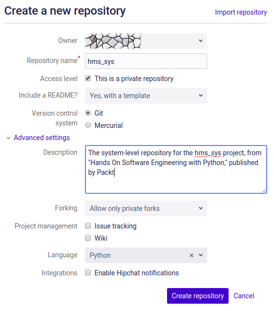

新存储库的设置如下：

+   所有者：拥有存储库的用户。如果多个用户通过 Bitbucket 帐户访问存储库，或者与之关联的组，这些用户和组将作为此设置的选项可用。

+   存储库名称：存储库的（必需）名称。理想情况下，存储库名称应该与其包含的系统或项目轻松关联起来，由于`hms_sys`既是整个项目的名称，而且尚未被使用，因此被使用。

+   访问级别：确定存储库是公共的还是私有的。由于`hms_sys`不打算供公众查阅或分发，因此存储库已被设置为私有。

+   包括 README？：系统是否将在创建过程中创建一个`README`文件。选项如下：

+   否：如果需要/希望，将需要手动创建文件。

+   是，带模板：创建一个带有最少信息的基本文件。选择此选项是为了创建一个基本的`README`文件。

+   是，有教程（适用于初学者）。

+   版本控制系统：允许存储库使用 Git 或 Mercurial 作为其 SCM 引擎。选择了 Git，因为这是我们决定使用的。

高级设置必须扩展才能使用，并且如下所示：

+   描述：如果选择了“是，带模板”选项，此处提供的任何描述都将添加到`README`文件中。

+   派生：控制是否/如何允许从存储库派生。选项如下：

+   允许派生：任何有权限的人都可以派生存储库

+   仅允许私有派生

+   不允许派生

+   项目管理：允许将问题跟踪和 wiki 系统与存储库集成。

+   语言：指定存储库中代码的主要编程语言。最初，此设置除了按其主要语言对存储库进行分类外，并不起作用。一些 SCM 提供商将使用语言设置来预先填充 Git 的`.gitignore`文件，其中包含常被忽略的文件模式，因此如果可能的话，指定它是有利的。

单击“创建存储库”按钮后，将创建存储库：

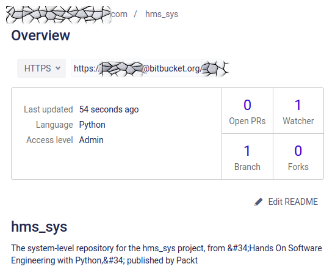

从任何存储库的概述页面，连接和克隆/拉取存储库的 HTTPS 和 SSH 选项都可用，有必要权限的任何人都可以克隆它（以任何首选方式）到本地副本进行操作：

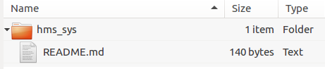有几种初始化新的 Git 存储库的方法。这个过程从存储库的提供者开始，确保存储库格式良好且可访问，同时允许进行一些初始配置和文档设置，以后不必手动完成。

此时，故事中的两项任务已解决：

1.  为系统创建一个空的 SCM 存储库——`hms_sys`。

1.  建立并分发开发团队成员访问存储库所需的凭据。由于存储库是通过外部服务提供商的界面创建的，因此访问所需的凭据是在那里管理的，任何与存储库的帐户或组相关联的用户帐户都具有他们需要的访问权限，或者可以通过提供商系统中的用户管理来获得访问权限。

剩下的任务，填充了基线信息和持续使用所需的文档，与尚未解决的项目结构有关，但仍然有一些可以解决的独立项目。

首先是在顶层存储库目录中创建和记录基本组件项目。最初，创建一个顶层项目，包含整个系统代码库可能是一个好主意——这将提供一个单一的项目，用于组织跨两个或多个组件项目的项目，以及涵盖整个系统的任何内容。

在 Geany 中，通过使用 Project → New 来完成，提供项目名称、项目文件路径和项目的基本路径：

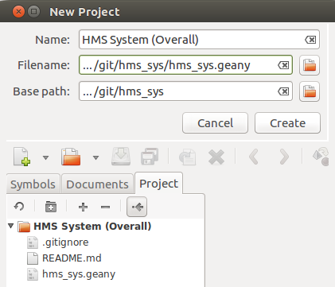

由于 Geany 项目文件存储可能因机器而异的文件系统路径，这些路径需要添加到 Git 的`.gitignore`文件中：

```py
# .gitignore for hms_sys project
# Geany project-files
*.geany
```

`.gitignore`文件最终是 Git 提交或推送代码到中央存储库时 Git 将忽略的文件和/或文件夹的列表。与`.gitignore`中路径匹配的任何文件或文件夹将不会被 SCM 跟踪。

此外，可能需要记录创建本地`hms_sys.geany`文件的说明，以便任何其他需要的开发人员可以根据需要创建。这类信息可以放入`README.md`文件中，并且在添加系统的组件项目时将进行类似的工作：

```py
# hms_sys

The system-level repository for the hms_sys project, from "Hands On 
Software Engineering with Python," published by Packt.

## Geany Project Set-up

Geany project-files (`*.geany`) are in the `.gitignore` for the entire 
repository, since they have filesystem-specific paths that would break 
as they were moved from one developer's local environment to another. 
Instructions for (re-)creating those projects are provided for each.

### HMS System (Overall) -- `hms_sys.geany`

This is an over-arching project that encompasses *all* of the component 
projects. It can be re-created by launching Geany, then using 
Project → New and providing:

 * *Name:* HMS System (Overall)
 * *Filename:* `[path-to-git-repo]/hms_sys/hms_sys.geany`
 * *Base path:* `[path-to-git-repo]/hms_sys`
```

一旦这些更改被暂存、本地提交并推送到主存储库，那里应该出现一个修订后的`README.md`文件和一个新的`.gitignore`，但不会出现`hms_sys.geany`项目文件：

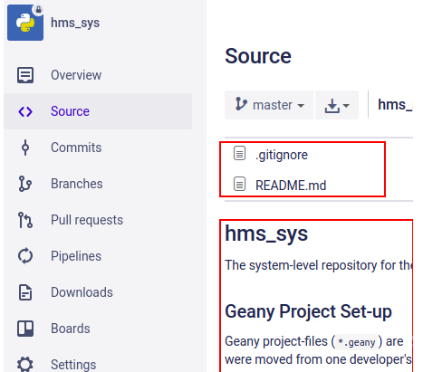

随着组件项目被添加到代码库中，应该遵循相同类型的文档和设置，产生类似的结果。此时，第一个故事的最终任务已经完成，如果被判定为完成并获得批准，那么它将被审查和关闭。

# 创建组件项目的存根

然后，进行下一个故事：

+   作为开发人员，我需要知道系统的完整结构是什么样子，至少在高层次上，这样我才能编写适合该结构的代码：

1.  分析用例和逻辑和物理架构，以定义组件项目的需求和结构。

1.  为每个确定的组件项目构建标准项目起点

1.  为每个组件项目实现一个最小的`setup.py`，完成源包构建

# 组件项目分析

逻辑架构以及[第六章](https://cdp.packtpub.com/hands_on_software_engineering_with_python/wp-admin/post.php?post=30&action=edit)的用例图，*开发工具和最佳实践*，指出了三个明显的组件项目，需要分别为以下内容进行核算：

+   工匠应用程序

+   工匠门户

+   审查/管理应用程序

这些组件项目中的每一个都需要访问一些常见的对象类型——它们都需要能够处理**产品**实例，并且它们中的大多数也需要能够处理**工匠**和**订单**实例：

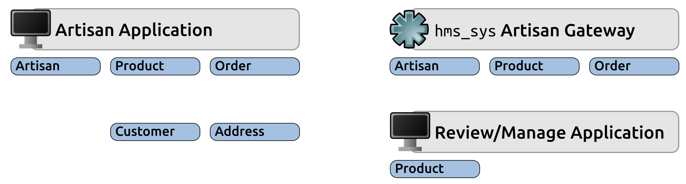

可能还有其他业务对象，从这个分解中并不立即显而易见，但是有任何业务对象的事实都表明可能需要第四个组件项目来收集提供这些业务对象及其功能的代码。考虑到这一点，初始的组件项目结构归结如下：

+   **HMS 核心**（`hms-core`）：一个类库，收集所有基线业务对象定义，以提供**工匠**、**产品**和**订单**等对象的表示

+   **中央办公室应用**（`hms-co-app`）：提供一个可执行的应用程序，允许中央办公室工作人员执行需要与**工匠**关于**产品**、**订单**以及可能其他项目进行通信的各种任务

+   **工匠应用**（`hms-artisan`）：提供一个可执行的本地应用程序，允许**工匠**管理**产品**和**订单**，根据需要与中央办公室进行通信

+   **HMS 工匠网关**（`hms-gateway`）：提供一个可执行服务，**工匠**应用程序和中央办公室应用程序用于在工匠和中央办公室之间发送信息

# 组件项目设置

关于`hms-core`代码将如何包含在需要它的其他项目的分发中，稍后将需要做出一些决定，但这些不需要立即解决，因此它们将被搁置。与此同时，为每个组件项目设置起点项目结构是下一步。目前，基本结构在所有四个组件项目中都是相同的；唯一的区别在于各种文件和目录的名称。

以`hms-core`为例，因为这是第一个逻辑上要开始工作的代码集，项目结构将如下所示：

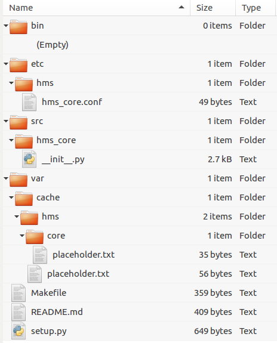

# 打包和构建过程

为项目设置最小标准的 Python 打包，并提供基本的构建过程，对之前讨论过的`setup.py`和`Makefile`文件几乎没有做出任何改变。在编写代码之前只有一些具体的内容可用：`setup.py`将使用的包名称和主包的顶级目录，以及可以添加到`Makefile`中的`setup.py`文件。`Makefile`的更改是最简单的：

```py
# Makefile for the HMS Core (hms-core) project

main: test setup
        # Doesn't (yet) do anything other than running the test and 
        # setup targets

setup:
        # Calls the main setup.py to build a source-distribution
        # python setup.py sdist

test:
        # Executes the unit-tests for the package, allowing the build-
        # process to die and stop the build if a test fails
```

`setup.py`文件，尽管它已经填充了一些起始数据和信息，但仍然基本上是我们之前看到的同样基本的起点文件：

```py
#!/usr/bin/env python

from setuptools import setup

# The actual setup function call:
setup(
    name='HMS-Core',
    version='0.1.dev0',
    author='Brian D. Allbee',
    description='',
    package_dir={
        '':'src',
        # ...
    },
    # Can also be automatically generated using 
    #     setuptools.find_packages...
    packages=[
        'hms_core',
        # ...
    ],
    package_data={
#        'hms_core':[
#            'filename.ext',
#            # ...
#        ]
    },
    entry_points={
#        'console_scripts':[
#            'executable_name = namespace.path:function',
#            # ...
#        ],
    },
)
```

这个结构暂时还不会包括核心包之外的各种目录和文件——在这一点上，没有迹象表明它们中的任何一个是必需的，因此它们的包含将被推迟，直到确实需要它们。即使没有这些，`setup.py`文件也可以成功构建和安装源分发包，尽管在构建过程中会抛出一些警告，并且安装的包目前还没有提供任何功能：

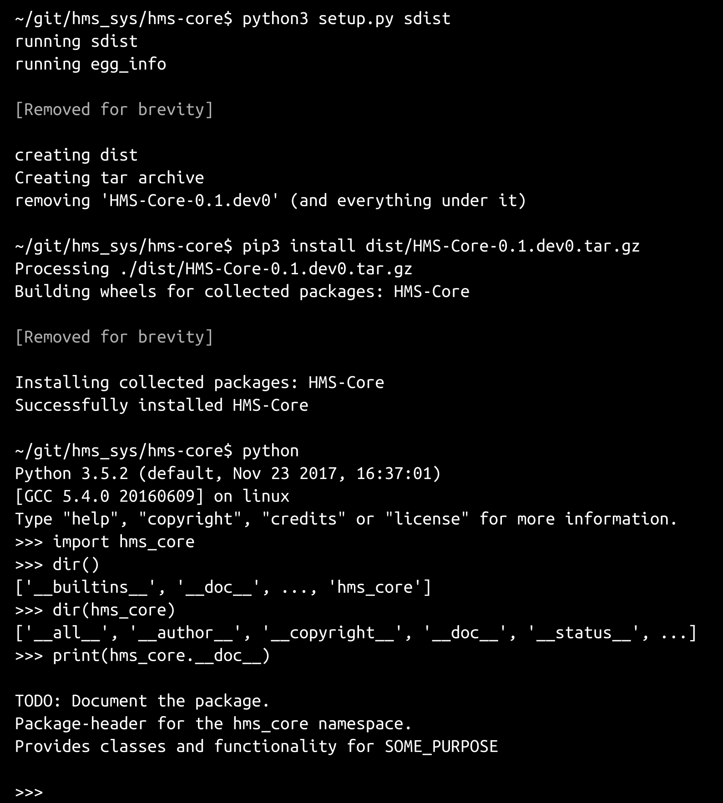

在更大（或至少更正式结构化）的开发商店中，组件项目的构建/打包过程可能需要适应不同环境的不同构建：

+   本地环境，比如开发人员的本地机器

+   一个共享的开发环境，所有开发人员的本地代码更改首先混合在一起

+   一个用于 QA 和更广泛的集成测试的共享测试服务器

+   使用真实的、类似生产的数据的用户验收测试服务器，可以用来向需要最终批准变更的人演示功能

+   具有完整生产数据副本访问权限的暂存环境，以便能够执行需要访问该数据集的负载和其他测试

+   live 环境/构建代码库

至少有一些潜力需要在这些不同的构建（`local`、`dev`、`test`、`stage`和`live`，用户验收构建暂时假定与阶段构建相同）之间进行重大区分。然而，在开发工作的这一阶段，实际上并没有什么可以区分的，因此唯一能做的就是计划如果需要时会发生什么。

在任何给定环境需要完全不同的包结构之前，当前的`setup.py`文件将保持不变。几乎不太可能存在一个环境特定的需求，这种需求在所有环境中都不常见。如果确实出现这种需求，那么方法将是为每个具有任何独特需求的环境创建一个单独的`setup.py`，并手动或通过`Makefile`执行该特定的`setup.py`。经过一些谨慎和思考，这应该可以将任何特定于环境的差异包含在一个单一位置，并以合理标准的方式进行。

这意味着`Makefile`将需要进行更改。具体来说，每个特定环境的构建过程（从`dev`到`live`）都需要一个目标，并且需要一种管理特定环境文件的方法。由于`make`过程可以操作文件，创建目录等，将使用以下策略：

+   通过为特定环境的文件添加构建目标/环境名称前缀来识别特定于环境的文件。例如，代码库中将有一个`dev-setup.py`文件，以及一个`test-setup.py`文件，依此类推。

+   修改`Makefile`以复制项目代码树中所有可以更改（和销毁）的相关文件，而不影响核心项目文件

+   添加一个过程，将在临时副本中查找并重命名所有特定于环境的文件，以满足特定环境的构建需求，并删除临时树中与构建无关的特定环境文件。

+   执行`setup.py`文件

对`Makefile`的更改将至少在起点上看起来像这样。

首先，定义一个通用的临时构建目录——本地构建将是默认的，并且将简单地执行标准的`setup.py`文件，就像原始过程一样

```py
# Makefile for the HMS Core (hms-core) project
TMPDIR=/tmp/build/hms_core_build

local: setup
 # Doesn't (yet) do anything other than running the test and 
 # setup targets

setup:
 # Calls the main setup.py to build a source-distribution
 ~/py_envs/hms/core/bin/python setup.py sdist

unit_test:
 # Executes the unit-tests for the package, allowing the build-
 # process to die and stop the build if a test fails
 ~/py_envs/hms/core/bin/python setup.py test
```

创建一个新的目标`build_dir`，用于创建临时构建目录，并将可以成为任何构建的项目文件复制到其中

```py
build_dir:
 # Creates a temporary build-directory, copies the project-files 
 # to it.
 # Creating "$(TMPDIR)"
 mkdir -p $(TMPDIR)
 # Copying project-files to $(TMPDIR)
 cp -R bin $(TMPDIR)
 cp -Ret cetera$(TMPDIR)
 cp -R src $(TMPDIR)
 cp -R var $(TMPDIR)
 cp setup.py $(TMPDIR)
```

为每个环境编写一个准备目标，以及每个环境的最终目标，将重命名和删除文件，并在临时构建目录中执行`setup.py`文件

```py
dev_prep:
 # Renames any dev-specific files so that they will be the "real" 
 # files included in the build.
 # At this point, there are none, so we'll just exit

dev: unit_test build_dir dev_prep
 # A make-target that generates a build intended to be deployed 
 # to a shared development environment.
 cd $(TMPDIR);~/py_envs/hms/core/bin/python setup.py sdist
```

因此，当针对此`Makefile`执行`make dev`时，`dev`目标运行`unit_test`目标，然后使用`build_dir`目标创建项目的临时副本。之后，使用`dev_prep`处理文件名更改和其他环境的文件删除。然后才会执行剩余的`setup.py`。

# Python 虚拟环境

最后要解决的任务是确定是否要为各个组件项目使用 Python 虚拟环境，如有需要则创建它们，并记录如何创建它们，以便其他开发人员在需要时能够复制它们。

鉴于组件项目之间的结构、对它们的了解以及预期安装代码与其他系统成员的交互方式，显然没有必要为不同的环境建立，甚至没有明显的优势。只要在开发过程中充分注意和遵守，确保每个组件项目的`setup.py`或其他构建过程工件或配置中添加了依赖关系，最有可能出现的最坏情况是在执行测试安装的过程中发现缺少的依赖关系。在其他方面没有错误的实时安装中，可能会出现一些微不足道的低效率，例如`hms-gateway`项目可能会安装数据库或 GUI 库，它不需要或不使用，或者两个组件项目可能都安装了其他用户安装的消息系统库，但并不需要。

这些都不会对单个组件项目的操作构成任何即将发生的威胁，但它们确实会将不必要的代码引入到安装中。如果不仔细观察和管理，不必要的库安装可能会大量增加，这可能成为未来安全问题的一个因素。更糟糕的是，任何潜在的安全问题可能不会被视为结果；如果没有人真正意识到某个程序安装了不需要的东西，那么直到为时已晚才会得到修复。

为了确保系统安全，可以采取的第一步是确保它们只安装了必要的功能。这样做不会覆盖所有可能性，但会减少保持当前补丁和安全问题所需的带宽。

逐个项目跟踪依赖关系是虚拟环境可以发挥作用的地方。这是为每个项目单独设置它们的一个优点。另一个支持这种做法的观点是，一些平台，如各种公共云，将需要能够在其部署过程中包含依赖包的能力，而虚拟环境将把它们很好地与核心系统安装包集分开。在这方面，虚拟环境也是一种未来的保障。

因此，在开发`hms_sys`的情况下，我们将为每个组件项目设置一个单独的虚拟环境。如果以后证明它们是不必要的，它们总是可以被删除的。创建、激活和停用它们的过程非常简单，并且可以在任何方便的地方创建——实际上没有标准位置——命令因操作系统而异，如下所示：

| 虚拟环境活动 | 操作系统 |
| --- | --- |
| Linux/MacOS/Unix | Windows |
| 创建 | `python3 -m venv ~/path/to-myenv` | `c:\>c:\Python3\python -m venv c:\path\to\myenv` |
| 激活 | `source ~/path/to-myenv/bin/activate` | `C:\> c:\path\to\myenv\Scripts\activate.bat` |
| 停用 | `deactivate` | `C:\> c:\path\to\myenv\Scripts\deactivate.bat` |

创建和激活虚拟环境后，可以像在虚拟环境之外一样使用`pip`（或`pip3`）在其中安装包。安装的包存储在虚拟环境的库中，而不是全局系统库中。

记录哪些虚拟环境与哪些组件项目相关，只是将创建它所需的命令复制到项目级文档的某个地方。对于`hms_sys`，这些将存储在每个组件项目的`README.md`文件中。

让我们回顾一下这个故事的任务：

+   分析用例，逻辑和物理架构，以定义组件项目的需求和结构——**完成**

+   为每个已识别的组件项目构建标准项目起点——**完成**

+   为每个组件项目实施一个最小的`setup.py`文件，完成源包构建—**完成**

+   确定是否要为组件项目使用 Python 虚拟环境，实施它们，并记录如何重现它们—**完成**

+   提供一个单元测试结构

在上一章的最后指出，尽管已经设定了对所有代码进行单元测试的期望，并且所有模块和类的公共成员都受到了该要求的约束，但也指出尚未定义任何测试策略细节，这正是本次迭代中单元测试故事的重要部分：

+   作为开发人员，我需要知道如何以及在何处为代码库编写单元测试，以便在编写代码后创建单元测试。我还需要确保代码经过彻底测试：

1.  定义单元测试标准/要求（覆盖率、按类型的标准值等）

1.  实施一个机制来强制执行这些标准

1.  定义单元测试代码将存放在组件项目结构中的何处

1.  为每个组件项目实施一个基本的顶层测试，以确保没有任何失败

这些单元测试材料的大部分内容都是从 Python 2.7.x 代码转换和改编而来的，关于这一点的讨论可以在作者的博客上找到（从[bit.ly/HOSEP-IDIC-UT](http://bit.ly/HOSEP-IDIC-UT)开始）。尽管该代码是为较旧版本的 Python 编写的，但可能还可以从那里的单元测试文章中获得额外的见解。

可以说，应该测试所有成员，而不仅仅是公共成员——毕竟，如果涉及到的代码在任何地方被使用，那么就应该在可预测行为方面也要符合相同的标准，是吗？从技术上讲，没有理由不能这样做，特别是在 Python 中，受保护和私有类成员实际上并不受保护或私有——它们只是按照惯例被视为这样——在 Python 的早期版本中，受保护的成员是可以访问的，而私有成员（以两个下划线作为前缀：`__private_member`）在派生类中是不能直接访问的，除非通过它们的变形名称来调用。在 Python 3 中，尽管名称修饰仍在起作用，但在语言级别上不再强制执行名义上的受保护或私有范围。这很快就可以证明。考虑以下类定义：

```py
class ExampleParent:

    def __init__(self):
        pass

    def public_method(self, arg, *args, **kwargs):
        print('%s.public_method called:' % self.__class__.__name__)
        print('+- arg ...... %s' % arg)
        print('+- args ..... %s' % str(args))
        print('+- kwargs ... %s' % kwargs)

    def _protected_method(self, arg, *args, **kwargs):
        print('%s._protected_method called:' % self.__class__.__name__)
        print('+- arg ...... %s' % arg)
        print('+- args ..... %s' % str(args))
        print('+- kwargs ... %s' % kwargs)

    def __private_method(self, arg, *args, **kwargs):
        print('%s.__private_method called:' % self.__class__.__name__)
        print('+- arg ...... %s' % arg)
        print('+- args ..... %s' % str(args))
        print('+- kwargs ... %s' % kwargs)

    def show(self):
        self.public_method('example public', 1, 2, 3, key='value')
        self._protected_method('example "protected"', 1, 2, 3, key='value')
        self.__private_method('example "private"', 1, 2, 3, key='value')
```

如果我们创建`ExampleParent`的一个实例，并调用它的`show`方法，我们期望看到所有三组输出，这正是发生的：

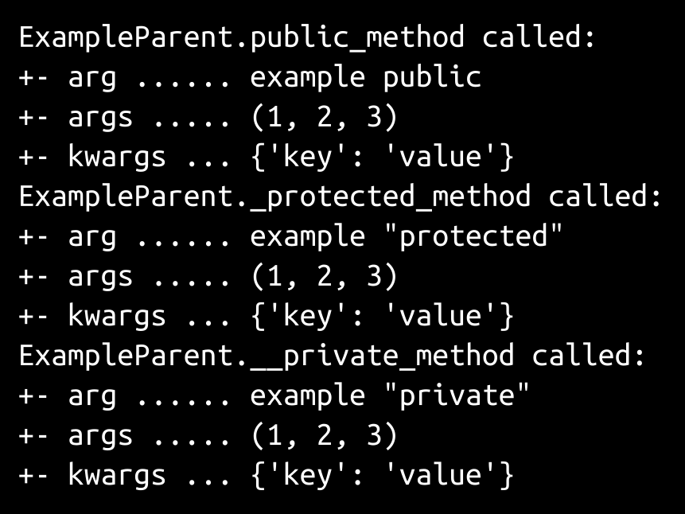

如果使用`dir(ExampleParent)`检查`ExampleParent`类结构，可以看到所有三种方法：['`_ExampleParent__private_method`', …, '`_protected_method`', '`public_method`', …]。在 Python 的早期版本中，从`ExampleParent`派生的类仍然可以访问`public_method`和`_protected_method`，但如果通过该名称调用`__private_method`，则会引发错误。在 Python 3（以及一些较新版本的 Python 2.7.x）中，情况已经不再是这样了。

```py
class ExampleChild(ExampleParent):
    pass
```

创建这个类的一个实例，并调用它的`show`方法会产生相同的结果：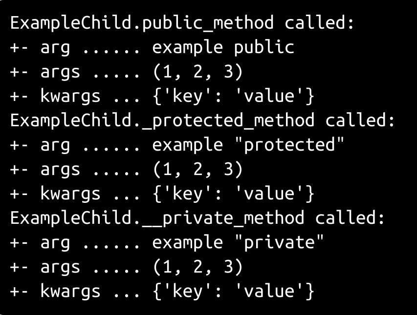

从技术上讲，那么 Python 类的所有成员都是公共的。

那么，从定义单元测试策略的角度来看，如果所有类成员都是公共的，这意味着什么？如果遵守了公共/受保护/私有的约定，那么以下内容适用：

+   公共成员应该在与它们定义的类相对应的测试套件中进行测试（它们的原始类）

+   大多数受保护的成员可能打算被派生类继承，并且应该在与定义它们的类相对应的测试套件中进行深入测试

+   私有成员应该被视为真正的私有成员——在其原始类之外根本不可访问——或者被视为可能发生突发变化而无需警告的实现细节

+   继承成员不需要再次进行任何测试，因为它们已经针对其原始类进行了测试

+   从其父类重写的成员将在与其被重写的类相关的套件中进行测试

建立一个适用于所有这些规则的单元测试过程是可能的，尽管它相当复杂且足够实质性，以至于将其封装在某种可重复使用的函数或类中将非常有利，这样它就不必在每个测试过程中重新创建，或者在测试策略发生变化时在数十甚至数百个副本中进行维护。最终目标是拥有一个可重复的测试结构，可以快速轻松地实现，这意味着它也可以以与先前模块和包头部相同的方式进行模板化。

首先，我们需要一些东西来测试。具体来说，我们需要具有方法的类，这些方法属于先前指出的类别：

+   本地定义

+   从父类继承

+   从父类重写

这涵盖了所有公共/受保护/私有选项。虽然先前没有明确提到，但我们还应该包括一个至少有一个抽象方法的类。它们仍然是类，也需要进行测试；只是还没有被讨论过。它们不需要非常复杂来说明测试过程，尽管它们应该返回可测试的值。考虑到所有这些，这里是一组简单的类，我们将用它们来进行测试，并生成核心测试过程：

这些文件位于`hms_sys`代码库中，位于顶层`scratch-space`目录中。

```py
import abc

class Showable(metaclass=abc.ABCMeta):
    @abc.abstractmethod
    def show(self):
        pass

class Parent(Showable):

    _lead_len = 33

    def __init__(self, arg, *args, **kwargs):
        self.arg = arg
        self.args = args
        self.kwargs = kwargs

    def public(self):
        return (
            ('%s.arg [public] ' % self.__class__.__name__).ljust(
                self.__class__._lead_len, '.') + ' %s' % self.arg
            )

    def _protected(self):
        return (
            ('%s.arg [protected] ' % self.__class__.__name__).ljust(
                self.__class__._lead_len, '.') + ' %s' % self.arg
            )

    def __private(self):
        return (
            ('%s.arg [private] ' % self.__class__.__name__).ljust(
                self.__class__._lead_len, '.') + ' %s' % self.arg
            )

    def show(self):
        print(self.public())
        print(self._protected())
        print(self.__private())

class Child(Parent):
    pass

class ChildOverride(Parent):

    def public(self):
        return (
            ('%s.arg [PUBLIC] ' % self.__class__.__name__).ljust(
                self.__class__._lead_len, '.') + ' %s' % self.arg
            )

    def _protected(self):
        return (
            ('%s.arg [PROTECTED] ' % self.__class__.__name__).ljust(
                self.__class__._lead_len, '.') + ' %s' % self.arg
            )
```

```py
    def __private(self):
        return (
            ('%s.arg [PRIVATE] ' % self.__class__.__name__).ljust(
                self.__class__._lead_len, '.') + ' %s' % self.arg
            )
```

创建每个具体类的快速实例，并调用每个实例的`show`方法，显示预期的结果：

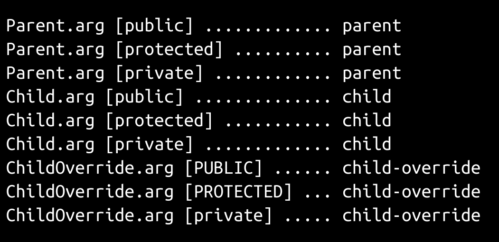

# 基本单元测试

Python 中的单元测试由内置的`unittest`模块支持。可能还有其他模块也提供单元测试功能，但`unittest`是 readily available 的，它默认安装在 Python 虚拟环境中，并且至少作为起点，提供了我们所需的所有测试功能。先前类的初始测试模块非常简单，即使它除了定义适用于被测试代码的测试用例类之外，什么也没做：

```py
#!/usr/bin/env python

import unittest

class testShowable(unittest.TestCase):
    pass

class testParent(unittest.TestCase):
    pass

class testChild(unittest.TestCase):
    pass

class testChildOverride(unittest.TestCase):
    pass

unittest.main()
```

以`test`开头的每个类（并且派生自`unittest.TestCase`）将由模块末尾的`unittest.main()`调用实例化，并且这些类中以`test`开头的每个方法都将被执行。如果我们向其中一个添加测试方法，例如`testParent`，并按以下方式运行测试模块：

```py
class testParent(unittest.TestCase):
    def testpublic(self):
        print('### Testing Parent.public')
    def test_protected(self):
        print('### Testing Parent._protected')
    def test__private(self):
        print('### Testing Parent.__private')
```

可以看到测试方法的执行：

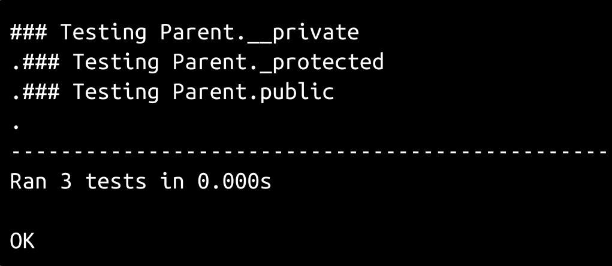

如果`print()`调用被替换为`pass`，如下面的代码所示，输出会更简单，对于每个执行而不引发错误的测试用例的测试方法，会打印一个句点：

```py
class testParent(unittest.TestCase):
    def testpublic(self):
        pass
    def test_protected(self):
        pass
    def test__private(self):
        pass
```

执行时，会产生以下结果：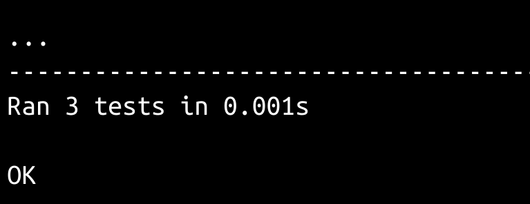

到目前为止，一切都很顺利；我们有可以执行的测试，所以下一个问题是如何应用我们想要应用的测试策略规则。第一个策略，为每个源模块拥有一个测试模块，是项目结构的一个方面，而不是与测试执行流程相关的一个方面。为了解决这个问题，我们真正需要做的就是定义在任何给定项目中测试代码将存放的位置。由于我们知道我们将来会想要在构建过程中运行测试，我们需要有一个公共的测试目录，一个刚好在其中的文件（称之为`run_tests.py`）可以按需运行项目的所有测试，以及一个测试目录和文件结构，该结构对该文件应该是可访问的，这最终看起来像是`hms_core`组件项目的这样：

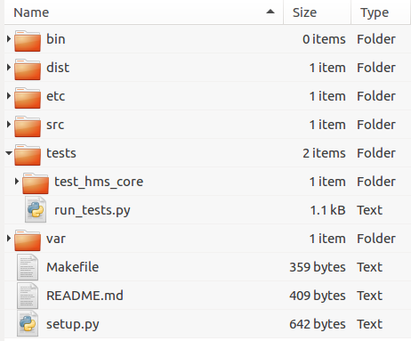

# 识别缺失的测试用例类

早些时候指出的测试目标的平衡都需要能够检查被测试的代码，以识别需要进行测试的模块成员，以及这些成员的成员。这可能听起来令人生畏，但 Python 提供了一个专门用于此目的的模块：`inspect`。它提供了一系列非常强大的函数，可以用于在运行时检查 Python 代码，这可以用来生成成员名称的集合，进而用于确定高级测试覆盖是否符合我们正在建立的标准。

为了说明，我们需要测试的前述类将被保存在一个名为`me.py`的模块中，这使它们可以被导入，每一步展示关于`me`模块的所需信息的过程都将被收集在`inspect_me.py`中，如此所示。相应的测试用例将存在于`test_me.py`中，它将首先作为一个几乎空白的文件开始——一开始不会在那里定义任何测试用例类。

第一步是识别我们将需要测试用例类的`me`的目标成员。就目前而言，我们所需要的只是目标模块中的类的列表，可以按如下方式检索：

```py
#!/usr/bin/env python

import inspect

import me as target_module

target_classes = set([
    member[0] for member in 
    inspect.getmembers(target_module, inspect.isclass)
])
# target_classes = {
#   'Child', 'ChildOverride', 'Parent', 'Showable'
# } at this point
```

一步一步，正在发生的是这样的：

1.  正在导入`inspect`模块。

1.  正在导入`me`模块，使用`target_module`作为其默认模块名的覆盖——我们希望能够保持导入的模块名称可预测且相对恒定，以便在以后更容易地重用，而这从这里开始。

1.  对`target_module`调用`inspect`的`getmembers`函数，使用`isclass`作为过滤谓词。这将返回一个类似`('ClassName', <class object>)`的元组列表。这些结果通过列表推导提取出只有类名的列表，并将该列表传递给 Python 的`set`，以产生发现的类名的正式集合。

Python 的`set`类型是一种非常有用的基本数据类型，它提供了一个可迭代的值集合，这些值是不同的（在集合中从不重复），并且可以与其他集合合并（使用`union`），从其他集合中删除其成员（使用`difference`），以及一系列其他操作，这些操作都符合标准集合理论的预期。

有了这些名称，创建一组预期的测试用例类名就很简单了：

```py
expected_cases = set([
    'test%s' % class_name 
    for class_name in target_classes
    ]
)
# expected_cases = {
#   'testChild', 'testShowable', 'testChildOverride', 
#   'testParent'
# } at this point
```

这只是另一个列表推导，它构建了一个以`test`开头的类名集合，从目标类名集合中。与收集目标模块中的类名的方法类似，可以用类似的方法找到存在于`test_me.py`模块中的测试用例类：

```py
import unittest

import test_me as test_module

test_cases = set([
    member[0] for member in 
    inspect.getmembers(test_module, inspect.isclass)
    if issubclass(member[1], unittest.TestCase)
])
# test_cases, before any TestCase classes have been defined, 
# is an empty set
```

除了对每个找到的成员进行`issubclass`检查，这将限制集合的成员为从`unittest.TestCase`派生的类的名称，这与构建初始`target_classes`集合的过程完全相同。现在我们有了收集预期和实际定义的内容的集合，确定需要创建的测试用例类是一个简单的事情，只需从预期的集合中删除已定义的测试用例名称：

```py
missing_tests = expected_cases.difference(test_cases)
# missing_tests = {
#   'testShowable', 'testChild', 'testParent', 
#   'testChildOverride'
# }
```

如果`missing_tests`不为空，则其名称集合代表需要创建的测试用例类名称，以满足“所有成员将被测试”的政策的第一部分。此时对结果的简单打印就足够了：

```py
if missing_tests:
    print(
        'Test-policies require test-case classes to be '
        'created for each class in the code-base. The '
        'following have not been created:\n * %s' % 
        '\n * '.join(missing_tests)
    )
```

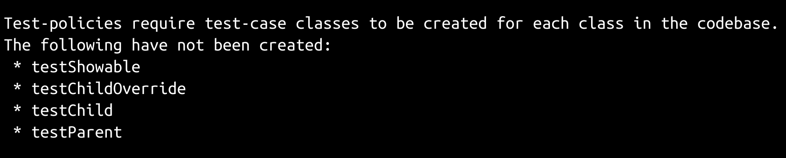

已经确定了需要创建的缺失的测试用例类项，它们可以添加到`test_me.py`中：

```py
#!/usr/bin/env python

import unittest

class testChild(unittest.TestCase):
    pass

class testChildOverride(unittest.TestCase):
    pass

class testParent(unittest.TestCase):
    pass

class testShowable(unittest.TestCase):
    pass

if __name__ == '__main__':
    unittest.main()
```

一旦它们被添加（并且一旦从`unittest.TestCase`派生出子类，因为之前执行了识别实际测试用例类的检查），就不再有需要解决的缺失的测试用例。

类似的方法也可以用于识别应该进行测试的模块级函数——毕竟，它们也是模块的公共成员，而政策关注的正是模块的公共成员。对函数或任何其他可调用元素进行测试的实际实现将遵循稍后为类方法建立的结构和过程。

实际上，可能无法轻松使用这种类型的过程识别的唯一公共成员是未受管理的属性——在模块级别创建的模块常量或变量。尽管这些仍然可以进行测试，并且可以说应该进行测试，但它们是未受管理的，可以在运行时更改，而没有任何检查来确保它们不会在后续某个地方出现问题，这可能会使围绕它们的任何正式测试政策几乎成为一种浪费时间。也就是说，测试它们并没有坏处，即使只是为了确保对它们的更改（有意或意外的）不会被忽视并在以后引发问题和错误。

# 识别缺失的测试方法

之前用于识别模块中的类的`inspect.getmembers`函数也可以用于识别其他目标元素的其他成员类型，例如类的属性和方法。识别任一成员的过程与之前已经展示的识别模块中的类的过程类似，看起来像这样（对于属性）：

```py
target_class = target_module.Parent

target_properties = set([
    member[0] for member in 
    inspect.getmembers(target_class, inspect.isdatadescriptor)
])
# target_properties = {'__weakref__'}
```

与在模块中查找类的过程的唯一显著差异是被检查的目标（在这种情况下是`target_class`，我们已将其设置为`Parent`类）和谓词（`inspect.isdatadescriptor`），它将结果过滤为数据描述符——受控属性或正式属性。

在第六章 *开发工具和最佳实践*中，当讨论和定义各种内部代码标准时，注意到使用受控属性/属性的一个重要方面是对于单元测试目的的重要性：知道为任何给定属性测试的值类型。这是采用这种方法的另一个优势：使用内置的`property()`函数定义的类属性可以被检测为需要测试的类成员。尽管未受管理的属性可能是可检测的，但可能不容易识别为需要测试的类的成员，并且几乎可以肯定这种识别几乎肯定不是可以自动化的。

类似的`inspect.getmembers`调用可以用于识别类方法：

```py
target_functions = set([
    member[0] for member in 
    inspect.getmembers(target_class, inspect.isfunction)
])
target_methods = set([
    member[0] for member in 
    inspect.getmembers(target_class, inspect.ismethod)
])
target_methods = target_methods.union(target_functions)
# target_methods = {
#   '_Parent__private', 'public', 'show', 
#   '_protected', '__init__'
# }
```

这两个成员名称集合都包括测试策略不要求测试的项目，尽管`__weakref__`属性是所有类的内置属性，而`_Parent__private`方法条目与我们最初的`__private`方法相关联，这两者都不需要包含在我们所需测试方法的列表中。通过简单地添加对属性列表名称中前导`__`的检查，可以实现一些基本的过滤（因为根据我们的测试策略，我们永远不会测试私有属性）。这将处理掉测试列表中的`__weakref__`，并允许公共和受保护的属性出现。

在向`Parent`添加属性声明（`prop`）并添加过滤条件后，我们将得到以下结果：

```py
target_properties = set([
    member[0] for member in 
    inspect.getmembers(target_class, inspect.isdatadescriptor)
    if not member[0].startswith('__')
])
# target_properties = {'prop'}
```

然而，同样的方法并不适用于查找需要测试的类方法；一些常见的方法，比如`__init__`，其名称会基于名称进行过滤，但是我们希望确保需要测试的成员。这种简单的基于名称的过滤也无法处理不包括在类中但在该类中没有定义的成员名称，比如`Child`类的所有属性和成员。虽然基于名称的过滤是朝着正确方向迈出的一步，但感觉是时候退一步，看看更广泛的解决方案，一个能考虑成员定义位置的解决方案。

这涉及以更复杂的方式构建测试名称列表，并注意每个类的**方法解析顺序**（**MRO**），这可以在类的内置`__mro__`属性中找到。我们将从定义一个空集开始，并获取类的 MRO，然后获取与目标类相同的属性名称列表：

```py
property_tests = set()
sourceMRO = list(target_class.__mro__)
sourceMRO.reverse()
# Get all the item's properties
properties = [
    member for member in inspect.getmembers(
        target_class, inspect.isdatadescriptor)
    if member[0][0:2] != '__'
]
# sourceMRO = [
#   <class 'object'>, <class 'me.Showable'>, 
#   <class 'me.Parent'>
# ]
```

我们还需要跟踪属性的定义位置，即它来自哪个类，以及属性的实际实现。我们希望从每个完整的数据结构开始，将名称与源类和最终实现关联起来，但最初用`None`值初始化。这将允许最终的结构在填充后用于识别类的成员，这些成员在那里没有定义：

```py
propSources = {}
propImplementations = {}
for name, value in properties:
    propSources[name] = None
    propImplementations[name] = None
# Populate the dictionaries based on the names found
for memberName in propSources:
    implementation = target_class.__dict__.get(memberName)
    if implementation and propImplementations[memberName] != implementation:
        propImplementations[memberName] = implementation
        propSources[memberName] = target_class
# propImplementations = {
#   "prop": <property object at 0x7fa2f0edeb38>
# }
# propSources = {
#   "prop": <class 'me.Parent'>
# }
# If the target_class is changed to target_module.Child:
# propImplementations = {
#   "prop": None    # Not set because prop originates in Parent
# }
# propSources = {
#   "prop": None    # Also not set for the same reason
# }
```

有了这些数据，生成所需属性测试方法列表与之前显示的所需测试用例类列表类似：

```py
property_tests = set(
    [
        'test%s' % key for key in propSources 
        if propSources[key] == target_class
    ]
)
# property_tests = {'testprop'}
# If the target_class is changed to target_module.Child:
# property_tests = set()
```

获取和筛选类的方法成员的过程几乎相同，尽管我们将包括所有成员，甚至是以`__`开头的成员，并获取函数或方法，以确保包括类和静态方法。

```py
method_tests = set()
sourceMRO = list(target_class.__mro__)
sourceMRO.reverse()
# Get all the item's methods
methods = [
    member for member in inspect.getmembers(
        target_class, inspect.isfunction)
] + [
    member for member in inspect.getmembers(
        target_class, inspect.ismethod)
]
```

用于跟踪方法源和实现的`dict`项的构建过程可以主动跳过本地、私有成员以及已定义为抽象的成员：

```py
methSources = {}
methImplementations = {}
for name, value in methods:
    if name.startswith('_%s__' % target_class.__name__):
        # Locally-defined private method - Don't test it
        continue
    if hasattr(value, '__isabstractmethod__') and value.__isabstractmethod__:
        # Locally-defined abstract method - Don't test it
        continue
    methSources[name] = None
    methImplementations[name] = None
```

测试名称列表生成的平衡是相同的：

```py
method_tests = set(
    [
        'test%s' % key for key in methSources 
        if methSources[key] == target_class
    ]
)
# method_tests = {
#   'testpublic', 'test__init__', 'test_protected', 
#   'testshow'
# }
# If the target_class is changed to target_module.Child:
# method_tests = set()
# If the target_class is changed to target_module.Showable:
# method_tests = set()
```

那么，从所有这些探索中得出了什么结论？简而言之，它们如下：

+   可以自动化检测模块的成员应该需要创建测试用例

+   虽然可以自动化验证所需的测试用例是否存在于与给定源模块对应的测试模块中，但仍需要一些纪律来确保创建测试模块

+   可以自动化检测对于任何给定的测试用例/源类组合需要哪些测试方法，并且可以在不需要测试私有和抽象成员的情况下进行

尽管这是相当多的代码。大约 80 行，没有一些实际测试类成员和问题公告，以及剥离所有注释后。这比应该被复制和粘贴的代码要多得多，尤其是对于具有高破坏潜力或影响的流程。最好能够将所有内容都保存在一个地方。幸运的是，`unittest`模块的类提供了一些选项，可以使逐模块的代码覆盖测试变得非常容易——尽管这将首先需要一些设计和实现。

# 创建可重用的模块代码覆盖测试

一个良好的单元测试框架不仅允许为代码元素的成员创建测试，还提供了在运行任何测试之前以及在所有测试执行成功或失败后执行代码的机制。Python 的`unittest`模块在各个`TestCase`类中处理这一点，允许类实现`setUpClass`和`tearDownClass`方法来分别处理测试前和测试后的设置和拆卸。

这意味着可以创建一个测试类，该类可以被导入，扩展具有特定于模块的属性，并添加到测试模块中，该测试模块可以利用刚刚显示的所有功能来执行以下操作：

+   查找目标模块中的所有类和函数

+   确定测试模块中需要存在哪些测试用例类，并测试它们以确保它们存在

+   确定每个源模块成员的测试用例类需要存在哪些测试，以满足我们的单元测试政策和标准。

+   检查这些测试方法是否存在

代码覆盖测试用例类将需要知道要检查哪个模块以找到所有信息，但它应该能够自行管理其他所有内容。最终，它将定义自己的一个测试，以确保源模块中的每个类或函数在测试模块中都有一个相应的测试用例类：

```py
def testCodeCoverage(self):
    if not self.__class__._testModule:
        return
    self.assertEqual([], self._missingTestCases, 
        'unit testing policies require test-cases for all classes '
        'and functions in the %s module, but the following have not '
        'been defined: (%s)' % (
            self.__class__._testModule.__name__, 
            ', '.join(self._missingTestCases)
        )
    )
```

它还需要能够提供一种机制，以允许检查属性和方法测试方法。如果可以实现的话，以完全自动化的方式进行这样的检查是很诱人的，但可能有些情况会比值得的麻烦。至少目前，通过创建一些装饰器来使这些测试附加到任何给定的测试用例类变得容易，这些测试将被添加到可用的测试中。

Python 的装饰器本身是一个相当详细的主题。现在，不要担心它们是如何工作的，只要知道它们的使用方式，并相信它们是有效的。

我们的起点只是一个从`unittest.TestCase`派生的类，该类定义了前面提到的`setUpClass`类方法，并对定义的类级`_testModule`属性进行了一些初始检查——如果没有测试模块，那么所有测试应该简单地跳过或通过，因为没有任何被测试的内容：

```py
class ModuleCoverageTest(unittest.TestCase):
    """
A reusable unit-test that checks to make sure that all classes in the 
module being tested have corresponding test-case classes in the 
unit-test module where the derived class is defined.
"""
@classmethod
def setUpClass(cls):
    if not cls._testModule:
        cls._missingTestCases = []
        return
```

`@classmethod`行是内置的类方法装饰器。

我们需要首先找到目标模块中所有可用的类和函数：

```py
cls._moduleClasses = inspect.getmembers(
     cls._testModule, inspect.isclass)
cls._moduleFunctions = inspect.getmembers(
     cls._testModule, inspect.isfunction)
```

我们将跟踪被测试模块的名称作为类和函数成员的额外检查标准，以防万一：

```py
cls._testModuleName = cls._testModule.__name__
```

跟踪类和函数测试的机制类似于初始探索中的源和实现字典：

```py
cls._classTests = dict(
   [
       ('test%s' % m[0], m[1]) 
       for m in cls._moduleClasses
       if m[1].__module__ == cls._testModuleName
   ]
)
cls._functionTests = dict(
   [
       ('test%s' % m[0], m[1]) 
       for m in cls._moduleFunctions
       if m[1].__module__ == cls._testModuleName
   ]
)
```

所需测试用例类名称的列表是所有类和函数测试用例类名称的聚合列表：

```py
cls._requiredTestCases = sorted(
   list(cls._classTests.keys()) + list(cls._functionTests.keys())
)
```

实际测试用例类的集合将稍后用于测试：

```py
cls._actualTestCases = dict(
    [
      item for item in 
      inspect.getmembers(inspect.getmodule(cls), 
      inspect.isclass) 
    if item[1].__name__[0:4] == 'test'
       and issubclass(item[1], unittest.TestCase)
    ]
)
```

接下来，我们将生成缺少的测试用例名称列表，该列表由类`testCodeCoverage`测试方法使用：

```py
cls._missingTestCases = sorted(
   set(cls._requiredTestCases).difference(
       set(cls._actualTestCases.keys())))
```

此时，该单独的测试方法将能够执行，并且会输出指示缺少哪些测试用例的输出。如果我们将`test_me.py`模块写成如下形式：

```py
from unit_testing import ModuleCoverageTest

class testmeCodeCoverage(ModuleCoverageTest):
    _testModule = me

if __name__ == '__main__':
    unittest.main()
```

然后在执行后，我们将得到以下结果：

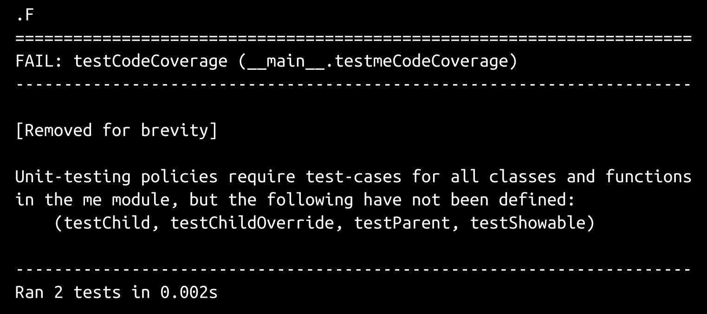

要使顶层代码覆盖测试通过，只需添加缺少的测试用例类：

```py
class testmeCodeCoverage(ModuleCoverageTest):
    _testModule = me

class testChild(unittest.TestCase):
    pass

class testChildOverride(unittest.TestCase):
    pass

class testParent(unittest.TestCase):
    pass

class testShowable(unittest.TestCase):
    pass

if __name__ == '__main__':
    unittest.main()
```

这种以主动方式确保代码覆盖率的方法非常适合使单元测试变得不那么麻烦。如果编写测试的过程始于一个通用测试，该测试将告诉测试开发人员在每一步中缺少了什么，那么编写测试的整个过程实际上就是重复以下步骤，直到没有测试失败为止：

+   执行测试套件

+   如果有测试失败，进行必要的代码更改以使最后一个测试通过。

+   如果是缺少测试失败，添加必要的测试类或方法

+   如果是因为源代码中的代码而失败，请在验证所涉及的测试值应该通过后相应地更改

继续前进！

为了能够测试测试模块中所有测试用例类中缺少的属性和方法测试，我们需要找到它们并按类进行跟踪。这基本上与我们之前发现的过程相同，但存储的值必须能够按类名检索，因为我们希望单个覆盖测试实例检查所有源代码和测试用例类，因此我们将它们存储在两个字典中，`propSources`用于每个的源，`propImplementations`用于实际的功能对象：

```py
cls._propertyTestsByClass = {}
for testClass in cls._classTests:
    cls._propertyTestsByClass[testClass] = set()
    sourceClass = cls._classTests[testClass]
    sourceMRO = list(sourceClass.__mro__)
    sourceMRO.reverse()
    # Get all the item's properties
    properties = [
         member for member in inspect.getmembers(
               sourceClass, inspect.isdatadescriptor)
            if member[0][0:2] != '__'
         ]
    # Create and populate data-structures that keep track of where 
    # property-members originate from, and what their implementation 
    # looks like. Initially populated with None values:
    propSources = {}
    propImplementations = {}
    for name, value in properties:
        propSources[name] = None
        propImplementations[name] = None
     for memberName in propSources:
        implementation = sourceClass.__dict__.get(memberName)
        if implementation \
           and propImplementations[memberName] != implementation:
               propImplementations[memberName] = implementation
               propSources[memberName] = sourceClass
         cls._propertyTestsByClass[testClass] = set(
            [
               'test%s' % key for key in propSources 
               if propSources[key] == sourceClass
            ]
)
```

方法测试的获取方式与之前的探索方式相同：

```py
cls._methodTestsByClass = {}
for testClass in cls._classTests:
    cls._methodTestsByClass[testClass] = set()
    sourceClass = cls._classTests[testClass]
    sourceMRO = list(sourceClass.__mro__)
    sourceMRO.reverse()
# Get all the item's methods
methods = [
   member for member in inspect.getmembers(
          sourceClass, inspect.ismethod)
   ] + [
   member for member in inspect.getmembers(
          sourceClass, inspect.isfunction)
   ]
# Create and populate data-structures that keep track of where 
# method-members originate from, and what their implementation 
# looks like. Initially populated with None values:
methSources = {}
methImplementations = {}
for name, value in methods:
    if name.startswith('_%s__' % sourceClass.__name__):
       # Locally-defined private method - Don't test it
         continue
    if hasattr(value, '__isabstractmethod__') \
       and value.__isabstractmethod__:
       # Locally-defined abstract method - Don't test it
         continue                methSources[name] = None
       methImplementations[name] = None
  for memberName in methSources:
       implementation = sourceClass.__dict__.get(memberName)
          if implementation \
             and methImplementations[memberName] != implementation:
             methImplementations[memberName] = implementation
             methSources[memberName] = sourceClass
   cls._methodTestsByClass[testClass] = set(
        [
            'test%s' % key for key in methSources 
            if methSources[key] == sourceClass
        ]
)
```

一旦执行了最后两个代码块，代码覆盖测试类将完整地列出测试模块中每个测试用例类所需的所有测试方法。属性测试集合（`cls._propertyTestsByClass`）是稀疏的，因为与任何类相关联的属性只有一个，即`Parent.prop`：

```py
{
    "testChild": set(),
    "testChildOverride": set(),
    "testParent": {"testprop"},
    "testShowable": set()
}
```

方法测试结构（`cls._methodTestsByClass`）有更多内容，准确地表示了`ChildOverride`类中的`public`和`_protected`方法需要它们自己的测试方法，并且`Showable`中的抽象`show`方法不需要被测试：

```py
{
    "testChild": set(),
    "testChildOverride": {
        "test_protected", "testpublic"
    },
    "testParent": {
        "test__init__", "test_protected", 
        "testpublic", "testshow"
    },
    "testShowable": set()
}
```

这些数据是处理所需属性和方法测试的所有内容。剩下的就是想出一种方法将它们附加到每个测试用例类上。

# 属性和方法测试装饰器

装饰器可以被视为接受另一个函数作为参数，并在装饰的函数周围扩展或包装其他功能的函数，而不实际修改它。任何可调用的东西——函数、类的实例方法或（在本例中）属于类的类方法——都可以用作装饰函数。在这种情况下，代码覆盖测试用例类将使用装饰器函数结构定义两个类方法（`AddPropertyTesting`和`AddMethodTesting`），以便向使用它们进行装饰的任何类添加新方法（`testPropertyCoverage`和`testMethodCoverage`）。由于这两个方法是主代码覆盖类的嵌套成员，它们可以访问类中的数据，特别是生成的所需属性和方法测试名称列表。此外，因为它们是装饰函数本身的嵌套成员，它们将可以访问这些方法中的变量和数据。

这两个装饰器方法几乎是相同的，除了它们的名称、消息和它们查找数据的位置，因此只详细介绍第一个`AddMethodTesting`。该方法首先检查以确保它是`ModuleCoverageTest`类的成员，这确保了它要查看的数据仅限于与源代码和测试模块相关的数据：

```py
@classmethod
def AddMethodTesting(cls, target):
    if cls.__name__ == 'ModuleCoverageTest':
        raise RuntimeError('ModuleCoverageTest should be extended '
            'into a local test-case class, not used as one directly.')
    if not cls._testModule:
        raise AttributeError('%s does not have a _testModule defined '
          'as a class attribute. Check that the decorator-method is '
          'being called from the extended local test-case class, not '
          'from ModuleCoverageTest itself.' % (cls.__name__))
```

函数开始时传入的`target`参数是一个`unittest.TestCase`类（尽管它没有明确进行类型检查）。

它还需要确保要使用的数据是可用的。如果不可用，无论出于什么原因，都可以通过显式调用刚刚定义的`setUpClass`方法来解决：

```py
try:
   if cls._methodTestsByClass:
      populate = False
    else:
        populate = True
except AttributeError:
    populate = True
if populate:
    cls.setUpClass()
```

下一步是定义一个函数实例来实际执行测试。这个函数被定义得好像它是类的成员，因为在装饰过程完成时它将成为类的成员，但因为它嵌套在装饰器方法内部，所以它可以访问并保留到目前为止在装饰器方法中定义的所有变量和参数的值。其中最重要的是`target`，因为它将被装饰的类。`target`值本质上附加到正在定义/创建的函数上：

```py
def testMethodCoverage(self):
    requiredTestMethods = cls._methodTestsByClass[target.__name__]
    activeTestMethods = set(
      [
          m[0] for m in 
          inspect.getmembers(target, inspect.isfunction)
          if m[0][0:4] == 'test'
      ]
    )
    missingMethods = sorted(
        requiredTestMethods.difference(activeTestMethods)
    )
    self.assertEquals([], missingMethods, 
        'unit testing policy requires test-methods to be created for '
        'all public and protected methods, but %s is missing the '
        'following test-methods: %s' % (
        target.__name__, missingMethods
    )
)
```

测试方法本身非常简单：它创建了一组活动的测试方法名称，这些名称在附加到的测试用例类中被定义，然后从覆盖测试类中检索到的测试用例类的必需测试方法中移除这些名称，如果还有剩余的，测试将失败并宣布缺少了什么。

剩下的就是将函数附加到目标上并返回目标，以便不会中断对它的访问：

```py
target.testMethodCoverage = testMethodCoverage
return target
```

一旦这些装饰器被定义，它们就可以像这样应用于单元测试代码：

```py
class testmeCodeCoverage(ModuleCoverageTest):
    _testModule = me

@testmeCodeCoverage.AddPropertyTesting
@testmeCodeCoverage.AddMethodTesting
class testChild(unittest.TestCase):
    pass

@testmeCodeCoverage.AddPropertyTesting
@testmeCodeCoverage.AddMethodTesting
class testChildOverride(unittest.TestCase):
    pass

@testmeCodeCoverage.AddPropertyTesting
@testmeCodeCoverage.AddMethodTesting
class testParent(unittest.TestCase):
    pass

@testmeCodeCoverage.AddPropertyTesting
@testmeCodeCoverage.AddMethodTesting
class testShowable(unittest.TestCase):
    pass
```

有了它们，测试运行开始报告缺少了什么：

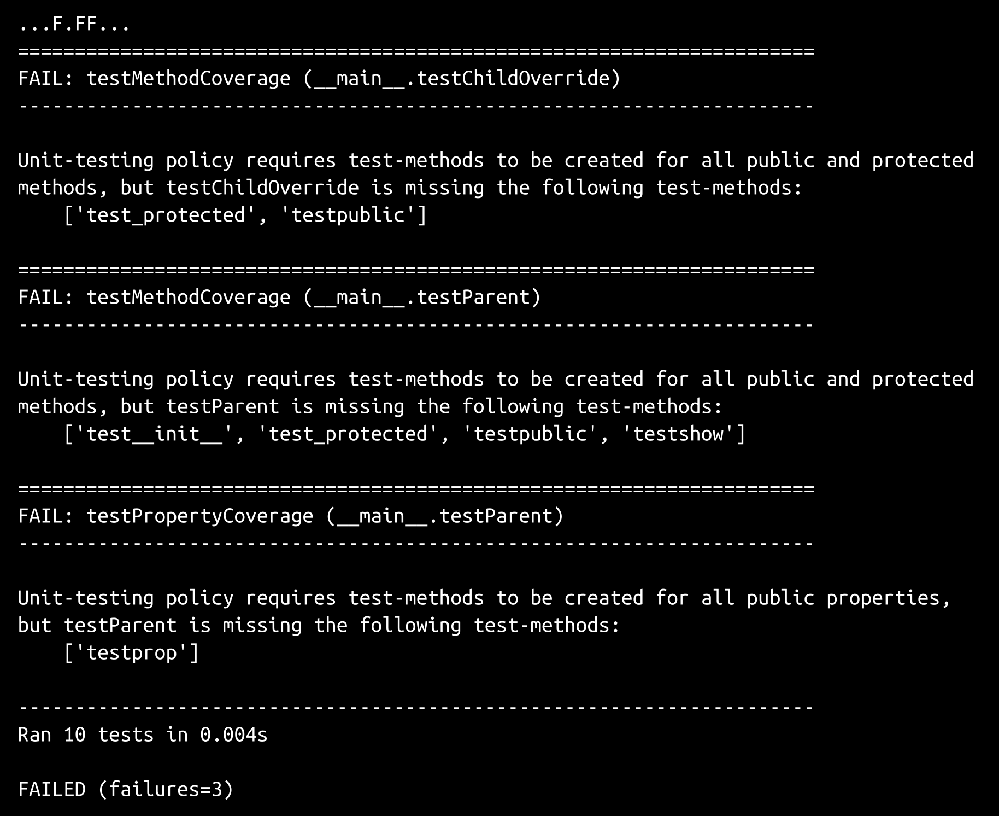

# 创建单元测试模板文件

刚刚显示的测试集合的最基本起点将作为任何其他关注单个模块的测试集合的起点。然而，`hms_sys`的预期代码结构包括整个代码包，并且可能包括这些包内的包。我们还不知道，因为我们还没有到那一步。这将对最终的单元测试方法产生影响，以及对模板文件的创建产生影响，以使得创建这些测试模块更快速和更少出错。

主要影响集中在这样一个想法上，即我们希望能够通过单个调用执行整个项目的所有测试，同时在组件项目的测试套件中不需要执行每个测试的情况下，只需运行一个或多个测试以针对包结构中更深层次的内容。因此，将测试按照与它们正在测试的包相同类型的组织结构进行拆分，并允许在任何级别的测试模块调用或被父级模块导入时导入子测试。

为此，单元测试模板模块需要适应与主代码库相同类型的导入功能，同时跟踪由测试运行发起的任何导入过程产生的所有测试。幸运的是，`unittest`模块还提供了可以用来管理这种需求的类，例如`TestSuite`类，它是可以执行的测试集合，并且可以根据需要向其添加新测试。最终的测试模块模板看起来很像我们之前创建的模块模板，尽管它以一些搜索和替换的样板注释开头：

```py
#!/usr/bin/env python

# Python unit-test-module template. Copy the template to a new
# unit-test-module location, and start replacing names as needed:
#
# PackagePath  ==> The path/namespace of the parent of the module/package
#                  being tested in this file.
# ModuleName   ==> The name of the module being tested
#
# Then remove this comment-block

"""
Defines unit-tests for the module at PackagePath.ModuleName.
"""

#######################################
# Any needed from __future__ imports  #
# Create an "__all__" list to support #
#   "from module import member" use   #
#######################################
```

与提供应用功能的包和模块不同，单元测试模块模板不需要提供太多的`**all**`条目，只需要提供模块本身中的测试用例类和任何子测试模块：

```py
__all__ = [
    # Test-case classes
    # Child test-modules
]
```

所有测试模块中都会发生一些标准导入，并且还可能存在第三方导入的可能性，尽管这可能不太常见：

```py
#######################################
# Standard library imports needed     #
#######################################

import os
import sys
import unittest

#######################################
# Third-party imports needed          #
#######################################

#######################################
# Local imports needed                #
#######################################

from unit_testing import *

#######################################
# Initialization needed before member #
#   definition can take place         #
#######################################
```

所有的测试模块都将定义一个名为`LocalSuite`的`unittest.TestSuite`实例，其中包含所有本地测试用例，并且在需要时可以在父模块中按名称导入：

```py
#######################################
# Module-level Constants              #
#######################################

LocalSuite = unittest.TestSuite()

#######################################
# Import the module being tested      #
#######################################

import PackagePath.ModuleName as ModuleName
```

我们还将定义一些样板代码，用于定义代码覆盖测试用例类：

```py
#######################################
# Code-coverage test-case and         #
# decorator-methods                   #
#######################################

class testModuleNameCodeCoverage(ModuleCoverageTest):
    _testModule = ModuleName

LocalSuite.addTests(
    unittest.TestLoader().loadTestsFromTestCase(
        testModuleNameCodeCoverage
   )
)
```

从这一点开始，除了模块的`__main__`执行之外的所有内容都应该是测试用例类的定义：

```py
#######################################
# Test-cases in the module            #
#######################################

#######################################
# Child-module test-cases to execute  #
#######################################
```

如果以后需要导入子测试模块，这里有用于执行此操作的代码结构，已注释并准备好复制、粘贴、取消注释和根据需要重命名：

```py
# import child_module
# LocalSuite.addTests(child_module.LocalSuite._tests)
```

还有更多标准模块部分，遵循标准模块和包模板的组织结构：

```py
#######################################
# Imports to resolve circular         #
# dependencies. Avoid if possible.    #
#######################################

#######################################
# Initialization that needs to        #
# happen after member definition.     #
#######################################

#######################################
# Code to execute if file is called   #
# or run directly.                    #
#######################################
```

最后，还有一些用于直接执行模块、运行测试并在没有失败时显示和写出报告的准备：

```py
if __name__ == '__main__':
    import time
    results = unittest.TestResult()
    testStartTime = time.time()
    LocalSuite.run(results)
    results.runTime = time.time() - testStartTime
    PrintTestResults(results)
    if not results.errors and not results.failures:
        SaveTestReport(results, 'PackagePath.ModuleName',
            'PackagePath.ModuleName.test-results')
```

模板提供了一些可以在首次复制到最终测试模块时找到并替换的项目：

+   `PackagePath`：被测试模块的完整命名空间，减去模块本身。例如，如果为一个完整命名空间为`hms_core.business.processes.artisan`的模块创建了一个测试模块，`PackagePath`将是`hms_core.business.processes`

+   `ModuleName`：被测试的模块的名称（使用前面的例子中的`artisan`）

搜索和替换操作还将为嵌入在模板中的`ModuleCoverageTest`子类定义提供一个唯一的名称。一旦这些替换完成，测试模块就可以运行，就像前面的例子中所示的那样，并且将开始报告缺少的测试用例和方法。

遵循这种结构的每个测试模块都在一个`unittest.TestSuite`对象中跟踪其本地测试，该对象可以被父测试模块导入，并且可以根据需要从子`TestSuite`实例中添加测试，模板文件中有一个注释掉的示例，显示了这种情况的样子：

```py
# import child_module
# LocalSuite.addTests(child_module.LocalSuite._tests)
```

最后，模板文件利用了自定义的`unit_testing`模块中定义的一些显示和报告函数，将总结的测试结果数据写入控制台，并且（当测试运行时没有失败）写入一个本地文件，如果需要的话可以在源代码控制中进行跟踪。

# 将测试与构建过程集成

只剩下一个故事/任务集，即如何将单元测试与组件项目的任何构建过程集成起来：

+   作为开发人员，我需要知道如何将组件项目的单元测试集成到该组件项目的构建过程中，以便构建可以自动执行单元测试：

+   确定如何将单元测试集成到构建过程中

+   确定如何处理不同环境的构建/测试集成

在组件项目中刚刚定义的单元测试结构中，将它们集成到构建过程中相对容易。在基于`setup.py`文件的构建中，测试模块可以在`setup`函数的`test_suite`参数中指定，并且可以通过执行`python setup.py test`来运行测试。在`hms_sys`组件项目中，还需要将单元测试标准代码的路径添加到`setup.py`中：

```py
#!/usr/bin/env python

# Adding our unit testing standards
import sys
sys.path.append('../standards')

from setuptools import setup

# The actual setup function call:
setup(
    name='HMS-Core',
    version='0.1.dev0',
    author='Brian D. Allbee',
    description='',
    package_dir={
        '':'src',
        # ...
    },
    # Can also be automatically generated using 
    #     setuptools.find_packages...
    packages=[
        'hms_core',
        # ...
    ],
    package_data={
#        'hms_core':[
#            'filename.ext',
#            # ...
#        ]
    },
    entry_points={
#        'console_scripts':[
#            'executable_name = namespace.path:function',
#            # ...
#        ],
    },
# Adding the test suite for the project
    test_suite='tests.test_hms_core',
)
```

如果需要基于 Makefile 的构建过程，`setup.py test`的具体调用可以简单地包含在相关的 Make 目标中：

```py
# Makefile for the HMS Core (hms-core) project

main: test setup
        # Doesn't (yet) do anything other than running the test and 
        # setup targets

setup:
        # Calls the main setup.py to build a source-distribution
        # python setup.py sdist

test:
        # Executes the unit-tests for the package, allowing the build-
        # process to die and stop the build if a test fails
        python setup.py. test
```

从`setup.py`中执行的测试套件将返回适当的值，以阻止 Make 进程在出现错误或失败时停止。

# 摘要

除了设置新团队或新业务之外，大多数这些流程和政策很可能在项目开始之前就已经建立好了——通常是在团队承担的第一个项目之前或期间。大多数开发商和团队都会发现这一章节中提出的解决方案的需求，并且会采取行动。

所有这些项目都已经设置并提交到版本控制系统，为随后的迭代开发工作奠定了基础。第一个“真正的”迭代将着手处理基本业务对象的定义和实现。
