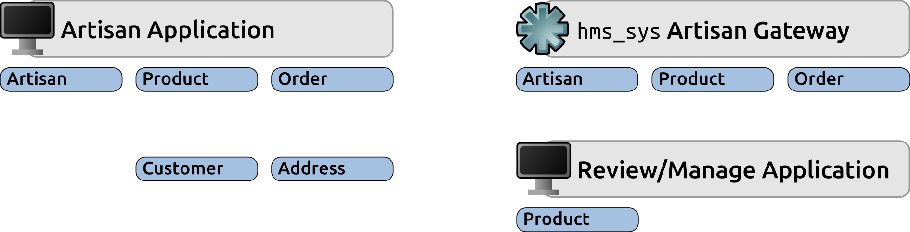
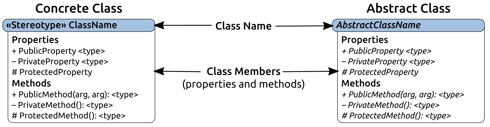
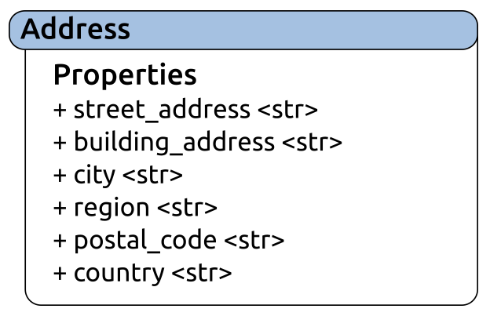
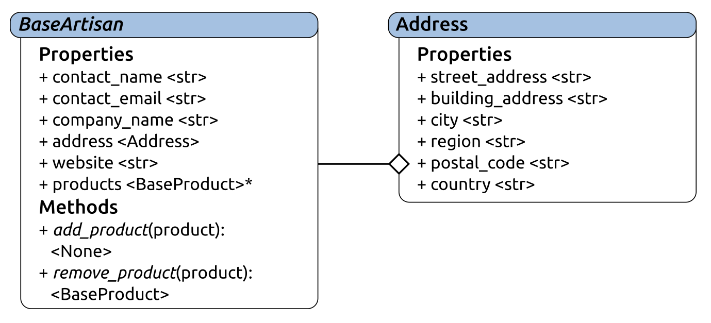
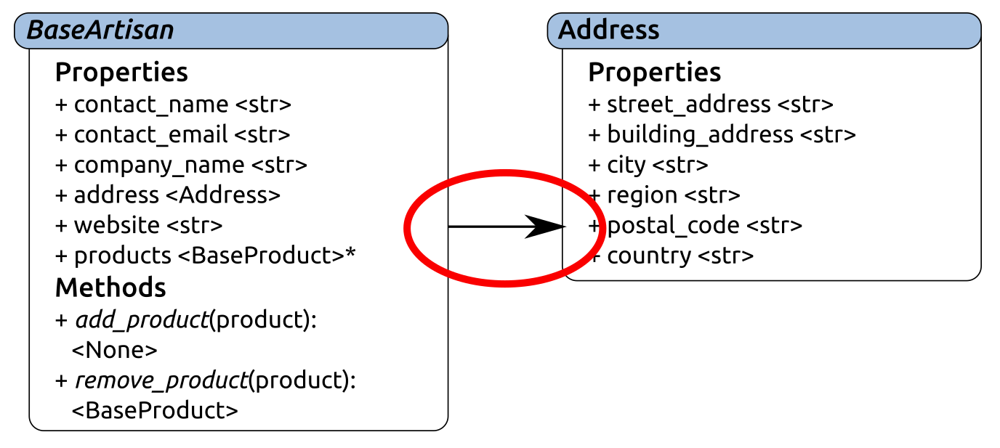
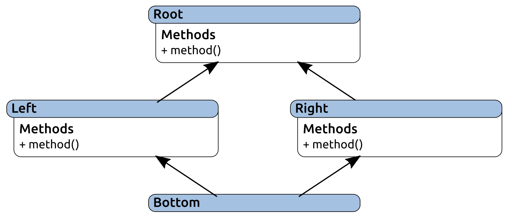
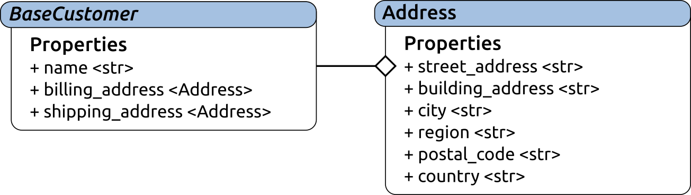
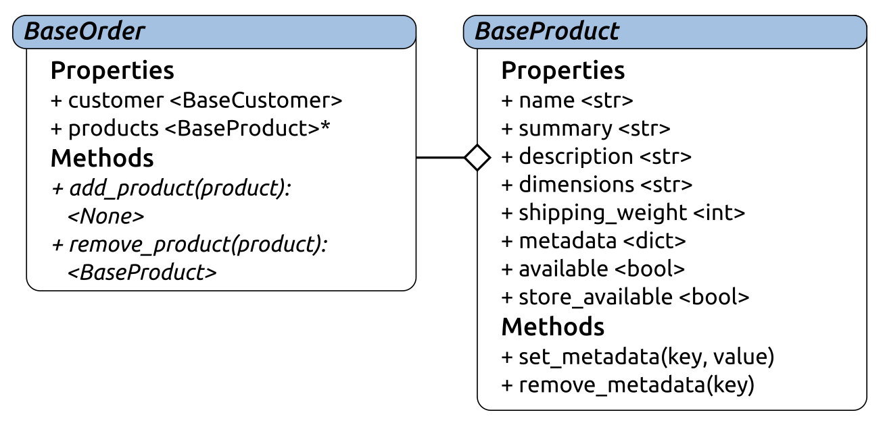
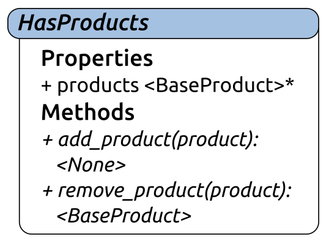
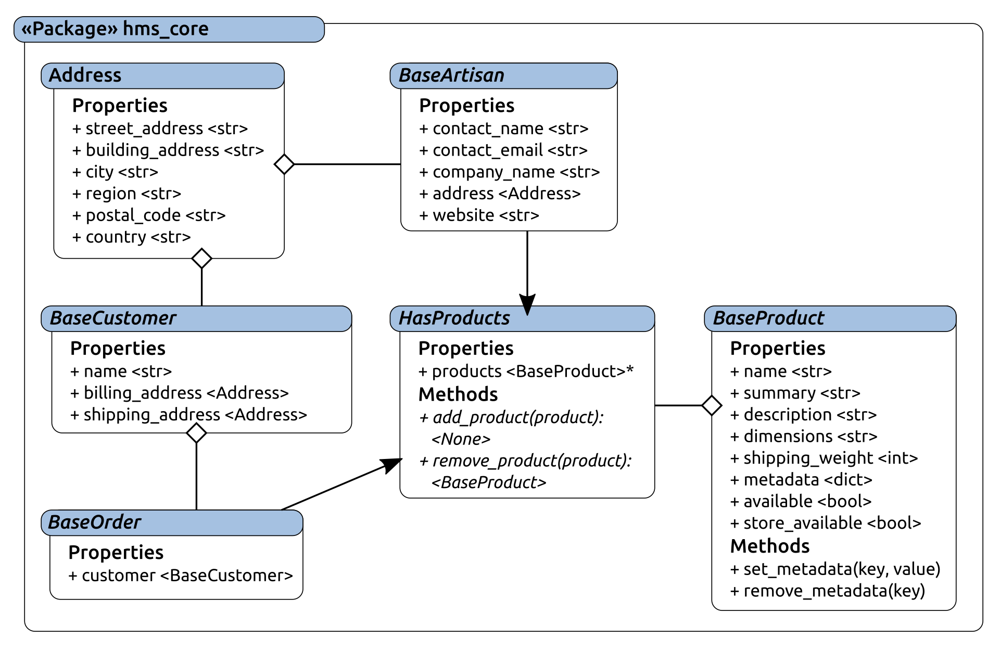

# 第八章：创建业务对象

在第七章中检查`hms_sys`的逻辑架构，*设置项目和流程*，整个系统范围内出现了一些常见的业务对象类型：



如前图所示的对象，解释如下：

+   一个**Artisan**对象代表一个**Artisan**——一个最终用户，他创建要出售的产品项目，并通过系统将这些产品提供给 HMS 中央办公室。**Artisans**被收集在中央办公室的数据结构中，并且在一定程度上可以由中央办公室工作人员管理，但是他们的实际数据大部分需要由个体工匠自己拥有和管理；这样，他们可以尽可能地控制自己的信息，中央办公室工作人员不必管理工匠的数据更改，例如，如果他们更改地址，或者想要添加或更改公司名称。

+   **产品**是一个物理对象的表示，是工匠创造并出售的物品。

+   订单是顾客通过 HMS 网店订购产品的结果。

这三种对象类型还暗示了另外两种之前没有提到的对象类型：

+   代表实际下订单的顾客，并且可以附加到一个或多个订单

+   **地址**，代表可以发货或收货的物理位置，也可以附加到一个或多个订单，可能是**顾客**的属性，几乎肯定是**工匠**的属性

本章将介绍将这些对象实现为通用类库的实现，该类库可以被应用程序和服务项目的代码利用，包括设计、实现、自动化测试和构建过程，将其转化为可部署的包。

本章涵盖以下内容：

+   迭代目标

+   故事和任务的组装

+   类的快速审查

+   在`hms_sys`中实现基本业务对象

+   测试业务对象

+   分发和安装考虑

+   质量保证和验收

+   操作/使用、维护和停用考虑

# 迭代目标

因此，这次迭代的交付成果是一个类库，可以与真实项目的包和代码一起安装或合并，用户应用程序和服务可以提供这些业务对象的通用表示结构：

+   `hms_core`包/库

+   单元测试

+   能够作为独立包构建

+   包括提供以下基本表示的基类：

+   +   工匠

+   顾客

+   订单

+   产品

# 故事和任务的组装

由于业务对象包的组件旨在被系统中的其他包消耗或使用，因此大部分相关故事仍然专注于提供开发人员需要的东西：

+   作为开发人员，我需要一个通用的定义和功能结构来表示系统中的地址，以便我可以将它们合并到需要它们的系统部分中：

+   定义`BaseAddress`抽象基类（ABC）

+   实现`BaseAddress` ABC

+   对`BaseAddress` ABC 进行单元测试

+   作为开发人员，我需要一个通用的定义和功能结构来表示系统中的工匠，以便我可以将它们合并到需要它们的系统部分中：

+   定义`BaseArtisan` ABC

+   实现`BaseArtisan` ABC

+   对`BaseArtisan` ABC 进行单元测试

+   作为开发人员，我需要一个通用的定义和功能结构来表示系统中的顾客，以便我可以将它们合并到需要它们的系统部分中：

+   定义`BaseCustomer` ABC

+   实现`BaseCustomer` ABC

+   对`BaseCustomer` ABC 进行单元测试

+   作为开发人员，我需要一个通用的定义和功能结构来表示系统中的订单，以便我可以将它们合并到需要它们的系统部分中：

+   定义一个`BaseOrder` ABC

+   实现`BaseOrder` ABC

+   对`BaseOrder` ABC 进行单元测试

+   作为开发人员，我需要一个通用的定义和功能结构来表示系统中的产品，以便我可以将它们合并到需要它们的系统部分中：

+   定义一个`BaseProduct` ABC

+   实现`BaseProduct` ABC

+   对`BaseProduct` ABC 进行单元测试

+   作为**Artisan**，我需要将业务对象库与我的应用程序一起安装，以便应用程序能够按需工作，而无需我安装它的依赖组件：

+   确定`setup.py`是否可以基于包含来自本地项目结构之外的包，并在可以的情况下实现它

+   否则，实现基于`Makefile`的过程，将`hms_core`包含在其他项目的打包过程中

+   作为中央办公室用户，我需要将业务对象库与我的应用程序一起安装，以便应用程序能够按需工作，而无需我安装它的依赖组件：

+   验证**Artisan**打包/安装过程是否也适用于中央办公室的安装

+   作为系统管理员，我需要安装业务对象库与**Artisan**网关服务，以便它能够按需工作，而无需我安装它的依赖组件：

+   验证**Artisan**打包/安装过程是否也适用于**Artisan**网关安装

值得注意的是，虽然这种设计从定义了许多抽象类开始，但这并不是唯一的方式。另一个可行的选择是从每个其他库中的简单 Concrete Classes 开始，然后提取这些类的共同要求，并创建 ABC 来强制执行这些要求。这种方法会更快地产生具体的功能，同时将结构和数据标准推迟到后面，并要求将相当多的代码从 Concrete Classes 移回到 ABC，但这仍然是一个可行的选择。

# 快速审查类

在任何面向对象的语言中，类都可以被视为创建对象的蓝图，定义了这些对象作为类的实例的特征、拥有的东西以及可以做的事情。类经常代表现实世界的对象，无论是人、地方还是物品，但即使它们不是，它们也提供了一套简洁的数据和功能/功能，适合逻辑概念单元。

随着`hms_sys`的开发进展，将设计和实现几个类，包括具体类和抽象类。在大多数情况下，设计将从类图开始，即一对多类的绘图，显示每个类的结构以及它们之间的任何关系：



**Concrete Class**旨在被实例化，从提供的蓝图创建对象实例。**Abstract Class**为具有特定**Class Members**（具体或抽象）的对象提供基线功能、接口要求和类型标识，这些成员将被继承或需要在从它们派生的类中实现。这些成员的范围，包括**Properties**和**Methods**，按照约定，公共成员用**+**表示，私有成员用**-**表示，受保护的成员用**#**表示，尽管如前所述，Python 并没有真正的受保护或私有成员。不过，这些至少提供了成员的预期范围的一些指示。

# 在 hms_sys 中实现基本的业务对象

在开发过程的这一阶段，我们只是不知道所有业务对象类的确切功能是否将在即将构建的两个应用程序和服务中发挥作用。数据所有权规则——确定用户可以在对象内创建、更新或删除哪些数据——尚未详细说明，因此还不能做出这些决定。然而，仅基于这些对象的目的，我们已经有足够的信息来开始定义它们代表的数据以及这些数据点周围应该存在的约束。

我们可能已经有足够的信息来知道某些对象类型需要存在某些功能，例如，**Artisan**对象需要能够添加和删除相关的**Product**对象，即使我们还不知道这将如何运作，或者是否有关于这些对象的数据所有权规则。我们还可以对哪些类需要是抽象的做出一些合理的猜测（因为它们的实际实现将在应用程序和服务之间变化）。

# Address

`Address`类表示一个物理位置——可以将某物邮寄或运送到的地方，或者可以在地图上找到的地方。无论对象在什么上下文中遇到，地址的属性都将是一致的——也就是说，地址是地址，无论它是与**Artisan**、**Customer**还是**Order**相关联的——并且在这一点上，可以放心地假设任何地址的整体都可以被其所属的对象更改，或者都不可以。在这一点上，除非有相反的信息，否则似乎不需要将地址作为后端数据结构中的单独项存储；尽管它们可能会有自己的有意义的独立存在，但没有理由假设它们会有。

考虑到这一点，至少目前为止，将地址作为抽象类并不感觉是必要的：



地址是一个愚蠢的数据对象，至少目前为止；它由一个数据结构组成，但没有方法或功能。类本身的属性相当简单，并且围绕它们有一些规则：

+   `street_address`是位置的街道地址。它应该是一个单行字符串值，是必需的（不能是空的），并且可能不允许除空格之外的任何空白字符。`street_address`的一个示例值可能是`1234 Main Street`。

+   `building_address`是地址的可选第二行，用于指示关于实际位置的街道地址的更多细节。示例可能包括公寓号、套房或办公室位置或编号等。如果在任何给定的地址中存在，它应该是一个具有与`street_address`相同约束的字符串值，但同样，它是一个可选值。

+   `city`是一个必需的字符串值，同样限制为单行，并且与`street_address`具有相同的空白规则。

+   `region`是一个可选的字符串值，具有与`postal_code`和`country`相同的约束，至少目前是这样。

这最后三个属性很难在没有某种特定国家上下文的情况下制定规则。在某些国家，地址可能没有地区或邮政编码，而在其他国家，它们可能有完全不同的名称和数据要求，尽管这似乎不太可能。例如，考虑到在美国，地区和`postal_code`代表**州**和**邮政编码**（五个数字，带有一个可选的破折号和另外四个数字），而在加拿大，它们代表一个领土或省份和一个字母数字混合的邮政编码。对于一些要求，可能会有一个按国家划分的解决方案，在初步处理完属性定义之后将对此进行检查。

`Address`的初始实现非常简单；我们首先定义一个具有可用属性的类：

```py
class Address:
    """
Represents a physical mailing-address/location
"""
    ###################################
    # Class attributes/constants      #
    ###################################

# ... removed for brevity

    ###################################
    # Instance property definitions   #
    ###################################

    building_address = property(
        _get_building_address, _set_building_address, 
        _del_building_address, 
        'Gets, sets or deletes the building_address (str|None) '
        'of the instance'
    )
    city = property(
        _get_city, _set_city, _del_city, 
        'Gets, sets or deletes the city (str) of the instance'
    )
    country = property(
        _get_country, _set_country, _del_country, 
        'Gets, sets or deletes the country (str|None) of the '
        'instance'
    )
    region = property(
        _get_region, _set_region, _del_region, 
        'Gets, sets or deletes the region (str|None) of the '
        'instance'
    )
    postal_code = property(
        _get_postal_code, _set_postal_code, _del_postal_code, 
        'Gets, sets or deletes the postal_code (str|None) of '
        'the instance'
    )
    street_address = property(
        _get_street_address, _set_street_address, 
        _del_street_address, 
        'Gets, sets or deletes the street_address (str) of the '
        'instance'
    )
```

每个`property`调用都指定了必须实施的 getter、setter 和 deleter 方法。getter 方法都非常简单，每个方法都返回存储该属性实例数据的相关属性值：

```py
    ###################################
    # Property-getter methods         #
    ###################################

    def _get_building_address(self) -> (str,None):
        return self._building_address

    def _get_city(self) -> str:
        return self._city

    def _get_country(self) -> (str,None):
        return self._country

    def _get_region(self) -> (str,None):
        return self._region

    def _get_postal_code(self) -> (str,None):
        return self._postal_code

    def _get_street_address(self) -> str:
        return self._street_address
```

尽管必须实施一些逻辑以强制执行前面提到的类型和值规则，但设置方法也相对简单。到目前为止，地址的属性分为两类：

+   必填，非空，单行字符串（例如`street_address`）

+   可选（`None`）或非空，单行字符串值（`building_address`）

所需值的实现将都遵循相同的模式，以`street_address`为例：

```py
    def _set_street_address(self, value:str) -> None:
        # - Type-check: This is a required str value
        if type(value) != str:
            raise TypeError(
                '%s.street_address expects a single-line, '
                'non-empty str value, with no whitespace '
                'other than spaces, but was passed '
                '"%s" (%s)' % 
                (
                    self.__class__.__name__, value, 
                    type(value).__name__
                )
            )
        # - Value-check: no whitespace other than " "
        bad_chars = ('\n', '\r', '\t')
        is_valid = True
        for bad_char in bad_chars:
            if bad_char in value:
                is_valid = False
                break
        # - If it's empty or otherwise not valid, raise error
        if not value.strip() or not is_valid:
            raise ValueError(
                '%s.street_address expects a single-line, '
                'non-empty str value, with no whitespace '
                'other than spaces, but was passed '
                '"%s" (%s)' % 
                (
                    self.__class__.__name__, value, 
                    type(value).__name__
                )
            )
        # - Everything checks out, so set the attribute
        self._street_address = value
```

设置方法的过程，从头到尾，如下所示：

1.  确保提交的`value`是`str`类型，并且如果不是这种情况则引发`TypeError`

1.  创建一个禁止字符列表——换行符、回车符和制表符（`'\n'`、`'\r'`、`'\t'`）——不应该允许在值中出现

1.  假设该值有效，直到另有确定（`is_valid = True`）

1.  检查值中是否存在这些非法字符，并且如果存在，则标记该值为无效

1.  检查值是否只是空格（`value.strip()`）或是否找到了任何无效字符，如果是，则引发`ValueError`

1.  如果没有引发错误，则将属性的内部存储属性设置为现在经过验证的值（`self._street_address = value`）

相同的代码，将`street_address`更改为`city`，处理了城市属性的 setter 实现。这个属性 setter 的过程/流程将反复出现，在这个迭代和后续的迭代中。从现在开始使用时，它将被称为标准必需文本行属性 setter。

可选属性使用非常相似的结构，但首先检查（并允许）`None`值，因为将它们的值设置为`None`在技术上是有效的/允许的。`building_address`属性 setter 就是这一过程的一个例子：

```py
    def _set_building_address(self, value:(str,None)) -> None:
        if value != None:
            # - Type-check: If the value isn't None, then it has to 
            #   be a non-empty, single-line string without tabs
            if type(value) != str:
                raise TypeError(
                    '%s.building_address expects a single-line, '
                    'non-empty str value, with no whitespace '
                    'other than spaces or None, but was passed '
                    '"%s" (%s)' % 
                    (
                        self.__class__.__name__, value, 
                        type(value).__name__
                    )
                )
            # - Value-check: no whitespace other than " "
            bad_chars = ('\n', '\r', '\t')
            is_valid = True
            for bad_char in bad_chars:
                if bad_char in value:
                    is_valid = False
                    break
            # - If it's empty or otherwise not valid, raise error
            if not value.strip() or not is_valid:
                raise ValueError(
                    '%s.building_address expects a single-line, '
                    'non-empty str value, with no whitespace '
                    'other than spaces or None, but was passed '
                    '"%s" (%s)' % 
                    (
                        self.__class__.__name__, value, 
                        type(value).__name__
                    )
                )
            # - If this point is reached without error, then the 
            #   string-value is valid, so we can just exit the if
        self._building_address = value
```

这个 setter 方法的过程，就像前面的标准必需文本行属性一样，将会经常出现，并且将被称为标准可选文本行属性 setter。

删除方法也将非常简单——如果删除了这些属性中的任何一个，都可以将其设置为`None`，以便它们仍然具有值（从而避免在其他地方引用时出现`AttributeError`的实例），但可以用于指示没有值的值：

```py
    def _del_building_address(self) -> None:
        self._building_address = None

    def _del_city(self) -> None:
        self._city = None

    def _del_country(self) -> None:
        self._country = None

    def _del_region(self) -> None:
        self._region = None

    def _del_postal_code(self) -> None:
        self._postal_code = None

    def _del_street_address(self) -> None:
        self._street_address = None
```

通过定义属性及其基础方法，使类可用的唯一剩下的就是定义其`__init__`方法，以便实际接受和存储相关属性的`Address`实例的创建。

很诱人只坚持简单的结构，接受并要求各种地址元素的顺序与它们通常使用的顺序相同，类似于这样：

```py
    def __init__(self, 
        street_address,                  # 1234 Main Street
        building_address,                # Apartment 3.14
        city, region, postal_code,       # Some Town, ST, 00000
        country                          # Country. Maybe.
        ):
```

同样有效的另一种方法是允许参数的默认值，这些默认值将转换为实例创建的可选属性：

```py
    def __init__(self, 
        street_address,                  # 1234 Main Street
        city,                            # Some Town
        building_address=None,           # Apartment 3.14
        region=None, postal_code=None,   # ST, 00000
        country=None                     # Country
        ):
```

从功能的角度来看，这两种方法都是完全有效的——可以使用任一种方法创建`Address`实例——但第一种方法可能更容易理解，而第二种方法则允许创建一个最小的实例，而无需每次都担心指定每个参数值。关于使用哪种参数结构应该涉及一些严肃的思考，包括以下因素：

+   谁将创建新的`Address`实例？

+   这些`Address`创建过程是什么样的？

+   何时何地需要新的`Address`实例？

+   它们将如何被创建？也就是说，这个过程周围是否会有某种 UI，并且是否会有任何一致性？

“谁”这个问题有一个非常简单的答案，而且大多数情况下也能回答其他问题：几乎任何用户都可能需要能够创建新地址。中央办公室工作人员在设置新的**Artisan**账户时可能会需要。**Artisans**偶尔可能需要，如果他们需要更改他们的地址。**顾客**虽然只是间接地，在他们下第一个订单时会需要，而且可能需要为运输单独创建地址，而不是使用他们自己的默认/账单地址。甚至**Artisan**网关服务可能需要创建`Address`实例，作为处理数据来回移动的过程的一部分。

在大多数情况下，会涉及某种 UI：**顾客**和**订单**相关项目的网店表单，以及**Artisan**和中央办公室应用程序中的任何 GUI。在地址创建过程中有一个 UI，将参数从 UI 传递给`__init__`的责任只对开发人员来说才重要或关注。因此，这些问题虽然能够揭示功能需求是什么，但在选择两种参数形式之间并没有太大帮助。

也就是说，`__init__`可以以一种方式定义，而为`Address`创建另一种结构的方法，例如`standard_address`：

```py
    @classmethod
    def standard_address(cls, 
            street_address:(str,), building_address:(str,None), 
            city:(str,), region:(str,None), postal_code:(str,None), 
            country:(str,None)
        ):
        return cls(
            street_address, city, building_address, 
            region, postal_code, country
        )
```

这样就允许`__init__`使用结构，利用各种默认参数值：

```py
def __init__(self, 
    street_address:(str,), city:(str,), 
    building_address:(str,None)=None, region:(str,None)=None, 
    postal_code:(str,None)=None, country:(str,None)=None
    ):
    """
Object initialization.

self .............. (Address instance, required) The instance to 
                    execute against
street_address .... (str, required) The base street-address of the 
                    location the instance represents
city .............. (str, required) The city portion of the street-
                    address that the instance represents
building_address .. (str, optional, defaults to None) The second 
                    line of the street address the instance represents, 
                    if applicable
region ............ (str, optional, defaults to None) The region 
                    (state, territory, etc.) portion of the street-
                    address that the instance represents
postal_code ....... (str, optional, defaults to None) The postal-code 
                    portion of the street-address that the instance 
                    represents
country ........... (str, optional, defaults to None) The country 
                    portion of the street-address that the instance 
                    represents
"""
    # - Set default instance property-values using _del_... methods
    self._del_building_address()
    self._del_city()
    self._del_country()
    self._del_postal_code()
    self._del_region()
    self._del_street_address()
    # - Set instance property-values from arguments using 
    #   _set_... methods
    self._set_street_address(street_address)
    self._set_city(city)
    if building_address:
        self._set_building_address(building_address)
    if region:
        self._set_region(region)
    if postal_code:
        self._set_postal_code(postal_code)
    if country:
        self._set_country(country)
```

这使得`Address`在功能上是完整的，至少对于本次迭代中关于它的故事来说是这样。

在任何类正在开发过程中，开发人员可能会出现关于他们设想的用例的问题，或者在考虑类的某些方面时会出现问题。在`Address`被完善时出现的一些例子如下：

+   如果在实例中删除了非默认属性值，会发生什么？如果删除了必需的值，那么实例将不再是完整的，从技术上讲是无效的结果——甚至可能会发生这样的删除吗？

+   有一个 Python 模块，`pycountry`，它收集 ISO 衍生的国家和地区信息。是否希望尝试利用这些数据，以确保国家/地区的组合是现实的？

+   `Address`最终是否需要任何输出能力？例如标签文本？或者可能需要生成 CSV 文件中的一行？

这些问题可能值得保存在某个地方，即使它们从未变得相关。如果没有某种项目系统存储库来保存这些问题，或者开发团队中没有一些流程来保存它们，以免它们丢失，它们总是可以被添加到代码本身中，作为某种注释，也许像这样：

```py
# TODO: Consider whether Address needs some sort of #validation 
#       mechanism that can leverage pycountry to assure #that 
#       county/region combinations are kosher.
#       pycountry.countries—collection of countries
#       pycountry.subdivisions—collection of regions by #country
# TODO: Maybe we need some sort of export-mechanism? Or a 
#       label-ready output?
# TODO: Consider what can/should happen if a non-default #property-
#       value is deleted in an instance. If a required #value is 
#       deleted, the instance is no longer well-formed...
class Address:
    """
#Represents a physical mailing-address/location
"""
```

# BaseArtisan

`Artisan`类代表参与手工制品市场的工匠——一个通过中央办公室的网店销售产品的人。知道几乎每个用户与最终`Artisan`类的交互都几乎肯定会有不同的功能规则，因此在`hms_core`代码库中创建一个抽象类来定义其他包中任何具体`Artisan`的共同功能和要求是有意义的。我们将把这个类命名为`BaseArtisan`。

就像我们刚刚完成的`Address`类一样，`BaseArtisan`的设计和实现始于一个类图：



抽象类通常具有指示它们是抽象的命名约定。在这种情况下，Base 的前缀就是这个指示符，并且将在开发过程中用于其他抽象类。

`BaseArtisan`旨在为系统中任何部分的任何`Artisan`关联的所有属性提供一组通用的状态数据规则和功能。属性本身将是具体的实现。此外，`BaseArtisan`还旨在以`add_product`和`remove_product`方法的形式提供一些（最小的）功能要求。由于工匠和产品彼此相关，因此一个具体的`Artisan`对象需要能够添加和删除`Product`对象，但是关于这些过程的具体细节可能会在两个应用程序和使用该功能的服务之间有所不同，因此它们将是抽象的——需要在从`BaseArtisan`派生的任何类中被覆盖/实现。

该类图还包括了之前创建的`Address`类，两个类之间有一个菱形结束的连接器。该连接表示`Address`类被用作`BaseArtisan`的聚合属性——也就是说，`BaseArtisan`的地址属性是`Address`的一个实例。在地址属性本身中也有这种表示，地址属性的类型指定为`<Address>`。简单来说，一个`BaseArtisan`有一个`Address`。

也可以将`BaseArtisan`定义为从`Address`继承。该关系的类图几乎与上面相同，除了连接器，如下所示：



在这种关系中，`BaseArtisan`是一个`Address`——它将拥有`Address`的所有属性，以及可能在后续添加的任何方法成员。这两种关系都是完全合法的，但在继承上使用聚合（或组合）方法而不是依赖继承有一些值得注意的优势，这些优势值得在移动到`BaseArtisan`的实现之前注意。

# OO 原则-组合优于继承

很可能最明显的优势之一是结构容易理解。一个“工匠”实例将有一个地址属性，该属性是另一个对象，该对象有其自己的相关属性。在“工匠”级别上，只有一个重要的地址，这可能看起来并不重要。然而，其他对象，比如“顾客”和“订单”，可能有多个关联的地址（例如，账单地址和送货地址），甚至可能有几个：“顾客”可能有几个需要保留和可用的送货地址。

随着系统的对象库变得越来越庞大和复杂，使用纯继承的设计方法将不可避免地导致大量的类树，其中许多类可能只是提供功能，目的仅仅是为了被继承。基于组合的设计将减少这种复杂性，在更大更复杂的库中可能会显著减少，因为功能将封装在单个类中，这些类的实例本身就成为属性。

然而，这种组合也有一些潜在的缺点：深度嵌套的对象，属性的属性的属性*无休止地*，可能会导致长链的数据结构。例如，在`hms_sys`的上下文中，如果一个“订单”有一个“顾客”，顾客又有一个“送货地址”，那么从“订单”中找到该地址的“邮政编码”看起来会像是`order.customer.shipping_address.postal_code`。这并不是一个非常深或复杂的路径来获取涉及的数据，因为属性名称很容易理解，所以理解整个路径并不困难。与此同时，很容易想象这种嵌套会失控，或者依赖于不那么容易理解的名称。

还有可能（也许很可能）需要一个类来提供一些组合属性类方法的本地实现，这增加了父对象类的复杂性。举个例子，假设刚才提到的`shipping_address`的地址类有一个方法，检查各种运输 API 并返回一个从最低到最高成本排序的列表—称之为`find_best_shipping`。如果有一个要求`order`对象能够使用该功能，那可能最终会在订单类级别定义一个`find_best_shipping`方法，调用地址级别的方法并返回相关数据。

然而，这些都不是重大的缺点。只要在确保设计逻辑和易于理解，成员名称有意义的情况下进行一些纪律性的练习，它们可能不会比单调更糟。

从更纯粹的面向对象的角度来看，一个更重要的问题是菱形问题。考虑以下代码：

```py
class Root:
    def method(self, arg, *args, **kwargs):
        print('Root.method(%s, %s, %s)' % (arg, str(args), kwargs))

class Left(Root):
    def method(self, arg, *args, **kwargs):
        print('Left.method(%s, %s, %s)' % (arg, str(args), kwargs))

class Right(Root):
    def method(self, arg, *args, **kwargs):
        print('Right.method(%s, %s, %s)' % (arg, str(args), kwargs))

class Bottom(Left, Right):
    pass

b = Bottom()
```

这些类形成了一个菱形，因此有了菱形问题的名称：



以下代码执行时会发生什么：

```py
b.method('arg', 'args1', 'args2', keyword='value')
```

哪个方法会被调用？除非语言本身定义了如何解决歧义，否则唯一可以肯定的是`Root`的方法不会被调用，因为`Left`和`Right`类都对其进行了重写。

Python 通过使用类定义中指定的继承顺序作为**方法解析顺序**（**MRO**）来解决这种性质的歧义。在这种情况下，因为`Bottom`被定义为从`Left`和`Right`继承—`class Bottom(Left, Right)`—这个顺序将被用来确定实际执行哪个可用的`method`：

```py
# Outputs "Left.method(arg, ('args1', 'args2'), {'keyword': 'value'})"
```

尽管似乎不太可能任何可安装的`hms_sys`组件会达到继承问题成为重大关注的程度，但并不能保证永远不会发生。鉴于这一点，以及从基于继承到基于组合的重构工作可能会非常痛苦并且容易引入破坏性变化，即使在这一点上，基于组合的方法，即使具有一些固有的缺点，也感觉像是更好的设计。

# 实现 BaseArtisan 的属性

为了将**工匠**表示为一个人（可能还有公司名称），具有位置和产品，`BaseArtisan`提供了六个属性成员：

+   `contact_name`是**工匠**的联系人姓名。它应该是一个标准的必需文本行属性，如前所定义。

+   `contact_email`是`contact_name`中提到的人的电子邮件地址。它应该是一个格式良好的电子邮件地址，并且是必需的。

+   `company_name`是一个标准的可选文本行属性（可选，因为并非所有**工匠**都有公司名称）。

+   `address`将是必需的，并且将是`Address`的一个实例。

+   `website`是**工匠**的可选网站地址。如果存在，它将需要是一个格式良好的 URL。

+   `products`将是`BaseProduct`对象的集合，方式与`address`是一个`Address`实例的方式相似。一些关于产品的实现细节将被推迟，直到`BaseProduct`被完全定义。

与之前一样，流程从创建类开始，并定义其实现的属性：

```py
class BaseArtisan(metaclass=abc.ABCMeta):
    """
Provides baseline functionality, interface requirements, and 
type-identity for objects that can represent an Artisan in 
the context of the HMS system.
"""
```

将`metaclass=abc.ABCMeta`包含在内定义了`BaseArtisan`作为抽象基类，使用`abc`模块的`ABCMeta`功能：

```py
    ###################################
    # Instance property definitions   #
    ###################################

    address = property(
        _get_address, _set_address, _del_address, 
        'Gets, sets or deletes the physical address (Address) '
        'associated with the Artisan that the instance represents'
    )
    company_name = property(
        _get_company_name, _set_company_name, _del_company_name, 
        'Gets, sets or deletes the company name (str) associated '
        'with the Artisan that the instance represents'
    )
    contact_email = property(
        _get_contact_email, _set_contact_email, _del_contact_email, 
        'Gets, sets or deletes the email address (str) of the '
        'named contact associated with the Artisan that the '
        'instance represents'
    )
    contact_name = property(
        _get_contact_name, _set_contact_name, _del_contact_name, 
        'Gets, sets or deletes the name of the contact (str) '
        'associated with the Artisan that the instance represents'
    )
    products = property(
        _get_products, None, None, 
        'Gets the collection of products (BaseProduct) associated '
        'with the Artisan that the instance represents'
    )
    website = property(
        _get_website, _set_website, _del_website, 
        'Gets, sets or deletes the URL of the website (str) '
        'associated with the Artisan that the instance represents'
    )
```

由于`company_name`和`contact_name`是标准的可选和必需的文本行实现，就像在创建`Address`类时描述的那样，它们的实现将遵循在那里建立的模式，并且不会被详细检查。它们的过程与`Address.building_address`和`Address.street_address`的过程相同，唯一变化的是 getter、setter 和 deleter 方法的名称以及存储属性的状态数据属性。

同样，与除产品之外的所有属性相关的`_get_`和`_del_`方法将遵循已经建立的相同基本模式：

+   Getter 方法将简单地返回存储在相应状态存储属性中的值

+   删除方法将将相应状态存储属性的值设置为`None`

例如，`address`、`company_name`和`contact_email`的 getter 和 deleter 方法的实现可以与先前显示的完全相同的过程，即使`address`不是一个简单的值属性，`contact_email`还没有被实现：

```py
    def _get_address(self) -> (Address,):
        return self._address

    def _del_address(self) -> None:
        self._address = None

    def _get_company_name(self) -> (str,None):
        return self._company_name

    def _del_company_name(self) -> None:
        self._company_name = None

    def _get_contact_email(self) -> (str,None):
        return self._contact_email

    def _del_contact_email(self) -> None:
        self._contact_email = None
```

这可能感觉像大量样板文件，复制和粘贴的代码，但这是能够执行由 setter 方法处理的类型和值检查的成本。setter 方法本身是保持所需的高度数据类型和完整性的魔法发生的地方。

`address`属性的 setter 可能会出乎意料地简单，因为实际上只需要强制执行传递给它的任何值必须是`Address`类的实例。没有值检查，因为任何成功创建的`Address`实例都将在初始化过程中执行自己的类型和值检查：

```py
    def _set_address(self, value:Address) -> None:
        if not isinstance(value, Address):
            raise TypeError(
                '%s.address expects an Address object or an object '
                'derived from Address, but was passed "%s" (%s) '
                'instead, which is not.' %
                (value, type(value).__name__)
            )
        self._address = value
```

`contact_email`的 setter 可以工作得像在`Address._set_street_address`中定义的标准必需文本行 setter 过程一样。毕竟，它有一些相同的数据规则——它是一个必需值，不能是空的，而且由于它是一个电子邮件地址，它不能是多行或包含制表符。然而，由于它是一个电子邮件地址，它也不能包含空格，并且有其他字符限制是所有电子邮件地址共有的，这些限制在原始结构中没有考虑到。由于该属性的要求包括它是一个格式良好的电子邮件地址，可能有其他更好的方法来验证传递给 setter 的值。

理想情况下，应用程序将希望确保电子邮件地址既格式良好又有效。然而，确实只有一种方法可以实现其中任何一种，而且这超出了`hms_sys`的范围，即使尝试实现也是有意义的：发送确认电子邮件，并且在收到确认响应之前/除非不存储该值。

有许多方法可以让我们完成大部分验证格式良好的电子邮件地址的工作。可能最好的起点是使用正则表达式与该值匹配，或者删除所有格式良好的电子邮件地址，并且在执行替换后不允许设置该值，除非剩下的内容为空。使用正则表达式可能不会保证该值格式良好，但它将捕获许多无效值。将其与`email.utils`模块中找到的一些标准 Python 功能结合起来，至少可以使代码达到一个测试点，以查找失败的格式良好的地址，并允许修改检查过程。

首先，我们需要从`email.utils`中导入`parseaddr`函数和`re`模块中的一些项目，以便创建我们将用于测试的正则表达式对象。这些导入应该发生在模块的顶部：

```py
#######################################
# Standard library imports needed     #
#######################################

import abc # This was already present
import re

from email.utils import parseaddr
```

接下来，我们将创建一个模块级常量正则表达式对象，用于检查电子邮件地址值：

```py
EMAIL_CHECK = re.compile(
    r'(^[a-zA-Z0-9_.+-]+@[a-zA-Z0-9-]+\.[a-zA-Z0-9-.]+$)'
)
```

这将匹配以一个或多个字符*A*到*Z*（大写或小写）、任何数字 0-9 或下划线、句点、加号或破折号开头的整个字符串，然后是`@`，然后是大多数域名。这种结构是在互联网上进行快速搜索时找到的，可能不完整，但看起来应该适用于大多数电子邮件地址。现在，setter 方法的所有实现需要做的就是检查该值是否为字符串，从字符串中解析出可识别的地址，检查解析后的值，如果一切正常，设置数据存储属性的值：

```py
    def _set_contact_email(self, value:str) -> None:
        # - Type-check: This is a required str value
        if type(value) != str:
            raise TypeError(
                '%s.contact_email expects a str value that is a '
                'well-formed email address, but was passed '
                '"%s" (%s)' % 
                (
                    self.__class__.__name__, value, 
                    type(value).__name__
                )
            )
        # - Since we know it's a string, we can start by parsing value 
        #   with email.utils.parseaddr, and using the second item of 
        #   that result to check for well-formed-ness
        check_value = parseaddr(value)[1]
        # - If value is not empty, then there was *something* that was
        #   recognized as being an email address
        valid = (check_value != '')
        if valid:
            # - Try removing an entire well-formed email address, as 
            #   defined by EMAIL_CHECK, from the value. If it works, 
            #   there will either be a remnant or not. If there is 
            #   a remnant, it's considered badly-formed.
            remnant = EMAIL_CHECK.sub('', check_value)
            if remnant != '' or not value:
                valid = False
        if not check_value or not valid:
            raise TypeError(
                '%s.contact_email expects a str value that is a '
                'well-formed email address, but was passed '
                '"%s" (%s)' % 
                (
                    self.__class__.__name__, value, 
                    type(value).__name__
                )
            )
        self._contact_email = value
```

类似的方法应该是网站 setter 方法的一个很好的起点，使用以下作为正则表达式进行测试：

```py
URL_CHECK = re.compile(
    r'(^https?://[A-Za-z0-9][-_A-Za-z0-9]*\.[A-Za-z0-9][-_A-Za-z0-9\.]*$)'
)
```

它以与`Address._set_building_address`中建立的相同可选值检查开始，但使用`URL_CHECK`正则表达式对象来检查传入的值，方式与`_set_contact_email`相同：

```py
    def _set_website(self, value:(str,None)) -> None:
        # - Type-check: This is an optional required str value
        if value != None:
            if type(value) != str:
                raise TypeError(
                    '%s.website expects a str value that is a '
                    'well-formed URL, but was passed '
                    '"%s" (%s)' % 
                    (
                        self.__class__.__name__, value, 
                        type(value).__name__
                    )
                )
            remnant = URL_CHECK.sub('', value)
            if remnant != '' or not value:
                raise TypeError(
                    '%s.website expects a str value that is a '
                    'well-formed URL, but was passed '
                    '"%s" (%s)' % 
                    (
                        self.__class__.__name__, value, 
                        type(value).__name__
                    )
                )
        self._website = value
```

现在只剩下一个属性要实现：`products`。`products`属性具有一些方面，一开始可能不明显，但对应该如何实现它可能有潜在的重要影响。首先，它是其他对象的集合——无论是列表、字典还是其他什么——但无论如何，它都不是像`address`那样的单个对象。此外，它被定义为只读属性：

```py
    products = property(
        _get_products, None, None, 
        'Gets the collection of products (BaseProduct) associated '
        'with the Artisan that the instance represents'
    )
```

`property`定义中只提供了 getter 方法。这是有意为之，但需要一些解释。

由于产品旨在处理产品对象的集合，因此`products`属性本身不能更改为其他内容非常重要。例如，如果产品是可设置的，就有可能执行以下操作：

```py
# Given artisan = Artisan(...whatever initialization…)
artisan.products = 'Not a product collection anymore!'
```

当然，可以实施类型和值检查代码来防止这种赋值方式，尽管属性本身没有与之关联的 setter 方法，但我们几乎肯定会在以后需要一个，而且它应该实施该类型和值检查。然而，它的使用可能仅限于在创建工匠实例期间填充实例的产品。

另一个潜在的问题是，可能会以容易出错和难以调节的方式更改集合的成员资格。例如，使用相同的`artisan`实例，并假设产品的底层数据存储是列表，没有任何阻止代码执行以下任何操作：

```py
artisan.products.append('This is not a product!')
artisan.products[0] = 'This is also not a product!'
```

同样，允许任意删除工匠的产品（`del artisan.products`）可能不是一个好主意。

因此，至少，我们希望确保以下内容：

+   不允许或不能影响真实的底层数据的`products`成员资格

+   仍然允许访问（也许是操作）单个`products`成员的成员，也就是说，给定产品实例的列表，从中读取数据并向其写入数据不受其所在集合的限制

即使没有开发某种自定义集合类型，也有几种选择。由于`products`属性使用 getter 方法来获取和返回值，因此可以更改返回的数据，以便：

+   直接返回实际数据的副本，这样更改返回集合的成员资格不会影响原始集合

+   将数据以不同的集合类型返回副本；例如，如果真实数据存储在列表中，返回该列表的元组将提供与原始列表相同的可迭代序列功能，但不允许更改副本本身的成员资格

Python 通过对象引用跟踪对象——也就是说，它通过与分配给对象的名称相关联的内存中的位置来关注对象实际存在的位置——因此，当从已经存在的对象列表创建对象的列表或元组时，新集合的成员与原始列表中存在的对象相同，例如：

```py
# - Create a class to demonstrate with
class Example:
    pass

# -  Create a list of instances of the class
example_list = [
    Example(), Example(), Example(), Example()
]

print('Items in the original list (at %s):' % hex(id(example_list)))
for item in example_list:
    print(item)

# Items in the original list (at 0x7f9cd9ed6a48):
# <__main__.Example object at 0x7f9cd9eed550>
# <__main__.Example object at 0x7f9cd9eed5c0>
# <__main__.Example object at 0x7f9cd9eed5f8>
# <__main__.Example object at 0x7f9cd9eed630>
```

创建原始列表的副本将创建一个新的独立集合，其中仍然包含相同的成员：

```py
new_list = list(example_list)
print('Items in the new list (at %s):' % hex(id(new_list)))
for item in new_list:
    print(item)

# Items in the new list (at 0x7f9cd89dca88):
# <__main__.Example object at 0x7f9cd9eed550>
# <__main__.Example object at 0x7f9cd9eed5c0>
# <__main__.Example object at 0x7f9cd9eed5f8>
# <__main__.Example object at 0x7f9cd9eed630>
```

创建元组也需要类似的方式：

```py
new_tuple = tuple(example_list)
print('Items in the new tuple (at %s):' % hex(id(new_tuple)))
for item in new_tuple:
    print(item)

# Items in the new tuple (at 0x7f9cd9edd4a8):
# <__main__.Example object at 0x7f9cd9eed550>
# <__main__.Example object at 0x7f9cd9eed5c0>
# <__main__.Example object at 0x7f9cd9eed5f8>
# <__main__.Example object at 0x7f9cd9eed630>
```

因此，返回从原始状态数据值创建的新列表或元组将处理防止对属性值进行的更改影响真正的基础数据。目前，元组返回选项似乎是更好的选择，因为它更加严格，这种情况下`_get_products`将被实现如下：

```py
def _get_products(self) -> (tuple,):
  return tuple(self._products)
```

删除方法`_del_products`不能使用`None`作为默认值，因为现在已经有了 getter。它将必须更改为其他内容，因为尝试返回一个`None`默认值的`tuple`会引发错误。目前，删除的值将更改为一个空列表：

```py
def _del_products(self) -> None:
  self._products = []
```

最后，这是设置方法，`_set_products`：

```py
    def _set_products(self, value:(list, tuple)) -> None:
        # - Check first that the value is an iterable - list or 
        #   tuple, it doesn't really matter which, just so long 
        #   as it's a sequence-type collection of some kind.
        if type(value) not in (list, tuple):
            raise TypeError(
                '%s.products expects a list or tuple of BaseProduct '
                'objects, but was passed a %s instead' % 
                (self.__class__.__name__, type(value).__name__)
            )
        # - Start with a new, empty list
        new_items = []
        # - Iterate over the items in value, check each one, and 
        #   append them if they're OK
        bad_items = []
        for item in value:
            # - We're going to assume that all products will derive 
            #   from BaseProduct - that's why it's defined, after all
            if isinstance(item, BaseProduct):
                new_items.append(item)
            else:
                bad_items.append(item)
        # - If there are any bad items, then do NOT commit the 
        #   changes -- raise an error instead!
        if bad_items:
            raise TypeError(
                '%s.products expects a list or tuple of BaseProduct '
                'objects, but the value passed included %d items '
                'that are not of the right type: (%s)' % 
                (
                    self.__class__.__name__, len(bad_items), 
                    ', '.join([str(bi) for bi in bad_items])
                )
            )
        self._products = value
```

综合起来，这些变化相当大地限制了对产品属性的更改：

+   属性本身是只读的，不允许设置或删除值

+   从 getter 方法返回的值与实际存储在其状态数据中的值相同，但不同，并且虽然它仍然允许访问原始集合的成员，但不允许更改原始集合的成员资格

+   设置方法强制对整个集合进行类型检查，确保集合的成员只由适当的对象类型组成

尚未考虑的是对集合成员进行实际更改的过程——这种能力在方法成员中。

# 实现 BaseArtisan 的方法

`BaseArtisan`，按照当前的设计，应该提供两个抽象方法：

+   `add_product`，需要一个机制来添加`products`到实例的产品集合中，需要在派生的具体类中实现

+   `remove_product`，同样需要一个机制来从派生实例的`products`集合中删除项目

这些被指定为抽象方法，因为虽然在`hms_sys`的应用和服务可安装组件中，每个方法几乎肯定会涉及一些共同的功能，但在这些相同的组件中也几乎肯定会有显著的实现差异——例如，artisans 可能是唯一可以真正从他们的`products`集合中删除项目的用户。

通常，在大多数支持定义抽象方法的编程语言中，这些方法不需要提供任何实际的实现。事实上，定义方法为抽象方法可能会禁止任何实现。Python 并不强制这种限制在抽象方法上，但也不期望有任何实现。因此，我们的抽象方法不需要比这更复杂：

```py
 @abc.abstractmethod
 def add_product(self, product:BaseProduct):
    pass

 @abc.abstractmethod
 def remove_product(self, product:BaseProduct):
    pass
```

虽然我们允许在抽象方法中放入具体实现，但是在某些情况下，可以利用这一点，在一个地方提供基线功能。这两种方法，`add_product`和`remove_product`，属于这种情况：

+   添加产品总是需要进行类型检查，当出现无效类型时引发错误，并将新项目附加到实例的集合中

+   从实例的产品集合中删除指定产品总是涉及到删除产品

考虑到这些因素，将这些常见流程放入抽象方法中实际上是有益的，就好像它们是具体实现一样。这些流程可以从派生类实例中调用，无论在执行基线本身之前还是之后，都可以加入或不加入额外的逻辑。考虑在`BaseArtisan`中实现`add_product`的基本方法如下：

```py
    @abc.abstractmethod
    def add_product(self, product:BaseProduct):
        """
Adds a product to the instance's collection of products.

Returns the product added.

self ....... (BaseArtisan instance, required) The instance to 
             execute against
product ...  (BaseProduct, required) The product to add to the 
             instance's collection of products

Raises TypeError if the product specified is not a BaseProduct-
  derived instance

May be implemented in derived classes by simply calling
    return BaseArtisan.add_product(self, product)
"""
        # - Make sure the product passed in is a BaseProduct
        if not isinstance(product, BaseProduct):
            raise TypeError(
                '%s.add_product expects an instance of '
                'BaseProduct to be passed in its product '
                'argument, but "%s" (%s) was passed instead' % 
                (
                    self.__class__.__name__, value, 
                    type(value).__name__
                )
            )
        # - Append it to the internal _products list
        self._products.append(product)
        # - Return it
        return product
```

一个派生类——例如，位于总部应用程序中的`Artisan`类——将需要实现`add_product`，但可以按照以下方式实现：

```py
    def add_product(self, product:BaseProduct):
        # - Add any additional checking or processing that might 
        #   need to happen BEFORE adding the product here

        # - Call the parent add_product to perform the actual 
        #   addition
        result = BaseArtisan.add_product(self, product)

        # - Add any additional checking or processing that might 
        #   need to happen AFTER adding the product here

        # - Return the product
        return result
```

不过，这种方法存在一个权衡：派生类可以实现一个全新的`add_product`流程，跳过现成的验证/业务规则。另一种方法是定义一个抽象验证方法（也许是`_check_products`），它处理验证过程，并由`add_product`的具体实现直接调用。

`remove_product`方法可以类似地定义，并且可以在派生类实例中以类似的方式实现：

```py
    @abc.abstractmethod
    def remove_product(self, product:BaseProduct):
        """
Removes a product from the instance's collection of products.

Returns the product removed.

self ....... (BaseArtisan instance, required) The instance to 
             execute against
product ...  (BaseProduct, required) The product to remove from 
             the instance's collection of products

Raises TypeError if the product specified is not a BaseProduct-
  derived instance
Raises ValueError if the product specified is not a member of the 
  instance's products collection

May be implemented in derived classes by simply calling
    return BaseArtisan.remove_product(self, product)
"""
        # - Make sure the product passed in is a BaseProduct.
        #   Technically this may not be necessary, since type 
        #   is enforced in add_product, but it does no harm to 
        #   re-check here...
        if not isinstance(product, BaseProduct):
            raise TypeError(
                '%s.add_product expects an instance of '
                'BaseProduct to be passed in its product '
                'argument, but "%s" (%s) was passed instead' % 
                (
                    self.__class__.__name__, value, 
                    type(value).__name__
                )
            )
        try:
            self._products.remove(product)
            return product
        except ValueError:
            raise ValueError(
                '%s.remove_product could not remove %s from its '
                'products collection because it was not a member '
                'of that collection' % 
                (self.__class__.__name__, product)
            )
```

可能还有其他方法适合添加到`BaseArtisan`中，但如果有的话，它们可能会在具体`Artisan`类的实现中出现。现在，我们可以在定义了`__init__`方法之后称`BaseArtisan`为完成：

```py
    def __init__(self, 
        contact_name:str, contact_email:str, 
        address:Address, company_name:str=None, 
        **products
        ):
        """
Object initialization.

self .............. (BaseArtisan instance, required) The instance to 
                    execute against
contact_name ...... (str, required) The name of the primary contact 
                    for the Artisan that the instance represents
contact_email ..... (str [email address], required) The email address 
                    of the primary contact for the Artisan that the 
                    instance represents
address ........... (Address, required) The mailing/shipping address 
                    for the Artisan that the instance represents
company_name ...... (str, optional, defaults to None) The company-
                    name for the Artisan that the instance represents
products .......... (BaseProduct collection) The products associated 
                    with the Artisan that the instance represents
"""
        # - Call parent initializers if needed
        # - Set default instance property-values using _del_... methods
        self._del_address()
        self._del_company_name()
        self._del_contact_email()
        self._del_contact_name()
        self._del_products()
        # - Set instance property-values from arguments using 
        #   _set_... methods
        self._set_contact_name(contact_name)
        self._set_contact_email(contact_email)
        self._set_address(address)
        if company_name:
            self._set_company_name(company_name)
        if products:
            self._set_products(products)
        # - Perform any other initialization needed
```

# 基础客户

定义客户数据结构的类非常简单，并且使用了已经在`Address`和`BaseArtisan`中建立的代码结构来定义其所有属性。就像`BaseArtisan`与具体`Artisan`实例的关系一样，预期`Customer`对象在其所能做的事情上会有很大的变化，也许在系统的不同组件之间允许的数据访问上也会有所不同。再次，我们将首先定义一个 ABC——`BaseCustomer`——而不是一个具体的`Customer`类：



`BaseCustomer`的属性包括：

+   `name`，一个标准的必填文本行。

+   `billing_address`和`shipping_address`，除了它们的名称之外，与`BaseArtisan`中定义的地址属性相同。`shipping_address`将是可选的，因为客户可能只有一个地址用于两者。

`BaseCustomer`的唯一值得一提的新方面是在初始化期间对`shipping_address`进行注释。`BaseCustomer.__init__`基本上会遵循之前类定义中展示的相同结构/方法：

```py
    def __init__(self, 
        name:str, billing_address:Address, 
        shipping_address(Address,None)=None
    ):
        """
Object initialization.

self .............. (BaseCustomer instance, required) The instance to 
                    execute against
name .............. (str, required) The name of the customer.
billing_address ... (Address, required) The billing address of the 
                    customer
shipping_address .. (Address, optional, defaults to None) The shipping 
                    address of the customer.
"""
        # - Call parent initializers if needed
        # - Set default instance property-values using _del_... methods
        self._del_billing_address()
        self._del_name()
        self._del_shipping_address()
        # - Set instance property-values from arguments using 
        #   _set_... methods
        self._set_name(name)
        self._set_billing_address(billing_address)
        if shipping_address:
            self._set_shipping_address(shipping_address)
        # - Perform any other initialization needed
```

`shipping_address`参数的注释`(Address,None)`是新的，有点新意。我们以前使用过内置类型作为注释类型，以及在可选参数规范中使用过内置的非`None`类型和`None`。`Address.__init__`在几个地方使用了这种表示法。尽管这段代码使用了我们定义的一个类，但它的工作方式是一样的：`Address`类也是一种类型，就像以前的例子中的`str`一样。它只是在这个项目中定义的一种类型。

# 基础订单

创建几乎任何愚蠢的数据对象类，甚至是大多数愚蠢的数据对象类，其过程非常相似，无论这些类代表什么，至少只要这些努力的整个范围内的数据结构规则保持不变。随着创建更多这样的面向数据的类，将需要更少的新方法来满足特定需求，直到最终将有一套简洁的方法来实现所需的各种类型和值约束的各种属性。

`BaseOrder`类，与`BaseProduct`一起显示，是这种效果的一个很好的例子，至少乍一看是这样的：



`BaseOrder`属性列表非常简短，因为订单实际上代表的只是与一组产品的客户关系：

+   `customer` 是`BaseCustomer`的一个实例，而`BaseCustomer`又有该**顾客**的`billing_address`和`shipping_address`属性；除了属性值的类型将是`BaseCustomer`实例之外，可以合理地假设它将以与`BaseCustomer`的`Address`类型属性相同的方式运行

+   `products` 是`BaseProduct`实例的集合，可能可以完全像`BaseArtisan`的`products`属性一样运行——毕竟，它将做同样的事情，存储产品实例并防止对这些实例的改变——因此，它的初始实现将直接从`BaseArtisan`复制过来

简而言之，除了在**顾客**属性的情况下更改名称外，这两个属性已经有了已建立的实现模式，因此在`BaseOrder`中没有实质性的新内容可展示。

有时直接从一个类复制代码到另一个类是一个有争议的话题；即使一切都完美运行，根据定义，这是复制代码，这意味着如果以后出现问题，就需要维护多个副本的代码。

# BaseProduct

`BaseProduct` ABC 也有大量接近样板的属性代码，尽管其中只有三个属性符合到目前为止已经建立的实现模式：

+   `name` 是一个标准的必需文本行属性。

+   `summary` 是一个标准的必需文本行属性。

+   `description` 是一个可选的字符串值。

+   `dimensions` 是一个标准的可选文本行属性。

+   `shipping_weight` 是一个必需的数字值，可能仅用于确定运输成本，但也可能出现在网店的产品展示中。

+   `metadata` 是元数据键（字符串）和值（也是字符串）的字典。这是一个新的数据结构，所以我们很快就会详细研究它。

+   `available` 是一个必需的布尔值，允许工匠指示产品在 HMS 网店上可供销售，尽管可能对中央办公室工作人员可见。

+   `store_available` 也是一个必需的布尔值，表示 HMS 网店是否应该考虑**产品**可用。它打算由中央办公室工作人员控制，尽管可能对工匠可见。

`BaseProduct`目前只有两个关联的方法，用于管理与产品实例相关的元数据值：

+   `set_metadata` 将在实例上设置元数据键/值

+   `remove_metadata` 将从实例中删除元数据键和值

`name`、`summary`和`dimensions`属性作为标准的必需和可选文本行，将遵循这些模式。`description`几乎是一个可选文本行的实现；唯一需要改变的是删除空格字符检查，然后就可以使用了：

```py
# These lines aren't needed for description
# - Value-check: no whitespace other than " "
bad_chars = ('\n', '\r', '\t')
for bad_char in bad_chars:
    if bad_char in value:
       is_valid = False
       break
```

`shipping_weight`属性的实现在 setter 方法`_set_shipping_weight`中最为显著，但（希望）与项目中属性的典型方法结构相符，这是可以预期的：

```py
def _set_shipping_weight(self, value:(int,)):
  if type(value) != int:
    raise TypeError(
      '%s.shipping_weight expects a positive integer '
      'value, but was passed "%s" (%s)' % 
      (
         self.__class__.__name__, 
         value, type(value).__name__
       )
    )
   if value <= 0:
    raise ValueError(
      '%s.shipping_weight expects a positive integer '
       'value, but was passed "%s" (%s)' % 
       (
          self.__class__.__name__, 
          value, type(value).__name__
       )
    )
   self._shipping_weight = value
```

对于`available`属性的实现也可以这样说，尽管允许使用正式的布尔值（`True`和`False`）和整数值等价物（`1`和`0`）作为有效的 setter 值参数是有道理的。这在对象状态数据可能无法存储为真布尔值的情况下留有余地，尽管这是一个不太可能的情况，但也不是不可能的：

```py
def _set_available(self, value:(bool,int)):
   if value not in (True, False, 1, 0):
      raise ValueError(
        '%s.available expects either a boolean value '
         '(True|False) or a direct int-value equivalent '
         '(1|0), but was passed "%s" (%s)' % 
          (self.__class__.__name__, value, type(value).__name__)
          )
   if value:
      self._available = True
        else:
          self._available = False
```

这样就只剩下了`metadata`属性的实现。元数据可能最好被视为关于其他数据的数据——在这种情况下，是关于类基本上代表的产品的数据。在这种特殊情况下，`metadata`属性旨在提供高度灵活的数据，这些数据可能在一个产品（或产品类型）到另一个产品之间变化很大，同时仍然以相对简单的方式在更严格定义的类/对象结构中提供。这在 Hand Made Stuff 的需求背景下是很重要的，因为工匠通过他们的网店销售的产品几乎可以是任何东西：珠宝、木制品、金属家具、服装、珠宝等。虽然有一些描述可能适用于任何产品——例如它是由什么制成的，也许一些基本项目，比如颜色——但有一些描述使得几乎不可能在当前产品类结构中对整个可用范围的产品进行分类，而不是要求在当前产品类结构中有更多的数据结构，或者有很多产品类型，这些产品类型几乎肯定会在彼此之间有一个难以想象的复杂关系。

因此，初始实现和设计将围绕着维护每个对象的基于`dict`的元数据结构。如果以后出现更严格的要求（例如，要求木制品必须指定木材的类型），则可能需要进行相应的重构工作，但目前一个简单的`dict`看起来是合理的。

与`BaseArtisan`和`BaseOrder`的`products`属性一样，`BaseProduct`的`metadata`需要难以轻易或意外更改——它应该需要一些有意识的决定来进行更改。鉴于`metadata`结构预期提供用于对产品进行分类的数据，至少键将受到一定限制。元数据名称应该有意义并且相当简短。`metadata`值也应该是如此，尽管它们可能比相应的键受到的限制要少。

综合考虑所有这些项目，获取器和删除器方法与其他属性的等效方法并没有显着不同——通常只是名称更改和不同的删除默认值：

```py
    ###################################
    # Property-getter methods         #
    ###################################

    # ... 

    def _get_metadata(self) -> (dict,):
        return self._metadata

    # ... 

    ###################################
    # Property-deleter methods        #
    ###################################

    # ... 

    def _del_metadata(self) -> None:
        self._metadata = {}
```

设置方法通常是最常见的地方，其中存在显着的差异；在这种情况下，当调用时，期望是清除任何现有的元数据并用新的经过验证的键和值集合替换它。这将更改属性中的整个集合，而不仅仅是它的一些或全部成员。由于该类还将提供专用方法来允许添加新的`metadata`，或更改`metadata`中的现有项目，并且该方法将需要对键和值进行所需的任何验证，`_set_metadata`属性设置方法将使用同名的`set_metadata`方法来确保所有元数据都符合相同的标准。

第一步是确保传入的值是一个字典：

```py
    ###################################
    # Property-setter methods         #
    ###################################
# ... 

def _set_metadata(self, value:(dict,)):
 if type(value) != dict:
  raise TypeError(
   '%s.metadata expects a dictionary of metadata keys '
    '(strings) and values (also strings), but was passed '
         '"%s" (%s)' % 
    (self.__class__.__name__, value, type(value).__name__)
         )
```

我们将设置一个变量来跟踪遇到的任何无效值，并使用与在初始化期间清除当前元数据的相同机制`_del_metadata`。

```py
badvalues = []
self._del_metadata()
```

完成这些后，我们可以遍历值的键和值，对每一对调用`set_metadata`，直到它们都被记录，并捕获任何错误以提供更有用的错误消息时需要：

```py
if value: # Checking because value could be an empty dict: {}
  for name in value:
     try:
       # - Since set_metadata will do all the type- and 
       #   value-checking we need, we'll just call that 
       #   for each item handed off to us here...
           self.set_metadata(name, value[name])
     except Exception:
       # - If an error was raised,then we want to capture 
       #   the key/value pair that caused it...
             badvalues.append((name, value[name]))
```

如果检测到任何错误的值，那么我们将希望引发错误并记录它们。如果没有错误发生，那么属性已被重新填充：

```py
if badvalues:
   # - Oops... Something's not right...
    raise ValueError(
      '%s.metadata expects a dictionary of metadata keys '
      '(strings) and values, but was passed a dict with '
      'values that aren\'t allowed: %s' % 
         (self.__class__.__name__, str(badvalues))
       )
```

`set_metadata`方法看起来很像我们各种属性 setter 方法——元数据中的键和（目前）值都像标准的必需文本行属性一样操作——因此对每个属性执行的类型和数值检查看起来会非常熟悉：

```py
def set_metadata(self, key:(str,), value:(str,)):
   """
Sets the value of a specified metadata-key associated with the product 
that the instance represents.

self .............. (BaseProduct instance, required) The instance to 
                    execute against
key ............... (str, required) The metadata key to associate a 
                    value with
value ............. (str, required) The value to associate with the 
                    metadata key
"""
```

这里是对`key`参数值的类型和数值检查：

```py
if type(key) != str:
  raise TypeError(
    '%s.metadata expects a single-line, '
     'non-empty str key, with no whitespace '
     'other than spaces, but was passed "%s" (%s)' % 
     (
        self.__class__.__name__, key, 
        type(key).__name__
      )
    )
   # - Value-check of key: no whitespace other than " "
        bad_chars = ('\n', '\r', '\t')
        is_valid = True
        for bad_char in bad_chars:
            if bad_char in key:
                is_valid = False
                break
   # - If it's empty or otherwise not valid, raise error
    if not key.strip() or not is_valid:
       raise ValueError(
         '%s.metadata expects a single-line, '
         'non-empty str key, with no whitespace '
         'other than spaces, but was passed "%s" (%s)' % 
          (
            self.__class__.__name__, key, 
            type(key).__name__
          )
       )
```

这里是对`value`参数值的类型和数值检查：

```py
if type(value) != str:
  raise TypeError(
    '%s.metadata expects a single-line, '
    'non-empty str value, with no whitespace '
    'other than spaces, but was passed "%s" (%s)' % 
    (
       self.__class__.__name__, value, 
       type(value).__name__
    )
  )
  # - Value-check of value: no whitespace other than " "
     bad_chars = ('\n', '\r', '\t')
     is_valid = True
     for bad_char in bad_chars:
        if bad_char in value:
          is_valid = False
          break
  # - If it's empty or otherwise not valid, raise error
      if not value.strip() or not is_valid:
        raise ValueError(
          '%s.metadata expects a single-line, '
          'non-empty str value, with no whitespace '
          'other than spaces, but was passed "%s" (%s)' % 
            (
               self.__class__.__name__, value, 
               type(value).__name__
            )
         )
     self._metadata[key] = value
```

删除`metadata`需要的代码要短得多，也更简单，尽管它也假设如果试图删除不存在的元数据，则不需要引发错误。可能需要允许出现这样的错误，但目前的假设是不需要：

```py
def remove_metadata(self, key):
        """
Removes the specified metadata associated with the product that the 
instance represents, identified by the key

self .............. (BaseProduct instance, required) The instance to 
                    execute against
key ............... (str, required) The key that identifies the 
                    metadata value to remove
"""
        try:
            del self._metadata[key]
        except KeyError:
            pass
```

通过`BaseProduct`完成，`hms_core`类库的必需范围得到满足。单元测试仍需编写，并解决由此产生的任何问题。

# 处理重复的代码 - HasProducts

`BaseArtisan`和`BaseOrder`都有`products`属性，其行为方式相同，以至于这些属性的原始实现基本上涉及将代码从一个属性复制并粘贴到另一个属性中。在这种特定情况下可能并不是什么大问题（因为`hms_core`类库很小，成员很少，只有两个地方需要维护重复的代码），但在更大的库中，或者如果有很多重复的代码，问题可能会很快变得非常棘手。由于 Python 允许类从多个父类继承，我们可以利用这种能力来定义一个新的 ABC——`HasProducts`，将所有与产品属性相关的代码放在一个地方：



这种方法是面向对象原则的一种变体，通常被称为混入——一个包含功能具体实现以供其他类使用的类。

`HasProducts`的实现本质上只是`BaseArtisan`和`BaseOrder`的产品属性代码的集合或重新打包：

```py
class HasProducts(metaclass=abc.ABCMeta):
    """
Provides baseline functionality, interface requirements, and 
type-identity for objects that can have a common products 
property whose membership is stored and handled in the same 
way.
"""
```

getter、setter 和 deleter 方法：

```py
###################################
# Property-getter methods         #
###################################

def _get_products(self) -> (tuple,):
   return tuple(self._products)

###################################
# Property-setter methods         #
###################################

def _set_products(self, value:(list, tuple)) -> None:
# - Check first that the value is an iterable - list or 
#   tuple, it doesn't really matter which, just so long 
#   as it's a sequence-type collection of some kind.

 if type(value) not in (list, tuple):
   raise TypeError(
     '%s.products expects a list or tuple of BaseProduct '
     'objects, but was passed a %s instead' % 
     (self.__class__.__name__, type(value).__name__)
            )
  # - Start with a new, empty list
  new_items = []
  # - Iterate over the items in value, check each one, and 
  #   append them if they're OK
 bad_items = []
for item in value:
 # - We're going to assume that all products will derive 
 #   from BaseProduct - That's why it's defined, after all
      if isinstance(item, BaseProduct):
         new_items.append(item)
      else:
         bad_items.append(item)
 # - If there are any bad items, then do NOT commit the 
 #   changes -- raise an error instead!
     if bad_items:
      raise TypeError(
      '%s.products expects a list or tuple of BaseProduct'
      'objects, but the value passed included %d items '
      'that are not of the right type: (%s)' % 
      (
         self.__class__.__name__, len(bad_items), 
         ', '.join([str(bi) for bi in bad_items])
      )
   )
   self._products = value

###################################
# Property-deleter methods        #
###################################

  def _del_products(self) -> None:
    self._products = []
```

`products`属性定义：

```py
###################################
# Instance property definitions   #
###################################

products = property(
_get_products, None, None,
'Gets the products (BaseProduct) of the instance'
)
```

对象初始化：

```py
###################################
# Object initialization           #
###################################

def __init__(self, *products):
        """
Object initialization.

self .............. (HasProducts instance, required) The instance to 
                    execute against
products .......... (list or tuple of BaseProduct instances) The 
                    products that were ordered
"""
        # - Call parent initializers if needed
        # - Set default instance property-values using _del_... methods
        self._del_products()
        # - Set instance property-values from arguments using 
        #   _set_... methods
        if products:
            self._set_products(products)
        # - Perform any other initialization needed

###################################
# Abstract methods                #
###################################
```

用于添加和删除产品的抽象方法：

```py
    @abc.abstractmethod
    def add_product(self, product:BaseProduct) -> BaseProduct:
        """
Adds a product to the instance's collection of products.

Returns the product added.

self ....... (HasProducts instance, required) The instance to 
             execute against
product ...  (BaseProduct, required) The product to add to the 
             instance's collection of products

Raises TypeError if the product specified is not a BaseProduct-
  derived instance

May be implemented in derived classes by simply calling
    return HasProducts.add_product(self, product)
"""
        # - Make sure the product passed in is a BaseProduct
        if not isinstance(product, BaseProduct):
            raise TypeError(
                '%s.add_product expects an instance of '
                'BaseProduct to be passed in its product '
                'argument, but "%s" (%s) was passed instead' % 
                (
                    self.__class__.__name__, value, 
                    type(value).__name__
                )
            )
        # - Append it to the internal _products list
        self._products.append(product)
        # - Return it
        return product

    @abc.abstractmethod
    def remove_product(self, product:BaseProduct):
        """
Removes a product from the instance's collection of products.

Returns the product removed.

self ....... (HasProducts instance, required) The instance to 
             execute against
product ...  (BaseProduct, required) The product to remove from 
             the instance's collection of products

Raises TypeError if the product specified is not a BaseProduct-
  derived instance
Raises ValueError if the product specified is not a member of the 
  instance's products collection

May be implemented in derived classes by simply calling
    return HasProducts.remove_product(self, product)
"""
        # - Make sure the product passed in is a BaseProduct.
        #   Technically this may not be necessary, since type 
        #   is enforced in add_product, but it does no harm to 
        #   re-check here...
        if not isinstance(product, BaseProduct):
            raise TypeError(
                '%s.add_product expects an instance of '
                'BaseProduct to be passed in its product '
                'argument, but "%s" (%s) was passed instead' % 
                (
                    self.__class__.__name__, value, 
                    type(value).__name__
                )
            )
        try:
            self._products.remove(product)
            return product
        except ValueError:
            raise ValueError(
                '%s.remove_product could not remove %s from its '
                'products collection because it was not a member '
                'of that collection' % 
                (self.__class__.__name__, product)
            )
```

在`BaseArtisan`和`BaseOrder`中使用`HasProducts`并不困难，尽管它涉及重构以删除已经存在的代码，这些代码将覆盖`HasProducts`中的公共代码。首先要确保使用`HasProducts`的类继承自它：

```py
class BaseArtisan(HasProducts, metaclass=abc.ABCMeta):
    """
Provides baseline functionality, interface requirements, and 
type-identity for objects that can represent an Artisan in 
the context of the HMS system.
"""
```

派生类的`__init__`方法必须被修改为调用`HasProducts`的`__init__`，以确保它执行所有相关的初始化任务：

```py
def __init__(self, 
  contact_name:str, contact_email:str, 
  address:Address, company_name:str=None, 
  **products
  ):
    """
Object initialization.
"""
   # - Call parent initializers if needed
# This is all that's needed to perform the initialization defined 
# in HasProducts
        HasProducts.__init__(self, *products)
```

新类的默认值和实例值设置过程不再需要担心处理`products`属性的设置，因为这由`HasProducts.__init__`处理：

```py
        # - Set default instance property-values using _del_... methods
        self._del_address()
        self._del_company_name()
        self._del_contact_email()
        self._del_contact_name()
# This can be deleted, or just commented out.
#        self._del_products()
     # - Set instance property-values from arguments using 
        #   _set_... methods
        self._set_contact_name(contact_name)
        self._set_contact_email(contact_email)
        self._set_address(address)
        if company_name:
            self._set_company_name(company_name)
# This also can be deleted, or just commented out.
#        if products:
#            self._set_products(products)
```

最后，每个派生类中的`products`属性以及它们关联的 getter、setter 和 deleter 方法都可以被移除：

```py
# This also can be deleted, or just commented out.
#    products = property(
#         _get_products, None, None,
#         'Gets the products (BaseProduct) of the instance'
#    )
```

使用`HasProducts`在`BaseArtisan`和`BaseOrder`中实现后，`hms_core`包的完整结构和功能暂时完成——暂时是因为尚未进行单元测试。整个包的类图显示了所有的组成部分以及它们之间的关系：



# 总结

总的来说，这些类提供的定义可以被描述为“愚蠢的数据对象”。它们提供的功能与特定数据结构的定义和规范直接相关，几乎没有其他功能。即使是`HasProducts`及其派生类也属于这一类，因为那里提供的功能严格关注于提供数据结构和控制如何操作该结构。随着从这些类派生出的其他类的创建，这些类将开始变得更智能，首先是对个体对象数据的持久化。

首先，需要编写这些类的单元测试，以确保它们已经经过测试，并且可以按需重新测试。由于这代表了编码目标的重大转变，并且将涉及对测试目标及其实现方式进行深入研究，因此这个第一次单元测试需要有自己的章节。
