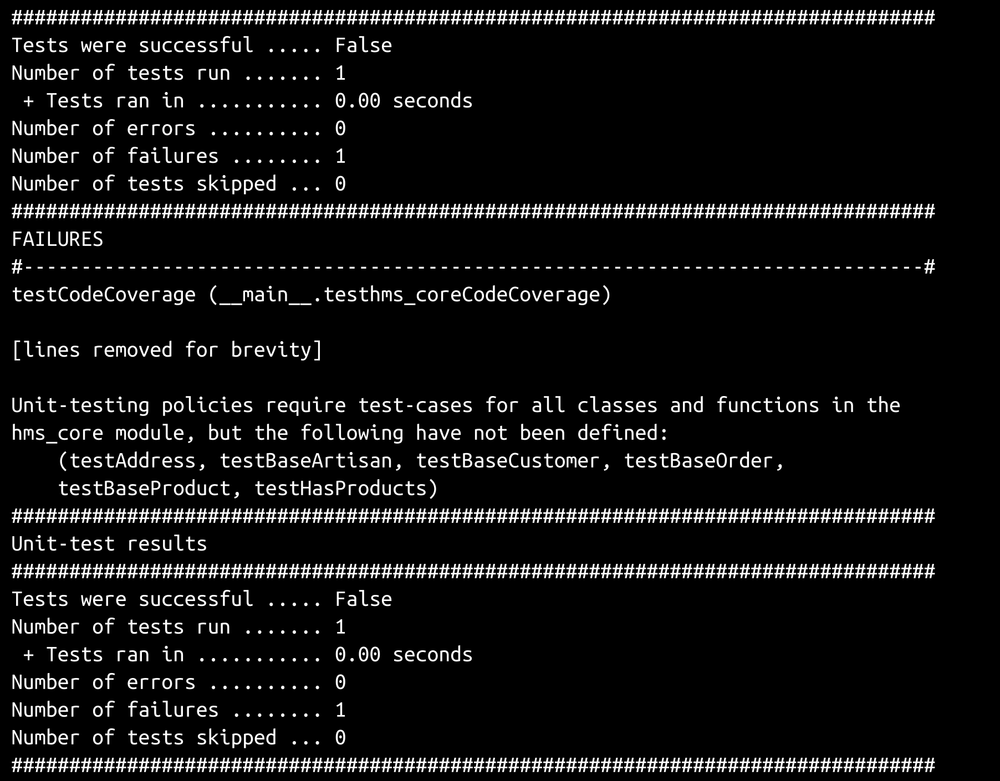
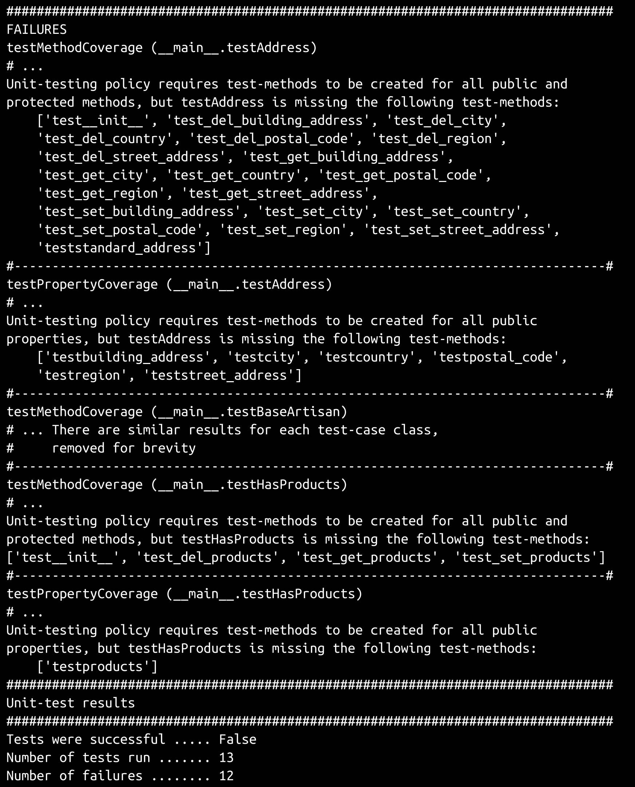
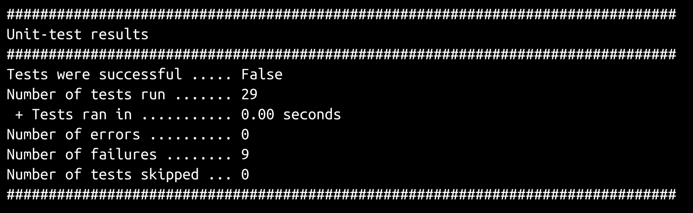
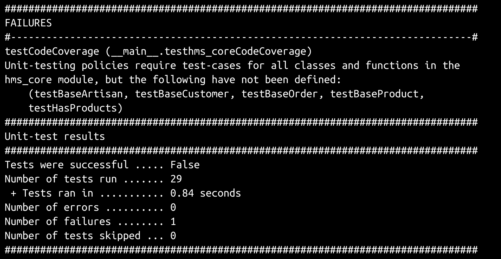
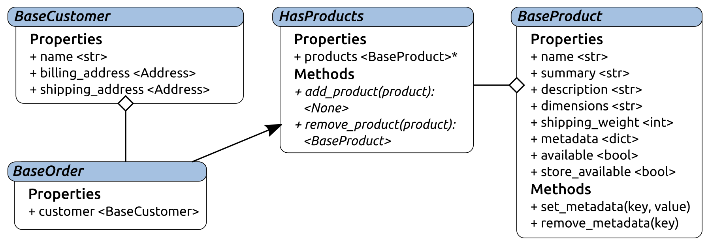
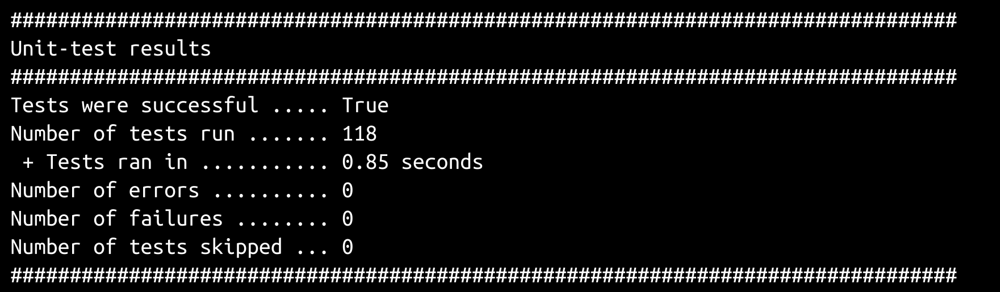
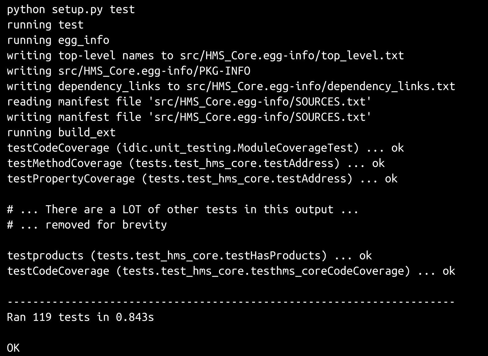
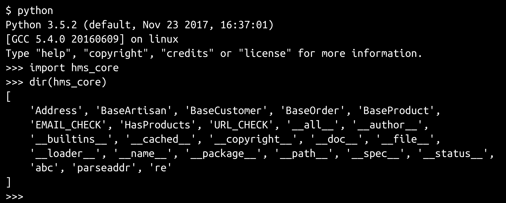

# 第九章：测试业务对象

一旦定义和测试了核心业务对象，它们可以作为其他包中的基础类使用，以提供具体的类功能。采用这种方法至少有两个优点：

+   核心类将处理数据类型、数据结构和数据验证的所有代码放在一个地方，这减少了依赖它们的其他代码库的复杂性

+   一旦为核心对象创建了通过的单元测试，它们提供的所有功能就不需要在其他地方进行测试

+   这些测试可以按需执行，并集成到最终构建过程中，提供一套完整的回归测试，以确保未来的更改不会在执行构建之前破坏现有功能

使用之前提到的测试扩展来构建这些单元测试的过程虽然不难，但一开始会很耗时。在本章中将审查整个过程，建立一些测试模式，我们将在后面的章节中重复使用这些模式，然后将它们整合到包构建过程中。

本章涵盖以下内容：

+   测试业务对象

+   分发和安装考虑

+   质量保证和验收

+   操作/使用、维护和停用考虑

# 开始单元测试过程

使用我们在上一章中定义的标准单元测试结构/框架，可以让我们快速、轻松地开始对任何代码库进行单元测试。它也非常适合迭代测试开发过程。一旦配置项在其中被一对搜索和替换操作设置好，起始点测试模块立即开始报告测试用例和方法的情况。我们的初始测试模块只是以下内容（为了保持列表的简洁，删除了一些注释）：

```py
#!/usr/bin/env python
"""
Defines unit-tests for the module at hms_core.
"""
#######################################
# Standard library imports needed     #
#######################################

import os
import sys
import unittest

#######################################
# Local imports needed                #
#######################################

from idic.unit_testing import *

#######################################
# Module-level Constants              #
#######################################

LocalSuite = unittest.TestSuite()

#######################################
# Import the module being tested      #
#######################################
```

```py
import hms_core as hms_core

#######################################
# Code-coverage test-case and         #
# decorator-methods                   #
#######################################

class testhms_coreCodeCoverage(ModuleCoverageTest):
    # - Class constants that point to the namespace and module 
    #   being tested
    _testNamespace = 'hms_core'
    _testModule = hms_core

LocalSuite.addTests(
    unittest.TestLoader().loadTestsFromTestCase(
        testhms_coreCodeCoverage
    )
)

#######################################
# Test-cases in the module            #
#######################################

#######################################
# Code to execute if file is called   #
# or run directly.                    #
#######################################

if __name__ == '__main__':
    import time
    results = unittest.TestResult()
    testStartTime = time.time()
    LocalSuite.run(results)
    results.runTime = time.time() - testStartTime
    PrintTestResults(results)
    if not results.errors and not results.failures:
        SaveTestReport(results, 'hms_core',
            'hms_core.test-results')
```

执行测试模块产生以下结果：



然后，测试运行输出告诉我们，我们需要为被测试模块中定义的六个类生成测试用例类；具体来说，我们需要创建`testAddress`、`testBaseArtisan`、`testBaseCustomer`、`testBaseOrder`、`testBaseProduct`和`testHasProducts`测试用例类。3

为了利用标准单元测试结构提供的属性和方法覆盖测试，每个测试方法都应该使用`testhms_coreCodeCoverage`提供的`AddMethodTesting`和`AddPropertyTesting`装饰器进行装饰：

```py
#######################################
# Test-cases in the module            #
#######################################

@testhms_coreCodeCoverage.AddMethodTesting
@testhms_coreCodeCoverage.AddPropertyTesting
class testAddress(unittest.TestCase):
    pass
LocalSuite.addTests(
    unittest.TestLoader().loadTestsFromTestCase(
        testAddress
    )
)

@testhms_coreCodeCoverage.AddMethodTesting
@testhms_coreCodeCoverage.AddPropertyTesting
class testBaseArtisan(unittest.TestCase):
    pass
LocalSuite.addTests(
    unittest.TestLoader().loadTestsFromTestCase(
        testBaseArtisan
    )
)

@testhms_coreCodeCoverage.AddMethodTesting
@testhms_coreCodeCoverage.AddPropertyTesting
class testBaseCustomer(unittest.TestCase):
    pass
LocalSuite.addTests(
    unittest.TestLoader().loadTestsFromTestCase(
        testBaseCustomer
    )
)
```

```py
@testhms_coreCodeCoverage.AddMethodTesting
@testhms_coreCodeCoverage.AddPropertyTesting
class testBaseOrder(unittest.TestCase):
    pass
LocalSuite.addTests(
    unittest.TestLoader().loadTestsFromTestCase(
        testBaseOrder
    )
)
@testhms_coreCodeCoverage.AddMethodTesting
@testhms_coreCodeCoverage.AddPropertyTesting
class testBaseProduct(unittest.TestCase):
    pass
LocalSuite.addTests(
    unittest.TestLoader().loadTestsFromTestCase(
        testBaseProduct
    )
)

@testhms_coreCodeCoverage.AddMethodTesting
@testhms_coreCodeCoverage.AddPropertyTesting
class testHasProducts(unittest.TestCase):
    pass
LocalSuite.addTests(
    unittest.TestLoader().loadTestsFromTestCase(
        testHasProducts
    )
)
```

一旦这些测试就位，重新运行测试模块将生成一个（很长的！）需要在测试策略测试通过之前解决的项目清单。需求的完整清单足够长，直接包含在书中只会导致 2-3 页的项目符号列表。然而，完整的结果包含在`hms_core`代码库的`miscellany/initial-test-run.txt`中。整个初始输出太长，无法在此处完整重现，但输出的开头和结尾如下，并指定了需要在六个测试用例类中实现的总共 105 个测试方法：



从那时起，测试编写过程只是重复以下循环，直到所有测试通过为止：

+   选择需要编写的缺失测试方法或一组测试方法

+   将测试方法添加到适用的测试用例类中，并设置为失败，因为它们尚未实现

+   运行测试模块以验证测试是否按预期失败

+   对于每个测试方法：

+   在方法中编写真实的测试代码

+   执行测试模块，并确保该方法中唯一的失败是添加的显式失败，纠正任何出现的问题

+   删除显式失败

即使有标准单元测试过程提供的指导，也不可否认为编写模块的所有单元测试，即使是相对较短的`hms_core`模块，可能会非常乏味。然而，有一些方法可以使这个过程至少变得更快一些，因为我们知道有一些我们期望的常见值类型和格式。我们将首先为`Address`类编写测试，该类具有我们将要处理的最大属性集合之一。随着这些测试的建立，一些常见的（可重复使用的）测试值将开始出现。

这次单元测试过程还将产生一个测试用例类模板文件（`test-case-class.py`），该文件将包含在书籍的代码模板目录中。

# 对 Address 类进行单元测试

`Address`类的测试最初报告需要编写以下测试方法：

+   **方法：** `test__init__`，`test_del_building_address`，`test_del_city`，`test_del_country`，`test_del_postal_code`，`test_del_region`，`test_del_street_address`，`test_get_building_address`，`test_get_city`，`test_get_country`，`test_get_postal_code`，`test_get_region`，`test_get_street_address`，`test_set_building_address`，`test_set_city`，`test_set_country`，`test_set_postal_code`，`test_set_region`，`test_set_street_address`和`test_standard_address`

+   **属性：** `testbuilding_address`，`testcity`，`testcountry`，`testpostal_code`，`testregion`和`teststreet_address`

对被测试类的属性的测试方法的主要关注点可以说是确保属性使用适当的方法进行其 getter、setter 和 deleter 功能。如果这一点被确认为正确，那么处理属性及其值的实际过程可以仅在这些方法的测试方法中进行测试。考虑到这一点，`Address`的大部分属性测试将如下所示：

```py
def testproperty_name(self):
   # Tests the property_name property of the Address class
   # - Assert that the getter is correct:
     self.assertEqual(
         Address.property_name.fget, 
         Address._get_property_name, 
        'Address.property_name is expected to use the '
        '_get_property_name method as its getter-method'
     )
      # - If property_name is not expected to be publicly                       # settable,
      #   the second item here 
      #   (Address._set_property_name) should 
      #   be changed to None, and the failure message           #   adjusted 
      #   accordingly:
           self.assertEqual(
            Address.property_name.fset, 
            Address._set_property_name, 
           'Address.property_name is expected to use the '
           '_set_property_name method as its setter-method'
        )
    #   If property_name is not expected to be publicly     #   deletable,
    #   the second item here (Address._del_property_name)     #   should 
    #   be changed to None, and the failure message         #   adjusted 
     #   accordingly:
       self.assertEqual(
          Address.property_name.fdel, 
          Address._del_property_name, 
          'Address.property_name is expected to use the '
          '_del_property_name method as its deleter-method'
      )
```

通过在代码块中切换模板化的`property_name`为实际的属性名称，可以相当快速地创建单个属性测试，例如，实现`testbuilding_address`：

```py
def testbuilding_address(self):
# Tests the building_address property of the Address class
# - Assert that the getter is correct:
     self.assertEqual(
        Address.building_address.fget, 
        Address._get_building_address, 
       'Address.building_address is expected to use the '
       '_get_building_address method as its getter-method'
     )
# - Assert that the setter is correct:
     self.assertEqual(
        Address.building_address.fset, 
        Address._set_building_address, 
       'Address.building_address is expected to use the '
       '_set_building_address method as its setter-method'
     )
# - Assert that the deleter is correct:
       self.assertEqual(
       Address.building_address.fdel, 
       Address._del_building_address, 
      'Address.building_address is expected to use the '
      '_del_building_address method as its deleter-method'
     )
```

获取器和删除器方法的测试通常也会非常简单 - 它们最终只需要确保它们从正确的内部存储属性中检索数据，并将该属性的值设置为预期的默认值。`test_del_building_address`测试方法作为一个例子：

```py
def test_del_building_address(self):
# Tests the _del_building_address method of the Address 
# class
   test_object = Address('street address', 'city')
    self.assertEqual(
       test_object.building_address, None, 
       'An Address object is expected to have None as its default '
       'building_address value if no value was provided'
    )
# - Hard-set the storage-property's value, call the 
#   deleter-method, and assert that it's what's expected 
#   afterwards:
    test_object._building_address = 'a test value'
    test_object._del_building_address()
    self.assertEqual(
      test_object.building_address, None, 
      'An Address object is expected to have None as its '
      'building_address value after the deleter is called'
    )
```

值得注意的是，为了测试删除器方法（以及后来的获取器和设置器方法），我们实际上必须创建被测试对象的实例 - 这就是测试方法的第三行所做的事情（`test_object = Address…`）。一旦创建了该实例，如果正在测试的属性在测试对象的创建中不是必需的或作为其一部分提供，我们还可以（并且应该）测试实例的默认/删除值。即使为测试对象提供了一个值，通过设置底层存储属性中的值，调用删除器方法，并在之后验证结果，删除过程的测试在几乎所有情况下都将保持不变。

测试相应的 getter 方法将是类似的；它实际上只需要提供属性是否从正确的存储属性中检索数据：

```py
def test_get_building_address(self):
# Tests the _get_building_address method of the Address 
# class
  test_object = Address('street address', 'city')
  expected = 'a test-value'
  test_object._building_address = expected
  actual = test_object._get_building_address()
  self.assertEqual(
    actual, expected, 
   'Address._get_building_address was expected to return '
   '"%s" (%s), but returned "%s" (%s) instead' % 
   (
       expected, type(expected).__name__,
       actual, type(actual).__name__,
   )
)
```

通常有用的是设置可以传递给测试的核心断言的`expected`和`actual`值，特别是如果检索这些值涉及使用方法或函数。这不会产生功能上的差异，但以后阅读起来会更容易，保持易于理解和可读性是非常重要的，比保持被测试代码可读和可理解更重要——毕竟，测试代码是质量保证工作，不应该因为加密结构而出现错误。

值得注意的是，`city`和`street_address`属性的测试方法略有不同，因为它们都是在实例创建期间设置的属性。

```py
def test_del_city(self):
   # Tests the _del_city method of the Address class
   expected = 'city'
   test_object = Address('street address', expected)
   self.assertEqual(
     test_object.city, expected, 
    'An Address object is expected to have "%s" (%s) as its '
    'current city value, since that value was provided' % 
       (expected, type(expected).__name__)
     )
# - Since we have a value, just call the deleter-method, 
#   and 
#   assert that it's what's expected afterwards:
     test_object._del_city()
       self.assertEqual(
         test_object.city, None, 
         'An Address object is expected to have None as its '
         'city value after the deleter is called'
     )
```

不同之处在于，由于预期创建的测试对象将提供一个值，因此我们在创建测试对象之前设置了预期值进行测试，然后使用该预期值创建测试对象，然后测试以确保删除器在对象创建期间不会删除最初设置的值。尽管如此，明确告知时它被删除的测试本质上是相同的。

一旦使用这些模式建立了所有 getter 和 deleter 方法的测试，测试模块运行开始显示进展。正在运行的 29 个测试之一（也是失败的一个）是代码覆盖测试，它正在捕捉`BaseArtisan`和其他`hms_core`类的缺失测试用例类，这些类已经被注释掉，以便更轻松地处理`testAddress`测试方法的结果输出。剩下的八个失败中，有六个是`testAddress`的设置方法测试，我们将在下一步实现，另外两个是`test__init__`和`teststandard_address`，我们将最后看一下：



与 getter 和 deleter 方法对应的测试方法很简单，因为被测试的方法本身相当简单。它们（到目前为止）不做任何决定，也不对值进行任何操作；它们只是返回当前值，或者在不需要对替换值做任何决定的情况下进行替换。此外，它们也没有参数需要处理。

设置方法更复杂；它们会做出决策，会有参数（即使只有一个），并且可能预期根据这些参数的类型和值而表现出不同的行为。因此，相应的测试方法可能也会因此而变得更复杂，这种期望是有根据的。对于良好设计的测试来说，测试复杂性将随着输入复杂性的增加而增长，因为这些测试必须检查输入的所有逻辑变体。当我们测试属性的设置方法时，这将开始变得明显，首先从`Address.building_address`开始。

良好设计的单元测试需要做几件事情，其中并非所有事情一开始就显而易见。最明显的事项可能是测试所有快乐路径输入可能性：预期类型和预期有效值的输入，应该在没有错误的情况下执行并产生预期的结果，无论这些结果是什么。也许不那么明显的是，单元测试还应该使用一组已知的坏值进行代表性样本集的测试，这些值预计会引发错误并阻止被测试的过程完成错误数据。让我们再次以此为基础来看一下`Address`的`_set_building_address`方法：

```py
def _set_building_address(self, value:(str,None)) -> None:
    if value != None:
 # - Type-check: If the value isn't None, then it has to 
 #   be a non-empty, single-line string without tabs
    if type(value) != str:
       raise TypeError(
       '%s.building_address expects a single-line, '
       'non-empty str value, with no whitespace '
       'other than spaces or None, but was passed '
       '"%s" (%s)' % 
          (
             self.__class__.__name__, value, 
             type(value).__name__
          )
                )
  # - Value-check: no whitespace other than " "
         bad_chars = ('\n', '\r', '\t')
         is_valid = True
         for bad_char in bad_chars:
            if bad_char in value:
               is_valid = False
               break
 # - If it's empty or otherwise not valid, raise error
     if not value.strip() or not is_valid:
         raise ValueError(
         '%s.building_address expects a single-line, '
         'non-empty str value, with no whitespace '
         'other than spaces or None, but was passed '
         '"%s" (%s)' % 
           (
              self.__class__.__name__, value, 
              type(value).__name__
           )
        )
 # - If this point is reached without error, then the 
 #   string-value is valid, so we can just exit the if
      self._building_address = value
```

可以合理测试的良好值包括以下内容：

+   `None`——如果将`None`作为值传递，则它将简单地通过并设置在内部存储属性中。

+   任何单行非空字符串，不包含制表符或空格字符以外的其他空白字符。

可行的坏值包括以下内容：

+   任何不是字符串的值。

+   空字符串。

+   包含任何换行字符或任何不是空格的空白的字符串。

+   一个什么都不是的空格字符的字符串；这个项目不太明显，但是代码会引发`ValueError`，因为这样的输入会被值检查代码中的`if not value.strip()`捕获。对仅包含空格的字符串调用`.strip()`的结果是一个空字符串，这将被评估为`False`（-ish），从而引发错误。

`_set_building_address`方法不会尝试进行任何内容验证，因此我们目前不必担心；我们默认假设，如果有人费心输入一个格式良好的`building_address`值，那么输入的值将是准确的。

早些时候，`business_address`属性被归类为标准可选文本行属性。如果这个分类是正确的，那么生成一个好的标准可选文本行属性值的单一列表将是可能的，也是有利的，这样这些值就可以被用于逻辑上适用于所有属性测试的所有属性。这个列表，作为测试模块中的一个常量，可能会像这样：

```py
GoodStandardOptionalTextLines = [
    'word', 'hyphenated-word', 'short phrase', 
    'A complete sentence.', 
    'A short paragraph. This\'s got some punctuation, '
    'including "quoted text."',
    None # Because optional items are allowed to be None
]
```

然后，测试`test_set_business_address`中的好值就变得很简单，只需要遍历该值列表，调用 setter 方法，并断言在设置值后 getter 方法的结果与预期值匹配：

```py
# - Create an object to test with:
test_object = Address('street address', 'street_address')
# - Test all permutations of "good" argument-values:
  for expected in GoodStandardOptionalTextLines:
     test_object._set_building_address(expected)
     actual = test_object._get_building_address()
     self.assertEqual(
        expected, actual, 
        'Address expects a building_address value set to '
        '"%s" (%s) to be retrieved with a corresponding '
        'getter-method call, but "%s" (%s) was returned '
        'instead' % 
     (
```

```py
expected, type(expected).__name__, 
         actual, type(actual).__name__, 
     )
  )
```

如果我们已经在其他地方测试了属性与 getter 方法相关联，那么也可以对属性进行断言，而不是对 getter 方法进行断言。

对应的坏值列表将包括之前列出的所有坏项，并且看起来会像这样：

```py
BadStandardOptionalTextLines = [
    # Bad string values
    'multiple\nlines', 'also multiple\rlines', 
    'text\twith\tabs',
    # Values that aren't strings at all
    1, True, 0, False, object(), 
    # empty and whitespace-only strings
    '', '  ',
]
```

相应的坏值测试与之前显示的好值迭代类似，只是它们将专门寻找执行预期失败的情况，并且如果这些情况没有发生或以意外的方式发生，则会失败：

```py
# - Test all permutations of "bad" argument-values:
for value in BadStandardOptionalTextLines:
   try:
      test_object._set_building_address(value)
     # - If this setter-call succeeds, that's a 
     #   test-failure!
      self.fail(
         'Address._set_business_address should raise '
         'TypeError or ValueError if passed "%s" (%s), '
         'but it was allowed to be set instead.' % 
                (value, type(value).__name__)
        )
    except (TypeError, ValueError):
    # - This is expected, so it passes
         pass
    except Exception as error:
        self.fail(
          'Address._set_business_address should raise '
          'TypeError or ValueError if passed an invalid '
          'value, but %s was raised instead: %s.' % 
                (error.__class__.__name__, error)
        )
```

通过使用`try`...`except`块，这个测试过程将执行以下操作：

+   如果 setter 方法允许设置坏值而不引发错误，则明确失败

+   如果坏值在测试对象中设置时引发预期的错误（在大多数情况下是`TypeError`或`ValueError`），则通过

+   如果在执行期间 setter 方法引发了除了预期的两种类型之外的任何错误，则失败

相同的测试方法结构可以用于`Address`的所有标准可选文本行值/类型的属性，而不需要更改 setter 方法名称。基本上，`Address`的所有属性 setter，除了标准必需文本行项目`city`和`street_address`之外，都是相同的，只是名称不同。

然而，可选文本行属性和必需文本行属性之间唯一的区别是，可选项可以允许`None`作为有效参数，而必需项则不行。如果我们为这些差异创建单独的测试值列表，并更改测试方法使用的列表，那么相同的结构，只是具有不同的好和坏值，仍然可以工作：

```py
GoodStandardRequiredTextLines = [
    'word', 'hyphenated-word', 'short phrase', 
    'A complete sentence.', 
    'A short paragraph. This\'s got some punctuation, '
    'including "quoted text."',
]
BadStandardRequiredTextLines = [
    # Bad string values
    'multiple\nlines', 'also multiple\rlines', 
    'text\twith\tabs',
    # Values that aren't strings at all
    1, True, 0, False, object(), 
    # empty and whitespace-only strings
    '', '  ',
    None # Because optional items are NOT allowed to be None
]

# ... 

def test_set_city(self):
    # Tests the _set_city method of the Address class
    # - Create an object to test with:
    test_object = Address('street address', 'street_address')
    # - Test all permutations of "good" argument-values:
    for expected in GoodStandardRequiredTextLines:
        test_object._set_city(expected)
        actual = test_object._get_city()
        self.assertEqual(
            expected, actual, 
            'Address expects a city value set to '
            '"%s" (%s) to be retrieved with a corresponding '
            'getter-method call, but "%s" (%s) was returned '
            'instead' % 
            (
                expected, type(expected).__name__, 
                actual, type(actual).__name__, 
            )
        )
    # - Test all permutations of "bad" argument-values:
    for value in BadStandardRequiredTextLines:
        try:
            test_object._set_city(value)
            # - If this setter-call succeeds, that's a 
            #   test-failure!
            self.fail(
                'Address._set_business_address should raise '
                'TypeError or ValueError if passed "%s" (%s), '
                'but it was allowed to be set instead.' % 
                (value, type(value).__name__)
            )
        except (TypeError, ValueError):
            # - This is expected, so it passes
            pass
        except Exception as error:
            self.fail(
                'Address._set_business_address should raise '
                'TypeError or ValueError if passed an invalid '
                'value, but %s was raised instead: %s.' % 
                (error.__class__.__name__, error)
            )
```

在所有 setter 方法测试就位后，重新运行测试模块显示只有三个测试失败：


除了其他测试用例类的覆盖测试之外，只剩下`__init__`和`standard_address`方法需要测试。

测试`__init__`方法并不困难。它真正需要建立的是在创建新对象实例的初始化过程中，适当调用各种属性设置器。其他测试已经证实了属性连接到它们预期的 getter/setter/deleter 方法，并且这些方法正在按照预期进行。由于我们有预定义的良好值列表，可以迭代这些值，所以可以简单地设置一个（大）嵌套循环集来检查这些值的所有可能组合，因为它们适用于每个属性。循环的嵌套级别非常深（足够深，以至于以下代码每行只缩进两个空格以适应页面），但它有效：

```py
def test__init__(self):
  # Tests the __init__ method of the Address class
  # - Test all permutations of "good" argument-values:
  for building_address in GoodStandardOptionalTextLines:
    for city in GoodStandardRequiredTextLines:
      for country in GoodStandardOptionalTextLines:
        for postal_code in GoodStandardOptionalTextLines:
          for region in GoodStandardOptionalTextLines:
            for street_address in GoodStandardRequiredTextLines:
              test_object = Address(
                street_address, city, building_address,
                region, postal_code, country
              )
              self.assertEqual(test_object.street_address, street_address)
              self.assertEqual(test_object.city, city)
              self.assertEqual(test_object.building_address, building_address)
              self.assertEqual(test_object.region, region)
              self.assertEqual(test_object.postal_code, postal_code)
              self.assertEqual(test_object.country, country)
```

同样的方法在实现`teststandard_address`时同样有效：

```py
def teststandard_address(self):
  # Tests the standard_address method of the Address class
  # - Test all permutations of "good" argument-values:
  for street_address in GoodStandardRequiredTextLines:
    for building_address in GoodStandardOptionalTextLines:
      for city in GoodStandardRequiredTextLines:
        for region in GoodStandardOptionalTextLines:
          for postal_code in GoodStandardOptionalTextLines:
            for country in GoodStandardOptionalTextLines:
              test_object = Address.standard_address(
                street_address, building_address, 
                city, region, postal_code, 
                country
              )
              self.assertEqual(test_object.street_address, street_address)
              self.assertEqual(test_object.building_address, building_address)
              self.assertEqual(test_object.city, city)
              self.assertEqual(test_object.region, region)
              self.assertEqual(test_object.postal_code, postal_code)
              self.assertEqual(test_object.country, country)
```

这样，`Address`类的测试就完成了：



模块的单元测试过程的平衡实际上包括重新激活其他测试用例类，为它们创建基线失败的测试方法，然后运行测试模块并编写和纠正测试，正如前面所述。由于测试过程的执行方式，生成的输出将按照每个测试用例类的每个测试方法按字母顺序排列。因此，`HasProducts`的测试用例类将最后执行，在其中，`testproducts`方法之后是`test_del_products`，`test_get_products`和`test_set_products`。在输出中，处理最后失败的测试用例所需的时间比滚动整个输出查找正在处理的单个特定测试方法要少，因此剩下的测试将按照这个顺序进行处理和讨论。

# 单元测试 HasProducts

`products`属性的测试方法`testproducts`必须考虑属性的只读性质——记住`products`属性设置为防止或至少最小化对底层`list`值的随意操作的可能性。除了对 setter 和 deleter 方法分配的测试的更改之外，它基本上与以前的属性测试方法相同：

```py
def testproducts(self):
    # Tests the products property of the HasProducts class
    # - Assert that the getter is correct:
    self.assertEqual(
        HasProducts.products.fget, 
        HasProducts._get_products, 
        'HasProducts.products is expected to use the '
        '_get_products method as its getter-method'
    )
    # - Assert that the setter is correct:
    self.assertEqual(
        HasProducts.products.fset, None, 
        'HasProducts.products is expected to be read-only, with '
        'no associated setter-method'
    )
    # - Assert that the deleter is correct:
    self.assertEqual(
        HasProducts.products.fdel, None, 
        'HasProducts.products is expected to be read-only, with '
        'no associated deleter-method'
    )
```

对于像`HasProducts`这样的 ABC 的方法进行测试，在某种程度上，与像`Address`这样的具体类的过程相同：必须创建一个作为 ABC 实例的测试对象，然后将相关的测试值传递给方法并断言它们的结果。但是，如果 ABC 具有抽象成员，则无法实例化，因此必须定义并使用一个具有抽象成员最小实现的一次性派生类来代替具体类来创建测试对象。为了测试`HasProducts`的成员方法，该类是`HasProductsDerived`，它看起来像这样：

```py
class HasProductsDerived(HasProducts):
    def __init__(self, *products):
        HasProducts.__init__(self, *products)
# NOTE: These do NOT have to actually *do* anything, they
# merely have to *exist* in order to allow an instance 
    #       to be created:
    def add_product(self, product):
        pass
    def remove_product(self, product):
        pass
```

定义了该类后，可以创建`_get_products`，`_set_products`和`_del_products`的测试，这些测试是迄今为止使用的测试策略的直接变体，尽管它们首先需要使用`throwaway`类定义`GoodProducts`和`BadProducts`。

```py
#  Since we needed this class in order to generate good #  product-
#   setter test-values, but it wasn't defined until now, #   we'll 
#   create the GoodProducts test-values here...
GoodProducts = [
    [
        BaseProductDerived('test1', 'summary1', True, True),
        BaseProductDerived('test2', 'summary2', True, True),
    ],
    (
        BaseProductDerived('test3', 'summary3', True, True),
        BaseProductDerived('test4', 'summary4', True, True),
    ),
]
BadProducts = [
    object(), 'string', 1, 1.0, True, None,
    ['list','with','invalid','values'],
    [
        BaseProductDerived('test4', 'summary4', True, True), 
        'list','with','invalid','values'
    ],
    ('tuple','with','invalid','values'),
    (
        BaseProductDerived('test4', 'summary4', True, True), 
        'tuple','with','invalid','values'
    ),
]
```

一旦这些也就位了，测试方法如下：

```py
def test_del_products(self):
# Tests the _del_products method of the HasProducts class
   test_object = HasProductsDerived()
   self.assertEqual(test_object.products, (),
   'HasProducts-derived instances are expected to return '
   'an empty tuple as a default/deleted value'
   )
# - Test all permutations of "good" argument-values:
        test_object._set_products(GoodProducts[0])
        self.assertNotEqual(test_object.products, ())
        test_object._del_products()
        self.assertEqual(test_object.products, ())

def test_get_products(self):
 # Tests the _get_products method of the HasProducts class
        test_object = HasProductsDerived()
 # - Test all permutations of "good" argument-values:
        expected = GoodProducts[1]
        test_object._products = expected
        self.assertEqual(test_object._get_products(), expected)

    def test_set_products(self):
# Tests the _set_products method of the HasProducts class
        test_object = HasProductsDerived()
# - Test all permutations of "good" argument-values:
        for expected in GoodProducts:
            test_object._set_products(expected)
            if type(expected) != tuple:
                expected = tuple(expected)
            self.assertEqual(expected, test_object._get_products())
# - Test all permutations of each "bad" argument-value 
#   set against "good" values for the other arguments:
        for value in BadProducts:
            try:
                test_object._set_products(value)
                self.fail(
                    'HasProducts-derived classes should not allow '
                    '"%s" (%s) as a valid products value, but it '
                    'was allowed to be set.' % 
                    (str(value), type(value).__name__)
                )
            except (TypeError, ValueError):
                pass
```

`HasProducts.__init__`的测试方法使用了与`test_set_products`相同类型的方法：

```py
def test__init__(self):
  # Tests the __init__ method of the HasProducts class
  # - Test all permutations of "good" argument-values:
        for expected in GoodProducts:
            test_object = HasProductsDerived(*expected)
            if type(expected) != tuple:
                expected = tuple(expected)
            self.assertEqual(test_object.products, expected)
```

由于`HasProducts`在其`add_product`和`remove_product`方法背后隐藏了具体功能，因此也可以以同样的方式测试该功能，但是根据我们的测试策略，任何调用这些方法的派生类方法仍然必须单独进行测试，因此在这个时候额外的努力并没有太大意义。

# 单元测试 BaseProduct

`BaseProduct`的属性测试方法不需要任何新的东西；它们遵循与具有完整 get/set/delete 功能的属性相同的方法，除了对`metadata`属性的测试，它测试为只读属性，就像我们刚刚展示的对`HasProducts.products`的测试一样。

`BaseProduct`的许多测试方法也将遵循先前建立的模式——测试标准必需和可选文本行的好值和坏值变体，但也有一些需要新的或至少是变体的方法。

`set_metadata`和`remove_metadata`方法的测试与以前的测试有足够的不同，值得更仔细地检查。为了测试新的元数据键/值项的添加，有必要跟踪一个预期值，以便可以执行相同的键和值的添加。测试方法中通过创建一个空字典(`expected = {}`)来实现这一点，在调用测试对象的`set_metadata`方法的迭代中对其进行修改。随着每次迭代的进行，预期值相应地被改变，并与实际值进行比较：

```py
def testset_metadata(self):
 # Tests the set_metadata method of the BaseProduct class
  test_object = BaseProductDerived('name', 'summary', True, True)
  expected = {}
 # - Test all permutations of "good" argument-values:
  for key in GoodStandardRequiredTextLines:
      value = '%s value'
      expected[key] = value
      test_object.set_metadata(key, value)
      self.assertEqual(test_object.metadata, expected)
```

对坏键和值集的测试使用一个好值，用于未被测试的任何项，并迭代坏值，确保适当的错误被引发：

```py
    # - Test all permutations of each "bad" argument-value 
    #   set against "good" values for the other arguments:
    value = GoodStandardRequiredTextLines[0]
    for key in BadStandardRequiredTextLines:
        try:
            test_object.set_metadata(key, value)
            self.fail(
              'BaseProduct.set_metadata should not allow '
              '"%s" (%s) as a key, but it raised no error' 
                % (key, type(key).__name__)
            )
        except (TypeError,ValueError):
            pass
        except Exception as error:
           self.fail(
              'BaseProduct.set_metadata should raise TypeError '
              'or ValueError if passed  "%s" (%s) as a key, '
              'but %s was raised instead:\n    %s' % 
                (
                    key, type(key).__name__,
                    error.__class__.__name__, error
                )
            )
    key = GoodStandardRequiredTextLines[0]
    for value in BadStandardRequiredTextLines:
        try:
            test_object.set_metadata(key, value)
            self.fail(
              'BaseProduct.set_metadata should not allow '
              '"%s" (%s) as a value, but it raised no error' 
                % (value, type(value).__name__)
            )
        except (TypeError,ValueError):
            pass
        except Exception as error:
            self.fail(
                'BaseProduct.set_metadata should raise TypeError '
                'or ValueError if passed  "%s" (%s) as a value, '
                'but %s was raised instead:\n    %s' % 
                (
                    value, type(value).__name__,
                    error.__class__.__name__, error
                )
            )
```

`BaseProduct`的`remove_metadata`方法的测试方法使用了类似的策略来跟踪预期值，以便将测试结果与之进行比较。唯一的显著区别是，预期值（以及测试对象的`metadata`）需要在尝试删除任何`metadata`值之前进行填充：

```py
def testremove_metadata(self):
    # Tests the remove_metadata method of the BaseProduct class
    # - First we need sopme meadata to remove
    test_object = BaseProductDerived('name', 'summary', True, True)
    expected = {
        'materials':'wood',
        'material-names':'cherry,oak',
        'finish':'gloss'
    }
    for key in expected:
        test_object.set_metadata(key, expected[key])
    self.assertEqual(test_object.metadata, expected)
    # - Test all permutations of "good" argument-values:
    keys = list(expected.keys())
    for key in keys:
        del expected[key]
        test_object.remove_metadata(key)
        self.assertEqual(test_object.metadata, expected)
```

`BaseProduct`的布尔值属性`available`和`store_available`的 setter 方法的测试仍然使用了在其他地方使用的相同的好值和坏值迭代方法，只是它们需要一个不同的好值和坏值列表来进行测试：

```py
GoodBooleanOrIntEquivalents = [
    True, False, 1, 0
]
```

```py
BadBooleanOrIntEquivalents = [
    'true', '', (1,2), tuple()
]
```

同样，对`_set_shipping_weight`的测试方法需要另一组值列表，对`_set_metadata`的测试方法也是如此：

```py
GoodWeights = [
    0, 1, 2, 0.0, 1.0, 2.0, 1.5
]
BadWeights = [
    -1, -1.0, object(), 'true', '', (1,2), tuple()
]
GoodMetadataDicts = [
    {},
    {'spam':'eggs'}
]
BadMetadataDicts = [
    -1, -1.0, object(), 'true', '', (1,2), tuple()
]
```

对`_set_shipping_weight`的初始测试运行也促使对构成有效运输重量的假设进行审查。经过反思，而且在这一点上并不知道测量单位是什么，这些值很可能需要允许浮点值，特别是如果最终需要允许磅、千克甚至吨的运输，尽管这可能是不太可能的。

系统不应该对有效的运输重量设置任何限制，除了确保它是一个数字（因为它总是会是）并且不是负数。毕竟，产品可能包括像一张书法作品或一张纸上的插图这样的东西，这些东西重量都不会很重。另一方面，几十磅到一吨或更多的重量范围内的大理石半身像甚至大型金属雕塑也同样可能。

考虑到所有这些因素，`_set_shipping_weight`被修改为允许更广泛的值类型，并且还允许零值：

```py
def _set_shipping_weight(self, value:(int,float)):
    if type(value) not in (int, float):
        raise TypeError(
            '%s.shipping_weight expects a non-negative numeric '
            'value, but was passed "%s" (%s)' % 
            (
                self.__class__.__name__, 
                value, type(value).__name__
            )
        )
    if value < 0:
        raise ValueError(
            '%s.shipping_weight expects a non-negative numeric '
            'value, but was passed "%s" (%s)' % 
            (
                self.__class__.__name__, 
                value, type(value).__name__
            )
        )
    self._shipping_weight = value
```

对`_set_description`的测试还需要一个额外的新值列表来测试坏值；描述可以是任何字符串值，因为它目前是这样实现的，目前还没有适当捕捉坏值的坏值列表：

```py
BadDescriptions = [
    # Values that aren't strings at all
    1, True, 0, False, object(), 
    # empty and whitespace-only strings
    '', '  ',
]
```

# 对 BaseOrder 进行单元测试

根据覆盖测试，对`BaseOrder`进行单元测试只关注测试`customer`属性以及与该属性交互的任何方法。这是因为`BaseOrder`继承自`HasProducts`。由于`HasProducts`的成员没有在`BaseOrder`中被覆盖，它们仍然属于`HasProducts`，并且已经进行了相应的测试：



像`BaseProduct`和`HasProducts`的测试过程一样，测试`BaseOrder`需要创建一个一次性的派生类，用于测试方法成员。由于`BaseOrder`还期望在对象构造期间提供客户实例，因此我们还需要创建一个`BaseCustomer`派生类来提供这样的对象，并且需要良好和不良的客户值进行测试：

```py
class BaseCustomerDerived(BaseCustomer):
    pass

GoodCustomers = [
    BaseCustomerDerived('customer name', Address('street-address', 'city'))
]
BadCustomers = [
    '', 'string', 1, 0, True, False, 1.0, 0.0, object(), [],
]
```

`BaseCustomerDerived`类不需要实现任何内容，因为`BaseCustomer`本身没有抽象成员，这引发了一个有趣的想法：如果它没有任何抽象成员，为什么我们一开始就将其定义为抽象类呢？这一决定背后的最初想法是，预计客户对象在系统的不同组件之间可以做的事情以及允许的数据访问可能会有很大的变化。

自我们最初的实现以来，这种期望没有改变，因此仍然有效。与此同时，可以创建一个`BaseCustomer`的实际实例，因为它没有定义抽象成员，这至少有可能在某个地方引入错误；如果我们相信`BaseCustomer`确实是抽象的，即使它没有提供抽象成员，创建它的具体实例也不应该被允许。至少可以通过在`BaseCustomer`的`__init__`方法中添加几行代码来管理，尽管这样做可能会感觉有些尴尬：

```py
def __init__(self, 
  name:(str,), billing_address:(Address,), 
  shipping_address:(Address,None)=None
):

   # ...

   # - Prevent a direct instantiation of this class - it's 
        #   intended to be abstract, even though it has no 
        #   explicitly-abstract members:
        if self.__class__ == BaseCustomer:
            raise NotImplementedError(
                'BaseCustomer is intended to be an abstract class, '
                'even though it does not have any explicitly '
                'abstract members, and should not be instantiated.'
            )
```

这本质上检查了正在创建的对象的类类型，并且如果正在创建的对象是抽象类本身的实例，则引发`NotImplementedError`。当我们为该类编写`test__init__`方法时，我们将不得不记住测试这一点，因此现在在测试方法中值得注意一下，以免以后遗失：

```py
def test__init__(self):
    # Tests the __init__ method of the BaseCustomer class
    # - Test to make sure that BaseCustomer can't be 
    #   instantiated on its own!
    # - Test all permutations of "good" argument-values:
    # - Test all permutations of each "bad" argument-value 
    #   set against "good" values for the other arguments:
    self.fail('test__init__ is not yet implemented')
```

除此之外，创建`BaseCustomerDerived`类和`GoodCustomers`和`BadCustomers`值列表以进行测试，允许所有`testBaseOrder`测试用例类的测试结构遵循到目前为止一直在使用的通常模式。

# 对 BaseCustomer 进行单元测试

`BaseCustomer`的所有属性 getter、setter 和 deleter 方法测试都遵循典型的模式，尽管通常最好在每个测试中创建单独的实例来处理`test_object`。否则，很快就会导致一个测试对共同对象进行更改，从而使其他测试失败，并且为每个测试创建单独的测试对象可以很好地解决这个问题：

```py
test_object = BaseCustomer(
    'customer name', Address('street-address', 'city')
)
```

`__init__`的测试需要明确测试是否可以创建`BaseCustomer`对象，正如前面所述，这仍然是以前测试用例类中建立的测试结构的典型代表：

```py
def test__init__(self):
# Tests the __init__ method of the BaseCustomer class
# - BaseCustomer is an abstract class, but has no abstract 
#   members, so this was set up to keep it from being 
#   accidentally used in an inappropriate fashion
    try:
       test_object = BaseCustomer(
       'customer name', Address('street-address', 'city')
       )
       self.fail(
          'BaseCustomer is expected to raise '
          'NotImplementedError if instantiated directly, '
                'but did not do so'
       )
     except NotImplementedError:
            pass
```

测试方法的其余部分符合以前测试的预期，对一组相关的良好值进行迭代，并断言它们在实例化时按预期传递到属性中：

```py
# - Test all permutations of "good" argument-values:
    for name in GoodStandardRequiredTextLines:
       for billing_address in GoodAddresses:
          # - Testing without a shipping-address first
            test_object = BaseCustomerDerived(
                name, billing_address
            )
            self.assertEqual(test_object.name, name)
            self.assertEqual(
                test_object.billing_address, 
                billing_address
             )
            for shipping_address in GoodAddresses:
               test_object = BaseCustomerDerived(
                  name, billing_address, 
                   shipping_address
             )
             self.assertEqual(
                test_object.shipping_address, 
                shipping_address
             )
```

# 对 BaseArtisan 进行单元测试

到目前为止，我们已经建立了应该用于所有针对`BaseArtisan`的测试的模式：

+   它是一个抽象类，因此我们需要为测试目的创建一个派生类（`BaseArtisanDerived`）

+   所有的属性 getter、setter 和 deleter 方法都遵循已经建立的模式之一：

+   所有的 getter 和 deleter 方法测试都是标准的

+   `address`几乎是对`BaseCustomer`中的账单和送货地址属性的测试的直接复制，并且使用相同的`GoodAddresses`/`BadAddresses`值列表

+   `company_name`是一个标准的可选文本行测试，就像我们已经测试过的许多其他属性一样

+   `contact_email`和`website`的 setter 方法也遵循标准模式，尽管它们需要新的良好和不良值列表进行测试

+   `contact_name`是一个标准的必需文本行属性，并且像所有其他这样的属性一样进行测试

以下演示了良好和不良值列表的示例：

```py
GoodEmails = [
    'someone@somewhere.com',
    'brian.allbee+hosewp@gmail.com',
]
BadEmails = [
    '', 'string', -1, -1.0, object(), 'true', '', (1,2), tuple()
]
GoodURLs = [
    'http://www.google.com',
    'https://www.google.com',
]
BadURLs = [
    '', 'string', -1, -1.0, object(), 'true', '', (1,2), tuple()
]
```

然而，对`BaseArtisan`的测试揭示了在`__init__`方法中没有提供`website`参数，也没有在构造对象期间支持传递`website`，因此相应地进行了修改：

```py
def __init__(self, 
    contact_name:str, contact_email:str, 
    address:Address, company_name:str=None, 
    website:(str,)=None, 
    **products
    ):

    # ...

    # - Call parent initializers if needed
    HasProducts.__init__(self, *products)
    # - Set default instance property-values using _del_... methods
    self._del_address()
    self._del_company_name()
    self._del_contact_email()
    self._del_contact_name()
    self._del_website()
    # - Set instance property-values from arguments using 
    #   _set_... methods
    self._set_contact_name(contact_name)
    self._set_contact_email(contact_email)
    self._set_address(address)
    if company_name:
        self._set_company_name(company_name)
    if website:
        self._set_website(website)
```

最后，这样就完成了系统的第一个模块的 118 个测试：



# 到目前为止已经建立的单元测试模式

对系统中第一个模块的单元测试进行了大量探索，这种探索已经建立了一些模式，这些模式将经常出现在编写的其他系统代码的单元测试中，因此除非它们有重大的新方面，否则从这一点开始它们将不会被重新审查。

这些模式如下：

+   迭代好和坏的值列表，这些值对于正在测试的成员是有意义的：

+   标准可选文本行值

+   标准必需的文本行值

+   布尔值（及其数值等价物）

+   元数据值

+   非负数值（例如重量值）

+   验证属性方法关联——到目前为止，在每种情况下都是 getter 方法，以及在预期的地方是 setter 和 deleter 方法

+   验证 getter 方法是否检索其底层存储属性值

+   验证 deleter 方法是否按预期重置其底层存储属性值

+   验证 setter 方法是否按预期强制执行类型和值检查

+   验证初始化方法（`__init__`）是否按预期调用所有的 deleter 和 setter 方法

# 分发和安装考虑因素

默认的`setup.py`，添加了`hms_core`的包名称并删除了注释，非常基本，但仍然提供了构建可部署的 Python 包所需的一切`hms_core`代码库。它还提供了执行为包创建的所有单元测试的能力，给定它们所在的路径，并且能够找到已经使用的单元测试扩展：

```py
#!/usr/bin/env python

# - Provide an import-path for the unit-testing standards we're using:
import sys
sys.path.append('../standards')

# - Standard setup.py import and structure
from setuptools import setup

# The actual setup function call:
setup(
    name='HMS-Core',
    version='0.1.dev0',
    author='Brian D. Allbee',
    description='',
    package_dir={
        '':'src',
    },
    packages=[
        'hms_core',
    ],
    test_suite='tests.test_hms_core',
)
```

执行以下操作：

```py
python setup.py test
```

这将执行项目的`tests/test_hms_core`目录中的整个测试套件：



执行以下操作：

```py
python setup.py sdist
```

这将创建包的源分发，然后可以使用以下命令安装：

```py
pip install HMS-Core-0.1.dev0.tar.gz
```

这可以在包文件所在的目录的终端会话中完成。

此时，`setup.py`构建过程将引发一些错误，但这些错误都不会阻止包的构建或安装：

+   `警告：sdist：未找到标准文件：应该有 README、README.rst、README.txt 之一`

+   `警告：检查：缺少必需的元数据：url`

+   `警告：检查：缺少元数据：如果提供了'author'，则必须同时提供'author_email'`

安装后，`hms_core`包可以像任何其他 Python 包一样使用：



在这个迭代中，最初的三个故事集中在`hms_core`和其他组件项目库之间的构建和部署过程如何交互，目前尚未解决：

+   作为一名工匠，我需要业务对象库与我的应用程序一起安装，以便应用程序能够按需工作，而无需我安装其依赖组件

+   作为中央办公室用户，我需要业务对象库与我的应用程序一起安装，以便应用程序能够按需工作，而无需我安装其依赖组件

+   作为系统管理员，我需要业务对象库与工匠网关服务一起安装，以便它能够按需工作，而无需我安装其依赖组件

在这一点上，因为我们没有其他库可以进行测试，实际上不能对其进行执行——我们将不得不等待至少一个可安装软件包的实际实现，然后才能处理这些问题，因此它们将被放回待办事项，并在实际可以处理时再次处理。

# 质量保证和验收

由于该库提供的功能是基础性的，旨在被其他库使用，因此在正式的质量保证（QA）过程中，实际上没有太多公共功能可以进行有意义的测试。如果这个迭代中涉及到正式的 QA 过程，最多只能执行单元测试套件，并验证这些测试是否能够正常执行而没有失败或错误。

同样，由于迭代中涉及的大部分故事都是为了开发人员的利益，因此几乎不需要外部验收；库中各种类存在并按预期运行应该足以接受这些故事。

+   作为开发人员，我需要系统中表示地址的通用定义和功能结构，以便我可以将它们纳入需要它们的系统部分。

+   作为开发人员，我需要系统中表示工匠的通用定义和功能结构，以便我可以将它们纳入需要它们的系统部分。

+   作为开发人员，我需要系统中表示客户的通用定义和功能结构，以便我可以将它们纳入需要它们的系统部分。

+   作为开发人员，我需要系统中表示订单的通用定义和功能结构，以便我可以将它们纳入需要它们的系统部分。

+   作为开发人员，我需要系统中表示产品的通用定义和功能结构，以便我可以将它们纳入需要它们的系统部分。

目前，安装方面的故事有点奇怪——它们特别关注各种最终用户的单个可安装软件包，这目前是这样，但随着开发的进展，其他库中将会有更多功能。就目前情况而言，可以说这些故事满足了所有陈述的要求，只因为只有一个组件安装：

+   作为 Artisan，我需要将业务对象库与我的应用程序一起安装，以便应用程序能够按需工作，而无需我安装其依赖组件。

+   作为中央办公室用户，我需要将业务对象库与我的应用程序一起安装，以便应用程序能够按需工作，而无需我安装其依赖组件。

+   作为系统管理员，我需要将业务对象库与 Artisan Gateway 服务一起安装，以便它能够按需工作，而无需我安装其依赖组件。

也可以说，尽管这些故事在此时此刻是完整的，但它们将不得不在尚未构建的各种应用程序和服务组件的开发周期中重复。在这些组件有自己的代码、构建和包之前，就没有需要处理的依赖关系。

# 操作/使用、维护和停用考虑

考虑到这个软件包的简单性，以及它没有外部依赖，对于软件包的操作和使用，或者停用它，都没有明显的考虑或潜在的关注点。在后一种情况下，停用将只是卸载软件包（`pip uninstall HMS-Core`）。维护考虑也将同样限制在更新软件包本身，只需通过重新运行原始安装过程并使用新的软件包文件来管理。

# 总结

这次迭代已经定义了代表系统重要功能方面的基本业务对象，这些对象代表了最终系统的数据元素。然而，它们都只提供了基本的结构和一些关于构成这些元素有效结构的业务规则，除此之外，还没有存储这些元素、检索它们或与它们进行交互的机制，除了直接在代码中通过它们的属性。

下一次迭代章节将深入研究系统应用程序和服务层所需的存储和状态数据持久性。
