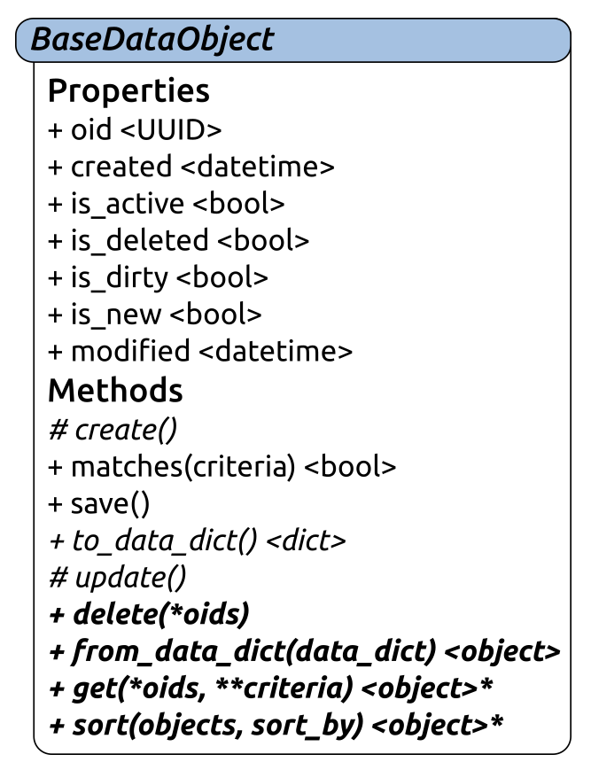
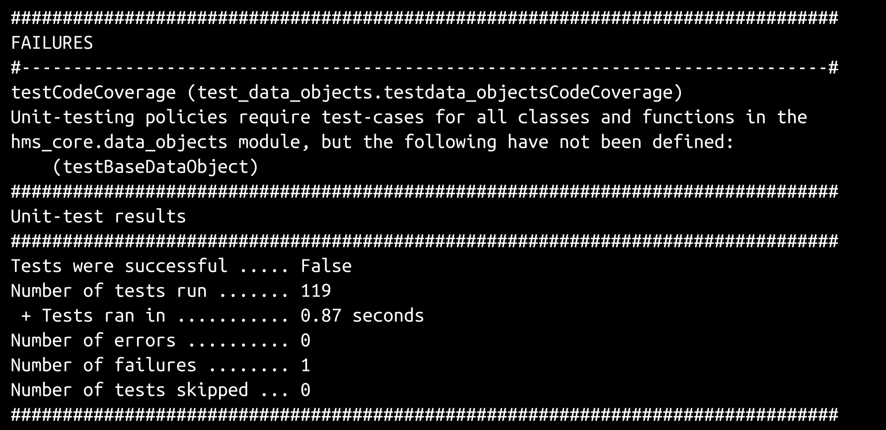
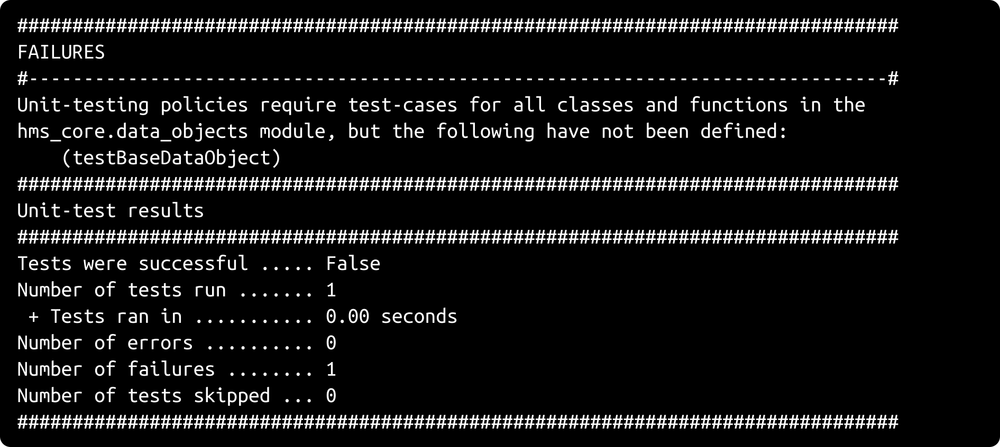
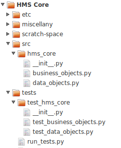

# 第十一章：数据持久性和 BaseDataObject

本章将专注于`BaseDataObject` ABC（抽象基类）的开发和测试，我们将在`hms_artisan`（**Artisan Application**）和`hms_gateway`（**Artisan Gateway**服务）组件项目中都需要它。`hms_co`（**Central Office Application**）代码库可能也需要利用相同的功能。在后面深入研究`hms_co`代码时，我们将更深入地了解这一点。

目前，我们期望`BaseDataObject`看起来像这样：



之前描述的驱动`BaseDataObject`设计和实现的故事如下：

+   作为开发人员，我需要一个通用的结构来提供整个系统可用的业务对象的状态数据的持久性，以便我可以构建相关的最终类

`BaseDataObject`与`hms_core`中的业务对象定义没有功能上的关联，但它提供的功能仍然需要对所有真实的代码库（应用程序和**Artisan Gateway**服务）可用，因此它应该存在于`hms_core`包中，但可能不应该与上一次迭代的业务对象定义一起。从长远来看，如果`hms_core`的各个成员被组织成将元素分组到共同目的或主题的模块，那么理解和维护`hms_core`包将更容易。在本次迭代结束之前，当前的`hms_core.__init__.py`模块将被重命名为更具指示性的名称，并且它将与一个新模块一起存在，该模块将包含所有数据对象的类和功能：`data_object.py`。

还有两个与`BaseDataObject`结构和功能相关的故事，它们的需求将在开发类的过程中得到满足：

+   作为任何数据使用者，我需要能够创建、读取、更新和删除单个数据对象，以便对这些对象执行基本的数据管理任务。

+   作为任何数据使用者，我需要能够搜索特定的数据对象，以便我可以使用找到的结果项。

# BaseDataObject ABC

`BaseDataObject`的大部分属性都是布尔值，表示类的实例是否处于特定状态的标志。这些属性的实现都遵循一个简单的模式，这个模式已经在上一次迭代中的`BaseProduct`的`available`属性的定义中展示过。这个结构看起来像这样：

```py
###################################
# Property-getter methods         #
###################################

def _get_bool_prop(self) -> (bool,):
    return self._bool_prop

###################################
# Property-setter methods         #
###################################

def _set_bool_prop(self, value:(bool,int)):
    if value not in (True, False, 1, 0):
        raise ValueError(
            '%s.bool_prop expects either a boolean value '
            '(True|False) or a direct int-value equivalent '
            '(1|0), but was passed "%s" (%s)' % 
            (self.__class__.__name__, value, type(value).__name__)
        )
    if value:
        self._bool_prop = True
    else:
        self._bool_prop = False

###################################
# Property-deleter methods        #
###################################

def _del_bool_prop(self) -> None:
    self._bool_prop = False

###################################
# Instance property definitions   #
###################################

bool_prop = property(
    _get_bool_prop, _set_bool_prop, _del_bool_prop, 
    'Gets sets or deletes the flag that indicates whether '
    'the instance is in a particular state'
)
```

这些属性背后的删除方法，因为它们也用于在初始化期间设置实例的默认值，当删除属性时应该产生特定的值（调用这些方法）：

```py
###################################
# Property-deleter methods        #
###################################

def _del_is_active(self) -> None:
    self._is_active = True

def _del_is_deleted(self) -> None:
    self._is_deleted = False

def _del_is_dirty(self) -> None:
    self._is_dirty = False

def _del_is_new(self) -> None:
    self._is_new = True
```

除非被派生类或特定对象创建过程覆盖，从`BaseDataObject`派生的任何实例都将以这些值开始：

+   `is_active == True`

+   `is_deleted == False`

+   `is_dirty == False`

+   `is_new == True`

因此，新创建的实例将是活动的，未删除的，未修改的，新的，假设是创建新对象的过程通常是为了保存一个新的、活动的对象。如果在实例创建之间进行了任何状态更改，这些更改可能会在过程中将`is_dirty`标志设置为`True`，但`is_new`为`True`的事实意味着对象的记录需要在后端数据存储中被创建而不是更新。

与标准布尔属性结构的唯一重大偏差在于它们的定义过程中属性本身的文档：

```py
###################################
# Instance property definitions   #
###################################

is_active = property(
    _get_is_active, _set_is_active, _del_is_active, 
    'Gets sets or deletes the flag that indicates whether '
    'the instance is considered active/available'
)
is_deleted = property(
    _get_is_deleted, _set_is_deleted, _del_is_deleted, 
    'Gets sets or deletes the flag that indicates whether '
    'the instance is considered to be "deleted," and thus '
    'not generally available'
)
is_dirty = property(
    _get_is_dirty, _set_is_dirty, _del_is_dirty, 
    'Gets sets or deletes the flag that indicates whether '
    'the instance\'s state-data has been changed such that '
    'its record needs to be updated'
)
is_new = property(
    _get_is_new, _set_is_new, _del_is_new, 
    'Gets sets or deletes the flag that indicates whether '
    'the instance needs to have a state-data record created'
)
```

`BaseDataObject`的两个属性`created`和`modified`在类图中显示为`datetime`值-表示特定日期的特定时间的对象。`datetime`对象存储日期/时间的年、月、日、小时、分钟、秒和微秒，并提供了一些方便之处，例如，与严格作为时间戳数字值管理的等效值或日期/时间的字符串表示相比。其中一个方便之处是能够从字符串中解析值，允许属性背后的`_set_created`和`_set_modified`setter 方法接受字符串值而不是要求实际的`datetime`。同样，`datetime`提供了从时间戳创建`datetime`实例的能力-从公共起始日期/时间开始经过的秒数。为了完全支持所有这些参数类型，有必要定义一个通用的格式字符串，用于从字符串中解析`datetime`值并将其格式化为字符串。至少目前来看，最好将该值存储为`BaseDataObject`本身的类属性。这样，所有从中派生的类都将默认可用相同的值：

```py
class BaseDataObject(metaclass=abc.ABCMeta):
    """
Provides baseline functionality, interface requirements, and 
type-identity for objects that can persist their state-data in 
any of several back-end data-stores.
"""
    ###################################
    # Class attributes/constants      #
    ###################################

    _data_time_string = '%Y-%m-%d %H:%M:%S'
```

setter 方法比大多数方法要长一些，因为它们处理四种不同的可行值类型，尽管只需要两个子进程来覆盖所有这些变化。setter 过程首先通过类型检查提供的值并确认它是接受的类型之一：

```py
def _set_created(self, value:(datetime,str,float,int)):
    if type(value) not in (datetime,str,float,int):
        raise TypeError(
            '%s.created expects a datetime value, a numeric '
            'value (float or int) that can be converted to '
            'one, or a string value of the format "%s" that '
            'can be parsed into one, but was passed '
            '"%s" (%s)' % 
            (
                self.__class__.__name__, 
                self.__class__._data_time_string, value, 
                type(value).__name__, 
            )
        )
```

处理合法的两种数字类型都相当简单。如果检测到错误，我们应该提供更具体的消息，说明遇到的问题的性质：

```py
 if type(value) in (int, float):
   # - A numeric value was passed, so create a new 
   #   value from it
      try:
         value = datetime.fromtimestamp(value)
      except Exception as error:
         raise ValueError(
             '%s.created could not create a valid datetime '
             'object from the value provided, "%s" (%s) due '
             'to an error - %s: %s' % 
             (
                self.__class__.__name__, value, 
                type(value).__name__, 
                error.__class__.__name__, error
              )
           )
```

处理字符串值的子进程类似，除了调用`datetime.strptime`而不是`datetime.fromtimestamp，并使用`_data_time_string`类属性来定义有效的日期/时间字符串外：

```py
 elif type(value) == str:
    # - A string value was passed, so create a new value 
    #   by parsing it with the standard format
      try:
         value = datetime.strptime(
         value, self.__class__._data_time_string
         )
       except Exception as error:
          raise ValueError(
            '%s.created could not parse a valid datetime '
            'object using "%s" from the value provided, '
            '"%s" (%s) due to an error - %s: %s' % 
             (
                 self.__class__.__name__, 
                 self.__class__._data_time_string, 
                 value, type(value).__name__, 
                 error.__class__.__name__, error
              )
          )
```

如果原始值是`datetime`的实例，那么之前的任何一个子进程都不会被执行。如果它们中的任何一个被执行，那么原始值参数将被替换为`datetime`实例。无论哪种情况，该值都可以存储在底层属性中：

```py
# - If this point is reached without error,then we have a 
#   well-formed datetime object, so store it
self._created = value
```

对于`BaseDataObject`，`created`和`modified`应该始终有一个值，如果在需要时没有可用值（通常只有在保存数据对象的状态数据记录时才需要），则应该为当前值创建一个值，可以在 getter 方法中使用`datetime.now()`来实现：

```py
def _get_created(self) -> datetime:
    if self._created == None:
        self.created = datetime.now()
    return self._created
```

这反过来意味着删除方法应该将属性存储属性的值设置为`None`：

```py
def _del_created(self) -> None:
    self._created = None
```

相应的属性定义是标准的，只是`created`属性不允许直接删除；允许对象删除自己的创建日期/时间是没有意义的：

```py
###################################
# Instance property definitions   #
###################################

created = property(
    _get_created, _set_created, None, 
    'Gets, sets or deletes the date-time that the state-data '
    'record of the instance was created'
)

# ...

modified = property(
    _get_modified, _set_modified, _del_modified, 
    'Gets, sets or deletes the date-time that the state-data '
    'record of the instance was last modified'
)
```

`BaseDataObject`的最后一个属性可能是最关键的`oid`，它旨在唯一标识给定数据对象的状态数据记录。该属性被定义为**通用唯一标识符**（**UUID**）值，Python 在其`uuid`库中提供。使用 UUID 作为唯一标识符而不是一些更传统的方法，例如序列记录号，至少有两个优点：

+   **UUID 不依赖于数据库操作的成功才可用：**它们可以在代码中生成，而无需担心等待 SQL INSERT 完成，例如，或者在 NoSQL 数据存储中可能可用的任何相应机制。这意味着更少的数据库操作，可能也更简单，这样事情就更容易了。

+   **UUID 不容易预测：** UUID 是一系列由 32 个十六进制数字组成的字符串（其中有一些破折号将它们分成了本讨论不相关的部分），例如`ad6e3d5c-46cb-4547-9971-5627e6b3039a`。如果它们是由`uuid`库提供的几个标准函数之一生成的，它们的序列，即使不是真正随机的，也至少足够随机，使得对于恶意用户来说，找到给定值非常困难，有 3.4×10³⁴个可能的值要查找（每个十六进制数字有 16 个值，31 个数字因为其中一个被保留）。

UUID 的不可预测性在具有通过互联网访问的数据的应用程序中尤其有用。通过顺序编号识别记录，使恶意进程更容易命中某种 API 并按顺序检索每个记录，其他条件相同。

然而，还有一些注意事项：

+   并非所有的数据库引擎都会将 UUID 对象识别为可行的字段类型。这可以通过将实际的 UUID 值存储在数据对象中来管理，但是将这些值的字符串表示写入和从数据库中读取。

+   使用 UUID 作为唯一标识符的数据库操作可能会产生非常轻微的性能影响，特别是如果使用字符串表示而不是实际值。

+   它们固有的不可预测性可以使对数据的合法检查变得困难，如果没有其他可以用来查询的标识标准（针对其他标识标准）。

即使将优势放在一边，`BaseDataObject`将使用 UUID 作为对象标识（`oid`属性）的原因是一系列要求和预期的实现的结合：

+   **Artisan Application**将不会有一个真正的数据库支持它。它最终可能会成为一个简单的本地文档存储，因此为任何给定的数据对象生成唯一标识符必须是自包含的，不依赖于应用程序代码库之外的任何东西。

+   **相同的 oid 值需要在**Artisan Application**和**Artisan Gateway**服务之间传播。尝试在任意数量的工匠之间协调身份可能会很快导致身份冲突，而要减轻这种情况可能需要更多的工作（也许是更多），而不会对系统的要求或系统中的各种可安装组件的交互方式进行重大改变。两个随机生成的 UUID 之间发生碰撞的可能性非常低（对于所有实际目的来说几乎不可能），仅仅是因为涉及的可能值的数量。

`oid`属性的实现将遵循与基于`datetime`的属性类似的模式。获取方法将根据需要创建一个，设置方法将接受`UUID`对象或其字符串表示，并在内部创建实际的`UUID`对象，删除方法将将当前存储值设置为`None`：

```py
def _get_oid(self) -> UUID:
    if self._oid == None:
        self._oid = uuid4()
    return self._oid

# ...

def _set_oid(self, value:(UUID,str)):
    if type(value) not in (UUID,str):
        raise TypeError(
            '%s.oid expects a UUID value, or string '
            'representation of one, but was passed "%s" (%s)' % 
            (self.__class__.__name__, value, type(value).__name__)
        )
    if type(value) == str:
        try:
            value = UUID(value)
        except Exception as error:
            raise ValueError(
                '%s.oid could not create a valid UUID from '
                'the provided string "%s" because of an error '
                '%s: %s' % 
                (
                    self.__class__.__name__, value, 
                    error.__class__.__name__, error
                )
            )
    self._oid = value

# ...

def _del_oid(self) -> None:
    self._oid = None
```

`BaseDataObject`的大多数方法都是抽象的，包括所有的类方法。它们都没有任何可能在派生类中重用的具体实现，因此它们都是非常基本的定义。

```py
    ###################################
    # Abstract methods                #
    ###################################

    @abc.abstractmethod
    def _create(self) -> None:
        """
Creates a new state-data record for the instance in the back-end 
data-store
"""
        raise NotImplementedError(
            '%s has not implemented _create, as required by '
            'BaseDataObject' % (self.__class__.__name__)
        )

    @abc.abstractmethod
    def to_data_dict(self) -> (dict,):
        """
Returns a dictionary representation of the instance which can 
be used to generate data-store records, or for criteria-matching 
with the matches method.
"""
        raise NotImplementedError(
            '%s has not implemented _create, as required by '
            'BaseDataObject' % (self.__class__.__name__)
        )

    @abc.abstractmethod
    def _update(self) -> None:
        """
Updates an existing state-data record for the instance in the 
back-end data-store
"""
        raise NotImplementedError(
            '%s has not implemented _update, as required by '
            'BaseDataObject' % (self.__class__.__name__)
        )

    ###################################
    # Class methods                   #
    ###################################

    @abc.abstractclassmethod
    def delete(cls, *oids):
        """
Performs an ACTUAL record deletion from the back-end data-store 
of all records whose unique identifiers have been provided
"""
        raise NotImplementedError(
            '%s.delete (a class method) has not been implemented, '
            'as required by BaseDataObject' % (cls.__name__)
        )

    @abc.abstractclassmethod
    def from_data_dict(cls, data_dict:(dict,)):
        """
Creates and returns an instance of the class whose state-data has 
been populate with values from the provided data_dict
"""
        raise NotImplementedError(
            '%s.from_data_dict (a class method) has not been '
            'implemented, as required by BaseDataObject' % 
            (cls.__name__)
        )

    @abc.abstractclassmethod
    def get(cls, *oids, **criteria):
        """
Finds and returns all instances of the class from the back-end 
data-store whose oids are provided and/or that match the supplied 
criteria
"""
        raise NotImplementedError(
            '%s.get (a class method) has not been implemented, '
            'as required by BaseDataObject' % (cls.__name__)
        )
```

`to_data_dict`实例方法和`from_data_dict`类方法旨在提供机制，将实例的完整状态数据表示为`dict`，并从这样的`dict`表示中创建一个实例。`from_data_dict`方法应该促进记录检索和转换为实际的程序对象，尤其是在 Python 中的标准 RDBMS 连接库中，如果数据库中的字段名与类的属性名相同。在 NoSQL 数据存储中也应该有类似的用法。尽管`to_data_dict`方法在写入数据存储时可能有用，但它将需要根据标准匹配对象（我们马上会讨论的`matches`方法）。

PEP-249，当前的**Python 数据库 API 规范**，定义了符合 PEP 标准的库中的数据库查询的预期，至少会返回元组列表作为结果集。大多数成熟的数据库连接器库还提供了一种方便的机制，以返回一个`dict`记录值列表，其中每个`dict`将字段名映射为源记录的值。

`_create`和`_update`方法只是记录创建和记录更新过程的要求，并最终将被`save`方法调用。然而，单独的记录创建和记录更新过程的需求可能并不适用于所有数据存储引擎；一些，特别是在 NoSQL 领域，已经提供了写入记录的单一机制，并且根本不关心它是否已经存在。其他一些可能提供某种机制，允许首先尝试创建一个新记录，如果失败（因为找到了重复的键，表明记录已经存在），则更新现有记录。这个选项在`MySQL`和`MariaDB`数据库中可用，但可能也存在于其他地方。在任何这些情况下，覆盖保存方法以使用这些单一接触点的过程可能是一个更好的选择。

`delete`类方法是不言自明的，`sort`可能也是如此。

`get`方法需要一些检查，即使没有任何具体的实现。正如前面所述，它旨在成为从数据库检索状态数据并接受零到多个对象 ID（`*oids`参数列表）和过滤标准（在`**criteria`关键字参数中）的主要机制。整个`get`过程实际上的预期工作如下：

+   如果`oids`不为空：

1.  执行所需的任何低级查询或查找以找到与提供的`oids`之一匹配的对象，使用`from_data_dict`处理每个记录并生成对象列表

1.  如果`criteria`不为空，则将当前列表过滤为那些与标准的`matches`结果为`True`的对象

1.  返回结果列表

+   否则，如果`criteria`不为空：

+   执行所需的任何低级查询或查找以找到与提供的标准值之一匹配的对象，使用`from_data_dict`处理每个记录并生成对象列表

+   将当前列表过滤为那些与标准的`matches`结果为`True`的对象

+   返回结果列表

+   否则，执行所需的任何低级查询或查找以检索所有可用对象，再次使用`from_data_dict`处理每个记录，生成对象列表并简单地返回它们所有

综合考虑，`oids`和`criteria`值的组合将允许`get`类方法找到并返回执行以下操作的对象：

+   匹配一个或多个`oids`：`get(oid[, oid, …, oid])`

+   匹配一个或多个`oids`和一些`criteria`的集合：`get(oid[, oid, …, oid], key=value[, key=value, …, key=value])`

+   匹配一个或多个`criteria`键/值对，无论找到的项目的`oids`如何：`get(key=value[, key=value, …, key=value])`

+   这只是存在于后端数据存储中的：`get()`

这留下了`matches`和`save`方法，这两个方法是类中唯一的两个具体实现。`matches`的目标是提供一个实例级机制，用于比较实例与标准名称/值，这是`get`方法中使用和依赖的过程，以实际找到匹配项。它的实现比起一开始可能看起来要简单，但依赖于对`set`对象的操作，并且依赖于一个经常被忽视的 Python 内置函数（`all`），因此代码中的过程本身有很多注释：

```py
###################################
# Instance methods                #
###################################

def matches(self, **criteria) -> (bool,):
    """
Compares the supplied criteria with the state-data values of 
the instance, and returns True if all instance properties 
specified in the criteria exist and equal the values supplied.
"""
    # - First, if criteria is empty, we can save some time 
    #   and simply return True - If no criteria are specified, 
    #   then the object is considered to match the criteria.
    if not criteria:
        return True
    # - Next, we need to check to see if all the criteria 
    #   specified even exist in the instance:
    data_dict = self.to_data_dict()
    data_keys = set(check_dict.keys())
    criteria_keys = set(criteria.keys())
    # - If all criteria_keys exist in data_keys, then the 
    #   intersection of the two will equal criteria_keys. 
    #   If that's not the case, at least one key-value won't 
    #   match (because it doesn't exist), so return False
    if criteria_keys.intersection(data_keys) != criteria_keys:
        return False
    # - Next, we need to verify that values match for all 
    #   specified criteria
    return all(
        [
            (data_dict[key] == criteria[key]) 
            for key in criteria_keys
        ]
    )
```

`all`函数是一个很好的便利，如果它被传递的可迭代对象中的所有项都评估为`True`（或至少是真的，因此非空字符串、列表、元组和字典以及非零数字都被认为是`True`），它将返回`True`。如果可迭代对象中的任何成员不是`True`，则返回`False`，如果可迭代对象为空，则返回`True`。如果出现这些条件，`matches`的结果将是`False`：

+   `criteria`中的任何键都不存在于实例的`data_dict`中- 一个无法匹配的标准键，本质上

+   `criteria`中指定的任何值都不完全匹配实例的`data_dict`中的相应值

`save`方法非常简单。它只是根据实例的`is_new`或`is_dirty`标志属性的当前状态调用实例的`_create`或`_update`方法，然后在执行后重置这些标志，使对象变得干净并准备好接下来可能发生的任何事情：

```py
    def save(self):
        """
Saves the instance's state-data to the back-end data-store by 
creating it if the instance is new, or updating it if the 
instance is dirty
"""
        if self.is_new:
            self._create()
            self._set_is_new = False
            self._set_is_dirty = False
```

```py
        elif self.is_dirty:
            self._update()
            self._set_is_dirty = False
            self._set_is_new = False
```

`BaseDataObject`的初始化应该允许为其所有属性指定值，但不需要这些值：

```py
    def __init__(self, 
        oid:(UUID,str,None)=None, 
        created:(datetime,str,float,int,None)=None, 
        modified:(datetime,str,float,int,None)=None,
        is_active:(bool,int,None)=None, 
        is_deleted:(bool,int,None)=None,
        is_dirty:(bool,int,None)=None, 
        is_new:(bool,int,None)=None,
    ):
```

实际的初始化过程遵循了先前为所有参数建立的可选参数模式：对于每个参数，如果参数不是`None`，则调用相应的`_del_`方法，然后调用相应的`_set_`方法。让我们以`oid`参数为例：

```py
        # - Call parent initializers if needed
        # - Set default instance property-values using _del_... methods

        # ...

        self._del_oid()
        # - Set instance property-values from arguments using 
        #   _set_... methods
        if oid != None:
            self._set_oid(oid)

        # ...

        # - Perform any other initialization needed
```

这个初始化方法的签名变得非常长，有七个参数（忽略`self`，因为它总是存在的，并且总是第一个参数）。知道我们最终将定义具体类作为`BaseDataObject`和已定义的业务对象类的组合，这些具体类的`__init__`签名也可能会变得更长。然而，这正是`BaseDataObject`的初始化签名使所有参数都是可选的原因之一。与其中一个业务对象类结合使用时，例如`BaseArtisan`，其`__init__`签名如下：

```py
def __init__(self, 
    contact_name:str, contact_email:str, 
    address:Address, company_name:str=None, 
    website:(str,)=None, 
    *products
    ):
```

从这两者派生的`Artisan`的`__init__`签名，虽然很长...

```py
def __init__(self, 
    contact_name:str, contact_email:str, 
    address:Address, company_name:str=None, 
    website:(str,)=None, 
    oid:(UUID,str,None)=None, 
    created:(datetime,str,float,int,None)=None, 
    modified:(datetime,str,float,int,None)=None,
    is_active:(bool,int,None)=None, 
    is_deleted:(bool,int,None)=None,
    is_dirty:(bool,int,None)=None, 
    is_new:(bool,int,None)=None,
    *products
    ):
```

...只需要`BaseArtisan`需要的`contact_name`、`contact_email`和`address`参数，并允许所有参数都被传递，就像它们是关键字参数一样，像这样：

```py
artisan = Artisan(
    contact_name='John Doe', contact_email='john@doe.com', 
    address=my_address, oid='00000000-0000-0000-0000-000000000000', 
    created='2001-01-01 12:34:56', modified='2001-01-01 12:34:56'
)
```

允许将整个参数集定义为单个字典，并使用传递关键字参数集的相同语法将其整体传递给初始化程序：

```py
artisan_parameters = {
    'contact_name':'John Doe',
    'contact_email':'john@doe.com', 
    'address':my_address,
    'oid':'00000000-0000-0000-0000-000000000000', 
    'created':'2001-01-01 12:34:56', 
    'modified':'2001-01-01 12:34:56'
}
artisan = Artisan(**artisan_parameters)
```

在 Python 中，使用`**dictionary_name`将参数传递给字典的语法是一种常见的参数参数化形式，特别是在参数集合非常长的函数和方法中。这需要在开发过程的设计方面进行一些思考和纪律，并且需要对必需参数非常严格，但从长远来看，它比一开始看起来的更有帮助和更容易使用。

这个最后的结构将对从`BaseDataObject`派生的各种类的`from_data_dict`方法的实现至关重要- 在大多数情况下，它应该允许这些方法的实现不仅仅是这样：

```py
@classmethod
def from_data_dict(cls, data_dict):
    return cls(**data_dict)
```

# 单元测试`BaseDataObject`

就目前而言，对`BaseDataObject`进行单元测试将会是有趣的。测试`matches`方法，这是一个依赖于抽象方法(`to_data_dict`)的具体方法，而抽象方法又依赖于派生类的实际数据结构(`properties`)，在`BaseDataObject`的测试用例类的上下文中，要么是不可能的，要么是没有意义的：

+   为了测试`matches`，我们必须定义一个非抽象类，其中包含`to_data_dict`的具体实现，以及一些实际属性来生成该`dict`。

+   除非该派生类也恰好是系统中需要的实际类，否则它在最终系统代码中没有相关性，因此在那里的测试不能保证其他派生类在`matches`中不会出现问题

+   即使完全放置`matches`方法的测试，测试`save`也同样毫无意义，原因是它是一个依赖于在`BaseDataObject`级别上是抽象和未定义的方法的具体方法

当实现`BaseArtisan`时，我们定义了它的`add_product`和`remove_product`方法为抽象，但仍然在两者中编写了可用的具体实现代码，以便允许派生类简单地调用父类的实现。实际上，我们要求所有派生类都实现这两个方法，但提供了一个可以从派生类方法内部调用的实现。同样的方法应用到`BaseDataObject`中的`matches`和`save`方法，基本上会强制每个派生具体类的测试要求，同时允许在需要覆盖该实现之前或除非需要覆盖该实现之前使用单一实现。这可能感觉有点狡猾，但这种方法似乎没有任何不利之处：

+   以这种方式处理的方法仍然必须在派生类中实现。

+   如果由于某种原因需要覆盖它们，测试策略仍将要求对它们进行测试。

+   如果它们只是作为对父类方法的调用实现，它们将起作用，并且测试策略代码仍将识别它们为派生类的本地方法。我们的测试策略表示这些方法需要一个测试方法，这允许测试方法针对派生类的特定需求和功能执行。

然而，测试`save`不必采用这种方法。最终，就该方法而言，我们真正关心的是能够证明它调用了`_create`和`_update`抽象方法并重置了标志。如果可以在测试`BaseDataObject`的过程中测试和建立这个证明，我们就不必在其他地方进行测试，除非测试策略代码检测到该方法的覆盖。这将使我们能够避免在以后的所有最终具体类的所有测试用例中散布相同的测试代码，这是一件好事。

开始`data_objects`模块的单元测试非常简单：

1.  在项目的`test_hms_core`目录中创建一个`test_data_object.py`文件

1.  执行头部注释中指出的两个名称替换

1.  在同一目录的`__init__.py`中添加对它的引用

1.  运行测试代码并进行正常的迭代测试编写过程

在`__init__.py`中对新测试模块的引用遵循我们的单元测试模块模板中已经存在的结构，复制现有代码中以`# import child_module`开头的两行，然后取消注释并将`child_module`更改为新的测试模块：

```py
#######################################
# Child-module test-cases to execute  #
#######################################

import test_data_objects
LocalSuite.addTests(test_data_objects.LocalSuite._tests)

# import child_module
# LocalSuite.addTests(child_module.LocalSuite._tests)
```

这个添加将新的`test_data_objects`模块中的所有测试添加到顶层`__init__.py`测试模块中已经存在的测试中，从而使顶层测试套件能够执行子模块的测试：



`test_data_objects.py`中的测试也可以独立执行，产生相同的失败，但不执行所有其他现有的测试：



为`data_objects.py`编写单元测试的迭代过程与在上一次迭代中为基本业务对象编写测试的过程没有区别：运行测试模块，找到失败的测试，编写或修改该测试，并重复运行直到所有测试通过。由于`BaseDataObject`是一个抽象类，需要一个一次性的派生具体类来执行一些测试。除了针对`BaseDataObject`的`oid`，`created`和`modified`属性的面向值的测试之外，我们已经建立了覆盖其他所有内容的模式：

+   迭代好和坏值列表，这些值对于正在测试的成员是有意义的：

+   （尚不适用）标准可选文本行值

+   （尚不适用）标准必需文本行值

+   布尔（和数值等效）值

+   （尚不适用）非负数值

+   验证属性方法的关联——到目前为止在每种情况下都是获取方法，以及预期的设置方法和删除方法

+   验证获取方法检索其底层存储属性值

+   验证删除方法按预期重置其底层存储属性值

+   验证设置方法是否按预期执行类型检查和值检查

+   验证初始化方法（`__init__`）按预期调用所有删除和设置方法

这三个属性（`oid`，`created`和`modified`）除了没有已定义的测试模式之外，还共享另一个共同特征：如果请求属性并且属性尚未存在值（即，底层存储属性的值为`None`），则这三个属性都将创建一个值。这种行为需要一些额外的测试，超出了测试方法开始时确认获取方法读取存储属性的正常确认（使用`test_get_created`来说明）：

```py
def test_get_created(self):
    # Tests the _get_created method of the BaseDataObject class
    test_object = BaseDataObjectDerived()
    expected = 'expected value'
    test_object._created = expected
    actual = test_object.created
    self.assertEquals(actual, expected, 
        '_get_created was expected to return "%s" (%s), but '
        'returned "%s" (%s) instead' % 
        (
            expected, type(expected).__name__,
            actual, type(actual).__name__
        )
    )
```

到目前为止，测试方法与获取方法的测试非常典型，它设置一个任意值（因为正在测试的是获取方法是否检索到值，而不仅仅是这个），并验证结果是否与设置的值相同。然后，我们将存储属性的值强制设置为 None，并验证获取方法的结果是否是适当类型的对象——在这种情况下是`datetime`：

```py
    test_object._created = None
    self.assertEqual(type(test_object._get_created()), datetime, 
        'BaseDataObject._get_created should return a '
        'datetime value if it\'s retrieved from an instance '
        'with an underlying None value'
    )
```

属性设置方法（在这种情况下为`_set_created`）的测试方法必须考虑属性的所有不同类型变化，这些类型对于`_set_created`来说都是合法的——`datetime`，`int`，`float`和`str`值，然后根据输入类型设置预期值，然后调用被测试的方法并检查结果：

```py
def test_set_created(self):
    # Tests the _set_created method of the BaseDataObject class
    test_object = BaseDataObjectDerived()
    # - Test all "good" values
    for created in GoodDateTimes:
        if type(created) == datetime:
            expected = created
        elif type(created) in (int, float):
            expected = datetime.fromtimestamp(created)
        elif type(created) == str:
            expected = datetime.strptime(
                created, BaseDataObject._data_time_string
            )
        test_object._set_created(created)
        actual = test_object.created
        self.assertEqual(
            actual, expected, 
            'Setting created to "%s" (%s) should return '
            '"%s" (%s) through the property, but "%s" (%s) '
            'was returned instead' % 
            (
                created, type(created).__name__,
                expected, type(expected).__name__, 
                actual, type(actual).__name__, 
            )
        )
    # - Test all "bad" values
    for created in BadDateTimes:
        try:
            test_object._set_created(created)
            self.fail(
                'BaseDataObject objects should not accept "%s" '
                '(%s) as created values, but it was allowed to '
                'be set' % 
                (created, type(created).__name__)
            )
        except (TypeError, ValueError):
            pass
        except Exception as error:
            self.fail(
                'BaseDataObject objects should raise TypeError '
                'or ValueError if passed a created value of '
                '"%s" (%s), but %s was raised instead:\n'
                '    %s' % 
                (
                    created, type(created).__name__, 
                    error.__class__.__name__, error
                )
            )
```

删除方法的测试结构上与之前实施的测试过程相同，尽管：

```py
def test_del_created(self):
    # Tests the _del_created method of the BaseDataObject class
    test_object = BaseDataObjectDerived()
    test_object._created = 'unexpected value'
    test_object._del_created()
    self.assertEquals(
        test_object._created, None,
        'BaseDataObject._del_created should leave None in the '
        'underlying storage attribute, but "%s" (%s) was '
        'found instead' % 
        (
            test_object._created, 
            type(test_object._created).__name__
        )
    )
```

具有相同结构的`created`更改为`modified`，测试`modified`属性的基础方法。具有非常相似结构的`created`更改为`oid`和预期类型更改为`UUID`，作为`oid`属性的属性方法测试的起点。

然后，测试`_get_oid`看起来像这样：

```py
def test_get_oid(self):
    # Tests the _get_oid method of the BaseDataObject class
    test_object = BaseDataObjectDerived()
    expected = 'expected value'
    test_object._oid = expected
    actual = test_object.oid
    self.assertEquals(actual, expected, 
        '_get_oid was expected to return "%s" (%s), but '
        'returned "%s" (%s) instead' % 
        (
            expected, type(expected).__name__,
            actual, type(actual).__name__
        )
    )
    test_object._oid = None
    self.assertEqual(type(test_object.oid), UUID, 
        'BaseDataObject._get_oid should return a UUID value '
        'if it\'s retrieved from an instance with an '
        'underlying None value'
    )
```

测试`_set_oid`看起来像这样（请注意，类型更改还必须考虑不同的预期类型和值）：

```py
    def test_set_oid(self):
        # Tests the _set_oid method of the BaseDataObject class
        test_object = BaseDataObjectDerived()
        # - Test all "good" values
        for oid in GoodOIDs:
            if type(oid) == UUID:
                expected = oid
            elif type(oid) == str:
                expected = UUID(oid)
            test_object._set_oid(oid)
            actual = test_object.oid
            self.assertEqual(
                actual, expected, 
                'Setting oid to "%s" (%s) should return '
                '"%s" (%s) through the property, but "%s" '
                '(%s) was returned instead.' % 
                (
                    oid, type(oid).__name__, 
                    expected, type(expected).__name__, 
                    actual, type(actual).__name__, 
                )
            )
        # - Test all "bad" values
        for oid in BadOIDs:
            try:
                test_object._set_oid(oid)
                self.fail(
                    'BaseDatObject objects should not accept '
                    '"%s" (%s) as a valid oid, but it was '
                    'allowed to be set' % 
                    (oid, type(oid).__name__)
                )
            except (TypeError, ValueError):
                pass
            except Exception as error:
                self.fail(
                    'BaseDataObject objects should raise TypeError '
                    'or ValueError if passed a value of "%s" (%s) '
                    'as an oid, but %s was raised instead:\n'
                    '    %s' % 
                    (
                        oid, type(oid).__name__, 
                        error.__class__.__name__, error
                    )
                )
```

随着所有数据对象测试的完成（目前为止），现在是时候将生活在包头文件（`hms_core/__init__.py`）中的类定义移动到一个专门为它们的模块文件中：`business_objects.py`。虽然这纯粹是一个命名空间组织上的问题（因为类本身都没有被改变，只是它们在包中的位置发生了变化），但从长远来看，这是非常有意义的。移动完成后，包中的类有了逻辑分组：



业务对象定义以及直接与这些类型相关的项目都将存在于`hms_core.business_objects`命名空间中，并且可以从那里导入，例如：

```py
from hms_core.business_objects import BaseArtisan
```

如果需要，`hms_core.business_objects`的所有成员都可以被导入：

```py
import hms_core.business_objects
```

同样，与仍在开发中的数据对象结构相关的功能都将存在于`hms_core.data_objects`命名空间中：

```py
from hms_core.data_objects import BaseDataObject
```

或者，模块的所有成员都可以通过以下方式导入：

```py
import hms_core.data_objects
```

基本数据对象结构准备就绪并经过测试，现在是时候开始实现一些具体的、数据持久化的业务对象，首先是 Artisan 应用程序中的业务对象。

# 摘要

`BaseDataObject`的实现提供了我们之前确定的所有常见数据访问需求的机制（所有 CRUD 操作）：

+   它允许派生数据对象一旦被实例化，就可以创建和更新它们的状态数据。

+   它提供了一个单一的机制，允许从数据存储中读取一个或多个数据对象，并且作为一个额外的奖励，还允许根据除了数据对象的`oid`之外的标准来检索对象。

+   它提供了一个用于删除对象数据的单一机制。

这些方法的实际实现是数据对象本身的责任，它们将直接与每种对象类型使用的存储机制相关联。

Artisan 应用程序的数据存储，读取和写入用户机器上的本地文件，在许多方面来说，是两种数据存储选项中较为简单的，因此我们将从这里开始。
