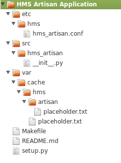
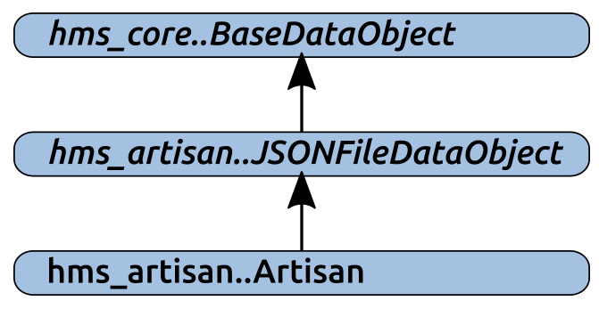
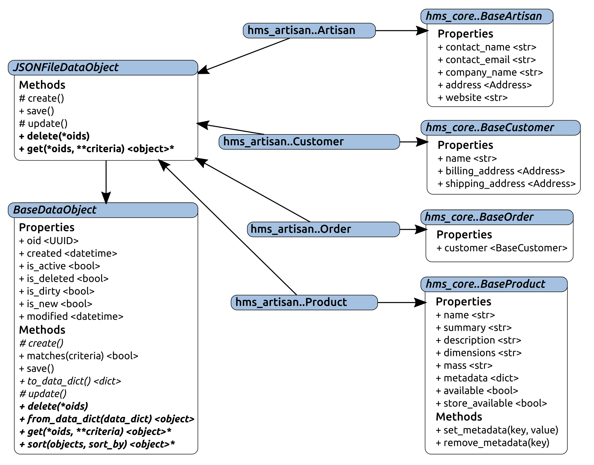
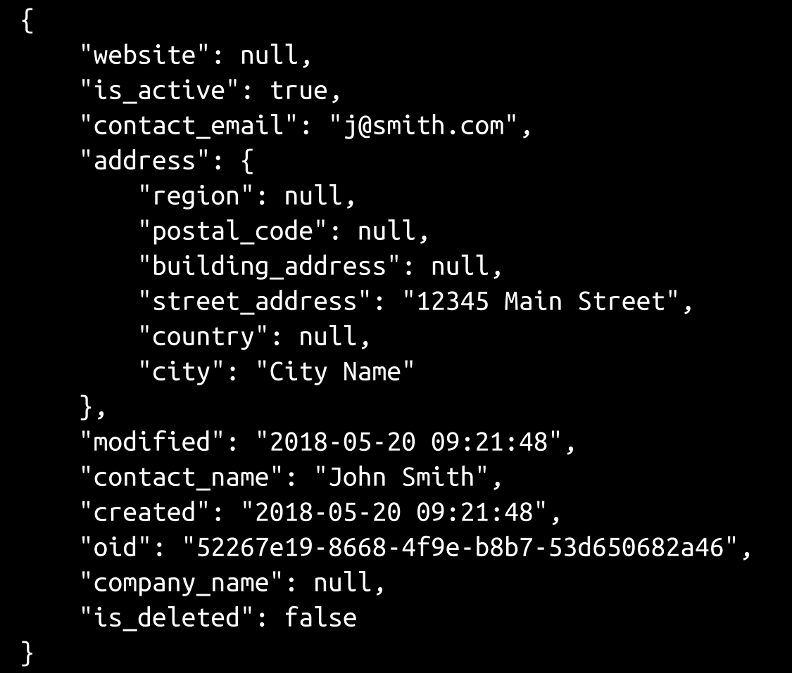
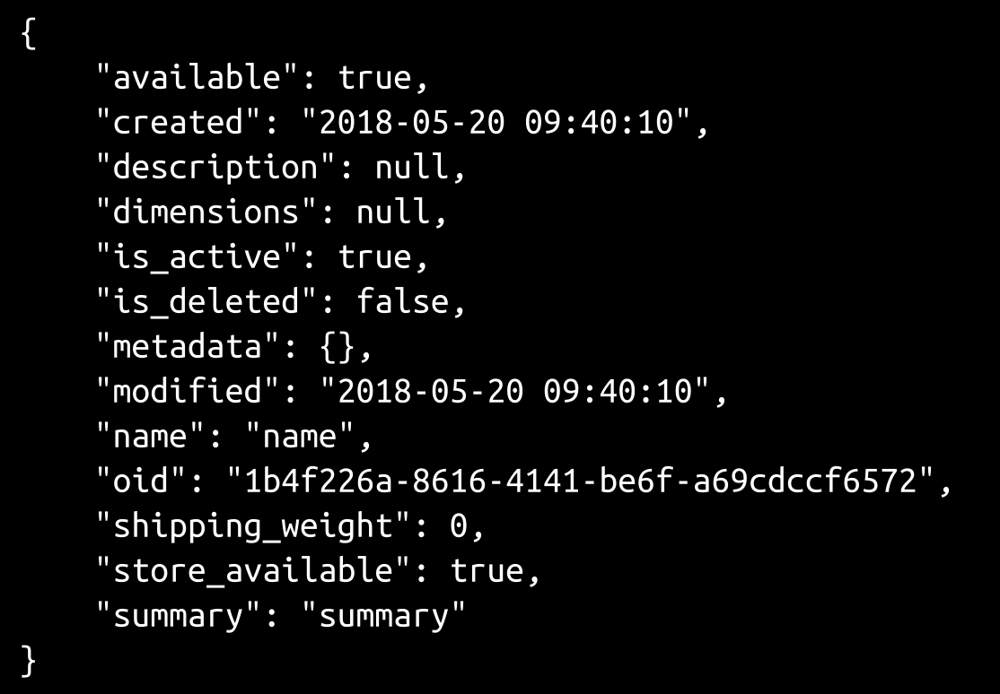
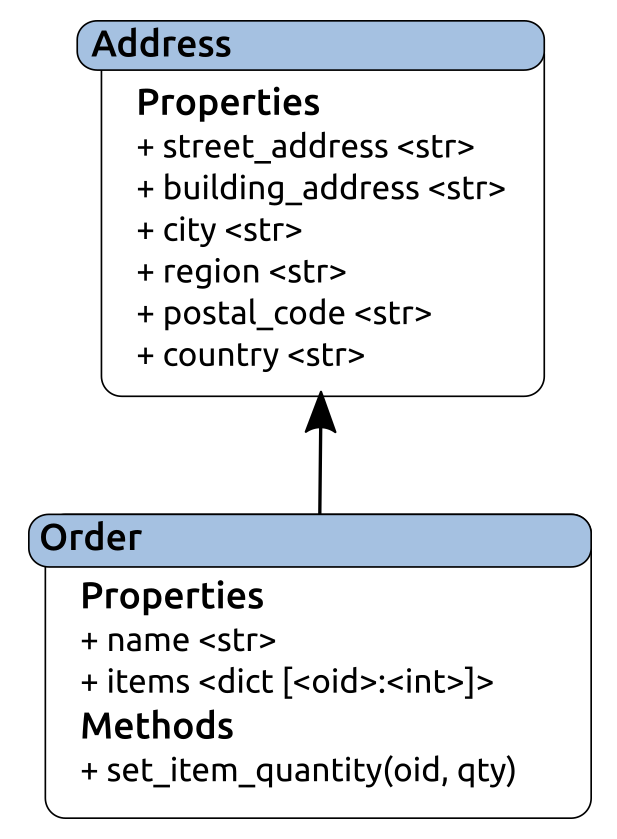
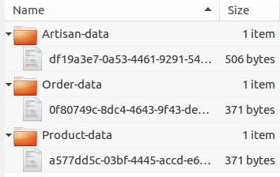
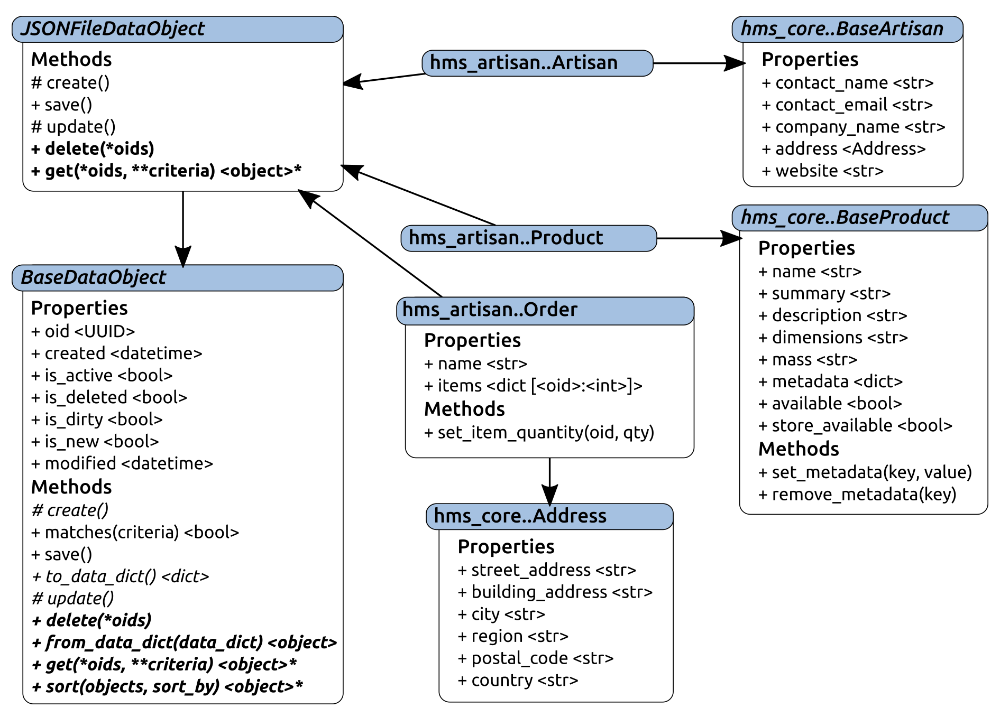

# 第十二章：将对象数据持久化到文件

乍一看，读取和写入文件系统驻留数据存储的过程可能看起来比许多基于数据库的存储机制的等效过程简单得多。毕竟，读写文件是一个非常基本的过程。但实际上，这是一个稍微复杂的过程。需要采取预防措施来处理诸如文件系统权限、应用程序使用数据访问的硬关闭，甚至系统崩溃等问题。虽然这些使开发变得复杂，但它们可能更具挑战性，因为它们更难以识别为可能性，而不是实施保障措施。

本章将涵盖以下内容：

+   `hms_artisan`的基本组件项目设置

+   进一步的抽象层，以封装基于文件系统的数据存储需求

+   `hms_artisan`组件项目中数据对象的开发包括以下内容：

+   Artisans

+   产品

+   订单

# 设置 hms_artisan 项目

有了我们需要的所有基础类（到目前为止）在`hms_core`中定义，我们可以开始在其他项目中构建与它们对应的具体类。由于计划是让**Artisan 应用程序**具有自定义的本地数据存储机制，这可能会比中央办公室应用程序和 Artisan 网关服务中的等效机制更复杂，因此从这个项目开始并创建一个项目结构来满足这个故事的需求可能是最合理的：

+   作为开发人员，我需要一个项目来为 Artisan 应用程序提供一个放置相关代码和构建应用程序的地方。

最初，`hms_artisan`类的代码可以从`hms_artisan/__init__.py`文件开始，就像`hms_core`中的业务对象 ABC 一样从其根`__init__.py`文件开始，但可以合理地假设，这些类似的原因的变体很可能出现在 Artisan 应用程序代码库中。考虑到这一点，我们将创建一个`artisan_objects.py`模块来对它们进行分组和组织。这也将更容易地将我们可能需要的任何数据存储类（它们本身不是数据对象）放在同一个包中的一个单独模块中。我们可以很容易地将**Artisan 应用程序**的所有代码放入一个单独的模块（`hms_artisan.py`）中，而不是在包目录中以及相关文件中。这样做没有功能上的理由，但除非可以确定从单一模块文件实现到包结构不需要更改，否则会增加长期风险，需要重新组织整个命名空间文件结构。起始项目结构看起来非常像第七章中定义的默认结构，*设置项目和流程：*



这种重新组织并不困难，但如果还需要重新组织单元测试模块，那么它就会更加耗时。当这样的重新组织正在进行时，它有可能限制其他人对代码库的工作，这些人不是重新组织的一部分。直到完成之前，它还有可能使源代码控制管理变得非常混乱，这对于开发团队的成员来说并不是一个很好的情况。

尽管我们可能需要一个单独的模块来实际应用程序，但从一开始就将代码细分为逻辑分组是有意义的。

# 创建本地文件系统数据存储

Artisans 对存储数据的需求包括两个故事：

+   作为 Artisan，我需要一个本地数据存储来存储所有系统数据，这样我就不必连接到互联网来进行更改

+   作为一个工匠，我需要我的本地数据存储尽可能简单，不需要额外的软件安装，这样我就不必担心安装和维护数据库系统以及工匠应用程序

各种工匠应用程序数据对象与`BaseDataObject`之间的最终关系可能只是让每个工匠级别的类直接从`BaseDataObject`派生。实际上，如果在工匠级别只有一个这样的类，并且在可预见的将来没有期望发生变化，采取这种方法是很有意义的。处理记录文件的创建、更新其中的数据、读取或删除的代码可以存在于一个类中。然而，由于我们需要关注的对象类型有三种，因此将基于文件的数据存储的共同功能收集到另一个抽象类中，该抽象类位于`BaseDataObject`和具体`hms_artisan`类之间，例如`hms_artisan..Artisan`，至少有一些潜在的好处：



该中间类`JSONFileDataObject`将扩展`BaseDataObject`，添加特定于管理以 JSON 格式文件集合中存在的对象状态数据任务的功能和数据。同时，它将保留来自`BaseDataObject`的抽象要求，或者提供它们的具体实现并使它们可用于诸如`hms_artisan..Artisan`之类的类。这种继承结构的净收益是，理想情况下，执行针对对象的 JSON 后备数据存储的 CRUD 操作所需的所有功能都能够驻留在一个地方。实际上，一些具体细节可能必须驻留在具体类实现中，否则，它们最终都可以包装到一个类中，但几乎肯定会有相当多的共同点可以在中间继承级别中实现。

从`JSONFileDataObject`派生的任何类的更完整的目标集，至少应包括以下内容：

+   任何派生类的所有存储数据可能应该存储在一个位置

+   每个对象类型（类）的实例数据可能应该存储在顶层位置的一个共同位置

+   任何给定实例的数据可能应该存储在一个单独的文件中，其名称可以与存储其数据的实例唯一相关联

此外，还有一些应该具有或值得考虑的功能：

+   如果处理过程不涉及每次执行数据读取时找到、打开、读取和创建对象，数据读取操作将更快。这样做的一个权衡是，每当执行改变数据的操作时，它们必须负责对所涉及的任何数据进行适当的修改，无论它们存在的所有位置。例如，如果有一个从持久文件中读取的对象的内存集合：

+   创建操作必须将新对象添加到内存存储中

+   更新操作必须写入数据存储文件，并更新内存对象

+   删除操作必须删除相关文件，并从内存存储中删除适当的对象

这些都不是特别难以实现的。

# 实现 JSONFileDataObject

定义`JSONFileDataObject`抽象类始于标准的`ABCMeta`元类规范，以及用于各种目的的类级属性：

```py
class JSONFileDataObject(BaseDataObject, metaclass=abc.ABCMeta):
    """
Provides baseline functionality, interface requirements, and 
type-identity for objects that can persist their state-data as 
JSON files in a local file-system file-cache
"""
    ###################################
    # Class attributes/constants      #
    ###################################

    _file_store_dir = None
    _file_store_ready = False
    _loaded_objects = None
```

其中：

+   `_file_store_dir`是一个默认的文件系统目录规范，最终需要从配置文件中读取。目前，为了单元测试目的，它将具有一个硬编码的值，可以在开发和测试期间使用，并且当我们到达 Artisan 应用程序的实现时，我们将查看配置设置。

+   `_file_store_ready`是一个标志值，用于指示类是否已从数据文件中加载了所有可用对象，因此在执行任何 CRUD 操作之前是否需要加载它们。

+   `_loaded_objects`是存储类加载的对象集合的位置。实际对象存储将是对象实例的`dict`，但在加载操作完成之前，默认为`None`，以便在以后确定未加载（`None`）和已加载但没有对象（空`dict`）的状态之间进行区分。

由于它继承自`BaseDataObject`，该类将从那里定义的抽象要求开始，并且如果不满足这些要求就无法实例化。但是，由于我们希望`JSONFileDataObject`也是抽象的，它也具有标准的 ABC 元类规范，并且本身也是抽象的。

`JSONFileDataObject`的初始化方法的签名与其派生自的`BaseDataObject`相同，但在该过程中执行了一些额外的任务：

```py
###################################
# Object initialization           #
###################################

def __init__(self, 
    oid:(UUID,str,None)=None, 
    created:(datetime,str,float,int,None)=None, 
    modified:(datetime,str,float,int,None)=None,
    is_active:(bool,int,None)=None, 
    is_deleted:(bool,int,None)=None,
    is_dirty:(bool,int,None)=None, 
    is_new:(bool,int,None)=None,
):
    """
Object initialization.

self .............. (JSONFileDataObject instance, required) The 
                    instance to execute against
oid ............... (UUID|str, optional, defaults to None) 
created ........... (datetime|str|float|int, optional, defaults to None) 
modified .......... (datetime|str|float|int, optional, defaults to None) 
is_active ......... (bool|int, optional, defaults to None) 
is_deleted ........ (bool|int, optional, defaults to None) 
is_dirty .......... (bool|int, optional, defaults to None) 
is_new ............ (bool|int, optional, defaults to None) 
"""
```

涉及的第一个新功能是检查`_file_store_dir`类属性的非`None`值。由于这些类的整个目的是能够将对象数据保存到 JSON 文件中，而这需要一个实际存放这些文件的位置，如果没有指定位置，这将是一个关键问题，将阻止任何有用的 CRUD 操作的执行，因此如果检测到问题，则会引发错误：

```py
 # - When used by a subclass, require that subclass to 
 #   define a valid file-system path in its _file_store_dir 
 #   class-attribute - that's where the JSON files will live
    if self.__class__._file_store_dir == None:
        raise AttributeError(
            '%s has not defined a file-system location to '
            'store JSON data of its instances\' data. Please '
            'set %s._file_store_dir to a valid file-system '
            'path' % 
            (self.__class__.__name__, self.__class__.__name__)
        )
```

同样，即使指定了文件存储位置，该位置也必须存在，并且代码在用户帐户下以相应权限运行时必须可访问。然后，每个类都需要检查位置是否存在（如果不存在则创建），并确保可以写入、读取和删除文件。这个检查过程可能会在每次创建类的实例时触发，但如果该过程已经完成一次，那么从那时起跳过它应该是可以接受的：

```py
if not self.__class__._file_store_ready:
  # - The first time the class is used, check the file-
  #   storage directory, and if everything checks out, 
  #   then re-set the flag that controls the checks.
if not os.path.exists(self.__class__._file_store_dir):
  # - If the path-specification exists, try to 
  #   assure that the *path* exists, and create it 
  #   if it doesn't. If the path can't be created, 
  #   then that'll be an issue later too, so it'll 
  #   need to be dealt with.
       try:
           os.makedirs(self.__class__._file_store_dir)
        except PermissionError:
            raise PermissionError(
               '%s cannot create the JSON data-store '
               'directory (%s) because permission was '
               'denied. Please check permissions on '
               'that directory (or its parents, if it '
               'hasn\'t been created yet) and try '
               'again.' % 
                 (
                     self.__class__.__name__, 
                     self.__class__._file_store_dir
                  )
              )
```

值得注意的是，由于`_file_store_ready`值是一个类属性，该值将在整个 Python 运行期间持续存在。也就是说，以 Artisan 应用程序为例，将会发生以下情况：

1.  应用程序已启动

1.  在某个时候，数据对象类实例被初始化（比如，一个`Product`），并且检查过程成功验证了产品对象的所有数据存储需求，并相应地将`_file_store_ready`设置为`True`

1.  用户对应用程序进行操作，不与任何产品对象进行交互

1.  另一个产品对象被初始化，但由于`_file_store_ready`标志已设置为`True`，因此跳过了检查过程

但是，一旦应用程序关闭，该标志值就会消失，因此在下次启动应用程序时，初始化产品对象时会重复检查过程。

正如前面已经指出的，文件访问权限也通过首先写入文件进行检查：

```py
  # - Check to make sure that files can be 
  #   created there...
     try:
        test_file = open(
        '%s%stest-file.txt' % 
        (self.__class__._file_store_dir, os.sep), 
            'w'
        )
         test_file.write('test-file.txt')
         test_file.close()
     except PermissionError:
         raise PermissionError(
             '%s cannot write files to the JSON data-'
             'store directory (%s) because permission was '
             'denied. Please check permissions on that '
              'directory and try again.' % 
            (
                self.__class__.__name__, 
                self.__class__._file_store_dir
             )
           )
```

然后，通过读取刚刚写入的文件：

```py
 # - ... that files can be read from there...
    try:
       test_file = open(
       '%s%stest-file.txt' % 
        (self.__class__._file_store_dir, os.sep), 
             'r'
        )
           test_file.read()
           test_file.close()
           except PermissionError:
                raise PermissionError(
                    '%s cannot read files in the JSON data-'
                    'store directory (%s) because permission was '
                    'denied. Please check permissions on that '
                    'directory and try again.' % 
                    (
                        self.__class__.__name__, 
                        self.__class__._file_store_dir
                    )
                )
```

最后，通过删除该文件：

```py
            # - ... and deleted from there...
            try:
                os.unlink(
                    '%s%stest-file.txt' % 
                    (self.__class__._file_store_dir, os.sep)
                )
            except PermissionError:
                raise PermissionError(
                    '%s cannot delete files in the JSON data-'
                    'store directory (%s) because permission was '
                    'denied. Please check permissions on that '
                    'directory and try again.' % 
                    (
                        self.__class__.__name__, 
                        self.__class__._file_store_dir
                    )
                )
            # - If no errors were raised, then re-set the flag:
            self._file_store_ready = True
```

`__init__()`的其余部分遵循了先前建立的相同结构。由于该类有一个父类`BaseDataObject`，因此调用该初始化程序，但由于没有要初始化或设置值的本地属性，因此没有这些调用。所有其他属性的初始化都由对`BaseDataObject.__init__`的调用处理：

```py
    # - Call parent initializers if needed
    BaseDataObject.__init__(
        self, oid, created, modified, is_active, is_deleted, 
        is_dirty, is_new
    )
    # - Set default instance property-values using _del_... methods
    # - Set instance property-values from arguments using 
    #   _set_... methods
    # - Perform any other initialization needed
```

三种方法，要么是由`BaseDataObject`中的抽象所需的，要么是具体实现的，需要在`JSONFileDataObject`中进行处理。`_create`和`_update`方法是`BaseDataObject`所需的，但在这个类的上下文中并没有太多意义，因为无论是创建还是更新操作，都会进行相同的基本操作。尽管这两个方法都已经实现，但它们只是提供一些对开发人员有用的信息，以便开发人员遇到错误时能够引发错误：

```py
def _create(self) -> None:
    """
Creates a new state-data record for the instance in the back-end 
data-store
"""
    # - Since all data-transactions for these objects involve 
    #   a file-write, we're just going to define this method 
    #   in order to meet the requirements of BaseDataObject, 
    #   make it raise an error, and override the save method 
    #   to perform the actual file-write.
    raise NotImplementedError(
        '%s._create is not implemented, because the save '
        'method handles all the data-writing needed for '
        'the class. Use save() instead.' % 
        self.__class__.__name__
    )

def _update(self) -> None:
    """
Updates an existing state-data record for the instance in the 
back-end data-store
"""
    # - Since all data-transactions for these objects involve 
    #   a file-write, we're just going to define this method 
    #   in order to meet the requirements of BaseDataObject, 
    #   make it raise an error, and override the save method 
    #   to perform the actual file-write.
    raise NotImplementedError(
        '%s._update is not implemented, because the save '
        'method handles all the data-writing needed for '
        'the class. Use save() instead.' % 
        self.__class__.__name__
    )
```

然后，这些更改将所有写入数据到文件的责任都放在了`save`方法上，无论被保存的数据代表新的/创建操作还是编辑/更新操作。虽然不太可能，但在程序运行时，存储数据文件的目录的权限可能会发生变化。它们最初被检查过，但这只意味着它们在被检查时是有效的，因此写入数据到文件的过程也应该独立地检查它们：

```py
def save(self):
    """
Saves the instance's state-data to the back-end data-store by 
creating it if the instance is new, or updating it if the 
instance is dirty
"""
    if self.is_new or self.is_dirty:
```

它确实需要首先确认对象已经加载到内存中，使用`_load_objects`；在执行时，这将始终是调用继承的类方法的类的实例，因此必须显式地将类作为参数传递：

```py
# - Make sure objects are loaded:
self.__class__._load_objects(self.__class__)
```

然后，它保存数据并确认对象本身存储在内存中：

```py
# - Try to save the data:
 try:
  # - Open the file
   fp = open(
     '%s%s-data%s%s.json' %
         (
            self.__class__._file_store_dir, os.sep, 
            self.__class__.__name__, os.sep, 
            self.oid
         ), 'w'
    )
      # - Write the instance's data-dict to the file as JSON
      json.dump(fp, self.to_data_dict(), indent=4)
      # - re-set the new and dirty state-flags
      self._set_is_dirty(False)
      self._set_is_new(False)
      # - Update it in the loaded objects
      self.__class__._loaded_objects[self.oid] = self
```

如果文件写入失败（`json.dump`调用）出现与权限相关的错误，那么所有内存更新都不会被提交，并且应该引发更加用户友好的错误消息，以防需要显示给最终用户：

```py
except PermissionError:
   # - Raise a more informative error
      raise PermissionError(
         '%s could not save an object to the JSON data-'
         'store directory (%s) because permission was '
         'denied. Please check permissions on that '
         'directory and try again.' % 
       (
           self.__class__.__name__, 
           self.__class__._file_store_dir
```

```py
 )
   )
# - Any other errors will just surface for the time being
```

相同的公共存储位置文件系统路径值不仅允许`save`方法变得具体，还允许`delete`和`get`类方法成为`JSONFileDataObject`的具体类方法。因为类属性定义了查找与任何/所有对象实例相关的数据文件所需的内容，`delete`代码可以直接进行所需的文件删除操作，并进行适当的错误处理：

```py
@classmethod
def delete(cls, *oids):
    """
Performs an ACTUAL record deletion from the back-end data-store 
of all records whose unique identifiers have been provided
"""
    # - First, ensure that objects are loaded
    cls._load_objects(cls)
    # - For each oid specified, try to remove the file, handling 
    #   any errors raised in the process.
    failed_deletions = []
    for oid in oids:
        try:
            # - Try to delete the file first, so that deletion 
            #   failures won't leave the files but remove the 
            #   in-memory copies
            file_path = '%s%s%s-data%s%s.json' %(
                cls._file_store_dir, os.sep, 
                cls.__name__, os.sep, oid
            )
            # - Delete the file at file_path
            os.unlink(file_path)
            # - Remove the in-memory object-instance:
            del cls._loaded_objects[str(oid)]
        except PermissionError:
            failed_deletions.append(file_path)
    if failed_deletions:
        # - Though we *are* raising an error here, *some* deletions 
        #   may have succeeded. If this error-message is displayed, 
        #   the user seeing it need only be concerned with the 
        #   items that failed, though...
        raise PermissionError(
            '%s.delete could not delete %d object-data %s '
            'because permission was denied. Please check the '
            'permissions on %s and try again' % 
            (
                cls.__name__, len(failed_deletions), 
                ('files' if len(failed_deletions) > 1 else 'file'), 
                ', '.join(failed_deletions)
            )
        )
```

`get`方法不需要直接访问文件的读取权限 - `_load_objects`类方法处理了这一点，加载了`get`所依赖的所有数据 - 一旦相关对象存在于内存中，即使有条件或对象 ID 和`criteria`的组合，找到它们也是非常简单和快速的：

```py
@classmethod
def get(cls, *oids, **criteria):
    """
Finds and returns all instances of the class from the back-end 
data-store whose oids are provided and/or that match the supplied 
criteria
"""
    # - First, ensure that objects are loaded
    cls._load_objects(cls)
```

如果提供了`oids`，则该过程必须考虑到这些`oids`，以及如果提供了`criteria`，也要考虑到`criteria`：

```py
    # - If oids have been specified, then the initial results are all 
    #   items in the in-memory store whose oids are in the supplied 
    #   oids-list
    if oids:
        oids = tuple(
            [str(o) for o in oids]
        )
        # - If no criteria were supplied, then oids are all we need 
        #   to match against:
        if not criteria:
            results = [
                o for o in cls._loaded_objects.values()
                if str(o.oid) in oids
            ]
        # - Otherwise, we *also* need to use matches to find items 
        #   that match the criteria
        else:
            results = [
                o for o in cls._loaded_objects.values()
                if str(o.oid) in oids
                and o.matches(**criteria)
            ]
        # - In either case, we have a list of matching items, which 
        #   may be empty, so return it:
        return results
```

如果没有提供`oids`，但提供了`criteria`，则该过程类似：

```py
    # - If oids were NOT specified, then the results are all objects 
    #   in memory that match the criteria
    elif criteria:
        results = [
            o for o in cls._loaded_objects
            if o.matches(**criteria)
        ]
        return results
        # - If neither were specified, return all items available:
        else:
            return list(cls._loaded_objects.values())
```

在这两个分支中，基于`criteria`的任何过滤都是由各个对象的`matches`方法处理的，这使得通过特定属性值搜索对象的过程非常简单。

所有这些都依赖于`_load_objects`类方法来检索和填充所有对象的内存副本，这些对象的数据已经被持久化为 JSON 文件，并将它们附加到相关的类中，在`_loaded_objects`字典中定义为一个公共类属性：

```py
def _load_objects(cls, force_load=False):
    """
Class-level helper-method that loads all of the objects in the 
local file-system data-store into memory so that they can be 
used more quickly afterwards.

Expected to be called by the get class-method to load objects 
for local retrieval, and other places as needed.

cls .......... (class, required) The class that the method is 
               bound to
force_load ... (bool, optional, defaults to False) If True, 
               forces the process to re-load data from scratch, 
               otherwise skips the load process if data already 
               exists.
"""
```

如果数据尚未加载（由`_loaded_objects`属性包含`None`值表示），或者如果需要显式重新加载数据（在`force_load`参数中收到`True`值），则该方法检索类数据目录中所有文件的列表，在验证相关目录存在后，尝试创建它们（如果它们不存在），并在需要创建但无法创建时引发错误：

```py
    if cls._loaded_objects == None or force_load:
        if not os.path.exists(cls._file_store_dir):
            # - If the path-specification exists, try to 
            #   assure that the *path* exists, and create it 
            #   if it doesn't. If the path can't be created, 
            #   then that'll be an issue later too, so it'll 
            #   need to be dealt with.
            try:
                os.makedirs(cls._file_store_dir)
            except PermissionError:
                raise PermissionError(
                    '%s cannot create the JSON data-store '
                    'directory (%s) because permission was '
                    'denied. Please check permissions on '
                    'that directory (or its parents, if it '
                    'hasn\'t been created yet) and try '
                    'again.' % 
                    (cls.__name__, cls._file_store_dir)
                )
        class_files_path = '%s%s%s-data' % (
            cls._file_store_dir, os.sep, 
            cls.__name__
        )
        if not os.path.exists(class_files_path):
            try:
                os.makedirs(class_files_path)
            except PermissionError:
                raise PermissionError(
                    '%s cannot create the JSON data-store '
                    'directory (%s) because permission was '
                    'denied. Please check permissions on '
                    'that directory (or its parents, if it '
                    'hasn\'t been created yet) and try '
                    'again.' % 
                    (cls.__name__, class_files_path)
                )
        # - Get a list of all the JSON files in the data-store 
        #   path
        files = [
            fname for fname in os.listdir(
                '%s%s%s-data' % (
                    cls._file_store_dir, os.sep, 
                    cls.__name__
                )
            ) if fname.endswith('.json')
        ]
```

如果找到任何文件，则尝试读取每个文件，将其从预期的 JSON 编码的`data_dict`转换为实际的类实例，并将实例添加到`_loaded_objects`属性中。由于`_loaded_objects`是一个类属性，加载的值将持续存在，只要该类定义处于活动状态。除非显式清除或重新定义类本身，否则这将持续到运行代码的 Python 解释器的持续时间，使得进程中读取的数据可以持续存在：

```py
 cls._loaded_objects = {}
    if files:
      for fname in files:
         item_file = '%s%s-data%s%s' % (
         self.__class__._file_store_dir, os.sep, 
         self.__class__.__name__, os.sep, fname
        )
      try:
        # - Read the JSON data
        fp = open(item_file, 'r')
        data_dict = json.load(fp)
        fp.close()
        # - Create an instance from that data
        instance = cls.from_data_dict(data_dict)
        # - Keep track of it by oid in the class
        cls._loaded_objects[instance.oid] = instance
```

由于在 Artisan Application 运行时，数据文件本身或文件的父目录的文件系统权限可能发生变化，文件读取可能会抛出`PermissionError`异常，因此这些异常被捕获并跟踪直到进程完成：

```py
   # - If permissions are a problem, raise an 
   #   error with helpful information
      except PermissionError as error:
         raise PermissionError(
             '%s could not load object-data from '
             'the data-store file at %s because '
             'permission was denied. Please check '
             '(and, if needed, correct) the file- '
             'and directory-permissions and try '
```

```py
             'again' % 
             (cls.__name__, item_file)
           )
```

同样，如果数据文件的内容无效，则会引发错误，尽管在这种情况下是立即的。立即性的理由是数据已经损坏，需要在允许发生任何更改之前解决。

```py
# - If data-structure or -content is a problem, 
#   raise an error with helpful information
     except (TypeError, ValueError) as error:
          raise error.__class__(
              '%s could not load object-data from '
              'the data-store file at %s because '
              'the data was corrupt or not what '
              'was expected (%s: %s)' % 
              (
                  cls.__name__, item_file, 
                  error.__class__.__name__, error
              )
          )
# - Other errors will simply surface, at 
#   least for now
```

任何其他错误都将级联到调用代码，由那里处理或允许中止应用程序的执行。

原始目标，包括应该具有或者很好具有的功能，在这一点上都已经考虑到了，形成了一套完整的 CRUD 操作机制：

+   任何派生类的所有存储数据可能都应该位于一个位置。这是通过`_file_store_dir`类属性来强制执行的。

+   每个对象类型（类）的实例数据可能应该存储在顶层位置的一个共同位置，并且任何给定实例的数据可能应该存储在一个单独的文件中，其名称可以与存储其数据的实例唯一相关联。这些是通过确保所有使用的文件路径都包含类名来进行管理，因此，例如，所有产品实例数据将存储在`_file_store_dir/Product-data/*.json`文件中。

+   如果处理不涉及每次执行数据读取时找到、打开、读取和创建对象，数据读取操作将会更快。`_load_objects`类方法执行加载，并确保在执行任何 CRUD 操作之前调用它，以确保它们可用。创建、更新和删除过程都考虑了持久数据文件和与这些实例相关的内存中实例。

# hms_artisan 的具体业务对象

在 Artisan Application 中具体类的最终定义实际上归结为以下内容：

+   定义每个具体类：

+   从`hms_core`中对应的基类派生

+   从刚刚定义的`JSONFileDataObject`中派生

+   收集新类`__init__`方法的参数，该方法需要考虑父类的所有参数。

+   实现父类所需的任何抽象实例和类方法，其中许多已经设置允许派生类调用父类的抽象方法。

+   设置一个`_file_store_dir`类属性值，可以被类的实例使用，直到最终应用程序配置完成。

如果将这些关系绘制成图表可能更容易理解：



# 处理 is_dirty 和属性

`BaseDataObject`提供了`is_dirty`属性，用于指示对象的状态数据何时发生了更改（例如，当调用了各种`_set_`或`_del_`方法时，应将其设置为`True`）。由于具体对象的属性设置器和删除器方法，如在其对应的基类中定义的，根本不知道该功能，因此由具体对象来实现该功能。

然而，由于这些 setter 和 deleter 方法可以在派生的具体类定义中被调用，实现非常简单。以`Artisan`的`address`属性为例，我们基本上定义了本地的 setter 和 deleter 方法，调用它们在`BaseArtisan`中的对应方法：

```py
###################################
# Property-setter methods         #
###################################

def _set_address(self, value:Address) -> None:
    # - Call the parent method
    result = BaseArtisan._set_address(self, value)
    self._set_is_dirty(True)
    return result

# ...

###################################
# Property-deleter methods        #
###################################

def _del_address(self) -> None:
    # - Call the parent method
    result = BaseArtisan._del_address(self)
    self._set_is_dirty(True)
    return result
```

一旦这些被定义，属性本身必须重新定义以指向适当的方法。如果没有这一步，`Artisan`对象的属性仍然会指向`BaseArtisan`的 setter 和 deleter 方法，因此`is_dirty`标志永远不会被设置，数据更改永远不会被保存：

```py
###################################
# Instance property definitions   #
###################################

address = property(
    BaseArtisan._get_address, _set_address, _del_address, 
    'Gets, sets or deletes the physical address (Address) '
    'associated with the Artisan that the instance represents'
)
```

这种模式将适用于`hms_artisan`类的所有属性。

这也意味着，所有这些类，因为它们都在执行它们的`__init__`方法期间使用它们各自的`_del_`方法来初始化实例值，当对象被创建时也可能需要显式地将`is_dirty`重置为`False`。

这是一种非常简单的处理对象实例的脏状态的方法。这种实现背后的基本假设是，任何发生的属性设置或删除都会对适用状态值进行更改，因此实例会因此变得脏。即使新值与属性的旧值相同，也是如此。在某些云数据存储中，每个数据库事务都会产生实际的货币成本的系统中，可能值得额外的努力来在执行设置代码或删除代码之前检查属性值，甚至不进行更改，更不用说设置`is_dirty`标志，如果传入的新值与现有值不同。

# hms_artisan.Artisan

工匠需要能够在 Artisan 应用程序中操纵自己的数据：

+   作为一名工匠，我需要能够创建、管理和存储自己的系统数据，以便我可以保持其最新状态

为`Artisan`类提供满足本故事需求的数据结构和持久性的初始代码非常轻量级，因为大部分功能都是从`hms_core`、`BaseArtisan`（用于属性和数据结构）和`JSONFileDataObject`（用于方法和持久性功能）继承的。不计注释和文档，实际代码只有不到 60 行：

```py
class Artisan(BaseArtisan, JSONFileDataObject, object):
    """
Represents an Artisan in the context of the Artisan Application
"""
    ###################################
    # Class attributes/constants      #
    ###################################

    # TODO: Work out the configuration-based file-system path 
    #       for this attribute
    _file_store_dir = '/tmp/hms_data'
```

`__init__`方法具有一个长而详细的参数签名，有 12 个参数（其中三个是必需的），以及`products`参数列表。这可能看起来令人生畏，但大多数情况下不需要（稍后会详细说明）。它真正需要做的就是调用父初始化程序来设置适用的属性值：

```py
    ###################################
    # Object initialization           #
    ###################################

    # TODO: Add and document arguments if/as needed
    def __init__(self,
        # - Required arguments from BaseArtisan
        contact_name:str, contact_email:str, address:Address, 
        # - Optional arguments from BaseArtisan
        company_name:str=None, website:(str,)=None, 
        # - Optional arguments from BaseDataObject/JSONFileDataObject
        oid:(UUID,str,None)=None, 
        created:(datetime,str,float,int,None)=None, 
        modified:(datetime,str,float,int,None)=None,
        is_active:(bool,int,None)=None, 
        is_deleted:(bool,int,None)=None,
        is_dirty:(bool,int,None)=None, 
        is_new:(bool,int,None)=None,
        # - the products arglist from BaseArtisan
        *products
    ):
        """
Object initialization.

self .............. (Artisan instance, required) The instance to 
                    execute against
contact_name ...... (str, required) The name of the primary contact 
                    for the Artisan that the instance represents
contact_email ..... (str [email address], required) The email address 
                    of the primary contact for the Artisan that the 
                    instance represents
address ........... (Address, required) The mailing/shipping address 
                    for the Artisan that the instance represents
company_name ...... (str, optional, defaults to None) The company-
                    name for the Artisan that the instance represents
website ........... (str, optional, defaults to None) The the URL of 
                    the website associated with the Artisan that the 
                    instance represents
oid ............... (UUID|str, optional, defaults to None) 
created ........... (datetime|str|float|int, optional, defaults to None) 
modified .......... (datetime|str|float|int, optional, defaults to None) 
is_active ......... (bool|int, optional, defaults to None) 
is_deleted ........ (bool|int, optional, defaults to None) 
is_dirty .......... (bool|int, optional, defaults to None) 
is_new ............ (bool|int, optional, defaults to None) 
products .......... (BaseProduct collection) The products associated 
                    with the Artisan that the instance represents
"""
        # - Call parent initializers if needed
        BaseArtisan.__init__(
            self, contact_name, contact_email, address, 
            company_name, website, *products
        )
        JSONFileDataObject.__init__(
            self, oid, created, modified, is_active, 
            is_deleted, is_dirty, is_new
        )
        # - Set default instance property-values using _del_... methods
        # - Set instance property-values from arguments using 
        #   _set_... methods
        # - Perform any other initialization needed
```

大部分实例方法可以调用它们来自的类中的原始抽象方法（具有它们现有的实现）：

```py
    ###################################
    # Instance methods                #
    ###################################

    def add_product(self, product:BaseProduct) -> BaseProduct:
        return HasProducts.add_product(self, product)

    def matches(self, **criteria) -> (bool,):
        return BaseDataObject.matches(self, **criteria)

    def remove_product(self, product:BaseProduct) -> BaseProduct:
        return HasProducts.remove_product(self, product)
```

例外的是`to_data_dict`方法，这必须针对每个具体的类进行定制。不过，它所需要做的就是返回一个应该被持久化的所有属性和值的`dict`，并且可以在对象初始化时使用。`address`属性存在问题，从能够将其存储在 JSON 文件的角度来看，这将很快得到检查。

`datetime`和`UUID`属性被转换为出站数据字典的字符串值，并且它们在`Artisan`对象的初始化期间已经被放置，以便将它们转换回其本机数据类型：

```py
    def to_data_dict(self) -> (dict,):
        return {
            # Properties from BaseArtisan:
            'address':self.address,
            'company_name':self.company_name,
            'contact_email':self.contact_email,
            'contact_name':self.contact_name,
            'website':self.website, 
            # - Properties from BaseDataObject (through 
            #   JSONFileDataObject)
            'created':datetime.strftime(
                self.created, self.__class__._data_time_string
            ),
            'is_active':self.is_active,
            'is_deleted':self.is_deleted,
            'modified':datetime.strftime(
                self.modified, self.__class__._data_time_string
            ),
            'oid':str(self.oid),
        }
```

单个类方法，就像前面大部分的实例方法一样，也使用了具有实现的原始抽象类方法：

```py
    ###################################
    # Class methods                   #
    ###################################

    @classmethod
    def from_data_dict(cls, data_dict:(dict,)):
        return cls(**data_dict)
```

`Artisan.__init__`的长参数签名乍看起来可能有点令人生畏。毕竟有很多参数，而且 Python 的语言规定要求参数必须在方法和函数参数定义中的可选参数之前，这意味着其中三个参数必须首先出现（尽管它们相对于彼此的顺序由开发人员决定）。

然而，大多数情况下，`__init__`方法可能不会直接调用。从数据存储中检索的数据创建实例预计将使用类的`from_data_dict`方法处理，可能看起来像这样：

```py
# - open the data-file, read it in, and convert it to a dict:
with open('data-file.json', 'r') as artisan_file:
    artisan = Artisan.from_data_dict(json.load(artisan_file))
```

`Artisan`实例也可以通过传递值字典直接创建：

```py
artisan = Artisan(**data_dict)
```

该方法的唯一考虑因素是传递的`data_dict`中必须有有效条目的必需参数，并且`data_dict`不能包含在`__init__`方法中不存在的键名称 - 本质上，对象创建等同于以下内容：

```py
artisan = Artisan(
    contact_name='value', contact_email='value', address=<Address Object>
    # ... and so on for any relevant optional arguments
)
```

当创建 JSON 输出时，“地址”属性存在问题，核心问题在于“地址”类无法直接序列化为 JSON：

```py
import json
address = Address('12345 Main Street', 'City Name')
a = Artisan('John Smith', 'j@smith.com', address)
print(json.dumps(a.to_data_dict(), indent=4))
```

如果执行上述代码，`TypeError: <hms_core.business_objects.Address object> is not JSON serializable`将被引发。

尽管有几种可能的解决方案，但由于我们已经建立了将对象转换为字典值并从中读取/创建对象的模式，最像该模式的解决方案是在`hms_core`中的原始`Address`类上实现`to_dict`和`from_dict`方法，并更改`to_data_dict`结果以使用实例的`address`的`to_dict`。新的`Address`方法很简单：

```py
    ###################################
    # Instance methods                #
    ###################################

    def to_dict(self) -> (dict,):
        return {
            'street_address':self.street_address,
            'building_address':self.building_address,
            'city':self.city,
            'region':self.region,
            'postal_code':self.postal_code,
            'country':self.country
        }

    ###################################
    # Class methods                   #
    ###################################

    @classmethod
    def from_dict(cls, data_dict):
        return cls(**data_dict)
```

与`Artisan.to_data_dict`的更改一样：

```py
    def to_data_dict(self) -> (dict,):
        return {
            # Properties from BaseArtisan:
            'address':self.address.to_dict() if self.address else None,
            'company_name':self.company_name,
            'contact_email':self.contact_email,
            'contact_name':self.contact_name,
            'website':self.website, 
            # - Properties from BaseDataObject (through 
            #   JSONFileDataObject)
            'created':datetime.strftime(
                self.created, self.__class__._data_time_string
            ),
            'is_active':self.is_active,
            'is_deleted':self.is_deleted,
            'modified':datetime.strftime(
                self.modified, self.__class__._data_time_string
            ),
            'oid':str(self.oid),
        }
```

有了这些更改，重新运行之前引发`TypeError`的代码现在产生可用的 JSON，这意味着`to_data_dict`调用的结果可以直接用于编写到文件系统数据存储中持久保存`Artisan`数据所需的 JSON 文件：



# hms_artisan.Product

工匠对“产品”对象数据有类似的数据持久性需求：

+   作为一名工匠，我需要能够创建、管理和存储“产品”数据，以便我可以在中央办公室系统中保持“产品”信息的最新状态

`hms_artisan..Product`类，就像包的`Artisan`类一样，利用其对应的`hms_core`基类（`BaseProduct`）和`JSONFileDataObject` ABC，以最小化实际代码在具体实现中所需的数量。

实际上，唯一的真正区别在于`__init__`方法（具有不同的参数，并调用不同的父初始化方法集）：

```py
    def __init__(self, 
        # - Required arguments from BaseProduct
        name:(str,), summary:(str,), available:(bool,), 
        store_available:(bool,), 
        # - Optional arguments from BaseProduct
        description:(str,None)=None, dimensions:(str,None)=None,
        metadata:(dict,)={}, shipping_weight:(int,)=0, 
        # - Optional arguments from BaseDataObject/JSONFileDataObject
        oid:(UUID,str,None)=None, 
        created:(datetime,str,float,int,None)=None, 
        modified:(datetime,str,float,int,None)=None,
        is_active:(bool,int,None)=None, 
        is_deleted:(bool,int,None)=None,
        is_dirty:(bool,int,None)=None, 
        is_new:(bool,int,None)=None,
    ):
        """
Object initialization.

self .............. (Product instance, required) The instance to 
                    execute against
name .............. (str, required) The name of the product
summary ........... (str, required) A one-line summary of the 
                    product
available ......... (bool, required) Flag indicating whether the 
                    product is considered available by the artisan 
                    who makes it
store_available ... (bool, required) Flag indicating whether the 
                    product is considered available on the web-
                    store by the Central Office
description ....... (str, optional, defaults to None) A detailed 
                    description of the product
dimensions ........ (str, optional, defaults to None) A measurement-
                    description of the product
metadata .......... (dict, optional, defaults to {}) A collection 
                    of metadata keys and values describing the 
                    product
shipping_weight ... (int, optional, defaults to 0) The shipping-
                    weight of the product
"""
        # - Call parent initializers if needed
        BaseProduct.__init__(
            self, name, summary, available, store_available, 
            description, dimensions, metadata, shipping_weight
        )
        JSONFileDataObject.__init__(
            self, oid, created, modified, is_active, 
            is_deleted, is_dirty, is_new
        )
        # - Set default instance property-values using _del_... methods
        # - Set instance property-values from arguments using 
        #   _set_... methods
        # - Perform any other initialization needed
```

`to_data_dict`方法（必须考虑类的不同属性）：

```py
    def to_data_dict(self) -> (dict,):
        return {
            # Properties from BaseProduct:
            'available':self.available,
            'description':self.description,
            'dimensions':self.dimensions,
            'metadata':self.metadata,
            'name':self.name,
            'shipping_weight':self.shipping_weight,
            'store_available':self.store_available,
            'summary':self.summary,
            # - Properties from BaseDataObject (through 
            #   JSONFileDataObject)
            'created':datetime.strftime(
                self.created, self.__class__._data_time_string
            ),
            'is_active':self.is_active,
            'is_deleted':self.is_deleted,
            'modified':datetime.strftime(
                self.modified, self.__class__._data_time_string
            ),
            'oid':str(self.oid),
        }
```

类似地简单创建`Product`对象，并转储其`to_data_dict`结果，产生可行的 JSON 输出：

```py
p = Product('name', 'summary', True, True)
print(json.dumps(p.to_data_dict(), indent=4))
```

这产生了以下结果：



# hms_artisan.Order

工匠需要能够本地保存订单数据的能力：

+   作为一名工匠，我需要能够创建、管理和存储“订单”数据，以便在订单传达给我时履行订单，并将其标记为中央办公室已履行

然而，订单数据在结构层面上与我们迄今为止所探索的“工匠”和“产品”数据有些不同：

+   实际上，“订单”归根结底是一个客户与一对多产品的关联。

+   工匠不需要跟踪单个客户，除非与订单相关，因此工匠需要不是数据对象的`Customer`对象，就像“工匠”对象有与它们相关联的`Address`一样，它们本身不是数据对象。

+   作为“订单”一部分的“客户”对象也有一个必须考虑的“地址”。

+   与订单相关的产品至少意味着它们可能有与之关联的数量 - 例如，客户可能想订购一个产品的两个，另一个的五个，第三个的一个 - 并且实际上不需要传输所有的“产品”数据，只要提供订单中每个“产品”的`oid`即可。这将足够 Artisan 应用程序从其本地“产品”数据存储中查找产品的信息。

回顾最后一项，质疑了`hms_core`中`BaseOrder`的一些结构，或者至少是否在 Artisan 应用程序的范围内相关。按照当前的定义，它派生自`hms_core`...`HasProducts`，最初的意图是将实际的“产品”对象与“订单”相关联。这在中央办公室或网关服务上可能是有意义的，但在 Artisan 应用程序的上下文中并不会特别有用。更好的订单到产品关系可能是在“订单”中存储每个“产品”的“oid”和数量，并在必要时让应用程序和服务查找它们：



退一步看看 Artisan 应用程序的“订单”到底是什么，似乎是一个“地址”，加上一个“名称”属性（订单所属的人），以及一些“产品”数量数据。产品规格的`oid`和数量值之间的关联可以很容易地在`dict`属性中进行管理，并且添加和删除订单项目的过程可以包装在一个接受`oid`和数量值的单个方法中。

这似乎是 Artisans 订单数据的一个更好的解决方案。他们实际上不需要知道比这个结构涵盖的数据更多的东西：

+   订单所属的人（“名称”）

+   它发送到哪里（从“地址”派生的属性）

+   订单中有哪些产品，以及数量（“项目”）

然后，“订单”类从“地址”和`JSONFileDataObject`派生，并具有通常的类属性：

```py
class Order(Address, JSONFileDataObject, object):
    """
Represents an Order in the context of the Artisan Application
"""
    ###################################
    # Class attributes/constants      #
    ###################################

    # TODO: Work out the configuration-based file-system path 
    #       for this attribute
    _file_store_dir = '/tmp/hms_data'
```

属性定义、getter、setter 和删除方法以及属性声明都遵循我们到目前为止在其他地方使用的模式，`_get_items`返回当前属性的副本，以防止对实际数据的不必要操作。设置器和删除器方法还必须显式调用`_set_is_dirty(True)`以确保在删除或设置本地属性时实例的`is_dirty`标志得到适当的更改，并且属性本身及其从“地址”继承的 setter 和删除器方法必须被覆盖。有两个本地 getter 方法：

```py
    ###################################
    # Property-getter methods         #
    ###################################

    def _get_items(self) -> dict:
        return dict(self._items)

    def _get_name(self) -> (str,None):
        return self._name
```

大多数 setter 方法调用其祖先方法，设置`is_dirty`并“退出”，但与本地 getter 对应的两个方法是完整的实现：

```py
    ###################################
    # Property-setter methods         #
    ###################################

    def _set_building_address(self, value:(str,None)) -> None:
        result = Address._set_building_address(self, value)
        self._set_is_dirty(True)
        return result

    def _set_city(self, value:str) -> None:
        result = Address._set_city(self, value)
        self._set_is_dirty(True)
        return result

    def _set_country(self, value:(str,None)) -> None:
        result = Address._set_country(self, value)
        self._set_is_dirty(True)
        return result

    def _set_items(self, value:(dict,)) -> None:
        if type(value) != dict:
            raise TypeError(
                '%s.items expects a dict of UUID keys and int-'
                'values, but was passed "%s" (%s)' % 
                (self.__class__.__name__, value,type(value).__name__)
            )
        self._del_items()
        for key in value:
            self.set_item_quantity(key, value[key])
        self._set_is_dirty(True)

    def _set_name(self, value:(str,)) -> None:
        self._name = value
        self._set_is_dirty(True)

    def _set_region(self, value:(str,None)) -> None:
        result = Address._set_region(self, value)
        self._set_is_dirty(True)
        return result

    def _set_postal_code(self, value:(str,None)) -> None:
        result = Address._set_postal_code(self, value)
        self._set_is_dirty(True)
        return result

    def _set_street_address(self, value:str) -> None:
        result = Address._set_street_address(self, value)
        self._set_is_dirty(True)
        return result
```

删除方法遵循相同的模式：

```py
    ###################################
    # Property-deleter methods        #
    ###################################

    def _del_building_address(self) -> None:
        result = Address._del_building_address(self)
        self._set_is_dirty(True)
        return result

    def _del_city(self) -> None:
        result = Address._del_city(self)
        self._set_is_dirty(True)
        return result

    def _del_country(self) -> None:
        result = Address._del_country(self)
        self._set_is_dirty(True)
        return result

    def _del_items(self) -> None:
        self._items = {}
        self._set_is_dirty(True)

    def _del_name(self) -> None:
        self._name = None
        self._set_is_dirty(True)

    def _del_region(self) -> None:
        result = Address._del_region(self)
        self._set_is_dirty(True)
        return result

    def _del_postal_code(self) -> None:
        result = Address._del_postal_code(self)
        self._set_is_dirty(True)
        return result
```

```py
    def _del_street_address(self) -> None:
        result = Address._del_street_address(self)
        self._set_is_dirty(True)
        return result
        self._set_is_dirty(True)
```

属性也遵循相同的模式：

```py
    ###################################
    # Instance property definitions   #
    ###################################

    building_address = property(
        Address._get_building_address, _set_building_address, 
        _del_building_address, 
        'Gets, sets or deletes the building_address (str|None) '
        'of the instance'
    )
    city = property(
        Address._get_city, _set_city, _del_city, 
        'Gets, sets or deletes the city (str) of the instance'
    )
    country = property(
        Address._get_country, _set_country, _del_country, 
        'Gets, sets or deletes the country (str|None) of the '
        'instance'
    )
    items = property(
        _get_items, None, None,
        'Gets the items associated with the order, a dict of OID '
        'keys with quantity values'
    )
    name = property(
        _get_name, _set_name, _del_name, 
        'Gets, sets or deletes the name associated with the order'
    )
    region = property(
        Address._get_region, _set_region, _del_region, 
        'Gets, sets or deletes the region (str|None) of the '
        'instance'
    )
    postal_code = property(
        Address._get_postal_code, _set_postal_code, _del_postal_code, 
        'Gets, sets or deletes the postal_code (str|None) of '
        'the instance'
    )
    street_address = property(
        Address._get_street_address, _set_street_address, 
        _del_street_address, 
        'Gets, sets or deletes the street_address (str) of the '
        'instance'
    )
```

初始化过程（`__init__`）再次具有很长的签名，因为它必须适应其父类的所有参数，以及本地属性的参数：

```py
    ###################################
    # Object initialization           #
    ###################################

    def __init__(self, 
        name:(str,),
        # - Required arguments from Address
        street_address:(str,), city:(str,), 
        # - Local optional arguments
        items:(dict,)={},
        # - Optional arguments from Address
        building_address:(str,None)=None, region:(str,None)=None, 
        postal_code:(str,None)=None, country:(str,None)=None,
        # - Optional arguments from BaseDataObject/JSONFileDataObject
        oid:(UUID,str,None)=None, 
        created:(datetime,str,float,int,None)=None, 
        modified:(datetime,str,float,int,None)=None,
        is_active:(bool,int,None)=None, 
        is_deleted:(bool,int,None)=None,
        is_dirty:(bool,int,None)=None, 
        is_new:(bool,int,None)=None,
    ):
        """
Object initialization.

self .............. (Order instance, required) The instance to 
                    execute against
name .............. (str, required) The name of the addressee
street_address .... (str, required) The base street-address of the 
                    location the instance represents
city .............. (str, required) The city portion of the street-
                    address that the instance represents
items ............. (dict, optional, defaults to {}) The dict of 
                    oids-to-quantities of products in the order
building_address .. (str, optional, defaults to None) The second 
                    line of the street address the instance represents, 
                    if applicable
region ............ (str, optional, defaults to None) The region 
                    (state, territory, etc.) portion of the street-
                    address that the instance represents
postal_code ....... (str, optional, defaults to None) The postal-code 
                    portion of the street-address that the instance 
                    represents
country ........... (str, optional, defaults to None) The country 
                    portion of the street-address that the instance 
                    represents
oid ............... (UUID|str, optional, defaults to None) 
created ........... (datetime|str|float|int, optional, defaults to None) 
modified .......... (datetime|str|float|int, optional, defaults to None) 
is_active ......... (bool|int, optional, defaults to None) 
is_deleted ........ (bool|int, optional, defaults to None) 
is_dirty .......... (bool|int, optional, defaults to None) 
is_new ............ (bool|int, optional, defaults to None) 
"""
        # - Call parent initializers if needed
        Address.__init__(
            self, street_address, city, building_address, region, 
            postal_code, country
        )
        JSONFileDataObject.__init__(
            self, oid, created, modified, is_active, 
            is_deleted, is_dirty, is_new
        )
        # - Set default instance property-values using _del_... methods
        self._del_items()
        self._del_name()
        # - Set instance property-values from arguments using 
        #   _set_... methods
        self._set_name(name)
        if items:
            self._set_items(items)
        # - Perform any other initialization needed
        self._set_is_dirty(False)
```

`matches`方法仍然可以调用`BaseDataObject`的`matches`方法；没有期望需要进行任何更多或不同的匹配：

```py
def matches(self, **criteria) -> (bool,):
  return BaseDataObject.matches(self, **criteria)
```

在订单中设置项目数量的过程需要进行相当多的类型和值检查，但所有这些都遵循了在先前代码中使用的模式，包括类型检查、将`oid`字符串值转换为`UUID`对象以及检查有效值：

```py
    def set_item_quantity(self, oid:(UUID,str), quantity:(int,)) -> None:
        if type(oid) not in (UUID, str):
            raise TypeError(
                '%s.set_item_quantity expects a UUID or string '
                'representation of one for its oid argument, but '
                'was passed "%s" (%s)' % 
                (self.__class__.__name__, oid, type(oid).__name__)
            )
        if type(oid) == str:
            try:
                oid = UUID(oid)
            except Exception as error:
                raise ValueError(
                    '%s.set_item_quantity expects a UUID or string '
                    'representation of one for its oid argument, but '
                    'was passed "%s" (%s) which could not be '
                    'converted into a UUID (%s: %s)' % 
                    (
                        self.__class__.__name__, oid, 
                        type(oid).__name__, error.__class__.__name__, 
                        error
                    )
                )
        if type(quantity) != int:
            raise TypeError(
                '%s.set_item_quantity expects non-negative int-value '
                'for its quantity argument, but was passed "%s" (%s)' 
                % (
                    self.__class__.__name__, quantity, 
                    type(quantity).__name__
                )
            )
        if quantity < 0:
            raise ValueError(
                '%s.set_item_quantity expects non-negative int-value '
                'for its quantity argument, but was passed "%s" (%s)' 
                % (
                    self.__class__.__name__, quantity, 
                    type(quantity).__name__
                )
            )
```

如果给定项目的“数量”为零，则将删除该问题中的项目，而不是留下本质上是订单中给定产品的零件的情况：

```py
 if quantity != 0:
     self._items[oid] = quantity
 else:
     try:
        del self._items[oid]
     except KeyError:
         pass
```

数据字典生成主动将实例的项目转换为具有字符串值键的字典，而不是`UUID`对象，但在其他方面基本上与迄今为止编写的实现相当典型。

```py
    def to_data_dict(self) -> (dict,):
        return {
            # - Local properties
            'name':self.name,
            'street_address':self.street_address,
            'building_address':self.building_address,
            'city':self.city,
            'region':self.region,
            'postal_code':self.postal_code,
            'country':self.country,
            # - Generate a string:int dict from the UUID:int dict
            'items':dict(
                [
                    (str(key), int(self.items[key])) 
                    for key in self.items.keys()
                ]
            ),
            # - Properties from BaseDataObject (through 
            #   JSONFileDataObject)
            'created':datetime.strftime(
                self.created, self.__class__._data_time_string
            ),
            'is_active':self.is_active,
            'is_deleted':self.is_deleted,
            'modified':datetime.strftime(
                self.modified, self.__class__._data_time_string
            ),
            'oid':str(self.oid),        }
```

`_load_objects`和`from_data_dict`类方法与先前代码中使用的方法相同。`Address`类的`standard_address`方法不能保持原样，因为它被`Order`继承，任何调用它的尝试都会导致错误 - 它不会有新的必需的`name`参数 - 因此它被覆盖为一个新的类方法，几乎具有相同的参数集（添加`name`），可以用来生成一个新的`Order`实例，没有添加任何项目，但所有其他相关信息都有。

```py
    ###################################
    # Class methods                   #
    ###################################

    @classmethod
    def standard_address(cls, 
            name:(str,), street_address:(str,), 
            building_address:(str,None), city:(str,), 
            region:(str,None), postal_code:(str,None), 
            country:(str,None)
        ):
        return cls(
            name=name, street_address=street_address, city=city,
            building_address=building_address, region=region, 
            postal_code=postal_code, country=country
        )
```

这些数据存储操作的结果可以在文件系统中看到：



除非迭代后期由单元测试引发任何更正或更改，否则这就是 Artisan Application 中所有具有任何预期需要持久化数据的类。通过创建每个类的最小数据实例对数据持久化功能进行基本测试，显示它们确实将 JSON 数据写入预期位置，并且写入的数据至少在表面上是正确的。仍然需要进行详细的单元测试，以确保数据确实被准确地写入和检索，而不会丢失或损坏，但这些对象的主要开发工作已经完成。

这些具体类与`hms_core`等价类之间的关系有所改变，`Order`作为一个类不再附加到`hms_core..BaseOrder`，并且在 Artisan Application 级别删除了`Customer`类：



结构化 JSON 数据中的基础数据存储也可以被重新用于提供对某种远程 API 的数据访问和 CRUD 操作。例如，一个 RESTful/JSON web 服务，返回相同的 JSON 结构或接受它们作为创建和更新请求的有效载荷，几乎可以肯定地在大多数情况下使用这些对象，只需要进行一点修改。如果这个系统要比本书中所述的更进一步，这种方法可能值得考虑。

# 总结

尽管仍需要进行彻底测试，这将在第十四章中进行，*测试数据持久性*，但基于基于 JSON 的数据文件持久性的初步测试目前看来相当可靠。通过`BaseDataObject`需要的 CRUD 操作，通过`JSONFileDataObject`传递给所有具体数据对象，都已经存在并且运行良好。`Order`类结构的更改可能会引起对原始设计的一些担忧，但处理起来并不困难。这种变化应该在迭代的批准过程中特别指出，因为它代表对原始设计的改变，但目前看来并不会引起任何重大担忧。

一个数据持久化机制完成后，当概念仍然新鲜时，是时候看看由真实数据库引擎支持的等效过程，用于中央办公应用程序和服务。
