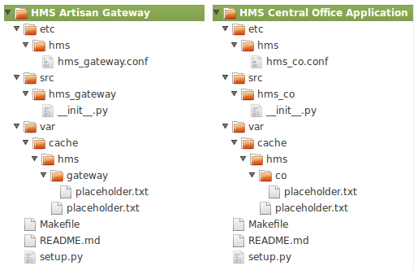
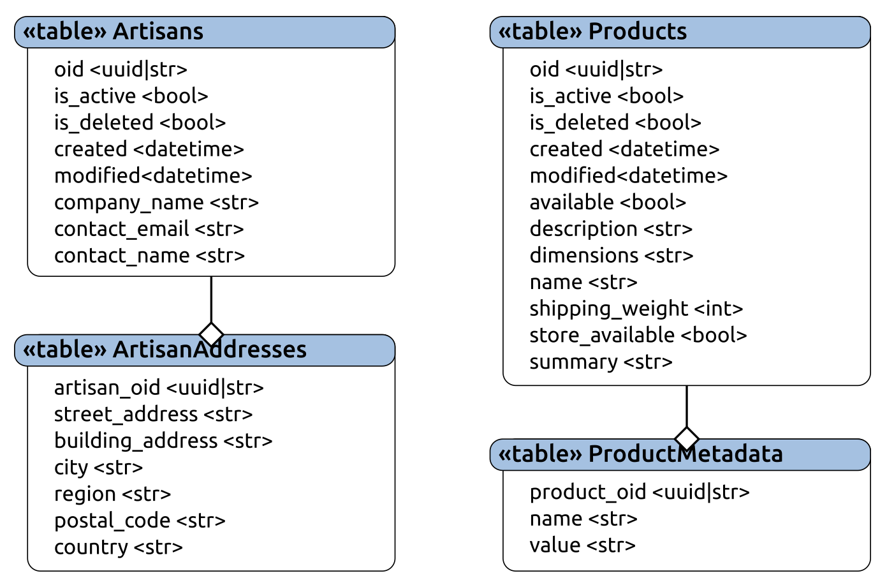
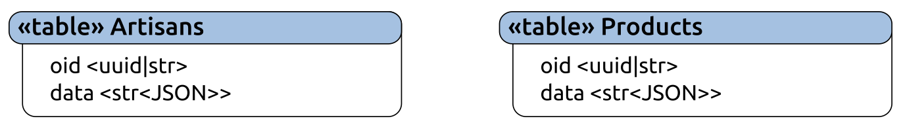
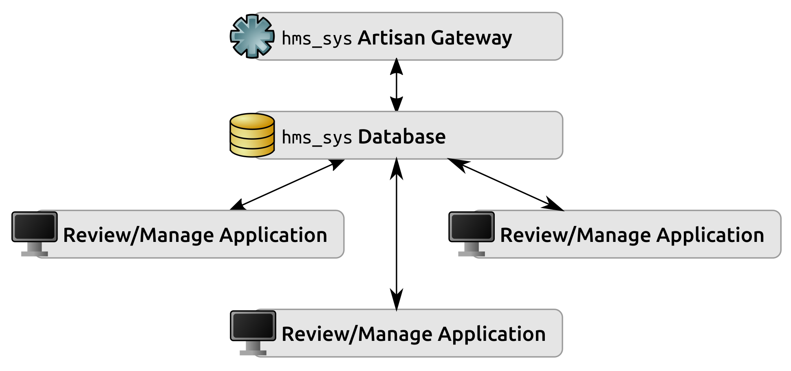
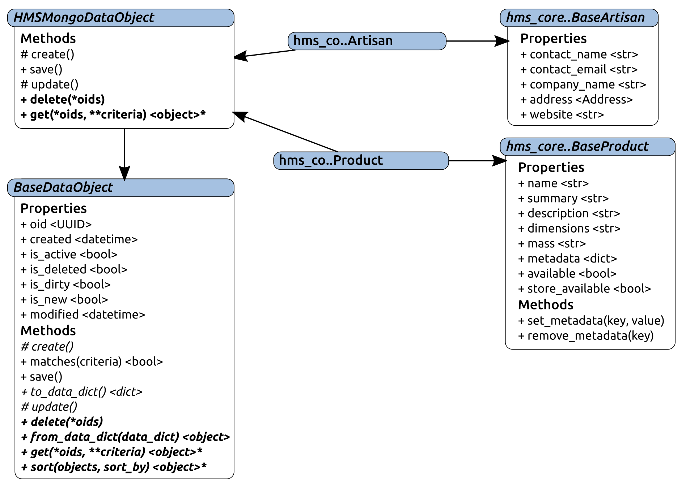
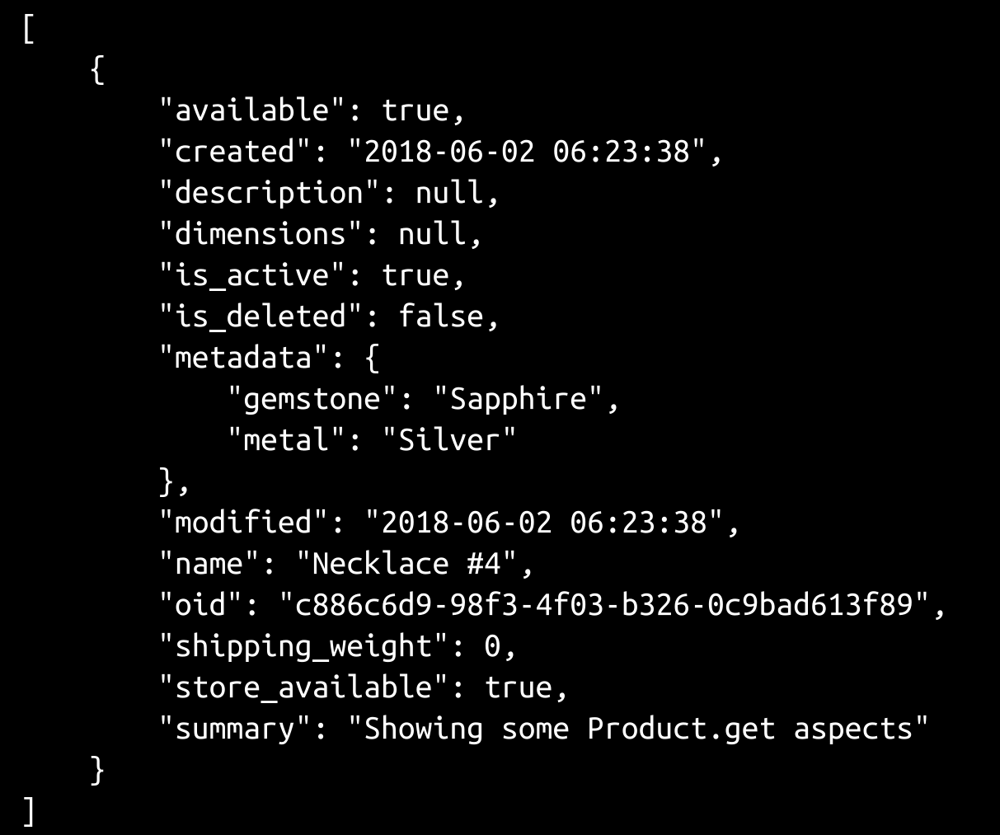

# 第十三章：将数据持久化到数据库

在 Artisan 应用程序的基于文件系统的数据持久化完成后，现在是时候将注意力转向系统中央办公室端的等效部分了。我们将重用之前定义的`BaseDataObject` ABC，以确保所有数据对象功能可以以相同的方式调用（例如，使用`get`方法读取数据和`save`写入数据），但由于底层数据存储过程在实现上有很大不同，这就是大部分相似之处的结束。我们还需要决定要使用哪种数据库选项。

本章将涵盖以下主题：

+   深入分析数据库选项并选择用于数据对象持久化的数据库引擎

+   为在中央办公室运行的代码定义数据访问策略

+   设计和实现一些支持数据访问和持久化的支持类

+   实现中央办公室所需的具体数据对象：

+   Artisan

+   产品

还有一些数据访问方面的考虑，将推迟至少一些具体的实现，并将详细讨论。

# Artisan Gateway 和 Central Office 应用程序对象

Artisan Gateway 和 Central Office 应用程序都需要项目结构，这样我们就有了一个放置特定于它们各自的代码的地方。这个需求包含在两个故事中：

+   作为开发人员，我需要一个 Central Office 应用程序的项目，这样我就有了一个放置相关代码和构建应用程序的地方

+   作为开发人员，我需要一个 Artisan Gateway 的项目，这样我就有了一个放置相关代码和构建服务的地方

上述结构可以从基本项目模板开始，如下所示：



随着 Artisan Gateway 和 Central Office 应用程序中业务对象的数据持久化功能的构建，可以添加更多的模块，就像在 Artisan 应用程序的项目结构中一样。选择数据存储引擎可能会对此产生重大影响，但目前来看，这应该足够了。

# 选择后端数据存储引擎

驱动 Artisan Gateway 和 Central Office 应用程序后端数据存储引擎选择的故事实际上并不强制使用任何特定的引擎，只是需要该引擎提供以下内容：

+   作为 HMS 中央办公室的业务对象数据的消费者，我需要业务对象数据存储在共享数据存储中，以便数据可以被多个消费者同时访问，并具有事务支持/保护，并且他们需要访问数据。

在现实世界的情况下，可能会有特定的数据库引擎是允许的、鼓励的或不允许的，这取决于许多因素，例如系统管理员愿意安装和支持的内容；根据企业使用的操作系统，可用的选项；以及可能的其他外部因素。还可能存在开发约束；也许首选的数据库在所使用的语言中没有可靠的驱动程序/库，或者数据结构要求直接影响了可行的选项。

另一个考虑因素，也在前述情景中有所体现，就是数据的访问方式（本地与网络访问）。在这种情况下，由于多个用户可以同时访问系统的数据，拥有一个可以通过内部网络访问的中央数据库（无论是哪种类型）是最简单的解决方案，从许多方面来看：

+   它将依赖于可独立安装的数据库引擎。

+   这些作为预打包安装的引擎，不需要开发人员努力创建或维护。

+   它们的功能可以在外部进行测试，因此可以信任其按预期行为；因此，开发不必测试引擎，而只需与其交互。

综合考虑这些因素，可以选择以下几种选项之一；标准的基于 SQL 的关系型数据库管理系统可以工作，许多可用的 NoSQL 数据库引擎也可以。

另一个要考虑的因素是对象数据结构在各种数据库选项中的表示方式。简单对象，例如`hms_core`中的`Address`，可以在任何关系型数据库管理系统中以单个表格轻松表示。更复杂的对象，例如带有其嵌入式`Address`的`Artisan`，或具有可变大小和可变内容属性数据（`metadata`）的`Product`，要么需要为相关属性创建离散表（并定义关系，以便可以检索对象的相关属性），要么需要支持动态结构化数据。

由于它们将在典型的关系型数据库管理系统实现中构建，因此关系非常简单；每个`Artisan`都有一个地址，每个`Product`都有零到多个`metadata`项，看起来类似于以下内容：



当我们考虑如何实现不同的数据检索过程时，就会出现复杂性，使用`BaseDataObject.get`类方法的可能排列，并假设真正的工作发生在数据库引擎的一侧：

+   获取一个`Artisan`及其`address`，或一个`Product`及其`metadata`，并不太复杂；假设一个`oid`值，它归结为以下变化：

+   获取与`oid`匹配的工匠或产品记录，然后将其转换为`dict`，以便我们可以使用`from_data_dict`类方法创建实例

+   对于`Artisan`：获取相关的`address`记录，将其转换为`dict`，并将其插入到作为`address`创建的第一个`dict`中

+   对于`Product`：获取相关的`metadata`记录，将返回的记录转换为键/值`dict`，并将其插入到作为`metadata`创建的第一个`dict`中

+   通过调用适当的`from_data_dict`类方法创建实例。

+   基于仅`oid`值列表获取多个实例并没有太大的不同；它只是从检索具有匹配`oid`值的所有记录开始，然后整理数据并创建并返回实例列表。实际上，如果此过程和单个`oid`过程使用相同的代码，对于单个`oid`返回一个（或零）对象（如果没有匹配的`oid`则不返回结果），那么使用起来并不会太糟糕。

+   仅基于一个本地`criteria`值获取零到多个实例——仅通过`company_name`或`name`找到`Artisan`或`Product`，本身也并不困难。数据库操作的实际过程与纯`oid`基础的检索有很大不同，如下所示：

+   您可以根据传递的`criteria`找到所有匹配项，并跟踪每个匹配项的`oid`值

+   然后，您返回由这些`oid`值标识的项目

+   通过`address`或`metadata`值查找项目类似，但它会从子表格获取结果的初始`oid`值列表。

+   从单个表格、父表格或子表格获取多个`criteria`值，是另一个必须处理的排列。

+   另一个排列是从父表格和子表格中获取`criteria`值在同一个条件集中。

前面的列表显示了六种不同的变化，假设`BaseDataObject.get`的意图得到了尊重。这些并没有解决如何跨相关表处理数据的更新（或删除）的问题，这增加了更多的复杂性。

虽然可能可以在数据库端的 SQL 中实现它们所有，但这样的实现将会很复杂。如果开发人员不是非常有经验的数据库管理员，这可能根本不可行；即使是，它仍然是一个复杂的解决方案，带有所有随之而来的潜在风险。

一个可以很容易实现的权衡方法，但会增加更多的处理时间和/或内存使用，类似于 Artisan 应用程序中采用的方法：加载所有调用`BaseDataObject.get`的对象，然后在代码中对结果进行排序。随着涉及的数据集增长，检索和发送回的数据将增长，并且需要有用地检索数据的时间不仅仅是一个简单的“获取任何这些`oid`值的对象”请求将需要更长的时间在数据库中找到并传输到应用程序。足够的时间或足够的数据，它将开始遭受可扩展性问题。这种方法可能是可行的，它可能会起作用（如果有限的时间），只要多表更新和子记录的删除可以以某种方式进行管理。事情的更新方面可能纯粹由应用程序代码进行管理，相关记录的删除可以在数据库端或应用程序代码中进行管理。

另一个仍处于基于 RDBMS 的解决方案领域的选项是使用支持结构化但无模式的数据的引擎；例如，MySQL 和 MariaDB 具有 JSON 字段类型，可以使用非常简单的表结构表示整个 Artisan 和 Product 记录，如下所示：



只要这些 JSON 字段允许对其内部的数据结构执行查询，`BaseDataObject.get`需要提供的所有选项都得到支持，而无需担心管理子表。在所有实际目的上，这种特定方法基本上涉及使用 MySQL 替代文档存储 NoSQL 数据库（如 MongoDB），但没有文档存储数据库可能已经具有的一些功能。

综上所述，这对于基于 RDBMS 的数据存储来说可能是一种被认为不利的复杂性。然而，也有一些优点，即使乍一看可能不那么重要。RDBMS 数据存储通常允许一次执行多个查询。因此，从多个表中检索数据所涉及的多个查询可以编写为多个查询语句，作为对引擎的单个调用执行。

大多数基于 SQL 的数据库还允许编写某种预编译/准备好的功能：存储过程或用户函数；视图；也许还有其他构造，可以将大量功能块移出应用程序代码并移到数据库中。这些通常更快执行，尽管 SQL 可能不支持广泛的功能（即使在过程和函数中），但可能有足够的可用性使其使用值得。最后，也许最重要的是，表的强制数据结构，再加上任何名副其实的 RDBMS 的关系能力，允许在需要时查询系统中的任何数据，同时在合理设计的数据库中强制执行所有系统数据的数据完整性。

如果选择基于 SQL 的 RDBMS 作为对象状态数据持久性的引擎，使用该引擎来持久化其状态数据的类将需要指定以下属性中的一些（或全部）。

+   `主机`规范：数据库所在的主机名（FQDN、机器网络名称或 IP 地址）

+   `数据库`名称：指定的主机上将读取和写入状态数据的数据库的名称

+   `user`：这将用于连接到主机上的数据库

+   `password`：这将用于连接到主机上的数据库

实例还需要能够连接到数据库，这可以通过一个方法（也许是`get_connection`）或一个属性（`connection`，可以懒惰地实例化，并编写成当需要时可以删除并重新创建活动的`connection`）。一旦建立了连接，它还需要一个方法来对数据库执行查询（也许是`query`）。如果这看起来很熟悉，那是因为这正是之前提到的`BaseDatabaseConnector`类的确切结构。

在 NoSQL 方面，所有标准的 NoSQL 优势都适用，如下所示：

+   由于数据库中没有涉及硬性的表结构，因此在存储的数据结构发生变化时，不需要花费大量的开发时间。一旦应用程序端的数据结构发生了变化，任何新的或更新的记录在保存时都将进行调整。

+   大多数 NoSQL 选项已经具有处理`BaseDataObject.get`所承诺提供的数据检索类型的功能，并且在传统的 RDBMS 解决方案中具有潜在的复杂性。这可能会导致开发时间更少，代码更简单，这两者都是好事。

+   数据写入（创建和更新）过程也将更容易实现，因为在基于 RDBMS 的方法中需要单独的表或不寻常的数据结构的关系实际上消失了，数据写入可以一次存储整个数据结构，而不必担心子表中的故障会阻止父表的写入。

在这两个选项中，NoSQL 选项似乎更容易管理，同时仍能满足数据持久化故事的所有要求。在各种 NoSQL 选项中，MongoDB 似乎需要对数据结构进行最少的更改，因为对象数据是从数据库中读取和写入的；因此，MongoDB 将是我们将使用的后端数据存储引擎。

# Central Office 项目的数据访问策略

选择了数据库引擎之后，需要做出的另一个决定是该引擎最终将在 Artisan Gateway 和 Central Office 应用程序的哪个位置存储。这两者都需要能够从相同的位置读取和写入相同的数据。由于 MongoDB 可以跨网络使用，数据存储可以几乎放在任何可以通过该网络访问的地方（甚至可以放在两个组件中的一个机器上）。

因此，Artisan Gateway、多个 Central Office 应用程序实例和`hms_sys`数据库之间的逻辑架构视角将如下图所示（允许任意数量的应用程序实例，但仅显示三个）：



从开发的角度来看，物理架构并不那么重要，只要每个逻辑组件都有一个可以轻松识别的物理位置。在开发过程中，所有这些物理位置都可以在开发人员的本地计算机上。一旦部署，Artisan Gateway 服务和`hms_sys`数据库可能安装在不同的机器上，或者它们可能驻留在同一台机器上。这种安排将允许所有应用程序实例和服务共享公共数据，从它们可能存在的任何地方读取和写入`hms_sys`数据库。

# 支持数据持久化的对象

在生产系统中，几乎不可能不需要一些访问凭据，还有其他需要跟踪的参数，这些参数将在各种对象类型中保存在数据存储中。由于这些参数对于所有不同的对象类型（大部分情况下）都是通用的，创建一个可以用来收集它们的机制似乎是一个合乎逻辑的第一步。在 RDBMS 的探索中已经注意到了可能需要的通用参数，如下所示：

+   `host`

+   `port`

+   `database`

+   `user`

+   `password`

到`hms_sys`部署到生产环境时，这些几乎肯定会保存在某种配置文件中，现在就把这个逻辑放在那里，而不是等到以后再做。所有数据存储配置和连接参数可以在一个单独的对象实例中捕获 - 一个`DatastoreConfig`：

```py
class DatastoreConfig:
    """
Represents a set of credentials for connecting to a back-end 
database engine that requires host, port, database, user, and 
password values.
"""
```

除了`port`属性之外，它只允许`int`值从`0`到`65535`（TCP/IP 连接中有效端口的正常范围），在属性的获取器、设置器和删除器方法中没有什么实质性的新内容。`_set_port`方法的值检查非常简单，如下所示：

```py
    def _set_port(self, value:int) -> None:
        if type(value) != int:
            raise TypeError(
                '%s.port expects an int value from 0 through 65535, '
                'inclusive, but was passed "%s" (%s)' % 
                (self.__class__.__name__, value, type(value).__name__)
            )
        if value < 0 or value > 65535:
            raise ValueError(
                '%s.port expects an int value from 0 through 65535, '
                'inclusive, but was passed "%s" (%s)' % 
                (self.__class__.__name__, value, type(value).__name__)
            )
        self._port = value
```

`__init__`方法也非常简单，尽管它没有必需的参数，因为并非所有数据库引擎都需要所有参数，而且该类旨在非常通用。由于不完整或无效的配置导致的连接问题将必须在相关对象级别处理：

```py
    ###################################
    # Object initialization           #
    ###################################

    def __init__(self, 
        host=None, port=None, database=None, user=None, password=None
    ):
        """
Object initialization.

self .............. (DatastoreConfig instance, required) The instance 
                    to execute against
host .............. (str, optional, defaults to None) the host-name 
                    (FQDN, machine network-name or IP address) where 
                    the database that the instance will use to persist 
                    state-data resides
port .............. (int [0..65535], optional, defaults to None) the 
                    TCP/IP port on the host that the database 
                    connection will use
database .......... (str, optional, defaults to None) the name of 
                    the database that the instance will use to persist 
                    state-data
user .............. (str, optional, defaults to None) the user-name 
                    used to connect to the database that the instance 
                    will use to persist state-data
password .......... (str, optional, defaults to None) the password 
                    used to connect to the database that the instance 
                    will use to persist state-data
"""
```

由于最终将需要从文件中读取配置数据，因此定义了一个类方法（`from_config`）来方便这样做，如下所示：

```py
    ###################################
    # Class methods                   #
    ###################################

    @classmethod
    def from_config(cls, config_file:(str,)):
        # - Use an explicit try/except instead of with ... as ...
        try:
            fp = open(config_file, 'r')
            config_data = fp.read()
            fp.close()
        except (IOError, PermissionError) as error:
            raise error.__class__(
                '%s could not read the config-file at %s due to '
                'an error (%s): %s' % 
                (
                    self.__class__.__name__, config_file, 
                    error.__class__.__name__, error
                )
            )
        # - For now, we'll assume that config-data is in JSON, though 
        #   other formats might be better later on (YAML, for instance)
        load_successful = False
        try:
            parameters = json.loads(config_data)
            load_successful = True
        except Exception as error:
            pass
        # - YAML can go here
        # - .ini-file format here, maybe?
        if load_successful:
            try:
                return cls(**parameters)
            except Exception as error:
                raise RuntimeError(
                    '%s could not load configuration-data from %s '
                    'due to an %s: %s' % 
                    (
                        cls.__name__, config_file, 
                        error.__class__.__name__, error
                    )
                )
        else:
            raise RuntimeError(
                '%s did not recognize the format of the config-file '
                'at %s' % (cls.__name__, config_file)
            )
```

然后可以创建用于连接到本地数据库的本地 MongoDB 连接，作为`DatastoreConfig`的实例，只需提供连接到本地数据库所需的最少参数，如下所示：

```py
# - The local mongod service may not require user-name and password
local_mongo = DatastoreConfig(
    host='localhost', port=27017, database='hms_local'
)
```

使用`pymongo`库对 Mongo 数据库进行读写数据需要一些步骤，如下所示：

1.  必须建立到 Mongo 引擎的连接（使用`pymongo.MongoClient`对象）。这是实际凭据（用户名和密码）将应用的地方，如果 Mongo 引擎需要它们的话。连接（或客户端）允许指定…

1.  必须指定数据存储的数据库。配置中的`database`值负责指定数据库的名称，一旦由客户端/连接返回，数据库本身，一个`pymongo.database.Database`对象，允许创建…

1.  实际文档（记录）所在的集合（一个`pymongo.collection.Collection`对象），以及所有数据访问过程实际发生的地方。

一个非常简单的、功能性的连接/数据库/集合设置的示例，用于`hms_sys`开发，可能包括以下内容：

```py
client = pymongo.MongoClient()    # Using default host and port
database = client['hms_sys']      # Databases can be requested by name
objects = database['Objects']     # The collection of Object                                           # documents/records
```

在这一点上，作为 Mongo `Collection`的`objects`对象提供了用于在`Objects`集合/表中读取、写入和删除文档/记录的方法。

集合中文档的组织可以是非常任意的。`objects`集合可以用来存储`Artisan`、`Product`和`Order`状态数据文档，所有在同一个集合中。没有功能上的原因阻止这样做。然而，随着时间的推移，从该集合中读取数据的速度会比从将这些`Artisan`、`Product`和`Order`状态数据文档分组到单独的集合中的集合中读取的速度要慢得多 - 每种对象类型一个集合。可能还有其他考虑因素会使这样的分组有益。将相同类型的对象保存在一起可能会使通过 GUI 工具更容易管理它们，并且对于命令行管理工具也可能有类似的好处。

考虑到所有前述因素，`hms_sys`数据存储中对象之间数据存储和参数的相对最佳集成应包括以下内容：

+   一个或多个客户端连接到一个共同的 MongoDB 实例，其凭据和参数都是可配置的，并最终由配置文件控制

+   中央办公室代码库中所有对象的一个通用数据库规范，与客户端设置使用的相同配置

+   每个对象类型的一个集合规范，可以简单地使用类的名称

在做出所有这些决定之后，我们可以创建一个 ABC，中央办公室应用程序和服务对象可以从中派生，方式与 Artisan 应用程序数据对象从`JSONFileDataObject`派生的方式类似，就像我们在第十二章中看到的那样，称之为`HMSMongoDataObject`。由于它需要对 Artisan 网关服务和中央办公室应用程序都可用，因此它需要存在于两者都可用的包中。在不为此目的单独创建另一个包项目的情况下，它应该存在于`hms_core`中的一个新模块中；如果遵循 Artisan 代码库中建立的命名约定，该模块将被命名为`data_storage.py`。

根据图表，`HMSMongoDataObject`与最终的中央办公室数据对象之间的关系看起来很像 Artisan 应用程序的对应关系，尽管`hms_co`.. `Order`没有包括在内，因为它可能需要一些特殊的考虑，我们还没有探讨过：



`HMSMongoDataObject`的实现从`BaseDataObject`继承，然后包括以下内容：

```py
class HMSMongoDataObject(BaseDataObject, metaclass=abc.ABCMeta):
    """
Provides baseline functionality, interface requirements, and 
type-identity for objects that can persist their state-data to 
a MongoDB-based back-end data-store.
"""
```

由于我们将使用`DatastoreConfig`对象来跟踪所有派生类的通用配置，因此它成为一个类属性（`_configuration`），如下所示：

```py
    ###################################
    # Class attributes/constants      #
    ###################################

    # - Keeps track of the global configuration for data-access
    _configuration = None
```

当创建 MongoDB 文档时，它们会有一个`_id`值，如果将其传递给一个普通的`from_data_dict`来创建类的实例，就会抛出一个错误。到目前为止，我们的任何实现中都没有`_id`参数，并且没有理由期望在未来的任何地方出现它，因为我们正在使用我们自己的`oid`属性作为对象记录的唯一标识符。为了防止发生这种情况，`from_data_dict`需要明确地从其对象创建过程中删除`_id`值，或者跟踪所有可能存在的有效参数，并相应地过滤这些参数。在这两种选项中，后者虽然稍微复杂一些，但也更加稳定。在`from_data_dict`中需要更细粒度地过滤数据进行对象创建的（不太可能发生的）情况下，跟踪有效参数将比修改一个长列表的键移除更容易维护：

```py
    # - Keeps track of the keys allowed for object-creation from 
    #   retrieved data
    _data_dict_keys = None
```

由于我们已经决定，任何给定类型的对象都应该存储在一个有意义且相关的名称的集合中，需要最少努力的方法就是简单地使用类名作为 MongoDB 集合的名称，该集合存储了该类的实例的状态数据。但是，我们不能排除有可能需要更改这一点，因此另一个允许覆盖默认行为的类属性看起来像是一个明智的预防措施：

```py
    # - Allows the default mongo-collection name (the __name__ 
    #   of the class) to be overridden. This should not be changed 
    #   lightly, since data saved to the old collection-name will 
    #   no longer be available!
    _mongo_collection = None
```

`HMSMongoDataObject`的属性看起来乍一看相对正常，但有一个重要的区别可能一开始并不明显。由于任何给定类的数据访问都集中在该类的实例上，并且创建数据库连接和集合可能是计算密集型的，拥有所有数据对象类的单个连接是一个诱人的想法 - 该实现将使实例级的`connection`和`database`属性的底层存储属性成为`HMSMongoDataObject`的成员，而不是派生类本身或这些类的实例。

实际上，这将要求`hms_sys`的所有数据对象都驻留在同一个数据库中，并且始终通过相同的 MongoDB 实例访问。虽然这并不是一个不合理的要求，但可能会使移动实时系统数据变得棘手。整个系统可能需要关闭以进行此类数据移动。作为一种妥协，每个类的`connection`和`database`属性将成为该类的成员，而不是该类的成员 - 例如，这将允许`Artisan`对象数据独立于`Product`数据进行移动。这在系统的不久的将来可能不是一个值得考虑的问题，但如果有可能在未来减少工作量，这并不是一个坏的妥协：

```py
    ###################################
    # Property-getter methods         #
    ###################################

    def _get_collection(self) -> pymongo.collection.Collection:
        try:
            return self.__class__._collection
        except AttributeError:
            # - If the class specifies a collection-name, then use that 
            #   as the collection...
            if self.__class__._mongo_collection:
                self.__class__._collection = self.database[
                    self.__class__._mongo_collection
                ]
            # - Otherwise, use the class-name
            else:
                self.__class__._collection = self.database[
                    self.__class__.__name__
                ]
            return self.__class__._collection

    def _get_configuration(self) -> DatastoreConfig:
        return HMSMongoDataObject._configuration

    def _get_connection(self) -> pymongo.MongoClient:
        try:
            return self.__class__._connection
        except AttributeError:
            # - Build the connection-parameters we need:
            conn_config = []
            # - host
            if self.configuration.host:
                conn_config.append(self.configuration.host)
                # - port. Ports don't make any sense without a 
                #   host, though, so host has to be defined first...
                if self.configuration.port:
                    conn_config.append(self.configuration.port)
            # - Create the connection
            self.__class__._connection = pymongo.MongoClient(*conn_config)
            return self.__class__._connection

    def _get_database(self) -> pymongo.database.Database:
        try:
            return self.__class__._database
        except AttributeError:
            self.__class__._database = self.connection[
                self.configuration.database
            ]
            return self.__class__._database
```

为了删除，`collection`，`connection`和`database`属性也有不同的处理方式。由 getter 方法检索的实际对象是惰性实例化的（在需要时创建，以减少系统负载，当它们不会被使用时），因为它们直到首次创建（通过对它们的引用）才存在，所以真正删除它们比将它们设置为某些默认值（如`None`）更容易：

```py
    ###################################
    # Property-deleter methods        #
    ###################################

    def _del_collection(self) -> None:
        # - If the collection is deleted, then the database needs 
        #   to be as well:
        self._del_database()
        try:
            del self.__class__._collection
        except AttributeError:
            # - It may already not exist
            pass

    def _del_connection(self) -> None:
        # - If the connection is deleted, then the collection and 
        #   database need to be as well:
        self._del_collection()
        self._del_database()
        try:
            del self.__class__._connection
        except AttributeError:
            # - It may already not exist
            pass

    def _del_database(self) -> None:
        try:
            del self.__class__._database
        except AttributeError:
            # - It may already not exist
            pass
```

属性定义与我们过去使用的略有不同，因为这些属性可以被检索或删除，但不能被设置。这对应于数据库和集合只能被检索（打开）或关闭（删除）的概念。因此，它们本身没有定义或附加 setter 方法，并且配置属性进一步采取了这一步 - 它是只读的：

```py
    ###################################
    # Instance property definitions   #
    ###################################

    collection = property(
        _get_collection, None, _del_collection, 
        'Gets or deletes the MongoDB collection that instance '
        'state-data is stored in'
    )
    connection = property(
        _get_connection, None, _del_connection, 
        'Gets or deletes the database-connection that the instance '
        'will use to manage its persistent state-data'
    )
    database = property(
        _get_database, None, _del_database, 
        'Gets or deletes the MongoDB database that instance '
        'state-data is stored in'
    )
    configuration = property(
        _get_configuration, None, None, 
        'Gets, sets or deletes the configuration-data '
        '(DatastoreConfig) of the instance, from HMSMongoDataObject'
    )
```

`__init__`方法看起来非常像`JSONFileDataObject`的`__init__`方法，具有相同的参数（出于相同的原因）。然而，由于我们没有需要设置默认值的属性，它唯一需要做的就是调用自己的父构造函数，如下所示：

```py
    ###################################
    # Object initialization           #
    ###################################

    def __init__(self, 
        oid:(UUID,str,None)=None, 
        created:(datetime,str,float,int,None)=None, 
        modified:(datetime,str,float,int,None)=None,
        is_active:(bool,int,None)=None, 
        is_deleted:(bool,int,None)=None,
        is_dirty:(bool,int,None)=None, 
        is_new:(bool,int,None)=None,
    ):
        """
Object initialization.

self .............. (HMSMongoDataObject instance, required) The 
                    instance to execute against
"""
        # - Call parent initializers if needed
        BaseDataObject.__init__(self, 
            oid, created, modified, is_active, is_deleted, 
            is_dirty, is_new
        )
        # - Perform any other initialization needed
```

与`JSONFileDataObject`一样，`HMSMongoDataObject`的`_create`和`_update`方法并不是必需的。MongoDB 与之前使用的 JSON 文件方法一样，不区分创建和更新文档。两个过程都只是将所有对象数据写入文档，必要时创建文档。由于它们是`BaseDataObject`所需的，但在这种情况下没有用处，因此相同的实现，简单地引发一个带有开发人员有用信息的错误，就足够了：

```py
    ###################################
    # Instance methods                #
    ###################################

    def _create(self) -> None:
        """
Creates a new state-data record for the instance in the back-end 
data-store
"""
        raise NotImplementedError(
            '%s._create is not implemented, because the save '
            'method handles all the data-writing needed for '
            'the class. Use save() instead.' % 
            self.__class__.__name__
        )

    def _update(self) -> None:
        """
Updates an existing state-data record for the instance in the 
back-end data-store
"""
        raise NotImplementedError(
            '%s._update is not implemented, because the save '
            'method handles all the data-writing needed for '
            'the class. Use save() instead.' % 
            self.__class__.__name__
        )
```

由类级`collection`及其`database`和`connection`祖先支持的`save`的实现非常简单。我们需要获取实例的`data_dict`并告诉 MongoDB 连接`insert`该数据。这个过程中的一个复杂因素是之前提到的标准 MongoDB`_id`值。如果我们仅仅调用`insert`，那么 MongoDB 引擎将没有`_id`值用于标识已经存在的文档是否实际存在。这将不可避免地导致在每次更新时为现有项目创建新的文档记录（而不是替换现有文档），从而在每次更新时污染数据，使其包含过时的实例。

在正常情况下，最简单的解决方案是在数据写入过程中将`oid`属性更改为`_id`，并在数据读取过程中将`_id`更改回`oid`，或者简单地将到目前为止已经建立的`oid`属性更改为类中已定义的`_id`。第一种选项只需要在每个`to_data_dict`和`from_data_dict`方法中稍微努力一下，包括已经在`Artisan`数据对象中定义的方法，但它往往更容易出错，而且需要额外的测试。这是一个可行的选择，但可能不是最好的选择。全面更改`oid`属性的名称为`_id`会更简单（实际上只是一个大规模的搜索和替换操作），但这将使类具有看起来像是受保护的属性名称，实际上是一个公共属性。从功能上讲，这并不是什么大问题，但它违反了 Python 代码标准，也不是一个首选选项。

另一个选择是简单地确保`hms_sys oid`属性和 MongoDB 生成的`_id`值是相同的。虽然这意味着单个文档记录的大小会增加，但这种变化微不足道 - 每个文档记录大约增加 12 个字节。由于这可以通过`save`方法的过程来处理，作为要保存的`data_dict`值的简单添加（并且在`from_data_dict`检索期间需要被忽略或以其他方式处理，作为该过程的一部分），因此只有两个地方需要编写或维护。

即使存储了额外的数据，这感觉上是一个更干净的选项。然后，`save`的最终实现将如下所示：

```py
    def save(self):
        if self._is_new or self._is_dirty:
            # - Make sure to update the modified time-stamp!
            self.modified = datetime.now()
            data_dict = self.to_data_dict()
            data_dict['_id'] = self.oid
            self.collection.insert_one(data_dict)
            self._set_is_dirty(False)
            self._set_is_new(False)
```

`from_data_dict`中的相应更改使用了之前定义的`_data_dict_keys`类属性。由于`_data_dict_keys`可能没有被定义，但需要被定义，检查它是否已经被定义并提出更详细的错误消息将使得调试这些（希望是罕见的）情况更容易。一旦验证了这一点，传入的`data_dict`将被简单地过滤，只保留那些与类的`__init__`方法中的参数匹配的键，并将被传递给`__init__`来创建相关的实例：

```py
    @classmethod
    def from_data_dict(cls, data_dict):
        # - Assure that we have the collection of keys that are 
        #   allowed for the class!
        if cls._data_dict_keys == None:
            raise AttributeError(
                '%s.from_data_dict cannot be used because the %s '
                'class has not specified what data-store keys are '
                'allowed to be used to create new instances from '
                'retrieved data. Set %s._data_dict_keys to a list '
                'or tuple of argument-names present in %s.__init__' % 
                (cls.__name__, cls.__name__, cls.__name__, cls.__name__)
            )
        # - Remove any keys that aren't listed in the class' 
        #   initialization arguments:
        data_dict = dict(
            [
                (key, data_dict[key]) for key in data_dict.keys() 
                if key in cls._data_dict_keys
            ]
        )
        # - Then create and return an instance of the class
        return cls(**data_dict)
```

为了一次性允许所有`HMSMongoDataObject`派生类进行配置，我们需要提供一个类方法来实现这一点。这个方法的实现的一个注意事项是，所有派生类也将拥有这个方法，但是这个方法会改变`HMSMongoDataObject`类的`_configuration`属性，即使它是从一个派生类中调用的。可以合理地期望调用，比如`Artisan.configure`，只会为`Artisan`对象配置数据访问 - 但这不是应该发生的，所以我们将引发一个错误，以确保如果尝试这样做，它不会被忽视：

```py
    ###################################
    # Class methods                   #
    ###################################

    @classmethod
    def configure(cls, configuration:(DatastoreConfig)):
        """
Sets configuration values across all classes derived from 
HMSMongoDataObject.
"""
        if cls != HMSMongoDataObject:
            raise RuntimeError(
                '%s.configure will alter *all* MongoDB configuration, '
                'not just the configuration for %s. Please use '
                'HMSMongoDataObject.configure instead.' % 
                (cls.__name__, cls.__name__)
            )
        if not isinstance(configuration, DatastoreConfig):
            raise TypeError(
                '%s.configure expects an instance of '
                'DatastoreConfig, but was passed "%s" (%s)' % 
                (
                    cls.__name__, configuration, 
                    type(configuration).__name__
                )
            )
        HMSMongoDataObject._configuration = configuration
```

由于所有与数据存储交互的类方法都需要相关的连接，并且在调用之前可能还没有被实例创建，因此有一个辅助类方法来获取连接将是有用的。也可以通过创建一个实例来强制获取所有相关的数据存储对象，但这感觉很麻烦和违反直觉：

```py
    @classmethod
    def get_mongo_collection(cls) -> pymongo.collection.Collection:
        """
Helper class-method that retrieves the relevant MongoDB collection for 
data-access to state-data records for the class.
"""
        # - If the collection has already been created, then 
        #   return it, otherwise create it then return it
        try:
            return cls._collection
        except AttributeError:
            pass
        if not cls._configuration:
            raise RuntimeError(
                '%s must be configured before the '
                'use of %s.get will work. Call HMSMongoDataObject.'
                'configure with a DatastoreConfig object to resolve '
                'this issue' % (cls.__name__, cls.__name__)
            )
        # - With configuration established, we can create the 
        #   connection, database and collection objects we need 
        #   in order to execute the request:
        # - Build the connection-parameters we need:
        conn_config = []
        # - host
        if cls._configuration.host:
            conn_config.append(cls.configuration.host)
            # - port. Ports don't make any sense without a 
            #   host, though, so host has to be defined first...
            if cls._configuration.port:
                conn_config.append(cls.configuration.port)
        # - Create the connection
        cls._connection = pymongo.MongoClient(*conn_config)
        # - Create the database
        cls._database = cls._connection[cls._configuration.database]
        # - and the collection
        if cls._mongo_collection:
            cls._collection = cls._database[cls._mongo_collection]
        # - Otherwise, use the class-name
        else:
            cls._collection = cls._database[cls.__name__]
        return cls._collection
```

`delete`类方法的实现非常简单；它归结为遍历提供的`oids`，并在迭代中删除每一个。由于`delete`正在与数据存储交互，并且它是一个类方法，它调用了我们首先定义的`get_mongo_collection`类方法：

```py
    @classmethod
    def delete(cls, *oids):
        """
Performs an ACTUAL record deletion from the back-end data-store 
of all records whose unique identifiers have been provided
"""
        # - First, we need the collection that we're working with:
        collection = cls.get_mongo_collection()
        if oids:
            for oid in oids:
                collection.remove({'oid':str(oid)})

    @classmethod
    def from_data_dict(cls, data_dict):
        # - Assure that we have the collection of keys that are 
        #   allowed for the class!
        if cls._data_dict_keys == None:
            from inspect import getfullargspec
            argspec = getfullargspec(cls.__init__)
            init_args = argspec.args
            try:
                init_args.remove('self')
            except:
                pass
            try:
                init_args.remove('cls')
            except:
                pass
            print(argspec)
            if argspec.varargs:
                init_args.append(argspec.varargs)
            if argspec.varkw:
                init_args.append(argspec.varkw)
            raise AttributeError(
                '%s.from_data_dict cannot be used because the %s '
                'class has not specified what data-store keys are '
                'allowed to be used to create new instances from '
                'retrieved data. Set %s._data_dict_keys to a list '
                'or tuple of argument-names present in %s.__init__ '
                '(%s)' % 
                (
                    cls.__name__, cls.__name__, cls.__name__, 
                    cls.__name__, "'" + "', '".join(init_args) + "'"
                )
            )
        # - Remove any keys that aren't listed in the class' 
        #   initialization arguments:
        data_dict = dict(
            [
                (key, data_dict[key]) for key in data_dict.keys() 
                if key in cls._data_dict_keys
            ]
        )
        # - Then create and return an instance of the class
        return cls(**data_dict)
```

失败检查`_data_dict_keys`的结果是一个`AttributeError`，其中包括类的`__init__`方法的参数列表，使用`inspect`模块的`getfullargspec`函数。Python 的`inspect`模块提供了一套非常全面的函数，用于检查正在运行的代码。当我们开始研究元编程概念时，我们将更深入地研究该模块。

`HMSMongoDataObject`的`get`方法也是通过确保相关的`collection`可用来开始的。在结构上，它看起来很像`JSONFileDataObject`中的对应方法，这应该不会让人感到意外，因为它执行的是相同类型的操作，并且使用了在`BaseDataObject`中定义的相同方法签名。由于 MongoDB 具有比文件系统更多的功能，因此存在一些值得注意的区别：

```py
    @classmethod
    def get(cls, *oids, **criteria) -> list:
        # - First, we need the collection that we're working with:
        collection = cls.get_mongo_collection()
        # - The first pass of the process retrieves documents based 
        #   on oids or criteria.
```

我们不会尝试为`pymongo`的`find`功能动态生成包括`oids`和`criteria`的参数（可能是复杂的机制），我们将根据存在的`oids`和`criteria`的组合来处理请求。代码中的每个分支将导致一个`data_dict`项目列表，稍后可以将其转换为对象实例列表。

如果提供了`oids`，那么初始请求将只涉及这些内容。目前，预期是使用`oids`进行的`get`调用通常只涉及到少量的`oids`（实际上通常只有一个），因此，使用非常基本的功能来获取与列表中单个`oid`对应的每个文档应该足够，至少目前是这样的：

```py
        # - We also need to keep track of whether or not to do a 
        #   matches call on the results after the initial data-
        #   retrieval:
        post_filter = False
        if oids:
            # - oid-based requests should usually be a fairly short 
            #   list, so finding individual items and appending them 
            #   should be OK, performance-wise.
            data_dicts = [
                collection.find_one({'oid':oid})
                for oid in oids
            ]
```

如果在某个地方需要处理更长的`oids`集合，`pymongo`也支持，因此，我们将留下一条关于这一点的评论，以防以后需要：

```py
            # - If this becomes an issue later, consider changing 
            #   it to a variant of 
            #   collection.find({'oid':{'$in':oids}})
            #   (the oids argument-list may need pre-processing first)
```

如果同时提供了`oids`和`criteria`，则最终的对象列表将需要使用`matches`方法进行过滤，因此必须监视和跟踪`criteria`的存在。如果同时提供了`oids`和`criteria`，那么我们将需要在以后知道这一点，以便过滤初始结果：

```py
            if criteria:
                post_filter = True
```

如果只传递了`criteria`，那么可以使用列表推导来一次性检索整个`data_dicts`集合，以收集`find`返回的游标中找到的项目：

```py
        elif criteria:
            # - criteria-based items can do a find based on all criteria 
            #   straight away
            data_dicts = [
                item for item in collection.find(criteria)
            ]
```

如果未传递`oids`或`criteria`，那么我们将希望返回所有可用的内容，如下所示：

```py
        else:
            # - If there are no oids specified, and no criteria, 
            #   the implication is that we want *all* object-records 
            #   to be returned...
            data_dicts = [
                item for item in collection.find()
            ]
```

一旦生成了初始的`data_dict`，它将用于创建对象实例的初始列表，如下所示：

```py
# - At this point, we have data_dict values that should be 
        #   able to create instances, so create them.
        results = [
            cls.from_data_dict(data_dict) 
            for data_dict in data_dicts
            if data_dict # <-- This could be None: check it!
        ]
```

如果我们仍然需要进一步过滤这些结果（如果我们之前将`post_filter`设置为`True`），那么现在可以使用在`JSONFileDataObject`中使用的相同过滤过程，调用初始结果中每个对象的`matches`方法，仅当它返回`True`时将其添加到最终结果列表中，如下所示：

```py
        # - If post_filter has been set to True, then the request 
        #   was for items by oid *and* that have certain criteria
        if post_filter:
            results = [
                obj for obj in results if obj.matches(**criteria)
            ]
        return results
```

到目前为止，对于 Artisan Gateway 和 Central Office 数据对象所需的所有基本 CRUD 操作应该很容易实现，只需从`hms_core`和`HMSMongoDataObject`中的相应`Base`类派生即可：

1.  创建和更新操作仍然只需调用任何实例的`save`方法即可完成。

1.  读取操作由`get`类方法处理，该方法还允许对查找对象进行相当多的功能，尽管以后可能需要支持更复杂功能的附加功能。

1.  删除操作由`delete`类方法处理；同样，可能会有基于`oid`以外的删除功能的需求，但目前这样就足够了。

# RDBMS 实现

到目前为止，我们创建的两个数据对象实现都覆盖了`BaseDataObject`中所需的`_create`和`_update`方法。在这种情况下，对于为什么要放置它们，可以提出质疑。对这个问题的简短回答是，到目前为止，已经合并在一起的两个实现在数据存储级别上使用了相同的过程来创建和更新记录和文档。因此，它们根本不需要。如果预期`hms_sys`永远不需要任何其他数据库后端，我们有理由从整个代码库中删除它们。

然而，如果使用 MongoDB 的决定走向不同的方向，并且首选（或强制）的后端数据存储引擎是诸如 Microsoft SQL Server 之类的 RDBMS，那会发生什么呢？或者更糟糕的是，如果在系统运行之后强制进行这种改变会发生什么呢？

暂时搁置数据迁移规划，专注于应用程序和服务代码，这种改变需要什么？实际上并不需要太多。对于给定的 RDBMS API/库，通用的 SQL/RDBMS 引擎 ABC（`HMSSQLDataObject`）可能看起来像下面这样：

```py
class HMSSQLDataObject(BaseDataObject, metaclass=abc.ABCMeta):
    """
Provides baseline functionality, interface requirements, and 
type-identity for objects that can persist their state-data to 
a (GENERIC) SQL-based RDBMS back-end data-store.
"""
```

这里显示的`HMSSQLDataObject`类绝不是完整的，但应该作为构建这样一个类的完整实现的合理起点，该类连接到并使用来自多个 RDBM 系统的数据。完整的代码可以在项目代码的`hms_core/ch-10-snippets`目录中找到。

相同的`_configuration`类属性可能也在使用中，具有相同的目的。`_data_dict_keys`类属性也可能在`from_data_dict`中减少记录字段到有效参数字典中使用。由于 SQL 对于各种 CRUD 操作，或者至少对于这些 CRUD 操作的特定起始点，需要被存储并且可以被类访问，一个可行的选择是将它们作为类属性附加在一起：

```py
    ###################################
    # Class attributes/constants      #
    ###################################

    # - Keeps track of the global configuration for data-access
    _configuration = None
    # - Keeps track of the keys allowed for object-creation from 
    #   retrieved data
    _data_dict_keys = None
    # - SQL for various expected CRUD actions:
    _sql_create = """Some SQL string goes here"""
    _sql_read_oids = """Some SQL string goes here"""
    _sql_read_all = """Some SQL string goes here"""
    _sql_read_criteria = """Some SQL string goes here"""
    _sql_update = """Some SQL string goes here"""
    _sql_delete = """Some SQL string goes here"""
```

由于各种 CRUD 操作的 SQL 将包括数据存储在其中的表，并且在大多数 RDBMS 中连接到数据库的过程处理了我们 MongoDB 方法中`connection`和`database`的等效部分，因此只需要跟踪和作为属性可用的是`connection`本身：

```py
    ###################################
    # Property-getter methods         #
    ###################################

    def _get_connection(self):
        try:
            return self.__class__._connection
        except AttributeError:
            # - Most RDBMS libraries provide a "connect" function, or 
            #   allow the creation of a "connection" object, using the 
            #   parameters we've named in DatastoreConfig, or simple 
            #   variations of them, so all we need to do is connect:
            self.__class__._connection = RDBMS.connect(
                **self.configuration
            )
            return self.__class__._connection
```

与基于 Mongo 的实现相同，`connection`是懒惰实例化的，并执行实际删除，而不是重置为默认值，如下所示：

```py
    ###################################
    # Property-deleter methods        #
    ###################################

    def _del_connection(self) -> None:
        try:
            del self.__class__._connection
        except AttributeError:
            # - It may already not exist
            pass
```

相关的属性声明是相同的，如下所示：

```py
    ###################################
    # Instance property definitions   #
    ###################################

    connection = property(
        _get_connection, None, _del_connection, 
        'Gets or deletes the database-connection that the instance '
        'will use to manage its persistent state-data'
    )
```

对象初始化也是相同的，如下所示：

```py
    ###################################
    # Object initialization           #
    ###################################

    def __init__(self, 
        oid:(UUID,str,None)=None, 
        created:(datetime,str,float,int,None)=None, 
        modified:(datetime,str,float,int,None)=None,
        is_active:(bool,int,None)=None, 
        is_deleted:(bool,int,None)=None,
        is_dirty:(bool,int,None)=None, 
        is_new:(bool,int,None)=None,
    ):
        """
Object initialization.

self .............. (HMSMongoDataObject instance, required) The 
                    instance to execute against
oid ............... (UUID|str, optional, defaults to None) The unique 
                    identifier of the object's state-data record in the 
                    back-end data-store
created ........... (datetime|str|float|int, optional, defaults to None) 
                    The date/time that the object was created
modified .......... (datetime|str|float|int, optional, defaults to None) 
                    The date/time that the object was last modified
is_active ......... (bool|int, optional, defaults to None) A flag 
                    indicating that the object is active
is_deleted ........ (bool|int, optional, defaults to None) A flag 
                    indicating that the object should be considered 
                    deleted (and may be in the near future)
is_dirty .......... (bool|int, optional, defaults to None) A flag 
                    indicating that the object's data needs to be 
                    updated in the back-end data-store
is_new ............ (bool|int, optional, defaults to None) A flag 
                    indicating that the object's data needs to be 
                    created in the back-end data-store
"""
        # - Call parent initializers if needed
        BaseDataObject.__init__(self, 
            oid, created, modified, is_active, is_deleted, 
            is_dirty, is_new
        )
        # - Perform any other initialization needed
```

显著的、实质性的差异主要在处理 CRUD 操作的方法中。原始的`BaseDataObject`中实现的`save`方法保留在原地，并且将调用`_create`或`_update`方法，由实例的`is_dirty`或`is_new`属性值决定。这些方法中的每一个都负责从适当的类属性中获取 SQL 模板，根据需要填充当前状态数据值，对结果 SQL 进行清理，并针对连接执行它：

```py
    ###################################
    # Instance methods                #
    ###################################

    def _create(self):
        # - The base SQL is in self.__class__._sql_create, and the 
        #   field-values would be retrieved from self.to_data_dict():
        data_dict = self.to_data_dict()
        SQL = self.__class__._sql_create
        # - Some process would have to add the values, if not the keys, 
        #   into the SQL, and the result sanitized, but once that was 
        #   done, it'd become a simple query-execution:
        self.connection.execute(SQL)

    def _update(self):
        # - The base SQL is in self.__class__._sql_update, and the 
        #   field-values would be retrieved from self.to_data_dict():
        data_dict = self.to_data_dict()
        SQL = self.__class__._sql_update
        # - Some process would have to add the values, if not the keys, 
        #   into the SQL, and the result sanitized, but once that was 
        #   done, it'd become a simple query-execution:
        self.connection.execute(SQL)
```

清理 SQL 是非常重要的安全预防措施，减少系统容易受到 SQL 注入攻击的风险。这些攻击最少会危害数据的保密性和完整性，还可能提高认证和授权的风险，甚至可能跨多个系统，具体取决于密码策略及其执行。大多数 RDBMS API 在执行 SQL 之前都会有一些机制来清理 SQL，有些还支持查询参数化，这也可以减少漏洞的风险。基本的经验法则是，如果用户提供的数据被传递到查询中，甚至传递到存储过程中，无论何时何地都应该尽可能地进行清理。

`delete`类方法很简单：

```py
    ###################################
    # Class methods                   #
    ###################################

    @classmethod
    def delete(cls, *oids):
        # - First, we need the database-connection that we're 
        #   working with:
        connection = cls.get_connection()
        SQL = cls._sql_delete % oids
        # - Don't forget to sanitize it before executing it!
        result_set = connection.execute(SQL)
```

`get`方法背后的模式和方法大部分应该看起来很熟悉；再次，它具有相同的签名（并且意图执行到目前为止已经创建的方法相同的活动），这些方法实现了`BaseDataObject`的所需功能：

```py
    @classmethod
    def get(cls, *oids, **criteria) -> list:
        # - First, we need the database-connection that we're 
        #   working with:
        connection = cls.get_connection()
        # - The first pass of the process retrieves documents based 
        #   on oids or criteria.
        # - We also need to keep track of whether or not to do a 
        #   matches call on the results after the initial data-
        #   retrieval:
        post_filter = False
```

```py
        # - Records are often returned as a tuple (result_set) 
        #   of tuples (rows) of tuples (field-name, field-value):
        #   ( ..., ( ('field-name', 'value' ), (...), ... ), …)
```

处理`oid`请求的分支如下：

```py
        if oids:
            # - Need to replace any placeholder values in the raw SQL
            #   with actual values, AND sanitize the SQL string, but 
            #   it starts with the SQL in cls._sql_read_oids
            SQL = cls._sql_read_oids
            result_set = connection.execute(SQL)
            if criteria:
                post_filter = True
```

`criteria`分支如下：

```py
        elif criteria:
            # - The same sort of replacement would need to happen here 
            #   as happens for oids, above. If the query uses just 
            #   one criteria key/value pair initially, we can use the 
            #   match-based filtering later to filter further as needed
            key = criteria.keys()[0]
            value = criteria[key]
            SQL = cls._sql_read_criteria % (key, value)
            result_set = connection.execute(SQL)
            if len(criteria) > 1:
                post_filter = True
```

默认分支只是获取其他所有内容如下：

```py
        else:
            SQL = cls._sql_read_all
            result_set = connection.execute(SQL)
```

所有分支都生成一个`data_dict`值列表，可用于创建对象实例，尽管它们可能不会作为字典值从后端数据存储返回。

查询的最低公共分母结果，如前面的代码注释中所述，是一组元组的元组，可能看起来像下面这样：

```py
# This is the outermost tuple, collecting all of the 
# rows returned into a result_set:
(
    # Each tuple at this level is a single row:
    (
        # Each tuple at this level is a key/value pair:
        ('oid', '43d240cd-4c9f-44c2-a196-1c7c56068cef'),
        ('first_name', 'John'),
        ('last_name', 'Smith'),
        ('email', 'john@smith.com'),
        # ...
    ),
    # more rows could happen here, or not...
)
```

如果引擎或引擎的 Python API 提供了将返回的行转换为字典实例的内置机制，那可能是首选的方法。如果没有内置处理它的任何内容，将嵌套元组转换为一系列字典并不难做到：

```py
        # - We should have a result_set value here, so we can convert 
        #   it from the tuple of tuples of tuples (or whatever) into 
        #   data_dict-compatible dictionaries:
        data_dicts = [
            dict(
                [field_tuple for field_tuple in row]
            )
            for row in result_set
        ]
```

从这一点开始，过程基本上与以前的实现一样，在`JSONFileDataObject`和`HMSMongoDataObject`中：

```py
        # - With those, we can create the initial list of instances:
        results = [
            cls.from_data_dict(data_dict) 
            for data_dict in data_dicts
        ]
        # - If post_filter has been set to True, then the request 
        #   was for items by oid *and* that have certain criteria
        if post_filter:
            results = [
                obj for obj in results if obj.matches(**criteria)
            ]
```

另一个（可能是主要的）区别在于如何处理子对象，例如`Artisan`对象中的`products`。如果需要获取这些子对象作为对象并将其填充到父对象中，假设它们使用相同的`BaseDataObject`派生接口，每个子类型将有一个与之关联的类，每个类都将有一个`get`方法，并且该`get`方法将允许指定父对象的`oid`作为条件。这将允许进行以下过程，用于检索和附加任何需要的子对象（以`Artisan`和`Product`类为例）：

```py
        # - Data-objects that have related child items, like the 
        #   Artisan to Product relationship, may need to acquire 
        #   those children here before returning the results. If 
        #   they do, then a structure like this should work most 
        #   of the time:
        for artisan in results:
            artisan._set_products(
                Product.get(artisan_oid=artisan.oid)
            )
        return results
```

从`HMSSQLDataObject`派生的最终业务/数据对象类的其他成员，大部分现在应该是预期的，因为它们也是从另外两个`DataObject` ABC 派生的最终数据对象的实现所需的。它们将包括`to_data_dict`和`matches`实例方法的具体实现以及`from_data_dict`类方法，以及各种类特定变量（主要是`_sql`类属性）。

# 中央办公室项目的具体业务对象

到目前为止，关于基础设施已经付出了很多努力，但是随着最初的中央办公室类的创建开始，这些努力即将得到回报。目前，由于假设中央办公室应用程序和 Artisan 网关服务将使用相同的业务对象类，并且它们需要驻留在一个不是任何这些代码库的一部分的公共软件包中，它们应该驻留的最佳选择似乎是`hms_core`组件项目：

+   `hms_core`已经在设计计划中作为所有其他软件包的构建或部署的一部分

+   虽然肯定可以创建另一个专门用于这些具体类将提供的数据访问的组件项目/包，但对于可能只是一个单一模块，只有三个类（到目前为止），这是相当多的开销

如果将来有需要或愿望将它们移动到不同的软件包/项目中——比如，如果决定将中央办公室应用程序的数据访问更改为对 Artisan 网关的网络服务调用，将相应地移动代码不难，尽管有些乏味。

通过立即深入其中一个具体类，很可能更容易理解基础工作将如何得到回报，因此我们现在将这样做，从`hms_core.co_objects.Artisan`开始。

# hms_core.co_objects.Artisan

推动具体的、状态数据持久化`Artisan`类的故事如下：

+   作为 Artisan 经理，我需要能够管理（创建、修改和删除）系统中的工匠，以便保持其状态和信息的最新。

与`hms_artisan`相同，这是关于能够管理数据，而不是围绕数据管理过程的 UI。`co_objects`中任何数据对象的各种移动部分将涉及以下操作：

+   对象类型的属性，将源自`hms_core.business_objects`中相应的`Base`类

+   系统中所有数据对象的数据持久化相关属性，由`HMSMongoDataObject`或其父类`BaseDataObject`提供或需要

+   从具体类继承的任何抽象成员的具体实现，从它派生的任何类中继承

以具体的`Artisan`类为例，涉及的关系如下图所示：

！[](assets/70640dc2-a8ac-4d72-a723-f0708907ca20.png)

在这种特殊情况下，只有一个属性（需要从`HMSMongoDataObject`覆盖的`_data_dict_keys`类属性）需要创建。四个实例方法中的三个（`add_product`和`remove_product`以及`matches`）在需要实现它们的抽象方法中具有具体实现，并且可以实现为调用它们原始方法的一种方式。

从`BaseDataObject`派生的任何类的`to_data_dict`方法将需要在本地实现（这只是已经开发的结构的性质），但该实现不会比创建和返回`dict`值更多。

剩下的是`from_data_dict`，数据对象用它来从字典中创建实例；这些字典反过来是由后端数据存储的数据检索提供的。在数据对象没有任何子对象的情况下，`BaseDataObject`提供和需要的基线方法应该简单地作为继承类方法工作。具有子对象属性的对象类型（例如`Artisan`）将不得不适应这些属性，并且这将作为对`BaseDataObject`的原始类方法的本地覆盖发生。

因此，总的来说，实现大多数这些数据对象只需要以下操作：

+   创建`_data_dict_keys`类属性，可以（或多或少地）从类的`__init__`方法的参数列表中复制并粘贴

+   使用在`BaseDataObject`中定义的方法调用`matches`方法，该方法传递到`HMSMongoDataObject`

+   从头开始实现`to_data_dict`

+   从头开始实现`from_data_dict`类方法，如果需要自定义方法

+   创建一个`__init__`方法，不需要做任何比调用相关父类`__init__`方法更多的事情

对于大多数类来说，从无到完整的最坏情况是开发两个详细的方法，以及一些复制粘贴操作。

这两种方法在`hms_core.co_objects.Artisan`中发挥作用，如下所示：

```py
class Artisan(BaseArtisan, HMSMongoDataObject):
    """
Represents an Artisan in the context of the Central Office 
applications and services
"""
```

`_data_dict_keys`对象是相当简单的，如下所示：

```py
    ###################################
    # Class attributes/constants      #
    ###################################

    _data_dict_keys = (
        'contact_name', 'contact_email', 'address', 'company_name', 
        'website', 'oid', 'created', 'modified', 'is_active', 
        'is_deleted', 'products'
    )
```

`__init__`方法仍然具有相当复杂的参数列表，但它们可以整体从其源类中复制，除非这些源类的`__init__`方法有参数列表（在本例中为`*products`）或关键字参数列表（为了尽可能保持`__init__`签名的简单性而避免）：

```py
    ###################################
    # Object initialization           #
    ###################################

    # TODO: Add and document arguments if/as needed
    def __init__(self,
        contact_name:str, contact_email:str, 
        address:Address, company_name:str=None, 
        website:(str,)=None, 
        # - Arguments from HMSMongoDataObject
        oid:(UUID,str,None)=None, 
        created:(datetime,str,float,int,None)=None, 
        modified:(datetime,str,float,int,None)=None,
        is_active:(bool,int,None)=None, 
        is_deleted:(bool,int,None)=None,
        is_dirty:(bool,int,None)=None, 
        is_new:(bool,int,None)=None,
        *products
    ):
        """
Object initialization.

self .............. (Artisan instance, required) The instance to 
                    execute against
contact_name ...... (str, required) The name of the primary contact 
                    for the Artisan that the instance represents
contact_email ..... (str [email address], required) The email address 
                    of the primary contact for the Artisan that the 
                    instance represents
address ........... (Address, required) The mailing/shipping address 
                    for the Artisan that the instance represents
company_name ...... (str, optional, defaults to None) The company-
                    name for the Artisan that the instance represents
oid ............... (UUID|str, optional, defaults to None) The unique 
                    identifier of the object's state-data record in the 
                    back-end data-store
created ........... (datetime|str|float|int, optional, defaults to None) 
                    The date/time that the object was created
modified .......... (datetime|str|float|int, optional, defaults to None) 
                    The date/time that the object was last modified
is_active ......... (bool|int, optional, defaults to None) A flag 
                    indicating that the object is active
is_deleted ........ (bool|int, optional, defaults to None) A flag 
                    indicating that the object should be considered 
                    deleted (and may be in the near future)
is_dirty .......... (bool|int, optional, defaults to None) A flag 
                    indicating that the object's data needs to be 
                    updated in the back-end data-store
is_new ............ (bool|int, optional, defaults to None) A flag 
                    indicating that the object's data needs to be 
                    created in the back-end data-store
products .......... (BaseProduct collection) The products associated 
                    with the Artisan that the instance represents
"""
        # - Call parent initializers if needed
        BaseArtisan.__init__(self, 
            contact_name, contact_email, address, company_name
        )
        HMSMongoDataObject.__init__(self, 
            oid, created, modified, is_active, is_deleted, 
            is_dirty, is_new
        )
        if products:
            BaseArtisan._set_products(*products)
        # - Perform any other initialization needed
```

可以调用父类方法的实例方法都是一行代码，返回使用适当参数调用父类方法的结果：

```py
    ###################################
    # Instance methods                #
    ###################################

    def add_product(self, product:BaseProduct) -> BaseProduct:
        return Hasproducts.add_product(self, product)

    def matches(self, **criteria) -> (bool,):
        return HMSMongoDataObject.matches(self, **criteria)

    def remove_product(self, product:BaseProduct) -> None:
        return Hasproducts.remove_product(self, product)
```

`to_data_dict`方法可能会让人望而生畏，但是，由于结果字典中键的顺序是无关紧要的，将它们按它们的来源类分组允许其中的一些（与数据存储相关的）根据需要进行复制：

```py
    def to_data_dict(self):
        return {
            # - BaseArtisan-derived items
            'address':self.address.to_dict() if self.address else None,
            'company_name':self.company_name,
            'contact_email':self.contact_email,
            'contact_name':self.contact_name,
            'website':self.website, 
            # - BaseDataObject-derived items
            'created':datetime.strftime(
                self.created, self.__class__._data_time_string
            ),
            'is_active':self.is_active,
            'is_deleted':self.is_deleted,
            'modified':datetime.strftime(
                self.modified, self.__class__._data_time_string
            ),
            'oid':str(self.oid),
        }
```

回顾来看，也许提供每个类的一个方法或属性来负责生成它们的一部分最终`data_dict`可能是更好的设计。这将使生成这些字典项的代码保持在一个地方，至少可以从所有实例的父类值中组装最终的`data_dict`值。

“Artisan”类的`from_data_dict`使用与`HMSMongoDataObject`中原始类方法相同的逻辑和过程，但必须考虑`address`属性，该属性要么为`None`，要么包含一个`Address`实例：

```py
    ###################################
    # Class methods                   #
    ###################################

    @classmethod
    def from_data_dict(cls, data_dict):
        # - This has to be overridden because we have to pre-process 
        #   incoming address and (maybe, eventually?) product-list 
        #   values...
        if data_dict.get('address'):
            data_dict['address'] = Address.from_dict(data_dict['address'])
        ####### NOTE: Changes made here, for whatever reason might 
        #       arise, may also need to be made in 
        #       HMSMongoDataObject.from_data_dict – it's the same 
        ####### process!
        # - Assure that we have the collection of keys that are 
        #   allowed for the class!
        if cls._data_dict_keys == None:
            from inspect import getfullargspec
            argspec = getfullargspec(cls.__init__)
            init_args = argspec.args
            try:
                init_args.remove('self')
            except:
                pass
            try:
                init_args.remove('cls')
            except:
                pass
            print(argspec)
            if argspec.varargs:
                init_args.append(argspec.varargs)
            if argspec.varkw:
                init_args.append(argspec.varkw)
            # FullArgSpec(varargs='products', varkw=None
            raise AttributeError(
                '%s.from_data_dict cannot be used because the %s '
                'class has not specified what data-store keys are '
                'allowed to be used to create new instances from '
                'retrieved data. Set %s._data_dict_keys to a list '
                'or tuple of argument-names present in %s.__init__ '
                '(%s)' % 
                (
                    cls.__name__, cls.__name__, cls.__name__, 
                    cls.__name__, "'" + "', '".join(init_args) + "'"
                )
            )
        # - Remove any keys that aren't listed in the class' 
        #   initialization arguments:
        data_dict = dict(
            [
                (key, data_dict[key]) for key in data_dict.keys() 
                if key in cls._data_dict_keys
            ]
        )
```

```py
        # - Then create and return an instance of the class
        return cls(**data_dict)
```

总共有七个项目需要具体实现，只有两个项目不能通过调用父类的等效方法或编写非常简单的代码来管理，实现起来相当轻松。

# hms_core.co_objects.Product

具体`Product`对象数据持久性的相应故事如下：

+   作为产品经理，我需要能够在系统中管理产品，以便保持其状态和信息的最新状态。

实现这种情况的代码甚至比`Artisan`对象的代码更简单；它不需要对对象属性进行任何特殊处理，因此`from_data_dict`可以简单地回退到在`HMSMongoDataObject`中定义的默认值。它也不需要任何额外的必需方法，因此一个完整的、功能性的实现实际上只需要`_data_dict_keys`类属性和`__init__`、`matches`和`to_data_dict`方法，其中`matches`被实现为调用`HMSMongoDataObject.matches`：

```py
class Product(BaseProduct, HMSMongoDataObject):
    """
Represents a Product in the context of the Central Office 
applications and services
"""
    ###################################
    # Class attributes/constants      #
    ###################################

    _data_dict_keys = [
        'name', 'summary', 'available', 'store_available', 
        'description', 'dimensions', 'metadata', 'shipping_weight', 
        'oid', 'created', 'modified', 'is_active', 'is_deleted'
    ]
```

`__init__`方法具有很长的参数集，这应该不足为奇：

```py
    ###################################
    # Object initialization           #
    ###################################

    def __init__(self,
        # - Arguments from HMSMongoDataObject
        name:(str,), summary:(str,), available:(bool,), 
        store_available:(bool,), 
        # - Optional arguments:
        description:(str,None)=None, dimensions:(str,None)=None,
        metadata:(dict,)={}, shipping_weight:(int,)=0, 
        # - Arguments from HMSMongoDataObject
        oid:(UUID,str,None)=None, 
        created:(datetime,str,float,int,None)=None, 
        modified:(datetime,str,float,int,None)=None,
        is_active:(bool,int,None)=None, 
        is_deleted:(bool,int,None)=None,
        is_dirty:(bool,int,None)=None, 
        is_new:(bool,int,None)=None,
    ):
        """
Object initialization.

self .............. (Product instance, required) The instance to 
                    execute against
name .............. (str, required) The name of the product
summary ........... (str, required) A one-line summary of the 
                    product
available ......... (bool, required) Flag indicating whether the 
                    product is considered available by the artisan 
                    who makes it
store_available ... (bool, required) Flag indicating whether the 
                    product is considered available on the web-
                    store by the Central Office
description ....... (str, optional, defaults to None) A detailed 
                    description of the product
dimensions ........ (str, optional, defaults to None) A measurement-
                    description of the product
metadata .......... (dict, optional, defaults to {}) A collection 
                    of metadata keys and values describing the 
                    product
shipping_weight ... (int, optional, defaults to 0) The shipping-
                    weight of the product
oid ............... (UUID|str, optional, defaults to None) The unique 
                    identifier of the object's state-data record in the 
                    back-end data-store
created ........... (datetime|str|float|int, optional, defaults to None) 
                    The date/time that the object was created
modified .......... (datetime|str|float|int, optional, defaults to None) 
                    The date/time that the object was last modified
is_active ......... (bool|int, optional, defaults to None) A flag 
                    indicating that the object is active
is_deleted ........ (bool|int, optional, defaults to None) A flag 
                    indicating that the object should be considered 
                    deleted (and may be in the near future)
is_dirty .......... (bool|int, optional, defaults to None) A flag 
                    indicating that the object's data needs to be 
                    updated in the back-end data-store
is_new ............ (bool|int, optional, defaults to None) A flag 
                    indicating that the object's data needs to be 
                    created in the back-end data-store
"""
        # - Call parent initializers if needed
        BaseProduct.__init__(
            self, name, summary, available, store_available, 
            description, dimensions, metadata, shipping_weight
        )
        HMSMongoDataObject.__init__(self, 
            oid, created, modified, is_active, is_deleted, 
            is_dirty, is_new
        )
        # - Perform any other initialization needed
```

`matches`和`to_data_dict`的实现非常简单，如下所示：

```py
    ###################################
    # Instance methods                #
    ###################################

    def matches(self, **criteria) -> (bool,):
        return HMSMongoDataObject.matches(self, **criteria)

    def to_data_dict(self):
        return {
            # - BaseProduct-derived items
            'available':self.available,
            'description':self.description,
            'dimensions':self.dimensions,
            'metadata':self.metadata,
            'name':self.name,
            'shipping_weight':self.shipping_weight,
            'store_available':self.store_available,
            'summary':self.summary,
            # - BaseDataObject-derived items
            'created':datetime.strftime(
                self.created, self.__class__._data_time_string
            ),
            'is_active':self.is_active,
            'is_deleted':self.is_deleted,
            'modified':datetime.strftime(
                self.modified, self.__class__._data_time_string
            ),
            'oid':str(self.oid),
        }
```

`matches`方法可能需要在以后重新审视，无论是在创建 Artisan Gateway 服务时还是在构建各种应用程序 UI 时，因为虽然它对大多数情况都适用，但目前不允许使用任何元数据标准返回结果，除非`criteria`是唯一要搜索的值（不传递`oids`）。然而，现在和这里值得更详细地看一下，因为它显示了数据对象代码与 MongoDB 的交互的一些方面。

首先，让我们创建一些示例`Product`对象并保存它们，如下所示：

```py
# - An example product - A copper-and-emerald necklace:
product = Product(
    'Necklace #1', 
    'Showing some Product.get aspects', True, True,
    metadata={
        'metal':'Copper',
        'gemstone':'Emerald',
    }
)
product.save()
# - Silver-and-emerald necklace:
product = Product(
    'Necklace #2', 
    'Showing some Product.get aspects', True, True,
    metadata={
        'metal':'Silver',
        'gemstone':'Emerald',
    }
)
product.save()
# - Copper-and-sapphire necklace:
product = Product(
    'Necklace #3', 
    'Showing some Product.get aspects', True, True,
    metadata={
        'metal':'Copper',
        'gemstone':'Sapphire',
    }
)
product.save()
# - Silver-and-sapphire necklace:
product = Product(
    'Necklace #4', 
    'Showing some Product.get aspects', True, True,
    metadata={
        'metal':'Silver',
        'gemstone':'Sapphire',
    }
)
product.save()
```

查找具有指示它们由银制成并且带有蓝宝石宝石的`metadata`的产品是相当简单的，尽管需要看起来有点奇怪的标准规范：

```py
# - importing json so we can usefully print the results:
import json
criteria = {
    'metadata':{
        'metal':'Silver',
        'gemstone':'Sapphire',
        }
}
```

将标准作为`dict`传递允许它们作为单个关键字参数集传递给`Product.get`，并允许标准规范尽可能详细。例如，我们可以添加其他元数据，指定产品名称，或添加出现在`Product`的`data-dict`表示中的任何其他对象属性（由`to_data_dict`返回）。结果将作为对象列表返回，并且通过打印它们的`data-dict`表示，我们可以看到结果：

```py
products = Product.get(**criteria)
print(json.dumps(
    [product.to_data_dict() for product in products], 
    indent=4, sort_keys=True)
)
```

执行上述代码将产生与`Product`匹配的数据集，即我们的银色和蓝宝石项链，如下所示：



值得一提的是，传递`criteria`不必是多级`dict`，即使对于`metadata`值也是如此。使用这种格式的`criteria`如下：

```py
criteria = {
    'metadata.metal':'Silver',
    'metadata.gemstone':'Sapphire',
}
```

这个标准结构同样有效。由“pymongo 连接”对象提供的`find()`方法将这种类型的**点符号**规范视为对一个嵌套对象结构的引用，该结构看起来很像先前显示的`dict`值，并将相应地处理请求。

# 其他 hms_core.co_objects 类

在这个迭代中，可能会有关于`Customer`和`Order`对象的故事和任务来处理数据持久性，这些故事可能会采用与`Artisan`和`Product`对象相同的基本形式，看起来类似于以下`Order`示例：

+   作为订单经理，我需要能够管理系统中的订单，以便保持其状态和信息的最新。

为了做到这一点，我会做以下事情：

+   为 Central Office 数据存储设计和实现一个`Order`类，允许对象数据持久化。

+   对`Order`类进行单元测试。

通常，在敏捷的迭代过程中，故事在被包含在迭代中之前必须被接受，并且其被接受的过程涉及足够的审查和分析，以达到对涉及的任务的充分理解，并相应地编写和计划故事和任务。然而，在这种情况下，由于对外部系统（Web Store Application）和尚未详细说明的订单接受和处理工作流程有重大依赖，除了对`Customer`和`Order`类进行基本实现之外，几乎没有什么可以做的。特别是工作流程将在某种程度上取决于工匠需要的数据结构，而这在本次迭代之前尚未定义。

基于上述所有原因，本次迭代中没有处理这些对象及其数据持久性的故事。Artisan Gateway 和/或 Central Office 应用程序创建的最终类的数据持久性方面将作为实现订单处理工作流程的故事的一部分来处理。与此同时，我们可以至少在单独的文件中（在本章的代码中的`future/co_objects.py`中）为这些类的最低结构制作存根，以便在我们的记忆中保存一些努力。

# 考虑其他 CRUD 操作

到目前为止，我们只考虑了所有数据对象需要的两个 CRUD 操作：`create`和`read`。删除操作已经被考虑，但尚未被证明；然而，由于该过程非常简单，可以等到我们对所有内容进行单元测试，以证明一切正常。那么缺失的部分就是`update`操作，至少在某种程度上。已经使用每个`save()`调用将各种对象文档写入数据库，显示了写入对象数据的过程正在进行，但我们实际上还没有尝试过更新任何内容；如果我们现在尝试，它将失败（并且会默默失败）。失败的原因非常简单，可以在`HMSMongoDataObject.save`的代码中看到：

```py
def save(self):
    if self._is_new or self._is_dirty:
        # - Make sure to update the modified time-stamp!
        self.modified = datetime.now()
        data_dict = self.to_data_dict()
        data_dict['_id'] = self.oid
        self.collection.insert_one(data_dict)
        self._set_is_dirty(False)
        self._set_is_new(False)
```

简而言之，这是因为我们正在检查`_is_new`和`_is_dirty`的状态，并且只有在其中一个为`True`时才调用数据库写入。默认情况下，当创建数据对象时，其`_is_dirty`标志值被设置为`False`。如果该值在某个地方没有改变，当对象的属性值被改变时，`save`方法将永远不会实际将更改的数据集写入数据库。

至少有两种不同的解决方法。更复杂的解决方案是重新定义每个具体数据对象类的每个属性的 setter 和 deleter 方法，以及每个属性的声明，使得这些方法调用它们的父方法和实例的`_set_is_dirty`方法。这是 Artisan 项目中相应对象采取的方法。请参阅以下代码片段，其中使用`Product.name`属性作为示例：

```py
def _set_name(self, value):
    BaseProduct._set_name(self, value)
    self._set_is_dirty(True)

# ...

def _del_name(self):
    BaseProduct._del_name(self)
    self._set_is_dirty(True)

# ...

name = property(
    # - Using the "original" getter-method and the "local" setter- 
    #   and deleter methods
    BaseProduct._get_name, _set_name, _del_name, 
    'Gets, sets or deletes the name of the Product'
)
```

采用这种方法并不困难（甚至不会太费时），但它会增加一些额外的单元测试要求，因为每个方法和属性覆盖都将注册为新的本地类成员，需要进行测试。不过，这并不是坏事，因为这些测试最终只关注验证`is_dirty`状态变化是否发生在应该发生的时候。

另一种方法是从`HMSMongoDataObject.save`中简单地移除`is_new`和`is_dirty`的检查条件。在许多方面，这是一个更简单的解决方案，但至少有一个警告：这样做会使得确保在进行更改的代码中调用任何更改对象的`save`的责任。如果不仔细监控代码进行更改和保存的方式和时间，很可能会进行许多`save`调用，逐步更新给定对象的数据文档。这可能是一个重要的问题（例如，对于小数据更改集，它不太可能对性能产生重大影响），但如果不进行密切监控，它可能会迅速失控。如果数据存储与查询相关联的成本，尽管这看起来不太可能，这种低效性也将在长期基础上造成更多的成本。

由于涉及更新数据的实际用例尚未开发（甚至没有提出可以指导决策的故事），为了关闭这些故事，暂时采用后一种解决方案。这样可以简化事情，我们知道如果需要更复杂的解决方案，将会涉及哪些内容。这样，`HMSMongoDataObject.save`将被修改如下：

```py
def save(self):
    # TODO: For the time being, we're going to assume that save 
    #       operations don't need to care about whether the 
    #       object's data is new or dirty, that we wouldn't be 
    #       calling save unless we already knew that to be the 
    #       case. If that changes, we'll want to check is_dirty 
    #       and is_new, as shown below, *and* make sure that 
    #       they get modified accordingly.
#    if self._is_new or self._is_dirty:
    # - Make sure to update the modified time-stamp!
    self.modified = datetime.now()
    data_dict = self.to_data_dict()
    data_dict['_id'] = self.oid
    self.collection.insert_one(data_dict)
    self._set_is_dirty(False)
    self._set_is_new(False) 
```

# 总结

与 Artisan Application 的数据持久化一样，我们已经考虑（如果不是证明）了中央办公室代码库中存储的数据对象的所有 CRUD 操作要求。因为接口要求也由相同的`BaseDataObject`继承定义，即使在该 ABC 和具体数据对象之间提供了额外功能，所有数据对象的读取和写入过程在整个系统中看起来都是相同的 - 至少目前是这样。

尽管数据访问尚未进行单元测试，但这对于系统来说是一个关键问题；归根结底，数据是系统中最重要的部分，如果不是最重要的部分，那么肯定也是其中最重要的部分之一。因此，现在是时候改变上下文并编写这些单元测试了，我们将在下一章中进行。
