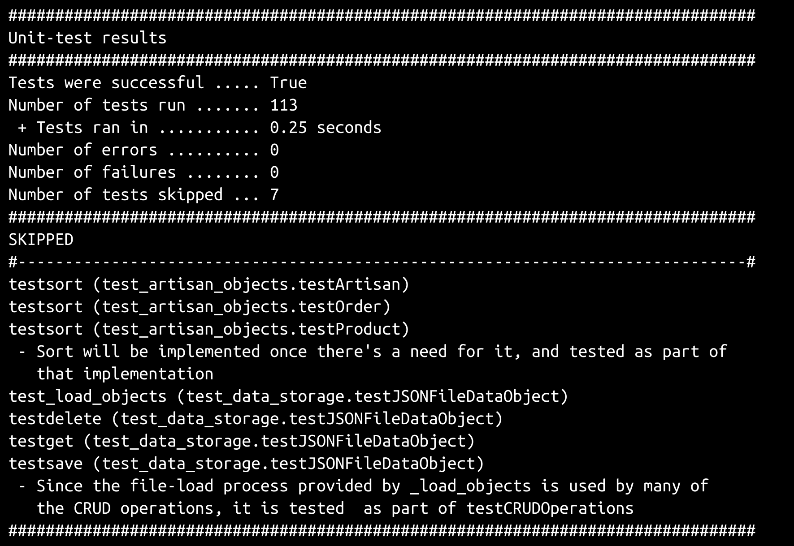
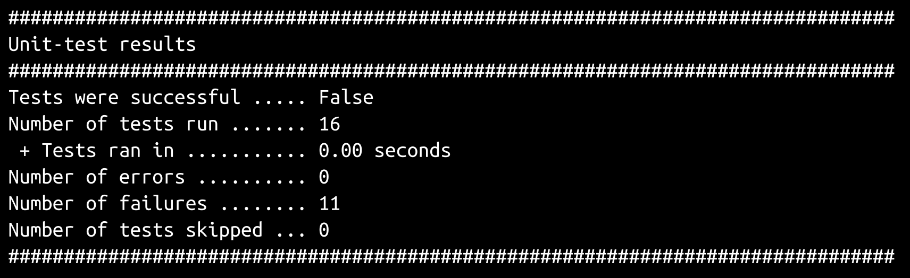
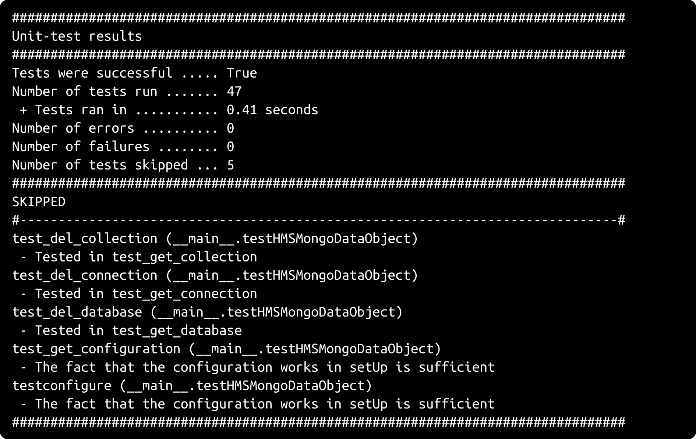
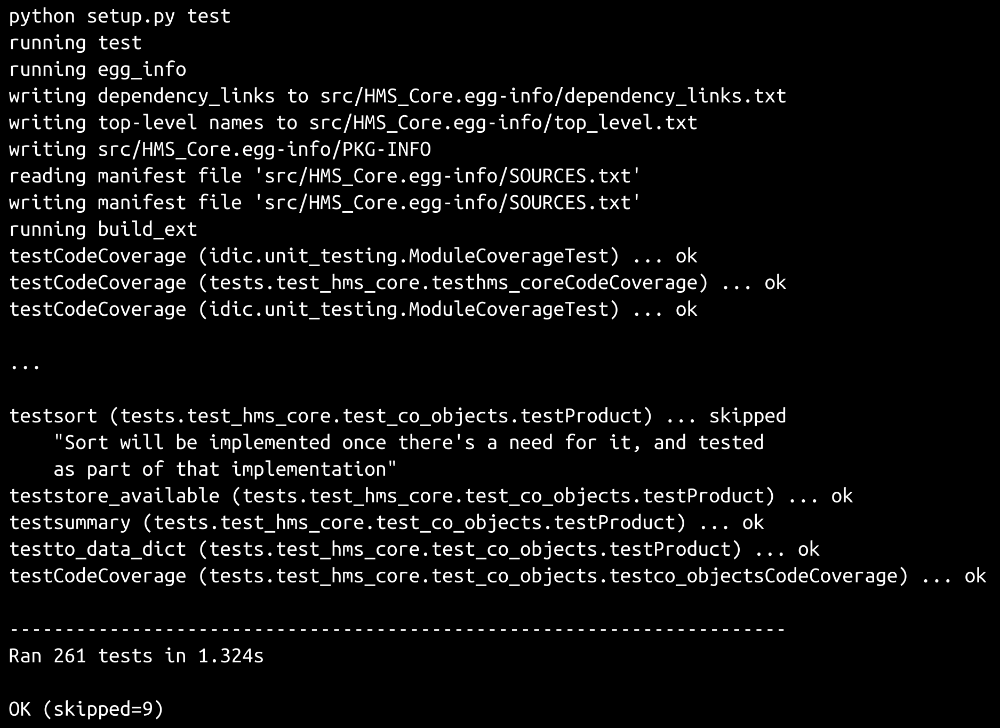
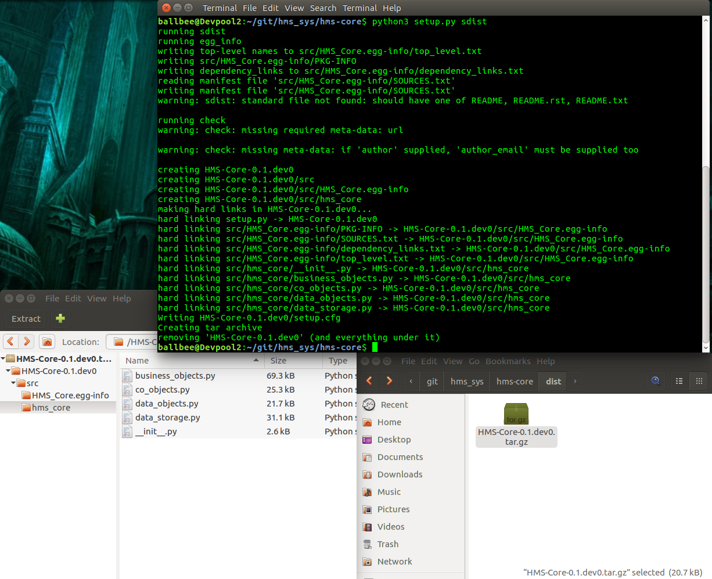
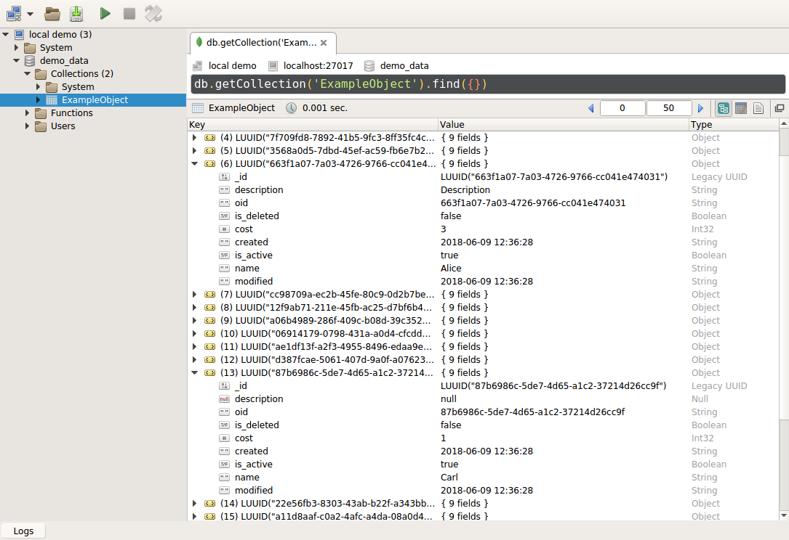

# 第十四章：数据持久性测试

代码的可重复单元测试在数据持久性的情况下很少比这更重要。代码可能随着时间的推移而发生变化或被替换，甚至可能完全更改为完全不同的系统，用完全不同的语言编写，但一旦数据存在，它可能比使用它的任何代码库都更持久。可以说，系统中的数据通常存在真正的业务价值，因此对与其交互的过程进行测试，并有可能破坏该价值的过程进行测试非常重要。

考虑到这一点，本章的大部分内容将集中在以下内容上：

+   编写本次迭代中创建的数据对象和相关类的单元测试：

+   新的`hms_artisan`类

+   新的`hms_core`类

+   将这些测试与构建过程集成

还添加了足够多的新功能，因此必须对以下内容进行一些注意：

+   新代码对构建过程的其他影响

+   演示新代码以及如何促进相关故事的验收

+   新代码如何影响操作、使用、维护和停用的关注点

# 编写单元测试

编写新数据对象类的单元测试的大部分过程可以简单地遵循之前迭代中建立的过程：

1.  为正在测试的包创建顶级测试模块。

1.  识别正在测试的包的子模块，并为每个创建相应的测试模块。

1.  将子测试模块的引用添加到包测试模块中并导入它们的测试。

1.  对于每个子测试模块：

+   执行模块并为每个报告为缺失的项目创建测试用例类

+   执行模块并为每个报告为缺失的成员（属性或方法）创建测试方法

需要创建几个测试模块，每个模块对应本次迭代中涉及的项目的`src`目录中创建的每个模块，得到以下结果：

+   `hms_core/../data_objects.py → test_hms_core/test_data_objects.py`（已经测试过，但为了完整起见列在这里）

+   `hms_artisan/../data_storage.py → test_hms_artisan/test_data_storage.py`

+   `hms_artisan/../artisan_objects.py → test_hms_artisan/test_artisan_objects.py`

+   `hms_core/../co_objects.py → test_hms_core/test_co_objects.py`

# 测试`hms_artisan.data_storage`

此时，`hms_artisan.data_storage`的单元测试都与测试`JSONFileDataStore`类有关。由于该类实际上所做的事情，通常的单元测试模式不适用，甚至根本不适用。它没有要测试的属性，而且可以测试的一个类属性（`_file_store_dir`）被派生类覆盖。

值得肯定的是，默认属性是否符合预期，因为如果它不默认为`None`，可能会导致派生类和这些类的实例失败：

```py
def test_file_store_dir(self):
    self.assertEqual(
        JSONFileDataObject._file_store_dir, None, 
        'JSONFileDataObject._file_store_dir is expected to provide '
        'a None default value that must be overridden by derived '
        'classes, but it is set to "%s" (%s)' % 
        (
            JSONFileDataObject._file_store_dir, 
            type(JSONFileDataObject._file_store_dir).__name__
        )
    )
```

就方法的测试而言，虽然有几种方法，但它们有些相互交织，并且它们经常依赖于抽象方法的实现，这些抽象方法本身不在 ABC 中，因此无法使用：

+   `get`、`delete`和`save`都调用`_load_objects`辅助类方法

+   `_load_objects`方法依赖于`from_data_dict`的具体实现，以生成其他方法所引用的对象集合

+   `save`方法还需要`to_data_dict`方法的具体实现

由于单元测试是关于证明可预测功能，因此问题变成了：我们能证明什么？

第一个，也可能是最明显的项目是对象初始化的工作方式与`BaseDataObject`中的工作方式几乎相同：

```py
class testJSONFileDataObject(unittest.TestCase):

    ###################################
    # Tests of class methods          #
    ###################################

    def test__init__(self):
        # Tests the __init__ method of the JSONFileDataObject class
        # - All we need to do here is prove that the various 
        #   setter- and deleter-method calls are operating as 
        #   expected -- same as BaseDataObject
        # - deleters first
        test_object = JSONFileDataObjectDerived()
        self.assertEquals(test_object._created, None)
        self.assertEquals(test_object._is_active, True)
        self.assertEquals(test_object._is_deleted, False)
        self.assertEquals(test_object._is_dirty, False)
        self.assertEquals(test_object._is_new, True)
        self.assertEquals(test_object._modified, None)
        self.assertEquals(test_object._oid, None)
        # - setters
        oid = uuid4()
        created = GoodDateTimes[0]
        modified = GoodDateTimes[1]
        is_active = False
        is_deleted = True
        is_dirty = True
        is_new = False
        test_object = JSONFileDataObjectDerived(
            oid, created, modified, is_active, is_deleted, 
            is_dirty, is_new
        )
        self.assertEquals(test_object.oid, oid)
        self.assertEquals(test_object.created, created)
        self.assertEquals(test_object.is_active, is_active)
        self.assertEquals(test_object.is_deleted, is_deleted)
        self.assertEquals(test_object.is_dirty, is_dirty)
        self.assertEquals(test_object.is_new, is_new)
        self.assertEquals(test_object.modified, modified)
```

`GoodDateTimes`的单元测试值与我们用来测试`BaseDataObject`的值相同。

由于`_create`和`_update`方法将不会被使用，我们可以证明当调用它们时它们会引发预期的错误：

```py
def test_create(self):
   # Tests the _create method of the JSONFileDataObject class
     test_object = JSONFileDataObjectDerived()
       try:
         test_object._create()
         self.fail(
           'JSONFileDataObject is not expected to raise '
            'NotImplementedError on a call to _create'
          )
        except NotImplementedError:
            pass
        except Exception as error:
            self.fail(
                'JSONFileDataObject is not expected to raise '
                'NotImplementedError on a call to _create, but %s '
                'was raised instead:\n - %s' %
                (error.__class__.__name__, error)
            )

def test_update(self):
   # Tests the _update method of the JSONFileDataObject class
   test_object = JSONFileDataObjectDerived()
     try:
         test_object._update()
         self.fail(
            'JSONFileDataObject is not expected to raise '
            'NotImplementedError on a call to _update'
          )
      except NotImplementedError:
         pass
      except Exception as error:
         self.fail(
             'JSONFileDataObject is not expected to raise '
             'NotImplementedError on a call to _update, but %s '
             'was raised instead:\n - %s' %
             (error.__class__.__name__, error)
          )
```

由于单独的 CRUD 操作以及`_load_objects`方法是相互关联的，它们之间会有很多重叠——对一个方法的测试将不得不执行其他方法的测试作为自己的测试过程的一部分，以真正证明一切都按预期工作。编写这种复杂的测试是乏味的，但更重要的是，需要更多的努力和纪律来维护，因此更容易脱离正在测试的代码。在这种情况下，更好的选择可能是跳过这些测试，并创建一个更大、统一的测试来测试所有相关功能。Python 的标准`unittest`模块提供了一个`skip`装饰器函数，可以标记要在标准单元测试运行中跳过的测试，并调用它需要记录跳过测试的原因。在这种情况下，原因是所有相关方法将在不同的测试方法中进行一次大规模的测试：

```py
@unittest.skip(
    'Since the file-load process provided by _load_objects is '
    'used by many of the CRUD operations, it is tested  as part of '
    'testCRUDOperations'
  )
def test_load_objects(self):
    # Tests the _load_objects method of the JSONFileDataObject class
      self.fail('test_load_objects is not yet implemented')

@unittest.skip(
    'Since deleting a data-file is part of the CRUD operations, '
    'it is tested as part of testCRUDOperations'
  )
def testdelete(self):
    # Tests the delete method of the JSONFileDataObject class
      self.fail('testdelete is not yet implemented')

@unittest.skip(
    'Since reading data-files is part of the CRUD operations, '
    'it is tested as part of testCRUDOperations'
  )
def testget(self):
    # Tests the get method of the JSONFileDataObject class
    self.fail('testget is not yet implemented')

@unittest.skip(
    'Since creating a data-file is part of the CRUD operations, '
    'it is tested as part of testCRUDOperations'
  )
def testsave(self):
     # Tests the save method of the JSONFileDataObject class
     self.fail('testsave is not yet implemented')
```

这样，大部分`JSONFileDataObject`的测试责任都落在一个单独的测试方法上——这不是代码强制执行标准测试政策所必需的，但它代表了在个别类成员测试覆盖率和可维护性之间的最佳折衷：`testCRUDOperations`。在其中并没有太多机会进行优雅的处理；它必须通过大量的条件和对象状态来强行执行，这仅仅是因为正在测试的方法的性质。但是，如果它经过深思熟虑，它将使得从它派生的类的测试不必再测试常见功能。

它首先要做的是确保内存和文件系统中都有一个干净的对象存储库。为了做到这一点，必须定义一个一次性类，其中包含确保所有必要的方法类都被创建的最低限度的功能。这个类`JSONFileDataObjectDerived`看起来是这样的：

```py
class JSONFileDataObjectDerived(JSONFileDataObject):
```

我们提供了一个文件存储位置，该位置没有被任何真实对象使用，可以随时删除并重新创建对象数据：

```py
_file_store_dir = '/tmp/hms_artisan_test'
```

因为这些测试涉及文件系统数据持久性，它们是针对进行系统开发的操作系统编写的——一个 Linux 安装——尽管它们在任何类 Unix 操作系统上都可以执行而无需修改。将它们转换为在 Windows 下运行并不困难：

创建一个测试数据目录（例如`C:\TestData`），并将所有以`/tmp/`开头的文件系统引用更改为`C:\\TestData\\`（注意双反斜杠），并修改其余的文件系统路径以使用 Windows 的文件系统表示法（`C:\\TestData\\path\\to\\some\\file.ext`，再次注意双反斜杠）。

我们提供所需功能的最低限度，尽可能使用父类的默认或经过验证/可证明的功能，或者使用最简单的可能实现：

```py
def matches(self, **criteria) -> (bool,):
   return BaseDataObject.matches(self, **criteria)

@classmethod
def from_data_dict(cls, data_dict:(dict,)):
   return cls(**data_dict)
```

在没有默认或可继承功能的情况下，我们保持最低限度的功能，以使测试具有意义——对于`to_data_dict`方法，这意味着坚持`BaseDataObject`的所有派生类所需的属性和数据结构：

```py
def to_data_dict(self):
   return {
        'created':datetime.strftime(
         self.created, self.__class__._data_time_string
         ),
         'is_active':self.is_active,
         'is_deleted':self.is_deleted,
         'modified':datetime.strftime(
             self.modified, self.__class__._data_time_string
          ),
          'oid':str(self.oid),
        }
```

然后，让我们通过直接清除内存中的对象缓存，并删除存储位置中的任何文件，来开始`testCRUDOperations`测试方法：

```py
def testCRUDOperations(self):
   # - First, assure that the class-level data-object collection 
   #   (in JSONFileDataObjectDerived._loaded_objects) is None, 
   #   and that the file-repository does not exist.
   JSONFileDataObjectDerived._loaded_objects = None
   if os.path.exists(JSONFileDataObjectDerived._file_store_dir):
      rmtree(JSONFileDataObjectDerived._file_store_dir)
```

`rmtree`函数来自一个名为`shutils`的 Python 包，它可以递归地从指定位置删除文件和子目录，并在目标位置不存在时引发错误。内置的`os`模块中的`os.path.exists`调用检查指定路径处的文件或目录是否存在，如果存在则返回`True`，否则返回`False`。

我们至少需要一个对象存储在新清除的缓存中，以开始我们的测试过程，因此接下来是创建一个数据对象，并保存其状态数据：

```py
# - Next, create an item and save it
first_object = JSONFileDataObjectDerived()
first_object.save()
# - Verify that the file exists where we're expecting it
self.assertTrue(
    os.path.exists(
         '/tmp/hms_artisan_test/JSONFileDataObjectDerived-'
         'data/%s.json' % first_object.oid
       )
    )
# - and that it exists in the in-memory cache
    self.assertNotEqual(
          JSONFileDataObjectDerived._loaded_objects.get(
            str(first_object.oid)
          ), None
    )
```

创建并保存一个对象后，我们可以验证数据写入和读取过程是否允许我们读取我们期望被写入的相同数据。我们可以利用类的`matches`方法，因为它最终是从`BaseDataObject`继承而来，并且之前已经经过测试。

由于`matches`使用`to_data_dict`生成的`data dict`，而其中不包括不持久的属性，比如`is_dirty`和`is_new`，这些需要单独检查：

```py
# - Verify that the item can be retrieved, and has the same 
#   data
first_object_get = JSONFileDataObjectDerived.get()[0]
self.assertTrue(
      first_object.matches(**first_object_get.to_data_dict())
)
self.assertEqual(
      first_object.is_dirty, first_object_get.is_dirty
)
self.assertEqual(
      first_object.is_new, first_object_get.is_new
)
```

如果对使用`matches`作为数据结构验证过程有任何疑虑，一个可行的替代方案是显式检查检索到的对象的每个属性与原始属性相对应。使用`matches`只是一种便利，而不是必须的。

接下来，我们将检查确保多个对象被保存和读取如预期。由于文件和对象的键都是对象的`oid`的函数，而且我们现在知道文件和内存中的数据对象的创建与一个对象的创建有关，我们只需要确保多个对象不会出现任何问题。创建另外两个对象还允许我们稍后重新验证整个集合：

```py
# - Create and save two more items
second_object = JSONFileDataObjectDerived()
second_object.save()
third_object = JSONFileDataObjectDerived()
third_object.save()
# - Verify that all three items can be retrieved, and that 
#   they are the expected objects, at least by their oids: 
#   Those, as part of the file-names, *will* be unique and 
#   distinct...
all_objects = JSONFileDataObjectDerived.get()
expected = set(
     [o.oid for o in [first_object, second_object, third_object]]
)
actual = set([o.oid for o in all_objects])
self.assertEqual(expected, actual)
```

我们还需要测试删除行为是否符合预期，从内存缓存中删除已删除的对象并删除适用的文件。在执行删除之前，我们需要确认要删除的文件是否存在，以避免删除执行后出现错误的测试结果：

```py
# - Verify that the file for the second item exists, so the 
#   verification later of its deletion is a valid test
self.assertTrue(
    os.path.exists(
        '/tmp/hms_artisan_test/JSONFileDataObjectDerived-'
        'data/%s.json' % second_object.oid
     )
)
```

然后我们可以删除该项，并验证从内存和文件系统中的删除：

```py
# - Delete the second item
JSONFileDataObjectDerived.delete(second_object.oid)
# - Verify that the item has been removed from the loaded-
#   object store and from the filesystem
self.assertEqual(
            JSONFileDataObjectDerived._loaded_objects.get(second_object.oid), 
            None
)
self.assertFalse(
os.path.exists(
        '/tmp/hms_artisan_test/JSONFileDataObjectDerived-'
        'data/%s.json' % second_object.oid
     )
 )
```

我们还需要验证更新状态数据的数据写入是否有效。我们可以通过更改现有对象的`is_active`和`is_deleted`标志，然后保存它，并检索其副本进行比较，并使用`matches`进行检查：

```py
# - Update the last object created, and save it
third_object._set_is_active(False)
third_object._set_is_deleted(True)
third_object.save()
# - Read the updated object and verify that the changes made 
#   were saved to the file.
third_object_get = JSONFileDataObjectDerived.get(third_object.oid)[0]
self.assertEqual(
       third_object.to_data_dict(),
       third_object_get.to_data_dict()
     )
self.assertTrue(
       third_object.matches(**third_object_get.to_data_dict())
     )
self.assertEqual(
       third_object.is_dirty, third_object_get.is_dirty
     )
self.assertEqual(
       third_object.is_new, third_object_get.is_new
     )
```

如果以后可能向此测试用例类添加其他测试，并且为了清理不再需要的文件，我们将重复清除内存和磁盘对象存储的过程。如果以后为任何目的创建其他测试需要以特定状态开始内存和磁盘存储，它们将不得不安排设置该状态，但它们不必担心首先清除它：

```py
# - Since other test-methods down the line might need to start 
#   with empty object- and file-sets, re-clear them both
JSONFileDataObjectDerived._loaded_objects = None
if os.path.exists(JSONFileDataObjectDerived._file_store_dir):
   rmtree(JSONFileDataObjectDerived._file_store_dir)
self.fail('testCRUDOperations is not complete')
```

原始的`test_file_store_dir`测试方法没有考虑到派生类不允许在没有设置为`None`以外的其他值的`_file_store_dir`类属性的情况下实例化自己。修改这一点，并使用另一个从`JSONFileDataObject`派生的类，这个类本质上是用于 CRUD 操作测试的`JSONFileDataObjectDerived`类的副本，但没有属性规范，允许将其作为原始测试方法的一部分进行测试：

```py
###################################
# Tests of class properties       #
###################################

def test_file_store_dir(self):
  self.assertEqual(
      JSONFileDataObject._file_store_dir, None, 
      'JSONFileDataObject._file_store_dir is expected to provide '
      'a None default value that must be overridden by derived '
      'classes, but it is set to "%s" (%s)' % 
      (
           JSONFileDataObject._file_store_dir, 
           type(JSONFileDataObject._file_store_dir).__name__
      )
    )
    try:
       test_object = NoFileStoreDir()
       self.fail(
           'Classes derived from JSONFileDataObject are expected '
           'to define a _file_store_dir class-attribute, or cause '
           'instantiation of objects from classes that don\'t '
           'have one defined to fail with an AttributeError'
       )
     except AttributeError:
         pass
```

# 测试 hms_artisan.artisan_objects

初始单元测试设置完成后，需要实现 74 个测试，这主要是由于在`hms_core`中的`Base`对应类中覆盖了属性及其 setter 和 deleter 方法。由于属性及其重写方法之间的主要区别在于在设置或删除调用期间自动更改实例的`is_dirty`属性，因此在这个级别上与属性相关的测试可能需要关注的唯一事情可能是这个：


所有属性的测试都接近迄今为止使用的标准结构，基本上是验证每个属性是否具有适当的获取器、设置器和删除器方法关联。唯一的真正区别在于指定了哪些方法。例如，查看`testArtisan.testcontact_name`，它测试`Artisan.contact_name`，测试设置器和删除器方法的断言在结构上与`BaseArtisan`的测试相同——它们断言 Artisan 的设置器和删除器方法与属性的设置和删除操作相关联。

获取方法的断言是不同的地方：

```py
def testcontact_name(self):
    # Tests the contact_name property of the Artisan class
    # - Assert that the getter is correct:
    self.assertEqual(
        BaseArtisan.contact_name.fget, 
        Artisan._get_contact_name, 
        'Artisan.contact_name is expected to use the '
        'BaseArtisan._get_contact_name method as its getter-method'
    )
    # - Assert that the setter is correct:
    self.assertEqual(
        Artisan.contact_name.fset, 
        Artisan._set_contact_name, 
        'Artisan.contact_name is expected to use the '
        '_set_contact_name method as its setter-method'
    )
    # - Assert that the deleter is correct:
    self.assertEqual(
        Artisan.contact_name.fdel, 
        Artisan._del_contact_name, 
        'Artisan.contact_name is expected to use the '
        '_del_contact_name method as its deleter-method'
    )
```

由于`Artisan`类为每个设置器和删除器方法提供了重写方法，但没有为获取器方法提供重写方法，因此属性的这一方面的断言指向原始获取器方法，即在`BaseArtisan`中定义并继承的方法。即使对于没有本地设置器或删除器方法的属性，例如`Product.metadata`，也是如此，它由`testProduct.testmetadata`测试：

```py
def testmetadata(self):
    # Tests the metadata property of the Product class
    # - Assert that the getter is correct:
    self.assertEqual(
        Product.metadata.fget, 
        BaseProduct._get_metadata, 
        'Product.metadata is expected to use the '
        'BaseProduct._get_metadata method as its getter-method'
    )
    # - Assert that the setter is correct:
    self.assertEqual(
        Product.metadata.fset, 
        None, 
        'Product.metadata is expected to be read-only, with no setter'
    )
    # - Assert that the deleter is correct:
    self.assertEqual(
        Product.metadata.fdel, 
        None, 
        'Product.metadata is expected to be read-only, with no deleter'
    )
```

设置器和删除器方法本身的测试也可以非常简单，但有一个警告。如果基本假设是：

+   `hms_core.business_objects`中从`Base`类继承的所有属性都将被测试（就目前而言是真的）

+   这些测试可以被信任，以证明这些属性在设置或删除时的可预测行为

+   本地设置器和删除器方法将始终回调到它们的测试对应方法

然后，在测试本地方法时，需要检查它们是否相应地设置了`is_dirty`。然而，实际上可能没有任何方法来验证这些假设是否在单元测试集中发挥作用。这变成了一种知道这些项目是预期的、标准程序，并在开发新代码时保持这些程序的问题。如果这些原则和程序可以被信赖，那么派生类属性方法覆盖的测试就不需要像它们的祖先那样经过同样程度的努力/细节，可以简单如下：

```py
def test_del_address(self):
    # Tests the _del_address method of the Artisan class
    test_object = Artisan('name', 'me@email.com', GoodAddress)
    self.assertEqual(test_object.is_dirty, False, 
        'A newly-created instance of an Artisan should '
        'have is_dirty of False'
    )
    test_object._del_address()
    self.assertEqual(test_object.is_dirty, True, 
        'The deletion of an Artisan address should set '
        'is_dirty to True'
    )

# ...

def test_set_address(self):
    # Tests the _set_address method of the Artisan class
    test_object = Artisan('name', 'me@email.com', GoodAddress)
    self.assertEqual(test_object.is_dirty, False, 
        'A newly-created instance of an Artisan should '
        'have is_dirty of False'
    )
    test_object._set_address(GoodAddresses[0])
    self.assertEqual(test_object.is_dirty, True, 
        'Setting an Artisan address should set '
        'is_dirty to True'
    )
```

数据字典方法（`to_data_dict`和`from_data_dict`）在所有数据对象中都是通用的，并且作为结果出现在要实现的所有测试用例类的测试列表中。所有这些都有编写良好、彻底的单元测试的特殊挑战。`to_data_dict`的变化都遵循一个相当一致的模式：

1.  遍历每个应该出现在输出中的属性的（希望是短的）代表性值列表

1.  创建一个预期的字典值，可以用来与输出进行比较

1.  断言预期的字典和`to_data_dict`的结果是相同的

理论上，确保测试所有可能的良好和坏的值组合的最佳方法是遍历所有这些可能的组合，将循环嵌套在其他循环中，以便例如测试所有可能的`name`、`street_address`、`city`值的组合。实际上，使用该策略构建的测试将需要很长时间来执行，因为要测试的组合数量很大（`name`值的数量×`street_address`值的数量×`city`值的数量等等）。需要出现在数据字典表示中的属性最少的类是`Order`类，除了已经测试过的其他类继承的属性外，还有五个本地属性。相关的`testto_data_dict`方法的不完整开始，只包括其中一个属性，共 72 行：

```py
def testto_data_dict(self):
    # Tests the to_data_dict method of the Order class
    for name in GoodStandardRequiredTextLines[0:2]:
        for street_address in GoodStandardRequiredTextLines[0:2]:
            for city in GoodStandardRequiredTextLines[0:2]:
                # - At this point, we have all the required 
                #   arguments, so we can start testing with 
                #   partial expected dict-values
                test_object = Order(
                    name, street_address, city,
                )
                expected = {
                    'name':name,
                    'street_address':street_address,
                    'city':city,
                    # - The balance are default values...
                    'building_address':None,
                    'region':None,
                    'postal_code':None,
                    'country':None,
                    'items':{},
                    # - We also need to include the data-object 
                    #   items that should appear!
                    'created':datetime.strftime(
                            test_object.created, 
                            test_object._data_time_string
                        ),
                    'modified':datetime.strftime(
                            test_object.modified, 
                            test_object._data_time_string
                        ),
                    'oid':str(test_object.oid),
                    'is_active':test_object.is_active,
                    'is_deleted':test_object.is_deleted,
                }
                self.assertEqual(
                    test_object.to_data_dict(), expected
                )
```

需要测试的每个附加属性都会导致当前循环内的另一个循环，并创建一个新的测试对象，确保包括正在测试的新属性项/参数：

```py
for items in GoodOrderItems:
  test_object = Order(
       name, street_address, city,
       items=items,
  )
```

每个子循环都必须创建自己的`expected`值：

```py
expected = {
    'name':name,
    'street_address':street_address,
    'city':city,
    'building_address':None,
    'region':None,
    'postal_code':None,
    'country':None,
    'items':items,
    'created':datetime.strftime(
         test_object.created, 
         test_object._data_time_string
     ),
    'modified':datetime.strftime(
         test_object.modified, 
         test_object._data_time_string
     ),
     'oid':str(test_object.oid),
     'is_active':test_object.is_active,
     'is_deleted':test_object.is_deleted,
}
```

每个子循环还必须执行自己的断言来测试`expected`与`test_object.to_data_dict`调用返回的实际值是否相符：

```py
self.assertEqual(
     test_object.to_data_dict(), expected
)
```

在这一点上，还有四个属性需要测试，每个属性都将以自己的嵌套循环开始：

```py
for building_address in GoodStandardOptionalTextLines[0:2]:
    for region in GoodStandardOptionalTextLines[0:2]:
        for postal_code in GoodStandardOptionalTextLines[0:2]:
            for country in GoodStandardOptionalTextLines[0:2]:
                pass
```

强制失败，并注明测试方法尚未完成，有助于防止假阳性的出现，并且还可以帮助跟踪在大量结果列表中正在进行的测试：

```py
self.fail('testto_data_dict is not complete')
```

各种`from_data_dict`方法的测试同样复杂且深度嵌套，原因是相同的变体，它们必须考虑所有可能提供的值的合理可能性。在`Order`类中测试该方法的不完整开始显示了在 72 行中开始形成的模式：

```py
def testfrom_data_dict(self):
    # Tests the from_data_dict method of the Order class
```

由于每个迭代段的预期值中应始终存在默认的`None`值，因此我们可以一次定义它们，然后在每个需要的点添加到预期值中：

```py
defaults = {
   'building_address':None,
   'region':None,
   'postal_code':None,
   'country':None,
   'items':{},
}
```

嵌套循环的集合本身与测试`to_data_dict`的循环相同，从所有必需的属性/参数的变体开始：

```py
for name in GoodStandardRequiredTextLines[0:2]:
    for street_address in GoodStandardRequiredTextLines[0:2]:
        for city in GoodStandardRequiredTextLines[0:2]:
```

每个循环段需要创建一个带有当前值的`data_dict`，并创建一个测试对象：

```py
# - At this point, we have all the required 
#   arguments, so we can start testing with 
#   partial expected dict-values
    data_dict = {
        'name':name,
        'street_address':street_address,
        'city':city,
    }
    test_object = Order.from_data_dict(data_dict)
```

由于我们还将测试`to_data_dict`，我们可以假定它对于与测试对象的`data-dict`进行比较是可信的。如果`to_data_dict`测试失败，它们将自行引发这些失败，并且不允许测试运行通过，直到这些失败得到解决，结果是相同的测试失败：

```py
actual = test_object.to_data_dict()
```

创建预期值有点复杂。它始于前面`defaults`值的副本（因为我们不希望测试迭代污染主要默认值）。我们还需要从实例中捕获预期值，因为我们期望它们出现在最终数据字典中：

```py
# - Create a copy of the defaults as a starting-point
expected = dict(defaults)
instance_values = {
    'created':datetime.strftime(
           test_object.created, 
           test_object._data_time_string
         ),
     'modified':datetime.strftime(
           test_object.modified, 
           test_object._data_time_string
         ),
     'oid':str(test_object.oid),
     'is_active':test_object.is_active,
     'is_deleted':test_object.is_deleted,
   }
```

在这一点上构建`expected`值，只是简单地更新它与数据字典和实例值。完成后，我们可以执行实际的测试断言：

```py
expected.update(instance_values)
expected.update(data_dict)
self.assertEqual(expected, actual)
```

与以前一样，每个需要测试的属性/参数都需要自己的嵌套循环，并且需要从最顶层循环复制相同的过程。在每个连续的循环级别上，`data_dict`值必须包含更多的数据以传递给`from_data_dict`方法，但每个子循环的平衡在其他方面都是相同的：

```py
for items in GoodOrderItems:
   # - Same structure as above, but adding items
   data_dict = {
        'name':name,
        'street_address':street_address,
        'city':city,
        'items':items,
    }
    test_object = Order.from_data_dict(data_dict)
    actual = test_object.to_data_dict()
    expected = dict(defaults)
    instance_values = {
        'created':datetime.strftime(
                 test_object.created, 
                 test_object._data_time_string
               ),
        'modified':datetime.strftime(
                 test_object.modified, 
                 test_object._data_time_string
               ),
         'oid':str(test_object.oid),
         'is_active':test_object.is_active,
         'is_deleted':test_object.is_deleted,
    }
    expected.update(instance_values)
    expected.update(data_dict)
    self.assertEqual(expected, actual)
    for building_address in GoodStandardOptionalTextLines[0:2]:
    for region in GoodStandardOptionalTextLines[0:2]:
    for postal_code in GoodStandardOptionalTextLines[0:2]:
    for country in GoodStandardOptionalTextLines[0:2]:
        pass
self.fail('testfrom_data_dict is not complete')
```

测试`matches`方法的结果实际上没有预期的那么复杂。毕竟，一个完整的测试需要测试对象实例的所有属性，对`True`和`False`结果进行测试，标准可能是 1 个值或 12 个值，或者（理论上）数十个或数百个。幸运的是，通过使用与`to_data_dict`和`from_data_dict`测试相同的嵌套循环结构，但变化以创建用于测试的标准，并确定在每一步中预期值需要是什么，实际上并不那么困难。测试过程从创建一个具有已知功能数据的对象的每个属性开始：

```py
def testmatches(self):
    # Tests the matches method of the Order class
    # - First, create an object to test against, with as complete 
    #   a data-set as we can manage
    test_object = Order(
        name = GoodStandardRequiredTextLines[0],
        street_address = GoodStandardRequiredTextLines[0],
        city = GoodStandardRequiredTextLines[0],
        building_address = GoodStandardOptionalTextLines[0],
        region = GoodStandardOptionalTextLines[0],
        postal_code = GoodStandardOptionalTextLines[0],
        country = GoodStandardOptionalTextLines[0],
    )
```

嵌套循环结构遍历一系列数字（`0`和`1`），并根据循环中的属性相关的值的类型从适当的列表中检索测试值，创建或添加到条件，并根据任何先前的预期值和循环的条件值与相应对象属性的比较来确定预期结果是否应为`True`或`False`。在此之后，剩下的就是断言预期值是否等于调用测试对象的`matches`方法返回的实际值：

```py
# - Then we'll iterate over some "good" values, create criteria
for name_num in range(0,2):
   name = GoodStandardRequiredTextLines[name_num]
   criteria = {'name':name}
   expected = (name == test_object.name)
   self.assertEqual(expected, test_object.matches(**criteria))
```

每个子循环关注其父级中设置的`expected`值的原因是为了确保更高级别的`False`结果不会被当前循环级别的潜在`True`结果覆盖。例如，在测试迭代的这一点上，如果`name`导致`False`结果（因为它与`test_object.name`不匹配），即使`street_address`匹配，它仍应返回`False`结果：

```py
for str_addr_num in range(0,2):
    street_address = GoodStandardRequiredTextLines[str_addr_num]
    criteria['street_address'] = street_address
    expected = (expected and street_address == test_object.street_address)
    self.assertEqual(expected, test_object.matches(**criteria))
```

每个子循环的模式，除了添加到条件中的属性值的名称和`expected`值的重新定义之外，在循环树的所有层次上都是相同的：

```py
for city_num in range(0,2):
   city = GoodStandardRequiredTextLines[city_num]
   criteria['city'] = city
   expected = (expected and city == test_object.city)
   self.assertEqual(expected, test_object.matches(**criteria))
   for bldg_addr_num in range(0,2):
       building_address = GoodStandardOptionalTextLines[bldg_addr_num]
       criteria['building_address'] = building_address
         expected = (
             expected and 
             building_address == test_object.building_address
            )
            self.assertEqual(expected, test_object.matches(**criteria))
            for region_num in range(0,2):
                for pc_num in range(0,2):
                    for cntry_num in range(0,2):
                        country=GoodStandardOptionalTextLines[cntry_num]
self.fail('testmatches is not complete')
```

所有新数据对象共有的最后一个方法是`_load_objects`辅助类方法。初始单元测试引发了一些语法问题，这使得有必要删除`JSONFileDataObject`中该方法的抽象，并在每个从属类中实现一个覆盖类方法，所有这些方法都调用原始类方法，如下所示：

```py
@classmethod
def _load_objects(cls, force_load=False):
    return JSONFileDataObject._load_objects(cls, force_load)
```

这反过来开始提高测试运行中方法的要求。这些测试的实施并不困难，在一定程度上建立在最初为`JSONFileDataObject`编写的原始测试方法上。对`Order`类进行的测试结构是最简单的例子，并且开始方式基本相同，但是强制清除磁盘和内存数据存储，但在将磁盘位置设置为一次性目录之后：

```py
def test_load_objects(self):
    # Tests the _load_objects method of the Order class
    # - First, forcibly change Order._file_store_dir to a disposable 
    #   temp-directory, and clear the in-memory and on-disk stores
    Order._file_store_dir = '/tmp/test_artisan_objects/'
    Order._loaded_objects = None
    if os.path.exists(Order._file_store_dir):
        rmtree(Order._file_store_dir)
    self.assertEqual(Order._loaded_objects, None)
```

为了测试加载过程，需要创建并保存一些对象：

```py
# - Iterate through some objects, creating them and saving them.
    for name in GoodStandardRequiredTextLines[0:2]:
       for street_address in GoodStandardRequiredTextLines[0:2]:
          for city in GoodStandardRequiredTextLines[0:2]:
```

```py
              test_object = Order(name, street_address, city)
              test_object.save()
```

创建每个对象时，都会验证其在内存和磁盘存储中的存在：

```py
# - Verify that the object exists
#   - in memory
self.assertNotEqual(
    Order._loaded_objects.get(str(test_object.oid)), 
    None
)
#   - on disk
file_path = '%s/Order-data/%s.json' % (
    Order._file_store_dir, test_object.oid
)
self.assertTrue(
    os.path.exists(file_path), 
    'The file was not written at %s' % file_path
)
```

还需要清除内存存储，重新加载它，并验证新创建的对象是否仍然存在。这在每个对象创建迭代中都会发生：

```py
# - Make a copy of the OIDs to check with after clearing 
#   the in-memory copy:
oids_before = sorted([str(key) for key in Order._loaded_objects.keys()])
# - Clear the in-memory copy and verify all the oids 
#   exist after a _load_objects is called
Order._loaded_objects = None
Order._load_objects()
oids_after = sorted(
    [str(key) for key in Order._loaded_objects.keys()]
)
self.assertEqual(oids_before, oids_after)
```

通过迭代实例列表，随机选择一个实例，删除该实例，并验证其删除方式与最初的创建方式相同，以验证删除过程是否移除了内存和磁盘对象：

```py
# - Delete items at random and verify deletion and load after each
instances = list(Order._loaded_objects.values())
while instances:
   target = choice(instances)
   Order.delete(target.oid)
   # - Verify that the object no longer exists
   #   - in memory
   self.assertEqual(
       Order._loaded_objects.get(str(test_object.oid)), 
       None
   )
   #   - on disk
   file_path = '%s/Order-data/%s.json' % (
       Order._file_store_dir, target.oid
   )
   self.assertFalse(
        os.path.exists(file_path), 
        'File at %s was not deleted' % file_path
   )
   # - Make a copy of the OIDs to check with after clearing 
   #   the in-memory copy:
   oids_before = sorted(
        [str(key) for key in Order._loaded_objects.keys()]
   )
   # - Clear the in-memory copy and verify all the oids 
   #   exist after a _load_objects is called
   Order._loaded_objects = None
   Order._load_objects()
   oids_after = sorted([str(key) for key in Order._loaded_objects.keys()])
   self.assertEqual(oids_before, oids_after)
```

每次迭代结束时，实例列表都会更新：

```py
instances.remove(target)
```

最后，为了安全起见，任何可能剩下的文件都会被删除：

```py
# - Clean up any remaining in-memory and on-disk store items
Order._loaded_objects = None
if os.path.exists(Order._file_store_dir):
    rmtree(Order._file_store_dir)
```

大多数测试方法的平衡遵循先前建立的模式：

+   各种属性及其 getter、setter 和 deleter 方法使用本节开头提到的结构

+   各种`__init__`方法仍然为所有参数/属性的合理子集创建并断言参数到属性设置

然而，还有一些离群值。首先，定义了但没有实现的`sort`类方法，作为`BaseDataObject`中的抽象类方法，已经出现。在这一点上，我们甚至不知道我们是否需要它，更不用说它需要采取什么形式了。在这种情况下，推迟其实现和该实现的测试似乎是明智的。为了允许忽略所需的单元测试，可以用`unittest.skip`进行装饰：

```py
@unittest.skip(
    'Sort will be implemented once there\'s a need for it, '
    'and tested as part of that implementation'
)
def testsort(self):
    # Tests the sort method of the Artisan class
    # - Test all permutations of "good" argument-values:
    # - Test all permutations of each "bad" argument-value 
    #   set against "good" values for the other arguments:
    self.fail('testsort is not yet implemented')
```

Artisan 类中又出现了两个离群值：`add_product`和`remove_product`，在此之前没有可测试的具体实现。通过添加`Goodproducts`和`Badproducts`值列表进行测试，`testadd_product`与以前利用值列表进行测试的测试方法非常相似：

```py
def testadd_product(self):
    # Tests the add_product method of the Artisan class
    test_object = Artisan('name', 'me@email.com', GoodAddress)
    self.assertEqual(test_object.products, ())
    check_list = []
    for product in Goodproducts[0]:
        test_object.add_product(product)
        check_list.append(product)
        self.assertEqual(test_object.products, tuple(check_list))
    test_object = Artisan('name', 'me@email.com', GoodAddress)
    for product in Badproducts:
        try:
            test_object.add_product(product)
            self.fail(
                'Artisan.add_product should not allow the '
                'addition of "%s" (%s) as a product-item, but '
                'it was allowed' % (product, type(product).__name__)
            )
        except (TypeError, ValueError):
            pass
```

测试`remove_product`的过程是通过使用相同的过程创建产品集合，然后逐个删除它们，并在每次迭代中验证删除：

```py
def testremove_product(self):
    # Tests the remove_product method of the Artisan class
    test_object = Artisan('name', 'me@email.com', GoodAddress)
    self.assertEqual(test_object.products, ())
    for product in Goodproducts[0]:
        test_object.add_product(product)
    check_list = list(test_object.products)
    while test_object.products:
        product = test_object.products[0]
        check_list.remove(product)
        test_object.remove_product(product)
        self.assertEqual(test_object.products, tuple(check_list))
```

因为`hms_artisan..Order`是从头开始构建的，其属性方法测试需要明确执行与之前提到的相同类型的`is_dirty`检查，但还必须实现几种标准属性测试中的任何一种。典型的删除器和设置器方法测试如下所示：

```py
def test_del_building_address(self):
    # Tests the _del_building_address method of the Order class
    test_object = Order('name', 'street_address', 'city')
    self.assertEqual(
        test_object.building_address, None, 
        'An Order object is expected to have None as its default '
        'building_address value if no value was provided'
    )
    # - Hard-set the storage-property's value, call the 
    #   deleter-method, and assert that it's what's expected 
    #   afterwards:
    test_object._set_is_dirty(False)
    test_object._building_address = 'a test value'
    test_object._del_building_address()
    self.assertEqual(
        test_object.building_address, None, 
        'An Order object is expected to have None as its '
        'building_address value after the deleter is called'
    )
    self.assertTrue(test_object.is_dirty,
        'Deleting Order.building_address should set is_dirty to True'
    )

# ...

def test_set_building_address(self):
    # Tests the _set_building_address method of the Order class
    # - Create an object to test with:
    test_object = Order('name', 'street_address', 'city')
    # - Test all permutations of "good" argument-values:
    for expected in GoodStandardOptionalTextLines:
        test_object._set_building_address(expected)
        actual = test_object._get_building_address()
        self.assertEqual(
            expected, actual, 
            'Order expects a building_address value set to '
            '"%s" (%s) to be retrieved with a corresponding '
            'getter-method call, but "%s" (%s) was returned '
            'instead' % 
            (
                expected, type(expected).__name__, 
                actual, type(actual).__name__, 
            )
        )
    # - Test is_dirty after a set
    test_object._set_is_dirty(False)
    test_object._set_building_address(GoodStandardOptionalTextLines[1])
    self.assertTrue(test_object.is_dirty,
        'Setting a new value in Order.business_address should '
        'also set the instance\'s is_dirty to True'
    )
    # - Test all permutations of "bad" argument-values:
    for value in BadStandardOptionalTextLines:
        try:
            test_object._set_building_address(value)
            # - If this setter-call succeeds, that's a 
            #   test-failure!
            self.fail(
                'Order._set_business_address should raise '
                'TypeError or ValueError if passed "%s" (%s), '
                'but it was allowed to be set instead.' % 
                (value, type(value).__name__)
            )
        except (TypeError, ValueError):
            # - This is expected, so it passes
            pass
        except Exception as error:
            self.fail(
                'Order._set_business_address should raise '
                'TypeError or ValueError if passed an invalid '
                'value, but %s was raised instead: %s.' % 
                (error.__class__.__name__, error)
            )
```

`hms_artisan`命名空间的所有测试的最终测试报告显示，除了明确跳过的七个测试外，所有测试都已运行，没有测试失败：



# 测试新的 hms_core 类

在进行模块的单元测试的常规设置过程之后（创建测试模块，执行测试模块，为每个报告为缺失的项目创建测试用例类，执行测试模块，并为每个报告为缺失的项目创建测试方法），初始结果显示需要实现的测试要少得多，只有 11 个需要填充：



不过，这些结果有一个警告：它们**不包括**对`BaseDataObject`和`HMSMongoDataObject`所需的数据对象方法的测试，只包括作为创建的`Artisan`和`Product`类的一部分定义的属性和方法的测试。这些属性和方法位于它们自己的测试模块中，需要实现另外 33 个测试：


# 单元测试 hms_core.data_storage.py

`DatastoreConfig`类的大部分测试遵循先前建立的测试模式。值得注意的例外是测试其`from_config`类方法，它需要实际的配置文件进行测试。通过创建一个充满良好值的配置文件来测试所有良好值并不看起来与涉及从`dict`值创建对象实例的其他测试方法有多大不同，尽管开始时对所有良好测试值的相同迭代：

```py
# - Test all permutations of "good" argument-values:
config_file = '/tmp/datastore-test.json'
for database in good_databases:
    for host in good_hosts:
        for password in good_passwords:
            for port in good_ports:
                for user in good_users:
                    config = {
                        'database':database,
                        'host':host,
                        'password':password,
                        'port':port,
                        'user':user,
                    }
```

这是创建临时配置文件的地方：

```py
fp = open('/tmp/datastore-test.json', 'w')
json.dump(config, fp)
fp.close()
```

然后调用`from_config`，并执行各种断言：

```py
test_object = DatastoreConfig.from_config(config_file)
self.assertEqual(test_object.database, database)
self.assertEqual(test_object.host, host)
self.assertEqual(test_object.password, password)
self.assertEqual(test_object.port, port)
self.assertEqual(test_object.user, user)
os.unlink(config_file)
```

在测试每个参数/属性（`database`、`host`、`password`、`port`和`user`）的各种错误值时使用了类似的方法/结构（它们看起来都很像测试错误数据库值的测试）：

```py
# - Test all permutations of each "bad" argument-value 
#   set against "good" values for the other arguments:
# - database
host = good_hosts[0]
password = good_passwords[0]
port = good_ports[0]
user = good_users[0]
for database in bad_databases:
    config = {
        'database':database,
        'host':host,
        'password':password,
        'port':port,
        'user':user,
    }
    fp = open('/tmp/datastore-test.json', 'w')
    json.dump(config, fp)
    fp.close()
    try:
        test_object = DatastoreConfig.from_config(config_file)
        self.fail(
            'DatastoreConfig.from_config should not '
            'accept "%s" (%s) as a valid database config-'
            'value, but it was allowed to create an '
            'instance' % (database, type(database).__name__)
        )
    except (RuntimeError, TypeError, ValueError):
        pass
```

`HMSMongoDataObject`的大部分测试过程也与先前建立的测试编写模式相同：

+   因为该类派生自`BaseDataObject`，所以有许多相同的必需测试方法依赖于实现抽象功能，因此创建了一个派生类进行测试，即使只是为了确保依赖方法调用是成功的

+   `_create`和`_update`方法的测试与测试它们的`hms_artisan`对应方法基本相同，因为它们也只是简单地引发`NotImplementedError`

测试任何`HMSMongoDataObject`派生类的功能都需要一个运行中的 MongoDB 安装。如果没有，测试可能会引发错误（希望至少能指出问题所在），或者可能会一直等待连接到 MongoDB，直到连接尝试超时解决。

本地属性，因为它们都使用其底层存储属性的实际删除，并且是懒惰实例化（在需要时创建，如果它们尚不可用），因此需要与以前的属性测试不同的方法。为了将所有相关的测试代码放在一个地方，`test_del_`方法已被跳过，并且属性删除方面的测试与`test_get_`方法合并。以`test_get_connection`为例：

```py
def test_get_connection(self):
    # Tests the _get_connection method of the HMSMongoDataObject class
    # - Test that lazy instantiation on a new instance returns the 
    #   class-attribute value (_connection)
    test_object =  HMSMongoDataObjectDerived()
    self.assertEqual(
        test_object._get_connection(), 
        HMSMongoDataObjectDerived._connection
    )
    # - Test that deleting the current connection and re-aquiring it 
    #   works as expected
    test_object._del_connection()
    self.assertEqual(
        test_object._get_connection(), 
        HMSMongoDataObjectDerived._connection
    )
    # - There may be more to test later, but this suffices for now...
```

每个测试的过程都类似：

1.  创建一个`test_object`实例

1.  断言当调用测试属性 getter 时返回公共类属性值（在这种情况下为`HMSMongoDataObjectDerived._connection`）

1.  调用删除方法

1.  重新断言当再次调用 getter 时返回公共类属性值

在调用删除方法和 getter 方法之间进行断言，断言类属性值已被删除可能也是一个好主意，但只要最终的 getter 调用断言仍然通过，这并不是真正必要的。

`HMSMongoDataObject`的测试用例类中有几个项目依赖于实际的数据库连接，以便能够有用。此外，还有一些直接与该依赖关系相关的测试方法可以跳过，或者其实现值得注意。由于我们需要一个数据库连接，因此每次测试用例类运行时都必须进行配置。理想情况下，它不应该为每个需要连接的测试运行 - 如果它确实如此，至少在目前的系统规模上并不是什么大问题，但在更大规模的系统中，为每个需要它的测试方法创建一个新的数据库可能会减慢速度。也许会大大减慢。

幸运的是，标准的 Python `unittest`模块提供了可以用来初始化数据库连接数据，并在所有测试完成后删除用于测试的数据库的方法。分别是`setUp`和`tearDown`方法。`setUp`只需要配置数据访问，因为`HMSMongoDataObjects`会在需要时负责创建它需要的`connection`、`database`和`collection`对象：

```py
def setUp(self):
    # - Since we need a database to test certain methods, 
    #   create one here
    HMSMongoDataObject.configure(self.__class__.config)
```

`tearDown`负责完全删除为测试用例类创建的测试数据库，并简单地创建一个`MongoClient`，然后使用它来删除配置中指定的数据库：

```py
def tearDown(self):
    # - delete the database after we're done with it, so that we 
    #   don't have data persisting that could bollix up subsequent 
    #   test-runs
    from pymongo import MongoClient
    client = MongoClient()
    client.drop_database(self.__class__.config.database)
```

如果我们尝试断言任何预期值或行为，`setUp`和`tearDown`方法将不会像典型的测试方法一样行为 - 任何失败的断言都将简单地引发错误。这意味着，虽然我们可以断言配置已经准确完成，但从报告的角度来看，它实际上并没有做任何有用的事情。在这种情况下，如果配置调用没有引发任何错误，并且依赖于它的各种测试方法都通过了，那么可以认为配置正在按预期进行。在这种情况下，我们可以跳过相关的测试方法：

```py
@unittest.skip(
    'The fact that the configuration works in setUp is sufficient'
)
def test_get_configuration(self):
    # Tests the _get_configuration method of the HMSMongoDataObject class
    # - Test all permutations of "good" argument-values:
    # - Test all permutations of each "bad" argument-value 
    #   set against "good" values for the other arguments:
    self.fail('test_get_configuration is not yet implemented')

@unittest.skip(
    'The fact that the configuration works in setUp is sufficient'
)
def testconfigure(self):
    # Tests the configure method of the HMSMongoDataObject class
    self.fail('testconfigure is not yet implemented')
```

为了完全测试`delete`、`get`和`save`方法，我们必须实现一个一次性的派生类 - `HMSMongoDataObjectDerived`：

```py
class HMSMongoDataObjectDerived(HMSMongoDataObject):

    _data_dict_keys = (
        'name', 'description', 'cost', 'oid', 'created', 'modified', 
        'is_active', 'is_deleted'
    )
```

我们希望有一些本地属性可以用来测试`get`，但它们不需要更多，只需要在初始化期间设置为简单的属性，并在`to_data_dict`调用的结果中出现：

```py
def __init__(self, name=None, description=None, cost=0, 
    oid=None, created=None, modified=None, is_active=None, 
    is_deleted=None, is_dirty=None, is_new=None
  ):
    HMSMongoDataObject.__init__(
    self, oid, created, modified, is_active, is_deleted, 
    is_dirty, is_new
  )
    self.name = name
    self.description = description
    self.cost = cost

def to_data_dict(self):
    return {
         # - "local" properties
         'name':self.name,
         'description':self.description,
         'cost':self.cost,
         # - standard items from HMSMongoDataObject/BaseDataObject
         'created':self.created.strftime(self.__class__._data_time_string),
         'is_active':self.is_active,
         'is_deleted':self.is_deleted,
         'modified':self.modified.strftime(self.__class__._data_time_string),
         'oid':str(self.oid),
        }

def matches(self, **criteria):
    return HMSMongoDataObject.matches(self, **criteria)
```

为了测试`delete`方法，我们需要首先创建并保存一些对象：

```py
def testdelete(self):
    # Tests the delete method of the HMSMongoDataObject class
    # - In order to really test get, we need some objects to test 
    #   against, so create a couple dozen:
    names = ['Alice', 'Bob', 'Carl', 'Doug']
    costs = [1, 2, 3]
    descriptions = [None, 'Description']
    all_oids = []
    for name in names:
        for description in descriptions:
            for cost in costs:
                item = HMSMongoDataObjectDerived(
                    name=name, description=description, cost=cost
                )
                item.save()
                all_oids.append(item.oid)
```

我们希望测试我们可以删除多个项目和单个项目，因此我们将删除创建的对象集合的后半部分，然后删除剩余项目的后半部分，依此类推，直到只剩下一个对象。在每次迭代中，我们删除当前的`oid`集合，并验证它们在被删除后是否不存在。最后，我们验证所有创建的对象都已被删除：

```py
# - Delete varying-sized sets of items by oid, and verify that 
#   the deleted oids are gone afterwards...
while all_oids:
     try:
        oids = all_oids[len(all_oids)/2:]
        all_oids = [o for o in all_oids if o not in oids]
     except:
        oids = all_oids
        all_oids = []
     HMSMongoDataObjectDerived.delete(*oids)
     items = HMSMongoDataObjectDerived.get(*oids)
     self.assertEqual(len(items), 0)
# - Verify that *no* items exist after they've all been deleted
items = HMSMongoDataObjectDerived.get()
self.assertEqual(items, [])
```

测试`get`采用类似的方法 - 创建几个具有易于识别属性值的项目，这些值可以用作`criteria`：

```py
def testget(self):
   # Tests the get method of the HMSMongoDataObject class
   # - In order to really test get, we need some objects to test 
   #   against, so create a couple dozen:
   names = ['Alice', 'Bob', 'Carl', 'Doug']
   costs = [1, 2, 3]
   descriptions = [None, 'Description']
   for name in names:
      for description in descriptions:
         for cost in costs:
             HMSMongoDataObjectDerived(
                  name=name, description=description, cost=cost
             ).save()
```

然后我们可以迭代相同的值，创建一个`criteria`集合来使用，并验证返回的对象是否具有我们传递的`criteria`值。首先是一个`criteria`值：

```py
# - Now we should be able to try various permutations of get 
#   and get verifiable results. These tests will fail if the 
#   _data_dict_keys class-attribute isn't accurate...
for name in names:
    criteria = {
        'name':name,
    }
    items = HMSMongoDataObjectDerived.get(**criteria)
    actual = len(items)
    expected = len(costs) * len(descriptions)
    self.assertEqual(actual, expected, 
        'Expected %d items returned (all matching name="%s"), '
        'but %d were returned' % 
        (expected, name, actual)
    )
    for item in items:
        self.assertEqual(item.name, name)
```

然后我们使用多个`criteria`进行测试，以确保多个`criteria`值的行为符合预期：

```py
for cost in costs:
    criteria = {
         'name':name,
         'cost':cost,
    }
    items = HMSMongoDataObjectDerived.get(**criteria)
    actual = len(items)
    expected = len(descriptions)
    self.assertEqual(actual, expected, 
         'Expected %d items returned (all matching '
         'name="%s" and cost=%d), but %d were returned' % 
         (expected, name, cost, actual)
   )
   for item in items:
       self.assertEqual(item.name, name)
       self.assertEqual(item.cost, cost)
```

在“删除”和“获取”方法的测试之间，我们实际上已经测试了“保存”方法 - 毕竟我们必须保存对象才能获取或删除它们，因此可以说`testsave`实际上并不是真正需要的。为了进行实际测试，而不是跳过另一个测试，我们将实施它，并用它来测试我们也可以通过其`oid`值获取对象：

```py
# - Noteworthy because save/get rather than save/pymongo-query.
#   another option would be to do a "real" pymongo query, but that 
#   test-code would look like the code in get anyway...?
def testsave(self):
   # Tests the save method of the HMSMongoDataObject class
   # - Testing save without using get is somewhat cumbersome, and 
   #   perhaps too simple...?
   test_object = HMSMongoDataObjectDerived()
   test_object.save()
   expected = test_object.to_data_dict()
   results = HMSMongoDataObjectDerived.get(str(test_object.oid))
   actual = results[0].to_data_dict()
   self.assertEqual(actual, expected)
```

一旦所有内容都实施并通过，最终的测试输出显示有 47 个测试，其中有五个被跳过：



# 单元测试 hms_core.co_objects.py

`co_objects`中的`Artisan`和`Product`类，就像`hms_artisan`的`artisan_objects`模块中的对应类一样，必须被覆盖以在修改了状态数据记录的任何属性时提供适当的`is_dirty`行为。因此，必须创建相应的测试方法，就像在测试`hms_artisan`软件包中的对应类时发生的那样。实际上，两个模块都进行了相同的更改，因此两个软件包中存在的类的测试类和其中的测试方法结果是相同的。

# 单元测试和信任

早些时候已经指出，单元测试代码的真正目的是确保代码在所有可能的执行情况下都以可预测的方式运行。从非常实际的角度来看，这也是在代码库中建立信任的一种方式。在这种情况下，必须就可以简单地接受这种信任的地方划定一条线。例如，这次迭代中的各种单元测试都侧重于确保为数据持久性创建的代码可以从数据库引擎获取并传递所有必要的内容。它并不关心用于连接到数据库引擎的库是否值得信赖；对于我们的目的，我们假设它是可信赖的，至少直到我们遇到无法用其他方式解释的测试失败。

单元测试为可能使用我们的代码的其他人提供了信任 - 知道已经测试了所有需要测试的内容，并且所有测试都已通过。

# 构建/分发，演示和验收

各个模块的构建过程不会有太大变化，尽管现在有了单元测试，可以将其添加到用于打包各个 Python 软件包的`setup.py`文件中。已经存在的`setup`函数可以在进行最小更改的情况下用于执行整个测试套件，只需提供指向根测试套件目录的`test_suite`参数即可。

可能需要确保已将测试套件目录的路径添加到`sys.path`中：

```py
#!/usr/bin/env python

import sys
sys.path.append('../standards')
sys.path.append('tests/test_hms_core') # <-- This path
```

然后，当前的`setup`函数调用包括`test_suite`，如下所示：

```py
setup(
    name='HMS-Core',
    version='0.1.dev0',
    author='Brian D. Allbee',
    description='',
    package_dir={
        '':'src',
    },
    packages=[
        'hms_core',
    ],
    test_suite='tests.test_hms_core',
)
```

然后可以使用`python setup.py test`执行整个测试套件，该命令返回测试执行的逐行摘要及其结果：



将代码打包到组件项目中仍然使用`python setup.py sdist`，并且仍然会生成可安装的软件包：



展示新的数据持久性功能可以通过多种方式完成，但需要在一次性/临时数据库中创建一次性/临时演示数据对象。`test_co_objects`测试模块中有代码可以做到这一点，因此可以基于该结构创建一个最小的数据对象类（称之为`ExampleObject`以示范目的），然后运行：

```py
HMSMongoDataObject.configure(
    DatastoreConfig(database='demo_data')
)

print('Creating data-objects to demo with')
names = ['Alice', 'Bob', 'Carl', 'Doug']
costs = [1, 2, 3]
descriptions = [None, 'Description']
for name in names:
    for description in descriptions:
        for cost in costs:
            item = ExampleObject(
                name=name, description=description, cost=cost
            )
            item.save()
```

它负责生成可以检查的数据集。从那时起，任何工具 - 命令行`mongo`客户端或 GUI，例如 Robo3T - 都可以用于查看和验证数据是否实际上已被持久化：



如果需要更详细的验收示例 - 例如每种业务对象类型的示例 - 可以编写类似的脚本来创建`Artisan`和`Product`实例并保存它们。同样，就`hms_artisan`数据对象类而言，仅显示为示例/演示环境中的对象编写的文件应该就足够了。

# 操作/使用，维护和 decommissioning 考虑

就这些项目而言，还没有实质性的变化：

+   尽管现在有三个包，但它们仍然非常简单。

+   尽管我们通过包含`pymongo`库添加了外部依赖，但我们还没有到需要担心如何处理该依赖的地步。

+   显然需要安装 MongoDB，但在代码准备好集成到共享环境之前，这甚至不是问题 - 目前本地开发可以使用本地数据库引擎。

+   从退役的角度来看，卸载软件实际上并没有什么变化，只是现在有三个要卸载的软件包 - 但每个软件包的过程都是上一次迭代结束时的过程的变体（`pip uninstall HMS-Core`）。

# 总结

虽然在后续迭代中可能会有其他数据访问和数据持久化调整，也有一些数据对象的具体细节因为与其他系统集成的原因而尚不清楚，但大部分数据对象的工作已经完成。

到目前为止，针对`hms_sys`代码库的开发迭代主要关注的是系统功能 - 确保数据结构良好形成，可以验证，并且将生存时间超过单个用户会话或 Python 运行。从用户角度与系统数据的交互尚未得到解决。不过，在解决这个问题之前，还有另一层需要至少进行分析，如果可能的话，进行构建 - 即工匠网关服务，它充当远程工匠和中央办公室工作人员数据汇聚的中心点。
