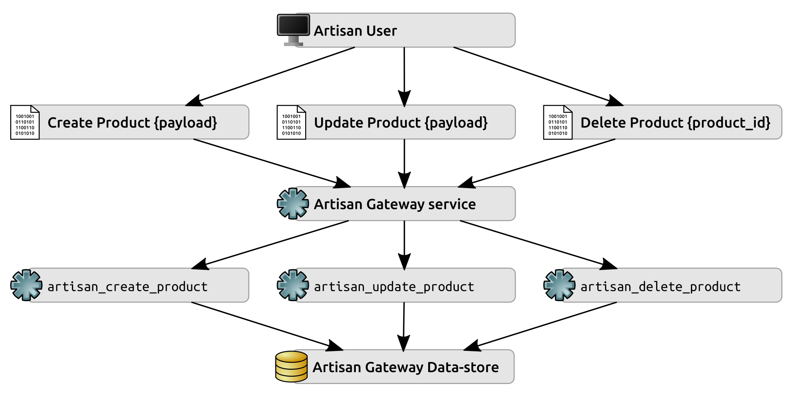
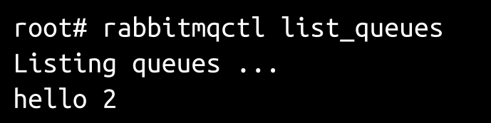
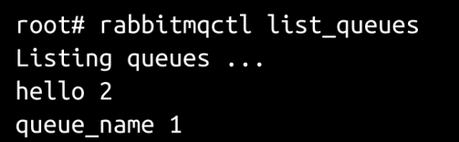
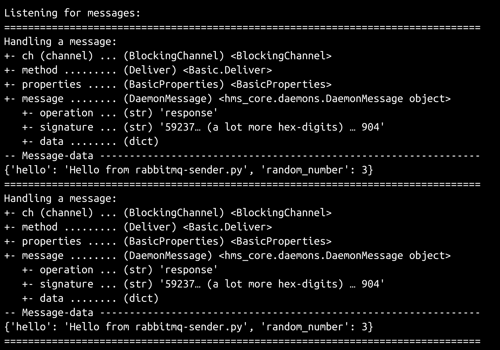
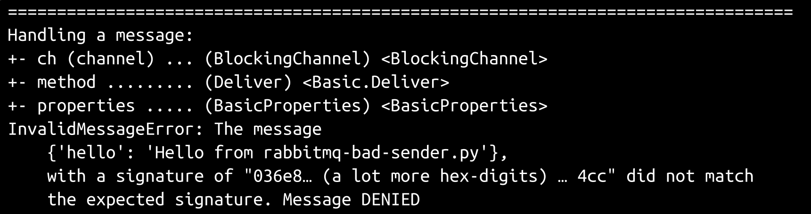
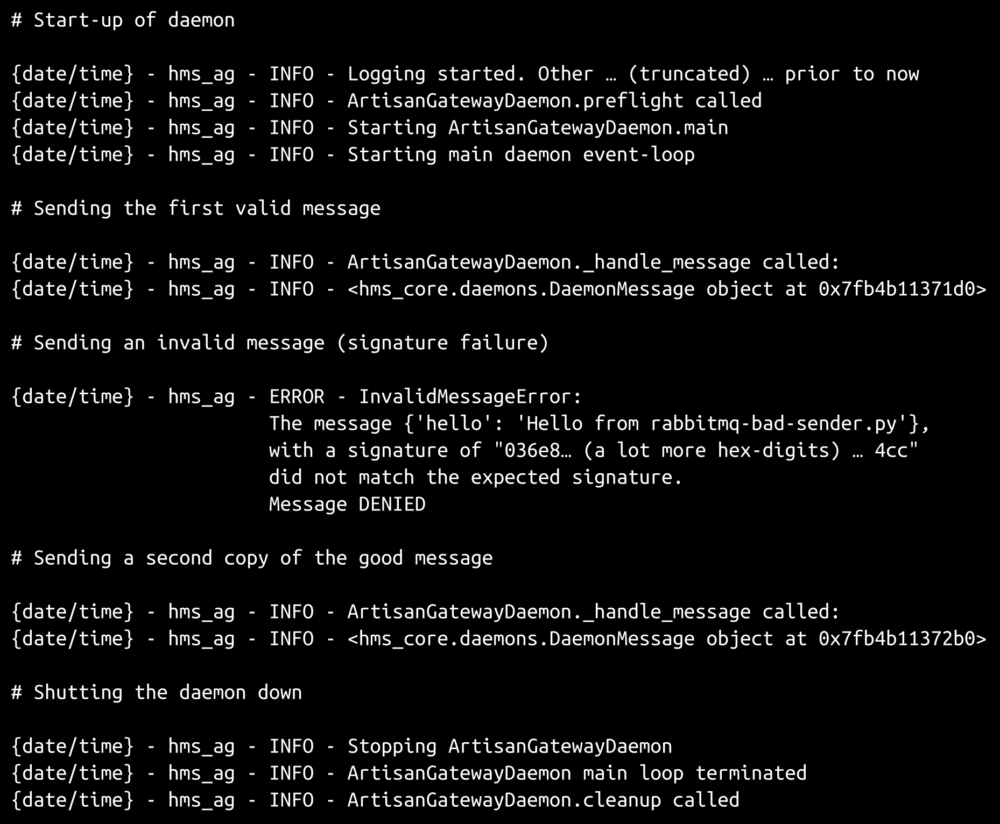
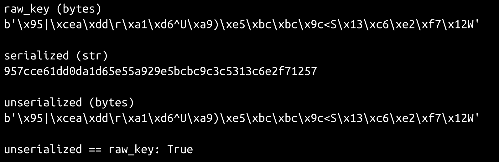
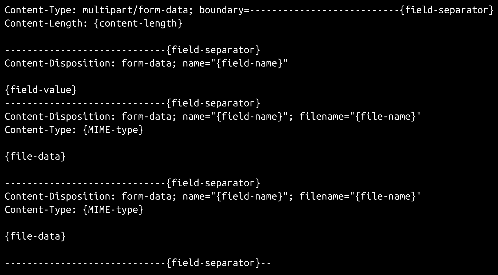

# 第十六章：工匠网关服务

为了实现最终用户和网关守护程序之间的通信，我们需要详细研究并就守护程序的几个运行方面进行一些决策-它将如何工作，数据如何发送和接收，以及如何对这些数据进行操作。在本章中，我们将对此进行详细研究，并编写代码来实现基于这些决策的过程。

本章涵盖以下主题：

+   定义来回发送的数据结构（消息）的样子，以及它需要提供的内容，包括一个签名消息实现，无论使用何种机制发送数据，都应该起作用

+   检查发送和接收数据的两个基本选项：消息队列和 Web 服务

+   消息将如何处理，独立于传输机制

+   实现基于消息队列的传输机制所需的基本结构

+   在基于 Web 服务的方法中会遇到什么变化（以及如何处理）

+   工匠网关的进出流量将是什么样子

+   将这些流量模式最小集成到现有数据对象的当前流程中

# 概述和目标

在`hms_sys`系统的背景下，工匠网关迄今为止只是宽泛地定义了它的作用-它被描述为在工匠和中央办公室之间的通信的中央联系点，特别是关于“产品”和“订单”对象的-它的作用是什么。它的工作方式和何时工作的具体细节还没有被触及，尽管至少后者可能是非常明显的，遵循一个简单的规则，即所做的更改（由谁）需要尽快传播到所有相关方。这些更改在很大程度上取决于谁在进行更改。至少，以下过程可能会出现：

+   工匠可以创建新的“产品”数据

+   工匠可以更新当前的“产品”数据

+   工匠可以直接删除“产品”

+   中央办公室工作人员可以标记“产品”为可用-这只是“产品”更新过程的一个专门变体

+   中央办公室工作人员也可以对产品进行内容更改-这也是一种更新变体-对可以更改的内容有一些限制

+   最终用户可以间接创建“订单”对象，需要以某种方式传播给工匠

+   工匠可以在履行过程中更新订单

所有这些过程都是对“产品”和/或“订单”对象的 CRUD 操作的变体，可能不需要比每个子系统中相关类的 _create 或 _update 方法提供的功能更多。它们应该涵盖实际存储数据更改的大部分，也许全部。

这些数据更改的传输，无论最终的时间或协议是什么样子，都有一些共同因素，需要处理以下步骤的特定变体：

+   本地进行数据更改（创建、更新或删除）

+   验证数据更改，以确保数据格式良好并符合数据结构要求

+   数据更改在本地存储（如果适用）

+   数据更改被序列化并传输到工匠网关服务，执行需要进行的任何操作

这些步骤并未解决冲突更改的可能性，例如工匠和中央办公室的某人在相同的数据更改时间段内对相同数据进行不同更改的可能性。处理这种可能性的策略可能甚至不是必要的，取决于正在进行的具体数据更改业务规则，但也必须进行检查。

这只留下了关于传输方法本身的决定。由于预计进行数据更改的个别用户不会在同一物理位置，我们需要某种网络传输协议 - 一种 Web 服务或基于消息队列的过程，如第十五章中讨论的那样，*服务的解剖*。如果从头开始编写 Web 服务，可能需要进行大量工作，可能需要编写处理身份验证、授权和处理特定 HTTP 方法并将它们与特定 CRUD 操作绑定到个别数据对象类型的代码。这些单独之间的复杂性足以值得查看现有的服务框架，如 Flask 或 Django，而不是编写（并且必须测试）所有相关代码。

考虑到系统只需要关注之前确定的七个操作（工匠：创建、更新或删除产品等），编写这七个函数并允许队列协议中的消息在必要时调用它们会更简单。通过为每个工匠分配一个独特的队列，并可能为每个工匠发出的每条消息签名，可以显著减轻围绕身份验证和授权的潜在问题。通过这两种方法，可以简单地通过来自与他们相关联的特定队列的消息来确定工匠的身份。再加上每条消息上的签名，只要它可以由工匠的应用程序生成并由工匠网关服务验证，而不会在消息中传输任何秘密数据，就提供了一个相当健壮的身份验证机制。在这种情况下，授权问题几乎微不足道 - 任何给定的通道，只要它可以与用户类型或甚至特定用户关联，就可以简单地允许访问（从而执行）与该用户或类型相关的操作。

在高层次上，无论选择哪种传输机制，工匠/产品操作的数据流都会如下所示：



在哪里：

+   各种消息（**创建产品**、**更新产品**和**删除产品**）及其各自的**{payload}**数据（或删除操作的**{product_id}**）由本地**工匠应用程序**创建，并传输到**工匠网关**服务

+   这些消息被读取、验证，并用于确定应调用哪个服务方法（`artisan_create_product`等）

+   相关方法处理执行期间**工匠网关数据存储**中所需的任何数据存储

类似的数据流也将存在于中央办公室用户可以对`产品`对象执行的所有操作，以及`工匠`和`订单`对象的交互，至少是这样。此外，可能还需要为更具体的中央办公室角色中更具体的数据对象操作提供相关操作。中央办公室工作人员将需要能够管理`工匠`对象，至少可能还有`订单`对象。

# 迭代故事

尽管许多这些故事的*某些*方面依赖于尚未被检查的一些 UI 实现，但每个故事都有一些非 UI 功能方面可以被有用地检查和处理。考虑到这一点，至少在最初，本次迭代相关的故事如下：

+   作为一名工匠，我需要能够将数据更改发送到工匠网关，以便这些更改可以根据需要传播和执行

+   作为中央办公室用户，我需要能够将数据更改发送到工匠网关，以便这些更改可以根据需要传播和执行

+   作为 Artisan 经理，我需要能够创建`Artisan`对象，以便我可以管理 Artisans

+   作为 Artisan 经理，我需要能够删除`Artisan`对象，以便我可以管理 Artisans

+   作为 Artisan 经理，我需要能够更新`Artisan`对象，以便我可以管理 Artisans

+   作为 Artisan，我需要能够创建“产品”对象，以便我可以管理我的产品供应

+   作为 Artisan，我需要能够删除“产品”对象，以便我可以管理我的产品供应

+   作为 Artisan，我需要能够更新“订单”对象，以便我可以指示中央办公室何时完成订单的我的部分

+   作为 Artisan，我需要能够更新“产品”对象，以便我可以管理我的产品供应

+   作为 Artisan，我需要能够更新自己的`Artisan`对象，以便我可以在 HMS 中央办公室管理我的信息

+   作为产品经理，我需要能够激活“产品”对象，以便我可以管理产品的可用性

+   作为产品经理，我需要能够停用“产品”对象，以便我可以管理产品的可用性

+   作为产品经理，我需要能够更新“产品”对象，以便我可以管理 Artisan 无法管理的产品信息

+   作为向 Artisan Gateway 服务发送消息的任何用户，我需要这些消息被签名，以便在执行之前可以验证

除了最后一项之外，这些项或多或少地按照在实际用例中需要执行的顺序进行了分组：中央办公室用户（充当 Artisan 经理）需要创建代表 Artisans 的对象，然后才能期望 Artisans 做任何事情，Artisans 必须能够创建“产品”对象，然后才能期望中央办公室用户（充当产品经理）对这些对象做任何事情。

# 消息

在认真考虑传输机制选项之前，有必要明确定义传输的消息是什么。至少，考虑到 Artisan Gateway 服务中的数据流的情况，以及典型数据对象的实际数据是什么，显然消息需要能够处理结构化数据。在内部，这可能最好由`dict`表示，因为它们易于序列化和反序列化为至少两种易于传输的不同格式：JSON 和 YAML。我们已经为可以存储状态数据的对象建立了数据字典结构。例如，从 Artisan 的角度来看，已经将数据字典渲染为 JSON 的“产品”看起来是这样的：

```py
{
    "oid": "a7393e5c-c30c-4ea4-8469-e9cd4287714f", 
    "modified": "2018-08-19 07:13:43", 
    "name": "Example Product", 
    "created": "2018-08-19 07:13:43", 
    "description": "Description  TBD", 
    "metadata":{
        "wood": "Cherry, Oak"
    }, 
    "available": false, 
    "dimensions": "2½\" x 4\" x ¾\"", 
    "shipping_weight": 0.5, 
    "summary": "Summary TBD", 
}
```

这提供了由 Artisan 发起的任何创建或更新“产品”的操作所需的所有数据，但没有指定需要对数据执行什么操作。它也没有与之关联的签名数据，我们希望提供以完成前面提到的迭代故事的最后一部分。这两个项目，操作和签名，都需要添加到消息中，但不需要添加到消息数据中，这样在接收端创建“产品”对象的实例就不必处理从传入数据结构中删除非产品数据。

在消息的上下文中，它们都是元数据：关于数据的数据，本例中描述了对真实数据的操作以及应该使用什么签名来验证消息的完整性。一个更完整的消息，旨在更新现有产品（提供描述和摘要，并使该项目可用），看起来可能是这样的（假设在更新操作期间传输了所有产品数据）：

```py
{
    "data":{
        "oid": "a7393e5c-c30c-4ea4-8469-e9cd4287714f", 
        "modified": "2018-08-19 07:41:56", 
        "name": "Example Product", 
        "created": "2018-08-19 07:13:43", 
        "description": "Cherry and oak business-card holder", 
        "metadata": {
            "wood": "Cherry, Oak"
        }, 
        "available": true, 
        "dimensions": "2½\" x 4\" x ¾\"", 
        "shipping_weight": 0.5, 
        "summary": "Cherry and oak business-card holder", 
    },
    "operation":"update",
    "signature":"{Hash hexdigest}"
}
```

作为输出目标的数据结构为我们提供了足够的信息来实现一个`DaemonMessage`类，以表示发送到或从 Artisan Gateway 服务接收的任何消息。`DaemonMessage`是一个具体的类，位于`hms_core.daemons`模块中。它以典型的类声明开始，并定义了一个类常量，稍后将用于将字符串值编码为字节值，无论是在实例方法还是类方法中：

```py
class DaemonMessage(object):
    """
Represents a *signed* message being sent to or received from a 
BaseDaemon instance.
"""
    ###################################
    # Class attributes/constants      #
    ###################################

    # - class-constant encoding-type for signature processes
    __encoding = 'utf-8'
```

`DaemonMessage`的大多数属性遵循我们迄今为止一直在使用的标准 getter、setter 和 deleter 方法/属性声明模式。其中一个属性`signature`需要在每次调用时返回一个计算出的值，并且只有一个 getter 方法定义 - `_get_signature`：

```py
    ###################################
    # Property-getter methods         #
    ###################################

# ...

    def _get_signature(self) -> str:
        if not self.data:
            raise RuntimeError(
                '%s.signature cannot be calculated because there is '
                'no data to sign' % (self.__class__.__name__)
            )
        if not self.signing_key:
            raise RuntimeError(
                '%s.signature cannot be calculated because there is '
                'no key to sign data with' % (self.__class__.__name__)
            )
        return sha512(
            bytes(
                # - We're using json.dumps to assure a consistent 
                #   key-order here...
                json.dumps(self.data, sort_keys=True), self.__encoding
            ) + self.signing_key
        ).hexdigest()
```

`_get_signature`方法在其实现中有几个值得注意的方面。首先，由于只有在有数据要签名和有签名密钥值要对数据进行签名时，签名才应该可用，因此它积极地检查这些值，如果没有设置任何一个，则引发`RuntimeError`。其次，其返回值必须确保数据结构的哈希始终对于相同的数据结构而言是相同的。Python 的`dict`数据结构不能保证在多个`dict`值之间具有相同的键序列，即使它们之间存在相同的键。

由于哈希机制需要一个`bytes`值，并且将`dict`渲染为`bytes`（使用`str()`转换作为中间转换机制）不会始终返回相同的`bytes`序列进行哈希处理，因此需要一些机制来确保实例的`data dict`始终被渲染为一致的`str`/`bytes`序列。由于用于生成签名的哈希处理的值可能以字符串形式开始，并且`json.dumps`提供了递归排序输出键的机制，这是一个快速简单的解决方案。

选择`json.dumps`是基于简单性和便利性。从长远来看，创建一个`OrderedDict`实例（来自`collections`模块），按顺序将每个元素添加到新实例中，然后对其字符串值进行哈希处理可能更好。如果没有其他选择，这将消除任何可能存在的数据结构问题，这些数据结构包含无法序列化为 JSON 的值。另一个选择是对 YAML 值进行哈希处理，因为它以更清晰的方式处理无法直接序列化的数据类型。

属性 setter 和 deleter 方法的实现都很典型，不需要太多解释，尽管与 operation 属性对应的 setter 方法（`_set_operation`）会检查传入的值是否在有限的选项集合中。

到目前为止，与我们迄今为止使用的典型属性模式相比，`DaemonMessage`的一个重要偏差是，它将大部分属性公开为可设置和可删除的。这一决定背后的理由是，当消息首次需要创建时，可能并不知道`data`、`operation`和`signing_key`的所有值，甚至在消息被其他进程发送之前可能需要对它们进行修改。允许在运行时设置或删除它们可以减轻后续使用`DaemonMessage`实例的任何此类问题。结合在运行时计算值的签名实现（并在返回之前检查所需的属性值），这样可以在以后提供我们所需的灵活性，同时仍保留这些属性的类型和值检查：

```py
    ###################################
    # Instance property definitions   #
    ###################################

    data = property(
        _get_data, _set_data, _del_data, 
        'Gets, sets, or deletes the data/content of the message'
    )
    operation = property(
        _get_operation, _set_operation, _del_operation, 
        'Gets, sets, or deletes the operation of the message'
    )
    signature = property(
        _get_signature, None, None, 
        'Gets the signature of the message'
    )
signing_key = property(
        _get_signing_key, _set_signing_key, _del_signing_key, 
        'Gets, sets, or deletes the signing_key of the message'
    )
```

因此，`DaemonMessage`的初始化不需要提供这些属性中的任何一个来构造实例，但允许提供所有属性：

```py
    ###################################
    # Object initialization           #
    ###################################

    def __init__(self, 
        operation:(str,None)=None, data:(dict,None)=None, 
        signing_key:(bytes,str,None)=None
    ):
        """
Object initialization.

self .............. (DaemonMessage instance, required) The instance to 
                    execute against
operation ......... (str, optional, defaults to None) The operation 
                    ('create', 'update', 'delete' or 'response') that 
                    the message is requesting
data .............. (dict, optional, defaults to None) The data of the 
                    message
signing_key ....... (bytes|str, optional, defaults to None) The raw 
                    data of the signing-key to be used to generate the 
                    message-signature.
"""
        # - Call parent initializers if needed
        # - Set default instance property-values using _del_... methods
        self._del_data()
        self._del_operation()
        self._del_signing_key()
        # - Set instance property-values from arguments using 
        #   _set_... methods
        if operation:
            self.operation = operation
        if data:
            self.data = data
        if signing_key:
            self.signing_key = signing_key
```

由于`DaemonMessage`类的目的是提供一种简单、一致的方式来生成序列化为 JSON 的消息，并且这需要从`dict`值进行序列化，因此我们提供了相应的方法：

```py
    def to_message_dict(self):
        return {
            'data':self.data,
            'operation':self.operation,
            'signature':self.signature,
        }

    def to_message_json(self):
        return json.dumps(self.to_message_dict())
```

同样，我们需要一种方法来从 JSON 中反序列化消息，使用中间的从字典方法。这些都是作为类方法实现的，允许创建消息实例并使用签名密钥进行验证。该功能的关键方面都驻留在`from_message_dict`类方法中：

```py
    @classmethod
    def from_message_dict(cls, 
        message_dict:(dict,), signing_key:(bytes,str)
    ):
        """
message_dict ...... (dict, required) The incoming message as a dict, 
                    that is expected to have the following structure:
                    {
                        'data':dict,
                        'operation':str, # (create|update|delete|response)
                        'signature':str # (hash hex-digest)
                    }
signing_key ....... (bytes|str, optional, defaults to None) The raw 
                    data of the signing-key to be used to generate the 
                    message-signature.
"""
```

首先对传入的参数执行典型的类型和值检查：

```py
        if type(message_dict) != dict:
            raise TypeError(
                '%s.from_message_dict expects a three-element '
                'message_dict value ({"data":dict, "signature":str, '
                '"operation":str}), but was passed "%s" (%s)' % 
                (cls.__name__, data, type(data).__name__)
            )
        if type(signing_key) not in (bytes,str):
            raise TypeError(
                '%s.from_message_dict expects a bytes or str signing_key '
                'value, but was passed "%s" (%s)' % 
                (cls.__name__, signing_key, type(signing_key).__name__)
            )
if type(signing_key) == str:
            signing_key = bytes(signing_key, cls.__encoding)
```

从传入的`message_dict`的数据和操作值以及`signing_key`参数创建一个新的`DaemonMessage`实例，确保所有数据都存在且格式良好：

```py
        _data = message_dict.get('data')
        if not _data:
            raise ValueError(
                '%s.from_message_dict expects a three-element dict '
                '({"data":dict, "signature":str, "operation":str}), '
                'but was passed "%s" (%s) which did not include a '
                '"data" key' % 
                (cls.__name__, data, type(data).__name__)
            )
        _signature = message_dict.get('signature')
        if not _signature:
            raise ValueError(
                '%s.from_message_dict expects a three-element dict '
                '({"data":dict, "signature":str, "operation":str}), '
                'but was passed "%s" (%s) which did not include a '
                '"signature" key' % 
                (cls.__name__, data, type(data).__name__)
            )
        _operation = message_dict.get('operation')
        if not _operation:
            raise ValueError(
                '%s.from_message_dict expects a three-element dict '
                '({"data":dict, "operation":str, "operation":str}), '
                'but was passed "%s" (%s) which did not include a '
                '"operation" key' % 
                (cls.__name__, data, type(data).__name__)
            )
        result = cls(_operation, _data, signing_key)
```

一旦存在新的`DaemonMessage`实例，只要其数据具有相同的键和值，并且用于生成签名的本地`signing_key`与用于在传输之前创建原始消息的`signing_key`相同，则两条消息的签名值应该是相同的。如果不是，则消息存在可疑情况。签名失败的可能原因并不多：

+   消息中的数据以某种方式损坏/更改

+   本地和远程的`signing_key`值不同

在任何情况下，都不应采取任何行动 - 要么数据本身存在可疑情况，要么无法验证消息的真实性。在任何签名失败的情况下，我们会引发一个自定义错误，`InvalidMessageError`：

```py
        if result.signature == _signature:
            return result
        raise InvalidMessageError(
            'The message %s, with a signature of "%s" did not match '
            'the expected signature. Message DENIED' % 
            (_data, result.signature)
        )
```

将 JSON 序列化消息转换为`DaemonMessage`实例的过程只是解码传入的 JSON，然后将结果`dict`数据结构输入到`from_message_dict`中，返回结果对象：

```py
    @classmethod
    def from_message_json(cls, json_in:(str,), signing_key:(bytes,str)):
        return cls.from_message_dict(json.loads(json_in), signing_key)
```

将消息序列化为 JSON 格式并不影响 Artisan Gateway 服务实际传输这些消息的选项。提到的两种选项，即 Web 服务和消息队列方法，都可以处理 JSON 消息格式 - 因此在这方面，这种消息策略非常便携。

`DaemonMessage`的签名过程严重依赖于创建和管理消息的签名密钥的想法 - 没有它们，消息无法发送或读取 - 在继续之前应该讨论一些重要的考虑因素。

与任何加密过程一样，基于哈希的签名依赖于必须创建和保护的秘密值（在本例中为`signing_key`）。在创建`signing_key`方面，有几个因素需要牢记，但最重要的两个领域如下：

+   值越长，破解的难度就越大

+   它包含的字符越多，破解的难度就越大

这些底层的数学原理相当简单：迭代 10 个值所需的时间比迭代 100 个值所需的时间少，因此任何类型的秘密值中可能的变化越多，迭代所有这些值所需的时间就越长。可能值的数量可以用数学方式表示为（每个字符的值的数量）^（字符串中的字符数量），因此一个具有 255 个可能字符的 128 字符`signature_key`将涉及 255¹²⁸个可能值，或大约 1.09 × 10³⁰⁸个组合，必须检查以保证计算出这样大小和范围的`signature_key`。每秒进行十亿次这样的计算，或者每年进行约 3.15 × 10¹⁶次计算，从技术上/数学上讲，仍然可能破解这样的`signing_key`，但假设哈希算法没有任何可以利用的重大缺陷，这在实际上是不切实际的。

创建所需长度的`signature_key`相当简单。Python 的`os`模块提供了一个名为`urandom`的函数，返回一个适用于加密使用的字符序列（作为`bytes`对象），并且可以是任意长度，因此生成一个非常长的密钥就像调用以下内容一样简单：

```py
os.urandom(1024)
```

如果需要，结果可以转换为十六进制字符串值进行存储，并使用`bytes.fromhex()`从该十六进制字符串转换回来。

```py
import os

example_key = os.urandom(1024)
print(example_key)

example_key_hex = example_key.hex()
print(example_key_hex)

example_from_hex = bytes.fromhex(example_key_hex)
print(example_from_hex == example_key)

# Yields:
# b'!\x0cW\xe5\x89\x7fan ... a LOT more gibberish-looking characters...'
# 210c57e5897f616ec9157f759617e7b4f ... a LOT more hexadecimal digits...
# True
```

保护机密值通常涉及以下某种组合：

+   确保它们在静止状态下加密，这样即使存储机密的数据存储被破坏，机密本身也不能轻易使用。

+   确保它们在传输中加密，以防止中间人利用漏洞轻松访问可用的密钥。

+   定期更改（轮换）它们，以减少捕获的机密可能在不再有用之前被破坏的可能性。

对 Artisans 的`signing_key`值的创建和管理（也许还包括与中央办公室到 Artisan 的通信），以及实施某种密钥轮换过程的可能性将在第十七章 *处理服务事务*中进行更详细的检查。

确保它们在传输中加密可能是决定如何传输消息的一个重要因素。在传输中加密将需要为 Web 服务或本地托管的消息队列实施创建加密证书。消息队列方法可能允许使用私有证书，而 Web 服务可能需要来自公共证书颁发机构的证书。

在传输任何机密信息时，始终应实施传输中的加密，而`signing_key`显然属于该类别！

静止状态下的加密感觉对于这种范围的系统可能有些过度，尽管可以使用 PyCrypto 等库在代码中实现，或者通过配置 MongoDB 引擎使用其加密存储引擎（在 MongoDB Enterprise 中可用）。这也会给系统增加比目前似乎合理的更多复杂性，包括（再次）密钥的创建和管理。

# 决定消息传输机制

随着现在传递的消息结构得到解决，现在是深入研究如何传输这些消息的选项的好时机。最终，需要就如何实施处理故事的流程做出决定：

+   作为 Artisan，我需要能够将产品和订单数据更改发送到 Artisan 网关，以便根据需要传播和采取行动。

+   作为中央办公室用户，我需要能够将 Artisan 和产品数据更改发送到 Artisan 网关，以便根据需要传播和采取行动。

在之前讨论的两个选项（基于 Web 服务或消息队列的实现）中，使用消息队列似乎更合适：

+   考虑到预期的操作数量有限，基于队列的方法将涉及较少的开发工作，可能比基于 Web 服务的实现更少复杂。

+   无需处理任何协议级别的细节（HTTP 方法，数据有效载荷结构的变化等），这些都需要在实现 Web 服务时处理。

+   无需编写完整的 HTTP 服务器（从头开始，或使用`http.server`包提供的服务器类之一），或将功能/代码与几种 Web 框架选项（例如 Flask 或 Django REST 框架）集成。

+   消息可以被发送并简单地等待在其队列中，直到它们被检索并采取行动，所以：

+   只要队列服务器可访问，所有最终用户都可以继续使用其应用程序而不会中断。

+   Artisan 网关本身随时可能被关闭（进行维护、更新，甚至移动到不同的服务器上）。

不过，这种方法也有一些注意事项/权衡：

+   包含冲突数据更改的消息，尽管它们仍将被检索和处理，但可能需要额外的手动注意来协调这些更改。在 Web 服务上下文中也可能发生同样的事情，但在消息队列中更有可能发生。

+   作为一个在网络上进行的主动过程，消息检索可能比直接读取发送到工匠网关的传入请求需要更长的时间。因此，服务吞吐量可能会受到影响，但即使完整的消息操作周期需要 10 秒，也可以允许每小时进行 360 次操作（每天超过 8,600 次操作，或者一年内超过 3,100,000 次操作），假设它们不是并行执行的。

+   如果消息队列提供程序崩溃，导致消息无法首先被传递，这可能会中断最终用户的应用程序使用。

+   必须对消息队列的分配进行一些考虑：

+   如果每个工匠都有自己的队列，进入和离开工匠网关，那么至少需要存储和管理有关这些队列的一些数据，并且必须单独检查每个工匠到网关的队列。

+   如果所有工匠共享一个到工匠网关的入站队列，那么对于每个操作，都必须实现消息的来源是哪个工匠。

+   由于消息协议中没有隐含的响应要求来指示消息是否已被执行（或者由于错误而无法执行），因此需要发送给用户的消息的任何响应都必须被主动/独立地发送。

+   作为一个工匠，我需要为自己创建一个消息队列，并将其分配给我，以便我可以将我的数据更改发送到工匠网关。

# 使用 RabbitMQ 进行消息队列实现

`hms_sys`项目将使用 RabbitMQ 作为其消息队列提供程序。RabbitMQ 得到积极维护，并且是一种零成本解决方案，同时还提供付费支持和咨询选项，这使其成为一个很好的低预算选择。此外，还有一个名为`pika`的 Python 库（使用`pip install pika`进行安装），它提供了从 RabbitMQ 服务器发送和接收消息所需的所有关键功能，而无需深入实现一个解决方案。RabbitMQ 的制造商 Pivotal Software 还提供了一个商业版本，其中包括额外的管理功能以及支持协议。

消息队列实现还有其他选项，包括来自亚马逊（SQS）、微软（Azure Service Bus）和谷歌（Cloud Pub/Sub）的基于云的解决方案，所有这些解决方案都有相应的 Python 库可供使用。可在本地安装的选项包括 Apache Kafka 和 ActiveMQ，以及 Kestrel。还有一个通用的 AMQP 库（`amqp`）可供使用，应该允许连接和与使用至少基本 AMQP 协议的任何消息队列服务进行交互。

使用`pika`向 RabbitMQ 实例发送消息相当简单。以下是一个简单的示例，使用`DaemonMessage`类生成和签署消息：

```py
#!/usr/bin/env python
# - scratch-space/rabbitmq-sender.py
# - Derived from RabbitMQ - RabbitMQ tutorial - "Hello world!"
#   https://www.rabbitmq.com/tutorials/tutorial-one-python.html

# The pika library is for communicating with RabbitMQ
import pika

# Use DaemonMessage to format our messages
from hms_core.daemons import DaemonMessage
```

由于我们正在传输`DaemonMessage`，我们需要生成签名密钥和消息数据：

```py
# Message-items
# - Signing-key
signing_key = '!:iLL>S@]BN;h%"h\'<2cPGsaKA 3vbGJ'
# - Message data (a dict)
```

```py
message_data = {
    'hello':'Hello from %s' % __file__,
    'random_number':3, # not a random number yet
}
```

然后我们创建消息：

```py
# - The actual message to be sent
message = DaemonMessage(
    'response', message_data, signing_key
)
```

接下来，我们建立与 RabbitMQ 服务器的连接：

```py
# RabbitMQ connection and related items
# - Create a connection
connection = pika.BlockingConnection(
    pika.ConnectionParameters('localhost')
)
# - Create (or at least specify) a channel
channel = connection.channel()
# - Create or specify a queue
channel.queue_declare(queue='hello')
```

然后发送消息，并关闭连接：

```py
# Send the message
channel.basic_publish(
    exchange='', routing_key='hello', 
    body=message.to_message_json()
)

# Close the connection
connection.close()
```

执行此脚本不会生成任何输出，但可以使用`rabbitmqctl`命令行工具来验证消息是否已发送：


再次运行脚本，然后使用`rabbitmqctl list_queues`工具，可以看到另一条消息已准备好在队列中等待：



RabbitMQ 需要提供一个通道（或者也许队列名称是对服务器上的消息进行组织分组的一个很好的描述），我们将考虑稍后使用特定工匠按特定 Artisans 对消息进行分隔。考虑以下队列名称声明：

```py
# - Create or specify a queue
channel.queue_declare(queue='hello')

# Send the message
channel.basic_publish(
    exchange='', routing_key='hello', 
    body=message.to_message_json()
)
```

在这里，前面的队列名称声明更改为以下内容：

```py
# - Create or specify a queue
channel.queue_declare(queue='queue_name') # Changed here

# Send the message
channel.basic_publish(
    exchange='', routing_key='queue_name',  # Changed here also
    body=message.to_message_json()
)
```

当我们使用`rabbitmqctl list_queues`审查队列和消息计数时，我们看到出现了一个新队列（`queue_name`），其中有一条消息：



从队列中读取消息要复杂一些，但并不显著。一个示例脚本，用于读取先前运行的`rabbitmq-sender.py`脚本发送到我们队列的消息，开始方式基本相同：

```py
#!/usr/bin/env python
# - scratch-space/rabbitmq-receiver.py
# - Derived from RabbitMQ - RabbitMQ tutorial - "Hello world!"
#   https://www.rabbitmq.com/tutorials/tutorial-one-python.html

import pika

from pprint import pprint
from hms_core.daemons import DaemonMessage
```

我们需要使用相同的签名密钥值，否则将无法读取检索到的消息：

```py
signing_key = '!:iLL>S@]BN;h%"h\'<2cPGsaKA 3vbGJ'
```

通过提供一个回调函数来处理消息处理，该回调函数接受从队列中获取消息的过程返回的所有消息属性：

```py
# - Define a message-handler function
def message_handler(ch, method, properties, body):
    print('Handling a message:')
    # - Some print-output removed to keep the listing here shorter
```

重要的是，我们将消息处理功能封装在`try`...`except`块中，这样如果在消息处理过程中出现问题，它不会终止我们稍后设置的主要消息轮询循环。在这种情况下，至少可能会引发一个错误：我们之前定义的`InvalidMessageError`错误 - 如果由于无效签名而无法创建`DaemonMessage`，则会引发该错误：

```py
    try:
        message = DaemonMessage.from_message_json(
            body.decode(), signing_key
        )
        print(
            '+- message ........ (%s) %r' % 
            (type(message).__name__, message)
        )
        print(
            '   +- operation ... (%s) %r' % 
            (type(message.operation).__name__, message.operation)
        )
        print(
            '   +- signature ... (%s) %r' % 
            (type(message.signature).__name__, message.signature)
        )
        print(
            '   +- data ........ (%s)' % 
            (type(message.data).__name__)
        )
        print('-- Message-data '.ljust(80,'-'))
        pprint(message.data)
        print('='*80)
    except Exception as error:
        print('%s: %s' % (error.__class__.__name__, error))
```

创建连接的过程，以及将通道或队列名称与其关联的过程是相同的：

```py
# Create a connection
connection = pika.BlockingConnection(
    pika.ConnectionParameters('localhost')
)
# - Create (or at least specify) a channel
channel = connection.channel()
# - Create or specify a queue
channel.queue_declare(queue='hello')
```

在这种情况下，我们正在消费消息，而不是发送消息，所以我们需要设置好：

```py
# - Set up a consumer
channel.basic_consume(
    message_handler, queue='hello', no_ack=True
)
```

最后，我们可以开始监听消息：

```py
# - Listen for messages
print('Listening for messages:')
print('='*80)
channel.start_consuming()
```

在执行时，此脚本设置自己的事件循环，监听指定的队列/通道上的消息。这大致相当于`BaseDaemon.main`要求派生守护程序类的事件循环，尽管实际的守护程序实现可能不使用它。一旦运行此脚本，它就会读取并输出先前由第一个脚本发送的两条消息的内容：



这也使我们能够验证具有相同内容并使用相同签名密钥的两条消息的签名是相同的。鉴于发送两条消息之间的消息数据和签名密钥输入没有更改，这是预期的行为。

想象一下我们更改了签名密钥：

```py
#!/usr/bin/env python
# - scratch-space/rabbitmq-bad-sender.py
# - Derived from RabbitMQ - RabbitMQ tutorial - "Hello world!"
#   https://www.rabbitmq.com/tutorials/tutorial-one-python.html

# ... Interim script-code removed for brevity

# Message-items
# - Signing-key
signing_key = 'Invalid signing key'

# ...
```

然后重新运行相同的脚本；我们从消息监听器中得到不同的结果：



这作为额外的验证，消息签名过程将按预期工作：不允许创建具有无效签名的消息，因此不会被执行。

该消息处理功能，经过一些小的更改，可以作为 Artisan Gateway 的主类的`main`循环的基础：

```py
class ArtisanGatewayDaemon(BaseDaemon):
    """
Provides the main ArtisanGateway daemon/service.
"""
```

我们仍然需要一个消息处理功能，但现在它被定义为服务类的一个方法：

```py
    def _handle_message(self, message:(dict,)) -> None:
        self.info(
            '%s._handle_message called:' % self.__class__.__name__
        )
        self.info(str(message))
```

`ArtisanGatewayDaemon`类的`main`循环可以作为接收器脚本的原始功能的简单重新转换开始：

```py
    def main(self):
        """
The main event-loop (or whatever is equivalent) for the service instance.
"""
```

最初，为了建立所需的功能是可行的，我们将使用之前建立的相同的`signing_key`，`connection`和`channel`值。最终，这些将取决于配置值 - 指定签名密钥，或者至少在哪里或如何获取它 - 并且取决于最终实现是否沿着拥有单独的工匠队列的路径，可能会有几个队列名称/通道，或者只有一个。目前，只有在先前脚本中使用的一个允许我们建立基本的队列读取功能：

```py
        signing_key = '!:iLL>S@]BN;h%"h\'<2cPGsaKA 3vbGJ'
        connection = pika.BlockingConnection(
            pika.ConnectionParameters('localhost')
        )
        channel = connection.channel()
        channel.queue_declare(queue='hello')
```

`main` 执行的循环的基本结构类似于第十五章中 `testdaemon` 的主循环的结构，只要类的内部 `_running` 标志为 `True`，循环就会继续，执行队列检查和处理传入的消息。一旦循环终止，无论是通过类的 `stop` 方法还是通过在 `BaseDaemon.__init__` 的执行期间由 `ArtisanGatewayDaemon.__init__` 注册的信号之一，控制都会退出，并在完全终止之前调用类的 `cleanup` 方法。

主要的区别，正如预期的那样，是在每次循环迭代中实际发生的事情。在这种情况下，`channel` 被轮询以获取下一个可用消息，如果检测到一个消息，它将被读取，转换为 `DaemonMessage`，然后被确认，并交给之前定义的消息处理方法。它需要相同类型的 `connection` 和 `channel`：

```py
    # - To start with, we're just going to use the same 
    #   parameters for our pika connection and channel as 
    #   were used in the rabbitmq-sender.py script.
    connection = pika.BlockingConnection(
        pika.ConnectionParameters(
            self.connection_params['host'],
            self.connection_params.get('port'),
            self.connection_params.get('path'),
        )
    )
    # - Create (or at least specify) a channel
    channel = connection.channel()
    # - Create or specify a queue
    channel.queue_declare(queue=self.queue_name)
```

一旦这些都建立好了，`main` 循环就非常简单：

```py
    # - Normal BaseDaemon main-loop start-up:
    self._running = True
    self.info('Starting main daemon event-loop')
    # - Rather than use a channel-consumer (see the example in 
    #   rabbitmq-reciever.py), we're going to actively poll for 
    #   messages *ourselves*, in order to capture just the 
    #   message-body - that's what we really care about in 
    #   this case...
    while self._running:
        try:
            # - Retrieve the next message from the queue, if 
            #   there is one, and handle it...
            method_frame, header, body = channel.basic_get(self.queue_name)
            if method_frame:
                # - Any actual message, valid or not, will 
                #   generate a method_frame
                self.debug('received message:')
                message = DaemonMessage.from_message_json(
                    body.decode(), self.signing_key
                )
                self.debug('+- %s' % message.data)
                # - If we've received the message and processed 
                #   it, acknowledge it on basic principle
                channel.basic_ack(method_frame.delivery_tag)
                self._handle_message(message)
        except InvalidMessageError as error:
            # - If message-generation fails (bad signature), 
            #   we still need to send an acknowledgement in order 
            #   to clear the message from the queue
            err = '%s: %s' % (error.__class__.__name__, error)
            self.error(err)
            channel.basic_ack(method_frame.delivery_tag)
        except Exception as error:
            # Otherwise, we just log the error and move on
            err = '%s: %s' % (error.__class__.__name__, error)
            self.error(err)
            for line in traceback.format_exc().split('\n'):
                self.error(line)
    self.info('%s main loop terminated' % (self.__class__.__name__))
```

为了测试这一点，快速创建了一个基本的配置文件，主要用于记录信息，并创建了一个具有该配置的新类的实例，并启动了它。从启动到关闭的日志输出，包括发送一个好消息，一个坏消息，然后又一个好消息，显示一切都按预期运行：



这个守护程序实例的快速基本配置非常简单：

```py
# Logging configuration
# scratch-space/hms_ag_conf.yaml
logging:
  format: "%(asctime)s - %(name)s - %(levelname)s - %(message)s"
  name: hms_ag
  console:
    level: info
  file:
    level: info
    logfile: "/tmp/hms_ag.log"
```

队列参数也应该驻留在配置文件中，并由守护程序实例获取。附加的配置值最终看起来像这样：

```py
queue:
  type: rabbit
  connection:
    host: localhost
    port: 5672
    path: /
  queue_name: "central-office"
signing_key: "0T*)B{Y#.C3yY8J>;1#<b\\q^:.@ZQjg2 tG~3(MJab_"
```

加载这些值的过程涉及添加一些实例属性，这些属性大多遵循到目前为止使用的正常模式：

+   `connection_params`：一个字典值，其值从配置文件的连接部分中检索，用于创建 RabbitMQ 连接

+   `queue_name`：一个字符串，它是实例将要监听的队列名称/通道

+   `signing_key`：一个 `bytes` 或 `str` 值，它是实例将用于创建发送到其队列上或从其队列上接收的 `DaemonMessage` 实例的签名密钥

实际获取和存储这些值只需要在类的 `_on_configuration_loaded` 方法中添加。最初，它所做的只是调用 `BaseDaemon` 父类的相同方法，以建立日志功能，这一点保持不变：

```py
    def _on_configuration_loaded(self, **config_data):
        # - Call the BaseDaemon function directly to set up logging, 
        #   since that's provided entirely there...
        BaseDaemon._on_configuration_loaded(self, **config_data)
```

接下来检索特定于队列的项目。尽管目前没有预期会需要其他队列系统，但我们不能排除将来可能需要的可能性，因此代码从允许将来允许这种可能性的假设开始：

```py
        queue_config = config_data.get('queue')
        if queue_config:
            try:
                if queue_config['type'] == 'rabbit':
                    self._connection_params = queue_config['connection']
                    self.info(
                        'Connection-parameters: %s' % 
                        self.connection_params
                        )
                    self._queue_name = queue_config['queue_name']
                    self.info(
                        'Main queue-name: %s' % self.queue_name
                        )
                # If other queue-types are eventually to be supported, 
                # their configuration-load processes can happen here, 
                # following this pattern:
                # elif queue_config['type'] == 'name':
                #    # Configuration set-up for this queue-type...
                else:
                    raise RuntimeError(
                        '%s could not be configured because the '
                        'configuration supplied did not specify a '
                        'valid queue-type (%s)' % 
                        (self.__class__.__name__, queue_config['type'])
                    )
            except Exception as error:
                raise RuntimeError(
                    '%s could not be configured because of an '
                    'error -- %s: %s' % 
                    (
                        self.__class__.__name__, 
                        error.__class__.__name__, error
                    )
                )
        else:
            raise RuntimeError(
                '%s could not be configured because the configuration '
                'supplied did not supply message-queue configuration' % 
                (self.__class__.__name__)
            )
```

签名密钥也在配置文件中，因此接下来是获取和存储它：

```py
        # - The signing-key is also in configuration, so get it too
        try:
            self._signing_key = config_data['signing_key']
        except Exception as error:
            raise RuntimeError(
                '%s could not be configured because of an error '
                'retrieving the required signing_key value -- %s: %s' % 
                (
                    self.__class__.__name__, 
                    error.__class__.__name__, error
                )
            )
```

至少目前为止，这样做就足以处理掉主要部分中使用的硬编码值，同时保持类的功能。对原始消息发送脚本的变体（在本章代码的 `scratch-space/rabbitmq-sender-daemon-queue.py` 中）的执行显示，守护程序仍然按预期运行，监听并对有效消息进行操作。

# 处理消息

为了实际处理消息的数据，我们需要定义一个格式良好的命令消息实际上是什么样子，实现可以执行允许的命令的方法，并实现知道如何调用这些方法的功能，给定一个格式良好且经过验证的消息来执行。列表中的第一项非常简单，但可能有许多不同的有效实现模式。考虑到，此时，我们可以通过`DaemonMessage`传输四种不同的操作动作：`'create'`、`'update'`、`'delete'`和`'response'`。这些操作动作直接对应于标准的 CRUD 操作，除了`'response'`值，即使那个值，也可能大致相当于`read`操作。对于任何给定的数据对象类型，这些操作分别需要执行相同的过程：

1.  创建相关类的新实例，并使用`from_data_dict`类方法（或者可能是一个新的等效类方法）填充来自消息的状态数据，并`save`新实例

1.  使用`get`类方法检索相关类的现有实例，使用消息中的新值更新该实例的任何状态数据（这可能会受益于创建一个新方法，例如`update_from_message`），并`save`该实例

1.  使用`delete`类方法查找并删除消息数据指定的实例

1.  使用`get`类方法检索消息数据指定的实例的数据字典表示，并使用`to_data_dict`方法生成找到实例的数据结构的消息

守护程序需要有多达 16 个`{action}_{object}`方法，每种操作/对象组合都需要一个，以确保所有组合都被考虑到。对于每种对象类型（工匠、顾客、订单和产品），方法集看起来会像这样（方法名称不言自明）：

+   `create_artisan`

+   `update_artisan`

+   `delete_artisan`

+   `response_artisan`

尚未考虑的一个关键数据，需要确定在接收命令消息时执行哪些方法，就是对象类型。`DaemonMessage`类没有特定的属性用于对象类型，因为最初的想法是这样做可能会不必要地限制将来对同时具有`operation`和对象类型的消息的使用。修改`DaemonMessage`以允许对象类型的指定并不困难。这只需要添加一个可选属性，允许`__init__`方法中的另一个可选参数，并在调用它的任何其他方法中考虑它。然而，采取这些措施似乎是不必要的：结构化数据的消息本身可以很容易地包含必要的数据。例如，考虑一个看起来像这样的“创建工匠”消息：

```py
{
    "data":{
        "target":"artisan",
        "properties":{
            "address":"1234 Main Street, etc.",
            "company_name":"Wirewerks",
            "contact_email":"jsmith@wirewerks.com",
            "contact_name":"John Smith",
            "website":"http://wirewerks.com",
        }
    },
    "operation":"create",
    "signature":"A long hex-string"
}
```

如果任何命令消息具有操作并且在其数据中指示对象类型（`target`值）以及要在操作中使用的属性作为标准结构，那将同样有效。类似的数据结构也适用于更新操作：

```py
{
    "data":{
        "target":"artisan",
        "properties":{
            "address":"5432 West North Dr, etc.",
            "modified":"2019-06-27 16:42:13",
            "oid":"287db9e0-2fcc-4ff1-bd59-ff97a07f7989",
        }
    },
    "operation":"update",
    "signature":"A long hex-string"
}
```

对于删除操作：

```py
{
    "data":{
        "target":"artisan",
        "properties":{
            "oid":"287db9e0-2fcc-4ff1-bd59-ff97a07f7989",
        }
    },
    "operation":"delete",
    "signature":"A long hex-string"
}
```

以及响应操作：

```py
{
    "data":{
        "target":"artisan",
        "properties":{
            "oid":"287db9e0-2fcc-4ff1-bd59-ff97a07f7989",
        }
    },
    "operation":"response",
    "signature":"A long hex-string"
}
```

根据消息的操作和`data.target`值确定调用哪个方法只是一长串`if…elif…else`决策：

```py
def _handle_message(self, message:(dict,)) -> None:
    self.info(
        '%s._handle_message called:' % self.__class__.__name__
    )
```

因为我们以后需要目标（用于决策）和属性（作为方法的参数传递），所以首先获取它们：

```py
    target = message.data.get('target')
    properties = message.data.get('properties')
```

每种`operation`和`target`的组合看起来都非常相似。从`create`操作开始：

```py
    if message.operation == 'create':
```

如果目标是已知的、允许的类型之一，那么我们可以直接调用适当的方法：

```py
        if target == 'artisan':
            self.create_artisan(properties)
        elif target == 'customer':
            self.create_customer(properties)
        elif target == 'order':
            self.create_order(properties)
        elif target == 'product':
            self.create_product(properties)
```

如果`target`是未知的，我们希望抛出一个错误：

```py
        else:
            raise RuntimeError(
                '%s error: "%s" (%s) is not a recognized '
                'object-type/target' % 
                (
                    self.__class__.__name__, target, 
                    type(target).__name__
                )
            )
```

其他操作也基本相同 - 例如`update`操作：

```py
    elif message.operation == 'update':
        if target == 'artisan':
            self.update_artisan(properties)
        elif target == 'customer':
            self.update_customer(properties)
        elif target == 'order':
            self.update_order(properties)
        elif target == 'product':
            self.update_product(properties)
        else:
            raise RuntimeError(
                '%s error: "%s" (%s) is not a recognized '
                'object-type/target' % 
                (
                    self.__class__.__name__, target, 
                    type(target).__name__
                )
            )
```

`delete`和`response`操作相似到足以没有必要在这里重复，但它们在代码中是存在的。最后，我们还捕获操作未被识别的情况，并在这些情况下引发错误：

```py
    else:
        raise RuntimeError(
            '%s error: "%s" (%s) is not a recognized '
            'operation' % 
            (
                self.__class__.__name__, operation, 
                type(operation).__name__
            )
        )
```

由于数据对象设计/结构和传入消息的结构，实际操作方法相对简单。例如，创建`Artisan`：

```py
def create_artisan(self, properties:(dict,)) -> None:
    self.info('%s.create_artisan called' % self.__class__.__name__)
    self.debug(str(properties))
    # - Create the new object...
    new_object = Artisan.from_data_dict(properties)
    #   ...and save it.
    new_object.save()
```

更新`Artisan`：

```py
def update_artisan(self, properties:(dict,)) -> None:
    self.info('%s.update_artisan called' % self.__class__.__name__)
    self.debug(str(properties))
    # - Retrieve the existing object, and get its data-dict 
    #   representation
    existing_object = Artisan.get(properties['oid'])
    data_dict = existing_object.to_data_dict()
    # - Update the data-dict with the values from properties
    data_dict.update(properties)
    # - Make sure it's flagged as dirty, so that save will 
    #   *update* instead of *create* the instance-record, 
    #   for data-stores where that applies
    data_dict['is_dirty'] = True
    # - Create a new instance of the class with the revised 
    #   data-dict...
    new_object = Artisan.from_data_dict(data_dict)
    #   ...and save it.
    new_object.save()
```

删除`Artisan`：

```py
def delete_artisan(self, properties:(dict,)) -> None:
    self.info('%s.delete_artisan called' % self.__class__.__name__)
    self.debug(str(properties))
    # - Delete the instance-record for the specified object
    Artisan.delete(properties['oid'])
```

`Artisan`响应：

```py
def response_artisan(self, properties:(dict,)) -> dict:
    self.info('%s.response_artisan called' % self.__class__.__name__)
    self.debug(str(properties))
    # - Since get allows both oids and criteria, separate those 
    #   out first:
    oid = properties.get('oid')
    criteria = {
        item[0]:item[1] for item in properties.items()
        if item[0] != 'oid'
    }
    return Artisan.get(oid, **criteria)
```

# 队列和相关的 Artisan 属性

由于工匠将通过特定队列与网关通信，并且这些队列必须被识别并与它们各自的工匠保持一致关联，我们需要在各种代码库中有机制来存储队列标识，并将它们与其工匠所有者关联。

队列规范本身可以通过向`Artisan`对象的类添加一个属性（`queue_id`）来简单实现。由于网关服务和 Artisan 应用中的 Artisan 对象都将使用`queue_id`，因此在`hms_core.business_objects.BaseArtisan`类中实现这一点是有意义的，在那里它将被继承到需要的所有地方。属性的获取器和删除器方法是典型的实现，`property`声明也是如此，尽管它遵循只读属性模式。设置器方法也是非常典型的：

```py
def _set_queue_id(self, value:(str)) -> None:
    if type(value) != str:
        raise TypeError(
            '%s.queue expects a single-line printable ASCII '
            'string-value, but was passed "%s" (%s)' % 
            (
                self.__class__.__name__, value, 
                type(value).__name__
            )
        )
    badchars = [
        c for c in value 
        if ord(c)<32 or ord(c) > 127 
        or c in '\n\t\r'
    ]
    if len(badchars) != 0:
        raise ValueError(
            '%s.queue expects a single-line printable ASCII '
            'string-value, but was passed "%s" that contained '
            'invalid characters: %s' % 
            (
                self.__class__.__name__, value, 
                str(tuple(badchars))
            )
        )
    self._queue_id = value
```

工匠还需要跟踪每个工匠独有的签名密钥属性，但存在于消息传输过程的 Artisan 应用端和 Artisan 网关端的本地`Artisan`对象中。签名密钥作为`bytes`值，可能不容易以其原生值类型存储：`bytes`值在本地 Artisan 数据存储中已经实现，可能对其他地方使用的 MongoDB 存储也有问题，因为`bytes`值不是本地 JSON 可序列化的。

幸运的是，`bytes`类型提供了实例和类方法，用于将值序列化和反序列化为十六进制字符串值。序列化字节值只需调用值的`hex()`方法，从十六进制字符串创建字节值则通过调用`bytes.fromhex(hex_string)`来实现。使用`hex()`/`fromhex()`完整序列化/反序列化字节值的简单示例显示了该值按需保留：

```py
import os

raw_key=os.urandom(24)
print('raw_key (%s)' % type(raw_key).__name__)
print(raw_key)
print()

serialized = raw_key.hex()
print('serialized (%s)' % type(serialized).__name__)
print(serialized)
print()

unserialized = bytes.fromhex(serialized)
print('unserialized (%s)' % type(unserialized).__name__)
print(unserialized)
print()

print('unserialized == raw_key: %s' % (unserialized == raw_key))
```

此代码的输出将如下所示：



Artisan 类的相应属性（`signing_key`）也遵循典型的只读属性结构，并且除了其设置器方法外，没有什么不同。设置器方法必须允许原始`bytes`值和`bytes`值的十六进制字符串表示，并*存储*`bytes`值：

```py
def _set_signing_key(self, value:(bytes,str)):
    if type(value) not in (bytes,str):
        raise TypeError(
            '%s.signing_key expects a bytes-value of no less '
            'than 64 bytes in length, or a hexadecimal string-'
            'representation of one, but wa passed "%s" (%s)' % 
            (self.__class__.__name__, value, type(value).__name__)
        )
```

如果传递了一个字符串，它会尝试使用`bytes.fromhex()`进行转换：

```py
    if type(value) == str:
        try:
            value = bytes.fromhex(value)
        except:
            raise ValueError(
                '%s.signing_key expects a bytes-value of no '
                'less than 64 bytes in length, or a hexadecimal '
                'string-representation of one, but wa passed '
                '"%s" (%s), which could not be converted from '
                'hexadecimal into bytes' % 
                (
                    self.__class__.__name__, value, 
                    type(value).__name__)
                )
            )
```

它还强制签名密钥的最小长度，任意设置为`64`字节（512 位）：

```py
    if len(value) < 64:
        raise ValueError(
            '%s.signing_key expects a bytes-value of no less '
            'than 64 bytes in length, or a hexadecimal string-'
            'representation of one, but wa passed "%s" (%s), '
            'which was only %d bytes in length after conversion' % 
            (
                self.__class__.__name__, value, 
                type(value).__name__, len(value)
            )
        )
    self._signing_key = value
```

对应的最终`Artisan`对象必须在它们的`to_data_dict`方法和`__init__`方法中考虑这些新属性。`to_data_dict`的更改看起来是一样的 - 以`hms_core.co_objects.Artisan`为例，并显示添加到返回的 dict 结果的新属性，它们最终看起来像这样：

```py
def to_data_dict(self) -> (dict,):
    return {
        # - BaseArtisan-derived items
        'address':self.address.to_dict() if self.address else None,
        'company_name':self.company_name,
        'contact_email':self.contact_email,
        'contact_name':self.contact_name,
        'website':self.website, 
        # - BaseDataObject-derived items
        'created':datetime.strftime(
            self.created, self.__class__._data_time_string
        ),
        'is_active':self.is_active,
        'is_deleted':self.is_deleted,
        'modified':datetime.strftime(
            self.modified, self.__class__._data_time_string
        ),
        'oid':str(self.oid),
        # Queue- and signing-key values
        'queue_id':self.queue_id,
        'signing_key':self.signing_key.hex(),
    }
```

`__init__`方法的更改有所不同：因为新的`queue_id`和`signing_key`属性是在`BaseArtisan.__init__`执行时分配的，所以该方法必须实际调用删除器和设置器方法：

```py
def __init__(self, 
    contact_name:str, contact_email:str, 
    address:Address, company_name:str=None, 
    queue_id:(str,None)=None, signing_key:(bytes,str,None)=None, 
    website:(str,None)=None
    *products
    ):
    """Doc-string omitted for brevity"""
    # - Call parent initializers if needed
    # ... omitted for brevity
    # - Set instance property-values from arguments using 
    #   _set_... methods
    self._set_contact_name(contact_name)
    self._set_contact_email(contact_email)
    self._set_address(address)
    # New queue_id and signing_key properties
    self._set_queue_id(queue_id)
    self._set_signing_key(signing_key)
    if company_name:
        self._set_company_name(company_name)
    if website:
        self._set_website(website)
```

由于`queue_id`和`signing_key`在技术上是必需的属性，如果时间允许，将它们移动到`__init__`签名的必需参数部分，位于`address`和`company_name`之间，将是正确的做法。在这种情况下，更多的是空间限制而不是时间，因此它们被添加到签名中的一个易于处理的位置，而不是不得不审查、修改和重新显示代码中已经存在的各种`BaseArtisan.__init__`调用。但是，它们仍将作为必需属性工作，因为 setter 方法不会接受默认的`None`值，并且它们被调用而不使用`company_name`和`website`使用的检查。

`co_objects.Artisan`和`artisan_objects.Artisan`的`__init__`方法只需要更新以包括它们签名中的新参数，并将这些参数传递给它们的`BaseArtisan.__init__`调用。对`co_objects.Artisan.__init__`的修订如下：

```py
def __init__(self,
    contact_name:str, contact_email:str, 
    address:Address, company_name:str=None, 
# New queue_id and signing_key arguments
    queue_id:(str,None)=None, 
    signing_key:(bytes,str,None)=None, 
    website:(str,None)=None
    # - Arguments from HMSMongoDataObject
    oid:(UUID,str,None)=None, 
    created:(datetime,str,float,int,None)=None, 
    modified:(datetime,str,float,int,None)=None,
    is_active:(bool,int,None)=None, 
    is_deleted:(bool,int,None)=None,
    is_dirty:(bool,int,None)=None, 
    is_new:(bool,int,None)=None,
    *products
):
    """Doc-string omitted for brevity"""
    # - Call parent initializers if needed
    BaseArtisan.__init__(self, 
        contact_name, contact_email, address, company_name, 
# New queue_id and signing_key arguments
        queue_id, signing_key, 
        website
    )
    # ... other initialization omitted for brevity
    # - Perform any other initialization needed
```

# 基于 Web 服务的守护程序的要求

如果我们要改为使用基于 Web 服务的实现来实现 Artisan 网关，有一些共同因素和一些必须克服的障碍。可以说，最重要的障碍将是实现完整的`HTTP`方法 - `POST`，`GET`，`PUT`和`DELETE` - 官方和符合标准的方法，对应于我们期望使用的`Create`，`Read`，`Update`和`Delete` CRUD 操作的方法。

如果命令传输的介质仍然是`DaemonMessage`类的序列化和带签名的消息输出，我们需要能够以至少两种不同的方式传递完整的签名消息：

+   以`GET`和`DELETE`操作的查询字符串格式：GET 并不打算支持`POST`和`PUT`方法允许的相同类型的有效负载功能，尽管似乎没有任何官方立场表明`DELETE`是否应该支持它，但最安全的做法可能是假设它不会，并相应地编写代码。

+   在 POST 和 PUT 操作的两种不同有效负载格式中。到目前为止，我们还没有详细讨论任何产品数据；即使没有要求支持产品图像的传输，也只是时间问题。`HTTP POST`和`PUT`操作允许在请求体中发送有效负载，并允许以两种不同格式（编码）发送有效负载在标准 Web 表单请求上下文中：

+   作为一个键值字符串列表，看起来非常像`GET`请求中的等效内容

+   作为更详细的编码，请求中的每个字段都具有与键值列表相同的名称和数据，但还允许字段指定它们包含特定的数据类型 - 例如，文件，以及其他数据，例如文件名

后一种编码在允许文件上传的 Web 页面中看到，作为相关`<form>`标记中的`enctype="multipart/form-data"`属性。提交这样的表单，包括有效负载中的两个文件，将生成一个类似于以下内容的`HTTP`请求：



在这个例子中：

+   `{field-separator}`是一个随机字符串，唯一标识每个字段数据集的开始

+   `{content-length}`是有效负载的总大小

+   `{field-name}`是其数据包含在该部分中的字段的名称

+   `{field-value}`是不是文件上传字段的字段中的文本数据

+   `{file-name}`是正在上传的文件的名称，就像它在客户端机器上存在的那样

+   `{MIME-type}`是正在传输的文件类型的指示器，例如`image/png`

+   `{file-data}`是与字段对应的文件的数据

为了支持仅具有这三个数据块的有效负载，我们必须找到或创建能够可靠解析出每个数据部分并处理每个被吐出的数据块的代码。虽然至少有一个这样的库，`requests-toolbelt`，但在某些核心 Python 版本（3.3.0 和 3.3.1）中已知存在问题，因此它可能是一个可行的选择，具体取决于所使用的 Python 版本。从头开始编写（和测试）处理`multipart/form-data`有效负载的代码将是一个耗时的过程。

假设所有这些都已经处理，虽然编写能够捕获和处理传入请求的网络监听器并不困难，但这也可能需要相当长的时间，特别是在测试方面，只是为了能够可靠（并可证明地）处理传入请求。在 Web 服务场景中，几乎肯定最好的选择是从已经处理所有这些需求和要求的成熟的 Web 应用程序包中开始，并编写代码，简单地将传入请求映射到处理程序方法，就像消息队列实现所做的那样。好的一面是，签名消息应该可以在这种情况下使用，并且底层操作方法可能不需要进行任何重大修改。

# 与服务之间的流量

服务的通信链的消息接收方面已经就位，在`ArtisanGateway`的`main`方法中，但除了围绕消息生成的一些部分之外，还没有实现消息发送功能。每种数据对象类型在修改、创建或删除时都需要向其对应的子系统发送相关的命令消息。例如，如果 Artisan 创建了一个新的产品，创建该`Product`对象的行为需要向 Gateway 服务发送一个“创建产品”消息。同样，如果中央办公室工作人员对产品进行了更改，Gateway 服务需要向适当的 Artisan 应用程序实例发送一个“更新产品”消息。

在这些场景的 Artisan 应用程序方面，发送任何消息所需的所有队列参数将是恒定的。它们将始终将消息发送到相同的队列服务器，使用相同的端口，使用相同的连接和通道。与其在初始化期间将所有消息队列设置传递给各种数据对象，这可能会显着复杂化它们，并且如果以后需要不同的消息传输机制，会使代码难以处理，不如创建另一个包含所有这些设置并提供向队列服务器发送任意消息的方法的类：`RabbitMQSender`。在定义该类的过程中，我们还可以利用 Python 类/实例关系的某些方面，使得创建发送方实例变得更加容易：

+   定义了类属性的 Python 类的实例也具有相同名称和值的实例属性。也就是说，如果`RabbitMQSender`有一个名为`_host`的类属性，值为 localhost，那么创建的所有`RabbitMQSender`实例都将具有相同的 localhost 值的`_host`属性。

+   更改实例属性的值不会影响类属性的值。

+   更改类属性的值也会更改相应的实例值，前提是它们没有在这些实例中被明确设置。因此，如果创建了`RabbitMQSender`的一个实例，然后更改了`RabbitMQSender._host`，那么实例的`_host`值将相应更新。

综合考虑，并在应用设计时谨慎，这些允许定义`RabbitMQSender`，以便*类*可以配置，允许使用类的可用实例仅需最基本的调用，如`my_sender = RabbitMQSender()`。

如果以后需要不同的消息传输机制，引入`RabbitMQSender`将从`BaseMessageSender`派生的抽象层可能是一个好主意 - 或许需要该消息发送方法和所有相关的传输机制属性。这将为所有传输机制提供一个公共接口，并且如果/当需要时，更容易地在它们之间切换。

因此，`RabbitMQSender`从典型的类定义开始，其中各种连接属性和其他消息传输常量被定义为受保护的类属性：

```py
class RabbitMQSender(object):
    """
Provides baseline functionality, interface requirements, and 
type-identity for objects that can send messages to a RabbitMQ 
message-queue that shares configuration across all derived 
classes
"""
    ###################################
    # Class attributes/constants      #
    ###################################

    # - Common RabbitMQ parameters
    _host = None
    _port = None
    _queue_name = None
    _virtual_host = None
```

与之对应的属性只有 getter 方法，因此它们不能轻易/意外地被更改：

```py
    def _get_host(self):
        return self._host

    def _get_port(self):
        return self._port

    def _get_queue_name(self):
        return self._queue_name

    def _get_virtual_host(self):
        return self._virtual_host
```

它们与典型的只读属性结构中的属性名称相关联：

```py
    host = property(
        _get_host, None, None, 
        'Gets the host (FQDN or IP-address) of the RabbitMQ '
        'server that derived objects will send messages to'
    )
    port = property(
        _get_port, None, None, 
        'Gets the TCP/IP port on the RabbitMQ server that '
        'derived objects will send messages to'
    )
    queue_name = property(
        _get_queue_name, None, None, 
        'Gets the name of the queue on the RabbitMQ server that '
        'derived objects will send messages to'
    )
    virtual_host = property(
        _get_virtual_host, None, None, 
        'Gets the "virtual_host" on the RabbitMQ server that '
        'derived objects will send messages to'
    )
```

`connection`和`channel`属性遵循典型的延迟实例化模式，当第一次请求它们时创建，并且也作为只读属性公开：

```py
    def _get_channel(self):
        try:
            return self._channel
        except AttributeError:
            # - Create (or at least specify) a channel
            self._channel = self.connection.channel()
            # - Create or specify a queue
            self._channel.queue_declare(queue=self._queue_name)
            return self._channel

    def _get_connection(self):
        try:
            return self._connection
        except AttributeError:
            self._connection = pika.BlockingConnection(
                # Parameters 
                pika.ConnectionParameters(
                    host=self._host,
                    port=self.port,
                    virtual_host=self.virtual_host
                )
            )
            return self._connection
# ...

    channel = property(
        _get_channel, None, None, 
        'Gets the channel that the instance will send messages to'
    )
```

```py
    connection = property(
        _get_connection, None, None, 
        'Gets the connection that the instance will send messages '
        'with/through'
    )
```

不需要属性设置器或删除器方法，也不需要类的`__init__`功能。实例的所有属性将有效地引用类属性值，可以通过单个类方法调用进行设置：

```py
    @classmethod
    def configure(cls, 
        queue_name:(str), host:(str,), port:(int,None)=None, 
        virtual_host:(str,None)=None
    ):
        cls._queue_name = queue_name
        cls._host = host
        if port:
            cls._port = port
        if virtual_host:
            cls._virtual_host = virtual_host
```

在 Artisan 应用程序的上下文中，预配置所有`RabbitMQSender`实例所需的一切就是使用适当的设置调用`RabbitMQSender.configure`，可能来自 Artisan 应用程序实例的配置文件：

```py
RabbitMQSender.configure(
    queue_name = configuration['queue_name'],
    host = configuration['host'],
    port = configuration.get('port'),
    virtual_host = configuration.get('virtual_host'),
)
```

最后，发送消息的过程由一个单一方法提供：

```py
    def send_message(self, message:(DaemonMessage)):
        """
Sends the supplied message to the RabbitMG server common to 
all RabbitMQSender objects

self .............. (RabbitMQSender instance, required) The 
                    instance to execute against
message ........... (DaemonMessage, required) The message to send.
"""
        # - Note that exchange is blank -- we're just using the 
        #   default exchange at this point...
        self.channel.basic_publish(
            exchange='', routing_key=self.queue_name, 
            body=message.to_message_json()
        )
```

在消息传输过程的 Artisan 应用程序端，创建`RabbitMQSender`实例并调用其`send_message`方法应该处理我们需要的实际消息传输。在 Artisan Gateway 端，当向 Artisan 应用程序实例发送消息时，该过程将类似 - 在某些方面简化，可能不需要`RabbitMQSender`（或等效）类，或者可能需要类似的变体以更好地处理多个传出队列。我们将集成 Artisan 端的流程，并在第十七章中更详细地研究网关的需求，*处理服务事务*。

# 测试和部署的影响

在迭代的这一点上，除了对各种属性和方法进行标准单元测试之外，这些属性和方法并未涉及任何消息传输，从测试的角度来看，没有太多可以做的。我们还没有将消息传递与数据更改集成在一起，我们将在第十七章中进行研究，*处理服务事务*，而且在任何方向上，没有完整的发送和接收过程可用，即使从手动测试的角度来看，也没有太多可以做的，这已经被探索过了。

现在为 Artisan Gateway 守护程序制定任何部署细节似乎为时过早，出于类似的原因，尽管在这一点上，似乎一个非常基本的`setup.py/Makefile`安排可能会处理我们需要的一切。

# 总结

尽管我们现在已经拥有了完成迭代所需的所有基础，但只有三个故事甚至有可能关闭：

+   作为一个工匠，我需要能够将数据更改发送到 Artisan Gateway，以便根据需要传播和采取行动

+   作为中央办公室用户，我需要能够将数据更改发送到 Artisan Gateway，以便根据需要传播和采取行动

+   作为向 Artisan Gateway 服务发送消息的任何用户，我需要这些消息被签名，以便在执行之前可以验证。

然而，这些基础包括一个功能齐全（尚未经过测试）的 Artisan Gateway 守护程序/服务，一种生成可以被该服务和远程应用程序执行的命令消息的机制，以及实际传输这些命令消息的基本流程。在这些成就之间，很有可能我们已经完成了这三个故事，但在它们经过测试之前，我们无法证明它们可以被执行。

为了证明闭环的必要测试，以及尚未实施的故事的平衡，都依赖于在 Artisan 和中央办公室应用程序的数据对象级别集成各种 CRUD 操作，并通过必要的消息传播这些数据更改到 Artisan Gateway，以及（如果需要）从网关到远程 Artisan 和中央办公室应用程序的传播，这将在下一章中讨论。
