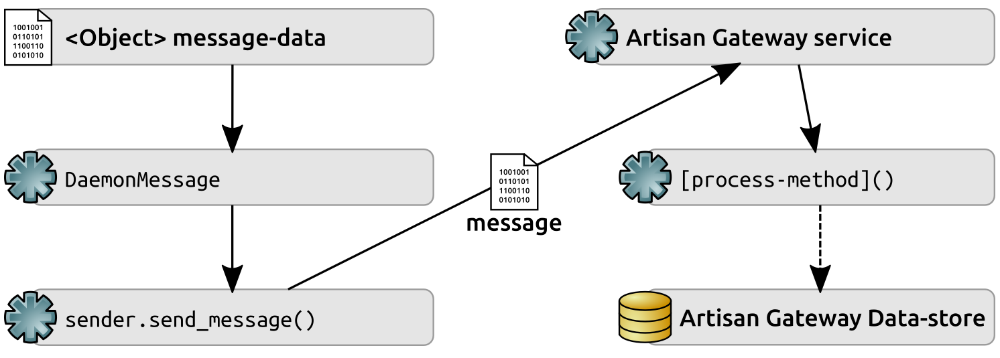
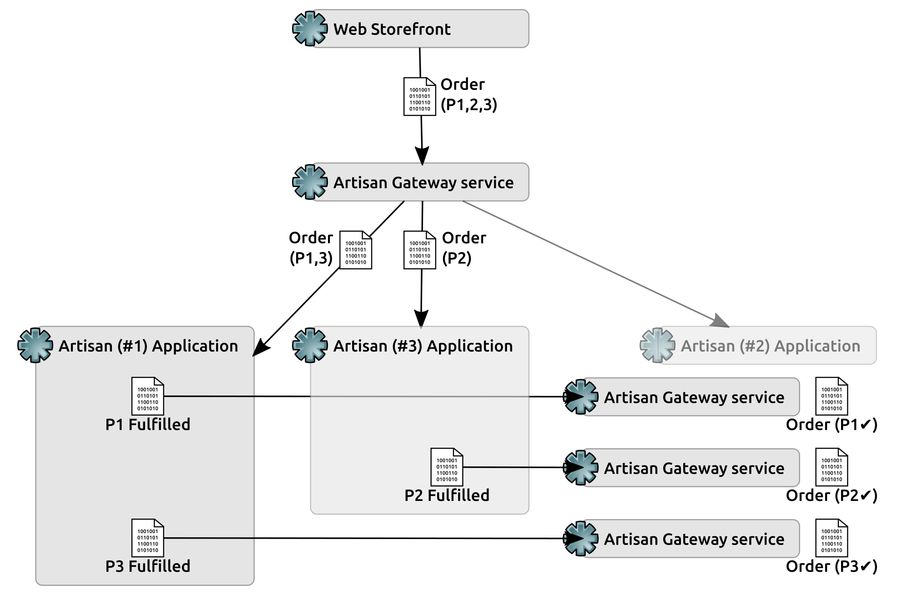
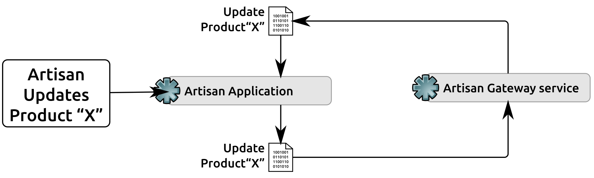

# 第十七章：处理服务交易

系统组件之间以及它们各自管理的数据对象之间存在大量的交互潜力。虽然我们已经解决了一些确定数据更改或命令消息传输的机制，但我们还没有开始探索这些交互的具体细节。简而言之，我们仍然需要解决所有本地 CRUD 操作的数据流（因此，消息传输）是什么样子的问题。

在本章中，我们将涵盖以下主题：

+   工匠创建产品

+   工匠和中央办公室工作人员对产品的激活和停用

+   由工匠和中央办公室工作人员对产品数据进行更改

+   由工匠删除产品

+   由中央办公室工作人员创建工匠

+   由工匠和中央办公室工作人员对工匠数据进行更改

+   由中央办公室工作人员删除工匠

+   Web 商店创建订单，并将该信息传达给工匠以便履行

+   从 Web 商店取消订单，并将该信息传达给工匠

+   工匠履行订单项目

# 剩余的故事

自从我们在第十六章中的工匠网关服务，只（暂时）关闭了三个故事，还有几个（十一个）需要解决。采用的`RabbitMQSender`和 RabbitMQ 消息传输策略的实施也引发了关于如何传播一些这些过程所需的工件的问题，特别是签名密钥，还有一个待定的决定，即工匠网关是否会使用一个消息队列来处理工匠的入站流量，还是每个工匠一个消息队列，这可能会增加另一个故事：

+   作为工匠，我需要创建一个消息队列并分配给我，以便我可以将我的数据更改发送到工匠网关

大部分尚未完成的故事都代表了一个数据流程，一个与系统上下文中特定用户执行的特定操作相关联的数据交易。每个流程又是 CRUD 操作的某种变体，通常是根据相关消息的指示创建、更新或删除一个或多个数据对象。在审查系统中每个用户角色可用的各种业务对象上进行各种 CRUD 操作的可能性时，出现了五个新故事：

+   作为工匠，我需要能够停用“产品”对象，以便我可以管理“产品”的可用性（这可能由一般的更新操作处理）

+   作为工匠，我需要在下订单时被通知，其中包括我的产品供应之一，以便我可以履行订单的部分（最终，由中央办公室一侧的某些活动触发的工匠驻地“订单”对象的创建）

+   作为客户，我需要将我的订单的相关部分传达给适当的工匠，以便他们可以履行我的订单的部分（前一个故事的另一半，但可能会增加一些功能需求）

+   作为取消订单的客户，我需要将取消订单的相关部分传达给适当的工匠，以便他们不会履行订单的部分（基本上是删除工匠驻地的“订单”对象，但在工匠应用程序方面通知）

+   作为工匠，我需要在订单被取消时被通知，其中包括我的产品供应之一，以便我可以停止与之相关的任何进行中的履行活动，并根据需要更新我的“产品”状态（再次是前一个故事的另一半）

所有这些交易都遵循相似的模式：

+   需要发送的**对象**的相关**消息数据**用于创建一个**消息**（使用`DaemonMessage`）。

+   该**消息**由发送方（`RabbitMQSender`的一个实例）发送到**工匠网关服务**。

+   服务读取消息，并调用适当的 `[process-method]`，这可能会与**工匠网关数据存储**进行交互。

+   `[process-method]` 本身可能需要发送其他消息，要么返回给**工匠网关服务**本身进行进一步的本地处理，要么通过服务返回给工匠。发送后续消息的过程将非常相似，但可能会有额外的变化——新消息的目的地：



主要的变化点在于**消息数据**本身，这些变化应该由业务规则来塑造，规则规定了用户角色对这些对象可以做什么。

# 一点重组

在深入研究各个事务的细节之前，最近的代码需要进行一些微小的重组。`RabbitMQSender`和`DaemonMessage`类最初是在`hms_core.daemons`模块中编写的，因为那似乎是一个合乎逻辑的地方来保存它们——它们仍然与守护进程相关，但也与工匠应用程序的某些部分（也许是中央办公室应用程序）相关，这些部分与各种守护进程类本身没有任何联系。由于我们还发现了各种对象需要能够生成消息数据结构的需求，并且感觉这应该由不同的抽象来处理，因此将这两个类移动到一个新的`hms_core`模块（`hms_core.messaging`）中，并在那里添加新的抽象是合乎逻辑的——这样，所有与消息相关的类都在一个地方。将自定义异常`InvalidMessageError`移动到新模块中也感觉像是一个明智的步骤，因为它也严格与消息相关。

这些代码移动需要对工匠网关服务的主模块进行一些微不足道的更改，例如从这里更改原始导入：

```py
from hms_core.daemons import BaseDaemon, DaemonMessage, \ 
    InvalidMessageError 
from hms_core.daemons import BaseDaemon
```

到以下位置：

```py
from hms_core.daemons import BaseDaemon
from hms_core.messaging import DaemonMessage, InvalidMessageError
```

类似的变化在任何已生成的测试脚本中也是必要的，以便它们仍然有用。

这种代码重组可能是不可避免的，至少从长期来看：只是一个时间问题，总会有一些东西在原来的位置感觉不对，需要移动到更好的位置。一般来说，越早发现这种重组的需求，越好，因为如果要交互的代码越少，就越不容易出现问题或干扰。另外，可能不用说，但在继续之前重新运行可能已创建的任何测试代码总是一个好主意，以确保在继续之前没有明显的错误。在这种情况下，守护进程的最终测试脚本（`scratch-space/daemon-artisan-tests.py`）显示出一些小问题，这些问题必须解决——不是因为代码移动，而是因为在关闭 第十六章 *工匠网关服务*的代码之前没有重新运行。不过，问题在变成真正的错误之前就被发现了。

# 对象事务的准备

前面的代码重组为我们提供了一个坚实而合乎逻辑的地方，可以创建我们之前提到的新**抽象基类**（**ABC**）。这个新 ABC 的目标是要求派生类能够提供一个准备好的消息数据结构，可以作为`DaemonMessage`的数据参数传递给其`__init__`方法，从而简化为任何需要消息的对象创建消息的过程，并允许该过程的代码存在于各个数据对象类本身的一部分。与迄今为止在代码中演变的命名约定保持一致，这可能最好写成一个名为`to_message_data`的实例方法。另一个考虑的选项是`to_message_dict`，但该方法名称已经存在于其他地方，并且与`DaemonMessage`参数的关系不那么密切。

`to_message_data`方法可以完全抽象，抽象方法本身没有提供具体实现——与迄今为止在`hms_sys`代码库中定义的许多抽象方法不同，实际上没有任何通用功能可以回退。

就是这样，真的。新的 ABC 不需要任何其他想法。它只是定义了一个新方法的要求。它甚至不需要一个`__init__`方法，因为没有需要作为实例属性值传递的东西（尽管它仍然会继承所有类最终派生自的对象类的`__init__`方法）。因此，它的整个定义如下：

```py
class HasMessageData(metaclass=abc.ABCMeta):
    """
Provides interface requirements, and type-identity for objects that 
are expected to provide a to_message_data method.
"""

    ###################################
    # Abstract methods                #
    ###################################

    @abc.abstractmethod
    def to_message_data(self) -> (dict,):
        """
Creates and returns a dictionary representation of the instance 
that is safe to be passed to a DaemonMessage instance during or 
after creation as the data of that message.

self .............. (HasMessageData instance, required) The 
                    instance to execute against
"""
        raise NotImplementedError(
            '%s.to_message_data has not been implemented as '
            'required by HasMessageData' % 
            (self.__class__.__name__)
        )
```

一个没有具体功能定义的 ABC 与其他面向对象语言提供的形式接口声明几乎一样接近 Python 代码。它仍然只是一个抽象基类，就像迄今为止为项目构建的其他 ABC 一样，但它所做的只是生成派生类在实例化之前必须实现的一组功能要求。在这种情况下，当我们将`HasMessageData`应用于已在`hms_core.co_objects`和`hms_artisan.artisan_objects`命名空间中定义的各种数据对象类（`Artisan`和`Product`类以及`hms_artisan`命名空间中的`Order`），这立即建立了这些类必须实现`to_message_data`的要求，而不关心它们如何实现。

在`hms_sys`中，由于具体的`Artisan`、`Order`和`Product`类都是从`hms_core`中定义的 ABC 派生的，我们实际上可以将`HasMessageData`附加到这些 ABC 上，而不是具体类。最终结果将是一样的——具体类将被要求实现`to_message_data`——并且工作量会（非常轻微地）减少。权衡的是，任何将来从`BaseArtisan`、`BaseOrder`或`BaseProduct`派生的类也将被要求实现`to_message_data`，即使没有必要。虽然这并不感觉可怕，但它确实对未来的开发施加了一些功能要求，这可能是不合理的。目前，由于我们知道当前的具体类应该派生自`HasMessageData`，我们将直接从中派生它们——如果将来需要更改，将要求深入继承树的工作量更小。

`to_message_data`的具体实现在代码中提供了一个逻辑挂钩，用于实施关于每个对象允许在消息中发送什么的业务规则限制。也就是说，工匠和中央办公室用户都不被允许更改或设置所有对象的所有状态数据——它们各自控制特定属性。即使用户类型拥有对象类型（工匠和产品），也有其他用户拥有的属性（例如产品和`store_available`）。由于`to_message_data`将用于实际生成消息数据，而这些数据将用于在每个消息事务的接收端进行更改，因此通过将其生成的数据结构限制为用户类型可以创建或更改的值，可以防止每个用户对对象数据进行非法更改。当我们逐步处理每个用户/对象/操作组合的具体交易时，我们将深入研究这一点。

# 产品对象交易

由于产品数据交易的一组具有最多个体交易（七个），我们将从这些交易开始，希望它们能更早地暴露出设计中的任何差距。每个交易都与原始迭代故事之一相关联，并且与交易过程相关的特定故事将被调用。用户/对象组合的`to_message_data`的特定实现将在该组合的第一个交易中定义，并在后续交易细节中根据需要进行细化。还将解决该特定组合的任何其他特定需求。

由于对任何对象的各种操作都需要对对象进行标识，因此在所有`to_message_data`输出中，对象被传输的`oid`属性是唯一的常量。它在每个操作中都起着重要作用。

+   在创建新对象时，必须在消息中提供`oid`，以便我们不会在不同的应用程序安装或环境中得到不同的唯一标识符。这已经通过继承自`BaseDataObject`的`oid`值的生成来处理，如果不存在，则创建`oid`。

+   在更新现有对象时，必须提供`oid`，以便检索和更改原始对象。

+   在删除现有对象时，同样需要提供相同的标识 - 必须提供`oid`以标识正在被删除的对象。

+   尽管我们目前还没有响应消息的用例（在标准 CRUD 操作结构中更或多等同于读取），但它也需要一个`oid`值，以便识别应该被获取和返回的对象。

# 工匠 - 创建产品

工匠需要创建产品的相关故事，来自先前的列表。

+   作为工匠，我需要能够创建`Product`对象，以便管理我的`Product`产品

工匠用户拥有`Product`对象的大部分数据点。实际上，他们真正不应该能够创建或更改的唯一属性是`store_available`标志，该标志控制给定产品是否在中央办公室运行的 Web 商店上可用。因此，`hms_artisan.artisan_objects.Product`的`to_message_data`输出看起来非常像它的`to_data_dict`方法：

```py
def to_message_data(self) -> (dict,):
    """
Creates and returns a dictionary representation of the instance 
that is safe to be passed to a DaemonMessage instance during or 
after creation as the data of that message.
"""
    return {
        'oid':str(self.oid),
        # - Properties from BaseProduct:
        'available':self.available,
        'description':self.description,
        'dimensions':self.dimensions,
        'metadata':self.metadata,
        'name':self.name,
        'shipping_weight':self.shipping_weight,
        'summary':self.summary,
        # - Date/time values, since we may well want/need to 
        #   keep those in sync across environments
        'created':datetime.strftime(
            self.created, self.__class__._data_time_string
        ),
        'modified':datetime.strftime(
            self.modified, self.__class__._data_time_string
        ),
    }
```

`created`和`modified`值包含在此数据结构中，基于这样的假设，它们也应该在工匠和中央办公室的数据存储中保持同步 - 这可能会使 UI 逻辑更容易地检测到在显示实例数据之前需要注意的任何更改，尽管这几乎肯定需要一些标准化的共同时间 - 在所有应用程序和服务实例中都是一致的。

给定一个新的`Product`对象（`new_product`）和工匠的签名密钥（`signing_key`），将`new_product`传输到工匠网关服务变得非常简单：

```py
new_product_message = DaemonMessage(
    'create', new_product.to_message_data(), signing_key
)
# - Assumes that RabbitMQSender has already been configured...
#   it would be slightly more involved if this were the first time 
#   it was used...
sender = RabbitMQSender()
sender.send_message(new_product_message)
```

接受这些消息并实际创建新`Product`的工匠网关方法是`ArtisanGatewayDaemon.create_product`。由于这是一个服务中的方法，特别是因为它对数据进行更改（在这种情况下创建新数据），因此它的过程几乎与其本身一样多地记录了大部分日志，尽管其中大部分是调试日志，并且只有在服务配置为以该级别记录事件时才会记录：

```py
def create_product(self, properties:(dict,)) -> None:
    self.info('%s.create_product called' % self.__class__.__name__)
    if type(properties) != dict:
        raise TypeError(
            '%s.create_product expects a dict of Product '
            'properties, but was passed "%s" (%s)' % 
            (
                self.__class__.__name__, properties, 
                type(properties).__name__
            )
        )
    self.debug('properties ... %s:' % (type(properties)))
    self.debug(str(properties))
    # - Create the new object...
    new_object = Product.from_data_dict(properties)
    self.debug('New object created successfully')
    #   ...and save it.
    new_object.save()
    self.info(
        'New Product %s created successfully' % new_object.oid
    )
```

在这一点上，各种网关方法并不确定传入消息是否被授权进行方法所做的更改。我们将在以后进行检查。

# 中央办公室 - 批准/列出产品

中央办公室工作人员能够激活产品的相关故事，来自先前的故事集合是：

+   作为产品经理，我需要能够激活“产品”对象，以便我可以管理“产品”的可用性

中央办公室拥有产品的`store_available`标志，因此他们的`to_message_dict`版本，位于`hms_code.co_objects.Product`中，至少最初，要简单得多：

```py
def to_message_data(self) -> (dict,):
    """
Creates and returns a dictionary representation of the instance 
that is safe to be passed to a DaemonMessage instance during or 
after creation as the data of that message.
"""
    return {
        'oid':str(self.oid),
        # - Properties from BaseProduct:
        'store_available':self.store_available,
        # - Date/time values, since we may well want/need to 
        #   keep those in sync across environments
        'modified':datetime.strftime(
            self.modified, self.__class__._data_time_string
        ),
    }
```

相关的消息传输，使用`product_to_activate``Product`对象和中央办公室的`signing_key`一样简单，就像我们之前看过的新产品传输一样：

```py
product_message = DaemonMessage(
    'update', product_to_activate.to_message_data(), signing_key
)
sender = RabbitMQSender()
sender.send_message(product_message)
```

相同的消息结构和传输过程也将解决中央办公室需要能够停用产品的问题，这是最初的迭代故事之一：

+   作为产品经理，我需要能够停用“产品”对象，以便我可以管理“产品”的可用性

接受这些消息并更新相关`Product`的 Artisan Gateway 方法是`ArtisanGatewayDaemon.update_product`。与`create_product`一样，它在执行过程中记录得相当详细：

```py
def update_product(self, properties:(dict,)) -> None:
    self.info('%s.update_product called' % self.__class__.__name__)
    if type(properties) != dict:
        raise TypeError(
            '%s.update_product expects a dict of Product '
            'properties, but was passed "%s" (%s)' % 
            (
                self.__class__.__name__, properties, 
                type(properties).__name__
            )
        )
    self.debug('properties ... %s:' % (type(properties)))
    self.debug(str(properties))
    # - Retrieve the existing object, and get its data-dict 
    #   representation
    existing_object = Product.get(properties['oid'])
    self.debug(
        'Product %s retrieved successfully' % existing_object.oid
    )
    data_dict = existing_object.to_data_dict()
    # - Update the data-dict with the values from properties
    data_dict.update(properties)
    # - Make sure it's flagged as dirty, so that save will 
    #   *update* instead of *create* the instance-record, 
    #   for data-stores where that applies
    data_dict['is_dirty'] = True
    # - Create a new instance of the class with the revised 
    #   data-dict...
    new_object = Product.from_data_dict(data_dict)
    #   ...and save it.
    new_object.save()
    self.info('Product %s updated successfully' % new_object.oid)
```

# 中央办公室 - 修改产品数据

中央办公室需要更改产品数据的相关故事，如前面的列表所示：

+   作为产品经理，我需要能够更新“产品”对象，以便我可以管理工匠无法管理的“产品”信息

可以合理地假设中央办公室希望能够对特定产品属性进行更改，而无需通过工匠发送它们 - 对产品内容进行简单的拼写更正或类似的更改，这些更改会传递到他们的 Web 商店。由于没有明确定义哪些属性会涉及，让我们假设这些属性包括产品的“名称”、“描述”和“摘要”。在这种情况下，为`hms_code.co_objects.Product`创建的`to_message_data`需要更改以包括这些值：

```py
def to_message_data(self) -> (dict,):
    """
Creates and returns a dictionary representation of the instance 
that is safe to be passed to a DaemonMessage instance during or 
after creation as the data of that message.
"""
    return {
        'oid':str(self.oid),
        # - Properties from BaseProduct:
        'description':self.description,
        'name':self.name,
        'store_available':self.store_available,
        'summary':self.summary,
        # - Date/time values, since we may well want/need to 
        #   keep those in sync across environments
        'modified':datetime.strftime(
            self.modified, self.__class__._data_time_string
        ),
    }
```

此实施引入了一个可能不希望的副作用：中央办公室用户执行的任何更新操作都可以一次更新所有这些属性。如果不希望出现这种行为，则可以追求一些选项：

+   可以向`ArtisanGatewayDaemon`添加其他方法来处理更具体的操作，例如`set_product_availability`，它只会更改`store_available`标志值。这可能需要以下操作：

+   向`DaemonMessage`添加相应的允许“操作”

+   检查起源于工匠的消息，以便他们不会意外或故意执行不应被允许的商店可用性更改

+   出站消息数据的过滤，以删除其中不适用于特定操作的任何元素，可以作为消息生成的一部分实施：

+   可以向具体的`Product`类添加辅助方法来执行该过滤

+   UI 可以负责确定应发送何种类型的消息，并且可以执行该过滤

目前，允许任何更新操作跨多个逻辑操作进行更新似乎没有任何实际伤害，因此现在可以放任不管。

目前，中央办公室角色的修改可以通过与批准/上市操作使用的相同消息构造、传输和处理过程来处理 - 这只是数据更新的另一种变体。

# 工匠 - 更新产品数据

工匠需要更新产品数据的相关故事，如前面的列表所示：

+   作为工匠，我需要能够更新“产品”对象，以便我可以管理我的“产品”提供

工匠更新和创建交易之间唯一的真正区别是与传出消息相关联的“操作” - 我们已经在工匠`Product`对象的`to_message_data`结果中包含了`modified`属性：

```py
product_message = DaemonMessage(
    'update', product_to_update.to_message_data(), signing_key
)
sender = RabbitMQSender()
sender.send_message(product_message)
```

从工匠发起的数据更改在流程上与从中央办公室用户发起的数据更改相同-他们可以使用相同的`ArtisanGatewayDaemon.update_product`方法来实际执行这些更改-因此不需要新代码。

由于工匠还控制产品可用性标志（available），因此在工匠级别也适用于中央办公室产品批准清单中指出的相同考虑因素。这包括两个原始迭代故事集中没有的故事，但应为完整起见包括：

+   作为一名工匠，我需要能够激活`Product`对象，以便我可以管理`Product`的可用性

+   作为一名工匠，我需要能够停用`Product`对象，以便我可以管理`Product`的可用性

这些也可以通过相同的现有数据更新过程来处理，只要没有要求将激活/停用更改与数据结构的其他更改隔离开来。即使出现这样的要求，也可以在事务的消息发起端处理它们，将消息的内容限制为仅`active`标志和标识要激活或停用的产品的`oid`。

# 工匠-删除产品

Artisan 需要删除产品的相关故事，如前所述，是：

+   作为一名工匠，我需要能够删除`Product`对象，以便我可以管理我的`Product`产品

如前所述，删除操作实际上只需要被删除项目的`oid`才能成功执行。任何其他信息都将是浪费带宽，尽管如果这不是一个问题，删除的代码实际上只是在消息中再次发送`operation`：

```py
product_message = DaemonMessage(
    'delete', product_to_delete.to_message_data(), signing_key
)
sender = RabbitMQSender()
sender.send_message(product_message)
```

执行更紧密的消息并不困难-最终，它不需要更多的东西，只需要更直接地控制消息数据，将其限制为仅相关的对象 ID。一种方法是直接创建消息数据，如下所示：

```py
message_data = {
    'oid':str(product_to_delete.oid)
}
product_message = DaemonMessage('delete',message_data, signing_key)
sender = RabbitMQSender()
sender.send_message(product_message)
```

Artisan 网关（`delete_product`）中的相应删除方法比创建或更新相同原因的过程要简单得多：实际上只需要被删除数据的`oid`：

```py
def delete_product(self, properties:(dict,)) -> None:
    self.info('%s.delete_product called' % self.__class__.__name__)
    self.debug(str(properties))
    # - Delete the instance-record for the specified object
    Product.delete(properties['oid'])
    self.debug(
        'Product %s deleted successfully' % properties['oid']
    )
```

# Artisan 对象交易

发送`Artisan`对象消息的过程不会与先前显示的`Product`对象的示例有显著偏差。 `create`和`update`消息的创建和传输通常会遵循以下类似结构：

```py
# - Typical create-object message-creation and -transmission
create_message = DaemonMessage(
    'create', object_to_create.to_message_data(), signing_key
)
sender = RabbitMQSender()
sender.send_message(create_message)

# - Typical update-object message-creation and -transmission
update_message = DaemonMessage(
    'update', object_to_update.to_message_data(), signing_key
)
sender = RabbitMQSender()
sender.send_message(update_message)
```

删除消息，取决于关于发送完整对象数据集还是只发送所需的`oid`值的决定，通常会遵循以下两种结构之一：

```py
# - Transmit the full object-data-set as the delete-message
delete_message = DaemonMessage(
    'delete', object_to_delete.to_message_data(), signing_key
)
sender = RabbitMQSender()
sender.send_message(delete_message)

# - Transmit *only* the required oid as the delete-message:
message_data = {
    'oid':str(product_to_delete.oid)
}
delete_message = DaemonMessage('delete', message_data, signing_key)
sender = RabbitMQSender()
sender.send_message(delete_message)
```

与`Product`对象一样，`Artisan`对象在 Artisan Gateway 服务中的 CRUD 操作方法从技术上讲并不复杂。实际上，除了正在处理的对象的具体细节以及与执行这些操作所涉及的各种方法相关的命令消息的特定预期结构之外，它们与其`Product`对象对应物是相同的。例如，Artisan Gateway 服务的`update_artisan`方法如下所示：

```py
def update_artisan(self, properties:(dict,)) -> None:
    self.info('%s.update_artisan called' % self.__class__.__name__)
    if type(properties) != dict:
        raise TypeError(
            '%s.update_artisan expects a dict of Artisan '
            'properties, but was passed "%s" (%s)' % 
            (
                self.__class__.__name__, properties, 
                type(properties).__name__
            )
        )
    self.debug('properties ... %s:' % (type(properties)))
    self.debug(str(properties))
    # - Retrieve the existing object, and get its data-dict 
    #   representation
    existing_object = Artisan.get(properties['oid'])
    self.debug(
        'Artisan %s retrieved successfully' % existing_object.oid
    )
    data_dict = existing_object.to_data_dict()
    # - Update the data-dict with the values from properties
    data_dict.update(properties)
    # - Make sure it's flagged as dirty, so that save will 
    #   *update* instead of *create* the instance-record, 
    #   for data-stores where that applies
    data_dict['is_dirty'] = True
    # - Create a new instance of the class with the revised 
    #   data-dict...
    new_object = Artisan.from_data_dict(data_dict)
    #   ...and save it.
    new_object.save()
    self.info('Artisan %s updated successfully' % new_object.oid)
```

总的来说，各种`Artisan`操作都遵循与`Product`操作建立的/为其建立的相同模式。

# 中央办公室-创建工匠

中央办公室工作人员能够创建工匠的相关故事，如前面的故事集是：

+   作为一名工匠经理，我需要能够创建`Artisan`对象，以便我可以管理工匠

“工匠”对象是不寻常的，因为它们在逻辑上由它们所代表的工匠拥有，但是它们是由中央办公室创建的。这意味着中央办公室代码库将需要两种根本不同的消息格式：一种用于创建“工匠”，一种用于更新它。如果我们从创建目的的完整消息结构开始，我们可以更好地评估它是否在以后的更新过程中存在任何风险或复杂性：

```py
def to_message_data(self) -> (dict,):
    """
Creates and returns a dictionary representation of the instance 
that is safe to be passed to a DaemonMessage instance during or 
after creation as the data of that message.
"""
    return {
        'oid':str(self.oid),
        # - BaseArtisan-derived items
        'address':self.address.to_dict() if self.address else None,
        'company_name':self.company_name,
        'contact_email':self.contact_email,
        'contact_name':self.contact_name,
        'website':self.website, 
        # - BaseDataObject-derived items
        'created':datetime.strftime(
            self.created, self.__class__._data_time_string
        ),
        'modified':datetime.strftime(
            self.modified, self.__class__._data_time_string
        ),
        # Queue- and signing-key values
        'queue_id':self.queue_id,
        'signing_key':self.signing_key.hex(),
    }
```

由于创建“工匠”的过程几乎肯定涉及创建和存储与工匠相关联的消息队列的标识符（`queue_id`）和初始的`signing_key`，这些值包括在中央办公室的`Artisan.to_message_data`方法中。我们仍然需要定义签名密钥和队列标识符如何在“工匠”对象内部实际创建，但它们必须以某种方式发送到工匠网关，以便它们可以用于发送、接收和验证消息到和从工匠应用实例。

从安全的角度来看，这些流程非常重要：请记住，签名密钥被视为**秘密**数据值，应该谨慎对待，不要毫无必要地传输或在保护数据时不加注意。在许多方面，它相当于用户密码 - 与一个且仅一个用户相关联的秘密值。如果签名密钥是密码，那么队列标识符可以被视为大致相当于用户名 - 这些数据可能不太保密，但仍应谨慎对待，因为它可能唯一标识一个用户，并与一个真正的秘密相关联，共同形成一组用户凭据。随着`queue_id`和`signing_key`创建和管理的实施细节的展开，我们很可能需要重新审视这个消息结构，所以目前我们将它保持在当前状态。

# 中央办公室 - 更新工匠数据

中央办公室工作人员能够更新工匠数据的相关故事，来自先前的故事集合：

+   作为一名工匠经理，我需要能够更新“工匠”对象，以便我可以管理工匠

一旦创建了“工匠”对象，它的大部分属性可以说是由该对象所代表的工匠拥有。从常识的角度来看，工匠用户最了解他们的数据是否是最新的，而且保持数据最新对他们最有利。也就是说，暂且不考虑`queue_id`和`signing_key`属性，直到它们的流程被更详细地阐述出来，允许中央办公室用户修改工匠数据的风险并不显著，前提是所做的更改被传播到工匠用户自己那里，并且也可以由他们自己进行更改。这种情况的警告是，`oid`属性不应该被任何人更改 - 中央办公室或工匠用户 - 但这几乎是不言而喻的。毕竟，这是“工匠”对象的唯一标识符，唯一标识符不应该轻易更改。

考虑到所有这些，目前不需要对中央办公室的`Artisan.to_message_data`方法进行修改，以满足这个故事，尽管随着创建过程一样，随着`queue_id`和`signing_key`管理流程的定义和实施，可能会出现变化。

# 中央办公室 - 删除工匠

中央办公室工作人员能够删除工匠数据的相关故事，来自先前的故事集合：

+   作为一名工匠经理，我需要能够删除“工匠”对象，以便我可以管理工匠

尽管删除 Artisan 的过程可能会有其他影响，例如删除或至少停用其所有产品，但从生成删除命令消息的角度来看，没有任何想到的影响。与`Product`对象的删除过程一样，真正需要的唯一属性值是要删除的 Artisan 的`oid`，以及关于在该上下文中使用完整消息正文还是为删除过程目的创建特定消息的任何决定，可能也适用于这个上下文。

# Artisan – 更新 Artisan 数据

早期故事集中与 Artisan 能够更新 Artisan 数据相关的故事是：

+   作为一个 Artisan，我需要能够更新自己的`Artisan`对象，以便我可以在 HMS 中央办公室管理我的信息。

无论最终围绕`Artisan`的`queue_id`和`signing_key`属性的过程的形状如何，作为机密信息的这些值在没有保护的情况下永远不应该通过开放的互联网发送——至少在传输过程中加密它们。没有这些值，Artisan 用户对 Artisan 数据的更改可以以未加密的方式传输，因此 Artisan 更新的基本消息结构几乎是中央办公室命名空间中等效的复制：

```py
    def to_message_data(self) -> (dict,):
        """
Creates and returns a dictionary representation of the instance 
that is safe to be passed to a DaemonMessage instance during or 
after creation as the data of that message.
"""
        return {
            'oid':str(self.oid),
            # - BaseArtisan-derived items
            'address':self.address.to_dict() if self.address else None,
            'company_name':self.company_name,
            'contact_email':self.contact_email,
            'contact_name':self.contact_name,
            'website':self.website, 
            # - BaseDataObject-derived items
            'created':datetime.strftime(
                self.created, self.__class__._data_time_string
            ),
            'modified':datetime.strftime(
                self.modified, self.__class__._data_time_string
            )
        }
```

在中央办公室和 Artisan 代码库之间，我们允许任一用户类型修改大部分 Artisan 数据。其中大部分是一些联系信息的变化，没有任何功能上的影响，而余下的政策已经制定，尚未实施（`oid`），或者仍在等待进一步定义（`queue_id`和`signing_key`）。两种用户类型对这些属性拥有完全控制权可能存在的最大风险是同时发生冲突的更改（可能最好在 UI 级别处理），或者持续发生冲突的更改（一个用户更改一个值，另一个用户再次更改，如此往复）。

# 订单对象交易

自从在`artisan_objects`模块中定义了具体的`Order`类以来，订单及其在系统中对应的对象并没有被讨论过多。部分原因是其他类（特别是`Artisan`和`Product`）是源自`hms_sys`代码库的数据表示。不过，`artisan_objects.Order`类的状态基本上是完整的，具有完整的数据持久性和一个具体的实现，预期能够处理到目前为止的所有要求。

然而，由于这些原因，订单的几个方面被忽略了。这次迭代的原始故事集只包括一个与订单相关的故事——Artisan 需要能够在履行过程中更新订单——没有提供任何路径让订单首先到达 Artisan，更不用说在此之前的任何事情了。在订单完成履行之前取消订单的可能性也没有考虑进去。考虑到这些项目的客户到网关和网关到 Artisan 的路径，这增加了四个新的故事，将首先解决。

处理订单也受到 Web Storefront 系统细节故意模糊的影响。有数十种甚至数百种选项，大多数是用流行的/主流语言编写的，并具有不同程度的可扩展性。与其选择任何一种，我们基本上假设`hms_sys`集成可以以某种方式完成，这可能包括至少以下可能性：

+   一个蛮力过程，按计划执行，可以从商店的数据中获取新的原始订单信息，并触发 Artisan Gateway 的订单创建过程

+   商店系统通过某种小型的自定义扩展，可以向 Artisan Gateway 发送创建订单消息，直接或通过消息队列，执行其订单创建过程

+   如果商店系统是用 Python 编写的（在这个领域至少有十一个选项），它实际上可能能够导入所需的任何`hms_sys`代码，或许添加一些配置，并直接执行相关的`hms_sys`代码

在现实世界的情况下，跨系统集成可能已经是一组非常具体的要求，但为了说明问题，并且专注于项目，这些故意被搁置了。

# 客户-将订单项目传达给工匠

客户能够将订单项目传达给工匠的相关故事，从早期的故事集合中：

+   作为客户，我需要我的订单的相关部分被传达给适当的工匠，以便他们能够完成订单的部分。

订单在`hms_sys`中的生命周期比其他对象复杂得多。与`Artisan`对象或者`Product`对象不同，订单预计具有较短的活跃寿命；被创建后进行一次处理，然后存档或者甚至被删除。相比之下，一旦创建，`Artisan`对象预计会持续存在，直到中央办公室/工匠关系结束。`Product`对象可能会在活跃状态下存在很长一段时间，但也可能会持续存在，只要其所属工匠的中央办公室/工匠关系持续存在。尽管它们的生命周期长度可能会有很大差异，但它们基本上是被创建并持续存在（无论是否有修改）。

相比之下，一个相对简单的`Order`，通过`hms_sys`支持的简单子集，可能看起来像这样：



其中：

+   初始的**Order**（用于产品**P1**，**P2**和**P3**）由**Web Storefront**创建，并移交给**Artisan Gateway**进行分发和处理，由相关的工匠用户处理

+   **Artisan Gateway**将**Order**消息发送到与订单中产品相关的**Artisan Applications**（在这个例子中是**Artisan #2**，但订单中没有包含他们的产品）：

+   一个用于产品**P1**和**P3**的**Order**被发送到**Artisan #1**

+   一个用于产品**P2**的**Order**被发送到**Artisan #3**

+   **Artisan #1**完成了产品**P1**的订单部分（**P1 Fulfilled**），并将更新消息发送回**Artisan Gateway**，在那里该部分的完成情况被记录和存储。

+   类似的循环（**P2 Fulfilled**）发生在**Artisan #3**身上，与原始订单中的产品**P2**有关。

+   最终的完成循环（**P3 Fulfilled**）由**Artisan #1**执行

+   订单及其所有的完成情况完成后，可以进行存档、删除或者以其他需要的方式处理

由于从未创建过能够访问 Artisan Gateway 服务的具体`Order`类，这是需要做的第一件事。虽然不知道订单数据将如何被传达到服务，但仍然需要能够执行后续的往返测试，因此除了将其定义为从`HMSMongoDataObject`（就像`co_objects`模块中的其他数据对象类一样）和`BaseOrder`（来自`business_objects`模块）派生的基本类之外，几乎没有其他更多的事情可做。它可能会在后期出现添加或更改，但是从这两个类中派生`Order`将为其提供足够的功能，以便进行测试。

在对 Artisan 应用程序的 Order 类定义进行了所有分析工作之后，这似乎是中央办公室代码（`co_objects`）中相应类的更好起点，尽管在过程中需要进行一些修改/转换。首先，它需要从`JSONFileDataObject`而不是`HMSMongoDataObject`派生，但由于这两者又都是从`BaseDataObject`派生的，新的`Order`类的相当部分已经通过这种继承变化实现了。

这两个`Order`类之间有足够的共同代码，几乎肯定值得花时间将这些共同项目移回`BaseOrder`中。设计，甚至实现具体类，然后将它们的共同功能聚集到共同的父类中，与从基础开始构建的设计或实现方法一样有效，尽管在这种情况下是意外发生的。

除此之外，我们需要一个机制，让 Web 商店系统能够创建一个`Order`。到目前为止，我们还没有关于这个过程的任何规范，但这并不妨碍我们创建一个类方法，希望最终能够在这个容量中使用。为了近期的测试目的，它将被设置为接受一个作为`customer`派生的`BaseCustomer`对象，以及一个产品标识符的列表，目的是在将来的某个时候对`customer`进行修订。起初，我们只关心一个可以被调用来创建一个完整的`Order`并附加相关`Product`对象的方法：

```py
def create_order_from_store(
    cls, customer:(BaseCustomer,str,dict), **order_items
):
    """
Creates and returns a new order-instance, whose state is populated 
with data from the     

customer .......... (Type TBD, required) The customer that placed 
                    the order
order_items ....... (dict [oid:quantity], required) The items and 
                    their quantities in the order
"""
```

可以合理地假设商店前端将能够将产品标识符及其数量作为 Order 的一种`dict`值传递，并且它不会跟踪整个`Product`对象，至少不是以`hms_sys`代码使用的相同结构。在`order_items`的`keys()`中提供的 Product `oid`值列表中，检索要添加到创建的`order`实例中的产品只是将所有可用产品过滤为 Order 中特定项目的集合，同时保留它们的相关数量：

```py
    # - Get all the products and quantities identified by the 
    #   incoming oid-values in order_items
    products = {
        product:order_items[str(product.oid)] 
        for product in Product.get()
```

```py
        if str(product.oid) in order_items.keys()
    ]
```

这里生成的产品是由字典生成的，由字典理解生成，其键是`Product`对象，值是订单中这些产品的数量。然后，我们需要获取`customer`：

```py
# TODO: Determine how customer-data is going to be #provided 
# (probably a key/value string, could be a JSON packet 
# that could be converted to a dict), and find or create 
# a customer object if/as needed. In the interim, for 
# testing purposes, accept a BaseCustomer-derived object.
  if not isinstance(customer, BaseCustomer):
      raise NotImplementedError(
          "%s.create_order_from_store doesn't yet accept "
          "customer arguments that aren't BaseCustomer-"
          "derived objects, sorry" % (cls.__name__)
      )
```

最后，新的`Order`实例被创建，保存（确保其数据被持久化），并返回（以防调用代码在创建后立即引用它）：

```py
# - Create the order-instance, making sure it's tagged 
#   as new and not dirty so that the save process will 
#   call _create
new_order = cls(
    customer, is_dirty=False, is_new=True, *products
)
# - Save it and return it
new_order.save()
return new_order
```

`Order`类也需要一个`to_message_data`方法，就像它们的 Product 和 Artisan 对应物一样，一旦定义了一个，就可以使用基本上与之前建立的相同的消息传输过程：

```py
def to_message_data(self) -> (dict,):
    """
Creates and returns a dictionary representation of the instance 
that is safe to be passed to a DaemonMessage instance during or 
after creation as the data of that message.
"""
    return {
        # - Local properties
        'name':self.name,
        'street_address':self.street_address,
        'building_address':self.building_address,
        'city':self.city,
        'region':self.region,
        'postal_code':self.postal_code,
        'country':self.country,
        # - Generate a string:int dict from the UUID:int dict
        'items':{
            str(key):int(self.items[key]) 
            for key in self.items.keys()
        },
        # - Properties from BaseDataObject (through 
        #   HMSMongoDataObject)
        'modified':datetime.strftime(
            self.modified, self.__class__._data_time_string
        ),
        'oid':str(self.oid),
    }
```

这个过程意味着一个新的故事，可能主要用于 UI 开发，但可能对 Artisan 应用的设计和实现也有一些影响：

+   作为一名 Artisan，我需要在包含我的产品供应之一的订单被下达时得到通知，以便我能够履行我的订单部分。

由于 Web 商店前端创建新`Order`还需要将新`Order`对象传递给每个工匠（回顾订单流程图），并且合理地预期只有流程的商店到网关服务部分会调用`create_order_from_store`，乍一看，这似乎是一个合理的地方来实现消息传递，但这样做将无法访问服务的日志记录设施，因此两个系统之间的通信失败可能会丢失。相反，如果 Web 商店前端向工匠网关发出创建订单消息，网关服务可以调用`create_order_from_store`并在执行时记录所需的事件。为了说明这一点，将假定采用这种方法。在这种情况下，`create_order_from_store`已经完整，工匠/订单消息作为网关服务的`create_order`方法的一部分发生。其代码的第一个主要部分看起来非常像其他创建过程：

```py
def create_order(self, properties:(dict,)) -> None:
    self.info('%s.create_order called' % self.__class__.__name__)
    if type(properties) != dict:
        raise TypeError(
            '%s.create_order expects a dict of Order '
            'properties, but was passed "%s" (%s)' % 
            (
                self.__class__.__name__, properties, 
                type(properties).__name__
            )
        )
    self.debug('properties ... %s:' % (type(properties)))
    self.debug(str(properties))
# - Create the new object...
    new_order = Order.create_order_from_store(properties)
    self.info(
        'New Order %s created successfully' % new_order.oid
    )
```

由于`create_order_from_store`方法已经保存了新订单，我们不需要在这里保存它——它已经存在于数据存储中，并且可以在代码到达这一点后立即被其他进程检索到。为了继续，并发送必要的`Order`消息给需要知道它们的各个工匠，我们需要弄清楚系统中每个工匠与哪些产品（以及数量）相关联。

由于`Artisan`可以拥有`Product`，但`Product`不会跟踪它们属于哪个`Artisan`（回顾起来可能是一个不错的添加），我们现在唯一的选择是加载`Artisan`，并为每个产品搜索它。这并不是最佳选择，肯定值得考虑更改，但现在可以使用。

`new_order`变量持有一个`Order`对象，如果表示为字典，将如下所示：

```py
{
    'oid':<UUID>,
    'name':<str>,
    # - Shipping-address properties
    'street_address':<str>,
    'building_address':<str> or None,
    'city':<str>,
    'region':<str>,
    'postal_code':<str>,
    'country':<str> or None,
    # - order-items
    'items':{
        <Product object #1>:<int>,
        <Product object #2>:<int>,
        <Product object #3>:<int>,
    },
}
```

将其转换为 Artisan/item:quantity 值的字典是简单的，如果以一种蛮力的方式完成：

```py
    artisan_orders = {}
    # - Get all the artisans
    all_artisans = Artisan.get()
    # - Sort out which artisan is associated with each item 
    #   in the order, and create or add to a list of 
    #   products:quantities for each
    for product in new_order.products:
        try:
            artisan = [
                candidate for candidate in all_artisans
                if product.oid in [
                    p.oid for p in candidate.products
                ]
            ][0]
```

如果找到与产品相关联的工匠，那么需要执行两种情况中的一种：要么`artisan`已经存在于`artisan_orders dict`中，这种情况下我们只需将项目数据附加到与`artisan`相关的当前项目列表中，要么他们还没有产品匹配，这种情况下我们为`artisan`创建一个条目，其值是包含相关项目数据的列表：

```py
item_data = {
  str(oid):new_order.products[product]
}
if artisan_orders.get(artisan):
   artisan_orders[artisan].append(item_data)
else:
   artisan_orders[artisan] = [item_data]
if artisan_orders.get(artisan):
   artisan_orders[artisan].append(product)
else:
   artisan_orders[artisan] = [product]
```

尽管不应该发生，但有可能出现订单中出现没有可识别的`artisan`与之关联的产品。如何处理该错误情况的具体细节可能取决于网络商店系统。即使将这种考虑放在一边，也应该以某种尚未定义的方式处理。但至少，失败应该被记录下来：

```py
except IndexError:
   self.error(
       '%s.create_order could not find an '
       'artisan-match for the product %s' % 
       (product.oid)
   )
self.debug('All artisan/product associations handled')
```

完成这种排序后，`artisan_orders`字典将看起来像这样，其中`artisan_orders`中的每个键都是一个实际的`Artisan`对象，具有任何此类实例的属性和方法，与产品`oid`和相关的数量：

```py
{
    <Artisan #1>:{
        <str<UUID>>:<int>,
        <str<UUID>>:<int>,
    },
    <Artisan ...>:{
        <str<UUID>>:<int>,
    },
    <Artisan #{whatever}>:{
        <str<UUID>>:<int>,
        <str<UUID>>:<int>,
    },
}
```

Python 字典实例可以使用*几乎*任何东西作为键：任何不可变的内置类型（如`str`和`int`值，甚至`tuple`值，但不是`list`或其他`dict`值）都可以用作`dict`中的键。此外，用户定义类的实例，甚至这些类本身，也是可行的。内置类的实例，或者内置类本身，可能不是有效的`dict`键。

有了完整和完整的`artisan_orders`，向每个工匠发送订单消息的过程相对简单——遍历每个工匠键，构建消息数据的结构，工匠应用程序的`Order`类期望创建一个`DaemonMessage`来签署消息，并发送它：

```py
sender = RabbitMQSender()
self.info('Sending order-messages to artisans:')
for artisan in artisan_orders:
# Get the products that this artisan needs to be concerned #with
items = artisan_orders[artisan]
# - Create a message-structure that 
#   artisan_objects.Order.from_message_dict can handle
new_order_data = {
    'target':'order',
    'properties':{
        'name':new_order.name,
        'street_address':new_order.street_address,
                'building_address':new_order.building_address,
                'city':new_order.city,
                'region':new_order.region,
                'postal_code':new_order.postal_code,
                'country':new_order.country,
                'items':items,
                'oid':str(new_order.oid),
            },
        }
        # - Create the signed message
        order_message = DaemonMessage(
            'create', new_order_data, artisan.signing_key
        )
```

向特定手艺人发送消息需要另一个更改：`RabbitMQSender`的`send_message`方法最初并不是用来发送消息到除了默认队列之外的队列。每个手艺人有自己的消息队列是有道理的，为了使用特定的队列，它必须被接受为`send_message`的参数。网关端调用发送消息反映了这一点（将`artisan.queue_id`作为参数传递）：

```py
# - Send the message to the artisan
sender.send_message(order_message, artisan.queue_id)
self.info(
    '+- Sent order-message with %d products to '
    'Artisan %s' % (len(items), artisan.oid)
)
```

`RabbitMQSender.send_message`中的相关更改并不复杂：添加一个可选的`queue_name`参数，并检查是否已提供，如果没有提供，则返回到配置的默认队列名称就足够了。

```py
def send_message(self, message:(DaemonMessage), 
        # Added queue_name
        queue_name:(str,None)=None
    ):
    if type(message) != DaemonMessage:
        raise TypeError(
            '%s.send_message expects a DaemonMessage instance '
            'as its message argument, but was passed "%s" (%s)' % 
            (
                self.__class__.__name__, message, 
                type(message).__name__
            )
        )
 # Using the optional queue_name to override the default
    if not queue_name:
        queue_name = self.queue_name
 # - Note that exchange is blank -- we're just using the 
 #   default exchange at this point…
 # - Also note that we're using queue_name instead of the 
 #   original self.queue_name default...
    self.channel.basic_publish(
        exchange='', routing_key=queue_name, 
        body=message.to_message_json()
  )
```

# 顾客 - 取消订单

顾客能够取消订单的相关故事，来自先前的故事集合是：

+   作为取消订单的顾客，我需要相关部分的取消被传达给适当的手艺人，以便他们不会履行他们的订单部分。

订单取消与订单创建有一个共同点：取消的起点应该是顾客，几乎肯定是通过 Web 商店前端可用的某些功能。在与订单创建形成相同假设的情况下，Web 商店前端将能够向手艺人网关服务发送消息，指示已启动取消，同样允许网关在一个单一的消息处理程序方法中处理它：在这种情况下是`delete_order`。

`delete_order`消息处理程序方法最终必须执行两个任务：

+   给定一个由`oid`标识的订单，它必须追踪哪些手艺人参与了最初的订单。该过程的一部分可以与`create_order`中的手艺人和产品的识别相同。该代码的产品识别方面可能不需要，但包含它并不会造成任何伤害，甚至可能在以后利用它来防止部分履行的订单被取消。

+   它必须生成并发送消息给与订单相关联的手艺人应用程序：一个带有订单`oid`作为数据有效负载的删除消息。

手艺人/产品关联，在`create_order`和`delete_order`代码中产生`artisan_orders`，可能值得将其移入`ArtisanGatewayDaemon`类中的一个通用辅助方法：它与当前的方法中写的内容完全相同。目前只有两个该代码的实例，并且这些代码在代码中是相邻的，这可能不是一个必须的，但只要有两个相同的代码实例，对其中一个的任何更改也必须对另一个进行更改。

与订单创建过程一样，订单取消意味着一个新的故事，可能主要用于 UI 开发，但对手艺人应用程序可能有一些额外的设计和实现影响：

+   作为手艺人，我需要在订单被取消时得到通知，其中包括我的产品供应，以便我可以停止与之相关的任何进行中的履行活动，并根据需要更新我的产品状态。

解决这个故事的基础，当它变得活跃时，应该大部分 - 如果不是全部 - 已经在订单删除消息中就位。

# 手艺人 - 完成订单中的物品

手艺人能够完成订单中的物品的相关故事，来自先前的故事集合是：

+   作为手艺人，我需要能够更新订单对象，以便我可以在订单的我的部分完成时向中央办公室指示。

最终，由工匠履行订单的全部或部分行为只是另一个更新过程，至少从消息传递的角度来看是这样。到目前为止，尽管在任何`Order`类中都没有跟踪已履行项目的机制，但在解决这个问题之前，这将是有问题的。幸运的是，已履行项目的模型基本上可以与原始订单项目的模型相同 - 一个 Product `oid`键和`int`数量的集合（特指`dict`）。将该属性添加到`artisan_objects.Order`，并使用`items`属性作为模型或指南，需要以下步骤：

+   在`__init__`中包括`fulfilled_items`，一个`dict`，作为参数，并以与`items`参数/属性集成相同的方式集成它

+   为其创建`getter`，`setter`和`deleter`方法

+   创建`fulfilled_items`属性，与`_get_fulfilled_items`相关联

+   确保`to_data_dict`方法在其输出结果中包含`fulfilled_items`的表示

+   确保`from_data_dict`类方法不需要对传入的`fulfilled_items`值进行任何特殊处理

由于`fulfilled_items`将遵循`Order`的`items`属性的相同约束，禁止直接修改`fulfilled_items`的成员。这种禁止的基本原理是相似的：我们希望尽可能严格地控制这些成员的修改，以防止坏数据的更改。同时，我们需要允许工匠履行订单项目（同时执行所有相关检查，以确保数据更改是有效的）。

为了实现这一点，`artisan_objects.Order`类需要一个方法，允许工匠用户标记项目为已履行：

```py
def fulfill_items(self, oid:(UUID,str), quantity:(int,)):
    """
Assigns a number of items fulfilled to a given item-oid, and sets the 
is_dirty state of the instance to True
"""
```

对于工匠来说，订单履行数据是更重要的数据之一，因此在允许更改保存之前，我们将以几种不同的方式检查每个参数。检查过程从标准类型和值检查开始（剥离错误消息以保持列表的简洁）：

```py
if type(oid) not in (UUID,str):
   raise TypeError() # Expecting a UUID or str-UUID value
if type(oid) != UUID:
   try:
      oid = UUID(oid)
   except:
      raise ValueError() # Could not convert a str value to a UUID
if type(quantity) != int:
   raise TypeError()
if quantity < 0:
   raise ValueError() # Should not fulfill a negative quantity
```

我们还将检查以确保正在履行的项目实际上是订单的一部分：

```py
if oid not in self._items:
   raise RuntimeError(
       '%s.fulfill_item was asked to fulfill an item '
       '(%s) that doesn\'t exist in the order-items' % 
       (self.__class__.__name__, oid)
)
```

我们将检查以确保履行数量不大于订单中的数量：

```py
if quantity > self._items[oid]:
   raise RuntimeError(
         '%s.fulfill_item was asked to fulfill an item '
         '(%s) in a higher quantity (%d) than was '
         'ordered (%d)' % 
         (
            self.__class__.__name__, oid, quantity, 
            self._items[oid]
         )
   )
# If everything checks out, then update the quantity, etc.
self._fulfilled_items[oid] = quantity
self._set_is_dirty(True)
```

类似的更改，减去`fulfill_items`方法，还需要对中央办公室`Order`类（`co_objects.Order`）进行处理以处理履行消息。目前，直到我们可以专注于下一章中的往返消息测试，这些可以通过简单地从`artisan_objects.Order`复制代码来实现。

在这么多代码之间进行复制是重构`Order`类的另一个理由，重新定义`BaseOrder`，并从中派生具体的类。本书中的时间和空间限制可能不允许对这个过程进行太多讨论，但我们至少会在测试期间或之后简要地看一下。

# 何时发送消息？

到目前为止，我们已经花了相当长的时间来深入研究相关消息将如何生成和发送，但很少关于何时发生，除了对订单创建和取消的检查。由于消息直接对应于各种本地 CRUD 操作，很容易将消息调用简单地添加到它们已经具有的`_create`和`_update`方法中，确保考虑我们在`BaseDataObject`中定义的`is_dirty`和`is_new`标志。然而，在走下这条路之前，最好看一下所有的消息处理过程，从起源到完成，以确保它们有一个清晰的过程终止。我们需要确保避免的情况，以`Product`更新过程为例，看起来像这样：



在哪里：

1.  **工匠**对其产品进行更改：

+   本地数据更改已执行

+   他们的**Artisan 应用程序**向**Artisan 网关**发送消息：更新产品“X”

1.  **Artisan 网关**接收到消息：

+   执行本地数据更改

+   向相应的**Artisan 应用程序**发送消息：更新产品“X”

1.  **Artisan 应用程序**接收到消息：

+   执行本地数据更改，可能没有任何更新的数据

+   向**Artisan 网关**发送消息：更新产品“X”

在最后一步结束时，如果没有一些检查过程或退出条件，该过程将回到第二步，并进入一个实际上不执行任何操作的更新消息的无限循环。在任何可以发生多个数据更改起点的更新过程中，都可能出现相同的情况：`Artisan`对象可以由它们代表的工匠和中央办公室工作人员更新。`Order`对象目前是豁免的，但很容易想象在将来需要顾客在订单传递给将履行其中物品的工匠后修改订单的情况。

最终，由于各种数据对象类的`save`方法对其正在执行的数据更改的来源没有意识，它们无法对数据更改执行后是否适合发送消息做出任何决定。因此，一个可能的解决方案是允许（甚至要求）在每个`save`中提供该信息的额外参数，并且可以用于确定是否需要发送消息。这种修改的结构可能看起来像这样（对于存储在 Artisan 应用程序代码库中的数据对象）：

```py
def save(self, origin:(str,)):
    """
Saves the instance's state-data to the back-end data-store by 
creating it if the instance is new, or updating it if the 
instance is dirty
"""
    # - Perform the data-save process as it currently exists
    if self.is_new and origin != 'artisan':
        # - Send "create" message
    elif self.is_dirty and origin != 'artisan':
        # - Send "update" message
    self._set_is_new(False)
    self._set_is_dirty(False)
```

可以在`BaseDataObject`（当前定义了`save`）和每个具体数据对象之间添加一个额外的抽象层，该抽象层将覆盖`BaseDataObject.save`方法。这种抽象-额外的 ABC-至少需要在 Artisan 应用程序和 Artisan 网关代码库中创建，并且根据尚未完全探索的实现细节，中央办公室应用程序可能也需要另一个变体。

权衡之处在于所有数据对象都必须注意其数据更改的来源。这感觉…混乱、复杂，至少乍一看可能难以维护。

另一种可能性是修改`DaemonMessage`：如果消息本身包含某些内容，比如指示其来源的数据，那么这些消息的处理程序就能够判断在处理完数据更改后是否需要发送消息。在这种设计方案中，由 Artisan 发起的`Product`更新消息，包括`origin`规范，可能如下所示（在转换为 JSON 之前）：

```py
{
    'operation':'update',
    'origin':'artisan',
    'data': {
        'target':'product',
        'properties':{
            'oid':str(new_order.oid),
            'name':'Revised Product Name',
            # - Other product-data skipped for brevity
        },
    },
    'signature':'signature hex-string'
}
```

`ArtisanGatewayDaemon`服务类中对应的`update_product`处理程序方法，以及其他处理程序方法，目前期望一个`dict`（`properties`）来执行，并且在服务的`main`循环中由`ArtisanGatewayDaemon._handle_message`调用以读取消息进行处理。我们可以改变各个处理程序方法的期望，传递原始的`message`（`DaemonMessage`实例）而不是，使处理程序方法负责将传入的`message`分解为`properties`并对其进行处理，就像它们已经做的那样，并让它们负责确定是否需要发送消息并发送消息。

给定一个带有`origin`的`DaemonMessage`，以及一个全局可访问的值来与该来源进行比较，决定是否发送消息，并在需要时发送消息并不复杂。如果它在网关服务的任何地方（即`self`是服务实例），它看起来会更或多少像这样：

```py
# self.message_origin is an attribute containing 'gateway'
# - message is the incoming DaemonMessage instance
# - message.origin is 'artisan'
# - artisan is the relevant Artisan object
if message.origin == self.message_origin:
    sender = RabbitMQSender()
    outbound_message = DaemonMessage(
        operation=message.operation,
        origin=self.message_origin,
        data=message.data,
        signing_key=self.signing_key
    )
    sender.send_message(order_message, artisan.queue_id)
```

用于创建`outbound_message`的数据可能会有所不同，这取决于是使用新创建或最近更新的对象的数据字典还是消息字典。

因此，当一个传入的“消息”被执行时：

+   检查了它的`origin`

+   如果`origin`是本地的，那么将创建并发送相应的`outbound_message`，使用传入`message`的原始`operation`，本地`origin`和`signing_key`，以及适当的`data`

+   否则，整个分支都会被跳过

要添加的代码不多——仅仅九行，假设发送方没有在其他地方创建。对`DaemonMessage`的更改相当琐碎：添加`origin`属性并确保它在所有地方都被考虑到（基本上是在`operation`属性已经被使用的任何地方）。在这一点上，这也不代表对现有代码的重大更改——到目前为止，我们只为订单创建和更新创建了出站消息。

如果有一个瓶颈，那就是需要获取与操作相关的`Artisan`实例，以便出站消息可以使用适当的消息队列（`artisan.queue_id`）。无论我们决定追求什么方法，这都是必要的，所以在这种情况下可能是一个平衡（它还会使我们之前看到的修改`save`的想法变得更加复杂）。

即使有了这一点，这种方法仍然感觉很可靠。在这一点上，`_handle_message`的更改主要是参数和变量名称的更改：

```py
def _handle_message(self, message:(DaemonMessage,)) -> None:
    self.info(
        '%s._handle_message called:' % self.__class__.__name__
    )
    target = message.data.get('target')
    self.debug('+- target ....... (%s) %s' % (
        type(target).__name__, target)
    )
    self.debug('+- operation .... (%s) %s' % (
        type(message.operation).__name__, message.operation)
    )
    if message.operation == 'create':
        if target == 'artisan':
            self.create_artisan(message)

# ... removed for brevity

    elif message.operation == 'update':
        if target == 'artisan':
            self.update_artisan(message)
        elif target == 'customer':
            self.update_customer(message)
        elif target == 'order':
            self.update_order(message)
        elif target == 'product':
            self.update_product(message)
        else:
            raise RuntimeError(
                '%s error: "%s" (%s) is not a recognized '
                'object-type/target' % 
                (
                    self.__class__.__name__, target, 
                    type(target).__name__
                )
            )

    # ... removed for brevity

    else:
        raise RuntimeError(
            '%s error: "%s" (%s) is not a recognized '
            'operation' % 
            (
                self.__class__.__name__, message.operation, 
                type(message.operation).__name__
            )
        )
```

处理程序方法（以`update_product`为例）基本保持不变：

```py
def update_product(self, message:(DaemonMessage,)) -> None:
    self.info('%s.update_product called' % self.__class__.__name__)
      if type(message) != DaemonMessage:
         raise TypeError(
             '%s.update_product expects a DaemonMessage '
             'instance, but was passed "%s" (%s)' % 
             (
                self.__class__.__name__, message, 
                type(message).__name__
             )
         )
```

我们仍然需要`properties`；我们只是在个别处理程序方法中获取它们，而不是在`_handle_message`中获取：

```py
properties = message.data.get('properties')
self.debug('properties ... %s:' % (type(properties)))
self.debug(str(properties))
```

从那一点到修改的对象保存为止，代码保持不变：

```py
#   ... and save it.
new_object.save()
self.info('Product %s updated successfully' % new_object.oid)
```

然后我们可以检查是否需要发送出站消息，获取相关的`Artisan`，创建`message`并发送：

```py
if message.origin == self.message_origin:
  # - Acquire the Artisan whose Product this is
  artisan = self.get_artisan_from_product(new_object)
  sender = RabbitMQSender()
  outbound_message = DaemonMessage(
       operation=message.operation,
       origin=message.origin,
       data=message.data,
       signing_key=self.signing_key
   )
   sender.send_message(order_message, artisan.queue_id)
```

由于从`Product`中获取`Artisan`将是一个经常出现的主题，因此创建了一个辅助方法（`get_artisan_from_product`）来简化该过程。这也突出了产品和工匠之间更直接关联的最终需求，但是基于数据对象查询的过程现在足够了：

```py
def get_artisan_from_product(
       self, product:(UUID,str,BaseProduct)
    ) -> (Artisan):
    # TODO: Add artisan (owner) to Product classes, and use 
    #       that instead. For now, use this approach
    all_artisans = Artisan.get()
    if isinstance(product, BaseProduct):
       product = product.oid
    elif type(product) == str:
       product = UUID(product)
    for artisan in all_artisans:
        if product in [p.oid for p in artisan.products]:
           return artisan
```

在结束本章之前的最后一个考虑：当我们开始这一部分开发时，关于消息队列是作为“所有工匠的一个”还是“每个工匠的一个”实施的决定仍在等待。虽然没有做出正式决定，但在思考消息处理过程时可能出现了其他考虑：

+   每个工匠至少需要两个单独的消息队列：一个用于发送到工匠的流量，一个用于从他们那里发送的流量。如果实施了所有流量的单一队列，那么：

+   代码必须被修改以包括`origin`（已完成）和`destination`，以确保例如，网关放入队列的消息不会被网关读取

+   即使有了这个，一个尚未被适当目的地读取和执行的消息几乎肯定会阻止队列中的其他消息被读取和执行，而不是仍然需要更多的代码更改和相关的复杂性

+   如果每个工匠都有一个独特的消息队列用于传入和传出的消息，那么整套复杂性将会消失。还需要一些额外的工作——提供一些标识单个传入和传出队列的手段——但是如果每个队列只处理单向流量，到或从一个工匠应用和网关服务，这将大大简化事情，并且开发成本应该是相当小的。

+   作为一个附带的好处，由于队列中的每条消息，仅仅因为它来自该队列，就可以立即与该队列所属的工匠相关联。

拥有多个消息队列的唯一剩下的成本是会存在多个队列，而这主要是由消息队列服务器承担的成本。

# 总结

本章的开发工作在整个系统的代码库中分散进行，主要是因为一些需求差距或实现需要和细节的出现，这些需求和细节是特定功能展开时出现的。理想情况下，在实际的努力中，很多东西本应该早早地出现，并且被表达为附加到迭代故事中的具体任务，尽管一些可能仍然发生——我们在本章和之前的章节中做出了一些决定，这些决定塑造了工作的需要，可能没有被捕捉在最初的故事分析练习中。

因此，目前的代码很可能是错误的。也许是严重错误的。尽管如此，在这个迭代的故事中取得了很大的进展，即使它们还不能正式关闭：

+   已经定义了处理系统组件之间所有数据流的基本功能，并有一些具体的实现作为其他具体实现的起点。

+   已经确定需要进行更改以完成消息的传输和接收，即使还没有实施。

+   已经建立了对何时以及如何发送这些消息的基本理解。

在大多数迭代故事完成之前仍然有工作要做——即使不考虑 UI 方面的考虑，我们仍然没有可证明的消息流。在下一章中，将专注于完成这些工作，并且将采用明显的测试驱动方法，即使这不是一个正式的 TDD 过程。
