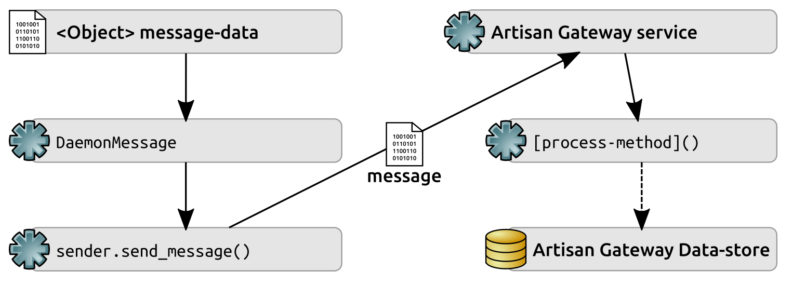
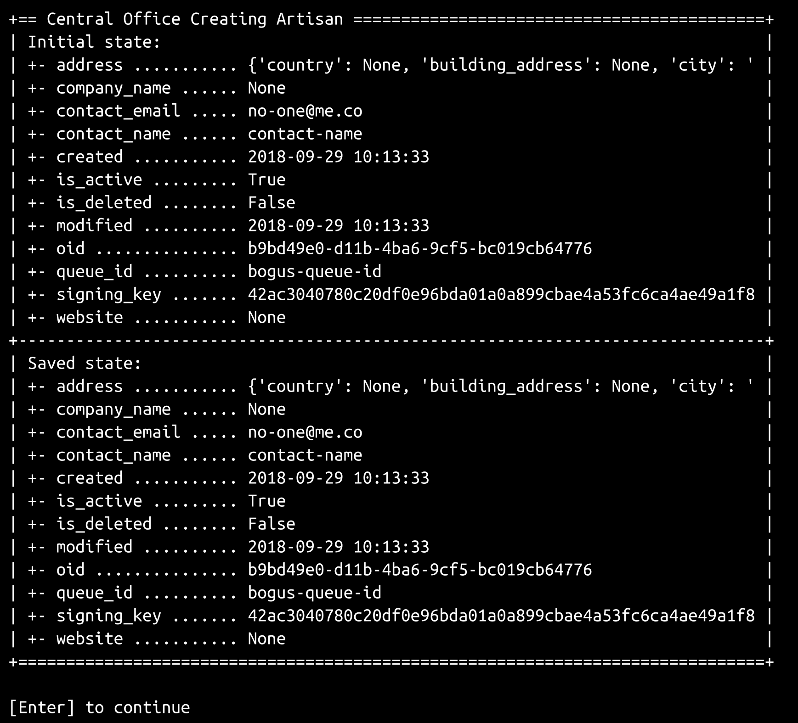
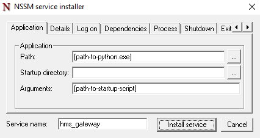
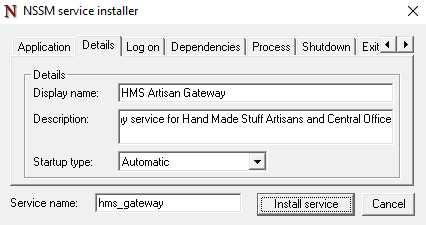

# 第十八章：测试和部署服务

第十七章，*处理服务事务*，以未经测试的通过网络实现对数据对象的 CRUD 操作的接收结束，这些操作源自工匠和中央办公室应用程序。由于证明（和展示）这些功能将需要进行质量保证和故事批准，而且由于该代码没有结构化或有用的可重复测试，在本章中，我们将详细讨论以下主题：

+   识别和处理测试服务应用程序的挑战

+   打包和部署服务涉及什么

+   展示服务功能的方法

此外，由于`hms_sys`的功能开发几乎已经完成，我们将对`hms_sys`中仍然需要完成的工作以使其对最终用户有用以及对其进行可能的未来增强进行一些思考和研究。

# 测试服务的挑战

测试服务虽然不难，但可能比到目前为止展示的相对基本的单元测试要复杂得多。例如，从工匠到网关的一般`hms_sys`数据流中的每个点都有特定和个别的测试问题，但整个流程应该尽可能完整，以便可以根据需要执行端到端的流程验证。

端到端的流程可能如下图所示：



从头到尾，对这个数据流的测试计划需要至少解决以下问题：

+   以一种可以用来验证最终过程的方式创建`message-data`

+   创建`DaemonMessage`（尽管可能不测试它是否准确创建了——应该已经有单元测试来测试这一点）

+   发送结果**消息**

+   通过与原始`message-data`进行比较，验证**工匠网关服务**接收消息的结果是否符合预期

根据服务操作的具体情况，可能发生在**消息**传输和接收之间的步骤可能不实际（或不可能）进行测试：

+   测试整个过程中的`send_message()`部分必须采取措施来确保可以在没有其他过程（在这种情况下是网关服务）在**消息**可以被验证之前消耗**消息**的情况下进行**消息**的传输。如果`send_message`的单元测试考虑到了这一点，以至于`send_message`方法本身可以被认为是可信的，那么更大范围的过程测试可以安全地跳过测试整个过程的这一部分。

+   同样，对各种`[process-method]`的测试应该提供对整个流程的各个部分的可信度。另一种方法是修改这些方法，以便在过程中观察它们的操作，在这种情况下，它们实际上不是相同的方法，而且应用的任何测试可能是毫无意义的。

鉴于整个流程的每个部分都应该有自己的单元测试，问这些问题是公平的：“通过测试整个流程，我们到底得到了什么？仅仅单独的单元测试就足够了吗？”简短的答案（尽管可能被视为作者的观点）是**不**——从某种角度来看，所有流程测试实际上都是 Artisan Gateway 的`main`方法的单元测试——根据传入消息的内容做出调用哪个方法的决定的事件循环。仅从这个角度来看，鉴于`ArtisanGatewayDaemon.main`是该类中关键的功能块，必须进行彻底测试。还要考虑到，我们测试政策要求的单元测试基本上涵盖了流程图中的所有框：`message-data`，`DaemonMessage`，`send_message`等等。它们并没有覆盖流程图中的*箭头*。虽然代码可能不会错过箭头代表的步骤之一，但这并非不可能，因此一个更高级别的端到端流程测试将揭示任何这些空白，从而证明整个流程的可信度。同样，这些流程的最终结果都需要是可验证的——例如，如果启动了一个 Artisan-Creating-Product 流程，需要确保一旦流程完成，就可以从数据存储中检索到新的`Product`对象，并且数据正确。

最后，由于各种流程都是在后台进行的，如果有错误进入生产安装，它们很可能很难进行调试：

+   几乎没有办法查看启动流程执行的各个 Artisan 应用程序安装

+   来回发送的消息，除非极其详细地记录其内容/数据，否则不会持续足够长时间以便在生产环境中进行调试时可读和可用

+   没有更详细的日志记录，特定的守护进程调用是不可见的，它们的结果（如果有的话）无法与它们来源的原始数据进行对比

# 整体测试策略

在编写实现完整流程测试的代码之前，需要努力完成并成功执行所有未完成的单元测试。完成后，我们可以逻辑地认为*流程*测试中出现的任何失败都是因为流程中的某些问题，尽管我们可能希望验证子流程步骤，并针对某些条件引发失败。这可能会随着流程测试的编写而发展。

每个具有一组相应流程的业务对象都需要检查适用的任何/所有以下流程：

+   对象的创建，以及其数据的本地和远程持久性：

+   每个允许执行更新的角色

+   确保测试有效和无效的更新尝试

+   更新对象的数据：

+   每个允许执行更新的角色

+   确保测试有效和无效的更新尝试

+   对象的删除：

+   每个允许执行删除的角色

+   确保测试有效和无效的删除尝试

+   验证尝试后适用的本地和远程数据更改

确定什么构成无效尝试需要考虑至少以下问题：

+   在测试的流程中的任何步骤，可能会有什么被损坏，应该阻止流程成功完成的情况？

+   在测试的流程中的任何步骤，可能会有恶意更改，应该阻止流程成功完成的情况是什么？

+   已经有哪些测试考虑了这些情况？

+   需要为未考虑的任何场景创建哪些测试？

对于网关服务，存在潜在的坏数据变体的点有：

+   **尝试创建或更改业务对象实例的无效尝试：** 这些应该大部分由业务对象本身的创建和更新过程的单元测试覆盖——这些测试应该确保，例如，只允许良好形式的数据创建和更新，并且在引发异常后，消息传输过程甚至不应该触发。这些情况实际上无法在网关守护程序的上下文中进行测试，但必须在与其通信的应用程序中进行测试。

+   **接收到未经授权的数据事件消息：** 在`DaemonMessage`中对消息签名的测试应该确保具有无效签名的消息引发错误。作为其延伸，数据事件处理的测试应该确保如果引发未经授权的消息错误，它会被干净地处理，并且不执行任何数据更改。

+   接收到带有无效数据的授权数据事件消息：假设消息发起方与数据事件相关的单元测试已经完成，这可能是恶意活动的指示。暂且不考虑测试方面的考虑，应该对该事件周围的日志进行一些审查，以确保该类别的事件被记录。无论是恶意还是不恶意，消息接收端的相应单元测试应该确保引发某种异常，并且数据事件处理测试应该确保处理任何引发的异常，并且不执行任何数据更改。

尽管这些测试严格来说不是单元测试（它们会被正式分类为系统或集成测试的某种混合），我们仍然可以利用`unittest`模块的功能，该模块一直驱动着系统的所有自动化测试。如果有这样的愿望，这将允许将过程测试集成到完整的测试套件中，并作为其一部分运行，或者独立运行，或者根据需要/愿望进行单独运行。

# 值得注意的单元测试变体

需要实施的大部分单元测试都相当整洁地落入了自`hms_sys`开发工作开始以来一直在进行的标准流程中，对此没有什么新的说法。然而，还有一小部分其他测试具有一些值得注意的变体。

随着大量依赖于标准 Python 模块（例如`atexit`、`logging`和`signal`在`daemons`代码库中）或安装以满足特定需求的各种第三方模块的新代码的出现，测试政策的另一个方面浮出水面：如何深入（甚至是否）测试几乎只是其他来源功能的包装器的功能。可以合理地假设，任何作为 Python 分发本身的一部分的软件包在包含在分发中之前都经过了彻底的测试。可以合理地假设，可以通过`pip`工具安装的任何软件包也经过了彻底的测试，尽管这可能会因软件包而异。

这些都是可能被表达为“信任框架”的变体。基本上，这归结为在假设通过`pip`（或操作系统提供的其他设施）安装的软件包已经经过了足够的测试（无论“足够”的价值是什么）。如果认为这些已经经过了足够的测试，它们就不需要被分类测试。使用受信任的框架功能开发的功能是否需要进行测试，可能取决于外部功能的具体使用方式。

在列出显著变化的单元测试时，应该记住这一点。

在`hms_core`包中，`BaseDaemon`和`BaseDaemonizable`的 ABCs 的测试具有相应的具体类定义（分别为`BaseDaemonDerived`和`BaseDaemonizableDerived`），这些类用于根据需要创建测试实例。这本身并不是新鲜事——我们以前已经使用具体派生类来简化 ABC 的测试。不过，创建任一可测试的实例都需要在实例构造期间传递一个配置文件。该文件的创建和清理由`setUpClass`和`tearDownClass`方法处理，这些方法在`TestCase`类上定义：

```py
class testBaseDaemon(unittest.TestCase):

# ...

    @classmethod
    def setUpClass(cls):
        # - Create a basic config-file that can be used to create
        #   instances of BaseDaemonDerived.
        config_data = """logging:
  format: "%(asctime)s - %(name)s - %(levelname)s - %(message)s"
  name: example
  console:
    level: info
  file:
    level: debug
    logfile: "/tmp/example.log"
"""
        cls._config_file = 'example.config'
        with open(cls._config_file, 'w') as fp:
            fp.write(config_data)

    @classmethod
    def tearDownClass(cls):
        try:
            os.unlink(cls._config_file)
        except:
            pass
```

当`setUpClass`执行时，在任何测试方法触发之前，它会在当前工作目录中创建一个可用的配置文件（`example.config`），填充它的基本配置数据，并在一个类属性（`cls._config_file`）中跟踪文件名，以便测试方法可以访问。在测试方法中创建测试对象的典型模式看起来像这样：

```py
    def testmethod(self):
        # Tests the method method of the BaseDaemon class
        test_object = BaseDaemonDerived(self._config_file)
        # - Whatever assertions and other test-processes are needed...
```

对`hms_core.daemons`成员进行了一些测试，其中一些被积极跳过。`BaseDaemon`的各种控制方法（`start`，`stop`和`restart`）被勉强跳过。尝试测试它们的根本问题在于，就目前而言，它们只不过是对其他方法的调用集合，其中许多方法本身将被测试。平衡点落在对框架的信任范畴。最多，只有一个决策点（在 start 中，检查实例的`_running`标志）可能有用地进行测试，但在更改该标志值之前，它必须非常快地发生，以终止实例的进程。最终，只要守护程序的实例启动、停止和重新启动没有错误，这些方法就表现如预期，通过明确测试相应的方法几乎没有什么收益。

对于`BaseDaemonizable`中的`daemonize`，`preflight`和`start`方法也出于类似的原因做出了类似的决定，另外一个问题是，许多被调用的方法是由标准模块提供的，并且它们本身也属于信任框架的范畴。

`BaseDaemon`的所有日志包装方法（`critical`，`debug`，`error`，`info`和`warn`）都被积极跳过。这一决定背后的理由是，只要它们调用的`Logger`实例被正确创建，这些实例就属于“信任框架”的范畴。

`BaseDaemonizable`的属性（其值为文件系统路径（`stdin`，`stdout`，`stderr`和`pidfile`）几乎遵循我们之前建立的标准测试结构。主要区别在于它们是文件系统路径值，因此这些属性的测试方法需要包括有效和无效的路径，以及由于文件系统权限而无法写入或读取的格式良好的路径。这些测试也与操作系统紧密相关：例如，在 Windows 中完全有效的文件路径在类似 Linux 或 macOS 使用的 POSIX 风格文件系统中可能无效。

`BaseDaemon.config_file`和`configure`方法也需要类似的策略。

`BaseDaemon`的`cleanup`和`preflight`方法属于一个独特的类别：默认情况下，它们只是记录（在`info`日志级别）它们已被调用，以便启动和关闭活动日志可以宣布它们已被执行。如果派生类实际上没有覆盖这些方法，`BaseDaemon`提供的基线功能将被调用，并执行相同的日志记录。如果应用了早期提到的日志包装器方法相同的标准，那么`cleanup`和`preflight`都属于“信任框架”分类。但是，如果将来的需要改变其中一个方法，添加超出简单调用日志的内容，会发生什么？在这种情况下，如果跳过测试，即使应该进行测试，也不会执行任何测试。事实上，无法预料到会对相关测试产生影响的变化，因此必须假定一定程度的预期纪律——任何对这些基本方法进行实质性更改的人也必须相应地更新相应的测试。

在构建和执行这些单元测试的过程中，一些在开发周期早期被存根化但实际上从未被使用的类，需要进行测试。由于这些从未被需要（甚至在许多情况下从未被实现），这些类本身已被移除，相应的测试要求也随之消失。

在`hms_core.messaging`中的`RabbitMQSender`类有一个方法`send_message`，部分属于“信任框架”类别。它还需要测试以确保对`DaemonMessage`实例的类型检查是被考虑的。综合起来，该方法的完整测试几乎只是类型检查测试，并确保该方法执行时不会出错。经过一些考虑，还在`send_message`中实现了检索发送的消息，或者至少执行确认，以便它不会永远停留在某个测试队列中。

剩下的未完成的测试，所有这些测试都遵循标准单元测试流程的合理简单变化，如下所示：

+   在`hms_core.business_objects`和`hms_artisan.artisan_objects`中：

+   测试`Artisan.queue_id`和`Artisan.signing_key`属性

+   在`hms_core.co_objects`中：

+   测试`Artisan.to_message_data`方法

+   测试新的`Order`类

+   在`hms_core.daemons`中：

+   测试`BaseDaemon._create_logger`

+   在`hms_core.messaging`中：

+   测试`DaemonMessage`

+   测试`HasMessageData`

+   测试`InvalidMessageError`

+   测试`RabbitMQSender`的标准项目

+   在`hms_artisan.artisan_objects`中：

+   测试`Artisan.to_message_data`方法

在`hms_Gateway`命名空间之外的所有测试类中，留下了`ArtisanGatewayDaemon`类的属性和方法，这些属性和大部分方法可以按照标准的测试政策和流程进行测试。最值得注意的例外是`ArtisanGatewayDaemon.main`，它将在测试模块中被跳过，并且现在可以进行端到端流程测试。

# 测试工匠交易

对工匠的端到端流程测试需要包括以下内容：

+   创建一个工匠，就像从中央办公室工作人员那里发起的那样

+   更新一个工匠，就像从中央办公室工作人员那里发起的那样

+   更新一个工匠，就像从工匠自己那里发起的那样

+   删除一个工匠，就像从中央办公室工作人员那里发起的那样

由于我们不测试类，这一直是我们所有单元测试的模式，我们不需要我们标准单元测试扩展的所有功能，但我们将希望使用足够相同的结构和至少一些在那里创建的实用程序，以便将流程测试与`hms_Gateway`命名空间的常规单元测试运行集成。考虑到这一点，起点代码看起来与我们以前的测试模块非常相似。

```py
#!/usr/bin/env python
"""
Defines end-to-end process-tests for the ArtisanGatewayDaemon
"""

#######################################
# Standard library imports needed     #
#######################################

import os
import sys
import unittest
```

由于我们实际上只需要我们一直在使用的单元测试扩展的输出和报告保存功能，我们只会导入这些功能：

```py
#######################################
# Local imports needed                #
#######################################

from idic.unit_testing import PrintTestResults, SaveTestReport
```

模块级常量保持不变，由于我们将对运行中的`ArtisanGatewayDaemon`类进行测试，我们已经知道我们需要导入它：

```py
#######################################
# Module-level Constants              #
#######################################

LocalSuite = unittest.TestSuite()

#######################################
# Imports needed for testing          #
#######################################

from hms_Gateway.daemons import ArtisanGatewayDaemon
```

我们将首先测试的四个流程可以分别由单个测试方法表示。这些方法中的每一个都必须提供每个流程测试步骤需要执行的任何代码，但它们可以从明确的失败开始：

```py
#######################################
# Test-cases in the module            #
#######################################

class testArtisanProcesses(unittest.TestCase):

    def testArtisanCreateFromCO(self):
        self.fail('testArtisanCreateFromCO is not yet implemented')

    def testArtisanUpdateFromCO(self):
        self.fail('testArtisanUpdateFromCO is not yet implemented')

    def testArtisanUpdateFromArtisan(self):
        self.fail('testArtisanUpdateFromArtisan is not yet implemented')
```

```py
    def testArtisanDeleteFromCO(self):
        self.fail('testArtisanDeleteFromCO is not yet implemented')
```

由于我们正在使用标准的单元测试扩展，我们仍然需要主动将每个测试用例类添加到本地测试套件中：

```py
LocalSuite.addTests(
    unittest.TestLoader().loadTestsFromTestCase(
        testArtisanProcesses
    )
)
```

最后，由于我们希望能够独立运行流程测试模块，我们将包括与之前所有模块中相同的`if __name__ == '__main__'`代码块，它将提供测试结果的输出并将结果保存到报告文件中，如果没有失败的话：

```py
#######################################
# Code to execute if file is called   #
# or run directly.                    #
#######################################

if __name__ == '__main__':
    import time
    results = unittest.TestResult()
    testStartTime = time.time()
    LocalSuite.run(results)
    results.runTime = time.time() - testStartTime
    PrintTestResults(results)
    if not results.errors and not results.failures:
        SaveTestReport(results, 'hms_Gateway.ModuleName',
            'hms_Gateway.EndToEndProcesses.test-results')
```

由于所有这些测试都需要`ArtisanGatewayDaemon`类的运行实例，我们还需要确保有一个可用。因为类的运行实例是一个独立于任何其他进程的服务，启动服务实例不能作为任何测试方法的正常部分发生——`main`循环将启动，并且在它终止之前不会有任何其他进展，这使得实际测试`main`控制的流程变得不可能。

有几种选择可以缓解这个问题：

+   测试过程可以以某种方式使用操作系统服务控制设施来启动本地服务实例，就像在部署后控制它一样。从长远来看，这可能是一个更好的方法，但在开发过程的这一点上，我们实际上无法部署服务代码，所以这将需要等待未来的开发。然而，这种方法存在一个权衡：为了使测试准确，服务必须在每次执行测试套件时部署，或者必须创建一些等效的机制来模仿已部署的服务。

+   由于服务最终只是一个类的实例，测试过程可以创建一个实例并启动它，让测试执行，然后终止用于测试的服务实例。虽然这是一个更复杂的解决方案，但至少在某种程度上感觉更好：每个测试套件都可以针对专门为这些测试定制的服务实例执行，包括具有不同消息队列的服务实例，如果必要，可以在解决测试方法引发的问题时进行检查，而无需整理可能庞大的消息集。

实施第二个选项涉及使用先前提到的`setUpClass`和`tearDownClass`方法，在任何测试执行之前创建服务实例并使其运行，并在所有测试完成后关闭该实例。由于每个业务对象过程集合都应该有一个测试用例类，因此设置`setUpClass`和`tearDownClass`以便它们可以被各种测试用例类重用也是一个不错的计划。我们可以通过创建一个包含两种方法所需逻辑的类来简化这一过程，然后从该新类和迄今为止一直是测试用例类的骨干的`unittest.TestCase`类派生出各个测试用例类：

```py
class NeedsArtisanGateway:

    @classmethod
    def setUpClass(cls):
        """
Creates and starts an instance of the ArtisanGatewayDaemon that 
can be used during execution of the tests.
"""
```

顺便说一句，这表明可以向测试套件添加辅助类——这些类在测试执行期间提供一些功能或所需的能力，但它们本身不是测试用例类。

我们需要创建一个配置文件，服务实例将使用该文件，但在这之前，我们将存储一些我们可能在测试方法中需要的值作为类属性，以便以后在需要时可以访问它们：

```py
        cls.Gateway_signing_key = os.urandom(64).hex()
        cls.Gateway_queue_id = 'hms_ag_%s_process_test' % cls.queue_name
        cls.Gateway_config_file = 'process_test.config'
```

配置数据可以设置为一个字符串，遵循先前建立的配置结构。如果需要，可以通过向类添加变量/属性值来定制服务实例，并确保这些值被传递到字符串中，就像这里的`cls.Gateway_queue_id`和`cls.Gateway_signing_key`属性一样：

```py
        cls.Gateway_config_data="""# Logging configuration
logging:
  format: "%%(asctime)s - %%(name)s - %%(levelname)s - %%(message)s"
  name: hms_ag_process_test
  file:
    level: debug
    logfile: "/tmp/hms_ag_process_test.log"
queue:
  type: rabbit
  connection:
    host: localhost
    port: 5672
    path: /
  queue_name: "%s"
signing_key: "%s"
""" % (cls.Gateway_queue_id, cls.Gateway_signing_key)
```

配置数据被写入一个临时配置文件，该文件由测试用例类使用，方式与我们在测试`BaseDaemon`时所做的方式相同：

```py
with open(cls.Gateway_config_file, 'w') as fp:
    fp.write(cls.Gateway_config_data)
```

由于我们可能需要访问服务实例本身，我们将创建并存储该实例作为另一个类属性：

```py
cls.Gateway = ArtisanGatewayDaemon(cls.Gateway_config_file)
```

启动服务实例需要执行其启动方法，以便该过程独立于运行测试代码。为了实现这一点，我们将使用 Python 的`multiprocessing`模块中的`Process`类，告诉它在启动`Process`时调用哪个方法，并且该进程应该被视为`daemon`，使其执行独立于其他运行的代码。设置好之后，我们可以启动`Process`，执行存储在`cls.Gateway`中的服务实例的启动方法：

```py
cls.Gateway_process = Process(target=cls.Gateway.start, daemon=True)
cls.Gateway_process.start()
```

`multiprocessing`模块将在第十九章中进行更详细的探讨，*Python 中的多处理和 HPC*，在那里我们将探索跨多个进程和机器分配计算负载的各种策略和方法。

拆卸要简单得多：存储控制运行服务实例的进程（`cls.Gateway_process`）后，只需终止该`Process`（调用`terminate`方法），并删除临时配置文件，以便不会在测试代码中留下它。由于进程的终止可能在拆卸执行完成之前不完整，因此还添加了一个短暂的延迟：

```py
    @classmethod
    def tearDownClass(cls):
        # - Stop the service-instance
        cls.Gateway_process.terminate()
        # - Clean up (delete) the temp. config-file
        os.unlink(cls.Gateway_config_file)
        # - Add a short delay to allow the process-termination time 
        #   to complete before proceeding with the next item...
        time.sleep(1)
```

在测试用例类中使用`NeedsArtisanGateway`类需要进行一些微不足道的代码更改：每个测试用例类都需要从`NeedsArtisanGateway`和`unittest.TestCase`派生开始：

```py
class testArtisanProcesses(NeedsArtisanGateway, unittest.TestCase):
```

此外，由于`NeedsArtisanGateway`需要一个`queue_name`类属性来创建`Gateway_queue_id`类属性，因此需要定义它：

```py
queue_name = 'artisan'
```

然而，从那时起，剩下的一切都保持不变：

```py
def testArtisanCreateFromCO(self):
    self.fail('testArtisanCreateFromCO is not yet implemented')

# ...
```

在实施任何测试之前，测试模块中需要进行一些配置和设置。预计所有过程测试都需要数据访问能力，因此我们需要导入主数据存储类，以及数据存储配置类，并配置数据访问以允许这些功能：

```py
from hms_core.data_storage import DatastoreConfig, HMSMongoDataObject

config = DatastoreConfig(
    database='hms_proc_tests',
)
HMSMongoDataObject.configure(config)
```

同样，由于过程测试都涉及消息传输，我们需要能够创建发送者对象——`RabbitMQSender`的实例——以及`DaemonMessage`对象。这些也需要被导入，并且需要进行基本的`RabbitMQSender.configuration`调用：

```py
from hms_core.messaging import DaemonMessage, RabbitMQSender, \
    MESSAGE_ORIGINS
RabbitMQSender.configure(
    'hms_ag_process_test', 'localhost', 5672, '/'
)
```

`import`行中的`MESSAGE_ORIGINS`是一个新的模块常量，一个包含名称和值的集合，可以用来控制哪些值是集合的成员，与它们相关联的名称是什么，并确定给定值是否是集合的成员。它的定义如下：

```py
MESSAGE_ORIGINS = namedtuple(
    'MESSAGE_ORIGINS', ['artisan', 'central_office']
)(
    artisan='artisan',
    central_office='central-office',
)
```

Python 确实有一些官方的枚举类，但是否则最适合满足这个需求的`enum.Enum`不允许检查任意值是否属于枚举。这些差异可以在本章代码中的`hms_Gateway/scratch-space`中的`enumeration-example.py`文件中看到的结果中看到。

最后，由于测试过程将使用具有不同命名空间的相同名称的类（例如，`hms_core.co_objects.Artisan`和`hms_artisan.artisan_objects.Artisan`，都命名为 Artisan），我们需要导入它们并在过程中重命名，如下所示：

```py
from hms_core.co_objects import Artisan as COArtisan
from hms_artisan.artisan_objects import Artisan as ARArtisan
```

从这一点开始，任何创建`COArtisan`对象都将是`hms_core.co_objects.Artisan`类的实例，而`ARArtisan`对象将是`hms_artisan.artisan_objects.Artisan`的实例。

有了这些，第一个过程测试方法的实现终于可以开始了。它从创建`sender`对象开始，该对象将用于发送测试消息：

```py
def testArtisanCreateFromCO(self):
    sender = RabbitMQSender()
```

为了测试 Artisan 创建过程，我们必须创建一个 Artisan：

```py
    parameters = {
        'contact_name':'contact-name',
        'contact_email':'no-one@me.co',
        'address':{
            'street_address':'street-address',
            'city':'city',
        },
        'queue_id':self.Gateway_queue_id,
        'signing_key':self.Gateway_signing_key,
    }
    new_artisan = COArtisan.from_data_dict(parameters)
```

然后我们创建要发送的`message`，并发送它：

```py
    message = DaemonMessage(
        operation='create', 
        origin=MESSAGE_ORIGINS.central_office,
        data={
            'target':'artisan',
            'properties':new_artisan.to_message_data(),
        },
        signing_key=self.Gateway_signing_key
    )
    sender.send_message(message, self.Gateway_queue_id)
```

在代码的这一点上，消息已经发送，但没有简单的方法来确定它是否已经被接收，更不用说被处理了。如果没有实际编写代码（可能是大量的代码）来跟踪消息及其状态，那么暂停处理直到我们相当肯定消息已经被传递并被处理的选项就不多了。下一个最佳选项，也是需要更少的代码工作的选项，尽管它会减慢测试过程，就是简单地延迟执行一小段时间——足够让消息被传递并被处理，但不至于使运行测试变得问题严重。使用`time.sleep`，我们将延迟处理 5 秒，至少目前是这样。以后可能需要增加，或者如果需要更好地了解过程需要多长时间才能完成，也可以减少：

```py
time.sleep(5)
```

一旦消息被接收并被处理，如果一切顺利，那么 Gateway 服务将创建一个`new_artisan`对象，并保存到它正在使用的数据库中。测试过程的下一步是确保实际上创建并存储了一个新对象：

```py
    try:
        verify_artisan = COArtisan.get(str(new_artisan.oid))[0]
    except IndexError:
        self.fail(
            'Although the new artisan (oid: %s) was created, '
            'it could not be retrieved' % (new_artisan.oid)
        )
```

知道新对象已经创建，我们可以检查确保新对象的数据与最初发送的数据是相同的。由于任何数据对象的数据字典表示都将是最全面的——它应该包括所有被持久化的数据——这就是原始`Artisan`和新创建和检索到的`Artisan`的简单比较：

```py
    self.assertEquals(
        verify_artisan.to_data_dict(), new_artisan.to_data_dict()
    )
```

如果测试过程通过了这个检查，那么我们就完成了用于测试创建的`new_artisan`对象，并且可以从数据库中删除它：

```py
    COArtisan.delete(str(new_artisan.oid))
```

这结束了对流程的“快乐路径”测试——在这里，一切都是按照预期创建、格式化和发送的。测试未经授权和格式不正确的消息需要更多的工作，因为我们将会规避`Artisan`和`DaemonMessage`类执行的检查。因此，首先从未经授权的消息开始，消息的签名与接收端计算的签名不匹配，我们需要首先创建一个未经授权的消息。我们可以使用现有的消息，因为它仍然存在，提取我们将要发送的数据，然后改变一些东西——可以是数据值或签名：

```py
unauthorized_message_data = message.to_message_dict()
unauthorized_message_data['data']['properties']['website'] = \
    'http://some-bogus-website.com'
```

由于我们已经有了一个`sender`，我们可以使用它的`channel`，以及实例的`Gateway_queue_id`，来规避正常的发送过程，该过程期望一个`DaemonMessage`实例。相反，我们将发送刚刚创建的未经授权消息的 JSON 转储：

```py
sender.channel.basic_publish(
    exchange='', routing_key=self.Gateway_queue_id, 
    body=json.dumps(
        unauthorized_message_data, sort_keys=True
    )
)
```

这个分支的测试部分关注的是数据更改是否通过了`Gateway`服务。如果通过了，它将生成一个新的`Artisan`记录，我们可以检索相应的对象。如果通过了，我们可以，那么就出了问题，我们明确导致测试失败。如果检索尝试失败（引发`IndexError`，因为返回的结果集是一个零长度列表，并且在`[0]`位置没有元素），那就是预期/期望的行为，我们可以简单地忽略错误，通过测试的这一部分：

```py
    try:
        verify_artisan = COArtisan.get(str(new_artisan.oid))[0]
        self.fail(
            'An unauthorized message should not execute a data-'
            'change'
        )
    except IndexError:
        pass
```

测试一个无效但经过授权的消息的工作方式基本相同，但我们将改变消息的数据，然后使用正常的`DaemonMessage`/`sender`流程：

```py
    invalid_message_data = new_artisan.to_message_data()
    # - Alter a data-value, like website
    invalid_message_data['website'] = 12.345
    invalid_message = DaemonMessage(
        operation='create', 
        origin=MESSAGE_ORIGINS.central_office,
        data={
            'target':'artisan',
            'properties':invalid_message_data,
        },
        signing_key=self.Gateway_signing_key
    )
    sender.send_message(invalid_message, self.Gateway_queue_id)
    try:
        verify_artisan = COArtisan.get(str(new_artisan.oid))[0]
        self.fail(
            'An unauthorized message should not execute a data-'
            'change'
        )
    except IndexError:
        pass
```

中央办公室更新工匠和中央办公室删除工匠流程的变体看起来非常相似，每个流程都会执行以下操作：

+   创建一个本地工匠并保存它，以便有一个将要被操作的数据对象。

+   在继续之前，可以选择验证新创建的工匠是否存在于数据库中，尽管如果`Artisan.save`方法在其他测试中被认为是可信的，这一步可以被跳过

+   创建一个适当的`message`来执行正在测试的流程，并发送它

+   对比同一个工匠的第二个实例的测试结果：

+   更新过程测试必须着重更改所有可以合法更改的字段，这些字段可以由测试所扮演的角色（作为中央办公室用户/工匠经理）来更改。在这方面，它可能看起来非常像以前针对`Artisan.to_data_dict`等方法的单元测试，这些方法返回对象的字典表示

+   它还应该着重尝试对工匠进行不允许的更改，并验证这些尝试是否失败

+   删除过程测试将会更简单，因为它所需要做的就是尝试重新获取测试对象（使用类似于`verify_artisan = COArtisan.get(str(new_artisan.oid))[0]`的方法，我们之前已经看过），如果在执行删除后检索失败，则测试通过

对无效访问尝试进行测试，比如工匠创建工匠，也应该被实施，并且其代码结构与先前显示的测试代码的部分类似。然而，在这些测试通过之前，必须实施实际检查各种操作方法中的消息的机制。使用传入`DaemonMessage`的`origin`，这可能看起来像这样，显示了一个一般的、任何角色都允许的检查和一个特定角色的检查，并以`Gateway`服务的`create_artisan`方法为例：

```py
def create_artisan(self, message:(DaemonMessage,)) -> None:
    self.info('%s.create_artisan called' % self.__class__.__name__)

    # ...

    # - Assure that only the appropriate roles can execute this 
    #   method. First check against *all* valid origins (at a 
    #   minimum, this check should occur in *all* methods)
    if message.origin not in MESSAGE_ORIGINS:
        raise RuntimeError(
            'Malformed message: "%s" is not an accepted '
            'message-origin' % message.origin
        )
    # - Alternately, check against specific roles/origins instead, 
    #   if they are limited
    if message.origin != MESSAGE_ORIGINS.central_office:
        raise RuntimeError(
            'Unauthorized Action: "%s" is not allowed to '
            'execute this method' % message.origin
        )
```

对无效角色/操作执行变体的测试看起来非常像我们之前看到的`invalid_message`的测试，验证当提供一个格式良好的消息尝试执行一个不被任何给定角色/`origin`允许的操作时，操作方法不会执行。

测试起源于关系的应用程序端的交易过程稍微复杂一些，仅仅是因为到目前为止这些应用程序还没有进行重大的开发。为了测试这些过程，至少最初需要创建一个应用程序过程的简化模拟——在以后，当有相当完整和经过测试的应用程序时，最好实际运行它们的本地实例。工匠和中央办公室应用程序都需要一个模拟，并且需要以与网关服务守护程序类似的方式提供 CRUD 操作方法。工匠应用程序的模拟可能从这样的代码开始：

```py
class ArtisanapplicationMock:

    # ... Properties and initialization would need to be fleshed 
    #   out, obviously...

    # CRUD-operation methods to implement
    def update_artisan(self, message:(DaemonMessage,)) -> (None,):
        # TODO: Implement this method
        pass

    def create_order(self, message:(DaemonMessage,)) -> (None,):
        # TODO: Implement this method
        pass

    def update_order(self, message:(DaemonMessage,)) -> (None,):
        # TODO: Implement this method
        pass

    def delete_order(self, message:(DaemonMessage,)) -> (None,):
        # TODO: Implement this method
        pass

    def update_product(self, message:(DaemonMessage,)) -> (None,):
        # TODO: Implement this method
        pass
```

网关服务的结构可以被部分重用，以提供将消息路由到其各自操作方法的方法：

```py
    def _handle_message(self, message:(DaemonMessage,)) -> (None,):
        # - This method would look very much like its counterpart 
        #   in hms_Gateway.daemons.ArtisanGatewayDaemon
        # TODO: Implement this method
        pass
```

然而，与其有一个`main`循环不如有一个单一方法更好，该方法就像通过网关服务的`main`循环的单次通过。对于测试目的，这允许更严格地控制消息的处理，以便任意数量的测试消息可以作为测试过程的一部分发送。然后，可以调用`ArtisanapplicationMock`方法来读取和处理所有消息，这导致这些消息可以被测试。这个方法，`handle_pending_messages`，看起来仍然很像`ArtisanGatewayDaemon.main`，尽管：

```py
def handle_pending_messages(self) -> (None,):
    # - Create a connection
    connection = pika.BlockingConnection(
        pika.ConnectionParameters(
            self.connection_params['host'],
            self.connection_params.get('port'),
            self.connection_params.get('path'),
        )
    )
    # - Create (or at least specify) a channel
    channel = connection.channel()
    # - Create or specify a queue
    channel.queue_declare(queue=self.queue_name)
    # - Get *all* pending messages, and execute against them
    polling = True
    while polling:
        try:
            # - Retrieve the next message from the queue, if 
            #   there is one, and handle it...
            method_frame, header, body = channel.basic_get(self.queue_name)
            if method_frame:
                # - Any actual message, valid or not, will 
                #   generate a method_frame
                message = DaemonMessage.from_message_json(
                    body.decode(), self.signing_key
                )
                # - We've received the message, and will 
                #   process it, so acknowledge it on basic 
                #   principle
                channel.basic_ack(method_frame.delivery_tag)
                self._handle_message(message)
            else:
                polling = False
        except InvalidMessageError as error:
            # - If message-generation fails (bad signature), 
            #   we still need to send an acknowledgement in order 
            #   to clear the message from the queue
            channel.basic_ack(method_frame.delivery_tag)
```

有了这个，以及中央办公室应用程序的相应模拟，通过网关服务传递到其他应用程序并进行更改的交易的测试过程将类似于更简单交易的测试过程，比如创建一个工匠：

1.  为操作创建消息，带有适当的来源和数据

1.  该消息被发送到网关服务

1.  执行任何服务级数据更改的验证，可能需要延迟以确保已经有时间传递并执行消息

1.  调用适当应用程序模拟类的`handle_pending_messages`方法来读取和处理传入的消息

1.  执行预期结果的测试——为创建事务创建新的本地数据，为更新事务更改现有数据，为删除事务删除现有数据

整个过程——创建用于测试目的的模拟更复杂系统或对象的代码——称为**模拟**。模拟允许编写测试，而无需依赖实际（通常更复杂）的真实代码实现。

产品和订单的测试，在大部分情况下，可以遵循类似的模式。主要的区别当然在于正在创建和操作的对象类型，以及根据每个角色/操作组合的业务规则，各种角色被允许对这些对象做什么。可能需要定义额外的测试来专门针对某些操作——例如，工匠完成订单的一部分，这本质上只是一个更新操作。然而，这应该只会改变项目履行数据，而不是所有的数据。即便如此，这几乎肯定会遵循这里概述的类似的测试过程和结构。

# 演示服务

许多迭代开发过程的核心要求是代码的功能可以向利益相关者展示，以便他们有足够的信息来同意故事的需求已经得到满足，或者指出这些需求中的任何差距。演示服务对满足该要求提出了一些独特的挑战：

+   一切发生的都是“幕后”不可见的。

+   许多事情发生得如此迅速，以至于根本没有时间看到导致最终结果的中间步骤

+   很可能不会有任何与用户界面相关的内容，或者即使有，也不会提供足够的可见性来充分展示这些过程的细节

有时，就像网关服务一样，还有一些外部系统——数据库、消息队列服务等，需要对正在运行的代码可用，以便演示过程实际上能够成功运行。演示准备需要考虑到这一点，并确保任何需要的外部服务的运行实例可用。在这种情况下，由于开发和测试已经依赖于这些相同的服务可用，这不是问题，只要可以从开发环境运行代码演示。

已经实施的过程测试可以执行，以证明代码的行为是可预测的，这是一个很好的演示项目，但它并不能解决我们最初的问题。展示各种过程内部运作的一个非常基本的方法是编写一个演示脚本，执行与最终代码中发生的相同任务，以任何逻辑或所需的顺序，但以用户可控的块，并在需要时显示相关数据。这是一种蛮力、基本的方法，但可以使过程中的步骤可见（解决第一个问题），并在用户说要执行每个步骤时执行（解决第二个问题）。实际上，它通过为特定目的创建用户界面来解决了前两个问题。尽管完整的演示脚本太长而无法在此重现，但它基本上看起来像过程测试：

```py
#!/usr/bin/env python
"""
A (partial) script that runs through the various processes we need 
to demo for the Artisan Gateway service.
"""

# - Imports needed for the demo-script
import unittest
import os

from hms_core.co_objects import Artisan as COArtisan
from hms_core.messaging import DaemonMessage, RabbitMQSender, \
    MESSAGE_ORIGINS
```

各种项目的配置，比如演示过程将使用的数据存储或消息队列，需要在代码的这一点提供：

因为整个服务的单元测试位于一个包结构中（与真实代码的结构相同），可以导入整个单元测试套件，并编写一个函数按需执行它们：

```py
from test_hms_Gateway import LocalSuite

def demoUnitTests():
    print(
        '+== Showing that unit-tests run without error '.ljust(79,'=') + '+'
    )
    results = unittest.TestResult()
    LocalSuite.run(results)
    print('+== Unit-tests run complete '.ljust(79,'=') + '+\n\n')
```

每个数据交易过程的演示也可以封装在演示模块中的单独函数中。除了显示演示运行时的信息和提示运行演示的人允许其继续的新代码之外，它们看起来很像相应的过程测试方法：

```py
def demoArtisanCreateFromCO():
    print(
        '+== Central Office Creating Artisan '.ljust(79,'=') + '+'
    )
```

用于创建一个`Artisan`测试对象的代码几乎相同：

```py
    parameters = {
        'contact_name':'contact-name',
        'contact_email':'no-one@me.co',
        'address':{
            'street_address':'street-address',
            'city':'city',
        },
        'queue_id':'bogus-queue-id',
        'signing_key':os.urandom(64),
    }
    new_artisan = COArtisan.from_data_dict(parameters)
```

由于演示需要显示`new_artisan`对象的初始状态，以便在传输其创建消息之前显示数据按预期持久化，因此需要对对象的`data-dict`进行一些简单的蛮力输出：

```py
    initial_state = new_artisan.to_data_dict()
    print('| Initial state:'.ljust(79, ' ') + '|')
    for key in sorted(initial_state.keys()):
        print(
            (
                ('| +- %s ' % key).ljust(24, '.') + ' %s' % initial_state[key]
            )[0:78].ljust(79, ' ') + '|'
        )
    print('+' + '-'*78 + '+')
```

创建消息并发送消息几乎相同，除了用于标识发送消息的队列的`queue_id`。出于同样的原因，它也具有与相应过程测试相同的`time.sleep`延迟：

```py
    sender = RabbitMQSender()
    # - Send the new-COArtisan message to the service
    message = DaemonMessage(
        operation='create', 
        origin=MESSAGE_ORIGINS.central_office,
        data={
            'target':'artisan',
            'properties':new_artisan.to_message_data(),
        },
        signing_key=parameters['signing_key']
    )
    sender.send_message(message, parameters['queue_id'])
    # - The message has been sent, but we have to wait for 
    #   a bit before it is received and acted upon before we 
    #   can verify the creation happened
    time.sleep(5)
```

结果的显示本质上与我们之前看到的显示`initial_state`的代码相同；它只是使用了检索到的数据库持久化实例的`data-dict`，而不是原始实例：

```py
    verify_artisan = COArtisan.get(str(new_artisan.oid))[0]
    verify_state = new_artisan.to_data_dict()
    print('| Saved state:'.ljust(79, ' ') + '|')
    for key in sorted(verify_state.keys()):
        print(
            (
                ('| +- %s ' % key).ljust(24, '.') + ' %s' % verify_state[key]
            )[0:78].ljust(79, ' ') + '|'
        )
    print('+' + '='*78 + '+')
```

由于显示原始数据和持久化数据是一个逻辑分组，脚本在继续演示的下一步之前等待用户输入：

```py
    print('\n')
    input('[Enter] to continue the demo')
    print('\n')
```

在此演示函数中设置剩余项目，并且可能需要所有其他演示函数，如果模块直接执行，则可以通过简单调用每个演示函数来执行整个演示脚本（`if __name__ == '__main__'`）：

```py
if __name__ == '__main__':
    demoArtisanCreateFromCO()
```

仅使用第一个演示方法的第一部分的输出就可以显示数据持久性是准确的：



接下来的这个第一个演示函数的步骤将类似：

+   将执行与数据显示包装在变更之前和之后

+   在适用时显示正在进行的数据更改，以便能够看到这些更改

+   演示预期的失败案例，例如无效的消息数据或签名，以及任何基于角色的变体

过程测试方法正在证明（和执行）的内容与这些相同过程的演示几乎肯定会非常相似，测试方法将提供大部分所需的所有演示函数的代码。

# 打包和部署服务

由于`hms_Gateway`和`hms_core`项目各自都有自己的`setup.py`文件，因此打包和部署过程不需要比以下更复杂：

+   执行每个`setup.py`以生成可安装的软件包

+   将这些软件包文件移动到将运行网关服务的服务器

+   使用以下代码进行安装：

+   `pip install HMS-Core-0.1.dev0.tar.gz`

+   `pip install HMS-Gateway-0.1.dev0.tar.gz`

+   为新安装创建必要位置的配置文件

允许网关守护程序在系统启动时自动启动并在系统关闭时关闭所需的配置将根据目标机器的操作系统而变化（稍后会详细介绍）。

另一方面，如果需要一个单一软件包，那么需要在打包过程中进行`src`目录的整合，这需要作为打包过程的一部分进行。如果不能通过正常的`setuptools.setup`函数的参数的某种组合来实现，那么可以通过`Makefile`和对项目中已经存在的`setup.py`进行微小更改来完成。

在项目的主要源代码目录之外包含源代码的支持在作者的经验中，早期版本的 Python 和/或`setuptools`包存在零星问题。如果这些问题在当前版本中得到解决，那么可能可以使用`setuptools.setup`的`package_dir`参数，可能结合`setuptools.find_package`函数，指示主`setup`函数在当前项目之外的其他包源树的位置。这里描述的`Makefile`方法不够优雅，可能会有其他（通常是次要的）问题，但只需基本的`setup.py`功能/要求就可以始终正常工作。

`setup.py`文件的相关更改很简单，只需要将`hms_core`软件包名称添加到要包含在分发中的软件包列表中：

```py
# The actual setup function call:
setup(
    name='HMS-Artisan-Gateway',
    version='0.1.dev0',

    # ...

    packages=[
        'hms_Gateway',
        'hms_core',
    ],

    # ...

)
```

由于`setup.py`不关心它从哪里运行，一个简单的强制解决方案可以将所有相关源代码收集到一个单一位置作为`Makefile`目标的起点可能从这里开始：

```py
full_package:
        # Create a temporary packaging directory to copy all the 
        # relevant files to
        mkdir -p /tmp/Gateway-packaging
        # Copy those files
        cp -R src/hms_Gateway /tmp/Gateway-packaging
        cp -R ../hms-core/src/hms_core /tmp/Gateway-packaging
        # - Change to the temporary packaging directory, execute setup.py
        cd /tmp/Gateway-packaging;python setup.py
        # - Move the resulting package to somewhere outside the 
        #       temporary packaging directory, after assuring that the 
        #       location exists
        mkdir -p ~/Desktop/HMS-Builds
        mv /tmp/Gateway-packaging/dist/* ~/Desktop/HMS-Builds
        # - Clean up the temporary directory
        rm -fR /tmp/Gateway-packaging
```

逐步来看，实际上目标正在做以下事情：

+   创建临时构建目录

+   将每个项目的整个软件包目录复制到该目录

+   进入目录并执行典型的`setup.py`运行（使用修改后的`setup.py`文件）

+   确保文件系统上存在一个目录，可以将最终软件包文件移动到该目录

+   将新创建的软件包文件移动到该目录

+   删除临时构建目录

合并`Makefile`/`setup.py`过程的最终输出将是一个单个的包文件，`HMS-Gateway-0.1.dev0.tar.gz`，其中包括`hms_Gateway`和`hms_core`包目录，可以通过`pip install HMS-Gateway-0.1.dev0.tar.gz`进行安装。

# 所有操作系统的共同考虑因素

无论网关服务守护进程在什么操作系统下运行，它都需要一个完整的配置文件，位于已知位置，存储服务启动时需要了解的所有设置。这个配置文件的基本 Linux 版本（位于目标机器上运行服务的`/etc/hms/hms_Gateway.conf`中）看起来非常像第十六章中使用的*使用 RabbitMQ 实现消息队列*部分的最基本示例，*Artisan 网关服务*：

```py
# HMS Artisan Gateway Service Configuration
# - Used by the hms_Gateway.daemons.ArtisanGatewayDaemon class
#   to launch an active instance of the service
logging:
  format: "%(asctime)s - %(name)s - %(levelname)s - %(message)s"
  name: hms_Gateway
# If console-logging is desired, uncomment these lines
#  console:
#    level: info
  file:
    level: error
    logfile: "/var/log/hms/hms_Gateway.log"
queue:
  type: rabbit
  connection:
    host: rabbitmq.hms.com
    port: 5672
    path: /
  queue_name: "central-office"
# Signing-key should be generated and added to configuration 
# during installation. It should be a 64-character, 
# bytes-type-compatible string-value, and will likely need to be 
# explicitly quoted
signing_key: ""

```

这个配置文件故意不是打包过程的一部分——否则，每次安装更新时，都会有一些覆盖现有和运行配置的风险。一旦最终配置就位，它在任何正常情况下都不应该需要修改。在 Linux 版本的配置文件和在 Windows 服务器上使用的配置文件之间唯一的区别是日志文件路径（`logging:file:logfile`），它需要指向 Windows 文件系统路径。

我们将在 Windows 和 Linux 操作系统下检查的服务管理选项允许通过简单的命令行执行来启动服务守护进程。较旧的 Linux 服务管理可能需要一个独立的 Bash 或 Python 脚本，以在操作系统的核心功能和用户与系统的交互之间进行桥接。然而，随着这些更现代的选项的出现，我们可以以与在开发过程中进行测试时相同的方式在生产系统上启动服务守护进程，只需在`hms_Gateway/daemons.py`的末尾添加几行代码：

```py
if __name__ == '__main__':
    daemon = ArtisanGatewayDaemon('/etc/hms/hms_Gateway.conf')
    daemon.start()
```

当 Python 模块直接由 Python 解释器执行时——例如`python -m hms_Gateway.daemons`，或者`python /path/to/hms_Gateway/daemons.py`——`if __name__ == '__main__'`条件将评估为`True`，并且该`if`语句内的代码将被执行。在这种情况下，它创建了一个`ArtisanGatewayDaemon`的实例，传递了硬编码的配置文件路径，然后调用`daemon`对象的`start`方法，启动服务。

# Linux（systemd）执行

在一个相当新的 Linux 系统上，服务管理由另一个服务处理：`systemd`。需要配置`systemd`以便知道何时以及如何启动服务守护进程，如何关闭它，并如何重新启动它，以及一些其他信息，用于确定服务在系统引导过程中何时启动。网关服务的一个最基本的`systemd`配置文件起点如下：

```py
[Unit]
Description = Artisan Gateway Service
After      = network-online.target 
[Service]
# - Start-up process
ExecStart   = python -m hms_Gateway.daemons
# - How to shut the service down
ExecStop    = pkill -f hms_Gateway.daemons
ExecRestart = pkill -f hms_Gateway.daemons;python -m hms_Gateway.daemons

# - If it stops unexpectedly, do we want it to restart?
Restart     = always

[Install]
# - This corresponds, at least roughly, to runlevel 3, after 
#   a complete system start
WantedBy    = multi-user.target
```

其中提到的关键字的角色如下：

+   `描述`是服务的简单描述

+   `After`指示在启动服务守护进程之前应完全建立的操作状态目标——在这种情况下，由于网关服务需要网络访问，我们指示它应在网络在线目标完成后启动，期望在那时所有网络功能都将可用

+   `ExecStart`是一个可以由操作系统执行的命令，用于启动服务

+   `ExecStop`是一个用于停止服务的命令——在这种情况下，使用`pkill`操作系统实用程序来查找（`-f`）并杀死与`hms_Gateway.daemons`字符串匹配的任何进程

+   `Restart`允许`systemd`在服务意外死机时自动重新启动服务

+   `WantedBy`是一个操作系统状态指示器，在这种情况下，它定义了服务守护程序在何种情况下启动 - 当达到（标准）多用户可运行级别时，典型的命令行服务器系统

一旦这两个配置文件都就位，网关服务应该在系统启动后自动启动，在系统关闭时干净地关闭，并且可以使用以下标准命令手动启动、停止和重新启动：

+   `systemctl start hms_Gateway`

+   `systemctl stop hms_Gateway`

+   `systemctl restart hms_Gateway`

# Windows（NSSM）执行

在 Windows 机器上运行网关服务需要一些中间件，以在即将执行的 Python 代码周围创建一个与服务兼容的包装器。其中一个更受欢迎和稳定的中间件选项是**Non-Sucking Service Manager**（**NSSM**）。NSSM 提供了一个 GUI，用于创建、安装和管理用各种语言编写的服务 - 一般来说，如果一个程序可以从命令行运行，NSSM 几乎肯定可以将其作为 Windows 服务运行。

NSSM 可能需要以管理员权限运行，但无论如何，它都是从命令行启动的 - `C:\path\to\nssm.exe install`启动 GUI，并且所有所需的设置都存在于其中一个选项卡下。应用程序选项卡定义了要执行的程序的路径（在我们的情况下是`python.exe`），以及所需的参数（要运行的 Python 脚本），以及服务名称，用于标识服务：



如果需要修改现有的 NSSM 管理的服务，可以通过执行 NSSM 程序并在命令中指定服务名称来访问该服务：例如`C:\path\to\nssm.exe install hms_Gateway`。

详细选项卡允许提供显示名称和描述，在 Windows 服务管理界面中显示。它还允许控制启动类型：服务是自动启动还是在其他情况下启动：



一旦点击安装服务按钮，就完成了 - 新服务，由 NSSM 包装和管理，可在 Windows 服务管理员中使用！

此时，`hms_sys`的“功能基础”可能已经相当完整：已经考虑到了预期的所有数据流，如果业务规则规定的限制没有在业务逻辑中实现，至少有足够的支持来快速实现与之相关的决策。

尽管如此，我们实际上还没有关闭大部分迭代开始的故事，尽管回顾起来，这些故事的目标太宽泛，以至于没有 UI 开发就无法关闭。如果它们被分成两个（或更多）故事，每个故事集中在最终用户的目标和需求上，看起来基本相同：

+   作为一名工匠经理，我需要能够在 GUI 中创建“工匠”对象，以便我可以快速轻松地管理工匠

+   作为一名工匠经理，我需要能够在 GUI 中删除“工匠”对象，以便我可以快速轻松地管理工匠

每个故事都会有一个相应的故事，更侧重于确保会有一些代码，一些与 GUI 相关的故事可以从中开始，并建立在其上。它们可能看起来像这样：

+   As

+   +   作为 UI 开发人员，我需要一种机制来发送创建工匠消息到网关服务，以便我可以创建一个 UI 来执行该过程

+   作为 UI 开发人员，我需要一种机制来发送删除工匠消息到网关服务，以便我可以创建一个 UI 来执行该过程

或者，如果每个原始故事的开发过程都采取了确保每个最终用户操作的整个过程，从 GUI 到服务到数据库到（如果适用）另一个用户应用程序，都有与之相关的任务，那么原始编写的故事就可以完全完成。

在现实世界的情况下，这种差距本来应该在故事整理的过程中得到解决，甚至在它们被放入活跃迭代之前就得到解决。故事整理是开发团队的活动，其中对传入的故事进行审查、完善，并在必要时与利益相关者一起进行调整，以确保可以完成。这个过程的一部分涉及审查故事及其相关任务，以确保故事完成所需的一切都得到了考虑。这样的审查几乎肯定会揭示，要么原始故事在这里最初的呈现中有代表故事所需的一切的任务，要么将原始故事分成 UI 和机制故事是必要的。

尽管如此，原始集合中的一些故事似乎可以关闭，除非在演示和审查过程中出现调整：

+   作为 Artisan，我需要能够将数据更改发送到 Artisan Gateway，以便根据需要传播和执行这些更改

+   作为中央办公室用户，我需要能够将数据更改发送到 Artisan Gateway，以便根据需要传播和执行这些更改

+   作为向 Artisan Gateway 服务发送消息的任何用户，我需要这些消息被签名，以便在执行之前进行验证

# hms_sys 的开发未来可能会走向何方

`hms_sys`仍然需要大量工作才能*真正*完成，但所有需要暴露的设计、开发和流程原则到目前为止都已经完成，所以这感觉是一个很好的时机，可以离开这个项目，继续其他事情。然而，在继续之前，还有一些容易识别的项目可以被拾起并进行工作。

# 代码审查、重构和清理

目前的代码中至少有几个项目可以进行审查和纠正。

到目前为止，还没有要求任何请求-响应过程，只需简单返回任何数据对象。然而，有一些方法被存根化，以解决这些潜在需求（在`ArtisanGatewayDaemon`中的各种`response_{object}`方法），即使这些需求从未出现过。虽然保留它们不会有害，但最终会需要测试用例类和/或测试方法，这些类和方法是测试政策所要求的，但实际上并没有任何作用。被测试的方法什么也不做，也不会在可预见的未来做任何事情。至少，这些方法及与之相关的任何测试可能应该被注释掉，甚至可以完全删除，以保持代码更清晰。

由于在 Artisan 和 Central Office 上为订单创建了不同的类，花一些时间来筛选它们的共同功能和接口，并在`hms_core`中重新定义`BaseOrder`类也会使代码更加清晰。这也将需要重新设计相关的单元测试，并可能（可能是微不足道地）涉及使用当前`Order`类的其他类。

`hms_core`中存在中央办公室类，虽然当时这是可以理解的决定，但从长远来看可能会对数据完整性造成一定风险：作为`hms_core`的成员，它们目前作为 Artisan 应用程序的一部分分发（依赖于`hms_core`），并且可能会被一个不满意的 Artisan 使用。尽管风险可能微不足道，但这绝对不是不可能的情况，Artisan 应用程序没有任何理由拥有只有中央办公室员工才能使用的代码。重新组织这些项目到一个单独的项目/模块中，或者修改构建/打包过程以主动从 Artisan 应用程序的代码库中删除该模块，感觉是一个不错的主意，消除了关于部署代码给不应该使用它的用户的任何担忧。

可能需要对`daemons.py`模块的位置和使用进行类似的重新组织努力，这时我们并没有真正为最终用户应用程序设计，只是一系列在基本层面上实现的功能要求的集合，因此对应用程序本身的功能没有真正的感觉。设计可能涉及本地服务，即使只在主应用程序活动时运行，这种情况下将`daemons.py`保留在`hms_core`命名空间是有意义的。另一方面，如果最终用户应用程序不使用这样的服务，那么没有理由将相关代码部署到任何一个最终用户应用程序中，并将其移入自己的可部署包中，或者移入一个独立但依赖的项目也不是一个坏主意。

至少有几个单元测试（测试各种`to_data_dict`方法的测试可能是最明显的）由于测试参数在深度嵌套的循环中的使用方式，随着时间的推移，执行时间会越来越长。目前，有多达十几个值变化被测试（或可能被测试），每个变化只使用了少数值。对于每个变化，有三个值，和 12 个要测试的变化，每个变化都在自己的循环中，这就是 3¹²——超过 50 万个——断言将在每次执行该测试方法时执行。这需要时间来执行。重新设计各种嵌套循环测试方法，使每个值变体都单独测试，取消循环嵌套，将显著加快测试执行速度——现在只需要 36（3 × 12）个断言，而不是现在需要的 50 万个。这样做的代价是测试代码会变得更长，并且可能（稍微）更难以维护，但从长远来看节省的时间将是值得的。

# 开发 UI

Python 应用程序有数十种 GUI 选项可用，即使列表仅限于可在多个操作系统/平台上使用的选项，Python 网站上维护了一个列表（[`wiki.python.org/moin/GuiProgramming`](https://wiki.python.org/moin/GuiProgramming)）。最常用的都具有丰富的功能，每个都可以写一整本书。值得注意的 GUI 框架和工具包包括以下内容：

+   **Tkinter：**作为 Python 安装的一部分分发

+   **PyGObject：**用于许多 Linux/Gnome 应用程序的 GUI，与 GnomePython 和 PyGTK 相关（[`pygobject.readthedocs.io/en/latest/`](https://pygobject.readthedocs.io/en/latest/)）

+   **Kivy：**这包括对 Android 和 iOS（iPhone）应用程序的支持（[`kivy.org/`](https://kivy.org/)）

**Tkinter**是 Python 应用程序 GUI 的*事实*标准，并且已经随 Python 发行版一起发布了很长时间。虽然它提供的 GUI 元素在很多方面都相当基本，但它提供了足够多的元素来满足各种应用程序需求。作为较成熟的选项之一，有大量的文档可用（参见[`wiki.python.org/moin/TkInter`](https://wiki.python.org/moin/TkInter)），而且它非常稳定。还有许多扩展包可用，可能满足基本 Tkinter 安装无法满足的需求，包括**Python Mega****widgets**（**PMW**—[`pmw.sourceforge.net/doc/`](http://pmw.sourceforge.net/doc/)）。虽然 Tkinter GUI 可能不是世界上最吸引人的，但它们的外观与底层操作系统的 GUI 引擎紧密绑定，具有所有相关的变化，它们是*极其*实用的。

Tkinter 没有复杂的依赖关系，使其非常便携；给定的 Tkinter GUI 将在任何操作系统上都可以正常运行，基于检测存在的操作系统进行的简单调整通常并不困难，尽管可能需要提前进行重大规划。

如果你曾经在具有 Gnome 前端的 Linux 系统上工作过，很可能你已经接触过基于**PyGObject**的 GUI，无论你是否知道。尽管它是开源 Gnome 项目的一部分，因此可能更专注于满足各种 Linux 系统的需求，但 PyGObject 在 Windows 和 Macintosh 系统上也是一个可行的选择。与 Python 可用的大多数 GUI 框架一样，PyGObject 确实涉及至少一些额外的软件安装，即使它们不是直接可见的，但这些应该由 PyGObject 本身的安装过程来管理。PyGObject 假定至少对部件外观有一定控制，从操作系统的底层 GUI 引擎中夺取这种控制，以提供更吸引人的外观。

**Kivy**是一个流行的选择，通常被引用为需要移动技术支持的 Python 应用程序的首选 GUI 框架（Android 和 iOS 应用程序）。根据他们的画廊页面中的几个条目来判断（[`kivy.org/#gallery`](https://kivy.org/#gallery)），它可以提供非常干净和吸引人的 GUI。Kivy 使用自己的设计语言来定义 GUI 的布局和元素外观。通过 Kivy 实现对移动应用程序的支持是通过将完整的 Python 安装与每个 Android `apk`或 iOS `app`文件捆绑在一起来实现的。

另一个选择，虽然一开始听起来可能有点奇怪，但是可以将 Artisan 和 Central Office 应用程序实现为本地 Web 服务器，并使用 HTML、CSS 和 JavaScript 来创建 GUI。这并不像听起来那么牵强：Python 在`http.server`模块中包含各种 Web 服务器类（[`docs.python.org/3.6/library/http.server.html`](https://docs.python.org/3.6/library/http.server.html)），即使它们中没有一个可以直接使用，也可以扩展它们以提供所缺少的功能。虽然提供的服务器可能不像专用 Web 服务器（Apache 或 IIS）那样强大或功能丰富，但它们实际上并不需要，因为在任何给定时间只有少数用户访问它。

# 订单履行和航运 API

Artisan 执行的订单履行过程中涉及的基本数据更改是相当详细和理解的，但肯定还有改进的空间。一个非常好的功能是与用于交付这些已履行订单物品的各种航运公司的在线 API 集成。这种集成，取决于其周围的所有要求的形状，可能本身就是一个重大的开发工作，并且可能包括以下内容：

+   允许工艺品用户在交易过程中提供包裹或运输 ID，用于单个和多个商品的履行。

+   向客户发送确认邮件（如果 API 不能自行处理）并提供发货跟踪信息

+   向中央办公室发送某种通知，表明订单商品已经发货，这将触发手动或自动支付工艺品制作者的流程

除此之外，还需要为各种承运人 API 定义（因为不太可能有两个 API 使用完全相同的请求结构），并为它们制定测试策略和实施，如果 API 本身没有提供任何测试工具，很可能需要进行广泛的模拟。

# 总结

服务的测试，特别是以可重复的方式进行的测试，可以用作持续的回归测试，具有自己的特殊挑战，但没有一个是不可克服的。这里提出的方法是一个坚实的起点，并且可以根据需要详细阐述，以满足几乎任何测试要求。也就是说，这些方法是相当完整的，如果出现新的测试要求，无论是通过发现和修复错误，还是出现新的功能要求需要在测试中反映，都可以很容易地管理/维护。
