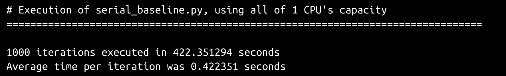
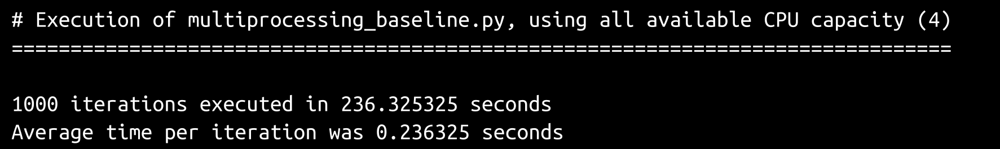
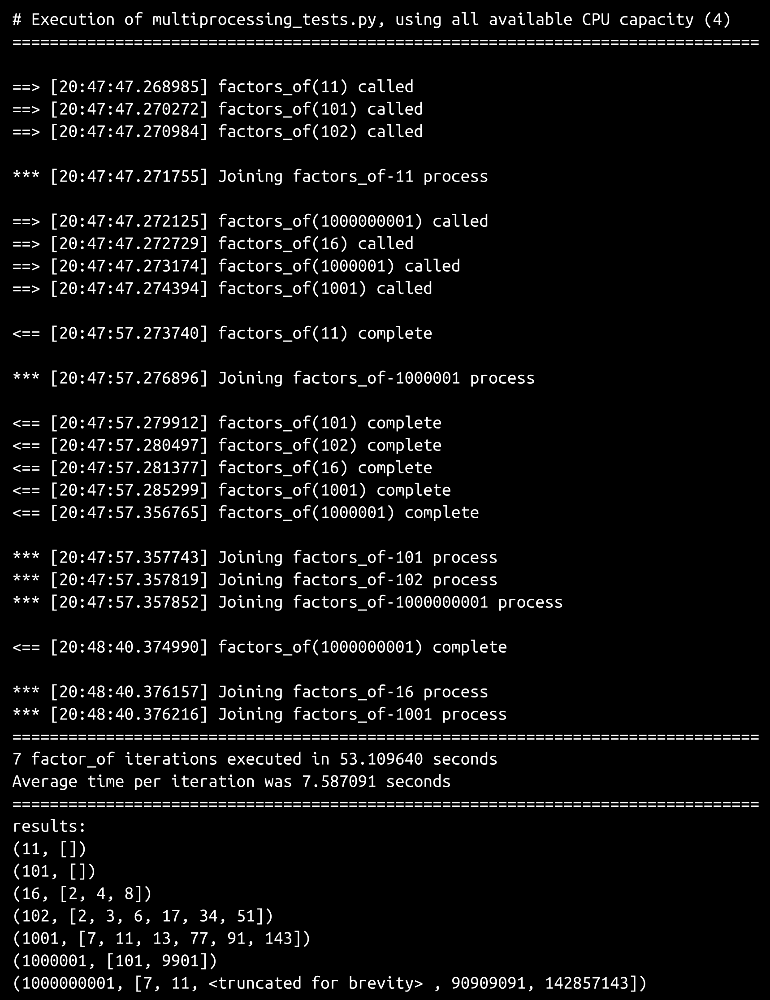
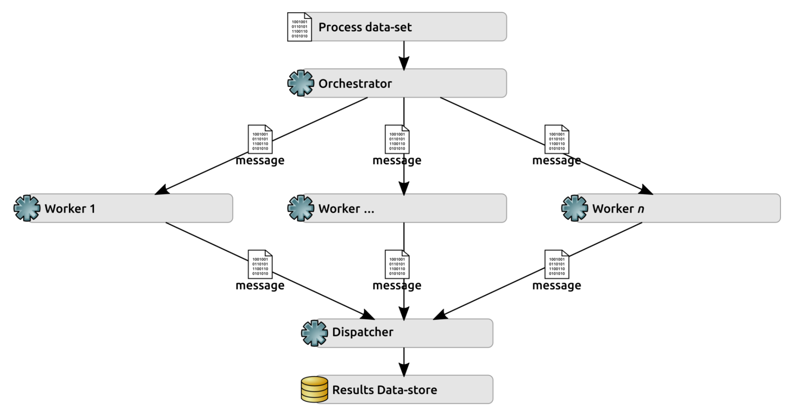
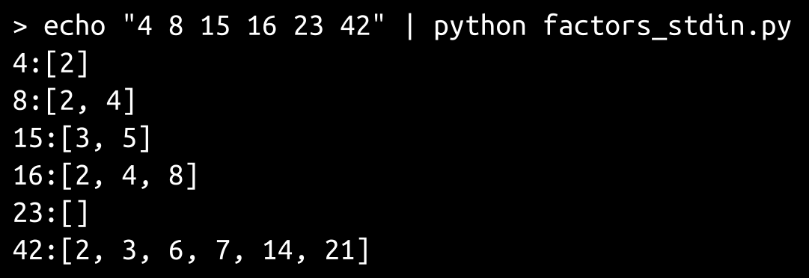
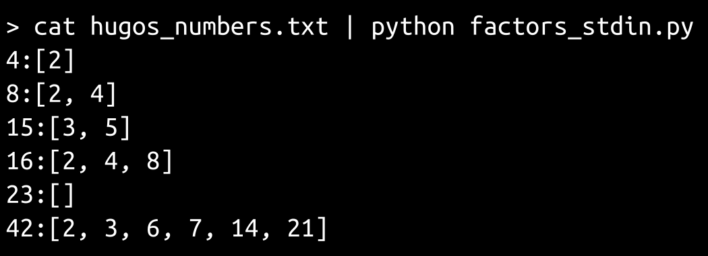
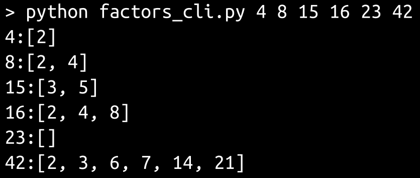

# 第十九章：Python 中的多处理和 HPC

**高性能计算**（**HPC**）简单来说，就是在应用程序执行过程中使用并行处理来将计算负载分布到多个处理器上，通常跨越多台机器。有几种 MPC 策略可供选择，从利用本地多处理器计算机架构的定制应用程序到专用的 MPC 系统，如 Hadoop 或 Apache Spark。

在本章中，我们将探索并应用不同的 Python 功能，从针对数据集中的元素逐个执行基线算法开始，并研究以下主题：

+   构建利用本地可用的多处理器架构的并行处理方法，并使用 Python 的`multiprocessing`模块来限制这些方法

+   定义并实施一种跨多台机器的方法来并行化基线串行过程，从根本上创建一个基本的计算集群

+   探索如何在专用的、行业标准的 HPC 集群中使用 Python 代码

# 需要考虑的共同因素

以并行方式执行的代码在开发过程中还有一些额外的因素需要考虑。第一个考虑因素是程序的输入。如果针对任何一组数据的主要操作被包装在一个函数或方法中，那么数据就被传递给函数。函数执行其需要做的任何事情，然后控制权被交还给调用函数的代码。在并行处理的情况下，同一个函数可能会被调用任意次数，使用不同的数据，控制权以不同于它们开始执行的顺序返回给调用代码。随着数据集变得更大，或者提供更多的处理能力来并行化函数，就必须对调用该函数的方式以及何时（在什么情况下）进行更多的控制，以减少或消除这种可能性。还可能需要控制在任何给定时间内正在处理的数据量，即使只是为了避免使代码运行的机器不堪重负。

这种情况的一个例子似乎是有必要的。考虑对同一个函数的三次调用，都在几毫秒内完成，其中第一次和第三次调用在一秒内完成，但是第二次调用由于某种原因需要十秒钟。对该函数的调用顺序将如下：

+   第一通话

+   第二通话

+   第三通话

然而，它们返回的顺序如下：

+   第一通话（一秒钟后）

+   第三通话（同样是一秒钟后）

+   第二通话（十秒钟后）

潜在的问题是，如果期望函数的返回按照它们被调用的顺序返回，即使只是隐含地如此，对第三通话需要第二通话的依赖，那么期望的数据将不会出现，第三通话将以一种非常令人困惑的方式失败。

这些对输入数据的控制，以及作为结果的并行化过程何时、如何以及多频率执行的控制，有几种名称，但我们将在这里使用术语“编排”。编排可以采用多种形式，从对小数据集的简单循环，为数据集中的每个元素启动并行进程，到大规模的、基于消息的过程请求-响应机制。

还必须对一组并行进程的输出进行详细考虑。Python 中可用的一些并行化方法根本不允许将函数调用的结果直接返回给调用代码（至少目前还不允许）。其他方法可能允许，但只有在活动进程完成并且代码主动附加到该进程时才允许，阻塞对任何其他进程的访问，直到目标进程完成为止。处理输出的更常见策略之一是创建要并行化的进程，使它们成为“发射并忘记”调用——调用函数处理数据的实际处理，并将结果发送到某个共同的目的地。目的地可以包括多进程感知队列（由多进程模块提供的`Queue`类）、将数据写入文件、将结果存储到数据库，或者发送某种异步消息到某个地方，该地方独立于这些进程的编排或执行存储结果。这些进程可能有几种不同的术语，但在这里我们将使用“分派”进行探索。分派也可能在一定程度上受到正在进行的编排进程的控制，或者根据进程的复杂性可能有它们自己的独立编排。

这些过程本身，以及它们的结果的任何后续使用，也需要额外考虑，至少在潜在上是这样。由于最终的目标是让一些独立的进程同时处理数据集的多个元素，而且没有确切的方法来预测任何单个进程可能需要多长时间来完成，因此有很大可能会出现两个或更多个进程以不同的速度解决和分派它们的数据。即使相关数据元素的预期运行时间相同，这也可能是真实的。因此，对于任何给定的元素处理顺序，不能保证结果将以启动对这些元素的进程的相同顺序进行分派。这在分布式处理架构中尤其如此，因为实际执行工作的个别机器可能有其他程序在消耗它们可用的 CPU 周期、内存或其他运行进程所需的资源。

尽可能保持进程和它们的结果的独立性，将在很大程度上有助于减轻特定的担忧。独立的进程不会与或依赖于任何其他进程进行交互，消除了任何跨进程冲突的潜力，而独立的分派则消除了跨结果数据污染的可能性。如果需要具有依赖关系的进程，仍然可以实现，但可能需要额外的工作（很可能是以分派为重点的编排）来防止并行进程的结果可用时产生冲突。

# 一个简单但昂贵的算法

首先，我们需要解决一个问题。为了保持对并行处理的各种机制的关注，该问题的领域需要容易理解。同时，它需要允许处理任意大的数据集，最好是具有不可预测的数据集中每个元素的运行时间，并且结果是不可预测的。为此，我们要解决的问题是确定某个整数值范围内每个数字的所有因子。也就是说，对于任何给定的正整数值`x`，我们希望能够计算并返回`x`能够被整除的所有整数值的列表。计算并返回单个数字的因子列表（`factors_of`）的函数相对简单：

```py
def factors_of(number:(int)) -> (list):
    """
Returns a list of factors of the provided number: 
All integer-values (x) between 2 and number/2 where number % x == 0
"""
    if type(number) != int:
        raise TypeError(
            'factors_of expects a positive integer value, but was passed '
            '"%s" (%s)' % (number, type(number).__name__)
        )
    if number < 1:
        raise ValueError(
            'factors_of expects a positive integer value, but was passed '
            '"%s" (%s)' % (number, type(number).__name__)
        )
    return [
        x for x in range(2, int(number/2) + 1)
        if number % x == 0
    ]
```

虽然这个函数本身只处理一个数字，但调用它多次以处理任何一组数字的过程可以扩展到任意数量的数字，从而在需要时为我们提供任意大的数据集能力。运行时间有些可预测——应该可以对各种范围内的数字得到合理的运行时间估计，尽管它们会根据数字的大小而变化。如果需要一个真正不可预测的运行时间模拟，我们可以预先生成要处理的数字列表，然后逐个随机选择它们。最后，逐个数字的结果是不可预测的。

# 一些测试设置

可能有用的是捕获一组样本数字的运行时信息，比如从`10,000,000`到`10,001,000`，捕获总运行时间和每个数字的平均时间。可以轻松组装一个简单的脚本（`serial_baseline.py`），对每个数字依次执行`factors_of`函数（串行）：

```py
#!/usr/bin/env python
"""serial_baseline.py

Getting data that we can use to estimate how long a factor_of call will 
take for some sample "large" numbers.
"""

print(
    '# Execution of %s, using all of one CPU\'s capacity' % __file__
)
print('='*80)
print()

import time
from factors import factors_of

# - The number we'll start with
range_start = 10000000
# - The number of calls we'll make to the function
range_length = 1000
# - The number that we'll end with - range *stops* at the number 
#   specified without including it in the value-set
range_end = range_start + range_length + 1
# - Keep track of the time that the process starts
start_time = time.time()
# - Execute the function-call the requisite number of times
for number in range(range_start, range_end):
    factors_of(number)
# - Determine the total length of time the process took to execute
run_time = time.time() - start_time
# - Show the relevant data
print(
    '%d iterations executed in %0.6f seconds' % 
    (range_length, run_time)
)
print(
    'Average time per iteration was %0.6f seconds' %
```

```py
    (run_time/range_length)
)
```

假设参与计算过程的所有机器在处理能力方面基本相同，那么这个脚本的输出可以合理估计执行`factors_of`计算对接近`10,000,000`值的数字所需的时间。最初在一台性能强大的新笔记本电脑上测试时，输出如下：



为了后续的测试目的，我们还将创建一个常量测试数字列表（`TEST_NUMBERS`），选择以提供相当广泛的处理时间范围。

```py
TEST_NUMBERS = [
    11,         # Should process very quickly
    16,         # Also quick, and has factors
    101,        # Slower, but still quick
    102,        # Slower, but still quick
    1001,       # Slower still, but still fairly quick
    1000001,    # Visibly longer processing time
    1000000001, # Quite a while
]
```

选择这七个数字是为了提供一系列较大和较小数字，以及调用`factors_of`函数的各个运行时间。由于只有七个数字，任何使用它们的测试运行（而不是前面代码中使用的 1,000 个数字）将需要较少的时间来执行，同时仍然可以在需要时提供一些关于各个运行时间的见解。

# 本地并行处理

本地处理并行化的主要重点将放在`multiprocessing`模块上。还有一些其他模块可能可用于一些并行化工作（这些将在后面讨论），但`multiprocessing`提供了最好的灵活性和能力组合，同时对来自 Python 解释器或其他操作系统级干扰的限制最小。

正如从模块的名称可以预期的那样，`multiprocessing`提供了一个类（`Process`），它便于创建子进程。它还提供了许多其他类，可以用来使与子进程的工作更容易，包括`Queue`（一个多进程感知的队列实现，可用作数据目的地），以及`Value`和`Array`，它们允许单个和多个值（相同类型的）分别存储在跨多个进程共享的内存空间中。

`Process`对象的完整生命周期包括以下步骤：

1.  创建`Process`对象，定义启动时将执行的函数或方法，以及应传递给它的任何参数

1.  启动`Process`，开始执行

1.  加入`Process`，等待进程完成，阻止调用进程的进一步执行，直到它完成

为了比较，创建了一个基于多进程的基准定时测试脚本，相当于`serial_baseline.py`脚本。这两个脚本之间的显着差异始于导入多进程模块：

```py
#!/usr/bin/env python
"""multiprocessing_baseline.py

Getting data that we can use to estimate how long a factor_of call will 
take for some sample "large" numbers.
"""

print(
    '# Execution of %s, using all available CPU capacity (%d)' % 
    (__file__, multiprocessing.cpu_count())
)
print('='*80)

import multiprocessing
import time
```

因为正在创建多个进程，并且因为它们需要在全部创建后进行轮询，所以我们创建了一个`processes`列表，并在创建每个新的`process`时将其附加。在创建进程对象时，我们还指定了一个`name`，这对功能没有影响，但在测试中如果需要显示，这会使事情变得更加方便：

```py
# - Keep track of the processes
processes = []
# - Create and start all the processes needed
for number in range(range_start, range_end):
    process = multiprocessing.Process(
        name='factors_of-%d' % number,
        target=factors_of,
        args=(number,),
    )
    processes.append(process)
    process.start()
```

一旦为每个`process`调用`process.start（）`，它就会在后台启动和运行，直到完成。尽管各个进程在完成后不会终止：但是当调用`process.join（）`并且已加入的进程已完成时，才会发生这种情况。由于我们希望所有进程在加入任何一个进程之前开始执行（这会阻止循环的继续），因此我们单独处理所有的加入-这也给了已启动的每个进程一些时间运行直到完成：

```py
# - Iterate over the entire process-set, and use join() to connect 
#   and wait for them
for process in processes:
    process.join()
```

在与之前的脚本在同一台机器上运行，并且在后台运行相同的程序的情况下，此测试脚本的输出显示了原始运行时间的显着改善：



这是一个改进，即使没有任何驱动它的编排，除了底层操作系统管理的任何东西（它只是将相同的 1,000 个数字传递给调用`factors_of`函数的`Process`实例）：总运行时间约为串行处理所需时间的 55％。

为什么只有 55％？为什么不是 25％，或者至少接近 25％？没有一种编排来控制运行多少进程，这创建了 1,000 个进程，并且在操作系统级别产生了所有相关的开销，并且必须依次给它们每个人一些时间，因此发生了很多上下文切换。更仔细调整的编排过程应该能够减少运行时间，但可能不会减少太多。

朝着有用的多进程解决方案迈出的下一步将是实际能够检索子进程操作的结果。为了提供一些实际发生的可见性，我们还将通过整个过程打印几个项目。我们还将随机排列测试数字的顺序，以便每次运行都以不同的顺序执行它们，这将（通常）显示进程是如何交织在一起的：

```py
#!/usr/bin/env python
"""multiprocessing_tests.py
Also prints several bits of information as it runs, but those 
can be removed once their purpose has been served
"""

import multiprocessing
import random
# - If we want to simulate longer run-times later for some reason, 
#   this will need to be uncommented
# import time

from datetime import datetime
```

我们将使用之前设置的`TEST_NUMBERS`，并将它们随机排列成一个列表：

```py
# - Use the small, fixed set of numbers to test with:
from factors import TEST_NUMBERS
# - Randomize the sequence of numbers
TEST_NUMBERS.sort(key=lambda i:random.randrange(1,1000000))
```

为了实际捕获结果，我们需要一个可以在计算时发送它们的地方：`multiprocessing.Queue`的一个实例：

```py
queue = multiprocessing.Queue()
```

如前所述，结果`queue`对象存储在顶级进程（`multiprocessing_tests.py`脚本）和所有子`Process`对象的进程都可以访问的内存中。

由于我们将把结果存储在`queue`对象中，因此需要修改`factors_of`函数来处理这一点。我们还将添加一些“print（）”调用来显示函数何时被调用以及何时完成其工作：

```py
def factors_of(number:(int)) -> (list):
    """
Returns a list of factors of the provided number: 
All integer-values (x) between 2 and number/2 where number % x == 0
"""
    print(
        '==> [%s] factors_of(%d) called' % 
        (datetime.now().strftime('%H:%M:%S.%f'), number)
    )
```

类型和值检查保持不变：

```py
    if type(number) != int:
        raise TypeError(
            'factors_of expects a positive integer value, but was passed '
            '"%s" (%s)' % (number, type(number).__name__)
        )
    if number < 1:
        raise ValueError(
            'factors_of expects a positive integer value, but was passed '
            '"%s" (%s)' % (number, type(number).__name__)
        )
# - If we want to simulate longer run-times later for some reason, 
#   this will need to be uncommented
#    time.sleep(10)
```

`number`的因子的实际计算保持不变，尽管我们将结果分配给一个变量，而不是返回它们，以便我们可以在函数完成时以不同的方式处理它们：

```py
    factors = [
            x for x in range(2, int(number/2) + 1)
            if number % x == 0
        ]
    print(
        '<== [%s] factors_of(%d) complete' % 
        (datetime.now().strftime('%H:%M:%S.%f'), number)
    )
```

我们将使用`queue.put（）`而不是返回计算的值，将它们添加到`queue`正在跟踪的结果中。`queue`对象并不特别关心添加到其中的数据是什么-任何对象都将被接受-但是为了保持一致性，并确保每个发送回来的结果都具有该数字和该数字的因子，我们将`put`一个具有这两个值的`tuple`：

```py
    queue.put((number, factors))
```

准备好所有这些后，我们可以开始测试脚本的主体：

```py
print(
    '# Execution of %s, using all available CPU capacity (%d)' % 
    (__file__, multiprocessing.cpu_count())
)
print('='*80)
print()
```

我们需要跟踪开始时间以便稍后计算运行时间：

```py
start_time = time.time()
```

创建和启动调用`factors_of`的进程与之前使用的基本结构相同：

```py
processes = []
for number in TEST_NUMBERS:
    # - Thread has been created, but not started yet
    process = multiprocessing.Process(
        name='factors_of-%d' % number,
        target=factors_of,
        args=(number,),
    )
    # - Keeping track of the individual threads
    processes.append(process)
    # - Starting the current thread
    process.start()
```

此时，我们有一组已启动但可能不完整的子进程在后台运行。如果最初创建和启动的几个进程是针对较小的数字，它们可能已经完成，只是在等待`join()`来完成它们的执行并终止。另一方面，如果*较大*的数字是第一个被执行的，那么第一个子进程可能会在一段时间内继续运行，而其他具有较短单独运行时间的进程可能会在后台空转，等待`join()`。无论如何，我们可以简单地迭代进程项列表，并依次`join()`每个进程，直到它们全部完成：

```py
for process in processes:
    print(
        '*** [%s] Joining %s process' % 
        (datetime.now().strftime('%H:%M:%S.%f'), process.name)
    )
    process.join()
```

一旦所有的`join()`调用都完成了，`queue`将会以任意顺序包含所有数字的结果。子进程的繁重工作已经全部完成，所以我们可以计算最终的运行时间并显示相关信息：

```py
# - Determine the total length of time the process took to execute
run_time = time.time() - start_time
# - Show the relevant data
print('='*80)
print(
    '%d factor_of iterations executed in %0.6f seconds' % 
    (len(TEST_NUMBERS), run_time)
)
print(
    'Average time per iteration was %0.6f seconds' % 
    (run_time/len(TEST_NUMBERS))
)
```

实际访问结果，本例中仅用于显示目的，需要调用队列对象的`get`方法——每次`get`调用都会获取并移除队列中之前放入的一个项目，现在我们可以简单地打印`queue.get()`直到`queue`为空为止：

```py
print('='*80)
print('results:')
while not queue.empty():
    print(queue.get())
```

在测试运行结果中有几个值得注意的项目，如下图所示：



所有以`==>`开头的行显示了在运行过程中`factors_of`函数的调用发生的位置。毫不奇怪，它们都在进程的开始附近。以`***`开头的行显示了进程的加入位置——其中一个发生在`Process`创建事件的中间。以`<==`开头的行显示了`factors_of`的调用完成位置，之后它们保持空闲状态，直到对应的`process.join()`被调用。

根据对`factors_of`的调用，测试数字的随机序列是`11, 101, 102`, `1000000001`, `16`, `1000001`和`1001`。完成的调用序列是 11, `101`, `102`, `16`, `1001`, `1000001`和`100000000`——一个略有不同的序列，*joins*序列（因此最终**结果**的序列）也略有不同。所有这些都证实了各个进程独立于主进程（`for number in TEST_NUMBERS`循环）开始、执行和完成。

有了`Queue`实例，并建立了一种访问子进程结果的方式，这就是基本的本地多进程并行化所需的一切。如果有功能需求，还有一些可以调整或增强的地方：

+   如果需要限制活跃子进程的数量，或者对它们的创建、启动和加入进行更精细的控制，可以构建一个更结构化的编排器：

+   允许的进程数量可以根据机器上可用的 CPU 数量进行限制，可以使用`multiprocessing.cpu_count()`来获取。

+   无论进程数量是如何确定的，限制活跃进程的数量可以通过多种方式进行管理，包括使用一个`Queue`来处理挂起的请求，另一个用于结果，第三个用于准备加入的请求。覆盖每个`Queue`对象的`put`方法，以便检查其他队列的状态，并在这些其他队列中触发适当的操作/代码，可以让单个队列控制整个过程。

+   编排功能本身可以包装在一个`Process`中，与分发子进程数据后可能需要的任何数据处理也可以包装在`Process`中。

+   多进程模块还提供了其他对象类型，可能对某些多进程场景有用，包括以下内容：

+   `multiprocessing.pool.Pool`类——提供/控制一组工作进程的对象，可以向其提交作业，支持异步结果、超时和回调等功能

+   提供多种管理器对象选项，可以在不同进程之间共享数据，包括在不同机器上运行的进程之间通过网络共享

# 线程

Python 还有另一个本地并行化库——`thread`。它提供的`thread`对象的创建和使用方式与`multiprocessing.Process`对象的方式非常相似，但基于线程的进程在与父进程相同的内存空间中运行，而`Process`对象在启动时实际上会创建一个新的 Python 解释器实例（具有与父 Python 解释器的一些连接能力）。

因为线程在同一个解释器和内存空间中运行，它们无法像“进程”一样访问多个处理器。

线程对机器上多个 CPU 的访问是由用于运行代码的 Python 解释器的功能决定的。随 Python 一起提供的标准解释器（CPython）和另一种选择的 PyPy 解释器都共享这一限制。IronPython 是在.NET 框架下运行的解释器，而 Jython 在 Java 运行时环境中运行，它们没有这种限制。

基于线程的并行化也更有可能遇到与 Python 的全局解释器锁（GIL）冲突。GIL 积极地阻止多个线程同时执行或更改相同的 Python 字节码。除了一些潜在的长时间运行的进程，这些进程发生在 GIL 的控制之外——如 I/O、网络、一些图像处理功能以及各种库，如 NumPy——除了这些例外，任何大部分执行时间用于解释或操作 Python 字节码的多线程 Python 程序最终都会遇到 GIL 瓶颈，从而失去其并行化。

有关 GIL 的更多信息，为什么存在，它的作用等等，可以在 Python 维基上找到[`wiki.python.org/moin/GlobalInterpreterLock`](https://wiki.python.org/moin/GlobalInterpreterLock)。

# 跨多台机器并行化

另一种常见的并行化策略是将计算过程的工作负载分布到多台机器（物理或虚拟）上。在本地并行化受到限制的情况下，最终受限于单台机器上的 CPU 数量、核心数量或两者的组合，机器级并行化受限于可以用于解决问题的机器数量。在当今这个时代，有大量的虚拟机可以在公共云和私人数据中心中提供，相对容易地将可用机器的数量扩展到与问题的计算需求相匹配的数量。

这种类型的横向可扩展解决方案的基本设计比本地解决方案的设计更复杂——它必须完成相同的任务，但要分离执行这些任务的能力，以便它们可以在任意数量的机器上使用，并提供执行进程和接受远程任务完成时的结果的机制。为了具有合理的容错能力，还需要更多地了解远程进程机器的状态，并且这些机器必须主动向中央控制器发送通知，以防发生会干扰它们工作能力的事件。典型的逻辑架构在高层次上看起来是这样的：



在这里：

+   编排器是在一台机器上运行的进程，负责获取进程数据集的部分，并将其发送给下一个可用的工作节点。

+   它还跟踪可用的工作节点，可能还跟踪每个工作节点的容量。

+   为了实现这一点，Orchestrator 必须能够注册和注销 Worker 节点。

+   Orchestrator 可能还需要跟踪每个 Worker 节点的一般健康/可用性，并能够将任务与这些节点关联起来——如果一个节点变得不可用，并且仍有待处理的任务，那么它可以重新分配这些任务给其他可用的 Worker 节点。

+   每个 Worker 节点是在单独的机器上运行的进程，当运行时，它接受传入消息项中的进程指令，执行生成结果所需的进程，并在完成时向 Dispatcher 发送结果消息。

+   每个 Worker 节点还必须在变为可用时向 Orchestrator 宣布，以便注册，并在正常关闭时通知 Orchestrator，以便相应地注销它。

+   如果由于错误而无法处理传入消息，Worker 还应该能够将该信息传回 Orchestrator，使其在可能时将任务重新分配给另一个 Worker。

+   Dispatcher 是在一台机器上运行的进程，负责接受结果消息数据，并根据需要执行相应的操作——将其存储在数据库中，写入文件等。Dispatcher 可以是同一台机器，甚至是 Orchestrator 的同一进程——只要处理与调度相关的消息项得到适当处理，而不会拖累编排过程，它在哪里都可以。

这种系统的基本结构可以使用已经在第十六章中展示的代码来实现，*工匠网关服务*：

+   Orchestrator 和 Worker 节点可以被实现为类似于`ArtisanGatewayDaemon`的守护进程。如果确定 Dispatcher 需要独立，它也可以是类似的守护进程。

+   它们之间的消息传递可以使用`DaemonMessage`对象的变体来处理，提供相同的签名消息安全性，通过 RabbitMQ 消息系统传输。

+   该消息传输过程可以利用已经定义的`RabbitMQSender`类（也来自第十六章，*工匠网关服务*）。

这种方法的完整实现超出了本书的范围，但它的关键方面可以被详细检查，以便读者如果愿意的话可以编写实现。

# 共同功能

现有的`DaemonMessage`类需要被修改或重写，以接受 Orchestrator、Worker 和 Dispatcher 级别的不同操作，创建适用于每个级别的新的`namedtuple`常量。最初，Worker 节点只关心接受对其`factors_of`方法的调用，其允许的操作将反映这一点：

```py
WORKER_OPERATIONS = namedtuple(
    'WORKER_OPERATIONS', ['factors_of',]
)
(
    factors_of='factors_of',
)
```

操作属性的 setter 方法对应的更改可以使用适当的`namedtuple`常量来控制接受的值（例如，以某种方式用`WORKER_OPERATIONS`替换`_OPERATIONS`，以适用于 Worker 节点的实现）：

```py
    def _set_operation(self, value:str) -> None:
# - Other operations would need to be added 
        if not value in _OPERATIONS:
            raise ValueError(
                '%s.operation expects a string value (one of '
                '"%s"), but was passed "%s" (%s)' % 
                (
                    self.__class__.__name__, 
                    '", "'.join(_OPERATIONS._fields), 
                    value, type(value).__name__
                )
            )
        self._operation = value
```

同样，这三个组件可能需要了解所有可能的`origin`值，以便能够适当地分配消息来源：

```py
MESSAGE_ORIGINS = namedtuple(
    'MESSAGE_ORIGINS', ['orchestrator', 'worker', 'dispatcher']
)
(
    orchestrator='orchestrator',
    worker='worker',
    dispatcher='dispatcher',
)
```

任何单个守护进程的`main`方法基本上与`ArtisanGatewayDaemon`的实现方式保持不变。

在这种方法中，每个守护进程类（Worker 节点、Orchestrator 和 Dispatcher）只有少数几个类成员的不同变体，但由于它们的独特性，值得注意。大部分差异在于每个守护进程类的`_handle_message`方法中，每个都必须实现自己的实例方法，以将其映射到的操作。

# Worker 节点

在前一节为假设的工作节点守护进程定义的所有操作都必须在类的`_handle_message`方法中处理——起初，这只是`factors_of`方法：

```py
    def _handle_message(self, message:(DaemonMessage,)) -> None:
        self.info(
            '%s._handle_message called:' % self.__class__.__name__
        )
        target = message.data.get('target')
        self.debug('+- target ....... (%s) %s' % (
            type(target).__name__, target)
        )
        self.debug('+- operation .... (%s) %s' % (
            type(message.operation).__name__, message.operation)
        )
        if message.operation == WORKER_OPERATIONS.factors_of:
            self.factors_of(message)
        else:
            raise RuntimeError(
                '%s error: "%s" (%s) is not a recognized '
                'operation' % 
                (
                    self.__class__.__name__, message.operation, 
                    type(message.operation).__name__
                )
            )
```

`factors_of`方法的实现与本章开头定义的`factors_of`函数并无实质性不同，只是它必须将结果消息发送到调度程序的消息队列，而不是返回一个值：

```py
    def factors_of(self, number):

        # ... code that generates the results

        # - Assuming that the configuration for RabbitMQSender 
        #   is handled elsewhere, we can just get a new instance
        sender = RabbitMQSender()
        outbound_message = DaemonMessage(
            operation=dispatch_results,
            origin=MESSAGE_ORIGINS.worker,
            data={
                'number':number,
                'factors':factors,
            },
            signing_key=self.signing_key
        )
        sender.send_message(outbound_message, self.dispatcher_queue)
```

工作节点守护进程需要在它们的`preflight`和`cleanup`方法中通知编排者它们何时变为可用和不可用：

```py
def preflight(self):
    """
Sends a message to the orchestrator to indicate that the instance is 
no longer available
"""
        # - Assuming that the configuration for RabbitMQSender 
        #   is handled elsewhere, we can just get a new instance
        sender = RabbitMQSender()
        outbound_message = DaemonMessage(
            operation=ORCHESTRATOR_OPERATIONS.register_worker,
            origin=MESSAGE_ORIGINS.worker,
            data={
                'worker_id':self.worker_id,
                'max_capacity':1,
            },
            signing_key=self.signing_key
        )
        sender.send_message(outbound_message, self.orchestrator_queue)

def cleanup(self):
    """
Sends a message to the orchestrator to indicate that the instance is 
no longer available
"""
        # - Assuming that the configuration for RabbitMQSender 
        #   is handled elsewhere, we can just get a new instance
        sender = RabbitMQSender()
        outbound_message = DaemonMessage(
            operation=DISPATCH_OPERATIONS.unregister_worker,
            origin=MESSAGE_ORIGINS.worker,
            data={
                'worker_id':self.worker_id,
            },
            signing_key=self.signing_key
        )
        sender.send_message(outbound_message, self.orchestrator_queue)
```

他们还必须实现这些方法使用的`dispatcher_queue`、`worker_id`和`orchestrator_queue`属性，提供工作节点的唯一标识符（可以简单地是一个随机的`UUID`）和共同的编排者和调度程序队列名称（可能来自一个对所有工作节点实例都通用的配置文件）。

# 编排者

编排者将关注注册、注销和脉冲操作（允许工作节点向编排者发送消息，基本上是在说“我还活着”）：

```py
ORCHESTRATOR_OPERATIONS = namedtuple(
    'ORCHESTRATOR_OPERATIONS', [
        'register_worker', 'unregister_worker', 'worker_pulse'
    ]
)
(
    register_worker='register_worker',
    unregister_worker='unregister_worker',
    worker_pulse='worker_pulse',
)
```

编排者的`_handle_message`必须将每个操作映射到适当的方法：

```py
    def _handle_message(self, message:(DaemonMessage,)) -> None:
        self.info(
            '%s._handle_message called:' % self.__class__.__name__
        )

        # ...

        if message.operation == ORCHESTRATOR_OPERATIONS.register_worker:
            self.register_worker(message)
        elif message.operation == ORCHESTRATOR_OPERATIONS.unregister_worker:
            self.unregister_worker(message)
        elif message.operation == ORCHESTRATOR_OPERATIONS.worker_pulse:
            self.worker_pulse(message)
        else:
            raise RuntimeError(
                '%s error: "%s" (%s) is not a recognized '
                'operation' % 
                (
                    self.__class__.__name__, message.operation, 
                    type(message.operation).__name__
                )
            )
```

# 调度程序

最初，如果调度程序是独立进程而不是合并到编排者中，它将只关注调度结果操作：

```py
DISPATCH_OPERATIONS = namedtuple(
    'DISPATCH_OPERATIONS', ['dispatch_results',]
)
(
    dispatch_results='dispatch_results',
)
```

它的`_handle_message`方法将相应地构建：

```py
    def _handle_message(self, message:(DaemonMessage,)) -> None:
        self.info(
            '%s._handle_message called:' % self.__class__.__name__
        )

        # ...

        if message.operation == DISPATCH_OPERATIONS.dispatch_results:
            self.dispatch_results(message)
        else:
            raise RuntimeError(
                '%s error: "%s" (%s) is not a recognized '
                'operation' % 
                (
                    self.__class__.__name__, message.operation, 
                    type(message.operation).__name__
                )
            )
```

# 将 Python 与大规模集群计算框架集成

大规模的集群计算框架，为了尽可能与自定义的操作兼容，可能只接受两种不同的输入方式：作为命令行参数，或者使用标准输入，后者更常见于针对大数据操作的系统。无论哪种情况，允许自定义进程在集群环境中执行并扩展所需的是一个自包含的命令行可执行文件，通常将其数据返回到标准输出。

一个接受标准输入的最小脚本——无论是通过管道传递数据进入它，还是通过读取文件内容并使用——可以这样实现：

```py
#!/usr/bin/env python
"""factors_stdin.py

A command-line-ready script that allows factors_of to be called with 

> {incoming list of numbers} | python factors_stdin.py

which executes factors_of against the provided numbers and prints the 
result FOR EACH NUMBER in the format

number:[factors-of-number]
"""
```

标准输入可以通过 Python 的`sys`模块作为`sys.stdin`获得。它是一个类似文件的对象，可以按行读取和迭代：

```py
from sys import stdin
```

`factors_of`函数应该直接包含在脚本代码中，这样整个脚本就是完全自包含的，不需要任何自定义软件安装即可使用。为了使代码更短、更易于阅读，我们只是导入它：

```py
from factors import factors_of
```

如果脚本直接执行——`python factors_stdin.py`——那么我们实际上会执行该进程，首先从`stdin`获取所有数字。它们可能作为多行输入，每行可能有多个数字，所以第一步是提取所有数字，这样我们就得到一个要处理的数字列表：

```py
if __name__ == '__main__':
    # - Create a list of stdin lines - multi-line input is 
    #   common enough that it needs to be handled
    lines = [line.strip() for line in stdin]
    # - We need the numbers as individual values, though, so 
    #   build a list of them that we'll actually execute against
    numbers = []
    for line in lines:
        numbers += [n for n in line.split(' ') if n]
```

有了所有准备好的数字，我们可以对它们进行迭代，将输入中的每个值从字符串值转换为实际的`int`，并对它们进行处理。如果输入中的值无法转换为`int`，我们暂时将其跳过，尽管根据调用集群框架的不同，可能有特定的方法来处理——或至少记录——任何错误的值：

```py
    for number in numbers:
        try:
            number = int(number)
        except Exception as error:
            pass
        else:
            # - We've got the number, so execute the function and 
            #   print the results
            print('%d:%s' % (number, factors_of(number)))
```

可以通过回显数字列表并将其传输到`python factors_stdin.py`来测试脚本。结果将被打印，每行一个结果，这将被调用程序接受为标准输出，准备传递给接受标准输入的其他进程：



如果源数字在一个文件中（在本章代码中为`hugos_numbers.txt`），那么它们可以同样轻松地使用，并生成相同的结果：



如果集群环境期望传递命令行参数，那么可以编写一个脚本来适应这一点。它从很大程度上与相同的代码开始：

```py
#!/usr/bin/env python
"""factors_cli.py

A command-line-ready script that allows factors_of to be called with 

> python factors_cli.py number [number [number]] ...

which executes factors_of against the provided numbers and 
prints the results for each in the format

number:[factors-of-number]
"""

from factors import factors_of
from sys import argv
```

它的不同之处在于获取要处理的数字。由于它们作为命令行值传递，它们将成为`argv`列表的一部分（Python 的`sys`模块提供的另一个项目），在脚本名称之后。这个过程的平衡与基于`stdin`的脚本完全相同：

```py
if __name__ == '__main__':
    # - Get the numbers from the arguments
    numbers = argv[1:]
    for number in numbers:
        try:
            number = int(number)
        except Exception as error:
            # - Errors should probably be logged in some fashion, 
            #   but the specifics may well vary across different
            #   systems, so for now we'll just pass, skipping anything 
            #   that can't be handled.
            pass
        else:
            # - We've got the number, so execute the function and 
            #   print the results
            print('%d:%s' % (number, factors_of(number)))
```

与之前的脚本一样，输出只是简单地打印到控制台，并且会被传递给任何其他进程作为标准输入。



# Python、Hadoop 和 Spark

大规模集群计算框架中最常见或最受欢迎的可能是 Hadoop。Hadoop 是一组软件，提供了网络计算机上的集群计算能力，以及可以被视为网络可访问文件系统的分布式存储机制。

它提供的实用程序之一是 Hadoop Streaming（[`hadoop.apache.org/docs/r1.2.1/streaming.html`](https://hadoop.apache.org/docs/r1.2.1/streaming.html)），它允许使用任何可执行文件或脚本作为映射器和/或减速器来创建和执行 Map/Reduce 作业。至少对于可以使用 Streaming 的进程，Hadoop 的操作模型是以文件为中心的，因此在 Hadoop 下编写并执行的进程往往更多地属于我们之前讨论过的基于`stdin`的类别。

Apache Spark 是大规模集群计算框架领域的另一个选择。Spark 是一个分布式的通用框架，并且有一个 Python API（`pyspark`，[`spark.apache.org/docs/2.2.0/api/python/pyspark.html`](http://spark.apache.org/docs/2.2.0/api/python/pyspark.html)）可用于使用`pip`进行安装，从而更直接地访问其功能。

# 总结

在本章中，我们已经涵盖了 Python 中多处理的所有基本排列（串行和并行，本地和远程/分布式），因为它适用于自定义 HPC 操作。将 Python 编写的进程集成到 Hadoop 等大规模集群计算系统中所需的基础知识非常基础——简单的可执行脚本——并且与这些系统的集成前景与系统本身一样多样。
