# 第一章：网络爬虫基础知识

在本章中，我们将学习和探讨与网络爬取和基于网络的技术相关的某些基本概念，假设您没有网络爬取的先验经验。

因此，让我们从以下一些问题开始：

+   为什么会出现对数据的不断增长需求？

+   我们将如何管理和满足来自“万维网”（WWW）资源的数据需求？

网络爬虫解决了这两个问题，因为它提供了各种工具和技术，可以用来提取数据或协助信息检索。无论是基于网络的结构化数据还是非结构化数据，我们都可以使用网络爬虫过程来提取数据，并将其用于研究、分析、个人收藏、信息提取、知识发现等多种目的。

我们将学习通用技术，用于从网络中查找数据，并在接下来的章节中使用 Python 编程语言深入探讨这些技术。

在本章中，我们将涵盖以下主题：

+   网络爬虫介绍

+   了解网络开发和技术

+   数据查找技术

# 网络爬虫介绍

爬取是从网络中提取、复制、筛选或收集数据的过程。从网络（通常称为网站、网页或与互联网相关的资源）中提取或提取数据通常被称为“网络爬取”。

网络爬虫是一种适用于特定需求的从网络中提取数据的过程。数据收集和分析，以及其在信息和决策制定中的参与，以及与研究相关的活动，使得爬取过程对所有类型的行业都很敏感。

互联网及其资源的普及每天都在引起信息领域的演变，这也导致了对原始数据的不断增长需求。数据是科学、技术和管理领域的基本需求。收集或组织的数据经过不同程度的逻辑处理，以获取信息并获得进一步的见解。

网络爬虫提供了用于根据个人或业务需求从网站收集数据的工具和技术，但需要考虑许多法律因素。

在执行爬取任务之前，有许多法律因素需要考虑。大多数网站包含诸如“隐私政策”、“关于我们”和“条款和条件”等页面，其中提供了法律条款、禁止内容政策和一般信息。在计划从网站进行任何爬取和抓取活动之前，开发者有道德责任遵守这些政策。

在本书的各章中，爬取和抓取两个术语通常可以互换使用。抓取，也称为蜘蛛，是用于浏览网站链接的过程，通常由搜索引擎用于索引目的，而爬取大多与从网站中提取内容相关。

# 了解网络开发和技术

网页不仅仅是一个文档容器。当今计算和网络技术的快速发展已经将网络转变为动态和实时的信息来源。

在我们这一端，我们（用户）使用网络浏览器（如 Google Chrome、Firefox Mozilla、Internet Explorer 和 Safari）来从网络中获取信息。网络浏览器为用户提供各种基于文档的功能，并包含对网页开发人员通常有用的应用级功能。

用户通过浏览器查看或浏览的网页不仅仅是单个文档。存在各种技术可用于开发网站或网页。网页是包含 HTML 标记块的文档。大多数情况下，它是由各种子块构建而成，这些子块作为依赖或独立组件来自各种相互关联的技术，包括 JavaScript 和 CSS。

对网页的一般概念和网页开发技术的理解，以及网页内部的技术，将在抓取过程中提供更多的灵活性和控制。很多时候，开发人员还可以使用反向工程技术。

反向工程是一种涉及分解和检查构建某些产品所需概念的活动。有关反向工程的更多信息，请参阅 GlobalSpec 文章*反向工程是如何工作的？*，网址为[`insights.globalspec.com/article/7367/how-does-reverse-engineering-work`](https://insights.globalspec.com/article/7367/how-does-reverse-engineering-work)。

在这里，我们将介绍和探讨一些可以帮助和指导我们进行数据提取过程的技术。

# HTTP

**超文本传输协议**（**HTTP**）是一种应用协议，用于在客户端和 Web 服务器之间传输资源，例如 HTML 文档。HTTP 是一种遵循客户端-服务器模型的无状态协议。客户端（Web 浏览器）和 Web 服务器使用 HTTP 请求和 HTTP 响应进行通信或交换信息：

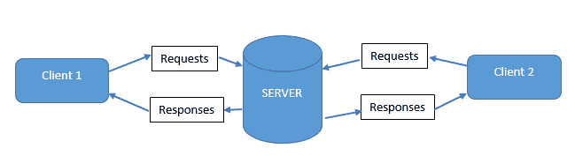

HTTP（客户端-服务器通信）

通过 HTTP 请求或 HTTP 方法，客户端或浏览器向服务器提交请求。有各种方法（也称为 HTTP 请求方法）可以提交请求，例如`GET`、`POST`和`PUT`：

+   `GET`：这是请求信息的常见方法。它被认为是一种安全方法，因为资源状态不会被改变。此外，它用于提供查询字符串，例如`http://www.test-domain.com/`，根据请求中发送的`id`和`display`参数从服务器请求信息。

+   `POST`：用于向服务器发出安全请求。所请求的资源状态*可以*被改变。发送到请求的 URL 的数据不会显示在 URL 中，而是与请求主体一起传输。它用于以安全的方式向服务器提交信息，例如登录和用户注册。

使用浏览器开发者工具显示的以下屏幕截图，可以显示请求方法以及其他与 HTTP 相关的信息：

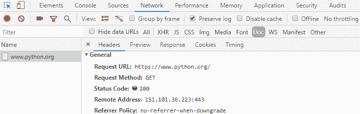

一般的 HTTP 头（使用浏览器开发者工具访问）

我们将在第二章中更多地探讨 HTTP 方法，

*Python 和 Web-使用 urllib 和 Requests*，在*实现 HTTP 方法*部分。

**HTTP 头**在请求或响应过程中向客户端或服务器传递附加信息。头通常是客户端和服务器在通信过程中传输的信息的名称-值对，并且通常分为请求头和响应头：

+   请求头：这些是用于发出请求的头。在发出请求时，会向服务器提供诸如语言和编码请求 `-*`、引用者、cookie、与浏览器相关的信息等信息。以下屏幕截图显示了在向[`www.python.org`](https://www.python.org)发出请求时从浏览器开发者工具中获取的请求头：

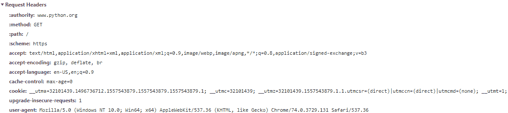

请求头（使用浏览器开发者工具访问）

+   响应头：这些头包含有关服务器响应的信息。响应头通常包含有关响应的信息（包括大小、类型和日期）以及服务器状态。以下屏幕截图显示了在向[`www.python.org`](https://www.python.org)发出请求后从浏览器开发者工具中获取的响应头：

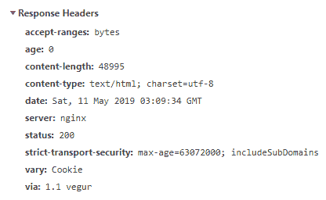

响应头（使用浏览器开发者工具访问）

在之前的屏幕截图中看到的信息是在对[`www.python.org`](https://www.python.org)发出的请求期间捕获的。

在向服务器发出请求时，还可以提供所需的 HTTP 头部。通常可以使用 HTTP 头部信息来探索与请求 URL、请求方法、状态代码、请求头部、查询字符串参数、cookie、`POST`参数和服务器详细信息相关的信息。

通过**HTTP 响应**，服务器处理发送到它的请求，有时也处理指定的 HTTP 头部。当接收并处理请求时，它将其响应返回给浏览器。

响应包含状态代码，其含义可以使用开发者工具来查看，就像在之前的屏幕截图中看到的那样。以下列表包含一些状态代码以及一些简要信息：

+   200（OK，请求成功）

+   404（未找到；请求的资源找不到）

+   500（内部服务器错误）

+   204（无内容发送）

+   401（未经授权的请求已发送到服务器）

有关 HTTP、HTTP 响应和状态代码的更多信息，请参阅官方文档[`www.w3.org/Protocols/`](https://www.w3.org/Protocols/)和[`developer.mozilla.org/en-US/docs/Web/HTTP/Status`](https://developer.mozilla.org/en-US/docs/Web/HTTP/Status)。

**HTTP cookie**是服务器发送给浏览器的数据。cookie 是网站在您的系统或计算机上生成和存储的数据。cookie 中的数据有助于识别用户对网站的 HTTP 请求。cookie 包含有关会话管理、用户偏好和用户行为的信息。

服务器根据存储在 cookie 中的信息来识别并与浏览器通信。cookie 中存储的数据帮助网站访问和传输某些保存的值，如会话 ID、过期日期和时间等，从而在 web 请求和响应之间提供快速交互：

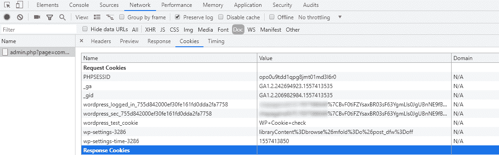

网站设置的 cookie（使用浏览器开发者工具访问）有关 cookie 的更多信息，请访问[`www.allaboutcookies.org/`](http://www.allaboutcookies.org/)的 AboutCookies 和[`www.allaboutcookies.org/`](http://www.allaboutcookies.org/)的 allaboutcookies。

通过**HTTP 代理**，代理服务器充当客户端和主要 web 服务器之间的中间服务器。网页浏览器发送的请求实际上是通过代理传递的，代理将服务器的响应返回给客户端。

代理通常用于监视/过滤、性能改进、翻译和互联网相关资源的安全性。代理也可以作为一种服务购买，也可以用来处理跨域资源。还有各种形式的代理实现，比如网页代理（可以用来绕过 IP 封锁）、CGI 代理和 DNS 代理。

通过使用`GET`请求传递的基于 cookie 的参数、HTML 表单相关的`POST`请求以及修改或调整头部，在网页抓取过程中管理代码（即脚本）和访问内容将至关重要。

有关 HTTP、头部、cookie 等的详细信息将在即将到来的*网络数据查找技术*部分中更详细地探讨。请访问 MDN web docs-HTTP ([`developer.mozilla.org/en-US/docs/Web/HTTP`](https://developer.mozilla.org/en-US/docs/Web/HTTP))获取有关 HTTP 的更详细信息。

# HTML

网站由包含文本、图像、样式表和脚本等内容的页面或文档组成。它们通常是用标记语言（如**超文本标记语言**（**HTML**）和**可扩展超文本标记语言**（**XHTML**））构建的。

HTML 通常被称为用于构建网页的标准标记语言。自上世纪 90 年代初以来，HTML 已经独立使用，也与基于服务器的脚本语言（如 PHP、ASP 和 JSP）一起使用。

XHTML 是 HTML 的高级和扩展版本，是用于 Web 文档的主要标记语言。XHTML 也比 HTML 更严格，从编码的角度来看，它是一个 XML 应用程序。

HTML 定义并包含网页的内容。可以在 HTML 页面中找到可以提取的数据，以及任何揭示信息的数据源，这些数据源位于预定义的指令集或标记元素**标签**内。HTML 标签通常是一个带有特定预定义属性的命名占位符。

# HTML 元素和属性

HTML 元素（也称为文档节点）是 Web 文档的构建块。HTML 元素由开始标签`<..>`和结束标签`</..>`以及其中的特定内容构成。HTML 元素也可以包含属性，通常定义为`attribute-name = attribute-value`，提供额外的信息给元素：

```py
<p>normal paragraph tags</p>
<h1>heading tags there are also h2, h3, h4, h5, h6</h1>
<a href="https://www.google.com">Click here for Google.com</a>

<br />
```

前面的代码可以分解如下：

+   `<p>`和`<h1>` HTML 元素包含一般文本信息（元素内容）。

+   `<a>`定义了一个包含实际链接的`href`属性，当点击文本`点击这里前往 Google.com`时将被处理。链接指向[`www.google.com/`](https://www.google.com/)。

+   ``图像标签也包含一些属性，比如`src`和`alt`，以及它们各自的值。`src`保存资源，即图像地址或图像 URL 作为值，而`alt`保存``的替代文本的值。

+   `<br />`代表 HTML 中的换行，没有属性或文本内容。它用于在文档的布局中插入新行。

HTML 元素也可以以树状结构嵌套，具有父子层次结构：

```py
<div>
   <p id="mainContent" class="content"> 
        <i> Paragraph contents </i>
        
        ….
    </p>
    <p class="content" id="subContent">
        <i style="color:red"> Sub paragraph content </i>
        <h1 itemprop="subheading">Sub heading Content! </h1>
        ….
    </p>
</div>
```

如前面的代码所示，在 HTML`<div>`块内找到了两个`<p>`子元素。两个子元素都带有特定的属性和各种子元素作为它们的内容。通常，HTML 文档是按照上述结构构建的。

# 全局属性

HTML 元素可以包含一些额外的信息，如键/值对。这些也被称为 HTML 元素属性。属性保存值并提供标识，或包含在许多方面有用的附加信息，比如在爬取活动中识别确切的网页元素和提取值或文本，遍历元素等。

有一些属性是通用的 HTML 元素属性，或者可以应用于所有 HTML 元素，如下所示。这些属性被标识为全局属性（[`developer.mozilla.org/en-US/docs/Web/HTML/Global_attributes`](https://developer.mozilla.org/en-US/docs/Web/HTML/Global_attributes)）：

+   `id`

+   `class`

+   `style`

+   `lang`

HTML 元素属性，如`id`和`class`，主要用于标识或格式化单个元素或元素组。这些属性也可以由 CSS 和其他脚本语言管理。

`id`属性值应该对应于它们所应用的元素是唯一的。`class`属性值通常与 CSS 一起使用，提供相同的状态格式选项，并且可以用于多个元素。

当与 CSS、遍历和解析技术一起使用时，通过在属性名称前面分别放置`#`和`.`来识别`id`和`class`等属性。

HTML 元素属性也可以通过脚本语言动态地覆盖或实现。

如下例所示，`itemprop`属性用于向元素添加属性，而`data-*`用于存储元素本身的本地数据：

```py
<div itemscope itemtype ="http://schema.org/Place">
    <h1 itemprop="univeristy">University of Helsinki</h1>
     <span>Subject:
         <span itemprop="subject1">Artificial Intelligence</span>   
    </span>
     <span itemprop="subject2">Data Science</span>
</div>


</img>
```

当涉及到提取时，HTML 标签和属性是数据的主要来源。

请访问[`www.w3.org/html/`](https://www.w3.org/html/)和[`www.w3schools.com/html/`](https://www.w3schools.com/html/)了解更多关于 HTML 的信息。

在接下来的章节中，我们将使用不同的工具来探索这些属性。我们还将执行各种逻辑操作，并使用它们来提取内容。

# XML

**可扩展标记语言**（**XML**）是一种用于在互联网上传输数据的标记语言，具有一组规则，用于对可读和易于在机器和文档之间交换的文档进行编码。

XML 可以在各种格式和系统之间使用文本数据。XML 旨在携带可移植数据或未使用 HTML 标记预定义的标记中存储的数据。在 XML 文档中，标记是由文档开发人员或自动化程序创建的，用于描述它们携带的内容。

以下代码显示了一些示例 XML 内容。`<employees>`父节点有三个`<employee>`子节点，这些子节点又包含其他子节点`<firstName>`、`<lastName>`和`<gender>`：

```py
<employees>
    <employee>
        <firstName>Rahul</firstName>
        <lastName>Reddy</lastName>
        <gender>Male</gender>
    </employee>
    <employee>
        <firstName>Aasira</firstName>
        <lastName>Chapagain</lastName>
        <gender>Female</gender> 
    </employee>
    <employee>
        <firstName>Peter</firstName>
        <lastName>Lara</lastName>
        <gender>Male</gender>        
    </employee>
</employees>
```

XML 是一种使用 Unicode 字符集的开放标准。XML 用于在各种平台之间共享数据，并已被各种 Web 应用程序采用。许多网站使用 XML 数据，使用脚本语言实现其内容，并以 HTML 或其他文档格式呈现给最终用户查看。

还可以执行从 XML 文档中提取任务，以获取所需格式的内容，或者通过过滤数据需求来满足特定的需求。此外，还可以从某些网站获取幕后数据。

请访问[`www.w3.org/XML/`](https://www.w3.org/XML/)和[`www.w3schools.com/xml/`](https://www.w3schools.com/xml/)了解更多关于 XML 的信息。

# JavaScript

JavaScript 是一种编程语言，用于编写在浏览器中运行的 HTML 和 Web 应用程序。JavaScript 主要用于添加动态功能，并在网页内提供基于用户的交互。JavaScript、HTML 和 CSS 是最常用的 Web 技术之一，现在它们也与无头浏览器一起使用。JavaScript 引擎的客户端可用性也加强了它在应用程序测试和调试中的地位。

JavaScript 代码可以使用`<script>`添加到 HTML 中，也可以嵌入为文件。`<script>`包含具有 JavaScript 变量、运算符、函数、数组、循环、条件和事件的编程逻辑，目标是 HTML **文档对象模型**（**DOM**）：

```py
<!DOCTYPE html>
<html>
<head>
    <script>
        function placeTitle() {
            document.getElementById("innerDiv").innerHTML = "Welcome to WebScraping";
        }
    </script>
</head>
<body>
    <div>Press the button: <p id="innerDiv"></p></div>
    <br />
    <button id="btnTitle" name="btnTitle" type="submit" onclick="placeTitle()">
        Load Page Title!
    </button>
</body>
</html>
```

HTML DOM 是如何获取、更改、添加或删除 HTML 元素的标准。JavaScript HTML DOM，可以参考 W3Schools 的 URL[`www.w3schools.com/js/js_htmldom.asp`](https://www.w3schools.com/js/js_htmldom.asp)。

通过可访问的内部函数和编程功能对 HTML 内容、元素、属性值、CSS 和 HTML 事件进行动态操作，使 JavaScript 在 Web 开发中非常受欢迎。与 JavaScript 相关的许多基于 Web 的技术，包括 JSON、jQuery、AngularJS 和 AJAX 等。

jQuery 是一个 JavaScript 库，解决了浏览器之间的不兼容性，提供了处理 HTML DOM、事件和动画的 API 功能。

jQuery 因为为 Web 提供交互性以及使用 JavaScript 进行编码而在全球受到赞誉。与 JavaScript 框架相比，jQuery 轻量级，易于实现，并且具有简短和可读的编码方法。

有关 jQuery 的更多信息，请访问[`www.w3schools.com/jquery/`](https://www.w3schools.com/jquery/)和[`jquery.com/`](http://jquery.com/)。

**异步 JavaScript 和 XML**（**AJAX**）是一种 Web 开发技术，它在客户端使用一组 Web 技术来创建异步 Web 应用程序。JavaScript **XMLHttpRequest**（**XHR**）对象用于在网页上执行 AJAX，并在不刷新或重新加载页面的情况下加载页面内容。有关 AJAX 的更多信息，请访问 AJAX W3Schools（[`www.w3schools.com/js/js_ajax_intro.asp`](https://www.w3schools.com/js/js_ajax_intro.asp)）。

从抓取的角度来看，对 JavaScript 功能的基本概述将有助于理解页面的构建或操作，以及识别所使用的动态组件。

有关 JavaScript 的更多信息，请访问[`developer.mozilla.org/en-US/docs/Web/JavaScript`](https://developer.mozilla.org/en-US/docs/Web/JavaScript)和[`www.javascript.com/`](https://www.javascript.com/)。

# JSON

**JavaScript 对象表示法**（**JSON**）是一种用于从服务器传输数据到网页的格式。它与语言无关，并且由于其大小和可读性，在基于网络的数据交换操作中很受欢迎。

JSON 数据通常是一个名称/值对，被视为 JavaScript 对象，并遵循 JavaScript 操作。JSON 和 XML 经常被比较，因为它们都在各种 Web 资源之间携带和交换数据。JSON 的结构比 XML 更简单、可读、自我描述、易于理解和处理。对于使用 JavaScript、AJAX 或 RESTful 服务的 Web 应用程序，由于其快速和简便的操作，JSON 比 XML 更受青睐。

JSON 和 JavaScript 对象是可以互换的。JSON 不是一种标记语言，它不包含任何标签或属性。相反，它是一种仅限于文本的格式，可以通过服务器发送/访问，并且可以由任何编程语言管理。JSON 对象也可以表示为数组、字典和列表，如下面的代码所示：

```py
{"mymembers":[
 { "firstName":"Aasira", "lastName":"Chapagain","cityName":"Kathmandu"},
 { "firstName":"Rakshya", "lastName":"Dhungel","cityName":"New Delhi"},
 { "firstName":"Shiba", "lastName":"Paudel","cityName":"Biratnagar"},
 { "firstName":"Rahul", "lastName":"Reddy","cityName":"New Delhi"},
 { "firstName":"Peter", "lastName":"Lara","cityName":"Trinidad"}
]}
```

**JSON Lines**：这是一种类似 JSON 的格式，其中每条记录的每行都是有效的 JSON 值。它也被称为换行符分隔的 JSON，即用换行符（`\n`）分隔的单独的 JSON 记录。处理大量数据时，JSON Lines 格式非常有用。

由于易于数据模式和代码可读性，JSON 或 JSON Lines 格式的数据源比 XML 更受青睐，这也可以通过最少的编程工作来管理：

```py
 {"firstName":"Aasira", "lastName":"Chapagain","cityName":"Kathmandu"}
 {"firstName":"Rakshya", "lastName":"Dhungel","cityName":"New Delhi"}
 {"firstName":"Shiba", "lastName":"Paudel","cityName":"Biratnagar"}
 {"firstName":"Rahul", "lastName":"Reddy","cityName":"New Delhi"}
 {"firstName":"Peter", "lastName":"Lara","cityName":"Trinidad"}
```

从数据提取的角度来看，由于 JSON 格式的轻量和简单结构，网页使用 JSON 内容与其脚本技术结合，以添加动态功能。

有关 JSON 和 JSON Lines 的更多信息，请访问[`www.json.org/`](http://www.json.org/)，[`jsonlines.org/`](http://jsonlines.org/)和[`www.w3schools.com/js/js_json_intro.asp`](https://www.w3schools.com/js/js_json_intro.asp)。

# CSS

到目前为止，我们介绍的基于网络的技术涉及内容、内容绑定、内容开发和处理。**层叠样式表**（**CSS**）描述了 HTML 元素的显示属性和网页的外观。CSS 用于为 HTML 元素提供样式和所需的外观和呈现。

开发人员/设计人员可以使用 CSS 来控制网页文档的布局和呈现。CSS 可以应用于页面中的特定元素，也可以通过单独的文档进行嵌入。可以使用`<style>`标签来描述样式细节。

`<style>`标签可以包含针对块中重复和各种元素的详细信息。如下面的代码所示，存在多个`<a>`元素，并且还具有`class`和`id`全局属性：

```py
<html>
<head>
      <style>
        a{color:blue;}
        h1{color:black; text-decoration:underline;}
        #idOne{color:red;}
        .classOne{color:orange;}
      </style>
</head>
<body>
      <h1> Welcome to Web Scraping </h1>
      Links:
      <a href="https://www.google.com"> Google </a> 
      <a class='classOne' href="https://www.yahoo.com"> Yahoo </a> 
      <a id='idOne' href="https://www.wikipedia.org"> Wikipedia </a>
</body>
</html>
```

与 CSS 属性一起提供的属性，或者在前面的代码块中在`<style>`标签中进行了样式化的属性，将导致在此处看到的输出：

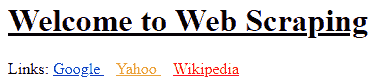

HTML 输出（使用 CSS 进行样式化的元素）

CSS 属性也可以以内联结构出现在每个特定元素中。内联 CSS 属性会覆盖外部 CSS 样式。CSS 的`color`属性已经内联应用到元素中。这将覆盖`<style>`中定义的`color`值：

```py
  <h1 style ='color:orange;'> Welcome to Web Scraping </h1>
  Links:
  <a href="https://www.google.com" style ='color:red;'> Google </a> 
  <a class='classOne' href="https://www.yahoo.com"> Yahoo </a> 
  <a id='idOne' href="https://www.wikipedia.org" style ='color:blue;'> Wikipedia </a>
```

CSS 也可以使用外部样式表文件嵌入到 HTML 中：

```py
<link href="http://..../filename.css" rel="stylesheet" type="text/css">
```

尽管 CSS 用于 HTML 元素的外观，但 CSS 选择器（用于选择元素的模式）在抓取过程中经常起着重要作用。我们将在接下来的章节中详细探讨 CSS 选择器。

请访问[`www.w3.org/Style/CSS/`](https://www.w3.org/Style/CSS/)和[`www.`](https://www.w3schools.com/css/)[w3schools](https://www.w3schools.com/css/)[.com/css/](https://www.w3schools.com/css/)获取有关 CSS 的更详细信息。

# AngularJS

到目前为止，我们在本章中介绍了一些选定的与 Web 相关的技术。让我们通过介绍 AngularJS 来了解 Web 框架的概述。Web 框架涉及许多与 Web 相关的工具，并用于开发与采用最新方法的 Web 相关资源。

AngularJS（也被称为*Angular.js*或*Angular*）主要用于构建客户端 Web 应用程序。这是一个基于 JavaScript 的框架。AngularJS 是通过`<script>`标签添加到 HTML 中的，它将 HTML 属性扩展为指令，并将数据绑定为表达式。AngularJS 表达式用于将数据绑定到从静态或动态 JSON 资源中检索的 HTML 元素。AngularJS 指令以`ng-`为前缀。

AngularJS 与 HTML 一起用于动态内容开发。它提供了性能改进、测试环境、元素操作和数据绑定功能，并通过在文档、数据、平台和其他工具之间提供更加动态和灵活的环境，帮助构建基于**模型-视图-控制器**（**MVC**）框架的 Web 应用程序。

我们可以将外部 JavaScript 文件链接到我们的 HTML 文档中，如下所示：

```py
<!doctype html>
<html ng-app>
    <head>
        <script 
 src="https://ajax.googleapis.com/ajax/libs/angularjs/1.7.5/angular.min.js">
 </script>
    </head>
    <body>
        <div>
            <label> Place: </label>
            <input type="text" ng-model="place" placeholder="Visited place!">
            <label> Cost :</label>
            <input type="text" ng-model="price" placeholder="Ticket Price!">
            <br>
            <b>Wow! {{place}} for only {{price}}</b>
        </div>
    </body>
</html>
```

此外，我们可以将脚本和元素块一起包含在页面中，如下所示：

```py
<script>
     var app = angular.module('myContact', []);
     app.controller('myDiv', function($scope) {
         $scope.firstName = "Aasira";
         $scope.lastName = "Chapagain";
         $scope.college= "London Business School";
         $scope.subject= "Masters in Analytics and Management";
     });
</script>
<div ng-app="myContact" ng-controller="myDiv">
     First Name: <input type="text" ng-model="firstName"><br>
     Last Name: <input type="text" ng-model="lastName"><br>
     College Name: <input type="text" ng-model="college"><br>
     Subjects: <input type="text" ng-model="subject"><br>
     <br>
     Full Name: {{firstName + " " + lastName}}
     <br>
     Enrolled on {{college + " with " + subject}}
</div>
```

我们在这里提供的 AngularJS 及其工作方法的概述允许更灵活地追踪和遍历数据。

请访问 AngularJS（[`angularjs.org/`](https://angularjs.org/)和[`angular.io/`](https://angular.io/)）获取有关 AngularJS 的更详细信息。

前面讨论的技术是 Web 的一些核心组件；它们相互关联，相互依赖，以产生最终用户与之交互的网站或 Web 文档。在接下来的章节中，我们将识别脚本并进一步分析其中包含的代码。

在接下来的章节中，我们将探索 Web 内容，并寻找可以在 Web 页面内找到的数据，我们将在接下来的章节中使用 Python 编程语言提取这些数据。

# 网络数据查找技术

有各种技术可用于开发网站。使用 Web 浏览器向最终用户呈现的内容也可以存在于各种其他格式和模式中。

如前所述，动态生成或操作网页内容也是可能的。页面内容也可以包括使用 HTML 和相关技术呈现的静态内容，或者实时呈现和创建的内容。内容也可以使用第三方来源检索并呈现给最终用户。

# HTML 页面源代码

Web 浏览器用于基于客户端服务器的 GUI 交互，探索 Web 内容。浏览器地址栏提供了 Web 地址或 URL，并将请求的 URL 发送到服务器（主机），然后由浏览器接收响应，即加载。获取的响应或页面源代码可以进一步探索，并以原始格式搜索所需的内容。

用户可以自由选择他们的 Web 浏览器。我们将在大部分书中使用安装在 Windows **操作系统**（**OS**）上的 Google Chrome。

在抓取过程中，页面的 HTML 源将经常被打开和调查以获取所需的内容和资源。右键单击网页。然后会出现一个菜单，您可以在其中找到**查看页面源**选项。或者，按*Ctrl* + *U*。

# 案例 1

让我们通过以下步骤来看一个网页抓取的例子：

1.  在您选择的浏览器中打开[`www.google.com`](https://www.google.com)

1.  在搜索框中输入`Web Scraping`

1.  按*Enter*或点击页面上的谷歌搜索按钮

1.  您应该看到类似以下屏幕截图的内容：

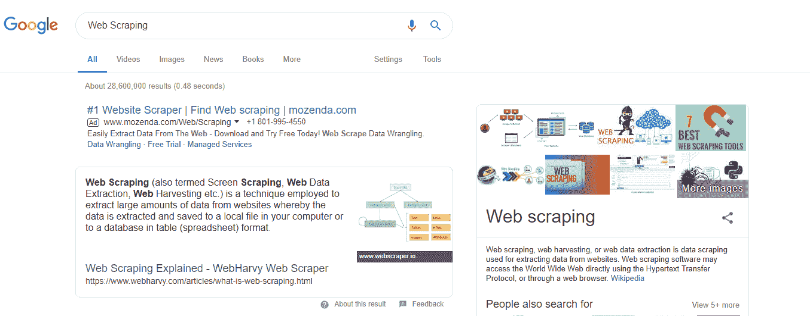

从谷歌搜索中获取网页抓取的搜索结果

谷歌已经为我们提供了我们所要求的搜索信息。这些信息以段落形式显示，还有许多链接。显示的信息是互动的、丰富多彩的，并且以维护的结构呈现，搜索内容采用了布局。

这是我们正在查看的前端内容。这些内容是根据我们与谷歌的互动动态提供给我们的。现在让我们查看一下提供给我们的原始内容。

1.  右键单击网页。然后会出现一个菜单，您可以在其中找到查看页面源的选项。或者，按*Ctrl* + *U*。在这里，将会打开一个新标签页，其中包含页面的 HTML 源代码。在浏览器的 URL 开头检查`view-source`：

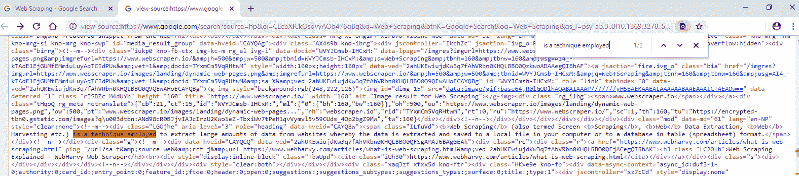

HTML 页面源：从谷歌搜索中获取网页抓取的搜索结果

我们现在正在访问上一个屏幕截图中显示的页面的 HTML 源代码。HTML 标签和 JavaScript 代码可以很容易地看到，但没有以正确的格式呈现。这些是浏览器呈现给我们的核心内容。

在页面源中搜索一些文本，在页面源中找到文本、链接和图片的位置。您将能够在 HTML 标签中找到页面源中的文本（但并不总是，我们将看到！）

网页开发可以使用各种技术和工具进行，正如我们在前面的部分中讨论的那样。浏览器显示的网页内容在探索其源代码时，可能并不总是存在于 HTML 标签中。内容也可能存在于脚本中，甚至在第三方链接上。这就是使得网页抓取经常具有挑战性的原因，因此需要存在于网页开发中的最新工具和技术。

# 案例 2

让我们探索另一个案例，使用我们在*案例 1*部分应用的浏览过程：

1.  在谷歌上搜索`2018 年美国最佳酒店`，并选择您喜欢的任何酒店名称。

1.  直接在谷歌中搜索酒店名称（或者您可以忽略前面的步骤）。例如，尝试`芝加哥半岛酒店`。

1.  谷歌将加载搜索酒店的详细信息以及地图和预订和评论部分。结果将类似于以下屏幕截图：

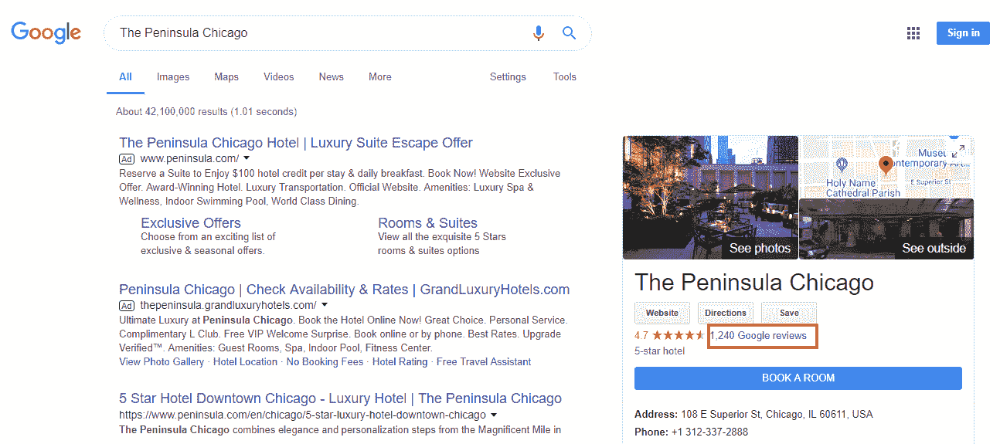

芝加哥半岛酒店的谷歌搜索结果

1.  在左侧，您可以找到谷歌评论的链接。点击链接后，将会弹出一个新页面，如下屏幕截图所示：

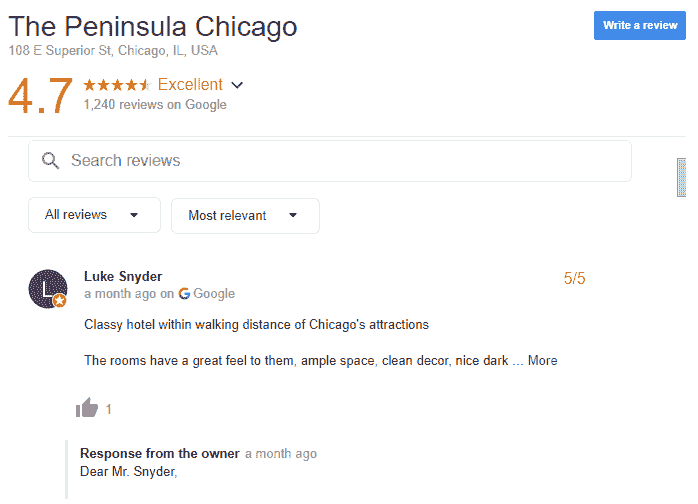

来自搜索页面的谷歌评论页面

1.  右键单击弹出的评论页面，选择查看页面源，或按*Ctrl* + *U*查看页面源。

尝试从页面源中找到用户的评论和回复文本。

# 开发者工具

开发者工具（或*DevTools*）现在嵌入在市面上大多数浏览器中。开发人员和最终用户都可以识别和定位在客户端-服务器通信期间使用的资源和搜索网页内容，或者在进行 HTTP 请求和响应时使用的资源。

DevTools 允许用户检查、创建、编辑和调试 HTML、CSS 和 JavaScript。它们还允许我们处理性能问题。它们有助于提取浏览器动态或安全呈现的数据。

DevTools 将用于大多数数据提取案例，以及类似于*页面源*部分中提到的*案例 2*。有关开发人员工具的更多信息，请探索这些链接：

+   Chrome DevTools ([`developers.google.com/web/tools/chrome-devtools/`](https://developers.google.com/web/tools/chrome-devtools/))

+   Firefox DevTools [(](https://developer.mozilla.org/son/docs/Tools)[`developer.mozilla.org/son/docs/Tools/`](https://developer.mozilla.org/son/docs/Tools)[)](https://developer.mozilla.org/son/docs/Tools)

在 Google Chrome 中，我们可以通过以下任一指示加载 DevTools：

+   只需按下*Ctrl* + *Shift* + *I*

+   另一个选项是右键单击页面，然后选择“检查”选项

+   或者，如果通过 Chrome 菜单访问开发者工具，请单击“更多工具”|“开发者工具”：

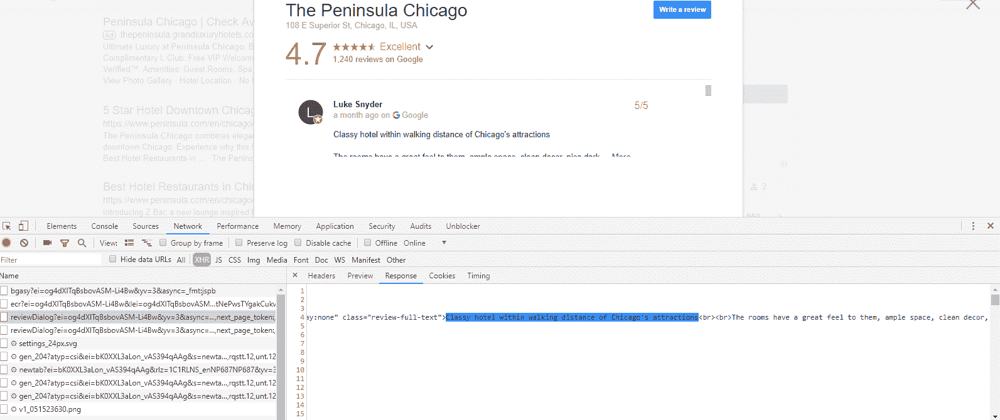

加载评论页面的 Chrome DevTools

上述屏幕截图显示了开发者工具面板：元素、控制台、网络、来源等。在我们的情况下，让我们从评论页面中找一些文本。按照这些步骤将允许我们找到它：

1.  在开发者工具中打开“网络”面板。

1.  选择“XHR”过滤器选项。（在“名称”面板下将找到列出的多个资源，如 HTML 文件、图像和 JSON 数据。）

1.  我们需要遍历“名称”窗格下的资源，寻找我们寻找的选择文本片段。（“响应”选项卡显示所选资源的内容。）

1.  找到以`reviewDialog?`开头的资源，其中包含搜索的文本。

这里概述的搜索评论文本的步骤是定位确切内容的最常用技术之一。当内容是动态获取的并且不在页面源中时，通常会遵循这些步骤。

开发者工具中有各种面板，与特定功能相关，用于提供给 Web 资源或进行分析，包括“来源”、“内存”、“性能”和“网络”。我们将探索在 Chrome DevTools 中找到的一些面板，如下所示：

在基于浏览器的 DevTools 中找到的面板的具体名称可能在所有浏览器中都不相同。

+   元素：显示所查看页面的 HTML 内容。用于查看和编辑 DOM 和 CSS，以及查找 CSS 选择器和 XPath。

HTML 元素显示或位于“元素”面板中，可能不会在页面源中找到。

+   控制台：用于运行和交互 JavaScript 代码，并查看日志消息：

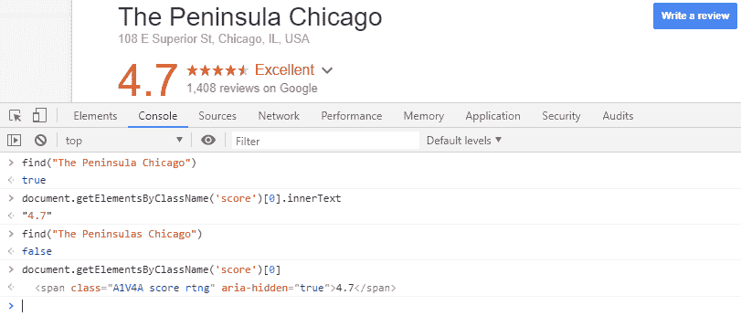

Chrome DevTools 中的控制台面板

+   来源：用于导航页面，查看可用的脚本和文档来源。基于脚本的工具可用于任务，如脚本执行（即，恢复、暂停）、跳过函数调用、激活和停用断点，以及处理异常，如暂停异常（如果遇到）：

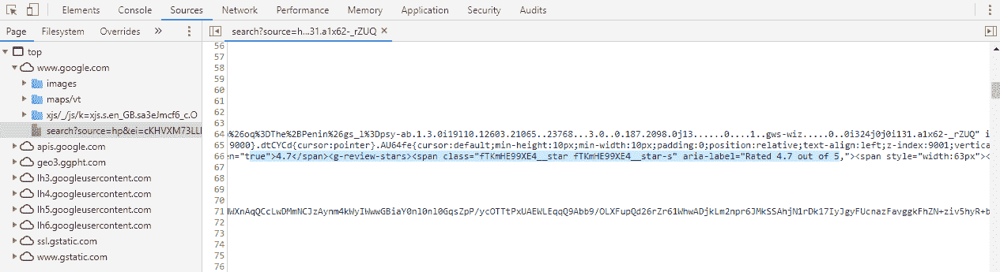

Chrome DevTools 的“来源”面板

+   网络：提供与 HTTP 请求和响应相关的资源，并显示加载页面时使用的网络资源。在网络功能选项中找到的资源，如记录数据到网络日志，捕获屏幕截图，过滤 Web 资源（JavaScript、图像、文档和 CSS），搜索 Web 资源，分组 Web 资源，也可用于调试任务：

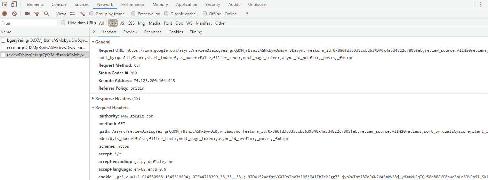

Chrome DevTools 网络面板

请求也可以按类型进行过滤：

+   **全部**：列出与网络相关的所有请求，包括文档请求、图像请求和字体和 CSS 请求。资源按加载顺序排列。

+   XHR：列出`XmlHttpRequest`对象，动态加载 AJAX 内容

+   JS：列出请求的脚本文件

+   CSS：列出请求的样式文件

+   Img：列出请求的图像文件

+   文档：列出请求的 HTML 或 Web 文档

+   其他：任何未列出的与请求相关的资源类型

对于先前列出的过滤选项，在 Name 面板中选择的资源有标签（标题、预览、响应、时间、Cookie）：

+   标题：加载特定请求的 HTTP 头数据。显示的信息包括请求 URL、请求方法、状态码、请求头、查询字符串参数和`POST`参数。

+   预览：加载响应的格式化预览。

+   响应：加载特定请求的响应。

+   时间：查看时间分解信息。

+   Cookie：加载 Name 面板中选择的资源的 cookie 信息。

从爬取的角度来看，DevTools Network 面板对于查找和分析 Web 资源非常有用。这些信息对于检索数据和选择处理这些资源的方法非常有用。

有关网络面板的更多信息，请访问[`developers.google.com/web/tools/chrome-devtools/network-performance/reference/`](https://developers.google.com/web/tools/chrome-devtools/network-performance/reference)和[`developer.mozilla.org/en-US/docs/Tools/Network_Monitor/`](https://developer.mozilla.org/en-US/docs/Tools/Network_Monitor)。网络面板提供了各种元素，下面将对其进行解释：

+   性能：可以记录屏幕截图页面和内存时间轴。获取的视觉信息用于优化网站速度，改善加载时间和分析运行时性能。在较早的 Chrome 版本中，性能面板提供的信息曾存在于一个名为时间轴的面板中：

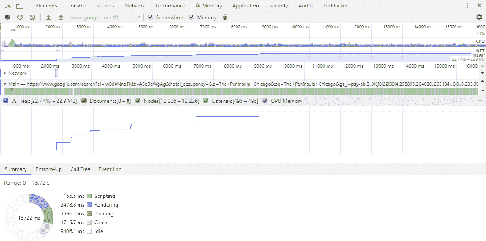

Chrome DevTools 中的性能面板

+   内存：在较早的 Chrome 版本中，这个面板也被称为面板配置文件。从这个面板获得的信息用于修复内存问题和跟踪内存泄漏。开发人员还使用性能和内存面板来分析整体网站性能。

+   应用程序：最终用户可以检查和管理所有加载的资源的存储，包括 cookie、会话、应用程序缓存、图像和数据库。

在探索 HTML 页面源代码和 DevTools 之后，我们现在大致知道可以在哪里探索或搜索数据。总的来说，爬取涉及从网页中提取数据，我们需要确定或定位携带我们想要提取的数据的资源。在进行数据探索和内容识别之前，计划和确定包含数据的页面 URL 或链接将是有益的。

用户可以选择任何 URL 进行爬取。指向单个页面的页面链接或 URL 也可能包含分页链接或将用户重定向到其他资源的链接。跨多个页面分布的内容需要通过识别页面 URL 来单独爬取。网站提供站点地图和`robots.txt`文件，其中包含用于爬取相关活动的链接和指令。

# 站点地图

`sitemap.xml`文件是一个包含与页面 URL 相关信息的 XML 文件。维护站点地图是通知搜索引擎网站包含的 URL 的简单方法。基于搜索引擎的脚本会爬取站点地图中的链接，并将找到的链接用于索引和各种用途，如搜索引擎优化（SEO）。

在站点地图中找到的 URL 通常包含额外的信息，如创建日期、修改日期、新 URL、已删除 URL 等。这些通常包含在 XML 标记中。在这种情况下，我们有`<sitemap>`和`<loc>`，如下面的屏幕截图所示：

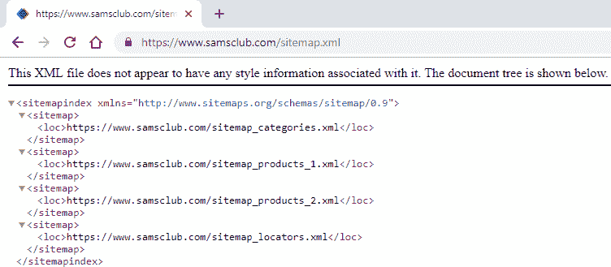

来自 https://www.samsclub.com/的站点地图内容

通过在 URL 中添加`sitemap.xml`来访问站点地图，例如，[`www.samsclub.com/sitemap.xml`](https://www.samsclub.com/sitemap.xml)。

并非所有网站都必须存在`sitemap.xml`。站点地图可能包含页面、产品、类别和内部站点地图文件的单独 URL，这些可以轻松地用于抓取目的，而不是从每个网站逐个探索网页链接并收集它们。

# robots.txt 文件

`robots.txt`，也称为机器人排除协议，是网站用于与自动脚本交换信息的基于 Web 的标准。一般来说，`robots.txt`包含有关网站上的 URL、页面和目录的指令，用于指导网页机器人（也称为**网络漫游者**、**爬虫**或**蜘蛛**）的行为，如允许、禁止、站点地图和爬行延迟。

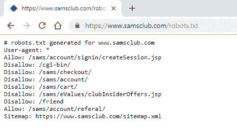

来自 https://www.samsclub.com/的 robots.txt 文件

对于任何提供的网站地址或 URL，可以通过在 URL 中添加`robots.txt`来访问`robots.txt`文件，例如，`https://www.samsclub.com/robots.txt`或`https://www.test-domainname.com/robots.txt`。

如前面的屏幕截图所示（*来自 https://www.samsclub.com/的 robots.txt 文件*），在[`www.samsclub.com/robots.txt`](https://www.samsclub.com/robots.txt)中列出了允许、禁止和站点地图指令：

+   允许许可网页机器人访问它所携带的链接

+   Disallow 表示限制对给定资源的访问

+   User-agent: *表示列出的指令应由所有代理遵循

对于由网络爬虫和垃圾邮件发送者引起的访问违规，网站管理员可以采取以下步骤：

+   增强安全机制，限制对网站的未经授权访问

+   对被跟踪的 IP 地址施加阻止

+   采取必要的法律行动

网络爬虫应遵守文件中列出的指令，但对于正常的数据提取目的，除非爬行脚本妨碍网站流量，或者它们从网络中获取个人数据，否则不会施加限制。再次强调，并非每个网站都必须提供`robots.txt`文件。

有关指令和`robots.txt`的更多信息，请访问[`www.robotstxt.org/`](http://www.robotstxt.org/)。

# 总结

在本章中，我们探讨了一些与万维网相关的核心技术和工具，这些技术和工具对于网页抓取是必需的。

通过介绍 Web 开发工具来识别和探索内容，并寻找目标数据的页面 URL，是本章的主要重点。

在下一章中，我们将使用 Python 编程语言与网络进行交互，并探索主要的与网络相关的 Python 库，这些库将用于检查网络内容。

# 进一步阅读

+   AngularJS：[`www.angularjs.org`](https://www.angularjs.org), [`www.angular.io`](https://www.angular.io)

+   AJAX：[`api.jquery.com/jquery.ajax/`](http://api.jquery.com/jquery.ajax/), [`www.w3schools.com/js/js_ajax_intro.asp`](https://www.w3schools.com/js/js_ajax_intro.asp)

+   浏览器开发工具：[`developers.google.com/web/tools/chrome-devtools/`](https://developers.google.com/web/tools/chrome-devtools/), [`developer.mozilla.org/son/docs/Tools`](https://developer.mozilla.org/son/docs/Tools)

+   CSS：[`www.w3schools.com/css/`](https://www.w3schools.com/css/), [`www.w3.org/Style/CSS/`](https://www.w3.org/Style/CSS/)

+   Cookies：[`www.aboutcookies.org/`](https://www.aboutcookies.org/), [www.allaboutcookies.org](http://www.allaboutcookies.org/)

+   HTTP：[`www.w3.org/Protocols/`](https://www.w3.org/Protocols/), [`developer.mozilla.org/en-US/docs/Web/HTTP`](https://developer.mozilla.org/en-US/docs/Web/HTTP)

+   HTTP 方法：[`restfulapi.net/http-methods/`](https://restfulapi.net/http-methods/)

+   HTTP 标头的快速参考：[`jkorpela.fi/http.html`](http://jkorpela.fi/http.html)

+   面向开发人员的 Web 技术：[`developer.mozilla.org/en-US/docs/Web`](https://developer.mozilla.org/en-US/docs/Web)

+   标记系统和学术文本处理的未来：[`xml.coverpages.org/coombs.html`](http://xml.coverpages.org/coombs.html)

+   JSON Lines: [`jsonlines.org/`](http://jsonlines.org/)

+   jQuery: [`jquery.com/`](https://jquery.com/), [`www.w3schools.com/jquery/`](https://www.w3schools.com/jquery/)

+   JavaScript: [`developer.mozilla.org/en-US/docs/Web/JavaScript`](https://developer.mozilla.org/en-US/docs/Web/JavaScript), [`www.javascript.com/`](https://www.javascript.com/)

+   Robots Exclusion Protocol: [`www.robotstxt.org/`](http://www.robotstxt.org/)

+   逆向工程：[`insights.globalspec.com/article/7367/how-does-reverse-engineering-work`](https://insights.globalspec.com/article/7367/how-does-reverse-engineering-work)

+   站点地图：[`www.sitemaps.org/`](https://www.sitemaps.org/)

+   XML: [`www.w3schools.com/xml/`](https://www.w3schools.com/xml/), [`www.w3.org/XML/`](https://www.w3.org/XML/)
