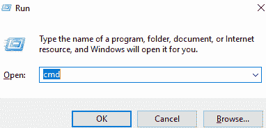
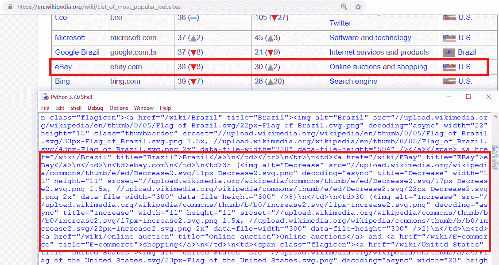
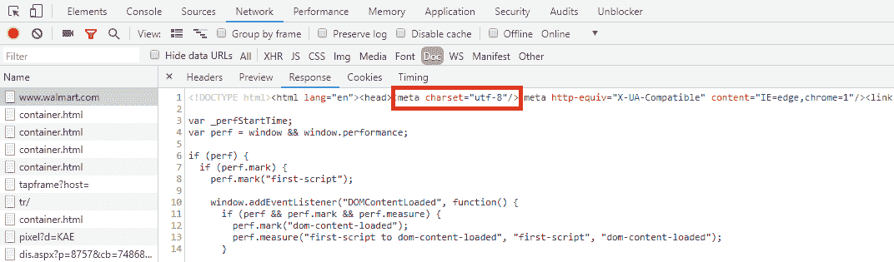
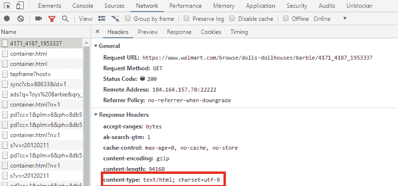
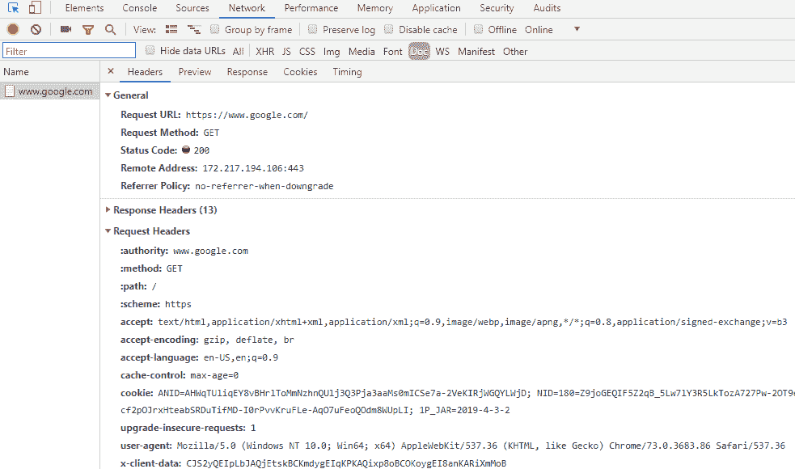
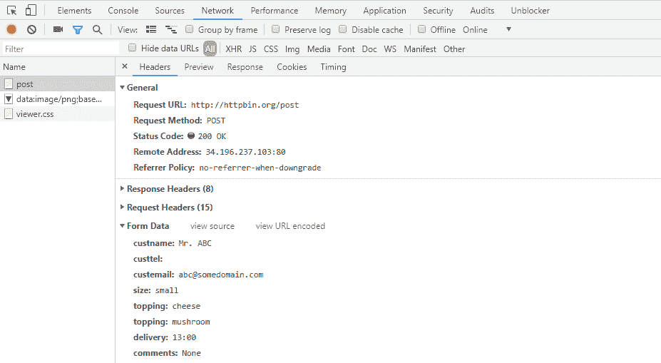

# 第二章：Python 和 Web - 使用 urllib 和 Requests

从上一章，我们现在对 Web 抓取是什么，存在哪些核心开发技术以及我们可以计划在哪里或如何找到我们正在寻找的信息有了一个概念。

Web 抓取需要使用脚本或程序实施和部署的工具和技术。Python 编程语言包括一大批适用于与 Web 交互和抓取目的的库。在本章中，我们将使用 Python 与 Web 资源进行通信；我们还将探索并搜索要从 Web 中提取的内容。

本章还将详细介绍使用 Python 库，如`requests`和`urllib`。

特别是，我们将学习以下主题：

+   设置 Python 及其所需的库`requests`和`urllib`来加载 URL

+   `requests`和`urllib`的详细概述

+   实现 HTTP 方法（`GET`/`POST`）

我们假设您具有一些使用 Python 编程语言的基本经验。如果没有，请参考 W3schools 的 Python 教程（[`www.w3schools.com/python/default.asp`](https://www.w3schools.com/python/default.asp)）、Python 课程（[`python-course.eu/`](https://python-course.eu/)）或在 Google 上搜索*学习 Python 编程*。

# 技术要求

我们将使用已安装在 Windows 操作系统上的 Python 3.7.0。有很多选择的代码编辑器；选择一个方便使用并处理本章代码示例中使用的库的编辑器。我们将同时使用来自 JetBrains 的 PyCharm（社区版[`www.jetbrains.com/pycharm/download/download-thanks.html?platform=windows&code=PCC`](https://www.jetbrains.com/pycharm/download/download-thanks.html?platform=windows&code=PCC)）和 Python IDLE（[`www.python.org/downloads/`](https://www.python.org/downloads/)）。

要跟着本章进行，您需要安装以下应用程序：

+   Python 3.7.*或适合您操作系统的最新版本：[`www.python.org/downloads/`](https://www.python.org/downloads/)

+   `pip` Python 软件包管理：[`packaging.python.org/tutorials/installing-packages/`](https://packaging.python.org/tutorials/installing-packages/)

+   要么使用谷歌 Chrome，要么使用 Mozilla Firefox

+   JetBrains PyCharm 或 Visual Studio Code

本章所需的 Python 库如下：

+   `requests`

+   `urllib`

本章的代码文件可在 GitHub 上找到：[`github.com/PacktPublishing/Hands-On-Web-Scraping-with-Python/tree/master/Chapter02`](https://github.com/PacktPublishing/Hands-On-Web-Scraping-with-Python/tree/master/Chapter02)。

# 使用 Python 访问网络

Python 是一种用于编写各种类型应用程序的编程语言，从简单脚本到人工智能算法和 Web 框架。我们将使用 Python 编写脚本来从数据提取或抓取的角度访问我们感兴趣的 URL。

存在许多用于 HTTP 通信和与 Web 相关目的的 Python 库（包括`http`、`cookielib`、`urllib`、`requests`、`html`、`socket`、`json`、`xmlrpc`、`httplib2`和`urllib3`）。我们将探索并使用一些被程序员社区赞扬的用于 HTTP 访问或客户端-服务器通信的库。我们感兴趣使用的是`urllib`和`requests` Python 模块。这些库具有各种函数，可用于使用 Python 与 Web 通信并处理 HTTP 请求和响应。

为了立即开始一些编码任务并探索基于 Python 的模块，让我们在继续之前验证我们已经安装了所有想要的 Python 资源。

# 设置事物

假设 Python 已预先安装。如果没有，请访问[`www.python.org/downloads/`](https://www.python.org/downloads/)和[`www.python.org/download/other/`](https://www.python.org/download/other/)获取您操作系统的最新 Python 版本。关于一般设置和安装程序，请访问[`realpython.com/installing-python/`](https://realpython.com/installing-python/)了解如何在您选择的平台上安装 Python。我们将在这里使用 Windows 操作系统。

为了验证我们是否拥有所有所需的工具，请检查 Python 和`pip`是否已安装并且是否是最新版本。

`pip`包管理系统用于安装和管理用 Python 编写的软件包。有关安装 Python 软件包和`pip`的更多信息，请访问[`packaging.python.org/tutorials/installing-packages/`](https://packaging.python.org/tutorials/installing-packages/)。

我们将在 Windows 操作系统上使用 Python 3.7。按下 Windows + *R*打开运行框，输入`cmd`以获取命令行界面：



在 Windows 操作系统上打开命令行界面

现在，转到您的根目录并键入以下命令：

```py
C:\> python –version
Python 3.7.0
```

上述命令将为我们提供当前系统上的 Python 版本。让我们获取一些关于我们正在使用的`pip`版本的信息。以下命令将显示当前的`pip`版本以及其位置：

```py
C:\> pip --version

pip 18.1 from c:\python37\lib\site-packages\pip (python 3.7)
```

在看到前面的响应后，我们很高兴继续进行。如果遇到“找不到应用程序”或“不被识别为内部或外部命令”的错误，则需要重新安装 Python 或检查安装过程中使用的正确驱动器。

始终建议检查系统和库的版本，并保持它们更新，除非需要特定版本。

要将`pip`更新到最新版本，请使用以下命令：

```py
C:\> python -m pip install --upgrade pip
```

您可以验证我们希望使用的库，即`requests`和`urllib`，可以从命令行或通过导入 Python IDE 并使用`help()`方法获取有关包的详细信息：

```py
C:\> pip install requests

Requirement already satisfied: requests in c:\python37\lib\site-packages (2.19.1)
```

如前面的代码所示，我们尝试安装`requests`，但命令返回“要求已满足”。`pip`命令在安装新库之前会检查系统上是否已存在安装。

在下面的代码块中，我们将使用 Python IDE 来导入`urllib`。我们将使用 Python 的内置`help()`方法查看其详细信息。

代码中的`>>>`符号表示使用 Python IDE；它接受代码或指令，并在下一行显示输出：

```py
>>> import urllib 
>>> help(urllib) #display documentation available for urllib

```

以下是输出：

```py
Help on package urllib:
NAME
 urllib
PACKAGE CONTENTS
 error
 parse
 request
 response
 robotparser
FILE
 c:\python37\lib\urllib\__init__.py
```

与之前的代码类似，让我们在 Python IDE 中导入`requests`：

```py
>>> import requests 
>>> requests.__version__ #display requests version 

'2.21.0'

>>> help(requests)   #display documentation available for requests

Help on package requests:
NAME
 requests
DESCRIPTION
 Requests HTTP Library
 ~~~~~~~~~~~~~~~~~~
 Requests is an HTTP library, written in Python, for human beings.
```

如果我们导入`urllib`或`requests`，并且这些库不存在，结果将会抛出错误：

```py
ModuleNotFoundError: No module named 'requests'
```

对于缺少的模块或在先前的情况下，首先安装模块；使用以下`pip`安装或升级。您可以按照以下方式从命令行安装它：

```py
C:\> pip install requests
```

您还可以使用`--upgrade`参数升级模块版本：

```py
C:\> pip install requests -–upgrade
```

# 加载 URL

现在我们已确认所需的库和系统要求，我们将继续加载 URL。在查找 URL 的内容时，还需要确认和验证已选择的所需内容的确切 URL。内容可以在单个网页上找到，也可以分布在多个页面上，并且可能并非始终是我们要寻找的 HTML 源。

我们将加载一些 URL 并使用一些任务来探索内容。

在使用 Python 脚本加载 URL 之前，还建议使用 Web 浏览器验证 URL 是否正常工作并包含我们正在寻找的详细信息。开发人员工具也可以用于类似的场景，如第一章中所讨论的*Web Scraping Fundamentals*的*Developer tools*部分。

**任务 1**：查看来自维基百科的最受欢迎网站列表相关的数据。我们将从页面源中识别*Site*、*Domain*和*Type*列中的数据。

我们将按照以下链接中的步骤来完成我们的任务（第三章将进行与数据提取相关的活动，*Using LXML, XPath and CSS Selectors*）：[`en.wikipedia.org/wiki/List_of_most_popular_websites`](https://en.wikipedia.org/wiki/List_of_most_popular_websites)。

搜索维基百科以获取我们正在寻找的信息。前面的链接可以在 Web 浏览器中轻松查看。内容以表格格式呈现（如下面的屏幕截图所示），因此可以通过重复使用选择、复制和粘贴操作，或者收集表格内的所有文本来收集数据。

然而，这样的操作不会导致我们感兴趣的内容以理想的格式显示，或者将需要在文本上执行额外的编辑和格式化任务才能实现所需的结果。我们也对从浏览器获取的页面源不感兴趣：


来自维基百科的页面，即 https://en.wikipedia.org/wiki/List_of_most_popular_websites

在确定包含我们需要的内容的链接后，让我们使用 Python 加载链接。我们正在请求链接，并希望看到由`urllib`和`requests`返回的响应：

1.  让我们使用`urllib`：

```py
>>> import urllib.request as req #import module request from urllib
>>> link = "https://en.wikipedia.org/wiki/List_of_most_popular_websites"
>>> response = req.urlopen(link)  #load the link using method urlopen()

>>> print(type(response))   #print type of response object
 <class 'http.client.HTTPResponse'>

>>> print(response.read()) #read response content
b'<!DOCTYPE html>\n<html class="client-nojs" lang="en" dir="ltr">\n<head>\n<meta charset="UTF-8"/>\n<title>List of most popular websites - Wikipedia</title>\n<script>…..,"wgCanonicalSpecialPageName":false,"wgNamespaceNumber":0,"wgPageName":"List_of_most_popular_websites","wgTitle":"List of most popular websites",……
```

`urllib.request`中的`urlopen()`函数已经传递了所选的 URL 或对 URL 进行的请求，并收到了`response`，即`HTTPResponse`。可以使用`read()`方法读取对请求的`response`。

2. 现在，让我们使用`requests`：

```py
>>> import requests
>>> link = "https://en.wikipedia.org/wiki/List_of_most_popular_websites"
>>> response = requests.get(link)

>>> print(type(response))
 <class 'requests.models.Response'>

>>> content = response.content #response content received
>>> print(content[0:150])  #print(content) printing first 150 character from content

b'<!DOCTYPE html>\n<html class="client-nojs" lang="en" dir="ltr">\n<head>\n<meta charset="UTF-8"/>\n<title>List of most popular websites - Wikipedia</title>'
```

在这里，我们使用`requests`模块来加载页面源，就像我们使用`urllib`一样。`requests`使用`get()`方法，该方法接受 URL 作为参数。对于这两个示例，也已经检查了`response`类型。

在前面的代码块中显示的输出已经被缩短。您可以在[`github.com/PacktPublishing/Hands-On-Web-Scraping-with-Python`](https://github.com/PacktPublishing/Hands-On-Web-Scraping-with-Python)找到此代码文件。

在上述示例中，页面内容或`response`对象包含了我们正在寻找的详细信息，即*Site*、*Domain*和*Type*列。

我们可以选择任何一个库来处理 HTTP 请求和响应。关于这两个 Python 库的详细信息和示例将在下一节*URL handling and operations with urllib and requests*中提供。

让我们看一下下面的屏幕截图：



使用 Python 库查看维基百科页面内容

进一步的活动，如处理和解析，可以应用于这样的内容，以提取所需的数据。有关进一步处理工具/技术和解析的更多详细信息可以在第三章、*Using LXML, XPath, and CSS Selectors*，第四章、*Scraping Using pyquery – a Python Library*和第五章、*Web Scraping Using Scrapy and Beautiful Soup*中找到。

**任务 2**：使用`urllib`和`requests`加载并保存来自[`www.samsclub.com/robots.txt`](https://www.samsclub.com/robots.txt)和[`www.samsclub.com/sitemap.xml`](https://www.samsclub.com/sitemap.xml)的页面内容。

通常，网站在其根路径中提供文件（有关这些文件的更多信息，请参阅第一章，*网络抓取基础知识*，*网络数据查找技术*部分）：

+   `robots.txt`：其中包含爬虫、网络代理等的信息

+   `sitemap.xml`：其中包含最近修改的文件、发布的文件等的链接

从*任务 1*中，我们能够加载 URL 并检索其内容。将内容保存到本地文件并使用文件处理概念将在此任务中实现。将内容保存到本地文件并处理内容，如解析和遍历等任务，可以非常快速，甚至可以减少网络资源：

1.  使用`urllib`加载并保存来自[`www.samsclub.com/robots.txt`](https://www.samsclub.com/robots.txt)的内容：

```py
>>> import urllib.request 

>>> urllib.request.urlretrieve('https://www.samsclub.com/robots.txt')
('C:\\Users\\*****\AppData\\Local\\Temp\\tmpjs_cktnc', <http.client.HTTPMessage object at 0x04029110>)

>>> urllib.request.urlretrieve(link,"testrobots.txt") #urlretrieve(url, filename=None)
('testrobots.txt', <http.client.HTTPMessage object at 0x04322DF0>)
```

`urlretrieve()`函数，即`urlretrieve(url, filename=None, reporthook=None, data=None)`，从`urllib.request`返回一个包含文件名和 HTTP 头的元组。如果没有给出路径，可以在`C:\\Users..Temp`目录中找到此文件；否则，文件将在当前工作目录中生成，文件名由`urlretrieve()`方法的第二个参数提供。在前面的代码中，这是`testrobots.txt`：

```py
>>> import urllib.request
>>> import os
>>> content = urllib.request.urlopen('https://www.samsclub.com/robots.txt').read() #reads robots.txt content from provided URL

>>> file = open(os.getcwd()+os.sep+"contents"+os.sep+"robots.txt","wb") #Creating a file robots.txt inside directory 'contents' that exist under current working directory (os.getcwd()) 

>>> file.write(content) #writing content to file robots.txt opened in line above. If the file doesn't exist inside directory 'contents', Python will throw exception "File not Found"

>>> file.close() #closes the file handle
```

在前面的代码中，我们正在读取 URL 并使用文件处理概念编写找到的内容。

1.  使用`requests`加载并保存来自[`www.samsclub.com/sitemap.xml`](https://www.samsclub.com/sitemap.xml)的内容：

```py
>>> link="https://www.samsclub.com/sitemap.xml"
>>> import requests
>>> content = requests.get(link).content
>>> content 

b'<?xml version="1.0" encoding="UTF-8"?>\n<sitemapindex >\n<sitemap><loc>https://www.samsclub.com/sitemap_categories.xml</loc></sitemap>\n<sitemap><loc>https://www.samsclub.com/sitemap_products_1.xml</loc></sitemap>\n<sitemap><loc>https://www.samsclub.com/sitemap_products_2.xml</loc></sitemap>\n<sitemap><loc>https://www.samsclub.com/sitemap_locators.xml</loc></sitemap>\n</sitemapindex>'

>>> file = open(os.getcwd()+os.sep+"contents"+os.sep+"sitemap.xml","wb") #Creating a file robots.txt inside directory 'contents' that exist under current working directory (os.getcwd()) 

>>> file.write(content) #writing content to file robots.txt opened in line above. If the file doesn't exist inside directory 'contents', Python will throw exception "File not Found"

>>> file.close() #closes the file handle
```

在这两种情况下，我们都能够从相应的 URL 中找到内容并将其保存到各自的文件和位置。前面的代码中的内容被发现为字节文字，例如`b'<!DOCTYPE …`或`b'<?xml`。页面内容也可以以文本格式检索，例如`requests.get(link).text`。

我们可以使用`decode()`方法将字节转换为字符串，使用`encode()`方法将字符串转换为字节，如下面的代码所示：

```py
>>> link="https://www.samsclub.com/sitemap.xml"
>>> import requests
>>> content = requests.get(link).text  #using 'text'
>>> content

'<?xml version="1.0" encoding="UTF-8"?>\n<sitemapindex >\n<sitemap><loc>https://www.samsclub.com/sitemap_categories.xml</loc></sitemap>\n<sitemap><loc>https://www.samsclub.com/sitemap_products_1.xml</loc></sitemap>\n<sitemap><loc>https://www.samsclub.com/sitemap_products_2.xml</loc></sitemap>\n<sitemap><loc>https://www.samsclub.com/sitemap_locators.xml</loc></sitemap>\n</sitemapindex>' >>> content = requests.get(link).content 
>>> content.decode() # decoding 'content' , decode('utf-8')

'<?xml version="1.0" encoding="UTF-8"?>\n<sitemapindex >\n<sitemap><loc>https://www.samsclub.com/sitemap_categories.xml</loc></sitemap>\n<sitemap><loc>https://www.samsclub.com/sitemap_products_1.xml</loc></sitemap>\n<sitemap><loc>https://www.samsclub.com/sitemap_products_2.xml</loc></sitemap>\n<sitemap><loc>https://www.samsclub.com/sitemap_locators.xml</loc></sitemap>\n</sitemapindex>'
```

在处理各种域和文档类型时，识别适当的字符集或`charset`是很重要的。要识别适当的`charset`编码类型，我们可以通过使用`content-type`或`charset`从页面源中寻求`<meta>`标签的帮助。

从页面源中识别带有`charset`属性的`<meta>`标签，如下面的屏幕截图所示（或`<meta http-equiv="content-type" content="text/html; charset=utf-8">`：



从文档响应或页面源中识别字符集

此外，`<meta http-equiv="content-type" content="text/html; charset=utf-8">`的内容可以从响应头中获取，如下面的屏幕截图所示：

通过浏览器 DevTools、Network 面板、Headers 选项卡和响应头识别字符集

使用 Python 代码，我们可以在 HTTP 头中找到`charset`：

```py
>>> import urllib.request
>>> someRequest = urllib.request.urlopen(URL) #load/Open the URL
>>> urllib.request.getheaders() #Lists all HTTP headers. 

>>> urllib.request.getheader("Content-Type") #return value of header 'Content-Type'

'text/html; charset=ISO-8859-1' or 'utf-8'
```

识别的`charset`将用于使用`requests.get(link).content.decode('utf-8')`进行编码和解码。

Python 3.0 使用*文本*和(二进制)*数据*的概念，而不是 Unicode 字符串和 8 位字符串。所有文本都是 Unicode；然而，*编码*的 Unicode 被表示为二进制数据。用于保存文本的类型是`str`([`docs.python.org/3/library/stdtypes.html#str`](https://docs.python.org/3/library/stdtypes.html#str))，用于保存数据的类型是 bytes([`docs.python.org/3/library/stdtypes.html#bytes`](https://docs.python.org/3/library/stdtypes.html#bytes))。有关 Python 3.0 的更多信息，请访问[`docs.python.org/3/whatsnew/3.0.html`](https://docs.python.org/3/whatsnew/3.0.html)。

在本节中，我们设置并验证了我们的技术要求，并探索了 URL 加载和内容查看。在下一节中，我们将探索 Python 库，找到一些有用的函数及其属性。

# 使用 urllib 和 requests 进行 URL 处理和操作

对于从网页中提取数据的主要动机，需要使用 URL。在我们迄今为止看到的示例中，我们注意到 Python 与其源或内容通信时使用了一些非常简单的 URL。网络爬虫过程通常需要使用来自不同域的不同格式或模式的 URL。

开发人员可能还会面临许多情况，需要对 URL 进行操作（更改、清理）以便快速方便地访问资源。URL 处理和操作用于设置、更改查询参数或清理不必要的参数。它还传递了所需的请求标头和适当值，并确定了适当的 HTTP 方法来进行请求。您将发现许多与 URL 相关的操作，这些操作可以使用浏览器 DevTools 或网络面板进行识别。

`urllib`和`requests` Python 库将贯穿本书使用，处理 URL 和基于网络的客户端-服务器通信。这些库提供了各种易于使用的函数和属性，我们将探索一些重要的函数和属性。

# urllib

`urllib`库是一个标准的 Python 包，它收集了几个模块，用于处理与 HTTP 相关的通信模型。`urllib`内部的模块经过特别设计，包含处理各种类型的客户端-服务器通信的函数和类。

类似命名的包也存在，如`urllib2`，一个可扩展的库，以及`urllib3`，一个功能强大的 HTTP 客户端，解决了 Python 标准库中缺少的功能。

处理 URL 请求和响应的两个最重要的`urllib`模块如下。我们将在本章和接下来的章节中使用这些模块：

+   `urllib.request`：用于打开和读取 URL 以及请求或访问网络资源（cookie、身份验证等）

+   `urllib.response`：该模块用于提供对生成的请求的响应

存在许多函数和公共属性来处理与 HTTP 请求相关的请求信息和处理响应数据，例如`urlopen()`、`urlretrieve()`、`getcode()`、`getheaders()`、`getheader()`、`geturl()`、`read()`、`readline()`等等。

我们可以使用 Python 内置的`dir()`函数来显示模块的内容，例如其类、函数和属性，如下面的代码所示：

```py
>>> import urllib.request
>>> dir(urllib.request) #list features available from urllib.request

['AbstractBasicAuthHandler', 'AbstractDigestAuthHandler', 'AbstractHTTPHandler', 'BaseHandler', 'CacheFTPHandler', 'ContentTooShortError', 'DataHandler', 'FTPHandler', 'FancyURLopener', 'FileHandler', 'HTTPBasicAuthHandler', 'HTTPCookieProcessor',....'Request', 'URLError', 'URLopener',......'pathname2url', 'posixpath', 'proxy_bypass', 'proxy_bypass_environment', 'proxy_bypass_registry', 'quote', 're', 'request_host', 'socket', 'splitattr', 'splithost', 'splitpasswd', 'splitport', 'splitquery', 'splittag', 'splittype', 'splituser', 'splitvalue', 'ssl', 'string', 'sys', 'tempfile', 'thishost', 'time', 'to_bytes', 'unquote', 'unquote_to_bytes', 'unwrap', 'url2pathname', 'urlcleanup', 'urljoin', 'urlopen', 'urlparse', 'urlretrieve', 'urlsplit', 'urlunparse', 'warnings']
```

`urlopen()`函数接受 URL 或`urllib.request.Request`对象（如`requestObj`），并通过`urllib.response`的`read()`函数返回响应，如下面的代码所示：

```py
>>> import urllib.request
>>> link='https://www.google.com' [](https://www.google.com) 
>>> linkRequest = urllib.request.urlopen(link) #open link
>>> print(type(linkRequest)) #object type
 <class 'http.client.HTTPResponse'> [](https://www.google.com) 
>>> linkResponse = urllib.request.urlopen(link).read() #open link and read content
>>> print(type(linkResponse))
 <class 'bytes'>
 [](https://www.google.com) >>> requestObj = urllib.request.Request('https:/www.samsclub.com/robots.txt')
>>> print(type(requestObj)) #object type
 <class 'urllib.request.Request'>

>>> requestObjResponse = urllib.request.urlopen(requestObj).read()
>>> print(type(requestObjResponse))  #object type
 <class 'bytes'>
```

`linkRequest`和`requestObj`从`urlopen()`函数和类请求返回的对象类型是不同的。还创建了`linkResponse`和`requestObjResponse`对象，其中包含`urllib.response`的`read()`函数的信息。

通常，`urlopen()`用于从 URL 读取响应，而`urllib.request.Request`用于发送额外的参数，如`data`或`headers`，甚至指定 HTTP 方法并检索响应。可以如下使用：

`urllib.request.Request(url, data=None, headers={}, origin_req_host=None, unverifiable=False, method=None)`

`urllib.response`及其函数，如`read()`和`readline()`，与`urllib.request`对象一起使用。

如果所做的请求成功并从正确的 URL 收到响应，我们可以检查 HTTP 状态码，使用的 HTTP 方法，以及返回的 URL 来查看描述：

+   `getcode()` 返回 HTTP 状态码。如下面的代码所示，也可以使用 `code` 和 `status` 公共属性获得相同的结果：

```py
>>> linkRequest.getcode()  #can also be used as: linkRequest.code or linkRequest.status 

 200
```

+   `geturl()` 返回当前的 URL。有时很方便验证是否发生了任何重定向。`url` 属性可用于类似的目的：

```py
>>> linkRequest.geturl()   # can also be used as: linkRequest.url

 'https://www.google.com'
```

+   `_method` 返回一个 HTTP 方法；`GET` 是默认响应：

```py
>>> linkRequest._method 
'GET'
```

+   `getheaders()` 返回一个包含 HTTP 头的元组列表。如下面的代码所示，我们可以从输出中确定有关 cookie、内容类型、日期等的值：

```py
>>> linkRequest.getheaders()

[('Date','Sun, 30 Dec 2018 07:00:25 GMT'),('Expires', '-1'),('Cache-Control','private, max-age=0'),('Content-Type','text/html; charset=ISO-8859-1'),('P3P', 'CP="This is not a P3P policy! See g.co/p3phelp for more info."'),('Server', 'gws'),('X-XSS-Protection', '1; mode=block'),('X-Frame-Options','SAMEORIGIN'),('Set-Cookie', '1P_JAR=…..; expires=Tue, 29-Jan-2019 07:00:25 GMT; path=/; domain=.google.com'),('Set-Cookie 'NID=152=DANr9NtDzU_glKFRgVsOm2eJQpyLijpRav7OAAd97QXGX6WwYMC59dDPe.; expires=Mon, 01-Jul-2019 07:00:25 GMT; path=/; domain=.google.com; HttpOnly'),('Alt-Svc', 'quic=":443"; ma=2592000; v="44,43,39,35"'),('Accept-Ranges', 'none'),('Vary', 'Accept-Encoding'),('Connection', 'close')] 
```

+   当使用 `getheader()` 传递所需的头元素时，也可以检索单个基于请求的头，如下面的代码所示。在这里，我们可以看到我们可以获取 `Content-Type` 头的值。相同的结果也可以使用 `info()` 函数实现：

```py
>>> linkRequest.getheader("Content-Type") 

 'text/html; charset=ISO-8859-1'

>>> linkRequest.info()["content-type"]

 'text/html; charset=ISO-8859-1'
```

我们已经使用了代码块，并找到了与我们的请求和响应相关的输出。Web 浏览器还允许我们使用浏览器 DevTools（基于浏览器的开发人员工具）跟踪请求/响应相关的信息。

以下截图显示了网络面板和文档选项卡，其中包括头选项。其中包含各种部分，如常规、响应头和请求头。头选项中可以找到基本的请求和响应相关信息：



网络面板和文档选项卡显示了常规和请求头信息

`urllib.error` 处理 `urllib.request` 引发的异常。例如，`URLError` 和 `HTTPError` 可能会为请求引发异常。以下代码演示了 `urllib.error` 的使用：

异常处理处理编程中的错误处理和管理。使用异常处理的代码也被认为是一种有效的技术，并经常被推荐用于适应。

```py
>>> import urllib.request as request
>>> import urllib.error as error

>>> try:  #attempting an error case
 request.urlopen("https://www.python.ogr") #wrong URL is passed to urlopen()
 except error.URLError as e:
 print("Error Occurred: ",e.reason)

Error Occurred: [Errno 11001] getaddrinfo failed #output
```

`urllib.parse` 用于编码/解码请求（数据）或链接，添加/更新头，并分析、解析和操作 URL。解析的 URL 字符串或对象使用 `urllib.request` 处理。

此外，`urlencode()`、`urlparse()`、`urljoin()`、`urlsplit()`、`quote_plus()` 是 `urllib.parse` 中可用的一些重要函数，如下面的代码所示：

```py
>>> import urllib.parse as urlparse
>>> print(dir(urlparse)) #listing features from urlparse
```

我们得到以下输出：

```py

['DefragResult', 'DefragResultBytes', 'MAX_CACHE_SIZE', 'ParseResult', 'ParseResultBytes', 'Quoter', 'ResultBase', 'SplitResult', 'SplitResultBytes', .........'clear_cache', 'collections', 'namedtuple', 'non_hierarchical', 'parse_qs', 'parse_qsl', 'quote', 'quote_from_bytes', 'quote_plus', 're', 'scheme_chars', 'splitattr', 'splithost', 'splitnport', 'splitpasswd', 'splitport', 'splitquery', 'splittag', 'splittype', 'splituser', 'splitvalue', 'sys', 'to_bytes', 'unquote', 'unquote_plus', 'unquote_to_bytes', 'unwrap', 'urldefrag', 'urlencode', 'urljoin', 'urlparse', 'urlsplit', 'urlunparse', 'urlunsplit', 'uses_fragment', 'uses_netloc', 'uses_params', 'uses_query', 'uses_relative']
```

`urllib.parse` 中的 `urlsplit()` 函数将传递的 URL 拆分为 `namedtuple` 对象。元组中的每个名称标识 URL 的部分。这些部分可以分开并在其他变量中检索和根据需要使用。以下代码实现了 `urlsplit()` 用于 `amazonUrl`：

```py
>>> amazonUrl ='https://www.amazon.com/s/ref=nb_sb_noss?url=search-alias%3Dstripbooks-intl-ship&field-keywords=Packt+Books'

>>> print(urlparse.urlsplit(amazonUrl)) #split amazonURL
SplitResult(scheme='https', netloc='www.amazon.com', path='/s/ref=nb_sb_noss', query='url=search-alias%3Dstripbooks-intl-ship&field-keywords=Packt+Books', fragment='')

>>> print(urlparse.urlsplit(amazonUrl).query) #query-string from amazonURL
'url=search-alias%3Dstripbooks-intl-ship&field-keywords=Packt+Books'

>>> print(urlparse.urlsplit(amazonUrl).scheme) #return URL scheme
'https'
```

使用 `urllib.parse` 中的 `urlparse()` 函数会得到 `ParseResult` 对象。与 `urlsplit()` 相比，它在检索 URL 中的参数（`params` 和 `path`）方面有所不同。以下代码打印了从 `urlparse()` 中获取的对象：

```py
>>> print(urlparse.urlparse(amazonUrl)) #parsing components of amazonUrl

 ParseResult(scheme='https', netloc='www.amazon.com', path='/s/ref=nb_sb_noss', params='', query='url=search-alias%3Dstripbooks-intl-ship&field-keywords=Packt+Books', fragment='')
```

让我们确认 `urlparse()` 和 `urlsplit()` 之间的区别。创建的 `localUrl` 使用 `urlsplit()` 和 `urlparse()` 进行解析。`params` 仅在 `urlparse()` 中可用：

```py
import urllib.parse as urlparse
>>> localUrl= 'http://localhost/programming/books;2018?browse=yes&sort=ASC#footer'

>>> print(urlparse.urlsplit(localUrl))
SplitResult(scheme='http', netloc='localhost', path='/programming/books;2018', query='browse=yes&sort=ASC', fragment='footer')

>>> parseLink = urlparse.urlparse(localUrl)
ParseResult(scheme='http', netloc='localhost', path='/programming/books', params='2018', query='browse=yes&sort=ASC', fragment='footer')

>>> print(parseLink.path) #path without domain information
 '/programming/books'

>>> print(parseLink.params) #parameters 
 '2018'

>>> print(parseLink.fragment) #fragment information from URL
 'footer'
```

基本上，`urllib.request.Request` 接受数据和与头相关的信息，`headers` 可以使用 `add_header()` 赋值给一个对象；例如，`object.add_header('host','hostname')` 或 `object.add_header('referer','refererUrl')`。

为了请求 `data`，需要使用 `Query Information` 或 `URL arguments` 作为附加到所需 URL 的键值对信息。这样的 URL 通常使用 HTTP GET 方法处理。传递给请求对象的查询信息应使用 `urlencode()` 进行编码。

`urlencode()` 确保参数符合 W3C 标准并被服务器接受。`parse_qs()` 将百分比编码的查询字符串解析为 Python 字典。以下代码演示了使用 `urlencode()` 的示例：

```py
>>> import urllib.parse as urlparse
>>> data = {'param1': 'value1', 'param2': 'value2'}

>>> urlparse.urlencode(data)
 'param1=value1&param2=value2'

>>> urlparse.parse_qs(urlparse.urlencode(data))
 {'param1': ['value1'], 'param2': ['value2']}

>>> urlparse.urlencode(data).encode('utf-8')
 b'param1=value1&param2=value2'
```

在处理请求发送到服务器之前，您可能还需要对 URL 中的特殊字符进行编码：

请注意，`urllib.parse`包含`quote()`、`quote_plus()`和`unquote()`函数，这些函数允许无误的服务器请求：

+   `quote()`通常应用于 URL 路径（与`urlsplit()`或`urlparse()`一起列出）或在传递给`urlencode()`之前使用保留和特殊字符（由 RFC 3986 定义）进行查询，以确保服务器的可接受性。默认编码使用`UTF-8`进行。

+   `quote_plus()`还对特殊字符、空格和 URL 分隔符进行编码。

+   `unquote()`和`unquote_plus()`用于恢复使用`quote()`和`quote_plus()`应用的编码。

这些函数在以下代码中进行了演示：

```py
>>> import urllib.parse as urlparse
>>> url="http://localhost:8080/~cache/data file?id=1345322&display=yes&expiry=false"

>>> urlparse.quote(url) 
 'http%3A//localhost%3A8080/~cache/data%20file%3Fid%3D1345322%26display%3Dyes%26expiry%3Dfalse'

>>> urlparse.unquote(url)
 'http://localhost:8080/~cache/data file?id=1345322&display=yes&expiry=false'

>>> urlparse.quote_plus(url) 'http%3A%2F%2Flocalhost%3A8080%2F~cache%2Fdata+file%3Fid%3D1345322%26display%3Dyes%26expiry%3Dfalse' 

>>> urlparse.unquote_plus(url)
 'http://localhost:8080/~cache/data file?id=1345322&display=yes&expiry=false'
```

`urllib.parse`中的`urljoin()`函数有助于从提供的参数中获取 URL，如下面的代码所示：

```py
>>> import urllib.parse as urlparse

>>> urlparse.urljoin('http://localhost:8080/~cache/','data file') #creating URL
 'http://localhost:8080/~cache/data file'

>>> urlparse.urljoin('http://localhost:8080/~cache/data file/','id=1345322&display=yes')
 'http://localhost:8080/~cache/data file/id=1345322&display=yes'
```

`urllib.robotparser`，顾名思义，帮助解析`robots.txt`并识别基于代理的规则。有关`robots.txt`的更详细信息，请参阅第一章，*网络爬虫基础*，*网络数据查找技术*部分。

如下面的代码所示，`par`是`RobotFileParser`的对象，可以通过`set_url()`函数设置 URL。它还可以使用`read()`函数读取内容。诸如`can_fetch()`的函数可以返回对评估条件的布尔答案：

```py
>>> import urllib.robotparser as robot
>>> par = robot.RobotFileParser()
>>> par.set_url('https://www.samsclub.com/robots.txt') #setting robots URL
>>> par.read()  #reading URL content

>>> print(par)
User-agent: *
Allow: /sams/account/signin/createSession.jsp
Disallow: /cgi-bin/
Disallow: /sams/checkout/
Disallow: /sams/account/
Disallow: /sams/cart/
Disallow: /sams/eValues/clubInsiderOffers.jsp
Disallow: /friend
Allow: /sams/account/referal/

>>> par.can_fetch('*','https://www.samsclub.com/category') #verify if URL is 'Allow' to Crawlers 
True

>>> par.can_fetch('*','https://www.samsclub.com/friend')
False
```

正如我们所看到的，当使用`can_fetch()`函数传递`https://www.samsclub.com/friend`时，返回`False`，从而满足了`robots.txt`中找到的`Disallow: /friend`指令。同样，`https://www.samsclub.com/category`返回`True`，因为没有列出限制类别 URL 的指令。

然而，使用`urllib.request`存在一些限制。在使用`urlopen()`和`urlretrieve()`等函数时可能会出现基于连接的延迟。这些函数返回原始数据，需要在它们可以在爬取过程中使用之前转换为解析器所需的类型。

部署线程或线程在处理 HTTP 请求和响应时被认为是一种有效的技术。

# 请求

`requests` HTTP Python 库于 2011 年发布，是近年来开发人员中最著名的 HTTP 库之一。

*Requests 是一个优雅而简单的 Python HTTP 库，专为人类而建*。（来源：[`2.python-requests.org/en/master/`](https://2.python-requests.org/en/master/)）。

有关`requests`的更多信息，请访问[`docs.python-requests.org/en/master/`](http://docs.python-requests.org/en/master/)。

与 Python 中的其他 HTTP 库相比，`requests`在处理 HTTP 方面的功能能力得到了高度评价。它的一些功能如下：

+   简短、简单和可读的函数和属性

+   访问各种 HTTP 方法（GET、POST 等）

+   摆脱手动操作，如编码表单值

+   处理查询字符串

+   自定义标头

+   会话和 cookie 处理

+   处理 JSON 请求和内容

+   代理设置

+   部署编码和合规性

+   基于 API 的链接标头

+   原始套接字响应

+   超时等等...

我们将使用`requests`库并访问一些其属性。`requests`中的`get()`函数用于向提供的 URL 发送 GET HTTP 请求。返回的对象是`requests.model.Response`类型，如下面的代码所示：

```py
>>> import requests
>>> link="http://www.python-requests.org"
>>> r = requests.get(link)

>>> dir(r)
['__attrs__', '__bool__', '__class__'......'_content', '_content_consumed', '_next', 'apparent_encoding', 'close', 'connection', 'content', 'cookies', 'elapsed', 'encoding', 'headers', 'history', 'is_permanent_redirect', 'is_redirect', 'iter_content', 'iter_lines', 'json', 'links', 'next', 'ok', 'raise_for_status', 'raw', 'reason', 'request', 'status_code', 'text', 'url']

>>> print(type(r)) 
<class 'requests.models.Response'>
```

`requests`库还支持 HTTP 请求，如`PUT`、`POST`、`DELETE`、`HEAD`和`OPTIONS`，分别使用`put()`、`post()`、`delete()`、`head()`和`options()`方法。

以下是一些`requests`属性，以及对每个属性的简要解释：

+   `url`输出当前 URL

+   使用`status_code`找到 HTTP 状态代码

+   `history`用于跟踪重定向：

```py
>>> r.url #URL of response object`
 'http://www.python-requests.org/en/master/'

>>> r.status_code #status code
 200

>>> r.history #status code of history event
 [<Response [302]>]
```

我们还可以获取一些在使用开发人员工具时发现的细节，例如 HTTP 标头、编码等等：

+   `headers`返回与响应相关的 HTTP 标头

+   `requests.header`返回与请求相关的 HTTP 标头

+   `encoding`显示从内容中获取的`charset`：

```py
>>> r.headers #response headers with information about server, date.. 
{'Transfer-Encoding': 'chunked', 'Content-Type': 'text/html', 'Content-Encoding': 'gzip', 'Last-Modified': '....'Vary': 'Accept-Encoding', 'Server': 'nginx/1.14.0 (Ubuntu)', 'X-Cname-TryFiles': 'True', 'X-Served': 'Nginx', 'X-Deity': 'web02', 'Date': 'Tue, 01 Jan 2019 12:07:28 GMT'}

>>> r.headers['Content-Type'] #specific header Content-Type
 'text/html'

>>> r.request.headers  #Request headers 
{'User-Agent': 'python-requests/2.21.0', 'Accept-Encoding': 'gzip, deflate', 'Accept': '*/*', 'Connection': 'keep-alive'}

>>> r.encoding  #response encoding
 'ISO-8859-1'
```

可以使用`content`以字节形式检索页面或响应内容，而`text`返回一个`str`字符串：

```py
>>> r.content[0:400]  #400 bytes characters

b'\n<!DOCTYPE html PUBLIC "-//W3C//DTD XHTML 1.0 Transitional//EN"\n ....... <meta http-equiv="Content-Type" content="text/html; charset=utf-8" />\n <title>Requests: HTTP for Humans\xe2\x84\xa2 — Requests 2.21.0 documentation'

>>> r.text[0:400]  #sub string that is 400 string character from response

'\n<!DOCTYPE html PUBLIC "-//W3C//DTD XHTML 1.0 Transitional//EN"\n......\n <meta http-equiv="Content-Type" content="text/html; charset=utf-8" />\n <title>Requests: HTTP for Humansâ\x84¢ — Requests 2.21.0 documentation'
```

此外，`requests`还通过在`get()`请求中使用`stream`参数返回服务器的`raw`套接字响应。我们可以使用`raw.read()`函数读取原始响应：

```py
>>> r = requests.get(link,stream=True) #raw response

>>> print(type(r.raw))   #type of raw response obtained
 <class 'urllib3.response.HTTPResponse'>

>>> r.raw.read(100)  #read first 100 character from raw response
 b"\x1f\x8b\x08\x00\x00\x00\x00\x00\x00\x03\xed}[o\xdcH\x96\xe6{\xfe\x8a\xa8\xd4\xb4%O\x8bL2/JI\x96\xb2Z\x96e[U\xbe\xa8-\xb9\xaa\x1b\x85^!\x92\x8c\xcc\xa4\xc5$Y\xbc(\x95\xae)\xa0\x1e\x06\x18\xcc\xf3\xce\xcb\x00\xbbX`\x16\xd8\xc7\xc5>\xed\xeb\x02\xfb3f_\x16\xf5\x0b\xf6'\xec9'\x82\x97\xbc\xc9\xb2+#g"
```

使用`raw`属性接收的原始响应是未经转换或自动解码的原始字符字节。

`requests`使用其内置解码器非常有效地处理 JSON 数据。正如我们所看到的，具有 JSON 内容的 URL 可以使用`requests`进行解析并根据需要使用：

```py
>>> import requests
>>> link = "https://feeds.citibikenyc.com/stations/stations.json"
>>> response = requests.get(link).json()

>>> for i in range(10): #read 10 stationName from JSON response.
 print('Station ',response['stationBeanList'][i]['stationName'])

Station W 52 St & 11 Ave
Station Franklin St & W Broadway
Station St James Pl & Pearl St
........
Station Clinton St & Joralemon St
Station Nassau St & Navy St
Station Hudson St & Reade St
```

请注意，`requests`使用`urllib3`进行会话和原始套接字响应。在撰写本文时，`requests`版本 2.21.0 可用。

爬取脚本可能使用任何提到的或可用的 HTTP 库来进行基于 Web 的通信。大多数情况下，来自多个库的函数和属性将使这个任务变得容易。在下一节中，我们将使用`requests`库来实现 HTTP（`GET`/`POST`）方法。

# 实现 HTTP 方法

通常，网页与用户或读者之间的基于 Web 的交互或通信是这样实现的：

+   用户或读者可以访问网页阅读或浏览呈现给他们的信息

+   用户或读者还可以通过 HTML 表单提交某些信息到网页，比如搜索、登录、用户注册、密码恢复等

在本节中，我们将使用`requests` Python 库来实现常见的 HTTP 方法（`GET`和`POST`），执行我们之前列出的基于 HTTP 的通信场景。

# GET

请求信息的一种命令方式是使用安全方法，因为资源状态不会被改变。`GET`参数，也称为查询字符串，在 URL 中是可见的。它们使用`?`附加到 URL，并以`key=value`对的形式可用。

通常，未指定任何 HTTP 方法的处理 URL 是正常的 GET 请求。使用 GET 发出的请求可以被缓存和书签标记。在进行`GET`请求时也有长度限制。以下是一些示例 URL：

+   [`www.test-domain.com`](http://www.test-domain.com)

+   [`www.test-domain.com/indexes/`](http://www.test-domain.com/indexes/)

+   [`www.test-domain.com/data file?id=1345322&display=yes`](http://www.test-domain.com/data%20file?id=1345322&display=yes)

在前面的部分，对正常的 URL（如`robots.txt`和`sitemap.xml`）进行了请求，这两个 URL 都使用了 HTTP `GET`方法。`requests`的`get()`函数接受 URL、参数和标头：

```py
import requests
link="http://localhost:8080/~cache"

queries= {'id':'123456','display':'yes'}

addedheaders={'user-agent':''}

#request made with parameters and headers
r = requests.get(link, params=queries, headers=addedheaders) 
print(r.url)
```

这是前面代码的输出：

```py
http://localhst:8080/~cache?id=123456+display=yes
```

# POST

这些被称为安全请求，这些请求是向源发出的。请求的资源状态可以被改变。发送到请求的 URL 的数据在 URL 中是不可见的；相反，它被传输到请求体中。使用`POST`发出的请求不会被缓存或书签标记，并且在长度方面没有限制。

在下面的示例中，使用了一个简单的 HTTP 请求和响应服务<q> (</q>来源：[`httpbin.org/`](http://httpbin.org/)) 来发出`POST`请求。

`pageUrl`接受要发布的数据，如`params`中定义的内容到`postUrl`。自定义标头被分配为`headers`。`requests`库的`post()`函数接受 URL、数据和标头，并以 JSON 格式返回响应：

```py
import requests pageUrl="http://httpbin.org/forms/post"
postUrl="http://httpbin.org/post"

params = {'custname':'Mr. ABC','custtel':'','custemail':'abc@somedomain.com','size':'small', 'topping':['cheese','mushroom'],'delivery':'13:00','comments':'None'} headers={ 'Accept':'text/html,application/xhtml+xml,application/xml;q=0.9,image/webp,image/apng,*/*;q=0.8','Content-Type':'application/x-www-form-urlencoded', 'Referer':pageUrl }

#making POST request to postUrl with params and request headers, response will be read as JSON response = requests.post(postUrl,data=params,headers=headers).json()
print(response)
```

前面的代码将产生以下输出：

```py
{
'args': {}, 
'data': '', 
'files': {}, 
'form': {
'comments': 'None', 
'custemail': 'abc@somedomain.com',
'custname': 'Mr. ABC', 
'custtel': '',
'delivery': '13:00', 
'size': 'small', 
'topping': ['cheese', 'mushroom']
}, 
'headers': {    'Accept':'text/html,application/xhtml+xml,application/xml;q=0.9,image/webp,image/apng,*/*;q=0.8', 'Accept-Encoding': 'gzip, deflate', 
'Connection': 'close', 
'Content-Length': '130', 
'Content-Type': 'application/x-www-form-urlencoded', 
'Host': 'httpbin.org', 
'Referer': 'http://httpbin.org/forms/post', 
'User-Agent': 'python-requests/2.21.0'
}, 
'json': None, 'origin': '202.51.76.90', 
'url': 'http://httpbin.org/post'
}
```

对于我们尝试的`POST`请求，我们可以使用 DevTools Network 面板找到有关请求标头、响应标头、HTTP 状态和`POST`数据（参数）的详细信息，如下图所示：



在 DevTools 网络面板中提交的 POST 数据并作为表单数据找到总是有益的学习和检测通过浏览器和可用的 DevTools 进行的 URL 的请求和响应序列。

# 总结

在本章中，我们学习了如何使用 Python 库向网络资源发出请求并收集返回的响应。本章的主要目标是演示通过`urllib`和`requests` Python 库提供的核心功能，以及探索以各种格式找到的页面内容。

在下一章中，我们将学习并使用一些技术来识别和提取网页内容中的数据。

# 进一步阅读

+   urllib：[`docs.python.org/3/library/urllib.html`](https://docs.python.org/3/library/urllib.html)

+   请求：[`2.python-requests.org/en/master/`](https://2.python-requests.org/en/master/)

+   urllib3 [`urllib3.readthedocs.io/en/latest/index.html`](https://urllib3.readthedocs.io/en/latest/index.html)

+   HTTP 方法（GET/POST）：[`www.w3schools.com/tags/ref_httpmethods.asp`](https://www.w3schools.com/tags/ref_httpmethods.asp)

+   安装 Python 包：[`packaging.python.org/tutorials/installing-packages/`](https://packaging.python.org/tutorials/installing-packages/)

+   什么是 DevTools？[`developer.mozilla.org/en-US/docs/Learn/Common_questions/What_are_browser_developer_tools`](https://developer.mozilla.org/en-US/docs/Learn/Common_questions/What_are_browser_developer_tools)

+   HTTP 请求和响应服务：[`httpbin.org/`](http://httpbin.org/)
