# 第三章：使用 LXML、XPath 和 CSS 选择器

到目前为止，我们已经了解了 Web 开发技术、数据查找技术以及使用 Python 编程语言访问 Web 内容。

基于 Web 的内容以一些预定义的文档表达式存在于部分或元素中。分析这些部分的模式是处理方便的抓取的主要任务。元素可以使用 XPath 和 CSS 选择器进行搜索和识别，这些选择器会根据抓取逻辑处理所需的内容。lxml 将用于处理标记文档中的元素。我们将使用基于浏览器的开发工具进行内容阅读和元素识别。

在本章中，我们将学习以下内容：

+   XPath 和 CSS 选择器简介

+   使用浏览器开发者工具

+   学习并使用 Python lxml 库进行抓取

# 技术要求

需要一个 Web 浏览器（Google Chrome 或 Mozilla Firefox），我们将使用以下 Python 库：

+   lxml

+   请求

如果当前 Python 设置中不存在上述库，可以参考上一章的*设置*部分进行设置或安装。

代码文件可在 GitHub 上找到：[`github.com/PacktPublishing/Hands-On-Web-Scraping-with-Python/tree/master/Chapter03`](https://github.com/PacktPublishing/Hands-On-Web-Scraping-with-Python/tree/master/Chapter03)。

# XPath 和 CSS 选择器简介

在第一章的*了解 Web 开发和技术*部分，*Web 抓取基础*中，我们介绍了 XML 作为一个包含可在 Web 和文档相关技术中交换和分发的数据的文档。XML 包含用户定义的标签，也称为节点，它们以树状结构保存数据。

树状结构（也称为元素树）是大多数标记语言的基本模型，并经常被称为**文档对象模型**（**DOM**）。借助 DOM 及其定义的约定，我们可以访问、遍历和操作元素。

元素被结构化在一些父元素内部，这些父元素又位于它们自己的父元素内部，依此类推；这描述了标记语言最重要的特征，即父子关系。许多支持 XML 或标记语言的应用程序支持 DOM，甚至包含解析器来使用。

为了提取信息，有必要确定信息的确切位置。信息可能嵌套在树状结构内，并可能具有一些额外的属性来表示内容。XPath 和 CSS 选择器都用于沿着 DOM 导航并搜索文档中的所需元素或节点。

在接下来的部分中，我们将介绍 XPath 和 CSS 选择器，并使用它们来进行 Web 抓取，并使用支持的 Python 库。

# XPath

**XML Path**（**XPath**）语言是基于 XML 的技术（XML、XSLT 和 XQuery）的一部分，用于通过表达式导航 DOM 元素或在 XML（或 HTML）文档中定位节点。XPath 通常是标识文档中节点的路径。XPath 也是**W3C**（**万维网联盟**）的推荐（[`www.w3.org/TR/xpath/all/`](https://www.w3.org/TR/xpath/all/)）。

XPath 或 XPath 表达式也被识别为绝对和相对：

+   绝对路径是表示从根元素到所需元素的完整路径的表达式。它以`/html`开头，看起来像`/html/body/div[1]/div/div[1]/div/div[1]/div[2]/div[2]/div/span/b[1]`。单个元素通过其位置进行识别，并由索引号表示。

+   相对路径表示从某些选定的元素中选择的表达式到所需的元素。相对路径比绝对路径更短，更易读，并且看起来像`//*[@id="answer"]/div/span/b[@class="text"]`。相对路径通常优先于绝对路径，因为元素索引、属性、逻辑表达式等可以组合在一个表达式中。

使用 XPath 表达式，我们可以在元素之间进行层次导航并达到目标元素。XPath 也由各种编程语言实现，例如 JavaScript、Java、PHP、Python 和 C++。Web 应用程序和浏览器也内置了对 XPath 的支持。

可以使用各种内置函数来构建表达式，这些函数适用于各种数据类型。与一般数学相关的操作（+、-、*、/）、比较（<、>、=、!=、>=、<=）和组合运算符（`and`、`or`和`mod`）也可以用于构建表达式。XPath 也是 XML 技术（如 XQuery 和**eXtensible Stylesheet Language Transformations**（**XSLT**））的核心组成部分。

**XML 查询**（**XQuery**）是一种使用 XPath 表达式从 XML 文档中提取数据的查询语言。

XSLT 用于以更易读的格式呈现 XML。

让我们从`food.xml`文件中的 XML 内容中探索一些 XPath 表达式：

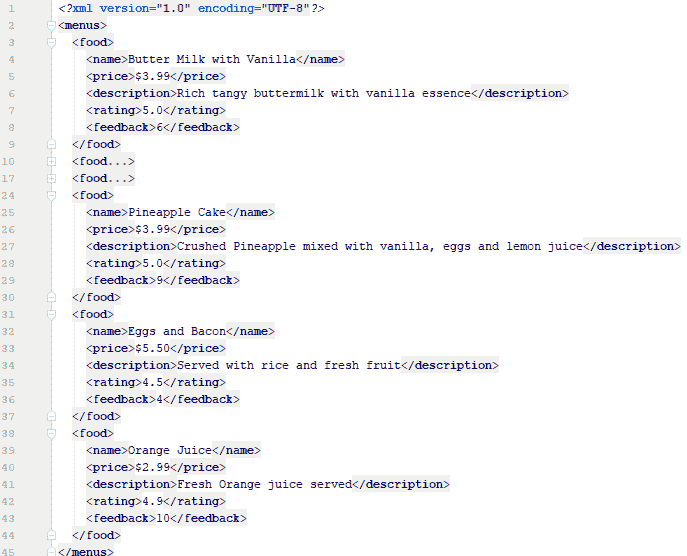

XML 内容

在以下示例中，我们将使用 Code Beautify 的 XPath-Tester（[`codebeautify.org/Xpath-Tester`](https://codebeautify.org/Xpath-Tester)）。使用前面提供的 XML 源 URL 获取 XML 内容，并将其与 Code Beautify XPath-Tester 一起使用。

您可以使用[`codebeautify.org/Xpath-Tester`](https://codebeautify.org/Xpath-Tester)、[`www.freeformatter.com/xpath-tester.htm`](https://www.freeformatter.com/xpath-tester.html)或任何其他免费提供的 XPath 测试工具。

在 XML 文档中，一切都是一个节点，例如`menus`、`food`和`price`。XML 节点本身可以是一个元素（元素是具有开始和结束标记的类型或实体）。

前面的 XML 文档也可以被视为继承的元素块。父节点`menus`包含多个子节点`food`，这些子节点区分适当的值和适当的数据类型。如下截图所示，XPath 表达式`//food`显示了所选节点`food`的结果。节点选择还检索了父节点中的子节点，如下截图所示：

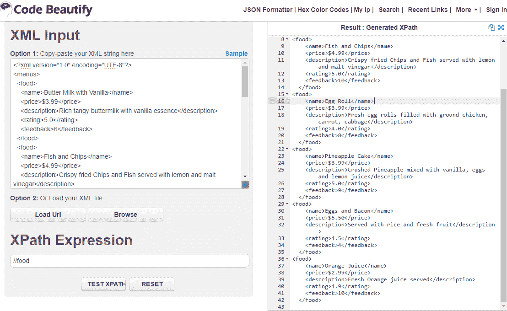

XPath //food 的结果（使用 https://codebeautify.org/Xpath-Tester）

以下截图中的 XPath 表达式选择了所有父节点`food`中找到的子节点`price`。有六个可用的子`food`节点，每个节点都包含`price`、`name`、`description`、`feedback`和`rating`：

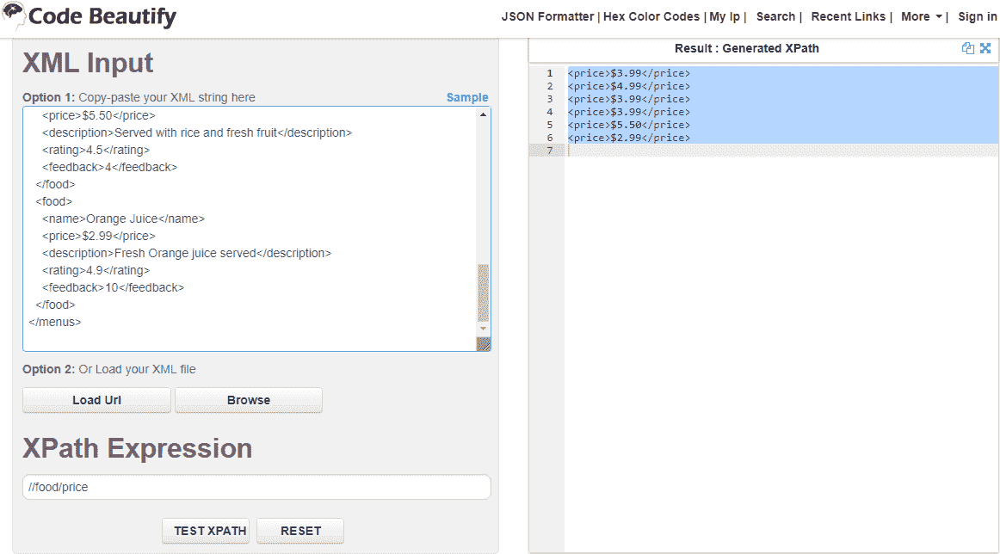

XPath //food/price 的结果（使用 https://codebeautify.org/Xpath-Tester）

从前面测试的两个 XPath 可以看出，表达式几乎像文件系统（命令行或终端路径）一样创建，我们在各种操作系统中使用。XPath 表达式包含代码模式、函数和条件语句，并支持使用谓词。

谓词用于识别特定的节点或元素。谓词表达式使用方括号编写，类似于 Python 列表或数组表达式。

在前面的 XML 中给出的 XPath 表达式的简要解释列在以下表中：

| **XPath 表达式** | **描述** |
| --- | --- |
| `//` | 选择文档中的节点，无论它们位于何处 |
| `//*` | 选择文档中的所有元素 |
| `//food` | 选择元素`food` |
| `*` | 选择所有元素 |

| `//food/name &#124; //food/price` | 选择在`food`节点中找到的`name`和`price`元素：

```py
<name>Butter Milk with Vanilla</name>
 <name>Fish and Chips</name>
 <price>$5.50</price>
 <price>$2.99</price>
```

|

| `//food/name` | 选择`food`中的所有`name`元素：

```py
<name>Butter Milk with Vanilla</name>
 <name>Eggs and Bacon</name>
 <name>Orange Juice</name>
```

|

| `//food/name/text()` | 仅选择所有`food/name`元素的`text`：

```py
Butter Milk with Vanilla Orange Juice
```

|

| `//food/name &#124; //rating` | 选择文档中`food`和`rating`中找到的所有`name`元素：

```py
<name>Butter Milk with Vanilla</name>
 <name>Fish and Chips</name><rating>4.5</rating>
 <rating>4.9</rating>
```

|

| `//food[1]/name` | 选择第一个`food`节点的`name`元素：

```py
<name>Butter Milk with Vanilla</name>
```

|

| `//food[feedback<9]` | 选择满足谓词条件`feedback<9`的`food`节点及其所有元素：

```py
<food>
 <name>Butter Milk with Vanilla</name>
 <name>Egg Roll</name>
 <name>Eggs and Bacon</name>
 </food>
```

|

| `//food[feedback<9]/name` | 选择满足条件的`food`节点和`name`元素：

```py
<name>Butter Milk with Vanilla</name>
 <name>Egg Roll</name>
 <name>Eggs and Bacon</name>
```

|

| `//food[last()]/name` | 选择最后一个`food`节点的`name`元素：

```py
<name>Orange Juice</name>
```

|

| `//food[last()]/name/text()` | 选择最后一个`food`节点的`name`元素的`text`：

```py
Orange Juice
```

|

| `sum(//food/feedback)` | 提供所有`food`节点中反馈的总和：

```py
47.0
```

|

| `//food[rating>3 and rating<5]/name` | 选择满足谓词条件的`food`的`name`：

```py
<name>Egg Roll</name>
<name>Eggs and Bacon</name>
<name>Orange Juice</name>
```

|

| `//food/name[contains(.,"Juice")]` | 选择包含`Juice`字符串的`food`的`name`：

```py
<name>Orange Juice</name>
```

|

| `//food/description[starts-with(.,"Fresh")]/text()` | 选择以“新鲜”开头的描述节点的文本：

```py
Fresh egg rolls filled with ground chicken, ... cabbage
Fresh Orange juice served
```

|

| `//food/description[starts-with(.,"Fresh")]` | 选择以“新鲜”开头的`description`节点的`text`：

```py
<description>Fresh egg rolls filled with.. cabbage</description>
 <description>Fresh Orange juice served</description>
```

|

| `//food[position()<3]` | 根据其位置选择第一个和第二个食物：

```py
<food>
 <name>Butter Milk with Vanilla</name>
 <price>$3.99</price>
 ...
 <rating>5.0</rating>
 <feedback>10</feedback>
 </food>
```

|

XPath 谓词可以包含从`1`（而不是`0`）开始的数字索引和条件语句，例如`//food[1]`或`//food[last()]/price`。

现在我们已经使用各种 XPath 表达式测试了前面的 XML，让我们考虑一个带有一些属性的简单 XML。属性是用于标识给定节点或元素的某些参数的额外属性。单个元素可以包含唯一的属性集。在 XML 节点或 HTML 元素中找到的属性有助于识别具有其所包含值的唯一元素。正如我们在以下 XML 代码中所看到的，属性以`key=value`信息对的形式出现，例如`id="1491946008"`：

```py
<?xml version="1.0" encoding="UTF-8"?>
<books>
     <book id="1491946008" price='47.49'>
        <author>Luciano Ramalho</author>
         <title>
            Fluent Python: Clear, Concise, and Effective Programming
        </title>
     </book>
     <book id="1491939362" price='29.83'>
         <author>Allen B. Downey</author>
         <title>
 Think Python: How to Think Like a Computer Scientist
        </title>
     </book>
</books>
```

XPath 表达式通过在键名前面添加`@`字符来接受`key`属性。以下表中列出了使用属性的 XPath 的一些示例，并附有简要描述。

| **XPath** **表达式** | **描述** |
| --- | --- |

| `//book/@price` | 选择`book`的`price`属性：

```py
price="47.49"
price="29.83"
```

|

| `//book` | 选择`book`字段及其元素：

```py
<book id="1491946008" price="47.49">

<author>Luciano Ramalho</author>
 <title>Fluent Python: Clear, Concise, and Effective Programming
 Think Python: How to Think Like a Computer Scientist
 </title></book>
```

|

| `//book[@price>30]` | 选择`price`属性大于`30`的`book`中的所有元素：

```py
<book id="1491946008" price="47.49">
 <author>Luciano Ramalho</author>
 <title>Fluent Python: Clear, Concise, and Effective Programming </title> </book>
```

|

| `//book[@price<30]/title` | 选择`price`属性小于`30`的书籍的`title`：

```py
<title>Think Python: How to Think Like a Computer Scientist</title>
```

|

| `//book/@id` | 选择`id`属性及其值。`//@id`表达式也会产生相同的输出：

```py
id="1491946008"
 id="1491939362"
```

|

| `//book[@id=1491939362]/author` | 选择`id=1491939362`的`book`中的`author`：

```py
<author>Allen B. Downey</author>
```

|

我们已经尝试探索和学习了一些关于 XPath 和编写表达式以检索所需内容的基本特性。在*使用 lxml 进行爬虫-一个 Python 库*部分，我们将使用 Python 编程库进一步探索使用 XPath 部署代码来爬取提供的文档（XML 或 HTML），并学习使用浏览器工具生成或创建 XPath 表达式。有关 XPath 的更多信息，请参考*进一步阅读*部分中的链接。

# CSS 选择器

在第一章中，*网络爬虫基础*，在*了解网页开发和技术*部分，我们学习了 CSS 及其用于样式化 HTML 元素的用法，以及使用全局属性。 CSS 通常用于样式化 HTML，有各种方法可以将 CSS 应用于 HTML。

CSS 选择器（也称为 CSS 查询或 CSS 选择器查询）是 CSS 使用的定义模式，用于选择 HTML 元素，使用元素名称或全局属性（`ID`和`Class`）。 CSS 选择器如其名称所示，以各种方式选择或提供选择 HTML 元素的选项。

在下面的示例代码中，我们可以看到在`<body>`中找到的一些元素：

+   `<h1>`是一个元素和选择器。

+   `<p>`元素或选择器具有`class`属性和`header`样式类型。在选择`<p>`时，我们可以使用元素名称、属性名称或类型名称。

+   多个`<a>`在`<div>`中找到，但它们的`class`属性、`id`和`href`属性的值不同：

```py
<html>
<head>
    <title>CSS Selectors: Testing</title>
    <style>
        h1{color:black;}
        .header,.links{color: blue;}
        .plan{color: black;}
        #link{color: blue;}
    </style>
</head>
<body>
    <h1>Main Title</h1>
    <p class=”header”>Page Header</p>
    <div class="links">
         <a class="plan" href="*.pdf">Document Places</a>
         <a id="link" href="mailto:xyz@domain.com">Email Link1!</a>
         <a href="mailto:abc@domain.com">Email Link2!</a>    
    </div>
</body>
</html>
```

我们在前面的代码中识别出的可区分的模式可以用于单独或分组选择这些特定元素。在线上有许多 DOM 解析器，它们提供了与 CSS 查询相关的功能。其中一个，如下面的屏幕截图所示，是[`try.jsoup.org/`](https://try.jsoup.org/)：

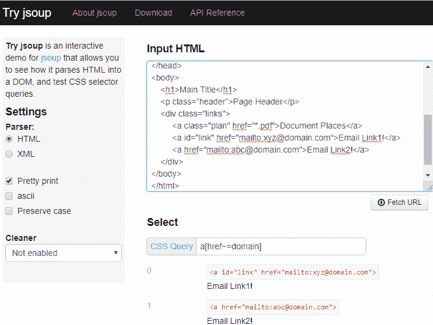

从 https://try.jsoup.org/评估 CSS 查询 DOM 解析器将提供的 XML 或 HTML 转换为 DOM 对象或树类型的结构，从而便于访问和操作元素或树节点。有关 DOM 的更多详细信息，请访问[`dom.spec.whatwg.org/`](https://dom.spec.whatwg.org/)。

在 CSS 查询中，以下代码文本中列出的各种符号代表特定的特征，并且可以在 CSS 查询中使用：

+   全局`id`属性和`class`由`#`和`.`表示，如此查询所示：

+   `a#link`: `<a id="link" href="mailto:xyz@domain.com">Email Link1!</a>`

+   `a.plan`: `<a class="plan" href="*.pdf">Document Places</a>`

+   组合符（显示元素之间的关系）也被使用，例如`+`、`>`、`~`和空格字符，如此查询所示：

+   `h1 + p`: `<p class=”header”>Page Header</p>`

+   `div.links a.plan`: `<a class="plan" href="*.pdf">Document Places</a>`

+   诸如`^`、`*`、`$`之类的运算符用于定位和选择，如此查询所示：

+   `a[href$="pdf"]`: `<a class="plan" href="*.pdf">Document Places</a>`

+   `a[href^="mailto"]`: `<a id="link" href="mailto:xyz@domain.com">Email Link1!</a><a href="mailto:abc@domain.com">Email Link2!</a>`

这些符号在以下各节中并排使用和解释，参考前面 HTML 代码中各种类型的选择器。

# 元素选择器

元素选择器是从 HTML 中选择元素的基本选择器。通常，这些元素是 HTML 的基本标签。以下表格列出了此类别的一些选择器及其用法：

| **CSS 查询** | **描述** |
| --- | --- |
| `h1` | 选择`<h1>`元素 |
| `a` | 选择所有`<a>`元素 |
| `*` | 选择 HTML 代码中的所有元素 |
| `body *` | 选择`<body>`中的所有`<h1>`、`<p>`、`<div>`和`<a>`元素 |
| `div a` | 选择`<div>`中的所有`<a>`（使用空格字符之间） |
| `h1 + p` | 选择`<h1>`后面的直接`<p>`元素 |
| `h1 ~ p` | 选择`<h1>`之前的每个`<p>`元素 |
| `h1,p` | 选择所有`<h1>`和`<p>`元素 |
| `div > a` | 选择所有是`<div>`的直接子元素的`<a>`元素 |

# ID 和类选择器

ID 和类选择器是元素选择器的附加功能。我们可以找到具有`class`和`id`属性的 HTML 标签。这些也被称为全局属性。这些属性通常优先于其他属性，因为它们定义了结构和标识的标签。

有关全局属性的更多详细信息，请参阅第一章，*Web Scraping Fundamentals*，*全局属性*部分。以下表格列出了此类选择器的用法：

| **CSS 查询** | **描述** |
| --- | --- |
| `.header` | 选择具有`class=header`的元素 |
| `.plan` | 选择具有`class=plan`的`<a>` |
| `div.links` | 选择`class=plan`的`<div>` |
| `#link` | 选择具有`id=link`的元素 |
| `a#link` | 选择具有`id=link`的`<a>`元素 |
| `a.plan` | 选择具有`class=plan`的`<a>`元素 |

# 属性选择器

属性选择器用于定义具有可用属性的选择器。HTML 标签包含一个属性，该属性有助于识别具有该属性和其携带的值的特定元素。

以下表格列出了一些显示属性选择器用法的方式：

| **CSS 查询** | **描述** |
| --- | --- |

| `a[href*="domain"]` | 选择`<a>`元素，其`href`中包含`domain`子字符串：

```py
<a id="link" href="mailto:xyz@domain.com">Email Link1!</a> 
<a href="mailto:abc@domain.com">Email Link2!</a>
```

|

| `a[href^="mailto"]` | 选择以`href`属性的`mailto`子字符串开头的`<a>`元素：

```py
<a id="link" href="mailto:xyz@domain.com">Email Link1!</a> 
<a href="mailto:abc@domain.com">Email Link2!</a>
```

|

| `a[href$="pdf"]` | 选择`<a>`元素，其`href`属性末尾有`pdf`子字符串：

```py
<a class="plan" href="*.pdf"> Document Places </a>
```

|

| `[href~=do]` | 选择所有具有`href`属性并在值中匹配`do`的元素。以下两个`<a>`元素的`href`值中都包含`do`：

```py
<a id="link" href="mailto:xyz@domain.com">Email Link1!</a> 
<a href="mailto:abc@domain.com">Email Link2!</a>
```

|

| `[class]` | 选择所有具有`class`属性的元素或`<p>`、`<div>`和`<a>`：

```py
<p class='header'>Page Header</p>
<div class="links">
<a class="plan" href="*.pdf"> Document Places </a>
```

|

| `[class=plan]` | 选择`class=plan`的`<a>`：

```py
<a class="plan" href="*.pdf"> Document Places </a>
```

|

# 伪选择器

伪选择器是一组方便的选择，用于根据其位置识别或选择元素。

以下表格列出了这些类型选择器的一些用法及简要描述：

| **CSS 查询** | **描述** |
| --- | --- |

| `a:gt(0)` | 选择除了索引为`0`的所有`<a>`元素：

```py
<a id="link" href="mailto:xyz@domain.com">Email Link1!</a> <a href="mailto:abc@domain.com">Email Link2!</a> 
```

|

| `a:eq(2)` | 选择索引为`2`的`<a>`元素：

```py
<a href="mailto:abc@domain.com">
```

|

| `a:first-child` | 选择其父元素中是第一个子元素的每个`<a>`元素：

```py
<a class="plan" href="*.pdf">Document Places</a>
```

|

| `a:last-child` | 选择其父元素中是最后一个子元素的每个`<a>`元素：

```py
<a href="mailto:abc@domain.com">Email Link2!</a>
```

|

| `a:last-of-type` | 选择其父元素的最后一个`<a>`元素：

```py
<a href="mailto:abc@domain.com">Email Link2!</a>
```

|

| `:not(p)` | 选择除了`<p>`之外的所有元素。 |
| --- | --- |

| `a:nth-child(1)` | 选择其父元素中是第一个子元素的每个`<a>`元素：

```py
<a class="plan" href="*.pdf">Document Places</a>
```

|

| `a:nth-last-child(3)` | 选择其父元素中倒数第三个位置的每个`<a>`元素：

```py
<a class="plan" href="*.pdf">Document Places</a>
```

|

| `a:nth-of-type(3)` | 选择其父元素的每第三个`<a>`元素：

```py
<a href="mailto:abc@domain.com">Email Link2!</a>
```

|

| `a:nth-last-of-type(3)` | 选择其父元素中倒数第三个位置的每个`<a>`元素：

```py
<a class="plan" href="*.pdf">Document Places</a>
```

|

CSS 选择器被用作选择元素的方便替代方法，与绝对 XPath 相比，它们长度更短，并且在表达式中使用简单模式，易于阅读和管理。CSS 选择器可以转换为 XPath 表达式，但反之则不行。

还有许多在线工具可用，允许将 CSS 选择器查询转换为 XPath 表达式；其中一个是[`css-selector-to-xpath.appspot.com/`](https://css-selector-to-xpath.appspot.com/)，如下截图所示；我们不应总是信任可用的工具，应在应用于代码之前进行测试结果：

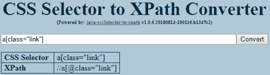

CSS 选择器转 XPath 转换器

如前面的截图所述，CSS 选择器用于从数据提取的角度选择元素，并且可以在`Scraper`代码中使用，甚至可以在应用样式到所选元素的样式方面使用。

在本节中，我们学习了 XPath 和 CSS 选择器的最流行的与网络相关的模式查找技术。在下一节中，我们将探索基于浏览器的开发者工具（DevTools），并学习如何使用 DevTools 内部的功能。DevTools 可用于搜索、分析、识别和选择元素，并获取 XPath 表达式和 CSS 选择器。

# 使用 Web 浏览器开发者工具访问 Web 内容

在第一章中，*网络抓取基础知识*，在*数据查找技术*（从网络中获取数据）部分和*开发者工具（DevTools）*内部，我们介绍了基于浏览器的 DevTools 来定位内容和探索各种面板。DevTools 提供各种功能面板，为我们提供支持工具来管理相关资源。

在这个特定的部分，我们的目的将是特定地识别持有我们正在寻找的内容的特定元素。这种基于标识的信息，比如 XPath 表达式、CSS 查询，甚至是基于 DOM 的导航流，在编写`Scraper`时将会很有帮助。

我们将使用 Google Chrome 浏览网页。Chrome 内置了开发者工具，具有许多功能（用于元素识别、选择、DOM 导航等）。在接下来的部分，我们将探索并使用这些功能。

# HTML 元素和 DOM 导航

我们将使用[`books.toscrape.com/`](http://books.toscrape.com/)来自[`toscrape.com/`](http://toscrape.com/)。`toscrape`提供了与网页抓取相关的资源，供初学者和开发人员学习和实施`Scraper`。

让我们使用网页浏览器 Google Chrome 打开[`books.toscrape.com`](http://books.toscrape.com)的 URL，如下所示：

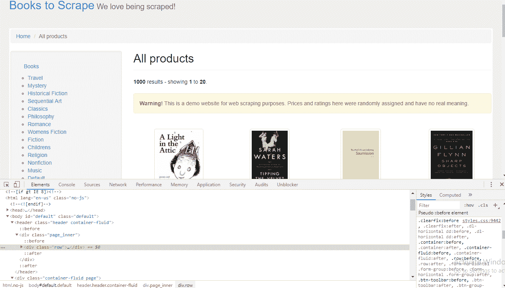books.toscrape.com 的检查视图

当页面内容成功加载后，我们可以右键单击页面并选择选项检查，或者按*Ctrl* + *Shift* + *I*来加载 DevTools。如果通过 Chrome 菜单访问，点击更多工具和开发者工具。浏览器应该看起来与前面的屏幕截图中的内容类似。

正如您在前面的屏幕截图中所看到的，在检查模式下，加载了以下内容：

+   面板元素默认位于左侧。

+   基于 CSS 样式的内容位于右侧。

+   我们注意到在左下角有 DOM 导航或元素路径，例如，`html.no-js body .... div.page_inner div.row`。

我们在第一章中已经对这些面板进行了基本概述，*Web Scraping Fundamentals*，在*Developer Tools*部分。随着开发者工具的加载，我们可以首先找到一个指针图标，这是用于从页面中选择元素的，如下图所示；这个元素选择器（检查器）可以使用*Ctrl* + *Shift* + *C*打开/关闭：

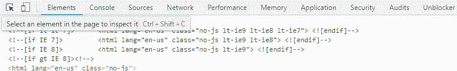

检查栏上的元素选择器（检查器）

打开元素选择器后，我们可以在页面上移动鼠标。基本上，我们正在使用鼠标搜索我们指向的确切 HTML 元素：

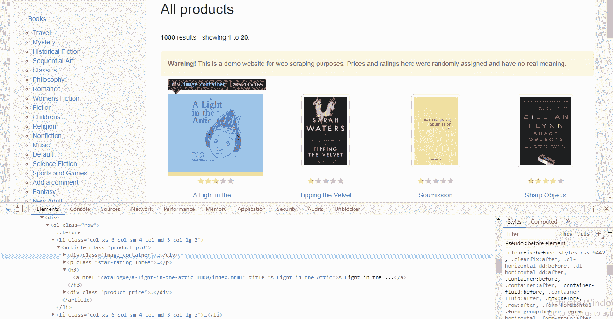

在书籍图片上使用元素选择器

如前面的屏幕截图所示，该元素已被选中，当我们将鼠标移动到第一本书的图片上时，这个动作会导致以下结果：

+   `div.image_container`元素在页面中显示并被选中。

+   在元素面板源中，我们可以找到特定的 HTML 代码`<div class="image_container">`，也被突出显示。这些信息（书籍图片的位置）也可以通过右键单击+页面源或*Ctrl* + *U*，然后搜索特定内容来找到。

我们可以重复对我们希望抓取的 HTML 内容的各个部分执行相同的操作，就像以下示例中所示的那样：

+   列出的书籍价格位于`div.product_price`元素内。

+   星级评分位于`p.star-rating`内。

+   书名位于`*<*h3>`内，在`div.product_price`之前或在`p.star-rating`之后。

+   书籍详细链接位于`<a>`内，该链接存在于`<h3>`内。

+   从下面的屏幕截图中，也清楚地看到了先前列出的元素都位于`article.product_prod`内。此外，在下面的屏幕截图底部，我们可以确定 DOM 路径为`article.product_prod`：

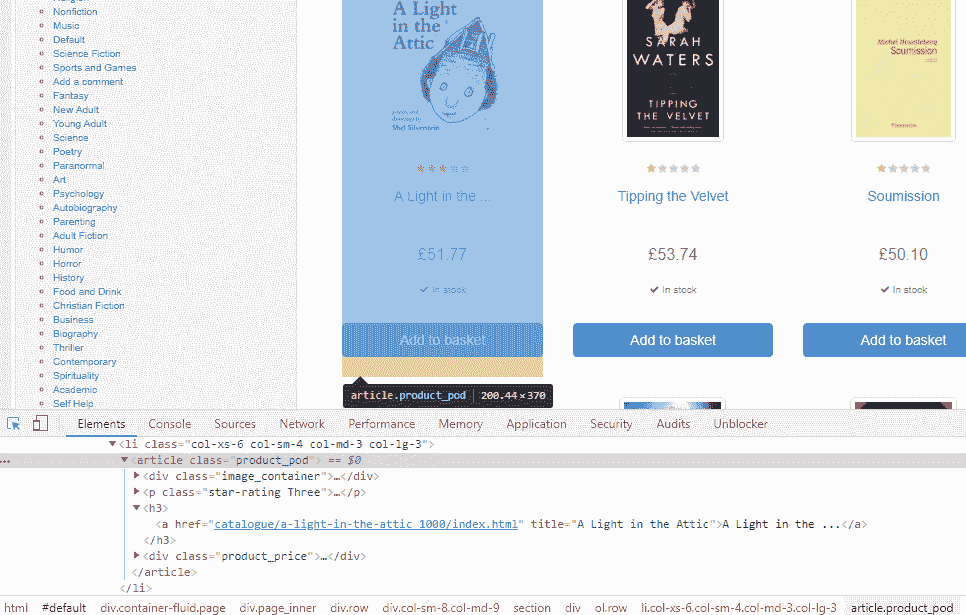

检查模式下的元素选择

在前面的截图中找到的 DOM 导航在处理 XPath 表达式时可能会有所帮助，并且可以使用页面源代码验证内容，如果元素检查器显示的路径或元素实际存在于获取的页面源代码中。

DOM 元素、导航路径和使用元素检查器或选择器找到的元素应该进行交叉验证，以确保它们在页面源代码或网络面板中存在。

# 使用 DevTools 获取 XPath 和 CSS 选择器

在本节中，我们将收集所需元素的 XPath 表达式和 CSS 查询。与我们在前一节中探索页面检查和元素面板的方式类似，让我们继续以下步骤，获取所选元素的 XPath 表达式和 CSS 查询：

1.  选择元素选择器并获取元素代码

1.  右键单击鼠标获取元素代码

1.  从菜单中选择复制选项

1.  从子菜单选项中，选择复制 XPath 以获取所选元素的 XPath 表达式

1.  或选择 CSS 选择器（查询）的复制选择器

如下截图所示，我们选择单个图书项目的各个部分，并获取相应的 CSS 选择器或 XPath 表达式，访问菜单选项：

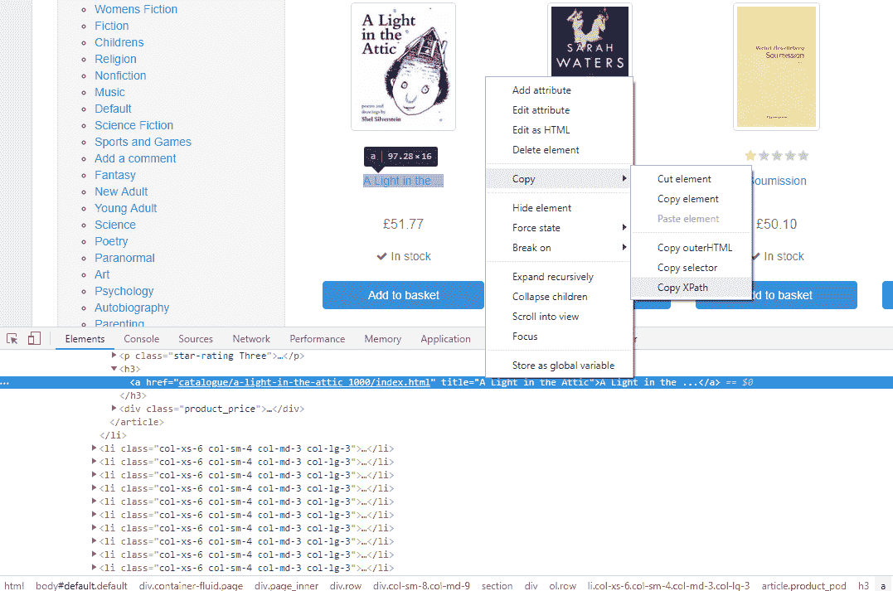

使用页面检查复制 XPath 和 CSS 选择器

以下是使用 DevTools 收集的一些 XPath 和 CSS 选择器，用于产品的可用项目，如图书标题和价格。

**使用 DevTools 获取 XPath 选择器**：

+   图书标题：`//*[@id="default"]/div/div/div/div/section/div[2]/ol/li[1]/article/h3/a`

+   价格：`//*[@id="default"]/div/div/div/div/section/div[2]/ol/li[1]/article/div[2]`

+   图片：`//*[@id="default"]/div/div/div/div/section/div[2]/ol/li[1]/article/div[1]`

+   库存信息：`//*[@id="default"]/div/div/div/div/section/div[2]/ol/li[1]/article/div[2]/p[2]`

+   星级评分：`//*[@id="default"]/div/div/div/div/section/div[2]/ol/li[1]/article/p`

**使用 DevTools 获取 CSS 查询选择器**：

+   图书标题：`#default > div > div > div > div > section > div:nth-child(2) > ol > li:nth-child(1) > article > h3 > a`

+   价格：`#default > div > div > div > div > section > div:nth-child(2) > ol > li:nth-child(1) > article > div.product_price`

+   图片：`#default > div > div > div > div > section > div:nth-child(2) > ol > li:nth-child(1) > article > div.image_container`

+   库存信息：`#default > div > div > div > div > section > div:nth-child(2) > ol > li:nth-child(1) > article > div.product_price > p.instock.availability`

+   星级评分：`#default > div > div > div > div > section > div:nth-child(2) > ol > li:nth-child(1) > article > p.star-rating`

同样，其他必要的 XPath 或 CSS 选择器也将根据需要收集。在收集和验证或清理（缩短）这些表达式和查询之后，使用 Python 编程应用爬虫逻辑来自动化数据收集。

同样，没有特定的方法可以避开前一节中讨论的步骤。XPath 或 CSS 选择器也可以通过显示 HTML 源代码或页面源代码来确定或形成；还有许多支持类似任务的基于浏览器的扩展。开发人员可以选择任何我们讨论过的处理 XPath 和 CSS 选择器的方法来感到舒适。

最近列出的基于浏览器的扩展之一，用于生成 Google Chrome 的 XPath 和 CSS 选择器是 ChroPath ([`autonomiq.io/chropath/`](https://autonomiq.io/chropath/)[)](https://autonomiq.io/chropath/)。建议自行练习和了解编写自定义表达式和查询。在处理大量信息源时，应使用扩展和其他类似应用程序。

在本节中，我们检查和探索了元素面板，用于元素识别和 DOM 导航：修改、删除元素、修改脚本等。元素面板中也存在相关选项。在接下来的部分中，我们将使用 Python 库`lxml`来编写`Scraper`，并使用 XPath 和 CSS 选择器从选择的网站收集数据。

# 使用 lxml，一个 Python 库

lxml 是一个 XML 工具包，具有丰富的库集来处理 XML 和 HTML。lxml 在 Python 中比其他基于 XML 的库更受青睐，因为它具有高速和有效的内存管理。它还包含各种其他功能，用于处理小型或大型 XML 文件。Python 程序员使用 lxml 来处理 XML 和 HTML 文档。有关 lxml 及其库支持的更详细信息，请访问[`lxml.de/.`](https://lxml.de/)

lxml 提供了对 XPath 和 XSLT 的本机支持，并构建在强大的 C 库`libxml2`和`libxslt`之上。它的库集通常与 XML 或 HTML 一起使用，用于访问 XPath、解析、验证、序列化、转换和扩展 ElementTree 的功能([`effbot.org/zone/element-index.htm#documentation`](http://effbot.org/zone/element-index.htm#documentation))。从 lxml 中解析、遍历 ElementTree、XPath 和类似 CSS 选择器的功能使其足够方便用于诸如网络抓取之类的任务。lxml 还用作 Python Beautiful Soup ([`www.crummy.com/software/BeautifulSoup/bs4/doc/`](https://www.crummy.com/software/BeautifulSoup/bs4/doc/))和 pandas ([`pandas.pydata.org/`](https://pandas.pydata.org/))中的解析引擎。

标记语言的元素，如 XML 和 HTML，具有开始和结束标记；标记也可以具有属性并包含其他元素。ElementTree 是一个加载 XML 文件为元素树的包装器。Python 内置库 ElementTree (etree) 用于搜索、解析元素和构建文档树。元素对象还具有与 Python 列表和字典相关的各种可访问属性。

XSLT 是一种将 XML 文档转换为 HTML、XHML、文本等的语言。XSLT 使用 XPath 在 XML 文档中导航。XSLT 是一种模板类型的结构，用于将 XML 文档转换为新文档。

lxml 库包含以下重要模块：

+   `lxml.etree` ([`lxml.de/api/lxml.etree-module.html`](https://lxml.de/api/lxml.etree-module.html))：解析和实现 ElementTree；支持 XPath、迭代等

+   `lxml.html` ([`lxml.de/api/lxml.html-module.html`](https://lxml.de/api/lxml.html-module.html))：解析 HTML，支持 XPath、CSSSelect、HTML 表单和表单提交

+   `lxml.cssselect` ([`lxml.de/api/lxml.cssselect-module.html`](https://lxml.de/api/lxml.cssselect-module.html))：将 CSS 选择器转换为 XPath 表达式；接受 CSS 选择器或 CSS 查询作为表达式

# 通过示例学习 lxml

lxml 具有大量的模块集，在本节中，我们将学习使用大部分功能的示例来探索 lxml，然后再进行抓取任务。这些示例旨在进行提取活动，而不是开发。

# 示例 1 - 从文件中读取 XML 并遍历其元素

在这个例子中，我们将读取`food.xml`文件中可用的 XML 内容。我们将使用 XML 内容：

```py
from lxml import etree
xml = open("food.xml","rb").read() #open and read XML file
```

从前面的代码中获得的 XML 响应需要使用`lxml.etree.XML()`进行解析和遍历。`XML()`函数解析 XML 文档并返回`menus`根节点，在这种情况下。有关`lxml.etree`的更详细信息，请参阅[`lxml.de/api/lxml.etree-module.html`](https://lxml.de/api/lxml.etree-module.html)：

```py
tree = etree.XML(xml) 
#tree = etree.fromstring(xml) #tree = etree.parse(xml) 
```

在前面的代码中找到的`fromstring()`和`parse()`函数也提供了内容给`lxml.etree`使用的默认或选择的解析器。

lxml 提供了多个解析器（XMLParser 和 HTMLParser），可以使用`>>> etree.get_default_parser()`来查找代码中使用的默认解析器。在前面的情况下，结果是`<lxml.etree.XMLParser>`。

让我们验证解析后得到的`tree`：

```py
print(tree)  
print(type(tree))   

<Element menus at 0x3aa1548>
<class 'lxml.etree._Element'>
```

前两个语句证实了`tree`是`lxml.etree._Element`类型的 XML 根元素。要遍历树中的所有元素，可以使用树迭代，这会按照它们被找到的顺序返回元素。

使用`iter()`函数执行树迭代。可以通过元素属性`tag`访问元素的标签名称；类似地，可以通过`text`属性访问元素的文本，如下所示：

```py
for element in tree.iter():
    print("%s - %s" % (element.tag, element.text))
```

前述树迭代将产生以下输出：

```py
menus - 
food - 

name - Butter Milk with Vanilla
price - $3.99
description - Rich tangy buttermilk with vanilla essence
rating - 5.0
feedback - 6
.............
food - 

name - Orange Juice
price - $2.99
description - Fresh Orange juice served
rating - 4.9
feedback - 10
```

我们也可以将子元素作为参数传递给树迭代器（`price`和`name`），以获取基于选定元素的响应。在通过`tree.iter()`传递子元素后，可以使用`element.tag`和`element.text`分别获取`Tag`和`Text`或`Content`子元素，如下所示：

```py
#iter through selected elements found in Tree
for element in tree.iter('price','name'):
 print("%s - %s" % (element.tag, element.text))

name - Butter Milk with Vanilla
price - $3.99
name - Fish and Chips
price - $4.99
...........
name - Eggs and Bacon
price - $5.50
name - Orange Juice
price - $2.99
```

还要注意的是，`food.xml`文件是以`rb`模式而不是`r`模式打开的。处理本地基于文件的内容和带有编码声明的文件时，比如`<?xml version="1.0" encoding="UTF-8"?>`，有可能会遇到错误，如`ValueError: Unicode strings with encoding declaration are not supported. Please use bytes input or XML fragments without declaration`。对内容进行编码/解码可能会解决这个问题，这也取决于文件模式。

要处理前述条件或从文件、HTTP URL 或 FTP 中读取内容，`parse()`是一个非常有效的方法。它使用默认解析器，除非指定了一个额外的参数。以下代码演示了`parse()`函数的使用，它被迭代以获取元素名称以获取其文本：

```py
from lxml import etree

#read and parse the file
tree = etree.parse("food.xml")

#iterate through 'name' and print text content
for element in tree.iter('name'):
    print(element.text)
```

前面的代码会产生以下输出：`Butter Milk with Vanilla`，`Fish and Chips`等，这些都是从`name`元素和`food.xml`文件中获取的。

```py
Butter Milk with Vanilla
Fish and Chips
Egg Roll
Pineapple Cake
Eggs and Bacon
Orange Juice
```

多个树元素也可以被迭代，如下所示：

```py
for element in tree.iter('name','rating','feedback'):
 print("{} - {}".format(element.tag, element.text))

name - Butter Milk with Vanilla
rating - 5.0
feedback - 6
name - Fish and Chips
rating - 5.0
...........
feedback - 4
name - Orange Juice
rating - 4.9
feedback - 10

```

# 示例 2 - 使用 lxml.html 读取 HTML 文档

在这个例子中，我们将使用`lxml.html`模块来遍历来自[`httpbin.org/forms/post`](http://httpbin.org/forms/post)的元素：

```py
from lxml import html
from urllib.request import urlopen

root = html.parse(urlopen('http://httpbin.org/forms/post')).getroot()
tree = html.parse(urlopen('http://httpbin.org/forms/post')) print(type(root)) #<class 'lxml.html.HtmlElement'> print(type(tree)) #<class 'lxml.etree._ElementTree'>
```

我们正在使用`lxml.html`中的`parse()`来加载给定 URL 的内容。`parse()`的作用类似于`lxml.etree`，但在这种情况下，得到的`root`是 HTML 类型。`getroot()`方法返回文档根。可以比较`root`和`tree`的对象类型，如前面的代码所示。在这个例子中，我们对`root`或 HTMLElement 感兴趣。解析为`root`的内容如下截图所示：

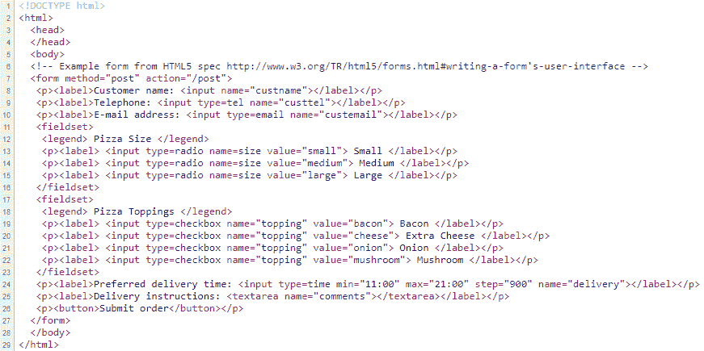

页面源代码：http://httpbin.org/forms/post

HTMLElement `root`具有各种属性，如下所示：

```py
print(dir(root)) 

[...'addnext', 'addprevious', 'append', 'attrib', 'base', 'base_url', 'body', 'clear', 'cssselect', 'drop_tag', 'drop_tree', 'extend', 'find', 'find_class', 'find_rel_links', 'findall', 'findtext', 'forms', 'get', 'get_element_by_id', 'getchildren', 'getiterator', 'getnext', 'getparent', 'getprevious', 'getroottree', 'head', 'index', 'insert', 'items', 'iter', 'iterancestors', 'iterchildren', 'iterdescendants', 'iterfind', 'iterlinks', 'itersiblings', 'itertext', 'keys', 'label', 'make_links_absolute', 'makeelement', 'nsmap', 'prefix', 'remove', 'replace', 'resolve_base_href', 'rewrite_links', 'set', 'sourceline', 'tag', 'tail', 'text', 'text_content', 'values', 'xpath']
```

让我们从`root`中找到`<p>`；可以使用`find()`来定位路径中的第一个元素。可以使用`text_content()`函数检索文本。`findtext()`函数也可以用于类似情况，如下所示：

```py
p = root.find('.//p') #find first <p> from root

print(p.text_content())  *# Customer name:*
print(root.findtext('.//p/label')) *#Customer name:* 
```

如下代码所示，`findall()`用于查找和遍历`root`中的所有元素：

```py
elemP = root.findall('.//p') #find all <p> element from root
for p in elemP  :
    print(p.text_content())
```

前面的代码列出了查找所有`p`标签的文本，如下所示：

```py
Customer name: 
Telephone: 
E-mail address: 
 Small 
 Medium 
 Large 
 Bacon 
 Extra Cheese 
 Onion 
 Mushroom 
Preferred delivery time: 
Delivery instructions: 
Submit order
```

HTMLElement `root`也支持 XPath 和 CSSSelect：

```py
print(root.xpath('//p/label/input/@value'))
print(root.xpath('//legend/text()')) 
```

这将产生以下输出：

```py
['small','medium','large','bacon','cheese','onion','mushroom']
['Pizza Size', 'Pizza Toppings'] 
```

CSSSelect 将 CSS 选择器转换为 XPath 表达式，并与相关对象一起使用：

```py
#print text_content() for label inside <p>
for e in root.cssselect('p label'):
    print(e.text_content())

Customer name: 
Telephone: 
E-mail address: 
 Small 
 ......
 Mushroom 
Preferred delivery time: 
Delivery instructions:

#print text_content for element <p> inside <form>
for e in root.cssselect('form > p'):
    print(e.text_content())

Customer name: 
Telephone: 
E-mail address: 
Preferred delivery time: 
Delivery instructions: 
Submit order
```

以下代码演示了 HTML `<form>`元素被探索其属性和属性。我们首先针对`root`中的`<form>`元素进行操作，即`<form method="post" action="/post">`：

```py
print(root.forms[0].action)  #http://httpbin.org/post
print(root.forms[0].keys())  #['method', 'action']
print(root.forms[0].items()) #[('method', 'post'), ('action', '/post')]
print(root.forms[0].method) # POST
```

从前面的代码中可以看到，输出显示为内联注释：

+   `action`返回`key`属性`action`的 URL 值。获得的 URL 实际上是一个将处理提交的信息或选择的选项的链接。

+   `items()`返回包含元素键和值的元组列表。

+   `keys()`返回元素键的列表。

+   `method` 返回属性`method`的值，即 HTTP 请求或 HTTP 方法。有关 HTTP 方法的更多信息，请参阅第一章，*Web Scraping Fundamentals*，*了解 Web 开发和技术*部分。

# 示例 3 - 读取和解析 HTML 以检索 HTML 表单类型元素属性

在这个例子中，我们将从[`httpbin.org/forms/post`](http://httpbin.org/forms/post)的 URL 中读取 HTML，其中包含基于 HTML 的表单元素。表单元素具有各种预定义属性，例如类型，值和名称，并且可以存在手动属性。在前面的示例中，我们尝试实现各种函数 - XPath 和 CSSSelect - 以从所需元素中检索内容。

在这里，我们将尝试收集在 HTML 表单元素中找到的属性及其值：

```py
from lxml import html
import requests
response = requests.get('http://httpbin.org/forms/post')

# build the DOM Tree
tree = html.fromstring(response.text)

for element in tree.iter('input'):
     print("Element: %s \n\tvalues(): %s \n\tattrib: %s \n\titems(): %s \n\tkeys(): %s"%
     (element.tag, element.values(),element.attrib,element.items(),element.keys()))
     print("\n")
```

在前面的代码中，对于给定的 URL 获得了`response.text`和一个`str`类型对象。`fromstring()`函数解析提供的字符串对象并返回根节点或 HTMLElement `tree`类型。

在这个例子中，我们正在迭代`input`元素或`<input...>`，并试图识别每个输入所拥有的属性。

前面的代码导致了以下输出：

```py
Element: input
     values(): ['custname']
     attrib: {'name': 'custname'}
     items(): [('name', 'custname')]
     keys(): ['name']
Element: input
     values(): ['tel', 'custtel']
     attrib: {'name': 'custtel', 'type': 'tel'}
     items(): [('type', 'tel'), ('name', 'custtel')]
     keys(): ['type', 'name']
.......
.......
Element: input
     values(): ['checkbox', 'topping', 'mushroom']
     attrib: {'name': 'topping', 'type': 'checkbox', 'value': 'mushroom'}
     items(): [('type', 'checkbox'), ('name', 'topping'), ('value', 'mushroom')]
     keys(): ['type', 'name', 'value']
Element: input
     values(): ['time', '11:00', '21:00', '900', 'delivery']
     attrib: {'max': '21:00', 'type': 'time', 'step': '900', 'min': '11:00', 'name': 'delivery'}
     items(): [('type', 'time'), ('min', '11:00'), ('max', '21:00'), ('step', '900'), ('name',     'delivery')]
     keys(): ['type', 'min', 'max', 'step', 'name']
```

在代码输出中，使用了一些与`<input>`元素一起使用的函数和属性。以下是示例中使用的一些代码及其解释：

+   `element.tag`：这 r

+   返回元素`tag`名称（例如，`input`）。

+   `element.values()`：HTML 表单元素的属性存在为`key:value`对。`value`属性包含特定元素的确切数据。`values()`返回`List`对象中所选元素的`value`属性。

+   `element.attrib`：`attrib`返回一个`Dict`类型对象（字典），其中包含`key:value`对。

+   `element.items()`：`items()`返回一个包含键和值的元组的`List`对象。

+   `element.keys()`：类似于

+   `items()`，`keys()` 返回`List`对象中的属性`key`。

通过前面的示例对 lxml 及其特性进行了概述，现在我们将执行一些网络抓取任务。

# 使用 lxml 进行网页抓取

在本节中，我们将利用迄今为止学到的大部分技术和概念，并实施一些抓取任务。

对于即将进行的任务，我们将首先选择所需的 URL。在这种情况下，它将是[`books.toscrape.com/`](http://books.toscrape.com/)，但是通过定位音乐类别，即[`books.toscrape.com/catalogue/category/books/music_14/index.html`](http://books.toscrape.com/catalogue/category/books/music_14/index.html)。有了选择的目标 URL，现在是时候探索网页并识别我们愿意提取的内容了。

我们希望收集每个页面中列出的每个个体项目（即`Article`元素）的标题，价格，可用性，`imageUrl`和评级等特定信息。我们将尝试使用 lxml 和 XPath 从单个和多个页面中抓取数据，以及使用 CSS 选择器。

关于元素识别，XPath，CSS 选择器和使用 DevTools，请参阅*使用 Web 浏览器开发人员工具访问 Web 内容*部分。

# 示例 1 - 使用 lxml.html.xpath 从单个页面提取选定的数据

在这个例子中，我们将使用 XPath 从提供的 URL 中收集信息并使用 lxml 特性。

在下面的代码中，`musicUrl`字符串对象包含一个指向页面的链接。`musicUrl`使用`parse()`函数进行解析，结果是`doc`和`lxml.etree.ElementTree`对象：

```py
import lxml.html
musicUrl= "http://books.toscrape.com/catalogue/category/books/music_14/index.html"
doc = lxml.html.parse(musicUrl)
```

现在我们有了一个可用的 ElementTree `doc`；我们将收集`musicUrl`页面上找到的标题和价格等字段的 XPath 表达式。有关生成 XPath 表达式，请参考*使用 DevTools 的 XPath 和 CSS 选择器*部分。

```py
#base element
articles = doc.xpath("//*[@id='default']/div/div/div/div/section/div[2]/ol/li[1]/article")[0]

#individual element inside base
title = articles.xpath("//h3/a/text()")
price = articles.xpath("//div[2]/p[contains(@class,'price_color')]/text()")
availability = articles.xpath("//div[2]/p[2][contains(@class,'availability')]/text()[normalize-space()]")
imageUrl = articles.xpath("//div[1][contains(@class,'image_container')]/a/img/@src")
starRating = articles.xpath("//p[contains(@class,'star-rating')]/@class")
```

上述`articles`的 XPath 包含了`<article>`内所有可用字段，例如`title`、`price`、`availability`、`imageUrl`和`starRating`。`articles`字段是一种具有子元素的父元素的表达式类型。此外，还声明了子元素的单独 XPath 表达式，例如`title`字段，即`title = articles.xpath("//h3/a/text()")`。我们可以注意到表达式中使用了`articles`。

还要注意，在子表达式中，元素属性或键名，如`class`或`src`也可以分别使用`@class`和`@src`。

现在，一旦设置了单独的表达式，我们就可以打印收集到的所有表达式的信息，并将其返回到 Python 列表中。收到的数据也已经使用`map()`、`replace()`和`strip()` Python 函数以及 Lambda 运算符进行了清理和格式化，如下面的代码所示：

```py
#cleaning and formatting 
stock = list(map(lambda stock:stock.strip(),availability))
images = list(map(lambda img:img.replace('../../../..','http://books.toscrape.com'),imageUrl))
rating = list(map(lambda rating:rating.replace('star-rating ',''),starRating))

print(title)
print(price)
print(stock)
print(images)
print(rating)
```

收集或提取的数据可能需要额外的清理任务，即删除不需要的字符、空格等。它可能还需要格式化或将数据转换为所需的格式，例如将字符串日期和时间转换为数值，等等。这两个操作有助于保持一些预定义或相同结构的数据。

上述代码的最终输出如下截图所示：

！[](assets/12cb33b8-3a35-4e8d-aa7e-64ccc854f962.png)

从所选页面获取各种数据的 Python 列表

从上述截图中可以看出，有一个针对目标数据的单独收集。以这种方式收集的数据可以合并到单个 Python 对象中，如下面的代码所示，也可以写入外部文件，例如 CSV 或 JSON，以进行进一步处理：

```py
#Merging all 
dataSet = zip(title,price,stock,images,rating)
print(list(dataSet))

[('Rip it Up and ...', '£35.02', 'In stock', 'http://books.toscrape.com/media/cache/81/c4/81c4a973364e17d01f217e1188253d5e.jpg', 'Five'), 
('Our Band Could Be ...', '£57.25', 'In stock', 'http://books.toscrape.com/media/cache/54/60/54607fe8945897cdcced0044103b10b6.jpg', 'Three'),
.........
......... 
('Old Records Never Die: ...', '£55.66', 'In stock', 'http://books.toscrape.com/media/cache/7e/94/7e947f3dd04f178175b85123829467a9.jpg', 'Two'), 
('Forever Rockers (The Rocker ...', '£28.80', 'In stock', 'http://books.toscrape.com/media/cache/7f/b0/7fb03a053c270000667a50dd8d594843.jpg', 'Three')]
```

上述代码中的`dataSet`是使用`zip()` Python 函数生成的。`zip()`收集所有提供的列表对象的单个索引，并将它们附加为元组。`dataSet`的最终输出对于每个`<article>`都有特定的值，就像前面的代码中所示的那样。

# 示例 2 - 使用 XPath 循环并从多个页面抓取数据

在示例 1 中，我们尝试了基于简单 XPath 的技术，用于单个页面上有限数量的结果的 URL。在这种情况下，我们将针对*食品和饮料*类别进行操作，即[`books.toscrape.com/catalogue/category/books/food-and-drink_33/index.html`](http://books.toscrape.com/catalogue/category/books/food-and-drink_33/index.html)，该类别的内容跨页面存在。在本例中将使用基于 XPath 的循环操作，这支持更有效地收集数据。

由于我们将处理多个页面，因此最好的做法是在浏览器中查找一些单独页面的 URL，以便在浏览列出的页面时找到这些 URL。大多数情况下，它可能包含一些模式，可以轻松解决难题，就像以下代码中使用的那样：

```py
import lxml.html
from lxml.etree import XPath

baseUrl = "http://books.toscrape.com/"

#Main URL
bookUrl = "http://books.toscrape.com/catalogue/category/books/food-and-drink_33/index.html"

#Page URL Pattern obtained (eg: page-1.html, page-2.html...)
pageUrl = "http://books.toscrape.com/catalogue/category/books/food-and-drink_33/page-"
```

`bookUrl`是我们感兴趣的主要 URL；它还包含下一页的页面链接，其中包含一个模式，如`pageUrl`中所找到的那样，例如`page-2.html`：

```py
dataSet = []
page=1
totalPages=1
while(page<=totalPages):
    print("Rows in Dataset: "+str(len(dataSet)))
    if(page==1):
        doc = lxml.html.parse(pageUrl+str(page)+".html").getroot()
        perPageArticles = doc.xpath("//*[@id=\"default\"]//form/strong[3]/text()")
        totalArticles = doc.xpath("//*[@id=\"default\"]//form/strong[1]/text()")
        totalPages = round(int(totalArticles[0])/int(perPageArticles[0]))
        print(str(totalArticles[0])+" Results, showing "+str(perPageArticles[0])+" Articles per page")
    else:
        doc = lxml.html.parse(pageUrl+str(page)+".html").getroot()

    #used to find page URL pattern
    nextPage = doc.xpath("//*[@id=\"default\"]//ul[contains(@class,'pager')]/li[2]/a/@href")
    if len(nextPage)>0: 
        print("Scraping Page "+str(page)+" of "+str(totalPages)+". NextPage > "+str(nextPage[0]))
    else:
        print("Scraping Page "+str(page)+" of "+str(totalPages))
```

定义了一个空的`dataSet`列表，用于保存跨页面找到的每篇文章的数据。

个人页面 URL 是通过将`pageUrl`与页面编号和`.html`连接而获得的。在从页面本身跟踪到的`totalArticles`和`perPageArticles`计算后找到`totalPages`。获得的`totalPages`将给出一个确切的循环计数，并且更容易应用于循环（`while`循环在代码中找到）：

```py
articles = XPath("//*[@id='default']//ol/li[position()>0]")

titlePath = XPath(".//article[contains(@class,'product_pod')]/h3/a/text()")
pricePath = XPath(".//article/div[2]/p[contains(@class,'price_color')]/text()")
stockPath = XPath(".//article/div[2]/p[2][contains(@class,'availability')]/text()[normalize-space()]")
imagePath = XPath(".//article/div[1][contains(@class,'image_container')]/a/img/@src")
starRating = XPath(".//article/p[contains(@class,'star-rating')]/@class")
```

正如我们在前面的代码中所看到的，`articles`是用于循环查找`<article>`字段内的各个元素的主要 XPath 表达式。该表达式应包含一个特定条件，可以满足以执行循环；在这种情况下，我们确定`<article>`字段存在于`<ol><li>`元素内部。

因此，我们可以使用`li[position()>0]`执行循环，该循环标识每个在`<ol>`中存在的`<li>`内找到的`<article>`字段，即`articles = XPath("//*[@id='default']//ol/li[position()>0]")`：

```py
#looping through 'articles' found in 'doc' i.e each <li><article> found in Page Source
for row in articles(doc): 
     title = titlePath(row)[0]
     price = pricePath(row)[0]
     availability = stockPath(row)[0].strip()
     image = imagePath(row)[0]
     rating = starRating(row)[0]

     #cleaning and formatting applied to image and rating
     dataSet.append([title,price,availability,image.replace('../../../..',baseUrl),rating.replace('star-rating','')])

page+=1 #updating Page Count for While loop

#Final Dataset with data from all pages. 
print(dataSet)
```

XPath 表达式的各个元素被定义为`titlePath`元素，`imagePath`元素等，以定位要获取的特定元素。最后，为文章设置的表达式被循环到每个页面获得的 HTMLElement 中，即`doc`元素，并收集每个`title`和`image`元素的第一次出现以及找到的其他元素。这些收集的数据被附加到`dataSet`字段中，作为经过清理和格式化的列表，其结果显示在以下截图中：

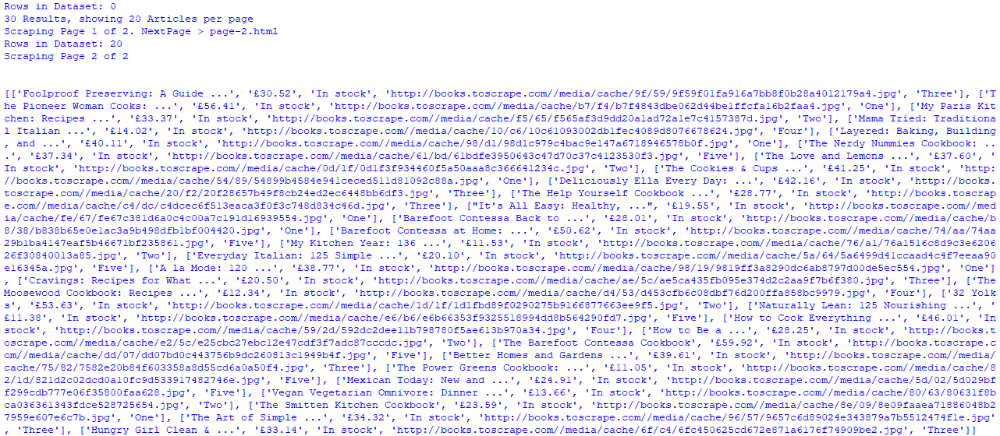

带有分页信息和 dataSet 内容的输出

# 示例 3 - 使用 lxml.cssselect 从页面中抓取内容

CSS 选择器具有广泛的查询选项，如*XPath 和 CSS 选择器简介*部分所述，并且通常用作 XPath 的简单替代方法。在前面的两个示例中，我们探索了 XPath 以收集所需的信息。在这个例子中，我们将使用 lxml 中的`cssselect`从[`developer.ibm.com/announcements/category/data-science/?fa=date%3ADESC&fb=`](https://developer.ibm.com/announcements/category/data-science/?fa=date%3ADESC&fb=)上的单个页面收集相关数据。

要识别 CSS 查询，可以浏览页面源代码或使用 DevTools。有关使用 DevTools 的更多详细信息，请参阅*使用 DevTools 进行 XPath 和 CSS 选择器*部分。在这种情况下，我们正在使用 DevTools 识别和收集 CSS 查询，如下截图所示：

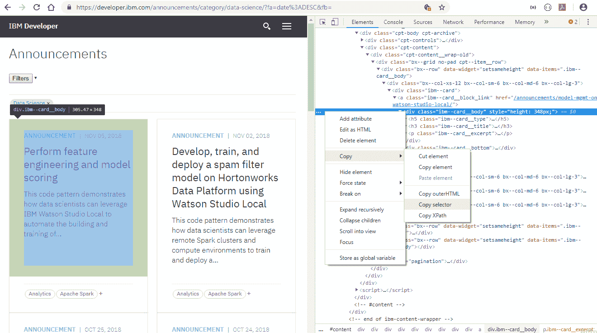

使用 DevTools 并从 https://developer.ibm.com/announcements 选择选择器

从上述截图中，我们可以看到，个别公告是由`a.ibm--card__block_link`在`div.ibm--card`内找到的块标识的，该块具有具有类的 HTML 元素，例如`ibm--card__body`和`ibm--card__type`。使用所描述的过程复制 CSS 选择器将分别为`a.ibm--card__block_link`和`div.ibm--card__body`生成以下列表：

+   `#content > div > div.code_main > div > div.cpt-content > div > div.bx--grid.no-pad.cpt--item__row > div:nth-child(1) > div:nth-child(1) > div > a`

+   `#content > div > div.code_main > div > div.cpt-content > div > div.bx--grid.no-pad.cpt--item__row > div:nth-child(1) > div:nth-child(1) > div > a > div.ibm--card__body`

让我们使用 Python 代码部署前面的概念，如下片段所示：

```py
from lxml import html
import requests
from lxml.cssselect import CSSSelector
url = 'https://developer.ibm.com/announcements/category/data-science/?fa=date%3ADESC&fb='
url_get = requests.get(url)
tree = html.document_fromstring(url_get.content)
```

所需的 Python 库和 URL 已声明，并且页面内容`url_get`已使用`lxml.html`进行解析。通过获得的`lxml.html.HTMLElement`，我们现在可以使用 XPath 或 CSS 选择器选择和导航到树中的所需元素：

```py
announcements=[]
articles = tree.cssselect('.ibm--card > a.ibm--card__block_link')

for article in articles:
    link = article.get('href')
    atype = article.cssselect('div.ibm--card__body > h5')[0].text.strip()
    adate = article.cssselect('div.ibm--card__body > h5 > .ibm--card__date')[0].text
    title = article.cssselect('div.ibm--card__body > h3.ibm--card__title')[0].text_content()
    excerpt= article.cssselect(' div.ibm--card__body > p.ibm--card__excerpt')[0].text
    category= article.cssselect('div.ibm--card__bottom > p.cpt-byline__categories span')

    #only two available on block: except '+'
    #announcements.append([link,atype,adate,title,excerpt,[category[0].text,category[1].text]])

    announcements.append([link,atype,adate,title,excerpt,[span.text for span in category if     span.text!='+']])

print(announcements)
```

`articles`是一个定义好的主要 CSS 查询，并且对在页面中找到的所有可用`articles`进行循环，作为`article`。每篇文章都有不同的元素，如类型、日期、标题、类别等。使用`text`、`text_content()`和`get()`来收集元素数据或属性。`cssselect`返回 Python 列表对象，因此使用索引，如`[0]`，来收集特定元素内容。

前面的代码中的`category`没有任何索引，因为它包含多个`<span>`元素，其值是使用列表推导技术提取的，同时附加或使用索引如注释中所示。代码获得的输出如下截图所示。尝试对数据进行了轻微的清理，但最终列表仍然包含获得的原始数据：

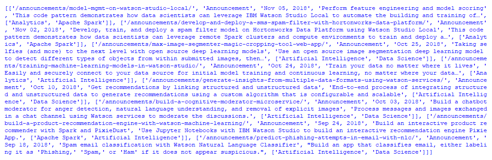

使用 lxml.cssselect 获取的列表公告的输出还要注意的是，使用 DevTools 复制或获取的 CSS 选择器查询在表达和长度上似乎与示例代码中的不同。DevTools 提供的查询包含从找到的所有选择的元素的父元素的详细信息和链接表达式。在代码中，我们只使用了特定元素的 CSS 查询。

# 总结

元素识别、基于 DOM 的导航、使用基于浏览器的开发者工具、部署数据提取技术以及对 XPath 和 CSS 选择器的概述，以及在 Python 库中使用 lxml，这些都是本章探讨的主要主题。

我们还通过使用 lxml 探索了各种示例，实现了不同的技术和库特性来处理元素和 ElementTree。最后，通过示例探讨了网页抓取技术，重点关注了在实际情况中可能出现的不同情况。

在下一章中，我们将学习更多关于网页抓取技术以及一些使用这些技术的新 Python 库。

# 进一步阅读

+   DOM：[`dom.spec.whatwg.org/`](https://dom.spec.whatwg.org/)

+   XPath：[`www.w3.org/TR/xpath/`](https://www.w3.org/TR/xpath/)，[`www.w3.org/TR/2017/REC-xpath-31-20170321/`](https://www.w3.org/TR/2017/REC-xpath-31-20170321/)

+   XML DOM：[`www.w3schools.com/xml/dom_intro.asp`](https://www.w3schools.com/xml/dom_intro.asp)

+   XPath 介绍：[`www.w3schools.com/xml/xpath_intro.asp`](https://www.w3schools.com/xml/xpath_intro.asp)

+   XPath 测试器：[`freeformatter.com/xpath-tester.html`](https://freeformatter.com/xpath-tester.html)，[`www.xpathtester.com/xslt`](http://www.xpathtester.com/xslt)，[`codebeautify.org/Xpath-Tester`](https://codebeautify.org/Xpath-Tester)

+   XPath 教程：[`doc.scrapy.org/en/xpath-tutorial/topics/xpath-tutorial.html`](https://doc.scrapy.org/en/xpath-tutorial/topics/xpath-tutorial.html)

+   CSS 选择器参考：[`www.w3schools.com/cssref/css_selectors.asp`](https://www.w3schools.com/cssref/css_selectors.asp)

+   CSS 伪类和元素：[`www.w3schools.com/css/css_pseudo_elements.asp`](https://www.w3schools.com/css/css_pseudo_elements.asp)

+   CSS 信息：[`www.css3.info/`](http://www.css3.info/)，[`developer.mozilla.org/en-US/docs/Web/CSS`](https://developer.mozilla.org/en-US/docs/Web/CSS)

+   CSS 查询解析器：[`try.jsoup.org/`](https://try.jsoup.org/)

+   CSS 选择器转换为 XPath：[`css-selector-to-xpath.appspot.com`](https://css-selector-to-xpath.appspot.com)

+   ElementTree 概述：[`effbot.org/zone/element-index.htm`](http://effbot.org/zone/element-index.htm)
