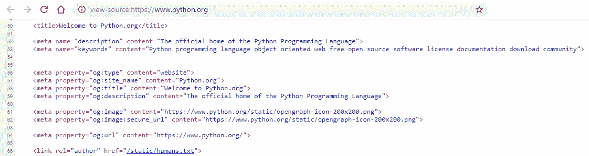
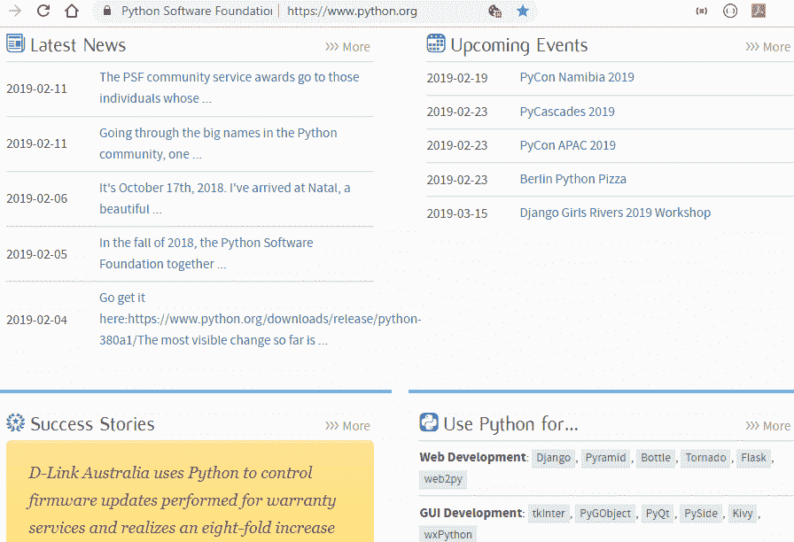
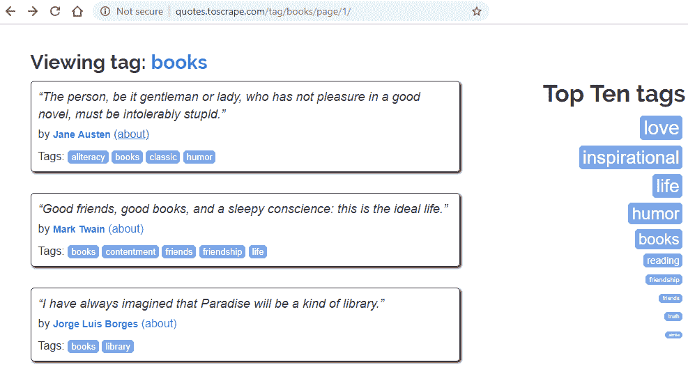
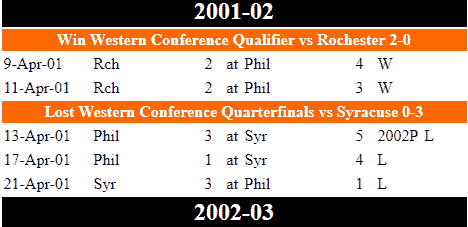
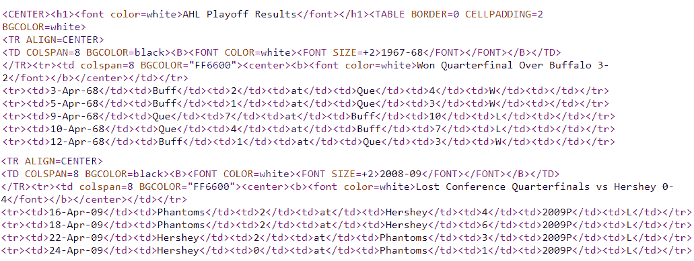
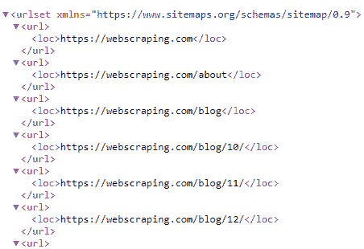

# 第四章：使用 pyquery 进行抓取-一个 Python 库

从本章开始，我们将探索与抓取相关的工具和技术，同时还将部署一些抓取代码。与 Web 探索、Python 库、元素识别和遍历相关的功能是我们迄今为止学到的主要概念。

Web 抓取通常是一个具有挑战性和漫长过程，需要了解网站的运行方式。基本的理解和识别用于构建网站的后端或工具将有助于任何抓取任务。这也与一种称为逆向工程的过程有关。有关此类工具的更多信息，请参阅第三章，*使用 LXML、XPath 和 CSS 选择器*，以及*使用 Web 浏览器开发工具访问 Web 内容*部分。除此之外，还需要识别用于遍历和操作 HTML 标记等元素的工具，`pyquery`就是其中之一。

在之前的章节中，我们探索了 XPath、CSS 选择器和 LXML。在本章中，我们将研究使用`pyquery`，它具有类似 jQuery 的能力，似乎更高效，因此在进行 Web 抓取过程时更容易处理。

在本章中，您将学习以下主题：

+   pyquery 简介

+   探索`pyquery`（主要方法和属性）

+   使用`pyquery`进行 Web 抓取

# 技术要求

本章需要一个 Web 浏览器（Google Chrome 或 Mozilla Firefox）。我们将使用以下 Python 库：

+   `pyquery`

+   `urllib`

+   `请求`

如果您当前的 Python 设置中不存在这些库，请参阅第二章，*Python 和 Web-使用 urllib 和 Requests*，以及*设置*部分，获取安装和设置帮助。

本章的代码文件可在本书的 GitHub 存储库中找到：[`github.com/PacktPublishing/Hands-On-Web-Scraping-with-Python/tree/master/Chapter04`](https://github.com/PacktPublishing/Hands-On-Web-Scraping-with-Python/tree/master/Chapter04)。

# pyquery 简介

`pyquery`是 Python 的类似 jQuery 的库，使用`lxml`库。这为处理标记元素提供了一个简单和交互式的环境，用于操作和遍历目的。

`pyquery`表达式也类似于`jquery`，具有`jquery`知识的用户将发现在 Python 中更方便使用。

`pyquery` Python 库，正如其名称所示，增强了与在 XML 和 HTML 中找到的元素相关的`query`编写过程。`pyquery`缩短了元素处理，并提供了更具洞察力的脚本编写方法，适用于抓取和基于 DOM 的遍历和操作任务。

`pyquery`表达式使用 CSS 选择器执行查询，以及它实现的其他功能。例如，`pyquery`使用以下表达式：

```py
page.find('a').attr('href')    -- (pyquery expression) 
```

`cssselect` 使用以下表达式：

```py
cssselect('a').get('href')      -- (cssselect expression)
```

jQuery（写得更少，做得更多）是最受欢迎的 JavaScript 库之一，体积小，速度快，具有许多支持 DOM/HTML/CSS 等功能。网页文档遍历、操作、事件处理、动画、AJAX 等是其主要特点。请访问[`jquery.com/`](https://jquery.com/)获取更多信息。有关`pyquery`及其文档的更多信息，请访问[`pythonhosted.org/pyquery/`](https://pythonhosted.org/pyquery/)或[`github.com/gawel/pyquery/`](https://github.com/gawel/pyquery/)。

# 探索 pyquery

在继续探索`pyquery`及其特性之前，让我们先通过使用`pip`来安装它：

```py
C:\> pip install pyquery
```

有关使用`pip`和库安装的更多信息，请参阅第二章中的*设置*部分，*Python 和 Web-使用 urllib 和 Requests*。

成功安装`pyquery`后，使用`pip`安装了以下库：

+   `cssselect-1.0.3`

+   `lxml-4.3.1`

+   `pyquery-1.4.0`

`>>>`在代码中表示使用 Python IDE；它接受代码或指令，并在下一行显示输出。

安装完成并成功后，我们可以使用`pyquery`，如下面的代码所示，来确认设置。我们可以使用`dir()`函数来探索它包含的属性：

```py
>>> from pyquery import PyQuery as pq

>>> print(dir(pq))
['Fn', '__add__', '__call__', '__class__', '__contains__', '__delattr__', '__delitem__', '__dict__', '__dir__', '__doc__', '__eq__', '__format__', '__ge__', '__getattribute__', '__getitem__', '__gt__',  '_filter_only', '_get_root', '_next_all', '_prev_all', '_translator_class', '_traverse','addClass', 'add_class', 'after', 'append', 'appendTo', 'append_to','attr','base_url','before','children', 'clear', 'clone', 'closest', 'contents', 'copy', 'count', 'css','each','empty', 'encoding','end','eq', 'extend', 'filter', 'find','fn','hasClass','has_class','height','hide', 'html', 'index','insert','insertAfter', 'insertBefore', 'insert_after','insert_before', 'is_', 'items', 'length','make_links_absolute',
'map','next','nextAll','next_all','not_','outerHtml','outer_html','parent','parents', 'pop', 'prepend', 'prependTo', 'prepend_to','prev', 'prevAll', 'prev_all', 'remove', 'removeAttr', 'removeClass', 'remove_attr', 'remove_class','remove_namespaces', 'replaceAll', 'replaceWith', 'replace_all', 'replace_with', 'reverse', 'root','show', siblings','size','sort','text', 'toggleClass', 'toggle_class', 'val', 'width', 'wrap', 'wrapAll','wrap_all','xhtml_to_html']
```

现在，我们将探索与抓取概念相关的`pyquery`的某些功能。为此，我们将使用从[`www.python.org`](https://www.python.org)获取的页面源代码，已将其保存为`test.html`以提供真实世界的可用性：



从 https://www.python.org 获取的页面源代码在 Google Chrome 中，您可以右键单击网页，选择“查看页面源代码”菜单选项，或按*Ctrl* + *U*获取页面源代码。

但仅仅获取页面源代码或 HTML 代码是不够的，因为我们需要将这些内容加载到库中，以获得更多的探索工具。我们将在接下来的部分中进行这样的操作。

在测试或跟踪代码时，您可能会发现或需要对`pyquery`代码表达式进行更改，以获得真实的输出。现在获取的页面源代码可能已更新或更改。建议您从源 URL（[`www.python.org`](https://www.python.org)）获取最新的页面源代码。

# 加载文档

在大多数情况下，通过使用`requests`或`urllib`获取文档的内容，并将其提供给`pyquery`如下：

```py
>>> from pyquery import PyQuery as pq
>>> import requests
>>> response = requests.get('http://www.example.com').text #content

>>> from urllib.request import urlopen
>>> response = urlopen('http://www.example.com').read()
>>> docTree = pq(response)
```

`pyquery`还可以使用 Python 库`urllib`（默认）或 requests 加载 URL。它还支持基于 requests 的参数：

```py
>>> pq("https://www.python.org")
[<html.no-js>] 

>>> site=pq("https://www.python.org")
>>> print(type(site))
<class 'pyquery.pyquery.PyQuery'> 

>>> pq("https://www.samsclub.com")
[<html>]
```

我们从前面的代码中获得的`pq`对象正在使用 XML 解析器（默认）进行解析，该解析器可通过传递给它的额外`parser`参数进行更新：

```py
>>> doc = pq('http://www.exaple.com', parser = 'xml')  #using parser xml

>>> doc = pq('http://www.exaple.com', parser = 'html') #using parser html
```

通常，HTML 代码来自页面源代码或其他来源，比如文件，作为字符串提供给`pyquery`进行进一步处理，如下面的代码所示：

```py
>>> doc = pq('<div><p>Testing block</p><p>Second block</p></div>')
>>> print(type(doc))
<class 'pyquery.pyquery.PyQuery'>

>>> pagesource = open('test.html','r').read() #reading locally saved HTML
>>> print(type(pagesource))
<class 'str'>

>>> page = pq(pagesource)
>>> print(type(page))
<class 'pyquery.pyquery.PyQuery'>
```

使用从已加载的文档或 URL 接收到的`PyQuery`对象或`pq`，我们可以继续并探索`pyquery`提供的功能。

# 元素遍历、属性和伪类

`pyquery`具有大量的属性和方法，可用于获取所需的内容。在以下示例中，我们将识别在本节中找到的代码的实现：

```py
>>> page('title') #find element <title>
[<title>]

>>> page.find('title').text() #find element <title> and return text content
'Welcome to Python.org'

>>> page.find('meta[name="description"]').attr('content')
'The official home of the Python Programming Language'

>>> page.find('meta[name="keywords"]').attr('content')
'Python programming language object oriented web free open source software license documentation download community'

>>> buttons = page('a.button').html() #return HTML content for element <a> with class='button'
>>> buttons
'>_\n <span class="message">Launch Interactive Shell</span>\n ' 
```

以下是它们的一些功能及其描述，可以在前面的代码中看到：

+   `find()`: 搜索提供的元素或评估使用 CSS 选择器构建的查询表达式

+   `text()`: 返回元素内容作为字符串

+   `attr()`: 识别属性并返回其内容

+   `html()`: 返回评估表达式的 HTML 内容

`class`和`id` CSS 属性分别用`.`和`#`表示，并前缀于属性的值。例如，`<a class="main" id="mainLink">`将被识别为`a.main`和`a#mainLink`。

在下面的代码中，我们列出了所有已识别的具有`class`属性和`menu`值的`<ul>`元素：

```py
>>> page('ul.menu') #<ul> element with attribute class='menu'
[<ul.menu>, <ul.navigation.menu>, <ul.subnav.menu>, <ul.navigation.menu>, <ul.subnav.menu>, <ul.navigation.menu>,..............,<ul.subnav.menu>, <ul.footer-links.navigation.menu.do-not-print>]
```

表达式传递给 PyQuery 对象，生成了一个评估元素的列表。这些元素被迭代以获取其确切值或内容。

PyQuery 还包含伪类或`:pseudo element`，用于索引和获取预定义表达式的结果。`：pseudo element`也可以附加到现有的选择器查询中。以下代码实现了一些常见的伪元素遍历：

```py
>>> page('nav:first') #first <nav> element
[<nav.meta-navigation.container>]

>>> page('a:first') #first <a> element
[<a>]

>>> page('ul:first') #first <ul> element
[<ul.menu>]

>>> page('ul:last') #last <ul> element
[<ul.footer-links.navigation.menu.do-not-print>]
```

让我们回顾一下前面代码中使用的伪元素：

+   `:first`：返回提供的内容中元素的第一个出现

+   `:last`: 返回提供的内容中元素的最后一次出现

让我们看一下几个更多的`:伪元素`的一般实现，以列出 HTML 元素：

```py
>>> page(':header') #header elements found 
[<h1.site-headline>, <h1>, <h1>, <h1>, <h1>, <h1>, <h2.widget-title>, <h2.widget-title>..........,<h2.widget-title>, <h2.widget-title>, <h2.widget-title>]

>>> page(':input') #input elements found
[<input#id-search-field.search-field>, <button#submit.search-button>]

>>> page(':empty') #empty elements found
[<meta>, <meta>, <link>, <meta>, <meta>, <meta>, <meta>,<script>, <link>, <link>,........,, <span.icon-search>,<span.icon-facebook>, <span.icon-twitter>, <span.icon-freenode>, ...........,<span.icon-feed>, <div.python-logo>, <span#python-status-indicator.python
-status-indicator-default>, <script>, <script>, <script>]

>>> page(':empty:odd') #empty elements, only Odd ones are listed
[<meta>, <meta>, <meta>, <meta>, <meta>, <meta>, <script>, <link>, <link>, <link>, <link>, <meta>, .......,, <span.icon-google-plus>, <span.icon-twitter>, <span.breaker>, <span.icon-download>, <span.icon-jobs>, <span.icon-calendar>, <span.icon-python>, <div.python-logo>, <script>,<script>]
```

以下是我们在前面的代码中使用的`:伪元素`：

+   `:header`: 返回页面中找到的标题元素（*h1, h2,..., h5, h6*）。

+   `:input`: 返回所有输入元素。存在大量基于 HTML `<form>`的伪元素。请参考[`pythonhosted.org/pyquery/`](https://pythonhosted.org/pyquery/)获取更多信息。

+   `:empty`: 返回所有没有任何子元素的元素。

+   `:odd`: 返回索引为奇数的元素。它们可以与其他`:伪元素`一起使用，如`:empty:odd`。

+   `:even`: 类似于`:odd`，但返回偶数索引的元素。

下面的代码演示了遍历、`:伪元素`和元素属性的表达式：

```py
>>> page.find('ul:first').attr('class') #class name of first <ul> element
'menu'

>>> page.find('a:first').attr('href') #href value of first <a> element
'#content'

>>> page.find('a:last').attr('href') #href value of last <a> element
'/psf/sponsorship/sponsors/'

>>> page.find('a:eq(0)').attr('href') #href value of first <a> element using Index!
'#content'

>>> page.find('a:eq(0)').text() #text from first <a> element
'Skip to content' 
```

以下是一些更多的`:伪元素`。我们可以使用这些来处理元素的`index`：

+   `:eq`: 选择特定的索引号；评估为`等于`。

+   `:lt`: 对于提供的索引号，评估为`小于`。例如，`page('a:lt(2)')`。

+   `:gt`: 对于提供的索引号，评估为`大于`。例如，`page('a:gt(0)')`。

除了用于识别索引和查找元素的一般特性之外，`:伪元素`也可以用于搜索包含提供的文本的元素，如下面的代码所示：

```py
>>> page('p:contains("Python")') #return elements <p> with text 'Python"
[<p>, <p>, <p>, <p>, <p>, <p>, <p>, <p>, <p>, <p>, <p>, <p>, <p>, <p>]

>>> page('p:contains("python.org")') #return elements <p> with text "python.org"
[<p>, <p>]

#return text from second <p> element containing text "python.org"
>>> page('p:contains("python.org")').eq(1).text() 
'jobs.python.org'
```

以下列表描述了在前面的代码中使用的`:contains`和`eq()`的简单定义：

+   `:contains`: 匹配包含提供的文本的所有元素。

+   `eq()`: 返回找到的特定索引号的元素。评估为`等于`，类似于`:eq`。

`pyquery`有一些返回布尔答案的函数，在需要搜索具有属性并确认属性值的元素的情况下非常有效：

```py
#check if class is 'python-logo' >>> page('h1.site-headline:first a img').is_('.python-logo') 
*True*

#check if  has class 'python-logo' >>> page('h1.site-headline:first a img').has_class('python-logo') 
*True*
```

以下是在前面的代码中使用的函数，以及它们的定义：

+   `is_()`: 接受选择器作为参数，如果选择器匹配元素则返回`True`，否则返回`False`。

+   `has_class()`: 如果选择器匹配提供的类，则返回`True`。它对于识别具有`class`属性的元素非常有用。

我们已经使用了一些重要的函数和工具与`pyquery`一起，以增强元素识别和遍历相关属性。在下一节中，我们将学习和演示迭代。

# 迭代

在本节中，我们将演示`pyquery`中可用的迭代（重复执行）功能。在许多情况下，这是一种有效且易于处理的方法。

在下面的代码中，我们正在搜索包含单词`Python.org`的`<meta>`标签中找到的`name`和`property`属性。我们还使用 Python 的`List Comprehension`技术来演示一行代码的特性：

```py
#Find <meta> with attribute 'content' containing '..Python.org..' 
#and list the attribute 'name' that satisfies the find()

>>> meta=page.find('meta[content*="Python.org"]')
>>> [item.attr('name') for item in meta.items() if item.attr('name') is not None]
['application-name', 'apple-mobile-web-app-title']

#Continuing from code above list value for attribute 'property'

>>> [item.attr('property') for item in meta.items() if item.attr('property') is not None]
['og:site_name', 'og:title']
```

正如我们在前面的代码中所看到的，我们正在使用`items()`函数在循环中与元素 meta 一起迭代提供的选项。可以使用`items()`来探索产生可迭代对象的表达式。返回`None`的结果将从列表中排除：

```py
>>> social = page.find('a:contains("Socialize") + ul.subnav li a') 
>>> [item.text() for item in social.items() if item.text() is not None]
['Google+', 'Facebook', 'Twitter', 'Chat on IRC']

>>> [item.attr('href') for item in social.items() if item.attr('href') is not None]
['https://plus.google.com/+Python', 'https://www.facebook.com/pythonlang?fref=ts', 'https://twitter.com/ThePSF', '/community/irc/']

>>> webdevs = page.find('div.applications-widget:first ul.menu li:contains("Web Development") a')
>>> [item.text() for item in webdevs.items() if item.text() is not None]
['Django', 'Pyramid', 'Bottle', 'Tornado', 'Flask', 'web2py']
```

在前面的代码中，`pyquery`对象收集了社交和网页开发部分提供的名称和链接。这些可以在下面的屏幕截图中的“Use Python for...”下找到。使用 Python 的列表推导技术对对象进行迭代：



使用 pyquery 提取即将到来的活动

在下面的代码中，我们将探索从`upcomingevents`迭代中检索到的一些更多细节：

```py
>>> eventsList = []
>>> upcomingevents = page.find('div.event-widget ul.menu li')
>>> for event in upcomingevents.items():
 ...     time = event.find('time').text()
 ...     url = event.find('a[href*="events/python"]').attr('href')
 ...     title = event.find('a[href*="events/python"]').text()
 ...     eventsList.append([time,title,url])
 ...
>>> eventsList
```

`eventsList`包含了从即将到来的活动中提取的详细信息，如前面的屏幕截图所示。`eventsList`的输出如下：

```py
[['2019-02-19', 'PyCon Namibia 2019', '/events/python-events/790/'], ['2019-02-23', 'PyCascades 2019', '/events/python-events/757/'],
['2019-02-23', 'PyCon APAC 2019', '/events/python-events/807/'], ['2019-02-23', 'Berlin Python Pizza', '/events/python-events/798/'],
['2019-03-15', 'Django Girls Rivers 2019 Workshop', '/events/python-user-group/816/']]
```

DevTools 可以用于识别特定部分的 CSS 选择器，并可以通过循环功能进一步处理。有关 CSS 选择器的更多信息，请参阅*第三章*的*使用 LXML、XPath 和 CSS 选择器*，*以及* *使用 DevTools 的 XPath 和 CSS 选择器*部分。

以下代码举例说明了通过使用`find()`和`items()`来迭代`pyquery`的过程：

```py
>>> buttons = page.find('a.button')
>>> for item in buttons.items():
...     print(item.text(),' :: ',item.attr('href'))
...

>_ Launch Interactive Shell  ::  /shell/
Become a Member  ::  /users/membership/
Donate to the PSF  ::  /psf/donations/

>>> buttons = page.find('a.button:odd')
>>> for item in buttons.items():
...     print(item.text(),' :: ',item.attr('href'))
...

Become a Member  ::  /users/membership/

>>> buttons = page.find('a.button:even')
>>> for item in buttons.items():
...     print(item.text(),' :: ',item.attr('href'))
...

>_ Launch Interactive Shell  ::  /shell/
Donate to the PSF  ::  /psf/donations/
```

有关`pyquery`的功能、属性和方法的更多信息，请参阅[`pythonhosted.org/pyquery/index.html`](https://pythonhosted.org/pyquery/index.html)。

# 使用 pyquery 进行网页抓取

在前一节中，我们学习了如何使用`pyquery`提供的一些重要功能，并使用这些功能来遍历或识别元素。在本节中，我们将使用`pyquery`的大部分功能，并将它们用于通过提供各种用例示例从网络上抓取数据。

# 示例 1-抓取数据科学公告

在此示例中，我们将从[`developer.ibm.com/announcements/category/data-science/`](https://developer.ibm.com/announcements/category/data-science/)中的数据科学类别中抓取公告相关的详细信息。

同样的 URL[`developer.ibm.com/`](https://developer.ibm.com/)也被用于在*第三章*的*使用 LXML、XPath 和 CSS 选择器*中的*示例 3*下使用`lxml.cssselect`来收集数据。建议您探索这两个示例并比较所使用的功能。

首先，让我们导入`pyquery`和`requests`：

```py
from pyquery import PyQuery as pq
import requests
dataSet = list()
```

创建`dataSet`，以便您有一个空列表来收集我们将从各个页面找到的数据，以及要使用的库。我们声明了`read_url()`，它将用于读取提供的 URL 并返回一个`PyQuery`对象。在这个例子中，我们将使用`sourceUrl`，即[`developer.ibm.com/announcements/`](https://developer.ibm.com/announcements/)：

```py
sourceUrl='https://developer.ibm.com/announcements/' 
def read_url(url):
 """Read given Url , Returns pyquery object for page content"""
  pageSource = requests.get(url).content
 return pq(pageSource)
```

要收集的信息可以从[`developer.ibm.com/announcements/category/data-science/?fa=date:DESC&fb=`](https://developer.ibm.com/announcements/category/data-science/?fa=date:DESC&fb=)中检索，也可以使用`sourceUrl+"category/data-science/?fa=date:DESC&fb="`获取。在这里，我们将循环遍历`pageUrls`。

`pageUrls`导致以下页面 URL。这些是通过使用列表推导和`range()`获得的：

+   [`developer.ibm.com/announcements/category/data-science/page/1?fa=date:DESC&fb=`](https://developer.ibm.com/announcements/category/data-science/page/1?fa=date:DESC&fb=)

+   [`developer.ibm.com/announcements/category/data-science/page/2?fa=date:DESC&fb=`](https://developer.ibm.com/announcements/category/data-science/page/2?fa=date:DESC&fb=)

如下面的代码所示，`pageUrls`生成了一个基于页面的 URL 列表，可以通过`get_details()`函数进一步处理。这用于检索文章：

```py
if __name__ == '__main__':
    mainUrl = sourceUrl+"category/data-science/?fa=date:DESC&fb="
  pageUrls = [sourceUrl+"category/data-science/page/%(page)s?fa=date:DESC&fb=" % {'page': page} for page in range(1, 3)]

    for pages in pageUrls:
        get_details(pages)

    print("\nTotal articles collected: ", len(dataSet))
    print(dataSet)
```

从上述代码中可以看到，列出了以下 URL：

+   [`developer.ibm.com/announcements/category/data-science/page/1?fa=date:DESC&fb=`](https://developer.ibm.com/announcements/category/data-science/page/1?fa=date:DESC&fb=)

+   [`developer.ibm.com/announcements/category/data-science/page/2?fa=date:DESC&fb=`](https://developer.ibm.com/announcements/category/data-science/page/2?fa=date:DESC&fb=)

从`pageUrls`中迭代 URL，并将其传递给`get_details()`进行进一步处理，如下面的代码所示：

```py
def get_details(page):
    """read 'page' url and append list of queried items to dataSet"""
  response = read_url(page)

    articles = response.find('.ibm--card > a.ibm--card__block_link')
    print("\nTotal articles found :", articles.__len__(), ' in Page: ', page)

    for article in articles.items():
        link = article.attr('href')
        articlebody = article.find('div.ibm--card__body')

        adate = articlebody.find('h5 > .ibm--card__date').text()
        articlebody.find('h5 > .ibm--card__date').remove()
        atype = articlebody.find('h5').text().strip()
        title = articlebody.find('h3.ibm--card__title').text().encode('utf-8')
        excerpt = articlebody.find('p.ibm--card__excerpt').text().encode('utf-8')
        category = article.find('div.ibm--card__bottom > p.cpt-byline__categories span')

        if link:
            link = str(link).replace('/announcements/', mainUrl)
            categories = [span.text for span in category if span.text != '+']
            dataSet.append([link, atype, adate, title, excerpt,",".join(categories)])
```

传递给`get_details()`的页面 URL 由`read_url()`读取，并从`PyQuery`对象中获得`response`。包含块的信息被识别为使用 CSS 选择器的文章。由于有多个`articles`迭代可用，我们使用`items()`。然后，通过清理、替换和合并活动处理单个数据元素，然后将其附加到主数据集中，本例中为`dataSet`。PyQuery 表达式也可以通过使用`articlebody`来缩短。

此外，使用`remove()` `PyQuery`（操作）方法来删除`<h5>`中找到的`.ibm--card__date`，以获取`atype`。如果使用以下代码而不进行删除，`atype`内容还将包含额外的`.ibm--card__date`详细信息：

```py
articlebody.find('h5 > .ibm--card__date').remove())
```

从前面的代码中获得的最终输出如下：

```py
Total articles found : 8 in Page: https://developer.ibm.com/announcements/category/data-science/page/1?fa=date:DESC&fb=

Total articles found : 2 in Page: https://developer.ibm.com/announcements/category/data-science/page/2?fa=date:DESC&fb=

Total articles collected: 10

[['https://developer.ibm.com/announcements/model-mgmt-on-watson-studio-local/', 'Announcement', 'Nov 05, 2018', b'Perform feature engineering and model scoring', b'This code pattern demonstrates how data scientists can leverage IBM Watson Studio Local to automate the building and training of\xe2\x80\xa6', 'Analytics,Apache Spark'], ..........................., ['https://developer.ibm.com/announcements/algorithm-that-gives-you-answer-to-any-particular-question-based-on-mining-documents/', 'Announcement', 'Sep 17, 2018', b'Query a knowledge base to get insights about data', b'Learn a strategy to query a knowledge graph with a question and find the right answer.', 'Artificial Intelligence,Data Science'], ['https://developer.ibm.com/announcements/build-a-domain-specific-knowledge-graph-from-given-set-of-documents/', 'Announcement', 'Sep 14, 2018', b'Walk through the process of building a knowledge base by mining information stored in the documents', b'Take a look at all of the aspects of building a domain-specific knowledge graph.', 'Artificial Intelligence,Data Science']]
```

# 例 2 - 从嵌套链接中提取信息

在这个例子中，我们将从[`quotes.toscrape.com/tag/books/`](http://quotes.toscrape.com/tag/books/)中提取书籍中的引用的详细信息。每个单独的引用包含某些信息，以及指向作者详细页面的链接，这也将被处理，以便我们可以获取有关作者的信息：



来自 http://quotes.toscrape.com/tag/books/的主页面

在下面的代码中，`keys`中的元素将被用作输出的键，并将包含 Python 字典。基本上，我们将收集`keys`中的元素的数据：

```py
from pyquery import PyQuery as pq
sourceUrl = 'http://quotes.toscrape.com/tag/books/' dataSet = list()
keys = ['quote_tags','author_url','author_name','born_date','born_location','quote_title']

def read_url(url):
    """Read given Url , Returns pyquery object for page content"""
  pageSource = pq(url)
    return pq(pageSource)
```

`read_url()`从前面的代码中也得到更新，并且与我们在*示例 1 - 爬取数据科学公告*部分使用的库不同。在这个例子中，它返回提供的 URL 的 PyQuery 对象：

```py
if __name__ == '__main__':
    get_details(sourceUrl)

    print("\nTotal Quotes collected: ", len(dataSet))
    print(dataSet)

    for info in dataSet:
        print(info['author_name'],' born on ',info['born_date'], ' in ',info['born_location'])
```

对`dataSet`进行了额外的迭代，以获取`dataSet`中的`info`字典的某些值。

如下面的代码所示，`get_details()`使用`while`循环进行分页，并由`nextPage`值控制：

```py
def get_details(page):
    """read 'page' url and append list of queried items to dataSet"""
  nextPage = True
  pageNo = 1
  while (nextPage):
        response = read_url(page + 'page/' + str(pageNo))
        if response.find("ul.pager:has('li.next')"):
            nextPage = True
 else:
            nextPage = False    quotes = response.find('.quote')
        print("\nTotal Quotes found :", quotes.__len__(), ' in Page: ', pageNo)
        for quote in quotes.items():
            title = quote.find('[itemprop="text"]:first').text()
            author = quote.find('[itemprop="author"]:first').text()
            authorLink = quote.find('a[href*="/author/"]:first').attr('href')
            tags = quote.find('.tags [itemprop="keywords"]').attr('content')

            if authorLink:
                authorLink = 'http://quotes.toscrape.com' + authorLink
                linkDetail = read_url(authorLink)
                born_date = linkDetail.find('.author-born-date').text()
                born_location = linkDetail.find('.author-born-location').text()
                if born_location.startswith('in'):
                    born_location = born_location.replace('in ','')

            dataSet.append(dict(zip(keys,[tags,authorLink,author,born_date,born_location,title[0:50]])))

        pageNo += 1
```

`:has()`返回与传递给它的选择器匹配的元素。在这个例子中，我们正在确认`pager`类是否有一个带有`next`类的`<li>`元素，即`ul.pager:has('li.next')`。如果表达式为`true`，则存在另一页的页面链接，`else`终止循环。

使用`items()`迭代获得的`quotes`以获取`title`、`author`、`tags`和`authorLink`。使用`read_url()`函数进一步处理`authorLink` URL，以从`.author-born-date`和`.author-born-location`类中获取`born_date`和`born_location`的作者相关特定信息。

我们在前面的代码中使用的元素类可以在页面源中找到，如下面的屏幕截图所示：


包含作者详细信息的内部页面

`zip()` Python 函数与*keys*和引用字段一起使用，将其附加到`dataSet`作为 Python 字典。

前面代码的输出如下：

```py
Total Quotes found : 10 in Page: 1
Total Quotes found : 1 in Page: 2
Total Quotes collected: 11

[{'author_name': 'Jane Austen', 'born_location': 'Steventon Rectory, Hampshire, The United Kingdom', 'quote_tags': 'aliteracy,books,classic,humor', 'author_url': 'http://quotes.toscrape.com/author/Jane-Austen', 'quote_title': '“............................... ', 'born_date': 'December 16, 1775'}, 
{'author_name': 'Mark Twain', 'born_location': 'Florida, Missouri, The United States', 'quote_tags': 'books,contentment,friends,friendship,life', 'author_url': 'http://quotes.toscrape.com/author/Mark-Twain', 'quote_title': '“.........................................', 'born_date': 'November 30, 1835'}
,..................................................................................................., 
{'author_name': 'George R.R. Martin', 'born_location': 'Bayonne, New Jersey, The United States', 'quote_tags': 'books,mind', 'author_url': 'http://quotes.toscrape.com/author/George-R-R-Martin', 'quote_title': '“... ...................................', 'born_date': 'September 20, 1948'}]
```

对获得的`dataSet`进行了额外的循环，结果是一个字符串，如下所示：

```py
Jane Austen born on December 16, 1775 in Steventon Rectory, Hampshire, The United Kingdom
Mark Twain born on November 30, 1835 in Florida, Missouri, The United States
............................
............................
George R.R. Martin born on September 20, 1948 in Bayonne, New Jersey, The United States
```

# 例 3 - 提取 AHL 季后赛结果

在这个例子中，我们将从[`www.flyershistory.com/cgi-bin/ml-poffs.cgi`](http://www.flyershistory.com/cgi-bin/ml-poffs.cgi)提取**美国曲棍球联盟**（**AHL**）季后赛结果的数据：[](http://www.flyershistory.com/cgi-bin/ml-poffs.cgi)



AHL 季后赛结果

前面的 URL 包含 AHL 的季后赛结果。该页面以表格格式呈现有关结果的信息。显示相关信息的页面源的部分如下屏幕截图所示：



来自 http://www.flyershistory.com/cgi-bin/ml-poffs.cgi 的页面源。前面的屏幕截图包含了来自源 URL 的表格信息的顶部和底部部分，并呈现了页面源中可用的两种不同格式的`<tr>`。在`<tr>`中可用的`<td>`数量有不同的额外信息。

分析了源格式后，还需要指出的是包含所需值的`<td>`没有可用于识别特定表格单元的属性。在这种情况下，可以使用 CSS 选择器，即*伪选择器*，如`td:eq(0)`或`td:eq(1)`来定位包含数据的`<td>`或单元的位置。

有关 CSS 选择器的更多信息，请访问第三章，*使用 LXML、XPath 和 CSS 选择器*，*XPath 和 CSS 选择器简介*部分，在*CSS 选择器*和*伪选择器*子部分。

由于我们将在此示例中使用`pyquery`，因此我们将使用`eq()`方法，该方法接受索引并返回元素。例如，我们可以使用`tr.find('td').eq(1).text()`来选择 PyQuery 对象`tr`，搜索索引为`1`的元素`td`，即`<td>`，并返回元素的文本。

在这里，我们对`keys`中列出的列的数据感兴趣：

```py
keys = ['year','month','day','game_date','team1', 'team1_score', 'team2', 'team2_score', 'game_status']
```

现在，让我们导入带有`pyquery`和`re`的代码。将使用 Regex 来分隔从页面源获取的日期：

```py
from pyquery import PyQuery as pq
import re

sourceUrl = 'http://www.flyershistory.com/cgi-bin/ml-poffs.cgi' dataSet = list()
keys = ['year','month','day','game_date','team1', 'team1_score', 'team2', 'team2_score', 'game_status']

def read_url(url):
    """Read given Url , Returns pyquery object for page content"""
  pageSource = pq(url)
  return pq(pageSource)

if __name__ == '__main__':
    page = read_url(sourceUrl)  
```

在这里，`read_url()`接受一个参数，即页面链接，并返回页面源或`pageSource`的 PyQuery 对象。PyQuery 会自动返回提供的 URL 的页面源。也可以使用其他库（如`urllib`、`urllib3`、`requests`和 LXML）获取页面源，并传递给创建 PyQuery 对象：

```py
tableRows = page.find("h1:contains('AHL Playoff Results') + table tr")
print("\nTotal rows found :", tableRows.__len__())
```

`tableRows`是一个 PyQuery 对象，将用于遍历位于`<h1>`之后的`<table>`内存在的`<tr>`。它包含使用`find()`函数获取的`AHL Playoff Results`文本。如下面的输出所示，存在 463 个`<tr>`元素，但实际获取的记录数量可能较低，即实际数据的可用`<td>`数量可能较低：

```py
Total rows found : 463
```

让我们进行更多处理。每个`<tr>`或`tr`元素都是`tableRows`的一个项目，并且可以使用`items()`方法来通过使用它们的索引来查找确切的`<td>`或`td`并检索它包含的数据：

```py
for tr in tableRows.items():
    #few <tr> contains single <td> and is omitted using the condition
    team1 = tr.find('td').eq(1).text() 

    if team1 != '':
        game_date = tr.find('td').eq(0).text()
        dates = re.search(r'(.*)-(.*)-(.*)',game_date)
        team1_score = tr.find('td').eq(2).text()
        team2 = tr.find('td').eq(4).text()
        team2_score = tr.find('td').eq(5).text()

        #check Game Status should be either 'W' or 'L'
  game_status = tr.find('td').eq(6).text()
        if not re.match(r'[WL]',game_status):
            game_status = tr.find('td').eq(7).text()

        #breaking down date in year,month and day
  year = dates.group(3)
        month = dates.group(2)
        day = dates.group(1)

        #preparing exact year value
        if len(year)==2 and int(year)>=68:
            year = '19'+year
        elif len(year)==2 and int(year) <68:
            year = '20'+year
        else:
            pass  
```

到目前为止，已经收集了目标`<td>`中的所需数据，并且在`year`的情况下也进行了格式化。在代码中还应用了 Regex，并与`dates`和`game_status`一起使用。最后，收集的对象被附加为列表到`dataSet`：

```py
#appending individual data list to the dataSet dataSet.append([year,month,day,game_date,team1,team1_score,team2,team2_score,game_status])

print("\nTotal Game Status, found :", len(dataSet))
print(dataSet)
```

有关总记录数和`dataSet`的输出如下：

```py
Total Game Status, found : 341 
[['1968', 'Apr', '3', '3-Apr-68', 'Buff', '2', 'Que', '4', 'W'],
['1968', 'Apr', '5', '5-Apr-68', 'Buff', '1', 'Que', '3', 'W'], 
['1968', 'Apr', '9', '9-Apr-68', 'Que', '7', 'Buff', '10', 'L'], 
['1968', 'Apr', '10', '10-Apr-68', 'Que', '4', 'Buff', '7', 'L'], 
['1968', 'Apr', '12', '12-Apr-68', 'Buff', '1', 'Que', '3', 'W'],
.................
['2008', 'May', '9', '9-May-2008', 'Phantoms', '3', 'Wilkes-Barre', '1', 'L'], 
['2009', 'Apr', '16', '16-Apr-09', 'Phantoms', '2', 'Hershey', '4', 'L'], 
['2009', 'Apr', '18', '18-Apr-09', 'Phantoms', '2', 'Hershey', '6', 'L'], 
['2009', 'Apr', '22', '22-Apr-09', 'Hershey', '2', 'Phantoms', '3', 'L'], 
['2009', 'Apr', '24', '24-Apr-09', 'Hershey', '0', 'Phantoms', '1', 'L']]
```

# 示例 4-从 sitemap.xml 收集 URL

在此示例中，我们将提取在[`webscraping.com/sitemap.xml`](https://webscraping.com/sitemap.xml)中找到的博客的 URL。

在前面的示例中，我们使用了 HTML 内容，但 PyQuery 也可以用于遍历 XML 文件内容。默认情况下，`pyquery`使用基于 LXML 的`xml`解析器，可以在创建 PyQuery 对象时提供。我们将在文件内容中同时使用`lxml.html`和`xml`。

有关`pyquery`和`parser`的更多信息，请访问本章的*探索 pyquery*部分。有关站点地图的信息，请访问第一章，*网络抓取基础知识*，*数据查找技术*（从网络中获取数据）部分，在*Sitemaps*子部分。

以下屏幕截图显示了`sitemap.xml`文件中的内容：



从 https://webscraping.com 获取 sitemap.xml 文件

首先，让我们导入`pyquery`并将文件内容读取为`xmlFile`*：*

```py
from pyquery import PyQuery as pq

if __name__ == '__main__':
    # reading file
  xmlFile = open('sitemap.xml', 'r').read()   
```

# Case 1 – using the HTML parser

在这里，我们将使用`lxml.html`解析器通过向 PyQuery 传递解析器参数`parser='html'`来解析`xmlFile`：

```py
# creating PyQuery object using parser 'html'
  urlHTML = pq(xmlFile, parser='html')

print("Children Length: ",urlHTML.children().__len__())
print("First Children: ",urlHTML.children().eq(0))
print("Inner Child/First Children: ",urlHTML.children().children().eq(0))
```

使用 PyQuery 的`urlHTML`对象允许我们检查从数据中获取的计数和子元素，如下所示的输出：

```py
Children Length: 137

First Children: 
<url>
<loc>https://webscraping.com</loc>
</url>

Inner Child/First Children: <loc>https://webscraping.com</loc>
```

正如我们所看到的，`urlHTML.children()`包含了查找 URL 所需的元素。我们可以使用`items()`方法处理这些数据，该方法遍历获取的每个元素。让我们创建`dataSet`（Python `list()`），并将提取的 URL 附加到其中。

基于元素的迭代可以使用`urlHTML.children().find('loc:contains("blog")').items()`来执行，通过使用包含`blog`字符串的选择器：

```py
dataSet=list()
for url in urlHTML.children().find('loc:contains("blog")').items():
    dataSet.append(url.text())

print("Length of dataSet: ", len(dataSet))
print(dataSet)
```

最后，我们将收到以下输出：

```py
Length of dataSet: 131

['https://webscraping.com/blog', 'https://webscraping.com/blog/10/', 'https://webscraping.com/blog/11/', 'https://webscraping.com/blog/12/', 'https://webscraping.com/blog/13/', 'https://webscraping.com/blog/2/'
,.................................................................................,
'https://webscraping.com/blog/Reverse-Geocode/', 'https://webscraping.com/blog/Scraping-Flash-based-websites/', 'https://webscraping.com/blog/Scraping-JavaScript-based-web-pages-with-Chickenfoot/', 'https://webscraping.com/blog/category/web2py', 'https://webscraping.com/blog/category/webkit', 'https://webscraping.com/blog/category/website/', 'https://webscraping.com/blog/category/xpath']
```

# Case 2 – using the XML parser

在这种情况下，我们将使用 PyQuery `urlXML`对象处理 XML 内容，该对象使用`parser='xml'`：

```py
#creating PyQuery object using parser 'xml'
urlXML = pq(xmlFile, parser='xml')

print("Children Length: ",urlXML.children().__len__())
```

上述代码返回了子节点计数的长度，即`137`个总 URL：

```py
Children Length: 137 
```

如下所示的代码，第一个和内部子元素返回了我们希望提取的所需 URL 内容：

```py
print("First Children: ", urlXML.children().eq(0))
print("Inner Child/First Children: ", urlXML.children().children().eq(0))

First Children: 
<url >
<loc>https://webscraping.com</loc>
</url>

Inner Child/First Children: 
<loc >https://webscraping.com</loc>
```

让我们继续使用类似于*Case 1 – using the HTML parser*部分中使用的选择器来处理子元素：

```py
dataSet=list()
for url in urlXML.children().find('loc:contains("blog")').items():
    dataSet.append(url.text())

print("Length of dataSet: ", len(dataSet))
print(dataSet)

```

在这里，我们在`dataSet`中没有收到任何输出，看起来选择器的工作方式不像在*Case 1 – using the HTML parser*中那样：

```py
Length of dataSet: 0
[]
```

让我们使用以下代码验证这种情况：

```py
for url in urlXML.children().children().items():
    print(url)
    break

<loc >https://webscraping.com</loc>
```

我们收到的节点属于[`www.sitemaps.org/schemas/sitemap/0.9`](https://www.sitemaps.org/schemas/sitemap/0.9)。如果不删除命名空间选择器，它将无法工作。

`remove_namespace()`函数可以用于 PyQuery 对象，并且可以处理其最终输出，如下所示的代码：

```py
for url in urlXML.remove_namespaces().children().find('loc:contains("blog")').items():
    dataSet.append(url.text())

print("Length of dataSet: ", len(dataSet))
print(dataSet)
```

我们收到以下输出：

```py
Length of dataSet: 131

['https://webscraping.com/blog', 'https://webscraping.com/blog/10/', 'https://webscraping.com/blog/11/', 'https://webscraping.com/blog/12/', 'https://webscraping.com/blog/13/', 'https://webscraping.com/blog/2/', 'https://webscraping.com/blog/3/', 'https://webscraping.com/blog/4/', 'https://webscraping.com/blog/5/', 'https://webscraping.com/blog/6/', 'https://webscraping.com/blog/7/', 'https://webscraping.com/blog/8/', 
.................................................................
'https://webscraping.com/blog/category/screenshot', 'https://webscraping.com/blog/category/sitescraper', 'https://webscraping.com/blog/category/sqlite', 'https://webscraping.com/blog/category/user-agent', 'https://webscraping.com/blog/category/web2py', 'https://webscraping.com/blog/category/webkit', 'https://webscraping.com/blog/category/website/', 'https://webscraping.com/blog/category/xpath']
```

PyQuery `remove_namespace()`和`xhtml_to_html()`方法分别从 XML 和 XHTML 中删除命名空间。使用这两种方法允许我们处理使用 HTML 相关属性的元素。

我们还可以使用不同的方法处理相同的内容；也就是说，通过使用正则表达式并获取所需的输出。让我们继续使用以下代码：

```py
print("URLs using Children: ",urlXML.children().text()) 
#print("URLs using Children: ",urlXML.children().children().text()) 
#print("URLs using Children: ",urlXML.text())
```

PyQuery `children()`对象方法返回所有子节点，`text()`将提取文本内容，如下所示：

```py
URLs using Children: https://webscraping.com https://webscraping.com/about 
https://webscraping.com/blog .............https://webscraping.com/blog/Converting-UK-Easting-Northing-coordinates/ https://webscraping.com/blog/Crawling-with-threads/ https://webscraping.com/blog/Discount-coupons-for-data-store/ https://webscraping.com/blog/Extracting-article-summaries/ https://webscraping.com/blog/10/ https://webscraping.com/feedback..........
```

如前面的输出所示，所有子节点的链接都作为单个字符串返回：

```py
blogXML = re.split(r'\s',urlXML .children().text())
print("Length of blogXML: ",len(blogXML))

#filter(), filters URLs from blogXML that matches string 'blog'
dataSet= list(filter(lambda blogXML:re.findall(r'blog',blogXML),blogXML))
print("Length of dataSet: ",len(dataSet))
print("Blog Urls: ",dataSet)
```

在这里，`re.split()`用于使用空格字符`\s`拆分收到的 URL 字符串。这返回了总共`139`个元素。最后，使用`re.findall()`过滤`blogXML`，该方法在`blogXML`元素中查找`blog`字符串，并得到以下结果：

```py
Length of blogXML: 139
Length of dataSet: 131

Blog Urls: ['https://webscraping.com/blog', 'https://webscraping.com/blog/10/', 'https://webscraping.com/blog/11/', 'https://webscraping.com/blog/12/', 'https://webscraping.com/blog/13/', 'https://webscraping.com/blog/2/', 'https://webscraping.com/blog/3/', 'https://webscraping.com/blog/4/', 'https://webscraping.com/blog/5/', 'https://webscraping.com/blog/6/', 'https://webscraping.com/blog/7/', 'https://webscraping.com/blog/8/',...............................................
'https://webscraping.com/blog/category/web2py', 'https://webscraping.com/blog/category/webkit', 'https://webscraping.com/blog/category/website/', 'https://webscraping.com/blog/category/xpath']
```

在本节中，我们使用了一些抓取技术来从文件和网站中提取所需的内容。内容识别和抓取需求非常动态，也取决于网站的结构。使用`pyquery`等库，我们可以以有效和高效的方式获取和部署抓取所需的工具和技术。

# 总结

`pyquery`似乎更有效地处理 CSS 选择器，并提供了许多与 LXML 相关的功能。简单易读的代码总是受欢迎的，`pyquery`为抓取提供了这些功能。在本章中，我们探讨了在执行抓取任务时可能遇到的各种情况，并成功地实现了期望的结果。

在下一章中，我们将探索与网络抓取相关的几个其他库。

# 进一步阅读

+   PyQuery 完整 API：[`pyquery.readthedocs.io/en/latest/api.html`](https://pyquery.readthedocs.io/en/latest/api.html)

+   pyquery：Python 的类似 jquery 的库：[`pythonhosted.org/pyquery/`](https://pythonhosted.org/pyquery/)

+   CSS 选择器参考：[`www.w3schools.com/cssref/css_selectors.asp`](https://www.w3schools.com/cssref/css_selectors.asp)

+   CSS 伪类和元素：[`www.w3schools.com/css/css_pseudo_elements.asp`](https://www.w3schools.com/css/css_pseudo_elements.asp)

+   CSS 信息：[`www.css3.info/`](http://www.css3.info/) 和 [`developer.mozilla.org/en-US/docs/Web/CSS`](https://developer.mozilla.org/en-US/docs/Web/CSS)

+   站点地图：[`www.sitemaps.org/`](https://www.sitemaps.org/)

+   XML*:* [`www.w3schools.com/xml/`](https://www.w3schools.com/xml/) 和 [`www.w3.org/XML/`](https://www.w3.org/XML/)
