# 第五章：使用 Scrapy 和 Beautiful Soup 进行网络抓取

到目前为止，我们已经了解了 Web 开发技术、数据查找技术，并访问了各种 Python 库，以从 Web 上抓取数据。

在本章中，我们将学习和探索两个用于文档解析和抓取活动的流行 Python 库：Scrapy 和 Beautiful Soup。

Beautiful Soup 处理文档解析。解析文档是为了遍历元素并提取其内容。Scrapy 是用 Python 编写的网络爬虫框架。它为网络抓取提供了面向项目的范围。Scrapy 提供了大量内置资源，用于电子邮件、选择器、项目等，并可用于从简单到基于 API 的内容提取。

在本章中，我们将学习以下内容：

+   使用 Beautiful Soup 进行网络抓取

+   使用 Scrapy 进行网络抓取

+   部署网络爬虫（学习如何使用[`www.scrapinghub.com`](https://www.scrapinghub.com)部署抓取代码）

# 技术要求

需要一个网络浏览器（Google Chrome 或 Mozilla Firefox），我们将使用此应用程序和列出的 Python 库：

+   最新的 Python 3.7*或 Python 3.0*（已安装）

+   所需的 Python 库如下：

+   `lxml`

+   `requests`，`urllib`

+   `bs4`或`beautifulsoup4`

+   `scrapy`

有关设置或安装，请参阅第二章，*Python 和 Web - 使用 urllib 和 Requests*，*设置事项*部分。

代码文件可在 GitHub 上找到：[`github.com/PacktPublishing/Hands-On-Web-Scraping-with-Python/tree/master/Chapter05`](https://github.com/PacktPublishing/Hands-On-Web-Scraping-with-Python/tree/master/Chapter05)。

# 使用 Beautiful Soup 进行网络抓取

Web scraping 是从 Web 文档中提取数据的过程。对于数据收集或从 Web 文档中提取数据，识别和遍历元素（HTML、XML）是基本要求。Web 文档由各种类型的元素构建，可以单独存在或嵌套在一起。

解析是从任何给定的 Web 内容中分解、暴露或识别具有内容的组件的活动。这种活动增强了搜索和收集所需元素的内容的功能。获取、解析和遍历 Web 文档，以查找所需的数据或内容，是基本的抓取任务。

在第三章中，*使用 LXML、XPath 和 CSS 选择器*，我们探索了 lxml 进行类似的任务，并使用 XPath 和 CSS 选择器进行数据提取。lxml 也用于抓取和解析，因为它具有内存高效的特性和可扩展的库。

在下一小节中，我们将学习和探索 Python `bs4`库（用于 Beautiful Soup）的特性。

# Beautiful Soup 简介

Beautiful Soup 通常被识别为解析库，也被称为用于解析 Web 文档的 HTML 解析器或 XML。它生成类似于 lxml（ElementTree）的解析树，用于识别和遍历元素以提取数据和进行网络抓取。

Beautiful Soup 提供了完整的解析相关功能，可以使用`lxml`和`htmllib`。一系列简单易用的方法，以及用于导航、搜索和解析相关活动的属性，使 Beautiful Soup 成为其他 Python 库中的首选。

可以使用 Beautiful Soup 构造函数手动处理文档编码，但除非构造函数指定，否则 Beautiful Soup 会自动处理与编码相关的任务。

Beautiful Soup 的一个显著特点是，它可以用来解析损坏的 HTML 或具有不完整或缺失标签的文件。有关 Beautiful Soup 的更多信息，请访问[`www.crummy.com/software/BeautifulSoup`](https://www.crummy.com/software/BeautifulSoup)。

现在让我们探索并学习使用 Beautiful Soup 进行数据提取过程的一些主要工具和方法。

# 探索美丽汤

Python 的`bs4`库包含一个用于解析的`BeautifulSoup`类。有关 Beautiful Soup 和安装该库的更多详细信息，请参阅[`www.crummy.com/software/BeautifulSoup/`](https://www.crummy.com/software/BeautifulSoup/)上的官方文档。在成功安装库后，我们可以使用 Python IDE 获取如下屏幕截图中显示的详细信息：

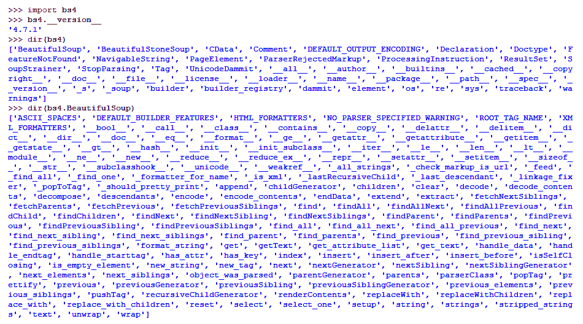

成功安装带有详细信息的 bs4

此外，简单（命名）和可解释的方法集合以及编码支持使其在开发人员中更受欢迎。

让我们从`bs4`中导入`BeautifulSoup`和`SoupStrainer`，如下所示：

```py
from bs4 import BeautifulSoup
from bs4 import SoupStrainer #,BeautifulSoup
```

我们将使用以下片段或`html_doc`中显示的 HTML 作为示例，来探索 Beautiful Soup 的一些基本特性。还可以使用`requests`或`urllib`获取任何选择的 URL 的响应，以在真实的抓取案例中用于内容：

```py
html_doc="""<html><head><title>The Dormouse's story</title></head> <body> <p class="title"><b>The Dormouse's story</b></p> <p class="story">Once upon a time there were three little sisters; and their names were <a href="http://example.com/elsie" class="sister" id="link1">Elsie</a>, <a href="http://example.com/lacie" class="sister" id="link2">Lacie</a> and <a href="http://example.com/tillie" class="sister" id="link3">Tillie</a>; and they lived at the bottom of a well.</p> <p class="story">...</p> <h1>Secret agents</h1> <ul>
 <li data-id="10784">Jason Walters, 003: Found dead in "A View to a Kill".</li> <li data-id="97865">Alex Trevelyan, 006: Agent turned terrorist leader; James' nemesis in "Goldeneye".</li> <li data-id="45732">James Bond, 007: The main man; shaken but not stirred.</li> </ul> </body> </html>"""
```

要继续解析和访问 Beautiful Soup 的方法和属性，通常需要创建一个 Beautiful Soup 对象，通常称为 soup 对象。关于构造函数中提供的字符串或标记内容的类型，下面列出了创建 Beautiful Soup 对象的一些示例，以及前面提到的参数：

+   `soup = Beautifulsoup(html_markup)`

+   `soup = Beautifulsoup(html_markup, 'lxml')`

+   `soup = Beautifulsoup(html_markup, 'lxml', parse_from=SoupStrainer("a"))`

+   `soup = Beautifulsoup(html_markup, 'html.parser')`

+   ``soup = Beautifulsoup(html_markup, 'html5lib')``

+   `soup = Beautifulsoup(xml_markup, 'xml')`

+   `soup = Beautifulsoup(some_markup, from_encoding='ISO-8859-8')`

+   `soup = Beautifulsoup(some_markup, exclude_encodings=['ISO-8859-7'])`

Beautiful Soup 构造函数起着重要作用，我们将在这里探索一些重要的参数：

+   `markup`：传递给构造函数的第一个参数接受要解析的字符串或对象。

+   `features`：解析器的名称或要用于`markup`的标记类型。解析器可以是`lxml`、`lxml-xml`、`html.parser`或`html5lib`。同样，可以使用的标记类型包括`html`、`html5`和`xml`。可以使用不同类型的支持解析器与 Beautiful Soup。如果我们只想解析一些 HTML，我们可以简单地将标记传递给 Beautiful Soup，它将相应地使用安装的适当解析器。有关解析器及其安装的更多信息，请访问[`www.crummy.com/software/BeautifulSoup/bs4/doc/#installing-a-parser`](https://www.crummy.com/software/BeautifulSoup/bs4/doc/#installing-a-parser)。

+   `parse_only`：接受一个`bs4.SoupStrainer`对象，即只有与`SoupStrainer`对象匹配的文档部分将用于解析。在只有部分文档需要解析时，这非常有用，考虑到代码的有效性和与内存相关的问题。有关`SoupStrainer`的更多信息，请访问[`www.crummy.com/software/BeautifulSoup/bs4/doc/#parsing-only-part-of-a-document`](https://www.crummy.com/software/BeautifulSoup/bs4/doc/#parsing-only-part-of-a-document)。

+   `from_encoding`：用于解析标记的字符串指示正确编码。如果 Beautiful Soup 使用错误的编码，通常会提供这个。

+   `exclude_encodings`：指示 Beautiful Soup 使用的错误编码的字符串列表。

在使用 Beautiful Soup 时，响应时间是一个重要因素。由于 Beautiful Soup 使用解析器（`lxml`、`html.parser`和`html5lib`），因此总是存在额外的时间消耗的问题。建议始终使用解析器以在各个平台和系统上获得类似的结果。此外，为了加快速度，建议使用`lxml`作为 Beautiful Soup 的解析器。

对于这种特殊情况，我们将使用`lxml`作为解析器创建`soupA`对象，以及`SoupStrainer`对象`tagsA`（仅解析`<a>`，即 HTML 的元素或锚标签）。我们可以使用`SoupStrainer`获取要解析的部分内容，这在处理大量内容时非常有用。

`soupA`，Beautiful Soup 的一个对象，呈现了`SoupStrainer`对象`tagsA`中找到的所有`<a>`元素，如下面的代码中所使用的；如输出所示，只收集了`<a>`标签，或者解析的文档是使用`lxml`*解析的`SoupStrainer`对象`parsed`*：

```py
tagsA = SoupStrainer("a")
soupA = BeautifulSoup(html_doc,'lxml',parse_only=tagsA)
 print(type(soupA))
<class 'bs4.BeautifulSoup'>

print(soupA)
<a class="sister" href="http://example.com/elsie" id="link1">Elsie</a><a class="sister" href="http://example.com/lacie" id="link2">Lacie</a><a class="sister" href="http://example.com/tillie" id="link3">Tillie</a>
```

来自网站的 HTML 内容可能并不总是以干净的字符串格式呈现。阅读以段落而不是逐行代码呈现的页面内容将是困难且耗时的。

Beautiful Soup 的`prettify()`函数返回一个 Unicode 字符串，呈现为干净、格式化的结构，易于阅读，并且以树结构标识元素，如下面的代码所示；`prettify()`函数还接受编码参数：

```py
print(soupA.prettify())

<a class="sister" href="http://example.com/elsie" id="link1">
 Elsie
</a>
<a class="sister" href="http://example.com/lacie" id="link2">
 Lacie
</a>
<a class="sister" href="http://example.com/tillie" id="link3">
 Tillie
</a>
```

解析树中的基于文档的元素（如 HTML 标签）可以具有具有预定义值的各种属性。元素属性是重要的资源，因为它们在元素内提供了标识和内容。在遍历树时，验证元素是否包含某些属性可能很方便。

例如，如下面的代码所示，HTML`<a>`元素包含`class`、`href`和`id`属性，每个属性都带有预定义的值，如下面的片段所示：

```py
<a class="sister" href="http://example.com/lacie" id="link2">
```

Beautiful Soup 的`has_attr()`函数返回所选元素的搜索属性名称的布尔响应，如下所示：

+   对于`name`属性返回`False`

+   对于`class`属性返回`True`

我们可以使用`has_attr()`函数来确认文档中是否存在指定名称的属性键，如下所示：

```py
print(soupA.a.has_attr('class'))
True

print(soupA.a.has_attr('name'))
False
```

通过对 Beautiful Soup 进行基本介绍并在本节中探讨了一些方法，我们现在将继续搜索、遍历和迭代解析树，寻找即将到来的部分中的元素和它们的内容。

# 搜索、遍历和迭代

Beautiful Soup 提供了许多方法和属性来遍历和搜索解析树中的元素。这些方法通常以与它们执行的任务描述相似的方式命名。还有许多属性和方法可以链接在一起，用于获得类似的结果。

`find()`函数返回与搜索条件或解析元素匹配的第一个子元素。在爬取上下文中查找元素和提取细节非常有用，但仅适用于单个结果。还可以传递其他参数给`find()`函数，以识别确切的元素，如下所示：

+   `attrs`：一个带有键值对的字典

+   `text`：带有元素文本

+   `name`：HTML 标签名称

让我们在代码中使用不同的允许参数来实现`find()`函数：

```py
print(soupA.find("a")) #print(soupA.find(name="a"))
<a class="sister" href="http://example.com/elsie" id="link1">Elsie</a> print(soupA.find("a",attrs={'class':'sister'}))
<a class="sister" href="http://example.com/elsie" id="link1">Elsie</a>

print(soupA.find("a",attrs={'class':'sister'},text="Lacie"))
<a class="sister" href="http://example.com/lacie" id="link2">Lacie</a>

print(soupA.find("a",attrs={'id':'link3'}))
<a class="sister" href="http://example.com/tillie" id="link3">Tillie</a>

print(soupA.find('a',id="link2"))
<a class="sister" href="http://example.com/lacie" id="link2">Lacie</a>
```

以下是在前面的示例中实现的代码的简短描述列表：

+   `find("a")或 find(name="a")`：搜索 HTML`<a>`元素或提供的标签名称，`a`返回`soupA`中找到的第一个`<a>`的存在

+   `find("a",attrs={'class':'sister'})`：搜索带有属性键为`class`和值为`sister`的元素`<a>`

+   使用`find("a",attrs={'class':'sister'}, text="Lacie")`：搜索具有`class`属性键和`sister`值以及文本为`Lacie`值的`<a>`元素

+   `find("a",attrs={'id':'link3'})`：搜索具有`id`属性键和`link3`值的`<a>`元素

+   `find("a",id="link2")`：搜索具有`id`属性和`link2`值的`<a>`元素

`find_all()`函数的工作方式类似于`find()`函数，还有额外的`attrs`和`text`作为参数，并返回满足条件或`name`属性的多个匹配元素的列表，如下所示：

```py
#find all <a> can also be written as #print(soupA.find_all(name="a")) print(soupA.find_all("a"))  [<a class="sister" href="http://example.com/elsie" id="link1">Elsie</a>, <a class="sister" href="http://example.com/lacie" id="link2">Lacie</a>, <a class="sister" href="http://example.com/tillie" id="link3">Tillie</a>]

#find all <a>, but return only 2 of them
print(soupA.find_all("a",limit=2)) #attrs, text

[<a class="sister" href="http://example.com/elsie" id="link1">Elsie</a>, <a class="sister" href="http://example.com/lacie" id="link2">Lacie</a>]
```

`limit`参数接受数字值，控制使用`find_all()`函数返回的元素的总数。

可以将字符串、字符串列表、正则表达式对象或这些内容之一提供给`name`和`text`属性作为`attrs`参数的值，如下面代码中所示：

```py
print(soupA.find("a",text=re.compile(r'cie'))) #import re
<a class="sister" href="http://example.com/lacie" id="link2">Lacie</a>
 print(soupA.find_all("a",attrs={'id':re.compile(r'3')}))
[<a class="sister" href="http://example.com/tillie" id="link3">Tillie</a>]

print(soupA.find_all(re.compile(r'a'))) [<a class="sister" href="http://example.com/elsie" id="link1">Elsie</a>, <a class="sister" href="http://example.com/lacie" id="link2">Lacie</a>, <a class="sister" href="http://example.com/tillie" id="link3">Tillie</a>] 
```

`find_all()`函数内置支持全局属性，例如类名，以及名称，如下所示：

```py
soup = BeautifulSoup(html_doc,'lxml')
 print(soup.find_all("p","story")) #class=story
[<p class="story">Once upon a time there were three little sisters; and their names were
<a class="sister" href="http://example.com/elsie" id="link1">Elsie</a>,
<a class="sister" href="http://example.com/lacie" id="link2">Lacie</a> and
<a class="sister" href="http://example.com/tillie" id="link3">Tillie</a>;
and they lived at the bottom of a well.</p>, <p class="story">...</p>]

print(soup.find_all("p","title")) #soup.find_all("p",attrs={'class':"title"})
[<p class="title"><b>The Dormouse's story</b></p>]
```

多个`name`和`attrs`值也可以通过列表传递，如下面的语法所示：

+   `soup.find_all("p",attrs={'class':["title","story"]})`：查找所有具有`title`和`story`值的类属性的`<p>`元素

+   `soup.find_all(["p","li"])`：从 soup 对象中查找所有`<p>`和`<li>`元素

可以在下面的代码中观察到前面的语法：

```py
print(soup.find_all("p",attrs={'class':["title","story"]}))
[<p class="title"><b>The Dormouse's story</b></p>,
<p class="story">Once upon a...
<a class="sister" href="http://example.com/elsie" id="link1">Elsie</a>,....
<a class="sister" href="http://example.com/tillie" id="link3">Tillie</a>;
and they lived at the bottom of a well.</p>, <p class="story">...</p>]

print(soup.find_all(["p","li"]))
[<p class="title"><b>The Dormouse's story</b></p>,
<p class="story">Once...<a class="sister" href="http://example.com/elsie"...., 
<p class="story">...</p>, 
<li data-id="10784">Jason Walters, 003:....</li>,<li....., 
<li data-id="45732">James Bond, 007: The main man; shaken but not stirred.</li>]
```

我们还可以使用元素文本来搜索和列出内容。类似于`text`参数的`string`参数用于这种情况；它也可以与任何标签名称一起使用或不使用，如下面的代码所示：

```py
print(soup.find_all(string="Elsie")) #text="Elsie"
['Elsie']

print(soup.find_all(text=re.compile(r'Elsie'))) #import re
['Elsie']

print(soup.find_all("a",string="Lacie")) #text="Lacie"
[<a class="sister" href="http://example.com/elsie" id="link2">Lacie</a>]
```

也可以使用`find_all()`函数进行元素迭代。如下面的代码所示，我们正在检索`<ul>`元素内找到的所有`<li>`元素，并打印它们的标签名称、属性数据、ID 和文本：

```py
for li in soup.ul.find_all('li'):
    print(li.name, ' > ',li.get('data-id'),' > ', li.text)

li > 10784 > Jason Walters, 003: Found dead in "A View to a Kill".
li > 97865 > Alex Trevelyan, 006: Agent turned terrorist leader; James' nemesis in "Goldeneye".
li > 45732 > James Bond, 007: The main man; shaken but not stirred.
```

可以使用`get()`函数检索元素的`value`属性。还可以使用`has_attr()`函数检查属性的存在。

元素遍历也可以只使用标签名称，并且可以使用或不使用`find()`或`find_all()`函数，如下面的代码所示：

```py
print(soupA.a) #tag a
<a class="sister" href="http://example.com/elsie" id="link1">Elsie</a>

print(soup.li) #tag li
<li data-id="10784">Jason Walters, 003: Found dead in "A View to a Kill".</li>

print(soup.p)
<p class="title"><b>The Dormouse's story</b></p>

print(soup.p.b) #tag p and b
<b>The Dormouse's story</b>

print(soup.ul.find('li',attrs={'data-id':'45732'}))
<li data-id="45732">James Bond, 007: The main man; shaken but not stirred.</li>
```

可以使用`text`和`string`属性或`get_text()`方法与元素一起用于提取它们的文本，同时遍历用于搜索内容的元素中也有`text`和`string`参数，如下面的代码所示：

```py
print(soup.ul.find('li',attrs={'data-id':'45732'}).text)
James Bond, 007: The main man; shaken but not stirred.

print(soup.p.text) #get_text()
The Dormouse's story

print(soup.li.text)
Jason Walters, 003: Found dead in "A View to a Kill".

print(soup.p.string)
The Dormouse's story
```

在本节中，我们探索了使用元素进行搜索和遍历，并实现了重要函数，如`find()`和`find_all()`函数以及它们的适当参数和条件。

在接下来的部分，我们将根据解析树中的位置探索元素。

# 使用子元素和父元素

对于解析的文档，可以使用`contents`、`children`和`descendants`元素遍历子元素或子元素：

+   `contents`在列表中收集满足条件的子元素。

+   `children`用于具有直接子元素的迭代。

+   `descendants`与`contents`和`children`元素的工作方式略有不同。它允许迭代所有子元素，而不仅仅是直接子元素，也就是说，元素标签和标签内的内容实际上是两个独立的子元素。

前面的列表显示了也可以用于迭代的特性。以下代码演示了如何使用这些特性并输出：

```py
print(list(soup.find('p','story').children))
['Once upon a time there were three little sisters; and their names were\n', <a class="sister" href="http://example.com/elsie" id="link1">Elsie</a>, ',\n', <a class="sister" href="http://example.com/lacie" id="link2">Lacie</a>, ' and\n', <a class="sister" href="http://example.com/tillie" id="link3">Tillie</a>, ';\nand they lived at the bottom of a well.']

print(list(soup.find('p','story').contents))
['Once upon a time there were three little sisters; and their names were\n', <a class="sister" href="http://example.com/elsie" id="link1">Elsie</a>, ',\n', <a class="sister" href="http://example.com/lacie" id="link2">Lacie</a>, ' and\n', <a class="sister" href="http://example.com/tillie" id="link3">Tillie</a>, ';\nand they lived at the bottom of a well.']

print(list(soup.find('p','story').descendants))
['Once upon a time there were three little sisters; and their names were\n', <a class="sister" href="http://example.com/elsie" id="link1">Elsie</a>, 'Elsie', ',\n', <a class="sister" href="http://example.com/lacie" id="link2">Lacie</a>, 'Lacie', ' and\n', <a class="sister" href="http://example.com/tillie" id="link3">Tillie</a>, 'Tillie', ';\nand they lived at the bottom of a well.']
```

可以使用`name`属性获取所选的`children`和`descendants`标签名称。解析的字符串和`\n`函数（换行符）返回为`None`，可以在下面的代码中进行过滤：

```py
#using List Comprehension Technique
print([a.name for a in soup.find('p','story').children])
[None, 'a', None, 'a', None, 'a', None]

print([{'tag':a.name,'text':a.text,'class':a.get('class')} for a in soup.find('p','story').children if a.name!=None])
[{'tag': 'a', 'text': 'Elsie', 'class': ['sister']}, {'tag': 'a', 'text': 'Lacie', 'class': ['sister']}, {'tag': 'a', 'text': 'Tillie', 'class': ['sister']}]

print([a.name for a in soup.find('p','story').descendants])
[None, 'a', None, None, 'a', None, None, 'a', None, None]

print(list(filter(None,[a.name for a in soup.find('p','story').descendants])))
['a', 'a', 'a']
```

与`find()`和`find_all()`函数类似，我们还可以使用`findChild()`和`findChildren()`函数来遍历子元素。`findChild()`函数用于检索单个子元素，而`findChildren()`函数检索子元素的列表，如下面的代码所示：

```py
print(soup.find('p','story').findChildren())
[<a class="sister" href="http://example.com/elsie" id="link1">Elsie</a>, <a class="sister" href="http://example.com/lacie" id="link2">Lacie</a>, <a class="sister" href="http://example.com/tillie" id="link3">Tillie</a>]

print(soup.find('p','story').findChild()) #soup.find('p','story').find()
<a class="sister" href="http://example.com/elsie" id="link1">Elsie</a>
```

与`children`元素类似，`parent`元素返回了搜索条件找到的父对象。这里的主要区别是`parent`元素返回树中的单个父对象，如下面的代码所示：

```py
#print parent element of <a> with class=sister
print(soup.find('a','sister').parent)
<p class="story">Once upon a time there were three little sisters; and their names were
<a class="sister" href="http://example.com/elsie" id="link1">Elsie</a>,
<a class="sister" href="http://example.com/lacie" id="link2">Lacie</a> and
<a class="sister" href="http://example.com/tillie" id="link3">Tillie</a>;
and they lived at the bottom of a well.</p>

#print parent element name of <a> with class=sister
print(soup.find('a','sister').parent.name)
p

#print text from parent element of <a> with class=sister
print(soup.find('a','sister').parent.text)
Once upon a time there were three little sisters; and their names were
Elsie,
Lacie and
Tillie;
and they lived at the bottom of a well.
```

使用`parents`元素可以克服返回单个父元素的限制；这将返回多个现有的父元素，并匹配在`find()`函数中提供的搜索条件，如下面的代码中所示，通常用于迭代：

```py
for element in soup.find('a','sister').parents:
    print(element.name)

p
body
html #complete HTML
[document]  #soup object
```

如前面的输出所示，`[document]`指的是 soup 对象，`html`指的是在 soup 中找到的完整 HTML 块。Beautiful Soup 对象本身创建的是一个解析元素。

与用于遍历子元素的函数类似，父元素也可以使用`findParent()`和`findParents()`搜索函数进行遍历和检索。`findParent()`函数遍历到直接父元素，而`findParents()`函数返回为提供的条件找到的所有父元素。

还必须注意，子元素和父元素的遍历函数是与`find()`函数一起使用的，其中提供了必要的参数和条件，如下面的代码所示：

```py
#find single Parent for selected <a> with class=sister 
print(soup.find('a','sister').findParent())

<p class="story">Once upon a time there were three little sisters; and their names were
<a class="sister" href="http://example.com/elsie" id="link1">Elsie</a>,
<a class="sister" href="http://example.com/lacie" id="link2">Lacie</a> and
<a class="sister" href="http://example.com/tillie" id="link3">Tillie</a>;
and they lived at the bottom of a well.</p>

#find Parents for selected <a> with class=sister 
print(soup.find('a','sister').findParents())

[<p class="story">Once upon a time there were three little sisters; and their names were
<a class="sister".........Tillie</a>;and they lived at the bottom of a well.</p>,
<body><p class="title"><b>The Dormouse's story</b></p>
<p class="story">Once upon........... <li data-id="45732">James Bond, 007: The main man; shaken but not stirred.</li> </ul> </body>, 
<html><head><title>The Dormouse's story</title></head><body><p class="title"><b>The Dormouse's story</b></p> ........... </ul> </body></html>,
<html><head><title>The Dormouse's story</title></head><body><p class="title"><b>The Dormouse's story</b></p>...........</body></html>]
```

我们使用了各种函数来探索遍历和搜索子元素和父元素。在下一节中，我们将探索并使用解析树中的位置元素。

# 使用 next 和 previous

与在树中遍历解析的子元素和父元素类似，Beautiful Soup 还支持遍历和迭代位于提供的条件之前和之后的元素。

属性`next`和`next_element`返回所选条件的立即解析内容。我们还可以将`next`和`next_element`函数附加到一起创建遍历的代码链，如下面的代码所示：

```py
print(soup.find('p','story').next)
Once upon a time there were three little sisters; and their names were

print(soup.find('p','story').next.next)
<a class="sister" href="http://example.com/elsie" id="link1">Elsie</a>

print(soup.find('p','story').next_element)
Once upon a time there were three little sisters; and their names were

print(soup.find('p','story').next_element.next_element)
<a class="sister" href="http://example.com/elsie" id="link1">Elsie</a>

print(soup.find('p','story').next_element.next_element.next_element)
Elsie
```

与`next`和`next_elements`函数类似，还存在着返回先前或之前解析元素结果的遍历结果的属性，例如`previous`和`previous_element`，与`next`和`next_element`函数相比，它们在工作时是相反的。

如下面的代码所示，`previous`和`previous_element`也可以附加到自身以创建一个遍历系列：

```py
print(soup.find('p','story').previous) #returns empty or new-line. print(soup.find('p','title').next.next.next) #returns empty or newline similar to code above

print(soup.find('p','story').previous.previous)
The Dormouse's story

print(soup.find('p','story').previous_element) #returns empty or new-line. 
print(soup.find('p','story').previous_element.previous_element)
The Dormouse's story

print(soup.find('p','story').previous_element.previous_element.previous_element)
<b>The Dormouse's story</b>
```

现在我们将`next`或`next_element`和`previous`或`previous_element`元素组合在一起进行遍历，如下所示：

```py
print(soup.find('p','title').next.next.previous.previous)

<p class="title"><b>The Dormouse's story</b></p>
```

使用`next_element`和`previous_element`的迭代特性是通过`next_elements`和`previous_elements`获得的。这些迭代器用于移动到下一个或上一个解析内容，如下所示：

```py
for element in soup.find('ul').next_elements:
    print(element)

<li data-id="10784">Jason Walters, 003: Found dead in "A View to a Kill".</li>
Jason Walters, 003: Found dead in "A View to a Kill".

<li data-id="97865">Alex Trevelyan, 006: Agent ............. "Goldeneye".</li>
Alex Trevelyan, 006: Agent turned terrorist leader; James' nemesis in "Goldeneye".

<li data-id="45732">James Bond, 007: The main man; shaken but not stirred.</li>
James Bond, 007: The main man; shaken but not stirred.
```

`find_next()`函数实现了`next_elements`，但只返回在`next`或`next_element`元素之后找到的单个元素。使用`find_next()`函数的优势在于我们可以为元素实现额外的搜索逻辑。

下面的代码演示了`find_next()`函数的使用，带有和不带有搜索条件；它还显示了`next`元素和`next_elements`的输出，以便比较实际的用法，如下所示：

```py
print(soup.find('p','story').next)
Once upon a time there were three little sisters; and their names were

print(soup.find('p','story').next_element)
Once upon a time there were three little sisters; and their names were

print(soup.find('p','story').find_next()) #element after next_element
<a class="sister" href="http://example.com/elsie" id="link1">Elsie</a>

print(soup.find('p','story').find_next('h1'))
<h1>Secret agents</h1>
```

`find_all_next()`函数的工作方式与`find_next()`函数类似，但返回所有下一个元素。它也被用作`find_next()`函数的迭代版本。可以使用额外的搜索条件和参数，如`limit`，来搜索和控制返回的结果，如下面的代码所示：

```py
print(soup.find('p','story').find_all_next())
[<a class="sister" href="http://example.com/elsie" id="link1">Elsie</a>, <a class="sister" href="http://example.com/lacie" id="link2">Lacie</a>, <a class="sister" href="http://example.com/tillie" id="link3">Tillie</a>, <p class="story">...</p>, <h1>Secret agents</h1>, <ul>
<li data-id="10784">Jason Walters, 003: Found dead in "A View to a Kill".</li>
<li data-id="97865">Alex Trevelyan, 006: Agent turned terrorist leader; James' nemesis in "Goldeneye".</li>
<li data-id="45732">James Bond, 007: The main man; shaken but not stirred.</li>
</ul>, <li data-id="10784">Jason Walters, 003: Found dead in "A View to a Kill".</li>, <li data-id="97865">Alex Trevelyan, 006: Agent turned terrorist leader; James' nemesis in "Goldeneye".</li>, <li data-id="45732">James Bond, 007: The main man; shaken but not stirred.</li>]

print(soup.find('p','story').find_all_next('li',limit=2))
[<li data-id="10784">Jason Walters, 003: Found dead in "A View to a Kill".</li>, <li data-id="97865">Alex Trevelyan, 006: Agent turned terrorist leader; James' nemesis in "Goldeneye".</li>]
```

`find_previous()`函数实现了`previous_elements`，但只返回在`previous`或`previous_element`之前找到的单个元素。它还比`previous_elements`具有优势，因为我们可以为元素实现额外的搜索逻辑。下面的代码演示了`find_previous()`函数和`previous`函数的用法：

```py
print(soup.find('ul').previous.previous.previous)
<h1>Secret agents</h1>

print(soup.find('ul').find_previous())
<h1>Secret agents</h1>

print(soup.find('ul').find_previous('p','title'))
<p class="title"><b>The Dormouse's story</b></p>
```

`find_all_previous()`函数是`find_previous()`的迭代版本；它返回满足可用条件的所有先前元素，如下面的代码所示：

```py
print(soup.find('ul').find_all_previous('p'))

[<p class="story">...</p>, <p class="story">Once upon a time there were three little sisters; and their names were
<a class="sister" href="http://example.com/elsie" id="link1">Elsie</a>,
<a class="sister" href="http://example.com/lacie" id="link2">Lacie</a> and
<a class="sister" href="http://example.com/tillie" id="link3">Tillie</a>;
and they lived at the bottom of a well.</p>, <p class="title"><b>The Dormouse's story</b></p>]
```

`next_sibling`和`previous_sibling`是沿着解析树寻找下一个和上一个兄弟姐妹的另一种方式。兄弟姐妹是指出现在相同级别或在解析树中找到的元素，或者共享相同父元素的元素。下面的代码说明了`next_sibling`和`previous_sibling`元素的用法：

```py
print(soup.find('p','title').next_sibling) #returns empty or new-line

print(soup.find('p','title').next_sibling.next_sibling) #print(soup.find('p','title').next_sibling.next)
<p class="story">Once upon a time there were three little sisters; and their names were
<a class="sister" href="http://example.com/elsie" id="link1">Elsie</a>,
<a class="sister" href="http://example.com/lacie" id="link2">Lacie</a> and
<a class="sister" href="http://example.com/tillie" id="link3">Tillie</a>;
and they lived at the bottom of a well.</p>

print(soup.find('ul').previous_sibling) #returns empty or new-line

print(soup.find('ul').previous_sibling.previous_sibling)
<h1>Secret agents</h1>
```

迭代也可以使用兄弟姐妹，使用`next_siblings`和`previous_siblings`元素，如下面的代码所示：

```py
#using List Comprehension 
title = [ele.name for ele in soup.find('p','title').next_siblings]
print(list(filter(None,title)))
['p', 'p', 'h1', 'ul']

ul = [ele.name for ele in soup.find('ul').previous_siblings]
print(list(filter(None,ul)))
['h1', 'p', 'p', 'p']
```

类似于`find_next()`和`find_all_next()`函数用于下一个元素，还有可用于兄弟姐妹的函数，即

`find_next_sibling()`和`find_next_siblings()`函数。这些函数实现了`next_siblings`函数来迭代和搜索可用的兄弟姐妹。如下面的代码所示，`find_next_sibling()`函数返回单个元素，而`find_next_siblings()`函数返回所有匹配的兄弟姐妹：

```py
#find next <p> siblings for selected <p> with class=title
print(soup.find('p','title').find_next_siblings('p'))
[<p class="story">Once upon a time there were three little sisters; and their names were
<a class="sister" href="http://example.com/elsie" id="link1">Elsie</a>,
<a class="sister" href="http://example.com/lacie" id="link2">Lacie</a> and
<a class="sister" href="http://example.com/tillie" id="link3">Tillie</a>;
and they lived at the bottom of a well.</p>, <p class="story">...</p>]

#find single or next sibling for selected <h1>
print(soup.find('h1').find_next_sibling())
<ul>
<li data-id="10784">Jason Walters, 003: Found dead in "A View to a Kill".</li>
<li data-id="97865">Alex Trevelyan, 006: ............in "Goldeneye".</li>
<li data-id="45732">James Bond, 007: The main man; shaken but not stirred.</li>
</ul>

#find single or next sibling <li> for selected <h1>
print(soup.find('h1').find_next_sibling('li'))
None
```

`find_previous_sibling()`和`find_previous_siblings()`函数的工作方式与`find_next_sibling()`和`find_next_siblings()`函数类似，但结果是通过`previous_siblings`函数跟踪的元素。还可以应用额外的搜索条件和结果控制参数`limit`到迭代版本，例如`find_previous_siblings()`函数。

如下面的代码所示，`find_previous_sibling()`函数返回单个兄弟元素，而`find_previous_siblings()`函数返回先前满足给定条件的所有兄弟元素：

```py
#find first previous sibling to <ul>
print(soup.find('ul').find_previous_sibling())
<h1>Secret agents</h1>

#find all previous siblings to <ul>
print(soup.find('ul').find_previous_siblings())

[<h1>Secret agents</h1>, <p class="story">...</p>, <p class="story">Once upon a time there were three little sisters; and their names were
<a class="sister" href="http://example.com/elsie" id="link1">Elsie</a>,
<a class="sister" href="http://example.com/lacie" id="link2">Lacie</a> and
<a class="sister" href="http://example.com/tillie" id="link3">Tillie</a>;
and they lived at the bottom of a well.</p>, <p class="title"><b>The Dormouse's story</b></p>]
```

我们已经探索了在本节中探讨的函数和属性中搜索和遍历解析树的各种方法。

以下是一些提示列表，可以帮助记住和规划使用 Beautiful Soup 进行搜索和遍历活动：

+   以`find`函数开头的函数名称用于搜索和迭代提供条件和参数：

+   `find`函数的复数版本用于迭代，例如`findChildren()`和`findParents()`元素

+   `find`函数的单数版本返回单个元素，例如`find()`、`findChild()`或`findParent()`函数

+   以`find_all`开头的函数名称返回所有匹配的元素，并用于使用提供的条件和参数进行搜索和迭代，例如`find_all()`、`find_all_next()`和`find_all_previous()`函数

+   具有复数名称的属性用于迭代目的，例如`next_elements`、`previous_elements`、`parents`、`children`、`contents`、`descendants`、`next_siblings`和`previous_siblings`元素

+   具有单数名称的属性返回单个元素，也可以附加在一起形成遍历代码链，例如`parent`、`next`、`previous`、`next_element`、`previous_element`、`next_sibling`和`previous_sibling`函数

# 使用 CSS 选择器

我们在前面的部分中使用了大量的属性和函数，寻找所需的元素和它们的内容。Beautiful Soup 还支持 CSS 选择器（使用库 SoupSieve 在[`facelessuser.github.io/soupsieve/selectors/`](https://facelessuser.github.io/soupsieve/selectors/)），这增强了它的使用，并允许开发人员编写有效和高效的代码来遍历解析树。

CSS 选择器（CSS 查询或 CSS 选择器查询）是 CSS 使用的定义模式，用于选择 HTML 元素，可以按元素名称或使用全局属性（`ID`，`Class`）进行选择。有关 CSS 选择器的更多信息，请参考第三章，*使用 LXML、XPath 和 CSS 选择器*，*XPath 和 CSS 选择器简介*部分。

对于 Beautiful Soup，`select()`函数用于执行 CSS 选择器。我们可以通过定义 CSS 选择器来执行元素的搜索、遍历和迭代。`select()`函数是独立实现的，即它没有与 Beautiful Soup 中找到的其他函数和属性扩展，从而创建了一系列代码。`select()`函数返回与提供的 CSS 选择器匹配的元素列表。此外，使用 CSS 选择器的代码长度相对于前面部分用于类似目的的代码来说也是相当短的。

我们将使用`select()`来处理 CSS 选择器的几个示例。

# 示例 1 - 列出具有 data-id 属性的<li>元素

在下面的示例中，我们将使用`select()`函数列出具有`data-id`属性的`<li>`元素：

```py
print(soup.select('li[data-id]'))
[<li data-id="10784">Jason Walters, 003: Found dead in "A View to a Kill".</li>, <li data-id="97865">Alex Trevelyan, 006: Agent turned terrorist leader; James' nemesis in "Goldeneye".</li>, <li data-id="45732">James Bond, 007: The main man; shaken but not stirred.</li>]
```

如前面的代码所示，`li[data-id]`选择器查询具有名为`data-id`的属性键的`<li>`元素。`data-id`的值为空，这允许遍历所有具有`data-id`的`<li>`。结果以对象列表的形式获得，可以应用索引来获取确切的元素，如下面的代码所示：

```py
print(soup.select('ul li[data-id]')[1]) #fetch index 1 only from resulted List
<li data-id="97865">Alex Trevelyan, 006: Agent turned terrorist leader; James' nemesis in "Goldeneye".</li>
```

如果我们希望提取 CSS 查询结果中的第一个匹配项，我们可以使用列表索引，即`0`（零），或者在以下代码中看到的`select()`函数的位置上使用`select_one()`函数。`select_one()`函数返回对象的字符串，而不是列表：

```py
print(soup.select_one('li[data-id]'))
<li data-id="10784">Jason Walters, 003: Found dead in "A View to a Kill".</li>
```

# 示例 2 - 遍历元素

CSS 选择器有各种组合符号，如+，>，空格字符等，显示元素之间的关系。在以下示例代码中使用了一些这样的组合符号：

```py
print(soup.select('p.story > a.sister'))#Selects all <a> with class='sister' that are direct child to <p> with class="story"
[<a class="sister" href="http://example.com/elsie" id="link1">Elsie</a>, <a class="sister" href="http://example.com/lacie" id="link2">Lacie</a>, <a class="sister" href="http://example.com/tillie" id="link3">Tillie</a>]

print(soup.select('p b'))#Selects <b> inside <p> [<b>The Dormouse's story</b>]

print(soup.select('p + h1'))#Selects immediate <h1> after <p>
[<h1>Secret agents</h1>]

print(soup.select('p.story + h1'))#Selects immediate <h1> after <p> with class 'story' [<h1>Secret agents</h1>] print(soup.select('p.title + h1'))#Selects immediate <h1> after <p> with class 'title' []
```

# 示例 3 - 根据属性值搜索元素

在 Beautiful Soup 中有各种查找元素的方法，比如使用以`find`开头的函数或在 CSS 选择器中使用属性。可以使用 CSS 选择器中的`*`来搜索属性键，如下面的代码所示：

```py
print(soup.select('a[href*="example.com"]'))
[<a class="sister" href="http://example.com/elsie" id="link1">Elsie</a>, <a class="sister" href="http://example.com/lacie" id="link2">Lacie</a>, <a class="sister" href="http://example.com/tillie" id="link3">Tillie</a>]

print(soup.select('a[id*="link"]'))
[<a class="sister" href="http://example.com/elsie" id="link1">Elsie</a>, <a class="sister" href="http://example.com/lacie" id="link2">Lacie</a>, <a class="sister" href="http://example.com/tillie" id="link3">Tillie</a>]
```

我们正在搜索具有文本`example.com`的`<a>`元素，该文本可能存在于`href`属性的值中。此外，我们正在搜索包含带有文本链接的属性 ID 的`<a>`元素。

有了对 CSS 选择器的基本了解，我们可以在 Beautiful Soup 中使用它来实现各种目的。当处理元素时，使用`select()`函数非常有效，但我们可能会遇到一些限制，比如从获取的元素中提取文本或内容。

我们在前面的部分介绍和探讨了 Beautiful Soup 的元素。为了总结这个概念，我们将在接下来的部分创建一个爬虫示例。

# 构建网络爬虫

在本节中，我们将构建一个网络爬虫，以演示基于实际内容的爬取，目标是网页内容。

我们将从[`toscrape.com/`](http://toscrape.com/)上爬取名言，并从[`quotes.toscrape.com/`](http://quotes.toscrape.com/)上找到作者的名言。爬虫将从前五个列表页面收集名言和作者信息，并将数据写入 CSV 文件。我们还将探索单个作者页面，并提取有关作者的信息。

首先，基本规划和识别我们愿意从中收集信息的字段，请参考第三章，*使用 LXML、XPath 和 CSS 选择器*，*使用 Web 浏览器开发者工具访问 Web 内容*部分：

```py
''' Listing Quotes from first 5 or less pages found from 'http://quotes.toscrape.com/' '''   import requests
import re
from bs4 import BeautifulSoup
import csv

sourceUrl = 'http://quotes.toscrape.com/' keys = ['quote_tags','author_url','author_name','born_date','born_location','quote_title']
```

在上述代码中，有几个库和对象列在此处并在此处描述：

+   `sourceUrl`：表示要为类别网页抓取的数据而抓取的主页面的 URL

+   `keys`：Python 列表包含在向外部文件写入记录时将使用的列名

+   `requests`：导入此库以使用在带引用列表的页面 URL 上发出 HTTP 请求并接收响应

+   `csv`：此库将用于将抓取的数据写入外部 CSV 文件

+   `bs4`：用于实现和使用 Beautiful Soup 的库

CSV 文件的第一行包含列名。我们需要在向 CSV 文件中附加实际内容的记录之前写入这些列。

`read_url()` 函数，如下面的代码中所示，将用于使用`requests`函数发出请求并接收响应。此函数将接受一个`url`参数用于页面：

```py
def read_url(url):
    """Read given Url, Returns requests object for page content"""
  response = requests.get(url)
    return response.text
```

`dataSet`是一个句柄，用于管理外部文件`quotes.csv`。`csv.writer()`文件句柄用于访问基于 CSV 的属性。`writerow()`函数传递了键，用于将包含列表键中的列名的行写入到外部文件中，如下所示：

```py
if __name__ == '__main__':
    dataSet = open('quotes.csv', 'w', newline='', encoding='utf-8')
    dataWriter = csv.writer(dataSet)

    # Write a Header or Column_names to CSV
  dataWriter.writerow(keys)

    #load details for provided URL
    get_details(sourceUrl, dataWriter)
  dataSet.close()
```

正在实现的`get_details()`函数正在编写用于分页和抓取逻辑。`read_url()`函数将提供动态生成的页面 URL 以管理分页，如下所示：

```py
def get_details(page, dataWriter):
    """Get 'response' for first 5 pages, parse it and collect data for 'keys' headers"""
  nextPage = True
  pageNo = 1
  while (nextPage and pageNo <= 5):
        response = read_url(page + 'page/' + str(pageNo))
        soup = BeautifulSoup(response, 'lxml')

        rows = soup.find_all('div', 'quote')
        if (len(rows) > 0):
            print("Page ",pageNo," Total Quotes Found ",len(rows))
            for row in rows:
                if row.find('span',attrs={'itemprop':'text'}):
                    title = row.find(attrs={'itemprop':'text'}).text.strip()
                    author = row.find(attrs={'itemprop':'author'}).text.strip()
                    authorLink = row.find('a',href=re.compile(r'/author/')).get('href')
                    tags = row.find('div','tags').find(itemprop="keywords").get('content')
                    print(title, ' : ', author,' : ',authorLink, ' : ',tags)

                    if authorLink:
                        authorLink = 'http://quotes.toscrape.com' + authorLink
                        linkDetail = read_url(authorLink)
                        soupInner = BeautifulSoup(linkDetail, 'lxml')
                        born_date = soupInner.find('span','author-born-date').text.strip()
                        born_location = soupInner.find('span','author-born-location').text.strip()
                        # Write a list of values in file
  dataWriter.writerow(
                        [tags,authorLink,author,born_date,born_location.replace('in ',''),title])

            nextPage = True
  pageNo += 1
  else:
            print("Quotes Not Listed!")
```

如下面的代码中所示，使用`lxml`解析`read_url()`函数中的`response`元素以获取`soup`元素。使用 soup 获取的行列出了单页中所有的引用（即包含单个引用详细信息的元素块）在`<div class="quote">`函数中找到，并将被迭代以抓取`quote_tags`、`author_url`和`author_name`等个别项目的数据：

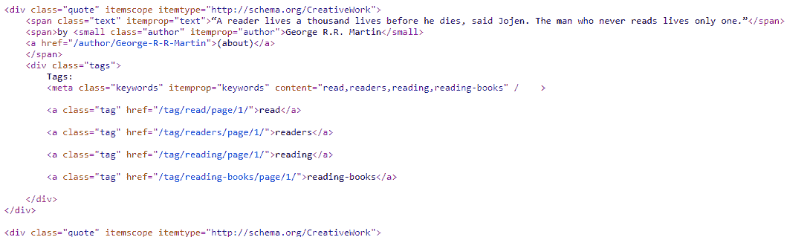

带引用元素的页面源代码

接收到的各个项目将被抓取、清理并收集到一个列表中，保持其列名的顺序，并使用`csv`库和文件句柄访问的`writerow()`函数将其写入文件（将值列表附加到文件）。

`quotes.csv`数据文件将包含如下截图中所见的抓取数据：

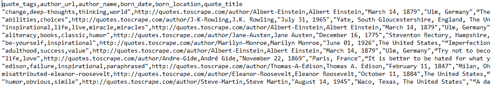

从 http://quotes.toscrape.com/抓取的数据行

在本节中，我们探讨了使用 Beautiful Soup 进行遍历和搜索的各种方法。在接下来的部分中，我们将使用 Scrapy，一个网络爬虫框架。

# 使用 Scrapy 进行网页抓取

到目前为止，我们在本书中已经使用和探索了各种库和技术进行网页抓取。最新的库可以适应新的概念，并以更有效、多样和简单的方式实现这些技术；Scrapy 就是其中之一。

在本节中，我们将介绍并使用 Scrapy（一个用 Python 编写的开源网络爬虫框架）。有关 Scrapy 的更详细信息，请访问官方文档[`docs.scrapy.org/en/latest/`](http://docs.scrapy.org/en/latest/)。

在本节中，我们将实现抓取功能并构建一个演示有用概念的项目。

# Scrapy 简介

Scrapy 是一个用 Python 编写的网络爬虫框架，用于以有效和最小的编码方式爬取网站。根据 Scrapy 的官方网站（[`scrapy.org/`](https://scrapy.org/)）的说法，它是<q>“一个用于从网站中提取所需数据的开源和协作框架。以一种快速、简单但可扩展的方式。”</q>

Scrapy 提供了一个完整的框架，用于部署具有内置工具的爬虫。Scrapy 最初是为网页抓取而设计的；随着其流行和发展，它也用于从 API 中提取数据。基于 Scrapy 的网络爬虫也易于管理和维护，因为其结构。总的来说，Scrapy 为处理网页抓取的项目提供了基于项目的范围。

以下是一些使 Scrapy 成为开发人员喜爱的功能和显著点：

+   Scrapy 提供了内置支持，用于使用 XPath、CSS 选择器和正则表达式解析、遍历和提取数据。

+   爬虫被安排和异步管理，允许同时爬取多个链接。

+   它自动化了 HTTP 方法和操作，也就是说，不需要手动导入诸如`requests`或`urllib`之类的库来编写代码。Scrapy 使用其内置库处理请求和响应。

+   有内置支持的 feed 导出、管道（项目、文件、图像和媒体），即以 JSON、CSV、XML 和数据库导出、下载和存储数据。

+   中间件的可用性和大量内置扩展可以处理 cookie、会话、身份验证、`robots.txt`、日志、使用统计、电子邮件处理等。

+   Scrapy 驱动的项目由易于识别的组件和文件组成，可以用基本的 Python 技能处理，还有更多。

请参阅 Scrapy 的官方文档[`docs.scrapy.org/en/latest/intro/overview.html`](https://docs.scrapy.org/en/latest/intro/overview.html)进行深入和详细的概述。

通过对 Scrapy 的基本介绍，我们现在开始在接下来的章节中设置项目并更详细地探索框架。

# 设置项目

在进行项目设置之前，我们需要在系统上成功安装了`scrapy`的 Python 库。有关设置或安装，请参阅第二章，*Python 和 Web-使用 urllib 和 Requests*，*设置事项*部分，或者有关 Scrapy 安装的更多详细信息，请参阅官方安装指南[`docs.scrapy.org/en/latest/intro/overview.html`](https://docs.scrapy.org/en/latest/intro/overview.html)。

安装成功后，我们可以使用 Python IDE 获得以下截图中显示的细节：

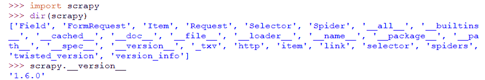

成功安装 Scrapy 并显示细节

通过成功安装`scrapy`库，还可以使用`scrapy`命令行工具。这个命令行工具包含一些命令，在项目的各个阶段使用，从创建项目到完全运行。

要开始创建一个项目，让我们按照以下步骤进行：

1.  打开终端或命令行界面

1.  创建一个文件夹（`ScrapyProjects`），如下截图所示，或选择一个放置 Scrapy 项目的文件夹

1.  在选择的文件夹中，运行或执行`scrapy`命令

1.  将出现一个可用命令及其简要详情的列表，类似于以下截图：

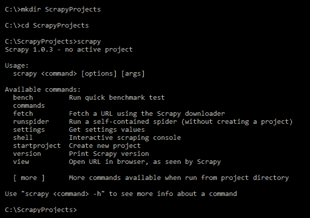

Scrapy 的可用命令列表

我们将创建一个`Quotes`项目，从[`toscrape.com/`](http://toscrape.com/)获取与网页抓取相关的作者引用，访问存在的前五页或更少的信息，使用 URL [`quotes.toscrape.com/`](http://quotes.toscrape.com/)。

[我们现在将开始`Quotes`项目。从命令提示符中运行或执行`scrapy startproject Quotes`命令，如下截图所示：](http://quotes.toscrape.com/)

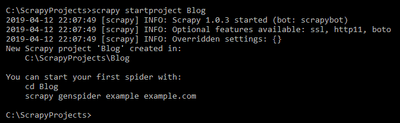

开始一个项目（使用命令：`scrapy startproject Quotes`）

如果成功，上述命令将创建一个名为`Quotes`的新文件夹（即项目根目录），并包含如下截图所示的其他文件和子文件夹：

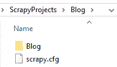

项目文件夹 ScrapyProjects\Quotes 的内容

项目成功创建后，让我们来探索项目文件夹中的各个组件：

+   `scrapy.cfg`是一个配置文件，其中包含部署的默认项目相关设置，可以进行添加。

+   子文件夹将找到与项目目录同名的`Quotes`，实际上是一个 Python 模块。我们将在这个模块中找到其他的 Python 文件和其他资源。

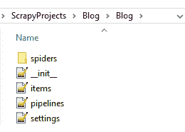

项目文件夹 ScrapyProjects\Quotes\Quotes 的内容

如前面的截图所示，模块包含在`spiders`文件夹和`items.py`、`pipelines.py`和`settings.py` Python 文件中。`Quotes`模块中的内容在以下列表中具有特定的实现：

+   `spiders`：这个文件夹将包含用 Python 编写的蜘蛛类或蜘蛛。蜘蛛是包含用于抓取的代码的类。每个单独的蜘蛛类都指定了特定的抓取活动。

+   `items.py`：这个 Python 文件包含项目容器，即继承`scrapy. Items`的 Python 类文件，用于收集抓取的数据并在蜘蛛中使用。项目通常被声明为携带值，并从主项目中的其他资源获得内置支持。项目就像一个 Python 字典对象，其中键是`scrapy.item.Field`的字段或对象，将保存特定的值。

尽管默认项目为项目相关任务创建了`items.py`，但在蜘蛛中使用它并不是强制的。我们可以使用任何列表或收集数据值，并以我们自己的方式处理，比如将它们写入文件，将它们附加到列表等。

+   `pipelines.py`：这部分在数据被抓取后执行。抓取的项目被发送到管道执行某些操作。它还决定是否处理接收到的抓取项目或丢弃它们。

+   `settings.py`：这是最重要的文件，可以在其中调整项目的设置。根据项目的偏好，我们可以调整设置。请参考 Scrapy 的官方文档[`scrapy2.readthedocs.io/en/latest/topics/settings.html`](https://scrapy2.readthedocs.io/en/latest/topics/settings.html)

在本节中，我们已成功使用 Scrapy 创建了一个项目和所需的文件。这些文件将如下节所述被使用和更新。

# 生成一个蜘蛛

我们需要生成一个蜘蛛来收集数据。蜘蛛将执行爬行活动。在`ScrapyProjects\Quotes\Quotes`文件夹中存在一个名为`spiders`的空默认文件夹。

从`ScrapyProjects\Quotes`项目文件夹中运行或执行`scrapy genspider quotes quotes.toscrape.com`命令。

成功执行该命令将在`ScrapyProjects\Quotes\Quotes\spiders\`路径下创建一个`quotes.py`文件，即一个蜘蛛。生成的`QuotesSpider`类继承自`scrapy.Spider`，在`QuotesSpider`中还有一些必需的属性和函数，如下代码所示：

```py
import scrapy

class QuotesSpider(scrapy.Spider):
    name = "quotes"
    allowed_domains = ["quotes.toscrape.com"]
    start_urls = (
        'http://www.quotes.toscrape.com/',
    )

    def parse(self, response):
        pass
```

`QuotesSpider`蜘蛛类包含自动生成的属性，用于特定任务，如下列表所示：

+   `name`：这个变量保存值，即蜘蛛 quotes 的名称，如前面的代码所示。名称标识了蜘蛛，并可以用于访问它。名称的值是通过命令行指令提供的，比如在`genspider`之后的第一个参数`scrapy genspider quotes`。

+   `allowed_domains`：创建的 Spider 允许在`allowed_domains`中列出的域内爬行。传递的最后一个参数是`quotes.toscrape.com`参数，生成 Spider 实际上是一个将列在`allowed_domains`列表中的域名。

+   传递给`allowed_domains`的域名将为`start_urls`生成 URL。如果存在 URL 重定向的可能性，则需要在`allowed_domains`中提及这些 URL 域名。

+   `start_urls`：这些包含 Spider 实际处理的 URL 列表。找到或提供给`allowed_domains`的域名将自动添加到此列表中，并且可以手动添加或更新。Scrapy 生成`start_urls`的 URL 添加了 HTTP 协议。在某些情况下，我们可能还需要手动更改或修复 URL，例如，需要删除添加到域名的`www`。更新后的`start_urls`将如下代码所示：

```py
start_urls = ( 'http://quotes.toscrape.com/',)
```

+   `parse()`：此函数实现了与数据提取或处理相关的逻辑。`parse()`充当了抓取活动的主控制器和起点。为主项目创建的 Spider 将开始处理提供的 URL 或`start_urls`，或者在`parse()`内部。实现了与 XPath 和 CSS 选择器相关的表达式和代码，并且提取的值也被添加到 item（即来自`item.py`文件的`QuotesItem`）。

我们还可以通过执行以下命令来验证 Spider 的成功创建：

+   `scrapy list`

+   `scrapy list spide*r*`

这两个命令都将列出 Spider 的名称，该名称在`spiders`文件夹中找到，如下面的屏幕截图所示：

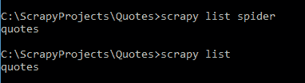

从命令提示符中列出 Spider

在这一部分，我们为我们的抓取任务生成了一个名为`quotes`的 Spider。在接下来的部分中，我们将创建与 Spider 一起工作并帮助收集数据的 Item 字段。

# 创建一个 item

继续进行抓取任务和项目文件夹，我们将找到一个名为`item.py`或 item 的文件，其中包含 Python 类`QuotesItem`。该 item 也是由 Scrapy 在发出`scrapy startproject Quotes`命令时自动生成的。`QuotesItem`类继承了`scrapy.Item`，具有内置属性和方法，如`Field`。在 Scrapy 中，`Item`或`QuotesItem`代表了一个用于收集值的容器，如下面的代码所示，包括引用、标签等，这些将作为我们使用`parse()`函数获取的值的键。相同字段的值将在找到的页面上被提取和收集。

item 被视为 Python 字典，提供的字段作为键，其提取的值作为值。在 Spider 中声明字段并在 Spider 中使用它们是有效的，但不是强制使用`item.py`，如下面的示例所示：

```py
class QuotesItem(scrapy.Item):
    # define the fields for your item here like:
    # name = scrapy.Field()

    quote = scrapy.Field()
    tags = scrapy.Field()
    author = scrapy.Field()
    author_link = scrapy.Field()

    pass
```

当 Spider 内部需要 item 时，我们需要导入`QuotesItem`，如下面的代码所示，并通过创建对象并访问声明的字段，即`quote`、`tags`、`author`等来处理它：

```py
#inside Spider 'quotes.py'
from Quotes.items import QuotesItem
....
#inside parse()
item = QuotesItem() #create an object 'item' and access the fields declared.

item['quote'] = .......
item['tags'] = .......
item['author'] = ......
item['author_link'] = ......
......
```

在这一部分，我们声明了我们愿意从网站中检索数据的`item`字段。在接下来的部分中，我们将探索不同的数据提取方法，并将它们与项目字段相关联。

# 提取数据

有了生成的 Spider 和声明所需字段的 item，我们现在将继续提取特定项目字段所需的值或数据。可以使用 XPath、CSS 选择器和正则表达式应用与提取相关的逻辑，我们还可以实现 Python 相关的库，如`bs4`（Beautiful Soup）、`pyquery`等。

通过为 Spider 设置适当的`start_urls`和项目（`QuotesItem`）来进行爬取，我们现在可以使用`parse()`和在[`docs.scrapy.org/en/latest/topics/selectors.html`](https://docs.scrapy.org/en/latest/topics/selectors.html)中使用选择器进行提取逻辑。

# 使用 XPath

Spider 内的`parse()`函数是实现所有抓取数据的逻辑过程的地方。如下所示，我们在此 Spider 中使用 XPath 表达式来提取`QuotesItem`中所需字段的值。

有关 XPath 和使用基于浏览器的开发工具获取 XPath 查询的更多信息，请参阅第三章，*使用 LXML、XPath 和 CSS 选择器*，*使用 DevTools 的 XPath 和 CSS 选择器*部分。同样，有关`pyquery` Python 库的更多信息，请参阅第四章，*使用 pyquery - 一个 Python 库进行抓取*。

如下一段代码片段所示，从`QuotesItem`中使用`item`对象收集单个字段相关数据，并最终使用 Python 关键字`yield`进行收集和迭代。`parse()`实际上是一个返回`QuotesItem`中的`item`对象的生成器。

Python 关键字`yield`用于返回一个生成器。生成器是返回可迭代对象的函数。Python 函数可以使用`yield`代替`return`来作为生成器处理。

`parse()`有一个额外的参数`response`；这是 Scrapy 返回的一个`scrapy.http.response.html.HtmlResponse`对象，其中包含所访问或爬取的 URL 的页面内容。获取的响应可以与 XPath 和 CSS 选择器一起用于进一步的抓取活动：

```py
'''
Using XPath
''' def parse(self, response):
 print("Response Type >>> ", type(response))
 rows = response.xpath("//div[@class='quote']") #root element

 print("Quotes Count >> ", rows.__len__())
 for row in rows:
     item = QuotesItem()

     item['tags'] =     row.xpath('div[@class="tags"]/meta[@itemprop="keywords"]/@content').extract_first().strip()
     item['author'] = row.xpath('//span/small[@itemprop="author"]/text()').extract_first()
     item['quote'] = row.xpath('span[@itemprop="text"]/text()').extract_first()
     item['author_link'] = row.xpath('//a[contains(@href,"/author/")]/@href').extract_first()

     if len(item['author_link'])>0:
         item['author_link'] = 'http://quotes.toscrape.com'+item['author_link']

     yield item
```

如下所示，XPath 表达式被应用于响应，使用`xpath()`表达式并用作`response.xpath()`。提供给`response.xpath()`的 XPath 表达式或查询被解析为行，即包含所需字段的元素块。

获取的行将通过提供 XPath 查询并使用此处列出的其他函数进行迭代，以提取单个元素值：

+   `extract()`: 提取与提供的表达式匹配的所有元素。

+   `extract_first()`: 仅提取与提供的表达式匹配的第一个元素。

+   `strip()`：清除字符串开头和结尾的空白字符。我们需要小心使用此函数来处理提取的内容，如果结果不是字符串类型，例如`NoneType`或`List`等，可能会导致错误。

在本节中，我们使用 XPath 收集了引用列表的详细信息；在下一节中，我们将使用 CSS 选择器来完成相同的过程。

# 使用 CSS 选择器

在本节中，我们将使用 CSS 选择器及其扩展，如`::text`和`::attr`，以及`extract()`和`strip()`。与`response.xpath()`类似，可以使用`response.css()`来运行 CSS 选择器。`css()`选择器使用提供的表达式匹配元素：

```py
'''
Using CSS Selectors
'''
def parse(self, response):
    print("Response Type >>> ", type(response))
    rows = response.css("div.quote") #root element

    for row in rows:
        item = QuotesItem()

        item['tags'] = row.css('div.tags > meta[itemprop="keywords"]::attr("content")').extract_first()
        item['author'] = row.css('small[itemprop="author"]::text').extract_first()
        item['quote'] = row.css('span[itemprop="text"]::text').extract_first()
        item['author_link'] = row.css('a:contains("(about)")::attr(href)').extract_first()

        if len(item['author_link'])>0:
            item['author_link'] = 'http://quotes.toscrape.com'+item['author_link']

        yield item   
```

如前面的代码所示，`rows`代表具有`post-item`类的单个元素，用于获取`Item`字段。

有关 CSS 选择器和使用基于浏览器的开发工具获取 CSS 选择器的更多信息，请参阅第三章，*使用 LXML、XPath 和 CSS 选择器*，*CSS 选择器*部分和*使用 DevTools 的 XPath 和 CSS 选择器*部分。

有关选择器及其属性的更详细信息，请参阅[`docs.scrapy.org/en/latest/topics/selectors.html`](https://docs.scrapy.org/en/latest/topics/selectors.html)上的 Scrapy 官方文档。在接下来的部分中，我们将学习如何从多个页面中抓取数据。

# 来自多个页面的数据

在前面的部分中，我们尝试对`start_urls`中的 URL 进行数据抓取，即[`quotes.toscrape.com/`](http://quotes.toscrape.com/)。还要注意的是，这个特定的 URL 只会返回第一页的引用列表。

引用列表分布在多个页面上，我们需要访问每一页来收集信息。下面的列表中找到了分页链接的模式：

+   [`quotes.toscrape.com/`](http://quotes.toscrape.com/)（第一页）

+   [`quotes.toscrape.com/page/2/`](http://quotes.toscrape.com/page/2/)

+   [`quotes.toscrape.com/page/3/`](http://quotes.toscrape.com/page/3/)

在`parse()`中使用的 XPath 和 CSS 选择器，如前一节中的代码所示，将从第一页或第 1 页中抓取数据。跨页面找到的分页链接可以通过将链接传递给 Spider 中的`parse()`并使用`scrapy.Request`的`callback`参数来请求和提取。

如下面的代码所示，在第 1 页上找到的第 2 页的链接被提取并传递给`scrapy.Request`，发出对`nextPage`的请求并使用`parse()`来产生项目字段。类似地，迭代会一直进行，直到下一页或`nextPage`的链接存在为止：

```py
def parse(self, response):
    print("Response Type >>> ", type(response))
    rows = response.css("div.quote")

    for row in rows:
        item = QuotesItem()
        ......
        ......
        yield item

    #using CSS
    nextPage = response.css("ul.pager > li.next > a::attr(href)").extract_first() 
    #using XPath
    #nextPage = response.xpath("//ul[@class='pager']//li[@class='next']/a/@href").extract_first()

    if nextPage:
        print("Next Page URL: ",nextPage)
        #nextPage obtained from either XPath or CSS can be used.
  yield scrapy.Request('http://quotes.toscrape.com'+nextPage,callback=self.parse)

 print('Completed')
```

我们还可以通过仅对`start_urls`进行更改来获得基于分页的结果，如下面的代码所示。使用这个过程不需要像前面的代码中使用的`nextPage`或`scrapy.Request`。

要爬取的 URL 可以在`start_url`中列出，并且通过`parse()`递归实现，如下面的代码所示：

```py
''' To be used for pagination purpose: include the URL to be used by parse() ''' start_urls = (
 'http://quotes.toscrape.com/', 'http://quotes.toscrape.com/page/1/', 'http://quotes.toscrape.com/page/2/', )
```

我们还可以使用 Python 的列表推导技术获取 URL 列表。下面的代码中使用的`range()`函数接受参数的开始和结束，即 1 和 4，将得到 1、2 和 3 这些数字：

```py
start_urls = ['http://quotes.toscrape.com/page/%s' % page for page in xrange(1, 6)] '''
Results to: 
[http://quotes.toscrape.com/page/1,
http://quotes.toscrape.com/page/2,
http://quotes.toscrape.com/page/3,
http://quotes.toscrape.com/page/4,
http://quotes.toscrape.com/page/5,]
'''
```

在下一节中，我们将运行爬虫 quotes 并将项目导出到外部文件中，使用提取逻辑以及分页和声明的项目。

# 运行和导出

我们需要运行一个 Spider，并在提供的 URL 中查找项目字段的数据。我们可以通过在命令行中发出`scrapy crawl quotes`命令或如下截图中所示的方式来开始运行 Spider：

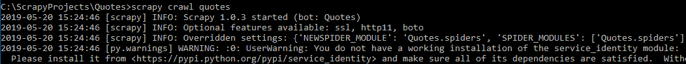

运行 Spider（scrapy crawl quotes）

在命令中提供了 Scrapy 参数`crawl`和 Spider 名称(`quotes`)。成功运行该命令将得到有关 Scrapy、机器人、Spider、爬取统计和 HTTP 方法的信息，并将列出项目数据作为字典。

在执行 Spider 时，我们将收到各种形式的信息，例如`INFO`/`DEBUG`/`scrapy`统计数据等，如下面的代码中所示：

```py
...[scrapy] INFO: Scrapy 1.0.3 started (bot: Quotes)
...[scrapy] INFO: Optional features available: ssl, http11, boto
...[scrapy] INFO: Overridden settings: {'NEWSPIDER_MODULE': 'Quotes.spiders', 'SPIDER_MODULES':     ['Quoyes.spiders'], 'BOT_NAME': 'Quotes'} ....... ...[scrapy] INFO: Enabled item pipelines:
...[scrapy] INFO: Spider opened
...[scrapy] INFO: Crawled 0 pages (at 0 pages/min), scraped 0 items (at 0 items/min)
...[scrapy] DEBUG: Telnet console listening on 127.0.0.1:6023
...[scrapy] DEBUG: Redirecting (301) to <GET http://quotes.toscrape.com/> from <GET http://quotes.toscrape.com/> 
[scrapy] DEBUG: Crawled (200) <GET http://quotes.toscrape.com/page/1/> (referer: None)
('Response Type >>> ', <class 'scrapy.http.response.html.HtmlResponse'>).......
.......
('Response Type >>> ', <class 'scrapy.http.response.html.HtmlResponse'>)
...[scrapy] DEBUG: Scraped from <200 http://quotes.toscrape.com/>
{'author': u'J.K. Rowling',
.......
...[scrapy] DEBUG: Scraped from <200 http://quotes.toscrape.com/page/5/>
{'author': u'James Baldwin',
 'author_link': u'http://quotes.toscrape.com/author/James-Baldwin',
.....
('Next Page URL: ', u'/page/6/')
.......
.......
Completed
...[scrapy] INFO: Closing spider (finished)  
```

Scrapy 的统计数据如下：

```py
[scrapy] INFO: Dumping Scrapy stats:
{'downloader/request_bytes': 3316,
 'downloader/request_count': 13,
 'downloader/request_method_count/GET': 13,
 'downloader/response_bytes': 28699,
 'downloader/response_count': 13,
 'downloader/response_status_count/200': 11,
 'downloader/response_status_count/301': 2,
 'dupefilter/filtered': 1,
 'finish_reason': 'finished',
 'finish_time': datetime.datetime(.....
 'item_scraped_count': 110,
 'log_count/DEBUG': 126,
 'log_count/ERROR': 2,
 'log_count/INFO': 8,
 'log_count/WARNING': 1,
 'request_depth_max': 8,
 'response_received_count': 11,
 'scheduler/dequeued': 13,
 'scheduler/dequeued/memory': 13,
 'scheduler/enqueued': 13,
 'scheduler/enqueued/memory': 13,
 'start_time': datetime.datetime(....
..... [scrapy] INFO: Spider closed (finished)
```

我们还可以运行 Spider 并将找到的项目或抓取的数据保存到外部文件中。数据被导出或存储在文件中，以便于访问、使用和分享管理。

使用 Scrapy，我们可以使用爬行命令将抓取的数据导出到外部文件，如下面的列表中所示：

+   要将数据提取到 CSV 文件中，我们可以使用`C:\ScrapyProjects\Quotes> scrapy crawl quotes -o quotes.csv`命令，如下面的截图所示：

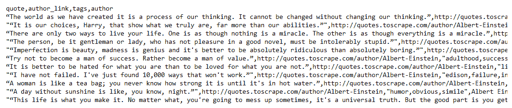

来自文件 quotes.csv 的内容

+   要将数据提取到 JSON 文件格式中，我们可以使用`C:\ScrapyProjects\Quotes> scrapy crawl quotes -o quotes.json`命令，如下所示：

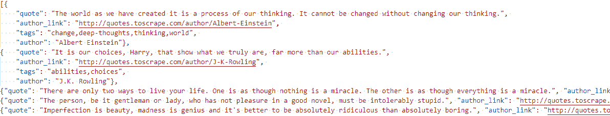

来自文件 quotes.json 的内容

在主项目文件夹中将生成`-o`参数后跟随的文件名。有关 feed 导出的更详细信息和可以用于导出数据的文件类型，请参阅官方 Scrapy 文档[`docs.scrapy.org/en/latest/topics/feed-exports.html`](http://docs.scrapy.org/en/latest/topics/feed-exports.html)。

在本节中，我们学习了 Scrapy 并使用它创建了一个爬虫来抓取数据并将抓取的数据导出到外部文件。在下一节中，我们将在网络上部署爬虫。

# 部署网络爬虫

在线部署网络爬虫或在实时服务器上部署将显著提高爬取活动的效果，具有速度、更新的技术、网络空间、随时使用等优势。在线部署之前需要进行本地测试和确认。我们需要拥有或购买网络空间，与网络托管公司或云服务器合作。

Scrapy Cloud 位于[`scrapinghub.com/scrapy-cloud`](https://scrapinghub.com/scrapy-cloud)，来自[`scrapinghub.com/`](https://scrapinghub.com/)的 Scrapinghub 是部署和管理 Scrapy Spider 的最佳平台之一。Scrapy Cloud 提供了一个简单而交互式的界面来部署 Scrapy，并且是免费的，以下是一些额外功能：

+   编码/管理和运行 Spider

+   将 Spider 部署到云端

+   下载和分享数据

+   API 访问与资源管理

以下是使用 Scrapy Cloud 部署项目的步骤：

1.  打开网络浏览器并转到[`scrapinghub.com/`](https://scrapinghub.com/)。

1.  从导航菜单中选择“产品”，并选择 SCRAPY CLOUD，如下面的屏幕截图所示：

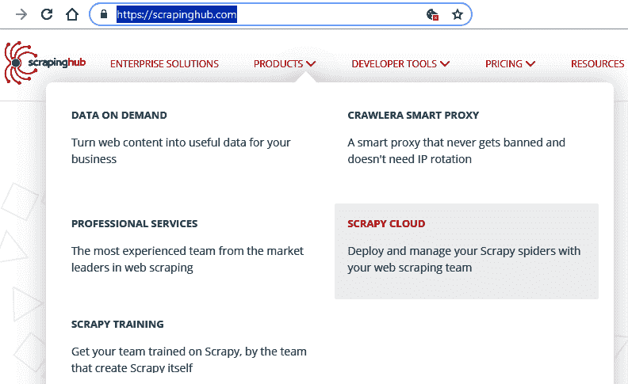

Scrapinghub 产品

1.  登录或注册页面加载自[`scrapinghub.com/scrapy-cloud`](https://scrapinghub.com/scrapy-cloud)（或打开登录页面：[`app.scrapinghub.com/account/login/`](https://app.scrapinghub.com/account/login/)）：


从 scraping hub 登录和注册页面

1.  完成注册和登录后，用户将获得一个交互式仪表板，并有一个“创建项目”的选项，如下面的屏幕截图所示：

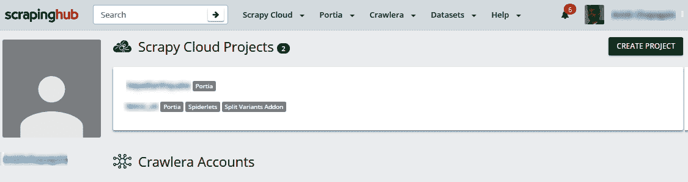

用户仪表板

1.  单击“创建项目”将弹出一个窗口，如下面的屏幕截图所示：

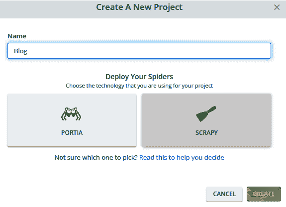

从 Scrapy Cloud 创建新项目

1.  创建一个项目，如屏幕截图所示，并选择部署 Spider 的技术 SCRAPY；点击“创建”。

1.  将加载带有 Scrapy Cloud 项目的仪表板，列出新创建的项目，如下面的屏幕截图所示：

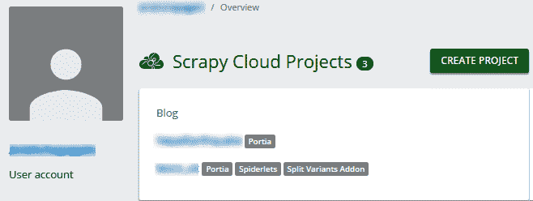

Scrapy Cloud 项目列表，带有“创建项目”选项

1.  要部署创建项目的代码，请从 Scrapy Cloud 项目列表中选择项目。

1.  项目仪表板将加载各种选项。选择“代码和部署”选项：

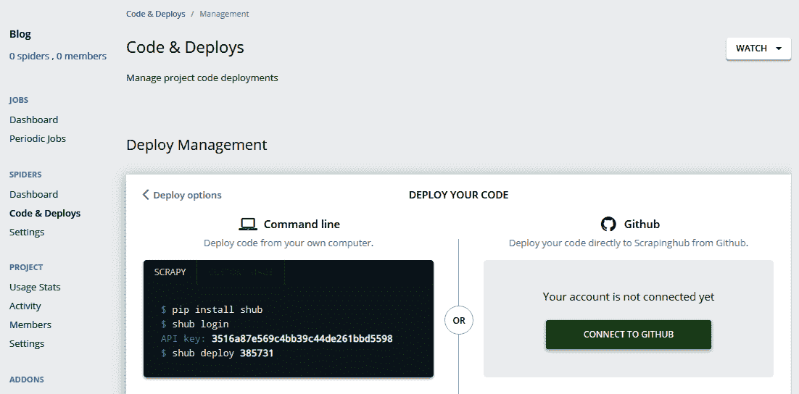

带有各种选项的项目仪表板

1.  使用命令行或 GitHub 部署代码。

1.  成功部署将列出 Spider，如下面的屏幕截图所示：

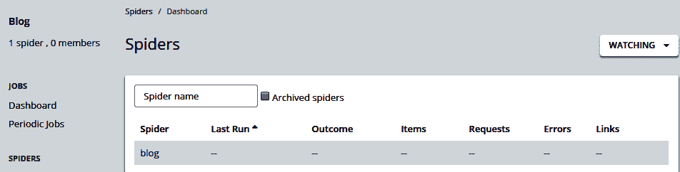

代码部署后 Spider 的列表

1.  单击列出的 Spider，将显示详细信息和可用选项，如下面的屏幕截图所示：

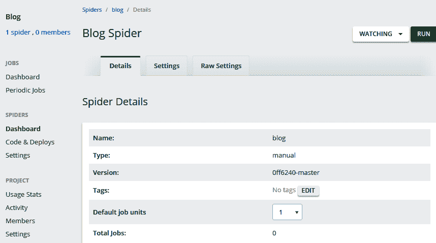

Spider 详情

1.  点击“运行”开始爬取所选的 Spider，如下所示：

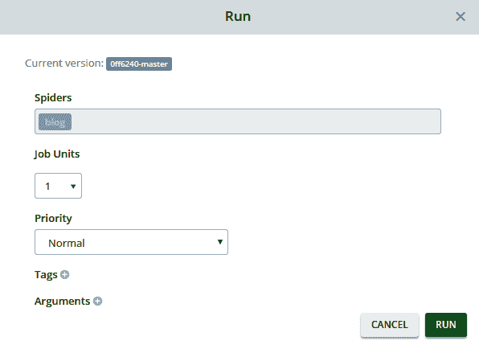

爬虫运行窗口

1.  点击“运行”使用默认选项。

1.  爬取作业将列在如下屏幕截图所示。我们可以浏览“已完成的作业”以获取有关项目、请求、错误、日志等的详细信息：

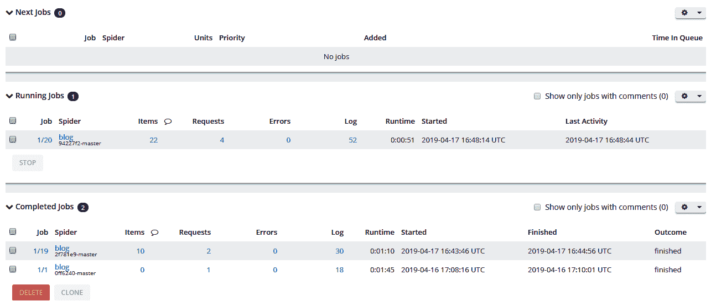

Spider 的作业详情

1.  在浏览已完成作业的项目时，可以使用筛选器、数据导出和下载等选项，以及有关请求、日志、统计等的爬取作业详细信息。单击列出的特定 Spider 可以加载更多信息：

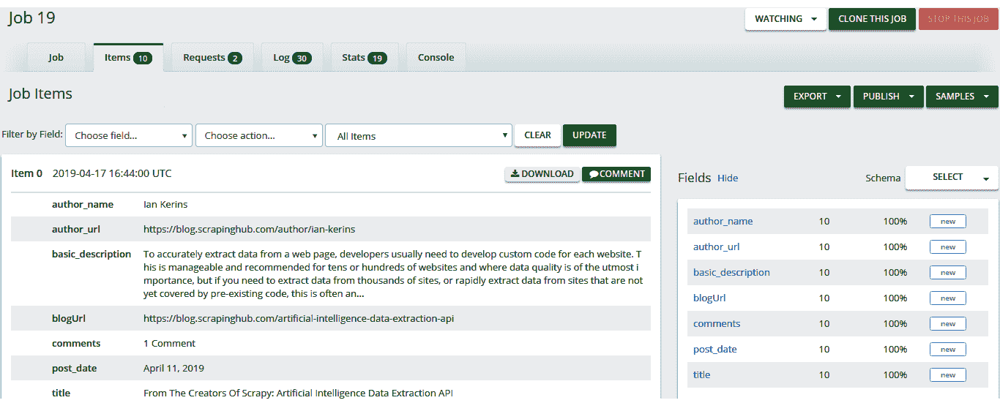

从 Spider 列出项目

使用前面列出的操作，我们可以成功地使用 Scraping hub 部署 Scrapy Spider。

在本节中，我们使用和探索了 Scraping hub 来部署 Scrapy Spider。

# 总结

选择合适的库和框架取决于项目的范围。用户可以自由选择库并体验在线过程。

在本章中，我们使用和探索了使用 Beautiful Soup 遍历 web 文档的各个方面，并探索了一个用于爬虫活动的框架：Scrapy。Scrapy 提供了一个完整的框架来开发爬虫，并且可以有效地使用 XPath 和 CSS 选择器来支持数据导出。Scrapy 项目也可以使用 Scraping hub 部署，以体验部署 Spider 的实时性能，并享受 Scraping hub（Scrapy Cloud）提供的功能。

在下一章中，我们将探索更多有关从网页中抓取数据的信息。

# 进一步阅读

+   Scrapy：[`docs.scrapy.org/en/latest/intro/overview.html`](https://docs.scrapy.org/en/latest/intro/overview.html)

+   学习 Scrapy：[`learn.scrapinghub.com/scrapy/`](https://learn.scrapinghub.com/scrapy/)

+   Beautiful Soup：[`www.crummy.com/software/BeautifulSoup/bs4/doc/`](https://www.crummy.com/software/BeautifulSoup/bs4/doc/)

+   SoupSieve：[`facelessuser.github.io/soupsieve/selectors/`](https://facelessuser.github.io/soupsieve/selectors/)

+   XPath 教程：[`doc.scrapy.org/en/xpath-tutorial/topics/xpath-tutorial.html`](https://doc.scrapy.org/en/xpath-tutorial/topics/xpath-tutorial.html)

+   CSS 选择器参考：[`www.w3schools.com/cssref/css_selectors.asp`](https://www.w3schools.com/cssref/css_selectors.asp)

+   Feed 导出：[`docs.scrapy.org/en/latest/topics/feed-exports.html`](http://docs.scrapy.org/en/latest/topics/feed-exports.html)

+   Scraping hub（Scrapy Cloud）：[`scrapinghub.com/`](https://scrapinghub.com/)
