# 第六章：处理安全网络

到目前为止，我们已经了解了可以用来访问和抓取网络内容的网络开发技术、数据查找技术和 Python 库。

现今存在各种形式的基于网络的安全措施，用于保护我们免受未经身份验证的使用和对敏感网络内容的未经授权访问。许多工具和技术被网站应用；有些针对用户行为，而有些针对网站内容及其可用性。

安全网络（或基于网络的安全功能）被认为是由网站实施并被希望使用或查看网站内容的最终用户所利用的技术之一。我们将从网络抓取的角度涵盖一些处理这些功能的基本概念。

在本章中，我们将学习以下主题：

+   安全网络简介

+   HTML `<form>`处理

+   处理用户身份验证

+   处理 cookie 和会话

# 技术要求

本章需要一个网络浏览器（Google Chrome 或 Mozilla Firefox）。我们将使用以下 Python 库：

+   `requests`

+   `pyquery`

如果这些库在您当前的 Python 设置中不存在，请参阅第二章，*Python 和网络 - 使用 urllib 和 Requests*，*设置事物*部分，获取有关其安装和设置的更多信息。

本章的代码文件可在本书的 GitHub 存储库中找到：[`github.com/PacktPublishing/Hands-On-Web-Scraping-with-Python/tree/master/Chapter06`](https://github.com/PacktPublishing/Hands-On-Web-Scraping-with-Python/tree/master/Chapter06)。

# 安全网络简介

实施基于网络的安全功能（或用于维护安全访问状态的功能）以访问信息的方式正在日益增长。随着网络技术的不断发展，网站和网络应用程序部署基本或高度复杂的安全机制。

安全的网络内容在爬取和抓取的角度上通常具有挑战性。在本节中，您将了解一些基本的基于安全的概念。我们将在接下来的章节中探讨这些概念及其实施。

接下来的章节将讨论一些安全功能概念或容易受到安全威胁的概念。这些概念可以独立或协作地在网站中使用一些基础工具或措施来实施。

# 表单处理

这也被称为 HTML `<form>`处理、表单处理或表单提交。这种方法处理和处理 HTML `<form>`内的数据。

HTML `<form>`或`<form>`标签内的元素，如`<input>`、`<option>`、`<button>`、`<textarea>`等，通常用于收集和提交数据。请访问 W3School HTML 表单（[`www.w3schools.com/html/html_forms.asp`](https://www.w3schools.com/html/html_forms.asp)）获取 HTML 表单的实际示例和详细信息。

HTTP 方法或请求方法，如`GET`、`POST`、`PUT`等，用于在网页之间访问或提交数据。有关 HTTP 的更多信息，请访问[`www.w3.org/Protocols/`](https://www.w3.org/Protocols/)。

从安全角度来看，HTML `<form>` 可以包含动态和隐藏或系统生成的值，用于管理验证、为字段提供值，或在表单提交期间执行基于安全的实现。具有诸如`<input type="hidden"...>`的字段的表单在页面上对用户可能不可见。在这种情况下，用户必须从页面源代码或基于浏览器的开发者工具获取帮助。

一个带有表单的网页可能在某些字段中显示并要求输入，并且可以在后端或源代码中包含一些额外的字段，其中可能包含用户或系统信息。这些信息在幕后被收集和处理，用于基于网页的分析、营销、用户和系统识别、安全管理等。

有关表单处理的更多信息，请参阅第三章，*使用 LXML、XPath 和 CSS 选择器*，*使用网页浏览器开发者工具访问网页内容*部分。

# Cookies 和会话

要访问由浏览网站设置的 cookie 和会话值，请参阅第一章，*网页抓取基础知识*，*开发者工具*部分的*数据查找技术*部分。现在，让我们了解一下 cookie 和会话是什么。

# Cookies

Cookie 是由网站在您的系统或计算机上生成和存储的数据。Cookie 中的数据有助于识别用户对网站的网络请求。Cookie 中存储的数据以`键:值`对的形式存储。存储在 cookie 中的数据有助于网站访问该数据，并以快速交互的形式传输某些保存的值。

Cookie 还允许网站跟踪用户资料、他们的网页习惯等，并利用这些信息进行索引、页面广告和营销活动。

基于 cookie 的数据可以持续一个会话（即从加载网页到关闭浏览器的时间）形成所谓的会话 cookie，或者持续几天、几周或几个月，这被称为永久或存储的 cookie。Cookie 还可以包含以秒为单位的过期值，一旦该值表示的时间段过去，cookie 就会过期或从系统中删除。

有关 cookie 的更多信息，请参阅第一章，*网页抓取基础知识*，*了解网页开发和技术*部分的*HTTP*部分。您也可以访问[`www.aboutcookies.org/`](https://www.aboutcookies.org/)和[`www.allaboutcookies.org/`](http://www.allaboutcookies.org/)获取更多信息。

# 会话

会话是强制两个系统之间基于状态的通信的属性。会话用于临时存储用户信息，并在用户退出浏览器或离开网站时被删除。

会话用于维护安全活动。网站生成一个唯一的标识号，也称为会话 ID 或会话密钥，用于独立跟踪他们的用户或基于安全的特性。在大多数情况下，可以使用 cookie 来跟踪会话的可用性。

# 用户认证

用户认证涉及处理和管理基于用户的身份识别过程。网站通过其注册页面提供用户注册，并收集用户对所需或可用字段的输入。用户的详细信息被保存在安全的地方，如云端或基于服务器的数据库，或任何其他安全系统。

注册用户经过验证，被允许从他们的系统登录和退出，并通过他们的用户名、密码和电子邮件地址进行识别。

表单处理、cookies、会话管理和其他基于安全性的措施可以单独或协同部署用于这个过程。

在上一章中，我们探讨并解决了基于信息可用性、访问网页、应用各种 HTTP 方法等各种情景，以及在网页抓取过程中可能实施或面临的各种措施和情况。本章的各节涉及可以实施或在网页抓取过程中可能面临的各种措施和情况。

# HTML <form>处理

在本节中，我们将处理表单处理或表单提交，以便从[`toscrape.com`](http://toscrape.com)（ViewState）搜索活动。ViewState 是基于 AJAX 的过滤表单。

这个特定的表单提交是通过 AJAX（[`www.w3schools.com/js/js_ajax_intro.asp`](https://www.w3schools.com/js/js_ajax_intro.asp)）在多个步骤中执行的。有关 AJAX 的更多信息，请访问[W3Schools AJAX](https://www.w3schools.com/js/js_ajax_intro.asp)：

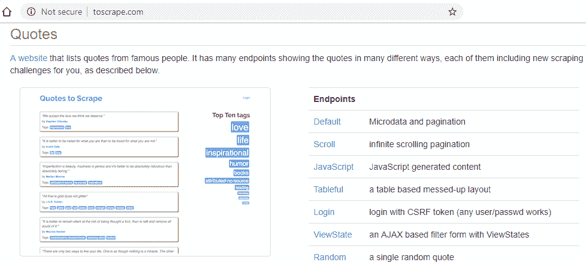

http://toscrape.com 中的引用部分具有各种端点

让我们设置代码。需要导入`pyquery`和`requests`库，并收集所需的 URL，以便可以使用它们。`processRequests()`函数，连同位置参数和命名参数，用于处理对所提供`url`的请求，使用基于`params`参数的 HTTP `POST` 和 `GET` 方法返回 PyQuery 对象作为响应。

我们还对迭代`authorTags`感兴趣，并分别收集`quoteAuthor`和`message`。以类似的方式，可以提取从页面获得的任何信息：

```py
from pyquery import PyQuery as pq
import requests
mainurl = "http://toscrape.com/" searchurl = "http://quotes.toscrape.com/search.aspx" filterurl = "http://quotes.toscrape.com/filter.aspx" quoteurl = "http://quotes.toscrape.com/" authorTags = [('Albert Einstein', 'success'), ('Thomas A. Edison', 'inspirational')]

def processRequests(url, params={}, customheaders={}):
    if len(params) > 0:
        response = requests.post(url, data=params, headers=customheaders)
    else:
        response = requests.get(url)   return pq(response.text)

if __name__ == '__main__':
    for authorTag in authorTags:
        authorName,tagName= authorTag
```

以下屏幕截图显示了在前面的代码中定义的`searchurl`页面的内容。存在两个单独的下拉菜单，分别用于作者和他们的标签的选项：

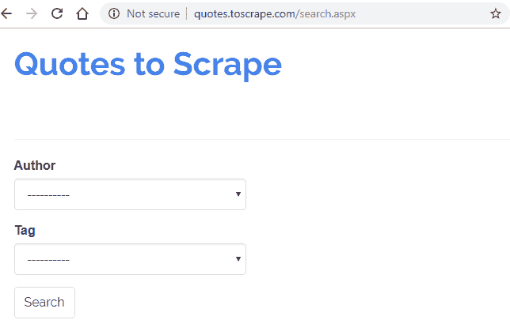

http://quotes.toscrape.com/search.aspx 带有作者和标签的`searchurl`

让我们加载`searchurl`，如下面的代码所示，并从作者下拉菜单中选择一个作者。使用 AJAX 生成`<option>`标签，以供作者的选定`<option>`：

请参阅第三章，*使用 LXML、XPath 和 CSS 选择器*，*使用 Web 浏览器开发工具访问 Web 内容*部分，以及第一章，*Web 抓取基础知识*，*数据查找技术*和*开发人员工具*部分。

```py
#Step 1: load searchURL searchResponse = processRequests(searchurl)
author = searchResponse.find('select#author option:contains("' + authorName + '")').attr('value')
viewstate = searchResponse.find('input#__VIEWSTATE').attr('value')
tag = searchResponse.find('select#tag option').text()

print("Author: ", author)
print("ViewState: ", viewstate)
print("Tag: ", tag)
```

如您所见，使用 HTTP `GET` 调用`processRequests()`函数到`searchurl`，并将返回一个 PyQuery 对象作为响应。从`searchResponse`中，让我们收集必要的表单字段。收集诸如`author`、`viewstate`和`tag`之类的字段，并在每次迭代中获得的字段的值显示在以下输出中：

```py
Author: Albert Einstein
ViewState: NTA2MjI4NmE1Y2Q3NGFhMzhjZTgxMzM4ZWU0NjU4MmUsQWxiZXJ0IEVpbnN0ZWluLEouSy4gUm93bGluZyxKYW5lIEF1c3Rlbi............BDdW1taW5ncyxLaGFsZWQgSG9zc2VpbmksSGFycGVyIExlZSxNYWRlbGVpbmUgTCdFbmdsZQ==
Tag: ----------

Author: Thomas A. Edison
ViewState: ZjNhZTUwZDYzY2YyNDZlZmE5ODY0YTI5OWRhNDAyMDYsQWxiZXJ0IEVpbnN0ZWluLEouSy4gUm93bGluZyxKYW5lIEF1c3Rlbi............BDdW1taW5ncyxLaGFsZWQgSG9zc2VpbmksSGFycGVyIExlZSxNYWRlbGVpbmUgTCdFbmdsZQ==
Tag: ----------
```

从前面的输出中，我们可以看到`viewstate (<input id="__VIEWSTATE"..>)`在`authorTags`的两次迭代中包含唯一值。

`ViewState`是由网站生成的用于识别页面的各个状态的唯一和随机值，通常作为隐藏的`<input>`值。这种`<form>`值存在于大多数使用`<form>`和内置 ASP 或 ASP.NET 技术的网站中。`ViewState`值在客户端上使用，它保留或保持了`<form>`元素的值，以及页面的身份。使用`ViewState`是与状态管理相关的技术之一。有关更多信息，请访问来自 C#Corner 的文章，网址为[`www.c-sharpcorner.com/article/Asp-Net-state-management-techniques/`](https://www.c-sharpcorner.com/article/Asp-Net-state-management-techniques/)。

`ViewState`的值对于获取所选作者的`<option>`标签是必不可少的。正如我们在下面的代码中所看到的，`params`是使用`author`、`tag`和`__VIEWSTATE`创建的，并通过 HTTP `POST` 和`customheaders`提交到`filterurl`，通过获取`filterResponse`。以下代码显示了当`filterurl`加载了作者和默认标签时会发生什么：

```py
#Step 2: load filterurl with author and default tag params = {'author': author, 'tag': tag, '__VIEWSTATE': viewstate}
customheaders = {
    'Accept': 'text/html,application/xhtml+xml,application/xml;q=0.9,image/webp,image/apng,*/*;q=0.8',
    'Content-Type': 'application/x-www-form-urlencoded',
    'Referer': searchurl
}

filterResponse = processRequests(filterurl,params,customheaders)
viewstate = filterResponse.find('input#__VIEWSTATE').attr('value')
tagSuccess = filterResponse.find('select#tag option:contains("' + tagName + '")').attr('value')
submitButton = filterResponse.find('input[name="submit_button"]').attr('value')
 print("Author: ", author)
print("ViewState: ", viewstate)
print("Tag: ", tagSuccess)
print("Submit: ", submitButton)
```

迭代前面的代码将产生以下输出：

+   `http://quotes.toscrape.com/filter.aspx` 页面上选择了作者（`托马斯·爱迪生`）和标签（`鼓舞人心`）：

```py
Author: Thomas A. Edison
ViewState: ZjNhZTUwZDYzY2YyNDZlZmE5ODY0YTI5OWRhNDAyMDYsQWxiZXJ0IEVpbnN0ZWluLEouSy4gUm93bGluZyxKYW5lIEF1c3Rlbi............BDdW1taW5ncyxLaGFsZWQgSG9zc2VpbmksSGFycGVyIExlZSxNYWRlbGVpbmUgTCdFbmdsZSwtLS0tLS0tLS0t
Tag: inspirational
Submit: Search
```

+   `http://quotes.toscrape.com/filter.aspx` 页面上选择了作者（`阿尔伯特·爱因斯坦`）和标签（`成功`）：

```py
Author: Albert Einstein
ViewState: NTA2MjI4NmE1Y2Q3NGFhMzhjZTgxMzM4ZWU0NjU4MmUsQWxiZXJ0IEVpbnN0ZWluLEouSy4gUm93bGluZyxKYW5lIEF1c3Rlbi............BDdW1taW5ncyxLaGFsZWQgSG9zc2VpbmksSGFycGVyIExlZSxNYWRlbGVpbmUgTCdFbmdsZSwtLS0tLS0tLS0t
Tag: success
Submit: Search
```

现在我们已经获得了每个`authorTags`的所有过滤`<form>`参数，最后一步是提交这些参数，即`params`到`filterurl`，使用`HTTP POST`并提取结果信息：

```py
#Step 3: load filterurl with author and defined tag params = {'author': author, 'tag': tagSuccess, 'submit_button': submitButton, '__VIEWSTATE': viewstate}  customheaders = {
'Accept': 'text/html,application/xhtml+xml,application/xml;q=0.9,image/webp,image/apng,*/*;q=0.8',
'Content-Type': 'application/x-www-form-urlencoded',
'Referer': filterurl
}

finalResponse = processRequests(filterurl,params, customheaders)

#Step 4: Extract results quote = finalResponse.find('div.quote span.content').text()

quoteAuthor = finalResponse.find('div.quote span.author').text()
message = finalResponse.find('div.quote span.tag').text()
print("Author: ", quoteAuthor, "\nMessage: ", message)
```

正如我们所看到的，`finalResponse`是由`processRequests()`返回的 PyQuery 对象，并被解析以获取`quote`、`quoteAuthor`和`message`，如下面的屏幕截图所示：

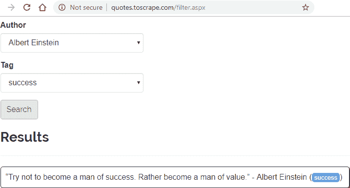

http://quotes.toscrape.com/filter.aspx ，结果为作者和标签

使用前面的代码进行第一次迭代的输出，包括`Author`和`Message`，如下所示：

```py
Author: Albert Einstein 
Message: success
```

以下是第二次迭代的屏幕截图：

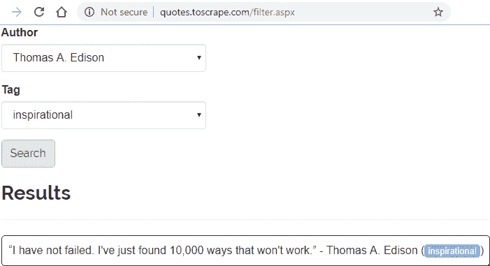

http://quotes.toscrape.com/filter.aspx ，结果为作者和标签

使用前面的代码进行第二次迭代的输出，包括`Author`和`Message`，如下所示：

```py
Author: Thomas A. Edison 
Message: inspirational
```

在前面的代码中显示了带有搜索和过滤操作的表单处理，以及使用隐藏字段。`ViewState`值由系统在后台使用，以识别所选选项并过滤与其关联的标签，从而得到作者的引用。

最终表单提交的 HTTP `POST`参数总数为四个，而页面上只显示或允许与两个选项交互。如果对值进行任何更改，例如`viewstate`，或者如果`viewstate`在`params`中丢失，将导致空引号，如下面的代码所示：

```py
#params={'author':author,'tag':tagSuccess,'submit_button':submitButton,'__VIEWSTATE':viewstate}
params={'author':author,'tag':tagSuccess,'submit_button':submitButton,'__VIEWSTATE':viewstate+"TEST"}
#params={'author':author,'tag':tagSuccess,'submit_button':submitButton}
......
finalResponse = processRequests(filterurl,params, customheaders)
......
print("Author: ", quoteAuthor, "\nMessage: ", message)

*Quote:* 
*Author:* 
*Message:*
```

表单提交不仅取决于从页面上可见的`<form>`元素中选择的必需参数，还可能存在隐藏的值和动态生成的状态表示，应该对其进行有效处理以获得成功的输出。

在下一节中，我们将处理表单提交和用户身份验证。

# 处理用户身份验证

在本节中，我们将探讨用于处理基本用户身份验证的任务，该任务可从[`testing-ground.scraping.pro/login`](http://testing-ground.scraping.pro/login)获得。用户身份验证通常使用一组唯一的信息进行处理，例如用户名、密码、电子邮件等，以在网站上识别用户。

本节中的代码涉及登录和更改登录凭据，以及从页面获取相应的消息。

如下面的屏幕截图所示，HTML `<form>`存在两个`<input>`框，用于接受用户名和密码（即登录凭据），这些是登录所需的。登录凭据是私密和安全的信息，但对于这个特定的测试站点，这些值是可见的，预定义的，并提供的，即`Username = "admin"`和`Password = "12345"`：

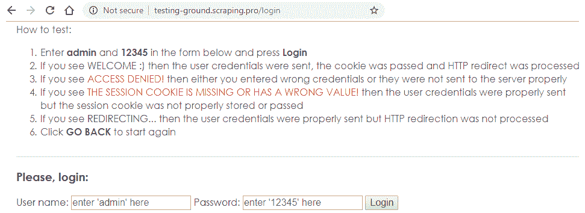

登录页面

使用这些凭据在[`testing-ground.scraping.pro/login`](http://testing-ground.scraping.pro/login)上进行登录处理，我们需要找到页面上用于处理输入凭据的`<form>`属性，即`action`和`method`。正如我们所看到的，HTTP `POST`方法将被应用于在[`testing-ground.scraping.pro/login?mode=login`](http://testing-ground.scraping.pro/login?mode=login)上执行表单提交：

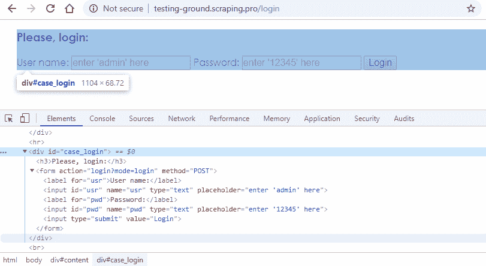

检查`<form>`元素

让我们继续设置代码。需要导入`pyquery`和`requests`库，并收集所需的 URL，以便可以使用它们：

```py
from pyquery import PyQuery as pq
import requests
mainUrl = "http://testing-ground.scraping.pro" loginUrl = "http://testing-ground.scraping.pro/login" logoutUrl = "http://testing-ground.scraping.pro/login?mode=logout" postUrl="http://testing-ground.scraping.pro/login?mode=login"
```

如下面的代码所示，`responseCookies()`函数将接受从`requests.get()`获得的响应对象，然后打印头信息和 cookies 信息。同样，`processParams()`函数接受基于`<form>`的参数，将被发布，并打印从页面获得的消息：

```py
def responseCookies(response):
    headers = response.headers
    cookies = response.cookies
    print("Headers: ", headers)
    print("Cookies: ", cookies)

def processParams(params):
    response = requests.post(postUrl, data=params)
    responseB = pq(response.text)
    message = responseB.find('div#case_login h3').text()
    print("Confirm Login : ",message)

if __name__ == '__main__': 
    requests.get(logoutUrl)

    response = requests.get(mainUrl)
    responseCookies(response)

    response = requests.get(loginUrl)
    responseCookies(response)
```

现在，让我们请求`logoutUrl`来清除 cookies 和会话（如果存在）。或者，对于一个全新的过程，我们可以分别请求`mainUrl`和`loginUrl`，并检查从`responseCookies()`接收到的消息。以下是输出：

```py
Headers:{'Vary':'Accept-Encoding','Content-Type':'text/html','Connection':'Keep-Alive', ..........., 'Content-Encoding':'gzip','X-Powered-By':'PHP/5.4.4-14+deb7u12'}
Cookies: <RequestsCookieJar[]>

Headers:{'Vary':'Accept-Encoding','Content-Type':'text/html','Connection':'Keep-Alive',.............., 'Set-Cookie':'tdsess=deleted; expires=Thu, 01-Jan-1970 00:00:01 GMT',........., 'Keep-Alive':'timeout=5, max=100','X-Powered-By':'PHP/5.4.4-14+deb7u12'}
Cookies: <RequestsCookieJar[]>
```

如前面的输出所示，`mainUrl`和`loginUrl`的 cookies 为空，并且除了来自`loginUrl`的值为“tdsess = deleted; expires = Thu, 01-Jan-1970 00:00:01 GMT”的`Set-Cookie`之外，没有其他唯一的标头对可用。

现在，`responseA`从`loginUrl``<form>`元素属性名称已被收集为`username`和`password`，此信息将用于创建`paramsCorrect`和`paramsIncorrect`参数字符串，然后将其发布到`postUrl`：

```py
responseA = pq(response.text)
username = responseA.find('input[id="usr"]').attr('name')
password = responseA.find('input[id="pwd"]').attr('name')

#Welcome : Success paramsCorrect = {username: 'admin', password: '12345'} #Success print(paramsCorrect)
processParams(paramsCorrect)
```

使用提供的`paramsCorrect`参数字符串成功提交表单将导致以下输出：

```py
{'pwd': '12345', 'usr': 'admin'}
Confirm Login : WELCOME :)
```

前面的输出是从`postUrl`的响应中提取的，在这个测试案例中实际上是一个重定向页面，URL 为[`testing-ground.scraping.pro/login?mode=welcome`](http://testing-ground.scraping.pro/login?mode=welcome)：

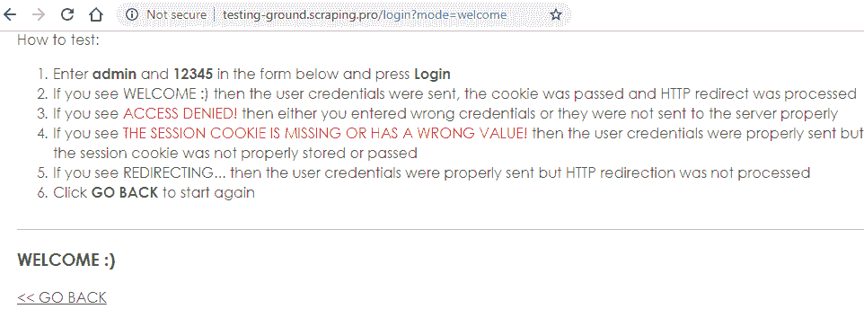

使用有效的登录凭据成功提交表单

让我们继续使用表单提交，但使用无效的凭据。 `paramsIncorrect`短语包含“密码”的无效值：

```py
 paramsIncorrect = {username: 'admin', password: '123456'} #Access Denied
  print(paramsIncorrect)
 processParams(paramsIncorrect)
```

上述代码将导致以下输出：

```py
{'pwd': '123456', 'usr': 'admin'}
Confirm Login : ACCESS DENIED!
```

前面的输出也可以在`loginUrl`本身找到，这次不会发生重定向：

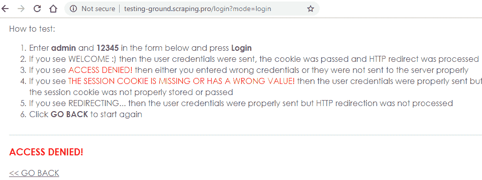

访问被拒绝！（使用错误的凭据处理）

正如您所看到的，用户身份验证和表单提交是相辅相成的。通过使用正确的登录凭据，并能够使用 Python 处理表单提交过程，我们可以获得成功的输出，或者处理从网站返回的相关输出。

在下一节中，我们将通过处理包含会话的 cookie 来执行表单提交和用户身份验证。

# 处理 cookie 和会话

在本节中，我们将处理用户身份验证的表单处理，并为[`quotes.toscrape.com/login`](http://quotes.toscrape.com/login)从[`toscrape.com`](http://toscrape.com)管理 cookie 和会话。

为了登录，您需要使用 CSRF 令牌登录（任何用户名/密码都可以使用）。

让我们设置代码。需要导入`pyquery`和`requests`库，并收集并使用所需的 URL。使用“getCustomHeaders（）”函数，以及`cookieHeader`参数，用于为 URL 请求标头设置 cookie 值。使用“responseCookies（）”函数，以及`response`参数，显示`headers`和`cookies`，并从`cookies`返回`Set-Cookie`值：

```py
from pyquery import PyQuery as pq
import requests
mainUrl = "http://toscrape.com/" loginUrl = "http://quotes.toscrape.com/login"  quoteUrl = "http://quotes.toscrape.com/"   def getCustomHeaders(cookieHeader):
    return {
        'Host': 'quotes.toscrape.com',
        'User-Agent': 'Mozilla/5.0 (Windows NT 10.0; Win64; x64; rv:65.0) Gecko/20100101 Firefox/65.0',
        'Accept': 'text/html,application/xhtml+xml,application/xml;q=0.9,image/webp,*/*;q=0.8',
        'Referer': 'http://quotes.toscrape.com/login',
        'Content-Type': 'application/x-www-form-urlencoded', 
        'Cookie': cookieHeader
    }

def responseCookies(response):
    headers = response.headers
    cookies = response.cookies
    print("Headers: ", headers)
    print("Cookies: ", cookies)
    return headers['Set-Cookie']

if __name__ == '__main__':
```

有关 HTTP 和 HTTP 标头的更多信息，请访问第一章，*网络抓取基础知识*，*了解 Web 开发和技术*和*HTTP*部分。有关 cookie 的更多详细信息，请访问[`www.aboutcookies.org/`](https://www.aboutcookies.org/)或[allaboutcookies.org](http://www.allaboutcookies.org/)。

现在，让我们分别加载`mainUrl`和`loginUrl`：

```py
requests.get(mainUrl)
response = requests.get(loginUrl)

```

以下屏幕截图显示了使用`loginUrl`时登录页面的外观：

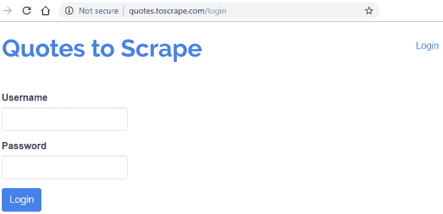

从 http://quotes.toscrape.com/login 登录页面

一旦加载了`loginUrl`，我们可以检查或使用基于浏览器的开发人员工具来查找请求标头，并确认是否存在任何 cookie。我们收到以下输出：

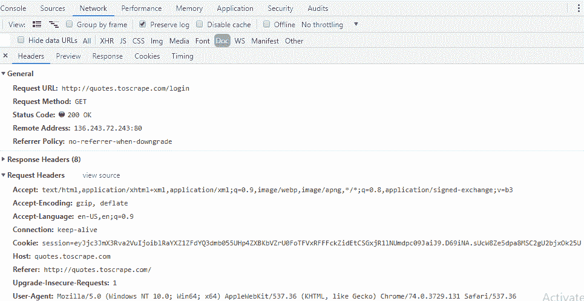

来自浏览器开发人员工具的网络面板文档标头选项卡

以下代码接受来自`response`的 cookie，并用于标头：

```py
setCookie = responseCookies(response)
print("Set-Cookie: ",setCookie)
```

正如我们从前面的屏幕截图中看到的，请求标头包含以“sessio = ....”开头的值为“Cookie”的`key`，也称为会话 ID。此信息在`response.headers`和`response.cookies`中找到，并且`responseCookies（）`函数在打印详细信息之前从`response.headers`返回 cookie 值：

```py
Headers: {'Set-Cookie': session=eyJjc3JmX3Rva2VuIjoicUlPVGNnQ2FKZmJaS3NOdmlIREFWbVdvWGtMakJkVXl1U3BScmVZTWhRd0d6dEZueFBsRSJ9.D68Log.3ANox76h0whpTRjkqNo7JRgCtWI; HttpOnly; Path=/',...,'Content-Encoding':'gzip','Content-Type':'text/html; charset=utf-8',......}

Cookies: <RequestsCookieJar[<Cookie session=eyJjc3JmX3Rva2VuIjoicUlPVGNnQ2FKZmJaS3NOdmlIREFWbVdvWGtMakJkVXl1U3BScmVZTWhRd0d6dEZueFBsRSJ9.D68Log.3ANox76h0whpTRjkqNo7JRgCtWI for quotes.toscrape.com/>]>

Set-Cookie: session=eyJjc3JmX3Rva2VuIjoicUlPVGNnQ2FKZmJaS3NOdmlIREFWbVdvWGtMakJkVXl1U3BScmVZTWhRd0d6dEZueFBsRSJ9.D68Log.3ANox76h0whpTRjkqNo7JRgCtWI; HttpOnly; Path=/
```

`requests.post()`短语使用 HTTP `POST`请求到`loginURL`，并使用已设置的`params`和`customHeaders`。`customHeaders`是使用我们之前收到的`setCookie`值创建的：

现在我们已经收到了基于 cookie 的会话值，我们需要维护这个值，以便进行成功的登录过程。

Cookies: [`www.aboutcookies.org/`](https://www.aboutcookies.org/) , [`www.allaboutcookies.org/`](http://www.allaboutcookies.org/)

在下一章中，我们将使用 Python 编程语言与 Web API 进行数据提取交互。

浏览器开发者工具中的元素面板与页面源

以下截图显示了成功的身份验证和验证信息：

在用户和网站之间保持安全措施是一项具有挑战性和危险性的任务。存在不同的安全问题需要加以管理。网络上存在各种新概念，需要有效合法地处理，以便进行网络抓取活动。

浏览器开发者工具：[`developers.google.com/web/tools/chrome-devtools/`](https://developers.google.com/web/tools/chrome-devtools/), [`developer.mozilla.org/son/docs/Tools`](https://developer.mozilla.org/son/docs/Tools)

```py
responseA = pq(response.text)
csrf_token = responseA.find('input[name="csrf_token"]').attr('value')
username = responseA.find('input[id="username"]').attr('name')
password = responseA.find('input[id="password"]').attr('name')

params = {username: 'test', password: 'test', 'csrf_token': csrf_token}
print(params)
```

让我们收集基于`<form>`的字段以及有关表单提交的更多信息：

```py
{'password':'test','username':'test','csrf_token':'jJgAHDQykMBnCFsPIZOoqdbflYRzXtSuiEmwKeGavVWxpNLUhrcT'}
```

通过`<form>`元素的`name`属性作为键和默认值构建要通过表单操作提交的参数，并分别需要接收值作为它们的值。

进一步阅读

```py
customHeaders = getCustomHeaders(setCookie)
response = requests.post(loginUrl, data=params, headers=customHeaders)
setCookie = responseCookies(response)
#print("Set-Cookie: ",setCookie)

responseB = pq(response.text)
logoutText = responseB.find('a[href*="logout"]').text()
logoutLink = responseB.find('a[href*="logout"]').attr('href')

print("Current Page : ",response.url)
print("Confirm Login : ", responseB.find('.row h2').text())
print("Logout Info : ", logoutText," & ",logoutLink)
```

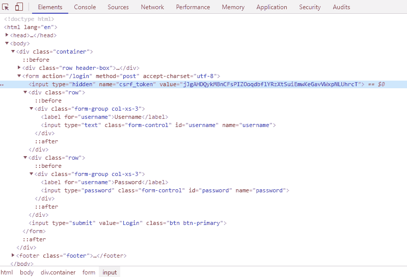

```py
Current Page : http://quotes.toscrape.com/
Confirm Login : Top Ten tags
Logout Info : Logout & /logout
```

最后，我们收到了成功的输出，以及重定向的 URL 和有关注销的信息：

在这个例子中，`username`和`password`是开放的字符串值，`test`已经被用于两者：

没有`key`命名为`Cookie`的空`customHeaders`或`customHeaders`将无法成功进行身份验证。同样，`csrf_token`也是必需的参数。即使提供了所需的`key:value`信息对，发布的、更新的或空的`csrf_token`也将无法成功进行身份验证。

# 总结

在本章中，我们探讨了一些与安全问题相关的基本措施和技术，这些问题经常出现，对于网络抓取来说是具有挑战性的。

AJAX: [`api.jquery.com/jquery.ajax/`](http://api.jquery.com/jquery.ajax/), [`www.w3schools.com/js/js_ajax_intro.asp`](https://www.w3schools.com/js/js_ajax_intro.asp)

**跨站请求伪造**（**CSRF**）或会话劫持是一种安全措施，用于识别用户和网站之间的每个单独请求。通常，`CSRF_TOKEN`或令牌用于管理这样的机制。当用户向网站发出请求时，网站会生成一个随机字符串的令牌。处理网站的任何形式的 HTTP 请求都需要令牌值。每个成功请求的令牌值都会发生变化。包含令牌值的 HTML `<form>`可以使用已更新或已删除的令牌进行处理，但网站不会接受这些令牌。

# 从[`quotes.toscrape.com/`](http://quotes.toscrape.com/)验证的成功身份验证信息

+   会话 ID 是网站服务器为特定用户分配的唯一编号，持续一段时间或一次会话。这个 ID 可以存储在特定的`<form>`字段或 cookies 中，甚至可以附加到 URL 查询字符串中。

+   收集具有现有值和名称的表单字段，并配置`params`，得到以下输出：

+   正如我们从前面的截图中可以看到的，`<form>`正在使用 HTTP `POST`将表单字段提交到`loginUrl`，还有一个隐藏的`<input>`字段带有`csrf_token`，以及接受登录凭据的字段。

+   CSRF: [`www.owasp.org/index.php/Cross-Site_Request_Forgery_(CSRF)`](https://www.owasp.org/index.php/Cross-Site_Request_Forgery_(CSRF))

+   HTML forms: [`www.w3schools.com/html/html_forms.asp`](https://www.w3schools.com/html/html_forms.asp), [`developer.mozilla.org/en-US/docs/Learn/HTML/Forms`](https://developer.mozilla.org/en-US/docs/Learn/HTML/Forms)

+   HTTP: [`www.w3.org/Protocols/`](https://www.w3.org/Protocols/)

+   HTTP headers: [`jkorpela.fi/http.html`](http://jkorpela.fi/http.html)

+   HTTP session: [`developer.mozilla.org/en-US/docs/Web/HTTP/Session`](https://developer.mozilla.org/en-US/docs/Web/HTTP/Session)

+   Web scraping sandbox: [`toscrape.com/`](http://toscrape.com/)

+   Web scraper testing ground: [`testing-ground.scraping.pro/`](http://testing-ground.scraping.pro/)
