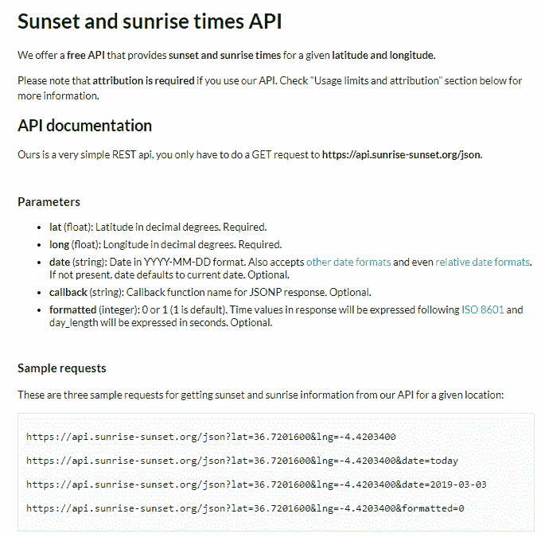
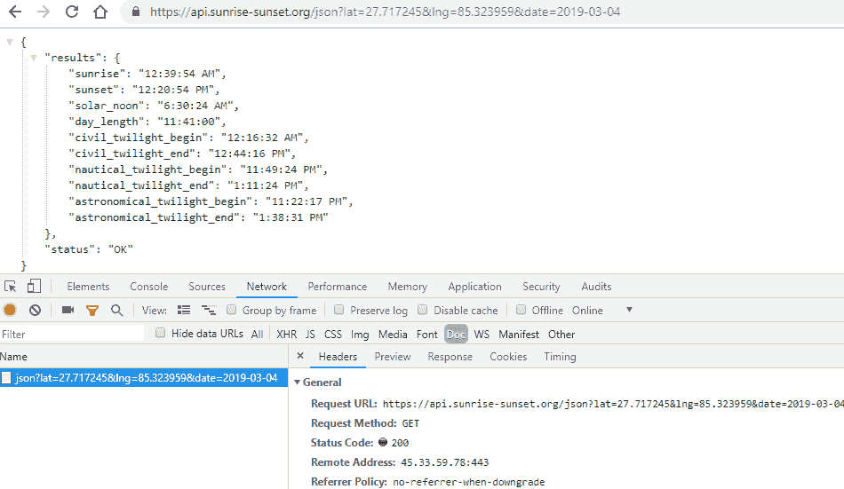
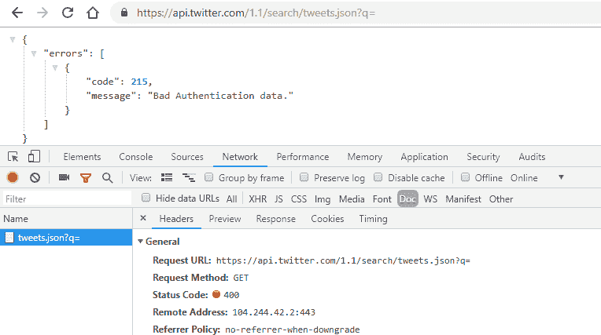
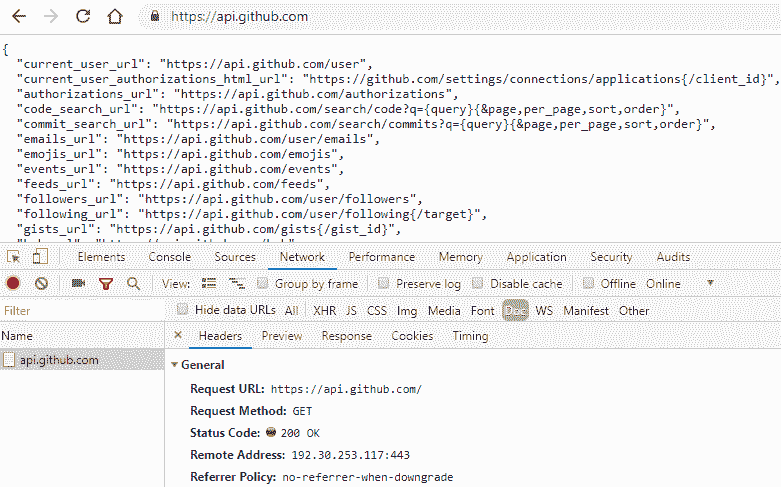
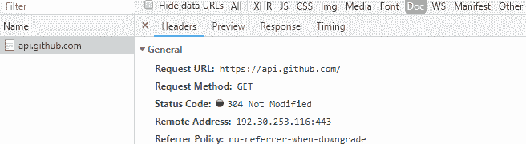
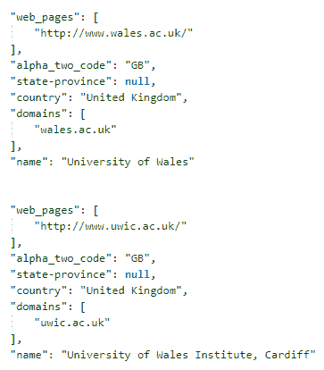

# 第七章：使用基于 Web 的 API 进行数据提取

基于 Web 的 API 允许用户与网络上的信息进行交互。API 直接处理格式化模式易于使用和维护的数据。有些 API 在向用户提供数据之前还需要用户身份验证。本章将介绍使用 Python 和一些 Web API 与可用 API 进行交互和提取数据。通常，API 以可交换的文档格式（如 JSON、CSV 和 XML）提供数据。

在本章中，我们将涵盖以下主题：

+   Web API 简介

+   使用 Python 编程语言访问 Web API

+   通过 Web API 处理和提取数据

# 技术要求

本章需要使用 Web 浏览器（Google Chrome 或 Mozilla Firefox）。我们将使用以下 Python 库：

+   `requests`

+   `json`

+   `collections`

如果这些库在您当前的 Python 设置中不存在，请参考第二章，*Python 和 Web-使用 urllib 和 Requests*，在*设置事项*部分了解如何下载它们。

本章的代码文件可在本书的 GitHub 存储库中找到：[`github.com/PacktPublishing/Hands-On-Web-Scraping-with-Python/tree/master/Chapter07`](https://github.com/PacktPublishing/Hands-On-Web-Scraping-with-Python/tree/master/Chapter07)。

# Web API 简介

**基于 Web 的应用程序编程信息**或**基于 Web 的 API**是网站提供的接口，用于返回接收到的请求的信息。Web API（或 API）实际上是网站为用户或第三方 Web 应用程序或自动化脚本提供的 Web 服务，以便共享和交换信息。

通常，这是通过 Web 浏览器处理的**用户界面**（UI），用于从已向网站或 Web 服务器发出的请求中检索特定信息。具有任何类型大量信息的网站可以为其用户提供 Web API，以便进行信息共享。

在软件应用领域，API 以其一组设施（如方法和库）而闻名，可用于进一步增强、构建或开发应用程序。这也被称为开发者 API。

Web API 不依赖于任何编程语言。它们使得以原始格式轻松访问基于 Web 的信息，并通常以 JSON、XML 或 CSV 格式返回结构化响应。

它们遵循 HTTP 原则（请求和响应循环），但只接受预定义格式的请求和参数集以生成响应。在安全方面，许多 API 还提供身份验证工具，如 API 密钥，这是向网站发出请求所必需的。

# REST 和 SOAP

API 是由基于软件架构或原则的 Web 服务器提供的服务。**简单对象访问协议**（**SOAP**）和**表述状态转移**（**REST**）是访问 Web 服务的方法。虽然 REST 是一种架构，但 SOAP 是基于 Web 标准的协议。我们将在接下来的部分中处理 REST API。

# REST

REST（[`www.ics.uci.edu/~fielding/pubs/dissertation/rest_arch_style.htm`](https://www.ics.uci.edu/~fielding/pubs/dissertation/rest_arch_style.htm)）是一种基于一组定义和解决网络原则的软件架构风格。REST 是一种软件架构，而不是一组标准。REST 使用标准的 HTTP 协议和方法，如`GET`、`POST`、`PUT`和`DELETE`来提供服务。它是无状态的、多层的，也支持缓存。

Web API 通常被归类为 RESTful Web 服务；它们为用户和其他资源提供通信接口。RESTful Web 服务（REST API 或 Web API）（[`restfulapi.net/`](https://restfulapi.net/)）是 Web 提供的适应 REST 架构的服务。

通过 REST 提供的服务无需适应新的标准、开发或框架。大多数情况下，它将使用 GET 请求，以及已发出到 API 的查询字符串，搜索其响应。通常会跟踪 HTTP 状态码（[`restfulapi.net/http-status-codes/`](https://restfulapi.net/http-status-codes/)）（404、200、304）以确定 API 的响应。响应也可以以 JSON、XML 和 CSV 等各种格式获取。

在选择 REST 和 SOAP 之间，REST 在处理方面比 SOAP 更容易和高效，并且被许多网站提供给公众。

# SOAP

SOAP（[`www.w3.org/TR/soap/is`](https://www.w3.org/TR/soap/is)）是由 W3C 指定的一组标准，也是 Web 服务中与 REST 相对应的选择。SOAP 使用 HTTP 和 SMTP（简单邮件传输协议），用于在互联网上交换文档，以及通过远程过程。

SOAP 使用 XML 作为消息服务，也被称为基于 XML 的协议。SOAP 请求包含描述发送到服务器的方法和参数的 XML 文档（带有信封和正文）。服务器将执行接收到的方法，以及参数，并将 SOAP 响应发送回发起请求的程序。

SOAP 具有高度的可扩展性，并包括内置的错误处理。它还与其他协议（如 SMTP）一起工作。SOAP 也独立于平台和编程语言，并且主要在分布式企业环境中实现。

# Web API 的好处

信息需求与其在网络上的可用性一天比一天增长。信息来源、其可用性、设施和共享和交换技术已成为全球需求。API 是首选的数据来源之一，可用于检索数据。

API 不仅是通过 Web 浏览器与用户进行通信的一种方式-您还可以使用系统。API 允许系统和设备之间的通信，例如移动设备，尽管它们的基础系统或编程语言不同。许多移动应用程序会向某些 API 发出请求，并显示从响应中检索到的相关信息。API 不仅是用于检索数据的简单服务；它们用于交换和处理信息，甚至在不同平台和服务之间进行系统间通信。

从网络抓取的角度来看，通过 API 可用的响应或数据优于使用抓取脚本检索的数据。这是由于以下原因：

+   API 返回的数据完全特定于正在执行的请求，以及已应用于它的过滤器或参数。

+   使用 Python 库（如 BeautifulSoup、pyquery 和 lxml）解析 HTML 或 XML 并不总是必需的。

+   数据的格式是结构化的，易于处理。

+   数据清理和处理最终列表将更容易或可能不需要。

+   与编码、分析网页并应用 XPath 和 CSS 选择器来检索数据相比，处理时间会显著减少。

+   它们易于处理。

在完全从抓取的角度转向 Web API 之前，还有一些因素需要考虑，包括以下内容：

+   并非所有网站都向用户提供访问 Web API 的权限。

+   API 的响应是特定于预定义参数集的。这可能限制基于需求可以进行的确切请求，并限制立即获取的数据的可用性。

+   返回的响应受限于一定的数量，例如每个请求返回的记录数以及允许的最大请求数量。

+   尽管数据将以结构化格式可用，但它可能分布在键值对中，这可能需要一些额外的合并任务。

鉴于这些观点，我们可以看到 web API 是从网站获取信息的首选选择。

# 访问 web API 和数据格式

在本节中，我们将探讨在 web 上可用的各种 API，向它们发送请求并接收响应，然后解释它们如何通过 Python 编程语言工作。

让我们考虑以下示例 URL，`https://www.someexampledomain.com`。它提供的 API 带有参数，定位器和身份验证。通过使用这些，我们可以访问以下资源：

+   `https://api.someexampledomain.com `

+   `https://api.someexampledomain.com/resource?key1=value1&key2=value2`

+   `https://api.someexampledomain.com/resource?api_key=ACCESS_KEY&key1=value1&key2=value2`

+   `https://api.someexampledomain.com/resource/v1/2019/01`

参数或键值对的集合实际上是由 web 提供的预定义变量集。通常，API 提供有关其用法、HTTP 方法、可用键和类型或允许键接收的值的基本指南或文档，以及有关 API 支持的功能的其他信息，如下图所示：



来自 https://sunrise-sunset.org/api 的 API 详细信息和链接

最终用户和系统只能使用提供者允许的 API 功能和功能。

以下是一些实际 API 链接和示例调用，显示了 URL 中使用的格式和参数：

+   [`api.walmartlabs.com/v1/reviews/33093101?apiKey={apiKey}&lsPublisherId={Your LinkShare Publisher Id}&format=json`](https://developer.walmartlabs.com/docs/read/Reviews_Api)

+   [`api.nasa.gov/neo/rest/v1/feed?start_date=START_DATE&end_date=END_DATE&api_key=API_KEY`](https://api.nasa.gov/api.html#NeoWS)

+   [`api.sunrise-sunset.org/json?lat=36.7201600&lng=-4.4203400&date=today`](https://api.sunrise-sunset.org/json?lat=36.7201600&lng=-4.4203400&date=today)

+   [`api.twitter.com/1.1/search/tweets.json?q=nasa&result_type=popular`](https://developer.twitter.com/en/docs/tweets/search/api-reference/get-search-tweets)

+   [`api.geonames.org/postalCodeSearchJSON?postalcode=9011&maxRows=10&username=demo`](http://api.geonames.org/postalCodeSearchJSON?postalcode=9011&maxRows=10&username=demo)

+   [`api.geonames.org/postalCodeSearch?postalcode=9011&maxRows=10&username=demo`](http://api.geonames.org/postalCodeSearch?postalcode=9011&maxRows=10&username=demo)

+   [`api.nytimes.com/svc/mostpopular/v2/viewed/1.json?api-key=yourkey`](https://api.nytimes.com/svc/mostpopular/v2/viewed/1.json?api-key=yourkey)

+   [`maps.googleapis.com/maps/api/staticmap?center=Brooklyn+Bridge,New+York,NY&zoom=13&size=600x300&maptype=roadmap markers=color:blue%7Clabel:S%7C40.702147,-74.015794&markers=color:green%7Clabel:G%7C40.711614,-74.012318&markers=color:red%7Clabel:C%7C40.718217,-73.998284&key=YOUR_API_KEY`](https://developers.google.com/maps/documentation/maps-static/intro#quick_example)

参数，如`key`，`api_key`，`apiKey`和`api-key`，是为了安全和跟踪措施而需要的，并且在处理任何 API 请求之前需要获得。

本节中的 API 链接和示例调用与它们所列出的资源相关联。例如，[`api.twitter.com/1.1/search/tweets.json?q=nasa&result_type=popular`](https://api.twitter.com/1.1/search/tweets.json?q=nasa&result_type=popular)在[`developer.twitter.com/en/docs/tweets/search/api-reference/get-search-tweets`](https://developer.twitter.com/en/docs/tweets/search/api-reference/get-search-tweets)上列出。

# 使用 web 浏览器向 web API 发出请求

获取通过查询字符串应用的参数信息和获取 API 密钥（如果需要）是获得 API 访问权限的初步步骤。与由 Google、Twitter 和 Facebook 提供的开发者 API 相比，大多数公共或免费 API 都非常简单易懂。

API 请求可以通过 Web 浏览器进行。但是，在这一部分，我们将尝试展示访问 API 时可能遇到的一些常见情况，同时展示 RESTful API 的一些重要属性。

# 案例 1 - 访问简单的 API（请求和响应）

在这一部分，我们将使用以下 URL：[`api.sunrise-sunset.org/json?lat=27.717245&lng=85.323959&date=2019-03-04`](https://api.sunrise-sunset.org/json?lat=27.717245&lng=85.323959&date=2019-03-04)。

让我们通过一个简单的 API 处理一个请求，以获取尼泊尔加德满都的日出和日落时间（以 UTC 时间为准）。查询字符串需要为所选位置的`lat`（纬度）、`lng`（经度）和`date`提供值。如下面的截图所示，我们获得的响应是以 JSON 格式（使用浏览器扩展格式化）返回的，通过使用基于浏览器的开发者工具验证了成功的请求方法和 HTTP 状态码（`200`，即`OK`或`成功`）：



来自[`api.sunrise-sunset.org/json?lat=27.717245&lng=85.323959&date=2019-03-04`](https://api.sunrise-sunset.org/json?lat=27.717245&lng=85.323959&date=2019-03-04)的响应状态码

响应以原始格式或 JSON 格式返回，如下面的代码所示。当正常获取 JSON 响应时，可以使用 Python 的`json`库进行处理。在下面的代码中，API 请求已经使用`requests`库进行处理。`requests`提供了处理 HTTP 的各种功能；例如，可以使用`status_code`获取 HTTP 状态码。可以使用`headers`获取头信息。在这里，我们对`status_code`和`headers`特别感兴趣，特别是`Content-Type`，以便我们可以计划进一步处理和可能需要使用的库：

```py
import requests
url = 'https://api.sunrise-sunset.org/json?lat=27.7172&lng=85.3239&date=2019-03-04'   results = requests.get(url) #request url
print("Status Code: ", results.status_code)
print("Headers-ContentType: ", results.headers['Content-Type'])
print("Headers: ", results.headers)

jsonResult = results.json() #read JSON content
print("Type JSON Results",type(jsonResult))
print(jsonResult)
print("SunRise & Sunset: ",jsonResult['results']['sunrise']," & ",jsonResult['results']['sunset'])
```

如我们所见，`status_code`是`200`（即`OK`），`Content-Type`是 JSON 类型。这给了我们确认，我们可以使用与 JSON 相关的库继续前进。但是，在这种情况下，我们使用了`requests`库中的`json()`函数，这减少了我们对额外库的依赖，并将响应对象转换为`dict`对象。通过收到的`dict`，我们可以使用`key:value`对访问所需的元素：

```py
Type Results <class 'requests.models.Response'>
Status Code: 200
Headers-ContentType: application/json

Headers: {'Access-Control-Allow-Origin':'*','Content-Type':'application/json','Vary':'Accept-Encoding', 'Server':'nginx','Connection':'keep-alive','Content-Encoding':'gzip','Transfer-Encoding':'chunked','Date': 'Mon, 04 Mar 2019 07:48:29 GMT'}

Type JSON Results <class 'dict'>

{'status':'OK','results':{'civil_twilight_end':'12:44:16 PM','astronomical_twilight_end':'1:38:31 PM', 'civil_twilight_begin':'12:16:32 AM','sunrise':'12:39:54 AM',......,'sunset':'12:20:54 PM','solar_noon': '6:30:24 AM','day_length':'11:41:00'}}

SunRise & Sunset: 12:39:54 AM & 12:20:54 PM** 
```

# 案例 2 - 展示 API 的状态码和信息响应

在这一部分，我们将使用以下 URL：[`api.twitter.com/1.1/search/tweets.json?q=`](https://api.twitter.com/1.1/search/tweets.json?q=)。

在这一部分，我们将处理来自 Twitter 的 API 请求。要请求的 URL 是[`api.twitter.com/1.1/search/tweets.json?q=`](https://api.twitter.com/1.1/search/tweets.json?q=)。通过使用这个 URL，我们可以很容易地确定查询字符串`q`是空的，Twitter API 期望的值没有提供。完整的 URL 应该是类似于[`api.twitter.com/1.1/search/tweets.json?q=nasa&result_type=popular`](https://api.twitter.com/1.1/search/tweets.json?q=nasa&result_type=popular)。

返回的响应是不完整的 API 调用，如下面的截图所示，还有 HTTP 状态码（`400`或`Bad Request`）以及 API 返回的消息，指出了“message”：“Bad Authentication data”的错误。有关 Twitter API 的搜索选项的更多信息，请参阅[`developer.twitter.com/en/docs/tweets/search/api-reference/get-search-tweets`](https://developer.twitter.com/en/docs/tweets/search/api-reference/get-search-tweets)：



向 Twitter API 发出的不完整请求

Twitter API 返回的响应实际上是信息，而不是错误。这种信息性的响应使 API 在被其他资源使用时更具可伸缩性和易于调试。这也是 RESTful web 服务的一个受欢迎的特性。这种信息可以通过部署 API 参数和其他要求轻松地克服。

以下代码将使用空查询字符串向 Twitter 发出请求并识别响应：

```py
import requests
import json
url = 'https://api.twitter.com/1.1/search/tweets.json?q='  
results = requests.get(url)
print("Status Code: ", results.status_code)
print("Headers: Content-Type: ", results.headers['Content-Type'])

jsonResult = results.content    #jsonResult = results.json() print(jsonResult)

jsonFinal = json.loads(jsonResult.decode())
print(jsonFinal) #print(json.loads(requests.get(url).content.decode()))   if results.status_code==400:
 print(jsonFinal['errors'][0]['message'])
else:
 pass
```

前面的代码使用`json` Python 库加载了使用`loads()`函数获得的解码`jsonResult`。我们也可以像在案例 1 中那样使用`requests`中的`json()`。`jsonFinal`现在是一个 Python 字典对象，可以被探索，以便我们可以找到它的`'key:value'`。最终输出如下：

```py
Status Code: 400
Headers: Content-Type: application/json; charset=utf-8

b'{"errors":[{"code":215,"message":"Bad Authentication data."}]}'
{'errors': [{'message': 'Bad Authentication data.', 'code': 215}]}

Bad Authentication data.
```

# 案例 3 - 展示 RESTful API 缓存功能

在本节中，我们将使用以下 URL：[`api.github.com/`](https://api.github.com/)。

GitHUb（[`github.com/`](https://github.com/)）是开发人员及其代码存储库的地方。GitHub API 在开发人员中非常有名，他们都来自不同的编程背景。正如我们在下面的截图中所看到的，响应是以 JSON 格式获得的。由于返回的 HTTP 状态码是`200`，即`OK`或`成功`，因此请求是成功的：



来自 https://api.github.com 的响应，HTTP 状态码为 200

如您所见，我们对[`api.github.com`](https://api.github.com)进行了基本调用。返回的内容包含 API 的链接，以及一些参数供特定调用使用，例如`{/gist_id}`，`{/target}`和`{query}`。

让我们再次向 API 发送请求，但这次参数值没有任何更改或更新。我们将收到的内容与之前的响应类似，但 HTTP`状态码`将有所不同；也就是说，与 200`OK`相比，我们将获得`304 未修改`：



https://api.github.com 的 HTTP 状态码 304

这个 HTTP 状态码（`304`或`未修改`）展示了 REST 的缓存功能。由于响应没有任何更新或更新的内容，客户端缓存功能开始发挥作用。这有助于处理时间，以及带宽时间和使用。缓存是 RESTful web 服务的重要属性之一。以下是 Python 代码，显示了 RESTful API 的缓存属性，通过传递外部标头，这些标头被提供给`headers`参数，同时使用`requests.get()`发出请求获得：

```py
import requests
url = 'https://api.github.com'  #First Request results = requests.get(url)
print("Status Code: ", results.status_code)
print("Headers: ", results.headers)

#Second Request with 'headers'
etag = results.headers['ETag']
print("ETag: ",etag)

results = requests.get(url, headers={'If-None-Match': etag})
print("Status Code: ", results.status_code)
```

`requests`在代码中两次调用`url`。我们还可以看到第二个请求已经提供了`etag`作为头信息，即`If-None-Match`。这个特定的头部检查使用`ETag`键作为 HTTP 响应头获得的响应头。`ETag`用于跟踪目的，通常标识存在的资源。这展示了缓存能力。有关`ETag`的更多信息，请参阅[`developer.mozilla.org/en-US/docs/Web/HTTP/Headers/ETag`](https://developer.mozilla.org/en-US/docs/Web/HTTP/Headers/ETag)。

`ETag`是从`results.headers`中收集的，并且随着获得 HTTP`状态码：304`的第二个请求一起转发。以下代码显示了输出：

```py
Status Code: 200
Headers: Content-Type: application/json; charset=utf-8
Headers: {'X-GitHub-Request-Id': 'A195:073C:37F223:79CCB0:5C8144B4', 'Status': '200 OK','ETag': 'W/"7dc470913f1fe9bb6c7355b50a0737bc"', 'Content-Encoding': 'gzip','Date': 'Thu, 07 Mar 2019 16:20:05 GMT',........, 'Content-Type': 'application/json; charset=utf-8', ....., 'Server': 'GitHub.com'}

ETag: W/"7dc470913f1fe9bb6c7355b50a0737bc"
Status Code: 304
```

在本节中，我们已经学习了各种 API，通过使用功能访问它们，并演示了与网页抓取方法相关的一些重要概念。在下一节中，我们将使用 API 来抓取数据。

# 使用 API 进行网页抓取

在这一部分，我们将请求 API 并通过它们收集所需的数据。从技术上讲，通过 API 获取的数据并不类似于进行爬取活动，因为我们不能仅从 API 中提取所需的数据并进一步处理它。

# 示例 1 - 搜索和收集大学名称和 URL

在这个例子中，我们将使用 HIPO 提供的 API（[`hipolabs.com/`](https://hipolabs.com/)）来搜索大学：[`universities.hipolabs.com/search?name=Wales`](http://universities.hipolabs.com/search?name=Wales)。

这个 API 使用一个名为`name`的查询参数，它将寻找大学名称。我们还将提供一个额外的参数`country`，其中包括美国和英国等国家名称。可以从以下 URL 请求此 API，更多信息可以在[`github.com/hipo/university-domains-list`](https://github.com/hipo/university-domains-list)找到：

+   [`universities.hipolabs.com`](http://universities.hipolabs.com)

+   [`universities.hipolabs.com/search?name=Wales`](http://universities.hipolabs.com/search?name=Wales)

+   [`universities.hipolabs.com/search?name=Medicine&country=United Kingdom`](http://universities.hipolabs.com/search?name=Medicine&country=United%20Kingdom)

让我们导入所需的库并使用`readUrl()`函数来请求 API 并返回 JSON 响应，如下面的代码所示：

```py
import requests
import json
dataSet = []
 def readUrl(search):
    results = requests.get(url+search)
    print("Status Code: ", results.status_code)
    print("Headers: Content-Type: ", results.headers['Content-Type'])
  return results.json()
```

通过返回的 JSON 响应，可以使用我们找到的键和索引检索所需的值，如下面的屏幕截图所示：



从 API 中获取的 JSON（格式化）

`name`和`url`被遍历并附加到`dataSet`中：

```py
url = 'http://universities.hipolabs.com/search?name=' jsonResult = readUrl('Wales') # print(jsonResult)  for university in jsonResult:
    name = university['name']
    url = university['web_pages'][0]
    dataSet.append([name,url])
 print("Total Universities Found: ",len(dataSet))
print(dataSet)
```

最终输出如下：

```py
Status Code: 200 Headers: Content-Type: application/json Total Universities Found: 10 [['University of Wales', 'http://www.wales.ac.uk/'], ['University of Wales Institute, Cardiff', 'http://www.uwic.ac.uk/'], ......., ['University of Wales, Lampeter', 'http://www.lamp.ac.uk/'], ['University of Wales, Bangor', 'http://www.bangor.ac.uk/']]  
```

# 示例 2 - 从 GitHub 事件中获取信息

在这个例子中，我们将收集关于`type`（事件类型）、`created_at`（事件创建日期）、`id`（事件标识代码）和`repo`（存储库名称）的信息。我们将使用以下 URL：[`api.github.com/events`](https://api.github.com/events)。

GitHub“事件”列出了过去 90 天内执行的公共活动。这些事件以页面形式提供，每页 30 个项目，最多显示 300 个。事件中存在各种部分，所有这些部分都揭示了关于`actor`、`repo`、`org`、`created_at`、`type`等的描述。

有关更多详细信息，请参阅以下链接：[`developer.github.com/v3/activity/events/`](https://developer.github.com/v3/activity/events/)。

以下是我们将要使用的代码：

```py
if __name__ == "__main__":
    eventTypes=[] 
    #IssueCommentEvent,WatchEvent,PullRequestReviewCommentEvent,CreateEvent
  for page in range(1, 4): #First 3 pages
        events = readUrl('events?page=' + str(page))
  for event in events:
            id = event['id']
            type = event['type']
            actor = event['actor']['display_login']
            repoUrl = event['repo']['url']
            createdAt = event['created_at']
            eventTypes.append(type)
            dataSet.append([id, type, createdAt, repoUrl, actor])

    eventInfo = dict(Counter(eventTypes))

    print("Individual Event Counts:", eventInfo)
    print("CreateEvent Counts:", eventInfo['CreateEvent'])
    print("DeleteEvent Counts:", eventInfo['DeleteEvent'])

print("Total Events Found: ", len(dataSet))
print(dataSet)
```

上述代码给出了以下输出：

```py
Status Code: 200
Headers: Content-Type: application/json; charset=utf-8
................
Status Code: 200
Headers: Content-Type: application/json; charset=utf-8

Individual Event Counts: {'IssueCommentEvent': 8, 'PushEvent': 42, 'CreateEvent': 12, 'WatchEvent': 9, 'PullRequestEvent': 10, 'IssuesEvent': 2, 'DeleteEvent': 2, 'PublicEvent': 2, 'MemberEvent': 2, 'PullRequestReviewCommentEvent': 1}

CreateEvent Counts: 12
DeleteEvent Counts: 2
Total Events Found: 90

[['9206862975','PushEvent','2019-03-08T14:53:46Z','https://api.github.com/repos/CornerYoung/MDN','CornerYoung'],'https://api.github.com/repos/OUP/INTEGRATION-ANSIBLE','peter-masters'],.....................,'2019-03-08T14:53:47Z','https://api.github.com/repos/learn-co-curriculum/hs-zhw-shoes-layout','maxwellbenton']]
```

`collections` Python 模块中的`Counter`类用于获取`eventTypes`中元素的个体计数：

```py
from collections import Counter
```

# 总结

API 提供了几个好处，我们在本章中都已经涵盖了。RESTful Web 服务的需求正在增长，并且将来会比以往更多地促进数据请求和响应。结构化、易访问、基于参数的过滤器使 API 更方便使用，并且在节省时间方面表现出色。

在下一章中，我们将学习 Selenium 以及如何使用它从网络上爬取数据。

# 进一步阅读

+   Fielding, Roy Thomas. *Architectural Styles and the Design of Network-based Software Architectures*. Doctoral dissertation, University of California, Irvine, 2000

+   REST：[`www.ics.uci.edu/~fielding/pubs/dissertation/rest_arch_style.htm`](https://www.ics.uci.edu/~fielding/pubs/dissertation/rest_arch_style.htm)

+   SOAP：[`www.w3.org/TR/soap/`](https://www.w3.org/TR/soap/)

+   一个简单的 SOAP 客户端：[`www.ibm.com/developerworks/xml/library/x-soapcl/index.html`](https://www.ibm.com/developerworks/xml/library/x-soapcl/index.html)

+   RESTful API HTTP 状态码：[`restfulapi.net/http-status-codes/`](https://restfulapi.net/http-status-codes/)

+   304 未修改：是什么以及如何修复它：[`airbrake.io/blog/http-errors/304-not-modified`](https://airbrake.io/blog/http-errors/304-not-modified)

+   ETag：[`developer.mozilla.org/en-US/docs/Web/HTTP/Headers/ETag`](https://developer.mozilla.org/en-US/docs/Web/HTTP/Headers/ETag)

+   数字数据类型：[`www.stat.berkeley.edu/~spector/extension/python/notes/node22.html`](https://www.stat.berkeley.edu/~spector/extension/python/notes/node22.html)
