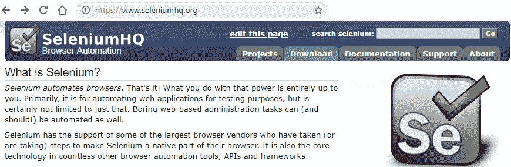
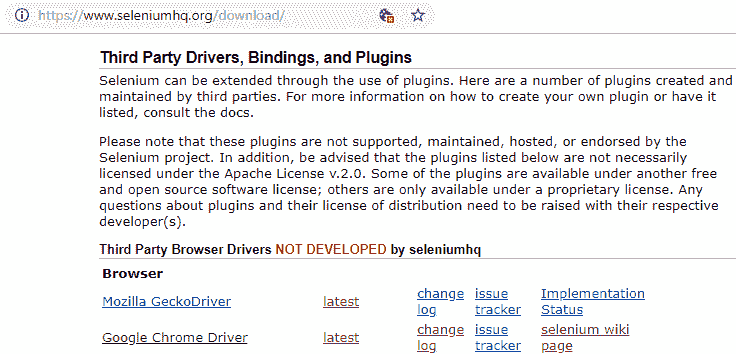
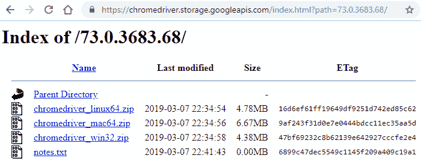
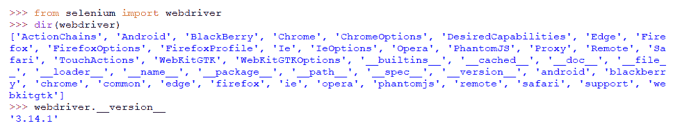
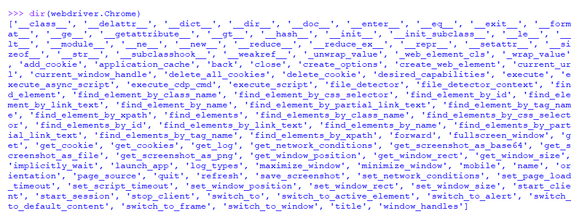
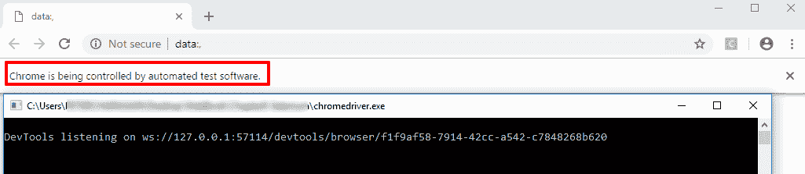
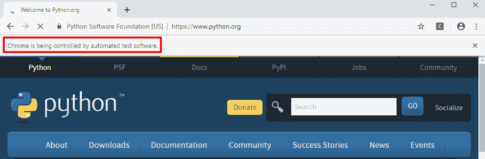
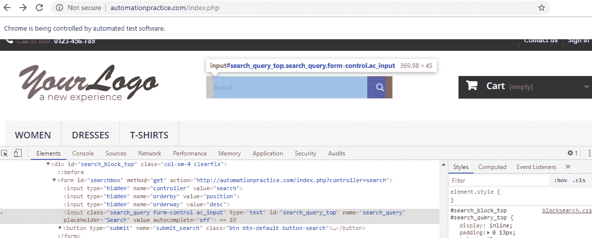

# 第八章：使用 Selenium 进行 Web 抓取

到目前为止，我们已经学习了如何使用多种数据查找技术，并通过实现各种 Python 库来访问 Web 内容进行 Web 抓取。

Selenium 是一个 Web 应用程序测试框架，它自动化浏览操作，并可用于简单和复杂的 Web 抓取活动。 Selenium 提供了一个 Web 浏览器作为接口或自动化工具。使用 JavaScript、cookies、脚本等的动态或安全 Web 内容可以通过 Selenium 的帮助加载、测试，甚至抓取。

关于 Selenium 框架有很多东西要学习。在本章中，我们将介绍与 Web 抓取相关的框架的主要概念。

本章将涵盖以下主题：

+   Selenium 简介

+   使用 Selenium 进行 Web 抓取

# 技术要求

本章需要一个 Web 浏览器（Google Chrome 或 Mozilla Firefox），我们将使用以下 Python 库：

+   `selenium`（Python 库）

+   `re`

如果您当前的 Python 设置中没有这些库，则可以通过参考第二章中的*设置事物*部分来设置或安装它们。

除了提到的 Python 库和 Web 浏览器之外，我们还将使用 WebDriver for Google Chrome。

代码文件可在[`github.com/PacktPublishing/Hands-On-Web-Scraping-with-Python/tree/master/Chapter08`](https://github.com/PacktPublishing/Hands-On-Web-Scraping-with-Python/tree/master/Chapter08)上找到。

# Selenium 简介

正如我所提到的，Selenium 是一个可以用于 Web 抓取活动的 Web 应用程序框架。它也可以用作浏览器自动化工具。

与 Web 应用程序相关的任务或活动的自动化，例如以下列表中的任务，涉及在没有人类直接参与的情况下执行这些任务：

+   浏览

+   点击链接

+   保存屏幕截图

+   下载图像

+   填写 HTML `<form>` 模板和许多其他活动

Selenium 提供了一个 Web 浏览器作为接口或自动化工具。通过浏览操作的自动化，Selenium 也可以用于 Web 抓取。使用 JavaScript、cookies、脚本等的动态或安全 Web 服务可以通过 Selenium 的帮助加载、测试，甚至爬取和抓取。

Selenium 是开源的，可以跨多个平台访问。可以使用各种 Web 浏览器进行测试，这些浏览器使用可用于编程语言（如 Java 和 Python）的库。使用库创建脚本与 Selenium 交互以执行基于浏览器的自动化。

尽管在应用程序测试中使用 Selenium 在爬行和抓取等操作方面具有许多优势，但它也有其缺点，例如时间和内存消耗。 Selenium 是可扩展和有效的，但在执行其操作时速度较慢，并且消耗大量内存空间。

有关 Selenium 的更详细信息，请访问[`www.seleniumhq.org/`](https://www.seleniumhq.org/)。

在接下来的部分中，我们将设置 Selenium WebDriver 并使用 Python 库进行设置，该库可以在[`selenium-python.readthedocs.io/`](https://selenium-python.readthedocs.io/)找到。

Selenium 是一个 Web 测试框架，而 Selenium ([`pypi.org/project/selenium/`](https://pypi.org/project/selenium/))是一个绑定 Selenium WebDriver 或用于创建与 Selenium 交互的脚本的 Python 库。

应用程序测试是为了确保应用程序满足要求，并检测错误和错误以确保产品质量而进行的。它可以通过手动（借助用户的帮助）或使用自动化工具（如 Selenium）进行。在互联网上发布应用程序之前，会对基于 Web 的应用程序进行测试。

# Selenium 项目

Selenium 由多个组件或工具组成，也被称为 Selenium 项目，使其成为一个完整的基于 web 的应用程序测试框架。我们现在将看一些这些 Selenium 项目的主要组件。

# Selenium WebDriver

Selenium WebDriver 是 Selenium 的一个组件，用于自动化浏览器。通过提供各种语言绑定，如 Java、Python、JavaScript 等，使用第三方驱动程序，如 Google Chrome 驱动程序、Mozilla Gecko 驱动程序和 Opera（[`github.com/mozilla/geckodriver/`](https://github.com/mozilla/geckodriver/)）来提供命令来进行浏览器自动化。Selenium WebDriver 不依赖于任何其他软件或服务器。

WebDriver 是一个面向对象的 API，具有更新的功能，克服并解决了之前 Selenium 版本和 Selenium **Remote Control** (**RC**) 的限制。请访问 Selenium WebDriver 网页（[`www.seleniumhq.org/projects/webdriver/`](https://www.seleniumhq.org/projects/webdriver/)）获取更多信息。

# Selenium RC

Selenium RC 是一个用 Java 编程的服务器。它使用 HTTP 接受浏览器的命令，用于测试复杂的基于 AJAX 的 web 应用程序。

Selenium RC 在发布 Selenium 2（Selenium 版本 2）后已正式弃用。然而，WebDriver 包含了 Selenium RC 的主要功能。请访问[`www.seleniumhq.org/projects/remote-control/`](https://www.seleniumhq.org/projects/remote-control/) 获取更多信息。

# Selenium Grid

Selenium Grid 也是一个服务器，允许测试在多台机器上并行运行，跨多个浏览器和操作系统，分发系统负载并减少性能问题，如时间消耗。

复杂的测试用于同时处理 Selenium RC 和 Selenium Grid。自 2.0 版本发布以来，Selenium 服务器现在内置支持 WebDriver、Selenium RC 和 Selenium Grid。请访问 Selenium Grid 网页（[`www.seleniumhq.org/projects/grid/`](https://www.seleniumhq.org/projects/grid/)）获取更多信息。

# Selenium IDE

一个开源的 Selenium **集成开发环境** (**IDE**) 用于使用 Selenium 构建测试用例。它基本上是一个网页浏览器扩展，具有诸如记录和通过**图形用户** **界面** (**GUI**) 回放网页自动化等功能。

以下是 Selenium IDE 的一些关键特性：

+   可扩展且易于调试

+   韧性测试

+   跨浏览器支持

+   可以创建可以运行命令并支持控制流结构的脚本

请访问 Selenium IDE 网页（[`www.seleniumhq.org/selenium-ide/`](https://www.seleniumhq.org/selenium-ide/)）获取更多信息和安装程序。请访问 Selenium 项目网页（[`www.seleniumhq.org/projects/`](https://www.seleniumhq.org/projects/)）获取有关 Selenium 组件的更多信息。

现在我们知道了 Selenium 的用途和一些主要组件，让我们看看如何安装和使用 Selenium WebDriver 进行一般测试。

# 设置事物

为了成功实现使用 Selenium 进行浏览器自动化和应用程序测试，需要设置 WebDriver。让我们通过以下步骤来设置 Google Chrome 的 WebDriver：

1.  访问[`www.seleniumhq.org/`](https://www.seleniumhq.org/)。

 SeleniumHQ 浏览器自动化主页

1.  点击下载（或浏览至[`www.seleniumhq.org/download/`](https://www.seleniumhq.org/download/)）。

1.  在第三方驱动程序、绑定和插件部分，点击 Google Chrome Driver（或浏览至[`sites.google.com/a/chromium.org/chromedriver/`](https://sites.google.com/a/chromium.org/chromedriver/)）：

 第三方驱动程序，Selenium

1.  从 ChromeDriver - WebDriver for Chrome ([`sites.google.com/a/chromium.org/chromedriver`](https://sites.google.com/a/chromium.org/chromedriver/))，下载适用于平台的最新稳定版本的 ChromeDriver：



ChromeDriver 列表

1.  解压下载的`chromedriver*.zip`。应该出现一个名为`chromedriver.exe`的应用程序文件。我们可以将`.exe`文件放在包含代码的主文件夹中。

我们将在整个章节中使用谷歌浏览器和 ChromeDriver；有关使用其他浏览器的详细信息，或有关 Selenium 的更多信息，请访问 SeleniumHQ。有关安装的更多信息，请参阅[`selenium-python.readthedocs.io/installation.html`](https://selenium-python.readthedocs.io/installation.html)。

现在我们已经完成了 WebDriver 和 Selenium Python 库的设置，让我们通过 Python IDE 验证这个设置。如下面的屏幕截图所示，`selenium`包含`webdriver`模块，包括`Chrome`、`Android`、`Firefox`、`Ie`和`Opera`等子模块。当前版本是`3.14.1`：



打印 selenium.webdriver 版本

我们将使用 Selenium 与谷歌浏览器，因此让我们探索`webdriver`中`Chrome`的内容：



从 Selenium WebDriver 探索 Chrome。

如前面的屏幕截图所示，有许多函数将被调用和用于实现浏览器自动化。您还可以看到许多函数名称以`find_element*`开头，类似于我们在早期章节中用于爬取活动的遍历和解析函数。

在下一节中，我们将学习关于`selenium.webdriver`。

# 探索 Selenium

在本节中，我们将使用和介绍`webdriver`和`webdriver.Chrome`的各种属性，同时查看一些真实案例。接下来的章节将说明 Selenium 的使用并探索其主要属性。

# 访问浏览器属性

在本节中，我们将演示使用 Selenium 和 Chrome WebDriver 加载谷歌浏览器的 URL 并访问某些基于浏览器的功能。

首先，让我们从`selenium`中导入`webdriver`并设置到`chromedriver.exe`的路径，让我们称之为`chromedriver_path`。创建的路径将需要加载谷歌浏览器。根据应用程序位置，应提及`chromedriver.exe`的完整路径，并且对于成功实施是必需的：

```py
from selenium import webdriver
import re

#setting up path to 'chromedriver.exe'
chromedriver_path='chromedriver' #C:\\Users\\....\\...\chromedriver.exe 
```

`selenium.webdriver`用于实现各种浏览器，在本例中是谷歌浏览器。`webdriver.Chrome()`短语提供了 Chrome WebDriver 的路径，以便`chromedriver_path`用于执行。

短语`driver`是`webdriver.chrome.webdriver.WebDriver`类的对象，使用`webdriver.Chrome()`创建，现在将提供对`webdriver`的各种属性和属性的访问：

```py
driver = webdriver.Chrome(executable_path=chromedriver_path)
```

`chromedriver.exe`将在此实例或在`driver`对象创建时实例化。终端屏幕和空白的新窗口将加载谷歌浏览器，如下面的屏幕截图所示：



终端屏幕和空白浏览器页面

如果您在执行到目前为止的代码时遇到任何错误，请按照以下步骤执行代码：

1.  获取最新的 ChromeDriver 并替换现有的 ChromeDriver

1.  更新和验证`chromedriver_path`的`PATH`

然后使用`get()`函数从`webdriver`为谷歌浏览器提供一个 URL。

`get()`短语接受要在浏览器上加载的 URL。让我们将[`www.python.org`](https://www.python.org)作为`get()`的参数；浏览器将开始加载 URL，如下面的屏幕截图所示：

```py
driver.get('https://www.python.org')
```

如您在下面的截图中所见，地址栏下方显示了一个通知，其中包含消息**Chrome is being controlled by automated test software**。这条消息也确认了`selenium.webdriver`活动的成功执行，并且可以提供进一步的代码来操作或自动化加载的页面：



Chrome 浏览器加载了 https://www.python.org

在页面成功加载后，我们可以使用`driver`访问和探索其属性。为了说明这一点，让我们从 HTML `<title>`标签中提取或打印标题，并打印当前可访问的 URL：

```py
print("Title: ",driver.title) #print <title> text
Title:  Welcome to Python.org

print("Current Page URL: ",driver.current_url) #print current url, loaded in the browser
Current Page URL:  https://www.python.org/
```

如前面的代码所示，可以使用`driver.title`获取页面标题，使用`driver.current_url`找到当前页面的 URL。`current_url`短语可用于验证在加载初始 URL 后是否发生了任何 URL 重定向。让我们使用 Python 库`re`的`search()`保存页面截图：

```py
#check if pattern matches the current url loaded

if re.search(r'python.org',driver.current_url):
    driver.save_screenshot("pythonorg.png") #save screenshot with provided name
    print("Python Screenshot Saved!")
```

`save_screenshot()`短语以文件名作为图像的参数，并创建一个 PNG 图像。图像将保存在当前代码位置；也可以提供完整的目标或所需路径。

为了进一步探索，让我们从[`www.python.org`](https://www.python.org)收集网页 cookies。使用`get_cookies()`短语来检索 cookies，如下所示：

```py
#get cookie information
cookies = driver.get_cookies() 
print("Cookies obtained from python.org")
print(cookies)

Cookies obtained from python.org
[{'domain': '.python.org', 'expiry': 1619415025, 'httpOnly': False, 'name': '__utma', 'path': '/', 'secure': False, 'value': '32101439.1226541417.1556343026.1556343026.1556343026.1'},........ {'domain': '.python.org', 'expiry': 1556343625, 'httpOnly': False, 'name': '__utmt', 'path': '/', 'secure': False, 'value': '1'}]
```

可以使用`driver.page_source`获取页面源。

要手动获取页面源，请右键单击页面，然后单击“查看页面源”，或按*Ctrl* + *U*：

```py
print(driver.page_source) #page source
```

可以使用`driver.refresh()`重新加载或刷新页面。

要手动刷新页面源，请右键单击页面，然后单击“重新加载”，或按*Ctrl* + *R*：

```py
driver.refresh() #reload or refresh the browser
```

使用前面代码中的`driver`访问的功能，让我们继续加载、截图和访问[`www.google.com`](https://www.google.com)的 cookies，使用以下代码：

```py
driver.get('https://www.google.com')
print("Title: ",driver.title)
print("Current Page URL: ",driver.current_url)

if re.search(r'google.com',driver.current_url):
    driver.save_screenshot("google.png")
    print("Google Screenshot Saved!")

cookies = driver.get_cookies()
```

使用[`google.com`](http://google.com)执行的操作将在用于访问[`python.org`](http://python.org)的同一浏览器窗口上进行。有了这个，我们现在可以使用浏览器历史记录执行操作（即，我们将使用 Web 浏览器中可用的“返回”和“前进”按钮），并检索 URL，如下面的代码所示：

```py
print("Current Page URL: ",driver.current_url)

driver.back() #History back action
print("Page URL (Back): ",driver.current_url)

driver.forward() #History forward action
print("Page URL (Forward): ",driver.current_url)
```

在上述代码中，`back()`将浏览器返回到上一页，而`forward()`将其沿着浏览器历史向前移动一步。收到的输出如下：

```py
Current Page URL: https://www.google.com/
Page URL (Back): https://www.python.org/
Page URL (Forward): https://www.google.com/
```

在成功执行代码后，建议您关闭并退出驱动程序以释放系统资源。我们可以使用以下功能执行终止操作：

```py
driver.close() #close browser
driver.quit()  #quit webdriver
```

上述代码包含以下两个短语：

+   `close()`终止加载的浏览器窗口

+   `quit()`结束 WebDriver 应用程序

到目前为止，在本节中我们执行的完整代码如下：

```py
from selenium import webdriver
import re
chrome_path='chromedriver'
driver = webdriver.Chrome(executable_path=chrome_path)  #print(type(driver))
driver.get('https://www.python.org')  
print("Title: ",driver.title)
print("Current Page URL: ",driver.current_url)

if re.search(r'python.org',driver.current_url):
    driver.save_screenshot("pythonorg.png")
    print("Python Screenshot Saved!")
cookies = driver.get_cookies()

print(driver.page_source)
driver.refresh()

driver.get('https://www.google.com')
print("Title: ",driver.title)
print("Current Page URL: ",driver.current_url)
if re.search(r'google.com',driver.current_url):
    driver.save_screenshot("google.png")
    print("Google Screenshot Saved!")
cookies = driver.get_cookies()

print("Current Page URL: ",driver.current_url)
driver.back()
print("Page URL (Back): ",driver.current_url)
driver.forward()
print("Page URL (Forward): ",driver.current_url)

driver.close()
driver.quit()
```

上述代码演示了`selenium.webdriver`及其各种属性的使用。在下一节中，我们将演示`webdriver`和网页元素（网页中的元素）的使用。

# 定位网页元素

在本节中，我们将在[`automationpractice.com`](http://automationpractice.com)上进行搜索，以获取与搜索查询匹配的产品列表，演示`selenium.webdriver`的使用。网页元素是列在网页上或在页面源中找到的元素。我们还看一下一个名为`WebElement`的类，它被用作`selenium.webdriver.remote.webelement.WebElement`。

自动化实践网站（[`automationpractice.com/`](http://automationpractice.com/)）是来自[`www.seleniumframework.com`](http://www.seleniumframework.com)的一个示例电子商务网站，您可以用来练习。

首先，让我们从`selenium`中导入`webdriver`，设置`chromedriver.exe`的路径，创建`webdriver`的对象——也就是在前一节*访问浏览器属性*中实现的`driver`，并加载 URL，[`automationpractice.com`](http://automationpractice.com)：

```py
driver.get('http://automationpractice.com')
```

新的 Google Chrome 窗口将加载提供的 URL。如下图所示，找到位于购物车上方的搜索（输入）框：



从 http://automationpractice.com 检查元素（搜索框）

要继续通过脚本搜索，我们需要识别具有 HTML `<input>`的元素。请参阅第三章中的*使用 Web 浏览器开发者工具访问 Web 内容*部分，*使用 LXML、XPath 和 CSS 选择器*。

在我们的情况下，搜索框可以通过前面截图中显示的属性来识别，甚至可以使用 XPath 或 CSS 选择器：

+   `id="search_query_top"`

+   `name="search_query"`

+   `class="search_query"`

`selenium.webdriver`提供了许多定位器（用于定位元素的方法），可以方便地应用于遇到的情况。

定位器返回单个、多个或 WebElement 实例的列表，写作`selenium.webdriver.remote.webelement.WebElement`。以下是一些定位器以及简要描述：

+   `find_element_by_id()`: 通过其`id`属性来查找元素。此方法返回单个 WebElement。

+   `find_element_by_name()`: 通过其`name`属性来查找单个元素。可以使用`find_elements_by_name()`来找到或定位多个 WebElement。

+   `find_element_by_tag_name()`: 通过其 HTML 标签的名称来查找单个元素。可以使用`find_elements_by_tag_name()`来定位多个 WebElement。

+   `find_element_by_class_name()`: 通过其`class`属性来查找单个元素。可以使用`find_elements_by_class_name()`来定位多个 WebElement。

+   `find_element_by_link_text()`: 通过链接文本标识的链接来查找单个元素。可以使用`find_elements_by_link_text()`来定位多个 WebElement。

+   `find_element_by_partial_link_text()`: 通过元素携带的部分文本来查找单个元素的链接。可以使用`find_elements_by_partial_link_text()`来定位多个 WebElement。

+   `find_element_by_xpath()`: 通过提供 XPath 表达式来查找单个元素。可以使用`find_elements_by_xpath()`来定位多个 WebElement。

+   `find_element_by_css_selector()`: 通过提供 CSS 选择器来查找单个元素。可以使用`find_elements_by_css_selector()`来定位多个 WebElement。

现在，让我们使用`find_element_by_id()`来找到输入框：

```py
searchBox = driver.find_element_by_id('search_query_top')
#searchBox = driver.find_element_by_xpath('//*[@id="search_query_top"]')
#searchBox = driver.find_element_by_css_selector('#search_query_top')
```

如前面的代码所示，`searchBox`可以使用任何方便的定位器来定位，这些定位器都提供了它们各自的参数。

获得的 WebElement 可以访问以下属性和一般方法，以及许多其他方法：

+   `get_attribute()`: 返回提供的键参数的属性值，例如`value`、`id`、`name`和`class`。

+   `tag_name`: 返回特定 WebElement 的 HTML 标签名称。

+   `text`: 返回 WebElement 的文本。

+   `clear()`: 这会清除 HTML 表单元素的文本。

+   `send_keys()`: 用于填充文本并提供键效果，例如按下`ENTER`、`BACKSPACE`和`DELETE`，可从`selenium.webdriver.common`模块中的`selenium.webdriver.common.keys`模块中获得，应用于 HTML 表单元素。

+   `click()`: 执行单击操作到 WebElement。用于 HTML 元素，如提交按钮。

在下面的代码中，我们将使用前面列出的`searchBox`中的函数和属性：

```py
print("Type :",type(searchBox))
<class 'selenium.webdriver.remote.webelement.WebElement'>

print("Attribute Value :",searchBox.get_attribute("value")) #is empty
Attribute Value *:* 

print("Attribute Class :",searchBox.get_attribute("class"))
Attribute Class : search_query form-control ac_input

print("Tag Name :",searchBox.tag_name)
Tag Name : input
```

让我们清除`searchBox`内的文本并输入要搜索的文本`Dress`。我们还需要提交位于`searchBox`右侧的按钮，并点击它以使用 WebElement 方法`click()`执行搜索：

```py
searchBox.clear() 
searchBox.send_keys("Dress")
submitButton = driver.find_element_by_name("submit_search")
submitButton.click()
```

浏览器将处理提交的文本`Dress`的搜索操作并加载结果页面。

现在搜索操作完成，为了验证成功的搜索，我们将使用以下代码提取有关产品数量和计数的信息：

```py
#find text or provided class name
resultsShowing = driver.find_element_by_class_name("product-count")
print("Results Showing: ",resultsShowing.text) 

Results Showing: Showing 1-7 of 7 items

#find results text using XPath
resultsFound = driver.find_element_by_xpath('//*[@id="center_column"]//span[@class="heading-counter"]')
print("Results Found: ",resultsFound.text)

Results Found: 7 results have been found.
```

通过找到的项目数量和产品数量，这传达了我们搜索过程的成功信息。现在，我们可以继续使用 XPath、CSS 选择器等查找产品：

```py
#Using XPath
products = driver.find_elements_by_xpath('//*[@id="center_column"]//a[@class="product-name"]')

#Using CSS Selector
#products = driver.find_elements_by_css_selector('ul.product_list li.ajax_block_product a.product-name')

foundProducts=[]
for product in products:
    foundProducts.append([product.text,product.get_attribute("href")])
```

从前面的代码中，对获得的`products`进行迭代，并将单个项目添加到 Python 列表`foundProducts`中。`product`是 WebElement 对象，换句话说，是`selenium.webdriver.remote.webelement.WebElement`，而属性是使用`text`和`get_attribute()`收集的：

```py
print(foundProducts) 

[['Printed Summer Dress',
'http://automationpractice.com/index.php?id_product=5&controller=product&search_query=Dress&results=7'],
['Printed Dress',
'http://automationpractice.com/index.php?id_product=4&controller=product&search_query=Dress&results=7'],
['Printed Summer Dress',
'http://automationpractice.com/index.php?id_product=6&controller=product&search_query=Dress&results=7'],
['Printed Chiffon Dress',
'http://automationpractice.com/index.php?id_product=7&controller=product&search_query=Dress&results=7'],['PrintedDress',
'http://automationpractice.com/index.php?id_product=3&controller=product&search_query=Dress&results=7'],
['Faded Short Sleeve T-shirts',
'http://automationpractice.com/index.php?id_product=1&controller=product&search_query=Dress&results=7'],['Blouse',
'http://automationpractice.com/index.php?id_product=2&controller=product&search_query=Dress&results=7']]
```

在本节中，我们探索了`selenium.webdriver`中用于处理浏览器、使用 HTML 表单、读取页面内容等的各种属性和方法。请访问[`selenium-python.readthedocs.io`](https://selenium-python.readthedocs.io)了解有关 Python Selenium 及其模块的更详细信息。在下一节中，我们将使用本节中使用的大部分方法来从网页中抓取信息。

# 使用 Selenium 进行网页抓取

Selenium 用于测试 Web 应用程序。它主要用于使用各种基于编程语言的库和浏览器驱动程序执行浏览器自动化。正如我们在前面的*探索 Selenium*部分中看到的，我们可以使用 Selenium 导航和定位页面中的元素，并执行爬取和抓取相关的活动。

让我们看一些使用 Selenium 从网页中抓取内容的示例。

# 示例 1 - 抓取产品信息

在这个例子中，我们将继续使用*探索 Selenium*部分获得的`foundProducts`的搜索结果。

我们将从`foundProducts`中找到的每个单独的产品链接中提取一些特定信息，列举如下：

+   `product_name`：产品名称

+   `product_price`：列出的价格

+   `image_url`：产品主要图片的 URL

+   `item_condition`：产品的状态

+   `product_description`：产品的简短描述

使用`driver.get()`加载`foundProducts`中的每个单独的产品链接：

```py
dataSet=[]
if len(foundProducts)>0:
   for foundProduct in foundProducts:
       driver.get(foundProduct[1])

       product_url = driver.current_url
       product_name = driver.find_element_by_xpath('//*[@id="center_column"]//h1[@itemprop="name"]').text
       short_description = driver.find_element_by_xpath('//*[@id="short_description_content"]').text
       product_price = driver.find_element_by_xpath('//*[@id="our_price_display"]').text
       image_url = driver.find_element_by_xpath('//*[@id="bigpic"]').get_attribute('src')
       condition = driver.find_element_by_xpath('//*[@id="product_condition"]/span').text
       dataSet.append([product_name,product_price,condition,short_description,image_url,product_url])

print(dataSet)
```

使用 XPath 获取要提取的目标字段或信息，并将其附加到`dataSet`。请参考[第三章](https://cdp.packtpub.com/hands_on_web_scraping_with_python/wp-admin/post.php?post=31&action=edit#post_26)中的*使用 Web 浏览器开发者工具访问 Web 内容*部分，*使用 LXML、XPath 和 CSS 选择器*。

从`dataSet`中获取的输出如下：

```py
[['Printed Summer Dress','$28.98','New','Long printed dress with thin adjustable straps. V-neckline and wiring under the bust with ruffles at the bottom of the dress.', 'http://automationpractice.com/img/p/1/2/12-large_default.jpg', 'http://automationpractice.com/index.php?id_product=5&controller=product&search_query=Dress&results=7'],
['Printed Dress','$50.99','New','Printed evening dress with straight sleeves with black .............,
['Blouse','$27.00','New','Short sleeved blouse with feminine draped sleeve detail.', 'http://automationpractice.com/img/p/7/7-large_default.jpg','http://automationpractice.com/index.php?id_product=2&controller=product&search_query=Dress&results=7']]
```

最后，使用`close()`和`quit()`保持系统资源空闲。此示例的完整代码如下：

```py
from selenium import webdriver
chrome_path='chromedriver' driver = webdriver.Chrome(executable_path=chrome_path)
driver.get('http://automationpractice.com')

searchBox = driver.find_element_by_id('search_query_top')
searchBox.clear()
searchBox.send_keys("Dress")
submitButton = driver.find_element_by_name("submit_search")
submitButton.click()

resultsShowing = driver.find_element_by_class_name("product-count")
resultsFound = driver.find_element_by_xpath('//*[@id="center_column"]//span[@class="heading-counter"]')

products = driver.find_elements_by_xpath('//*[@id="center_column"]//a[@class="product-name"]')
foundProducts=[]
for product in products:
    foundProducts.append([product.text,product.get_attribute("href")])

dataSet=[]
if len(foundProducts)>0:
   for foundProduct in foundProducts:
       driver.get(foundProduct[1])
       product_url = driver.current_url
       product_name = driver.find_element_by_xpath('//*[@id="center_column"]//h1[@itemprop="name"]').text
       short_description = driver.find_element_by_xpath('//*[@id="short_description_content"]').text
       product_price = driver.find_element_by_xpath('//*[@id="our_price_display"]').text
       image_url = driver.find_element_by_xpath('//*[@id="bigpic"]').get_attribute('src')
       condition = driver.find_element_by_xpath('//*[@id="product_condition"]/span').text
       dataSet.append([product_name,product_price,condition,short_description,image_url,product_url])

driver.close()
driver.quit()
```

在这个例子中，我们执行了基于 HTML `<form>`的操作，并从每个单独的页面中提取所需的细节。表单处理是在测试 Web 应用程序期间执行的主要任务之一。

# 示例 2 - 抓取书籍信息

在这个例子中，我们将自动化浏览器来处理主 URL 提供的类别和分页链接。我们有兴趣从[`books.toscrape.com/index.html`](http://books.toscrape.com/index.html)跨多个页面提取*食品和饮料*类别的详细信息。

类别中的单个页面包含产品（书籍）的列表，其中包含以下某些信息：

+   `title`：书籍的标题

+   `titleLarge`：列出的书籍标题（完整标题，作为`title`属性的值找到）

+   `price`：列出的书籍价格

+   `stock`：与列出的书籍相关的库存信息

+   `image`：书籍图片的 URL

+   `starRating`：评级（找到的星星数量）

+   `url`：列出每本书的 URL。

在第三章中还展示了一个类似的例子，*使用 LXML、XPath 和 CSS 选择器*中的*使用 LXML 进行网页抓取*部分，名称为*示例 2 - 使用 XPath 循环并从多个页面抓取数据*。在那里，我们使用了 Python 库`lxml`。

导入`selenium.webdriver`并设置 Chrome 驱动程序路径后，让我们开始加载[`books.toscrape.com/index.html`](http://books.toscrape.com/index.html)。当主页面加载时，我们将看到各种类别依次列出。

目标类别包含文本“食品和饮料”，可以使用`find_element_by_link_text()`找到（我们可以使用任何适用的`find_element...`方法来找到特定类别）。找到的元素进一步使用`click()`进行处理 - 即点击返回的元素。此操作将在浏览器中加载特定类别的 URL：

```py
driver.get('http://books.toscrape.com/index.html')

driver.find_element_by_link_text("Food and Drink").click()
print("Current Page URL: ", driver.current_url)
totalBooks = driver.find_element_by_xpath("//*[@id='default']//form/strong[1]")
print("Found: ", totalBooks.text)
```

为了处理在迭代过程中找到的多个页面，将从`selenium.common.exceptions`导入`NoSuchElementException`：

```py
from selenium.common.exceptions import NoSuchElementException
```

由于我们将使用分页按钮 next，`NoSuchElementException`将有助于处理如果没有找到进一步的 next 或页面的情况。

如下代码所示，分页选项 next 位于页面中，并使用`click()`操作进行处理。此操作将加载它包含的 URL 到浏览器中，并且迭代将继续直到在页面中找不到或找到 next，被代码中的`except`块捕获：

```py
try:
 #Check for Pagination with text 'next'  driver.find_element_by_link_text('next').click()
    continue except NoSuchElementException:
    page = False
```

此示例的完整代码如下所示：

```py
from selenium import webdriver
from selenium.common.exceptions import NoSuchElementException
chrome_path = 'chromedriver' driver = webdriver.Chrome(executable_path=chrome_path)
driver.get('http://books.toscrape.com/index.html')

dataSet = []
driver.find_element_by_link_text("Food and Drink").click()
totalBooks = driver.find_element_by_xpath("//*[@id='default']//form/strong[1]")

page = True while page:
    listings = driver.find_elements_by_xpath("//*[@id='default']//ol/li[position()>0]")
    for listing in listings:
        url=listing.find_element_by_xpath(".//article[contains(@class,'product_pod')]/h3/a"). get_attribute('href')
        title=listing.find_element_by_xpath(".//article[contains(@class,'product_pod')]/h3/a").text
        titleLarge=listing.find_element_by_xpath(".//article[contains(@class,'product_pod')]/h3/a"). get_attribute('title')
        price=listing.find_element_by_xpath(".//article/div[2]/p[contains(@class,'price_color')]").text
        stock=listing.find_element_by_xpath(".//article/div[2]/p[2][contains(@class,'availability')]"). text
        image=listing.find_element_by_xpath(".//article/div[1][contains(@class,'image_container')]/a/img") .get_attribute('src')
        starRating=listing.find_element_by_xpath(".//article/p[contains(@class,'star-rating')]"). get_attribute('class')
        dataSet.append([titleLarge,title,price,stock,image,starRating.replace('star-rating ',''),url])

    try:
  driver.find_element_by_link_text('next').click()
        continue
 except NoSuchElementException:
        page = False 
driver.close()
driver.quit()
```

最后，在迭代完成后，`dataSet`将包含所有页面的列表数据，如下所示：

```py
[['Foolproof Preserving: A Guide to Small Batch Jams, Jellies, Pickles, Condiments, and More: A Foolproof Guide to Making Small Batch Jams, Jellies, Pickles, Condiments, and More', 'Foolproof Preserving: A Guide ...','£30.52','In stock', 'http://books.toscrape.com/media/cache/9f/59/9f59f01fa916a7bb8f0b28a4012179a4.jpg','Three','http://books.toscrape.com/catalogue/foolproof-preserving-a-guide-to-small-batch-jams-jellies-pickles-condiments-and-more-a-foolproof-guide-to-making-small-batch-jams-jellies-pickles-condiments-and-more_978/index.html'], ['The Pioneer Woman Cooks: Dinnertime: Comfort Classics, Freezer Food, 16-Minute Meals, and Other Delicious Ways to Solve Supper!', 'The Pioneer Woman Cooks: ...', '£56.41', 'In stock', 'http://books.toscrape.com/media/cache/b7/f4/b7f4843dbe062d44be1ffcfa16b2faa4.jpg', 'One', 'http://books.toscrape.com/catalogue/the-pioneer-woman-cooks-dinnertime-comfort-classics-freezer-food-16-minute-meals-and-other-delicious-ways-to-solve-supper_943/index.html'],................, 
['Hungry Girl Clean & Hungry: Easy All-Natural Recipes for Healthy Eating in the Real World', 'Hungry Girl Clean & ...', '£33.14', 'In stock', 'http://books.toscrape.com/media/cache/6f/c4/6fc450625cd672e871a6176f74909be2.jpg', 'Three', 'http://books.toscrape.com/catalogue/hungry-girl-clean-hungry-easy-all-natural-recipes-for-healthy-eating-in-the-real-world_171/index.html']]
```

在本节中，我们探索了来自`selenium.webdriver`的方法和属性，并将其用于网页抓取活动。

# 摘要

在本章中，我们学习了关于 Selenium 以及使用 Python 库进行浏览器自动化、网页内容抓取、基于浏览器的活动和 HTML `<form>` 处理。 Selenium 可以用于处理多种活动，这是 Selenium 相对于 Python 专用库（如`lxml`、`pyquery`、`bs4`和`scrapy`）的主要优势之一。

在下一章中，我们将学习更多关于使用正则表达式进行网页抓取的技术。

# 进一步阅读

+   SeleniumHQ: [`www.seleniumhq.org/`](https://www.seleniumhq.org/)

+   Selenium with Python: [`selenium-python.readthedocs.io/`](https://selenium-python.readthedocs.io/)

+   Python Selenium: [`pypi.python.org/pypi/selenium`](http://pypi.python.org/pypi/selenium)
