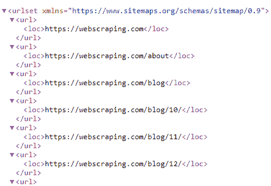

# 第九章：使用正则表达式提取数据

如果您当前的 Python 设置中不存在这些库，请参考第二章，*Python 和 Web - 使用 urllib 和 Requests*，*设置事项*部分，了解有关其安装和设置的更多信息。到目前为止，我们已经学习了关于 Web 技术、数据查找技术以及如何使用 Python 库访问 Web 内容的知识。

**正则表达式**（**Regex**或**regex**）实际上是使用预定义命令和格式构建的模式，以匹配所需内容。在数据提取过程中，当没有特定的布局或标记模式可供选择时，正则表达式提供了很大的价值，并且可以与 XPath、CSS 选择器等其他技术一起应用。

复杂的网页内容和一般文本或字符格式的数据可能需要使用正则表达式来完成匹配和提取等活动，还包括函数替换、拆分等。

在本章中，我们将学习以下主题：

+   正则表达式概述

+   使用正则表达式提取数据

# 技术要求

本章需要一个 Web 浏览器（Google Chrome 或 Mozilla Firefox）。我们将使用以下 Python 库：

+   `请求`

+   `re`

+   `bs4`

如果您当前的 Python 设置中不存在这些库，请参考第二章，*Python 和 Web - 使用 urllib 和 Requests*，*设置事项*部分，了解有关其安装和设置的更多信息。

本章的代码文件可在本书的 GitHub 存储库中找到：[`github.com/PacktPublishing/Hands-On-Web-Scraping-with-Python/tree/master/Chapter09`](https://github.com/PacktPublishing/Hands-On-Web-Scraping-with-Python/tree/master/Chapter09)。

那些已经使用`re`的人可以参考*使用正则表达式提取数据*部分。

# 正则表达式概述

正则表达式用于匹配文本或字符串中找到的模式。正则表达式可以用于根据需要对文本或网页内容进行测试和查找模式。正则表达式包含各种定义模式和特殊符号的方法，例如*转义代码*，以应用一些预定义规则。有关正则表达式的更多信息，请参考*进一步阅读*部分。

有各种情况下，正则表达式可以非常有效和快速地获得所需的结果。正则表达式可以仅应用于内容（文本或网页源代码），并且可以用于针对不易使用 XPath、CSS 选择器、BS4*、*PyQuery 等提取的特定信息模式。

有时，可能会出现需要同时使用正则表达式和 XPath 或 CSS 选择器才能获得所需输出的情况。然后可以使用正则表达式对输出进行测试，以查找模式或清理和管理数据。代码编辑器、文档编写器和阅读器还提供了嵌入式基于正则表达式的实用工具。

正则表达式可以应用于任何包含正确或不正确格式的文本或字符字符串、HTML 源代码等。正则表达式可以用于各种应用，例如以下内容：

+   基于特定模式的内容

+   页面链接

+   图像标题和链接

+   链接内的文本

+   匹配和验证电子邮件地址

+   从地址字符串中匹配邮政编码或邮政编码

+   验证电话号码等

使用搜索、查找、拆分、替换、匹配和迭代等工具，无论是否有其他技术干扰，都可以适用。

在接下来的章节中，我们将使用`re` Python 模块并探索其方法，然后将其应用于正则表达式。

# 正则表达式和 Python

`re`是一个标准的 Python 库，用于处理正则表达式。每个默认的 Python 安装都包含`re`库。如果该库不存在，请参考第二章，*Python 和 Web - 使用 urllib 和 Requests**,* *设置事物*部分，了解如何设置它。

`>>>` 在代码中表示使用 Python IDE。它接受给定的代码或指令，并在下一行显示输出。

让我们开始通过 Python IDE 导入`re`并使用`dir()`函数列出其属性：

```py
>>> import re
>>> print(dir(re)) #listing features from re
```

以下是前面命令的输出：

```py
['A', 'ASCII', 'DEBUG', 'DOTALL', 'I', 'IGNORECASE', 'L', 'LOCALE', 'M', 'MULTILINE', 'S', 'Scanner', 'T', 'TEMPLATE', 'U', 'UNICODE', 'VERBOSE', 'X', '_MAXCACHE', '__all__', '__builtins__', '__cached__', '__doc__', '__file__', '__loader__', '__name__', '__package__', '__spec__', '__versio n__', '_alphanum_bytes', '_alphanum_str', '_cache', '_cache_repl', '_compile', '_compile_repl', '_expand', '_locale', '_pattern_type', '_pickle', '_subx', 'compile', 'copyreg', 'error', 'escape', 'findall', 'finditer', 'fullmatch', 'match', 'purge', 'search', 'split', 'sre_compile', 'sre_parse', 'sub', 'subn', 'sys', 'template']
```

从前面的输出中可以看出，在`re`中有各种可用的函数。我们将从内容提取的角度使用其中的一些函数，并通过使用以下示例来解释正则表达式的基础知识：

```py
>>> sentence = """Brief information about Jobs in Python. Programming and Scripting experience in some language (such as Python R, MATLAB, SAS, Mathematica, Java, C, C++, VB, JavaScript or FORTRAN) is expected. Participants should be comfortable with basic programming concepts like variables, loops, and functions."""
```

我们之前声明的`sentence`包含有关 Python 工作和工作描述的简要信息。我们将使用这个句子来解释基本的正则表达式功能。

`split()`函数将字符串分解并返回由*空格*字符默认分隔的单词列表。我们也可以使用`re.split()`来拆分字符串对象。在这种情况下，`split()`接受正则表达式模式来拆分句子，例如`re.split(r'\s+',sentence)`： 

```py
>>> splitSentence = sentence.split() #split sentence or re.split(r'\s',sentence) >>> print("Length of Sentence: ",len(sentence), '& splitSentence: ',len(splitSentence))
Length of Sentence: 297 & splitSentence: 42 >>> print(splitSentence) #List of words obtained using split() 
['Brief', 'information', 'about', 'Jobs', 'in', 'Python.', 'Programming', 'and', 'Scripting', 'experience', 'in', 'some', 'language', '(such', 'as', 'Python', 'R,', 'MATLAB,', 'SAS,', 'Mathematica,', 'Java,', 'C,', 'C++,', 'VB,', 'JavaScript', 'or', 'FORTRAN)', 'is', 'expected.', 'Participants', 'should', 'be', 'comfortable', 'with', 'basic', 'programming', 'concepts', 'like', 'variables,', 'loops,', 'and', 'functions.']
```

使用前面的代码获取并打印`sentence`的长度和 Python 的`splitSentence`列表对象的长度。这些元素和字符的计数将有助于比较从以下示例返回的答案：

```py
>>> matches = re.findall(r"([A-Z+]+)\,",sentence) #finding pattern with [A-Z+] and comma behind >>> print("Findall found total ",len(matches)," Matches >> ",matches) **Findall found total  6  Matches >>  ['R', 'MATLAB', 'SAS', 'C', 'C++', 'VB']** >>> matches = re.findall(r"([A-Z]+)\,",sentence) #finding pattern with [A-Z] and comma behind >>> print("Findall found total ",len(matches)," Matches >> ",matches) Findall found total 5 Matches >> ['R', 'MATLAB', 'SAS', 'C', 'VB']
```

`re.findall()`接受要搜索的模式和要查找的与提供的模式相关的内容。通常，模式可以直接作为参数提供给函数，并且作为*原始*字符串前面带有`r`，例如`r'([A-Z]+)'`，或包含*原始*字符串的变量。

在前面的代码中，我们可以看到类似的模式，提供了一些额外的字符，但它们的输出不同。以下是一些这些模式的一般解释：

+   `[A-Z]`：模式中的方括号匹配一组字符，并且区分大小写。在这里，它匹配从`A`到`Z`的字符，但不匹配`a`到`z`的字符。我们可以提供一组字符，例如`[A-Za-z0-9]`，它匹配从`A`到`Z`和`a`到`z`的任何字符，以及从`0`到`9`的数字字符。如果需要，可以在集合中传递其他字符，例如`[A-Z+]`；`+`字符可以与`A`到`Z`的字符一起存在，例如 C++或 C。

+   `()`: 模式中的圆括号包含匹配的值组。

+   `+`（用于重复）：在字符集之外找到时，它匹配模式的一个或多个出现。`[A-Z]+`将匹配至少一个或多个`A`到`Z`的字符组合，例如，前面代码中的`R`和`MATLAB`。还有一些用于指定重复或出现次数的其他字符，也称为正则表达式量词：

+   `*` 匹配零次或多次模式

+   `?` 匹配模式的零次或一次出现

+   `{m,n}` 分别匹配重复的最小`m`和最大`n`次数：

+   `{2,5}`：最少 2 次或最多 5 次

+   `{2,}`：最少 2 次或更多

+   `{,5}`：最多 5 次

+   `{3}`：3 次出现

+   `\,`（逗号）：在正则表达式中，除了`[A-Za-z0-9]`之外的字符通常被写为转义字符，以便提及特定的字符（`\,`代表逗号，`\.`代表句号，`\?`代表问号等）。

正则表达式量词也分为以下几类：

+   **贪婪量词**：这些量词尽可能多地匹配任何元素。

+   **懒惰或非贪婪量词**：这些量词尽可能少地匹配任何元素。通常，通过在贪婪量词后添加`?`将其转换为懒惰量词。

诸如 `([A-Z+]+)\,` 的模式匹配从 `A` 到 `Z` 和 `+` 中至少一个或多个字符，后跟`,`。在前面的代码中的`sentence`中，我们可以找到`R`、`MATLAB`、`SAS`、`Mathematica`、`Java`、`C`、`C++`、`VB`和`JavaScript`（还有`FORTRAN`），即名称后跟`,`（但不适用于`FORTRAN`的情况；这就是为什么它在提供的模式的输出中被排除的原因）。

在下面的代码中，我们试图匹配在`sentence`中找到的`FORTRAN`，并使用先前在代码中尝试的模式进行省略：

```py
>>> matches = re.findall(r"\s*([\sorA-Z+]+)\)",sentence) #r'\s*([A-Z]+)\)' matches 'FORTRAN' 
>>> print("Findall found total ",len(matches)," Matches >> ",matches)

Findall found total  1  Matches >>  ['or FORTRAN']

>>> fortran = matches[0] # 'or FORTRAN'
>>> if re.match(r'or',fortran): 
 fortran = re.sub(r'or\s*','',fortran) #substitute 'or ' with empty string >>> print(fortran)

FORTRAN

>>> if re.search(r'^F.*N$',fortran):  #using beginning and end of line searching pattern 
 print("True")
 True
```

如前面的代码块所示，Python 库`re`具有各种函数，如下所示：

+   `re.match()`: 这匹配提供的模式在字符串的开头，并返回匹配的对象。

+   `re.sub()`: 这会找到一个模式并用提供的字符串替换它。它类似于文本中的查找和替换。

+   `re.search()`: 这在字符串中匹配模式并返回找到的匹配对象。

+   `\s`: 这表示*空格*、*制表符*和*换行符*。在这里，`[\sorA-Z+]+\)`匹配一个或多个字符，包括`A-Z`、`o`、`r`、`\s`和`+`，后跟`\)`（右括号）。在正则表达式中还有一些其他转义代码，如下所示：

+   `\d`: 匹配数字

+   `\D`: 匹配非数字

+   `\s`: 匹配空白

+   `\S`: 匹配非空白

+   `\w`: 匹配字母数字字符

+   `\W`: 匹配非字母数字字符

+   `\b`: 匹配单词边界

+   `\B`: 匹配非单词边界

+   `^`: 这匹配字符串的开头。

注意：`r'[^a-z]'`（插入符号或`^`）在字符集内使用时起否定作用。这意味着*除了*或*排除*`[a-z]`。

+   `$`: 这匹配字符串的结尾。

+   `|`: 这在模式中实现逻辑表达式`OR`。例如，`r'a|b'`将匹配任何真实表达式，即`a`或`b`。

以下代码显示了一些这些正则表达式模式和`findall()`函数的使用，以及它们的输出：

```py
>>> matches  = re.findall(r'\s(MAT.*?)\,',sentence,flags=re.IGNORECASE)
>>> print("(MAT.*?)\,: ",matches)  #r'(?i)\s(MAT.*?)\,' can also be used
 (MAT.*?)\,: ['MATLAB', 'Mathematica']   >>> matches = re.findall(r'\s(MAT.*?)\,',sentence) #findall with 'MAT' case-sensitive
>>> print("(MAT.*?)\,: ",matches)
 (MAT.*?)\,: ['MATLAB']   >>> matches = re.findall(r'\s(C.*?)\,',sentence)
>>> print("\s(C.*?)\,: ",matches)
 \s(C.*?)\,: ['C', 'C++']
```

在前面的代码中找到了以下函数：

+   `re` 函数还支持可选的*flags* 参数。这些标志也有缩写形式（`i`代表`re.IGNORECASE`，`s`代表`re.DOTALL`，`M`代表`re.MULTILINE`）。它们可以通过在表达式开头包含它们来在模式中使用。例如，`r'(?i)\s(MAT.*?)\,`将返回[`MATLAB`, `Mathematica`]。以下是在代码中找到的一些其他`re`函数：

+   `re.IGNORECASE` : 忽略提供的模式中发现的大小写敏感性

+   `re.DOTALL` : 允许`.` (句号)匹配换行符，并且适用于包含多行的字符串

+   `re.MULTILINE` : 与多行字符串一起使用，并搜索包括换行符(`"\n"`)在内的模式

+   `.` 或句号: 这匹配任何单个字符，但不包括换行符(`"\n"`)。它通常与重复字符一起在模式中使用。句号或`.` 需要在字符串中匹配，并且应该使用`\.`：

```py
>>> matchesOne = re.split(r"\W+",sentence)  #split by word, \w (word characters, \W - nonword) >>> print("Regular Split '\W+' found total: ",len(matchesOne ),"\n",matchesOne)  Regular Split '\W+' found total: 43 
['Brief', 'information', 'about', 'Jobs', 'in', 'Python', 'Programming', 'and', 'Scripting', 'experience', 'in', 'some', 'language', 'such', 'as', 'Python', 'R', 'MATLAB', 'SAS', 'Mathematica', 'Java', 'C', 'C', 'VB', 'JavaScript', 'or', 'FORTRAN', 'is', 'expected', 'Participants', 'should', 'be', 'comfortable', 'with', 'basic', 'programming', 'concepts', 'like', 'variables', 'loops', 'and', 'functions', ''] >>> matchesTwo = re.split(r"\s",sentence) #split by space
>>> print("Regular Split '\s' found total: ",len(matchesTwo),"\n", matchesTwo) **Regular Split '\s' found total: 42** 
['Brief', 'information', 'about', 'Jobs', 'in', 'Python.', 'Programming', 'and', 'Scripting', 'experience', 'in', 'some', 'language', '(such', 'as', 'Python', 'R,', 'MATLAB,', 'SAS,', 'Mathematica,', 'Java,', 'C,', 'C++,', 'VB,', 'JavaScript', 'or', 'FORTRAN)', 'is', 'expected.', 'Participants', 'should', 'be', 'comfortable', 'with', 'basic', 'programming', 'concepts', 'like', 'variables,', 'loops,', 'and', 'functions.']
```

+   `re.split()`: 这根据模式拆分提供的内容并返回带有结果的列表。还有一个`split()`，它可以与字符串一起使用以使用默认或提供的字符进行分割。它的使用方式与本节中稍早的`splitSentence`类似。

建议您比较此部分中`matchesOne`和`matchesTwo`的结果**。**

在下面的代码中，我们尝试应用 datetime 属性中找到的值的正则表达式模式。定义的模式将被编译，然后用于在代码块中搜索：

```py
>>> timeDate= '''<time datetime="2019-02-11T18:00:00+00:00"></time> <time datetime="2018-02-11T13:59:00+00:00"></time> <time datetime="2019-02-06T13:44:00.000002+00:00"></time> <time datetime="2019-02-05T17:39:00.000001+00:00"></time> <time datetime="2019-02-04T12:53:00+00:00"></time>''' >>> pattern = r'(20\d+)([-]+)(0[1-9]|1[012])([-]+)(0[1-9]|[12][0-9]|3[01])' >>> recompiled = re.compile(pattern)  # <class '_sre.SRE_Pattern'>
>>> dateMatches = recompiled.search(timeDate)
```

+   `re.compile()`: 用于编译正则表达式模式并接收模式对象（`_sre.SRE_Pattern`）。接收到的对象可以与其他正则表达式功能一起使用。

可以通过使用`group()`方法单独探索组匹配，如下面的代码所示：

```py
>>> print("Group : ",dateMatches.group()) 
Group : 2019-02-11
 >>> print("Groups : ",dateMatches.groups())
Groups : ('2019', '-', '02', '-', '11')
 >>> print("Group 1 : ",dateMatches.group(1))
Group 1 : 2019
 >>> print("Group 5 : ",dateMatches.group(5))
Group 5 : 11
```

正如我们所看到的，尽管该模式已经针对多行 `timeDate` 进行了搜索，但结果是一个单独的分组；也可以使用索引返回单个分组。一个与 `re` 相关的匹配对象包含了 `groups()` 和 `group()` 函数；`groups(0)` 的结果与 `groups()` 相同。`groups()` 中的单个元素将需要从 `1` 开始的索引。

+   `re.finditer()`: 用于迭代在提供的内容中找到的模式或模式对象的结果匹配。它返回一个从 `re.match()` 中找到的匹配（`_sre.SRE_Match`）对象。

`re.match()` 返回一个包含在代码示例中使用的各种函数和属性的对象。这些如下：

+   `start()`: 返回与表达式匹配的起始字符索引

+   `end()`: 返回与表达式匹配的结束字符索引

+   `span()`: 返回匹配表达式的起始和结束字符索引

+   `lastindex`: 返回最后匹配表达式的索引

+   `groupdict()`: 返回匹配组字典与模式字符串和匹配值

+   `groups()`: 返回所有匹配的元素

+   `group()`: 返回一个单独的分组，并可以通过分组名称访问

+   `lastgroup`: 返回最后一个组的名称

```py
>>> for match in re.finditer(pattern, timeDate): # <class '_sre.SRE_Match'>
 #for match in re.finditer(recompiled, timeDate):
 s = match.start()
 e = match.end()
 l = match.lastindex
 g = match.groups()

 print('Found {} at {}:{}, groups{} lastindex:{}'.format(timeDate[s:e], s, e,g,l))

Found 2019-02-11 at 16:26, groups('2019', '-', '02', '-', '11') lastindex:5
Found 2018-02-11 at 67:77, groups('2018', '-', '02', '-', '11') lastindex:5
Found 2019-02-06 at 118:128, groups('2019', '-', '02', '-', '06') lastindex:5
Found 2019-02-05 at 176:186, groups('2019', '-', '02', '-', '05') lastindex:5
Found 2019-02-04 at 234:244, groups('2019', '-', '02', '-', '04') lastindex:5
```

模式也可以为它们所在的组指定字符串名称；例如，`r'(?P<year>[0-9]{4})'` 匹配 `year` 组。在正则表达式中使用基于组的模式可以帮助我们更准确地读取模式并管理输出；这意味着我们不必担心索引。

让我们考虑模式 `pDate`（实现 `group()`, `groupdict()`, `start()`, `end()`, `lastgroup`, 和 `lastindex`）与一个分组名称和代码，分别展示日期和时间的输出：

```py
>>> pDate = r'(?P<year>[0-9]{4})(?P<sep>[-])(?P<month>0[1-9]|1[012])-(?P<day>0[1-9]|[12][0-9]|3[01])' >>> recompiled = re.compile(pDate) #compiles the pattern >>> for match in re.finditer(recompiled,timeDate): #apply pattern on timeDate
 s = match.start()
 e = match.end()
 l = match.lastindex

 print("Group ALL or 0: ",match.groups(0)) #or match.groups() that is all
 print("Group Year: ",match.group('year')) #return year
 print("Group Month: ",match.group('month')) #return month
 print("Group Day: ",match.group('day')) #return day

 print("Group Delimiter: ",match.group('sep')) #return seperator
 print('Found {} at {}:{}, lastindex: {}'.format(timeDate[s:e], s, e,l))

 print('year :',match.groupdict()['year']) #accessing groupdict()
 print('day :',match.groupdict()['day'])

 print('lastgroup :',match.lastgroup) #lastgroup name
```

前面的代码将产生以下输出：

```py
Group ALL or 0: ('2019', '-', '02', '11')
Group Year: 2019
Group Month: 02
Group Day: 11
Group Delimiter: -
Found 2019-02-11 at 16:26, lastindex: 4
year : 2019
day : 11
lastgroup : day
```

以下代码显示了使用 `pTime`（实现 `span()`）：

```py
>>> pTime = r'(?P<hour>[0-9]{2})(?P<sep>[:])(?P<min>[0-9]{2}):(?P<sec_mil>[0-9.:+]+)'
>>> recompiled = re.compile(pTime)

>>> for match in re.finditer(recompiled,timeDate):
 print("Group String: ",match.group()) #groups
 print("Group ALL or 0: ",match.groups())

 print("Group Span: ",match.span()) #using span()
 print("Group Span 1: ",match.span(1))
 print("Group Span 4: ",match.span(4))

 print('hour :',match.groupdict()['hour']) #accessing groupdict()
 print('minute :',match.groupdict()['min'])
 print('second :',match.groupdict()['sec_mil'])

 print('lastgroup :',match.lastgroup) #lastgroup name
```

前面的代码将产生以下输出：

```py
Group String: 12:53:00+00:00
Group ALL or 0: ('12', ':', '53', '00+00:00')
Group Span: (245, 259)
Group Span 1: (245, 247)
Group Span 4: (251, 259)
hour : 12
minute : 53
second : 00+00:00
lastgroup : sec_mil
```

在本节中，我们已经介绍了正则表达式的一般概述和 `re` Python 库的特性，以及一些实际示例。请参考*进一步阅读*部分以获取有关正则表达式的更多信息。在下一节中，我们将应用正则表达式来从基于 web 的内容中提取数据。

# 使用正则表达式提取数据

现在我们已经介绍了基础知识并概述了正则表达式，我们将使用正则表达式以类似于使用 XPath、CSS 选择器、`pyquery`、`bs4` 等的方式批量抓取（提取）数据，通过选择在正则表达式、XPath、`pyquery` 等之间的实现来满足网页访问的要求和可行性以及内容的可用性。

并不总是要求内容应该是无结构的才能应用正则表达式并提取数据。正则表达式可以用于结构化和非结构化的网页内容，以提取所需的数据。在本节中，我们将探讨一些示例，同时使用正则表达式及其各种属性。

# 示例 1 - 提取基于 HTML 的内容

在这个例子中，我们将使用来自 `regexHTML.html` 文件的 HTML 内容，并应用正则表达式模式来提取以下信息：

+   HTML 元素

+   元素的属性（`key` 和 `values`）

+   元素的内容

这个例子将为您提供一个如何处理网页内容中存在的各种元素、值等以及如何应用正则表达式来提取内容的概述。我们将在接下来的代码中应用以下步骤来处理 HTML 和类似内容：

```py
<html>
<head>
   <title>Welcome to Web Scraping: Example</title>
   <style type="text/css">
        ....
   </style>
</head>
<body>
    <h1 style="color:orange;">Welcome to Web Scraping</h1>
     Links:
    <a href="https://www.google.com" style="color:red;">Google</a>   <a class="classOne" href="https://www.yahoo.com">Yahoo</a>   <a id="idOne" href="https://www.wikipedia.org" style="color:blue;">Wikipedia</a>
    <div>
        <p id="mainContent" class="content">
            <i>Paragraph contents</i>
            
        </p>
        <p class="content" id="subContent">
            <i style="color:red">Sub paragraph content</i>
            <h1 itemprop="subheading">Sub heading Content!</h1>
        </p>
    </div>
</body>
</html>
```

前面的代码是我们将要使用的 HTML 页面源代码。这里的内容是结构化的，我们可以用多种方式处理它。

在下面的代码中，我们将使用以下函数：

+   `read_file()`: 这将读取 HTML 文件并返回页面源代码以供进一步处理。

+   `applyPattern()`: 这个函数接受一个`pattern`参数，即用于查找内容的正则表达式模式，它使用`re.findall()`应用于 HTML 源代码，并打印诸如搜索元素列表和它们的计数之类的信息。

首先，让我们导入`re`和`bs4`：

```py
import re
from bs4 import BeautifulSoup

def read_file():
   ''' Read and return content from file (.html). '''  content = open("regexHTML.html", "r")
    pageSource = content.read()
    return pageSource

def applyPattern(pattern):
'''Applies regex pattern provided to Source and prints count and contents'''
    elements = re.findall(pattern, page) #apply pattern to source
    print("Pattern r'{}' ,Found total: {}".format(pattern,len(elements)))
    print(elements) #print all found tags
    return   if __name__ == "__main__":
    page = read_file() #read HTML file 
```

在这里，`page`是从 HTML 文件中使用`read_file()`读取的 HTML 页面源。我们还在前面的代码中导入了`BeautifulSoup`，以提取单独的 HTML 标签名称，并通过使用`soup.find_all()`和我们将应用的正则表达式模式来比较代码的实现和结果：

```py
soup = BeautifulSoup(page, 'lxml')
print([element.name for element in soup.find_all()])
['html', 'head', 'title', 'style', 'body', 'h1', 'a', 'a', 'a', 'div', 'p', 'i', 'img', 'p', 'i', 'h1']
```

为了找到`page`中存在的所有 HTML 标签，我们使用了`find_all()`方法，`soup`作为`BeautifulSoup`的对象，使用`lxml`解析器。

有关 Beautiful Soup 的更多信息，请访问第五章，*使用 Scrapy 和 Beautiful Soup 进行 Web 抓取*，*使用 Beautiful Soup 进行 Web 抓取*部分。

在这里，我们正在查找所有没有任何属性的 HTML 标签名称。`\w+`匹配任何一个或多个字符的单词：

```py
applyPattern(r'<(\w+)>') #Finding Elements without attributes 
Pattern r'<(\w+)>' ,Found total: 6
['html', 'head', 'title', 'body', 'div', 'i']
```

可以使用空格字符`\s`来查找所有不以`>`结尾或包含某些属性的 HTML 标签或元素：

```py
applyPattern(r'<(\w+)\s') #Finding Elements with attributes 
Pattern r'<(\w+)\s' ,Found total: 10
['style', 'h1', 'a', 'a', 'a', 'p', 'img', 'p', 'i', 'h1']
```

现在，通过结合所有这些模式，我们正在列出在页面源中找到的所有 HTML 标签。通过使用`soup.find_all()`和`name`属性，前面的代码也得到了相同的结果：

```py
applyPattern(r'<(\w+)\s?') #Finding all HTML element

Pattern r'<(\w+)\s?' ,Found total: 16
['html', 'head', 'title', 'style', 'body', 'h1', 'a', 'a', 'a', 'div', 'p', 'i', 'img', 'p', 'i', 'h1']
```

让我们找到 HTML 元素中的属性名称：

```py
applyPattern(r'<\w+\s+(.*?)=') #Finding attributes name Pattern r'<\w+\s+(.*?)=' ,Found total: 10
['type', 'style', 'href', 'class', 'id', 'id', 'src', 'class', 'style', 'itemprop']
```

正如我们所看到的，只列出了 10 个属性。在 HTML 源代码中，一些标签包含多个属性，比如`<a href="https://www.google.com" style="color:red;">Google</a>`，只有使用提供的模式找到了第一个属性。

让我们纠正这一点。我们可以使用`r'(\w+)='`模式选择紧跟着`=`字符的单词，这将导致返回页面源中找到的所有属性：

```py
applyPattern(r'(\w+)=') #Finding names of all attributes Pattern r'(\w+)=' ,Found total: 18
['type', 'style', 'href', 'style', 'class', 'href', 'id', 'href', 'style', 'id', 'class', 'src', 'id', 'class', 'class', 'id', 'style', 'itemprop']
```

同样，让我们找到我们找到的属性的所有值。以下代码列出了属性的值，并比较了我们之前列出的`18`个属性。只找到了`9`个值。使用的模式`r'=\"(\w+)\"'`只会找到单词字符。一些属性值包含非单词字符，比如`<a href="https://www.google.com" style="color:red;">`：

```py
applyPattern(r'=\"(\w+)\"')

Pattern r'=\"(\w+)\"' ,Found total: 9
['classOne', 'idOne', 'mainContent', 'content', 'pageLogo', 'logo', 'content', 'subContent', 'subheading']
```

通过使用我们分析的适当模式列出了完整的属性值。内容属性值还包含非单词字符，如`;`、`/`、`:`和`.`。在正则表达式中，我们可以单独包含这些字符，但这种方法可能并不适用于所有情况。

在这种情况下，包括`\w`和非空白字符`\S`的模式非常合适，即`r'=\"([\w\S]+)\"`：

```py
applyPattern(r'=\"([\w\S]+)\"')

Pattern r'=\"([\w\S]+)\"' ,Found total: 18
['text/css', 'color:orange;', 'https://www.google.com', 'color:red;', 'classOne', 'https://www.yahoo.com', 'idOne', 'https://www.wikipedia.org', 'color:blue;', 'mainContent', 'content', 'mylogo.png', 'pageLogo', 'logo', 'content', 'subContent', 'color:red', 'subheading']
```

最后，让我们收集在 HTML 标签的开头和结尾之间找到的所有文本：

```py
applyPattern(r'\>(.*)\<')
Pattern r'\>(.*)\<' ,Found total: 8
['Welcome to Web Scraping: Example', 'Welcome to Web Scraping', 'Google', 'Yahoo', 'Wikipedia', 'Paragraph contents', 'Sub paragraph content', 'Sub heading Content!']  
```

在对内容应用正则表达式时，必须进行内容类型和要提取的值的初步分析。这将有助于在一次尝试中获得所需的结果。

# 示例 2 - 提取经销商位置

在这个例子中，我们将从[`godfreysfeed.com/dealersandlocations.php`](http://godfreysfeed.com/dealersandlocations.php)提取内容。这个网站包含经销商位置信息，如下面的屏幕截图所示：

```py
import re
import requests
 def read_url(url):
'''
Handles URL Request and Response
Loads the URL provided using requests and returns the text of page source
'''
  pageSource = requests.get(url).text
    return pageSource

if __name__ == "__main__":
```

在本节和其他示例中，我们将使用`re`和`requests`库来检索页面源代码，即`pageSource`。在这里，我们将使用`read_url()`函数来实现。

页面包含 HTML`<form>`元素，以便我们可以根据输入的`zipcode`搜索经销商。还有一个带有标记的地理地图：


Godfreysfeed 经销商首页

您可以使用`zipcode`进行表单提交，也可以从地图中提取内容。

通过分析页面源，我们将发现没有包含经销商信息的 HTML 元素。实现 Regex 非常适合这种情况。在这里，经销商的信息是在 JavaScript 代码中找到的，其中包含`latLng`和`infoWindowContent`等变量，如下截图所示：


Godfreysfeed 经销商页面源

我们现在将继续加载所需 URL 的页面源，并实现 Regex 来查找数据：

```py
dataSet=list() #collecting data extracted
sourceUrl = 'http://godfreysfeed.com/dealersandlocations.php' page = read_url(sourceUrl) #load sourceUrl and return the page source
```

通过从`read_url()`获取的页面源，让我们进行基本分析并构建一个模式来收集纬度和经度信息。我们需要两个不同的模式来分别获取经销商的地址和坐标值。从这两个模式的输出可以合并以获得最终结果：

```py
#Defining pattern matching latitude and longitude as found in page.
pLatLng= r'var latLng = new google.maps.LatLng\((?P<lat>.*)\,\s*(?P<lng>.*)\)\;'

#applying pattern to page source latlngs = re.findall(pLatLng,page) 
print("Findall found total *LatLngs:* ", len(latlngs))

#Print coordinates found
print(latlngs)
```

通过使用`pLatLng`模式，共找到了`55`个坐标值：

```py
Findall found total LatLngs: 55 
[('33.2509855','-84.2633946'),('31.0426107','-84.8821949'),('34.8761989','-83.9582412'),('32.43158','-81.749293'),('33.8192864','-83.4387722'),('34.2959968','-83.0062267'),
('32.6537561','-83.7596295'),('31.462497','-82.5866503'),('33.7340136','-82.7472304')
,................................................................., 
('32.5444125','-82.8945945'),('32.7302168','-82.7117232'),('34.0082425','-81.7729772'),
('34.6639864', '-82.5126743'),('31.525261','-83.06603'),('34.2068698','-83.4689814'),
('32.9765932','-84.98978'),('34.0412765','-83.2001394'),('33.3066615','-83.6976187'), 
('31.3441482','-83.3002373'),('30.02116','-82.329495'),('34.58403','-83.760829')]
```

现在我们已经得到了经销商的坐标，让我们找出经销商的名称、地址等信息：

```py
#Defining pattern to find dealer from page.
pDealers = r'infoWindowContent = infoWindowContent\+\s*\"(.*?)\"\;'

#applying dealers pattern to page source dealers = re.findall(pDealers, page)
print("Findall found total Address: ", len(dealers))

#Print dealers information found
print(dealers)
```

还有`55`个基于地址的信息，是通过使用`pDealers`模式找到的。请注意，经销商的内容是以 HTML 格式呈现的，需要进一步实现 Regex 以获取诸如`name`、`address`和`city`等个别标题：

```py
Findall found total Address: 55

["<strong><span style='color:#e5011c;'>Akins Feed & Seed</span></strong><br><strong>206 N Hill Street </strong><br><strong>Griffin, GA</strong><br><strong>30223</strong><br><br>", "<strong><span style='color:#e5011c;'>Alf&apos;s Farm and Garden</span></strong><br><strong>101 East 1st Street</strong><br><strong>Donalsonville, GA</strong><br><strong>39845</strong><br><br>", "<strong><span style='color:#e5011c;'>American Cowboy Shop</span></strong><br><strong>513 D Murphy Hwy</strong><br><strong>Blairsville, GA</strong><br><strong>30512</strong><br><br>",................................... ....................................,"<strong><span style='color:#e5011c;'>White Co. Farmers Exchange </span></strong><br><strong>951 S Main St</strong><br><strong>Cleveland, GA</strong><br><strong>30528 </strong><br><br>"]
```

现在我们已经得到了`latlngs`和`dealers`的结果，让我们收集经销商地址的各个部分。经销商的原始数据包含一些 HTML 标签，已被用于拆分和清理经销商的地址信息。由于`re.findall()`返回 Python 列表，索引也可以用于检索地址组件：

```py
d=0 #maintaining loop counter for dealer in dealers:
    dealerInfo = re.split(r'<br>',re.sub(r'<br><br>','',dealer))

    #extract individual item from dealerInfo
    name = re.findall(r'\'>(.*?)</span',dealerInfo[0])[0]
    address = re.findall(r'>(.*)<',dealerInfo[1])[0]
    city = re.findall(r'>(.*),\s*(.*)<',dealerInfo[2])[0][0]
    state = re.findall(r'>(.*),\s*(.*)<',dealerInfo[2])[0][1]
    zip = re.findall(r'>(.*)<',dealerInfo[3])[0]
    lat = latlngs[d][0]
    lng = latlngs[d][1]
    d+=1

    #appending items to dataset
  dataSet.append([name,address,city,state,zip,lat,lng])
 print(dataSet)  #[[name,address, city, state, zip, lat,lng],]
```

最后，`dataSet`将包含从`dealers`和`latlngs`中合并的单个经销商信息：

```py
[['Akins Feed & Seed', '206 N Hill Street', 'Griffin', 'GA', '30223', '33.2509855', '-84.2633946'], ['Alf&apos;s Farm and Garden', '101 East 1st Street', 'Donalsonville', 'GA', '39845', '31.0426107', '-84.8821949'],...................................., 
['Twisted Fitterz', '10329 Nashville Enigma Rd', 'Alapaha', 'GA', '31622', '31.3441482', '-83.3002373'], 
['Westside Feed II', '230 SE 7th Avenue', 'Lake Butler', 'FL', '32054', '30.02116', '-82.329495'],
['White Co. Farmers Exchange', '951 S Main St', 'Cleveland', 'GA', '30528', '34.58403', '-83.760829']]
```

在这个例子中，我们尝试使用不同的模式提取数据，并从提供的 URL 中检索了经销商的信息。

# 示例 3 - 提取 XML 内容

在这个例子中，我们将从`sitemap.xml`文件中提取内容，可以从**[`webscraping.com/sitemap.xml`](https://webscraping.com/sitemap.xml)**下载：



来自 https://webscraping.com 的 sitemap.xml 文件

通过分析 XML 内容，我们可以看到不同类型的 URL 存在于子节点中，即`<loc>`。我们将从这些 URL 中提取以下内容：

+   博客 URL（包含`/blog/`字符串的 URL，如[`webscraping.com/blog/Why-Python/`](https://webscraping.com/blog/Why-Python/)）

+   从博客 URL 获取的标题（*Why-Python*）

+   类别 URL（包含`/category/`字符串的 URL，如[`webscraping.com/blog/category/beautifulsoup`](https://webscraping.com/blog/category/beautifulsoup)）

+   从类别 URL 获取的类别标题（*beautifulsoup*）

从代码中获取的博客标题和类别标题是从 URL 或实际可用的内容的表示中检索出来的。实际标题可能会有所不同。

首先，让我们导入`re` Python 库并读取文件内容，以及创建一些 Python 列表以收集相关数据：

```py
import re

filename = 'sitemap.xml' dataSetBlog = [] # collect Blog title information from URLs except 'category' dataSetBlogURL = [] # collects Blog URLs dataSetCategory = [] # collect Category title dataSetCategoryURL = [] # collect Category URLs   page = open(filename, 'r').read()
```

从 XML 内容，也就是`page`中，我们需要找到 URL 模式。代码中使用的`pattern`匹配并返回`<loc>`节点内的所有 URL。`urlPatterns`（`<class 'list'>`）是一个包含搜索 URL 的 Python 列表对象，可以迭代收集和处理所需的信息：

```py
#Pattern to be searched, found inside <loc>(.*)</loc>
pattern = r"loc>(.*)</loc" urlPatterns = re.findall(pattern, page) #finding pattern on page

for url in urlPatterns: #iterating individual url inside urlPatterns
```

现在，让我们匹配一个`url`，比如[`webscraping.com/blog/Google-App-Engine-limitations/`](https://webscraping.com/blog/Google-App-Engine-limitations/)，其中包含一个`blog`字符串，并将其附加到`dataSetBlogURL`。还有一些其他 URL，比如[`webscraping.com/blog/8/`](https://webscraping.com/blog/8/)，在我们提取`blogTitle`时将被忽略。

此外，任何作为文本等于`category`的`blogTitle`都将被忽略。`r'blog/([A-Za-z0-9\-]+)`模式匹配包含`-`字符的字母和数字值：

```py
if re.match(r'.*blog', url): #Blog related
    dataSetBlogURL.append(url)
 if re.match(r'[\w\-]', url):
        blogTitle = re.findall(r'blog/([A-Za-z0-9\-]+)', url)

        if len(blogTitle) > 0 and not re.match('(category)', blogTitle[0]):
            #blogTitle is a List, so index is applied.
            dataSetBlog.append(blogTitle[0]) 
```

以下是`dataSetBlogURL`的输出：

```py
print("Blogs URL: ", len(dataSetBlogURL))
print(dataSetBlogURL)

Blogs URL: 80
['https://webscraping.com/blog', 'https://webscraping.com/blog/10/', 
'https://webscraping.com/blog/11/', .......,
'https://webscraping.com/blog/category/screenshot', 'https://webscraping.com/blog/category/sitescraper', 'https://webscraping.com/blog/category/sqlite', 'https://webscraping.com/blog/category/user-agent', 'https://webscraping.com/blog/category/web2py', 'https://webscraping.com/blog/category/webkit', 'https://webscraping.com/blog/category/website/', 'https://webscraping.com/blog/category/xpath']
```

`dataSetBlog`将包含以下标题（URL 部分）。将`set()`方法应用于`dataSetBlog`时，将从`dataSetBlog`返回唯一元素。如下所示，`dataSetBlog`中没有重复的标题：

```py
print**("Blogs Title: ", len(dataSetBlog))
print("Unique Blog Count: ", len(set(dataSetBlog)))
print(dataSetBlog)
#print(set(dataSetBlog)) #returns unique element from List similar to dataSetBlog.

Blogs Title: 24
Unique Blog Count: 24
 ['Android-Apps-Update', 'Apple-Apps-Update', 'Automating-CAPTCHAs', 'Automating-webkit', 'Bitcoin', 'Client-Feedback', 'Fixed-fee-or-hourly', 'Google-Storage', 'Google-interview', 'How-to-use-proxies', 'I-love-AJAX', 'Image-efficiencies', 'Luminati', 'Reverse-Geocode', 'Services', 'Solving-CAPTCHA', 'Startup', 'UPC-Database-Update', 'User-agents', 'Web-Scrapping', 'What-is-CSV', 'What-is-web-scraping', 'Why-Python', 'Why-web']
```

现在，让我们通过使用`category`来提取与 URL 相关的信息。`r'.*category'`正则表达式模式匹配迭代中的`url`，并将其收集或附加到`datasetCategoryURL`。从与`r'category/([\w\s\-]+)`模式匹配的`url`中提取`categoryTitle`，并将其添加到`dataSetCategory`：

```py
if re.match(r'.*category', url): #Category Related
    dataSetCategoryURL.append(url)
    categoryTitle = re.findall(r'category/([\w\s\-]+)', url)
    dataSetCategory.append(categoryTitle[0])

print("Category URL Count: ", len(dataSetCategoryURL))
print(dataSetCategoryURL)
```

`dataSetCategoryURL`将产生以下值：

```py
Category URL Count: 43
['https://webscraping.com/blog/category/ajax', 'https://webscraping.com/blog/category/android/', 'https://webscraping.com/blog/category/big picture', 'https://webscraping.com/blog/category/business/', 'https://webscraping.com/blog/category/cache', 'https://webscraping.com/blog/category/captcha', ..................................., 'https://webscraping.com/blog/category/sitescraper', 'https://webscraping.com/blog/category/sqlite', 'https://webscraping.com/blog/category/user-agent', 'https://webscraping.com/blog/category/web2py', 'https://webscraping.com/blog/category/webkit', 'https://webscraping.com/blog/category/website/', 'https://webscraping.com/blog/category/xpath']
```

最后，以下输出显示了从`dataSetCategory`中检索到的标题，以及其计数：

```py
print("Category Title Count: ", len(dataSetCategory))
print("Unique Category Count: ", len(set(dataSetCategory)))
print(dataSetCategory)
#returns unique element from List similar to dataSetCategory.
#print(set(dataSetCategory)) 

Category Title Count: 43
Unique Category Count: 43 
['ajax', 'android', 'big picture', 'business', 'cache', 'captcha', 'chickenfoot', 'concurrent', 'cookies', 'crawling', 'database', 'efficiency', 'elance', 'example', 'flash', 'freelancing', 'gae', 'google', 'html', 'image', 'ip', 'ir', 'javascript', 'learn', 'linux', 'lxml', 'mobile', 'mobile apps', 'ocr', 'opensource', 'proxies', 'python', 'qt', 'regex', 'scrapy', 'screenshot', 'sitescraper', 'sqlite', 'user-agent', 'web2py', 'webkit', 'website', 'xpath']
```

从这些示例中，我们可以看到，通过使用正则表达式，我们可以编写针对来自网页、HTML 或 XML 等来源的特定数据的模式。

搜索、分割和迭代等正则表达式功能可以通过`re` Python 库中的各种函数来实现。尽管正则表达式可以应用于任何类型的内容，但首选非结构化内容。使用 XPath 和 CSS 选择器时，首选带有属性的结构化网页内容。

# 摘要

在本章中，我们学习了正则表达式及其在`re` Python 库中的实现。

到目前为止，我们已经了解了各种基于抓取的工具和技术。当涉及到提取任务时，正则表达式可以提供更多的灵活性，并且可以与其他工具一起使用。

在下一章中，我们将学习进一步的步骤和主题，这些对于学习环境可能是有益的，比如管理抓取的数据，可视化和分析，以及机器学习和数据挖掘的介绍，以及探索一些相关资源。

# 进一步阅读

+   正则表达式指南：[`docs.python.org/2/howto/regex.html`](https://docs.python.org/2/howto/regex.html)

+   正则表达式 - JavaScript：[`developer.mozilla.org/en-US/docs/Web/JavaScript/Guide/Regular_Expressions`](https://developer.mozilla.org/en-US/docs/Web/JavaScript/Guide/Regular_Expressions)

+   Python 正则表达式：[`developers.google.com/edu/python/regular-expressions`](https://developers.google.com/edu/python/regular-expressions)

+   在线正则表达式测试器和调试器：[`regex101.com/`](https://regex101.com/)

+   *正则表达式食谱：第二版，2012* 作者：Jan Goyvaerts 和 Steven Levithan

+   正则表达式参考：[`regexone.com/references/python`](https://regexone.com/references/python)

+   正则表达式 - 信息：[`www.regular-expressions.info/python.html`](http://www.regular-expressions.info/python.html)
