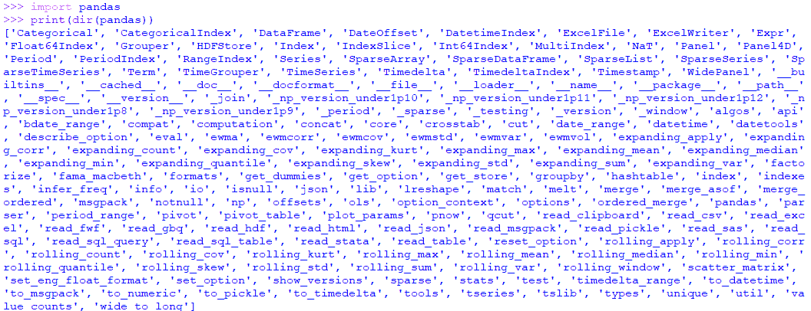
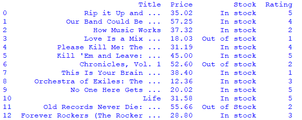
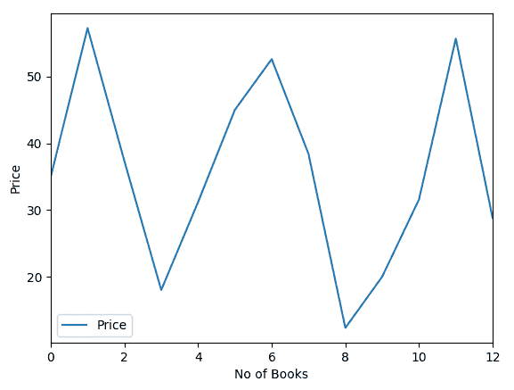
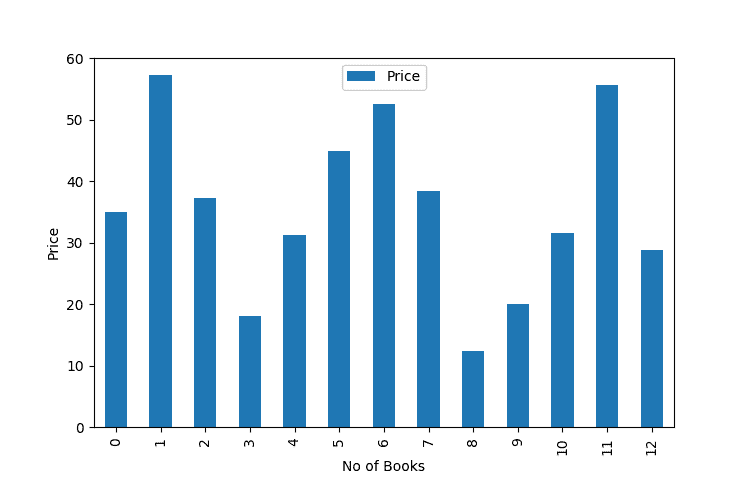
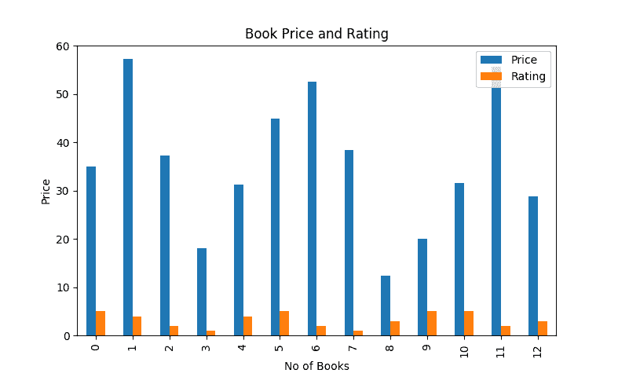
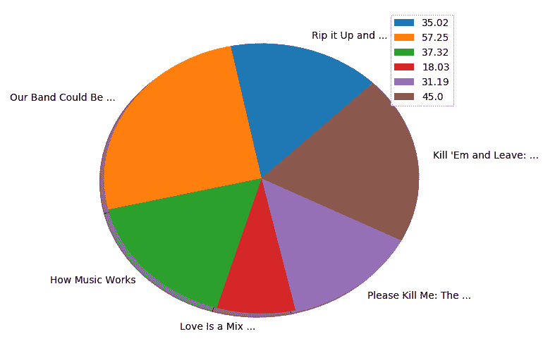

# 第十章：下一步

到目前为止，我们已经通过使用 Python 编程语言探索了有关网页抓取的各种工具和技术。

网页抓取或网络收集是为了从网站中提取和收集数据。网页抓取在模型开发方面非常有用，因为需要实时收集真实、与主题相关和准确的数据。这是可取的，因为与实施数据集相比，需要的时间更少。收集的数据以各种格式存储，如 JSON、CSV、XML 等，写入数据库以供以后使用，并且也作为数据集在线提供。

网站还提供带有用户界面的 Web API，用于与网络上的信息进行交互。这些数据可以用于计算机科学、管理、医学等领域的研究、分析、营销、机器学习（ML）模型、信息构建、知识发现等。我们还可以对通过 API 和公开或免费提供的数据集获得的数据进行分析，并生成结果，但这个过程不被归类为网页抓取。

在本章中，我们将学习与收集或抓取的数据相关的主题，并了解一些值得从信息和职业角度了解的高级概念：

+   管理抓取的数据

+   使用 pandas 和 matplotlib 进行分析和可视化

+   ML

+   数据挖掘

+   接下来是什么？

# 技术要求

需要使用网络浏览器（Google Chrome 或 Mozilla Firefox）。在本章中，我们将使用以下 Python 库：

+   `pandas`

+   `matplotlib`

+   `csv`

+   `json`

如果这些库在您当前的 Python 设置中不存在，请参考第二章，*Python 和 Web - 使用 urllib 和 Requests*，在*设置事项*部分，获取安装和设置它们的说明。

本章的代码文件可在本书的 GitHub 存储库中找到：[`github.com/PacktPublishing/Hands-On-Web-Scraping-with-Python/tree/master/Chapter10`](https://github.com/PacktPublishing/Hands-On-Web-Scraping-with-Python/tree/master/Chapter10)。

# 管理抓取的数据

在本节中，我们将探索一些工具，并了解如何处理和管理我们从某些网站上抓取或提取的数据。

使用抓取脚本从网站收集的数据称为原始数据。这些数据可能需要进行一些额外的任务，然后才能进一步处理，以便我们可以对其进行深入的了解。因此，原始数据应该经过验证和处理（如果需要），可以通过以下方式进行：

+   **清理**：顾名思义，此步骤用于删除不需要的信息，例如空格和空白字符以及不需要的文本部分。以下代码显示了在先前章节的示例中使用的一些相关步骤，例如第九章，*使用正则表达式提取数据*，和第三章，*使用 LXML、XPath 和 CSS 选择器*。在许多地方使用`sub()`（即`re.sub()`）、`strip()`和`replace()`等函数，也可以用于清理的目的：

```py
dealerInfo = re.split(r'<br>', re.sub(r'<br><br>', '', dealer))

stock = list(map(lambda stock:stock.strip(),availability))

availability = stockPath(row)[0].strip()

article['lastUpdated'] = article['lastUpdated'].replace('This page was last edited on', '')

title = row.find(attrs={'itemprop':'text'}).text.strip()

re.sub(r'or\s*','',fortran)

dealerInfo = re.split(r'<br>',re.sub(r'<br><br>','',dealer))
```

+   **格式化**：此步骤用于从数据中获取所需的格式。例如，我们可能需要在收到的价格中获得固定的小数位，我们可能需要将大浮点值转换或四舍五入为固定的小数位，将大字符串拆分为较小的单元等，然后将它们写入数据集。还可能出现将十进制数或整数提取为字符串并需要格式化的情况。通常，转换数据类型和呈现数据被视为格式化：

```py
>>> price = 1234.567801
>>> newprice = round(price,2)
>>> print(newprice)
1234.57

>>> totalsum="200.35"
>>> print(type(totalsum))
<class 'str'>

#For large precision use: https://docs.python.org/2/library/decimal.html
>>> totalsum = float(totalsum) 
>>> print(type(totalsum))
<class 'float'>

>>> totalsum
200.35
>>> ratings = 5.5
>>> print(int(rating))
5
```

这些额外的步骤也可以在提取特定数据的同时在脚本中执行，并且已经在本书中的示例中完成。在许多情况下，清理和格式化是一起进行的，或者是并行进行的。

# 写入文件

在整本书中，我们需要提取数据行。您可能已经注意到，在大多数示例中，我们使用了一个数据集（用于收集数据的 Python 列表对象），该数据集附加了 Python 列表中的各种字段，如下面的代码所示（从本书的各个示例中收集）：

```py
dataSet.append([year,month,day,game_date,team1,team1_score,team2,team2_score,game_status])
..
dataSet.append([title,price,availability,image.replace('../../../..',baseUrl),rating.replace('star-rating ','')])
...
dataSet.append([link, atype, adate, title, excerpt,",".join(categories)])
...
dataSet.append([titleLarge, title, price, stock, image, starRating.replace('star-rating ', ''), url])
```

有了这样的数据集，我们可以将这些信息写入外部文件，也可以写入数据库。在将数据集写入文件之前，需要列名来描述数据集中的数据。考虑以下代码，其中`keys`是一个单独的列表，包含一个字符串标题，即列的名称，将其附加到数据集的相应列表项中：

```py
keys = ['year','month','day','game_date','team1', 'team1_score', 'team2', 'team2_score', 'game_status']
......
dataSet.append([year,month,day,game_date,team1,team1_score,team2,team2_score,game_status])
```

让我们考虑以下示例，其中包含要使用的列的`colNames`，以及清理和格式化数据的`dataSet`：

```py
import csv
import json

colNames = ['Title','Price','Stock','Rating']
dataSet= [['Rip it Up and ...', 35.02, 'In stock', 5],['Our Band Could Be ...', 57.25, 'In stock', 4],
    ['How Music Works', 37.32, 'In stock', 2],['Love Is a Mix ...', 18.03, 'Out of stock',1],
    ['Please Kill Me: The ...', 31.19, 'In stock', 4],["Kill 'Em and Leave: ...", 45.0, 'In stock',5],
    ['Chronicles, Vol. 1', 52.60, 'Out of stock',2],['This Is Your Brain ...', 38.4, 'In stock',1],
    ['Orchestra of Exiles: The ...', 12.36, 'In stock',3],['No One Here Gets ...', 20.02, 'In stock',5],
   ['Life', 31.58, 'In stock',5],['Old Records Never Die: ...', 55.66, 'Out of Stock',2],
    ['Forever Rockers (The Rocker ...', 28.80, 'In stock',3]]
```

现在我们将上述`dataSet`写入 CSV 文件。CSV 文件的第一行应始终包含列名。在本例中，我们将使用`colNames`作为列名：

```py
fileCsv = open('bookdetails.csv', 'w', newline='', encoding='utf-8')
writer = csv.writer(fileCsv) #csv.writer object created

writer.writerow(colNames)  #write columns from colNames
for data in dataSet:       #iterate through dataSet and write to file
    writer.writerow(data)

fileCsv.close() #closes the file handler
```

上述代码将导致`bookdetails.csv`文件，其内容如下：

```py
Title,Price,Stock,Rating Rip it Up and ...,35.02,In stock,5 Our Band Could Be ...,57.25,In stock,4 ........... Life,31.58,In stock,5 Old Records Never Die: ...,55.66,Out of Stock,2 Forever Rockers (The Rocker ...,28.8,In stock,3
```

同样，让我们创建一个包含`colNames`和`dataSets`的 JSON 文件。JSON 类似于 Python 字典，其中每个数据或值都具有一个键；也就是说，它存在于键值对中：

```py
finalDataSet=list() #empty DataSet 
for data in dataSet:
    finalDataSet.append(dict(zip(colNames,data))) 

print(finalDataSet)

[{'Price': 35.02, 'Stock': 'In stock', 'Title': 'Rip it Up and ...', 'Rating': 5}, {'Price': 57.25, 'Stock': 'In stock', ..........'Title': 'Old Records Never Die: ...', 'Rating': 2}, {'Price': 28.8, 'Stock': 'In stock', 'Title': 'Forever Rockers (The Rocker ...', 'Rating': 3}]
```

正如我们所看到的，`finalDataSet`是通过从`dataSet`中添加数据并使用`zip()` Python 函数形成的。`zip()`将列表中的每个单独元素组合在一起。然后将这个压缩对象转换为 Python 字典。例如，考虑以下代码：

```py
#first iteration from loop above dict(zip(colNames,data)) will generate
{'Rating': 5, 'Title': 'Rip it Up and ...', 'Price': 35.02, 'Stock': 'In stock'}
```

现在，有了可用的`finalDataSet`，我们可以使用`json`模块的`dump()`函数将数据转储或添加到 JSON 文件中：

```py
with open('bookdetails.json', 'w') as jsonfile:
    json.dump(finalDataSet,jsonfile)
```

上述代码将导致`bookdetails.json`文件。其内容如下：

```py
[
  {
    "Price": 35.02,
    "Stock": "In stock",
    "Title": "Rip it Up and ...",
    "Rating": 5
  },
  ................
  {
    "Price": 28.8,
    "Stock": "In stock",
    "Title": "Forever Rockers (The Rocker ...",
    "Rating": 3
  }
]
```

在本节中，我们已经介绍了管理原始数据的基本步骤。我们获得的文件可以在各种独立系统之间轻松共享和交换，用作 ML 的模型，并且可以作为应用程序中的数据源导入。此外，我们还可以使用**数据库管理系统**（**DBMS**）如 MySQL、PostgreSQL 等来存储数据，并使用必要的 Python 库执行**结构化查询语言**（**SQL**）。

# 使用 pandas 和 matplotlib 进行分析和可视化

在本节中，我们将探讨使用 pandas 分析数据和使用 matplotlib 绘制通用图表的一些基本概念。

pandas 是近年来最受欢迎的数据分析库之一。数据分析和可视化是主要任务，可以借助 pandas 和其他库（如 matplotlib）来完成。

有关 pandas 和 matplotlib 的更多详细信息和文档，请访问它们的官方网站[`pandas.pydata.org/`](https://pandas.pydata.org/)和[`matplotlib.org/`](https://matplotlib.org/)。

pandas 也被称为原始电子表格，并支持数学、统计和查询类型的语句，并允许您从各种文件中读取和写入。它也受到开发人员和分析师的欢迎，因为它具有易于使用的函数和属性，可以帮助您处理以行和列结构存在的数据：



使用 Python IDE 探索 pandas

在本节中，我们将从`bookdetails.csv`文件中读取数据，并使用该文件的数据进行分析和可视化。让我们导入所需的库，即 pandas 和`matplotlib.pyplot`。我们将分别使用`pd`和`plt`别名，并从文件中读取数据：

```py
import pandas as pd
import matplotlib.pyplot as plt

dataSet = pd.read_csv('bookdetails.csv') #loads the file content as dataframe.

print(type(dataSet)) #<class 'pandas.core.frame.DataFrame'>
```

正如我们所看到的，`read_csv()`函数从 CSV 文件中读取内容并生成一个 DataFrame 对象。pandas 还通过使用`read_html()`、`read_excel()`、`read_json()`和`read_sql_table()`等函数支持各种数据文件。

在这里，`dataSet`是 pandas DataFrame 的一个对象。DataFrame 表示具有行、列和索引的二维表格结构。DataFrame 支持针对行和列中的数据的查询级别分析、条件语句、过滤、分组等操作：

```py
print(dataSet)
```

以下屏幕截图显示了现在在`dataSet`中可用的内容：



来自 CSV 文件的数据集内容

行索引也显示出来，所有的行索引都以`0`（零）开头。可以使用`describe()`函数获得一般的统计输出：

```py
print(dataSet.describe()) 
#print(dataSet.describe('price') will only generate values for column price

      Price      Rating
count 13.000000  13.000000
mean  35.633077  3.230769
std   14.239014  1.535895
min   12.360000  1.000000
25%   28.800000  2.000000
50%   35.020000  3.000000
75%   45.000000  5.000000
max   57.250000  5.000000
```

正如我们所看到的，默认情况下，`describe()`选择适用于统计函数的列，并返回以下函数的计算结果：

+   `count`: 行数

+   `mean`: 相关列的平均值

+   `min`: 找到的最小值

+   `max`: 找到的最大值

+   `std`: 计算的标准偏差

+   `25%`: 返回第 25 个百分位数

+   `50%`: 返回第 50 个百分位数

+   `75%`: 返回第 75 个百分位数

在以下代码中，我们选择了一个名为`Price`的单独列作为`price_group`。可以使用`dataSet.columns`列出数据集中的所有列。可以使用以下格式选择多个列`dataSet[['Price','Rating']]`：

```py
print(dataSet.columns)
Index(['Title', 'Price', 'Stock', 'Rating'], dtype='object')

print(sum(dataSet['Price']))
463.23

print(sum(dataSet['Rating']))
42

print(dataSet['Price'][0:5])
0 35.02
1 57.25
2 37.32
3 18.03
4 31.19
Name: Price, dtype: float64
```

以下代码显示了`Price`列的单独数据：

```py
#dataSet[['Price','Rating']] will select both column
price_group = dataSet[['Price']] #selecting 'Price' column only.
print(price_group) 

Index(['Title', 'Price', 'Stock', 'Rating'], dtype='object')
  Price
0 35.02
1 57.25
2 37.32
.....
11 55.66
12 28.80
```

pandas DataFrame 也接受对列使用条件或过滤操作。如您所见，筛选应用于`Rating`，其值为`>=4.0`，并且只返回`Title`和`Price`：

```py
 print(dataSet[dataSet['Rating']>=4.0][['Title','Price']])

  Title                  Price
0 Rip it Up and ...      35.02
1 Our Band Could Be ...  57.25
4 Please Kill Me: The ...31.19
5 Kill 'Em and Leave: ...45.00
9 No One Here Gets ...   20.02
10 Life                  31.58
```

同样，也可以应用基于字符串的过滤。包含`Out`文本的`Stock`被过滤，输出返回满足`Out`文本的所有列。`contains()`函数接受正则表达式和字符串：

```py
print(dataSet[dataSet.Stock.str.contains(r'Out')])

   Title                     Price Stock        Rating
3  Love Is a Mix ...         18.03 Out of stock 1
6  Chronicles, Vol. 1        52.60 Out of stock 2
11 Old Records Never Die: ...55.66 Out of Stock 2#will return only column 'Price'
#print(dataSet[dataSet.Stock.str.contains(r'Out')]['Price'])

```

`between()`函数提供了与`Rating`相关的值，以过滤和返回书籍的`Title`：

```py
print(dataSet[dataSet.Rating.between(3.5,4.5)]['Title'])

1 Our Band Could Be ...
4 Please Kill Me: The ...
```

由于我们有`price_group`数据，我们可以使用`show()`函数在数据上调用`plot()`函数：

```py
 bar_plot = price_group.plot()  #default plot
 bar_plot.set_xlabel("No of Books") #set X axis: label
 bar_plot.set_ylabel("Price") #set Y axis: label
 plt.show() #displays the plot or chart created
```

上述代码将生成一个带有默认属性的线图，如颜色和图例位置：



Price 列的默认线图

我们还可以更改图表的类型，即线图、柱状图等。

访问 matplotlib [`matplotlib.org/gallery/index.html`](https://matplotlib.org/gallery/index.html) 了解更多有关各种功能图表类型及其附加属性的信息。

在以下代码中，`kind='bar'`覆盖了默认的线型：

```py
bar_plot = price_group.plot(kind='bar') #kind='bar'
bar_plot.set_xlabel("No of Books")  #Label for X-Axis
bar_plot.set_ylabel("Price") #label for Y-Axis
plt.show() 
```

上述代码生成了以下柱状图：



Price 列的柱状图

到目前为止，我们已经使用了基本的图表类型和单个列。在以下代码中，我们将使用`Price`和`Rating`值绘制柱状图：

```py
price_group = dataSet[['Price','Rating']]  #obtain both columns
#title: generates a title for plot
bar_plot = price_group.plot(kind='bar',title="Book Price ad Rating")
bar_plot.set_xlabel("No of Books")
bar_plot.set_ylabel("Price")
plt.show()
```

我们收到以下输出：



具有 Price 和 Rating 列的柱状图

到目前为止，我们已成功绘制了线图和柱状图。以下代码为`Price`列的前六个项目绘制了一个饼图，并使用`dataSet`中可用的前六个`Title`标签它们：

```py
prices = dataSet['Price'][0:6] #Price from first 6 items
labels = dataSet['Title'][0:6] #Book Titles from first 6 items
legends,ax1 = plt.pie(prices, labels=labels, shadow=True, startangle=45)
plt.legend(legends, prices, loc="best") #legend built using Prices
plt.show() 
```

来自`Price`的值被用作图例。我们收到以下输出：



带有 Price 和 Title 列数据的饼图

在使用 pandas 和 matplotlib 方面还有很多可以探索的地方。在本节中，我们展示了这两个库中可用的基本功能。现在，我们将看看机器学习。

# 机器学习

机器学习是人工智能的一个分支，涉及研究数学和统计算法，以处理和开发能够从数据中学习的自动化系统，减少人类干预。机器学习的预测和决策模型依赖于数据。网络抓取是使数据可用于机器学习模型的资源之一。

如今，许多推荐引擎实现了机器学习，以便实时提供营销广告和推荐，比如谷歌的 AdSense 和 AdWords。机器学习中实施的过程类似于数据挖掘和预测建模。这两个概念都在浏览数据并根据要求修改程序的行为时寻找模式。因此，机器学习在探索商业、营销、零售、股票价格、视频监控、人脸识别、医学诊断、天气预测、在线客户支持、在线欺诈检测等领域时是一个方便的工具。

随着新的和改进的机器学习算法、数据捕获方法以及更快的计算机和网络，机器学习领域正在加速发展。

# 机器学习和人工智能

人工智能是一个广泛的范畴，涵盖了诸多主题，如神经网络、专家系统、机器人技术、模糊逻辑等等。机器学习是人工智能的一个子集，它探索了构建一个能够自主学习的机器的理念，从而超越了对不断推测的需求。因此，机器学习已经取得了实现人工智能的重大突破。

机器学习包括使用多种算法，从而使软件能够提供准确的结果。从一组解析数据中进行有用的预测是机器学习概念的目标。机器学习的最主要优势是它可以不知疲倦地学习和预测，而无需硬编码的软件体系。训练包括将大量数据集作为输入。这使得算法能够学习、处理和进行预测，然后将预测结果作为输出。

在衡量任何模型的潜力时，会采用几个重要参数。准确性是其中之一，也是衡量任何开发模型成功的重要参数。在机器学习中，80%的准确性就是成功。如果模型的准确性达到 80%，那么我们就节省了 80%的时间，提高了生产率。然而，如果数据不平衡，准确性并不总是评估分类模型的最佳指标。

总的来说，准确性被称为一种直观的度量。在使用准确性时，对假阳性和假阴性分配了相等的成本。对于不平衡的数据（比如 94%属于一种情况，6%属于另一种情况），有许多降低成本的好方法；做一个模糊的预测，即每个实例都属于多数类，证明整体准确性为 94%，然后完成任务。同样，如果我们讨论的是一种罕见且致命的疾病，问题就会出现。未能正确检查患病者的疾病的成本高于将健康个体推向更多检查的成本。

总之，没有最佳的度量标准。两个人选择不同的度量标准来达到他们的目标是很常见的。

# Python 和机器学习

荷兰程序员（Guido Van Rossum）将 Python 作为他的副业项目推出，但没有意识到它会加速他的成功。Python 在开发人员中被广泛采用，当涉及到快速原型设计时尤其如此。它因其可读性、多功能性和易用性而在所有机器学习工具中备受欢迎。

作为机器学习工程师、计算机视觉工程师、数据科学家或数据工程师，我们必须在线性代数和微积分的概念中游刃有余，一旦深入研究，这些概念往往变得复杂。然而，Python 通过其快速实现来解救我们，从而绕过了最大努力的障碍。对这一理念的快速验证使得 Python 编程语言更加受欢迎。

对于 ML 来说，数据就是一切。原始数据是非结构化的、庞大的、不完整的，并且存在缺失值。数据清洗是 ML 中最关键的步骤之一，这样我们才能继续处理我们的数据。Python 中有许多重要的库，使 ML 的实施变得更简单。Python 中的各种开源存储库帮助改变现有的方法。Web 抓取是这些方法之一，它处理存在于网络上的数据，然后进一步处理为 ML 模型的输入。

以下是一些最常见和广泛使用的库，如果我们决定使用 Python 和 ML，值得一看：

+   **scikit-learn**：用于处理经典 ML 算法

+   **NumPy（数值 Python）**：设计用于科学计算

+   **SciPy**：包含线性代数、优化、积分和统计模块

+   **pandas**：用于数据聚合、操作和可视化

+   **matplotlib**和**Seaborn**：用于数据可视化

+   **Bokeh**和**Plotly**：用于交互式可视化

+   **TensorFlow**和**Theano**：用于深度学习

+   **Beautiful Soup, LXML, PyQuery**和**Scrapy**：用于从 HTML 和 XML 文档中提取数据

一旦我们对 Python 有了基本的了解，就可以导入并实施这些库。或者，我们也可以从头开始应用这些功能，这是大多数开发人员所做的。

Python 在编写和调试代码方面比其他编程语言节省时间。这正是 AI 和 ML 程序员想要的：专注于理解架构方面，而不是花费所有时间在调试上。因此，Python 可以很容易地被不太懂编程的人处理，因为它提供了人类水平的可读性的语法。

除了 Python，还有其他几种用于 ML 的工具，如 Microsoft Excel、SAS、MATLAB 和 R。由于缺乏足够的社区服务和无法处理大型数据集，这些工具经常被忽视。MATLAB 还提供了用于图像处理和分析的复杂库和包。与 Python 相比，执行时间适中，功能仅限于原型设计，而不是部署。

R 是另一个用于统计分析的工具。Python 通过提供各种开发工具来执行数据操作，可以与其他系统协作。然而，R 只能处理特定形式的数据集，因此预定义的函数需要预定义的输入。R 为数据提供了一个原始的基础，而 Python 允许我们探索数据。

# ML 算法的类型

一般来说，有三种 ML 算法，如下所示：

+   监督学习：

+   分类

+   回归

+   无监督学习:

+   关联

+   聚类

+   强化学习

# 监督学习

监督学习是观察或指导执行某事。输入给模型的是我们想要做出的预测。标记的数据是对特定输入实例的明确预测。监督学习需要标记的数据，这需要一些专业知识。然而，这些条件并不总是满足的。我们并不总是拥有标记的数据集。例如，欺诈预测是一个迅速发展的领域，攻击者不断寻找可用的漏洞。这些新攻击不可能在带有标记攻击的数据集下得到维护。

数学上，输入到输出的映射函数可以表示为*Y = f(X)*。这里，*Y*是输出变量，*X*是输入变量。

# 分类

分类根据其属性确定或分类模型，并且根据成员类别来确定新观察结果所属的流派的过程，这是事先已知的。这是一种根据一个或多个自变量确定因变量属于哪个类别的技术。分类问题中的输出变量是一个组或类别。

一些例子包括信用评分（根据收入和储蓄区分高风险和低风险）、医学诊断（预测疾病风险）、网络广告（预测用户是否会点击广告）等。

分类模型的能力可以通过模型评估程序和模型评估指标来确定。

**模型评估程序**

模型评估程序可以帮助您找出模型对样本数据的适应程度：

+   **训练和测试数据**：训练数据用于训练模型，使其适应参数。测试数据是一个掩盖的数据集，需要进行预测。

+   **训练和测试分离**：通常情况下，当数据被分离时，大部分数据用于训练，而一小部分数据用于测试。

+   **K 折交叉验证**：创建 K 个训练和测试分离，并将它们平均在一起。该过程比训练和测试分离运行 k 倍慢。

**模型评估指标**

模型评估指标用于量化模型的性能。以下指标可用于衡量分类预测模型的能力。

评估指标是通过以下方式进行管理：

+   **混淆矩阵**：这是一个 2x2 矩阵，也称为错误矩阵。它有助于描述算法的性能，通常是监督学习算法，通过分类准确度、分类错误、灵敏度、精确度和预测。指标的选择取决于业务目标。因此，有必要确定根据要求是否可以减少假阳性或假阴性。

+   **逻辑回归**：逻辑回归是一种用于分析数据集的统计模型。它有几个独立变量负责确定输出。输出用双倍体变量（涉及两种可能的结果）来衡量。逻辑回归的目标是找到最佳拟合模型，描述双倍体变量（因变量）和一组独立变量（预测变量）之间的关系。因此，它也被称为预测学习模型。

+   **朴素贝叶斯**：这是基于条件概率的概念工作，由贝叶斯定理给出。贝叶斯定理根据可能与事件相关的先验知识计算事件的条件概率。这种方法广泛应用于人脸识别、医学诊断、新闻分类等。朴素贝叶斯分类器基于贝叶斯定理，可以计算*A*给定*B*的条件概率如下：

```py
P(A | B) = ( P(B | A) * P( A ))/ P( B  )
Given:
P(A | B) = Conditional probability of A given B
P(B | A) = Conditional probability of B given A
P( A )= Probability of occurrence of event A
P( B  )= Probability of occurrence of event B
```

+   **决策树**：决策树是一种监督学习模型，最终结果可以以树的形式呈现。决策树包括叶节点、决策节点和根节点。决策节点有两个或更多的分支，而叶节点代表分类或决策。决策树进一步将数据集分解为更小的子集，从而逐步发展相关的树。它易于理解，可以轻松处理分类和数值数据集。

+   随机森林算法：这个算法是一种易于使用且即使没有超参数调整也能提供出色结果的监督式机器学习算法。由于其简单性，它可以用于回归和分类任务。它可以处理更大的数据集以保持缺失值。与回归相比，该算法被认为是执行与分类相关任务最好的。

+   神经网络：虽然我们已经有了线性和分类算法，但神经网络是许多机器学习问题的最先进技术。神经网络由单元组成，即神经元，它们排列成层。它们负责将输入向量转换为某种输出。每个单元接受输入，应用函数，并将输出传递到下一层。通常，对该算法应用非线性函数。

+   支持向量机（SVM）算法：SVM 学习算法是一种监督式机器学习模型。它用于分类和回归分析，并被广泛认为是一个受限制的优化问题。SVM 可以通过核技巧（线性、径向基函数、多项式和 Sigmoid）变得更加强大。然而，SVM 方法的局限性在于核的选择。

# 回归

回归是一种有助于估计变量之间关系的统计测量。一般来说，分类侧重于标签的预测，而回归侧重于数量的预测。回归在金融、投资和其他领域中被管理者用来估值他们的资产。在同一条线上，它试图确定因变量和一系列其他变化的自变量之间关系的强度；例如，商品价格与经营这些商品的企业之间的关系。

回归模型具有两个主要特征。回归问题中的输出变量是实数或数量性质的。模型的创建考虑了过去的数据。从数学上讲，预测模型将输入变量（X）映射到连续的输出变量（Y）。连续的输出变量是整数或浮点值。

回归预测模型的能力可以通过计算均方根误差（RMSE）来衡量。例如，总共，回归预测模型做出了两次预测，即 1.5 和 3.3，而预期值分别为 1.0 和 3.0。因此，RMSE 可以计算如下：

```py
RMSE = sqrt(average(error²))
RMSE = sqrt(((1.0 - 1.5)² + (3.0 - 3.3)²) / 2)
RMSE = sqrt((0.25 + 0.09) / 2)
RMSE = sqrt(0.17)
RMSE = 0.412
```

# 无监督学习

无监督学习是一类机器学习技术，其中作为输入的数据没有标签。此外，只提供输入变量（X），没有对应的输出变量（Y）。在无监督学习中，算法被留在孤立中自行学习和探索，没有真正的早期期望。这种缺乏标记教会我们关于使用表示或嵌入重建输入数据。在数据挖掘和特征提取方面非常有益。

无监督学习可以帮助您发现隐藏的趋势和模式。一些现实世界的例子包括预测或理解手写数字、纳米摄像头制造技术、普朗克量子光谱等。

从数学上讲，无监督学习具有没有相应输出值的输入值（X）。与监督学习相比，无监督学习的任务处理非常复杂。无监督学习的实现可以在自动或自动驾驶汽车、面部识别程序、专家系统、生物信息学等领域找到。

关联和聚类是无监督学习的两个部分。

# 关联

这是一种用于在大型数据集中发现新模式的技术。关联被认为是根据新闻价值程度从数据集中识别强规则的。在对数据进行长时间分析时，会生成更多的新规则。

关联规则在市场篮分析中被广泛应用。这种技术有助于确定购买产品对之间的关联强度以及在观察中的共同发生频率。

市场篮分析是零售商用来发现商品之间关联的建模技术之一。该理论围绕着这样一个事实展开，即如果我们购买某些商品，我们更有可能购买类似的商品。

在数学上，它表示为*P(A|B)*，其中购买*A*的人也购买*B*。也可以写成如果*{A}*，那么*{B}*。换句话说，如果 A 发生的概率，那么 B 也会发生的概率。例如，*P(牛奶 | 面包 ) = 0.7*。

# 聚类

簇是属于同一标签的对象的集合，被视为一个整体。聚类是将对象分组到其相应类别的技术。这包括将多个对象分类到它们的特定组中，如果它属于同一组，则其关联度最大，否则最小。

最流行的聚类算法之一是 k 均值聚类算法。该算法要求预定义的 k 值。K 代表我们想要将数据分成的簇的数量。当簇是超球形时，如二维空间中的圆或三维空间中的球时，才能获得真正的性能。

聚类的主要优势在于它帮助你从数据中找出独特、有用的特征，并且它对变化具有灵活性。

# 强化学习

强化学习是机器学习的一部分，它处理采取必要行动以增加特定情况奖励的问题。它利用多个软件和机器来找到特定情况的最佳路径。

强化学习与监督学习不同。在监督学习中，提供带有标签的训练数据，基于这些数据进行训练。在强化学习的情况下，强化代理人做出决定来解决分配给他们的任务。

强化学习有两种类型：

+   **正强化**：最大化性能并维持更长时间的变化

+   **负强化**：最小化性能并维持更短时间的变化

# 数据挖掘

从大型数据集或数据库中发现隐藏或预测信息的过程被称为数据挖掘。数据挖掘是一种在数据上进行的分析形式，以发现新的模式和事实。这些事实被用来发现知识，也被认为是朝着**数据库知识发现**（**KDD**）的一步。

通常结合人工智能、机器学习、统计学、数据库管理系统等各种过程和步骤来寻找新的模式。随着数据量和机器学习算法的增长，总是有发现数据库中新的或隐藏事实的趋势。发现或搜索到的事实和模式随后被用来预测特定结果，并且也可以应用于统计学、数据可视化、营销、管理、医学、决策系统等许多领域。

数据分析和数据挖掘经常被比较或并列讨论。数据挖掘被认为是数据分析过程的一部分。在进行数据分析时，我们需要一些预定义的假设，因为这是组织数据以开发模型并确定一些见解的过程。在应用实践方面，数据挖掘主要是针对结构化数据进行的，而数据分析可以针对结构化、非结构化或半结构化数据进行。

数据挖掘基于科学和数学方法，而数据分析使用分析模型和智能系统。从远处看，数据分析和数据挖掘都是数据科学的子集，数据挖掘实施预测算法来发现模式，而数据分析实施活动来从数据集中获得一些见解。

数据挖掘的一个主要好处是能够在短时间内处理大量数据。它还可以在新平台或现有平台上实施，预测隐藏的模式或帮助发现它们，帮助决策、知识发现等等。

# 数据挖掘的任务

一般来说，数据挖掘任务分为两种类型，也称为数据挖掘分析或数据挖掘建模。如下所示，两者都可以进一步分类：

+   预测：

+   分类

+   回归

+   预测

+   描述性：

1.  +   聚类

+   总结

+   关联规则

# 预测

这使用统计分析将数据转化为有价值的信息。它预测可能发生情况的未来结果。通过分析当前和历史事实生成输出的与预测相关的技术属于这种模型。

# 分类

这是最常见的挖掘技术之一，在处理样本之前对其进行分类和归类以找到事实。有关分类和模型评估程序的更多信息，请参阅*ML 算法类型*部分。

# 回归

这种技术用于预测、预测和分析信息趋势和变量之间的关系。有关回归的更多信息，请参阅*ML 算法类型*部分。

# 预测

这种技术分析过去的事件，并通过使用其他数据挖掘技术（如聚类、分类等）的参考来预测可能缺失或未来的值。

# 描述性

也称为数据处理的初步阶段，它使用商业智能和许多其他系统。这种形式的分析是有限的，因为它只分析过去的数据，并且通常提供有关已经发生的事情的信息。

# 聚类

聚类是一种用于识别彼此相似的数据的技术。有关聚类的更多信息，请参阅*ML 算法类型*部分。

# 总结

这提供了数据集的更紧凑表示，并包括可视化和报告生成。大多数关于销售和营销的管理报告使用这种技术。

# 关联规则

有关关联的更多信息，请参阅*ML 算法类型*部分。

# 接下来是什么？

Web 抓取是动态的、要求高的，也是一项具有挑战性的任务。在进行此任务之前，我们需要遵守法律的角度，这是在网站的**服务条款**（ToS）和隐私政策中提出的。Python 编程，以其支持性、简单的语法、简短可读的代码形式以及库和工具的可用性，是用于 Web 抓取的最佳语言之一。

然而，挑战依然存在，通用脚本可能无法满足需求。有时，抓取任务可能需要大量资源，个人 PC 或笔记本电脑在考虑时间、机器资源等方面可能不值得实施。有许多功能和程序可以使抓取任务变得更加复杂和具有挑战性。让我们来看看其中一些：

+   采用不断增长的基于网络的安全措施

+   动态加载数据和脚本语言的参与使得抓取变得复杂

+   存在 CAPTCHA，可以在[`www.captcha.net/`](http://www.captcha.net/)找到

+   阻止用户的 IP 地址（用于同时请求）

+   阻止来自世界某些地区的请求（使用和切换代理可能会有所帮助）

对于这种情况，我们可以从正在进行与抓取相关工作的组织那里获得帮助。这些组织可以通过收取一定费用并为我们提供一个网络界面来帮助我们满足数据需求。这样的公司可以在谷歌上搜索“网络抓取服务”或“网络抓取软件”来寻找。还有各种基于浏览器的扩展程序可供搜索“抓取扩展”来找到。

# 总结

在本章中，我们探讨并学习了使用文件进行数据管理、分析和可视化的基本概念，使用了 pandas 和 matplotlib。我们还介绍了机器学习和数据挖掘，并探讨了一些相关资源，这些资源对进一步学习和职业发展可能有帮助。

通过本章，我们完成了本书！网络抓取是一个广泛的主题，直接或间接与许多技术和开发技术相关。在整本书中，我们通过使用 Python 编程语言学习了这一领域的许多概念。我们还可以探索与网络抓取相关的更多主题，如机器学习、数据挖掘、网络抓取、人工智能和 Python 编程。从知识和职业发展的角度来看，这些主题都值得探索。

# 进一步阅读

+   *人工智能：现代方法*，网址为[`aima.cs.berkeley.edu/`](http://aima.cs.berkeley.edu/)

+   *机器学习*，网址为[`www.cs.cmu.edu/~tom/mlbook.html`](http://www.cs.cmu.edu/~tom/mlbook.html)

+   *数据挖掘与分析*，*基本概念和算法*，网址为[`www.dataminingbook.info/pmwiki.php`](http://www.dataminingbook.info/pmwiki.php)

+   Python 数据分析库，网址为[`pandas.pydata.org`](https://pandas.pydata.org)

+   matplotlib：Python 绘图，网址为[`matplotlib.org`](https://matplotlib.org/)

+   文件处理（Python），网址为[`www.w3schools.com/python/python_file_handling.asp`](https://www.w3schools.com/python/python_file_handling.asp)

+   *信息检索导论*，网址为[`nlp.stanford.edu/IR-book/`](https://nlp.stanford.edu/IR-book/)

+   SQLite，网址为[`www.sqlite.org/index.html`](https://www.sqlite.org/index.html)

+   MySQL，网址为[`www.mysql.com/`](https://www.mysql.com/)

+   PostgreSQL，网址为[`www.postgresql.org/`](https://www.postgresql.org/)

+   验证码，网址为[`www.captcha.net/`](http://www.captcha.net/)

+   *KDD 过程概述*，网址为[`www2.cs.uregina.ca/~dbd/cs831/notes/kdd/1_kdd.html`](http://www2.cs.uregina.ca/~dbd/cs831/notes/kdd/1_kdd.html)
