# 第一章：理解 Raspberry Pi

欢迎来到物联网项目以及 Raspberry Pi 的奇妙世界，这是《物联网编程项目》的第二版。

在本书中，我们将通过 Raspberry Pi 探索物联网项目。本书的第一部分，我们将探讨 Raspberry Pi 上的物联网项目，最初将其转变为带有 Sense HAT 的气象站以捕获实时数据。随后，我们将使用电机和**通用输入/输出**（**GPIO**）引脚将 Pi 重新用作模拟计量设备。

然后，我们将创建一个物联网家庭安全系统，使用 Raspberry Pi 作为警报系统的中心枢纽。我们还将开发一个具有 LoRa 功能的物联网远程监测站。本书的结尾是我们最雄心勃勃的项目：构建一个由 Raspberry Pi 驱动的物联网机器人汽车。

我们将从此章节开始，探讨各种 Raspberry Pi 型号及其重要性，观察它们在处理能力、内存和功能方面的演变和进步。

我们还将探讨物联网（IoT）领域中可用的 Raspberry Pi 替代品，使我们能够根据项目需求做出明智的决定。我们将这些替代品与 Raspberry Pi 进行比较，突出它们的独特规格和能力。

此外，我们将深入了解 Raspberry Pi 的**硬件附加在顶部**（**HAT**），它通过附加板扩展了 Raspberry Pi 的功能。具体来说，我们将探索 Pibrella HAT 和 Raspberry Pi Sense HAT，突出它们通过增加额外功能和功能来增强 Raspberry Pi 的能力。

我们的 Sense HAT 项目将利用*图 1**.1*中看到的可选定制 Raspberry Pi 外壳。此外壳允许我们将 Raspberry Pi 以垂直格式展示，并利用 Sense HAT 上的点阵显示屏。本书的 GitHub 仓库中提供了 Raspberry Pi 4B 和 Raspberry Pi 5 版本外壳的构建文件。


图 1.1 – 定制外壳中的 Raspberry Pi 4B 和 Sense HAT

我们还将讨论一系列与 Raspberry Pi 兼容的操作系统，这些操作系统超出了官方的 Raspberry Pi OS。这些选项满足各种应用需求，包括网络音频系统、航空相关项目、复古游戏和 3D 打印。

在物联网应用背景下，我们将强调 Raspberry Pi 的多功能和强大，因为它作为处理实时数据和控制物理设备的最佳平台，对于开发和应用多样化的物联网项目至关重要。

最后，我们将探索树莓派作为一个强大的开发平台，它配备了预安装的软件开发工具。我们将通过一系列使用树莓派和 Sense HAT 提取感官信息的项目来结束本章，这些项目用于构建滚动环境数据显示屏。

在本章中，我们将通过实际编程来提高我们的编程能力，并为我们在这本书中开发令人兴奋的物联网项目做好准备。尽管本章涵盖了大量的信息，但如果感到不知所措或无法立即消化第一章的所有信息，我们也不必担心。随着我们继续阅读本书，我们将获得更多的经验和理解，这将使早期介绍的概念更容易掌握。

我们将涵盖以下内容：

+   探索树莓派型号

+   探索树莓派的替代方案

+   查看 HAT 的强大功能

+   调查树莓派的操作系统

+   使用树莓派进行物联网

+   开始树莓派开发

# 技术要求

以下是要完成本章所需的：

+   晚期型号的树莓派，如树莓派 5 4/8 GB 型号或树莓派 4B 4/8 GB 型号

+   键盘、鼠标和显示器

+   树莓派 Sense HAT 是可选的，但推荐使用；我们将使用 Sense HAT 软件模拟器

该章节的 GitHub 仓库位于[`github.com/PacktPublishing/-Internet-of-Things-Programming-Projects-2nd-Edition/tree/main/Chapter1`](https://github.com/PacktPublishing/-Internet-of-Things-Programming-Projects-2nd-Edition/tree/main/Chapter1)。

对于那些可以使用 3D 打印机或 3D 打印服务的人来说，本章 GitHub 仓库的“构建文件”目录中提供了`.stl`文件，用于构建可选的定制外壳。外壳的文件适用于树莓派 5 和树莓派 4B 版本。

还需要具备一定的编程知识。本书中将使用 Python 编程语言。我们将从基本的代码开始，随着我们在书中完成项目，我们将逐步过渡到更高级的编码。

# 探索树莓派型号

每款树莓派型号，从最初的树莓派 1 到当前的树莓派 5 以及紧凑型 Pi Zero，都具有独特的特性和功能，使其成为物联网开发者的一个令人兴奋的选择。每个型号在不同的领域表现出色，例如处理能力、尺寸和能效。

树莓派型号随着时间的推移发生了显著的变化，每一代都带来了在处理能力、内存和功能方面的显著进步。

在以下列表中，我们比较了各种树莓派型号，从第一个开始：

+   **树莓派 1**：于 2012 年 2 月推出，树莓派 1 以其性价比和易用性改变了计算世界。配备 700 MHz 处理器、512 MB RAM 和 35 美元的价格点，树莓派的第一款产品激发了数字创新，并突出了单板计算机的潜力。

+   **树莓派 2**：于 2015 年 2 月发布，树莓派 2 在第一代模型的基础上进行了改进，配备了 900 MHz 四核处理器，并将 RAM 增加到 1 GB。树莓派 2 还将 GPIO 从 26 引脚扩展到 40 引脚，允许出现新一代的 40 引脚 HAT。这些进步使得树莓派 2 成为复杂项目的中心，从机器人技术到物联网应用。

+   **树莓派 3**：于 2016 年 2 月发布，树莓派 3 配备了 1.2 GHz 四核处理器。这提高了性能 50-60%，并支持更资源密集的应用程序。与树莓派 2 类似，它保持了 1 GB RAM。集成了 Wi-Fi 和蓝牙 4.1，简化了连接性并释放了 USB 端口（树莓派 2 需要一个 USB Wi-Fi 拨片）。新的双核 VideoCore IV GPU 通过改进的视频功能增强了多媒体项目。*图 1**.2* 提供了树莓派 3 的布局，突出了其几个关键组件：

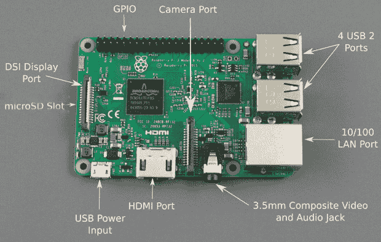

图 1.2 – 树莓派 3B

+   **树莓派 4**：于 2019 年 6 月发布，树莓派 4 标志着该系列的重大演变，在保持紧凑尺寸和性价比的同时，将单板计算机的能力推向了接近传统台式电脑的界限。Pi 4 的独特之处在于它提供的多种内存选项，包括 2 GB、4 GB 和 8 GB LPDDR4-3200 SDRAM，这比之前的 1 GB LPDDR2 RAM 有显著提升，使得多任务处理和数据密集型任务的处理更加流畅。改进的连接性包括千兆以太网、双频段 802.11ac Wi-Fi 和蓝牙 5.0。其多媒体能力通过两个支持 4K 分辨率的微型 HDMI 端口得到提升，允许同时操作两个显示器。树莓派 4 引入了两个 USB 3.0 端口以实现更快速的数据传输，并替换了微型 USB 电源连接器，采用了 USB-C，支持其增强功能。在 *图 1**.3* 中，我们可以看到树莓派 4 的布局，其中突出了其几个关键组件：

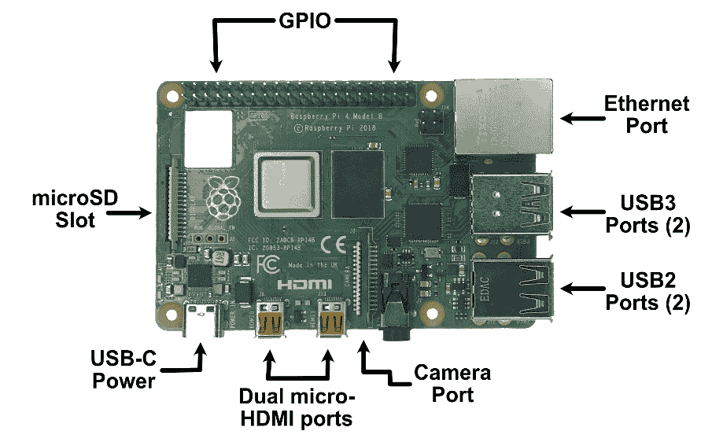

图 1.3 – 树莓派 4B

树莓派 4 包括两个微型 HDMI 端口（用于双显示器）、四个 USB 端口（两个 3.0，两个 2.0）、一个千兆以太网端口、一个 USB-C 电源端口、一个微型 SD 插槽、一个摄像头端口和一个 3.5mm 音频复合视频插孔。

+   **树莓派 5**：树莓派 5 于 2023 年 10 月发布，标志着该系列的重大进步，通过升级的 CPU 和 GPU，增强了教育和个人 DIY 应用的计算和多媒体能力。

    价格为 4 GB 60 美元和 8 GB 80 美元，Raspberry Pi 5 配备了 2.4GHz 四核 Arm Cortex-A76 CPU、VideoCore VII GPU、双 4Kp60 HDMI 输出，以及包括 Wi-Fi 和蓝牙在内的各种连接选项。它还引入了电源按钮、增强的内存和 I/O 功能，包括两个四通道移动行业处理器接口（MIPI）摄像头/显示屏收发器。这些收发器提供了连接任意组合的两个摄像头或显示屏的灵活性，使其非常适合高级多媒体项目。

    Raspberry Pi 5 还配备了 PCIe 2.0 x1 接口，允许连接快速外设，以扩展其在高级应用中的功能，例如高速网络或存储解决方案。

    伴随的 Raspberry Pi Active Cooler，凭借其高效的散热器和风扇设计，可将 CPU 温度降低约 20 摄氏度，这对于密集型任务至关重要。它提供易于安装，风扇速度高达 8000 RPM，增强性能和耐用性。在 *图 1**.4* 中，Raspberry Pi 5 与其 Active Cooler 并排展示，关键组件如 PCIe 2.0 接口、GPIO 头、USB 端口、以太网端口、双微 HDMI 端口和两个 MIPI 收发器被标注如下：

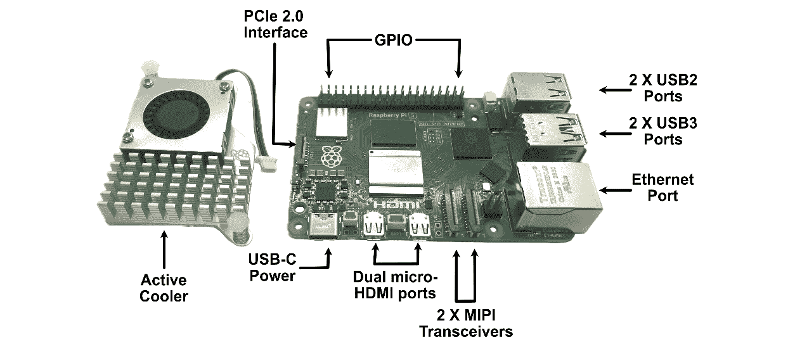

图 1.4 – Raspberry Pi 5（右侧）和 Raspberry Pi Active Cooler（左侧）

尽管新款 Raspberry Pi 4B 也足够使用，但我们将为涉及单板计算机的项目使用 Raspberry Pi 5。

+   **Raspberry Pi Zero 和 Zero W**：2015 年 11 月推出，Raspberry Pi Zero 将其尺寸缩小到仅为 65mm x 30mm。它以可承受的价格配备了 1 GHz 单核 CPU 和 512 MB 的 RAM，并配备了 mini-HDMI 端口、micro-USB OTG 端口、micro-USB 电源端口和 HAT 兼容的 40 引脚头，使其非常适合紧凑型应用，如物联网项目、可穿戴设备和嵌入式系统。Raspberry Pi Zero 2W 采用相同的形态设计，并于 2021 年推出。它配备了增强的 1 GHz 四核 ARM Cortex-A53 CPU，提高了性能并能够处理更复杂的工作。其内置 Wi-Fi 和蓝牙的无线功能进一步扩展了其多功能性，使其成为紧凑型项目的绝佳选择。*图 1**.5* 展示了 Raspberry Pi Zero 2W 的布局：

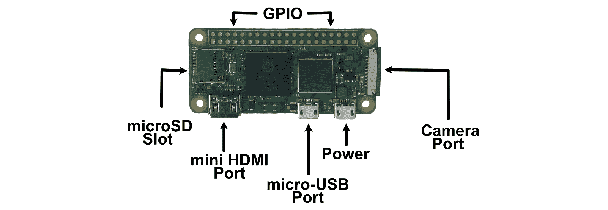

图 1.5 – Raspberry Pi Zero 2W

+   **Raspberry Pi Pico 和 Pico W**：2021 年 1 月推出，Raspberry Pi Pico 是一款紧凑型微控制器板，专为嵌入式项目和底层编程设计。其尺寸仅为 51mm x 21mm，但非常灵活。它支持**串行外设接口**（**SPI**）进行高速数据交换，**集成电路间接口**（**I2C**）用于外设之间的通信，以及**通用异步收发传输器**（**UART**）进行串行通信。Raspberry Pi Pico W 于 2022 年 2 月推出，通过板载 Wi-Fi 和蓝牙扩展了这种灵活性。与传统 Raspberry Pi 板不同，这两种 Pico 型号提供了一套独特的**通用**（**GP**）引脚。重要的是，Pico 系列作为微控制器而不是单板计算机，没有操作系统。这使裸机编程成为可能，在这种方法中，代码直接在硬件上运行，从而实现更快、更高效的代码执行和精确控制。这使得 Raspberry Pi Pico 等设备非常适合需要即时反应和与硬件紧密交互的应用，使其非常适合对时间敏感的任务。在*图 1*.*6*中，我们看到一个 Raspberry Pi Pico W 及其 GP 引脚的映射：

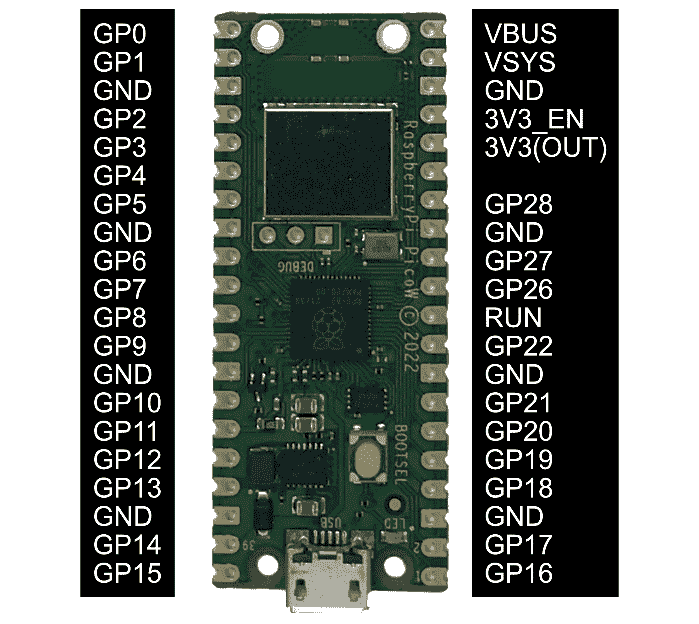

图 1.6 – Raspberry Pi Pico W

我们将在微控制器比单板计算机更适合的项目中使用 Raspberry Pi Pico 的变体。

以下是一个表格，概述了 Raspberry Pi 型号之间的一些差异：

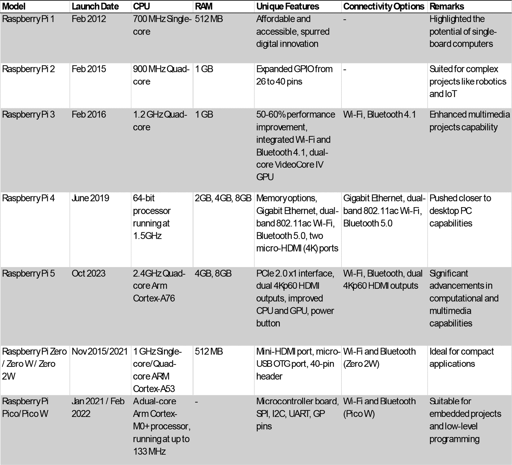

图 1.7 – Raspberry Pi 型号表

现在我们对 Raspberry Pi 设备的生态系统有了更好的了解，让我们来看看一些替代方案。

# 探索 Raspberry Pi 的替代方案

物联网（IoT）领域充满了各种单板计算机和微控制器，每种都提供独特的规格，以满足特定项目的需求。通过将这些替代方案与 Raspberry Pi 进行比较，我们可以就适合我们独特需求的理想平台做出明智的决定。以下是我们可能考虑用于我们的物联网项目的 Raspberry Pi 替代方案的概述。我们将只关注 Raspberry Pi，而不是 Raspberry Pi Pico，因为我们将在本章的编程项目中使用前者：

+   **BeagleBone Black**：BeagleBone Black 配备了 1GHz ARM Cortex-A8 处理器、512MB DDR3 RAM、4 GB 闪存和许多连接选项。其独特的特性是**可编程实时单元**（**PRUs**），允许进行精确的实时处理，非常适合机器人或工业自动化等应用。尽管如此，Raspberry Pi 因其更快的 1.5GHz 64 位四核处理器而仍然受欢迎，这对于资源密集型应用来说是有益的。然而，Raspberry Pi 的主要优势是其庞大的社区软件生态系统，这极大地帮助简化了开发。

+   **Arduino Uno**：与 Raspberry Pi Pico 一样，Arduino Uno 是一款微控制器而不是单板计算机。它使用 ATmega328P 微控制器，运行在 16 MHz，并具有 2 KB 的 RAM。Arduino Uno 以其易于使用的功能扩展盾而闪耀，包括 Wi-Fi、蓝牙和传感器功能，使其非常适合简单的物联网项目。它受益于广泛的生态系统和易于使用的**集成开发环境**（**IDE**）。然而，对于需要大量计算、多任务处理或大量数据处理的项目，更强大的 Raspberry Pi 是更好的选择。

+   **ESP32**：Espressif Systems 的 ESP32 是一款类似于 Arduino Uno 的微控制器，但具有独特的特性。其双核 Xtensa LX6 微处理器和 520 KB 的 SRAM，结合内置的 Wi-Fi 和蓝牙，为物联网应用提供了强大的无线连接。某些 ESP32 型号通过额外的传感器和通信协议进一步扩展了其潜力，例如用于长距离、低功耗通信的 LoRa。尽管它不匹配 Raspberry Pi 的处理能力和 RAM，但在优先考虑无线连接和低功耗使用的领域表现出色。其紧凑性和成本效益使其适用于从远程监控到家庭自动化和可穿戴设备的各种物联网项目。在*图 1*.8 中，我们看到一个集成了 LoRa 通信和**有机发光二极管**（**OLED**）屏幕的 ESP32（LoRa 板被屏幕覆盖）：


图 1.8 – 带有 OLED 屏幕和 LoRa 的 ESP32

+   **Arduino Nano RP2040 Connect**：Arduino Nano RP2040 Connect 的开发是为了将 Raspberry Pi 的 RP2040 微控制器集成到一个紧凑、功能丰富的 Arduino 板上，为物联网项目和嵌入式人工智能解决方案提供独特的性能和连接性结合。它结合了 RP2040 的双核处理能力、板载 Wi-Fi 和蓝牙、六轴 IMU、麦克风和 RGB LED，旨在提供无缝的物联网开发体验。它与 Arduino Cloud 平台的兼容性简化了项目管理，包括空中更新等功能。

现在我们已经探索了一些 Raspberry Pi 的替代方案，接下来我们将关注如何使用 HATs 来扩展 Raspberry Pi 的功能。

# 探索 HAT 的强大功能

Raspberry Pi HAT 是扩展 Raspberry Pi 功能的附加板，为各种应用提供广泛的功能。这些 HAT 通过添加传感器、执行器、显示屏、通信接口等功能，为增强 Raspberry Pi 的功能提供了一种简单方便的方式。在本节中，我们将探讨两个值得注意的 HAT：Pibrella HAT 和 Raspberry Pi Sense HAT。

## Pibrella HAT

Pibrella HAT 是一款优秀的入门级板，旨在向所有年龄段的用户介绍电子和编程概念。它具有按钮、LED 灯和蜂鸣器，为使用 Raspberry Pi 的物理计算项目提供实际操作体验。凭借其直观的界面和 Python 库，Pibrella HAT 为学习和原型设计提供了一个很好的起点。

尽管 Pibrella HAT 是为 Raspberry Pi 的第一版设计的，因此只有 26 针 GPIO 连接，但它仍然可以与当前 40 针版本的 Raspberry Pi 一起使用。我们可以在*图 1.9*中看到 Pibrella HAT 被连接到 Raspberry Pi 3B：

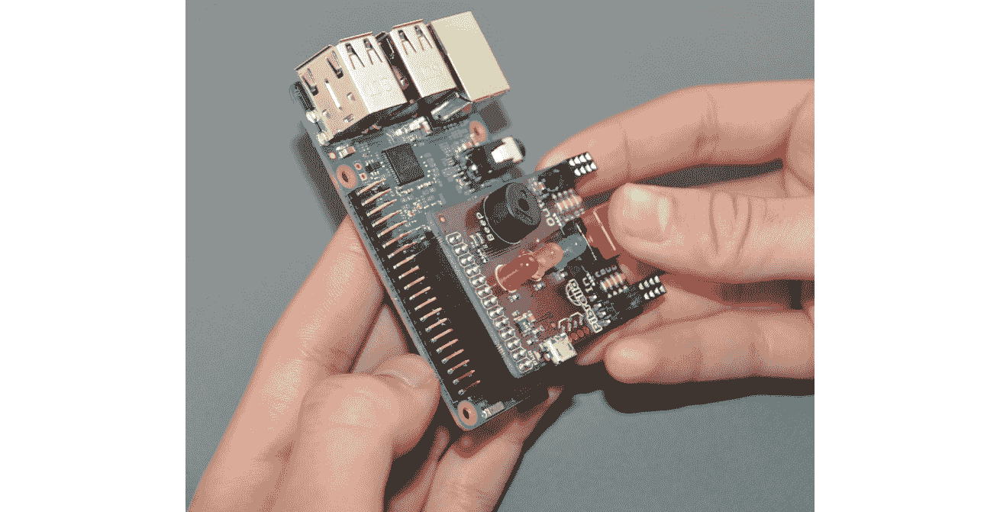

图 1.9 – 将 Pibrella 连接到 Raspberry Pi 3B

使用 Pibrella HAT，用户可以探索物理计算的基础，了解输入和输出交互，并通过使用 Raspberry Pi 获得编程的实际经验。

## Raspberry Pi Sense HAT

Raspberry Pi Sense HAT（如图*图 1.10*所示）是一款令人印象深刻的附加板，旨在增强 Raspberry Pi 在感应和环境监测应用方面的功能。配备了包括温度、湿度、压力、陀螺仪、加速度计和磁力计在内的各种传感器，Sense HAT 允许用户轻松地从周围环境中收集数据。其 LED 矩阵显示屏提供视觉输出，使用户能够显示实时信息，包括动画：

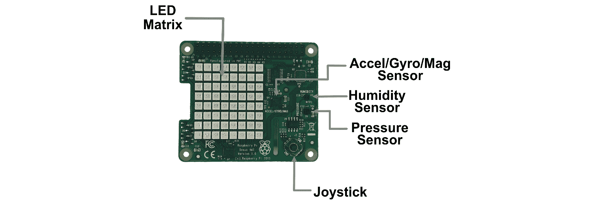

图 1.10 – Raspberry Pi Sense HAT

除了其广泛的应用范围，Sense HAT 还在 AstroPi 项目中发挥着至关重要的作用，该项目使学生能够在国际空间站上运行自己的实验。凭借其传感器和紧凑的形态，Sense HAT 是收集空间站中宝贵数据的理想选择。

在本章中，我们开始使用 Raspberry Pi 5 和 Sense HAT 编写代码。我们将编写代码以从 Sense HAT 的内置温度传感器获取当前温度，并将其作为滚动信息显示在 Sense HAT 的点阵显示屏上。

在我们这样做之前，我们将继续探索 Raspberry Pi，通过查看适用于 Raspberry Pi 的各种操作系统。

# 调查 Raspberry Pi 的操作系统

虽然官方的树莓派操作系统（以前称为 Raspbian）是树莓派最广泛使用的操作系统，但也支持各种其他操作系统。这些选项从为特定应用量身定制的专业系统，如包括 Volumio 在内的音频播放器，到更通用的系统，如 Ubuntu 和树莓派操作系统本身。在本节中，我们将探讨这些操作系统的选择及其独特功能。具体如下：

+   **Volumio**：对于我们这些希望构建可通过计算机或智能手机访问的网络音频系统的人来说，Volumio 是一个合适的选择。它将树莓派转换成一个无头音频播放器，使得键盘或鼠标变得不再必要。该系统通过 USB 或网络连接到我们的音频文件，并提供通过附加 HAT 增强音频输出质量的选择。值得注意的是，Volumio 包括 Spotify 插件，让我们可以通过音响系统流音乐。

+   **PiFM 无线电发射器**：这个系统图像将树莓派转换成一个 FM 发射器，向任何标准 FM 收音机广播音频文件。我们只需将一根线连接到 GPIO 引脚之一，就可以作为天线使用，从而产生一个令人惊讶的强大 FM 信号。

+   **Stratux**: Stratux 是一款开源航空软件，可以将树莓派转换成一个强大的**自动相关监视广播**（**ADS-B**）接收器。ADS-B 是一种现代航空标准，允许飞机与空中交通管制和其他飞机共享其位置、速度和其他飞行数据。通过在树莓派上安装 Stratux 并与额外的硬件配对，我们可以创建自己的 ADS-B 地面站。这使得我们能够接收附近飞机的实时数据，包括飞行轨迹、高度和速度。

+   **RetroPie**：对于我们这些游戏爱好者来说，RetroPie 将我们的树莓派转换成一个复古游戏机。它有效地模拟了包括 Amiga、Apple II、Atari 2600 和 20 世纪 80 年代初的任天堂娱乐系统在内的多个经典游戏机和计算机。

+   **OctoPi**：对于我们这些参与 3D 打印的人来说，OctoPi 将树莓派转换成一个 3D 打印服务器的服务器，通过网络连接远程提供控制和监控。 

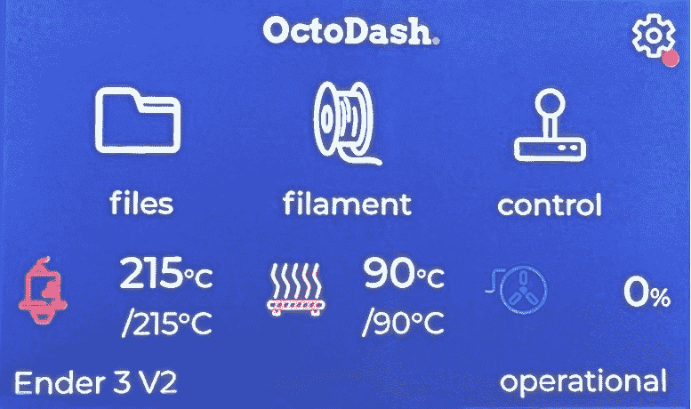

图 1.11 – OctoDash 主屏幕

OctoPi 的伴侣是**OctoDash**（如图 1.11 所示），一个触摸屏界面，提供了一个易于使用、视觉上吸引人的控制面板，用于管理和监控 3D 打印任务。使用 OctoPi 与 OctoDash 可以使与 3D 打印机的交互更加灵活和高效。

+   **Raspberry Pi 的 Ubuntu 操作系统**：Ubuntu 是一家领先的开放源代码 Linux 发行版公司，为 Raspberry Pi 提供了一个平台。Ubuntu 的关键优势之一是其与**机器人操作系统**（**ROS**）的兼容性，ROS 是一个适用于编写机器人软件的灵活框架。在 Raspberry Pi 上安装了 Ubuntu 的 ROS 后，我们可以参与从简单的爱好者项目到复杂的工业自动化系统在内的机器人项目。我们将从*第十一章*开始探索 ROS。

+   **Raspberry Pi 操作系统**：以前称为 Raspbian，Raspberry Pi 操作系统是 Raspberry Pi 上最广泛使用的操作系统，因为它具有直接的兼容性、轻量级设计和易于使用。专为 Raspberry Pi 量身定制，这个操作系统拥有丰富的教育软件和编程工具，因此与 Raspberry Pi 促进计算机科学和相关领域学习的使命相一致。使用 Raspberry Pi Imager 安装 Raspberry Pi 操作系统非常简单，这是一个简化将系统镜像烧录到 microSD 卡过程的工具。安装后，Raspberry Pi 操作系统提供图形用户界面以及一套全面的编程、互联网和多媒体应用程序，使其成为各种 Raspberry Pi 项目的多功能选择。

现在我们已经对 Raspberry Pi 可用的操作系统有了大致的了解，让我们探索在本书所基于的领域——物联网中使用 Raspberry Pi。

# 使用 Raspberry Pi 进行物联网

物联网革命性地改变了我们与技术互动的方式，使日常物品能够进行通信、自动化任务，并在互联网上生成有价值的用于数据。Raspberry Pi 是许多这些系统的核心。其多功能性和强大的处理能力使这款强大的单板计算机既能作为数据处理器，也能作为物理设备的控制器。

Raspberry Pi 独特地配备了 GPIO 引脚、USB 端口和 Wi-Fi 功能，它是实现物联网解决方案的经济高效且功能强大的工具。Raspberry Pi 在处理实时数据和硬件管理方面特别有价值。以下是一些基于 Raspberry Pi 的物联网系统示例。

## 利用网络服务进行物联网应用

在物联网应用中使用 Raspberry Pi 的一个独特优势是其处理实时数据并根据这些数据控制其他硬件元素的能力。当数据来自互联网时，这种能力尤其有用。这种设置的用途非常广泛，从环境监测到健康跟踪、交通管理等等。

以下示例介绍了一种此类应用的特定实例——一个基于 Raspberry Pi 的物联网系统，该系统根据当前的天气条件建议合适的服装（*图 1**.12*）：

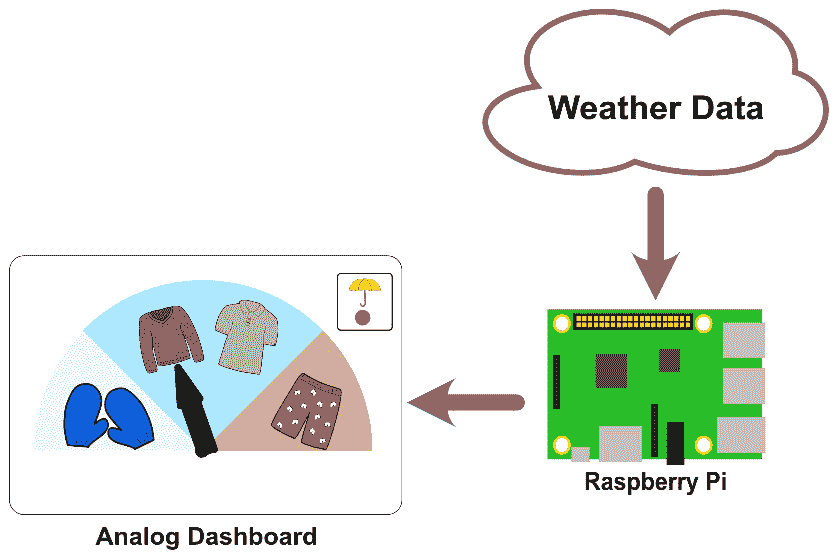

图 1.12 – 天气信息模拟仪表盘

在《物联网编程项目》的第一版中构建的应用程序，利用直观的模拟仪表盘根据天气条件建议适当的服装。它包括一个 LED，指示是否需要雨伞。

除了作为一个基于天气的应用程序之外，我们还可以修改这个由 Raspberry Pi 驱动的物联网解决方案，以适应各种需要从网络服务收集实时数据并将其表示为模拟数据和 LED 的应用。

这里有一些例子：

+   **交通密度监测器**：利用图 1.12 中描述的类似概念，此应用程序将收集来自城市交通监控 API 的实时交通数据。模拟仪表将显示当前的交通密度，LED 会闪烁以指示特定路线上的交通拥堵或拥堵。这允许通勤者选择最佳路线和时间出行。

+   **健康监控系统**：通过来自健康 API 或智能健康设备的数据，模拟仪表可以显示心率、血压或其他任何生命体征。LED 将作为异常值的即时视觉警报，如果需要，将提示立即进行医疗关注。

+   **水质监测器**：物联网设备可以连接到一个网络服务，该服务接收来自河流、湖泊或海洋中的水质传感器的数据。模拟仪表可以显示如 pH 值等指标，当读数表明可能存在危险条件时，LED 会闪烁。

+   **农业监测器**：连接到一个网络服务，该服务从农田中的传感器（如土壤湿度、温度等）中提取数据，模拟仪表可以显示当前条件，而 LED 可以指示灌溉条件成熟或存在霜冻风险。

超越仪表盘，Raspberry Pi 的强大功能在机器人领域特别有效。Raspberry Pi 作为这些系统的“大脑”，管理着诸如传感器数据分析、决策和电机控制等任务。物联网和机器人的集成在包括安全、自动化和监控在内的各个领域取得了重大进步。一个例子是 **T.A.R.A.S.**（代表 **This Amazing Raspberry-Pi Automated Security agent**），这是一个由 Raspberry Pi 和物联网原理驱动的自动化安全代理，如《物联网编程项目》第一版中所述。

## 重新介绍 T.A.R.A.S. – 一个基于物联网的机器人项目

T.A.R.A.S.，一个以作者的一位商业导师 Taras 命名的缩写词，作为自动化安全警卫。

这种物联网在机器人领域的应用展示了树莓派如何管理感知和运动功能。它使用 **消息队列遥测传输** (**MQTT**) 消息，一种轻量级的发布-订阅网络协议，使得设备之间能够实现无缝通信。我们可以在 *图 1**.13* 中看到 T.A.R.A.S. 的图形：

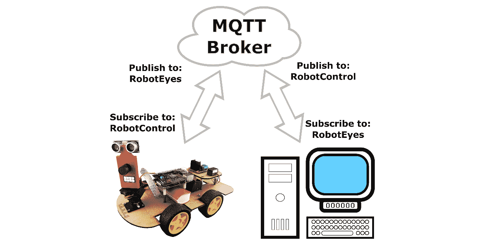

图 1.13 – T.A.R.A.S. 通过发送和接收 MQTT 消息在互联网上进行通信

除了感知输入、LED 和蜂鸣器输出外，T.A.R.A.S. 将物联网中的可能性动态范围封装起来。在上一版中，我们为 T.A.R.A.S. 建立了一个基于网页的控制器，整合了本书中学习到的众多技能。

在本版 *物联网编程项目* 中，我们将与 T.A.R.A.S. 说再见，因为他已经退休并离开了安全领域。我们将迎来 **A.R.E.S.**，或 **高级机器人安全眼**。这个名字是为了纪念作者心爱的已故爱犬。A.R.E.S. 通过结合视觉识别和 ROS，将把安全和移动性提升到一个新的水平。

# 开始使用树莓派进行开发

我们的树莓派可以作为强大的开发平台，非常适合各种编程环境。默认基于 Linux 的树莓派操作系统配备了 Python、Scratch 和许多其他工具，这些工具既适合初学者也适合经验丰富的程序员。由于其小型化设计，它在物联网项目和边缘计算中特别有效。作为开发者，我们可以用它进行软件开发、网站托管、家庭自动化项目和原型设计，使其成为创新的多功能和易于获取的工具。

在本书中，我们将使用树莓派开发物联网项目，特别是使用配备 8 GB RAM 的树莓派 5 以获得最佳性能。虽然其他版本的树莓派可能足够用，但配备 8 GB RAM 的树莓派 5 目前是最强大的型号。我们的项目将包括一系列令人兴奋的应用，包括模拟仪表的天气仪表盘、互联网连接的家庭安全系统、物联网远程监控站和我们的高级物联网机器人汽车 A.R.E.S.。在本章的剩余部分，我们将熟悉从树莓派 Sense HAT 读取感知数据。

在深入开发之前，熟悉可用于树莓派的开发工具至关重要。

## 树莓派开发工具

以下是我们树莓派项目中可用的开发工具范围。需要注意的是，并非所有这些程序都预装在树莓派操作系统上，可能需要手动安装：

+   **Python**: Python 是一种高级解释型通用编程语言。其简洁的语法和可读性使其非常适合初学者，同时其强大的库和多功能性也适合高级用户进行复杂项目。Python 预装在 Raspberry Pi OS 中。

+   **Thonny**: Thonny 是一个预装在 Raspberry Pi OS 中的 Python IDE。它对初学者来说易于使用，包括 **逐步调试** 和 **错误突出显示** 等功能。它也足够强大，适合高级用户，提供用于更复杂编码的综合工具。我们将在这本书的项目中使用 Thonny。

+   **Scratch**: Scratch 是一种面向儿童的基于块的视觉编程语言。使用 Scratch，孩子们可以在学习编程基础知识的同时创建动画和游戏。

+   **Greenfoot 和 BlueJ**: 这两种都是 Java 的 IDE。它们主要用于教育，旨在帮助初学者掌握面向对象编程。

+   **Mu** – 这是一个面向初学者的 Python 编辑器。它设计得简单易懂。

+   **Geany**: 它是一个轻量级且高度可定制的集成开发环境（IDE），支持包括 C、Java、PHP、HTML、Python、Perl 和 Pascal 在内的多种编程语言。

+   **Wolfram Mathematica 和 Wolfram 语言**: Wolfram 提供了一种高级编程语言和交互式环境，用于编程、数学可视化和通用计算。

+   **Node-RED**: 这是一个基于流程的开源可视化编程工具。Node-RED 允许访问 API 和在线服务。

+   **GCC 和 GDB**: **GNU 编译器集合**（**GCC**）（包括 gcc 和 g++）和 **GNU 调试器**（**GDB**）允许我们编译和调试用 C 和 C++ 等语言编写的代码。

除了这些，我们还可以使用 apt 软件包管理器从 Raspberry Pi OS 存储库安装其他软件开发工具，或者手动下载并安装它们。例如，我们可能想安装 Git 用于版本控制，Docker 用于容器化，或者 Visual Studio Code 用于更高级的开发环境。

Raspberry Pi 支持广泛的开发工具，满足各种编程需求。通过查看这些工具，我们强调了 Raspberry Pi 的适应性和创新项目的潜力。

## Raspberry Pi 和 Sense HAT 开发

通过学习如何为 Raspberry Pi Sense HAT 编写简单的代码，开始我们的物联网（IoT）开发之旅是一个很好的主意。Sense HAT 是一个出色的 IoT 设备，配备了各种传感器和 LED 矩阵显示屏，可以用来创建创新的应用程序。

对于我们的编码示例，我们将将树莓派 5 安全地安装在为本书特别设计的壳中。在图 1.14 中，我们可以看到我们将使用的壳的 CAD 渲染图。该外壳具有一个前盖，暴露了 Sense HAT 的点阵 LED 屏幕。它还包括一个圆形通风口，以确保壳内的热量适当散发。在壳的背面，我们集成了 GoPro 风格的钩子，这为我们提供了使用任何 GoPro 支架安装树莓派和 Sense HAT 的灵活性。构建外壳的文件可以从书籍的 GitHub 仓库中获取。使用标准 FDM 3D 打印机制作外壳应该是足够的；然而，使用液体树脂打印机和如 Siraya Tech Blu 等工程树脂可以获得更好的质量和耐用性。图 1.14 显示了组装好的外壳，其中打印的茎和底板取代了 GoPro 支架：

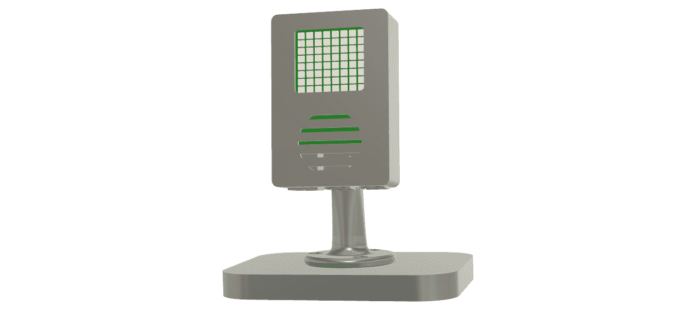

图 1.14 – 定制的 Raspberry Pi 5 Sense HAT 外壳

我们可以在书籍 GitHub 仓库中的“构建文件”文件夹内找到所有必要的 3D 打印文件（`.stl`文件）。值得注意的是，大多数树莓派外壳没有考虑到 HAT 的容纳空间，这使得我们的树莓派/Sense HAT 外壳成为本书的优秀配件。然而，重要的是要提到，外壳不是完成本书练习的必需品。此外，如果我们决定不购买 Sense HAT，我们仍然可以通过使用为 Raspberry Pi OS 提供的 Sense HAT 模拟器来运行示例。

在我们开始编写代码之前，我们将在我们的树莓派上设置开发环境。一旦我们的环境准备就绪，我们就会直接进入编码阶段。

让我们开始吧！

### 设置我们的开发环境

在本节中，我们将介绍为使用树莓派和 Sense HAT 进行开发而设置 Thonny 的过程。Thonny 是一个面向初学者的 IDE，它提供了一个用户友好的界面。使用 Thonny，我们可以轻松地编写、测试和调试我们的代码，从而让我们能够专注于开发过程，而不必处理不必要的复杂性。

我们将在我们的开发中使用 Python 虚拟环境。由于有一些库只能与 Python 的根安装一起工作，我们将在 Python 虚拟环境中使用系统包。为此，我们执行以下操作：

1.  在我们的树莓派 5 上，我们通过点击左上角菜单中的第四个图标来打开终端应用程序（如图 1.15 所示）：


图 1.15 – 打开终端应用程序（由红色箭头指示）

1.  为了存储我们的项目文件，我们使用以下命令创建一个新的目录：

    ```py
    mkdir Chapter1
    ```

1.  然后我们使用以下命令导航到新目录：

    ```py
    cd Chapter1
    ```

1.  我们使用以下命令为我们的项目创建一个新的 Python 虚拟环境：

    ```py
    ch1-env and enable access to the system site packages. This allows the virtual environment to inherit packages from the global Python environment, which can be useful when certain libraries are installed system wide. Once the environment is set up, we can activate it and begin installing project-specific packages without affecting the global Python environment.
    ```

1.  在我们创建新的 Python 虚拟环境后，我们使用以下命令将其源代码导入：

    ```py
    ch1-env Python virtual environment:
    ```


图 1.16 – 使用 ch1-env 环境的终端

1.  对于我们的项目，我们需要 Sense HAT 和 Sense HAT 模拟器库。Sense HAT 库已预安装在我们的 Python 虚拟环境中；然而，Sense HAT 模拟器需要通过终端命令手动安装：

    ```py
    pip install sense-emu
    ```

1.  安装 Sense HAT 模拟器库让我们可以使用实际的 Sense HAT 或 Sense HAT 模拟器运行代码。我们可以使用特定命令关闭终端：

    ```py
    exit
    ```

1.  现在，我们已经准备好加载 Thonny。我们通过点击 Raspberry Pi 任务栏中的 **菜单** 图标，导航到 **编程** 类别，并选择 **Thonny**（*图 1.17*）来完成此操作：


图 1.17 – Thonny IDE 界面

1.  默认情况下，Thonny 使用 Raspberry Pi 内置的 Python 版本（*图 1.17* 中的红色箭头）。对于我们的项目，我们将使用我们刚刚创建的 Python 虚拟环境。首先，我们需要通过点击 **查看** 并选择 **文件**（如果尚未选择）来查看项目文件（我们可能需要先通过点击屏幕右上角的 **切换到常规模式** 标签来切换到常规模式）。

1.  在 `ch1-env` 目录中。

1.  然后，我们右键单击文件夹并选择 **激活虚拟环境** 选项：

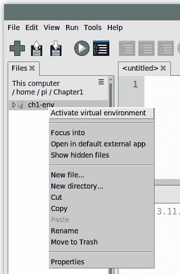

图 1.18 – 在 Thonny 中激活 ch1-env 虚拟环境

在创建项目文件夹、设置并激活 Python 虚拟环境以及安装 Sense HAT 模拟器包后，我们现在可以开始编写代码。

### Sense HAT 开发 – 读取传感器数据

我们第一个项目的目标是创建一个程序，从 Sense HAT 读取传感器信息并在 Thonny Shell 中显示它。然而，在我们能够读取感官信息之前，我们必须确保 Sense HAT 已经正确连接到我们的 Raspberry Pi。

首先，按照以下步骤操作：

1.  如果尚未运行，我们通过点击 `ch1-env` 虚拟环境（如果尚未激活）来启动 Thonny。

1.  然后，我们通过选择 **文件** 然后选择 **新建** 或通过按键盘上的 *Ctrl*+*N* 来创建一个新的标签页：

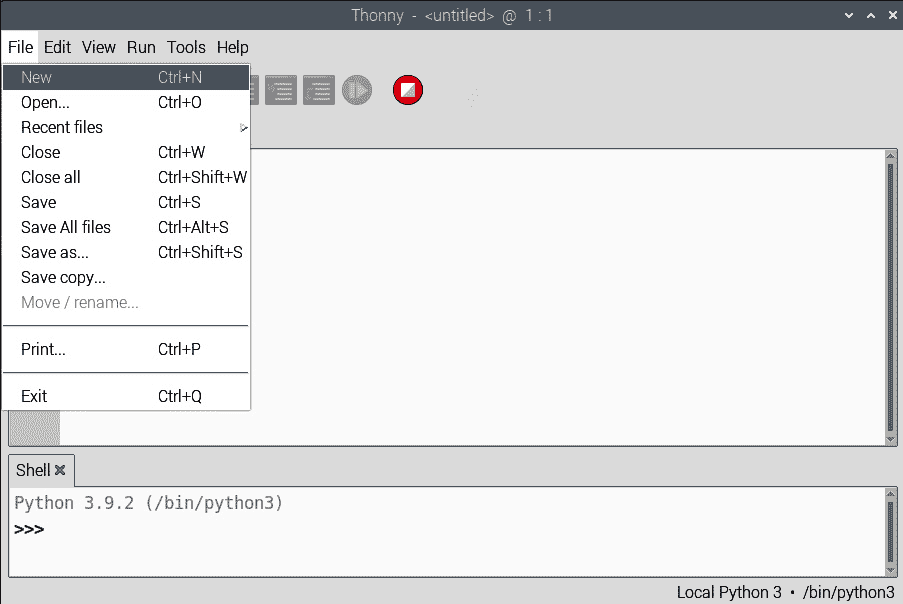

图 1.19 – 在 Thonny 中创建新文件

1.  在新标签页中，我们输入以下代码：

    ```py
    from sense_hat import SenseHat
    sense_hat = SenseHat()
    temp = sense_hat.get_temperature()
    humidity = sense_hat.get_humidity()
    press = sense_hat.get_pressure()
    accel = sense_hat.get_accelerometer_raw()
    gyroscope = sense_hat.get_gyroscope_raw()
    print("Temperature: {:.2f}°C".format(temp))
    print("Humidity: {:.2f}%".format(humidity))
    print("Pressure: {:.2f} millibars".format(press))
    print("Accelerometer Data: x={:.2f}, y={:.2f},  z={:.2f}".format(accel['x'], accel['y'], accel['z']))
    print("Gyroscope Data: x={:.2f}, y={:.2f}, z={:.2f}".format(gyroscope['x'], gyroscope['y'], gyroscope['z']))
    ```

1.  对于使用 Sense HAT 模拟器的我们来说，只需将代码的第一行更改为以下内容：

    ```py
    from sense_emu import SenseHat
    ```

    我们将代码保存为具有描述性的名称，例如 `sensor-test.py`。在我们运行代码之前，让我们将其分解以了解它：

    1.  我们首先从 `sense_hat` 库中导入 `SenseHat` 类。

    1.  创建了一个 `SenseHat` 类的实例，并将其分配给变量 `sense_hat`。

    1.  在 `sense_hat` 对象上调用 `get_temperature()` 方法以检索温度数据，并将其分配给 `temp` 变量。

    1.  在 `sense_hat` 对象上调用 `get_humidity()` 方法以检索湿度数据，并将其分配给 `humidity` 变量。

    1.  在 `sense_hat` 对象上调用 `get_pressure()` 方法以检索空气压力数据，并将其分配给 `press` 变量。

    1.  在 `sense_hat` 对象上调用 `get_accelerometer_raw()` 方法以检索原始加速度计数据，这包括 *x*、*y* 和 *z* 轴的值。数据被分配给 `accel` 变量。

    1.  在 `sense_hat` 对象上调用 `get_gyroscope_raw()` 方法以检索原始陀螺仪数据，这同样包括 *x*、*y* 和 *z* 轴的值。数据被分配给 `gyroscope` 变量。

    1.  然后使用 `print()` 函数和格式化字符串占位符 `{:.2f}` 以适当的格式打印出获得的数据，以显示两位小数的值。

1.  我们可以通过点击绿色的 **运行** 按钮、按键盘上的 *F5* 或者在顶部菜单中选择 **运行** 然后选择 **运行当前脚本** 来运行代码。

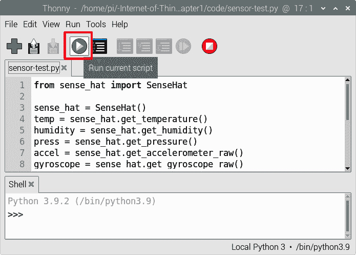

图 1.20 – 在 Thonny 中运行程序

运行代码后，我们应该在 Shell 中观察到如下信息：

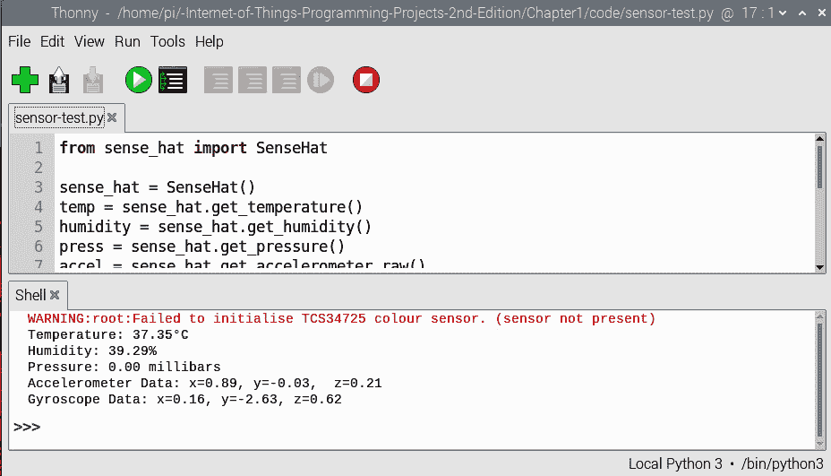

图 1.21 – 运行 sensor-test.py 后的结果

对于使用 Sense HAT 模拟器的我们来说，显示的值将由模拟器中设置的滑块值决定。

重要注意事项

我们可以忽略警告，因为 Sense HAT 不包括 TCS34725 颜色传感器。警告很可能是 Sense HAT Python 库内部问题引起的。我们的代码不受此警告的影响，可以继续按预期运行。

重要的是要注意，温度读数受到 Raspberry Pi 产生的热量影响，因此比实际室温要高。湿度读数也受到影响。然而，加速度计和陀螺仪的值准确地反映了 Sense HAT 的位置和方向，当外壳向不同方向旋转时可以观察到它们的变化。要查看加速度计和陀螺仪的更新值，必须在旋转外壳后再次运行代码。

现在我们已经学会了如何从 Sense HAT 读取感官数据，让我们将注意力转向点阵显示屏。在下一节中，我们将探讨如何使用点阵显示屏创建一个简单的动画。

### Sense HAT 开发 – 创建动画

在本节中，我们将使用 Sense HAT 和 Raspberry Pi 创建一个爆炸动画。我们将使用 Thonny 作为我们的开发环境来编写和执行代码。

首先，按照以下步骤操作：

1.  如果尚未运行，我们通过点击 `ch1-env` 虚拟环境（如果尚未激活）来启动 Thonny。

1.  然后，我们通过选择 **文件** 然后选择 **新建** 或按键盘上的 *Ctrl* + *N* 创建一个新的标签页。

1.  我们通过输入我们的导入语句开始我们的代码：

    ```py
    from sense_hat import SenseHat
    import time
    ```

    1.  我们从 `sense_hat` 库中导入 `SenseHat` 模块，使我们能够与 Sense HAT 板交互。

    1.  我们还导入了 `time` 模块，该模块将在我们的程序中用于添加延迟。

1.  然后，我们设置我们的变量声明：

    ```py
    sense_hat = SenseHat()
    R = [255, 0, 0]  # Red
    O = [255, 165, 0]  # Orange
    Y = [255, 255, 0]  # Yellow
    B = [0, 0, 0]  # Black
    frame1 = [
    B, B, B, B, B, B, B, B,
    B, B, B, B, B, B, B, B,
    B, B, B, R, R, B, B, B,
    B, B, R, R, R, R, B, B,
    B, B, R, R, R, R, B, B,
    B, B, B, R, R, B, B, B,
    B, B, B, B, B, B, B, B,
    B, B, B, B, B, B, B, B
    ]
    frame2 = [
    B, B, Y, O, O, Y, B, B,
    B, Y, O, R, R, O, Y, B,
    Y, O, R, Y, Y, R, O, Y,
    O, R, Y, B, B, Y, R, O,
    O, R, Y, B, B, Y, R, O,
    Y, O, R, Y, Y, R, O, Y,
    B, Y, O, R, R, O, Y, B,
    B, B, Y, O, O, Y, B, B
    ]
    frame3 = [
    O, R, R, Y, Y, R, R, O,
    R, Y, O, O, O, O, Y, R,
    Y, O, B, B, B, B, O, Y,
    O, B, B, B, B, B, B, O,
    O, B, B, B, B, B, B, O,
    Y, O, B, B, B, B, O, Y,
    R, Y, O, O, O, O, Y, R,
    O, R, R, Y, Y, R, R, O
    ]
    frames = [frame1, frame2, frame3]
    ```

    1.  我们创建了一个名为 `sense_hat` 的 SenseHAT 类实例，使我们能够访问 Sense HAT 的功能。

    1.  我们为红色、橙色、黄色和黑色定义了颜色值，这些颜色值将用于创建我们的动画。

    1.  我们创建了一个名为 `frame1` 的颜色值列表，代表 LED 矩阵上期望的图像。

    1.  我们定义了 `frame2` 和 `frame3` 作为额外的帧。

    1.  我们创建了一个名为 `frames` 的列表，按照特定顺序保存定义的帧。

1.  为了使我们的动画持续运行，我们设置了一个无限循环：

    ```py
    while True:
        for frame in frames:
            sense_hat.set_pixels(frame)
            time.sleep(0.5)
        sense_hat.clear()
        time.sleep(0.2)
    ```

    1.  在循环中，我们遍历 `frames` 列表中的每一帧。

    1.  我们使用 `sense_hat.set_pixels(frame)` 将 LED 矩阵的像素设置为当前帧，显示相应的图像。

    1.  我们使用 `time.sleep(0.5)` 添加了一个短暂的 0.5 秒暂停，以控制动画速度。

    1.  在显示所有帧后，我们使用 `sense_hat.clear()` 清除 LED 矩阵，为下一次迭代做准备。

    1.  在再次启动动画循环之前，我们使用 `time.sleep(0.2)` 添加了 0.2 秒的轻微延迟，从而创建了爆炸图案。

1.  对于使用 Sense HAT 模拟器的我们，只需将第一行代码更改为以下内容，并在我们的 Raspberry Pi 上打开 Sense HAT 模拟器：

    ```py
    from sense_emu import SenseHat
    ```

1.  我们将代码保存为具有描述性名称的文件，例如 `animation-test.py`。

    我们通过点击绿色 **运行** 按钮、按键盘上的 *F5* 或点击顶部的 **运行** 菜单选项然后选择 **运行当前脚本** 来运行代码。我们应该在我们的 Sense HAT 或 Sense HAT 模拟器上观察到爆炸动画：

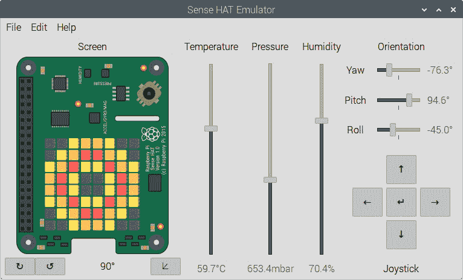

图 1.22 – Sense HAT 模拟器上的爆炸动画帧

在本节中，我们探讨了使用 Sense HAT 和 Raspberry Pi 创建动画。我们学习了如何编写代码在 LED 矩阵上显示一系列帧，从而实现爆炸动画。在本章的最后一个编程项目中，我们将创建 Sense HAT 点矩阵屏幕上的滚动消息。这条消息将动态显示温度、湿度和空气压力数据，以视觉吸引力的方式为我们提供有价值的环保见解。

### Sense HAT 开发 – 创建滚动环境数据显示

在我们之前的项目基础上，我们在 Sense HAT 上读取传感数据并创建 LED 矩阵动画方面积累了经验，现在我们将深入创建一个使用 Sense HAT 的点阵显示屏的滚动文本应用程序。

首先，按照以下步骤操作：

1.  如果尚未运行，我们通过点击 `ch1-env` 虚拟环境（如果尚未激活）来启动 Thonny。

1.  通过选择 **文件** 然后选择 **新建** 或者在键盘上按 *Ctrl* + *N* 来创建一个新的标签页。

1.  我们首先导入我们需要的库：

    ```py
    from sense_hat import SenseHat
    import time
    ```

    1.  我们从 `sense_hat` 库中导入 `SenseHat` 模块，使我们能够与 Sense HAT 板进行交互。对于使用 Sense HAT 模拟器的我们，我们会使用 `sense_emu` 库。

    1.  我们还导入了 `time` 模块，它将在我们的程序中用于添加延迟。

1.  然后，我们在代码中设置变量声明：

    ```py
    sense_hat = SenseHat()
    speed = 0.05
    sense_hat.set_rotation(270)
    red = [255, 0, 0]
    green = [0, 255, 0]
    ```

    1.  我们创建了一个名为 `sense_hat` 的 `SenseHAT` 类的实例。

    1.  我们使用变量 `speed` 设置 LED 矩阵上消息的滚动速度。

    1.  行 `sense_hat.set_rotation(270)` 调整 Sense HAT 的 LED 矩阵的方向，使其与定制外壳中的 Raspberry Pi 的方向相匹配。

    1.  我们定义了两个颜色变量，`red` 和 `green`，用于文本颜色。

1.  为了使滚动消息持续播放，我们创建了一个无限循环：

    ```py
    while True:
        sense_hat.show_message("Temperature: %.1fC, " %
                       sense_hat.get_temperature(),
                       scroll_speed=speed,
                       text_colour=green)
        sense_hat.show_message("Humidity: %.1f%%, " %
                       sense.get_humidity(),
                       scroll_speed=speed,
                       text_colour=green)
        sense_hat.show_message("Pressure: %.1fhPa" %
                       sense.get_pressure(),
                       scroll_speed=speed,
                       text_colour=red)
        time.sleep(1)
    ```

    在无限循环中，我们执行以下操作：

    1.  我们在 LED 矩阵上显示温度读数，格式化为一位小数。

    1.  我们在 LED 矩阵上显示湿度读数，格式化为一位小数。

    1.  我们在 LED 矩阵上显示压力读数，格式化为一位小数。

    1.  在循环的下一迭代之前，我们暂停一秒钟。

1.  我们使用描述性的名称，如 `sensor-scroll.py` 来保存代码。

1.  通过点击绿色 **运行** 按钮，按键盘上的 *F5*，或者在顶部菜单中选择 **运行** 然后选择 **运行当前脚本** 来运行代码。

    我们应该观察到在 Sense HAT 的点阵屏幕（或 Sense HAT 模拟器）上显示的滚动消息。

在这个练习中，我们在 Sense HAT 上创建了一个滚动文本应用程序，显示实时环境数据。这个项目增强了我们在传感器数据采集和视觉展示方面的技能，使用 Sense HAT 的 LED 矩阵进行有效的数据可视化。完成这个最终章节项目后，我们现在可以应对使用 Sense HAT 和 Raspberry Pi 的更高级的物联网应用了。

# 摘要

在本章中，我们开始了我们的物联网项目之旅，使用 Raspberry Pi。我们探讨了各种 Raspberry Pi 型号、它们的独特特性和在物联网开发中的重要性。我们简要地看了看 Raspberry Pi 在物联网应用中的替代品，并探讨了 Raspberry Pi HAT，如 Pibrella HAT 和 Raspberry Pi Sense HAT。

此外，我们还研究了与官方树莓派操作系统兼容的操作系统，包括树莓派操作系统。我们强调了树莓派在物联网应用中的多功能性和强大功能，强调其处理实时数据和控制物理设备的能力。本章还介绍了树莓派作为一个强大的开发平台，配备了预安装的软件开发工具。

在本章结束时，我们进行了实际编程项目，利用 Sense HAT 并探索其在物联网应用中的潜力。这些项目包括一个滚动环境数据显示，提供了提取感官信息的动手经验，并创建动态视觉显示。

本章为我们提供了在开发物联网项目时可能使用的知识，以便做出明智的选择。了解不同树莓派型号和替代方案的优势，使我们能够为特定应用选择正确的设备。熟悉树莓派 HAT 和各种操作系统扩展了我们的工具箱。在本章中，我们通过了解其数据和控制能力，释放了树莓派的潜力。我们的 Sense HAT 实践为我们未来更复杂的项目做好了准备。

展望未来，在下一章中，我们将利用网络服务的力量，继续构建更复杂的物联网应用。
