# 第二章：利用树莓派利用网络服务

在本章中，我们将开始编写用于网络服务的代码，将我们的树莓派变成一个**物联网**（**IoT**）设备。使用 Python，我们将设计程序从在线资源中提取数据，并使用这些数据在 Sense HAT 的点阵显示屏上创建视觉。本章中我们将涵盖的实用示例将作为更高级物联网网络服务开发的基石。

我们首先探索网络服务的世界——了解它们的作用以及我们如何利用它们来获得优势。我们可能会把网络服务视为互联网的生命线，在数字世界中循环传递重要数据。理解网络服务不仅仅是把另一个工具添加到我们的工具箱中；它是关于解锁一个充满无限潜力的世界。

随着我们不断进步，我们将通过一系列编程项目将理论知识转化为实际应用。这些项目专门设计用于利用 Alpha Vantage 和 OpenWeather 等提供商提供的先进网络服务。使用多功能的树莓派 Sense HAT 或其模拟器，我们将构建包括滚动股票行情、天气信息显示，甚至为青少年棒球比赛提供 GO-NO-GO 决策器的应用程序。这些项目不仅教会我们如何使用技术；它们让我们沉浸在物联网的基本原理中。

考虑一下，随着网络服务和树莓派的出现，前方等待我们的广阔机会。今天，我们从简单的股票行情开始。明天，我们可能会开发出一种设备，在最喜欢的球队得分或帮助我们导航交通时通知我们。这一章节是我们探索更广阔、更激动人心的物联网创新宇宙的第一步。

在本章中，我们将涵盖以下主题：

+   探索网络服务

+   创建滚动股票行情应用程序

+   开发天气显示应用程序

让我们开始吧！

# 技术要求

完成本章需要以下内容：

+   一台带有 4 GB 或 8 GB RAM 的 Raspberry Pi 5（首选）；然而，可以使用最新型号的 Raspberry Pi，如 Raspberry Pi 4。

+   树莓派 Sense HAT（可以使用 Raspberry OS 模拟器代替）。

+   键盘、鼠标和显示器。

+   获取 3D 打印机或定制展台的 3D 打印服务。

+   本章的 GitHub 仓库位于[`github.com/PacktPublishing/-Internet-of-Things-Programming-Projects-2nd-Edition/tree/main/Chapter2`](https://github.com/PacktPublishing/-Internet-of-Things-Programming-Projects-2nd-Edition/tree/main/Chapter2)。

+   对编程的一般了解。在这本书中，我们将使用 Python 编程语言。

# 探索网络服务

想象一下从我们的智能手机远程控制我们家的设备——这种惊人的便利是由网络服务提供的，无形的信息使者无缝连接我们的数字世界。

网络服务是当今互联网基础设施的重要组成部分。它们允许不同软件应用程序通过网络无缝交换数据。因此，它们是物联网应用，包括我们的树莓派物联网项目的一个基本工具。有了网络服务，我们可以利用在线数据的丰富资源，并通过我们的树莓派将其带入物理世界。

在本质上，网络服务是软件接口，它使一个软件系统能够通过网络与另一个系统交互。这种交互通常是通过特定的协议完成的，例如**表示状态转移**（**REST**）或**简单对象访问协议**（**SOAP**）。为了了解网络服务的强大功能，可以考虑*图 2.1*中所示的一个服务示例，该服务提供医院病房中患者的关键感官数据：


图 2.1 – 客户端应用程序从 FHIR 网络服务接收数据

在这里，我们看到一个表示**快速健康互操作性资源**网络服务的图表。**FHIR**（发音为“fire”）是由**国际健康水平七组织**（**HL7**）制定的标准，用于医疗保健信息的电子交换。像 FHIR 这样的网络服务提供通用可访问性，使医疗保健专业人员能够随时随地访问和共享患者数据。它们提供优越的互操作性，比本地网络的**应用程序编程接口**（**API**）调用更高效、更实用，尤其是在需要在不同系统和设备之间共享数据的医疗保健领域。

在本节中，我们将探讨网络服务使用的协议。在我们编写代码调用简单的网络服务之前，我们还将探索一些更受欢迎的网络服务。

## 理解网络服务的方法

在网络服务领域，两种突出的方法是 REST 和 SOAP 协议。RESTful 网络服务明确使用 HTTP 方法，更加直接和高效，因此成为许多开发者的首选。另一方面，SOAP 是一种允许在隔离系统中运行的程序通过 HTTP 及其基于 XML 的消息系统进行通信的协议。SOAP 具有高度的扩展性，并且对安全和可靠性有强大的支持，使其适合复杂的应用程序。

在我们即将到来的项目中，我们将主要利用 REST 与网络服务进行交互。然而，了解 SOAP 提供了对网络服务交互领域的更广泛视角。我们将首先探索 SOAP、其功能及其适用场景，然后再深入研究基于 REST 或 RESTful 的网络服务。

### 使用 SOAP 网络服务

要理解 SOAP，我们关注**图 2.2**中展示的定制排序系统。由于这个系统是为特定公司的业务操作内部构建的，因此它是一个复杂的企业级应用，在安全性和可靠性方面有显著要求。这个排序系统代表了基于 SOAP 的网络服务的理想用例：

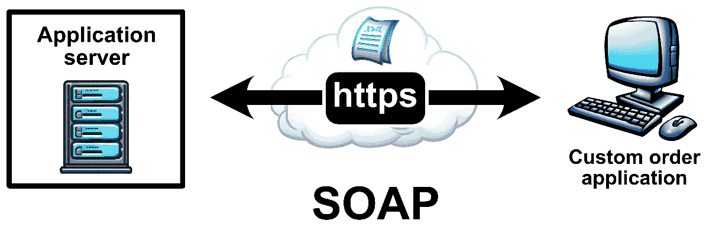

图 2.2 – 使用 SOAP 连接服务器的定制排序应用程序

由于 SOAP 具有有状态的性质，应用程序可以管理涉及多个步骤的复杂事务管理，包括库存检查、支付处理到订单确认。SOAP 协议内置的安全功能和错误处理功能使得应用程序能够高效且安全地管理订单。

如**图 2.2**所示，在 SOAP 事务中，一个 XML 文件通过 HTTPS 传递。这个 XML 文件位于 SOAP 消息中，在通信中扮演着至关重要的角色。它携带详细的指令，指导服务器执行操作。XML 的结构化格式使得复杂的数据交换成为可能，即使是在可能具有不同数据格式的各种系统之间，定制的排序系统也能无缝交互。

如果 SOAP 是企业级应用的首选方法，那么 REST 则更适用于公共网络服务。REST 的简洁性、轻量级特性、可扩展性和面向资源的处理方式使其非常适合创建用户友好且可扩展的网络服务，这些服务通过标准的 HTTP 协议与资源进行交互。

### 探索 RESTful 网络服务

RESTful 网络服务是现代网络应用的关键组成部分，它允许客户端和服务器使用 REST 架构进行高效的通信。RESTful 网络服务使用 HTTP 方法如`GET`、`POST`、`PUT`和`DELETE`与资源进行交互，并且是无状态的。与通常使用 XML 的 SOAP 不同，RESTful 服务可以支持多种数据格式，包括 JSON 和 XML。这种灵活性通常导致人们认为 RESTful 服务比 SOAP 更易于使用且更具适应性。

几个广为人知的公共 RESTful 网络服务因其功能性和易用性而受到欢迎。其中之一是`Twitter` API，它允许开发者访问和交互核心 Twitter 数据，包括时间线、状态更新和其他信息。另一个值得注意的例子是 Google Maps API，它为开发者提供了在网页上使用 JavaScript 嵌入 Google Maps 的能力。

在**图 2.3**中，我们看到一个简化图，展示了 RESTful 网络服务使用`GET`、`POST`、`PUT`和`DELETE` HTTP 方法与网页进行通信。这些 HTTP 方法中的每一个都对应于与服务器交互的特定类型：

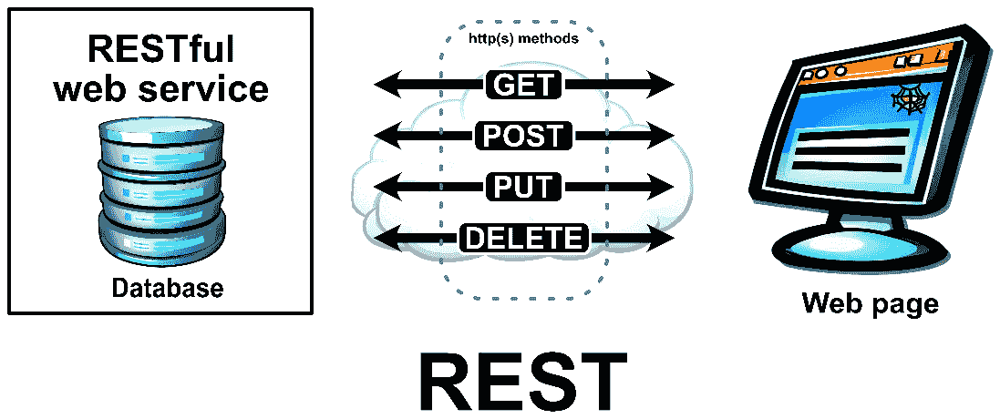

图 2.3 – RESTful Web 服务的简化图

`GET`方法检索现有数据，`POST`通常用于发送新数据以创建资源，`PUT`用于更新现有资源，而`DELETE`用于删除数据。

API 与 Web 服务的区别

我们可能会发现自己交替使用*API*和*Web 服务*这两个术语；然而，它们之间是有区别的。**API**是一个广泛的术语，定义了构建和与软件应用程序交互的规则和约定。API 可以在各种渠道上运行，而不仅仅是 Web。然而，**Web 服务**是一种特定的 API 类型，它通过互联网运行，通常使用 HTTP 等协议。本质上，所有 Web 服务都是 API，但并非所有 API 都是 Web 服务。

以 Twitter API 为例，我们可以为其开发客户端的 Web 服务，这些 HTTP 方法的运用如下：

+   `GET`：我们会使用这种方法从 Twitter 检索数据。例如，我们会使用`GET`请求来获取特定用户的推文或搜索包含特定标签的推文。

+   `POST`：当我们想在 Twitter 上创建新数据时，例如一条新推文，我们会使用这种方法。

+   `PUT`：我们不会使用这种方法，因为 Twitter API 原生不支持`PUT` HTTP 方法。

+   `DELETE`：我们会使用`DELETE`方法来删除 Twitter 上的现有数据。然而，由于 Twitter 的政策限制，删除功能有限，这种方法在 Twitter API 中并不常用。

我们可以在以下表格中看到 REST 方法概述：

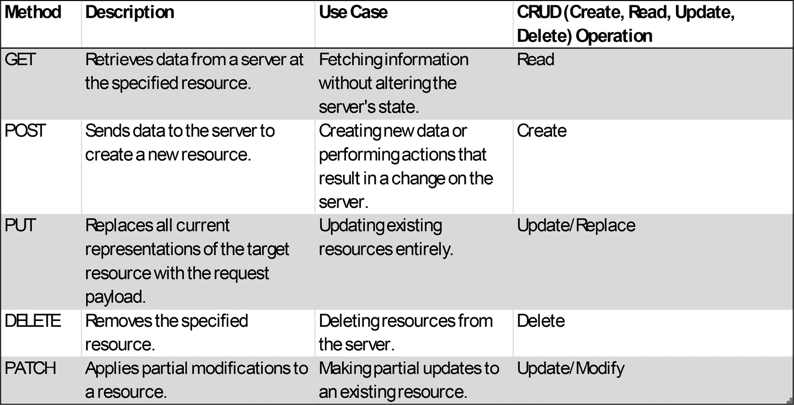

图 2.4 – REST 方法概述

总结来说，REST 是一种简单直接的方法，它利用标准的 HTTP 或 HTTPS 方法，如`PUT`、`POST`、`GET`和`DELETE`，同时在数据格式方面提供灵活性，例如**JavaScript 对象表示法**（**JSON**）或 XML，而 SOAP 是一种通常使用 XML 来传输结构化消息的协议，并且可以在各种**互联网协议**（**IP**）套件网络，如 HTTP 或 HTTPS 上运行。

现在我们已经对 Web 服务和它们的实现方式有了基本的了解，让我们通过使用我们的 Raspberry Pi 和 Sense HAT 来创建一个现实世界的示例。

## 使用我们的 Raspberry Pi 和 Sense HAT 连接到 Web 服务

在本节中，我们将把我们的 Raspberry Pi 连接到 Web 服务，并在 Sense HAT（或模拟器）的点阵屏幕上显示结果。我们将连接到的服务将是一个虚拟 Web 服务，旨在评估 RESTful Web 服务的调用。

在**图 2.5**中，我们看到一个 Raspberry Pi 从 Web 服务中提取天气信息，并使用 Sense HAT 的点阵显示屏显示云图的示例：

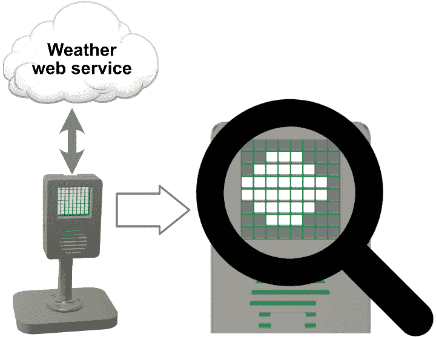

图 2.5 – Sense HAT 显示表示当前天气状况的云图

云代表当前的天气状况（不要与代表 Web 服务的云混淆）。这样的应用程序可以在点阵屏幕上显示动画。我们甚至可以替换天气 Web 服务为另一个 Web 服务，并创建一个全新的应用程序，利用现有的代码轻松实现。

在创建 Web 服务客户端之前，我们需要设置我们的开发环境并安装代码运行所需的必要包。我们将整合一个 Python 虚拟环境来完成这一任务。

### 设置我们的开发环境

我们将为我们的开发使用 Python 虚拟环境。由于有一些库只与 Python 的根安装版本兼容，我们将在 Python 虚拟环境中使用系统包。为此，我们执行以下操作：

1.  在我们的树莓派 5 上，我们打开一个终端应用程序。

1.  为了存储我们的项目文件，我们使用以下命令创建一个新的目录：

    ```py
    mkdir Chapter2
    ```

1.  然后，我们使用以下命令导航到新目录：

    ```py
    cd Chapter2
    ```

1.  我们使用以下命令为我们的项目创建一个新的 Python 虚拟环境：

    ```py
    ch2-env and enable access to the system site packages. This allows the virtual environment to inherit packages from the global Python environment, which can be useful when certain libraries are installed system wide. Once the environment is set up, we can activate it and begin installing project-specific packages without affecting the global Python environment.
    ```

1.  在我们创建新的 Python 虚拟环境后，我们使用以下命令将其源码导入（设置 Python 虚拟环境）：

    ```py
    ch2-env Python virtual environment:
    ```

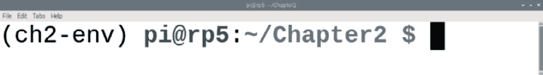

图 2.6 – 使用 ch2-env 环境的终端

1.  我们使用以下命令安装代码所需的额外包：

    ```py
    requests library in Python simplifies making HTTP requests to web servers, and the sense-emu library will give us the Sense HAT emulator to work with for our code. With the libraries installed, we may close the Terminal with the following command:

    ```

    退出

    ```py

    ```

1.  现在，我们已经准备好加载 Thonny。我们通过点击树莓派任务栏中的**菜单**图标，导航到**编程**类别，并选择**Thonny**来完成这一操作。

1.  默认情况下，Thonny 使用树莓派内置的 Python 版本。对于我们的项目，我们将使用我们刚刚创建的 Python 虚拟环境。首先，我们需要通过点击**查看**并选择**文件**来查看项目文件（如果尚未选择）。

1.  在**文件**部分，我们定位到`ch2-env`目录。

1.  然后，我们右键点击文件夹并选择**激活虚拟环境**选项：

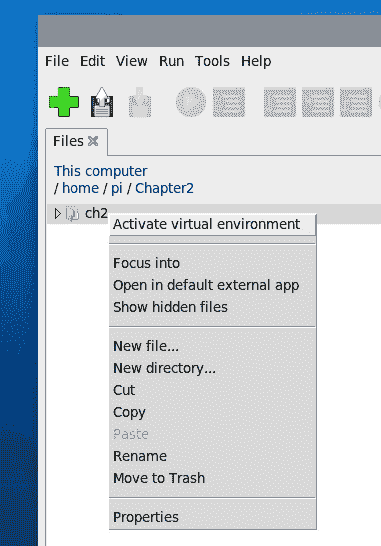

图 2.7 – 在 Thonny 中激活 Python 虚拟环境

在我们创建项目文件夹、设置并激活 Python 虚拟环境，以及安装了`requests`包之后，我们现在可以开始编写代码。

### 编写我们的第一个 Web 服务代码

现在，我们已经准备好编写我们的第一个 Web 服务代码。此代码将对一个用于测试的虚拟 Web 服务进行调用。在成功传输后，成功信息将在我们的 Sense HAT 的点阵屏幕上滚动显示：

1.  为了创建我们的 Web 服务应用程序，在 Thonny 中我们创建一个新的标签页。在标签页内，我们编写以下代码：

    ```py
    import requests
    from sense_hat import SenseHat
    response = requests.get(
        'https://jsonplaceholder.typicode.com/posts'
        )
    sense = SenseHat()
    sense.set_rotation(270)
    if response.status_code == 200:
        data = response.json()
        print(data[0]['title'])
        success_msg = 'Success with code: '
        success_msg += str(response.status_code)
        sense.show_message(success_msg)
    else:
        error_msg = 'Failed with code: '
        error_msg += str(response.status_code)
        print(error_msg)
        sense.show_message(error_msg)
    ```

1.  在我们运行代码之前，让我们将其分解：

    1.  我们首先导入`requests`库，这是 Python 中用于发送 HTTP 请求的流行库。

    1.  我们从 `sense_hat` 库中导入 `SenseHat` 类，使我们能够与 Sense HAT 板交互。对于使用 Sense HAT 模拟器的我们，我们会使用 `sense_emu` 库。

    1.  我们向指定的 URL 发送 `GET` 请求（`'https://jsonplaceholder.typicode.com/posts'`），这是一个提供 JSON 格式占位符数据的虚拟 API 的端点。服务器的响应存储在 `response` 变量中。

    1.  我们创建了一个 `SenseHat` 类的实例。我们使用这个对象来控制 Sense HAT 的点阵显示屏。

    1.  `sense.set_rotation(270)` 这一行调整了 Sense HAT 的 LED 矩阵的方向，使其与我们的定制 Raspberry Pi 案例中的 Raspberry Pi 方向相匹配（有关定制 Raspberry Pi 案例的信息，请参阅 *第一章*）。

    然后，我们的代码检查 HTTP 响应的状态码：

    +   如果状态码是 `200`，这表示一个成功的 HTTP 请求，那么接下来会发生以下情况：

        +   `data = response.json()`: 我们的代码将 JSON 响应体转换为 Python 数据结构。

        +   `print(data[0]['title'])`: 我们的代码将响应数据中的第一篇帖子的标题打印到 Thonny 的 Shell 中。

        +   我们的代码在 Sense HAT 的 LED 矩阵上显示一个成功消息，指示成功的状态码。

    +   如果状态码不是 `200`，这表示一个不成功的 HTTP 请求，以下情况会发生：

        +   我们的代码将错误消息打印到 Shell，指示不成功的状态码。

        +   我们的代码在 Sense HAT 的 LED 矩阵上显示一个失败消息，指示不成功的状态码。

1.  我们将代码保存为 `webservice-test.py`，然后通过点击顶部的绿色运行按钮、按键盘上的 *F5* 或者在顶部的 **运行** 菜单选项中然后点击 **运行** **当前脚本** 来运行它。

1.  在成功完成网络服务调用（对于这个虚拟服务来说是预期的）后，我们应该在 Shell 中看到以下标题打印出来：

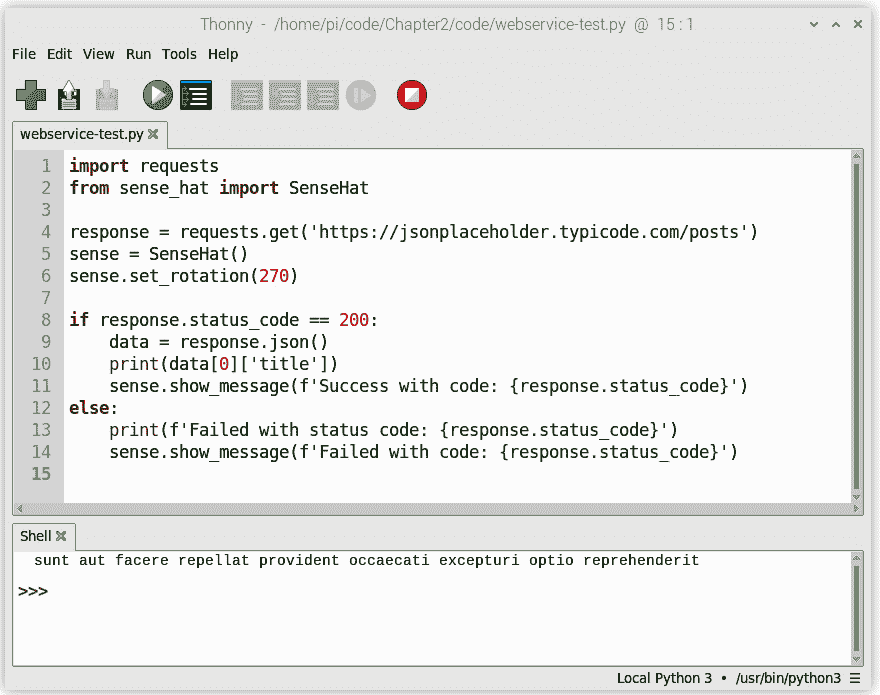

图 2.8 – 使用 Thonny 测试网络服务调用

1.  我们不应该过分关注标题的内容，因为它只是占位符数据。随后，在成功完成网络服务调用后，我们应该在 Sense HAT 显示屏（或模拟器）上观察到滚动消息。这条消息表示我们的调用状态成功，应该用 `200` HTTP 状态码表示。

虽然我们的代码缺少错误检查，但我们已经成功构建了我们第一个由 Raspberry Pi 驱动的物联网设备。需要注意的是，像互联网连接这样的考虑因素并没有包含在我们的简单代码中。

在本章的剩余部分，我们将把我们的物联网设备从简单的网络服务测试工具提升到一个更具吸引力的工具。我们将承担两个令人兴奋的项目：构建股票行情应用和基于天气的 GO-NO-GO 决策应用。

# 创建一个滚动股票行情应用

现在是时候构建我们的第一个实用物联网设备了。对于这个项目，我们将使用 Raspberry Pi 和 Sense HAT 创建一个股票行情应用。股票行情是一种设备，可以是物理的也可以是数字的，它实时显示股票价格。在我们的应用中，我们将从 Alpha Vantage（一个提供股票数据免费 API 的在线服务）获取实时股票价格。在我们的应用中，我们将检索纳斯达克证券交易所上市的苹果公司（股票代码为*AAPL*）的当前股票价格。

我们可以在*图 2.9*中看到我们的股票行情应用示意图。我们将使用 HTTP `GET`方法以 JSON 格式检索信息，这是一种轻量级的数据交换格式，易于人类阅读和编写，也易于机器解析和生成：


图 2.9 – 我们股票行情应用的示意图；双箭头表示对 Alpha Vantage 网络服务的调用及其后续响应

在我们的案例中，当我们请求`AAPL`股票符号的数据时，**Alpha Vantage API**会发送一个如图*图 2.10*所示的 JSON 对象响应：

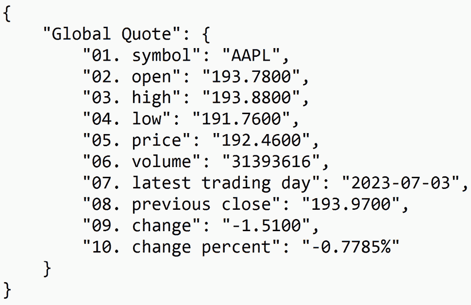

图 2.10 – Alpha Vantage 网络服务调用的 JSON 对象响应

响应包含了每个成功的 API 请求的 10 个参数。在这些参数中，我们的股票行情应用将关注`symbol`、`volume`、`price`和`change`。这些具体的数据点将被用来创建一个信息，我们将滚动显示在 Sense HAT 的点阵屏幕上。

然而，在我们编写网络服务代码之前，我们必须首先从 Alpha Vantage 获取一个 API 密钥。这个密钥赋予我们进行必要的网络服务调用的权限。

## 获取 API 密钥

从 Alpha Vantage 获取 API 密钥是一个简单的过程，只需几个步骤即可完成。我们首先导航到 Alpha Vantage 网站[`www.alphavantage.co`](https://www.alphavantage.co)。

从那里，我们点击**获取免费 API 密钥**按钮 – 这个按钮应该很容易在主页上找到。点击此按钮将带我们到一个注册表单。我们填写表单上的必要详细信息，确保提供一个有效的电子邮件地址。一旦填写完表单，我们应该会得到一个 API 密钥，然后点击**获取免费 API 密钥**按钮。

重要提示

上述说明在撰写本文时有效。请遵循任何对获取 API 密钥过程的更改。

一旦颁发 API 密钥，我们必须将其复制并粘贴到文本编辑器中，因为我们每次调用 Alpha Vantage 网络服务都需要这个密钥。作为免费用户，我们每分钟限制 5 个 API 请求，每天总共 500 个 API 请求。

有了我们的 API 密钥，我们现在可以开始编写应用程序的代码。

## 编写网络服务客户端代码

在本节中，我们将开始开发用于获取苹果公司（AAPL）当前股票信息的网络服务代码。我们的目标是检索 Alpha Vantage 网络服务的 JSON 对象响应，这将包含我们用于滚动股票行情应用所需的相关股票数据。

要创建我们的网络服务代码，我们执行以下操作：

1.  我们在 Raspberry Pi 上启动 Thonny 并使用上一节中的步骤激活 `ch2-env` Python 虚拟环境。

1.  然后，我们在 Thonny 中打开一个新的标签页并输入以下代码：

    ```py
    import requests
    import json
    api_key = 'xxxxxxxxxxxxxxxx'
    symbol = 'AAPL'
    base_url = 'https://www.alphavantage.co/query?'
    function = 'GLOBAL_QUOTE'
    complete_url = f'{base_url}function={function}&symbol={symbol}&apikey={api_key}'
    response = requests.get(complete_url)
    data = response.json()
    print(json.dumps(data, indent=4))
    ```

1.  在我们运行代码之前，让我们将其分解：

    1.  我们首先导入 `requests` 模块，这是一个广泛使用的 Python 库，用于发送 HTTP 请求。它提供了发送 HTTP 请求（如 `GET`、`POST` 等）的便捷方法，并处理底层网络通信。

    1.  然后，我们导入 Python 的内置 `json` 模块。`json` 模块提供了处理 JSON 数据的方法。它允许将 Python 对象编码为 JSON 字符串（`json.dumps()`）并将 JSON 字符串解码为 Python 对象（`json.loads()`）。

    1.  我们将来自 Alpha Vantage 的个人 API 密钥存储在一个名为 `api_key` 的变量中。

    1.  我们将 `symbol` 变量设置为 `'AAPL'`，代表苹果公司的股票符号。

    1.  `base_url` 变量存储 Alpha Vantage API 的基础 URL。

    1.  我们将 `function` 变量设置为 `'GLOBAL_QUOTE'`，表示要检索全球股票报价的特定函数。

    1.  我们通过组合基础 URL、函数、符号和 API 密钥来构建 `complete_url` 变量，从而形成 API 请求的完整 URL。

    1.  我们的代码随后使用 `requests.get()` 向 Alpha Vantage API 发送 `GET` 请求，并将响应存储在 `response` 变量中。

    1.  我们使用 `.json()` 从 `response` 对象中提取 JSON 响应，并将结果数据存储在 `data` 变量中。

    1.  最后，代码使用 `json.dumps()` 并将 `indent` 参数设置为 `4` 来以格式化的 JSON 表示形式打印 `data`。

1.  我们将代码保存为 `alphavantage-test.py`，然后通过点击绿色运行按钮、按键盘上的 *F5* 或者在顶部菜单中选择 **运行** 选项然后选择 **运行当前脚本** 来运行它。

1.  我们应该在控制台中看到类似于 *图 2.11* 中显示的 JSON 对象：

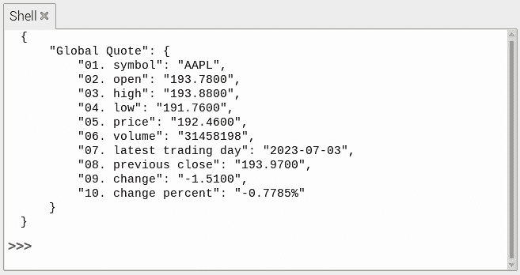

图 2.11 – 在 Thonny 的 Shell 中显示的 JSON 响应

重要提示 – 代码仅供演示

请注意，在提供的代码中，为了简化，省略了错误检查。如果这个应用程序要部署到生产环境（例如供客户使用），我们一定会包括适当的错误处理和错误检查机制，以确保应用程序的可靠性和稳定性。

当我们从互联网上拉取股票信息的代码完成后，现在是我们利用 Sense HAT 的点阵屏幕创建滚动股票行情的时候了。

## 优化我们的应用程序

通过我们对 Alpha Vantage 网络服务的理解，我们现在能够创建一个应用程序，它能够获取股票数据并将其转换为现实生活中的滚动股票行情。我们的应用程序利用了 Sense HAT 的点阵显示屏，将其变成股票行情的动态画布。我们不再将 JSON 响应打印到控制台，股票信息将优雅地滚动穿过 Sense HAT 显示屏，提供数据的视觉吸引表示。

要创建我们的网络服务代码，我们在 Raspberry Pi 上启动 Thonny 并创建一个新标签页：

1.  我们在 Raspberry Pi 上启动 Thonny，并使用上一节中的步骤激活`ch2-env` Python 虚拟环境。

1.  在 Thonny 的新标签页中，我们首先导入必要的库：

    ```py
    import requests
    from sense_hat import SenseHat
    import time
    ```

    在我们的代码中，我们导入了`requests`模块，以及从`sense_hat`模块中导入的`SenseHat`类。对于使用 Sense HAT 模拟器的我们，需要将此改为`from sense_emu import SenseHat`。然后我们导入`time`模块。

1.  在我们的库就绪后，我们创建并设置我们在代码中使用的变量：

    ```py
    api_key = 'xxxxxxxxxxxxxxxx'
    symbol = 'AAPL'
    base_url = 'https://www.alphavantage.co/query?'
    function = 'GLOBAL_QUOTE'
    sense = SenseHat()
    sense.set_rotation(270)
    last_call_time = time.time() - 180
    last_ticker_info = ""
    ```

    在这些代码行中，我们使用`api_key`变量来存储我们访问网络服务的唯一 Alpha Vantage API 密钥。我们使用`symbol`变量来存储要获取数据的股票符号（例如，`'AAPL'`）。`base_url`变量用于存储网络服务 API 的基本 URL。`function`变量用于定义要从网络服务 API 中调用的特定函数（例如，`'GLOBAL_QUOTE'`）。然后我们创建`SenseHat`类的实例，并将其分配给`sense`变量以与 Sense HAT（或模拟器）交互。我们使用`sense.set_rotation(270)`将 Sense HAT 显示屏的旋转设置为`270`度，这样它就与我们的定制外壳中的 Raspberry Pi 的方向相匹配。对于模拟器，我们可以取消注释这一行。然后我们使用当前时间减去 180 秒初始化`last_call_time`变量，这样就可以立即对网络服务进行第一次调用。我们将`last_ticker_info`变量初始化为空字符串，以存储之前的股票行情信息。

1.  在我们的变量声明下方，我们实现了一个无限循环以持续显示行情信息；然而，为了遵守每分钟 5 次请求和每天 500 次请求的 API 速率限制，我们在每次网络服务调用之间引入了 3 分钟的时间延迟。我们在变量声明下方键入以下代码：

    ```py
    while True:
        current_time = time.time()
        if current_time - last_call_time >= 180:
            complete_url = f'{base_url}function={
                           function}&symbol={
                           symbol}&apikey={api_key}'
            response = requests.get(complete_url)
            data = response.json()
            quote = data['Global Quote']
            ticker_info = (
                        f"{quote['01\. symbol']} "
                        f"Price: {quote['05\. price']} "
            )
            ticker_info += (
                        f"Volume: {quote['06\. volume']} "
                        f"Change: {quote['09\. change']}"
            )
            last_ticker_info = ticker_info
            sense.show_message(ticker_info,
                               scroll_speed=0.05,
                               text_colour=[255,
                               255,
                               255])
            last_call_time = current_time
        else:
            sense.show_message(last_ticker_info,
                               scroll_speed=0.05,
                               text_colour=[255,
                               255,
                               255])
        time.sleep(1)
    ```

    我们的代码被包裹在一个`while True`循环中，这确保了以下代码块的持续执行：

    1.  使用`time.time()`将`current_time`变量设置为当前时间。

    1.  我们的代码随后检查`current_time`和`last_call_time`之间的差异是否大于或等于 180 秒。

    1.  如果为`True`，则发生以下情况：

        1.  使用 f-string 创建一个`complete_url`变量，以形成 API 调用的 URL。

        1.  使用`requests.get(complete_url)`向 API 发送 HTTP `GET`请求，并将响应存储在`response`变量中。

        1.  使用`response.json()`将响应解析为 JSON，并分配给`data`变量。

        1.  从`data`字典中提取相关的股票信息，并将其格式化为`ticker_info`字符串。

        1.  将`last_ticker_info`变量更新以存储当前的`ticker_info`值。

        1.  使用`sense.show_message()`将`ticker_info`字符串显示在 Sense HAT 的点阵显示屏上，滚动速度为 0.05 秒，白色文字颜色（`255,255,255`）。

        1.  将`last_call_time`变量更新为当前时间（`current_time`），以标记上次 API 调用的时间戳。

    1.  如果为`False`，则将上一个`last_ticker_info`变量显示在 Sense HAT 显示屏上，滚动速度为 0.05 秒，白色文字颜色（`255,255,255`）。

    1.  在循环的下一个迭代之前，我们的程序使用`time.sleep(1)`暂停 1 秒钟。这是为了调节资源消耗和控制 Sense HAT 点阵显示屏的更新频率。

1.  我们将我们的代码保存为`aapl-stock-ticker.py`，然后通过点击绿色运行按钮，按键盘上的*F5*，或者在顶部菜单中选择**运行**然后**运行当前脚本**来运行它。

1.  执行代码后，我们应该在 Sense HAT 的点阵屏幕上观察到股票信息滚动。如果我们使用模拟器，信息将在模拟的点阵显示上滚动，考虑到模拟器设置的 270 度方向。*图 2.12*提供了使用模拟器时这种显示的视觉表示：

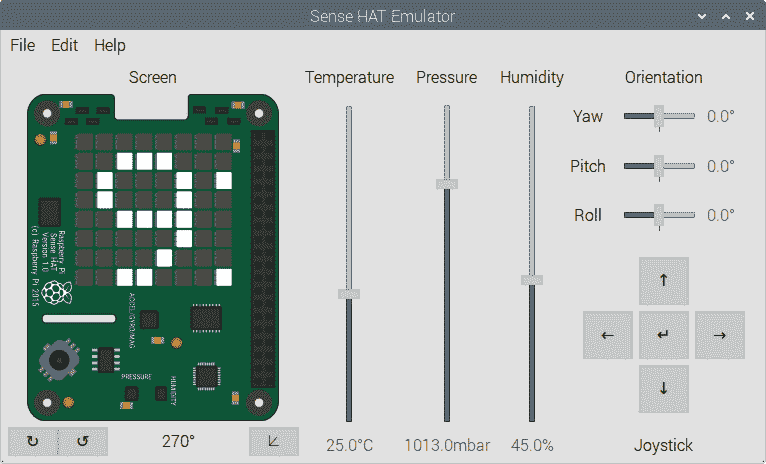

图 2.12 – Sense HAT 模拟器上的股票行情信息

祝贺我们成功构建了我们第一个真正的物联网设备，一个使用 Raspberry Pi 和 Sense HAT 的股票行情显示设备！这个设备开启了一个超越仅显示股票信息的世界。在下一节中，我们将开始开发显示天气条件的应用程序。

# 开发天气显示应用程序

现在，作为经验丰富的物联网应用开发者，我们准备将我们的技能提升到下一个层次，并创建更复杂的项目。在本节中，我们将利用 Raspberry Pi 和 Sense HAT 的功能来创建一个天气显示应用和一个基于天气的 GO-NO-GO 决策应用。

在 *图 2*.13 中，我们看到一个图表，展示了我们的 Raspberry Pi 和 Sense HAT（封装在其定制外壳中）对 OpenWeather API 的调用。对于我们的天气显示应用，我们将遵循与滚动股票指示器类似的方法：

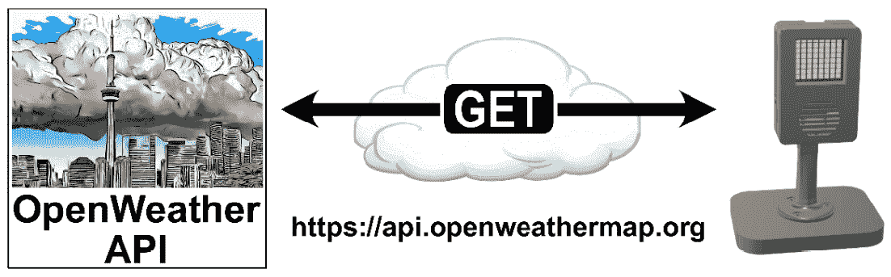

图 2.13 – 使用 OpenWeather API 获取当前天气状况

我们将首先从 OpenWeather 获取一个 API 密钥，并通过将响应打印到 Shell 中进行测试来验证 API 调用。然后，我们将利用 Sense HAT 创建一个指示器风格的显示，显示当前的天气状况。

最后，随着我们构建一个基于天气的 GO-NO-GO 决策应用，我们将用视觉效果替换滚动显示。

我们将首先获取一个 API 密钥。

## 获取 API 密钥

要利用 OpenWeather 网络服务，必须获取一个 API 密钥。这个 API 密钥作为一个唯一的标识符，允许访问 OpenWeather 网络服务。通过在 OpenWeather 网站上创建账户并订阅适当的服务来生成 API 密钥。API 密钥作为凭证，用于验证和授权我们对 OpenWeather 网络服务的请求，使我们能够获取世界各地各种位置的天气数据。重要的是要保密 API 密钥，并安全地存储它，因为它代表我们访问 OpenWeather API。

要从 OpenWeather 获取免费的 API 密钥，我们首先导航到位于 [`openweathermap.org/price`](https://openweathermap.org/price) 的 OpenWeather 价格页面。然后，我们滚动到 **当前天气和预报集合** 部分，并点击 **获取 API 密钥** 按钮：

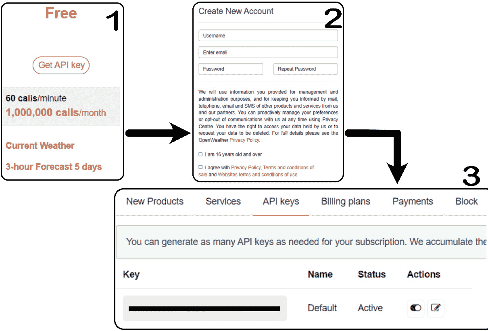

图 2.14 – 从 OpenWeather 获取 API 密钥

我们遵循创建新账户的说明。成功创建账户后，我们就可以访问个人仪表板。在个人仪表板中，我们导航到 **API 密钥** 选项卡，并在 **密钥** 框中找到 API 密钥。

我们将密钥复制粘贴到文本编辑器中，因为我们每次调用 OpenWeather 网络服务时都需要这个密钥。作为免费用户，我们每分钟限制 60 个 API 请求，每月总共 1,000,000 个 API 请求。这对我们的应用来说应该足够了。

使用我们的 OpenWeather API 密钥，我们现在可以开始编写代码来测试这个网络服务。

## 创建一个滚动的天气信息指示器

使用我们的 OpenWeather API 密钥、Raspberry Pi 和 Sense HAT，我们现在将创建一个模拟我们滚动股票行情功能的滚动天气信息设备。我们将首先获取天气数据，并在 Thonny 的 Shell 中显示结果。

在我们满意我们的 API 密钥和网络服务工作后，我们将集成网络服务数据与 Sense HAT，显示滚动文本，显示温度和天气状况。

### 测试网络服务

在将 OpenWeather API 集成到我们的 Raspberry Pi 和 Sense HAT 之前，我们将通过一个简单的程序确保其功能。为了创建测试代码，我们执行以下操作：

1.  我们在 Raspberry Pi 上启动 Thonny，激活 `ch2-env` Python 虚拟环境，并创建一个新标签。在标签内，我们编写以下代码：

    ```py
    import requests
    url = "https://api.openweathermap.org/data/2.5/weather"
    api_key = "xxxxxxxxxxxxxxxxxxxxxxxxxxxxxxxx"
    location = "Toronto"
    params = {
        "q": location,
        "appid": api_key,
        "units": "metric"
    }
    response = requests.get(url, params=params)
    if response.status_code == 200:
        data = response.json()
        temperature = data["main"]["temp"]
        description = data["weather"][0]["description"]
        print(f"The current temperature in {location} is {temperature}°C.")
        print(f"The weather is {description}.")
    else:
        print("Error: Failed to retrieve weather information.")
    ```

    在我们运行代码之前，让我们将其分解：

    1.  我们首先导入 `requests` 模块以发送 HTTP 请求。

    1.  然后，我们将 `url` 变量设置为 OpenWeather API 端点。

    1.  我们将 `api_key` 变量设置为我们的 OpenWeather API 密钥。

    1.  我们将 `location` 变量设置为我们要获取天气信息的所需位置。在我们的例子中，这是 `"Toronto"`。

    1.  然后，我们创建一个名为 `params` 的字典，其中包含 API 请求的参数，包括位置、API 密钥和所需的单位。

    1.  使用 `requests.get()` 发送一个 `GET` 请求到 OpenWeather API，其中 `url` 和 `params` 作为参数。

    1.  然后，我们检查响应状态码是否为 `200`（表示请求成功）。

    1.  如果响应成功，我们使用 `response.json()` 解析响应中的 JSON 数据，然后执行以下操作：

        1.  我们从解析的数据中提取温度和天气描述。

        1.  然后，我们打印指定位置的当前温度和天气信息。

    1.  如果有错误（响应状态码不是 `200`），我们将打印一个错误消息，指出无法检索天气信息。

1.  我们将我们的代码保存为 `weather-api-test.py`，然后通过点击绿色运行按钮、按键盘上的 *F5* 或者在顶部菜单中选择 **运行** 然后选择 **运行当前脚本** 来运行它。

在我们执行代码后，我们应该在 Shell 中看到一个消息：

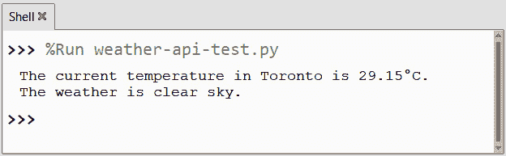

图 2.15 – OpenWeather API 关于多伦多天气的信息

如我们所见，在撰写本文时，多伦多是 `29.15 °C`，天气晴朗。如果网络服务调用失败，我们将在控制台中看到 `Error: Failed to retrieve weather information` 错误。

在我们了解了如何使用 OpenWeather API 后，我们现在准备好使用 Sense HAT 创建我们的滚动天气信息指示器。为此，我们可以重用我们为滚动股票行情应用编写的代码的大部分。

## Sense HAT 上的滚动天气信息

正如我们在上一个项目中指出的，我们的滚动股票行情应用的通用性使我们能够将其适应以显示除股票之外的各种类型的信息。在本节中，我们将利用这种适应性，通过集成 OpenWeather API 和我们的 API 密钥，将我们的行情转换为动态天气显示，滚动实时天气数据，如温度和当前状况。我们将能够重用滚动股票行情中的大量代码。为了创建滚动行情代码，我们执行以下操作：

1.  我们在 Raspberry Pi 上启动 Thonny，激活 `ch2-env` Python 虚拟环境，并创建一个新标签。我们将从导入开始：

    ```py
    import requests
    from sense_hat import SenseHat
    import time
    ```

重要提示

由于我们已经在我们之前的滚动股票行情应用中涵盖了这些导入，所以我们不需要再次介绍它们。

1.  在导入之后，我们设置我们的变量：

    ```py
    api_key = 'xxxxxxxxxxxxxxxxxxxxxxxxxxxxxxxx'
    location = 'Toronto'
    base_url = 'https://api.openweathermap.org/data/2.5/weather'
    params = {
        'q': location,
        'appid': api_key,
        'units': 'metric'
    }
    sense = SenseHat()
    sense.set_rotation(270)
    last_call_time = time.time() - 30
    last_weather_info = ""
    ```

    在此代码块中，我们执行以下操作：

    1.  我们首先将 `api_key` 变量分配给我们的 OpenWeather API 密钥。

    1.  我们将 `location` 变量设置为想要获取天气信息的所需位置。在我们的例子中，这是 `'Toronto'`。

    1.  然后，我们将 `base_url` 变量设置为 OpenWeather API 端点。

    1.  我们创建了一个名为 `params` 的字典，其中包含了 API 请求的参数，包括位置、API 密钥和所需的单位。

    1.  使用 `requests.get()` 发送一个 `GET` 请求到 OpenWeather API，其中 `url` 和 `params` 作为参数。

    1.  然后，我们创建了一个 `SenseHat` 类的实例，并将其分配给 `sense` 变量以与 Sense HAT（或模拟器）交互。

    1.  我们使用 `sense.set_rotation(270)` 将 Sense HAT 显示的旋转设置为 270 度。这样做是为了使其与我们的定制外壳中的 Raspberry Pi 的方向相匹配。对于模拟器，我们可以取消注释这一行。

    1.  我们将 `last_call_time` 设置为当前时间减去 30 秒。

    1.  然后，我们添加 `last_weather_info`，这是一个存储先前天气信息的变量。

1.  在我们的变量声明下方，我们实现了一个无限循环，以持续显示天气行情信息；然而，为了遵守每分钟 60 次和每月 1,000,000 次的 API 速率限制，我们在每次网络服务调用之间引入了 30 秒的时间延迟。我们在变量声明下方输入以下代码：

    ```py
    while True:
        current_time = time.time()
        if current_time - last_call_time >= 30:
            response = requests.get(base_url,
                       params=params)
            data = response.json()
            temperature = data['main']['temp']
            description = data['weather'][0]['description']
            weather_info = f"{location}: {temperature}°C, {description}"
            last_weather_info = weather_info
            sense.show_message(weather_info, scroll_speed=0.05, text_colour=[255, 255, 255])
            last_call_time = current_time
        else:
            sense.show_message(last_weather_info, scroll_speed=0.05, text_colour=[255, 255, 255])
        time.sleep(1)
    ```

1.  就像在我们的滚动股票行情应用中一样，我们的代码核心被包裹在一个 `while True` 循环中，这确保了主代码的持续执行：

    1.  我们使用 `time.time()` 将 `current_time` 变量设置为当前时间。

    1.  然后，我们的代码检查 `current_time` 和 `last_call_time` 之间的差异是否大于或等于 30 秒。

    1.  如果为 `True`，则发生以下情况：

        1.  使用 `requests.get()` 发送一个 `GET` 请求到 OpenWeather API，其中 `base_url` 和 `params` 作为参数。

        1.  响应被解析为 JSON 并使用 `response.json()` 分配给 `data` 变量。

        1.  我们从解析的数据中提取温度和天气描述，并将其存储为`weather_info.`。

        1.  将`last_weather_info`变量更新以存储当前的`weather_info`值。

        1.  使用`sense.show_message()`在 Sense HAT 的点阵显示屏上显示`weather_info`，滚动速度为 0.05 秒，文字颜色为白色（`255,255,255`）。

        1.  将`last_call_time`变量更新为当前时间（`current_time`），以标记上次 API 调用的时间戳。

    1.  如果`False`，则使用 0.05 秒的滚动速度和白色文字颜色（`255,255,255`）在 Sense HAT 显示屏上显示上一个`last_weather_info`变量。

    1.  程序随后使用`time.sleep(1)`暂停 1 秒，然后进行循环的下一迭代。这样做是为了调节资源消耗和控制 Sense HAT 点阵显示屏的更新频率。

1.  我们将代码保存为`weather-scroll.py`，然后通过点击绿色运行按钮、按键盘上的*F5*键或点击顶部菜单的**运行**选项然后**运行****当前脚本**来运行它。

执行代码后，我们应该观察到天气信息在 Sense HAT 的点阵屏幕上滚动。如果我们使用模拟器，一条信息将在模拟的点阵显示屏上滚动。*图 2.16*提供了使用模拟器时这种显示的视觉表示：

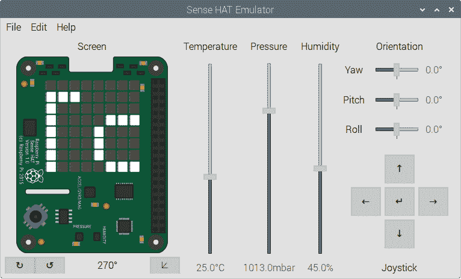

图 2.16 – 天气信息在模拟点阵显示屏上滚动

一个重要的启示是利用现有代码创建新应用的力量。尽管股票信息和天气数据之间存在固有的差异，但获取这两个领域信息的过程却惊人地相似。有了这个认识，我们就可以利用相同的底层代码结构创建各种动态和吸引人的显示。

这里有一些我们可以构建的其他应用的例子：

+   **新闻更新**：通过修改代码，我们可以将我们的设备与新闻 API 集成，以显示来自流行新闻来源的实时标题或更新。

+   **社交媒体通知**：通过将我们的应用程序连接到社交媒体 API，我们可以配置它显示来自 Twitter 或 Facebook 等流行平台的通知。

+   **体育比分**：通过集成体育数据 API，我们的股票行情应用可以转变为实时体育比分板。它可以显示实时比分、比赛更新或即将到来的比赛日程。

+   **个性化提醒**：通过扩展代码的功能，我们可以编程股票行情应用以显示个性化的提醒或待办事项列表。

在本章的下一项和最后一项项目中，我们将用点阵图像和动画替换我们的滚动文本显示。这种从滚动文本到图像的转变提升了用户体验，并将使我们的项目更具视觉吸引力。

## 开发 GO-NO-GO 决策应用

考虑到一个青年棒球联赛的组织者角色，负责确保比赛场地的安全。这一责任的关键是做出基于天气的决定。如果场地过于潮湿，可能会影响比赛，可能导致比赛推迟或取消：

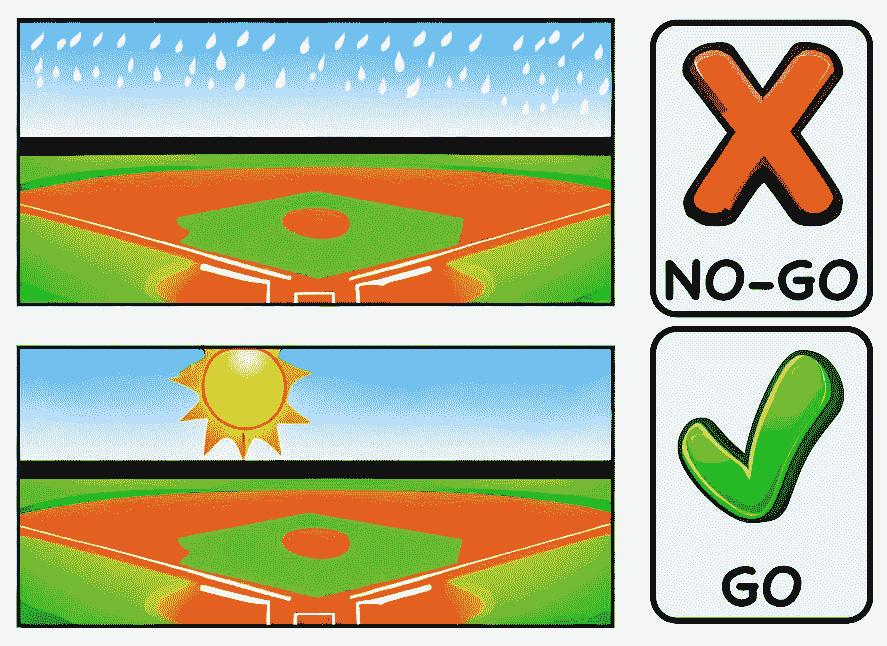

图 2.17 – 比赛是否应该继续？

另一个需要考虑的因素是球员的年龄。对于年轻球员来说，在雨中比赛会引发担忧，因为父母通常在场，可能会对不利的天气条件表示不满。另一方面，通常独立参加比赛的年长球员可能受潮湿条件的影响较小。

这些决策场景代表了一个开发物联网应用的机会，该应用可以根据天气条件和球员年龄显示视觉指示器，如**GO**或**NO-GO**图形（*图 2**.17*）。想象一下，每个棒球场地都配备一个 Raspberry Pi 和 Sense HAT 的设置，Sense HAT 显示屏提供实时指导，以确定比赛是否应该按计划进行，是否应该推迟，或者完全取消。这个物联网应用使决策更加高效，并提升了青年棒球联赛的整体体验和安全。

在我们的简化示例中，我们将专注于将基本的决策集成到我们的物联网应用中。根据球员的年龄和雨水的存在，Sense HAT 将显示绿色勾选标记或动画红色 X 标志。虽然我们可以引入额外的复杂性，但这个练习的主要目标是展示决策如何集成到物联网应用中。通过引入这些视觉指示器，我们赋予了实时决策能力。我们的物联网应用不再仅仅依赖于组织者，而是通过提供即时的指导来负责决定比赛是否应该继续或推迟。

我们将首先编写 Sense HAT 的指示代码。对于 GO，我们将显示一个简单的绿色勾选标记在黑色背景上。对于 NO-GO，我们将显示闪烁的红色 X。我们将使用 Sense HAT 模拟器运行我们的应用程序，因为对于本书来说，显示截图更容易；然而，强烈建议使用 Sense HAT，因为这使我们的应用程序成为一个真正的物联网设备。

我们将首先编写代码来显示绿色勾选标记。

### 在我们的 Sense HAT 上创建勾选标记

在本节中，我们将创建代码，在 Sense HAT 模拟器上显示绿色勾选标记在黑色背景上。为了增强代码实现和组织，我们将功能封装在一个 Python 类中。这种方法简化了集成过程并促进了代码的可重用性，使我们能够轻松地将绿色勾选标记显示集成到我们的物联网应用项目中。

在编写 GO-NO-GO 应用程序的代码之前，我们将在 Raspberry Pi 上创建一个名为`GO-NO-GO`的项目目录。这个专用文件夹将作为组织和管理与我们的项目相关的文件和资源的集中位置。为了创建勾选标记代码，我们执行以下操作：

1.  我们在 Raspberry Pi 上启动 Thonny，激活`ch2-env`虚拟环境，并创建一个新标签页。在标签页内，我们编写以下代码：

    ```py
    from sense_emu import SenseHat
    class GreenCheck:
        black = (0, 0, 0)
        green = (0, 255, 0)
        check_mark_pixels = [
            black, black, black, black,
            black, black, black, green,
            black, black, black, black,
            black, black, green, green,
            black, black, black, black,
            black, black, green, green,
            black, black, black, black,
            black, green, green, black,
            green, black, black, black,
            green, green, black, black,
            black, green, black, black,
            green, green, black, black,
            black, green, green, green,
            green, black, black, black,
            black, black, black, green,
            black, black, black, black
        ]
        def __init__(self, rotation=0):
            self.sense = SenseHat()
            self.sense.set_rotation(rotation)
        def display(self):
            self.sense.set_pixels(self.check_mark_pixels)
    if __name__ == "__main__":
        greenCheck = GreenCheck(rotation = 270)
        greenCheck.display()
    ```

    在我们的代码中，我们执行以下操作：

    1.  我们首先从`sense_hat`模块导入`SenseHat`类（使用`sense_emu`进行模拟）

    1.  然后我们定义一个`GreenCheck`类，用于在 Sense HAT 上显示绿色勾选标记。

    1.  我们将黑色和绿色的颜色值设置为 RGB 元组。

    1.  然后我们定义一个表示勾选标记形状的像素值列表。

    1.  `GreenCheck`类使用可选的旋转参数初始化，默认值为`0`。

    1.  在`__init__`方法中，我们创建了一个 Sense HAT 实例，并将旋转设置为`rotation`的值。

    1.  我们定义一个`display`方法，将 Sense HAT 的像素设置为勾选标记的像素值。

    1.  我们使用`if __name__ == "__main__"`来检查代码是否直接运行（不是导入）。

    1.  如果`True`，我们执行以下操作：

        1.  我们创建了一个名为`greenCheck`的`GreenCheck`类实例，旋转值为`270`。

        1.  我们调用`display()`方法，在 Sense HAT 上显示一个绿色的勾选标记。

1.  我们将我们的代码保存为`green_checkmark.py`在`GO-NO-GO`文件夹中，然后通过点击绿色运行按钮，按键盘上的*F5*，或者在顶部菜单中选择**运行**然后**运行当前脚本**来运行它。

1.  执行代码后，我们应该在我们的 Sense HAT 模拟器上看到黑色背景上的绿色勾选标记：

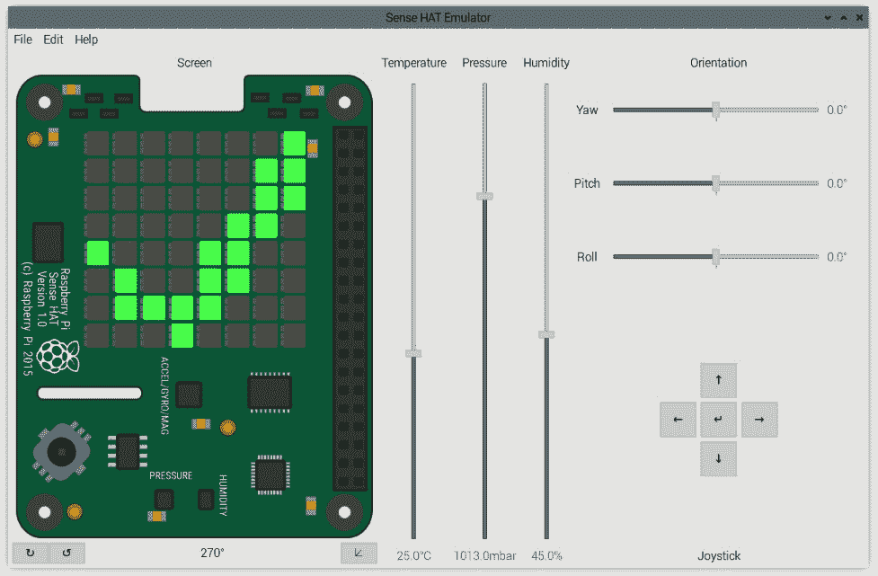

图 2.18 – Sense HAT 点阵显示上的黑色背景上的绿色勾选标记

完成绿色勾选标记代码后，我们现在将注意力转向为我们的应用程序创建 NO-GO 动画（闪烁红色 X）。

### 在 Sense HAT 上创建 NO-GO 动画

我们设计的 NO-GO 动画在 Sense HAT 模拟器显示上产生闪烁效果，交替显示黑色背景上的红色 X 标志和全红色显示。为了创建闪烁 X 标志的代码，我们执行以下操作：

1.  我们在 Raspberry Pi 上启动 Thonny，激活`ch2-env` Python 虚拟环境，并创建一个新标签页。在标签页内，我们首先导入所需的包：

    ```py
    from sense_emu import SenseHat
    import time
    ```

1.  一旦我们定义了包，我们接下来开始将我们的代码封装在一个 Python 类中：

    ```py
    class RedXAnimation:
        black = (0, 0, 0)
        red = (255, 0, 0)
        frame1 = [
            red, black, black, black,
            black, black, black, red,
            black, red, black, black,
            black, black, red, black,
            black, black, red, black,
            black, red, black, black,
            black, black, black, red,
            red, black, black, black,
            black, black, black, red,
            red, black, black, black,
            black, black, red, black,
            black, red, black, black,
            black, red, black, black,
            black, black, red, black,
            red, black, black, black,
            black, black, black, red
        ]
        frame2 = [
            red, red, red, red, red, red, red, red,
            red, red, red, red, red, red, red, red,
            red, red, red, red, red, red, red, red,
            red, red, red, red, red, red, red, red,
            red, red, red, red, red, red, red, red,
            red, red, red, red, red, red, red, red,
            red, red, red, red, red, red, red, red,
            red, red, red, red, red, red, red, red
        ]
    ```

    在我们的代码中，我们执行以下操作：

    1.  我们首先定义一个`RedXAnimation`类。

    1.  然后我们将黑色和红色的颜色值设置为 RGB 元组。

    1.  我们将`frame1`定义为表示黑色背景上红色 X 标志的像素值列表。

    1.  我们将`frame2`定义为表示全红色显示的像素值列表。

1.  从这里，我们为类的初始化方法编写代码：

    ```py
        def __init__(self, rotation=0):
            self.sense = SenseHat()
            self.sense.set_rotation(rotation)
    ```

    在我们的代码中，我们执行以下操作：

    1.  我们使用 `__init__` 方法以可选的 `rotation` 参数（默认为 `0`）初始化 `RedXAnimation` 对象。

    1.  在 `__init__` 内部，创建了一个 `SenseHat` 实例，并根据提供的 `rotation` 值设置旋转。

1.  `display_animation()` 方法将循环显示 2 帧 59 秒。我们这样做是为了与未来的客户端代码保持一致：

    ```py
        def display_animation(self, duration):
            num_frames = 2
            frame_duration = duration / num_frames
            start_time = time.time()
            end_time = start_time + 59
            while time.time() < end_time:
                for frame in [self.frame1, self.frame2]:
                    self.sense.set_pixels(frame)
                    time.sleep(frame_duration)
    ```

    在我们的代码中，以下情况发生：

    1.  我们的 `display_animation()` 方法接受一个持续时间参数。

    1.  我们将帧数设置为 `2.`。

    1.  我们通过将总持续时间除以帧数来计算每帧的持续时间。

    1.  我们使用 `time.time()` 将 `start_time` 变量设置为当前时间。

    1.  我们通过将 59 秒加到 `start_time` 变量上来计算 `end_time` 值。

    1.  我们创建一个循环，直到当前时间超过 `end_time` 值：

        1.  我们的代码遍历列表 `[self.frame1, self.frame2]` 中的每一帧。

        1.  我们使用 `self.sense.set_pixels(frame)` 将 Sense HAT 显示屏像素设置为当前帧。

        1.  然后我们使用 `time.sleep(frame_duration)` 暂停执行以帧的持续时间。

1.  我们使用 `if __name__ == "__main__":` 块来确保测试代码仅在脚本直接运行时执行（不是作为模块导入）：

    ```py
    if __name__ == "__main__":
        animation = RedXAnimation(rotation=270)
        animation.display_animation(duration=1)
    ```

    在我们的代码中，以下情况发生：

    1.  创建一个旋转值为 270 度的 `RedXAnimation` 类实例，并将其分配给 `animation` 变量。

    1.  调用 `animation` 对象的 `display_animation()` 方法，指定持续时间为 1 秒。

1.  我们将我们的代码保存为 `flashing_x.py` 在 `GO-NO-GO` 文件夹中，然后通过点击绿色运行按钮，按键盘上的 *F5* 或者在顶部菜单中选择 **运行** 然后选择 **运行当前脚本** 来运行它。

执行代码后，我们应该观察到红色 X 标志在黑色背景上变为全屏红色，然后再回到原来的状态。在 *图 2.19* 中，我们可以看到在模拟器上这会是什么样子：

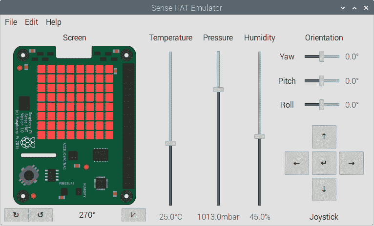

图 2.19 – 红屏模式的 NO-GO 动画

我们在本节中创建的 NO-GO 动画在 Sense HAT 显示屏上提供了一个非常有效的视觉指示器。通过在黑色背景上的红色 X 标志和全红色显示之间交替，这个动画传达了需要取消比赛的不利条件。

为其他城市设置地理定位

为了找到城市的地理定位信息，如纬度和经度，像 *GPS Coordinates* ([`gps-coordinates.org/`](https://gps-coordinates.org/)) 和 *Latitude and Longitude Finder* ([`www.latlong.net/`](https://www.latlong.net/)) 这样的网站非常有用。它们允许我们输入一个地址或地点，并接收其精确的坐标。

为了完成我们的应用程序，我们现在将编写网络服务和逻辑层，并将包含我们的绿色勾选和红色 X 标志动画。

### 编写 GO-NO-GO 客户端代码

现在，是时候进入编写代码的激动人心阶段（当然，这是主观的）了，以确定游戏应该是 GO 还是 NO-GO，基于天气条件和玩家的年龄。我们的方法将非常直接：如果下雨且玩家年龄低于 16 岁，则为 NO-GO；否则，为 GO。虽然我们可以当然实现更复杂的逻辑，包括**机器学习**（**ML**），如果需要考虑多个参数，但为了简单起见，我们将专注于这个基本的决策过程。我们这样做如下：

1.  为了创建客户端代码，我们在 Raspberry Pi 上启动 Thonny，激活我们的`ch2-env`Python 虚拟环境，并创建一个新标签。在标签内，我们首先导入所需的包：

    ```py
    import requests
    import time
    from green_checkmark import GreenCheck
    from flashing_x import RedXAnimation
    ```

    我们已经介绍了前三个包。对于这两个模块，我们做以下操作：

    +   我们从`green_checkmark`模块导入`GreenCheck`类，以显示绿色勾选，从`flashing_x`模块导入以显示红色 X 标志动画，当决策为**NO-GO**时。

1.  在我们的包和模块就绪后，我们现在设置我们的变量：

    ```py
    latitude = '42.346268'
    longitude = '-71.095764'
    go = GreenCheck(rotation=270)
    no_go = RedXAnimation(rotation=270)
    timer = 1
    age = 12
    base_url = "https://api.openweathermap.org/data/2.5/weather"
    api_key = "xxxxxxxxxxxxxxxxxxxxxxxxxxxxxxxx"
    params = {
        'lat': latitude,
        'lon': longitude,
        'appid': api_key,
        'units': 'metric'
    }
    ```

    在我们的代码中，我们做以下操作：

    1.  我们将`latitude`设置为`'42.346268'`，将`longitude`设置为`'-71.095764'`，用于我们的棒球场。例如，这是美国马萨诸塞州波士顿芬威公园的 GPS 坐标。

    1.  我们创建一个名为`go`的`GreenCheck`对象，旋转值为 270 度。

    1.  我们创建一个名为`no_go`的`RedXAnimation`对象，旋转值为 270 度。

    1.  我们将`timer`值设置为 1 秒。

    1.  我们将玩家的年龄设置为 12 岁。

    1.  我们的代码将`base_url`值设置为`"https://api.openweathermap.org/data/2.5/weather"`。

    1.  接下来，我们添加我们的 OpenWeather `api_key`值。

    1.  我们定义了一个`params`字典，我们将用它来调用我们的网络服务（`latitude`、`longitude`、`api_key`和`units`）。

1.  我们使用无限循环每 60 秒检查一次天气条件，并相应地更新 Sense HAT 上的显示：

    ```py
    while True:
        response = requests.get(base_url, params=params)
        if response.status_code == 200:
            data = response.json()
            temperature = data['main']['temp']
            description = data['weather'][0]['main']
            print(f"The current temperature is {temperature}°C.")
            print(f"The weather is {description}.")
            if description == 'Thunderstorm' or description == 'Rain' and age < 16:
                print("NO-GO!")
                no_go.display_animation(duration=1)
                timer = 1
            else:
                print("GO!")
                go.display()
                timer = 60
        else:
            print("Error: Failed to retrieve weather information.")
        time.sleep(timer)
    ```

    在我们的代码中，我们使用`while True`设置了一个无限循环：

    1.  我们使用`requests.get()`向 OpenWeather API 发起一个`GET`请求，并将响应存储在`response`中。

    1.  如果响应状态码是`200`，我们做以下操作：

        1.  我们使用`response.json()`将 JSON 响应解析为 Python 字典，并将其分配给`data`。

        1.  然后，我们从`data['main']['temp']`检索当前温度并将其存储在`temperature`中。

        1.  我们从`data['weather'][0]['main']`检索天气描述并将其存储在`description`中。

        1.  然后，我们打印当前的温度和天气描述。如果天气描述是 `'Thunderstorm'` 或 (`'Rain'` 且 `age < 16`)，我们将向 Shell 打印 `"NO-GO!"`，使用 `no_go.display_animation(duration=1)` 显示 NO-GO 动画，并将 `timer` 变量设置为 1 秒。这是为了使调用 web 服务前的总时间为 60 秒，因为动画将持续 59 秒。否则，我们将向 Shell 打印 `"GO!"`，使用 `go.display()` 显示绿色勾选动画，然后设置 `timer` 变量为 60 秒。

    1.  如果响应状态码不是 `200`，我们将打印错误信息。

    1.  我们使用 `time.sleep(timer)` 暂停执行 `timer` 秒。这将导致在调用 OpenWeather web 服务之间产生 60 秒的延迟。

1.  我们将代码保存为 `go-no-go.py` 文件，存放在 `GO-NO-GO` 文件夹中，然后通过点击绿色运行按钮、按键盘上的 *F5* 键，或者在顶部菜单中选择 **运行** 选项，然后选择 **运行** **当前脚本** 来运行它。

    运行代码后，我们将观察到我们的 Sense HAT（或模拟器）的点阵屏幕显示绿色勾选或闪烁的红色 X，指示波士顿芬威公园比赛的 GO 或 NO-GO 条件。如 *图 2**.20 所示，当前状态是由于雷暴的存在，涉及我们球员（16 岁以下）的比赛为 NO-GO：

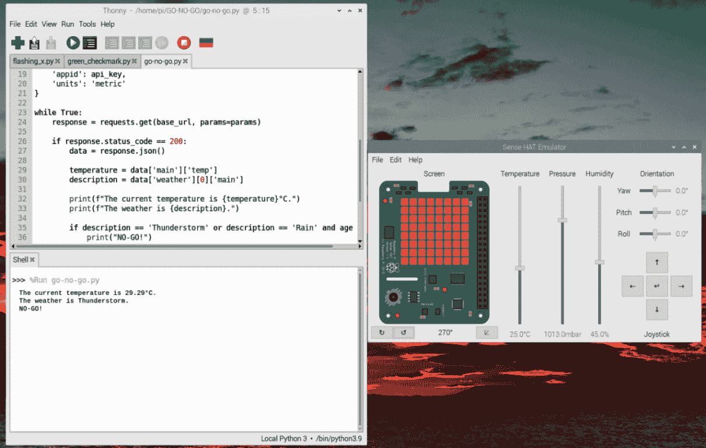

图 2.20 – 使用 Sense HAT 模拟器的 GO-NO-GO 应用程序截图

如前所述，我们代码的灵活性允许我们轻松扩展决策逻辑。除了天气数据外，我们还可以扩展我们的应用程序，考虑其他因素，如风速、湿度或任何现场传感器读数。通过集成直接放置在棒球场上的传感器，我们可以收集土壤湿度水平或其他感兴趣测量值的实时数据。然后，我们可以将这些传感器信息广播到互联网上，使我们能够无缝地将它集成到我们的应用程序中。

为了使我们的应用程序更加动态，我们可以结合调度信息来确定在特定棒球场上任何给定时间安排比赛的球员的年龄。通过从电子表格或在线存储库中提取此信息，我们可以自动化获取球员年龄数据和其他与比赛相关的信息（如比赛是否为季后赛）的过程。这使得我们的应用程序能够动态调整其决策过程，确保更准确的 GO 或 NO-GO 决定。

## 构建其他 GO-NO-GO 应用程序

GO-NO-GO 应用程序标志着我们将使用 Sense HAT 构建的最后一本书中的项目。正如我们所展示的，Raspberry Pi 和 Sense HAT 的结合构成了一个强大的物联网设备。不难想象，我们如何轻松地将我们的棒球 GO-NO-GO 应用程序更改为其他场景。以下是我们可以构建的其他 GO-NO-GO 应用程序的几个示例：

+   **航班状态检查器**：通过集成航班跟踪 API，我们可以构建一个应用程序，该程序可以显示特定航班的 GO 或 NO-GO 状态。

+   **交通状况监控器**：利用交通数据 API，我们可以构建一个应用程序，该程序可以评估特定路线或特定地点的当前交通状况。

+   **活动可用性指示器**：通过集成活动票务 API，我们可以构建一个应用程序，该程序可以确定所需活动的门票可用性。

+   **公共交通追踪器**：通过连接到公共交通 API，我们可以构建一个应用程序，该程序可以提供公交车、火车或其他公共交通工具的实时状态更新。

GO-NO-GO 物联网应用程序只是我们利用 Web 服务和物联网的巨大潜力的一个缩影。有了 Raspberry Pi 和 Sense HAT，我们的潜力扩展到各种物联网应用，监控各种数据，并在与天气相关的场景之外促进创新。

# 摘要

在本章中，我们探讨了使用 Raspberry Pi 和 Sense HAT 进行 Web 服务开发的领域。我们首先了解了 Web 服务，并编写了 Web 服务代码。凭借我们的新知识，我们创建了我们的第一个物联网应用程序：一个滚动股票行情。通过连接到 Alpha Vantage Web 服务，我们检索了实时股票信息，并在 Sense HAT 的点阵显示屏上以连续滚动格式显示。这个项目展示了连接到 Web 服务以获取有用信息的简便性。

将 Web 服务与 Raspberry Pi 等设备集成是当今科技行业的一项关键技能。通过处理来自 Alpha Vantage 和 OpenWeather 等来源的数据，并在 Sense HAT 上显示，我们将理论与实践相结合。这种知识增强了我们的项目能力和专业技能，使我们能够在物联网和数据驱动领域占据有利位置。

然后，我们尝试构建一个天气显示应用程序。通过利用 OpenWeather API，我们获得了实时天气信息，并将其转换成 Sense HAT 上的滚动信息。然后，我们将我们的开发推进到下一步，并使用它来创建一个决策 GO-NO-GO 物联网应用程序。在 GO-NO-GO 应用程序中，我们使用天气条件和球员年龄作为标准，以确定棒球比赛是否应该继续（GO）或取消（NO-GO）。我们通过在 Sense HAT 上显示视觉指示器，如绿色勾号或闪烁的红色 X 标志来实现这一点。

在下一章中，我们将探讨涉及物理交互的物联网应用——特别是，电机的集成。通过将电机控制纳入我们的项目，我们可以创造动态和交互式的体验，从而弥合数字世界和物理世界之间的差距。
