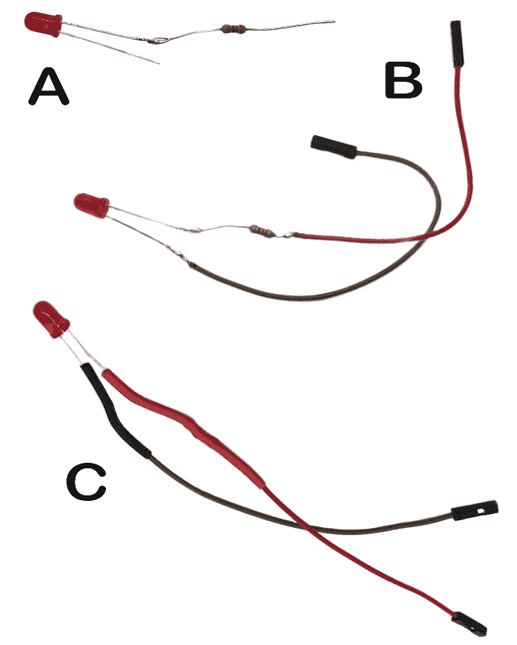

# 第三章：构建物联网天气指示器

在本章中，我们将学习伺服电机和 LED，然后利用这些知识，结合我们对树莓派和网络服务的理解，来创建一个实际项目：一个物联网天气指示器。

该天气指示器将从网络服务中获取天气信息，然后使用连接到伺服电机的指针来根据当前的户外条件指示合适的着装。它将包括一个在下雨时开启并在雷暴时闪烁的 LED。您用于创建此应用程序的配置可能用于其他应用程序，例如水质监测器或交通密度监测器。

我们将从查看伺服电机开始，这将帮助我们了解它们是什么以及我们如何在物联网应用程序中使用它们。然后，我们将专注于 LED。

随后，我们将开始构建一个物理支架来容纳我们应用程序的组件。这将是我们为本书构建的第二个专门设计的树莓派支架，也是第一个带有电机的支架。

虽然在第一章和第二章中讨论的 SenseHAT 外壳的使用是可选的，但建议为天气指示器构建此支架。这个构建将代表我们第一次尝试创建一个有形的、物理的实体，或者更具体地说，是一个物联网（IoT）*事物*。

一旦我们的设备组装完成，我们就会开始编码。我们的目标是从**OpenWeatherMap**网络服务中提取信息，并利用它来根据温度和风速来控制我们伺服电机上固定针的位置。我们还将根据某些天气条件调整 LED 的行为。通过实施这些过程，我们将展示如何将现实世界的数据转化为物理运动，架起数字世界和机械世界之间的桥梁：


图 3.1 – 将我们的天气指示器连接到网络服务

在本章中，我们将探讨以下主题：

+   探索伺服电机

+   探索 LED

+   使用 Python 控制伺服电机和 LED

+   构建天气指示器支架

+   为我们的应用程序开发代码

让我们开始吧！

# 技术要求

完成本章，您需要以下物品：

+   建议使用树莓派 5 4/8 GB 型号，但也可以使用带有 4 GB 或 8 GB 的树莓派 4B（本书中的图示显示的是树莓派 4B 型号）。

+   带有预装 Thonny 的最新树莓派操作系统。

+   键盘、鼠标和显示器。

+   1 个 SG90 伺服电机。

+   1 个 LED（单色）。

+   1 个 220 欧姆电阻。

+   ½英寸 PVC 管。

+   用于树莓派**通用输入/输出**（**GPIO**）端口的跳线带连接器。

+   用于定制支架的 3D 打印机或 3D 打印服务。

+   对编程的一般了解。本书中将使用 Python 编程语言。

本章的 GitHub 仓库位于 [`github.com/PacktPublishing/-Internet-of-Things-Programming-Projects-2nd-Edition/tree/main/Chapter3`](https://github.com/PacktPublishing/-Internet-of-Things-Programming-Projects-2nd-Edition/tree/main/Chapter3)。

# 研究伺服电机

**伺服电机**在机器人、自动化和其他需要精确控制角运动的领域中得到了广泛应用。将伺服电机连接到树莓派是一个简单的过程，为各种项目提供了令人兴奋的可能性。树莓派提供了一个合适的平台来接口和控制伺服电机。在本节中，我们将更详细地研究伺服电机。

探索 GPIO 端口

树莓派的 GPIO 端口允许直接硬件交互，使其成为动手项目的关键工具。它允许我们连接设备、传感器和电路，从而创建现实世界的应用，如机器人或报警系统。通过利用这些引脚，我们可以设计和构建与物理世界交互的项目。我们将在*第五章*中更深入地介绍 GPIO 端口。目前，只需知道我们可以简单地使用母头跳线连接器将伺服电机和 LED 等设备连接到 GPIO 端口即可。

我们将首先使用 GPIO 端口将 SG90 伺服电机连接到我们的树莓派 5。

## 将 SG90 伺服电机连接到我们的树莓派

SG90 伺服电机因其紧凑的尺寸、多功能性、精确控制和易于使用而广受欢迎。在将 SG90 伺服电机连接到我们的树莓派时，有必要修改母头三脚插座的线序。这个插座通常被称为**JR 风格伺服插座**或简单地称为**伺服插座**，其初始接线顺序与我们的树莓派所需的顺序相反。

参考图 3**.2**，我们可以通过以下步骤调整接线：

1.  首先，识别插座中的三根线 – 红色（电源）、棕色（地）和橙色（信号）。

1.  然后，使用尖锐物体（如 Xacto 刀）轻轻拉出插座中的线，同时用手握住塑料外壳。

1.  然后，重新排列它们，使红色（电源）线在一端，棕色（地）线在中间，橙色（信号）线在红色线的另一端：


图 3.2 – 改变 SG90 伺服电机的接线顺序

1.  在正确的接线顺序下，我们可以直接将伺服电机连接到我们的树莓派。以图 3**.3** 中的图为例，将母头三脚插座连接到树莓派的 +5V、GND 和 GPIO 14 引脚：


图 3.3 – 将我们的伺服电机连接到 Raspberry Pi

连接我们的伺服电机的另一种方法

对于那些不想修改伺服电机现有连接器的人来说，我们可以使用三根公对母跳线代替，公端插入连接器，母端插入 Raspberry Pi 的 GPIO 端口。

在我们的伺服电机连接到我们的 Raspberry Pi 后，让我们来研究伺服电机是什么以及我们如何使用它们。

## 理解伺服电机

伺服电机由一个**直流**（**DC**）电机、一个控制电路以及一个用于维持输出轴角位置的反馈机制组成。机器人、玩具和遥控汽车是伺服电机主要应用的一些领域。

伺服电机因其闭环反馈机制在控制电机位置方面的卓越精度而脱颖而出。该机制不断监控电机的实际位置，并调整它以匹配所需位置，确保准确可靠的性能。*图 3.4*展示了流行的 SG90 伺服电机：


图 3.4 – SG90 伺服电机

伺服电机的运动范围可能因型号而异。一些伺服电机设计为 180 度运动，这使得它们非常适合范围受限的应用，如控制机器人关节或稳定相机云台。其他伺服电机能够实现完整的 360 度旋转，这使得它们适用于连续运动应用，如转向机构或俯仰倾斜相机系统。

伺服电机的角度控制是通过**脉冲宽度调制**（**PWM**）实现的。PWM 涉及向伺服电机发送不同脉冲宽度，类似于调整音量旋钮来控制音量；在伺服电机中，这些脉冲决定了臂的位置。不同品牌的伺服电机有不同的最大和最小值，用于确定伺服针的角度。*图 3.5*展示了 PWM 与 180 度伺服电机位置之间的关系：


图 3.5 – PWM 和伺服位置

在掌握了伺服电机的基本原理及其与 Raspberry Pi 5 的连接方法后，我们将把注意力转向 LED。我们的探索将涵盖它们的工作原理以及将它们纳入我们项目的步骤，从而提供额外的视觉反馈层。

# 探索 LED

LED 最初在 20 世纪 60 年代初被开发出来。最早的 LED 是红色的，最初用于七段显示屏的指示器。如今，LED 几乎无处不在——从我们的电子设备和家用电器上的指示灯到电视和智能手机的屏幕。

LED 是一种简单的半导体器件。它有两个引脚——阳极（正极）和阴极（负极）。当正向电流从阳极通过二极管流向阴极时，它会发光。光的颜色取决于制造二极管所使用的材料，可以从红外到紫外，包括所有可见光谱的颜色。

LED 有多种类型，包括单色 LED、RGB LED，能够产生多种颜色，红外 LED，用于遥控器和夜视系统，以及双色 LED，可以发出两种不同的颜色。*图 3.6*显示了从单色红色到七色闪光 LED（从左数第二）再到能够显示任何颜色的 RGB LED（从右数第二）的 LED 阵列。对于我们的天气指示器，我们将使用单色 LED。颜色不重要：


图 3.6 – 各种格式的 LED

现在我们对 LED 有了基本的了解，是时候将 LED 连接到我们的树莓派上了。

## 将 LED 连接到我们的树莓派

将 LED 连接到树莓派需要我们仔细考虑电压要求——电压过高可能会导致 LED 烧毁。为此，我们必须在将 LED 通过跳线连接到 GPIO 端口之前，将其一端焊接上一个电阻。由于树莓派的 GPIO 引脚输出的电压高于大多数 LED 可以直接处理的电压，因此加入电阻对于调节电压至关重要，以确保 LED 正确运行。

*图 3.7*显示了连接我们的 LED 到树莓派 GPIO 端口的所需材料——一个 LED、两根带有雌性端子的跳线（棕色和红色）、热缩管和一个 220 欧姆电阻：


图 3.7 – 连接我们的 LED 到树莓派所需的部件

要将我们的 LED 连接到我们的树莓派，我们必须执行以下操作：

1.  首先，将电阻焊接在 LED 的正极（阳极）或较长的腿上（见图 3.8 中的*A*）：



图 3.8 – 将电阻和跳线焊接到我们的 LED 上

1.  然后，将棕色跳线焊接在 LED 的负极（阴极）腿上（见图 3.8 中的*B*）。

1.  然后，将红色跳线焊接在电阻的另一端。我们可以考虑电阻产生的额外长度，并相应地缩短红色电线（见图 3.8 中的*B*）。

1.  为了加强新的连接并提供额外的电气绝缘，在焊接的电线和电阻上应用热缩管（见图 3.8 中的*C*）。

1.  使用跳线，将棕色电线连接到树莓派的 GPIO GND，将红色电线连接到 GPIO 25（见图 3.9）：


图 3.9 – 将我们的伺服电机和 LED 连接到 Raspberry Pi

现在我们已经连接了伺服电机和 LED 组件，让我们编写一些代码，以便我们可以通过 Python 控制我们的组件。

# 使用 Python 控制伺服电机和 LED

成功将伺服电机和 LED 连接到我们的 Raspberry Pi 后，我们将开始编写 Python 控制代码。为了便于操作，我们将使用**GPIO Zero Python 库**，这是一个用于 Raspberry Pi GPIO 编程的强大工具。在此过程中的第一步将是设置一个 Python 虚拟环境，以便我们可以开发我们的代码。

## 设置我们的开发环境

就像我们在*第二章*中所做的那样，我们将为我们的开发使用 Python 虚拟环境。由于有一些库只能与 Python 的根安装一起工作，因此我们将使用系统包在我们的 Python 虚拟环境中。为此，请按照以下步骤操作：

1.  在我们的 Raspberry Pi 5 上，打开一个终端应用程序。

1.  要存储我们的项目文件，创建一个新的目录，运行以下命令：

    ```py
    mkdir Chapter3
    ```

1.  然后，导航到新目录：

    ```py
    cd Chapter3
    ```

1.  为我们的项目创建一个新的 Python 虚拟环境：

    ```py
    ch3-env and enabled access to the system site packages. With our new Python virtual environment created, we can source into it with the following command:

    ```

    source ch3-env/bin/activate

    ```py

    ```

1.  使用以下命令安装我们代码所需的额外包：

    ```py
    requests library in Python simplifies making HTTP requests to web servers. We will use the requests library when we pull weather data from the web. With the requests library installed, we may close the Terminal by running the following command:

    ```

    退出

    ```py

    ```

在创建项目文件夹、设置并激活 Python 虚拟环境以及安装`requests`包之后，我们现在可以开始编写代码。我们将首先通过 Python 代码使用终端控制伺服电机。

## 使用 GPIO Zero 控制伺服电机

GPIO Zero 是一个用于控制 Raspberry Pi 上 GPIO 引脚的 Python 库。它是由 Raspberry Pi 基金会的 Ben Nuttall 和 Dave Jones 于 2016 年创建的。GPIO Zero 提供了一个用户友好的高级接口，使得与 GPIO 一起工作更加容易，包括控制 LED、按钮、伺服电机等。它随最新的 Raspberry Pi 操作系统预安装。

`Servo`类是 GPIO Zero 的一部分，提供了一种控制伺服电机的方法。为了测试我们的伺服电机与 Raspberry Pi 的连接，请按照以下步骤操作：

1.  打开一个终端窗口，通过运行以下命令导航到我们的项目文件夹：

    ```py
    ch3-env virtual environment with the following command:

    ```

    使用以下命令启动 ch3-env 虚拟环境并运行 Python：

    ```py
    Servo class and create an object called servo. After that, initialize it with the PIN we connected our Servo to in *Figure 3**.3*:

    ```

    from gpiozero import Servo

    伺服类提供了几个有用的方法来控制伺服电机。要将伺服设置到最小位置，运行以下命令：

    ```py
    servo.min()
    ```

    ```py

    ```

    ```py

    ```

1.  执行此命令后，我们应该注意到我们的伺服电机已经完全转向一侧。为了将我们的伺服电机移动到中间位置，我们可以使用以下 Python 命令：

    ```py
    servo.mid()
    ```

1.  执行此命令后，我们应该观察到我们的伺服电机已经移动到中间位置。对于最终测试，我们将把伺服电机移动到最大位置：

    ```py
    servo.max()
    ```

1.  我们应该观察到伺服电机移动到最大位置（如果我们发现电机没有移动到最大位置，就像它移动到最小位置一样，请不要担心，我们将在本章后面校准电机）。要关闭我们的伺服连接，请运行以下命令：

    ```py
    servo.close()
    ```

为什么伺服电机会抖动？

当我们的 SG90 伺服电机通过 GPIO Zero 控制时，我们可能会观察到抖动。许多因素可能导致这个问题，从通过 GPIO 端口提供给伺服电机的电源，到伺服电机可能存在的机械问题，甚至库内的软件相关的问题。尽管对这些原因的调查超出了本项目范围，但我们必须承认电机抖动的可能性。一个简单的解决方案是在设置位置后，使用`servo.close()`命令关闭与伺服电机的连接。

在测试我们的伺服电机后，我们可以专注于 LED。在下一节中，我们将编写一些代码来使用 GPIO 库控制我们的 LED 状态。

## 使用 GPIO Zero 控制 LED

`LED`类是 GPIO Zero 库的一部分，提供了一个简单的接口来控制 LED。我们可以使用这个类来控制我们的 LED。要测试我们的 LED 连接，请按照以下步骤操作：

1.  首先，打开一个新的终端窗口，并使用以下命令导航到我们的项目文件夹：

    ```py
    ch3-env virtual environment with the following command:

    ```

    source ch3-env/bin/activate

    ```py

    ```

1.  通过以下命令启动 Python：

    ```py
    LED class and create an object called led. Once you’ve done this, initialize it with the PIN we connected our LED to in *Figure 3**.9*:

    ```

    from gpiozero import LED

    LED 类提供了几个有用的方法来控制 LED。要打开 LED，请输入以下命令：

    ```py
    led.on()
    ```

    ```py

    ```

1.  执行此命令后，我们应该注意到我们的 LED 已经打开。对于下一个测试，我们将通过以下 Python 命令关闭 LED：

    ```py
    led.off()
    ```

1.  执行此命令后，我们应该观察到 LED 已经关闭。对于最后的测试，我们将闪烁 LED：

    ```py
    led.blink()
    ```

1.  我们应该观察到 LED 开始闪烁。要停止闪烁并关闭 LED，请运行以下命令：

    ```py
    led.off()
    ```

如果在测试过程中遇到问题，可能有几个潜在的原因：

+   **接线错误**：接线错误是最常见的问题之一。验证我们的连接并确保我们根据 Python 脚本正确接线 GPIO 引脚至关重要。

+   **电源问题**：电源不足也可能导致问题。虽然 Raspberry Pi 的 GPIO 引脚可能无法为某些伺服电机提供足够的电源，尤其是在负载下，导致伺服电机行为不可预测，但鉴于我们的 SG90 伺服电机和 LED 的功率需求较低，它们不应该遇到这个问题。

+   **软件**：软件相关的问题也可能导致问题。保持 Raspberry Pi OS 和 GPIO Zero 库的最新状态是一项基本的预防措施。

+   **组件**：问题可能存在于组件本身。通过使用已知的工作设备测试它们，我们可以确认或排除这种可能性。

现在我们已经测试了我们的伺服和 LED 组件以及相应的代码，我们可以构建一个支架来容纳我们的项目。

# 构建天气指示支架

在本节中，我们的重点将转向组装天气指示支架。虽然运行代码不是必需的，但构建支架强烈推荐，因为它为我们的项目增添了有形、现实世界的元素，使物联网中的“事物”栩栩如生。

尽管这本书并没有提供关于 3D 打印的全面指南，但我们将简要概述制造支架的关键步骤。我们将使用标准的**熔融沉积建模**（**FDM**）打印机，理想情况下是像“Ender-3”这样的打印机（220mm x 220mm x 250mm）。在这个练习中，我们选择**聚乳酸**（**PLA**）作为材料，因为它易于使用，非常适合初学者。另外，**聚对苯二甲酸乙二醇酯改性**（**PETG**）也是一个很好的选择，它提供了增强的强度和灵活性。在这里，我们将介绍打印和组装支架组件的基本知识。

我应该打印 PLA 还是 PETG？

当决定是否打印 PLA 或 PETG 时，我们需要考虑几个因素。PLA 因其易于使用而闻名，是初学者的热门选择。它以较低的温度打印，不像其他材料那样容易变形，并且通常提供更精确的细节。PETG 以其强度和灵活性而闻名，超过了 PLA。PETG 的打印温度高于 PLA，并且具有出色的层间粘合性，从而产生更坚固的打印件。然而，由于 PETG 有拉丝或滴漏的倾向，打印起来可能更具挑战性。对于本章中我们构建的天气指示支架，我们使用了 PLA。这是因为打印是在玻璃板上直接进行的，而 PETG 容易粘附在玻璃上，可能会在移除打印件时损坏构建板。

对于那些没有 3D 打印机或者不愿意自己打印部件的人来说，使用 Shapeways（[`www.shapeways.com`](https://www.shapeways.com)）等 3D 打印服务是一个方便的替代方案。

现在我们已经讨论了获取 3D 打印部件的选项，无论是自己打印还是使用服务，让我们继续进行项目的下一个关键阶段——组装天气指示支架。

## 组装天气指示支架

如前所述，天气指示支架已被设计成由 FDM 3D 打印机生产的组件组成。与第一章和第二章中的 SenseHAT 外壳和支架不同，这个天气指示支架的设计方法是采用**板状**配置。这种方法有效地消除了在 FDM 技术制造的部件中常见的薄水平墙，这是一种结构上的弱点。

寻找 3D 打印的文件

针对特定 3D 打印的部件的 3D 模型文件可以从本章 GitHub 仓库的“构建文件”目录中下载。请注意，这些文件仅提供.stl 格式，不提供其他 3D 模型文件格式。

在我们开始构建我们的支架之前，让我们看看这些部件。

### 识别部件

*图 3.10*显示了组成气象指示器支架的部件。所有部件，除了底座外，都是使用 FDM 3D 打印机打印的。另外两个部件——半英寸 PVC 管和前贴纸——未显示：


图 3.10 – 气象指示器支架部件

让我们更仔细地看看每个部件：

+   **底座**：底座作为支架的基础。这是固定**管状底座**的组件。虽然底座是设计的一部分，但它可以根据具体的安装情况被认为是可选的。例如，支架可以直接固定在桌子上、墙上，甚至天花板上，根据个人偏好和需求提供灵活的定位。图 3.10 中显示的底座是用 20 毫米松木通过 CNC 路由器（一种用于切割各种硬材料的计算机控制切割机）制作的，尽管也可以使用 3D 打印机来制作这个部件。

+   **后板和前板**：这些半块粘合在一起形成支架的板。将它们分成两半是为了适应 3D 打印时需要平坦表面的需求，因为板本身没有固有的平坦面。板是我们支架的主要组件，因为它支撑着伺服电机、箭头和连接在背面的 Raspberry Pi。板被设计成可以容纳 Raspberry Pi、Raspberry Pi Zero 或 Raspberry Pi Pico W。

+   **板钩**：设计成与 GoPro 系列支架兼容，该钩子提供了板上板的主要连接。值得注意的是，板钩的故意打印方向和内置支撑消除了如果以传统平放方式打印（见图 3.11）可能会导致的线粘附问题：


图 3.11 – 板钩打印方向

+   **管状底座和板支架**：这两个组件固定了 1/2 英寸 PVC 管（未显示）。管状底座将 PVC 管固定到底座上，板支架将 PVC 管固定到板钩上。

+   **8mm LED 固定器**：我们使用 LED 固定器将 LED 固定在主板面的前面。

+   **箭头**：箭头连接到伺服电机，作为我们气象指示应用中的模拟指针。

+   **对齐工具**：这个工具在粘合时作为引导，确保后板和前板正确对齐，避免安装伺服电机时出现任何问题。

+   **PVC 管（未显示）**：支架配备了一英寸半的 PVC 管，作为其茎或中心支撑。这种设计提供了根据我们的需求调整支架高度的灵活性。在不需要底座的情况下，例如将其固定在桌子上、墙上或天花板上，我们可以轻松地将支架的高度调整到所需水平。

+   `Silhouette`文件和`.svg`文件，其中包含切割线，位于我们 GitHub 仓库的`Build Files`文件夹中。

+   **M5 20mm 螺栓和 M5 螺母（未显示）**：为了将板固定在支架的底座部分，我们使用 20mm 的 M5 螺栓和相应的 M5 螺母。

在识别了部件后，让我们开始创建支架的主板。

### 组装板

气象指示器支架的板或面板是通过将前板和后板粘合在一起制成的。要组装板，请按照以下步骤操作：

1.  首先，将环氧胶水涂抹在其中一个板的平面一侧（见图 3.12 中的*A*）。涂抹胶水时，务必避免在伺服器或 LED 开口附近涂抹。建议将胶水直接涂抹在板的边界处：


图 3.12 – 组装板

1.  在涂抹胶水后，将板的平面放在一起。使用对齐工具，确保板相互对齐（见图 3.12 中的*B*）。

1.  一旦板对齐，移除对齐工具。

1.  如果需要，在板上使用夹具以防止它们之间形成间隙。在继续之前，让胶水干燥（见图 3.12 中的*C*）。

1.  在板干燥后，将环氧胶水涂抹在钩子的平面部分，并将其放置在板的背面凹槽中（见图 3.12 中的*D*）。

1.  胶水干燥后，如果您愿意，可以对板进行喷漆。

1.  要完成组装，打印并裁剪出面贴纸，并将其贴在板前侧的凹槽内（分别见图 3.13 中的*A*和*B*）：


图 3.13 – 板面贴纸

主板构建完成后，现在是时候构建底座了，它将支撑主板。

### 组装底座

我们支架的底座部分包括底座、管底座、PVC 管和板支架。要组装底座，请按照以下步骤操作：

1.  首先，将切割到所需长度的 PVC 管插入管底座（见图 3.14 中的*A*）：


图 3.14 – 组装底座

1.  然后，根据需要将管底座固定在底座、桌子、墙壁或天花板上（见图 3.14 中的*B*）。

1.  要完成底座的组装，将板支架插入 PVC 管的顶部（见图 3.14 中的*C*）。

在组装底座时请注意，制造商的 PVC 管可能会有变化，这可能导致安装不当或插入底座部件时困难。如果管子太松，建议使用环氧胶将其牢固地固定。相反，如果管子太厚而无法正确安装，我们有两个选择：要么打磨管底或板支架的内侧，要么打磨管的外侧以实现正确且紧密的安装。

重要的是要注意，在我们的例子中，底座的组件被涂上了平黑色喷漆，因此任何由油漆引起的额外厚度都应该考虑在内。

底座组件构建完成后，我们就可以将电子组件集成到我们的天气指示器支架上了。

### 安装 Raspberry Pi、伺服电机和 LED

在我们的板和底座构建完成后，在组装支架之前，我们必须做的最后一件事是将我们的 Raspberry Pi、伺服电机和 LED 安装到板上，并将所有这些组件连接在一起。

要这样做，请按照以下步骤操作：

1.  使用 10mm M2.5 螺栓，将我们的 Raspberry Pi 固定在板的底部，确保它与适当的支架正确对齐（见*图 3**.15*中的*A*）。

1.  在热胶枪（推荐）或环氧胶的帮助下，将我们的 SG90 伺服电机固定在板的背面。为此，将 SG90 的前结构对准板上的孔（见*图 3**.15*中的*B*）：


*图 3.15* – 安装 Raspberry Pi、伺服电机和 LED

1.  参考图 3**.3*和图 3**.9*中的接线图，将伺服电机和 LED 连接到 Raspberry Pi 的 GPIO 端口（见*图 3**.15*中的*C*）。

1.  在我们的 Raspberry Pi 布线完成后，是时候将 LED 安装到位了。首先，将 LED 通过板上的 LED 孔（见*图 3**.16*中的*A*）：


*图 3.16* – 将我们的 LED 安装到位

1.  然后，将 LED 通过 LED 支架，并将支架推入板子前端的 LED 孔中（见*图 3**.16*中的*B*）。

在板完全布线和所有组件牢固固定后，我们可以将板固定到底座上。

### 连接板到底座

通过将板固定到底座上，我们将完成天气指示器支架的构建。

要完成我们的支架，请按照以下步骤操作：

1.  首先，将板背面的钩子与底座的板支架对齐（*图 3**.17*中的*A*）：


*图 3.17* – 将板固定到底座上

1.  然后，插入一个 20mm M5 螺栓，并用 M5 螺母固定（见*图 3**.17*中的*A*处的红色矩形）。

1.  最后，在完全拧紧螺栓之前，对板的倾斜角度进行任何最终调整（见*图 3**.17*中的*B*）。

有了这些，我们已经完成了我们的天气指示器支架的组装。这个设置可以用于许多其他物联网应用，包括监控交通状况或跟踪工业环境中的液体水平。

我们下一步是编写代码，从网络服务检索天气数据，并使用它来控制伺服电机和 LED。现在也是将箭头引入我们的设置的最佳时机，因为它在使用代码之前需要校准。

# 为我们的应用程序开发代码

在本节中，我们将把我们的树莓派连接到`OpenWeatherMap.org`网络服务，并使用这些数据来控制我们天气指示器上针的位置。为此，我们需要使用我们在`OpenWeatherMap.org`上设置账户时收到的 API 密钥，如*第二章*中所述。

在本节中，一旦安装，我们的树莓派将始终连接到显示器、键盘和鼠标。当需要独立设置我们的天气指示器时，我们只需要电源和一种通过 SSH 远程访问树莓派的方法。讨论如何配置树莓派以使其能够在*无头*模式下运行超出了本章的范围。然而，通过各种在线资源可以轻松找到此设置的详细说明。有用的起点包括官方树莓派文档、专注于技术的论坛如 Stack Overflow，以及专门的树莓派社区网站和博客。

我们将遵循*图 3.18*中概述的软件架构来编写我们的代码。我们架构的核心是`WeatherData`类。我们将使用这个类来连接到 OpenWeatherMap 网络服务：


图 3.18 – 我们天气指示器的软件架构

`WeatherData`类从 OpenWeatherMap API 获取并处理天气数据，而`WeatherDashboard`类控制显示机制：一个由伺服电机控制的指针指示器和根据天气状况改变状态的 LED。

这两个类协同工作，`WeatherData`获取并处理数据，然后由`WeatherDashboard`用于调整显示。为了保持数据最新，`update_dashboard()`函数被设置为在无限循环中运行，每 30 分钟刷新天气数据并更新显示。

为了解决伺服电机的独特硬件限制——即，如果移动后连接未关闭，则其倾向于抖动——我们将在循环的每个周期中创建一个新的`WeatherDashboard`实例（以及因此，一个新的`Servo`实例）。虽然这种方法在软件设计中可能不是最常见的方法，但它是一种实用的解决方案，通过*重新打开*每个新实例的连接成功地解决了伺服抖动问题。

我们将首先调整箭头（或指针）的位置以实现最佳应用性能，然后再创建我们的`WeatherData`和`WeatherDashboard`类。

## 调整指针

在我们能够使用我们的天气指示器应用程序之前，我们必须调整指针（或箭头的位置）。为此，请按照以下步骤操作：

1.  关闭任何打开的终端，打开一个新的终端窗口，并运行以下命令导航到我们的项目文件夹：

    ```py
    ch3-env virtual environment with the following command:

    ```

    source ch3-env/bin/activate

    ```py

    ```

1.  使用以下命令启动 Python：

    ```py
    Servo class and create an object called servo:

    ```

    from gpiozero import Servo

    servo = Servo(14)

    ```py

    ```

1.  接下来，使用以下命令将伺服电机设置为中间位置：

    ```py
    servo.mid()
    ```

1.  使用我们天气指示器面部的图片，将箭头安装到伺服电机的中位位置。

1.  在指针（箭头）就位后，让我们进行一些测试。我们将首先使用以下命令将指针移动到最小位置：

    ```py
    WeatherData and WeatherDashboard classes, respectively.
    ```

现在，我们已经准备好编写代码来控制天气指示器上的指针和 LED。我们将从`WeatherData`类开始。

## 创建 WeatherData 类

`WeatherData`类旨在使用 OpenWeatherMap API 获取特定城市的天气信息，之后它将根据温度、风速和天气状况处理这些数据来计算伺服电机和 LED 的值。当用城市名称初始化时，该类会获取该城市的天气数据，并存储温度、天气状况和风速。它还提供了`getServoValue()`和`getLEDValue()`方法，分别根据检索到的天气数据确定伺服电机和 LED 的输出。

让我们开始：

1.  通过点击树莓派任务栏中的**菜单**图标，导航到**编程**类别，并选择**Thonny**（*图 3**.19*）来启动 Thonny：


图 3.19 – 从主菜单打开 Thonny

1.  默认情况下，Thonny 使用树莓派内置的 Python 版本。对于我们的项目，我们将使用我们刚刚创建的 Python 虚拟环境。首先，我们需要通过点击**查看**并选择**文件**来查看项目文件（如果尚未选择）。

1.  在`ch3-env`目录下。

1.  然后，右键单击文件夹并选择**激活** **虚拟环境**。

1.  一旦进入 Thonny，通过选择**文件**然后**新建**或按*Ctrl* + *N*键在键盘上创建一个新的标签页。

1.  让我们从输入我们的导入开始：

    ```py
    import requests
    ```

    这里，`import requests`从 Python 导入`requests`库，该库用于发送 HTTP 请求，如 GET 和 POST 请求，以与 API 或 Web 服务交互（有关 HTTP 请求的说明，请参阅*第二章*）。

1.  然后，定义我们的类名`WeatherData`和类变量：

    ```py
    class WeatherData:
        temperature = 0
        weather_conditions = ''
        wind_speed = 0
        city = ''
    ```

1.  我们的构造函数接受一个参数，`city`。在构造函数中调用 OpenWeatherMap Web 服务（当创建`WeatherData`类的实例时）：

    ```py
        def __init__(self, city):
            self.city = city
            api_key = 'xxxxxxxxxxxxxxxxxxxxxxxxxxxxxxxx'
            base_url = "http://api.openweathermap.org/data/2.5/weather"
            complete_url = f"{base_url}?q={self.city}&appid={api_key}&units=metric"
            response = requests.get(complete_url)
            data = response.json()
            if data["cod"] != "404":
                main = data["main"]
                wind = data["wind"]
                weather = data["weather"]
                self.temperature = main["temp"]
                self.weather_conditions = weather[0]["main"]
                self.wind_speed = wind["speed"]
    ```

    让我们更仔细地看看我们的代码：

    +   `self.city = city`：将城市名称保存到对象的属性中

    +   `api_key = 'xxxxxxxxxxxxxxxxxxxxxxxxxxxxxxxx'`：设置 OpenWeatherMap API 密钥

    +   `base_url = "http://api.openweathermap.org/data/2.5/weather"`：设置 OpenWeatherMap API 的基础 URL

    +   `complete_url = f"{base_url}?q={self.city}&appid={api_key}&units=metric"`：使用城市和 API 密钥格式化完整的 API URL

    +   `response = requests.get(complete_url)`：向 API 发送 GET 请求并保存响应

    +   `data = response.json()`：将 API 响应从 JSON 格式转换为 Python 字典

    +   `if data["cod"] != "404"`：检查 API 响应是否不是 404 错误，这表明找不到城市

    +   `self.temperature = main["temp"]`：将城市当前温度保存到对象的属性中

    +   `self.weather_conditions = weather[0]["main"]`：将城市当前天气状况保存到对象的属性中

    +   `self.wind_speed = wind["speed"]`：将城市当前风速保存到对象的属性中

1.  通过调用 OpenWeatherMap 网络服务并设置实例变量，我们代码剩下的工作就是将天气数据转换为伺服电机和 LED 的值。我们将从伺服电机值和`getServoValue()`方法开始：

    ```py
        def getServoValue(self):
            if self.temperature < 0:
                temp_factor = 0
            elif self.temperature > 30:
                temp_factor = 1
            else:
                temp_factor = self.temperature / 30
            wind_factor = self.wind_speed / 20
            servo_value = -((temp_factor - (wind_factor/20)) * 2-1)
            return servo_value
    ```

    下面是我们的代码的分解：

    1.  首先，该方法检查温度（`self.temperature`）是否小于`0`。如果温度低于零，则`temp_factor`设置为`0`。这意味着如果温度是负数，则不会对最终伺服值有任何贡献。

    1.  然后，我们检查温度是否大于`30`。如果是这样，则`temp_factor`设置为`1`。

    1.  如果温度在 0 到 30 摄氏度之间，则我们会对温度数据进行标准化。标准化是将值转换为公共范围的过程。在这种情况下，温度数据被缩放到 0 到 1 的范围，假设温度在 0 到 30 摄氏度之间。通过将温度除以 30，任何在这个范围内的温度值都会按比例缩小到 0 到 1 之间的分数。例如，如果温度是 15 摄氏度，`temp_factor`将是 0.5。这种标准化使得方法能够一致地处理温度，而不管它们的实际值是多少。

    1.  `wind_factor = self.wind_speed / 20` 通过标准化风速来计算风力系数。就像温度标准化过程一样，这一行代码用于将风速转换为 0 到 1 之间的值。假设风速在 0 到 20 公里每小时之间。例如，如果风速是每小时 10 公里，`wind_factor` 将是 0.5。在结合或比较不同类型的数据时，如本例中的风速和温度，标准化特别有用。

    1.  下一步是使用温度和风速因素来计算 `servo_value`。具体来说，它由于风速而产生了对温度的阻尼效应，表示为风寒因素。该公式通过将风速因素（`wind_factor`）的二十分之一从温度因素（`temp_factor`）中减去，从而表示每当风速增加 5%，温度的影响就会减少 1%。这是基于我们主观的假设，即风速具有冷却效果。在此对风寒进行调整后，得到的结果被转换以适应 -1 到 1 的范围，这对于伺服电机的操作是合适的。它将值乘以 2，将范围从 0 到 1 移动到 0 到 2，然后减去 1 以调整范围到 -1 到 1。最后，结果取反以考虑伺服电机的方向性（正如我们在校准指针时发现的那样）。计算出的 `servo_value` 代表根据调整后的温度和风速读数确定的伺服电机位置。

    1.  最后，我们的方法返回 `servo_value`，这是一个基于温度的值，然后根据风速进行调整。此值已准备好用作 GPIO Zero 库中伺服电机值属性的输入。

1.  `WeatherData` 类中的第二种方法用于确定 LED 的操作状态，该状态根据当前的天气条件而变化。更具体地说，LED 被编程在雷暴期间闪烁，在下雨时保持稳定照明，而在既不是雷暴也不是下雨的天气条件下关闭。我们称此方法为 `getLEDValue()`：

    ```py
        def getLEDValue(self):
            if (self.weather_conditions=='Thunderstorm'):
                return 2;
            elif(self.weather_conditions=='Rain'):
                return 1
            else:
                return 0
    ```

    在这里，`getLEDValue()` 方法为不同的天气条件指定特定的值：对于雷暴返回 `2`，对于雨返回 `1`，对于其他条件返回 `0`。然后利用这些值来控制 LED 的行为——雷暴时闪烁（`2`），雨时稳定照明（`1`），晴朗时关闭（`0`）。

1.  要直接测试我们的程序，请包含以下代码：

    ```py
        if __name__=="__main__":
            weather = WeatherData('Toronto')
            print(weather.getServoValue())
            print(weather.getLEDValue())
    ```

    让我们更仔细地看看：

    +   `if __name__=="__main__"`：这是程序的入口点。它仅在脚本直接运行时执行，而不是当它作为另一个脚本中的模块导入时：

        +   `weather = WeatherData('Toronto')`：这创建了一个 `WeatherData` 类的对象，并用 `'Toronto'` 字符串初始化它。我们可以输入我们选择的任何城市。为了验证我们感兴趣的城市的天气数据是否可用，我们可以将其输入到 OpenWeatherMap 网站的搜索框中（[`openweathermap.org/`](https://openweathermap.org/)）。

        +   `print(weather.getServoValue())`：这是对 `weather` 对象的 `getServoValue()` 方法的函数调用。此方法根据多伦多的温度和风速数据计算一个值，然后将此值打印到控制台。

        +   `print(weather.getLEDValue())`：这调用天气对象的`getLEDValue()`方法，根据多伦多的天气条件（雷暴、雨或其他）设置一个标志。这个标志决定了 LED 的状态（闪烁、开启或关闭或 2、1 或 0，分别）并且该方法返回这个状态。然后这个状态被打印到控制台。

1.  保存代码并将文件命名为`WeatherData.py`。通过点击绿色运行按钮，按键盘上的*F5*，或者在顶部菜单中选择**运行**选项然后选择**运行当前脚本**（*图 3.20*）来运行代码：


图 3.20 – 在 Thonny 中运行脚本

1.  你应该会看到以下类似的响应：


图 3.21 – 运行 WeatherData.py 的输出

在编写并测试了`WeatherData`类之后，是时候继续编写控制天气指示器的代码了：`WeatherDashboard`类。

## 创建 WeatherDashboard 类

`WeatherDashboard`类对于天气指示器的运行至关重要，因为它负责控制指针的位置和 LED 的状态。这个类利用`WeatherData`类收集和解释天气数据，然后将这些数据用于指导物理显示的操作。伺服电机的位置，决定了指针的位置，由温度和风速决定，而 LED 的状态则表示特定的天气条件，如雨或雷暴。

要创建这个类，请按照以下步骤操作：

1.  在 Thonny 中，如果尚未激活，激活`ch3-env`虚拟环境。

1.  然后，通过选择**文件**然后**新建**或在键盘上按*Ctrl* + *N*来创建一个新的标签页（*图 3.22*）：


图 3.22 – 在 Thonny 中创建新文件

1.  我们将从导入开始：

    ```py
    from gpiozero import Servo
    from gpiozero import LED
    from time import sleep
    from WeatherData import WeatherData
    ```

    在这里，我们做以下操作：

    1.  我们首先从`gpiozero`库中导入`Servo`和`LED`类。

    1.  然后，我们从`time`模块中导入`sleep`函数。

    1.  最后，我们导入`WeatherData`类以获取天气条件数据，并根据这些数据推导出伺服电机和 LED 的控制值。

1.  添加导入后，定义类及其变量：

    ```py
    class WeatherDashboard:
        servoCorrection = 0.5
        maxPW = (2.0 + servoCorrection) / 1000
        minPW = (1.0 - servoCorrection) / 1000
    ```

    在这里，我们有以下内容：

    +   `servoCorrection = 0.5`：这一行声明了一个名为`servoCorrection`的类级别变量，并将其赋值为`0.5`。这用于调整伺服电机的最小和最大脉冲宽度。

    +   `maxPW = (2.0 + servoCorrection) / 1000`：这一行计算并设置可以提供给伺服电机的最大脉冲宽度（`maxPW`）。它是通过将`2.0`加到`servoCorrection`变量上，然后将结果除以`1000`来转换为秒（伺服电机期望脉冲宽度以秒为单位）。

    +   `minPW = (1.0 - servoCorrection) / 1000`：与上一行类似，此行计算并设置伺服电机的最小脉冲宽度（`minPW`）。它从 `1.0` 中减去 `servoCorrection`，然后将结果除以 `1000`，原因与之前相同。

1.  在初始化 `WeatherDashboard` 类时创建我们的 `Servo` 和 `LED` 实例对象：

    ```py
        def __init__(self, city, servo_pin, led_pin):
            self.city = city
            self.servo = Servo(servo_pin,
                               min_pulse_width=self.minPW,
                               max_pulse_width=self.maxPW)
            self.led = LED(led_pin)
    ```

    让我们更仔细地看看代码：

    +   `self.city = city`：此行设置实例变量 `city` 等于在创建类实例时传递的 `city` 参数。此变量表示将获取天气数据的城市。

    +   `self.servo = Servo(servo_pin, min_pulse_width=self.minPW, max_pulse_width=self.maxPW)`：此行从 GPIO Zero 库创建一个 `Servo` 对象。`servo_pin` 参数指定伺服电机的连接的 GPIO 引脚。`min_pulse_width=self.minPW` 和 `max_pulse_width=self.maxPW` 使用类变量设置伺服电机的最小和最大脉冲宽度。

    +   `self.led = LED(led_pin)`：此行从 GPIO Zero 库创建一个 `LED` 对象。`led_pin` 参数指示 LED 连接的 GPIO 引脚。此 LED 将根据为指定城市获取的天气条件进行控制。

1.  `WeatherDashboard` 类的 `update_status()` 方法获取最新的天气信息，并相应地更新指针和 LED 的状态：

    ```py
      def update_status(self):
            weather_data = WeatherData(self.city)
            self.servo.value = weather_data.getServoValue()
            led_status = weather_data.getLEDValue()
            if led_status == 0:
                self.led.off()
            elif led_status == 1:
                self.led.on()
            else:
                self.led.blink()
    ```

    这里是我们代码中的情况：

    +   `weather_data = WeatherData(self.city)`：这使用在创建 `WeatherDashboard` 实例时指定的城市创建 `WeatherData` 类的实例。此对象用于获取该城市的天气数据。

    +   `self.servo.value = weather_data.getServoValue()`：这调用 `weather_data` 对象上的 `getServoValue()` 方法，根据天气条件获取伺服电机的值。然后，将此值设置为伺服电机的新的位置。

    +   `led_status = weather_data.getLEDValue()`：这调用 `weather_data` 对象上的 `getLEDValue()` 方法，根据天气条件获取 LED 状态的值。

    +   条件块根据 `led_status` 值设置 LED 的状态。如果 `led_status` 为 `0`，表示没有降雨或雷暴的平静天气条件，因此 LED 被关闭（`self.led.off()`）。如果 `led_status` 为 `1`，这表示降雨，导致 LED 被打开（`self.led.on()`）。对于 `led_status` 的值为 `2` 的情况，这专门针对雷暴条件，LED 将闪烁（`self.led.blink()`），表示雷和闪电的间歇性。当 `WeatherData` 类检测到雷暴条件时，此值由 `getLEDValue()` 方法返回。

1.  `WeatherDashboard` 类中的最后一个方法 `closeServo()`，简单地关闭我们在类中创建的 `Servo` 实例。这样做是为了防止伺服电机抖动：

    ```py
        def closeServo(self):
            self.servo.close()
    ```

1.  最后，保存代码并将其命名为 `WeatherDashboard.py`。

我们暂时不会运行我们的代码，因为我们需要向文件中添加一个新的方法（但不是类）。我们将使用此方法来创建一个新的 `WeatherDashboard` 对象，并更新指针和 LED 的状态。

## 添加 updateDashboard() 函数和主方法

`update_dashboard()` 函数是一个独立的函数，它定义在同一个 Python 文件 (`WeatherDashboard.py`) 中，作为 `WeatherDashboard` 类的外部。它作为接口，用于封装更新天气仪表板状态的过程。创建 `update_dashboard()` 函数的原因是为了帮助解决与伺服电机抖动相关的问题，因为它提供了一种受控的方式，频繁地创建 `WeatherDashboard` 类的新实例，从而每次更新仪表板时都会重新打开 `Servo` 对象的连接。

让我们更仔细地看看：

1.  在 Thonny 中打开 `WeatherDashboard.py` 文件，并在底部添加以下方法：

    ```py
    def update_dashboard(city, servo_pin, led_pin):
        weather_dashboard = WeatherDashboard(city,
                                             servo_pin,
                                             led_pin)
        weather_dashboard.update_status()
        sleep(2)
        weather_dashboard.closeServo()
    ```

    让我们更仔细地看看：

    1.  首先，我们定义 `update_dashboard(city, servo_pin, led_pin)` 函数，该函数接受三个参数：需要天气数据的城市、伺服电机的引脚和 LED 的引脚。

    1.  在此函数内部，使用给定的城市、伺服引脚和 LED 引脚作为输入，创建了一个 `WeatherDashboard` 类的实例，命名为 `weather_dashboard`。

    1.  接下来，调用 `WeatherDashboard` 实例的 `update_status()` 方法。此方法获取指定城市的当前天气数据，根据此数据确定伺服电机和 LED 的值，设置伺服电机的位置，并相应地设置 LED 的状态（关闭、开启或闪烁）。

    1.  程序随后使用 `sleep(2)` 语句暂停 2 秒。这次暂停确保伺服电机有足够的时间移动到新位置，并且 LED 显示其新状态，然后再进行任何其他操作。

    1.  最后，调用 `WeatherDashboard` 实例的 `closeServo()` 方法。此方法负责关闭与伺服电机的连接，这是为了避免伺服电机可能出现的抖动等问题。

1.  接下来，我们将添加仅在以 Python 执行 `WeatherDashboard.py` 文件时运行的代码。我们将使用此代码来持续运行我们的天气指示器：

    ```py
    if __name__ == "__main__":
        city = 'Toronto'
        servo_pin = 14
        led_pin = 25
        while True:
            update_dashboard(city, servo_pin, led_pin)
            sleep(1800)  # sleep for 30 minutes
    ```

    让我们更仔细地看看：

    1.  这段代码只有在根据 `if __name__ == "__main__":` 直接执行此脚本 (`WeatherDashboard.py`) 时才会运行。

    1.  首先，我们将 `city`、`servo_pin` 和 `led_pin` 变量分别设置为 `Toronto`、`14` 和 `25`。每个读者都可以选择他们喜欢的城市。

    1.  `while True:` 循环将不断执行其内部的代码，本质上使脚本无限期地运行，或者直到手动停止。

    1.  在循环内部，使用`city`、`servo_pin`和`led_pin`值作为参数调用`update_dashboard()`函数。此函数更新天气仪表盘，有效地获取新的天气数据并相应地控制伺服和 LED。

    1.  更新仪表盘后，脚本进入休眠模式，持续 1,800 秒，即 30 分钟（`sleep(1800)`）。这意味着天气仪表盘每 30 分钟更新一次。

    1.  休眠期过后，循环重新开始，再次更新仪表盘。

1.  重新保存代码，并将其命名为`WeatherData.py`。

1.  通过点击绿色运行按钮、按键盘上的*F5*键或在顶部菜单中选择**运行**然后**运行当前脚本**来运行我们的代码。

1.  一旦脚本启动并运行，我们会看到针的位置和 LED 的状态准确地反映了当前的温度、风速和天气状况。

我们可以独立操作我们的天气指示器应用程序，无需连接键盘、鼠标或显示器。*图 3.23*显示了一个实际例子，说明我们的应用程序如何根据拍照时的多伦多天气来建议我们穿什么，同时也表明不需要带伞：


图 3.23 – 今天多伦多的天气看起来像是 T 恤天气

从我们的天气指示器在*图 3.23*上的针的位置，我们可以得出结论，今天多伦多的天气适合穿 T 恤。

# 摘要

在本章中，我们开发了一个天气指示器应用程序，这是一个旨在根据当前天气条件提供服装选择建议的工具。这个创新项目结合了编码专长和物理组件设计，不仅体现在计算机屏幕上，而且以真实世界、有形的形式呈现。其中最重要的是我们为天气指示器创建了一个定制的支架，该支架由 3D 打印部件制成。这个支架，它被设计用来容纳 LED 和伺服电机，为我们的项目提供了实用功能和美学吸引力，成功地弥合了数字世界和物理世界之间的差距。

在这次旅程中学到的经验和获得的技能具有广泛的应用。为了说明这一点，设想一个新的项目：一个利用环境传感器来跟踪室内气候条件，如温度、湿度和空气质量的项目。我们掌握的核心原则——从获取和解释数据到与硬件组件交互——可以直接应用于此类场景。

此外，很容易想象为我们的天气指示器添加更多功能。例如，想象用能够显示多种颜色的 RGB LED 替换我们的 LED。我们可以使用这些不同的颜色和不同的闪烁模式来指示其他类型的天气状况或警告。

在本章中，我们通过专注于与网络服务接口进行数据获取和分析，增加了我们在 Python 编程方面的专业知识。同时，我们进入了硬件接口的世界，创建了一个有形的物理组件：我们的定制天气指示器支架。

通过我们新获得的能力，我们准备应对各种复杂问题。正如我们在天气指示器项目中展示的那样，能够整合网络服务、Python 编程和物理组件可以产生对日常生活产生重大影响的应用。无论是根据天气条件提供建议选择服装，还是设想新的应用，如室内气候监测，我们的能力已被证明是多才多艺且极具价值的。

在下一章中，我们将使用 Raspberry Pi 7 英寸触摸屏构建一个物联网显示屏，展示实时天气和交通信息。这涉及到探索各种屏幕类型并创建一个多功能仪表盘，从而提升我们在 Raspberry Pi 应用程序和物联网项目开发方面的技能。
