# 第十章：将 LoRa 与互联网集成

在本章中，我们将从我们远程放置的 LoRa 传感器发射器获取传感信息，并使用配备 Raspberry Pi Pico W 的**LoRa**接收器将其发布到互联网。我们的互联网目的地将是 CloudAMQP 服务器上的 MQTT 实例。然后，我们将我们创建的修改过的模拟仪表天气指示器连接到 MQTT 服务器，并使用这些数据根据湿度读数定位指针和设置 LED 指示器的颜色。这种修改将涉及用 Raspberry Pi Pico WH（也称为带引脚的 Raspberry Pi Pico W）替换安装在模拟仪表天气指示器上的 Raspberry Pi，以及将单色 LED 替换为 RGB LED。

通过从标准天气网络服务过渡到使用远程 LoRa 传感器发射器来测量温度和湿度，并将这些数据转换为 MQTT 消息，我们实际上创建了一个定制的天气网络服务——一个由 LoRa 技术提供数据传输需求，MQTT 提供互联网通信的服务。

我们将以探讨各种其他物联网（**IoT**）通信技术来结束本章，例如**LoRaWAN**和蜂窝技术，并探讨每种技术的优缺点。

本章我们将涵盖以下内容：

+   将我们的 LoRa 接收器连接到互联网

+   创建一个新的天气指示器

+   探索其他物联网通信协议

让我们开始吧！

# 技术要求

完成本章所需的以下要求：

+   具备 Python 编程的中间知识。

+   1 X Raspberry Pi Pico WH。

+   1 X 来自第九章的 LoRa 传感器发射器。

+   1 X 使用 Raspberry Pi Pico W 构建的 LoRa 接收器，见第九章。

+   用于 MQTT 服务器实例的 CloudAMQP 账户。

+   1 X SG90 伺服电机。

+   1 X 阳极 RGB LED。

+   3 X 220 欧姆电阻。

+   1 X 8 mm LED 支架。

+   9 X M3 10 mm 螺栓。

+   4 X M2 8 mm 螺钉。

+   1 X M5 20 mm 螺栓。

+   1 X M5 螺母。

+   用于构建天气指示器面板的环氧胶。

+   一把热胶枪。

+   有彩色打印机以打印面板图形。

+   一台数字切割机，如 Silhouette Cameo。这是可选的，因为面板图形可以手工切割。提供 Silhouette Studio 3 文件。

+   有访问 3D 打印机以打印天气指示器支架的能力。

本章的代码可以在以下位置找到：[`github.com/PacktPublishing/-Internet-of-Things-Programming-Projects-2nd-Edition/tree/main/Chapter10`](https://github.com/PacktPublishing/Internet-of-Things-Programming-Projects-2nd-Edition/tree/main/Chapter10%20)

# 将我们的 LoRa 接收器连接到互联网

我们的首要任务是修改基于 CircuitPython 的 LoRa 接收器的代码，使其能够转发由我们的 CloudAMQP 服务器接收到的 LoRa 消息。我们将使用 Adafruit CircuitPython 库进行此更新。在我们构建并编程新的天气指示器以处理 MQTT 消息之前，我们将使用 Windows 中的 MQTT-Explorer 应用程序测试 MQTT 功能。以下图表概述了本章的项目：

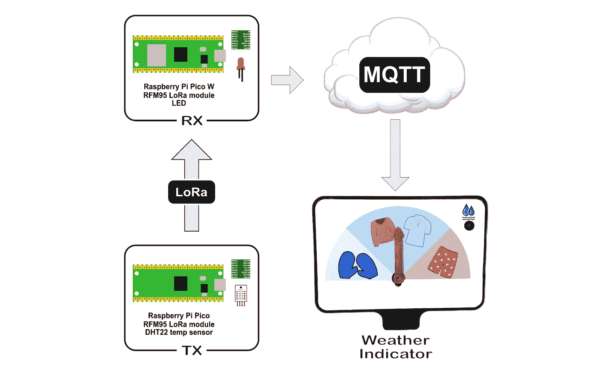

图 10.1 – 使用 LoRa 传输的传感器数据控制模拟仪表的天气指示器

在*图 10*.1 中，我们可以看到我们的 Raspberry Pi Pico LoRa 传感器发射器从*第九章*发送温度和湿度数据通过 LoRa 到我们也在*第九章*中构建的 LoRa 接收器。我们不需要更改发射器的代码，因为它执行了我们需要的操作。正如提到的，我们将根据需要更新 LoRa 接收器的代码，以便它能够连接到互联网并发送 MQTT 消息。

一旦我们确认我们的 MQTT 代码工作正常，我们将构建天气指示器的新版本，并编程它以相应地响应 MQTT 消息。

我们将首先将 CircuitPython MQTT 库添加到我们的 LoRa 接收器中。

## 安装 MQTT 的 CircuitPython 库

微控制器 MQTT 库使物联网设备能够使用 MQTT 协议，这是一种针对低带宽和最小设备资源优化的消息系统。这些库为各种微控制器平台设计，使设备能够连接到 MQTT 代理，发布消息和订阅主题。

在这些库中，Adafruit MiniMQTT 库对于 CircuitPython 设备来说尤为突出。这个库提供了一个简单的 API，适用于如 Raspberry Pi Pico W 这样的板子。它支持关键的 MQTT 功能，如发布/订阅，并与各种 MQTT 代理一起工作。

要安装 MiniMQTT 库，我们执行以下操作：

1.  使用网络浏览器，我们导航到 URL [`circuitpython.org/libraries`](https://circuitpython.org/libraries)。

1.  由于我们使用的是 CircuitPython 8，我们下载`adafruit-circuitpython-bundle-8.x-mpy-20231205.zip` ZIP 文件，并将其解压缩到我们的计算机上的某个位置。

1.  我们希望将库文件安装到我们的 Raspberry Pi Pico W 的`lib`文件夹中，而不是根目录。因此，我们需要在 Thonny 的**CircuitPython**部分下双击`lib`文件夹以打开它。

1.  我们感兴趣的 Adafruit 库中的文件位于`adafruit_minimqtt`文件夹中。要将这些文件安装到我们的 Raspberry Pi Pico W 上（使用 Thonny），我们在 Thonny 的**文件**部分打开文件夹，然后右键单击以获取以下对话框：

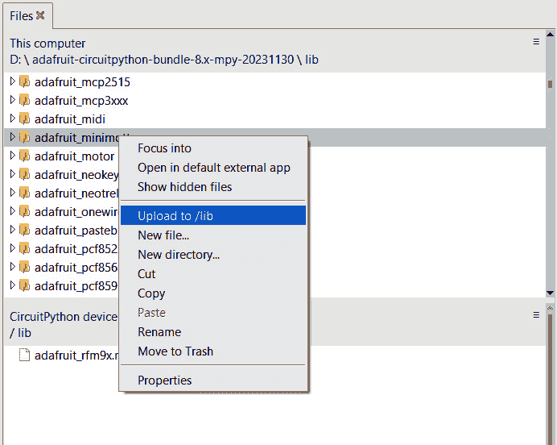

图 10.2 – 将 MQTT 库上传到 Raspberry Pi Pico

1.  在 Pico W 上上传库后，我们的 Pico 上的文件结构应如下所示：

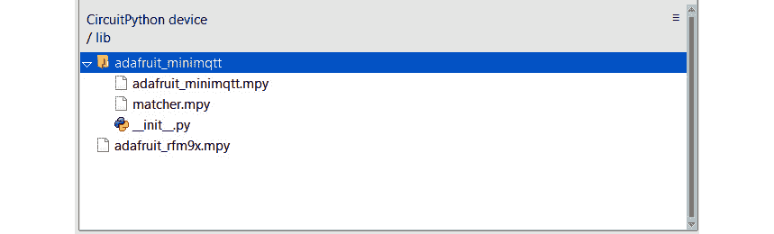

图 10.3 – 上传 Mini MQTT 后的 Pico W 文件结构

在我们的 Raspberry Pi Pico W 上设置了 Adafruit MQTT 库后，我们的下一步是配置一个 CloudAMQP 实例来作为我们的 MQTT 消息的代理。

让我们立即这样做。

## 为我们的应用程序创建一个 CloudAMQP 实例

在 *第七章* 中已经设置了一个账户，我们现在准备创建一个 CloudAMQP 实例，作为从我们的 Raspberry Pi Pico W 发送的 MQTT 消息的代理。按照 *第七章* 中“设置 CloudAMQP 实例”部分的说明，我们创建了一个新实例，命名为 `RemoteWeatherStation`，并记录详细信息以供我们在 LoRa 接收器代码中使用。

我们将利用 CloudAMQP 实例的 WebSocket UI 来观察来自我们的 LoRa 发射器的消息，使我们能够在构建和实施新的天气指示器之前彻底测试我们的应用程序。

让我们继续修改 LoRa 接收器上的代码，添加 MQTT 功能，使其能够向 `RemoteWeatherStation` 实例发布 MQTT 消息。

## 向 LoRa 接收器添加 MQTT 功能

在创建 CloudAMQP 实例后，我们现在将增强 LoRa 接收器上的代码，以包含 Wi-Fi 和 MQTT 功能。这种修改使接收器能够有效地利用 LoRa 从我们的发射器接收传感数据，然后利用 Wi-Fi 进行互联网连接。

利用 MQTT 协议，接收器可以将这些传感数据传输到我们的 CloudAMQP 服务器。这种集成不仅展示了不同通信技术之间的协同作用——LoRa 用于本地、长距离传输，而 MQTT 通过 Wi-Fi 用于全球覆盖——而且极大地扩展了我们的物联网生态系统功能。我们的 LoRa 接收器成为一座桥梁，在本地收集传感信息，并通过互联网分发。

要修改 LoRa 接收器代码，我们执行以下操作：

1.  我们将我们的 Raspberry Pi Pico W 从 LoRa 接收器连接到 USB 端口，并使用我们选择的计算机和操作系统启动 Thonny。

1.  然后，我们通过选择屏幕右下角来激活我们的 Pico W 上的 CircuitPython 环境。

1.  在编辑器部分的新标签页（按 *Ctrl* + *N*），我们首先输入我们的导入：

    ```py
    import time
    import board
    import busio
    import digitalio
    import adafruit_rfm9x
    import wifi
    import socketpool
    from adafruit_minimqtt.adafruit_minimqtt import MQTT
    ```

    在我们的代码中，我们有以下内容：

    +   `time` 库用于代码中的计时和延迟。

    +   `board` 模块提供了对微控制器基本引脚设置的访问。

    +   `busio` 模块用于创建总线通信接口，这对于像 RFM9x LoRa 模块这样的设备至关重要。

    +   `digitalio` 用于管理数字 I/O 引脚。

    +   `adafruit_rfm9x` 模块专门用于与安装在 LoRa 接收器上的 RFM95W LoRa 无线电模块进行接口。

    +   包含了 `wifi` 模块来处理微控制器上的 Wi-Fi 连接。

    +   `socketpool` 提供了一种管理网络套接字的方法，这对于互联网通信是必需的。在我们的 CircuitPython 代码中，此模块对于高效管理网络套接字至关重要，这对于通过 `adafruit_minimqtt` 库进行 MQTT 通信是必不可少的。它通过 Wi-Fi 提供稳定的 TCP/IP 连接。

    +   导入 `adafruit_minimqtt` 以启用 MQTT 协议通信，允许设备发布和订阅 MQTT 主题。

1.  在导入之后，我们设置我们的 Wi-Fi 网络（SSID）和 Wi-Fi 密码：

    ```py
    WIFI_SSID = 'MySSID'
    WIFI_PASSWORD = 'wifi-password'
    ```

1.  然后，我们进入代码以初始化 `GP5` GPIO 引脚作为数字输出，以控制连接到该引脚上的微控制器上的 LED：

    ```py
    led = digitalio.DigitalInOut(board.GP5)
    led.direction = digitalio.Direction.OUTPUT
    ```

1.  我们定义了 `flash_led()` 方法，该方法闪烁 LED 指定次数，每次闪烁的持续时间由秒数设置：

    ```py
    def flash_led(times, duration):
        for _ in range(times):
            led.value = True
            time.sleep(duration)
            led.value = False
            time.sleep(duration)
    ```

1.  接下来，我们定义 `connect_to_wifi()` 函数。此函数反复尝试使用提供的 SSID 和密码连接到 Wi-Fi，通过闪烁 LED 两次，每次持续 2 秒，然后暂停 5 秒再重试来表示失败的尝试。在成功连接后，它退出循环，并闪烁 LED 四次，每次持续 1 秒，以表示成功的 Wi-Fi 连接：

    ```py
    def connect_to_wifi(ssid, password):
        while True:
            try:
                print("Trying to connect to WiFi...")
                wifi.radio.connect(ssid, password)
                print("Connected to Wi-Fi!")
                flash_led(4, 1)
                break
            except Exception as e:
                print("Failed to connect to WiFi. Retrying...")
                flash_led(2, 2)
                time.sleep(5)
    connect_to_wifi(WIFI_SSID, WIFI_PASSWORD)
    flash_led(4, 1)
    ```

1.  然后，我们创建了一个名为 `pool` 的变量，它是 `socketpool.SocketPool` 的一个实例，使用 `wifi.radio` 对象，该对象管理和提供 Wi-Fi 通信的网络套接字连接：

    ```py
    pool = socketpool.SocketPool(wifi.radio)
    ```

1.  接下来，我们的代码设置 MQTT 配置，定义服务器地址 (`MQTT_SERVER`)、端口号 (`MQTT_PORT`)、用户凭据 (`USERNAME` 和 `PASSWORD`)、设备标识符 (`DEVICE_ID`) 和 MQTT 主题 (`MQTT_TOPIC`) 以进行通信。我们从为我们的应用程序设置的 CloudAMQP 实例中获取这些值：

    ```py
    MQTT_SERVER = "mqtt-server-url"
    MQTT_PORT = 18756
    USERNAME = "instance-username"
    PASSWORD = "instance-password"
    DEVICE_ID = "LoRaReceiver"
    MQTT_TOPIC = "WeatherInfo"
    ```

1.  然后，我们将 `GP18`、`GP19` 和 `GP16` 分别配置为 SCK、MOSI 和 MISO，并初始化数字 I/O 引脚 `GP17` 和 `GP14` 以用于 **芯片选择** （**CS**） 和 **复位** （**RST**） 功能。CS 引脚用于选择 LoRa 模块进行通信，而 RST 引脚用于复位模块，确保它从已知状态开始：

    ```py
    spi = busio.SPI(board.GP18, MOSI=board.GP19, MISO=board.GP16)
    cs = digitalio.DigitalInOut(board.GP17)
    rst = digitalio.DigitalInOut(board.GP14)
    ```

1.  我们通过创建一个 `adafruit_rfm9x.RFM9x` 实例来初始化 RFM9x LoRa 无线电模块，该实例使用先前配置的 SPI 总线 (`spi`)、芯片选择 (`cs`) 和复位 (`rst`) 引脚，并将工作频率设置为 915.0 MHz，因为我们的示例是为北美使用而构建的：

    ```py
    rfm9x = adafruit_rfm9x.RFM9x(spi, cs, rst, 915.0)
    ```

1.  然后，我们通过创建 MQTT 实例并指定 MQTT 代理详情（`MQTT_SERVER` 和 `MQTT_PORT`）、用户凭据（`USERNAME` 和 `PASSWORD`）以及先前创建的套接字池（`pool`）来设置 MQTT 客户端，用于网络通信：

    ```py
    mqtt_client = MQTT(broker=MQTT_SERVER, port=MQTT_PORT, username=USERNAME, password=PASSWORD, socket_pool=pool)
    ```

1.  我们的代码将 MQTT 客户端连接到 MQTT 代理，并打印一条消息，表明系统现在已准备好监听传入的 LoRa 消息：

    ```py
    mqtt_client.connect()
    print("Listening for LoRa messages...")
    ```

1.  我们创建一个连续循环来检查 RFM9x LoRa 模块的传入数据包；接收到数据包后，我们的代码将消息解码为 UTF-8 格式，打印接收到的消息，LED 闪烁两次，每次 0.5 秒，然后将消息发布到指定的 MQTT 主题，并打印已发送 MQTT 消息的确认信息：

    ```py
    while True:
        packet = rfm9x.receive()
        if packet is not None:
            message = packet.decode("utf-8")
            print("Received LoRa message:", message)
            flash_led(2, 0.5)
            mqtt_client.publish(MQTT_TOPIC, message)
            print("Sent MQTT message:", message)
    ```

1.  要保存文件，我们从下拉菜单中选择**文件** | **另存为...**。这将打开**保存位置**对话框。


图 10.4 – 将文件保存到我们的 Raspberry Pi Pico W

1.  在此对话框中，我们有机会选择文件存储的位置。要将文件保存在我们的 Raspberry Pi Pico W（CircuitPython 设备）上，我们点击相应的按钮。

1.  然后，我们将文件命名为`code.py`并点击**确定**。

1.  要运行我们的代码，我们点击绿色的运行按钮，在键盘上按*F5*，或者在顶部的**运行**菜单选项中点击，然后选择**运行** **当前脚本**。

1.  如果它尚未运行，我们打开电源并运行 LoRa 传感器发射器。

1.  我们通过检查 Windows 中的 MQTT-Explorer 应用中 MQTT 消息的接收情况来验证代码的正确运行。

1.  我们还应观察我们的 LED 闪烁两次。

通过从 LoRa 传感器发射器读取温度和湿度读数，并使用我们的 LoRa 接收器将它们中继到我们的 MQTT 服务器，就像接力赛中的接力一样，我们有效地建立了自己的天气信息网络服务。

在设置准备就绪后，我们现在可以利用 MQTT 消息数据来操作我们的改进的模拟仪表式天气指示器。我们的第一步是构建设备，然后编程它以响应传入的数据。

# 创建新的天气指示器

在本节中，我们介绍一个升级的天气指示器，基于*第三章*中的版本。此型号使用 RGB LED 而不是单色 LED。我们将使用它通过将颜色设置为红色来指示低湿度，绿色表示 30%至 50%的湿度水平（被认为是人们舒适的湿度水平），以及蓝色表示 50%以上的湿度。设备现在使用经济的 Raspberry Pi Pico WH，而不是更昂贵的 Raspberry Pi 5。新增功能是 Raspberry Pi Pico WH 的复位按钮，允许我们在需要时重置 Pico。

我们升级的天气指示器设计包括一个新功能：一个专门为使用**熔融沉积建模**（**FDM**）3D 打印机更容易打印的分割支架。通过将支架分成两个独立的部分，每个部分都可以平印。当平印时，支架每个部分的层线与使用过程中遇到的主要应力轴垂直。这种层垂直排列有效地在整个结构上分布应力，使支架更具弹性，更不易在负载下断裂或变形。

我们将开始构建我们新的天气指示器，首先构建分裂支架。

## 构建分裂支架

我们可以使用本书中构建的任何支架来安装我们的天气指示器面板。在我们的例子中，我们介绍了一种可以使用标准 FDM 3D 打印机或液体树脂 3D 打印机打印的分裂支架。分裂支架的部件如下所示：


图 10.5 – 使用 PLA 和 FDM 3D 打印机打印的分裂支架

分裂支架的部件如下：

+   *A*：右侧分裂支架

+   *B*：左侧分裂支架

+   *C*：底座

+   *D*（未显示）：9 个 M3 10 毫米螺栓

+   *E*（未显示）：4 个 12 毫米橡胶垫（可选）

我们分裂支架的`.stl`文件位于本章 GitHub 仓库的`Build Files`文件夹中。*图 10.5*中显示的所有三个部件都可以在一个标准 Ender-3 尺寸的打印床上（220 毫米×220 毫米×250 毫米）一起打印。

当使用 FDM 打印机时，重要的是要带有支撑结构的切片打印文件，特别是当分裂支架的外环在打印成平面时在空间中*漂浮*。对于分裂支架，**聚乳酸**（**PLA**）材料是最佳选择，因为它易于打印且结果可靠。

在以下图中，我们可以看到我们如何在打印床上定位分裂支架的部件。

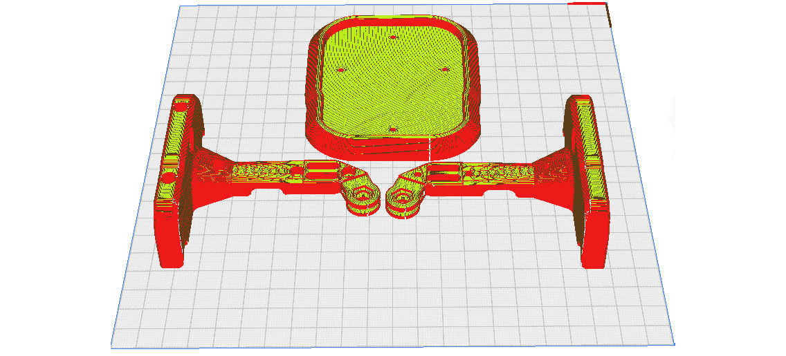

图 10.6 – 在打印床上布局 3D 打印的分裂支架部分

为了构建支架，我们按照*图 10.7*中显示的步骤进行：


图 10.7 – 构建分裂支架

1.  利用 M3 丝锥，我们在分裂支架的右侧（*图 10.5*中的*A*）小心地创建螺纹。这一步是可选的，因为孔应该足够大，以便 M3 螺栓可以拧入而不需要攻丝。

1.  使用五个 M3 10 毫米螺栓，我们将左侧分裂支架（*图 10.5*中的*C*）固定到右侧分裂支架（*图 10.5*中的*A*）。

1.  接下来，我们使用环氧树脂胶水将四个标准 12 毫米橡胶垫粘贴到底座的底部作为脚，以增强粘附性。这一步虽然不是强制性的，但增加了稳定性，因为支架可以在没有橡胶垫的情况下工作。

1.  使用 M3 丝锥，我们在底座上创建螺纹。这一步是可选的，因为孔应该足够大，以便 M3 螺栓可以拧入而不需要攻丝。

1.  使用四个 M3 螺栓，我们将组装好的支架固定到底座上（*图 10.5*中的*C*）。

组装好的分裂支架可以喷漆以改善美观。一旦分裂支架完成，下一步就是组装我们的天气指示器的面板。

## 构建面板

我们新的增强型天气指示器的面板与我们之前在 *第三章* 中构建的面板非常相似。区别在于使用了 Raspberry Pi Pico WH 而不是 Raspberry Pi 5，以及 RGB LED，这将允许我们为指示器使用各种颜色。

我们可以在以下图中看到组成面板的部件：


图 10.8 – 组成我们天气指示器面板的部件

+   *A*: 面板正面。

+   *B*: 面板校准工具。

+   *C*: Raspberry Pi Pico WH。

+   *D*: 面板正面按钮。用于重置 Raspberry Pi Pico WH。

+   *E*: 钩子。

+   *F*: 面板背面。

+   *G*: 面板图形。

+   *H*: 带有电阻和跳线（跳转到即将到来的部分 *添加跳线到 RGB LED* 以构建此组件）的 RGB LED。

+   *I*: SG90 伺服电机。

+   *J*: 8 mm LED 支架。

要构建我们新的天气指示器的面板，我们遵循以下图中的步骤：

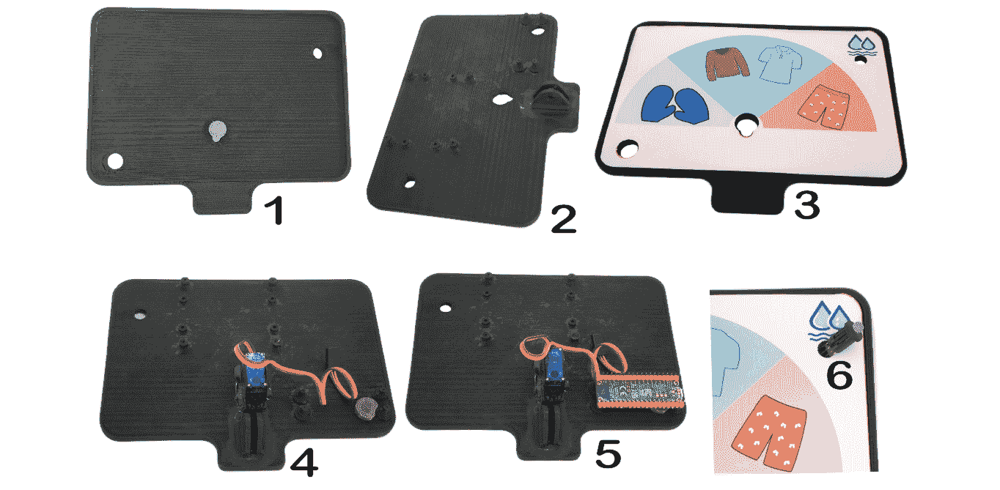

图 10.9 – 我们新的天气指示器面板的构造

1.  使用校准工具（*B* 来自 *图 10.8*）和环氧树脂胶水，我们将面板正面（*A* 来自 *图 10.8*）与面板背面（*F* 来自 *图 10.8*）对齐并粘合。

1.  我们将钩子（*E* 来自 *图 10.8*）用胶水粘在面板背面（*F* 来自 *图 10.8*）的槽中。

1.  我们使用彩色打印机将面板图形（*G* 来自 *图 10.8*）打印在可打印的乙烯基上。接下来，我们使用数字切割机，如 Silhouette Cameo，或手工裁剪图形，并将其粘贴到面板的前面，确保孔的适当对齐。

1.  我们将 SG90 伺服电机（*I* 来自 *图 10.8*）与相应的孔对齐，并用热胶枪的胶水将其固定在面板背面（*F* 来自 *图 10.8*）上。

1.  我们使用四个 M3 8 mm 螺丝将 Raspberry Pi Pico WH（*C* 来自 *图 10.8*）固定在面板背面（*F* 来自 *图 10.8*）上，使得引脚向上，USB 端口向外。

1.  我们将 RGB LED（*H* 来自 *图 10.8*）从面板背面推到前面，并用 8 mm LED 支架（*J* 来自 *图 10.8*）固定在位。

在构建了面板和底座之后，我们现在可以使用 M5 20 mm 螺栓和螺母将面板固定到底座上。完成此操作后，我们就准备好连接 RGB LED 和伺服电机到 Raspberry Pi Pico WH 了。

## 配置 RGB LED 指示器

对于我们的应用，我们将使用 RGB LED 来表示我们从远程 LoRa 发射器获得的湿度读数。RGB LED 允许我们将任何颜色表示出来，因为它将三个 LED（红色、绿色和蓝色）组合到一个外壳中。

在我们连接和安装 RGB LED 之前，让我们先了解一下 RGB LED 是什么。

### 理解 RGB LED

RGB LED 通过组合红、绿、蓝三种光线来产生各种颜色。每种颜色都有一个用于控制的引脚。它们有两种类型：公共阴极和公共阳极（*图 10.10*）。公共阴极 LED 具有一个所有颜色共用的单个接地引脚，需要向颜色引脚施加正电压以实现照明。公共阳极 LED 共享一个正引脚，需要在颜色引脚上连接接地才能点亮。

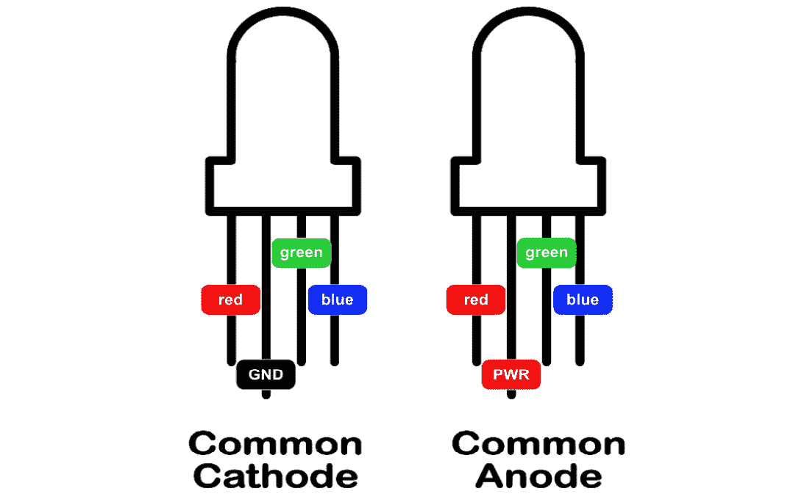

图 10.10 – 两种不同类型的 RGB LED

类型决定了我们如何连接和控制它们，公共阴极 LED 需要高信号激活，而公共阳极 LED 需要低信号激活。

区分公共阴极和公共阳极 RGB LED

要确定我们的 RGB LED 是公共阳极还是公共阴极类型，我们使用设置在二极管测试模式下的万用表。首先，我们识别 LED 的最长腿，因为这通常是公共连接。然后，我们将万用表的红表笔连接到最长腿，黑表笔连接到其他腿中的一个。如果 LED 点亮，则最长腿是阳极，表示这是一个公共阳极 LED。如果没有点亮，我们将交换表笔。黑表笔连接到最长腿时 LED 点亮，意味着它是一个公共阴极。

对于我们的应用，我们将使用公共阳极 RGB LED，并将它编程为根据湿度水平改变颜色。对于低湿度水平，它将显示红色，表示干燥条件。当湿度水平在 30%到 50%之间时，它将显示绿色，而当湿度水平高于 50%时，它将显示蓝色。

### 将跳线连接到我们的 RGB LED

为了将我们的 RGB LED 连接到 Raspberry Pi Pico WH，我们将在每个引脚上焊接雌性跳线。为了保护 RGB LED，我们将在红色、绿色和蓝色引脚上焊接 220 欧姆电阻，将它们放置在 LED 的腿和跳线之间。在我们的例子中，我们使用黄色线作为电源线，红色线作为红色 LED，绿色线作为绿色 LED，蓝色线作为蓝色 LED，如图所示。

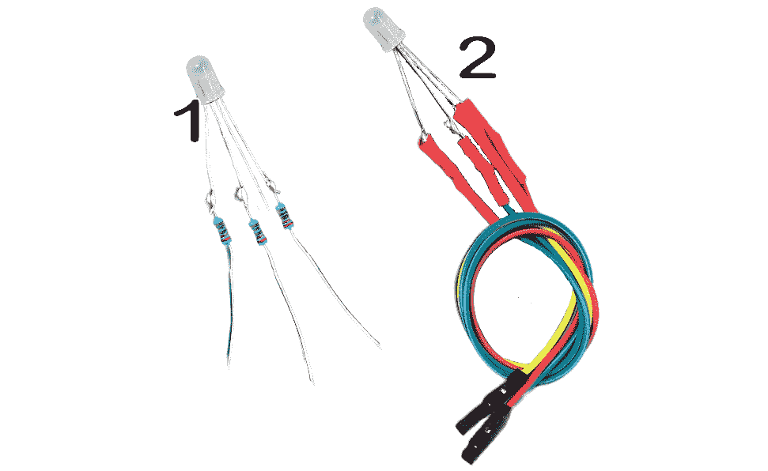

图 10.11 – 将跳线连接到 RGB LED

在*图 10.11*的第*2*步中所示，应用热缩套管通过提供物理强度和电气绝缘来加强焊接连接。

### 将 RGB LED 连接到我们的 Raspberry Pi Pico WH

我们将使用 Raspberry Pi Pico WH 的 3V3 电源端口来供电我们的 RGB LED。对于接线，请使用以下图示：

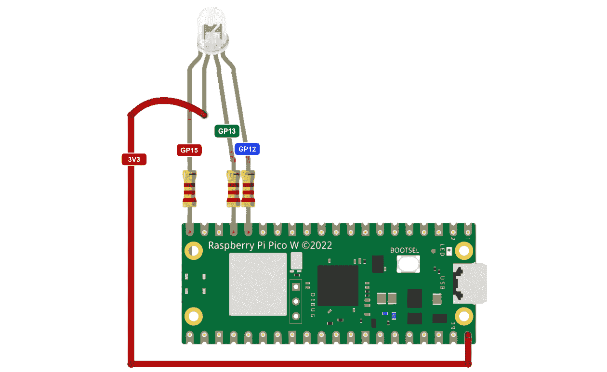

图 10.12 – RGB LED 和 Raspberry Pi Pico WH 的接线图

连接方式如下：

+   3V3 电源连接到公共阳极。

+   红色通过一个 220 欧姆电阻连接到`GP15`。

+   绿色通过一个 220 欧姆电阻连接到`GP13`。

+   蓝色通过一个 220 欧姆电阻连接到`GP12`。

将 RGB LED 连接到 Raspberry Pi Pico WH 后，现在是时候用代码测试它了。

### 测试我们的 RGB LED 电路

要测试我们的 RGB LED 电路，我们将运行代码来打开三种颜色中的每一种。我们将用 MicroPython 编写代码并使用 Thonny IDE。

要用代码测试我们的 RGB LED，我们做以下操作：

1.  我们将 Raspberry Pi Pico WH 连接到 USB 端口并启动 Thonny。我们可以使用 Raspberry Pi 或其他操作系统进行此操作。如果 MicroPython 尚未安装，我们按照*第六章*中“使用 Raspberry Pi Pico W 与 MQTT”部分的步骤，将其安装到我们的 Raspberry Pi Pico WH 上。

1.  然后，我们在屏幕的右下角选择 Pico 来激活 MicroPython 环境。

1.  在编辑器部分的新标签页（按*Ctrl* + *N*），我们输入以下代码：

    ```py
    from machine import Pin
    import utime
    red = Pin(15, Pin.OUT)
    green = Pin(13, Pin.OUT)
    blue = Pin(12, Pin.OUT)
    def set_color(r, g, b):
        red.value(r)
        green.value(g)
        blue.value(b)
    while True:
        # Red
        set_color(0, 1, 1)
        utime.sleep(1)
        # Green
        set_color(1, 0, 1)
        utime.sleep(1)
        # Blue
        set_color(1, 1, 0)
        utime.sleep(1)
    ```

1.  要保存文件，我们从下拉菜单中选择**文件** | **另存为...**。这将打开以下对话框：


图 10.13 – 将文件保存到我们的 Raspberry Pi Pico

1.  在此对话框中，我们有机会选择文件存储的位置。要将文件保存到我们的 Raspberry Pi Pico WH，我们点击相应的按钮。

1.  然后，我们给文件命名为`main.py`并点击，`main.py`是特殊的，因为系统在启动或重置时会自动执行此文件，使其成为设备启动时运行的默认脚本。

    在测试我们的代码之前，让我们将其分解：

    1.  我们首先从`machine`模块和`utime`模块导入`Pin`类。

    1.  然后，我们将 GPIO 引脚 GP15、GP13 和 GP12 初始化为输出，分别用于红色、绿色和蓝色 LED。

    1.  然后，我们定义`set_color(r, g, b)`函数来控制 RGB LED 的颜色。

    1.  我们定义一个无限循环：

        1.  我们将 LED 设置为红色 1 秒钟。

        1.  然后，我们将 LED 变为绿色 1 秒钟。

        1.  最后，我们将 LED 设置为蓝色 1 秒钟。

1.  要运行我们的代码，我们点击绿色运行按钮，在键盘上按*F5*或点击顶部的**运行**菜单选项，然后选择**运行** **当前脚本**。

1.  我们应该观察到我们的天气指示器上的 RGB LED 循环变红，然后变绿，然后变蓝。

在我们的 RGB LED 成功连接并测试后，现在是时候将伺服电机连接到我们的 Raspberry Pi Pico WH 了。

## 配置伺服电机

在我们的 RGB LED 安装并测试完毕后，现在是时候将我们的注意力转移到我们的天气指示器上的伺服电机。正如我们在*第三章*中提到的那样，将伺服电机集成到我们的设计中提供了一种将模拟和数字世界连接起来的优秀方法；它使我们能够创建一个模拟风格的仪表，其中由伺服电机精确移动的指针可以直观地表示各种数据点。

我们将首先连接伺服电机，然后再通过代码进行测试。

### 连接伺服电机

对于我们的天气指示器，我们将集成 SG90 伺服电机。SG90 伺服电机通常带有三根电线：电源线（通常是红色）、地线（通常是棕色或黑色）和信号线（通常是橙色或黄色）。

要将我们的伺服电机连接到 Raspberry Pi Pico WH，我们首先从连接器外壳中拔出电线，就像我们在*第三章*中所做的那样。

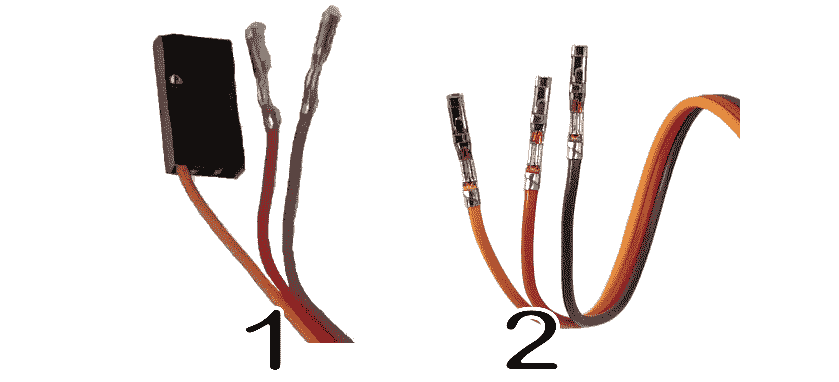

图 10.14 – 从 SG90 伺服电机的连接器中拔出电线

我们不会将电线重新插入连接器外壳，而是直接将它们连接到 Raspberry Pi Pico WH 的引脚上。

我们将使用 Raspberry Pi Pico WH 的 VBUS 电源端口为伺服电机供电，因为 VBUS 直接从 USB 连接提供必要的 5V 电源，这对于大多数伺服电机的典型工作电压（如 SG90）来说非常理想。

对于布线，请使用以下图示：

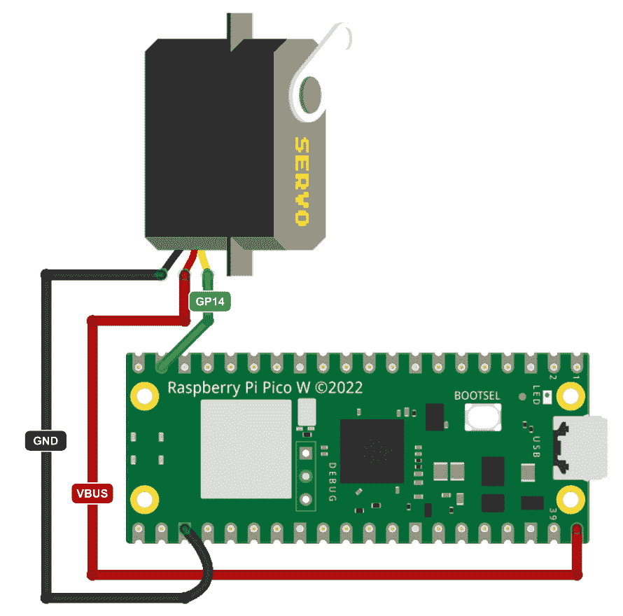

图 10.15 – 将伺服电机连接到 Raspberry Pi Pico WH

连接方式如下：

+   VBUS 电源连接到伺服电机的正极线。

+   信号线连接到`GP14`。

+   GND 连接到 Raspberry Pi Pico WH 上的 GND 端口。

重要提示

为了简单起见，*图 10*.*15*仅显示了连接到 Raspberry Pi Pico WH 的伺服电机。然而，我们的实际电路包括 RGB LED 和伺服电机。

将伺服电机连接到 Raspberry Pi Pico WH 后，是时候用代码测试它了。

### 测试伺服电机

为了验证我们的伺服电机电路的功能，我们将执行一个测试代码，使电机在 180 度范围内循环，最终停在最小位置。一旦电机达到这个最小点，我们将箭头连接到我们的设备上。我们将用 MicroPython 编写代码，并使用 Thonny IDE。我们的代码将组织成两个文件：`servo.py`，用于管理伺服电机的控制，以及`main.py`，它将作为主要的执行脚本。

要用代码测试我们的伺服电机，我们执行以下操作：

1.  我们将 Raspberry Pi Pico WH 连接到计算机上的 USB 端口，并启动 Thonny。我们可以使用 Raspberry Pi 或其他操作系统来做这件事。

1.  然后，我们通过在屏幕的右下角选择它来激活 Pico 上的 MicroPython 环境。

1.  我们将开始编写控制伺服电机的代码。在编辑器部分的新标签页（按*Ctrl* + *N*），我们输入以下代码：

    ```py
    from machine import Pin, PWM
    import utime
    class Servo:
        def __init__(self, pin):
            self.servo = PWM(Pin(pin))
            self.servo.freq(50)
        def set_position(self, angle):
            # Reverse the angle
            reversed_angle = 180 - angle
            # Convert the reversed angle to duty cycle
            duty = int((reversed_angle / 18) + 2)
            self.servo.duty_u16(duty * 65536 // 100)
    ```

    在我们的代码中，我们首先导入必要的模块：`machine`中的`Pin`和`PWM`用于硬件控制，以及`utime`用于时间相关函数。

    然后，我们定义`Servo`类来控制伺服电机：

    1.  `__init__()`方法将伺服电机初始化为指定 GPIO 引脚上的`set_position()`方法，将伺服电机设置为指定角度：

        1.  我们反转角度以允许伺服电机的反向运动。

        1.  我们然后将这个反转的角度转换为相应的 PWM 占空比。

        1.  我们使用`duty_u16()`方法设置占空比，将其缩放到 16 位值以进行 PWM 控制。

1.  要保存文件，我们从下拉菜单中选择**文件** | **另存为...**。

1.  我们可以选择将文件存储在哪里。为了将其保存在我们的 Raspberry Pi Pico WH 上，我们点击相应的按钮。

1.  我们然后将文件命名为`servo.py`并点击**确定**。

1.  要创建我们的`main.py`文件，我们在编辑器部分打开一个新的编辑器标签（按*Ctrl* + *N*），并输入以下代码：

    ```py
    from servo import Servo
    import utime
    servo = Servo(14)
    servo.set_position(0)
    utime.sleep(1)
    servo.set_position(90)
    utime.sleep(1)
    servo.set_position(180)
    utime.sleep(1)
    # Return servo to initial position
    servo.set_position(0)
    ```

    在我们的代码中，我们有以下内容：

    1.  我们首先从新创建的`servo`模块导入`Servo`类，以及`utime`用于计时功能。

    1.  我们然后创建一个名为`servo`的`Servo`类实例，使用 GPIO 引脚 GP`14`。

    1.  我们的代码将伺服电机移动到 0 度，并等待 1 秒钟。

    1.  我们的代码然后将伺服电机调整到 90 度，并等待另外 1 秒钟。

    1.  我们将伺服电机设置为 180 度，然后暂停 1 秒钟。

    1.  最后，我们的代码将伺服电机返回到初始位置 0 度。

1.  要运行我们的代码，我们点击绿色运行按钮，在键盘上按*F5*，或者在顶部点击**运行**菜单选项，然后选择**运行****当前脚本**。

1.  我们应该观察到伺服电机在停止在最小位置之前会经过一系列的运动。与使用 Raspberry Pi 5 连接伺服电机相比，使用 Raspberry Pi Pico WH 的一个显著改进是伺服电机的抖动消失。与 Raspberry Pi 相比，当使用 Raspberry Pi Pico WH 时，伺服电机抖动更少，这是因为 Pico 的直接硬件级 PWM 控制确保了向伺服电机提供更精确和稳定的信号。

1.  就在这个时候，我们在伺服电机上放置箭头。我们将箭头放置得使其指向我们的图形中的手套。箭头应该紧密贴合；然而，可能需要一点打磨才能使其贴合。


图 10.16 – 将指针放置在零位置

在成功连接并测试了 RGB LED 和伺服电机与我们的 Raspberry Pi Pico WH 之后，我们现在准备好开发控制我们的天气指示器的代码，利用从 MQTT 消息中提取的数据。

## 编程我们的天气指示器

我们的天气指示器开发流程简化了，因为组件直接放置在面板上，允许立即进行代码实现和测试，消除了需要搭建面包板的必要性。这也减少了出错的机会，因为我们不需要再次配置电路。

我们的应用软件架构如下所示。

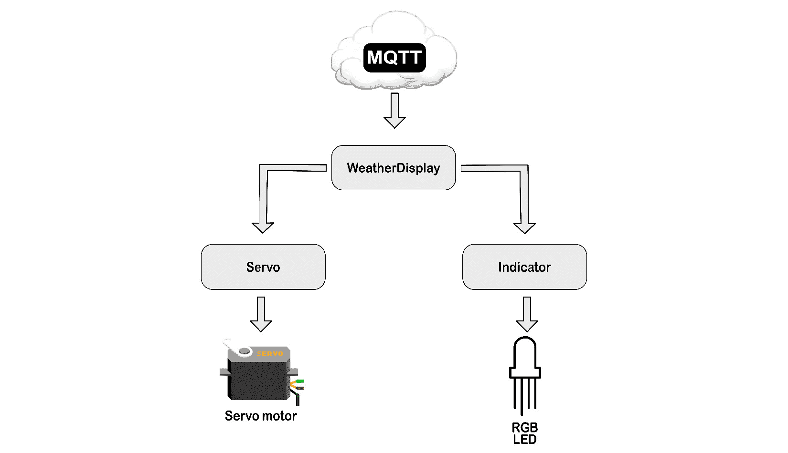

图 10.17 – 天气显示代码布局

我们的代码组织成三个文件，每个文件包含一个不同的类。`main.py`文件包含`WeatherDisplay`类，该类从我们的 CloudAMQP 实例检索并解析 MQTT 消息。根据这些消息中的温度值，`WeatherDisplay`类使用`Servo`类调整伺服位置（从而调整天气指示器的指针），并使用`Indicator`类解释湿度数据以控制 RGB LED 的颜色。

要创建我们的天气指示器代码，我们执行以下操作：

1.  我们将我们的 Raspberry Pi Pico WH 从天气指示器连接到电脑的 USB 端口，并启动 Thonny。我们可以使用 Raspberry Pi 或其他操作系统来完成这个操作。

1.  然后，我们从屏幕的右下角选择 MicroPython 环境来激活我们的 Pico WH。

1.  我们将从控制 RGB LED 的代码开始。这段代码将介绍`Indicator`类，该类旨在管理 RGB LED 的颜色过渡，从红色到绿色再到蓝色，反映湿度级别的变化。在编辑器部分的新的标签页（按*Ctrl* + *N*），我们输入以下代码：

    ```py
    from machine import Pin
    import utime
    class Indicator:
        def __init__(self):
            self.red = Pin(15, Pin.OUT)
            self.green = Pin(13, Pin.OUT)
            self.blue = Pin(12, Pin.OUT)
        def set_color(self, r, g, b):
            self.red.value(r)
            self.green.value(g)
            self.blue.value(b)
        def set_indicator(self, value):
            # Turn off all LEDs initially
            self.set_color(1, 1, 1)
            if value <= 30:
                # Turn on red LED
                self.set_color(0, 1, 1)
            elif 30 < value <= 50:
                # Turn on green LED
                self.set_color(1, 0, 1)
            else:
                # Turn on blue LED
                self.set_color(1, 1, 0)
        def flash_led(self, times):
            for _ in range(times):
                self.set_color(0, 0, 0)
                utime.sleep(0.5)
                self.set_color(1, 1, 1)
                utime.sleep(0.5)
    ```

    在我们的代码中，我们有以下内容：

    1.  我们首先从`machine`模块导入`Pin`类，以及`utime`来处理基于时间的函数。

    1.  我们定义`Indicator`类，并用代表红色、绿色和蓝色 LED 的三个属性初始化它，分别设置为 GP15、GP13 和 GP12 的输出引脚。

    1.  `set_color()`方法根据输入参数控制 RGB LED 中每个颜色的状态。在这个方法中，对于常见的阳极 RGB LED，二进制的`0`激活一个颜色（打开它），而`1`则使其不活跃（关闭它）。该方法用于选择性地打开 LED 的红色、绿色或蓝色组件。

    1.  然后，我们创建`set_indicator()`方法：

        1.  我们的代码最初关闭所有 LED。

        1.  我们的代码在值≤30 时打开红色 LED，在值介于 30 和 50 之间时打开绿色 LED，在值>50 时打开蓝色 LED。

    1.  在我们的`flash_led()`方法中，我们闪烁所有三个 LED（白光）指定次数（`times`），每次闪烁持续 0.5 秒，LED 关闭间隔也是 0.5 秒。

1.  要保存文件，我们从下拉菜单中选择**文件** | **另存为...**。

1.  我们有选择存储文件位置的选择。要将文件保存在我们的 Raspberry Pi Pico WH 上，我们点击相应的按钮。

1.  然后，我们将文件命名为`indicator.py`并点击**确定**。

1.  我们代码中的第二个类是伺服类的新版本。为了创建这个类，我们在编辑器部分打开一个新的标签页（按*Ctrl* + *N*），并输入以下代码：

    ```py
    from machine import Pin, PWM
    import utime
    class Servo:
        def __init__(self, pin):
            self.servo = PWM(Pin(pin))
            self.servo.freq(50)
        def set_position(self, value):
            int_value = int(value)
            angle = 180 - (int_value / 40) * 180
            angle = max(0, min(angle, 180))
            # Convert the angle to duty cycle
            duty = int((angle / 18) + 2)
            self.servo.duty_u16(duty * 65536 // 100)
    ```

    在我们的代码中，我们首先从`machine`导入`Pin`和`PWM`模块，以及`utime`用于时间相关函数。

    然后，我们定义`Servo`类来控制伺服电机：

    1.  在构造函数（`__init__()`）中，我们在指定的引脚上初始化一个 PWM 对象。

    1.  我们将 PWM 频率设置为 50 Hz，这是一个适合伺服电机的标准频率。

    1.  然后我们创建一个`set_position()`方法，执行以下操作：

        1.  将输入值转换为整数。

        1.  将输入范围（0-40）映射到伺服角度范围（0-180 度）的反向，以与我们的伺服电机安装对齐。

        1.  确保计算出的角度在有效范围内（0-180 度）。

        1.  将角度转换为适合伺服电机的占空比。

        1.  设置 PWM 占空比以定位伺服电机。

1.  要保存文件，我们从下拉菜单中选择**文件** | **另存为...**：

1.  我们可以选择将文件存储的位置。为了将其保存在我们的 Raspberry Pi Pico WH 上，我们点击相应的按钮。

1.  然后我们将文件命名为`servo.py`并点击**确定**。

1.  位于主执行文件中的`WeatherDisplay`类负责订阅`WeatherInfo` MQTT 主题并处理接收到的消息。为了其操作，需要`micropython-umqtt.simple`库。要安装此库，请参阅*第七章*中的*改进我们的 Raspberry Pi Pico W 物联网按钮*部分。

1.  要创建`WeatherDisplay`类，我们首先在编辑器部分的新标签中输入导入语句（按*Ctrl* + *N*）：

    ```py
    import network
    import utime
    from umqtt.simple import MQTTClient
    from servo import Servo
    from indicator import Indicator
    ```

    在我们的代码中，我们执行以下操作：

    1.  我们导入`network`模块，用于 Wi-Fi 连接功能。

    1.  我们导入`utime`模块，用于时间相关函数。

    1.  我们的代码从`umqtt.simple`导入`MQTTClient`来处理 MQTT 通信。

    1.  我们从新创建的本地模块中导入我们的`Servo`类，用于伺服电机控制。

    1.  然后我们从新创建的本地模块中导入我们的`Indicator`类，用于 RGB LED 指示器控制。

1.  然后我们定义类名和初始化方法，其中我们定义我们的 Wi-Fi 和 MQTT 参数：

    ```py
    class WeatherDisplay:
        def __init__(self):
            # WiFi Information
            self.ssid = "MySSID"
            self.wifi_password = "ssid-password"
            # MQTT Information
            self.mqtt_server = "driver.cloudmqtt.com"
            self.mqtt_port = 18756
            self.username = "mqtt-username"
            self.mqtt_password = "mqtt-password"
            self.device_id = "WeatherDisplay"
            self.mqtt_topic = "WeatherInfo"
            self.indicator = Indicator()
            self.servo = Servo(14)
    ```

1.  `connect_wifi()`方法在 Raspberry Pi Pico WH 和本地 Wi-Fi 网络之间建立连接。它持续尝试连接，直到成功，并在建立连接后，通过四次闪烁白色 RGB LED 来指示成功：

    ```py
        def connect_wifi(self):
            wlan = network.WLAN(network.STA_IF)
            wlan.active(True)
            if not wlan.isconnected():
                print('Connecting to WiFi...')
                wlan.connect(self.ssid, self.wifi_password)
                while not wlan.isconnected():
                    pass
            print('WiFi connected, IP:', wlan.ifconfig()[0])
            self.indicator.flash_led(4)
    ```

1.  我们使用`connect_mqtt()`方法连接到我们的 CloudAMQP 实例，并订阅`WeatherInfo`主题（由`mqtt_topic`变量设置），并将我们的回调函数设置为`on_message_received()`：

    ```py
        def connect_mqtt(self):
            self.client = MQTTClient(self.device_id,
                                     self.mqtt_server,
                                     self.mqtt_port,
                                     self.username,
                                     self.mqtt_password)
            self.client.set_callback(
                         self.on_message_received)
            self.client.connect()
            self.client.subscribe(self.mqtt_topic)
    ```

1.  `on_message_received()`函数通过解析温度和湿度数据，然后相应地更新伺服位置和 RGB LED 指示器来处理接收到的 MQTT 消息：

    ```py
        def on_message_received(self, topic, msg):
            print("Received:", topic, msg.decode())
            temperature, humidity =
                self.parse_message(msg)
            if temperature is not None:
                self.servo.set_position(temperature)
            if humidity is not None:
                self.indicator.set_indicator(humidity)
    ```

1.  `parse_message()`函数从解码的 MQTT 消息中提取并返回温度和湿度值，处理任何异常，如果解析失败则返回`None`值：

    ```py
        def parse_message(self, msg):
            try:
                parts = msg.decode().split(',')
                temperature_str = parts[0].split('Temp:')[1].split('C')[0].strip()
                humidity_str = parts[1].split('Humidity:')[1].split('%')[0].strip()
                temperature = float(temperature_str)
                humidity = float(humidity_str)
                return temperature, humidity
            except Exception as e:
                print("Error parsing message:", str(e))
                return None, None
    ```

1.  `run`方法是`WeatherDisplay`类中定义的最后一个方法，它初始化 Wi-Fi 连接，连接到 MQTT 客户端，并持续检查 MQTT 消息，处理在消息接收过程中遇到的任何错误：

    ```py
        def run(self):
            self.connect_wifi()
            self.connect_mqtt()
            while True:
                try:
                    self.client.check_msg()
                except Exception as e:
                    print("Error checking MQTT message:",
                           str(e))
                    utime.sleep(5)
    ```

1.  在编写`WeatherDisplay`类代码后，我们实例化它并调用其`run()`方法，启动天气显示功能，这包括建立 Wi-Fi 和 MQTT 连接以及处理传入的消息：

    ```py
    # Create and run the weather display
    weather_display = WeatherDisplay()
    weather_display.run()
    ```

1.  要保存我们的文件，我们从下拉菜单中选择**文件** | **另存为...**。

1.  我们可以选择将文件存储在哪里。要将它保存在我们的 Raspberry Pi Pico WH 上，我们点击相应的按钮。

1.  然后，我们将文件命名为`main.py`并点击**确定**。

1.  要运行我们的代码，我们点击绿色的运行按钮，在键盘上按*F5*，或者点击顶部菜单的**运行**选项，然后选择**运行****当前脚本**。

1.  我们应该注意到在连接到我们的 Wi-Fi 网络后，RGB LED 闪烁四次。

1.  我们应该注意到箭头移动到了一个位置，这个位置指示着来自我们 LoRa 传感器发射器上的温度传感器所测量的温度。

1.  我们应该注意到 RGB LED 的颜色要么是红色、绿色或蓝色，这表示由我们的 LoRa 传感器发射器测量的湿度水平。

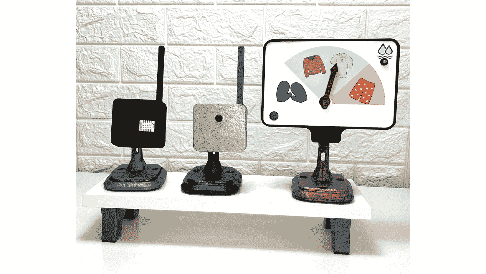

图 10.18 – 构成我们物联网天气服务的三个设备，从左到右分别是 LoRa 传感器发射器（*第九章*），LoRa 接收器/互联网网关（*第九章*），以及模拟仪表的天气指示器

在我们项目的完成之后，我们成功构建了一个物联网天气服务和显示控制台，结合了实时数据收集和交互式显示。该系统利用 MQTT 进行数据传输，伺服电机用于物理表示数据，以及 RGB LED 用于视觉警报。

# 探索其他物联网通信协议

与 LoRa 使用相同的亚千兆赫兹无线电频率，LoRaWAN 是一种先进的无线通信协议，它能够实现低功耗的长距离传输。这个共享的频率带是 LoRaWAN 和 LoRa 能够传输数公里数据的关键特性，这在传统连接稀缺的地区尤其有益。

在物联网应用（如天气监测）的背景下，LoRaWAN 提供了显著的优势。例如，一个收集环境数据（如温度和湿度）的传感器网络可以通过长距离传输这些信息到一个连接到互联网的中心网关，利用 LoRa 的长距离能力。然后，这个网关将数据中继到云端服务器进行处理和分析。

然而，对于我们的气象指示器项目，使用完整的 LoRaWAN 设置会被视为过度。我们的项目采用了一个更简单的设置，涉及两个 Raspberry Pi Pico 微控制器——一个配备 LoRa 进行数据传输（Raspberry Pi Pico）和另一个具有 Wi-Fi 功能（Raspberry Pi Pico W）。这种设置有效地展示了 LoRa 在短程物联网通信中的能力，利用了 LoRa 频率相同的远程、低功耗特性，但无需完整的 LoRaWAN 网络复杂性和基础设施要求。

蜂窝服务也可以用于物联网通信，提供广泛的覆盖范围和更高的数据传输速度。使用 4G LTE 或 5G 网络的蜂窝物联网设备可以在长距离传输大量数据。这使得蜂窝服务适合需要更多数据密集型应用或需要实时、高速通信的应用。

虽然蜂窝物联网提供了更广泛的覆盖范围和更高的数据吞吐量，但与基于 LoRa 的解决方案相比，它通常具有更高的功耗和复杂性。因此，对于我们的气象指示器等小型或低功耗项目，使用带有 Raspberry Pi Pico 微控制器的 LoRa 模块的简单性和效率提供了更合适且成本效益更高的解决方案。

**Sigfox** 是一家全球网络运营商，为物联网和**机器对机器**（**M2M**）通信提供专用蜂窝连接。它使用独特的无线传输技术，允许长距离、低功耗通信。Sigfox 在亚吉赫兹频段运行，旨在进行小数据负载传输，通常每条消息最多 12 字节。这种有限的数据容量使其非常适合需要发送小量、不频繁数据爆发设备，如智能电表的传感器、农业监控器和资产跟踪系统。Sigfox 的网络架构以其简单性、效率和经济性而著称，使其成为低成本和低功耗操作关键应用的热门选择。

LoRaWAN、蜂窝网络和 Sigfox 是物联网应用中使用的领先通信协议之一。每个都有其独特的特性和用例。以下是一个比较表格，概述了它们的优缺点：

| **协议** | **优点** | **缺点** |
| --- | --- | --- |
| LoRaWAN |

+   长距离（高达 15 公里）

+   低功耗

+   城市环境渗透良好

+   开放式协议，生态系统不断增长

|

+   数据速率较低

+   带宽和占空比限制

+   需要网关进行互联网连接

|

| 蜂窝（4G/5G） |
| --- |

+   高数据吞吐量

+   广泛覆盖和可靠性

+   支持实时通信

+   基础设施完善

|

+   功耗更高

+   订阅费用

+   对于简单任务可能过于强大

|

| Sigfox |
| --- |

+   极低功耗

+   长距离能力

+   部署和维护简单

+   适用于小型、不频繁的数据传输

|

+   非常有限的数据负载（每条消息 12 字节）

+   每天限制为 140 条消息

+   有限灵活性的专有技术

|

| 带有 Wi-Fi 微控制器的 LoRa |
| --- |

+   长距离（LoRa 可达 15 公里）

+   LoRa 传输的低功耗

+   小型项目成本效益高的解决方案

+   与现有 Wi-Fi 网络灵活且易于集成

|

+   仅限于 Wi-Fi 网络的范围进行互联网连接

+   与单个微控制器绑定，可能不适用于移动应用

+   需要额外的硬件（Wi-Fi 微控制器）进行互联网连接

+   与使用单个协议相比，可能需要更复杂的设置和编码

|

表 10.1 – 比较物联网通信协议

每个协议服务于不同的物联网场景：

+   **LoRaWAN**：适用于需要长距离通信和低功耗的应用，如农业传感器或智能城市应用。

+   **蜂窝网络**：适用于高数据量、实时应用，如视频监控、汽车应用或任何需要广泛地理覆盖的场景。

+   **Sigfox**：在设备只需在长距离发送少量数据的情况下表现优异，如公用事业计量或资产跟踪。

+   **带有 Wi-Fi 微控制器的 LoRa**：最适合需要 LoRa 的远程能力和 Wi-Fi 提供的互联网连接的小型、本地物联网项目，如智能家居、本地环境监测或 DIY 物联网项目。

对于像我们的天气指示器这样的小型或低功耗项目，使用带有 Raspberry Pi Pico 微控制器的 LoRa 模块比提到的选项提供更合适且成本效益更高的解决方案。LoRa 与微控制器平衡了范围、数据处理和能效，无需更复杂的基础设施。

# 摘要

在本章中，我们通过 MQTT 集成了基于 LoRa 的数据传输和互联网连接。我们修改了基于 CircuitPython 的 LoRa 接收器的代码，使其能够将传感器数据发送到 CloudAMQP 服务器，将其转变为互联网网关。天气指示器得到了升级，用 Raspberry Pi Pico WH 和 RGB LED 替换了 Raspberry Pi 5 和单色 LED，通过 MQTT 消息显示温度和湿度数据。

此外，我们还为指示器构建了一个新的分体支架，设计用于易于组装和改进稳定性。我们通过检查物联网通信协议，如 LoRaWAN、蜂窝网络和 Sigfox，评估它们对不同物联网应用的适用性来结束本章。

我们通过 MQTT 将 LoRa 与互联网连接进行了实际操作探索，展示了不同技术如何在物联网应用中协同工作。通过升级天气指示器，我们不仅学习了迭代设计和故障排除，还深入了解到了物联网项目中涉及到的决策过程，例如选择树莓派 Pico WH 而不是树莓派 5 来控制伺服电机。

本章标志着本书第三部分的结束，该部分专注于物联网通信，特别强调 LoRa。在下一章中，我们将转向机器人技术，开始我们的旅程，构建一辆互联网连接的机器人汽车。

# 第四部分：构建物联网机器人汽车

在这部分，我们利用前几章所获得的所有知识来构建一辆可以通过互联网控制的物联网机器人汽车。这个项目将是最高级的，并展示了物联网技术的终极力量，从任何地方控制任何事物。

本部分包含以下章节：

+   *第十一章*，*介绍 ROS*

+   *第十二章*，*创建物联网摇杆*

+   *第十三章*，*介绍用于安全的先进机器人眼睛（A.R.E.S.）*

+   *第十四章*，*为 A.R.E.S.添加计算机视觉*
