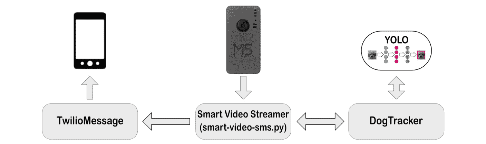

# 第十四章：将计算机视觉添加到 A.R.E.S.

在本章的最后，我们将向 A.R.E.S.添加计算机视觉功能。这将使 A.R.E.S.能够识别物体，并通过短信通知我们这些物体的存在。在我们的例子中，我们将识别狗，尽管我们同样可以设置我们的目标识别代码来识别其他物体。

我们将通过探索**计算机视觉**及其定义来开始我们的旅程，然后再下载和安装**开源计算机视觉**（**OpenCV**）库和**你只看一次**（**YOLO**）目标检测系统。在设置好这些工具之后，我们将探索一些实际操作示例。

到本章结束时，你将构建一个智能视频流应用程序，该程序利用 A.R.E.S.摄像头的视频流。

本章我们将涵盖以下主题：

+   探索计算机视觉

+   将计算机视觉添加到 A.R.E.S.

+   发送文本警报

让我们开始吧！

# 技术要求

完成本章内容你需要以下条件：

+   Python 编程的中级知识

+   A.R.E.S.机器人来自*第十三章*

+   一台具有 GUI 风格的操作系统计算机，例如 Raspberry Pi 5、macOS 或 Windows

本章的代码可以在以下位置找到：[`github.com/PacktPublishing/-Internet-of-Things-Programming-Projects-2nd-Edition/tree/main/Chapter14`](https://github.com/PacktPublishing/-Internet-of-Things-Programming-Projects-2nd-Edition/tree/main/Chapter14)。

# 探索计算机视觉

计算机视觉始于 20 世纪 50 年代，随着 20 世纪 60 年代图像处理算法的关键里程碑和 20 世纪 90 年代 GPU 的引入而显著发展。这些进步提高了处理速度和复杂计算，并实现了实时图像分析和复杂模型。现代计算机视觉技术是这些发展的结果。以下图表显示了计算机视觉在人工智能中的位置：


图 14.1 – 人工智能

*图 14.1* 展示了一系列同心圆，代表人工智能不同领域之间的关系。核心是计算机视觉，周围是**目标检测**，它是深度学习的一个子集，嵌套在机器学习之中。所有这些都包含在更广泛的人工智能领域内。

并非所有计算机视觉技术都涉及机器学习或深度学习，但计算机视觉的一部分——目标检测，通常是这样。

图像识别、目标识别、目标检测和图像分类之间的区别是什么？

在计算机视觉中，诸如 **图像识别**、**目标识别**、**目标检测** 和 **图像分类** 等术语描述了特定的过程。图像识别检测图像内的特征或模式。目标识别超越了这一点，以识别图像或视频中的特定对象，尽管它不指定它们的精确位置，而是专注于识别 *存在什么* 对象，而不是 *它们在哪里*。相反，目标检测不仅识别对象，还从空间上定位它们，通常使用边界框。同时，图像分类涉及分析整个图像，将其分配到特定的类别，例如确定图像是否显示狗、猫或汽车。对于 A.R.E.S.，我们希望有一个视频流，它会在检测到的对象周围创建一个边界框。因此，我们将在应用程序中使用目标检测。

在本章中，我们将 OpenCV 和 YOLO 深度学习算法集成到 A.R.E.S. 中，以便我们可以使用目标检测来检测狗的存在。

我们将通过熟悉 OpenCV 库来开始我们对计算机视觉的探索。

## 介绍 OpenCV

OpenCV 是计算机视觉领域的基础工具，提供了实时图像处理的大量功能。OpenCV 支持多种应用，从简单的图像变换到复杂的机器学习算法。

OpenCV 不仅允许快速原型设计，还支持跨各种操作系统的全面应用开发，使其成为爱好者和教育工作者以及商业开发者的绝佳选择。

在本节中，我们将探索 OpenCV 的核心功能。我们将从创建一个 Python 虚拟环境和项目文件夹开始。

### 使用 OpenCV 查看图像

开始使用 OpenCV 可以简单到在窗口中显示一个图像。这个基本练习介绍了 OpenCV 中用于图像加载、处理和窗口操作的关键函数。按照以下步骤操作：

1.  首先打开一个终端窗口。我们可以在 Raspberry Pi 5 上使用 Raspberry Pi 操作系统，或者使用我们选择的另一个操作系统。

1.  为了存储我们的项目文件，我们必须创建一个新的目录和子目录（用于图像），可以使用以下命令（这里使用的是 Linux 命令）：

    ```py
    mkdir -p Chapter14/images
    ```

1.  然后，我们导航到新目录：

    ```py
    images subdirectory, we can run the following command:

    ```

    如果尚未安装 venv 库）：

    ```py
    python -m venv ch14-env --system-site-packages
    ```

    ```py

    ```

1.  在创建我们的新 Python 虚拟环境后，我们可以使用以下命令将其激活：

    ```py
    opencv-python library. We can install this library with the following Terminal command:

    ```

    pip install opencv-python

    ```py

    ```

1.  我们通过运行以下命令来关闭终端：

    ```py
    exit
    ```

1.  接下来，我们启动 Thonny 并激活我们新创建的 Python 虚拟环境：


图 14.2 – 激活我们的 Python 虚拟环境

1.  接下来，我们将创建一个新标签页。我们可以通过选择 **文件** 然后选择 **新建** 或者通过在键盘上按 *Ctrl* + *N* 来实现。

1.  在编辑器中输入以下代码：

    ```py
    import cv2 as cv
    img = cv.imread('images/Toronto.png')
    cv.imshow('Downtown Toronto', img)
    cv.waitKey(0)
    cv.destroyAllWindows()
    ```

    让我们更仔细地看看这段代码：

    1.  首先，我们导入`OpenCV`库，并给它一个别名`cv`，以便在代码中更容易引用。

    1.  我们的代码接着将`Toronto.png`图像文件从`images`文件夹读取到`img`变量中。

    1.  接下来，我们创建一个名为`Downtown Toronto`的窗口，并在其中显示`img`。

    1.  然后，我们的代码在继续执行下一行代码之前无限期地等待一个按键事件。`0`值表示它将等待直到按键被按下。

    1.  最后，我们销毁在会话期间创建的所有窗口，并确保在脚本运行后没有 OpenCV UI 窗口保持打开。这可能会引起内存泄漏。

1.  我们将代码保存为具有描述性名称的文件，例如在`Chapter14`项目文件夹中保存为`Toronto.py`。

1.  我们通过点击绿色运行按钮，按键盘上的*F5*，或在顶部菜单中选择**运行**然后**运行当前脚本**来运行代码。

    我们应该看到一个包含多伦多市图像的窗口出现：


图 14.3 – 显示多伦多市区的 OpenCV 窗口弹出窗口（图片：Maximillian Dow）

1.  要关闭弹出窗口，我们按键盘上的任意键。

虽然这个练习非常简单，但它为更复杂的计算机视觉项目奠定了基础。在我们转向使用人工智能之前，我们将研究使用 OpenCV 来查看来自 A.R.E.S.的摄像头视频流。

### 使用 OpenCV 进行视频流处理

在*第十三章*中，我们使用 VLC 媒体播放器从 A.R.E.S.流式传输视频。为了利用来自 A.R.E.S.的视频，我们可以使用 OpenCV 进行实时图像和视频分析。

要使用 OpenCV 查看我们的视频流，我们必须执行以下操作：

1.  我们启动 Thonny 并源码`ch14-env` Python 虚拟环境。

1.  我们通过选择**文件**然后**新建**或在键盘上按*Ctrl* + *N*来创建一个新的标签页。

1.  我们在编辑器中输入以下代码：

    ```py
    import cv2
    stream_url = '<<rtsp address>>'
    cap = cv2.VideoCapture(stream_url)
    if not cap.isOpened():
        print("Error: Could not open stream")
        exit()
    while True:
        ret, frame = cap.read()
        if not ret:
            print("Error: Can't receive frame. Exiting ...")
            break
        cv2.imshow('A.R.E.S. Stream', frame)
        if cv2.waitKey(1) & 0xFF == ord('q'):
            break
    cap.release()
    cv2.destroyAllWindows()
    ```

    让我们更仔细地看看这段代码：

    1.  我们首先导入 OpenCV 库。

    1.  然后，我们将 RTSP URL 定义为字符串，作为视频流源。

    1.  我们的代码创建了一个`VideoCapture`对象，尝试从指定的 RTSP URL 打开视频流。如果无法打开流，将打印错误信息。

    1.  然后，我们启动一个无限循环，以连续从流中获取帧。

    1.  之后，我们尝试从流中读取下一帧。

    1.  如果无法接收到帧，我们打印错误信息并退出循环。

    1.  我们在标题为`A.R.E.S. Stream`的窗口中显示当前帧。

    1.  然后，如果用户在键盘上按`q`，我们允许用户手动关闭流窗口。

    1.  接着，释放视频捕获对象，释放资源并关闭视频文件或捕获设备。

    1.  最后，我们关闭所有 OpenCV 窗口，清理与窗口显示相关的任何剩余资源。

1.  我们将代码保存为具有描述性的名称，例如`video-feed.py`，在我们的`Chapter14`项目文件夹中。

1.  我们通过点击绿色运行按钮，在键盘上按*F5*，或者在顶部菜单中选择**运行**，然后选择**运行****当前脚本**来运行代码。

1.  我们应该会看到一个窗口出现，显示 A.R.E.S 的摄像头视频流：


图 14.4 – A.R.E.S 摄像头视频流

1.  要关闭弹出窗口，我们在键盘上按`q`键。

现在我们已经使用 OpenCV 查看图像和视频积累了一些经验，让我们更进一步，让它识别物体，特别是狗，在我们继续计算机视觉之旅的过程中。

我们将首先探讨神经网络及其在识别物体中的应用。

## 理解 YOLO 和神经网络

在本节中，我们将重点关注 YOLO 和神经网络的不同层次，以便我们可以构建能够识别狗的物体检测代码。将注意力转向*图 14**.1*，我们可以看到物体检测是计算机视觉的一部分，其中使用了深度学习和机器学习技术。

机器学习与深度学习

机器学习是人工智能的一个子集，其中算法使用统计方法使机器能够通过经验改进，通常需要手动选择特征。相比之下，深度学习是机器学习的一个专门子集，它使用神经网络，这些神经网络可以从大量数据中自动提取和学习特征。这对于图像和语音识别等复杂任务来说非常理想。虽然机器学习使用较少的数据并提供更多的模型透明度，但深度学习需要大量的数据和计算能力，通常作为一个*黑盒*运行，可解释性较低。

为了表示深度学习，YOLO 使用一个复杂的神经网络，它可以在一次扫描中评估图像。

## 探索物体检测

如前所述，物体检测是在图像或视频流中寻找物体的过程。以下图示展示了物体检测算法的连续阶段，以狗的图像为例：


图 14.5 – 计算机视觉中物体检测的阶段

首先，我们有原始图像作为输入。我们通过将其分解为输入像素，然后识别边缘、角和轮廓来进行结构解释。我们的算法接着识别单个物体部分，并在这些组件周围放置边界框。这导致了最终的输出，它突出了图像中检测到的物体。

现在我们已经了解了使用神经网络进行物体检测的工作原理，让我们考虑一个例子。在下一小节中，我们将使用 YOLO 在图片中识别一只狗。

### 使用 YOLO 在图片中识别狗

在本节中，我们将使用 OpenCV 和 YOLO 深度学习算法编写一个程序，用于在图片中检测狗。

要开始，我们需要下载 YOLO 配置文件、预训练权重和 `coco.names` 文件，该文件包含模型识别的类别列表。这些文件通常可在官方 YOLO 网站或专注于 YOLO 的信誉良好的 GitHub 仓库中找到。配置文件（`yolov4.cfg`）概述了网络架构，权重文件（`yolov4.weights`）包含训练好的模型参数，类别名称文件列出了 YOLO 模型可以检测的对象类别，所有这些对于当前的目标检测任务至关重要。

为了使这个过程更简单，我们已经在本章的 GitHub 仓库中包含了您进行此练习所需的所有文件。

`yolo4.weights` 文件是什么？

`yolov4.weights` 文件包含 YOLOv4 目标检测模型的预训练权重，使其能够准确地在图像和视频中检测和定位对象。由于此文件太大，无法包含在本章的 GitHub 仓库中，您需要从官方 YOLO 网站或 GitHub 仓库（[`github.com/AlexeyAB/darknet/releases`](https://github.com/AlexeyAB/darknet/releases)）下载。

要创建我们的目标检测代码，请按照以下步骤操作：

1.  我们首先打开一个终端窗口。我们可以在 Raspberry Pi 5 上使用 Raspberry Pi 操作系统，或者使用我们选择的另一个操作系统。

1.  我们使用以下命令导航到 `Chapter14` 项目目录：

    ```py
    cd Chapter14
    ```

1.  要存储我们的 YOLO 文件，使用以下命令创建一个新的目录：

    ```py
    coco.names, yolov4.cfg, and yolov4.weights files from the YOLO directory of this chapter’s GitHub repository to our local YOLO directory using whichever method suits us.
    ```

1.  对于我们的测试图像，我们将 `dog.png` 文件从本章 GitHub 仓库的图像目录复制到我们的项目文件夹的图像目录。

1.  我们启动 Thonny 并源码导入 `ch14-env` Python 虚拟环境。

1.  我们可以通过选择 **文件** 然后选择 **新建** 或者在键盘上按 *Ctrl* + *N* 来创建一个新的标签页。

1.  在编辑器中，我们添加代码所需的必要导入。在这里，我们需要 OpenCV 作为我们的库，以及 NumPy 用于其数学函数：

    ```py
    import cv2
    import numpy as np
    ```

1.  现在，我们通过运行以下代码行来加载 YOLO 算法：

    ```py
    net = cv2.dnn.readNet("YOLO/yolov4.weights", "YOLO/yolov4.cfg")
    classes = []
    layer_names = net.getLayerNames()
    ```

    让我们仔细看看这段代码：

    1.  首先，我们通过加载预训练权重（`yolov4.weights`）和配置（`yolov4.cfg`）来初始化 YOLO 网络。这创建了一个准备进行目标检测的神经网络。

    1.  然后，我们创建一个空列表，用于存储 YOLO 可以检测的类别名称（例如，狗和猫），一旦从文件中读取，它们就会被存储在这个列表中。

    1.  然后，我们的代码检索 YOLO 网络中所有层的名称。这些层名称用于识别输出层。这对于获取检测结果至关重要。

1.  我们输入以下代码来获取 YOLO 神经网络中最终层的索引。这些层直接使用 OpenCV 的 `getUnconnectedOutLayers()` 方法输出检测结果：

    ```py
    output_layer_indices = net.getUnconnectedOutLayers()
    ```

1.  接下来，通过使用`output_layer_indices`提供的索引并调整为零基索引，从所有层名称列表中索引以创建 YOLO 神经网络的输出层名称列表。这对应于算法中的*边界框*阶段，如*图 14*5*所示：

    ```py
    output_layers = [layer_names[i - 1] for i in output_layer_indices]
    ```

1.  接下来，我们读取`coco.names`文件，该文件包含 YOLO 模型可以识别的对象类别列表，并创建一个类别名称列表，通过从每一行中删除任何前导或尾随空白来创建。以下代码找到并存储`"dog"`类别在该列表中的索引，有效地使程序准备好在 YOLO 模型处理的图像中特定识别和识别狗：

    ```py
    with open("YOLO/coco.names", "r") as f:
        classes = [line.strip() for line in f.readlines()]
    dog_class_id = classes.index("dog")
    ```

1.  以下代码从`images`目录中读取`dog.png`图像，将其缩小到原始大小的 40%以减少计算负载，并提取其尺寸和颜色通道数。调整大小步骤至关重要，因为 YOLO 模型通常期望固定大小的输入，而调整大小有助于满足这一要求，同时由于图像尺寸较小，还可以加速检测过程：

    ```py
    img = cv2.imread('images/dog.png')
    img = cv2.resize(img, None, fx=0.4, fy=0.4)
    height, width, channels = img.shape
    ```

1.  接下来，我们必须将调整大小的图像转换为**blob**——一个与神经网络兼容的预处理图像——通过归一化像素值并将大小设置为 416x416 像素，这是 YOLO 模型的标准输入大小。然后，我们必须将此 blob 设置为神经网络的输入。最后，我们必须使用指定的输出层通过网络执行正向传递以获得检测预测。这包括类别标签、置信度和边界框坐标。以下代码片段对应于*图 14*5*中显示的*输入像素*和*边界框*阶段之间的动作。它通过各种层处理图像以检测对象，代码片段中的最后一行产生导致*输出*阶段的检测：

    ```py
    blob = cv2.dnn.blobFromImage(img, 0.00392, (416, 416), (0, 0, 0),
    True, crop=False)
    net.setInput(blob)
    outs = net.forward(output_layers)
    ```

1.  以下代码分析神经网络正向传递的结果，对检测到的`dog`类对象进行过滤和处理，置信度高于 50%。它根据对象的中心、宽度和高度计算边界框坐标，然后将这些坐标以及检测置信度和类别 ID 存储在相应的列表中。这与*图 14*5*中显示的*边界框*阶段相一致，其中处理后的输出用于在图像中特定定位和分类检测到的对象。这为*输出*阶段的最终视觉表示奠定了基础，在该阶段，这些边界框被绘制出来以指示图像中狗的位置：

    ```py
    class_ids = []
    confidences = []
    boxes = []
    for out in outs:
        for detect in out:
            scores = detect[5:]
            class_id = np.argmax(scores)
            confidence = scores[class_id]
            if confidence > 0.5 and class_id == dog_class_id:
                center_x = int(detection[0] * width)
                center_y = int(detection[1] * height)
                w = int(detection[2] * width)
                h = int(detection[3] * height)
                x = int(center_x - w / 2)
                y = int(center_y - h / 2)
                boxes.append([x, y, w, h])
                confidences.append(float(confidence))
                class_ids.append(class_id)
    ```

1.  以下代码使用 OpenCV 的`NMSBoxes`函数通过减少边界框之间的重叠来细化检测结果，确保每个检测到的对象只被表示一次。在根据它们的置信度和重叠情况确定最佳边界框之后，它遍历这些优化后的边界框以可视标注图像。这是通过为每个边界框绘制一个矩形并标注相应的类别名称来实现的。这一步标记并识别图像中检测到的对象（狗），与图 14**.5**中所示的*输出*阶段相一致：

    ```py
    indexes = cv2.dnn.NMSBoxes(boxes, confidences, 0.5,
    0.4)
    for i in indexes.flatten():
        x, y, w, h = boxes[i]
        label = str(classes[class_ids[i]])
    cv2.rectangle(img, (x, y), (x + w, y + h), (0,
    255, 0), 2)
        cv2.putText(img, label, (x, y + 30),
    cv2.FONT_HERSHEY_PLAIN, 3,
    (0, 255, 0), 3)
    ```

1.  在我们代码的最后一部分，我们显示带有边界框标记的已处理图像。`cv2.imshow("Image", img)`函数在标题为`"Image"`的窗口中显示图像。`cv2.waitKey(0)`函数暂停脚本的执行，无限期地等待按键以继续，使用户能够查看图像所需的时间。最后，`cv2.destroyAllWindows()`关闭由脚本打开的所有 OpenCV 窗口，确保干净退出，不留下任何 GUI 窗口打开：

    ```py
    cv2.imshow("Image", img)
    cv2.waitKey(0)
    cv2.destroyAllWindows()
    ```

1.  我们将代码保存为具有描述性的名称，例如`recognize-dog.py`，在我们的`Chapter14`项目文件夹中。

1.  我们通过点击绿色运行按钮，按键盘上的*F5*，或者在顶部菜单中选择**运行**，然后选择**运行** **当前脚本**来运行代码。

1.  我们应该会看到一个弹出窗口出现，窗口中有一个围绕狗脸的边界框：


图 14.6 – 用于识别狗的 YOLO 库

1.  我们按键盘上的任意键来关闭弹出窗口。

如我们所见，我们的程序可以从图片中识别出狗。如果我们提供`coco.names`文件中识别到的任何对象的图片（例如，一个人），我们的程序应该能够识别出那个对象。

现在我们对 YOLO、神经网络和目标检测有了一定的了解，让我们将这个功能添加到 A.R.E.S 中。我们将编程我们的应用程序，以便每当 A.R.E.S 检测到狗时发送一条文本消息。

# 将计算机视觉添加到 A.R.E.S 中。

在上一节中，我们探讨了 OpenCV 和 YOLO，使用 OpenCV 查看图像和视频流，使用 YOLO 在图片中识别狗。在本节中，我们将应用我们所学到的知识来创建一个智能视频流应用程序，代表 A.R.E.S 的眼睛。我们将仅以狗为例，但我们可以轻松地将此应用程序改编为跟踪其他对象。

在创建视频流应用程序之前，我们将首先将我们的 YOLO 代码封装到一个名为`DogTracker`的类中。

## 创建 DogTracker 类

`DogTracker`类体现了 A.R.E.S 的人工智能组件。尽管它可以直接安装在 A.R.E.S 的 Raspberry Pi 3B+上并通过流窗口应用程序远程访问，但为了简单和性能提升，我们将将其安装在包含流式应用程序的计算机上。在我们的示例中，我们将使用 Windows PC。

要创建`DogTracker`类，我们必须执行以下步骤：

1.  我们启动 Thonny 并激活我们的`ch14-env` Python 虚拟环境。

1.  通过选择**文件**然后**新建**或在键盘上按*Ctrl* + *N*创建一个新标签页。

1.  接下来，我们添加必要的导入：

    ```py
    import cv2
    import numpy as np
    ```

1.  然后，我们定义我们的类和初始化方法：

    ```py
    class DogDetector:
        def __init__(self, model_weights, model_cfg, class_file):
            self.net = cv2.dnn.readNet(model_weights, model_cfg)
            self.layer_names = self.net.getLayerNames()
            output_layer_indices = self.net.getUnconnectedOutLayers()
            if output_layer_indices.ndim == 1:
                self.output_layers = [self.layer_names[
    i - 1] for i in output_layer_indices]
            else:
                self.output_layers = [self.layer_names[
    i[0] - 1] for i in output_layer_indices]
            with open(class_file, "r") as f:
                self.classes = [line.strip() for line in f.readlines()]
            self.dog_class_id = self.classes.index("dog")
    ```

1.  现在，我们必须定义我们的唯一方法：`detect_dogs()`。此方法通过 YOLO 神经网络模型处理视频帧以检测狗。它首先将输入帧调整大小以进行最佳处理，然后从调整大小的图像中创建一个 blob，该 blob 随后被输入到神经网络中。网络输出检测结果，包括检测对象的边界框、置信度和类别 ID。该方法检查每个检测是否满足置信度阈值并对应于狗的类别 ID。如果找到此类检测，它将计算并存储它们的边界框坐标。然后应用 NMS 以通过减少重叠来细化这些边界框。如果在此过程之后仍有任何框，它将确认狗的存在，在帧上绘制这些框，并对其进行标记。最后，该方法返回处理后的帧，以及一个布尔值，指示是否检测到狗：

    ```py
       def detect_dogs(self, frame):
            img_resized = cv2.resize(frame, None, fx=0.4, fy=0.4)
            height, width, channels = img_resized.shape
            dog_detected = False
             blob = cv2.dnn.blobFromImage(img_resized, 0.00392, (416, 416), (0, 0, 0), True, crop=False)
            self.net.setInput(blob)
            outs = self.net.forward(self.output_layers)
            class_ids = []
            confidences = []
            boxes = []
            for out in outs:
                for detection in out:
                    scores = detection[5:]
                    class_id = np.argmax(scores)
                    confidence = scores[class_id]
                    if confidence > 0.5 and class_id ==
    self.dog_class_id:
                        center_x = int(detection[0] * width)
                        center_y = int(detection[1] * height)
                        w = int(detection[2] * width)
                        h = int(detection[3] * height)
                        x = int(center_x - w / 2)
                        y = int(center_y - h / 2)
                        boxes.append([x, y, w, h])
                        confidences.append(float(confidence))
                        class_ids.append(class_id)
            indexes = cv2.dnn.NMSBoxes(boxes, confidences,
    0.5, 0.4)
            if indexes is not None and len(indexes) > 0:
                dog_detected = True
                indexes = indexes.flatten()
                for i in indexes:
                    x, y, w, h = boxes[i]
                    label = str(self.classes[class_ids[i]])
                    cv2.rectangle(img_resized, (x, y), (x + w, y + h), (0, 255, 0), 2)
                    cv2.putText(img_resized, label, (x, y - 5), cv2.FONT_HERSHEY_SIMPLEX, 0.5, (0, 255, 0), 2)
            return img_resized, dog_detected
    ```

1.  我们将代码保存为具有描述性的名称，例如`DogDetector.py`，在我们的`Chapter14`项目文件夹中。

在这里，我们将上一节中的`recognize-dog.py`代码重新组织成一个类，我们将使用该类来创建我们的智能视频流器。有了这个类，现在是时候创建我们的流式应用程序了。我们将使用 OpenCV 来完成这项工作。

## 构建智能视频流器

我们将在`DogDetector`类内部使用`detect_dogs()`方法来从来自 A.R.E.S 的视频流中识别狗。如前所述，我们可以轻松地更改我们的代码，以便可以使用 YOLO 来识别其他对象。识别狗为我们有狗的朋友们提供了一个有趣的方式来编程 A.R.E.S 作为一个宠物检测机器人。我们将把我们的智能视频流器安装在与`DogDetector`类相同的计算机上。

要创建智能视频流器，请按照以下步骤操作：

1.  我们启动 Thonny 并激活我们的`ch14-env` Python 虚拟环境。

1.  通过选择**文件**然后**新建**或在键盘上按*Ctrl* + *N*创建一个新标签页。

1.  我们首先添加我们的导入：

    ```py
    import cv2
    from DogDetector import DogDetector
    import time
    ```

1.  然后，我们定义我们的变量声明：

    ```py
    detector = DogDetector("YOLO/yolov4.weights", "YOLO/yolov4.cfg", "YOLO/coco.names")
    stream_url = '<<rtsp address>>'
    cap = cv2.VideoCapture(stream_url)
    cv2.namedWindow("Dog Detector", cv2.WINDOW_NORMAL)
    cv2.resizeWindow("Dog Detector", 800, 600)
    last_time = time.time()
    ```

1.  我们的大部分代码都位于一个无限循环中。此代码持续从视频源捕获帧，检查是否成功检索到每一帧。如果自上次处理的帧以来已过去一秒钟，它将使用 `detect_dogs()` 方法在当前帧中检测到狗，更新时间标记，并显示结果；如果按下 `q` 键，循环中断，视频捕获以及任何 OpenCV 窗口将被干净地释放和关闭：

    ```py
    try:
        while True:
            ret, frame = cap.read()
            if not ret:
                break
            current_time = time.time()
            if current_time - last_time >= 1.0:  # 1.0 seconds
                result_frame, dog_detected = detector.detect_dogs(frame)
                last_time = current_time
                cv2.imshow("Dog Detector", result_frame)
                if dog_detected:
                    print('Dog detected!')
            if cv2.waitKey(1) & 0xFF == ord('q'):
                break
    finally:
        cap.release()
        cv2.destroyAllWindows()
    ```

1.  我们将代码保存为具有描述性的名称，例如 `smart-video-feed.py`，在我们的 `Chapter14` 项目文件夹中。

1.  我们通过点击绿色运行按钮，在键盘上按 *F5*，或者在顶部菜单中选择 **运行** 选项，然后选择 **运行** **当前脚本** 来运行代码。

    我们应该会看到一个弹出窗口出现，显示来自 A.R.E.S. 的视频流。我们的应用程序应该能够检测到狗的存在：


图 14.7 – 使用我们的智能视频流器检测狗

通过这种方式，我们已经成功地将人工智能以对象检测的形式添加到 A.R.E.S.。我们可以在 `DogDetector` 类中调整帧的大小、字体和颜色。尽管让对象检测在 A.R.E.S. 上工作令人印象深刻，但我们将进一步推进，引入文本通知，将智能视频流功能转变为真正的物联网应用程序。

# 发送文本警报

为了使 A.R.E.S. 成为一个真正的物联网设备，我们将添加文本功能。这将使 A.R.E.S. 能够在检测到感兴趣的对象时（在我们的案例中是狗）发送文本警报。我们将使用 Twilio 服务来完成这项工作。

在我们将文本消息功能集成到 A.R.E.S. 之前，我们将首先设置我们的 Twilio 账户并测试分配给我们的号码。我们必须确保我们仔细遵循即将到来的步骤，以便我们能够成功设置我们的 Twilio 账户。

## 设置我们的 Twilio 账户

设置 Twilio 账户涉及在他们网站上注册，在那里我们将获得一个账户 SID 和一个认证令牌，用于验证 API 请求。一旦注册，我们还可以获取一个 Twilio 电话号码，这对于通过他们的服务发送短信和打电话是必要的。在本节中，我们将设置我们的 Twilio 账户并发送一条测试短信。

要设置我们的 Twilio 账户，请按照以下步骤操作：

1.  使用网络浏览器，我们导航到 [www.twilio.com](https://www.twilio.com) 并点击蓝色 **免费开始** 按钮：


图 14.8 – Twilio 网站

1.  这将带我们到 **注册** 页面。在这里，我们可以创建一个 Twilio 账户或使用 Google 账户：


图 14.9 – Twilio 的注册页面

1.  为了验证我们的新账户，我们输入一个电话号码并点击蓝色 **通过 SMS 发送代码** 按钮：


图 14.10 – 验证页面

1.  我们应该收到包含验证码的短信。我们输入号码并点击蓝色 **验证** 按钮：


图 14.11 – 验证码步骤

1.  这将带我们到 **您已全部验证！** 页面，该页面将为我们提供 **恢复码** 值。我们点击蓝色 **继续** 按钮进入下一页：


图 14.12 – 恢复码

1.  下一页允许我们自定义 Twilio 体验：


图 14.13 – 自定义 Twilio

1.  仪表板屏幕允许我们获取 Twilio 电话号码。我们点击蓝色 **获取电话号码** 按钮继续。

1.  下一页提供了我们可以使用的 Twilio 电话号码。我们点击蓝色 **下一步** 按钮继续。

1.  在下一屏幕上，我们可以测试我们的新 Twilio 号码。点击蓝色 **发送测试** **短信** 按钮：


图 14.14 – 测试我们的新 Twilio 电话号码

1.  我们应该在提供给 Twilio 的手机上收到包含测试消息 **IoT 测试** 的短信：


图 14.15 – 测试消息成功接收，如手机上所见

在设置好 Twilio 账户并测试了电话号码后，我们就可以将短信功能集成到 A.R.E.S. 中了。

## 将文本消息功能添加到 A.R.E.S.

要将文本消息功能集成到 A.R.E.S. 中，我们将开发一个名为 `TwilioMessage` 的新类和一个新的 `smart-video-feed.py` 脚本版本：



图 14.16 – 将文本功能添加到 A.R.E.S.

`TwilioMessage` 类将封装与 Twilio 服务器的通信。如图 *图 14**.16* 所示，我们的新 `TwilioMessage` 类从我们的智能视频流器调用并发送文本消息。

我们将首先创建这个类。

### 创建 TwilioMessage 类

要创建 `TwilioMessage` 类，我们必须执行以下操作：

1.  我们启动 Thonny 并源我们的 `ch14-env` Python 虚拟环境。

1.  由于我们需要从 Twilio 获取库以使我们的代码工作，我们将在 Python 虚拟环境中安装它。为此，在 Thonny 中通过点击 **工具** | **打开系统 shell…** 来打开系统壳：


图 14.17 – 打开系统壳…

1.  在命令提示符下，我们执行以下命令：

    ```py
    pip install twilio
    ```

1.  一旦安装了库，我们就关闭终端。

1.  我们通过选择 **文件** 然后选择 **新建** 或按键盘上的 *Ctrl* + *N* 创建一个新标签页。

1.  我们将以下代码添加到编辑器中：

    ```py
    from twilio.rest import Client
    class TwilioMessage:
        def __init__(self, account_sid, auth_token, from_number):
            self.client = Client(account_sid, auth_token)
            self.from_number = from_number
        def send_sms(self, to_number, message):
            sms = self.client.messages.create(
                body=message,
                from_=self.from_number,
                to=to_number
            )
            print(f"Message sent with SID: {sms.sid}")
    if __name__ == "__main__":
        twilio_message = TwilioMessage(
    ' account_sid', ' auth_token', '+twilio_number')
        twilio_message.send_sms('+our_number', 'Hello from A.R.E.S.')
    ```

    让我们仔细看看我们的代码：

    1.  首先，我们导入 Twilio 客户端并定义 `TwilioMessage` 类。

    1.  然后，我们使用 Twilio 凭证（账户 SID、认证令牌和 Twilio 电话号码）初始化我们的类。

    1.  `send_sms()`方法向指定的号码发送短信，并在发送后打印消息 SID。

    1.  在主执行块中，创建了一个带有 Twilio 凭证的`TwilioMessage`实例，并发送了一条测试短信到我们的号码。

1.  我们将代码保存为具有描述性的名称，例如`TwilioMessage.py`，在我们的`Chapter14`项目文件夹中。

1.  我们通过点击绿色运行按钮、在键盘上按*F5*键或点击顶部的**运行**菜单选项然后**运行****当前脚本**来运行代码。

1.  我们应该在手机上收到一条短信，内容为`Hello from A.R.E.S.`。

在创建了`TwilioMessage`类之后，是时候修改智能视频流代码，以便在检测到狗或狗时发送短信。我们将在下一节中这样做。

### 修改智能视频流

在 A.R.E.S.中提供短信功能的最后一步是创建一个新的智能视频流脚本，当检测到狗时发送短信。为了限制发送的消息数量，我们将帧之间的时间间隔增加到 5 秒。

要修改我们的智能视频流，请按照以下步骤操作：

1.  在 Thonny 中，我们通过选择**文件**然后**新建**或按键盘上的*Ctrl* + *N*键来创建一个新的标签页。

1.  我们将以下代码添加到编辑器中：

    ```py
    import cv2
    from DogDetector import DogDetector
    from TwilioMessage import TwilioMessage
    import time
    detector = DogDetector("YOLO/yolov4.weights", "YOLO/yolov4.cfg", "YOLO/coco.names")
    twilio_message = TwilioMessage('account_sid', 'auth_token', '+twilio_number')
    stream_url = '<<rtsp address>>'
    cap = cv2.VideoCapture(stream_url)
    cv2.namedWindow("Dog Detector", cv2.WINDOW_NORMAL)
    cv2.resizeWindow("Dog Detector", 800, 600)
    last_time = time.time()
    try:
        while True:
            ret, frame = cap.read()
            if not ret:
                break
            # Check if 1 second has passed
            current_time = time.time()
            if current_time - last_time >= 5.0:
                result_frame, dog_detected = detector.detect_dogs(frame)
                last_time = current_time
                cv2.imshow("Dog Detector", result_frame)
                if dog_detected:
                    twilio_message.send_sms(' +phone_num', 'Dog(s) detected!')
            if cv2.waitKey(1) & 0xFF == ord('q'):
                break
    finally:
        cap.release()
        cv2.destroyAllWindows()
    ```

1.  我们将代码保存为具有描述性的名称，例如`smart-video-sms.py`，在我们的`Chapter14`项目文件夹中。

1.  我们通过点击绿色运行按钮、在键盘上按*F5*键或点击顶部的**运行**菜单选项然后**运行****当前脚本**来运行代码。

1.  我们应该看到一个窗口出现，其中包含来自 A.R.E.S.的视频流，当有狗在场时提供对象检测功能。

1.  当检测到狗时，我们应该收到一条短信：


图 14.18 – 表示检测到狗或狗的消息的文本消息

通过这样，我们已经成功地为 A.R.E.S.添加了短信功能，以便在检测到我们感兴趣的对象时（在这种情况下，是一只狗）发出警报。

# 摘要

在本章中，我们探讨了计算机视觉领域，并将其成功集成到我们的 A.R.E.S.机器人汽车中。通过采用这项技术，A.R.E.S.现在可以处理和解释视觉数据。我们还为 A.R.E.S.添加了短信功能，使我们的机器人汽车成为真正的物联网设备。

虽然尚未实现，但我们可以很容易地想象如何通过结合 YOLO 返回的数据将 A.R.E.S.提升到下一个水平，基于障碍物避免。我们也可以想象如果需要，A.R.E.S.如何跟随某个特定对象。

本章标志着我们共同物联网旅程的结束。在此过程中，我们探索了物联网的世界，同时利用并提升了我们的编程技能——从使用 Sense HAT 提供网络服务数据，到利用 LoRa 进行长距离通信，再到在我们的互联网控制下实现机器人汽车中的高级功能，如计算机视觉。这次冒险不仅教会了我们技术知识，还展示了物联网在创新和解决未来任何现实世界挑战中的潜力。

很高兴。
